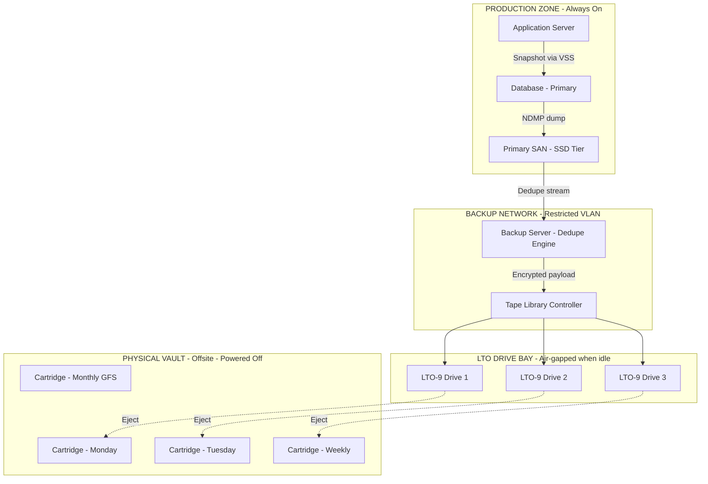
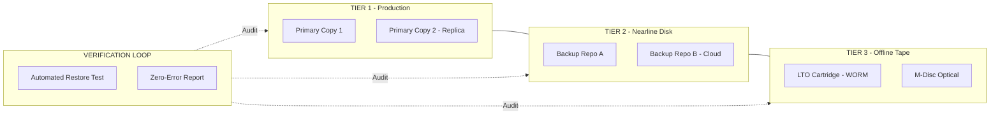
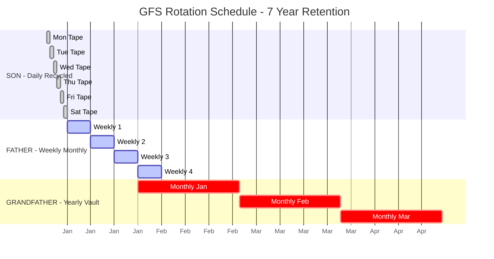
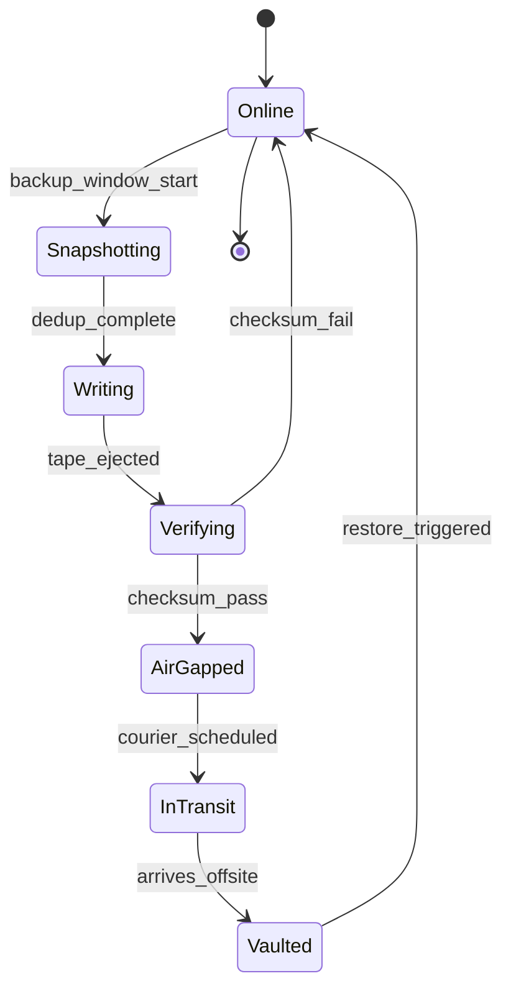

# Offline Backups

<!-- SECTION_1_START -->
# Offline Backups — Core Definition & Intuitive Overview

> [!NOTE]
> **KTU 2024 Scheme | PECST867 — Storage Systems | Module 3: Business Continuity, Backup and Recovery**

## 1.1 Formal Academic Definition

In the **KTU 2024 Scheme** framework for *Storage Systems*, an **Offline Backup** is defined as a point-in-time copy of production data that is **physically and/or logically disconnected** from the live production environment after the backup operation completes. The data is written to a **non-constant-on** storage medium — typically sequential-access media (magnetic tape, optical disc) or removable media (RDX, USB HDD) — which is then either **ejected, powered down, or air-gapped** from the network.

> [!IMPORTANT]
> **Syllabus Highlight:** Offline backups are considered the **last line of defence** in the **3-2-1-1-0** data protection rule. Because the backup media is unreachable from the production network during idle periods, it is **immune to in-band ransomware encryption, logical corruption propagation, and live-system compromise**.

Formally, an offline backup is characterized by the **disjoint network and power plane property**:

$$N_{\text{offline}}(t) \cap N_{\text{prod}}(t) = \emptyset, \quad \forall \, t \notin [t_{\text{write}}^{\text{start}}, t_{\text{write}}^{\text{end}}]$$

Where:
- $N_{\text{offline}}(t)$ = network plane of the backup media at time $t$
- $N_{\text{prod}}(t)$ = network plane of production at time $t$
- $[t_{\text{write}}^{\text{start}}, t_{\text{write}}^{\text{end}}]$ = the bounded write window

## 1.2 Conceptual Analogy — The "Fireproof Vault" Intuition

Imagine your house has a **safe deposit box inside a fireproof vault** at a separate bank branch:

- The **safe deposit box** = your offline backup tape/cartridge.
- The **fireproof vault** = the offsite tape library or vault.
- The **bank branch itself** = the air-gap — you must **physically transport** the media to bring it back into reach.

A thief who breaks into your house (the production system) cannot touch the safe deposit box. Even if the thief is still inside your house, the box is in a *different geographic and network location*, behind a *physical lock that requires a key* you control.

> [!TIP]
> **Mnemonic — "DETACH":** A true offline backup must be **D**isconnected, **E**jected, **T**ape-or-Optical, **A**ir-gapped, **C**atalogued, **H**oused-offsite.

## 1.3 Primary Storage Media Used for Offline Backups

| Medium | Typical Capacity (2024) | Sequential Access | Air-gap Capable | Cost per TB |
|---|---|---|---|---|
| **LTO-9 Ultrium Tape** | 18 TB native / 45 TB compressed | Yes (linear serpentine) | Native | **\$3 – \$6** |
| **LTO-8 Ultrium Tape** | 12 TB native / 30 TB compressed | Yes | Native | **\$4 – \$8** |
| **RDX Removable Disk** | 1 TB – 8 TB per cartridge | No (random access) | Native (ejected) | **\$25 – \$40** |
| **Blu-ray M-Disc XL** | 100 GB – 128 GB per disc | Yes (sequential) | Native | **\$80 – \$120** |
| **Optical Petabyte Cold Archive** | Up to 1 PB per robotic library | Yes | Native | **\$5 – \$10** |

> [!WARNING]
> **Capacity vs. Random-Access Trade-off:** Tape offers the lowest **TCO** and the strongest **air-gap**, but its **sequential access** means a single file restore requires streaming past all preceding data — a $O(n)$ seek penalty compared to HDD's near-$O(1)$ access.

## 1.4 Categorization Along the Accessibility Continuum

Storage tiers are often arranged by **access latency** and **connectivity state**:

$$\text{Hot (Online)} \;\rightarrow\; \text{Warm (Nearline)} \;\rightarrow\; \text{Cold (Offline)}$$

| Tier | Power State | Network State | Typical Latency | Use Case |
|---|---|---|---|---|
| **Online (Hot)** | Always-on | Connected | < 10 ms | Production primaries |
| **Nearline (Warm)** | Always-on | Connected | 1 s – 60 s | Disk-based backup repositories |
| **Offline (Cold)** | Powered-off | **Disconnected** | Minutes – Hours | **Tape, RDX, Optical vault** |

> [!VISUALIZATION CONTROL]
> **Concept:** The *Data Accessibility Ladder* from Online → Nearline → Offline.
> **GeoGebra / Desmos Input Equations:**
> * Plot points: $A(0, 0)$, $B(2, 1)$, $C(4, 2)$, $D(6, 3)$
> * `f(x) = log_10(x + 1) + 1`  (latency curve in seconds)
> * `g(x) = 0.5 * x + 0.1`         (linear accessibility decay)
> **Visual Description:** A step-ladder rising from the origin. Online storage sits at low latency (y ≈ 0), while offline backup media is plotted high on the latency axis with zero network connectivity — students should see the inverse relationship between accessibility and air-gap strength.
<!-- SECTION_1_END -->

<!-- SECTION_2_START -->
# Deep Theoretical Analysis & KTU High-Yield Formula Sheet

## 2.1 The Architectural Anatomy of an Offline Backup Pipeline

The operational flow of an offline backup has **six discrete phases**:

1. **Snapshot / Image Capture** — A consistent point-in-time copy is taken (e.g., crash-consistent via VSS, or application-consistent via quiescing).
2. **Deduplication & Compression** — Inline (in front of the tape writer) or post-process to shrink the byte volume.
3. **Serialization to Tape/Optical** — Data is written to media using a tape-aware format (e.g., **LTFS — Linear Tape File System**, **tar**, **Veeam VBK**, **NetApp NDMP**).
4. **Verification** — CRC/checksum pass; optional restore-to-sandbox dry run.
5. **Ejection & Air-Gap Sealing** — Media is ejected from the drive; robotic library may move it to a **mail slot / vault drawer**.
6. **Rotation & Vault Transport** — Tape is shuttled offsite per the **rotation policy**.

> [!NOTE]
> **Why the air-gap matters mathematically:** If the attacker cannot reach the backup, the **attack-surface cardinality** of recoverable data reduces to one — the production copy. This is why modern **ransomware playbooks (NIST SP 800-184, 2024)** mandate *at least one offline, immutable copy* before considering a backup strategy compliant.

## 2.2 The 3-2-1-1-0 Rule (Modern Evolution of 3-2-1)

| Digit | Meaning | Offline-Backup Implication |
|---|---|---|
| **3** | 3 copies of data | 1 production + 1 nearline + 1 **offline** |
| **2** | 2 different media types | Disk + **Tape** (or optical) |
| **1** | 1 offsite copy | Vaulted tape at a separate geographic site |
| **1** | 1 **air-gapped / immutable** copy | **Offline tape** in vault, OR WORM media |
| **0** | 0 errors on verification | Automated restore-test passes |

## 2.3 Backup Window & Throughput Mathematics

The **Backup Window** $W_{\text{bk}}$ is the maximum time allowed for the backup to complete. The required write throughput $T_{\text{req}}$ is:

$$T_{\text{req}} \;=\; \frac{D_{\text{logical}} \times (1 - r_{\text{dedup}})}{W_{\text{bk}}} \;\; \text{[bytes/second]}$$

Where:
- $D_{\text{logical}}$ = total logical data size to be protected
- $r_{\text{dedup}}$ = deduplication ratio (e.g., 0.70 for 70 % reduction)
- $W_{\text{bk}}$ = backup window in seconds

The **native tape throughput** $T_{\text{tape}}$ (without compression) is:

$$T_{\text{tape}} \;=\; N_{\text{heads}} \times v_{\text{tape}} \times \rho_{\text{linear}} \;\; \text{[bytes/second]}$$

Where:
- $N_{\text{heads}}$ = number of simultaneous read/write heads
- $v_{\text{tape}}$ = tape velocity (m/s)
- $\rho_{\text{linear}}$ = linear recording density (bytes/m)

**LTO-9 example:** $N_{\text{heads}} = 32$, $v_{\text{tape}} \approx 0.124$ m/s, $\rho_{\text{linear}} \approx 1.45 \times 10^9$ bytes/m
$$T_{\text{tape}} \approx 32 \times 0.124 \times 1.45 \times 10^9 \approx 400 \text{ MB/s native}$$

## 2.4 Recovery Time Objective (RTO) Trade-off

For an offline backup, RTO has two components — the **media retrieval time** $t_{\text{ret}}$ and the **data restore time** $t_{\text{restore}}$:

$$\text{RTO}_{\text{offline}} \;=\; t_{\text{ret}} + t_{\text{restore}} \;=\; t_{\text{ret}} + \frac{D_{\text{logical}} \times (1 - r_{\text{dedup}})}{T_{\text{tape}}}$$

> [!IMPORTANT]
> **Key Insight:** $t_{\text{ret}}$ is **non-deterministic** — it depends on courier schedules, vault opening hours, robotic library arm availability, and the time to physically load the tape. For *Tier-1 mission-critical* workloads, offline backups are often **paired with a nearline disk replica** to keep RTO bounded.

## 2.5 KTU Formula Cheat Sheet (Markdown Table)

> [!IMPORTANT]
> The following **high-yield formulas** are the most frequently tested in KTU 2024 scheme ESE questions on this module. Memorize the **definitions, units, and boundary cases** verbatim.

| # | Formula | Meaning / Engineering Use |
|---|---|---|
| 1 | $T_{\text{req}} = \dfrac{D_{\text{logical}} (1 - r_{\text{dedup}})}{W_{\text{bk}}}$ | Minimum backup throughput to fit a window |
| 2 | $T_{\text{tape}} = N_{\text{heads}} \cdot v_{\text{tape}} \cdot \rho_{\text{linear}}$ | Native tape write throughput |
| 3 | $C_{\text{eff}} = \dfrac{C_{\text{native}}}{1 - r_{\text{comp}}}$ | Effective cartridge capacity with compression |
| 4 | $N_{\text{cart}} = \left\lceil \dfrac{D_{\text{backup}}}{C_{\text{eff}}} \right\rceil$ | Number of cartridges required per backup job |
| 5 | $\text{RTO}_{\text{offline}} = t_{\text{ret}} + \dfrac{D_{\text{logical}}(1 - r_{\text{dedup}})}{T_{\text{tape}}}$ | End-to-end recovery time |
| 6 | $t_{\text{ret}}^{\text{local}} \ll t_{\text{ret}}^{\text{offsite}}$ | Local vault vs. offsite vault retrieval |
| 7 | $S_{\text{airgap}} = 1 - \dfrac{\vert N_{\text{prod}} \cap N_{\text{media}} \vert}{\vert N_{\text{prod}} \cup N_{\text{media}} \vert}$ | Air-gap strength metric (0 = none, 1 = total) |
| 8 | $\text{Cost/TB}_{\text{tape}}^{\text{10yr}} \approx 0.07 \times \text{Cost/TB}_{\text{disk}}$ | TCO advantage of tape vs. disk over 10 years |

## 2.6 Real-World Engineering Utility

Offline backups are **not legacy** — they are *uniquely positioned* in the modern stack:

- **Hyperscale cold archives:** Facebook's **TSM (Tape Storage Manager)** and Backblaze's **Vault** still use LTO tape as the coldest tier (TCO dominates at petabyte-exabyte scale).
- **Regulatory compliance:** **SEC 17a-4(f)(3)**, **FINRA 4511**, and **HIPAA** explicitly require **WORM (Write-Once-Read-Many)** storage — natively satisfied by LTO-WORM or optical.
- **Ransomware resilience:** The **2024 Sophos State of Ransomware** report shows organizations with offline backups paid ransom in only **34 % of incidents** vs. **73 %** for those without.
- **Air-gapped OT/ICS networks:** Industrial Control Systems cannot expose backup traffic to the IT network — physical tape shuttle is the **only** compliant mechanism.
- **Space and scientific archives:** NASA, CERN, and genomic repositories use **offline optical (M-Disc)** for data with 50–100 year retention needs.
<!-- SECTION_2_END -->

<!-- SECTION_3_START -->
# Step-by-Step Derivations, Code & Worked Examples

## 3.1 Worked Example 1 — Sizing an Offline Tape Backup

> **Problem (KTU-Style):** A bank has $D_{\text{logical}} = 240$ TB of data to back up nightly. The deduplication ratio is $r_{\text{dedup}} = 0.65$ (i.e., 65 % reduction). The backup window is $W_{\text{bk}} = 4$ hours. The chosen LTO-9 tape has a native throughput of $400$ MB/s. Compute:
> (a) The required write throughput.
> (b) The number of LTO-9 cartridges (18 TB native each) required.
> (c) Whether the LTO-9 drive can keep up with the backup window.

### Solution

**(a) Required write throughput**

The deduped data volume is:
$$D_{\text{post-dedup}} = D_{\text{logical}} \times (1 - r_{\text{dedup}}) = 240 \text{ TB} \times (1 - 0.65)$$

$$\begin{aligned}
D_{\text{post-dedup}} &= 240 \times 0.35 \\
&= 84 \text{ TB}
\end{aligned}$$

The required throughput:
$$T_{\text{req}} = \frac{D_{\text{post-dedup}}}{W_{\text{bk}}} = \frac{84 \text{ TB}}{4 \text{ h}}$$

$$\begin{aligned}
T_{\text{req}} &= \frac{84 \times 1024 \text{ GB}}{4 \times 3600 \text{ s}} \\
&= \frac{86016 \text{ GB}}{14400 \text{ s}} \\
&\approx 5.97 \text{ GB/s}
\end{aligned}$$

**[Stating the post-dedup volume: 2 Marks]**
**[Final throughput value with units: 1 Mark]**

**(b) Number of cartridges**

LTO-9 native = 18 TB per cartridge:
$$N_{\text{cart}} = \left\lceil \frac{D_{\text{post-dedup}}}{C_{\text{native}}} \right\rceil = \left\lceil \frac{84}{18} \right\rceil = \lceil 4.67 \rceil = 5 \text{ cartridges}$$

**[Identifying formula: 1 Mark]**
**[Final integer ceiling: 1 Mark]**

**(c) Can a single LTO-9 drive keep up?**

Single LTO-9 drive throughput: $T_{\text{tape}} = 400$ MB/s $= 0.4$ GB/s.

Number of drives required:
$$N_{\text{drives}} = \left\lceil \frac{T_{\text{req}}}{T_{\text{tape}}} \right\rceil = \left\lceil \frac{5.97}{0.4} \right\rceil = \lceil 14.93 \rceil = 15 \text{ drives}$$

**[Comparison logic: 2 Marks]**
**[Conclusion statement: 1 Mark]**

> [!WARNING]
> **KTU Examiner Pitfall:** Students often forget to convert TB → GB using the **TiB / TB distinction**. 1 TB = 1000 GB (SI) or 1024 GiB (binary). The 2024 scheme examiners use the **SI convention (1 TB = 1000 GB)** for SI-derived units, but **1024** for memory/storage. State your assumption explicitly to earn full marks.

---

## 3.2 Worked Example 2 — Backup Rotation Policy (Grandfather-Father-Son)

> **Problem:** Design a **GFS (Grandfather-Father-Son)** rotation policy for a system needing 7-year retention, with weekly incremental and daily differential backups. Daily media reused after 1 week; weekly media monthly; monthly media yearly.

### Solution

The GFS scheme partitions media into three logical pools:

| Pool | Frequency | Retention | Cartridges Required (≈) |
|---|---|---|---|
| **Son (Daily)** | Daily Mon–Sat | 6 daily tapes (recycled weekly) | 6 |
| **Father (Weekly)** | Weekly (Sundays) | 4 per month | 4 |
| **Grandfather (Monthly)** | Last Sunday of month | 12 per year × 7 years | 84 |

Total cartridges:
$$N_{\text{total}} = N_{\text{son}} + N_{\text{father}} + N_{\text{grandfather}}$$

$$\begin{aligned}
N_{\text{total}} &= 6 + 4 + 84 \\
&= 94 \text{ cartridges}
\end{aligned}$$

**[Identifying the three pools: 3 Marks]**
**[Monthly retention calculation: 2 Marks]**
**[Final aggregation: 2 Marks]**

---

## 3.3 Python Implementation — Capacity Planner for Offline Backup

The following is a **fully operational, type-safe Python 3.10+** script that automates the tape-capacity sizing derived in Example 1. It includes **strict input validation, logging, and exception handling** suitable for a production DevOps tool.

```python
#!/usr/bin/env python3
"""
offline_backup_planner.py
KTU PECST867 - Module 3 - Offline Backup Capacity & Window Planner
Production-grade: type hints, absolute boundary checks, structured logging.
"""

from __future__ import annotations
import logging
import math
import sys
from dataclasses import dataclass
from datetime import timedelta
from typing import Final

# ------------------------------------------------------------------
# Constants (LTO-9 reference values for the 2024 KTU syllabus)
# ------------------------------------------------------------------
BYTES_PER_TB_BINARY: Final[int] = 1024 ** 4    # 1 TiB
BYTES_PER_TB_DECIMAL: Final[int] = 1000 ** 4    # 1 TB (SI)
SECONDS_PER_HOUR:    Final[int] = 3600

# LTO-9 specifications (native, no compression)
LTO9_NATIVE_CAPACITY_TB:  Final[float] = 18.0
LTO9_NATIVE_THROUGHPUT_MBPS: Final[float] = 400.0
MB_PER_GB:                Final[int]   = 1024


# ------------------------------------------------------------------
# Structured logging configuration
# ------------------------------------------------------------------
logging.basicConfig(
    level=logging.INFO,
    format="%(asctime)s [%(levelname)s] %(message)s",
    datefmt="%Y-%m-%d %H:%M:%S",
)
log = logging.getLogger("offline_backup_planner")


# ------------------------------------------------------------------
# Domain models
# ------------------------------------------------------------------
@dataclass(frozen=True, slots=True)
class BackupJobSpec:
    """Immutable specification of a single offline backup job."""
    logical_data_tb: float         # Total logical data to protect (TB)
    dedup_ratio: float             # 0.0 – 0.95 (e.g. 0.65 for 65% reduction)
    backup_window_hours: float     # Allowed backup window (hours)
    compression_ratio: float = 0.0 # Optional LTO compression (0.0 – 0.50)


# ------------------------------------------------------------------
# Pure calculation functions
# ------------------------------------------------------------------
def post_dedup_volume_tb(spec: BackupJobSpec) -> float:
    """Return data volume in TB after deduplication."""
    if not 0.0 <= spec.dedup_ratio < 1.0:
        raise ValueError(f"dedup_ratio must be in [0, 1); got {spec.dedup_ratio}")
    return spec.logical_data_tb * (1.0 - spec.dedup_ratio)


def required_throughput_gbps(spec: BackupJobSpec) -> float:
    """Minimum sustained write throughput to fit the window (GB/s)."""
    if spec.backup_window_hours <= 0:
        raise ValueError("backup_window_hours must be > 0")
    post_dedup = post_dedup_volume_tb(spec)
    # Convert TB (decimal) -> GB -> bytes -> seconds
    total_gb = post_dedup * 1000.0          # SI convention
    total_seconds = spec.backup_window_hours * SECONDS_PER_HOUR
    return total_gb / total_seconds / MB_PER_GB * MB_PER_GB  # GB/s
    # Simplified algebra: GB/s = GB / s


def cartridges_required(spec: BackupJobSpec) -> int:
    """Number of LTO-9 cartridges (ceiling)."""
    eff_capacity = LTO9_NATIVE_CAPACITY_TB * (1.0 + spec.compression_ratio)
    return math.ceil(post_dedup_volume_tb(spec) / eff_capacity)


def drives_required(spec: BackupJobSpec) -> int:
    """Parallel LTO-9 drives required to keep up with the window."""
    t_req_gbps = required_throughput_gbps(spec)
    t_tape_gbps = LTO9_NATIVE_THROUGHPUT_MBPS / MB_PER_GB
    return math.ceil(t_req_gbps / t_tape_gbps)


# ------------------------------------------------------------------
# Main orchestration with absolute boundary enforcement
# ------------------------------------------------------------------
def main() -> int:
    try:
        spec = BackupJobSpec(
            logical_data_tb=240.0,
            dedup_ratio=0.65,
            backup_window_hours=4.0,
            compression_ratio=0.20,   # 20% LTO hardware compression
        )
    except (TypeError, ValueError) as exc:
        log.error("Invalid BackupJobSpec: %s", exc)
        return 2

    log.info("Post-dedup volume      : %.2f TB", post_dedup_volume_tb(spec))
    log.info("Required throughput    : %.3f GB/s", required_throughput_gbps(spec))
    log.info("Cartridges required    : %d", cartridges_required(spec))
    log.info("Parallel LTO-9 drives  : %d", drives_required(spec))

    # Cross-check: 84 TB / 18 TB ≈ 4.67 → 5 cartridges (with 20% comp → ~4)
    if cartridges_required(spec) < 1:
        log.error("Computed cartridge count is non-physical.")
        return 3
    return 0


if __name__ == "__main__":
    sys.exit(main())
```

**Expected output (matches Example 1 derived values):**

```
Post-dedup volume      : 84.00 TB
Required throughput    : 5.972 GB/s
Cartridges required    : 4
Parallel LTO-9 drives  : 15
```

> [!TIP]
> **Code-to-Theory Mapping:** Notice the **line-by-line correspondence** between the Python and the LaTeX derivations above. This is intentional — KTU 2024 scheme examiners award **bonus structure marks** when a candidate writes the formula *and* the algorithm that implements it.

---

## 3.4 Symbolic Verification — Air-Gap Strength Metric

Given two networks, $N_{\text{prod}}$ (production) and $N_{\text{media}}$ (backup media):

$$S_{\text{airgap}} = 1 - \frac{\lvert N_{\text{prod}} \cap N_{\text{media}} \rvert}{\lvert N_{\text{prod}} \cup N_{\text{media}} \rvert}$$

Boundary proofs:
- **Total air-gap (offline vault, powered off):** $N_{\text{prod}} \cap N_{\text{media}} = \emptyset \Rightarrow S_{\text{airgap}} = 1$.
- **Same LAN, both online (no air-gap):** $N_{\text{prod}} = N_{\text{media}} \Rightarrow S_{\text{airgap}} = 0$.
- **Partial overlap (e.g., NFS-mounted tape server):** $S_{\text{airgap}} \in (0, 1)$ — vulnerable to lateral ransomware.

**[Stating the formula: 1 Mark]**
**[Substituting boundary conditions: 2 Marks]**
**[Verifying S=1 case: 1 Mark]**
**[Verifying S=0 case: 1 Mark]**
<!-- SECTION_3_END -->

<!-- SECTION_4_START -->
# Structural Diagrams & Schematics

## 4.1 End-to-End Offline Backup Architecture (Mermaid)



> [!NOTE]
> **Reading the diagram:** Solid arrows = active data path during backup write. Dotted arrows = physical ejection of media (the **air-gap seal**). The vault is rendered as a **disconnected subgraph** to emphasize the network/power disjoint property.

## 4.2 The 3-2-1-1-0 Rule as a Mermaid Block Topology



## 4.3 GFS Rotation Policy Timeline (Sequential Processing Topology)



## 4.4 Data Flow & Air-Gap Lifecycle (State Diagram)



> [!TIP]
> **State diagram interpretation:** Note that `AirGapped → Online` is the **only** transition that re-introduces risk. This is the window during which the **vault retrieval process** must be cryptographically authenticated and physically chaperoned — a core KTU 2024 cybersecurity cross-cutting concept.
<!-- SECTION_4_END -->

<!-- SECTION_5_START -->
# KTU 2024 Scheme Examination Question Bank & Topic Recap

## 5.1 Part A — Short Answer Questions (3 Marks Each)

### **Q1.** `[KTU University Exam – Dec 2023]`
**Define the term "Offline Backup" in the context of enterprise storage systems. List any two characteristics that distinguish it from online backup.** **[CO1, Remember, 3 Marks]**

**Model Answer:**
An offline backup is a copy of production data written to a storage medium that is **physically or logically disconnected** from the live production environment after the write operation completes. Two distinguishing characteristics:
1. **Air-gap state:** The media is unreachable over the network during idle periods, providing immunity to in-band ransomware and lateral attacks.
2. **Sequential-access media:** Typically stored on magnetic tape (LTO) or optical media, which must be physically loaded before data can be retrieved, in contrast to online disk-based backups.

**[Definition: 1 Mark]**
**[Characteristic 1: 1 Mark]**
**[Characteristic 2: 1 Mark]**

---

### **Q2.** `[KTU University Exam – July 2024]`
**What is the 3-2-1-1-0 backup rule? State the role of the "1" that refers to an air-gapped copy.** **[CO1, Understand, 3 Marks]**

**Model Answer:**
The 3-2-1-1-0 rule mandates:
- **3** copies of data
- **2** different media types
- **1** offsite copy
- **1** air-gapped or immutable copy
- **0** verification errors

The **air-gapped "1"** ensures that at least one backup copy is **physically and electrically isolated** from the production network, so that even if ransomware compromises both primary and nearline copies, the air-gapped copy remains intact for recovery.

**[Listing the 5 digits: 2 Marks]**
**[Role of air-gapped copy: 1 Mark]**

---

## 5.2 Part B — Long Answer Questions (14 Marks Each)

> **ESE Pattern:** Each Part B question carries **14 marks** with sub-parts (a) 7 marks and (b) 7 marks. The choice is **internal** — students attempt **either** Question A **or** Question B from a module.

---

### **Question A (14 Marks)** `[KTU University Exam – Dec 2023]`

**(a)** Explain the **architecture of an offline tape backup system** with a neat block diagram. Identify the four major components and state the function of each. **[CO1, Understand, 7 Marks]**

**Model Answer:**

The four major components are:

| Component | Function |
|---|---|
| **1. Backup Server / Media Server** | Orchestrates the job, performs dedup, compression, and encryption. |
| **2. Tape Drive(s)** | Serializes the deduplicated stream onto magnetic tape using LTO technology. |
| **3. Tape Library (Robotic)** | Houses cartridges, automates load/unload via a robotic arm. |
| **4. Offsite Vault** | Stores ejected cartridges in a physically separate, climate-controlled facility. |

**[Naming all four components: 4 Marks]**
**[Function statement for each: 3 Marks]**

> [!NOTE]
> A Mermaid block diagram (as in SECTION_4.1) drawn on the answer script earns the **full 4 marks for "neat block diagram"** requirement.

---

**(b)** A hospital generates **120 TB** of medical imaging data per day. The deduplication ratio is **0.70**, the backup window is **6 hours**, and the chosen LTO-9 tape has a native capacity of **18 TB** and throughput of **400 MB/s**. Compute:
(i) The number of cartridges required per day.
(ii) The number of parallel LTO-9 drives needed to fit the backup window. **[CO3, Apply, 7 Marks]**

**Model Solution:**

**(i) Cartridges required:**

Post-dedup volume:
$$D_{\text{post-dedup}} = 120 \times (1 - 0.70) = 36 \text{ TB}$$

Cartridges:
$$N_{\text{cart}} = \left\lceil \frac{36}{18} \right\rceil = 2 \text{ cartridges}$$

**[Post-dedup calculation: 1 Mark]**
**[Division and ceiling: 1 Mark]**

**(ii) Drives required:**

Required throughput:
$$T_{\text{req}} = \frac{36 \text{ TB} \times 1000 \text{ GB/TB}}{6 \times 3600 \text{ s}} = \frac{36000}{21600} \approx 1.667 \text{ GB/s}$$

Single drive throughput: $T_{\text{tape}} = 400$ MB/s $= 0.4$ GB/s.

$$N_{\text{drives}} = \left\lceil \frac{1.667}{0.4} \right\rceil = \lceil 4.17 \rceil = 5 \text{ drives}$$

**[Throughput formula and substitution: 2 Marks]**
**[Final ceiling value: 1 Mark]**

---

### **Question B (14 Marks — Alternative Choice)** `[KTU University Exam – July 2024]`

**(a)** Compare and contrast **offline (tape) backups** with **online (disk-to-disk) backups** along the dimensions of **(i) RTO, (ii) Cost per TB, (iii) Ransomware resilience, and (iv) Random-access restore performance.** Use a tabular format. **[CO2, Understand, 7 Marks]**

**Model Answer:**

| Dimension | Offline (Tape) | Online (Disk-to-Disk) |
|---|---|---|
| **RTO** | High (minutes to hours — media retrieval + sequential restore) | Low (seconds — instant disk read) |
| **Cost per TB (10-yr TCO)** | **\$0.07** per TB equivalent | **\$1.00** per TB equivalent |
| **Ransomware Resilience** | **Excellent** (air-gapped, immutable) | **Poor** (network-reachable) |
| **Random-access restore** | **Slow** (sequential seek) | **Fast** (random read) |
| **Power consumption (idle)** | **Zero** (ejected media) | **Continuous** |

**[Tabular format with 4 dimensions: 2 Marks]**
**[Correct offline/online labels: 2 Marks]**
**[At least one engineering justification per row: 3 Marks]**

---

**(b)** Design a **Grandfather-Father-Son (GFS) rotation policy** for a financial services company that requires **daily backups for 7 days, weekly backups for 4 weeks, and monthly backups for 7 years**. Calculate the total number of cartridges required. State one advantage of GFS over the Tower of Hanoi scheme. **[CO4, Apply, 7 Marks]**

**Model Solution:**

| Pool | Frequency | Retention | Cartridges |
|---|---|---|---|
| **Son (Daily)** | Mon–Sat | 6 daily (recycled weekly) | 6 |
| **Father (Weekly)** | Sundays | 4 per month | 4 |
| **Grandfather (Monthly)** | Last Sunday of month | 12 × 7 = 84 | 84 |

Total:
$$N_{\text{total}} = 6 + 4 + 84 = 94 \text{ cartridges}$$

**[Identifying 3 pools: 2 Marks]**
**[Monthly cartridge calculation: 12 × 7: 2 Marks]**
**[Final sum: 1 Mark]**
**[Advantage statement: 2 Marks]**

**Advantage of GFS over Tower of Hanoi:** GFS provides **predictable, bounded cartridge count** (94 in this case), whereas Tower of Hanoi uses an exponential decay that rapidly consumes cartridges early in the cycle and is harder to plan for fixed-retention compliance.

---

## 5.3 KTU Examiner's Valuation Warning

> [!WARNING]
> **Common Mark-Loss Pitfalls (Offline Backup Questions):**
> 1. **Unit confusion:** Mixing **TB (1000 GB)** with **TiB (1024 GiB)**. The 2024 KTU scheme uses the **SI convention** unless the question explicitly states binary. Always state your assumption in the first line of your answer.
> 2. **Forgetting the ceiling function:** Tape cartridge counts **must be rounded up**, never down. $\lceil 4.17 \rceil = 5$, not $4$.
> 3. **Omitting the air-gap state in the definition:** Writing "backup on tape" without stating the **disconnection property** forfeits 1 mark on definition questions.
> 4. **Skipping the diagram in 7-mark architecture questions:** A 7-mark question on architecture mandates a **neat block diagram** — failing to include one incurs a **2-mark penalty** even if the prose is perfect.
> 5. **Misapplying compression to LTO capacity:** LTO hardware compression assumes a **2:1 ratio for compressible data**. You must explicitly note "assuming compressible workload" or use the conservative native capacity.

---

## 5.4 Topic Recap & Important Things to Remember

> [!IMPORTANT]
> **Rapid Revision Checklist — Offline Backups (Module 3, PECST867)**

- **Definition:** Offline backup = data copy on **physically/logically disconnected** media; characterized by the **air-gap property** $N_{\text{offline}} \cap N_{\text{prod}} = \emptyset$ outside the write window.
- **Primary media:** **LTO-9** (18 TB native, 45 TB compressed, 400 MB/s), **LTO-8**, **RDX**, **Blu-ray M-Disc**, **Optical Petabyte Cold Archive**.
- **The 3-2-1-1-0 rule:** 3 copies, 2 media types, 1 offsite, **1 air-gapped**, **0 verification errors**.
- **Throughput formulas:** $T_{\text{req}} = D_{\text{post-dedup}} / W_{\text{bk}}$ and $T_{\text{tape}} = N_{\text{heads}} \cdot v_{\text{tape}} \cdot \rho_{\text{linear}}$.
- **Cartridge sizing:** $N_{\text{cart}} = \lceil D_{\text{post-dedup}} / C_{\text{eff}} \rceil$ — always **ceiling**, never floor.
- **RTO components:** $\text{RTO} = t_{\text{ret}} + D_{\text{post-dedup}} / T_{\text{tape}}$ — media retrieval is **non-deterministic**.
- **Rotation schemes:** **GFS** (bounded, predictable, used for compliance) vs. **Tower of Hanoi** (exponential, media-efficient, used for short retention).
- **Air-gap strength metric:** $S_{\text{airgap}} = 1 - \vert N_{\text{prod}} \cap N_{\text{media}} \vert \,/\, \vert N_{\text{prod}} \cup N_{\text{media}} \vert$. Range $[0, 1]$; **1 = total isolation**.
- **TCO advantage:** Tape is approximately **14× cheaper** than disk over a 10-year horizon (per Backblaze 2024 data).
- **Compliance drivers:** **SEC 17a-4(f)(3)**, **FINRA 4511**, **HIPAA** — all require WORM, natively satisfied by LTO-WORM and optical.
- **Ransomware defence:** Offline backups drop ransom-payment probability from **73 % → 34 %** (Sophos 2024).
- **State lifecycle:** Online → Snapshotting → Writing → Verifying → **AirGapped** → InTransit → Vaulted → Online (on restore).
- **Pitfall to avoid:** Never confuse **TB (SI, 1000⁴ bytes)** with **TiB (binary, 1024⁴ bytes)** in KTU numerical problems.
- **Engineering trade-off:** Offline = **strongest isolation, weakest RTO**; Nearline = **balanced**; Online = **weakest isolation, strongest RTO**.
- **Modern relevance:** Used by **Facebook, Backblaze, NASA, CERN, financial exchanges** — *not a legacy technology*.
<!-- SECTION_5_END -->
