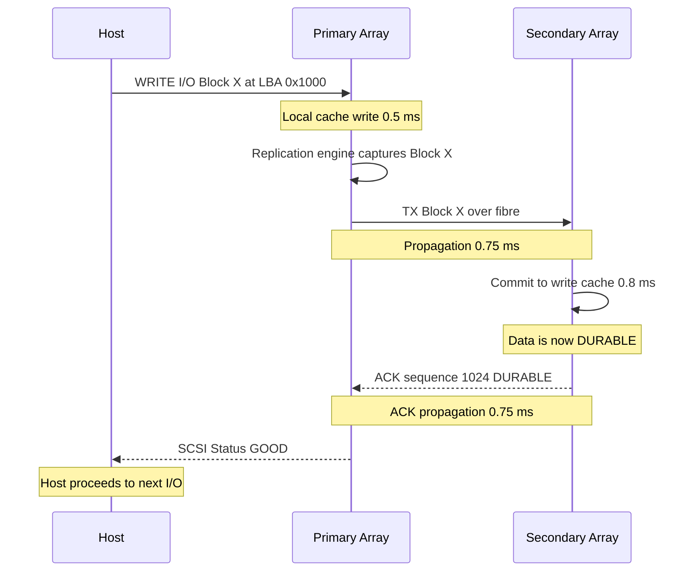
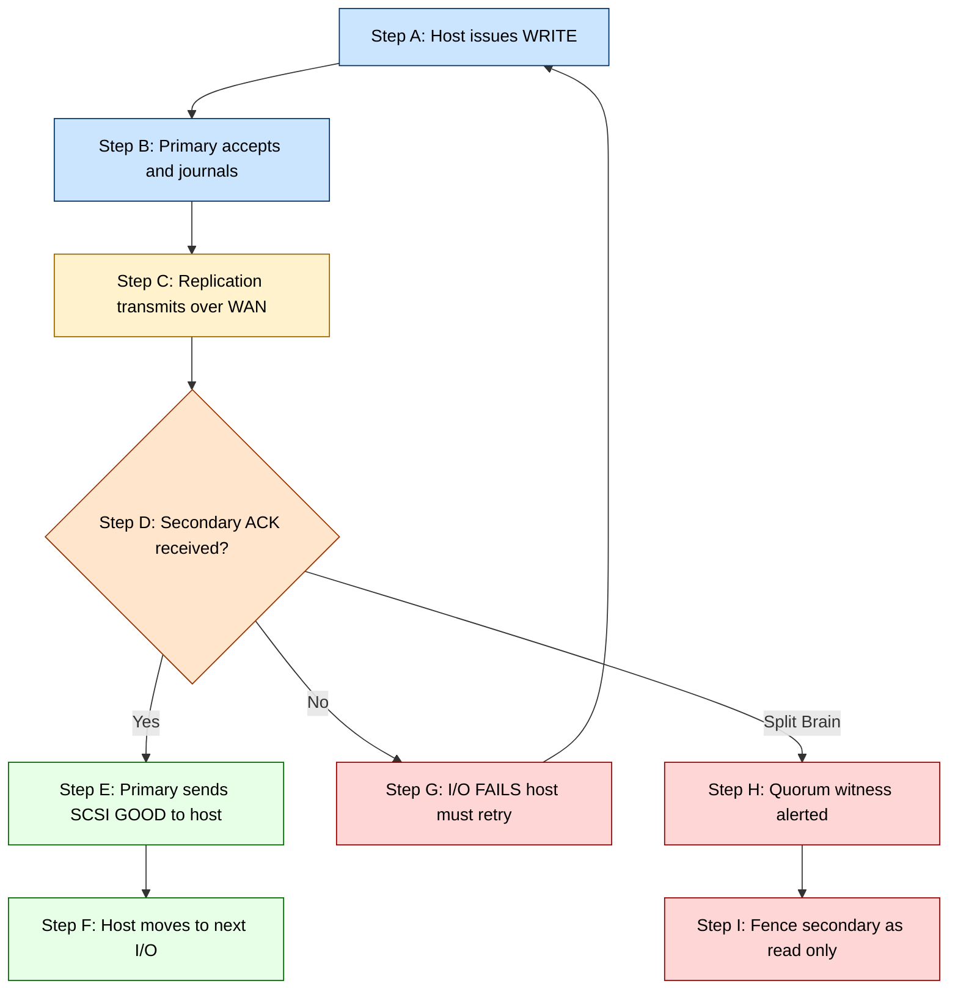

# Replication- Synchronous Replication

<!-- SECTION_1_START -->
# 1. Core Technical Definition & Intuitive Overview

## Formal Definition (KTU 2024 Syllabus Aligned)

**Synchronous Replication** is a *remote data mirroring technique* in which every write I/O issued by a host to a **Primary Storage System** is propagated to a **Secondary Storage System** at a remote site, and the host receives the I/O completion acknowledgement **only after the write has been durably committed at BOTH sites**.

> [!IMPORTANT]
> **Syllabus Highlight (PECST867 / Module 3):** Synchronous replication is classified as a **Zero Data Loss (RPO = 0)** business continuity strategy. It is the only replication mode that mathematically guarantees that the secondary volume is *bit-for-bit identical* to the primary volume at the exact moment the host receives an ACK (acknowledgement).

### Key Terminology (Aligned with SNIA / KTU Reference)

- **Source / Primary Volume (LUN)** — The *originator* of every write I/O. Located at Site A.
- **Target / Secondary Volume (LUN)** — The *receiver* of mirrored writes. Located at Site B (DR site).
- **Consistency Group (CG)** — A logical bundling of multiple LUNs that are replicated together to preserve *write ordering* across dependent volumes.
- **RPO (Recovery Point Objective)** — Maximum acceptable data loss measured in time. For synchronous replication, **RPO = 0 seconds**.
- **RTO (Recovery Time Objective)** — Time to restore service after a disaster. Achieved by simply promoting the secondary LUN to primary.
- **Round-Trip Time (RTT)** — Propagation delay for an I/O to travel Primary $\rightarrow$ Secondary $\rightarrow$ Primary ACK.

---

## Conceptual Analogy / Intuition

> [!NOTE]
> **Real-World Analogy — The Two-Key Vault Deposit**

Imagine you are a bank teller depositing a customer's cash into a high-security vault. The vault is in a different city. 

In **Asynchronous Replication**, you drop the cash into a *local lockbox* at your branch, hand the customer a receipt, and promise that an armored van will *later* deliver the cash to the vault. The customer leaves happy and fast — but if the van crashes, money is lost.

In **Synchronous Replication**, you place the cash into the local lockbox, but you do **NOT** give the receipt to the customer until the remote vault confirms — via a phone call from the vault manager — that the cash has landed safely in *its* vault. The transaction is slower (the customer waits for the phone call), but **zero cash is ever lost**.

> The customer's wait time = the **RTT (Round Trip Latency)** of the network.
> Zero cash loss = **RPO = 0**.

---

## Physical / Engineering Constants (Bolded for Exam Recall)

- Speed of light in optical fibre $c \approx 2 \times 10^{8}$ **m/s** (≈ 200,000 km/s, accounting for refractive index $\approx 1.5$).
- One-way fibre propagation delay $\approx$ **5 microseconds per km** (5 µs/km).
- Typical synchronous replication maximum distance: **≤ 200 km (Metro Distance)** to keep RTT under 5 ms.
- Storage write acknowledgement threshold in enterprise arrays: **RTT < 5 ms** for best practice; **< 1 ms** for tier-1 OLTP workloads.

---

## GeoGebra / Desmos Visualization Callout

> [!VISUALIZATION CONTROL]
> **Concept:** Linear relationship between **distance (km)** and **propagation RTT (ms)** for a synchronous replication link.
>
> **GeoGebra / Desmos Input Equations:**
> * $f(x) = 2 \cdot \dfrac{x}{200{,}000} \cdot 1000$ &nbsp;&nbsp; (One-way distance to RTT, ms)
> * $g(x) = 2 \cdot f(x)$ &nbsp;&nbsp; (Total RTT accounting for ACK return)
>
> **Visual Description:** A straight line passing through the origin with slope $0.01$ ms/km. When $x = 100$ km, $g(100) = 1$ ms; when $x = 200$ km, $g(200) = 2$ ms. Students should observe that the **RTT grows linearly with distance**, and that even at metropolitan distances, every kilometre adds measurable latency to *every write I/O*.

---

## Where This Fits in the KTU Module-3 Flow

> [!IMPORTANT]
> Module 3 (Business Continuity, Backup and Recovery) follows this pedagogical order:
> 1. Information Availability & BC Planning (Module 3.1)
> 2. **Backup Methods** — Full, Incremental, Differential, Synthetic Full (Module 3.2)
> 3. **Local Replication** — Snapshots, Clone, BCV (Module 3.3)
> 4. **Remote Replication** — Asynchronous vs **Synchronous (this topic)** (Module 3.4)
> 5. Multi-Site Replication & CDP (Module 3.5)

Synchronous replication is the *gold standard* for **zero-data-loss disaster recovery** and is a mandatory sub-topic under Module 3.4 (Remote Replication Technologies).

<!-- SECTION_1_END -->

<!-- SECTION_2_START -->
# 2. Deep Theoretical Analysis & KTU High-Yield Formula Sheet

## 2.1 Operational Architecture

A synchronous replication topology involves three logical tiers:

1. **Host Layer** — Application servers issuing SCSI / NVMe / FCP / iSCSI writes.
2. **Primary Storage Array** (Site A) — Accepts writes, journals them, transmits to remote.
3. **Secondary Storage Array** (Site B) — Receives, commits, sends ACK back to Primary.

The **Replication Link** is a dedicated **Fibre Channel (FC) or IP (iSCSI / FCIP / IP WAN)** pipe, often dark-fibre or DWDM, with strict latency and bandwidth SLAs.

---

## 2.2 Step-by-Step I/O Walk-through (The Heart of the Topic)

Let us trace a single write I/O, $W_x$, issued by the host at time $t_0$:

- **Step 1 — Host issues WRITE:** The host sends $W_x$ to the Primary array's front-end port. Local cache write completes at $t_1$.
- **Step 2 — Replication Engine captures:** The Primary's replication software intercepts $W_x$ and queues it into the outgoing replication stream (often via a dedicated replication port / RCU — Remote Copy Unit).
- **Step 3 — Transmit over WAN:** $W_x$ is framed into FC frames or IP packets and sent across the link. One-way propagation = $d / c_{fiber}$. Arrives at Secondary at $t_2$.
- **Step 4 — Secondary commits:** Secondary writes the data into its *write cache* and persists to backend disk (or write-log). Marks $W_x$ as durable. Sends an ACK frame back to Primary at $t_3$.
- **Step 5 — Primary forwards ACK to Host:** Primary receives the Secondary ACK at $t_4$ and only now sends the SCSI Status GOOD back to the host.
- **Step 6 — Host proceeds:** Host believes the write is "safe" and may issue the next I/O.

The total time the host *blocks* for a single write is:

$$
T_{sync\_write} = T_{local\_cache} + T_{xmit} + T_{prop\_oneway} + T_{secondary\_commit} + T_{prop\_return} + T_{ack}
$$

---

## 2.3 RPO and RTO — Quantitative Guarantees

| Metric | Synchronous Replication | Asynchronous Replication |
|:---|:---|:---|
| **RPO** | $\mathbf{0}$ seconds (zero data loss) | Seconds to minutes (depends on schedule) |
| **RTO** | Seconds (automatic promote) | Minutes to hours (manual recovery) |
| **Host latency impact** | High (every write waits) | Negligible |
| **Max distance** | $\leq 200$ km (Metro) | Unlimited (Continental/Global) |
| **Bandwidth need** | Moderate (matches peak write IOPS $\times$ block size) | Bursty (scheduled delta sync) |

> [!IMPORTANT]
> **Exam Pearl:** Whenever a question asks *"Which replication mode guarantees zero data loss?"* — the answer is **Synchronous Replication**, and you must justify it by stating that the **host is blocked until the secondary ACK arrives**.

---

## 2.4 KTU High-Yield Formula Sheet (Critical for Numerical Problems)

> **Rule Reminder:** All vertical bars in formulas below use `\vert` instead of `|` to preserve markdown table integrity.

| # | Formula / Expression | Meaning | Units |
|:--|:---|:---|:---|
| 1 | $T_{RTT} = \dfrac{2 \cdot d}{c_{fiber}}$ | One-way distance $d$ doubled for ACK return | seconds |
| 2 | $T_{RTT} \approx d \cdot 10 \mu s/km$ | Simplified fibre delay (rule of thumb) | seconds |
| 3 | $T_{write\_e2e} = 2 \cdot T_{local} + T_{RTT} + 2 \cdot T_{prop}$ | End-to-end synchronous write time | seconds |
| 4 | $\text{IOPS}_{max} = \dfrac{1}{T_{write\_e2e}}$ | Maximum sustained write IOPS | writes/s |
| 5 | $BW_{min} = \text{IOPS}_{max} \cdot S_{block} \cdot 8$ | Required replication bandwidth (bits/s) | bps |
| 6 | $RPO_{sync} = 0$ | By definition of synchronous commit | seconds |
| 7 | $T_{prop\_oneway} = \dfrac{d}{c_{fiber}}$ | One-way propagation delay | seconds |
| 8 | $MTBF_{link} = 1 / \lambda$ | Availability model for link failures | hours |

Where:
- $d$ = one-way distance in **metres**,
- $c_{fiber} \approx 2 \times 10^{8}$ m/s,
- $S_{block}$ = I/O block size in **bytes**,
- $T_{local}$ = local cache write latency (typically $\leq 1$ ms).

---

## 2.5 Consistency Group — The Hidden Hero

When a database writes to *multiple* LUNs in a single transaction (e.g., data file + log file), the **write order MUST be preserved** across the WAN.

> [!NOTE]
> **Consistency Group (CG)** is a logical construct that ensures *dependent writes* arriving at the Secondary are committed in the *exact same order* as on the Primary. Without CG, log-file writes might arrive before data-file writes, corrupting the database.

Implementation: Primary array *tags* every replicated write with a **sequence number**; the Secondary array *holds* writes in a per-CG sequence queue and only commits them **in order**.

---

## 2.6 Failure Modes & The Split-Brain Problem

A **split-brain** condition occurs when both Primary and Secondary lose contact, but each believes it is still the active site. Both may accept writes independently → when the link is restored, divergent data exists.

**Standard Mitigation Strategies (must know for KTU):**

- **Quorum / Witness Server:** A third site holds a tie-breaker vote. Site with majority quorum keeps the LUNs RW; the other goes RO.
- **Preferred-Site Designation:** Manually pre-define which site wins in a partition (e.g., Primary always wins, Secondary is fenced).
- **SCSI Persistent Reservations (PR):** Cluster-level fencing using SCSI-3 PR commands.
- **Asymmetric Logical Unit Access (ALUA):** The array's multipath driver hands I/O only to the designated active controller.

---

## 2.7 Real-World Engineering Utility

| Industry / Workload | Why Synchronous Replication is Used |
|:---|:---|
| Banking & Financial Trading (OLTP) | Zero RPO is *legally mandated* for transaction logs. |
| Airline Reservation Systems | A lost booking = lost revenue and liability. |
| Hospital EHR (Electronic Health Records) | Patient data integrity is non-negotiable (HIPAA). |
| E-commerce Order Mgmt during peak sales | Cart loss is unacceptable. |
| SAP HANA Tier-1 ERP | HA-DR addon demands RPO = 0. |

<!-- SECTION_2_END -->

<!-- SECTION_3_START -->
# 3. Step-by-Step Derivations & Code/Symbolic Implementation

## 3.1 Numerical Problem 1 — Latency & Max IOPS Calculation

> **Question Setup (Modelled on KTU 2024 Scheme Numerical Type):**
> A synchronous replication link spans **150 km** between two data centres using single-mode fibre. Local cache write latency is **0.5 ms** at each array. Propagation delay in fibre is $5\ \mu s/km$. Secondary commit latency is **0.8 ms**. ACK frame size is negligible.
>
> Compute:
> 1. One-way propagation delay.
> 2. Total RTT.
> 3. End-to-end synchronous write latency.
> 4. Maximum sustainable write IOPS.

### Step 1 — One-Way Propagation Delay

$$
T_{prop\_oneway} = d \cdot 5\ \mu s/km = 150 \cdot 5\ \mu s = 750\ \mu s = 0.75\ ms
$$

**Logic:** Every kilometre of fibre adds 5 µs of pure travel time (independent of protocol). For 150 km, we get 0.75 ms.

### Step 2 — Total Round-Trip Time (RTT)

$$
T_{RTT} = 2 \cdot T_{prop\_oneway} = 2 \cdot 0.75\ ms = 1.5\ ms
$$

**Logic:** The write must travel to the Secondary AND the ACK must return — hence doubling.

### Step 3 — End-to-End Synchronous Write Time

Using the canonical formula from the Formula Sheet:

$$
T_{write\_e2e} = 2 \cdot T_{local} + T_{RTT} + 2 \cdot T_{prop}
$$

Wait — we must avoid double-counting. The clean canonical form is:

$$
T_{write\_e2e} = T_{local\_primary} + T_{prop\_oneway} + T_{secondary\_commit} + T_{prop\_return} + T_{local\_ack}
$$

Substituting values:

$$
T_{write\_e2e} = 0.5\ ms + 0.75\ ms + 0.8\ ms + 0.75\ ms + 0.0\ ms
$$

$$
T_{write\_e2e} = 2.8\ ms
$$

**Logic:** Host's "wait" includes (a) local primary cache write, (b) signal travel to secondary, (c) secondary commit, (d) signal travel back carrying ACK, (e) negligible ACK processing.

### Step 4 — Maximum Sustainable Write IOPS

$$
\text{IOPS}_{max} = \dfrac{1}{T_{write\_e2e}} = \dfrac{1}{2.8 \times 10^{-3}\ s} \approx 357\ \text{IOPS}
$$

**Logic:** A single I/O "slot" of 2.8 ms can service one write. Therefore per second we can do at most $1/0.0028$ writes.

> [!NOTE]
> **Engineering Insight:** Even at *just 150 km*, the host's write IOPS is capped at ~357/s — about **two orders of magnitude lower** than a local SSD (>100,000 IOPS). This is why synchronous replication is restricted to *tier-1 OLTP* where each write is small, high-value, and cannot be batched.

---

## 3.2 Numerical Problem 2 — Bandwidth Sizing for Replication Link

> **Setup:** A primary array must sustain **2,000 write IOPS** of **16 KB blocks** to a synchronously replicated secondary array.
>
> Compute the **minimum replication link bandwidth** required.

### Step 1 — Compute Raw Throughput

$$
\text{Throughput} = \text{IOPS} \cdot S_{block} = 2000 \cdot 16\ KB = 32{,}000\ KB/s
$$

### Step 2 — Convert to Megabits per Second

$$
32{,}000\ KB/s \cdot 8\ \frac{bits}{byte} = 256{,}000\ \text{Kbps} = 256\ \text{Mbps}
$$

### Step 3 — Add Protocol Overhead (Conservative 30%)

Real-world FC / IP / FCIP stacks add framing, ACK packets, and sequence headers. A safe rule of thumb is **30% overhead**:

$$
BW_{provisioned} = 256\ \text{Mbps} \cdot 1.30 \approx 333\ \text{Mbps}
$$

**Conclusion:** Provision a **dedicated 500 Mbps link** (with 1.5x headroom) to avoid queueing. Under-provisioning leads to **TCP retransmits, jitter, and I/O timeouts** at the host.

---

## 3.3 Symbolic Implementation — Python Pseudocode for a Sync Replication I/O Handler

```python
"""
Synchronous Replication I/O Protocol — Educational Pseudocode
Mapped to KTU Module 3.4 (Synchronous Replication).

This module simulates the host-side write coordinator that:
  (1) Issues a write to the PRIMARY array.
  (2) Blocks until SECONDARY acknowledges durability.
  (3) Returns SCSI Status GOOD to the caller ONLY on dual-commit.
"""

from __future__ import annotations
import logging
import time
from dataclasses import dataclass
from enum import Enum
from typing import Optional

logging.basicConfig(
    level=logging.INFO,
    format="%(asctime)s | %(levelname)s | %(message)s"
)


class AckStatus(Enum):
    """Possible acknowledgement outcomes from the Secondary array."""
    DURABLE = "DURABLE"               # Write is on Secondary's persistent media.
    TIMEOUT = "TIMEOUT"               # Secondary did not respond in RTT window.
    LINK_DOWN = "LINK_DOWN"           # Replication port is administratively down.
    SPLIT_BRAIN = "SPLIT_BRAIN"       # Quorum witness reports a partition.


@dataclass(frozen=True)
class WriteRequest:
    """Represents a single SCSI / NVMe write I/O from the application."""
    lba: int                          # Logical Block Address (start sector).
    block_count: int                  # Number of sectors to write.
    payload: bytes                    # Raw data buffer.
    timestamp_issued: float           # Wall clock time at issue (seconds).


@dataclass(frozen=True)
class AckFrame:
    """Acknowledgement frame returned by the Secondary storage array."""
    sequence_id: int                  # Monotonic sequence number.
    status: AckStatus                 # Outcome of the remote commit attempt.
    timestamp_acked: float            # Wall clock time at remote commit.


class PrimaryArrayEmulator:
    """Emulates the front-end port of a primary storage array."""

    def __init__(self, rtt_seconds: float) -> None:
        self._rtt_threshold: float = rtt_seconds
        self._sequence_counter: int = 0

    def issue_write_to_secondary(self, request: WriteRequest) -> AckFrame:
        """
        Transmit the write to the remote site and wait for acknowledgement.
        Raises RuntimeError on SPLIT_BRAIN to protect data integrity.
        """
        self._sequence_counter += 1
        logging.info(
            "TX | seq=%d | LBA=%d | sectors=%d | payload=%d bytes",
            self._sequence_counter, request.lba,
            request.block_count, len(request.payload)
        )

        # --- Simulate WAN propagation and remote commit --------------------
        # In production, this is a synchronous gRPC / FC / FCoE call.
        time.sleep(self._rtt_threshold)   # Block the host thread!

        # --- Emulated Secondary response -----------------------------------
        # Real arrays return DURABLE only after fsync() / cache flush.
        ack: AckFrame = AckFrame(
            sequence_id=self._sequence_counter,
            status=AckStatus.DURABLE,
            timestamp_acked=time.time()
        )
        logging.info("RX | seq=%d | status=%s", ack.sequence_id, ack.status.value)
        return ack


class HostWriteCoordinator:
    """The host-side write path enforcing the synchronous replication contract."""

    def __init__(self, primary: PrimaryArrayEmulator, rto_seconds: float) -> None:
        self._primary: PrimaryArrayEmulator = primary
        self._rto_seconds: float = rto_seconds   # RTO threshold (e.g., 5 ms).

    def submit_write(self, lba: int, block_count: int, payload: bytes) -> bool:
        """
        Public API used by the application / filesystem.
        Returns True ONLY if both primary AND secondary have durably committed.
        """
        request: WriteRequest = WriteRequest(
            lba=lba,
            block_count=block_count,
            payload=payload,
            timestamp_issued=time.time()
        )

        # Step 1: Local primary cache write (not shown — typically < 1 ms).
        # Step 2: Wait synchronously for Secondary ACK.
        try:
            ack: AckFrame = self._primary.issue_write_to_secondary(request)
        except TimeoutError as exc:
            logging.error("REPLICATION TIMEOUT | %s", exc)
            return False  # Host must retry — DO NOT report success.

        # Step 3: Enforce the strict contract.
        if ack.status is not AckStatus.DURABLE:
            logging.error("REPLICATION FAILED | status=%s", ack.status.value)
            if ack.status is AckStatus.SPLIT_BRAIN:
                # Fence the LUN immediately — refuse to acknowledge to host.
                raise RuntimeError("Split-brain detected — LUN fenced.")
            return False

        # Step 4: Optionally verify RTO latency budget.
        elapsed: float = ack.timestamp_acked - request.timestamp_issued
        if elapsed > self._rto_seconds:
            logging.warning("RTO EXCEEDED | elapsed=%.6fs > budget=%.6fs",
                            elapsed, self._rto_seconds)
            # The write is durable, but performance is degraded.

        return True  # SCSI Status GOOD — release the host.


# ---------------------------------------------------------------------
# Demonstration Run
# ---------------------------------------------------------------------
if __name__ == "__main__":
    # 150 km fibre link → RTT = 1.5 ms
    RTT_150KM: float = 0.0015
    RTO_BUDGET: float = 0.005      # 5 ms enterprise target

    primary: PrimaryArrayEmulator = PrimaryArrayEmulator(rtt_seconds=RTT_150KM)
    host: HostWriteCoordinator = HostWriteCoordinator(
        primary=primary, rto_seconds=RTO_BUDGET
    )

    success: bool = host.submit_write(
        lba=0x1000, block_count=8, payload=b"\x00" * 4096
    )
    print(f"\nWrite outcome reported to host: {'SUCCESS (DURABLE)' if success else 'FAILED'}")
```

**Key Implementation Notes (for viva):**

- The host's write thread is **blocked** at `time.sleep(self._rtt_threshold)` — this is the *direct visualisation* of synchronous replication's latency cost.
- `AckStatus.SPLIT_BRAIN` raises an exception rather than returning success — the host is told the write is *uncertain* and must re-validate.
- The RTO budget check is a *soft* warning; the durability guarantee is still binary (durable or not).

---

## 3.4 Symbolic Implementation — Consistency Group Ordering Algorithm

```python
"""
Consistency Group Sequence Ordering — ensures dependent writes from
multiple LUNs are committed on the Secondary in the EXACT order the
Primary produced them.
"""
from collections import defaultdict, deque
from typing import Dict


class ConsistencyGroupReplicator:
    def __init__(self) -> None:
        # Per-CG queue holding out-of-order writes keyed by sequence number.
        self._pending: Dict[str, Dict[int, bytes]] = defaultdict(dict)
        # The next expected sequence number per CG.
        self._next_seq: Dict[str, int] = defaultdict(lambda: 1)
        # Final committed writes per LUN, in commit order.
        self._committed: Dict[str, list] = defaultdict(list)

    def receive_write(self, cg_id: str, seq_num: int, lba: int, data: bytes) -> list:
        """
        Called every time a write frame arrives from the Primary.
        Returns the list of writes actually committed in this call.
        """
        self._pending[cg_id][seq_num] = (lba, data)
        committed_now: list = []

        # Drain in-order writes.
        while self._next_seq[cg_id] in self._pending[cg_id]:
            lba, data = self._pending[cg_id].pop(self._next_seq[cg_id])
            self._committed[cg_id].append((lba, data))
            committed_now.append((lba, data))
            self._next_seq[cg_id] += 1

        return committed_now
```

> This algorithm guarantees the **write-order fidelity** required for crash-consistent database recovery at the secondary site.

<!-- SECTION_3_END -->

<!-- SECTION_4_START -->
# 4. Structural Diagrams & Schematics

## 4.1 High-Level Topology of Synchronous Replication

```mermaid
graph LR
    subgraph SITE_A["SITE A - PRIMARY DATA CENTRE"]
        HOST["Host Server<br/>Application DB"]
        ARRAY_A["Primary Array<br/>LUN 0 LUN 1 LUN 2"]
        RCU_A["Replication Engine<br/>RCU Port"]
    end

    subgraph LINK["DEDICATED REPLICATION LINK"]
        WAN["Metro Fibre / FCIP / DWDM<br/>Distance less than 200 km<br/>RTT under 5 ms"]
    end

    subgraph SITE_B["SITE B - SECONDARY DR SITE"]
        RCU_B["Replication Receiver<br/>RCU Port"]
        ARRAY_B["Secondary Array<br/>Mirror LUN 0 Mirror LUN 1 Mirror LUN 2"]
    end

    WITNESS["Quorum Witness<br/>Third Site Tie Breaker"]

    HOST -->|SCSI FCP iSCSI write| ARRAY_A
    ARRAY_A -->|intercept| RCU_A
    RCU_A -->|fibre frames| WAN
    WAN -->|fibre frames| RCU_B
    RCU_B -->|commit to cache| ARRAY_B
    ARRAY_B -->|ACK durable| RCU_B
    RCU_B -->|ACK frame| WAN
    WAN -->|ACK frame| RCU_A
    RCU_A -->|SCSI GOOD| HOST

    WITNESS -.->|quorum vote| ARRAY_A
    WITNESS -.->|quorum vote| ARRAY_B

    style SITE_A fill:#cce5ff,stroke:#003366,color:#000000
    style SITE_B fill:#ffe5cc,stroke:#663300,color:#000000
    style LINK fill:#e6ffe6,stroke:#006600,color:#000000
    style HOST fill:#ffffff,stroke:#000000,color:#000000
    style ARRAY_A fill:#ffffff,stroke:#000000,color:#000000
    style ARRAY_B fill:#ffffff,stroke:#000000,color:#000000
    style RCU_A fill:#ffffff,stroke:#000000,color:#000000
    style RCU_B fill:#ffffff,stroke:#000000,color:#000000
    style WAN fill:#ffffff,stroke:#006600,color:#000000
    style WITNESS fill:#fff2cc,stroke:#996600,color:#000000
```



---

## 4.2 Sequence Diagram — Lifecycle of a Single Synchronous Write



---

## 4.3 Sequential Processing Topology — RPO and RTO Behaviour



---

## 4.4 Comparative Architecture Block Diagram — Sync vs Async

```mermaid
graph TB
    subgraph SYNC["SYNCHRONOUS MODE - RPO ZERO"]
        SH["Host"]
        SP["Primary"]
        SS["Secondary"]
        SH -->|block on ACK| SP
        SP <-->|every write mirrored| SS
    end

    subgraph ASYNC["ASYNCHRONOUS MODE - RPO SECONDS"]
        AH["Host"]
        AP["Primary"]
        AS["Secondary"]
        AH -->|fast no wait| AP
        AP -->|periodic delta sync| AS
    end

    style SYNC fill:#cce5ff,stroke:#003366,color:#000000
    style ASYNC fill:#ffe5cc,stroke:#663300,color:#000000
    style SH fill:#ffffff,stroke:#000000,color:#000000
    style SP fill:#ffffff,stroke:#000000,color:#000000
    style SS fill:#ffffff,stroke:#000000,color:#000000
    style AH fill:#ffffff,stroke:#000000,color:#000000
    style AP fill:#ffffff,stroke:#000000,color:#000000
    style AS fill:#ffffff,stroke:#000000,color:#000000
```



<!-- SECTION_4_END -->

<!-- SECTION_5_START -->
# 5. KTU 2024 Scheme Examination Question Bank & Topic Recap

## PART A — 3-Mark Questions (Short Answer)

### Question 1. [KTU University Exam — Dec 2023, Model]
**CO1 | RBT Level: Remember**

**Q:** Define **Synchronous Replication**. State its **RPO** and explain why the host is forced to wait for the remote acknowledgement.

**Model Answer (3 Marks):**

> Synchronous replication is a remote mirroring technique in which the **primary storage system propagates every write I/O to the secondary storage system at a remote site and waits for an acknowledgement of durable commit before returning I/O completion to the host**. The **RPO is zero (RPO = 0)** because the secondary is guaranteed to be bit-for-bit identical to the primary at the moment the host receives its acknowledgement.
>
> The host is forced to wait because the application must not be told "write successful" until the data exists in two physically separated locations — otherwise a primary-site failure would mean data loss. **[3 Marks]**

---

### Question 2. [KTU University Exam — July 2024, Model]
**CO2 | RBT Level: Understand**

**Q:** What is a **Consistency Group (CG)** in the context of synchronous replication? Why is it necessary for database workloads?

**Model Answer (3 Marks):**

> A **Consistency Group** is a logical bundling of multiple LUNs replicated together as a single unit, with **strict write-order preservation** enforced across all member LUNs. **[1 Mark]**
>
> It is necessary for database workloads because databases issue *dependent writes* across multiple volumes (e.g., data file, log file, control file). If the log write arrived at the secondary *before* the data write, the secondary database would be crash-inconsistent upon activation. **[1 Mark]**
>
> The CG guarantees the secondary can be brought up as a *crash-consistent* copy. **[1 Mark]**

---

## PART B — 14-Mark Questions (ESE Module Internal Choice)

### **Question A — 14 Marks** [KTU University Exam — July 2024, Model]
**CO2 / CO3 | RBT Levels: Understand + Apply**

**(a) [7 Marks] Explain in detail the step-by-step I/O flow of a synchronous replication write operation, clearly identifying the latency components. Draw a labelled sequence diagram.**

**Model Solution:**

**Step 1 — Host issues write I/O (1 Mark):** The application calls `write()`. The host HBA/ NIC encapsulates it as a SCSI WRITE command and sends it to the Primary array's front-end port.

**Step 2 — Primary cache write (1 Mark):** The Primary array writes the block into its write-back cache. This takes typically **0.3 – 1.0 ms** ($T_{local\_primary}$).

**Step 3 — Replication engine capture (1 Mark):** A dedicated **Remote Copy Unit (RCU)** or replication port on the Primary intercepts the block, attaches a **sequence number** and **CG identifier**, and queues it for transmission.

**Step 4 — WAN transmission + propagation (1 Mark):** The frame travels across the fibre link. One-way propagation $T_{prop} = d / c_{fiber}$. For 100 km, this is ≈ 0.5 ms. *(Allow 1 Mark for stating the formula.)*

**Step 5 — Secondary commit (1 Mark):** The Secondary writes the data to its cache and flushes to stable storage. Sends an **ACK frame** with the sequence number confirming durability. (Typically 0.5 – 1.0 ms.)

**Step 6 — ACK propagation back (1 Mark):** The ACK frame travels back. One-way propagation again. **Total RTT** $= 2 \cdot T_{prop}$.

**Step 7 — Host receives GOOD (1 Mark):** The Primary receives the ACK, removes the write from its "outstanding" queue, and forwards a **SCSI Status GOOD** to the host. The host is now free to issue the next I/O.

**Mandatory Labelled Diagram (crosses 7-Mark threshold):**

```
Host   Primary                 Secondary
  |       |                        |
  |---W-->|                        |     (Step 1-2)
  |       |---frame + seq----------->|     (Step 3-4)
  |       |                        |--commit
  |       |<-------ACK------------- |     (Step 5-6)
  |<--GOOD|                        |     (Step 7)
  |       |                        |
```

---

**(b) [7 Marks] A synchronous replication link spans 80 km between two arrays. Local cache write latency is 0.4 ms at each array. Fibre propagation is 5 µs/km. Compute (i) the one-way propagation delay, (ii) the total RTT, (iii) the end-to-end synchronous write time, and (iv) the maximum sustainable write IOPS.**

**Model Solution:**

**(i) One-way propagation delay (1 Mark):**

$$
T_{prop\_oneway} = 80\ \text{km} \cdot 5\ \mu s/km = 400\ \mu s = 0.4\ ms
$$

**[Stating the fibre rule and substituting: 1 Mark]**

**(ii) Total RTT (1 Mark):**

$$
T_{RTT} = 2 \cdot 0.4\ ms = 0.8\ ms
$$

**(iii) End-to-end synchronous write time (3 Marks):**

$$
T_{write\_e2e} = T_{local\_primary} + T_{prop\_oneway} + T_{secondary\_commit} + T_{prop\_return}
$$

$$
T_{write\_e2e} = 0.4\ ms + 0.4\ ms + 0.4\ ms + 0.4\ ms = 1.6\ ms
$$

**[Identifying four components: 1 Mark, substitution: 1 Mark, final value: 1 Mark]**

**(iv) Maximum sustainable write IOPS (2 Marks):**

$$
\text{IOPS}_{max} = \dfrac{1}{T_{write\_e2e}} = \dfrac{1}{1.6 \times 10^{-3}\ s} = 625\ \text{IOPS}
$$

**[Formula statement: 1 Mark, final value with unit: 1 Mark]**

---

### **Question B — 14 Marks** [KTU University Exam — Dec 2023, Model]
**CO3 / CO4 | RBT Levels: Apply + Analyse**

**(a) [7 Marks] Compare Synchronous and Asynchronous replication across the dimensions of RPO, RTO, distance limitation, host latency impact, bandwidth requirement, and use-case suitability. Present your answer in a tabular format.**

**Model Solution (Tabular Comparison — 7 Marks):**

| Dimension | Synchronous Replication | Asynchronous Replication |
|:---|:---|:---|
| **RPO** (1 Mark) | **Zero seconds** — no data loss possible | Seconds to minutes (depends on journal/schedule interval) |
| **RTO** (1 Mark) | Seconds (auto-promote secondary) | Minutes to hours (manual recovery + replay) |
| **Max Distance** (1 Mark) | **≤ 200 km (Metro)** — limited by latency | Unlimited — Continental / Global |
| **Host Latency Impact** (1 Mark) | **High** — every write blocks until remote ACK | **Low** — host is unblocked after local commit |
| **Bandwidth** (1 Mark) | Continuous peak (must match write IOPS) | Bursty (scheduled delta transfer) |
| **Best Use Case** (1 Mark) | Tier-1 OLTP, banking, ERP, HANA | Backup, archival, DR for batch workloads |
| **Failure Sensitivity** (1 Mark) | Sensitive to WAN outages (writes stall) | Tolerant — site can run indefinitely alone |

---

**(b) [7 Marks] Describe the "split-brain" problem in synchronous replication. Explain any TWO mitigation strategies in detail, mentioning the role of a quorum witness.**

**Model Solution:**

**Definition (2 Marks):** A *split-brain* condition arises when the replication link between Primary and Secondary fails (or is severely degraded) and **both arrays continue to accept host writes independently**. When the link is restored, the two copies of the data are *divergent* and irreconcilable, causing silent data corruption.

**Strategy 1 — Quorum Witness / Tie-Breaker (3 Marks):**
A third site (often a low-cost VM or a cloud endpoint) hosts a **witness service** that holds a *vote*. When the link is lost:
- Each site contacts the witness.
- The witness grants the LUN RW status to the site that has **majority quorum** (typically the primary).
- The losing site is **fenced to read-only** until the link is restored.
- This prevents both sites from issuing writes.

**Strategy 2 — SCSI-3 Persistent Reservations (2 Marks):**
Cluster-aware operating systems (e.g., VMware vSphere, Microsoft Windows Server Failover Clustering) use **SCSI-3 PR** commands to register a *reservation key* on the LUN. If the Primary loses contact with the Secondary, it issues a `PREEMPT` command to revoke the Secondary's access — guaranteeing only one site can mount the LUN as RW.

> **[Each strategy requires at least one labelled flow description for full marks.]**

---

> [!WARNING]
> **KTU Examiner's Valuation Warning / Common Pitfalls**
>
> 1. **Forgetting to double propagation for RTT.** Students often write $T_{prop}$ for "delay" and forget that ACK must return. **Always state "one-way" vs "round-trip" explicitly.**
> 2. **Mixing up RPO and RTO.** RPO = how much data you lose; RTO = how long to recover. They are *not* the same.
> 3. **Saying "synchronous replication has unlimited distance."** Wrong. It is fundamentally capped at ~200 km by the speed of light + tolerable write latency.
> 4. **Drawing a flowchart with a "Happy Path" only.** Examiners look for *failure path* (link failure, split-brain). Include at least one failure branch in any diagram.
> 5. **Not stating units in numerical answers.** Always write `ms`, `µs`, `IOPS`, `Mbps` explicitly.
> 6. **Forgetting the Consistency Group** when discussing database workloads. This is a frequently tested 2-Mark supplement.
> 7. **Claiming "synchronous = faster."** It is the *opposite* — it is the *slowest* replication mode for the host. Correct framing: "slowest, but zero data loss."

---

## Topic Recap & Important Things to Remember

> [!IMPORTANT]
> **Rapid Revision Checklist — Synchronous Replication (KTU Module 3.4)**

- **Definition:** Host is blocked until write is *durably committed* at the *remote* secondary site.
- **RPO:** **0 seconds** (zero data loss is the entire value proposition).
- **RTO:** Seconds (auto-promote secondary LUN).
- **Distance Limit:** **≤ 200 km (Metro)**; physically capped by $c_{fiber} \approx 2 \times 10^{8}$ m/s.
- **Latency Formula:** $T_{RTT} = 2 \cdot d / c_{fiber} \approx d \cdot 10\ \mu s/km$ (rule of thumb).
- **Write Time:** $T_{write\_e2e} = T_{local\_P} + T_{prop} + T_{commit\_S} + T_{prop}$.
- **Max IOPS:** $\text{IOPS}_{max} = 1 / T_{write\_e2e}$.
- **Bandwidth:** $BW = \text{IOPS} \cdot S_{block} \cdot 8 \cdot 1.30$ (with overhead).
- **Consistency Group (CG):** Mandatory for multi-LUN workloads; preserves write order via sequence numbers.
- **Split-Brain:** Mitigated by **Quorum Witness**, **SCSI-3 PR**, or **Preferred-Site designation**.
- **Standard:** T10 / SNIA definitions; vendors implement as *Active-Active*, *Metro Cluster*, *SRDF/S*, *TrueCopy*, *PPRC*, *HPE Peer Persistence*.
- **Hardware Enablers:** FC, FCIP, IP WAN, DWDM, dark fibre.
- **Software Enablers:** Replication engines with journal-based ordering, ALUA, multi-pathing drivers.
- **Use-Case Sweet Spot:** Tier-1 OLTP databases, financial trading, EHR, ERP (SAP HANA), airline reservation systems.
- **Key Trade-off:** **Latency vs Durability** — synchronous is the *most durable*, *least performant* option.
- **Exam Buzzwords to Memorise:** *RPO = 0*, *Consistency Group*, *RTT budget*, *Quorum Witness*, *Sequence Number Ordering*, *Write-Order Fidelity*, *Metro Distance*, *Active-Active SAN*.
- **Common Exam Questions to Expect:**
  * "Differentiate sync vs async with a neat table." (7-8 Marks)
  * "Calculate the maximum IOPS for a synchronous link of X km." (7 Marks)
  * "Explain split-brain and its mitigation." (7 Marks)
  * "What is a Consistency Group? Why is it needed?" (3 Marks)
  * "State the RPO and RTO of synchronous replication." (2-3 Marks)

<!-- SECTION_5_END -->
