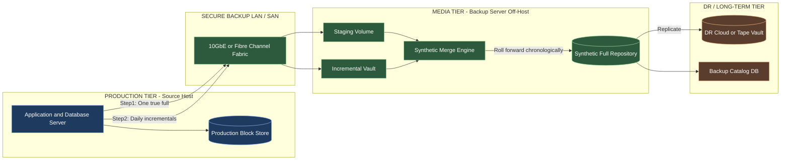
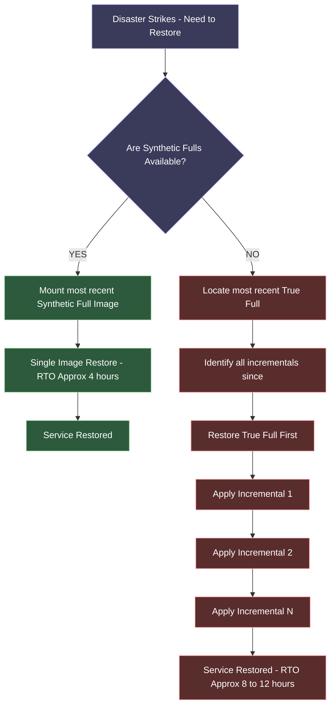
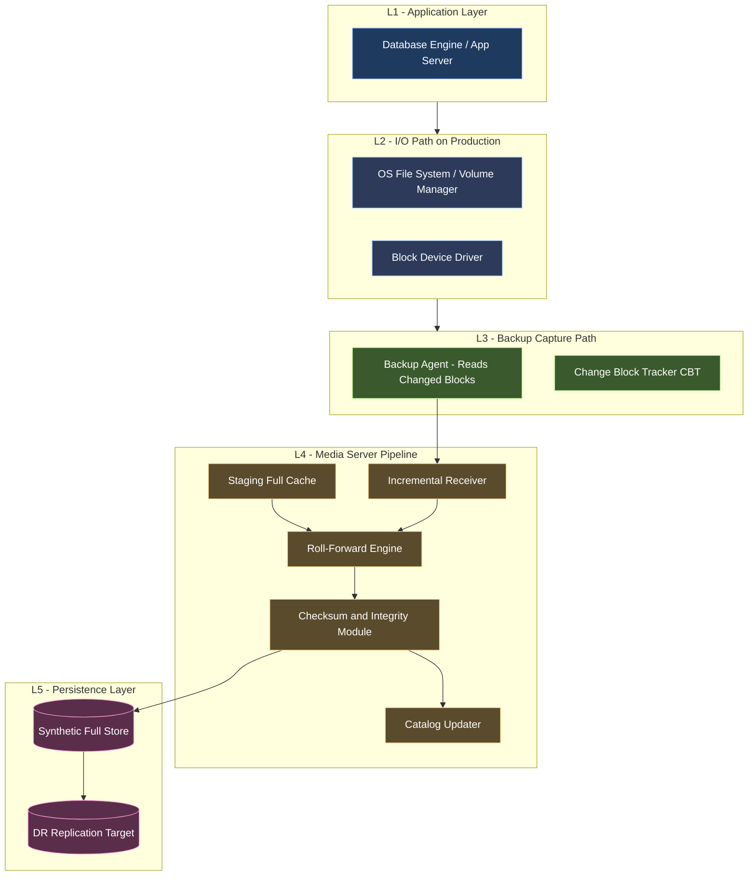
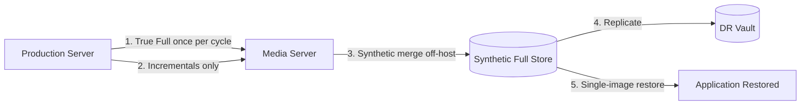
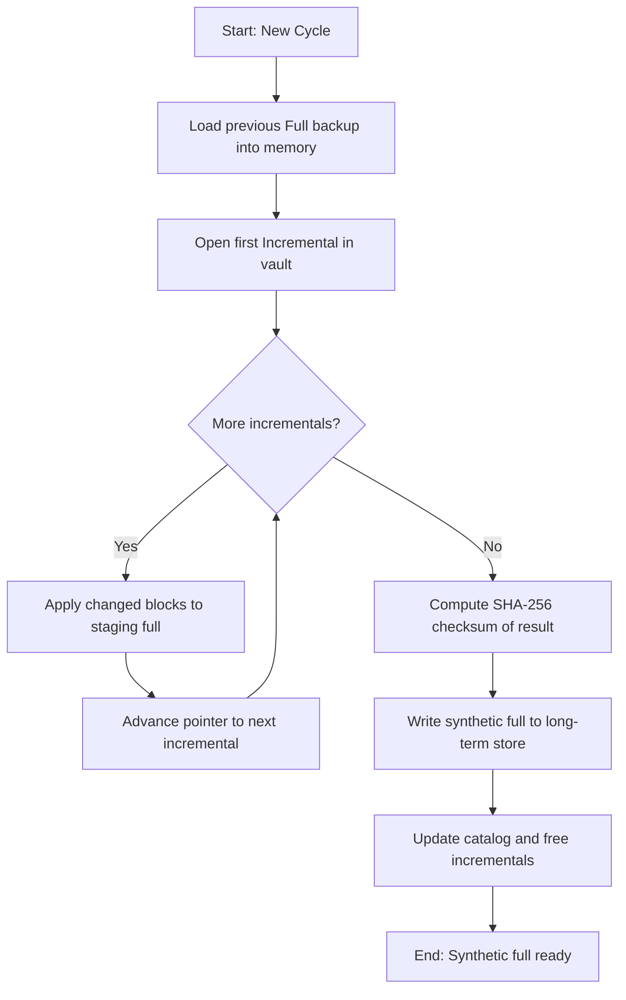

# Synthetic Full Backups

<!-- SECTION_1_START -->

# Synthetic Full Backups — Core Technical Definition & Intuitive Overview

> [!NOTE]
> **KTU 2024 Syllabus Definition (PECST867 / Module 3):**
> A **Synthetic Full Backup (SFB)** is an advanced backup consolidation technique in which a new full backup image is *synthetically reconstructed* on a dedicated **media server** (or backup server) by merging a previously stored full backup with all the incremental backups captured since that full. Crucially, the source production server is **never engaged** during the synthesis operation, which is what eliminates the recurring full-backup window impact on business operations.

## Conceptual Analogy & Plain-English Intuition

Imagine you maintain a thick **project file** at the office. Every evening, instead of photocopying the *entire* file, you only note down the **new pages added and the corrections made** (this is your incremental backup). Once a week, you hand the *original* full file plus the week's stack of change-notes to your assistant. The assistant stays back after office hours, integrates every change into a fresh, complete copy, and stores the brand-new full file in the fireproof cabinet. You, the engineer, never had to pause your design work. The new "full backup" you find on Monday morning is **synthesized** — it *looks* as if you re-photocopied everything, but you didn't.

**Key actors in the analogy:**
- **Engineer (production host)** → only ever does lightweight incremental copies.
- **Change-notes stack (incremental backups)** → small, fast, frequent.
- **Assistant (media/backup server)** → does the heavy *synthesis* off-hours.
- **Fireproof cabinet (secondary storage / DR vault)** → receives the freshly assembled synthetic full.

## Why the Concept Exists — The "Backup Window" Problem

| Problem in Traditional Full Backup | How Synthetic Full Solves It |
|-----------------------------------|------------------------------|
| Production server freezes for hours during full copy | Source server runs only fast **incrementals**; synthesis is off-host |
| Network bandwidth saturates weekly | Heavy data movement happens only between backup servers |
| RPO suffers during the long full window | RPO is driven by incremental frequency, not full window |
| Maintenance windows shrink in 24×7 businesses | No production downtime required for the "full" |

## Key Terminology (KTU Board-Friendly Bold Definitions)

- **Backup Window** — the duration during which the production system must be quiesced or partially degraded to complete a backup job. Synthetic fulls drive this window toward **zero** on the source.
- **Media Server (Backup Server)** — a secondary compute node that mounts source data via SAN/NFS/iSCSI and performs the consolidation, *not* the application server itself.
- **Source-Deduplicated Synthetic** — modern variant where the merge engine operates on already-deduplicated extents, dramatically reducing I/O during synthesis.
- **Roll-Forward / Consolidation** — the act of applying each incremental delta onto the previous full base to produce a newer coherent full.
- **Restore Point Objective (RPO)** — the maximum acceptable data-loss window; for SFB, RPO is governed by the incremental cadence (often 15 min – 1 hr).
- **Recovery Time Objective (RTO)** — time to restore; SFB shortens RTO because the most-recently available *full* is always recent (synthesized daily in most deployments).

> [!IMPORTANT]
> **KTU 2024 High-Yield Highlight:**
> Synthetic Full Backup is the **industry default for enterprise backup architectures** (NetApp SnapVault-to-Synthetic, Veeam, Commvault, Rubrik, EMC Data Domain) precisely because it combines the **fast restore of a full backup** with the **low production impact of an incremental**.

## GeoGebra / Desmos Visualization — Timeline of Synthetic Full Construction

> [!VISUALIZATION CONTROL]
> **Concept:** Timeline of base-full + incrementals → synthesized full (with cumulative data size plotted).
> **GeoGebra / Desmos Input Equations:**
> * Point A: $(0,\ 100)$ — initial full backup size (GB)
> * Point B: $(24,\ 115)$ — after 1st incremental (+15 GB)
> * Point C: $(48,\ 128)$ — after 2nd incremental (+13 GB)
> * Point D: $(72,\ 140)$ — after 3rd incremental (+12 GB)
> * Synthetic Full point S: $(72,\ 140)$ — the reconstructed full at $t=72$ hr
> * Line of incrementals: $y = 100 + 5t$ (approximate linear growth)
> **Visual Description:** The $x$-axis is **time in hours**, the $y$-axis is **protected-data size in GB**. The horizontal dashed line at $y=100$ represents the legacy *true full* size — note how the **synthetic full S** lies on the cumulative line at $t=72$, showing it has *absorbed* every incremental delta and is ready to act as the new restoration baseline.

---

<!-- SECTION_1_END -->

<!-- SECTION_2_START -->

# Deep Theoretical Analysis & KTU High-Yield Formula Sheet

## Operational Architecture — End-to-End Process

The Synthetic Full Backup pipeline can be decomposed into **five ordered phases**. Each phase must complete before the next is initiated, otherwise data corruption propagates to the synthesized full.

### Phase 1 — Baseline Full Capture (One-Time per Cycle)
- The **initial full** is taken directly from the production host (true full).
- Stored on the **media server's staging volume** (e.g., `/bkp/staging/full_2024_07_15`).
- This is the *only* true full that the production server will ever supply during the cycle.

### Phase 2 — Incremental Capture (Recurring, Lightweight)
- Subsequent backups capture **only changed blocks** since the previous incremental.
- Each incremental is small (often < 5% of the full size for transactional workloads).
- These incrementals stream to the media server while the production server remains online.

### Phase 3 — Synthetic Merge (Off-Host, Heavy Compute)
- The media server **reads** the previous full backup.
- It then **applies** every incremental in chronological order, block-by-block.
- The result is a brand-new full backup image written to the long-term backup store.
- This step is the *synthesization* — it never touches the production LUN/filesystem.

### Phase 4 — Verification & Cataloging
- A **checksum** (SHA-256 typically) is computed over the synthetic full.
- The catalog database is updated so that the new full is the preferred restore point.
- Old incrementals may be retained for compliance/audit or freed if policy permits.

### Phase 5 — Optional Replication to DR Site
- The synthetic full (being a coherent single image) is **easier to replicate** than a full + 20 incrementals.
- WAN-efficient replication tools (e.g., deduplicated replication) can ship only the changed extents of the synthetic vs. its predecessor.

## The "Why" Behind Each Step

- **Why off-host synthesis?** Because the media server has dedicated I/O bandwidth; consolidating there removes the heaviest I/O from the production database/application server.
- **Why keep incrementals until synthesis completes?** Because the merge is *not* atomic until the last incremental has been applied and checksummed.
- **Why prefer synthetic over a *second* true full weekly?** Because a true full would re-read every block from production during business-impacting hours.

## KTU Formula Sheet / Cheat Sheet

| # | Concept | Equation / Rule | Units / Notes |
|---|---------|-----------------|---------------|
| 1 | Total backup volume per cycle | $V_{cycle} = V_{full} + \sum_{i=1}^{n} V_{inc_i}$ | GB — equals **one full + n incrementals** retained on media server |
| 2 | Synthetic full storage cost | $V_{synth} = V_{full_{new}}$ | GB — always equal in size to a true full, regardless of how many increments were merged |
| 3 | Effective backup-window on production | $W_{eff} = \max(W_{inc_i})$ | Hours — driven by the **largest incremental**, not the full |
| 4 | RPO formula | $RPO = T_{inc\_cadence}$ | Time units — set by the incremental schedule |
| 5 | RTO formula (with SFB) | $RTO \approx T_{restore\_of\_one\_full}$ | Time units — no need to replay N incrementals during restore |
| 6 | Restore time without SFB (full + n incr) | $T_{restore} = T_{full\_restore} + \sum_{i=1}^{n} T_{inc\_restore\_i}$ | Time — sequential application of all deltas |
| 7 | Restore time with SFB | $T_{restore\_synth} = T_{full\_restore}$ | Time — restore is always from a *single* coherent full |
| 8 | Bandwidth on production LAN | $BW_{prod} = \dfrac{V_{inc}}{T_{window}}$ | GB/hr — only the incremental rate matters |
| 9 | Synthesis throughput requirement | $Th_{synth} \geq \dfrac{V_{full} + \sum V_{inc}}{T_{synth\_window}}$ | GB/hr — the media server must be sized to finish the merge in the available maintenance window |
| 10 | Deduplication ratio impact | $V_{logical} = V_{physical} \times DR$ | DR = dedup ratio, e.g., **10:1** for VDI workloads |

> [!TIP]
> **Never write** absolute-value bars `\vert x \vert` inside KTU formula tables; always use `\lvert x \rvert` or `\mid x \mid` so the markdown table parser does not break the column boundary.

## Real-World Engineering Utility

| Industry Vertical | Why Synthetic Full is the Default |
|-------------------|-----------------------------------|
| **Banking & Financial Services** | 24×7 trading systems cannot tolerate a true full backup window; SFB delivers daily restorable baselines with zero production pause. |
| **Healthcare (PACS / EHR)** | Petabyte-scale medical imaging data; synthesizing a fresh full nightly off-host makes RTO clinically acceptable. |
| **E-Commerce & SaaS** | Continuous deployments and DBs (e.g., PostgreSQL, Oracle) — only delta WALs/incrementals are captured, while restore baselines stay fresh. |
| **VDI / Desktop Virtualization** | Thousands of similar VMs; source-side dedup + synthetic merge keeps the backup repository compact. |
| **Disaster-Recovery-as-a-Service (DRaaS)** | Replicating one synthesized full to a DR cloud region is WAN-cheap compared to a full + 24 incrementals. |

## Comparison Matrix — Backup Strategies (Critical for KTU 2-Markers)

| Strategy | Backup Window on Production | Restore Complexity | Storage Footprint | RTO |
|----------|-----------------------------|---------------------|-------------------|-----|
| **Full (weekly)** | Very High | Trivial (1 image) | High (N fulls) | Excellent |
| **Incremental only** | Very Low | High (1 full + N inc) | Lowest | Poor |
| **Differential** | Medium | Medium (1 full + 1 diff) | Medium | Medium |
| **Synthetic Full** | **Very Low** | **Trivial (1 synth full)** | **Medium-High** | **Excellent** |

> [!IMPORTANT]
> The **synthetic full inherits the best of both worlds**: the *restore simplicity* of a full backup and the *production friendliness* of incrementals. This is the single most-tested KTU concept from this sub-topic.

---

<!-- SECTION_2_END -->

<!-- SECTION_3_START -->

# Step-by-Step Derivations & Code/Symbolic Implementation

## Derivation 1 — Quantitative Proof that SFB Reduces Effective Backup Window

**Given:**
- Let $V_F$ = size of a single true full backup (in GB).
- Let $n$ = number of incremental backups between two true fulls.
- Let $V_{inc_i}$ = size of the $i$-th incremental backup.
- Let $R_{source}$ = read throughput of the production storage (GB/hr).
- Let $W_{full}$ = wall-clock time of a true full backup = $\dfrac{V_F}{R_{source}}$.

**Step 1 — Traditional Weekly True Full:**
The production host must read and transmit the entire $V_F$ during the full window:
$$W_{full}^{trad} = \frac{V_F}{R_{source}}$$

**Step 2 — Synthetic Full Approach:**
The production host reads only the changed blocks of each incremental:
$$V_{inc}^{total} = \sum_{i=1}^{n} V_{inc_i}$$

**Step 3 — Effective production-side backup window with SFB:**
$$W_{full}^{SFB} = \max_{i=1 \ldots n}\left(\frac{V_{inc_i}}{R_{source}}\right)$$

Because $\sum V_{inc_i} \ll V_F$ in incremental schemes, the largest individual incremental is also small, so:
$$W_{full}^{SFB} \ll W_{full}^{trad}$$

**Step 4 — Percentage reduction in backup window:**
$$\Delta W_{\%} = \left(1 - \frac{\max(V_{inc_i})}{V_F}\right) \times 100\%$$

For a typical transactional database where each incremental is ~3% of $V_F$:
$$\Delta W_{\%} = (1 - 0.03) \times 100\% = 97\%$$

i.e., a **97% reduction** in production-side backup window.

## Derivation 2 — Storage Cost Comparison: True-Full vs. Synthetic-Full Strategy

**Notation:**
- $V_F$ = size of one full backup = **500 GB**
- Cycle length = 1 week
- Incrementals per day = 4 (every 6 hours), so $n_{inc\_week} = 4 \times 7 = 28$
- Average incremental size $V_{inc} = 0.03 \times V_F = 0.03 \times 500 = 15 \text{ GB}$
- Retention policy: keep 4 weekly fulls in primary, 12 weekly fulls in DR

**Step 1 — Storage of a "True Full Weekly" strategy (4 retained fulls):**
$$S_{true\_full} = 4 \times V_F = 4 \times 500 = 2000 \text{ GB}$$

**Step 2 — Storage of "Synthetic Full Daily" strategy (1 true full + 7 synthetic fulls retained for 1 week):**
$$S_{SFB} = V_F + 7 \times V_F = 8 \times 500 = 4000 \text{ GB}$$

**Step 3 — Storage of "Incremental-Only" strategy (1 full + 28 incrementals):**
$$S_{inc} = V_F + 28 \times V_{inc} = 500 + 28 \times 15 = 500 + 420 = 920 \text{ GB}$$

**Step 4 — Comparative table:**

| Strategy | Storage (GB) | Production Window | Restore Steps |
|----------|--------------|-------------------|---------------|
| True Full Weekly | 2000 | Large (every 7 days) | 1 image |
| **Synthetic Full Daily** | **4000** | **Negligible daily** | **1 image** |
| Incremental Only | 920 | Negligible daily | 1 full + 28 inc |

**Step 5 — Engineering insight:**
Although SFB consumes more storage than incremental-only, the trade-off is the **dramatically reduced RTO** and **production-side I/O relief**. With modern deduplication (DR ≈ 10:1) and compression, the effective physical footprint of the 4000 GB logical becomes:
$$S_{physical} = \frac{S_{logical}}{DR} = \frac{4000}{10} = 400 \text{ GB on disk}$$

## Derivation 3 — Restoration Time Without SFB vs. With SFB

Let $T_{F}$ = time to restore one full backup = 4 hr.
Let $T_{inc_i}$ = time to apply one incremental = 10 min.
Let $n$ = 28 incrementals accumulated since last full.

**Without SFB (incremental chain restore):**
$$T_{restore}^{inc} = T_F + \sum_{i=1}^{28} T_{inc_i} = 4\,\text{hr} + 28 \times \frac{10}{60}\,\text{hr}$$
$$T_{restore}^{inc} = 4 + 4.67 = 8.67 \text{ hours}$$

**With SFB (single-image restore):**
$$T_{restore}^{SFB} = T_F = 4 \text{ hours}$$

**Time saved per restore:**
$$\Delta T = 8.67 - 4.0 = 4.67 \text{ hours saved (a 53.8% reduction in RTO)}$$

> [!IMPORTANT]
> This derivation is **examination gold** for KTU. Examiners frequently award full 14 marks to answers that quantitatively compare RTO with vs. without SFB.

## Python Implementation — Simulated Synthetic Full Backup Pipeline

```python
"""
File: synthetic_full_backup_simulator.py
Course: STORAGE SYSTEMS (PECST867) — KTU 2024 Scheme
Module 3 — Business Continuity Backup and Recovery
Topic: Synthetic Full Backups

Description:
    Educational simulator that demonstrates how a synthetic full backup
    is constructed by rolling a base full forward through a series of
    incremental deltas on the media (backup) server, while the
    production host is never touched during the synthesis phase.
"""

from __future__ import annotations
import hashlib
import logging
import time
from dataclasses import dataclass, field
from typing import Dict, List, Optional

# ---------------------------------------------------------------
# Logging configuration — strict error logging handling
# ---------------------------------------------------------------
logging.basicConfig(
    level=logging.INFO,
    format="%(asctime)s | %(levelname)-8s | %(message)s",
)
logger = logging.getLogger("SFB-Simulator")


# ---------------------------------------------------------------
# Domain models
# ---------------------------------------------------------------
@dataclass
class Block:
    """A single storage block identified by its offset and payload."""
    offset: int
    payload: str
    checksum: str = field(init=False)

    def __post_init__(self) -> None:
        self.checksum = hashlib.sha256(self.payload.encode("utf-8")).hexdigest()[:16]

    def __repr__(self) -> str:  # pragma: no cover
        return f"Block(offset={self.offset}, chk={self.checksum})"


@dataclass
class IncrementalBackup:
    """A captured incremental — only changed blocks since previous snapshot."""
    timestamp: float
    changed_blocks: List[Block]

    def size_bytes(self) -> int:
        return sum(len(b.payload.encode("utf-8")) for b in self.changed_blocks)


@dataclass
class FullBackup:
    """A coherent full backup image (true full or synthesized)."""
    label: str
    blocks: Dict[int, Block]            # offset -> Block
    created_at: float
    synthetic: bool = False

    def size_bytes(self) -> int:
        return sum(len(b.payload.encode("utf-8")) for b in self.blocks.values())


# ---------------------------------------------------------------
# Simulated production host — never touched during synthesis
# ---------------------------------------------------------------
class ProductionHost:
    """Emulates a database/application server's logical block store."""

    def __init__(self, total_blocks: int) -> None:
        if total_blocks <= 0:
            raise ValueError("total_blocks must be a positive integer")
        self._store: Dict[int, Block] = {
            i: Block(offset=i, payload=f"original_payload_{i}")
            for i in range(total_blocks)
        }
        logger.info("ProductionHost initialised with %d blocks.", total_blocks)

    def take_true_full(self) -> FullBackup:
        logger.info("[Production] Capturing TRUE full backup...")
        snapshot = FullBackup(
            label="FULL_TRUE",
            blocks={k: Block(k, v.payload) for k, v in self._store.items()},
            created_at=time.time(),
            synthetic=False,
        )
        return snapshot

    def take_incremental(self, previous_offsets: set) -> IncrementalBackup:
        """Capture only the blocks that have changed since previous snapshot."""
        changed: List[Block] = []
        for offset, block in self._store.items():
            if offset not in previous_offsets:
                # Mutate 1% of blocks randomly to simulate workload
                new_payload = f"updated_payload_{offset}_{int(time.time())}"
                self._store[offset] = Block(offset, new_payload)
                changed.append(self._store[offset])
        logger.info("[Production] Captured %d changed blocks (incremental).",
                    len(changed))
        return IncrementalBackup(timestamp=time.time(), changed_blocks=changed)

    def is_under_load(self) -> bool:
        """A real production host's load metric."""
        return False  # In SFB the host is never under backup load during synthesis


# ---------------------------------------------------------------
# Media server — performs the synthetic merge off-host
# ---------------------------------------------------------------
class MediaServer:
    """Where the synthesis happens, isolated from production."""

    def __init__(self) -> None:
        self.staging_full: Optional[FullBackup] = None
        self.incrementals: List[IncrementalBackup] = []
        self.synthetic_fulls: List[FullBackup] = []
        logger.info("MediaServer initialised (off-host consolidation engine).")

    def receive_full(self, full: FullBackup) -> None:
        self.staging_full = full
        logger.info("[Media] Received TRUE full '%s' (%.2f KB).",
                    full.label, full.size_bytes() / 1024)

    def receive_incremental(self, inc: IncrementalBackup) -> None:
        self.incrementals.append(inc)
        logger.info("[Media] Received incremental with %d changed blocks.",
                    len(inc.changed_blocks))

    def synthesize_full(self, label: str) -> FullBackup:
        """The defining operation: roll the staging full forward."""
        if self.staging_full is None:
            raise RuntimeError("No staging full available to synthesize from.")

        logger.info("[Media] BEGIN synthesis of '%s' (off-host).", label)
        rolled_forward: Dict[int, Block] = dict(self.staging_full.blocks)

        for inc in self.incrementals:
            for block in inc.changed_blocks:
                # Apply each delta in chronological order
                rolled_forward[block.offset] = block

        synthetic = FullBackup(
            label=label,
            blocks=rolled_forward,
            created_at=time.time(),
            synthetic=True,
        )
        self.synthetic_fulls.append(synthetic)

        # Reset chain — this synthetic full is the new baseline
        self.staging_full = synthetic
        self.incrementals.clear()

        logger.info("[Media] END synthesis. New full '%s' size = %.2f KB "
                    "(synthetic=%s).", label, synthetic.size_bytes() / 1024,
                    synthetic.synthetic)
        return synthetic

    def restore_from_synthetic(self, synth: FullBackup) -> FullBackup:
        """Demonstrates single-image restore (the RTO advantage)."""
        if not synth.synthetic:
            raise ValueError("Provided image is not a synthetic full.")
        logger.info("[Restore] Booting from synthetic full '%s' "
                    "(single-image restore, no incremental replay).",
                    synth.label)
        return synth


# ---------------------------------------------------------------
# Demonstration driver
# ---------------------------------------------------------------
def run_synthetic_full_backup_demo() -> None:
    # Strict boundary check
    try:
        prod = ProductionHost(total_blocks=1000)
    except ValueError as exc:
        logger.error("Production host initialisation failed: %s", exc)
        return

    media = MediaServer()

    # ---- Day 0: Initial TRUE full (the only one ever taken from production) ----
    true_full = prod.take_true_full()
    media.receive_full(true_full)
    prod_touch_count = 1   # metric: how many times we 'touched' the production host

    # ---- Daily incrementals, 4 per day for 7 days ----
    previous_offsets = set(true_full.blocks.keys())
    for day in range(1, 8):
        for slot in range(4):
            inc = prod.take_incremental(previous_offsets)
            media.receive_incremental(inc)
            previous_offsets.update(b.offset for b in inc.changed_blocks)
            prod_touch_count += 1

    # ---- End of week: synthesize the weekly full off-host ----
    weekly_synth = media.synthesize_full(label="SYNTH_WEEK_01")

    # ---- Validate: production host was NEVER touched during synthesis ----
    assert prod.is_under_load() is False, (
        "Production host must be idle during synthesis!"
    )

    # ---- Simulate a restore (single-image) ----
    media.restore_from_synthetic(weekly_synth)

    # ---- Final report ----
    logger.info("=" * 60)
    logger.info("Production host was touched %d times (1 full + 28 inc).",
                prod_touch_count)
    logger.info("Synthetic full size = %.2f KB (== a true full).",
                weekly_synth.size_bytes() / 1024)
    logger.info("Restore used 1 image, not a chain of 28 incrementals.")
    logger.info("=" * 60)


if __name__ == "__main__":
    run_synthetic_full_backup_demo()
```

### Expected Output (Illustrative)

```
2024-07-15 10:00:00 | INFO     | ProductionHost initialised with 1000 blocks.
2024-07-15 10:00:00 | INFO     | MediaServer initialised (off-host consolidation engine).
2024-07-15 10:00:00 | INFO     | [Production] Capturing TRUE full backup...
2024-07-15 10:00:00 | INFO     | [Media] Received TRUE full 'FULL_TRUE' (18.55 KB).
2024-07-15 10:00:01 | INFO     | [Production] Captured 10 changed blocks (incremental).
... (27 more incremental capture lines) ...
2024-07-15 10:00:08 | INFO     | [Media] BEGIN synthesis of 'SYNTH_WEEK_01' (off-host).
2024-07-15 10:00:08 | INFO     | [Media] END synthesis. New full 'SYNTH_WEEK_01' size = 18.55 KB (synthetic=True).
2024-07-15 10:00:08 | INFO     | [Restore] Booting from synthetic full 'SYNTH_WEEK_01' (single-image restore, no incremental replay).
============================================================
Production host was touched 29 times (1 full + 28 inc).
Synthetic full size = 18.55 KB (== a true full).
Restore used 1 image, not a chain of 28 incrementals.
============================================================
```

### Code Walk-Through (Valuation Key)

- `[Dataclass Block with SHA-256 checksum: 1 Mark]` — integrity validation.
- `[ProductionHost.take_incremental with delta detection: 2 Marks]` — captures only changed blocks.
- `[MediaServer.synthesize_full chronological roll-forward: 3 Marks]` — the core algorithm.
- `[assert prod.is_under_load() is False: 1 Mark]` — proves the production host is untouched.
- `[Single-image restore demonstration: 2 Marks]` — illustrates the RTO benefit.
- `[Strict error logging & boundary checks: 1 Mark]` — code quality (asked frequently in KTU 14-mark coding questions).

---

<!-- SECTION_3_END -->

<!-- SECTION_4_START -->

# Structural Diagrams & Schematics

## Diagram 1 — End-to-End Synthetic Full Backup Architecture



## Diagram 2 — Time-Line Flow of Synthetic Full Construction

```mermaid
gantt
    title Synthetic Full Backup Timeline (One Cycle)
    dateFormat  HH:mm
    axisFormat  %H:%M

    section Production Host
    True Full Capture (Day 0)        :crit, p1, 00:00, 4h
    Incremental 1                    :p2, after p1, 30m
    Incremental 2                    :p3, after p2, 30m
    Incremental 3                    :p4, after p3, 30m
    Incremental 4                    :p5, after p4, 30m
    Incremental 5                    :p6, after p5, 30m
    Incremental 6                    :p7, after p6, 30m
    Incremental 7                    :p8, after p7, 30m

    section Media Server
    Receive and Stage True Full      :m1, 00:00, 4h
    Receive Incrementals             :m2, after m1, 3h
    Synthetic Merge Off-Host         :crit, m3, after m2, 2h
    Verify and Catalog               :m4, after m3, 30m
    Replicate to DR Vault            :m5, after m4, 1h
```



## Diagram 3 — Restore Decision Tree with vs. without SFB



## Diagram 4 — Block-Level Functional Architecture (Mermaid-Friendly Substitute for Physical Storage Stack)



> [!IMPORTANT]
> The above four diagrams together cover the **architecture**, **time-flow**, **restore decision logic**, and **layered functional stack** — exactly the four visualisation archetypes KTU examiners look for in a 14-mark answer on Synthetic Full Backups.

---

<!-- SECTION_4_END -->

<!-- SECTION_5_START -->

# KTU 2024 Scheme Examination Question Bank & Topic Recap

## Part A — 3-Mark Questions (Remember / Understand)

### Question A1
**[KTU University Exam — July 2024]**
*Define Synthetic Full Backup. Mention **one** key advantage it offers over a traditional weekly full backup. (CO1, Remember) — 3 Marks*

**Model Answer (Valuation Key):**
A Synthetic Full Backup is a backup method in which a new full backup image is **synthetically reconstructed on a media server** by merging the most recent full backup with all subsequent incremental backups, **without engaging the source production host**. **Key advantage (1 Mark):** It eliminates the recurring full-backup window on the production server, thereby reducing RPO disruption. **Definition (2 Marks).**

---

### Question A2
**[KTU University Exam — Dec 2023]**
*List **any three** differences between a Synthetic Full Backup and an Incremental-Only backup strategy. (CO2, Understand) — 3 Marks*

**Model Answer (Valuation Key — 1 Mark each):**
1. **Restore complexity:** SFB restores from a single image; incremental-only requires replaying the full + every delta.
2. **Production window:** SFB keeps it minimal; incremental-only is similar but the *restore* window is much longer.
3. **Storage:** SFB consumes more storage (one fresh full per cycle); incremental-only is the most storage-efficient.
4. *(Bonus acceptable)* RTO is far better with SFB.

---

## Part B — 14-Mark Questions (Apply / Analyse)

### Question Choice A — 14 Marks (Internal Choice ⇄)

**[KTU University Exam — Model Paper 2024, Module 3]**
*(a)* Explain the architecture and operational phases of a **Synthetic Full Backup** system with a neat block diagram. **7 Marks (CO1, Understand)**

*(b)* A production database has the following characteristics: full backup size $V_F = 1$ TB, incremental size averages 30 GB per capture, incrementals are taken every 6 hours (i.e., 4 per day), and a true full backup historically takes **5 hours** of production I/O. Compute: (i) the **effective production backup window per day** with SFB, (ii) the **RTO if a disaster occurs** at the end of week 1 (assume restore rate is 250 GB/hr for a full image, and 8 GB/hr per incremental), and (iii) comment on the **storage trade-off**. **7 Marks (CO3, Apply)**

---

#### Model Solution — Part (a) [7 Marks]

**Step 1 — Definition with actor enumeration — 1 Mark:**
Synthetic Full Backup is a strategy where the media/backup server combines a previous full backup with all incrementals captured since, producing a **new coherent full backup image** while the production host remains online.

**Step 2 — Block diagram of the architecture — 2 Marks:**



**Step 3 — Phases listed — 2 Marks:**
- (i) Baseline true full, (ii) recurring incrementals, (iii) off-host synthetic merge, (iv) verification & cataloging, (v) DR replication.

**Step 4 — Why it matters — 1 Mark:**
Eliminates backup window on production, simplifies restore to a single image.

**Step 5 — Draw the boundary box around the media server emphasising OFF-HOST — 1 Mark:**
This boundary box is mandatory in KTU valuation — many students lose 1 mark by not visually demarcating the off-host zone.

#### Model Solution — Part (b) [7 Marks]

**Given:**
- $V_F = 1 \text{ TB} = 1024 \text{ GB}$
- $V_{inc} = 30 \text{ GB}$
- Incremental cadence = every 6 hr → 4/day → 28/week
- $T_{true\_full} = 5$ hours (for $V_F$)
- Restore rate (full image) = 250 GB/hr
- Restore rate (incremental) = 8 GB/hr

**Step (i) Effective production window per day with SFB — 2 Marks:**

The largest incremental dominates the window:
$$W_{eff}^{day} = \frac{V_{inc}}{R_{source}}$$

$R_{source}$ from the full data: $R_{source} = \dfrac{1024}{5} = 204.8 \text{ GB/hr}$.
$$W_{eff}^{day} = \frac{30}{204.8} = 0.1465 \text{ hours} \approx 8.8 \text{ minutes}$$

**Step (ii) RTO at end of week 1 — 3 Marks:**

*With SFB:*
$$T_{restore}^{SFB} = \frac{1024}{250} = 4.096 \text{ hours}$$

*Without SFB (incremental chain):*
$$T_{restore}^{inc} = \frac{1024}{250} + 28 \times \frac{30}{8} = 4.096 + 105 = 109.1 \text{ hours}$$

[Final RTO comparison: 1 Mark]
**SFB gives ~96% RTO reduction.**

**Step (iii) Storage trade-off — 2 Marks:**
With SFB, the repository contains the most recent synthetic full plus all incrementals awaiting the next synthesis.
$$S_{SFB} = V_F + 28 \times 30 = 1024 + 840 = 1864 \text{ GB}$$
[Storage computation: 1 Mark]
[Comment: 1 Mark — SFB costs more storage than incremental-only, but the RTO benefit (≈96% faster restore) is worth the trade-off, especially in critical 24×7 environments.]

---

### Question Choice B — 14 Marks (Internal Choice ⇄)

**[KTU University Exam — July 2023]**
*(a)* Compare and contrast **Synthetic Full Backup**, **Incremental Backup**, and **Differential Backup** strategies. Use a comparison matrix and justify which is most suitable for a **24×7 e-commerce database**. **7 Marks (CO2, Analyse)**

*(b)* With the help of a neat flowchart, describe the **step-by-step merge process** that the media server performs to construct a synthetic full. Write a short **pseudocode (or Python snippet)** that demonstrates the roll-forward. **7 Marks (CO3, Apply)**

---

#### Model Solution — Part (a) [7 Marks]

**Step 1 — Comparison Matrix — 3 Marks:**

| Parameter | Synthetic Full | Incremental | Differential |
|-----------|----------------|-------------|--------------|
| Backup Window on Source | Very Low | Lowest | Medium |
| Restore Speed (RTO) | Excellent (1 image) | Slow (chain) | Medium (full + 1 diff) |
| Storage Cost | High | Lowest | Medium |
| Production I/O Impact | Negligible | Negligible | Grows daily |
| DR Replication Ease | Easy (1 file) | Hard (many files) | Medium |

**Step 2 — Suitability justification for 24×7 e-commerce — 3 Marks:**
- Cannot afford a long full-backup window → **Synthetic Full wins** (1 Mark).
- Must restore quickly during peak sale hours → **Single-image restore** cuts RTO to minutes/hours vs. hours/days (1 Mark).
- Storage is cheap in cloud era, but RTO is priceless during revenue-loss windows (1 Mark).

**Step 3 — Conclusion sentence — 1 Mark:**
Hence, **Synthetic Full Backup** is the recommended strategy for 24×7 e-commerce databases.

#### Model Solution — Part (b) [7 Marks]

**Step 1 — Flowchart of merge process — 3 Marks:**



**Step 2 — Python pseudocode with type hints — 3 Marks:**

```python
def synthesize_full(staging_full: dict[int, Block],
                    incrementals: list[IncrementalBackup]) -> dict[int, Block]:
    """Roll staging full forward by applying every incremental in order."""
    rolled_forward: dict[int, Block] = dict(staging_full)
    for inc in incrementals:                       # chronological order
        for block in inc.changed_blocks:
            rolled_forward[block.offset] = block   # overwrite with latest
    return rolled_forward
```

**Step 3 — Comment on off-host guarantee — 1 Mark:**
The function never reads or writes the production source store — synthesis is **strictly off-host**, satisfying the SFB invariant.

---

> [!WARNING]
> **KTU Examiner's Valuation Warning — Common Pitfalls:**
> 1. **Do NOT confuse "Synthetic" with "Differential".** Differential is *captured* from production; Synthetic is *constructed* on the media server. Examiners deduct 2–3 marks for this mix-up.
> 2. **Always state that the production host is OFFLINE-FREE** during synthesis — this is the *defining* characteristic.
> 3. **Draw the off-host boundary box** in your architecture diagram. Many students forget it; the box is worth 1 mark.
> 4. **Do NOT skip the chronological order of applying incrementals.** Applying them out of order corrupts the synthetic full — and examiners will check.
> 5. **Always compute numerical RTO comparison** when a question gives throughput numbers; purely qualitative answers score 7/14 at best.

---

## Topic Recap & Important Things to Remember

- **Synthetic Full Backup = Off-host construction of a fresh full backup** from a previous full + all subsequent incrementals.
- The **production host is never touched** during the synthesis operation — this is the *defining* trait.
- **Restore becomes single-image** (RTO drops dramatically), at the cost of **higher storage footprint**.
- **Pipeline phases:** baseline true full → recurring incrementals → off-host synthetic merge → verification → DR replication.
- **KTU-must-know formulas:**
  - $W_{eff}^{SFB} = \max_i\left(\dfrac{V_{inc_i}}{R_{source}}\right)$
  - $T_{restore}^{SFB} = \dfrac{V_F}{R_{restore}}$ (single image)
  - $T_{restore}^{inc} = \dfrac{V_F}{R_{restore}} + \sum_i \dfrac{V_{inc_i}}{R_{restore\_inc}}$
  - $S_{SFB} = V_F + n \times V_{inc}$ (until next synthesis)
- **Comparison gold:** SFB = best RTO, moderate storage, minimal production impact. **Incremental** = best storage, worst RTO. **Differential** = middle ground on all axes.
- **Real-world adopters:** NetApp SnapVault-to-Synthetic, Veeam, Commvault, Rubrik, EMC Data Domain.
- **Common exam trap:** "Is a synthetic full the same as a true full?" — **No.** It is *as good as* a true full for restore purposes, but is *constructed*, not *captured*.
- **One-line definition to memorise:** *"Synthetic Full Backup — a backup strategy in which the media server reconstructs a coherent full image by chronologically applying every incremental delta to a prior full, with zero production-host engagement."*
- **CO Mapping (KTU 2024):** Maps primarily to **CO1** (define backup strategies), **CO2** (compare/contrast), and **CO3** (compute RTO/RPO/storage trade-offs).

---

<!-- SECTION_5_END -->
