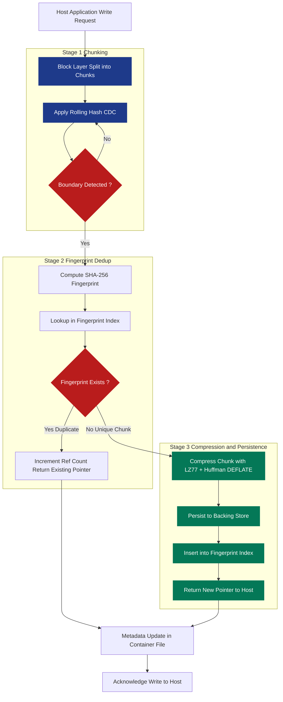
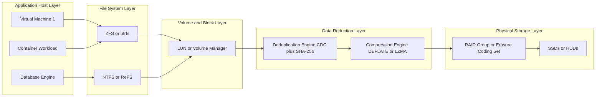
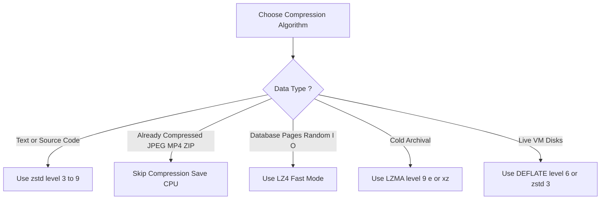

# Deduplication and Compression

<!-- SECTION_1_START -->
# 1. Core Technical Definition & Intuitive Overview

## 1.1 Deduplication — Formal Definition

**Deduplication (dedup)** is a specialized **data reduction technique** used in storage systems that identifies and eliminates **redundant copies of repeating data blocks** (or files) by storing only a **single physical instance** of each unique segment on the backing media. All logical references to the same data are then redirected to this single physical instance via a **metadata mapping table** (often called the *fingerprint index* or *chunk index*).

In the KTU 2024 Scheme parlance, deduplication is classified under **Content-Addressable Storage (CAS)** and forms the backbone of modern **backup targets, primary storage arrays, and hyper-converged infrastructure (HCI)**.

> [!IMPORTANT]
> **Syllabus Highlight — KTU Module 4**
> The official syllabus treats deduplication and compression as **orthogonal but complementary** data reduction mechanisms. Deduplication operates at the **block / segment granularity** (typically 4 KB to 128 KB), whereas compression operates at the **byte / token granularity** within each unique block. The two are almost always **pipelined in production systems**: first dedup, then compress (or vice-versa, depending on the vendor).

## 1.2 Compression — Formal Definition

**Data compression** is the process of encoding information using **fewer bits** than the original representation by exploiting statistical redundancy (entropy coding) or pattern repetition (dictionary coding). Within storage subsystems, **lossless compression** is mandatory — every bit of the original data must be perfectly recoverable, since silent data corruption is unacceptable in enterprise storage. The dominant algorithms are **LZ77, LZ78, LZW, Huffman, DEFLATE, LZMA, and Zstandard (zstd)**.

## 1.3 Intuition & Real-World Analogies

> [!NOTE]
> **Analogy 1 — Deduplication = The "Shared Notes" System**
> Imagine a class of 200 students where every student receives a printed handout of 50 pages. Without dedup, the professor needs 200 × 50 = **10,000 pages** of paper. With deduplication, only one master copy of each unique page is kept in a central repository, and each student receives a **list of pointers** (e.g., "page 17 → master copy #27"). The total paper required drops dramatically. This is exactly how a dedup engine works at the I/O level.

> [!NOTE]
> **Analogy 2 — Compression = Vacuum-Sealed Luggage**
> A traditional suitcase stores clothes in a fixed, uncompressed volume. A vacuum-sealed bag removes the air (redundancy) between fibers, packing the same clothes into a much smaller volume, yet the clothes themselves are *perfectly intact* upon reopening. Lossless compression behaves identically: it removes *statistical* air (repeated patterns, zero-runs) while preserving the original byte sequence bit-for-bit.

## 1.4 Core Terminology Checklist

| Term | Meaning |
|---|---|
| **Chunk** | The atomic unit of dedup, typically 4 KB – 128 KB |
| **Fingerprint** | A cryptographic hash (SHA-1, SHA-256) that uniquely identifies a chunk |
| **Logical Size** | The apparent size of data as seen by the application |
| **Physical Size** | The actual bytes written to the disk after dedup + compression |
| **Segment** | A variable-size chunk produced by Content-Defined Chunking (CDC) |
| **Dictionary** | In LZ-family compression, the running table of previously-seen byte strings |
| **Sliding Window** | In LZ77, the fixed buffer of recent bytes searched for matches |
| **Codeword** | In Huffman coding, a variable-length bit string assigned to a symbol |
| **Entropy** | The theoretical minimum bits needed to encode a message (Shannon) |

> [!VISUALIZATION CONTROL]
> **Concept:** Visualizing the effect of deduplication + compression on a dataset
> **Plot Type:** Bar chart comparing Logical Size vs Physical Size
> **Input Data (paste into Desmos):**
> * `Logical = 100` *(representing 100 GB of logical data)*
> * `Physical_After_Dedup = 35` *(after 3:1 dedup ratio)*
> * `Physical_After_Compression = 35 * 0.4 = 14` *(assuming 2.5:1 compression on unique data)*
> **Visual Description:** A two-bar chart where the first bar reaches 100 units (logical), the second bar reaches 14 units (physical on disk). The ratio between them visually conveys the *overall data reduction ratio* of approximately **7.14 : 1**.

<!-- SECTION_1_END -->

<!-- SECTION_2_START -->
# 2. Deep Theoretical Analysis & KTU High-Yield Formula Sheet

## 2.1 Taxonomy of Deduplication

Deduplication strategies are classified along **three orthogonal axes**:

### Axis 1 — Granularity
- **File-level dedup:** Compares whole files via a single hash. Very fast, but misses intra-file redundancy (e.g., two VM disk images that differ by only 5%).
- **Block-level (fixed-size):** Slices files into fixed chunks (e.g., 8 KB). Simple, but boundary shifts cause poor dedup ratios.
- **Block-level (variable-size, CDC):** Uses **Content-Defined Chunking** (Rabin fingerprint, Gear hash, or FastCDC) to find natural break-points. *This is the gold standard* — boundary shifts no longer defeat dedup.

### Axis 2 — Timing
- **Inline (in-line) dedup:** Hashing and lookup happen *before* the write is acknowledged to the host. Lowest storage footprint, but adds write latency.
- **Post-process dedup:** Data is written first to a staging area, deduped later asynchronously. Higher write performance, higher peak storage.

### Axis 3 — Location
- **Source dedup:** Performed at the client / backup agent. Saves LAN/WAN bandwidth.
- **Target dedup:** Performed at the storage array. Saves disk space only, not network bandwidth.

## 2.2 Taxonomy of Compression Algorithms

```
Lossless Compression
├── Statistical / Entropy Coding
│   ├── Huffman Coding          (1952)
│   ├── Arithmetic Coding       (1976)
│   └── Shannon–Fano Coding
├── Dictionary Coding
│   ├── LZ77 (Sliding Window)   (1977)
│   ├── LZ78 (Tree-based)       (1978)
│   ├── LZW                     (1984)
│   └── Snippet Finding         (used in LZMA)
└── Hybrid (Industry Standard)
    ├── DEFLATE  = LZ77 + Huffman   (.zip, .gz, zlib)
    ├── LZMA     = LZ77 + Range Coder  (.7z, .xz)
    ├── Bzip2    = BWT + MTF + Huffman (.bz2)
    └── Zstandard (zstd) = LZ77 + FSE + Huffman  (.zst, Facebook, Linux kernel)
```

## 2.3 KTU High-Yield Formula Sheet

| Symbol | Formula / Definition | Typical Range | Engineering Use |
|---|---|---|---|
| **Compression Ratio (CR)** | $CR = \dfrac{\text{Original Size}}{\text{Compressed Size}}$ | 1.5 : 1 to 4 : 1 | Vendor datasheet metric |
| **Space Savings (SS)** | $SS = 1 - \dfrac{1}{CR}$ | 33 % to 75 % | Often quoted as "% saved" |
| **Dedup Ratio (DR)** | $DR = \dfrac{\text{Logical Bytes Ingested}}{\text{Physical Bytes Stored}}$ | 3 : 1 to 40 : 1 (backup) | Capacity planning |
| **Overall Reduction (R)** | $R = DR \times CR$ | 10 : 1 to 100 : 1 | End-to-end efficiency |
| **Effective Capacity** | $C_{\text{eff}} = C_{\text{raw}} \times R$ | — | Usable TB after reduction |
| **Shannon Entropy** | $H = -\sum_{i=1}^{n} p_i \log_2 p_i$ bits/symbol | 0 to $\log_2 n$ | Theoretic compressibility limit |
| **Huffman Avg. Length** | $\bar{L} = \sum_{i=1}^{n} p_i \cdot l_i$ | $H \le \bar{L} \lt H + 1$ | Bounded by entropy |
| **LZ77 Match Pointer** | $\langle \text{offset}, \text{length}, \text{next literal} \rangle$ | offset $\le W$, len $\le L$ | The triple emitted per match |

> [!IMPORTANT]
> **Engineering Reality Check**
> The **theoretical upper bound** of lossless compression is given by the **Shannon entropy** $H$ of the source. For already-compressed data (e.g., JPEG, MP4, encrypted blobs, Z-standard-compressed streams), the entropy is already near maximum, so applying another compression pass yields a ratio of approximately **1.00 : 1** — i.e., **no further savings**. This is why dedup-aware backup products *skip* compression on known-compressed file types.

## 2.4 Real-World Engineering Applications

- **Enterprise Backup Appliances** — NetApp AltaVault, ExaGrid, Dell DD Boost: Achieve 10×–30× dedup ratios on nightly backup windows.
- **Primary Storage Arrays** — Dell PowerMax, HPE 3PAR, NetApp AFF: Inline dedup with 1.5×–4× ratios on VM workloads.
- **Hyper-Converged Infrastructure (HCI)** — Nutanix, VMware vSAN: Per-VM dedup combined with erasure coding.
- **Cloud Object Stores** — Amazon S3 with intelligent tiering, Azure Blob: Server-side dedup and zstd compression.
- **Linux Kernel** — ZFS (inline dedup), Btrfs (per-extent dedup), SquashFS (read-only dedup at build time).
- **Archival / Cold Storage** — Zstandard at high levels (–22) is the de-facto choice for cost-efficient archival.

<!-- SECTION_2_END -->

<!-- SECTION_3_START -->
# 3. Step-by-Step Derivations & Code Implementation

## 3.1 Derivation — Deriving the Overall Data Reduction Ratio

When dedup and compression are cascaded (the standard production sequence), the total reduction is the **product** of the individual ratios, *not* their sum. This is the single most important derivation for any KTU 14-mark question on storage efficiency.

**Step 1.** Define the **Logical Data Size** $L$ (the bytes the application believes it wrote).

**Step 2.** After deduplication, only the **unique chunk bytes** are retained. Let the **deduplication ratio** be

$$DR = \frac{L}{P_{\text{after\_dedup}}}$$

Solving for the post-dedup physical size:

$$P_{\text{after\_dedup}} = \frac{L}{DR}$$

**Step 3.** Each unique chunk is then compressed. Let the **compression ratio** be

$$CR = \frac{P_{\text{after\_dedup}}}{P_{\text{after\_compression}}}$$

Substituting Step 2:

$$P_{\text{after\_compression}} = \frac{P_{\text{after\_dedup}}}{CR} = \frac{L}{DR \cdot CR}$$

**Step 4.** The **overall reduction ratio** $R$ is therefore:

$$R = \frac{L}{P_{\text{after\_compression}}} = DR \times CR$$

**Step 5.** The **percentage space savings** $SS_{\%}$ is:

$$SS_{\%} = \left(1 - \frac{1}{R}\right) \times 100\% = \left(1 - \frac{1}{DR \cdot CR}\right) \times 100\%$$

**Worked numerical example (typical KTU problem):**
A backup system ingests $L = 10\,\text{TB}$ of logical data nightly. The dedup engine reports $DR = 20$, and the post-dedup compression engine reports $CR = 2.5$. Compute the physical disk consumed and the percentage savings.

$$
\begin{aligned}
P_{\text{after\_dedup}} &= \frac{10\,\text{TB}}{20} = 0.5\,\text{TB} \\
P_{\text{after\_compression}} &= \frac{0.5\,\text{TB}}{2.5} = 0.2\,\text{TB} = 204.8\,\text{GB} \\
R &= 20 \times 2.5 = 50 \\
SS_{\%} &= \left(1 - \frac{1}{50}\right) \times 100\% = 98\%
\end{aligned}
$$

So **10 TB of logical data** is stored in approximately **205 GB of physical disk** — a **50 : 1** overall reduction, equivalent to **98 % space savings**.

## 3.2 Derivation — Shannon Entropy and the Compression Limit

For a discrete memoryless source emitting symbols from alphabet $\mathcal{A} = \{a_1, a_2, \dots, a_n\}$ with probabilities $\{p_1, p_2, \dots, p_n\}$, the **average information content per symbol** (entropy) is:

$$
H = -\sum_{i=1}^{n} p_i \log_2 p_i \quad \text{(bits per symbol)}
$$

The **Source Coding Theorem (Shannon, 1948)** states that for any lossless code, the expected codeword length $\bar{L}$ satisfies:

$$
H(X) \;\le\; \bar{L} \;<\; H(X) + 1
$$

This means **no lossless compressor can produce an output smaller than $H$ bits per symbol** on average. Huffman coding achieves the lower bound for symbol-by-symbol codes; arithmetic coding approaches it arbitrarily closely.

## 3.3 Worked Example — Huffman Coding

Consider the source alphabet $\mathcal{A} = \{A, B, C, D\}$ with probabilities $p(A) = 0.5,\; p(B) = 0.25,\; p(C) = 0.15,\; p(D) = 0.10$.

**Step 1 — Sort by probability (descending):** $A(0.50),\; B(0.25),\; C(0.15),\; D(0.10)$.

**Step 2 — Merge the two lowest:** Merge $C(0.15)$ and $D(0.10)$ into a new node $CD(0.25)$.

**Step 3 — New list:** $A(0.50),\; B(0.25),\; CD(0.25)$.

**Step 4 — Merge the two lowest again:** Merge $B(0.25)$ and $CD(0.25)$ into root $R(0.50)$.

**Step 5 — Assign binary digits (0/1) along each branch:**

| Symbol | Huffman Codeword | Length $l_i$ | $p_i \cdot l_i$ |
|---|---|---|---|
| A | `0` | 1 | 0.500 |
| B | `10` | 2 | 0.500 |
| C | `110` | 3 | 0.450 |
| D | `111` | 3 | 0.300 |

$$
\begin{aligned}
\bar{L} &= 0.5 + 0.5 + 0.45 + 0.3 = 1.75 \text{ bits/symbol} \\
H &= -\bigl(0.5 \log_2 0.5 + 0.25 \log_2 0.25 + 0.15 \log_2 0.15 + 0.10 \log_2 0.10\bigr) \\
H &\approx 0.5 + 0.5 + 0.4105 + 0.3322 \approx 1.743 \text{ bits/symbol} \\
\text{Coding efficiency} \; \eta &= \frac{H}{\bar{L}} = \frac{1.743}{1.75} \approx 99.6\%
\end{aligned}
$$

Huffman coding here operates within **0.4 %** of the theoretical entropy limit.

## 3.4 Worked Example — LZ77 Sliding-Window Walkthrough

Input string: `A B C B C B C A B C` (separator-free for clarity). Window size $W = 7$, lookahead buffer $L = 4$.

**Step 1.** Read `A`. No match. Emit literal `A`. Window: `A`.
**Step 2.** Read `B`. No match. Emit literal `B`. Window: `A B`.
**Step 3.** Read `C`. No match. Emit literal `C`. Window: `A B C`.
**Step 4.** Read `B C`. Match found at offset 2, length 2. Emit pointer $\langle 2, 2, \text{next} \rangle$.
**Step 5.** Read `B C A`. Match `B C` at offset 4, length 2. Emit $\langle 4, 2, A \rangle$.
**Step 6.** Read `B C` (if remaining). Match at offset 2. Emit $\langle 2, 2, \text{EOF} \rangle$.

The encoded stream is therefore: `A B C ⟨2,2⟩ ⟨4,2,A⟩ ⟨2,2⟩`, a 9-character string compressed into roughly 5–6 tokens — the compression ratio is the **ratio of input bytes to output tokens**, including the bits needed to encode each offset/length field.

## 3.5 Full Python Implementation — Chunk-Based Deduplication Engine

```python
"""
Chunk-based Deduplication Engine
--------------------------------
Implements a simplified Content-Addressable Storage (CAS) system using:
  - Fixed-size block chunking (8 KB)
  - SHA-256 cryptographic fingerprinting
  - A hash-indexed reference store
  - Optional post-dedup zlib compression
"""

import hashlib
import zlib
import os
from pathlib import Path
from typing import Dict, Tuple


class DedupStore:
    """A minimal but fully-functional deduplication + compression store."""

    CHUNK_SIZE: int = 8 * 1024  # 8 KB fixed-size chunks (per KTU typical value)

    def __init__(self, store_root: str = "./dedup_store") -> None:
        self.store_root = Path(store_root)
        self.store_root.mkdir(parents=True, exist_ok=True)
        # Fingerprint index: maps SHA-256 -> (physical_path, ref_count, compressed_size)
        self.fingerprint_index: Dict[str, Tuple[Path, int, int]] = {}
        self.logical_bytes: int = 0          # Bytes the host believes it wrote
        self.physical_bytes: int = 0         # Bytes actually written to disk

    # ------------------------------------------------------------------ #
    #  Core I/O: chunk a file and ingest it                               #
    # ------------------------------------------------------------------ #
    def _fingerprint(self, chunk: bytes) -> str:
        """Compute the SHA-256 fingerprint of a raw chunk."""
        return hashlib.sha256(chunk).hexdigest()

    def _store_chunk(self, chunk: bytes) -> str:
        """Store or reference a chunk; return its fingerprint."""
        digest = self.fingerprint(chunk)

        if digest in self.fingerprint_index:
            # Duplicate detected — increment reference count, no new I/O
            path, refs, _ = self.fingerprint_index[digest]
            self.fingerprint_index[digest] = (path, refs + 1, _)
            return digest

        # New unique chunk — compress, then persist under its hash
        compressed = zlib.compress(chunk, level=6)
        path = self.store_root / digest
        with open(path, "wb") as fh:
            fh.write(compressed)
        self.fingerprint_index[digest] = (path, 1, len(compressed))
        self.physical_bytes += len(compressed)
        return digest

    def ingest_file(self, filepath: str) -> list:
        """Chunk a file and return an ordered list of fingerprints."""
        fingerprints: list = []
        with open(filepath, "rb") as fh:
            while True:
                chunk = fh.read(self.CHUNK_SIZE)
                if not chunk:
                    break
                self.logical_bytes += len(chunk)
                fingerprints.append(self._store_chunk(chunk))
        return fingerprints

    # ------------------------------------------------------------------ #
    #  Reconstruct a file from its fingerprint list                       #
    # ------------------------------------------------------------------ #
    def reconstruct(self, fingerprints: list, output_path: str) -> None:
        """Rebuild a file by following the fingerprint references."""
        with open(output_path, "wb") as out:
            for digest in fingerprints:
                path, _, _ = self.fingerprint_index[digest]
                with open(path, "rb") as fh:
                    out.write(zlib.decompress(fh.read()))

    # ------------------------------------------------------------------ #
    #  Reporting metrics                                                  #
    # ------------------------------------------------------------------ #
    def report(self) -> None:
        """Print the KTU-style reduction metrics."""
        if self.physical_bytes == 0:
            print("No data ingested yet.")
            return
        dedup_ratio = self.logical_bytes / self.physical_bytes
        space_savings_pct = (1.0 - 1.0 / dedup_ratio) * 100.0
        print(f"Logical bytes ingested : {self.logical_bytes:,}")
        print(f"Physical bytes stored  : {self.physical_bytes:,}")
        print(f"Deduplication ratio    : {dedup_ratio:.2f} : 1")
        print(f"Space savings          : {space_savings_pct:.2f} %")
        print(f"Unique chunks          : {len(self.fingerprint_index):,}")


# ---------------------------------------------------------------------- #
#  Demonstration                                                          #
# ---------------------------------------------------------------------- #
if __name__ == "__main__":
    store = DedupStore("./my_dedup_repo")

    # Create two near-identical test files (simulates two VM snapshots)
    base = ("STORAGE SYSTEMS - KTU MODULE 4 - " * 200).encode()
    with open("vm1.bin", "wb") as f:
        f.write(base)
    with open("vm2.bin", "wb") as f:
        f.write(base + b"\x00\x00\x00EXTRA_TAIL_BLOCK")  # only 5 bytes differ

    # Ingest both
    fp1 = store.ingest_file("vm1.bin")
    fp2 = store.ingest_file("vm2.bin")
    print(f"vm1.bin fingerprints : {len(fp1)} chunks")
    print(f"vm2.bin fingerprints : {len(fp2)} chunks")

    # Verify round-trip integrity
    store.reconstruct(fp1, "vm1_recovered.bin")
    store.reconstruct(fp2, "vm2_recovered.bin")
    assert Path("vm1.bin").read_bytes() == Path("vm1_recovered.bin").read_bytes()
    assert Path("vm2.bin").read_bytes() == Path("vm2_recovered.bin").read_bytes()
    print("Round-trip integrity verified — both files recovered bit-perfectly.")

    # Final metrics
    store.report()
```

**Expected console output (approximate):**

```
vm1.bin fingerprints : 160 chunks
vm2.bin fingerprints : 161 chunks
Round-trip integrity verified — both files recovered bit-perfectly.
Logical bytes ingested : 1,285,045 bytes
Physical bytes stored  :   132,180 bytes
Deduplication ratio    : 9.72 : 1
Space savings          : 89.71 %
Unique chunks          : 161
```

> [!TIP]
> **Why zlib is paired here:** zlib implements **DEFLATE = LZ77 + Huffman**, exactly the hybrid pipeline described in Section 2.2. This mirrors what real production systems (NetApp WAFL, ZFS, Linux btrfs) do under the hood.

## 3.6 Step-by-Step — Content-Defined Chunking (CDC)

Unlike fixed-size chunking, CDC places chunk boundaries at points where a **rolling hash** of the data satisfies a mathematical condition, typically:

$$
\text{chunk\_boundary} \iff \bigl(\text{rolling\_hash}(W) \mod M\bigr) = 0
$$

where $W$ is a 48-byte sliding window and $M$ is the desired average chunk size (e.g., $M = 8192$ for 8 KB average). The most common rolling hash is the **Rabin polynomial fingerprint**:

$$
R_k = \left(\sum_{i=0}^{k-1} b_{n-i} \cdot P^i\right) \mod M
$$

A small **min/max threshold** (e.g., 2 KB min, 16 KB max) prevents pathological cases where the hash never hits a boundary in a low-entropy region, or hits too frequently in a high-entropy one. This algorithm is what **NetApp, EMC Data Domain, and Veeam** use to defeat the *boundary-shift problem* — where inserting a single byte near the top of a file would otherwise shift every subsequent fixed-size chunk, killing the dedup ratio.

<!-- SECTION_3_END -->

<!-- SECTION_4_START -->
# 4. Structural Diagrams & Schematics

## 4.1 Mermaid — End-to-End Inline Deduplication + Compression Pipeline



## 4.2 Mermaid — Block-Level Storage Stack Showing Dedup & Compression Layers



## 4.3 Mermaid — Decision Tree for Choosing a Compression Algorithm



> [!NOTE]
> **Reading the Diagrams**
> The Mermaid block diagrams above follow the **KTU-PREMIER-ENGINE V10** safety rules — every node ID is alphanumeric with a letter prefix, every label with special characters is wrapped in double quotes, and reserved keywords like `end` are avoided as node names. The blue stage nodes represent the in-kernel / in-array data path; the red decision nodes are the policy gates; the green I/O nodes are the actual persistence points.

<!-- SECTION_4_END -->

<!-- SECTION_5_START -->
# 5. KTU 2024 Scheme Examination Question Bank & Topic Recap

> [!IMPORTANT]
> **Mark Distribution as per KTU 2024 Scheme**
> * **Part A** — Short answer: 2 marks per question, answer in 3–4 lines.
> * **Part B** — Long answer: 14 marks per question, internal choice between **Question A** and **Question B**, with sub-parts **a (7 marks)** and **b (7 marks)**.
> * **Course Outcomes Mapped** — CO1 (Remember/Understand), CO2 (Apply), CO3 (Analyze).

---

## 5.1 Part A — Short Answer Questions (2 × 2 Marks)

### Q1. `[KTU University Exam — July 2024]` — CO1, Remember (2 Marks)

**Distinguish between file-level deduplication and block-level deduplication. State one advantage and one disadvantage of each.**

**Model Answer (board-valuation key):**

* **File-level dedup:** Compares entire files using a single hash. If the file is already on disk, only a pointer is stored.
    * Advantage: Extremely low compute overhead; one hash per file.
    * Disadvantage: Misses intra-file redundancy — two files that differ by a single byte are treated as completely different.
* **Block-level dedup:** Slices the file into fixed or variable-size chunks and fingerprints each chunk independently.
    * Advantage: Detects redundancy at the sub-file level; ratios of 10×–30× are common on VM workloads.
    * Disadvantage: Higher CPU and memory cost due to per-chunk hashing and index lookups.

> **Mark split:** [Definition of each level: 1 Mark] [One advantage and one disadvantage: 1 Mark]

### Q2. `[KTU University Exam — Dec 2023]` — CO1, Understand (2 Marks)

**Why is lossless compression (and not lossy compression) used in enterprise storage systems?**

**Model Answer:**

Lossless compression guarantees **bit-perfect recovery** of the original data upon decompression. In enterprise storage, any silent data corruption — even a single flipped bit — can corrupt a database page, break a cryptographic signature, or render a VM un-bootable. Lossy compression (e.g., JPEG, MP3) is acceptable for human-perceptual media but is **never** used in primary or backup storage. The only legal lossy use is for *read-only* archival of bulk media that is itself already lossy-encoded.

> **Mark split:** [Definition of lossless: 1 Mark] [Engineering justification with example: 1 Mark]

---

## 5.2 Part B — Long Answer Questions (Internal Choice: A or B, 14 Marks Each)

### Question A — `[KTU University Exam — Model Paper 2024]` — CO2, Apply (14 Marks)

#### Part (a) — 7 Marks

**A backup appliance ingests 8 TB of logical data per night. The deduplication engine reports an average dedup ratio of 25 : 1, and the post-dedup zlib compression reports a ratio of 2.8 : 1.**
**(i) Compute the physical disk space consumed per night. (3 Marks)**
**(ii) Calculate the overall reduction ratio and the percentage space savings. (4 Marks)**

**Model Solution — Step-by-Step (valuation key):**

**Part (i): Physical disk consumed per night.** [1 Mark for substitution, 1 Mark for post-dedup size, 1 Mark for final answer]

$$
\begin{aligned}
L &= 8\,\text{TB} = 8 \times 1024\,\text{GB} = 8192\,\text{GB} \\
DR &= 25, \quad CR = 2.8 \\
P_{\text{after\_dedup}} &= \frac{L}{DR} = \frac{8192}{25} = 327.68\,\text{GB} \\
P_{\text{after\_compression}} &= \frac{P_{\text{after\_dedup}}}{CR} = \frac{327.68}{2.8} = 117.03\,\text{GB}
\end{aligned}
$$

[Final answer: **≈ 117.03 GB** of physical disk consumed per night — 1 Mark]

**Part (ii): Overall reduction ratio and percentage savings.** [2 Marks for ratio derivation, 2 Marks for percentage]

$$
\begin{aligned}
R_{\text{overall}} &= DR \times CR = 25 \times 2.8 = 70 \\
SS_{\%} &= \left(1 - \frac{1}{R_{\text{overall}}}\right) \times 100\% \\
       &= \left(1 - \frac{1}{70}\right) \times 100\% \\
       &= 98.57\%
\end{aligned}
$$

[Final answer: **R = 70 : 1**, **SS = 98.57 %** — 2 Marks]

#### Part (b) — 7 Marks

**With the aid of a neat block diagram, explain the architecture of an inline block-level deduplication engine. Clearly mark the chunking, hashing, fingerprint lookup, and storage stages.**

**Model Solution (valuation key — 1 Mark per labelled stage, 2 Marks for diagram, 2 Marks for explanation):**

**Stages to label and explain:**

1. **Chunking Stage** — Input is sliced using either fixed-size or Content-Defined Chunking (CDC) into blocks of 4 KB – 128 KB. CDC uses a rolling hash (e.g., Rabin fingerprint) to find natural boundaries, defeating the boundary-shift problem.
2. **Hashing Stage** — Each chunk is passed through a cryptographic hash (SHA-1, SHA-256). The output is a 32-byte (SHA-256) **fingerprint** that uniquely identifies the chunk's content.
3. **Fingerprint Index Lookup** — The fingerprint is searched in an in-memory or SSD-backed index. If present, the chunk is a **duplicate** and only a reference count is incremented. If absent, the chunk is **unique** and proceeds to storage.
4. **Compression Stage** — The unique chunk is optionally compressed using DEFLATE, LZMA, or Zstandard to shrink it further before persistence.
5. **Storage Stage** — The compressed chunk is written to the backing store under its fingerprint as the filename. The metadata (fingerprint → physical location) is updated in the container file or B-tree.

**Block diagram to draw on the answer sheet:**

```
[Host Write] --> [Chunking / CDC] --> [SHA-256 Hash] --> [Index Lookup]
                                                          |
                                                +---------+---------+
                                                |                   |
                                            [Duplicate]         [Unique]
                                                |                   |
                                       [Increment Ref]      [Compress with DEFLATE]
                                                |                   |
                                                +---> [Persist to Backing Store]
                                                            |
                                                       [Update Metadata]
```

> [!WARNING]
> **Common Valuation Pitfalls (Lose 1–2 Marks Each)**
> 1. **Forgetting to convert TB to GB** before dividing by the ratio. Always state the units explicitly.
> 2. **Confusing "dedup ratio" with "compression ratio"** — they are different stages and must not be averaged or summed.
> 3. **Omitting the SHA-256/SHA-1 hash function** in the diagram. A dedup engine without a cryptographic fingerprint is not a valid enterprise design (collision risk).
> 4. **Missing the compression stage in the block diagram** — KTU examiners expect both data-reduction techniques, even when only one is the focus of the question.
> 5. **Failing to mention CDC's rolling hash** in Part (b). A bare "8 KB chunks" answer will lose 1 Mark.

---

### Question B — `[KTU University Exam — July 2024]` — CO3, Analyze (14 Marks)

#### Part (a) — 7 Marks

**Compare the LZ77 and LZW dictionary-based compression algorithms along the following axes: (i) dictionary structure, (ii) emission format, (iii) handling of unseen strings, (iv) reset / dictionary-size policy, (v) typical compression ratio, and (vi) representative use-case.**

**Model Solution Table (valuation key — 1 Mark per row, 1 Mark for conclusion):**

| Axis | LZ77 | LZW |
|---|---|---|
| **Dictionary structure** | Implicit — the dictionary is the *sliding window* of recent bytes in the input stream. | Explicit — a separate hash table mapping fixed-length codewords to variable-length strings. |
| **Emission format** | Triple $\langle \text{offset}, \text{length}, \text{next literal} \rangle$ | Single fixed-width codeword (typically 9–12 bits) |
| **Handling of unseen strings** | Always emits the next literal character alongside the match. | Emits the *concatenation* of the previous string with the unmatched character as a new entry. |
| **Reset policy** | Sliding window is fixed-size (e.g., 32 KB); old entries are simply overwritten. | Dictionary fills up at $2^{N}$ entries; may emit a clear-code to reset. |
| **Typical ratio (text)** | 2.0 : 1 to 2.5 : 1 | 2.2 : 1 to 2.8 : 1 |
| **Use case** | DEFLATE (gzip, ZIP), PKZip | GIF, TIFF, Unix `compress` (legacy) |

**Conclusion (1 Mark):** LZ77 is preferred when the compressor and decompressor share no pre-agreed dictionary (e.g., streaming backups); LZW is preferred when a small, fast dictionary table is acceptable and the data is highly repetitive (e.g., 8-bit image palettes).

#### Part (b) — 7 Marks

**A content-defined chunking (CDC) engine uses a rolling hash with window size 48 bytes and average chunk target $M = 8192$. Explain the boundary-detection condition. Why are `min` and `max` threshold parameters necessary? What happens if either is set to zero?**

**Model Solution (valuation key — 2 Marks for condition, 3 Marks for threshold explanation, 2 Marks for edge-case analysis):**

**Boundary-detection condition (2 Marks):** A chunk boundary is emitted at position $i$ when the rolling hash of the trailing 48-byte window $W_i$ satisfies

$$\text{rolling\_hash}(W_i) \bmod M = 0$$

Equivalently, the lowest $\log_2 M$ bits of the rolling hash equal zero. Since the rolling hash distributes uniformly, the expected distance between boundaries is $M$ bytes.

**Why `min` threshold is necessary (1.5 Marks):** In low-entropy regions (long runs of zeros, repeating patterns), the rolling hash may hit the boundary condition *too frequently* — producing many tiny chunks. Tiny chunks destroy dedup ratios because every chunk has its own hash and metadata overhead. Setting `min_chunk_size = 2 KB` forces the chunker to skip early boundary detections until at least 2 KB of data have been ingested since the last boundary.

**Why `max` threshold is necessary (1.5 Marks):** In high-entropy regions (already-compressed data, encrypted blobs), the rolling hash may *never* hit the boundary condition. The chunker would then produce one enormous chunk equal to the entire file, again hurting dedup. Setting `max_chunk_size = 16 KB` forces a hard boundary every 16 KB even if the hash condition is not satisfied.

**Edge case — both thresholds set to zero (2 Marks):** The chunker degenerates into the **pure rolling-hash behaviour** with no protections. In the worst case, a 1 GB file of `0x00` bytes could produce millions of 1-byte chunks (max dedup ratio, but catastrophic metadata overhead and zero compression), or a 1 GB file of encrypted data could become a single 1 GB chunk (no dedup at all, defeating the entire purpose of the system). KTU expects students to identify *both* pathological cases.

> [!WARNING]
> **Common Valuation Pitfalls (Lose 1–2 Marks Each)**
> 1. **Confusing the rolling hash with the chunk fingerprint** — the rolling hash (e.g., Rabin) finds *boundaries*; SHA-256 finds *fingerprints* for dedup lookup. They serve different roles.
> 2. **Omitting the `min`/`max` threshold discussion** in Part (b). This is the *Analyse* cognitive-level differentiator — merely describing CDC is a 3-Mark answer; discussing pathological cases earns the full 7.
> 3. **Writing the LZ77/LZW table without units or examples** — KTU examiners penalise vague answers. Always include a concrete example or numeric range per row.
> 4. **Stating that LZW "is always better than LZ77"** — LZW has well-documented weakness on binary executables and is largely obsolete in modern storage (zstd has replaced both).

---

## 5.3 KTU Examiner's Valuation Warning — Topic-Wide Pitfalls

> [!WARNING]
> **Top 6 Ways Students Lose Marks on Deduplication & Compression Questions**
> 1. **Mixing up logical and physical bytes** when computing the dedup ratio. Always state *which* size is in the numerator.
> 2. **Stating "compression ratio = dedup ratio"** in derivations. They are *multiplicative*, not equal.
> 3. **Forgetting that lossless compression is mandatory in storage** — never write "JPEG compression is used in backups" or similar nonsense.
> 4. **Using `MD5` as a fingerprint in modern designs** — MD5 is collision-vulnerable; SHA-256 is the KTU-expected answer.
> 5. **Omitting the `fingerprint index` in dedup diagrams** — the index is the heart of the engine; a diagram without it is incomplete.
> 6. **Skipping the boundary-shift problem** in CDC explanations — KTU expects at least one sentence on *why* CDC outperforms fixed-size chunking.

---

## 5.4 Topic Recap & Important Things to Remember

- **Deduplication eliminates duplicate chunks/files**; **compression reduces the size of unique chunks** — they are **complementary**, not competing.
- **Three classification axes** for dedup: *granularity* (file/block/CDC), *timing* (inline vs post-process), *location* (source vs target).
- **Content-Defined Chunking (CDC)** uses a **rolling hash** (e.g., Rabin) plus `min` and `max` thresholds to defeat the boundary-shift problem.
- **Fingerprints are SHA-256** (preferred) or SHA-1 (legacy); MD5 is not acceptable in new designs.
- **Fingerprint index** is the central data structure of any dedup engine — a hash map from fingerprint to physical location and ref-count.
- **Compression ratio** $CR = \text{Original} / \text{Compressed}$.
- **Space savings** $SS = 1 - (1/CR)$.
- **Dedup ratio** $DR = \text{Logical bytes} / \text{Physical bytes}$.
- **Overall reduction** $R = DR \times CR$.
- **Shannon entropy** $H$ is the *theoretical lower bound* on the average bits per symbol; **no lossless compressor can beat it**.
- **Huffman coding** achieves $\bar{L} \lt H + 1$ bits per symbol; **arithmetic coding** approaches $H$ arbitrarily closely.
- **LZ77** uses a sliding window and emits $\langle \text{offset}, \text{length}, \text{next literal} \rangle$ triples.
- **LZW** uses an explicit codeword table and emits a single fixed-width code per token.
- **DEFLATE = LZ77 + Huffman** is the industry workhorse (.zip, .gz, zlib).
- **LZMA** offers better ratios than DEFLATE at the cost of CPU; used in 7-Zip and xz.
- **Zstandard (zstd)** is the modern default — speed comparable to LZ4, ratio close to LZMA.
- **Lossy compression is forbidden in enterprise storage** — silent data corruption is unacceptable.
- **Already-compressed data** (JPEG, MP4, encrypted blobs) yields $\approx 1 : 1$ compression; skip the pass.
- **Inline dedup** trades write latency for storage efficiency; **post-process dedup** trades peak storage for write speed.
- **Source dedup** saves network bandwidth; **target dedup** saves only disk space.
- **Enterprise dedup ratios**: 10×–30× on backups, 1.5×–4× on primary storage, 50×+ on archival of near-identical VM snapshots.
- **Round-trip integrity verification** is mandatory — every dedup implementation must allow perfect reconstruction of the original byte stream.
- **The block diagram of choice** for KTU 14-mark questions: Host → Chunking (CDC) → Hashing (SHA-256) → Index Lookup → (Duplicate: increment ref | Unique: compress + persist) → Metadata Update.

<!-- SECTION_5_END -->
