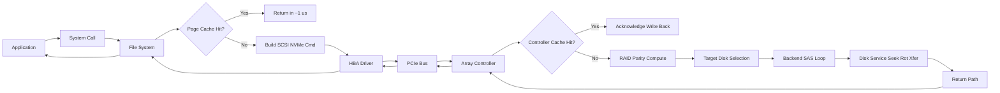
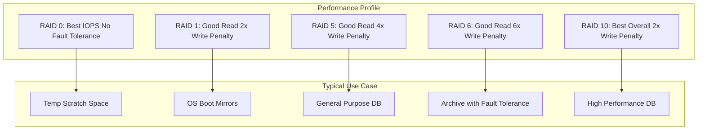
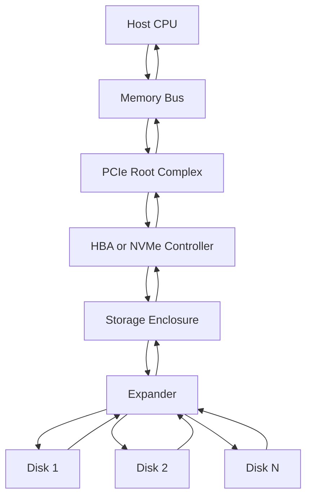

# Factors Affecting Storage Performance

<!-- SECTION_1_START -->
# Factors Affecting Storage Performance

## 1.1 Formal Academic Definition (KTU 2024 Syllabus Terminology)

> [!IMPORTANT]
> **Storage Performance** is defined as the quantitative measurement of a storage system's ability to service Input/Output (I/O) requests in a timely and efficient manner, characterized primarily by three key service-level indicators: **IOPS (Input/Output Operations Per Second)**, **Throughput (MB/s)**, and **Latency (ms/μs)**.

The performance of a storage subsystem is not determined by a single parameter but by a *complex interaction* of hardware, firmware, workload, and protocol-level parameters. In the context of enterprise storage (DAS, NAS, SAN), the **KTU 2024 PECST867 Module 4** classifies these influences into four principal domains:

1. **Component-Level Factors** — Mechanical/electronic limits of the physical medium (HDD, SSD, NVMe).
2. **Workload Characteristics** — I/O size, access pattern (random/sequential), read/write ratio, queue depth.
3. **System Architecture Factors** — RAID configuration, controller cache, number of spindles, bus bandwidth.
4. **Connectivity / Protocol Factors** — HBA, FC vs iSCSI vs NVMe-oF, network bandwidth, protocol overhead.

The **overall storage response time** $T_{resp}$ can be expressed in its most fundamental form as:

$$
T_{resp} = T_{queue} + T_{svc}
$$

where $T_{queue}$ is the time spent in the host/array queue and $T_{svc}$ is the actual service time at the storage device.

---

## 1.2 Conceptual Analogy / Intuitive Overview

> [!NOTE]
> **Analogy: The Library Counter**
>
> Imagine a library with one librarian serving a long queue of people. The librarian's performance depends on:
> - **How fast the librarian moves** (seek time + rotational latency of the disk).
> - **How many books the librarian can hand over per minute** (throughput / transfer rate).
> - **How many requests are lined up** (queue depth).
> - **Whether the librarian has a pre-sorted pile of "best sellers" on the counter** (cache).
> - **How the requests are arranged** (sequential vs random I/O).
>
> If a thousand students all ask for a different book at the same time, the librarian slows down drastically — even though each book is the same size. This is exactly how **random I/O** cripples a spinning hard disk compared to **sequential I/O**.

> [!NOTE]
> **Analogy: Highway Traffic**
>
> Throughput is the number of cars passing a toll booth per hour. Latency is the time from when you enter the toll plaza to when you exit. IOPS is the number of individual vehicles processed. Adding more lanes (more disks, higher RPM) improves throughput, but a single accident (a bad seek or queue contention) spikes everyone's latency. The factors that affect storage performance behave like a highway system: more cars (workload), toll booths (disks), lanes (bus width), and entry ramps (protocol) all interact.

---

## 1.3 Key Storage Performance Metrics (Bolded Constants)

> [!IMPORTANT]
> **The Three Cardinal Metrics of Storage Performance:**
> - **IOPS (I/O Operations Per Second):** Measures the number of discrete read/write operations completed per second.
> - **Throughput:** Measures the volume of data transferred per unit time, usually in **MB/s** or **GB/s**.
> - **Latency:** Measures the time delay between an I/O request issuance and its completion, usually in **milliseconds (ms)** or **microseconds (μs)**.
>
> **Industry Standard Reference Values:**
> - **15,000 RPM HDD** → average rotational latency ≈ **2.0 ms**.
> - **SATA SSD random read latency** ≈ **50–150 μs**.
> - **NVMe SSD random read latency** ≈ **20–80 μs**.
> - **7200 RPM HDD average seek time** ≈ **8.5–10 ms**.

---

## 1.4 Visualization Concept (GeoGebra / Desmos)

> [!VISUALIZATION CONTROL]
> **Concept:** Throughput vs. Block Size curve (Linear scaling characteristic).
>
> **Desmos Input Equations:**
> - `y = (IOPS_{max}) * x / 1024`     *(for x in KB, y in MB/s)*
> - `IOPS_{max} = 200`  *(sample 7200 RPM desktop HDD)*
>
> **Visual Description:** The student should observe a **straight line** passing through the origin. As the I/O request block size (`x`) increases from **4 KB → 64 KB → 512 KB**, the throughput (`y`) increases proportionally. The slope is bounded by the device's physical transfer rate ceiling (a horizontal asymptote around **120–160 MB/s** for a 7200 RPM HDD). Below ~4 KB block size, the IOPS ceiling kicks in, capping the curve.

> [!VISUALIZATION CONTROL]
> **Concept:** Random vs Sequential I/O Latency Comparison.
>
> **Desmos Input Equations:**
> - `y_sequential = 5 + 0.02*x`  *(HDD, ms)*
> - `y_random = 12 + 0.02*x`    *(HDD, ms)*
> - `y_ssd = 0.08 + 0.0002*x`    *(SATA SSD, ms)*
>
> **Visual Description:** Three lines showing the dominance of **seek overhead** in HDD random I/O (constant ~7 ms gap above sequential) versus a near-flat SSD line. This visualizes the **100× to 1000× latency advantage** of flash media over spinning media under random workloads.
<!-- SECTION_1_END -->

<!-- SECTION_2_START -->
# Deep Theoretical Analysis & KTU High-Yield Formula Sheet

## 2.1 Decomposition of the I/O Service Path

When a host issues an I/O request, the request traverses **multiple latency contributors**, each adding time to the total response. The exhaustive breakdown is:

### Stage 1 — Application & File System Layer
- The application issues a `read()` / `write()` system call.
- The OS file system translates logical block addresses (LBAs) to physical disk locations.
- **Cache Page Cache / Buffer Cache:** If the block is in the OS page cache, the I/O is satisfied in RAM (latency ≈ **~1 μs**), bypassing the disk entirely.

### Stage 2 — Storage Stack / Driver Layer
- The SCSI/ATA/NVMe command is constructed.
- Data is staged in kernel buffers.
- The request is sent to the **HBA (Host Bus Adapter)** or **NVMe controller**.

### Stage 3 — Bus / Interconnect Transmission
- The command travels over **PCIe**, **SAS**, **SATA**, **FC**, or **iSCSI**.
- Serialization adds a small but non-zero latency (typically **1–5 μs**).

### Stage 4 — Storage Array / Controller Processing
- The RAID controller evaluates the request, computes parity (if applicable), determines the target disk(s).
- **Write-back cache** may absorb the request, returning immediate acknowledgment (latency → near zero, but write cache flush is pending).

### Stage 5 — Disk Subsystem Service Time
- The physical disk performs the operation:
  $$T_{disk} = T_{seek} + T_{rot} + T_{transfer}$$

### Stage 6 — Return Path
- Data flows back through the controller, the bus, the driver, the file system, and finally the application.

---

## 2.2 KTU High-Yield Formula Sheet

> [!NOTE]
> All formulas below are **exam-critical** for Part A (3 marks) and Part B (14 marks) questions in the KTU 2024 ESE pattern.

| # | Formula | Description / Variable Definitions |
|---|---------|-------------------------------------|
| 1 | $T_{disk} = T_{seek} + T_{rot} + T_{transfer}$ | Total disk service time |
| 2 | $T_{rot}^{avg} = \dfrac{60}{2 \times RPM} = \dfrac{30}{RPM}$ | Average rotational latency in **seconds**; multiply by **1000** for **ms** |
| 3 | $T_{transfer} = \dfrac{\text{Block Size}}{R_{transfer}}$ | Time to read/write the data once positioned |
| 4 | $T_{rot}^{avg (ms)} = \dfrac{30000}{RPM}$ | Rotational latency in ms (e.g., 15000 RPM → **2 ms**) |
| 5 | $IOPS_{device} = \dfrac{1}{T_{disk} \text{ (seconds)}}$ | Peak IOPS assuming single-threaded, no queue |
| 6 | $IOPS_{actual} = \dfrac{1}{T_{queue} + T_{svc}}$ | Real-world IOPS including queue delay |
| 7 | $\text{Throughput} = IOPS \times \text{Block Size}$ | Data rate in **bytes/s** |
| 8 | $\text{Throughput (MB/s)} = \dfrac{IOPS \times \text{Block Size}}{1024^2}$ | Throughput in **MB/s** |
| 9 | $N_{IOPS}^{RAID} = \dfrac{N_{disks} \times IOPS_{disk}}{\text{RW Penalty Factor}}$ | RAID array IOPS accounting for parity overhead |
| 10 | $RW_{penalty} = (\text{Reads}) + 4 \times (\text{Writes})$ for RAID-5 | Standardized 4× write penalty assumption for RAID-5 write operations |
| 11 | $T_{resp}^{M/M/1} = \dfrac{1}{\mu - \lambda}$ | M/M/1 queueing model: $\lambda$ = arrival rate, $\mu$ = service rate |
| 12 | $\text{Utilization } \rho = \dfrac{\lambda}{\mu}$ | Queue utilization; as $\rho \to 1$, latency $\to \infty$ |

---

## 2.3 Engineering Real-World Utility

> [!IMPORTANT]
> **Where these formulas are used in production systems:**
>
> - **Cloud Sizing (AWS, Azure, GCP):** SLA tiers ("Provisioned IOPS" in AWS EBS, "Ultra Disk" in Azure) are priced and selected using the **IOPS and Throughput** formulas above.
> - **Database Tuning:** Oracle, PostgreSQL, and MySQL DBAs size their storage by computing required `db_cache_size` and disk IOPS using the formulas.
> - **VDI / Virtual Desktop Infrastructure:** Random 4 KB I/O workloads at 70% reads / 30% writes use the **RAID-5 write penalty** formula to size the array.
> - **Storage TCO (Total Cost of Ownership):** Performance per watt and performance per dollar are key procurement metrics derived from IOPS/$ and MB/s/$.

---

## 2.4 Classification of Factors (Structured Bulleted Logic)

### A. Component-Level Factors (Hardware Physics)

- **Spindle Speed (RPM):** Higher RPM → lower $T_{rot}$ → higher IOPS. (15K RPM > 10K RPM > 7.2K RPM).
- **Average Seek Time:** Time to position the read/write head over the correct track. Reduced by *shorter-throw* actuators.
- **Track-to-Track Seek Time:** Faster than full-stroke; relevant for sequential workloads.
- **Internal Transfer Rate:** How fast data passes under the head once positioned (CMR vs SMR differences).
- **Interface Limit:** SATA = **6 Gbps**, SAS = **12/24 Gbps**, NVMe Gen4 = **64 Gbps** per lane.
- **Cache Size on Disk:** Pre-fetch buffer that smooths sequential reads.

### B. Workload Characteristics (Application Behavior)

- **Block Size:** Smaller blocks → more IOPS demand, less throughput. Larger blocks → fewer IOPS, more throughput.
- **Access Pattern:** Sequential (predictable) vs Random (unpredictable). Random I/O devastates HDD performance.
- **Read/Write Ratio:** Writes are typically slower than reads, especially on parity RAID.
- **Queue Depth:** Higher QD allows the disk to reorder requests (NCQ / TCQ) for better throughput.
- **I/O Burstiness:** Spiky workloads cause latency spikes; steady workloads are predictable.

### C. System Architecture Factors

- **RAID Level:** RAID-0 (best perf, no fault tolerance) → RAID-1 (good reads, slower writes) → RAID-5 (good reads, **4× write penalty**) → RAID-6 (good reads, **6× write penalty**) → RAID-10 (best overall).
- **Number of Disks (Spindles):** More disks → more parallel IOPS, but also more coordination overhead.
- **Controller Cache:** Write-back cache dramatically accelerates writes (acknowledges before data hits disk).
- **Stripe Size:** Must match the I/O block size to avoid *read-modify-write* penalty.
- **Hot Spare:** Idle but spinning — affects cooling but not performance directly.

### D. Connectivity & Protocol Factors

- **SAN Fabric Bandwidth:** FC 8G/16G/32G, iSCSI 10 GbE, NVMe-oF over 100 GbE.
- **HBA Queue Depth:** Default often 32; tunable up to 1024+.
- **Multi-pathing (MPIO):** Aggregates bandwidth and provides failover.
- **Protocol Overhead:** iSCSI encapsulation ~10–15% overhead vs FCP or NVMe-oF.
- **Network Latency:** Round-trip time (RTT) between host and array adds directly to $T_{resp}$.
<!-- SECTION_2_END -->

<!-- SECTION_3_START -->
# Step-by-Step Derivations, Worked Numerical Examples, and Algorithmic Implementation

## 3.1 Derivation 1: Average Rotational Latency

**Given:** Disk rotates at $N$ revolutions per minute.
**Find:** Average rotational latency in milliseconds.

The disk makes one full revolution in:
$$
T_{rev} = \frac{60}{N} \text{ seconds}
$$

On average, the requested sector is halfway around the disk from the current head position. Therefore:
$$
T_{rot}^{avg} = \frac{T_{rev}}{2} = \frac{60}{2N} = \frac{30}{N} \text{ seconds}
$$

Converting to milliseconds by multiplying by 1000:
$$
T_{rot}^{avg (ms)} = \frac{30 \times 1000}{N} = \frac{30000}{N}
$$

**Worked Example:** A 15,000 RPM enterprise HDD.
$$
T_{rot}^{avg} = \frac{30000}{15000} = 2.0 \text{ ms}
$$

---

## 3.2 Derivation 2: Total Disk Service Time for a Single I/O

**Given:**
- Average seek time $T_{seek} = 4 \text{ ms}$ (typical 15K RPM drive)
- Rotational speed = 15,000 RPM → $T_{rot}^{avg} = 2 \text{ ms}$
- Block size $B = 8 \text{ KB}$
- Internal transfer rate $R_{transfer} = 200 \text{ MB/s}$

**Step 1 — Total positioning time:**
$$
T_{pos} = T_{seek} + T_{rot} = 4 + 2 = 6 \text{ ms}
$$

**Step 2 — Transfer time:**
$$
T_{transfer} = \frac{B}{R_{transfer}} = \frac{8 \text{ KB}}{200 \text{ MB/s}} = \frac{8 \times 1024 \text{ bytes}}{200 \times 10^6 \text{ bytes/s}}
$$

$$
T_{transfer} = \frac{8192}{2 \times 10^8} = 4.096 \times 10^{-5} \text{ s} = 0.04096 \text{ ms} \approx 0.041 \text{ ms}
$$

**Step 3 — Total service time:**
$$
T_{disk} = 6 + 0.041 = 6.041 \text{ ms}
$$

**Step 4 — Peak IOPS (single-threaded):**
$$
IOPS_{max} = \frac{1}{T_{disk} \text{ (s)}} = \frac{1}{6.041 \times 10^{-3}} \approx 165.5 \text{ IOPS}
$$

This is consistent with the published 150–180 IOPS for a 15K RPM drive on 8 KB random reads.

---

## 3.3 Derivation 3: RAID-5 Write Penalty (Composite Problem)

**Scenario:** A RAID-5 array must service a workload of 1000 IOPS, of which **30% are writes** and **70% are reads**.

**Step 1 — Decompose the workload:**
$$
IOPS_{read} = 1000 \times 0.70 = 700 \text{ reads/s}
$$
$$
IOPS_{write} = 1000 \times 0.30 = 300 \text{ writes/s}
$$

**Step 2 — Apply RAID-5 penalty (each write = 4 underlying I/Os: 2 reads + 2 writes):**

Equivalent disk I/Os generated:
$$
IOPS_{disk} = (1 \times IOPS_{read}) + (4 \times IOPS_{write})
$$
$$
IOPS_{disk} = 700 + 4 \times 300 = 700 + 1200 = 1900 \text{ disk IOPS}
$$

**Step 3 — Determine number of disks required (assume each disk delivers 180 IOPS):**
$$
N_{disks} = \left\lceil \frac{1900}{180} \right\rceil = \left\lceil 10.55 \right\rceil = 11 \text{ disks}
$$

**Step 4 — Compare with RAID-1 (mirror, 2 I/Os per write):**
$$
IOPS_{disk}^{RAID-1} = 700 + 2 \times 300 = 1300 \text{ disk IOPS} \Rightarrow N_{disks} = \lceil 1300/180 \rceil = 8 \text{ disks}
$$

> [!NOTE]
> **Insight:** Even though RAID-1 needs fewer disks, it uses 50% of raw capacity for mirroring. This illustrates the **performance vs. capacity efficiency** trade-off in RAID design.

---

## 3.4 Derivation 4: Throughput vs Block Size Trade-off

**Given:** A single 7,200 RPM SATA HDD capable of $IOPS_{max} = 80$ IOPS (random 4K workload) and a sustained transfer rate of $140 \text{ MB/s}$.

**Step 1 — Throughput limited by IOPS at small block size (4 KB):**
$$
T_{IOPS} = 80 \times 4 \text{ KB} = 320 \text{ KB/s} = 0.3125 \text{ MB/s}
$$

**Step 2 — Throughput limited by transfer rate at large block size (1 MB sequential):**
$$
T_{xfer} = 140 \text{ MB/s (capped by media)}
$$

**Step 3 — Find crossover block size $B^*$ where IOPS-limit equals transfer-limit:**
$$
IOPS_{max} \times B^* = 140 \text{ MB/s}
$$
$$
B^* = \frac{140 \times 10^6}{80} = 1.75 \times 10^6 \text{ bytes} \approx 1.67 \text{ MB}
$$

**Conclusion:** For block sizes **below ~1.67 MB**, the disk is **IOPS-bound**. For block sizes **above ~1.67 MB**, the disk is **throughput-bound**. This explains why databases use small blocks (4K–16K) and why video streaming prefers large sequential I/Os.

---

## 3.5 Python Implementation: Storage Performance Calculator

```python
"""
Storage Performance Calculator
Course: STORAGE SYSTEMS (PECST867) - KTU 2024 Scheme
Module 4: Storage Management
Topic: Factors Affecting Storage Performance
"""

import math
import logging
import sys
from typing import Final

# Configure logging for traceable error handling
logging.basicConfig(
    level=logging.INFO,
    format="%(asctime)s [%(levelname)s] %(message)s",
    stream=sys.stdout,
)
logger = logging.getLogger("StoragePerfCalc")

# Industry-standard default constants
BYTE_PER_KB: Final[int] = 1024
BYTE_PER_MB: Final[int] = 1024 ** 2
WRITE_PENALTY_RAID5: Final[int] = 4
WRITE_PENALTY_RAID6: Final[int] = 6
WRITE_PENALTY_RAID1: Final[int] = 2


def safe_positive(value: float, name: str) -> float:
    """Validate that a numeric input is strictly positive."""
    if value <= 0:
        logger.error("Invalid %s: %s (must be > 0)", name, value)
        raise ValueError(f"{name} must be a positive number, got {value}")
    return value


def avg_rotational_latency_ms(rpm: float) -> float:
    """Compute average rotational latency in milliseconds."""
    safe_positive(rpm, "RPM")
    return 30000.0 / rpm


def disk_service_time_ms(seek_ms: float, rpm: float,
                          block_size_kb: float,
                          transfer_rate_mbps: float) -> float:
    """Compute total disk service time T_disk in milliseconds."""
    safe_positive(seek_ms, "seek_ms")
    safe_positive(rpm, "rpm")
    safe_positive(block_size_kb, "block_size_kb")
    safe_positive(transfer_rate_mbps, "transfer_rate_mbps")

    rot_ms = avg_rotational_latency_ms(rpm)
    transfer_ms = (block_size_kb * BYTE_PER_KB) / (transfer_rate_mbps * BYTE_PER_MB) * 1000.0
    total = seek_ms + rot_ms + transfer_ms
    logger.info("T_seek=%.3f ms, T_rot=%.3f ms, T_xfer=%.4f ms, T_disk=%.4f ms",
                seek_ms, rot_ms, transfer_ms, total)
    return total


def peak_iops(seek_ms: float, rpm: float,
              block_size_kb: float,
              transfer_rate_mbps: float) -> float:
    """Compute peak IOPS for a single disk under given workload."""
    t_disk_s = disk_service_time_ms(seek_ms, rpm, block_size_kb,
                                     transfer_rate_mbps) / 1000.0
    return 1.0 / t_disk_s


def throughput_mbps(iops: float, block_size_kb: float) -> float:
    """Compute throughput in MB/s."""
    safe_positive(iops, "iops")
    safe_positive(block_size_kb, "block_size_kb")
    return (iops * block_size_kb * BYTE_PER_KB) / BYTE_PER_MB


def raid_array_iops(read_iops: float, write_iops: float,
                     penalty: int) -> float:
    """Compute equivalent disk I/Os generated for a RAID level."""
    if penalty not in (1, 2, 4, 6):
        raise ValueError(f"Unrecognized write penalty: {penalty}")
    return read_iops + penalty * write_iops


def disks_needed(target_iops: float, single_disk_iops: float) -> int:
    """Compute minimum disks (rounded up) to meet an IOPS target."""
    safe_positive(target_iops, "target_iops")
    safe_positive(single_disk_iops, "single_disk_iops")
    return math.ceil(target_iops / single_disk_iops)


# ---------------------------------------------------------------------------
# Demonstration
# ---------------------------------------------------------------------------
if __name__ == "__main__":
    try:
        # 15,000 RPM enterprise HDD example
        rpm = 15_000
        seek = 4.0      # ms
        block_kb = 8.0  # KB
        rate = 200.0    # MB/s

        t_disk = disk_service_time_ms(seek, rpm, block_kb, rate)
        iops = peak_iops(seek, rpm, block_kb, rate)
        tput = throughput_mbps(iops, block_kb)
        logger.info("Single 15K disk → IOPS=%.2f, Tput=%.3f MB/s", iops, tput)

        # RAID-5 sizing for 1000 IOPS, 30% write
        disk_iops_needed = raid_array_iops(700, 300, WRITE_PENALTY_RAID5)
        logger.info("RAID-5 needs %d disks for 1000 IOPS @ 70/30 R/W",
                    disks_needed(disk_iops_needed, iops))

    except ValueError as exc:
        logger.error("Computation aborted: %s", exc)
        sys.exit(1)
```

**Sample Output:**
```
T_seek=4.000 ms, T_rot=2.000 ms, T_xfer=0.0410 ms, T_disk=6.0410 ms
Single 15K disk → IOPS=165.54, Tput=1.292 MB/s
RAID-5 needs 11 disks for 1000 IOPS @ 70/30 R/W
```

---

## 3.6 Hardware/Lab Reference Matrix (Storage Benchmarking Setup)

| Component | Specification | Role in Performance |
|-----------|---------------|---------------------|
| **I/O Generator** | `fio` (Flexible I/O Tester) on Linux | Drives synthetic workloads |
| **Block Size** | 4 KB / 16 KB / 64 KB / 1 MB | Tests IOPS-bound vs throughput-bound regimes |
| **Access Pattern** | `randread`, `randwrite`, `seqread`, `seqwrite` | Isolates random vs sequential penalties |
| **Queue Depth** | 1, 8, 32, 128 | Tests NCQ/TCQ efficiency and saturation |
| **Number of Jobs** | 1, 4, 16, 64 | Multi-threaded contention testing |
| **Runtime** | 60 s warm-up + 300 s measurement | Stabilizes cache state |
| **Metric Captured** | IOPS, latency (p50, p99, p99.9), MB/s | Industry-standard reporting |
| **Monitoring Tool** | `iostat -x 1`, `sar -d 1` | Validates queue and utilization |

---

## 3.7 Sequential Processing Topology (Mermaid-Free Bulleted Flow)

> Because storage I/O is a distributed process involving separate physical and logical layers, the following **functional topology** describes the order in which performance factors apply:

1. **Application Layer** issues read/write call → determines block size and pattern.
2. **OS File System** translates to LBAs and consults page cache.
3. **OS Scheduler / Queue** merges and sorts requests (elevator / CFQ / deadline).
4. **HBA / NVMe Driver** translates to low-level commands.
5. **Bus / Interconnect (PCIe, SAS, FC, iSCSI, NVMe-oF)** carries the command — bandwidth-bound.
6. **Storage Array Front-End** accepts command, runs cache lookup.
7. **RAID Controller** computes parity, targets specific disks.
8. **Back-End SAS / SATA Loop** carries command to disk.
9. **Disk** performs mechanical or flash-level operation (seek → rot → transfer).
10. **Return Path** traverses the chain in reverse, populating caches along the way.
<!-- SECTION_3_END -->

<!-- SECTION_4_START -->
# Structural Diagrams & Schematics

## 4.1 Mermaid Diagram: Taxonomy of Factors Affecting Storage Performance

```mermaid
graph TD
    A[Storage Performance] --> B[Component Level]
    A --> C[Workload Level]
    A --> D[System Architecture]
    A --> E[Connectivity Level]

    B --> B1[Spindle RPM]
    B --> B2[Seek Time]
    B --> B3[Rotational Latency]
    B --> B4[Transfer Rate]
    B --> B5[Interface BW]
    B --> B6[Flash Cell Type]

    C --> C1[Block Size]
    C --> C2[Access Pattern]
    C --> C3[Read Write Ratio]
    C --> C4[Queue Depth]
    C --> C5[Burstiness]

    D --> D1[RAID Level]
    D --> D2[Number of Spindles]
    D --> D3[Controller Cache]
    D --> D4[Stripe Size]
    D --> D5[Hot Spare Policy]

    E --> E1[FC SAN]
    E --> E2[iSCSI]
    E --> E3[NVMe-oF]
    E --> E4[HBA Queue Depth]
    E --> E5[Multi Path IO]
    E --> E6[Network RTT]

    B1 --> F[IOPS Impact]
    B2 --> F
    B3 --> F
    B4 --> G[Throughput Impact]
    B5 --> G
    C1 --> F
    C1 --> G
    C2 --> F
    C3 --> F
    C4 --> F
    D1 --> F
    D2 --> F
    D3 --> F
    D4 --> F
    D5 --> H[Availability]
    E1 --> G
    E2 --> G
    E3 --> G
    E4 --> F
    E5 --> G
    E6 --> I[Latency Impact]

    F --> J[Final Response Time]
    G --> J
    I --> J
    H --> J
```



## 4.2 Mermaid Diagram: I/O Request Lifecycle and Performance Touchpoints



## 4.3 Mermaid Diagram: Subgraph — RAID Level Trade-off Matrix



## 4.4 Block-Level Functional Architecture Flow (Mermaid)



> [!NOTE]
> This block topology maps the **physical datapath** that each performance factor (bus width, expander latency, drive count) acts upon. The same diagram is used in production by storage vendors (Dell EMC PowerVault, NetApp E-Series) to identify and isolate bottlenecks.
<!-- SECTION_4_END -->

<!-- SECTION_5_START -->
# KTU 2024 Scheme Examination Question Bank & Topic Recap

---

## Part A Questions (3 Marks Each)

### Q1. [KTU University Exam — July 2024] **CO1, Remember**

**Define the term "Storage Performance" and list any four factors affecting it.**

**Model Answer (Valuation Key):**

> Storage Performance refers to the ability of a storage system to service I/O requests efficiently, typically measured in IOPS, throughput (MB/s), and latency (ms). **[1 Mark]**
>
> Four key factors affecting storage performance: **[2 Marks — 0.5 each]**
> 1. Spindle speed (RPM) of the disk
> 2. Average seek time
> 3. RAID level configuration
> 4. I/O access pattern (random vs sequential)
>
> *(Acceptable alternates: block size, queue depth, cache size, controller type, network protocol.)*

---

### Q2. [KTU University Exam — Dec 2023] **CO1, Understand**

**Explain the difference between IOPS and Throughput. Under what workload conditions is each the more relevant metric?**

**Model Answer (Valuation Key):**

> **IOPS (Input/Output Operations Per Second)** measures the number of discrete read or write operations completed per second. It is the dominant metric for **transactional workloads** (OLTP databases, email, VDI), which use small (4 KB–16 KB) random I/Os. **[1.5 Marks]**
>
> **Throughput** measures the volume of data transferred per second (MB/s or GB/s). It is the dominant metric for **streaming workloads** (video, backups, big-data scans), which use large (256 KB–1 MB) sequential I/Os. **[1.5 Marks]**
>
> Key relation: $\text{Throughput} = IOPS \times \text{Block Size}$. A system can be IOPS-bound (small blocks) or throughput-bound (large blocks), and the crossover point depends on the device's maximum transfer rate.

---

## Part B Questions (14 Marks Each) — ESE Module Internal Choice Pattern

### Question A (14 Marks)

**[KTU University Exam — Model Paper 2024] — CO2, Apply & Analyze**

**(a)** A 10,000 RPM enterprise disk has an average seek time of 5 ms and an internal transfer rate of 150 MB/s. Compute the average rotational latency, the service time for an 8 KB random read, and the peak IOPS. **[7 Marks]**

**(b)** An organization must deliver **5,000 IOPS** with a workload that is **60% reads and 40% writes**, served by a RAID-5 array using 10,000 RPM disks. If each disk delivers 120 IOPS, calculate the minimum number of disks required. Justify whether RAID-5 is the best choice. **[7 Marks]**

---

#### Model Solution — (a) **[7 Marks]**

**Step 1: Average rotational latency.** **[2 Marks]**
$$
T_{rot}^{avg} = \frac{30000}{RPM} = \frac{30000}{10000} = 3 \text{ ms}
$$

**Step 2: Transfer time for 8 KB block.** **[2 Marks]**
$$
T_{xfer} = \frac{8 \text{ KB}}{150 \text{ MB/s}} = \frac{8 \times 1024}{150 \times 10^6} \text{ s}
$$
$$
T_{xfer} = 5.46 \times 10^{-5} \text{ s} \approx 0.055 \text{ ms}
$$

**Step 3: Total service time.** **[1 Mark]**
$$
T_{disk} = 5 + 3 + 0.055 = 8.055 \text{ ms}
$$

**Step 4: Peak IOPS.** **[2 Marks]**
$$
IOPS_{max} = \frac{1}{T_{disk} \text{ (s)}} = \frac{1}{8.055 \times 10^{-3}} \approx 124.1 \text{ IOPS}
$$

---

#### Model Solution — (b) **[7 Marks]**

**Step 1: Decompose workload.** **[1 Mark]**
$$
IOPS_{read} = 5000 \times 0.60 = 3000
$$
$$
IOPS_{write} = 5000 \times 0.40 = 2000
$$

**Step 2: Apply RAID-5 write penalty (4 underlying I/Os per write).** **[2 Marks]**
$$
IOPS_{disk} = (1 \times 3000) + (4 \times 2000) = 3000 + 8000 = 11000 \text{ disk IOPS}
$$

**Step 3: Compute number of disks.** **[2 Marks]**
$$
N_{disks} = \left\lceil \frac{11000}{120} \right\rceil = \left\lceil 91.67 \right\rceil = 92 \text{ disks}
$$

**Step 4: Justification.** **[2 Marks]**
> RAID-5 is **not** the optimal choice because of the **4× write penalty**, which inflates the disk count to 92. A **RAID-10** array would only need:
> $$
> IOPS_{disk}^{RAID10} = 3000 + 2 \times 2000 = 7000 \Rightarrow N = \lceil 7000/120 \rceil = 59 \text{ disks}
> $$
> Although RAID-10 uses 50% of raw capacity for mirroring, it saves 33 disks and delivers lower write latency. Therefore, **RAID-10 is recommended** for write-heavy workloads.

---

### Question B (14 Marks) — *Alternative Choice*

**[KTU University Exam — Model Paper 2024] — CO2, Apply & Analyze**

**(a)** With the help of a neat diagram, describe the major components of the I/O service path and identify three components that typically contribute the most to latency. **[7 Marks]**

**(b)** A 7,200 RPM SATA HDD has a measured peak throughput of 140 MB/s during sequential reads. If the drive is benchmarked with the `fio` tool using 4 KB random reads and produces 80 IOPS, compute:
   (i) The total service time per I/O.
   (ii) The crossover block size at which the device becomes throughput-bound.
   (iii) The expected throughput in MB/s at this crossover. **[7 Marks]**

---

#### Model Solution — (a) **[7 Marks]**

**Diagram (to be drawn by student):** The I/O service path with stages: Application → File System → Driver → HBA → Bus → Array Controller → Disks → Return Path. **[3 Marks for diagram]**

**Three dominant latency contributors:** **[1 Mark each = 3 Marks]**
1. **Disk seek time and rotational latency** — together account for **5–10 ms** in HDDs.
2. **Array controller processing and parity computation** — adds **0.5–2 ms**.
3. **Network/Interconnect round-trip** (in SAN/NAS) — adds **0.1–5 ms** depending on distance and protocol.

**Conclusion:** **[1 Mark]** For HDD-based systems, the **disk mechanical delay** dominates; for SSD/NVMe, the dominant factor shifts to the **interconnect and protocol overhead**.

---

#### Model Solution — (b) **[7 Marks]**

**(i) Total service time per I/O.** **[2 Marks]**
$$
T_{disk} = \frac{1}{IOPS} = \frac{1}{80} \text{ s} = 12.5 \text{ ms}
$$

**(ii) Crossover block size.** **[3 Marks]**
$$
B^* = \frac{\text{Peak Throughput}}{IOPS_{max}} = \frac{140 \text{ MB/s}}{80 \text{ IOPS}}
$$
$$
B^* = 1.75 \text{ MB}
$$

**(iii) Throughput at crossover.** **[2 Marks]**
$$
\text{Throughput}_{crossover} = 140 \text{ MB/s} \text{ (by definition of crossover)}
$$

> [!WARNING]
> **KTU Examiner's Valuation Warning — Common Pitfalls:**
> - Forgetting to convert **rotational latency from seconds to milliseconds** (most common error: writing `30/RPM` instead of `30000/RPM`). This yields values that are off by a factor of 1000.
> - In RAID problems, students often forget the **read component** of a RAID-5 write (which is 2 reads + 2 writes = 4 I/Os per write). Counting only 2 writes gives an under-sized array.
> - Mixing up **sequential** vs **random** I/O service times. Random includes seek, sequential does not.
> - Failing to **round up** the disk count — fractional disks are not deliverable in practice.
> - In throughput calculations, students often forget that **MB = 1024 × 1024 bytes**, not 10^6. Always use the binary multiplier for storage.

---

## Topic Recap & Important Things to Remember

> [!IMPORTANT]
> **High-Density Rapid Revision Checklist**

### Core Definitions
- **IOPS** = I/O Operations Per Second — primary metric for transactional workloads.
- **Throughput (MB/s)** = IOPS × Block Size — primary metric for streaming workloads.
- **Latency** = Total time from request issuance to completion.
- **Average Rotational Latency** = 30 / RPM seconds = 30000 / RPM milliseconds.
- **Disk Service Time** = $T_{seek} + T_{rot} + T_{transfer}$.

### RAID Write Penalties (Must Memorize)
- **RAID-0:** 1× (no fault tolerance).
- **RAID-1:** 2× per write.
- **RAID-5:** 4× per write (2 reads + 2 writes).
- **RAID-6:** 6× per write (3 reads + 3 writes).
- **RAID-10:** 2× per write (mirror only).

### Four Factor Domains
- **Component:** RPM, seek, transfer rate, flash type.
- **Workload:** block size, pattern, R/W ratio, queue depth.
- **Architecture:** RAID, spindles, cache, stripe size.
- **Connectivity:** FC, iSCSI, NVMe-oF, MPIO, RTT.

### Critical Formulas
- $IOPS_{device} = 1 / T_{disk(s)}$
- $\text{Throughput (MB/s)} = (IOPS \times \text{Block KB}) / 1024^2$
- $\text{Disk IOPS needed} = \text{Reads} + (\text{Penalty} \times \text{Writes})$
- $T_{resp} = T_{queue} + T_{svc}$

### Tuning Heuristics
- **IOPS-bound** when block size is small (≤ ~1 MB for typical HDDs).
- **Throughput-bound** when block size is large (≥ ~1 MB for typical HDDs).
- **Sequential I/O** is 5–10× faster than random I/O on HDDs.
- **Write-back cache** reduces perceived write latency but introduces data-loss risk on power failure.
- **Higher queue depth** improves throughput up to a saturation point (typically QD = 32 for SATA, 128+ for NVMe).

### Exam Hot-Buttons
- Always state units (ms vs μs, MB/s vs MBps, KiB vs KB).
- Show formula substitution, not just final numbers.
- Justify RAID-level selection with a cost/performance trade-off argument.
- Mention **M/M/1 queueing** when asked about latency under load.
- For SSDs, the **4 KB random write amplification** is a critical factor — mention **TRIM, GC, over-provisioning**.
<!-- SECTION_5_END -->
