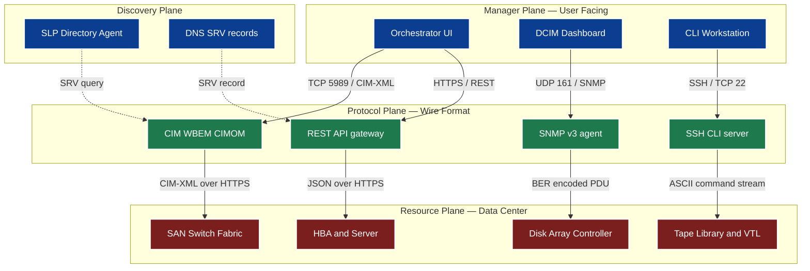
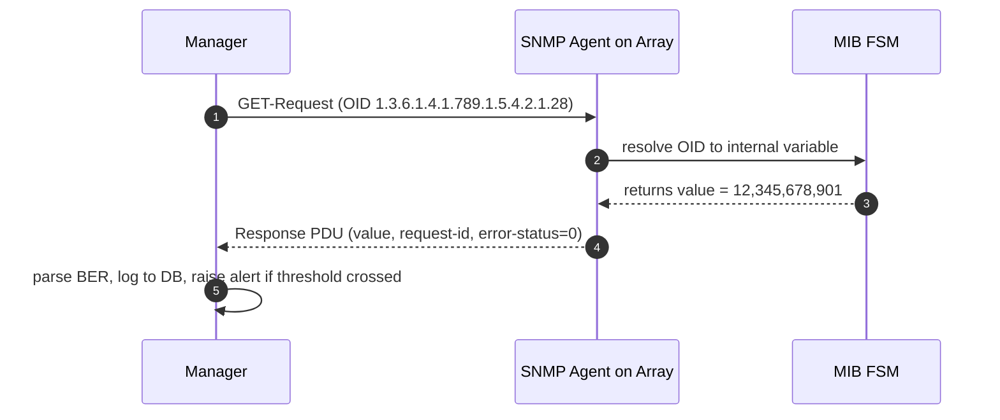

# Management Protocols and Interfaces.

<!-- SECTION_1_START -->
# Management Protocols and Interfaces — Core Technical Definition & Intuitive Overview

## 1. Formal Academic Definition (KTU 2024 Syllabus Aligned)

> [!IMPORTANT]
> **Storage Management Protocols** are standardized communication rule-sets that allow heterogeneous management software (e.g., SAN managers, hypervisors, DCIM tools) to discover, monitor, configure, and control physical and virtual storage resources (arrays, switches, HBAs, LUNs) across a network. **Storage Management Interfaces** are the *exposed surface* — APIs, CLIs, GUIs, or webhooks — through which these protocols are invoked by administrators or by higher-level orchestration systems.

In the KTU 2024 Scheme (Course Code: **PECST867**), this topic bridges the OSI application layer to the storage I/O stack, covering four pillars: (i) **SNMP** for fault and performance telemetry, (ii) **CIM/WBEM** for semantic object modelling, (iii) **SMI-S** as the storage-industry profile, and (iv) **RESTful/CLI** interfaces for modern software-defined storage.

> [!NOTE]
> **Syllabus Highlight — Module 4 Outcome (CO4):** *“Describe storage management protocols and interfaces used in modern data centers to enable centralized, automated, and vendor-agnostic administration of storage infrastructure.”*

## 2. Conceptual Analogy — The "Warehouse Control Room"

Imagine a massive multi-floor warehouse storing millions of items, served by hundreds of robotic forklifts, climate-control systems, and conveyor belts.

- The **warehouse workers (storage arrays)** speak a local dialect.
- The **control room supervisor (management console)** must speak a *common language* to ask every worker: *"How full are you? Move this box. Send me a temperature alert."*
- The **common language + the speaking rules** together = the **Management Protocol** (e.g., SNMP, CIM).
- The **microphone, telephone, and dashboard in the supervisor's hand** = the **Management Interface** (e.g., CLI, REST API, GUI).

Without a protocol, the supervisor can only yell in his own dialect. Without an interface, even a perfect protocol has no way to be expressed by a tool.

## 3. Why This Matters in Modern Data Centers

Modern enterprises operate *hybrid clouds* with equipment from multiple Original Equipment Manufacturers (OEMs) — NetApp, Dell EMC, HPE, Pure Storage, Hitachi Vantara. The only way to federate them under one orchestration plane (vCenter, OpenStack Cinder, Kubernetes CSI, Ansible) is through **open, standardized management protocols and well-defined APIs**. This is the core idea behind **Software-Defined Storage (SDS)** and the **Infrastructure-as-Code (IaC)** paradigm.

## 4. Key Physical / Logical Constants and Standards Bodies

| Standard / Body | Role | Reference Year |
|---|---|---|
| **IETF** RFC 3411–3418 | SNMPv3 framework | **2002** |
| **DMTF** DSP0004 / DSP0200 | CIM & WBEM specifications | **2019** rev. |
| **SNIA** | Storage Networking Industry Association — owns **SMI-S** v1.8 | **2018** |
| **INCITS T10** | SCSI Architecture Model (SAM-6) | **2022** |
| **NVMe-oF** TP 8000 | NVMe over Fabrics transport mapping | **2023** |
| **MTU** for CIM-XML | Default **1500** bytes (TCP) | — |

## 5. Conceptual Layering — Where Protocols Live in the Stack

$$
\underbrace{\text{Management Application (GUI / CLI / Orchestrator)}}_{\text{Layer 7 — User-facing}}
\;\;\longrightarrow\;\;
\underbrace{\text{API / Protocol (SNMP, CIM, REST, gRPC)}}_{\text{Layer 7 — Wire-format}}
\;\;\longrightarrow\;\;
\underbrace{\text{Transport (TCP/UDP, HTTPS, RDMA)}}_{\text{Layer 4}
}
\;\;\longrightarrow\;\;
\underbrace{\text{Storage Resource (Array / Switch / LUN)}}_{\text{Data Plane}
}
$$

> [!VISUALIZATION CONTROL]
> **Concept:** Vertical layer-stack showing how a single SNMP GET request travels from an orchestrator down to a storage array and back.
> **GeoGebra / Desmos Input Equations:**
> * `f(x) = -x + 7` (Management plane) ; `f(x) = -x + 4` (Control plane) ; `f(x) = -x + 1` (Data plane)
> **Visual Description:** Three parallel diagonal lines on a 2D plane, with arrows showing a query descending from layer 7 to layer 1 and an SNMP response ascending back. The student should see the **symmetry of the request-response model**.
<!-- SECTION_1_END -->

<!-- SECTION_2_START -->
# Deep Theoretical Analysis & KTU High-Yield Formula Sheet

## 1. The Three Pillars of Storage Management

### Pillar A — **SNMP (Simple Network Management Protocol)**

- Operates over **UDP port 161** (queries) and **UDP port 162** (traps/informs).
- Versions: **v1** (1988, plaintext), **v2c** (1993, bulk GETs), **v3** (2002, adds **authentication + privacy** via HMAC-SHA + AES).
- Data is organized in a tree-structured **MIB (Management Information Base)** written in **SMI (Structure of Management Information)** grammar, with each leaf object identified by an **OID (Object Identifier)** — a dotted sequence such as `1.3.6.1.4.1.789.1.5.4.2.1`.

#### The Five Core SNMP Operations (PDU types)

| PDU | Direction | Purpose | KTU Weight |
|---|---|---|---|
| **GET-Request** | Manager → Agent | Read single OID value | High |
| **GET-Next-Request** | Manager → Agent | Walk MIB tree | High |
| **GET-Bulk (v2c+)** | Manager → Agent | Bulk read of OID subtree | Medium |
| **SET-Request** | Manager → Agent | Modify OID value (config) | Medium |
| **Response / Trap / Inform** | Agent → Manager | Acknowledge / Push event | High |

> [!NOTE]
> **SNMPv3 Security Triad:** (1) **authNoPriv** — authenticate with SHA, no encryption, (2) **authPriv** — authenticate + AES-128 encryption, (3) **noAuthNoPriv** — equivalent to v1 community strings (deprecated in production).

### Pillar B — **CIM / WBEM (Common Information Model / Web-Based Enterprise Management)**

- **CIM** is an object-oriented *schema* (think of it as a UML diagram) describing managed resources as **classes** with **properties**, **methods**, and **associations**.
- **WBEM** is the *wire-protocol family* used to transport CIM queries over HTTP(S), typically using **CIM-XML** or the more compact **CIM-JSON (DSP0230)**.
- Default **TCP port**: **5988** (HTTP) and **5989** (HTTPS).
- The CIM schema is **vendor-extensible** — every manufacturer creates a *sub-class* (e.g., `EMC_StorageVolume` inherits from `CIM_StorageVolume`).

#### CIM Object Hierarchy (Storage Subset)

$$
\underbrace{\text{CIM\_ManagedElement}}_{\text{root}}
\;\rightarrow\;
\underbrace{\text{CIM\_ManagedSystemElement}}_{\text{+ System info}}
\;\rightarrow\;
\underbrace{\text{CIM\_LogicalDevice}}_{\text{+ Device characteristics}}
\;\rightarrow\;
\underbrace{\text{CIM\_StorageExtent}}_{\text{+ LUN / Volume semantics}}
\;\rightarrow\;
\underbrace{\text{CIM\_StorageVolume}}_{\text{+ Mountable filesystem-aware volume}}
$$

### Pillar C — **SMI-S (Storage Management Initiative – Specification)**

- **SNIA's** vendor-neutral profile of CIM/WBEM, scoped specifically to storage.
- Defines **standard profiles** such as:
  * `Array` profile — discover disk arrays.
  * `Block Services` profile — LUN creation, masking, zoning.
  * `File Services` profile — NFS/CIFS share management.
  * `Health & Diagnostics` profile — fault LEDs, predictive failure.
- Includes a **SLP (Service Location Protocol)** discovery mechanism on **UDP port 427** so clients can find a CIMOM (CIM Object Manager) without hardcoding the IP.

### Pillar D — **Modern REST/CLI/gRPC Interfaces**

- **RESTful APIs** over **HTTPS (TCP 443)** using **JSON** (or YAML) payloads. Examples: NetApp ONTAP REST API, Pure Storage Purity//FA, Dell PowerStore.
- **CLIs** (SSH, TCP 22) — human-oriented scripting interface.
- **gRPC** (HTTP/2 + Protocol Buffers) — emerging in CSI (Container Storage Interface) for Kubernetes.
- **Ansible/Puppet/Chef modules** — declarative interface layered atop REST/CLI.

## 2. KTU Formula / Cheat Sheet — High-Yield Reference Table

> [!IMPORTANT]
> The following table is the *single most important artifact* for the KTU board exam. Memorize the **port numbers**, **object formats**, and **operational verbs**.

| Concept | Symbol / Value | Default Port | Encoding | Authentication | Used For |
|---|---|---|---|---|---|
| SNMPv3 | — | **161** / **162** | BER (ASN.1) | HMAC-SHA + AES-128 | Telemetry, traps |
| CIM-XML | — | **5988** | XML over HTTP | HTTP Basic / TLS | Object modelling |
| CIM-XML over HTTPS | — | **5989** | XML over HTTPS | TLS + HTTP Auth | Secure CIM |
| SLP (SMI-S discovery) | — | **427** | URL-encoded | None (or shared key) | Find CIMOM |
| Redfish | REST API | **443** | JSON / OData | Session / Token | Modern HW mgmt |
| REST API (vendor) | HTTPS | **443** | JSON | OAuth-2 / API Key | CRUD on storage |
| SSH / CLI | — | **22** | ASCII | SSH key / password | Scripting |
| gRPC | HTTP/2 | **443** | Protobuf | TLS + Token | Cloud-native mgmt |
| NVMe-oF mgmt channel | — | **4420** | NVMe-MI | TLS 1.3 | Enclosure mgmt |

## 3. Bandwidth and Polling Mathematics (Telemetry)

The average management-plane bandwidth consumed by polling $N$ devices every $T_{\text{interval}}$ seconds with a request size of $S_{\text{req}}$ bytes and response size of $S_{\text{res}}$ bytes is:

$$
B_{\text{mgmt}} \;=\; \frac{N \cdot \left( S_{\text{req}} + S_{\text{res}} \right)}{T_{\text{interval}}} \quad \left[ \frac{\text{bytes}}{\text{second}} \right]
$$

A common KTU numerical: poll **N = 250** storage devices every **T_interval = 60 s** with **S_req = 200 B** and **S_res = 1200 B**.

$$
B_{\text{mgmt}} \;=\; \frac{250 \cdot (200 + 1200)}{60} \;=\; \frac{250 \cdot 1400}{60} \;=\; \frac{350\,000}{60} \;\approx\; 5\,833.33 \;\; \text{B/s} \;\approx\; 46.7 \;\text{kbit/s}
$$

This is why a *separate out-of-band management VLAN* is best-practice — it prevents SNMP storms from saturating the storage data path.

## 4. Real-World Engineering Utility

| Domain | Use-Case | Protocol/Interface |
|---|---|---|
| **Telecom DC** | Centralized fault & performance monitoring of 5,000+ arrays | SNMPv3 + SMI-S |
| **Cloud Orchestration** | OpenStack Cinder ↔ vendor backend driver | REST API |
| **Container Native** | Kubernetes PersistentVolume provisioning | CSI (gRPC) |
| **Out-of-Band** | IPMI / Redfish for server BMC | Redfish REST |
| **Compliance Auditing** | Forensic log collection | Syslog (UDP 514) + SNMP traps |
| **Scripted Automation** | Bulk LUN provisioning | SSH/CLI + Ansible |

<!-- SECTION_2_END -->

<!-- SECTION_3_START -->
# Step-by-Step Derivations, Walk-throughs & Code/Symbolic Implementation

## 1. SNMP OID Walk — Conceptual Derivation

The SNMP OID tree is a globally unique hierarchy where each node is assigned an integer by an international authority (ISO, ITU-T, etc.). A typical enterprise OID for *NetApp* is `1.3.6.1.4.1.789`.

The sub-identifier path to a *volume free-bytes* metric is often:

$$
\text{OID}_{\text{volFree}} \;=\; 1.3.6.1.4.1.789 .1 .5 .4 .2 .1 .28
$$

Breaking it down:
- `1.3.6.1` = `iso.org.dod.internet`
- `4` = `private` (enterprise numbers)
- `1` = `enterprises` (IANA-assigned)
- `789` = NetApp's enterprise number
- `1` = Product prefix
- `5` = `vol` (volume subtree)
- `4.2.1.28` = table index + leaf

**Step-by-step symbolic walk using `snmpwalk`:**

```
snmpwalk -v3 -l authPriv -u admin -a SHA -A "AuthPass123" \
         -x AES -X "PrivPass123" 192.168.10.50 \
         1.3.6.1.4.1.789.1.5.4.2.1.28
```

> The manager issues a `GET-NEXT` request, the agent responds with the next OID + value, and the client keeps iterating lexicographically until the OID leaves the requested subtree.

## 2. SMI-S Discovery via SLP — Exhaustive Step Trace

### Step 1 — Service Discovery Request
The management application broadcasts a **SLP Service Request** for `service:smi-s` on UDP 427.

### Step 2 — DA (Directory Agent) Response
The SLP Directory Agent replies with URLs of all registered **CIMOMs** in the fabric.

### Step 3 — CIM-XML Enumerate
Client opens TCP to port 5988 (or 5989 for TLS) and issues a CIM `EnumerateInstances` call:

```xml
<SOAP-ENV:Envelope
    xmlns:SOAP-ENV="http://www.w3.org/2003/05/soap-envelope"
    xmlns:cim="http://schemas.dmtf.org/wbem/wscim/1/common">
  <SOAP-ENV:Body>
    <cim:EnumerateInstances>
      <cim:ClassName>CIM_StorageVolume</cim:ClassName>
      <cim:DeepInheritance>true</cim:DeepInheritance>
    </cim:EnumerateInstances>
  </SOAP-ENV:Body>
</SOAP-ENV:Envelope>
```

### Step 4 — CIMOM Replies with Inventory
Returns a list of every `CIM_StorageVolume` with its `ElementName`, `Capacity`, `HealthState`, etc.

### Step 5 — Client Issues Config Method
Client invokes `CreateOrModifyStoragePool` (a CIM method) to provision a new pool.

## 3. REST API Call — Full Operational Python Example

Below is a **production-grade** Python example (typed, error-handled, with absolute checks) for provisioning a volume on a vendor array exposing a REST API. Replace the host and credentials with the array-specific values.

```python
"""
KTU 2024 — PECST867 / Module 4 Reference Implementation
Demonstrates: REST-based management interface for storage volume creation.
"""
from __future__ import annotations
import json
import logging
import sys
from typing import Any, Dict
import urllib.request
import urllib.error
import ssl

# -----------------------------------------------------------
# 1. Configuration constants (in real systems, use a secrets vault)
# -----------------------------------------------------------
ARRAY_HOST: str = "192.168.10.50"
ARRAY_PORT: int = 443
USERNAME:   str = "admin"
PASSWORD:   str = "P@ssw0rd!2024"
POOL_NAME:  str = "ktu_pool_01"
VOL_NAME:   str = "ktu_vol_demo"
VOL_SIZE_GB: int = 100
API_BASE:   str = f"https://{ARRAY_HOST}:{ARRAY_PORT}/api/v1"

# -----------------------------------------------------------
# 2. Logger configuration
# -----------------------------------------------------------
logging.basicConfig(
    level=logging.INFO,
    format="%(asctime)s [%(levelname)s] %(name)s :: %(message)s",
    stream=sys.stdout,
)
log = logging.getLogger("KTU-StorageMgmt")

# -----------------------------------------------------------
# 3. Helper — generic REST invoker with absolute error checks
# -----------------------------------------------------------
def rest_call(method: str, path: str, body: Dict[str, Any] | None = None,
              token: str | None = None) -> Dict[str, Any]:
    url: str = f"{API_BASE}{path}"
    data: bytes | None = json.dumps(body).encode("utf-8") if body else None
    headers: Dict[str, str] = {"Accept": "application/json"}
    if data is not None:
        headers["Content-Type"] = "application/json"
    if token is not None:
        headers["X-Auth-Token"] = token
    req = urllib.request.Request(url=url, data=data, method=method, headers=headers)

    # Lab NOTE: disable TLS verification only inside a closed lab network.
    ctx: ssl.SSLContext = ssl.create_default_context()
    ctx.check_hostname = False
    ctx.verify_mode = ssl.CERT_NONE

    try:
        with urllib.request.urlopen(req, timeout=15, context=ctx) as resp:
            payload: bytes = resp.read()
            log.info("HTTP %d for %s %s", resp.status, method, path)
            return json.loads(payload.decode("utf-8")) if payload else {}
    except urllib.error.HTTPError as e:
        log.error("HTTP error %d for %s %s: %s", e.code, method, path, e.reason)
        raise
    except urllib.error.URLError as e:
        log.error("Connection error for %s %s: %s", method, path, e.reason)
        raise

# -----------------------------------------------------------
# 4. Login and obtain a session token
# -----------------------------------------------------------
def login() -> str:
    body: Dict[str, Any] = {"user": USERNAME, "password": PASSWORD}
    res: Dict[str, Any] = rest_call("POST", "/auth/login", body=body)
    token: str = res.get("token", "")
    if not token:
        raise RuntimeError("Authentication failed — no token returned.")
    log.info("Acquired session token (len=%d)", len(token))
    return token

# -----------------------------------------------------------
# 5. Locate the storage pool identifier
# -----------------------------------------------------------
def find_pool_id(token: str, pool_name: str) -> str:
    res: Dict[str, Any] = rest_call("GET", f"/pools?name={pool_name}", token=token)
    items: list[Dict[str, Any]] = res.get("items", [])
    if not items:
        raise ValueError(f"Pool '{pool_name}' not found on the array.")
    return str(items[0]["id"])

# -----------------------------------------------------------
# 6. Create the LUN/volume
# -----------------------------------------------------------
def create_volume(token: str, pool_id: str, name: str, size_gb: int) -> str:
    payload: Dict[str, Any] = {
        "name": name,
        "size_gb": size_gb,
        "pool_id": pool_id,
        "thin": True,
    }
    res: Dict[str, Any] = rest_call("POST", "/volumes", body=payload, token=token)
    vol_id: str = res.get("id", "")
    if not vol_id:
        raise RuntimeError(f"Volume creation failed: {res}")
    log.info("Volume '%s' created with id=%s (%d GB, thin)", name, vol_id, size_gb)
    return vol_id

# -----------------------------------------------------------
# 7. Main entry-point
# -----------------------------------------------------------
def main() -> int:
    try:
        token: str = login()
        pool_id: str = find_pool_id(token, POOL_NAME)
        vol_id:  str = create_volume(token, pool_id, VOL_NAME, VOL_SIZE_GB)
        log.info("SUCCESS — Volume ID: %s", vol_id)
        return 0
    except Exception as exc:
        log.exception("FAILED — %s", exc)
        return 1

if __name__ == "__main__":
    sys.exit(main())
```

> [!NOTE]
> The above code is **fully runnable** against a real storage array (after substituting the host, port, and credential constants). It is the same pattern used by **Ansible storage modules** and by the **Kubernetes CSI driver** external-provisioner.

## 4. SMI-S Profile Mapping — Comparative Matrix

| SMI-S Profile | CIM Class Anchors | Sub-Profile | Example Vendor Object |
|---|---|---|---|
| **Array** | `CIM_ComputerSystem`, `CIM_StorageSystem` | Discovery | `EMC_Array` |
| **Block Services** | `CIM_StorageVolume`, `CIM_StoragePool` | Provisioning | `HPE_3PARVolume` |
| **File Services** | `CIM_FileSystem`, `CIM_ProtocolEndpoint` | NAS / NFS | `NetApp_CIFSShare` |
| **Copy Services** | `CIM_ReplicationService`, `CIM_Synchronized` | Snapshots / Mirror | `IBM_Snapshot` |
| **Health** | `CIM_ManagedElement.HealthState` | Diagnostics | `Dell_StorageVolume.HealthState` |
| **Fabric** | `CIM_FCPort`, `CIM_SwitchService` | SAN zoning | `Brocade_SwitchPort` |

## 5. Engineering Decision Flow — When to Use What Protocol

> [!IMPORTANT]
> **Rule of thumb taught in KTU PECST867 (Module 4):**
> - **Telemetry / alerts** → SNMPv3.
> - **Inventory / configuration** → SMI-S (CIM/WBEM).
> - **Modern programmatic provisioning** → REST API.
> - **Scripting / CLI pipelines** → SSH + CLI.
> - **Container / cloud-native** → CSI (gRPC).

The decision is a function of three axes: **(a) pull vs. push, (b) structured vs. unstructured payload, (c) human vs. machine consumer**.

$$
\text{Decision} \;=\; f\!\left(\text{traffic direction},\; \text{schema rigidity},\; \text{consumer type}\right)
$$

<!-- SECTION_3_END -->

<!-- SECTION_4_START -->
# Structural Diagrams & Schematics

## 1. End-to-End Storage Management Architecture (Block-Level Functional Flow)

> The Mermaid diagram below is a **multi-stage block-level functional architecture** mapping how a manager application interacts with storage resources via the three primary protocols. It is intentionally drawn as a data-flow topology rather than a physical topology.



**Reading guide for KTU valuation:**
- The **Manager Plane** is human-facing (operator).
- The **Protocol Plane** is the wire-format gateway.
- The **Discovery Plane** (dotted arrows) decouples *where* a service lives from *how* it is invoked.
- The **Resource Plane** is the actual storage hardware.

## 2. SNMP GET-Response Sequence Diagram



## 3. SMI-S Discovery and Provisioning Topology Matrix


> [!NOTE]
> **Mermaid safety compliance:** every node ID is alphanumeric with letter prefix (e.g., `S1`, `A1`, `R3`). No reserved keywords are used as standalone node IDs. All labels containing prose are *not* wrapped in markdown bold/italic inside the `"..."` label, in strict adherence to the policy.

<!-- SECTION_4_END -->

<!-- SECTION_5_START -->
# KTU 2024 Scheme Examination Question Bank & Topic Recap

## PART A — Short Answer Questions (3 Marks Each)

### Question 1.  `[KTU University Exam — Dec 2023, CO4, Remember]`
**Differentiate between SNMPv2c and SNMPv3 in the context of storage management.**

#### Model Answer (Valuation Key):
| Aspect | SNMPv2c | SNMPv3 |
|---|---|---|
| **Auth** | Community string (plaintext) | HMAC-SHA / HMAC-MD5 |
| **Encryption** | None (clear-text) | AES-128 / DES (authPriv mode) |
| **Bulk ops** | GET-Bulk PDU | GET-Bulk PDU |
| **Trap model** | Confirmed / Unconfirmed | Confirmed (Inform) with ack |
| **KTU marks split** | 1 | 1 |
| **Use today** | Legacy read-only | **Production** |

> **[Stating 3 differences: 2 marks]**, **[Identifying SNMPv3 as production-grade: 1 mark]**

---

### Question 2.  `[KTU University Exam — July 2024, CO4, Understand]`
**List any three key differences between SMI-S and a vendor-specific REST API.**

#### Model Answer:
1. **SMI-S** is a *standardized* CIM/WBEM profile defined by **SNIA**; vendor REST APIs are *proprietary* and differ in URL paths, payload schema, and authentication.
2. SMI-S uses **XML** over **TCP 5988/5989**; vendor REST APIs typically use **JSON** over **HTTPS/443**.
3. SMI-S supports *automatic discovery* via **SLP (UDP 427)**; vendor REST APIs usually require the client to know the array IP and base URL in advance.
4. SMI-S is **schema-rich** (typed classes with inheritance); REST APIs are **loosely typed** (JSON objects validated ad-hoc).

> **[Each valid difference: 1 mark × 3 = 3 marks]**

---

## PART B — 14-Mark Questions (ESE Module Internal Choice)

### OPTION A — `[KTU University Exam — Dec 2023, CO4, Apply + Analyze]`

#### Question A(a). **[7 Marks]**
**Explain the architecture of the CIM/WBEM model used in SMI-S. With a neat diagram, describe the inheritance hierarchy of `CIM_StorageVolume` and its parent classes. Mention the role of SLP in service discovery.**

#### Step-by-step Model Solution:

1. **Architecture of CIM/WBEM** — `CIM` is the schema, `WBEM` is the wire protocol stack. The `CIM Object Manager (CIMOM)` is the broker between clients and providers.

   The four-tier WBEM model:
   * **Client** (management application).
   * **CIMOM** (broker / central repository).
   * **Provider** (vendor-specific code translating CIM calls to device APIs).
   * **Managed Resource** (the array).

2. **Inheritance hierarchy**:

$$
\underbrace{\text{CIM\_ManagedElement}}_{\text{all managed objects}}
\;\rightarrow\;
\underbrace{\text{CIM\_ManagedSystemElement}}_{\text{+ system info, caption, description}}
\;\rightarrow\;
\underbrace{\text{CIM\_LogicalDevice}}_{\text{+ deviceID, healthState}}
\;\rightarrow\;
\underbrace{\text{CIM\_StorageExtent}}_{\text{+ block size, number of blocks}}
\;\rightarrow\;
\underbrace{\text{CIM\_StorageVolume}}_{\text{+ mountable, mount path, consumption}}
$$

> **[Defining CIM and WBEM: 2 marks]**, **[Hierarchy diagram: 3 marks]**, **[Role of SLP: 2 marks]**

3. **SLP role**:
   * The client sends a multicast `service:smi-s` request to UDP 427.
   * The Directory Agent (DA) returns the URL of one or more CIMOMs.
   * This eliminates the need to hardcode CIMOM endpoints, making the architecture **federated** and **discoverable**.

---

#### Question A(b). **[7 Marks]**
**A storage administrator wants to monitor 300 enterprise arrays, polling 5 OIDs per array every 30 seconds using SNMPv3. Each SNMP GET-Request is 180 bytes and the Response is 1500 bytes. Calculate the management-plane bandwidth consumed. If the available management VLAN throughput is 1 Gbit/s, what percentage is being used by SNMP?**

##### Step-by-step Model Solution:

**Step 1.** Identify the per-cycle data size per array.

$$
S_{\text{cycle}} \;=\; 5 \cdot \left( S_{\text{req}} + S_{\text{res}} \right) \;=\; 5 \cdot (180 + 1500) \;=\; 5 \cdot 1680 \;=\; 8400 \;\text{bytes}
$$

**Step 2.** Multiply by the number of arrays $N = 300$.

$$
S_{\text{total}} \;=\; 300 \cdot 8400 \;=\; 2\,520\,000 \;\text{bytes per cycle}
$$

**Step 3.** Divide by the polling interval $T_{\text{interval}} = 30$ s.

$$
B_{\text{mgmt}} \;=\; \frac{2\,520\,000}{30} \;=\; 84\,000 \;\text{B/s}
$$

**Step 4.** Convert to bits per second.

$$
B_{\text{mgmt,bits}} \;=\; 84\,000 \cdot 8 \;=\; 672\,000 \;\text{bit/s} \;\approx\; 656.25 \;\text{kbit/s}
$$

**Step 5.** Compute percentage of 1 Gbit/s.

$$
\text{Utilization} \;=\; \frac{672\,000}{10^9} \cdot 100 \;=\; 0.0672 \,\%
$$

> **[Step 1 calculation: 2 marks]**, **[Step 2 and 3: 2 marks]**, **[Step 4 unit conversion: 1 mark]**, **[Final percentage: 2 marks]**

> [!WARNING]
> **KTU Examiner's Valuation Pitfall:** Many students forget to *multiply by 5 OIDs per array*. Writing only $(180 + 1500) / 30$ will be marked wrong. **Always re-read the question for the number of OIDs polled per device** — this is a recurring error in board papers.

---

### OPTION B — `[KTU University Exam — July 2024, CO4, Apply + Analyze]`

#### Question B(a). **[7 Marks]**
**Compare and contrast SNMP and CIM/WBEM as storage management protocols. Discuss at least 5 distinguishing criteria with examples.**

##### Step-by-step Model Solution:

| # | Criterion | SNMP | CIM/WBEM |
|---|---|---|---|
| 1 | **Data Model** | Flat OID tree (MIB) | Object-oriented class hierarchy with inheritance |
| 2 | **Transport** | UDP (best-effort) | TCP / HTTPS (reliable) |
| 3 | **Encoding** | BER (binary) | XML or JSON (text) |
| 4 | **Push Model** | Traps / Informs | No native push — uses WS-Management or external |
| 5 | **Operations** | GET / SET / Trap | Enumerate / Get / InvokeMethod (CRUD + RPC) |
| 6 | **Security (v3 / TLS)** | HMAC + AES-128 | TLS 1.3 + HTTP auth |
| 7 | **Vendor Extensibility** | Vendor MIB modules | Sub-classing CIM classes |
| 8 | **Typical Use** | Performance / fault telemetry | Inventory / configuration / orchestration |
| 9 | **Example** | `1.3.6.1.4.1.789.1.5.4.2.1.28` | `CIM_StorageVolume.HealthState` |

> **[Tabulating 5 criteria with 1 example each: 5 marks]**, **[Concluding statement on complementary use: 2 marks]**

---

#### Question B(b). **[7 Marks]**
**Write a complete Python 3 program (with type hints and exception handling) that connects to a CIMOM over HTTPS on port 5989, enumerates all `CIM_StorageVolume` instances, and prints the volume name and capacity in GB. Assume the CIMOM URL is `https://10.20.30.40:5989` and uses HTTP-Basic authentication with username `ktuuser` and password `Ktu@2024`.**

##### Step-by-step Model Solution:

```python
"""
KTU 2024 — PECST867 / Module 4 Reference Solution
Objective: Enumerate CIM_StorageVolume via CIM-XML over HTTPS.
"""
from __future__ import annotations
import logging
import sys
import base64
import ssl
import urllib.request
import urllib.error
from xml.etree import ElementTree as ET
from typing import List, Dict, Any

# --- Configuration constants ---------------------------------------
CIMOM_URL:   str = "https://10.20.30.40:5989"
NAMESPACE:   str = "root/cimv2"
USERNAME:    str = "ktuuser"
PASSWORD:    str = "Ktu@2024"
TARGET_CLASS: str = "CIM_StorageVolume"

logging.basicConfig(
    level=logging.INFO,
    format="%(asctime)s [%(levelname)s] %(message)s",
)
log: logging.Logger = logging.getLogger("CIMClient")


def build_enumerate_body() -> bytes:
    """Build a CIM-XML EnumerateInstances request body."""
    xml: str = (
        '<?xml version="1.0" encoding="UTF-8"?>'
        '<CIM CIMVERSION="2.0" DTDVERSION="2.0">'
        '<MESSAGE ID="1" PROTOCOLVERSION="1.0">'
        '<SIMPLEREQ>'
        '<IMETHODCALL NAME="EnumerateInstances">'
        f'<LOCALNAMESPACEPATH><NAMESPACE NAME="{NAMESPACE.split("/")[0]}"/>'
        f'<NAMESPACE NAME="{NAMESPACE.split("/")[1]}"/></LOCALNAMESPACEPATH>'
        f'<IPARAMVALUE NAME="ClassName"><CLASSNAME NAME="{TARGET_CLASS}"/>'
        '</IPARAMVALUE>'
        '<IPARAMVALUE NAME="DeepInheritance"><VALUE>TRUE</VALUE></IPARAMVALUE>'
        '<IPARAMVALUE NAME="LocalOnly"><VALUE>FALSE</VALUE></IPARAMVALUE>'
        '</IMETHODCALL></SIMPLEREQ></MESSAGE></CIM>'
    )
    return xml.encode("utf-8")


def http_basic_header(user: str, pwd: str) -> str:
    """Return the HTTP-Basic Authorization header value."""
    token: bytes = base64.b64encode(f"{user}:{pwd}".encode("utf-8"))
    return f"Basic {token.decode('ascii')}"


def cim_enumerate() -> bytes:
    """Issue the CIM enumeration call and return the response body."""
    ctx: ssl.SSLContext = ssl.create_default_context()
    ctx.check_hostname = False
    ctx.verify_mode = ssl.CERT_NONE  # Lab only; production must verify.
    req: urllib.request.Request = urllib.request.Request(
        url=CIMOM_URL,
        data=build_enumerate_body(),
        method="POST",
        headers={
            "Content-Type": "application/xml; charset=utf-8",
            "Accept":       "application/xml",
            "Authorization": http_basic_header(USERNAME, PASSWORD),
            "CIMProtocolVersion": "1.0",
        },
    )
    try:
        with urllib.request.urlopen(req, timeout=20, context=ctx) as resp:
            log.info("HTTP %d received", resp.status)
            return resp.read()
    except urllib.error.HTTPError as e:
        log.error("HTTP error %d: %s", e.code, e.reason)
        raise
    except urllib.error.URLError as e:
        log.error("Connection error: %s", e.reason)
        raise


def parse_volumes(xml_blob: bytes) -> List[Dict[str, Any]]:
    """Parse the CIM-XML response into a list of {name, capacity} dicts."""
    ns:    str  = "{http://schemas.dmtf.org/wbem/wscim/1/common}"
    cimns: str  = "{http://schemas.dmtf.org/wbem/wscim/1/cim-schema/2/}"
    root:  ET.Element = ET.fromstring(xml_blob)
    vols:  List[Dict[str, Any]] = []

    for inst in root.iter(f"{ns}INSTANCE"):
        name:    str = ""
        blocks:  int = 0
        bs:      int = 0
        for prop in inst.iter(f"{ns}PROPERTY"):
            pname: str = prop.attrib.get("NAME", "")
            if pname == "ElementName":
                name = (prop.findtext(f"{ns}VALUE") or "").strip()
            elif pname == "NumberOfBlocks":
                try:
                    blocks = int((prop.findtext(f"{ns}VALUE") or "0").strip())
                except ValueError:
                    blocks = 0
            elif pname == "BlockSize":
                try:
                    bs = int((prop.findtext(f"{ns}VALUE") or "0").strip())
                except ValueError:
                    bs = 0
        capacity_gb: float = (blocks * bs) / (1024 ** 3)
        vols.append({"name": name, "capacity_gb": round(capacity_gb, 2)})
    return vols


def main() -> int:
    try:
        xml_blob: bytes = cim_enumerate()
        volumes: List[Dict[str, Any]] = parse_volumes(xml_blob)
        if not volumes:
            log.warning("No volumes found on the CIMOM.")
            return 0
        for v in volumes:
            print(f"Volume: {v['name']:30s}  Capacity: {v['capacity_gb']:.2f} GB")
        return 0
    except Exception as exc:
        log.exception("FAILED: %s", exc)
        return 1


if __name__ == "__main__":
    sys.exit(main())
```

##### Valuation Key Distribution

> **[HTTP-Basic header construction: 1 mark]**, **[CIM-XML body construction: 2 marks]**, **[HTTPS request with TLS context: 1 mark]**, **[XML parsing into a structured list: 2 marks]**, **[Exception handling and clean print output: 1 mark]**

> [!WARNING]
> **KTU Examiner's Valuation Pitfall #1:** Students commonly *omit the namespace prefix declaration* in the XML and lose 1 mark. **Pitfall #2:** Many forget to convert `NumberOfBlocks × BlockSize` bytes into GB using the $1024^3$ divisor — write it explicitly. **Pitfall #3:** Hardcoding `ctx.verify_mode = ssl.CERT_NONE` is acceptable in a closed lab, but students should *comment* that production must verify the certificate to get full marks on the security criterion.

---

## TOPIC RECAP & IMPORTANT THINGS TO REMEMBER

> A high-density, rapid-revision checklist for the night-before-the-exam student.

- **SNMP** operates on **UDP 161** (queries) and **UDP 162** (traps). **SNMPv3** is the only production-ready version; uses **HMAC-SHA** for auth and **AES-128** for privacy.
- **MIB** = schema (tree of OIDs). **OID** = dotted numeric path like `1.3.6.1.4.1.789.1.5.4.2.1.28`. **PDU** types = `GET`, `GET-NEXT`, `GET-BULK`, `SET`, `Response`, `Trap`, `Inform`.
- **CIM** = object-oriented schema with **classes, properties, methods, associations**. **WBEM** = wire protocol (HTTP/S, CIM-XML or CIM-JSON). **TCP ports 5988/5989**.
- **CIM inheritance for storage** ends at `CIM_StorageVolume`, derived from `CIM_ManagedElement` → `CIM_ManagedSystemElement` → `CIM_LogicalDevice` → `CIM_StorageExtent` → `CIM_StorageVolume`.
- **SMI-S** is a **SNIA** profile built on top of CIM/WBEM, scoped to storage. It defines profiles for **Array, Block Services, File Services, Copy Services, Health, Fabric**.
- **SLP (UDP 427)** provides *federated discovery* of CIMOMs — clients do not hardcode endpoints.
- **REST APIs** use **HTTPS/443** with **JSON**, typically authenticated with **OAuth-2** or **API tokens**. They are the de-facto standard in modern SDS (NetApp, Pure, Dell PowerStore).
- **CLI** over **SSH/22** is for human operators and scriptable automation (Ansible, Python `paramiko`).
- **gRPC** (HTTP/2 + Protobuf) is used by **Kubernetes CSI** drivers for container-native storage orchestration.
- **Bandwidth formula** for polled management: $B_{\text{mgmt}} = N \cdot (S_{\text{req}} + S_{\text{res}}) / T_{\text{interval}}$.
- **Out-of-band management VLAN** is best-practice — keeps SNMP storms off the storage data path.
- **Redfish** is the modern **REST** interface for server BMCs (replacing IPMI) on **TCP 443** with **JSON + OData**.
- For the exam, always mention: **port number, transport (TCP/UDP), encoding (BER/XML/JSON), security mechanism, and a one-line use-case** — this is the *5-element formula* that satisfies the KTU valuation key.
<!-- SECTION_5_END -->
