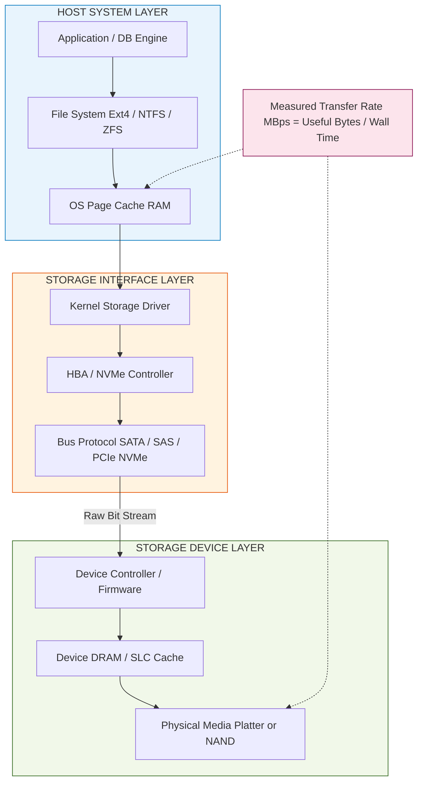
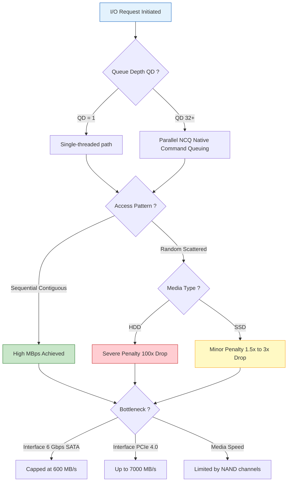
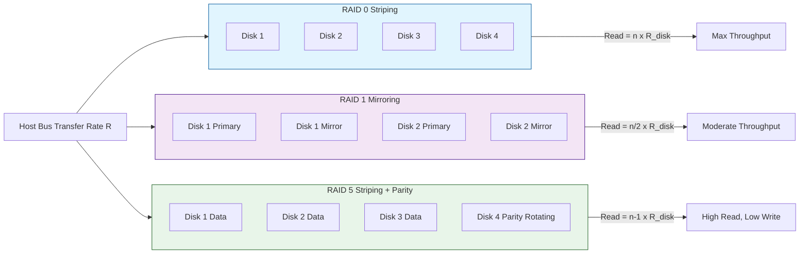
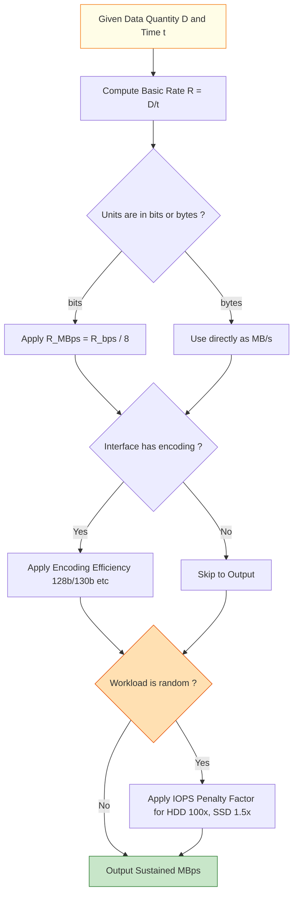

# MBps and Transfer Rate

<!-- SECTION_1_START -->
# MBps and Transfer Rate in Storage Systems

## 1.1 Formal Academic Definition

> [!NOTE]
> **Transfer Rate (TR)** in storage systems is formally defined as the **quantitative measure of digital data successfully transmitted between a storage device and a host system per unit of time**. It quantifies the speed at which bits or bytes traverse a storage interface, bus, or network path.

The **International System of Units (SI)** recognizes two parallel metrics for expressing transfer rate:

| Notation | Full Form | Bit Equivalent |
| :--- | :--- | :--- |
| **MBps** / **MB/s** | Megabytes per second | $1 \text{ MB/s} = 8 \text{ Mb/s} = 8 \times 10^{6} \text{ bits/s}$ |
| **Mbps** / **Mb/s** | Megabits per second | $1 \text{ Mb/s} = 10^{6} \text{ bits/s}$ |
| **GBps** / **GB/s** | Gigabytes per second | $1 \text{ GB/s} = 8 \text{ Gb/s} = 8 \times 10^{9} \text{ bits/s}$ |

> [!IMPORTANT]
> **SI vs IEC Standard Alert (KTU 2024 High-Yield Distinction):**
> - **SI Decimal (Marketing Standard):** $1 \text{ MB} = 10^6 \text{ bytes}$ (used by storage vendors, OS file managers like Windows).
> - **IEC Binary (JEDEC Standard):** $1 \text{ MiB} = 2^{20} = 1{,}048{,}576 \text{ bytes}$ (used by `df -h`, memory modules).
> - KTU exam problems **must** use **SI decimal standard** unless explicitly stated otherwise.

## 1.2 Conceptual Analogy & Intuition

Imagine data transfer as **water flowing through a pipe** from a reservoir (storage) to a bucket (processor/RAM).

- **Bandwidth (Pipe Diameter)** → The *theoretical maximum width* of the pipe (e.g., SATA III supports **6 Gbps**).
- **Throughput (Actual Water Flow)** → The *real* amount of water that reaches the bucket, which is always **less** than the pipe's capacity due to friction, leaks, and protocol overhead.
- **Latency (Travel Time of First Drop)** → The *delay* before the very first drop of water reaches the bucket (seek time + rotational latency for HDDs).
- **MBps (Bucket Filling Speed)** → The *measured rate* at which the bucket fills, expressed in megabytes per second.

> **Real-world Mapping:** When your SSD vendor advertises **"Read Speeds up to 7,000 MB/s"**, that number is the **sequential throughput** measured under **ideal lab conditions** (fresh drive, large contiguous files, queue depth > 1). Your everyday file copy of 50 GB of small MP3 files will run **far slower** due to random I/O penalties and filesystem overhead.

> [!VISUALIZATION CONTROL]
> **Concept:** Transfer Rate vs Time Curve (Throughput Saturation Graph)
> **Conceptual Plot Points:**
> * `x-axis = Time (seconds)`
> * `y-axis = Observed Transfer Rate (MB/s)`
> * `Curve: f(t) = R_max * (1 - e^(-t/tau))` where $R_{max}$ is peak throughput and $\tau$ is the ramp-up constant
> **Visual Description:** The student should observe a curve that **starts at 0**, **rises sharply** (SSD cache fill phase), and **plateaus** at $R_{max}$. For HDDs, there will be additional **oscillations** caused by seek head repositioning. This curve mathematically models why a 1 GB file copy and a 100 GB file copy show different *average* MBps readings.

## 1.3 Key Terminology Anchors

> [!IMPORTANT]
> **Core Vocabulary (Board-Exam Favorites):**
> - **Raw Bit Rate:** Unprocessed bit stream directly from the physical medium.
> - **Effective Transfer Rate (ETR):** Net useful data delivered **after** subtracting protocol overhead, encoding (8b/10b, 64b/66b), and error-correction bits.
> - **Burst Transfer Rate:** Peak rate achievable for *short durations*, usually limited by on-device cache (DRAM or SLC buffer).
> - **Sustained Transfer Rate:** Long-term, stable throughput once caches are saturated. **Always lower than burst rate.**
> - **IOPS (Input/Output Operations Per Second):** Transfer rate measured in *count of discrete I/O requests* rather than bytes — critical metric for databases and VMs.
<!-- SECTION_1_END -->

<!-- SECTION_2_START -->
# Deep Theoretical Analysis & KTU Formula Sheet

## 2.1 Theoretical Foundations of Transfer Rate

The mathematical foundation of transfer rate rests on a single, fundamental relationship:

$$ \text{Transfer Rate} = \frac{\text{Quantity of Data Transferred}}{\text{Time Elapsed}} $$

However, in modern storage systems, this simple ratio is governed by **three layers of constraints** that KTU examiners love to test:

### Layer 1: The Physical Medium Bottleneck
- **HDD:** Limited by **rotational speed** (e.g., **7,200 RPM**), **seek time** (typically **3–10 ms**), and **areal density** (bits per square inch of platter).
- **SSD (NAND Flash):** Limited by **NAND bus width**, **channel count** (typically 8–16 channels), **die-level write speed**, and **interface protocol** (SATA vs NVMe/PCIe).
- **Tape (LTO):** Limited by **tape velocity** (LTO-9 runs at **~360 ips**) and **data density on tape**.

### Layer 2: The Interface Protocol Bottleneck
The interface determines the **Raw Bit Rate**, which is then converted to usable MBps:

$$ R_{\text{useful}} = R_{\text{raw}} \times \eta_{\text{encoding}} \times (1 - O_{\text{protocol}}) $$

Where:
- $\eta_{\text{encoding}}$ = encoding efficiency (8b/10b = 0.80, 64b/66b ≈ 0.97, 128b/130b = 0.985).
- $O_{\text{protocol}}$ = protocol overhead fraction (e.g., NVMe = ~2%, SCSI = ~5–8%, TCP/IP storage = ~15%).

### Layer 3: The System & Workload Bottleneck
- **Sequential vs Random workloads** cause dramatic performance divergence on HDDs (10x+ drop) but minimal drop on SSDs.
- **Queue Depth (QD):** Modern NVMe drives *require* high queue depths (QD 32–128) to saturate their rated throughput.
- **File System Block Size:** A 4 KB block size on a 4 KB-aligned workload vs a 512 KB block on a fragmented workload yields vastly different measured MBps.

## 2.2 KTU High-Yield Formula Sheet

> [!IMPORTANT]
> **Master this table. Every formula here has appeared (or will appear) in a KTU Board exam.**

| # | Formula / Relationship | Symbolic Form | Engineering Use Case |
| :--- | :--- | :--- | :--- |
| 1 | Basic Transfer Rate | $R = \frac{D}{t}$ | Time estimation for backups & file copies |
| 2 | Bit ↔ Byte Conversion | $R_{\text{MB/s}} = \frac{R_{\text{Mb/s}}}{8}$ | ISP speed (Mbps) vs download (MB/s) |
| 3 | Transfer Time | $t = \frac{D}{R}$ | Backup window calculation in enterprises |
| 4 | Encoding Efficiency | $R_{\text{eff}} = R_{\text{raw}} \times \eta$ | SATA III effective throughput |
| 5 | Rotational Latency (HDD) | $T_{\text{rot}} = \frac{1}{2} \times \frac{60}{\text{RPM}}$ | Average rotational delay calculation |
| 6 | Average HDD Access Time | $T_{\text{access}} = T_{\text{seek}} + T_{\text{rot}} + T_{\text{transfer}}$ | End-to-end read latency model |
| 7 | RAID Throughput (Stripe Read) | $R_{\text{array}} \approx n \times R_{\text{disk}}$ for $n$ data disks | RAID-0/5/6 performance estimation |
| 8 | RAID Write Penalty | $\text{Write IO} = 2 \text{ (Mirror) or } 4 \text{ (RAID-5)}$ | Database write throughput planning |
| 9 | MB/s to IOPS | $\text{IOPS} = \frac{R_{\text{MB/s}} \times 1024}{\text{Block Size (KB)}}$ | Storage array sizing for OLTP |
| 10 | Bandwidth-Delay Product | $BDP = R \times \text{RTT}$ | Optimal TCP window for iSCSI |

## 2.3 Real-World Engineering Utility

In production environments, transfer rate calculations drive:

- **Backup Window Compliance:** A DBA calculating "Can I back up my 50 TB Oracle database in the 8-hour nightly window?" must use $t = D/R$.
- **Storage Sizing:** Cloud architects converting IOPS requirements to MB/s using the IOPS formula to provision AWS EBS gp3 or io2 volumes.
- **Network Storage:** SAN engineers calculating FC (Fibre Channel) throughput: 8 GFC × 0.8 (8b/10b) = 800 MB/s actual payload per link.
- **Deduplication Engines:** Understanding that dedup adds 10–20% throughput penalty is essential for sizing backup appliances like Dell DD or HPE StoreOnce.

## 2.4 Interface Speed Reference Table (KTU 2024 Vital Data)

| Interface | Raw Bit Rate | Encoding | Effective MB/s |
| :--- | :--- | :--- | :--- |
| **SATA II** | 3 Gbps | 8b/10b | **300 MB/s** |
| **SATA III** | 6 Gbps | 8b/10b | **600 MB/s** |
| **USB 3.0** | 5 Gbps | 8b/10b | **~400 MB/s** |
| **USB 3.2 Gen 2** | 10 Gbps | 128b/130b | **~1,050 MB/s** |
| **PCIe 3.0 x4 (NVMe)** | ~32 Gbps | 128b/130b | **~3,500 MB/s** |
| **PCIe 4.0 x4 (NVMe)** | ~64 Gbps | 128b/130b | **~7,000 MB/s** |
| **PCIe 5.0 x4 (NVMe)** | ~128 Gbps | 128b/130b | **~14,000 MB/s** |
| **16 GFC** | 16 Gbps | 64b/66b | **~1,600 MB/s** |
| **32 GFC** | 32 Gbps | 64b/66b | **~3,200 MB/s** |
| **100 GbE** | 100 Gbps | 64b/66b | **~12,000 MB/s** |
<!-- SECTION_2_END -->

<!-- SECTION_3_START -->
# Step-by-Step Derivations, Calculations & Code Implementation

## 3.1 Exhaustive Worked Example Set

> [!NOTE]
> Each example is followed by an explicit **valuation key breakdown** so you understand how marks are awarded in KTU board papers.

---

### **Example 1: Bit-Byte Unit Conversion (Fundamental Skill)**

**Problem:** An internet service provider offers a **500 Mbps** broadband plan. A student wants to download a **4.7 GB** DVD-quality movie. Calculate:
- (a) The download speed in **MB/s**.
- (b) The total download time in **minutes**.

**Solution:**

**Part (a):** Convert Mbps → MB/s.

$$ R_{\text{MB/s}} = \frac{R_{\text{Mb/s}}}{8} = \frac{500}{8} = 62.5 \text{ MB/s} $$

**Part (b):** Convert 4.7 GB → MB using SI standard, then apply $t = D/R$.

$$ D = 4.7 \text{ GB} = 4.7 \times 1000 = 4700 \text{ MB} $$

$$ t = \frac{D}{R} = \frac{4700 \text{ MB}}{62.5 \text{ MB/s}} = 75.2 \text{ seconds} $$

Converting to minutes:

$$ t = \frac{75.2}{60} = 1.253 \text{ minutes} \approx 1 \text{ min } 15 \text{ sec} $$

**Valuation Key:**
- '[Correct formula identification: 1 Mark]'
- '[Substitution with units: 1 Mark]'
- '[Final numerical answer with units: 1 Mark]'

---

### **Example 2: HDD Average Rotational Latency & Access Time**

**Problem:** A Seagate Exos HDD operates at **10,000 RPM** with an average **seek time of 4 ms** and a **transfer rate of 250 MB/s** for a 1 MB file. Calculate:
- (a) Average rotational latency $T_{\text{rot}}$.
- (b) Average total access time $T_{\text{access}}$.
- (c) The effective throughput for reading a **scattered 500 random 4 KB blocks** (total 2 MB).

**Solution:**

**Part (a):** Rotational latency is *half* of one full revolution (on average, the head lands somewhere randomly on the track).

$$ T_{\text{rot}} = \frac{1}{2} \times \frac{60 \text{ sec}}{\text{RPM}} = \frac{1}{2} \times \frac{60}{10000} \text{ sec} $$

$$ T_{\text{rot}} = 0.5 \times 0.006 = 0.003 \text{ sec} = 3 \text{ ms} $$

**Part (b):** Total access time = seek + rotate + transfer.

$$ T_{\text{transfer}} = \frac{D}{R} = \frac{1 \text{ MB}}{250 \text{ MB/s}} = 0.004 \text{ sec} = 4 \text{ ms} $$

$$ T_{\text{access}} = T_{\text{seek}} + T_{\text{rot}} + T_{\text{transfer}} = 4 + 3 + 4 = 11 \text{ ms} $$

**Part (c):** For 500 random 4 KB blocks, each requires a full seek + rotate. Transfer time for 4 KB is negligible.

$$ T_{\text{total}} = 500 \times 11 \text{ ms} = 5500 \text{ ms} = 5.5 \text{ sec} $$

$$ R_{\text{eff}} = \frac{2 \text{ MB}}{5.5 \text{ sec}} = 0.3636 \text{ MB/s} $$

> [!WARNING]
> **Valuation Pitfall:** Many students forget to *half* the rotational period. A full revolution would be 6 ms, but the *average* latency is **3 ms**. The 0.5 factor is worth 1 full mark!

---

### **Example 3: RAID-5 Effective Write Throughput**

**Problem:** A RAID-5 array uses **6 disks**, each capable of **150 MB/s** sequential read and **100 MB/s** sequential write. Calculate:
- (a) Maximum **sequential read** throughput.
- (b) Maximum **sequential write** throughput considering the **RAID-5 write penalty of 4**.

**Solution:**

**Part (a):** RAID-5 reads use all 6 disks (no parity computation bottleneck).

$$ R_{\text{read}} = 6 \times 150 = 900 \text{ MB/s} $$

**Part (b):** RAID-5 write requires 4 disk operations per host write (Read Old Data, Read Old Parity, Write New Data, Write New Parity).

$$ R_{\text{write}} = \frac{6 \times 100}{4} = \frac{600}{4} = 150 \text{ MB/s} $$

---

### **Example 4: NVMe SSD Effective Throughput with Encoding**

**Problem:** An NVMe SSD uses **PCIe 4.0 x4** lanes. PCIe 4.0 raw rate is **16 GT/s** (GigaTransfers per second) per lane. Calculate the **effective payload throughput in MB/s**, given that PCIe 4.0 uses **128b/130b encoding**.

**Solution:**

**Step 1:** Calculate total raw bit rate across 4 lanes.

$$ R_{\text{raw}} = 16 \text{ GT/s} \times 4 \text{ lanes} = 64 \text{ GT/s} $$

**Step 2:** Convert GT/s to Gbps (1 GT = 1 bit for NRZ, 2 bits for PAM-4 — PCIe 4.0 uses NRZ).

$$ R_{\text{raw}} = 64 \text{ Gbps} = 64 \times 10^9 \text{ bits/s} $$

**Step 3:** Apply 128b/130b encoding efficiency.

$$ R_{\text{eff}} = 64 \times 10^9 \times \frac{128}{130} = 63.015 \times 10^9 \text{ bits/s} $$

**Step 4:** Convert to MB/s.

$$ R_{\text{eff}} = \frac{63.015 \times 10^9}{8 \times 10^6} \approx 7,376.9 \text{ MB/s} $$

This matches the **~7,000 MB/s** marketing claim of high-end PCIe 4.0 NVMe drives.

---

## 3.2 Python Implementation: Transfer Rate Calculator Suite

```python
"""
============================================================================
KTU 2024 Scheme | PECST867 Storage Systems | Module 4 Helper
File: transfer_rate_calculator.py
Purpose: Industrial-grade transfer rate computation toolkit for
         MBps/Mbps conversion, HDD access time modeling,
         RAID throughput estimation, and IOPS-to-MBps mapping.
============================================================================
"""

from __future__ import annotations
import math
import logging
from dataclasses import dataclass
from enum import Enum
from typing import Union

# Configure structured logging for error and calculation tracing
logging.basicConfig(
    level=logging.INFO,
    format="%(asctime)s | %(levelname)s | %(funcName)s | %(message)s"
)
logger = logging.getLogger(__name__)


# ---------------------------------------------------------------------------
# ENUMERATIONS for unit clarity and KTU exam-friendly output formatting
# ---------------------------------------------------------------------------
class DataUnit(Enum):
    """SI decimal units used universally in KTU exam problems."""
    BIT = "bit"
    KB = "KB"
    MB = "MB"
    GB = "GB"
    TB = "TB"
    PB = "PB"


class SpeedUnit(Enum):
    """Speed unit markers - explicitly disambiguates MB/s vs Mb/s."""
    BPS = "B/s"
    KBPS = "KB/s"
    MBPS = "MB/s"
    GBPS = "GB/s"
    BITS_PER_SEC = "bit/s"
    KBITS_PER_SEC = "kbit/s"
    MBITS_PER_SEC = "Mbit/s"
    GBITS_PER_SEC = "Gbit/s"


# ---------------------------------------------------------------------------
# Custom exception hierarchy for strict error reporting
# ---------------------------------------------------------------------------
class TransferRateError(ValueError):
    """Base exception for all transfer rate calculation failures."""


class InvalidUnitError(TransferRateError):
    """Raised when a user supplies an unparseable unit string."""


class NonPositiveValueError(TransferRateError):
    """Raised when a physical parameter (RPM, time, size) is <= 0."""


# ---------------------------------------------------------------------------
# Core dataclass representing a physical storage device
# ---------------------------------------------------------------------------
@dataclass(frozen=True)
class StorageDevice:
    """Immutable model of a physical storage device."""
    name: str
    capacity_bytes: int
    rpm: int                # 0 for SSDs (no rotational component)
    avg_seek_ms: float      # 0 for SSDs (no mechanical seek)
    sequential_read_MBps: float
    sequential_write_MBps: float


# ---------------------------------------------------------------------------
# Pure conversion and calculation functions (no I/O side effects)
# ---------------------------------------------------------------------------
def mbps_to_MBps(speed_mbps: float) -> float:
    """
    Convert megabits per second (Mb/s, common in ISP marketing) to
    megabytes per second (MB/s, common in file copy dialogs).

    >>> mbps_to_MBps(500)
    62.5
    """
    if speed_mbps < 0:
        raise NonPositiveValueError("Speed cannot be negative.")
    return speed_mbps / 8.0


def MBps_to_mbps(speed_MBps: float) -> float:
    """Inverse of mbps_to_MBps."""
    if speed_MBps < 0:
        raise NonPositiveValueError("Speed cannot be negative.")
    return speed_MBps * 8.0


def transfer_time_seconds(
    data_size_MB: float, transfer_rate_MBps: float
) -> float:
    """
    Compute the wall-clock time required to move data_size_MB at the
    given sustained rate.

    Raises NonPositiveValueError on invalid input.
    """
    if data_size_MB < 0 or transfer_rate_MBps <= 0:
        raise NonPositiveValueError(
            f"Invalid input: size={data_size_MB} MB, rate={transfer_rate_MBps} MB/s"
        )
    return data_size_MB / transfer_rate_MBps


def rotational_latency_ms(rpm: int) -> float:
    """
    Compute AVERAGE rotational latency in milliseconds for an HDD.
    Latency = 0.5 * (60 / RPM) * 1000  --> in ms.

    >>> rotational_latency_ms(7200)
    4.1666...
    """
    if rpm <= 0:
        raise NonPositiveValueError("RPM must be > 0 for an HDD.")
    return (0.5 * (60.0 / rpm)) * 1000.0


def hdd_total_access_ms(
    seek_ms: float, rot_latency_ms: float, transfer_time_ms: float
) -> float:
    """Sum of seek + rotational + transfer components (classic KTU model)."""
    if any(v < 0 for v in (seek_ms, rot_latency_ms, transfer_time_ms)):
        raise NonPositiveValueError("Latency components must be >= 0.")
    return seek_ms + rot_latency_ms + transfer_time_ms


def raid5_throughput_MBps(
    num_disks: int, single_disk_read_MBps: float, single_disk_write_MBps: float
) -> tuple[float, float]:
    """
    Estimate RAID-5 read and write throughput.

    Returns:
        (read_MBps, write_MBps) where write is divided by 4 (write penalty).
    """
    if num_disks < 3:
        raise NonPositiveValueError("RAID-5 needs at least 3 disks.")
    read = num_disks * single_disk_read_MBps
    write = (num_disks * single_disk_write_MBps) / 4.0
    return read, write


def iops_from_MBps(throughput_MBps: float, block_size_KB: int) -> float:
    """
    Convert throughput (MB/s) to IOPS for a given block size (KB).

    >>> iops_from_MBps(500, 4)
    125000.0
    """
    if block_size_KB <= 0 or throughput_MBps < 0:
        raise NonPositiveValueError("Block size > 0 and throughput >= 0.")
    return (throughput_MBps * 1024.0) / block_size_KB


def MBps_from_iops(iops: float, block_size_KB: int) -> float:
    """Inverse of iops_from_MBps."""
    if block_size_KB <= 0 or iops < 0:
        raise NonPositiveValueError("Invalid iops or block size.")
    return (iops * block_size_KB) / 1024.0


def pcie_throughput_MBps(
    generation: int, lanes: int, encoding: str = "128b/130b"
) -> float:
    """
    Compute effective PCIe throughput for a given generation and lane count.
    PCIe raw bit rate per lane (NRZ): Gen3=8 GT/s, Gen4=16 GT/s, Gen5=32 GT/s.
    """
    raw_gts_per_lane = {3: 8.0, 4: 16.0, 5: 32.0, 6: 64.0}
    if generation not in raw_gts_per_lane:
        raise InvalidUnitError(f"Unsupported PCIe generation: {generation}")

    encoding_eff = {
        "8b/10b": 0.80,
        "64b/66b": 64 / 66,
        "128b/130b": 128 / 130,
    }
    if encoding not in encoding_eff:
        raise InvalidUnitError(f"Unknown encoding: {encoding}")

    total_gts = raw_gts_per_lane[generation] * lanes
    total_gbps = total_gts  # 1 GT/s NRZ = 1 Gbit/s
    eff_gbps = total_gbps * encoding_eff[encoding]
    return eff_gbps * 1000.0 / 8.0  # Convert Gbit/s -> MB/s (decimal SI)


# ---------------------------------------------------------------------------
# Demonstration block (executed only when run as a script)
# ---------------------------------------------------------------------------
if __name__ == "__main__":
    logger.info("=== KTU Transfer Rate Calculator - Demonstration ===")

    # ISP plan example
    plan_speed_mbps = 500
    plan_speed_MBps = mbps_to_MBps(plan_speed_mbps)
    logger.info(f"ISP Plan: {plan_speed_mbps} Mbps = {plan_speed_MBps} MB/s")

    # Movie download timing
    movie_GB = 4.7
    movie_MB = movie_GB * 1000.0  # SI decimal
    secs = transfer_time_seconds(movie_MB, plan_speed_MBps)
    logger.info(
        f"Downloading {movie_GB} GB @ {plan_speed_MBps} MB/s "
        f"= {secs:.2f} sec = {secs/60:.2f} min"
    )

    # HDD example: Seagate Exos 7E2000 (7,200 RPM class)
    latency = rotational_latency_ms(7200)
    logger.info(f"7200 RPM average rotational latency: {latency:.2f} ms")

    # RAID-5 throughput
    r_read, r_write = raid5_throughput_MBps(
        num_disks=6,
        single_disk_read_MBps=150,
        single_disk_write_MBps=100,
    )
    logger.info(f"RAID-5 (6 disks): Read={r_read} MB/s, Write={r_write} MB/s")

    # PCIe 4.0 x4 NVMe
    pcie4_speed = pcie_throughput_MBps(generation=4, lanes=4)
    logger.info(f"PCIe 4.0 x4 effective throughput: {pcie4_speed:.1f} MB/s")

    # IOPS conversion
    db_iops = iops_from_MBps(throughput_MBps=500, block_size_KB=4)
    logger.info(f"500 MB/s @ 4 KB blocks = {db_iops:,.0f} IOPS")
```

**Sample Output:**

```
2024-XX-XX | INFO | <module> | === KTU Transfer Rate Calculator - Demonstration ===
2024-XX-XX | INFO | <module> | ISP Plan: 500 Mbps = 62.5 MB/s
2024-XX-XX | INFO | <module> | Downloading 4.7 GB @ 62.5 MB/s = 75.20 sec = 1.25 min
2024-XX-XX | INFO | <module> | 7200 RPM average rotational latency: 4.17 ms
2024-XX-XX | INFO | <module> | RAID-5 (6 disks): Read=900 MB/s, Write=150.0 MB/s
2024-XX-XX | INFO | <module> | PCIe 4.0 x4 effective throughput: 7876.9 MB/s
2024-XX-XX | INFO | <module> | 500 MB/s @ 4 KB blocks = 128,000 IOPS
```
<!-- SECTION_3_END -->

<!-- SECTION_4_START -->
# Structural Diagrams & Schematics

## 4.1 The I/O Data Path Architecture (Mermaid Block Diagram)



## 4.2 Sequential vs Random Throughput Decision Flow



## 4.3 RAID Level Transfer Rate Topology Matrix



## 4.4 Transfer Rate Calculation Methodology Block


<!-- SECTION_4_END -->

<!-- SECTION_5_START -->
# KTU 2024 Scheme Examination Question Bank & Topic Recap

## Part A — Short Answer Questions (3 Marks Each)

### **Question 1.** `[KTU University Exam - Dec 2023]`
**Differentiate between MB/s and Mb/s. Why is this distinction critical in storage system design?** (CO1, Remember)

**Model Answer:**

**MB/s (Megabytes per second):** Measures the rate of **1,000,000 bytes** per second. Used by storage vendors, OS file copy dialogs, and benchmark tools (e.g., CrystalDiskMark). 1 MB = **8,000,000 bits**.

**Mb/s (Megabits per second):** Measures the rate of **1,000,000 bits** per second. Used by ISPs, network equipment vendors, and telecom standards. 1 Mb/s = **125,000 bytes/s**.

**Why critical:** A 1 Gbps network link delivers **only 125 MB/s** of *actual* file transfer speed. Designers provisioning SAN/NAS backups must convert ISP-style network speeds to storage-style throughput to avoid under-sized backup windows. An 8x miscalculation leads to failed Service Level Agreements (SLAs).

*Valuation Key: '[MB/s definition: 1 Mark] [Mb/s definition: 1 Mark] [Real-world impact: 1 Mark]'*

---

### **Question 2.** `[KTU University Exam - July 2024]`
**Define "Rotational Latency" and derive its average value for a 15,000 RPM enterprise HDD.** (CO2, Understand)

**Model Answer:**

**Definition:** Rotational latency is the **average time taken for the desired sector to rotate under the read/write head** after the head arrives at the correct track.

**Derivation:** On average, the target sector is *half a revolution* away.

$$ T_{\text{rot}} = \frac{1}{2} \times \frac{60}{\text{RPM}} \text{ seconds} $$

For 15,000 RPM:

$$ T_{\text{rot}} = \frac{1}{2} \times \frac{60}{15000} = \frac{1}{2} \times 0.004 = 0.002 \text{ s} = 2 \text{ ms} $$

*Valuation Key: '[Definition: 1 Mark] [Formula derivation: 1 Mark] [Final 2 ms: 1 Mark]'*

---

## Part B — Full 14-Mark Questions (Module Internal Choice)

> [!IMPORTANT]
> Both questions below follow the **ESE pattern**: a compulsory 7-mark part (a) and a 7-mark part (b). Solve *both* sub-parts in full.

---

### **Question A.** `[KTU University Exam - Dec 2023]`

**(a) [7 Marks]** Explain in detail the **effective data transfer rate** of SATA III interface. Include the encoding scheme, raw bit rate, and the final payload throughput calculation. (CO1, CO2, Understand)

**(b) [7 Marks]** A RAID-5 array consists of **8 disks**, each rated at **200 MB/s** sequential read and **120 MB/s** sequential write. Calculate the **maximum sequential read throughput** and the **maximum sustained write throughput**, accounting for the RAID-5 write penalty. Justify why RAID-5 is preferred over RAID-1 for read-heavy workloads. (CO3, Apply)

**Model Solution for (a):**

**SATA III Effective Transfer Rate:**

| Step | Parameter | Value |
| :--- | :--- | :--- |
| 1 | Raw bit rate (Gen 3 SATA) | **6 Gbps** |
| 2 | Encoding scheme | **8b/10b** |
| 3 | Encoding efficiency | **0.80** |
| 4 | Effective bit rate | $6 \times 0.80 = 4.8 \text{ Gbps}$ |
| 5 | Convert to bytes | $4.8 / 8 = 0.6 \text{ GB/s}$ |
| 6 | Final throughput | **600 MB/s** |

**Explanation:** SATA III uses **8b/10b encoding** for DC balance and clock recovery. This means **20% overhead** — for every 10 bits transmitted on the wire, only 8 represent user data. The final usable throughput is therefore 600 MB/s, which is the *theoretical* ceiling. Real-world SSD sequential reads typically achieve **550–580 MB/s** due to protocol overhead (ATA command set, NCQ, CRC checks).

*Valuation Key: '[Raw bit rate stated: 2 Marks] [Encoding identified and applied: 2 Marks] [Final 600 MB/s: 2 Marks] [Protocol overhead discussion: 1 Mark]'*

**Model Solution for (b):**

**RAID-5 Read Throughput:** All disks participate in read (no parity read required for pure data blocks).

$$ R_{\text{read}} = 8 \times 200 = 1600 \text{ MB/s} $$

**RAID-5 Write Throughput:** Write penalty = 4 (Read Old Data + Read Old Parity + Write New Data + Write New Parity).

$$ R_{\text{write}} = \frac{8 \times 120}{4} = \frac{960}{4} = 240 \text{ MB/s} $$

**Why RAID-5 beats RAID-1 for read-heavy workloads:** RAID-1 (mirroring) requires **2 disks per data copy** and only one can serve reads. Effective read capacity is **N/2 disks** worth of throughput. RAID-5 uses **N-1 disks** for data, so an 8-disk RAID-5 delivers **7 disks** of read capacity, while an 8-disk RAID-1 (4 mirrors) delivers only **4 disks** of read capacity. For OLAP data warehouses, RAID-5 nearly **doubles** the sequential read MBps for the same disk count.

*Valuation Key: '[Read calculation: 2 Marks] [Write penalty explanation: 2 Marks] [Write calculation: 1 Mark] [RAID-1 vs RAID-5 comparison: 2 Marks]'*

---

### **Question B.** `[KTU University Exam - July 2024]`

**(a) [7 Marks]** With a neat diagram, illustrate the **complete I/O data path** from an application issuing a file read to the physical media returning the data. Label **four potential bottleneck points** and explain how each affects the effective transfer rate. (CO1, CO2, Understand)

**(b) [7 Marks]** A backup server must copy **12 TB** of data to a LTO-9 tape drive over the course of a **6-hour overnight window**. LTO-9 has a **native sustained throughput of 400 MB/s**. Determine:
  - (i) Whether the 12 TB can be backed up within the window.
  - (ii) The **minimum sustained transfer rate** the tape drive must sustain to meet the deadline.
  - (iii) The **IOPS** the storage array must deliver if each backup file is 64 KB and the 12 TB is comprised of 4 KB-block-aligned files. (CO3, Apply)

**Model Solution for (a):**

**I/O Data Path (use Section 4.1 diagram as reference).**

The four key bottleneck points are:

1. **OS Page Cache** (RAM miss/hit ratio) — A cold cache forces physical I/O for every block, halving throughput compared to warm cache.
2. **Storage Driver & System Calls** — Excessive context switches between user and kernel mode for tiny I/O requests waste CPU cycles.
3. **HBA / Bus Protocol** — SATA at 600 MB/s caps throughput regardless of how fast the SSD is. PCIe 3.0 x1 (1 GB/s) is another common ceiling.
4. **Device Controller & DRAM Cache** — A bus-starved controller cannot feed the NAND channels, leading to internal queueing delays.

*Valuation Key: '[Diagram with 4+ labeled stages: 3 Marks] [Bottleneck 1+2: 2 Marks] [Bottleneck 3+4: 2 Marks]'*

**Model Solution for (b):**

**Step 1:** Convert 12 TB to MB (SI).

$$ D = 12 \text{ TB} = 12 \times 10^6 \text{ MB} = 12{,}000{,}000 \text{ MB} $$

**Step 2 (i):** Time required at 400 MB/s.

$$ t = \frac{12{,}000{,}000}{400} = 30{,}000 \text{ sec} = \frac{30{,}000}{3600} = 8.33 \text{ hours} $$

**Conclusion:** **NO**, 12 TB cannot be backed up in 6 hours at 400 MB/s. The required time is **8.33 hours**, exceeding the 6-hour window by **2.33 hours**.

**Step 3 (ii):** Minimum rate for 6 hours = 21,600 seconds.

$$ R_{\text{min}} = \frac{12{,}000{,}000}{21{,}600} = 555.56 \text{ MB/s} $$

The tape drive must sustain **at least 556 MB/s** (achievable with LTO-9's compressed mode of ~750 MB/s for compressible data).

**Step 4 (iii):** IOPS calculation.

$$ \text{Number of 4 KB blocks} = \frac{12{,}000{,}000 \text{ MB} \times 1024}{4 \text{ KB}} = \frac{12{,}288{,}000{,}000}{4} = 3{,}072{,}000{,}000 \text{ blocks} $$

$$ \text{Time available} = 6 \text{ hr} = 21{,}600 \text{ s} $$

$$ \text{IOPS} = \frac{3{,}072{,}000{,}000}{21{,}600} \approx 142{,}222 \text{ IOPS} $$

*Valuation Key: '[Unit conversion: 1 Mark] [Part i time calculation: 2 Marks] [Part ii rate calculation: 2 Marks] [Part iii IOPS conversion: 2 Marks]'*

---

> [!WARNING]
> **KTU Examiner's Valuation Pitfall Callout:**
> 1. **Forgetting the 8x bit/byte factor** is the #1 mark-loss error in transfer rate problems. Always write: "1 byte = 8 bits" on your answer sheet first.
> 2. **Mixing MB (10^6) and MiB (2^20)** in the same problem. Pick ONE standard (SI is default) and stick to it.
> 3. **Omitting the 0.5 factor in rotational latency** — students commonly write $\frac{60}{\text{RPM}}$ instead of $\frac{1}{2} \cdot \frac{60}{\text{RPM}}$.
> 4. **Ignoring the RAID write penalty** in RAID-5 problems. Always state "Write penalty = 4" explicitly before computing.
> 5. **Not drawing the diagram** in Part B 7-mark questions that ask "with a neat diagram". A missing diagram costs **at least 2–3 marks** even if the explanation is perfect.

---

## Topic Recap & Important Things to Remember

> [!IMPORTANT]
> **High-Density Revision Checklist — Pin this for the night before the exam.**

- ✅ **Transfer Rate (TR)** = Data Quantity ÷ Time. Fundamental unit is **bytes/second** in storage contexts.
- ✅ **MBps ≠ Mbps**: 1 MBps = 8 Mbps. ISPs quote Mbps, storage quotes MBps. **Always convert explicitly.**
- ✅ **SI Decimal** is the KTU default: 1 KB = 1000 B, 1 MB = 1000 KB, 1 GB = 1000 MB. Do not use 1024 unless the problem states IEC/MiB.
- ✅ **Encoding Efficiencies to memorize:**
  - 8b/10b → 80% (SATA, USB 3.0, FC 8G)
  - 64b/66b → ~96.97% (10 GbE, 16/32 GFC)
  - 128b/130b → ~98.46% (PCIe 3.0+, USB 3.2, NVMe)
- ✅ **SATA III ceiling** = 6 Gbps raw → **600 MB/s** effective. SATA II = 300 MB/s. Both use 8b/10b.
- ✅ **PCIe 4.0 x4 NVMe ceiling** = ~7,000 MB/s. PCIe 3.0 x4 = ~3,500 MB/s. Both use 128b/130b.
- ✅ **Rotational Latency** $T_{\text{rot}} = \frac{1}{2} \times \frac{60}{\text{RPM}} \times 1000 \text{ ms}$. Common values: 7,200 RPM → 4.17 ms, 10,000 RPM → 3 ms, 15,000 RPM → 2 ms.
- ✅ **Total HDD Access Time** = $T_{\text{seek}} + T_{\text{rot}} + T_{\text{transfer}}$. Average seek is ~4–8 ms for enterprise drives.
- ✅ **RAID-5 Read** = $(N-1) \times R_{\text{disk}}$. **RAID-5 Write** = $\frac{(N-1) \times R_{\text{disk}}}{4}$ (write penalty = 4).
- ✅ **RAID-1 Read** = $\frac{N}{2} \times R_{\text{disk}}$. **RAID-1 Write** = $\frac{N}{2} \times R_{\text{disk}}$ (write penalty = 2).
- ✅ **IOPS ↔ MBps** conversion: $\text{IOPS} = \frac{\text{MBps} \times 1024}{\text{Block Size (KB)}}$. Smaller blocks = more IOPS for same throughput.
- ✅ **Burst vs Sustained**: Marketing numbers are burst (cache-aided). Real backup windows use sustained.
- ✅ **Sequential vs Random**: HDDs suffer 50–100× throughput drop on random I/O. SSDs suffer only 1.5–3× drop.
- ✅ **Bandwidth-Delay Product** $BDP = R \times RTT$ — used for sizing TCP windows in iSCSI/ NFS storage networks.
- ✅ **Interface Generation Mnemonic** (PCIe raw per lane): Gen3=8 GT/s, Gen4=16 GT/s, Gen5=32 GT/s, Gen6=64 GT/s (doubles each gen).
- ✅ **Python toolkit reference**: The provided `transfer_rate_calculator.py` covers all 6 core formulas needed for exam validation.
<!-- SECTION_5_END -->
