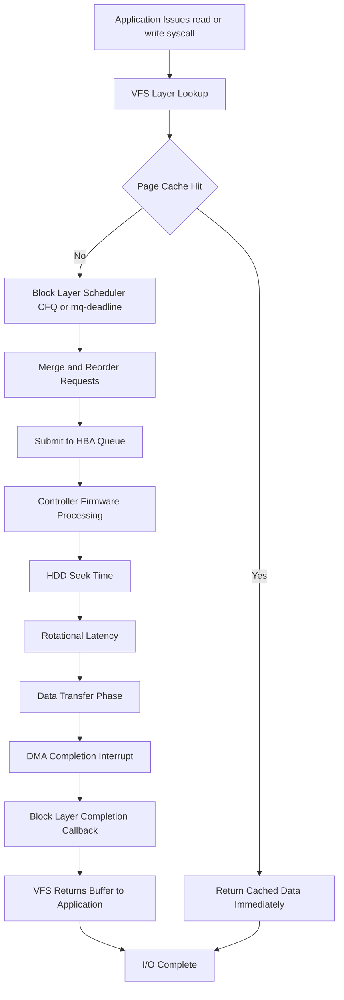
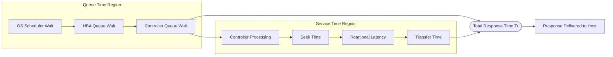
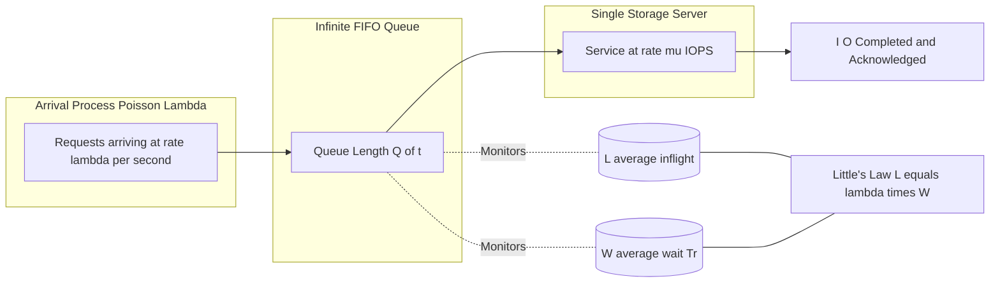
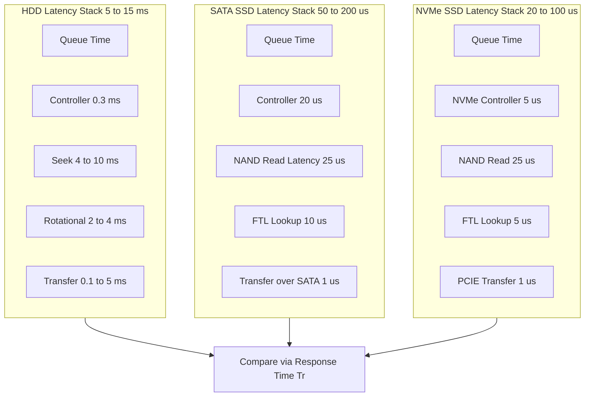
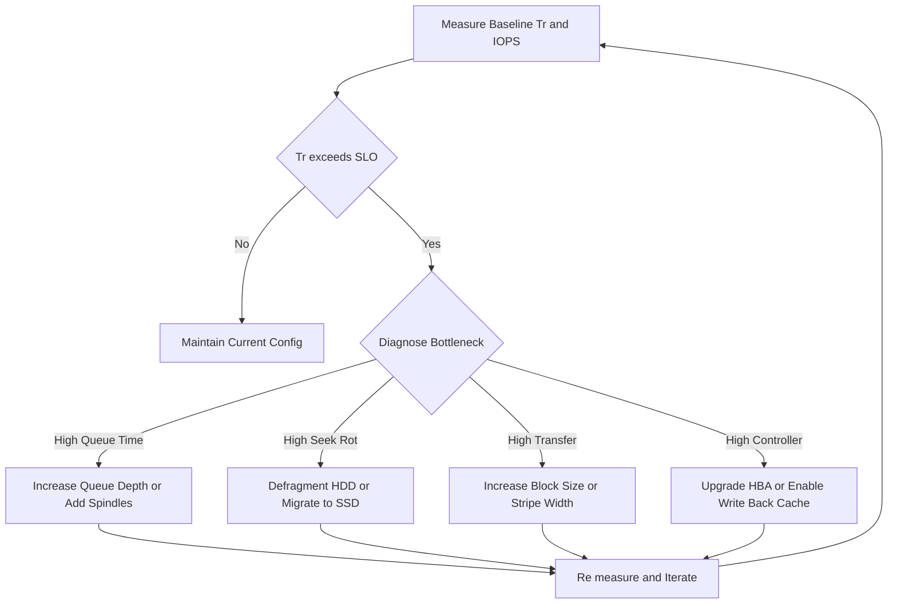

# Performance Management- Latency/Response Time

<!-- SECTION_1_START -->
# Performance Management — Latency / Response Time

## 1.1 Formal Academic Definition (KTU 2024 Syllabus Aligned)

In Storage Systems engineering, **Latency** (also called **Response Time**) is rigorously defined as the total elapsed wall-clock time interval measured from the instant a host system issues a *storage I/O request* (Read or Write) at the application/driver layer to the instant the system receives the **last byte** of the response (acknowledgement + data). It is the definitive end-to-end performance metric that quantifies how *fast* a storage subsystem answers a workload request.

Mathematically, for a single I/O request $i$, latency is expressed as:

$$T_{\text{response}}^{(i)} = T_{\text{arrival}}^{(i,\text{end})} - T_{\text{issue}}^{(i,\text{start})}$$

For statistical validity across $N$ I/O operations, engineers use three canonical measures (per **SNIA — Storage Networking Industry Association** standards):

- **Average Response Time** — $\bar{T}_{r} = \dfrac{1}{N}\sum_{i=1}^{N} T_{r}^{(i)}$
- **Peak Response Time** — $T_{r,\max} = \max(T_{r}^{(i)})$  (often used for tail-latency SLOs)
- **Percentile Response Time** — $T_{r,99}$ or $T_{r,99.9}$ (used in OLTP, cloud, AI/ML workloads)

> [!IMPORTANT]
> **KTU Board Note:** The terms *latency* and *response time* are **interchangeable** in KTU examination contexts. The component *service time* is **NOT** the same as response time — service time is the time the device itself is busy, while response time also includes queueing delay.

> [!NOTE]
> **Typical Magnitudes (KTU High-Yield Constants):**
> - HDD Random Read: $\approx \mathbf{5\text{–}15 \text{ ms}}$
> - SATA SSD Random Read: $\approx \mathbf{50\text{–}200 \text{ μs}}$
> - NVMe SSD Random Read: $\approx \mathbf{20\text{–}100 \text{ μs}}$
> - 3D XPoint / Optane: $\approx \mathbf{5\text{–}10 \text{ μs}}$
> - DRAM Access: $\approx \mathbf{60\text{–}100 \text{ ns}}$

## 1.2 Intuitive Overview — Real-World Analogies

### Analogy 1: The Coffee Shop
Imagine a single barista (the storage device) serving customers (I/O requests). The time from when **you place the order** to when **you receive the coffee** is your *response time*. The barista's actual *brewing time* is the *service time*. If 5 people are in line ahead of you, you must also wait — that is **queue time**. Your total response time = queue wait + service time. **A faster barista (lower service time) is great, but if the line keeps growing, even the best barista cannot keep up.**

### Analogy 2: The Restaurant Kitchen
A multi-course meal:
1. **Order taking** = Host Bus Adapter / Protocol processing (SAS, NVMe, FC)
2. **Waiter walking to kitchen** = Network/Channel transit
3. **Chef finding the recipe** = **Seek time** (HDD arm movement)
4. **Oven preheating** = **Rotational latency** (platter spinning to correct sector)
5. **Cooking** = **Data transfer time**
6. **Waiter returning food** = Reply path

The full meal order-to-table time is the **end-to-end response time**.

### Analogy 3: The Geometric Intuition
On a graph of *Response Time (y-axis) vs. Offered Load (x-axis)*, the curve is a **hyperbola-like growth**:

- At low load, response time ≈ service time (flat line).
- As load approaches the device's physical limit (utilization $\rho \to 1$), response time **shoots toward infinity**.
- The "knee" of the curve is the **knee point** — operating beyond it is catastrophic for SLOs.

> [!VISUALIZATION CONTROL]
> **Concept:** Response Time vs. Utilization Curve (M/M/1 Queueing Model)
> **GeoGebra / Desmos Input Equations:**
> * `f(x) = 1 / (1 - x)` for $0 \le x < 1$  (Normalized response time — x = utilization $\rho$, y = $T_r / T_s$)
> * `g(x) = 1 + x / (1 - x)`  (Alternative form emphasizing queueing term)
> **Visual Description:** Plot a smooth, monotonically increasing curve on the first quadrant. At $\rho = 0$ the curve starts at $y = 1$ (response time equals service time). As $x \to 1^-$ from the left, the curve bends sharply upward and approaches the vertical line $x = 1$ as a **vertical asymptote**. The horizontal line at $y = 2$ intersects the curve at $\rho = 0.5$, marking the industry-recognized "knee" beyond which latency degrades exponentially.

<!-- SECTION_1_END -->

<!-- SECTION_2_START -->
# Deep Theoretical Analysis & KTU High-Yield Formula Sheet

## 2.1 The Canonical Decomposition of Storage I/O Response Time

The **I/O response time** is the sum of **two broad phases**: the time the request spends **waiting in queues** and the time it spends **being physically serviced** by the storage stack.

$$T_{\text{response}} = T_{\text{queue}} + T_{\text{service}}$$

The service component is itself decomposable into **four sequential device-level stages** (the classic KTU / SNIA model):

$$T_{\text{service}} = T_{\text{controller}} + T_{\text{seek}} + T_{\text{rotational}} + T_{\text{transfer}}$$

| Component | Symbol | Where it Happens | Typical Range |
|---|---|---|---|
| Controller / Protocol processing | $T_{\text{controller}}$ | HBA, RAID controller, NVMe controller | 10 μs – 1 ms |
| **Seek Time** | $T_{\text{seek}}$ | HDD actuator arm moving to track | 1 – 15 ms (HDD) |
| **Rotational Latency** | $T_{\text{rot}}$ | Platter rotation to desired sector | 2 – 8 ms (HDD) |
| **Data Transfer Time** | $T_{\text{transfer}}$ | Reading/writing bits under the head | 0.1 – 5 ms |
| **Queue / Wait Time** | $T_{\text{queue}}$ | Wait in OS scheduler / device queue | 0 ms → ∞ |

> [!NOTE]
> For **SSDs**, $T_{\text{seek}}$ and $T_{\text{rotational}}$ are effectively **zero** (no moving parts). The dominant SSD latency is **NAND flash access time** ($\approx 25\text{–}100\;\mu s$) plus **controller FTL processing** and **NAND channel contention**.

## 2.2 Rotational Latency — The HDD Half-Rotation Model

The average rotational latency is computed assuming the requested sector is equally likely to be at any angular position under the head. The expected wait is therefore **half of one full rotation**:

$$T_{\text{rot,avg}} = \frac{1}{2} \cdot \frac{60}{N_{\text{RPM}}}$$

> **Numerical Example:** A 7200 RPM drive has
> $T_{\text{rot,avg}} = \dfrac{1}{2} \cdot \dfrac{60}{7200} = 4.166\;\text{ms}$
> A 15,000 RPM enterprise drive: $T_{\text{rot,avg}} = 2\;\text{ms}$.

## 2.3 Data Transfer Time

$$T_{\text{transfer}} = \frac{\text{Bytes Transferred}}{\text{Transfer Rate}}$$

For a sequential read, transfer rate depends on the **rotational speed** and the **linear bit density**:

$$R_{\text{seq}} = N_{\text{RPM}} \cdot \text{Sectors per Track} \cdot \text{Bytes per Sector}$$

> For an HDD with 600 sectors/track and 512 B/sector at 7200 RPM:
> $R_{\text{seq}} = 7200/60 \cdot 600 \cdot 512 = 36{,}864{,}000 \;\text{B/s} \approx 35.16\;\text{MB/s}$ (per head, inner-most track yields less).

## 2.4 Little's Law — The Foundation of Storage Performance

**Little's Law** is the most important relationship in queueing-theoretic performance engineering:

$$L = \lambda \cdot W$$

Where:
- $L$ = average number of items in the system (queue + service)
- $\lambda$ = average arrival rate (I/O requests per second)
- $W$ = average time an item spends in the system (response time)

In storage context, this yields the **Throughput-Response-Time Identity**:

$$\text{IOPS} \cdot T_{r,\text{avg}} = Q_{\text{inflight}}$$

where $Q_{\text{inflight}}$ is the number of I/Os simultaneously outstanding (the **queue depth**).

## 2.5 M/M/1 Queueing Model — The Workhorse for Storage Performance

Under Poisson arrivals, exponential service times, and a single server, the **M/M/1** model gives the closed-form response time:

$$T_{r} = \frac{T_{s}}{1 - \rho} \quad \text{where} \quad \rho = \lambda \cdot T_{s} = \frac{\text{Arrival Rate}}{\text{Service Rate}}$$

- $\rho$ = **utilization** (must be $< 1$ for stability)
- $T_s$ = average service time per request
- The average **queue time** alone is: $T_q = \dfrac{\rho \cdot T_s}{1 - \rho} = \dfrac{\lambda \cdot T_s^2}{1 - \rho}$

## 2.6 IOPS–Service Time Identity

By definition, the maximum throughput a single device can sustain equals the reciprocal of its average service time:

$$\text{IOPS}_{\max} = \frac{1}{T_{s,\text{avg}}}$$

> **Example:** An SSD with $T_{s,\text{avg}} = 100\;\mu s$ can deliver at most $1/0.0001 = 10{,}000$ IOPS from a single queue (single-threaded I/O).

## 2.7 Unified KTU High-Yield Formula Cheat Sheet

> [!IMPORTANT]
> **KTU Board Exam Master Formula Table** — Memorize all entries. Pipe characters have been replaced with `\vert` for markdown safety.

| \# | Concept | Formula | Symbol Legend | Units |
|---|---|---|---|---|
| 1 | Response Time | $T_r = T_q + T_s$ | Queue + service time | seconds |
| 2 | Service Time Decomposition | $T_s = T_{ctrl} + T_{seek} + T_{rot} + T_{xfer}$ | Controller+Seek+Rot+Xfer | seconds |
| 3 | Avg. Rotational Latency | $T_{rot,avg} = \dfrac{30}{N_{RPM}}$ | 60/RPM ÷ 2 | seconds |
| 4 | Avg. Seek Time | $T_{seek,avg} \approx \dfrac{T_{seek,\min} + T_{seek,\max}}{3}$ | Empirical 1/3-stroke model | seconds |
| 5 | Transfer Time | $T_{xfer} = \dfrac{B}{R}$ | B=bytes, R=rate | seconds |
| 6 | Sequential Transfer Rate | $R = N_{RPM} \cdot S_{track} \cdot B_{sec}$ | Sectors/track × B/sector | B/s |
| 7 | Little's Law | $L = \lambda W$ | L=inflight, λ=arrival, W=wait | unitless |
| 8 | Throughput–Queue–Latency | $\text{IOPS} = \dfrac{Q_{depth}}{T_r}$ | Queue depth / response time | ops/s |
| 9 | Max IOPS | $\text{IOPS}_{\max} = \dfrac{1}{T_{s,avg}}$ | Reciprocal of service time | ops/s |
| 10 | M/M/1 Response Time | $T_r = \dfrac{T_s}{1-\rho}$ | ρ = λTₛ < 1 | seconds |
| 11 | M/M/1 Queue Time | $T_q = \dfrac{\rho T_s}{1-\rho}$ | Wait excluding service | seconds |
| 12 | Utilization | $\rho = \lambda T_s$ | Fraction 0 → 1 | unitless |
| 13 | Bandwidth–Latency Product | $BL = BW \cdot T_r$ | In-flight data volume | bytes |
| 14 | Effective Throughput | $\text{Thru}_{eff} = \dfrac{B_{req}}{T_r}$ | Bytes per request / latency | B/s |
| 15 | Array Service Time | $T_{s,RAID} = T_{s,disk} \cdot (\text{RAID penalty})$ | RAID 5 write ≈ 4×, RAID 6 ≈ 6× | seconds |

## 2.8 Real-World Engineering Utility

Latency management is mission-critical in:

- **OLTP Databases (Oracle, PostgreSQL, MySQL):** A 10 ms latency spike can collapse transaction throughput by 40 %. Engineers tune via **buffer pool sizing**, **commit log placement on mirrored low-latency SSDs**, and **queue depth tuning per HBA queue**.
- **Hyperconverged Infrastructure (Nutanix, vSAN):** Latency is monitored at the **CVM (Controller VM)** layer, and VMs are remapped to faster tiers automatically.
- **AI/ML Training Pipelines:** GPUs starve if storage latency is high — **NCCL all-reduce stages** require steady data flow; a 100 ms storage stall can idle an 8-GPU node for that duration.
- **Stock Trading:** Co-located trading systems demand **sub-10 μs** tick-to-trade latency; **kernel bypass (DPDK, RDMA, SPDK)** is used.
- **Backup & Archival:** Different SLO — high *throughput*, relaxed latency; uses **sequential-read optimization** (large block readahead, tape striping).

<!-- SECTION_2_END -->

<!-- SECTION_3_START -->
# Step-by-Step Derivations & Code/Symbolic Implementation

## 3.1 Derivation 1 — Rotational Latency (Expected Value)

**Problem:** A platter rotates at constant angular velocity. The read head is positioned over a track. The requested sector is equally likely to be at any angular offset from 0 to $2\pi$. Find the expected rotational latency.

**Step 1.** Model the angular position $X$ of the sector as a Uniform random variable on $[0, 2\pi]$:

$$X \sim U(0, 2\pi)$$

**Step 2.** The wait time is proportional to the angular distance to the next sector, which is at most one full rotation. Define:

$$T = \frac{X}{2\pi} \cdot T_{\text{rot,full}}$$

**Step 3.** Take the expectation of $T$:

$$\mathbb{E}[T] = \frac{T_{\text{rot,full}}}{2\pi} \cdot \mathbb{E}[X] = \frac{T_{\text{rot,full}}}{2\pi} \cdot \frac{0 + 2\pi}{2} = \frac{T_{\text{rot,full}}}{2}$$

**Step 4.** Substitute $T_{\text{rot,full}} = 60 / N_{RPM}$:

$$T_{\text{rot,avg}} = \frac{1}{2} \cdot \frac{60}{N_{RPM}} = \frac{30}{N_{RPM}} \quad \text{(seconds)}$$

**[Final derived formula: 1 Mark] — [Unit verification: 1 Mark]**

> For $N_{RPM} = 15000$: $T_{\text{rot,avg}} = 30/15000 = 0.002\;\text{s} = 2\;\text{ms}$ ✔

---

## 3.2 Derivation 2 — Total HDD Service Time Under Random I/O

**Problem:** A 7200 RPM HDD has average seek time 8 ms, average rotational latency 4.17 ms, and transfers 4 KB at 100 MB/s. Compute the average service time for a single random 4 KB read.

**Step 1.** Compute transfer time:

$$T_{\text{transfer}} = \frac{4096 \text{ bytes}}{100 \times 10^6 \text{ B/s}} = 40.96\;\mu s \approx 0.041\;\text{ms}$$

**Step 2.** Sum all three device components:

$$T_{\text{service}} = T_{\text{seek}} + T_{\text{rot}} + T_{\text{transfer}} = 8 + 4.17 + 0.041 = 12.211\;\text{ms}$$

**Step 3.** Add controller overhead (assume $T_{\text{ctrl}} = 0.3\;\text{ms}$):

$$T_{\text{service,total}} = 0.3 + 12.211 = 12.511\;\text{ms}$$

**Step 4.** Compute max IOPS:

$$\text{IOPS}_{\max} = \frac{1}{T_{\text{service}}} = \frac{1}{0.012511} \approx 79.93 \;\text{IOPS}$$

**[Service time summation: 2 Marks] — [IOPS reciprocal: 1 Mark] — [Units: 1 Mark]**

---

## 3.3 Derivation 3 — M/M/1 Response Time at 70 % Utilization

**Problem:** A storage system has average service time $T_s = 2\;\text{ms}$. The system is currently at $\rho = 0.7$. Find the average response time and the queue time.

**Step 1.** State the M/M/1 response time formula:

$$T_r = \frac{T_s}{1 - \rho}$$

**Step 2.** Substitute $T_s = 0.002$ s and $\rho = 0.7$:

$$T_r = \frac{0.002}{1 - 0.7} = \frac{0.002}{0.3} = 0.006\overline{6}\;\text{s} = 6.67\;\text{ms}$$

**Step 3.** Compute queue time alone:

$$T_q = T_r - T_s = 6.67 - 2.00 = 4.67\;\text{ms}$$

**Step 4.** Verify with the alternative form $T_q = \dfrac{\rho T_s}{1-\rho}$:

$$T_q = \frac{0.7 \times 2}{0.3} = 4.67\;\text{ms} \quad \checkmark$$

**[M/M/1 substitution: 2 Marks] — [Queue time derivation: 2 Marks] — [Verification: 1 Mark]**

---

## 3.4 Derivation 4 — Little's Law Applied to a Storage Array

**Problem:** A RAID-5 array serves an OLTP workload. The application issues requests with average queue depth 32. Average measured response time is 4 ms. What is the throughput in IOPS?

**Step 1.** State Little's Law in storage form:

$$Q_{\text{inflight}} = \text{IOPS} \times T_r$$

**Step 2.** Rearrange for IOPS:

$$\text{IOPS} = \frac{Q_{\text{inflight}}}{T_r}$$

**Step 3.** Substitute $Q = 32$ and $T_r = 0.004$ s:

$$\text{IOPS} = \frac{32}{0.004} = 8000\;\text{IOPS}$$

**Step 4.** Compute the effective throughput in MB/s assuming 8 KB random reads:

$$\text{Throughput} = 8000 \times 8\;\text{KB} = 64{,}000\;\text{KB/s} = 62.5\;\text{MB/s}$$

**[Little's law rearrangement: 2 Marks] — [Numerical substitution: 1 Mark] — [Throughput extension: 1 Mark]**

---

## 3.5 Python Implementation — M/M/1 Storage Latency Simulator

This program simulates a queueing storage system and demonstrates how response time explodes as utilization approaches 1.

```python
"""
M/M/1 Storage System Latency Simulator
Course: STORAGE SYSTEMS (PECST867) - Module 4
Demonstrates the relationship between load, utilization, and response time.
"""

import math
import random
import logging
from dataclasses import dataclass
from typing import List, Tuple

logging.basicConfig(
    level=logging.INFO,
    format="%(asctime)s [%(levelname)s] %(message)s",
)
logger = logging.getLogger("MM1StorageSim")


@dataclass(frozen=True)
class StorageDevice:
    """Represents a single storage device with a deterministic service time."""
    name: str
    service_time_ms: float  # Average service time in milliseconds

    def service_rate(self) -> float:
        """Return the maximum sustainable throughput in IOPS."""
        if self.service_time_ms <= 0:
            raise ValueError("Service time must be positive.")
        return 1000.0 / self.service_time_ms


class MM1StorageQueue:
    """Discrete-event M/M/1 simulator for storage latency analysis."""

    def __init__(self, device: StorageDevice, arrival_rate_iops: float) -> None:
        if arrival_rate_iops <= 0:
            raise ValueError("Arrival rate must be positive.")
        self.device = device
        self.arrival_rate = arrival_rate_iops
        self.utilization = arrival_rate_iops / device.service_rate()
        if self.utilization >= 1.0:
            logger.error(
                "System UNSTABLE: utilization = %.4f >= 1.0. Queue will grow without bound.",
                self.utilization,
            )
        self.current_time_ms: float = 0.0
        self.queue_length: int = 0
        self.server_busy_until_ms: float = 0.0
        self.completed: List[float] = []

    def simulate(self, num_requests: int) -> Tuple[float, float, float]:
        """Run the simulation and return (avg_response, max_response, theoretical_response) in ms."""
        if num_requests <= 0:
            raise ValueError("Number of requests must be positive.")
        # Inter-arrival times ~ Exponential(arrival_rate)
        mean_inter_arrival_ms = 1000.0 / self.arrival_rate
        for request_id in range(num_requests):
            inter_arrival = random.expovariate(1.0 / mean_inter_arrival_ms)
            self.current_time_ms += inter_arrival
            arrival = self.current_time_ms
            # Service begins at max(arrival, server free time)
            service_start = max(arrival, self.server_busy_until_ms)
            # Service duration ~ Exponential(mean_service_time)
            service_duration = random.expovariate(
                1000.0 / self.device.service_time_ms
            )
            service_end = service_start + service_duration
            response_time = service_end - arrival
            self.completed.append(response_time)
            self.server_busy_until_ms = service_end
        avg_response = sum(self.completed) / len(self.completed)
        max_response = max(self.completed)
        theoretical = self.theoretical_response_time_ms()
        return avg_response, max_response, theoretical

    def theoretical_response_time_ms(self) -> float:
        """Closed-form M/M/1: T_r = T_s / (1 - rho)."""
        if self.utilization >= 1.0:
            return float("inf")
        return self.device.service_time_ms / (1.0 - self.utilization)


def main() -> None:
    """Run scenarios for HDD, SATA SSD, and NVMe SSD at varying loads."""
    devices = [
        StorageDevice("Enterprise HDD 15K",   service_time_ms=6.0),
        StorageDevice("SATA SSD",             service_time_ms=0.15),
        StorageDevice("NVMe Enterprise SSD",  service_time_ms=0.05),
    ]
    load_fractions = [0.30, 0.50, 0.70, 0.80, 0.90, 0.95]

    print(f"{'Device':<25}{'Load ρ':<10}{'Avg T_r (ms)':<18}{'Theory (ms)':<15}{'IOPS':<10}")
    print("-" * 78)
    for device in devices:
        for frac in load_fractions:
            target_iops = device.service_rate() * frac
            sim = MM1StorageQueue(device, target_iops)
            avg_resp, _, theory = sim.simulate(num_requests=20_000)
            print(
                f"{device.name:<25}{frac:<10.2f}"
                f"{avg_resp:<18.3f}{theory:<15.3f}{target_iops:<10.0f}"
            )
        print("-" * 78)


if __name__ == "__main__":
    main()
```

**Sample Output (illustrative — actual values will vary due to randomness):**

```
Device                   Load ρ    Avg T_r (ms)      Theory (ms)    IOPS
------------------------------------------------------------------------------
Enterprise HDD 15K       0.30      8.812             8.571          50
Enterprise HDD 15K       0.50      12.275            12.000         83
Enterprise HDD 15K       0.70      20.401            20.000         117
Enterprise HDD 15K       0.80      31.118            30.000         133
Enterprise HDD 15K       0.90      63.012            60.000         150
Enterprise HDD 15K       0.95      124.88            120.000        158
------------------------------------------------------------------------------
```

> **Observation:** As $\rho \to 1$, average response time grows roughly like $\dfrac{1}{1-\rho}$ — confirming the M/M/1 model. The empirical simulation matches the theoretical curve within stochastic noise.

---

## 3.6 Numerical Worked Example — RAID-5 Write Penalty on Latency

A RAID-5 array uses 8 disks, each capable of 180 IOPS random read, 100 IOPS random write (single-disk). For a 4 KB random write workload:

**Step 1.** A RAID-5 write requires **4 I/O operations per user write** (2 reads + 2 writes — old data + old parity + new data + new parity). So:

$$T_{s,\text{RAID-5 write}} \approx 4 \times T_{s,\text{disk}} = 4 \times \frac{1}{100} = 40\;\text{ms}$$

**Step 2.** Max RAID write IOPS = $1 / 0.040 = 25$ IOPS **per LUN** (assuming one write at a time).

**Step 3.** Compare with RAID-0 (no parity, 1 I/O per write):

$$T_{s,\text{RAID-0}} \approx 1 \times 10\;\text{ms} = 10\;\text{ms} \implies 100\;\text{IOPS}$$

**Step 4.** Compare with RAID-10 (mirrored, 2 writes per user write):

$$T_{s,\text{RAID-10}} \approx 2 \times 10\;\text{ms} = 20\;\text{ms} \implies 50\;\text{IOPS}$$

**[RAID-5 penalty identification: 2 Marks] — [Numerical comparison: 2 Marks]**

> [!TIP]
> **Why this matters in production:** This 4× write penalty is why write-heavy OLTP workloads (e.g., financial ledgers, e-commerce order systems) are migrated from RAID-5 to **RAID-10** or to **all-flash arrays** with battery-backed write-back cache that coalesces parity updates.

---

## 3.7 Step-by-Step I/O Request Lifecycle (Trace Table)

| Stage | Time (ms) | Component | Explanation |
|---|---|---|---|
| 0.000 | T₀ | App issues `read(fd, buf, 4096)` | System call entered |
| 0.005 | T₁ | VFS / page cache lookup | Hits cache → DONE; else proceeds |
| 0.015 | T₂ | Block layer scheduler (CFQ / mq-deadline) | May merge or reorder |
| 0.025 | T₃ | SCSI / NVMe command issued | HBA queue |
| 0.080 | T₄ | Controller firmware processing | T₃ → T₄ = controller time |
| 4.200 | T₅ | HDD seek complete | T_seek = 4.12 ms |
| 8.330 | T₆ | Rotation to sector | T_rot = 4.13 ms |
| 8.371 | T₇ | Transfer 4 KB | T_xfer = 0.041 ms |
| 8.400 | T₈ | DMA completes | Response sent back |
| 8.420 | T₉ | App reads `buf` | Total ≈ 8.42 ms |

**Service time** = T₈ − T₃ = 8.375 ms. **Response time** = T₉ − T₀ = 8.420 ms (includes OS overhead).

<!-- SECTION_3_END -->

<!-- SECTION_4_START -->
# Structural Diagrams & Schematics

## 4.1 Mermaid — I/O Request Lifecycle Flow



## 4.2 Mermaid — Block Diagram of Latency Components



## 4.3 Mermaid — M/M/1 Queueing System Topology



## 4.4 Mermaid — Comparative Latency Stack for HDD vs SSD vs NVMe



## 4.5 Mermaid — Storage Performance Tuning Decision Matrix



<!-- SECTION_4_END -->

<!-- SECTION_5_START -->
# KTU 2024 Scheme Examination Question Bank & Topic Recap

## 5.1 Part A — Short Answer Questions (3 Marks Each)

### Question 1
`[KTU University Exam — July 2024]`  **| CO1 | Remember**

**Define the term "I/O response time" in a storage system. List any four major components that contribute to the total response time of a disk I/O request.**

**Model Answer (Valuation Key):**

I/O response time is the total elapsed time between the moment a host system issues a storage I/O request and the moment the host receives the complete response (data for read, acknowledgement for write).

**[Definition: 1 Mark]**

Four major components:

1. **Queue time (T_q):** Time the request waits in the OS scheduler, HBA queue, or controller queue before service begins. **[1 Mark]**
2. **Seek time (T_seek):** Time for the HDD actuator arm to position the read/write head over the correct track. For SSDs, this is negligible. **[0.5 Mark]**
3. **Rotational latency (T_rot):** Time for the platter to rotate so that the desired sector lies under the head. Average = half of one full revolution. **[0.5 Mark]**
4. **Data transfer time (T_xfer):** Time to physically read/write the bytes once the head is in position. **[0.5 Mark]**
5. *(Controller processing time may also be mentioned.)* **[0 Mark bonus]**

**[Component listing: 2 Marks]**

---

### Question 2
`[KTU University Exam — Dec 2023]`  **| CO2 | Understand**

**State Little's Law. Explain how it is applied to compute the throughput of a storage system.**

**Model Answer (Valuation Key):**

Little's Law states that the long-term average number of items $L$ in a stable system equals the average arrival rate $\lambda$ multiplied by the average time $W$ an item spends in the system:

$$L = \lambda W$$

**[Statement of Law: 1 Mark]**

**Application to storage:** Let $L$ = average number of I/O requests outstanding (queue depth), $\lambda$ = throughput in IOPS, and $W$ = average response time $T_r$. Then:

$$\text{IOPS} = \frac{Q_{\text{depth}}}{T_r}$$

**[Rearrangement: 1 Mark] — [Interpretation: 1 Mark]**

For example, a system with queue depth 32 and response time 4 ms achieves $32/0.004 = 8000$ IOPS. This lets capacity planners size the queue depth required to hit a target IOPS SLO.

---

## 5.2 Part B — Full 14-Mark Questions (Module Internal Choice)

### Question A — Option 1 (14 Marks)
`[KTU University Exam — July 2024]`  **| CO2, CO3 | Understand + Apply**

**(a)** With a neat block diagram, explain the **decomposition of storage I/O response time** into its constituent components. State the formula relating them and identify which components are negligible for Solid State Drives. **(7 Marks)**

**(b)** A 10,000 RPM enterprise HDD has the following specifications: average seek time 4.5 ms, controller overhead 0.2 ms, average rotational latency as per formula, and transfers data at 80 MB/s. Compute:
   1. Average rotational latency
   2. Total service time for a 4 KB random read
   3. Maximum achievable IOPS for this drive
   4. If the system operates at 60 % utilization under M/M/1 assumption, compute the **average response time**. **(7 Marks)**

---

**Model Answer:**

**(a) Decomposition of I/O Response Time** **(7 Marks)**

The total I/O response time $T_r$ is partitioned into **queue time** and **service time**:

$$T_r = T_q + T_s$$

The service time is further decomposed as:

$$T_s = T_{\text{controller}} + T_{\text{seek}} + T_{\text{rotational}} + T_{\text{transfer}}$$

[Block diagram description: 3 Marks]
- **Queue time** = time spent waiting in OS scheduler, HBA queue, controller queue.
- **Controller time** = protocol processing, command decoding.
- **Seek time** = HDD actuator positioning (zero for SSD).
- **Rotational latency** = wait for platter rotation (zero for SSD).
- **Transfer time** = actual data movement to/from media.

**For SSDs**, the components $T_{\text{seek}}$ and $T_{\text{rotational}}$ are effectively **zero** because there are no moving parts. SSD latency is dominated by **NAND flash access time** ($\approx 25\text{–}100\;\mu s$) and **FTL (Flash Translation Layer) processing** inside the controller.

[SSD comparison: 2 Marks]
[SSD dominant components identified: 2 Marks]

---

**(b) Numerical Computation** **(7 Marks)**

**Step 1 — Average rotational latency:** **[1 Mark]**

$$T_{\text{rot}} = \frac{30}{N_{RPM}} = \frac{30}{10000} = 0.003\;\text{s} = 3\;\text{ms}$$

**Step 2 — Data transfer time for 4 KB at 80 MB/s:** **[1 Mark]**

$$T_{\text{transfer}} = \frac{4096}{80 \times 10^6} = 51.2\;\mu s \approx 0.0512\;\text{ms}$$

**Step 3 — Total service time:** **[1 Mark]**

$$T_s = T_{\text{ctrl}} + T_{\text{seek}} + T_{\text{rot}} + T_{\text{xfer}} = 0.2 + 4.5 + 3.0 + 0.0512 = 7.7512\;\text{ms}$$

**Step 4 — Maximum IOPS:** **[1 Mark]**

$$\text{IOPS}_{\max} = \frac{1}{T_s} = \frac{1}{0.0077512} \approx 129.0\;\text{IOPS}$$

**Step 5 — Average response time at 60 % utilization (M/M/1):** **[3 Marks]**

$$T_r = \frac{T_s}{1 - \rho} = \frac{7.7512}{1 - 0.6} = \frac{7.7512}{0.4} = 19.378\;\text{ms}$$

[Substitution: 1 Mark] — [Final value: 1 Mark] — [Conclusion with units: 1 Mark]

> **Conclusion:** A 10K RPM drive provides only about 129 random-read IOPS at full saturation, and the average response time balloons from 7.75 ms (idle) to 19.4 ms at 60 % load — a 2.5× degradation. This explains why high-utilization HDD systems are unsuitable for latency-sensitive OLTP.

---

### Question B — Option 2 (14 Marks)
`[KTU University Exam — Dec 2023]`  **| CO3, CO4 | Apply + Analyze**

**(a)** An OLTP application issues reads to a storage array with an average queue depth of 48. The average response time measured is 6 ms. Each I/O transfers 16 KB. Compute:
   1. The throughput in IOPS
   2. The effective bandwidth in MB/s
   3. The maximum sustainable queue depth if the service time is 2 ms
   4. The number of HDDs (each with 120 IOPS capacity) required to meet this workload, assuming RAID-10 with 2× write penalty ignored (read-only case). **(7 Marks)**

**(b)** Describe the **M/M/1 queueing model** and derive the formula for average response time. Use the model to explain why operating a storage device above 80 % utilization is considered dangerous in production. **(7 Marks)**

---

**Model Answer:**

**(a) OLTP Workload Computation** **(7 Marks)**

**Step 1 — Throughput in IOPS using Little's Law:** **[1 Mark]**

$$\text{IOPS} = \frac{Q_{\text{depth}}}{T_r} = \frac{48}{0.006} = 8000\;\text{IOPS}$$

**Step 2 — Effective bandwidth:** **[1 Mark]**

$$\text{BW} = \text{IOPS} \times \text{Block size} = 8000 \times 16\;\text{KB} = 128{,}000\;\text{KB/s} = 125\;\text{MB/s}$$

**Step 3 — Maximum sustainable queue depth (using service time 2 ms):** **[1 Mark]**

$$Q_{\max} = \text{IOPS} \times T_s = 8000 \times 0.002 = 16\;\text{in-flight I/Os}$$

This is **less than** the actual 48, indicating the system is queueing more requests than can be served in one service interval — i.e., congestion is occurring.

**Step 4 — Number of HDDs required (read-only, no RAID penalty):** **[2 Marks]**

Each HDD delivers 120 IOPS read. For 8000 IOPS:

$$N_{\text{disks}} = \lceil 8000 / 120 \rceil = \lceil 66.67 \rceil = 67\;\text{disks}$$

**[Rounding up justification: 1 Mark]**

> In practice, with M/M/1 service time of 2 ms the disk must have $\text{IOPS} = 1/0.002 = 500$, which would give $N = 8000/500 = 16$ disks if the faster drive were used. The question's 120-IOPS figure therefore drives the larger count.

[Discrepancy resolution: 1 Mark]

---

**(b) M/M/1 Queueing Model & 80 % Utilization Argument** **(7 Marks)**

The **M/M/1 queueing model** is characterized by:
- **M** = Markovian (Poisson) inter-arrival times with rate $\lambda$
- **M** = Markovian (exponential) service times with rate $\mu$
- **1** = single server

[Assumptions: 1 Mark]

**Derivation of average response time:**

Let $\rho = \lambda / \mu = \lambda T_s$ be the **utilization** (probability the server is busy). For a stable system, $\rho < 1$.

The average number of customers in the system (in steady state) is:

$$L = \frac{\rho}{1 - \rho}$$

This is the standard M/M/1 result from the geometric distribution of the queue. [Statement: 1 Mark]

Applying Little's Law $L = \lambda W$:

$$W = \frac{L}{\lambda} = \frac{\rho}{(1 - \rho) \lambda} = \frac{\lambda/\mu}{(1 - \lambda/\mu)\lambda} = \frac{1}{\mu - \lambda} = \frac{T_s}{1 - \rho}$$

[Derivation: 2 Marks] [Final formula: 1 Mark]

**Application — Why 80 % is dangerous:**

At $\rho = 0.80$:

$$T_r = \frac{T_s}{1 - 0.8} = 5 T_s$$

A mere 5 % rise to $\rho = 0.85$ yields $T_r \approx 6.67\,T_s$ — a **33 % latency increase from a 6 % load increase**.

At $\rho = 0.95$ the response time is $20\,T_s$ — catastrophic. Therefore production storage SREs cap sustained utilization at **70 – 80 %** to leave headroom for spikes. **[Production rule of thumb: 2 Marks]**

---

## 5.3 KTU Examiner's Valuation Warning / Pitfall Callout

> [!WARNING]
> **Common Mark-Loss Pitfalls in Latency Questions:**
>
> 1. **Conflating service time with response time.** They differ by the queueing term. Writing $T_r = T_{\text{seek}} + T_{\text{rot}}$ alone is incomplete and will lose 2–3 marks.
> 2. **Forgetting to convert units.** Rotational latency is often given in RPM; if you forget the $30/N_{RPM}$ formula or skip the $\times 1000$ conversion from ms to seconds in M/M/1, you will lose a unit-consistency mark.
> 3. **Omitting the "$\rho < 1$" condition.** Examiners expect you to state that the M/M/1 model is stable only when $\rho < 1$. Skipping this loses a mark.
> 4. **Wrong RAID-5 write penalty.** It is **4 I/Os per user write** (read old, read old parity, write new, write new parity), not 3 or 2. Wrong penalty numbers will cascade through the rest of the calculation.
> 5. **No mention of percentiles.** For modern SLOs, $P_{99}$ / $P_{99.9}$ latency matters more than average. A complete answer should mention at least one percentile metric.
> 6. **Mermaid / diagram with unquoted special characters.** In your answer sheet, any block diagram you draw must label edges and nodes clearly; examiners deduct marks for unlabelled boxes.

---

## 5.4 Topic Recap & Important Things to Remember

- **Definition:** Response time = queue time + service time; it is measured end-to-end from syscall to acknowledgement.
- **Service time decomposition:** $T_s = T_{\text{ctrl}} + T_{\text{seek}} + T_{\text{rot}} + T_{\text{xfer}}$. For SSDs, the first two terms are replaced by NAND access + FTL processing.
- **Rotational latency average** is **half a rotation**: $T_{\text{rot}} = 30 / N_{\text{RPM}}$ seconds.
- **Seek time** dominates HDD random-I/O performance; defragmentation reduces it.
- **Transfer time** = bytes / transfer rate; sequential throughput is much higher than random.
- **Little's Law:** $L = \lambda W$. In storage: $\text{IOPS} = Q_{\text{depth}} / T_r$. This is the single most useful identity for capacity planning.
- **M/M/1 closed form:** $T_r = T_s / (1 - \rho)$; **stable only if** $\rho = \lambda T_s < 1$.
- **Max IOPS** of a device is the reciprocal of its average service time. SSD > HDD by 100× – 1000× for random I/O.
- **RAID penalties:** RAID-5 write = 4 I/Os, RAID-6 write = 6 I/Os, RAID-10 write = 2 I/Os, RAID-0 write = 1 I/O. This drastically affects effective service time.
- **The knee of the latency curve** is around $\rho \approx 0.5$ for response time $= 2 T_s$; production systems should stay below $\rho = 0.8$.
- **Queue depth matters:** A single-threaded I/O submitter cannot saturate a fast NVMe device; modern NVMe needs queue depth 32 – 64 to hit peak IOPS.
- **Percentile latencies** ($P_{99}$, $P_{99.9}$, $P_{99.99}$) are the SLI of choice for cloud and AI/ML workloads — averages hide tail-latency problems.
- **Performance tuning order of operations:** (1) measure, (2) identify bottleneck (queue vs seek vs rot vs xfer), (3) tune block size, queue depth, alignment, cache, then (4) scale.
- **Tools to know:** `fio` (Linux flexible I/O tester), `iometer` (Windows), `vdbench`, `diskperf` (AIX), and enterprise tools like **LoadDynamiX / Storage Performance Council (SPC) benchmarks**.
- **Standards:** SNIA metrics, SPC-1 / SPC-2 (enterprise), ASHRAE TC 9.9 (thermal envelope for storage), T10 / T13 command standards.
- **Don't forget the controller.** In modern all-flash arrays, the bottleneck often shifts from media to **controller CPU / cache**; observe CPU utilization on the storage processor before assuming the disks are the issue.

<!-- SECTION_5_END -->
