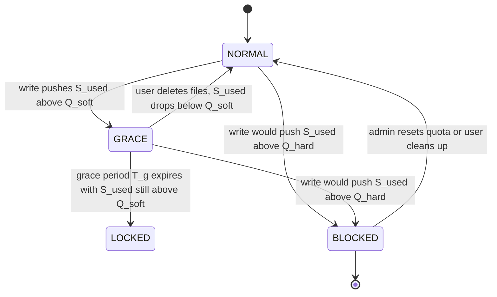
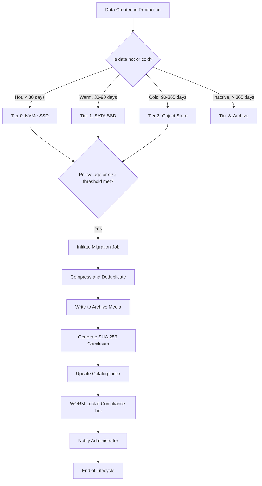
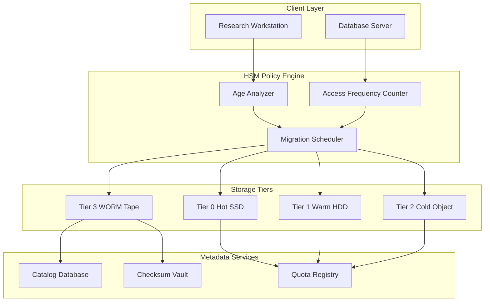
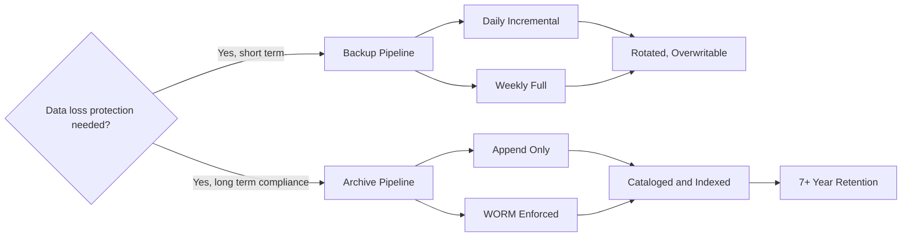

# Quotas and Archiving

<!-- SECTION_1_START -->

# Quotas and Archiving in Storage Systems

## 1.1 Storage Quota — Formal KTU Definition

> [!IMPORTANT]
> **Definition (KTU 2024 Scheme):** A **storage quota** is a system-level administrative control mechanism enforced by the operating system or file system layer that restricts the maximum amount of **disk space** (block quota) and/or the **number of files/inodes** (inode quota) that a specific user, group, directory, or project is permitted to consume on a given storage volume.

In KTU 2024 Scheme terminology, quota management is a sub-component of **Storage Resource Management (SRM)** under Module 4. It directly supports **Service Level Agreements (SLAs)** in enterprise data centers.

### Conceptual Analogy — The "Bank Locker System"

Imagine a bank that rents out lockers:

- The **Hard Limit** is the **physical size of the locker** — you simply cannot fit more items inside, no matter what.
- The **Soft Limit** is a **warning threshold** set by the bank manager (e.g., "90% full") — you get a polite notice but may still temporarily stuff in a few envelopes.
- The **Grace Period** is the time the bank gives you to **vacate the excess** before they force the locker shut.
- The **Quota Check** is the security guard verifying locker capacity at the entrance.

> [!NOTE]
> **Standard Block Size:** Most Linux file systems use a default block size of **4096 bytes (4 KiB)**. Quotas in such systems are tracked in **1 KiB or 1 MiB increments** depending on the toolchain.

---

## 1.2 Data Archiving — Formal KTU Definition

> [!IMPORTANT]
> **Definition (KTU 2024 Scheme):** **Archiving** is the systematic process of identifying, collecting, compressing, indexing, and relocating inactive or reference-grade data from primary production storage to a **secondary or tertiary storage tier** for long-term retention, regulatory compliance, and historical retrieval.

### Conceptual Analogy — The "Museum & Warehouse"

Think of a corporate archive like a **museum warehouse**:

- Production storage is the **gallery floor** (visibly displayed, high-traffic).
- Archives are the **climate-controlled basement warehouse** (rarely accessed, perfectly preserved).
- A **catalog/index** is the **archivist's ledger** — without it, even archived data is lost.
- The **archive bit** is the **"do not disturb — historical artifact"** tag.

> [!NOTE]
> **Archival Retention Statistic:** Industry studies (such as the **Enterprise Strategy Group (ESG)** reports and **Veritas Data Management Insights**) indicate that approximately **60% to 80%** of enterprise data becomes **inactive within 90 days** of creation. This is the prime candidate pool for archival.

> [!TIP]
> **Visualization Concept:** Quota vs. Archive State Transitions
> 
> **Concept:** State diagram showing how a file moves between Hot / Warm / Cold / Archived states based on age and access frequency.
> 
> **Conceptual Axes:**
> * **X-axis:** Time (Days elapsed since last access)
> * **Y-axis:** Storage Cost (USD per GiB per month)
> 
> **Plot Points:**
> * $(0, \, 0.10)$ — Hot Tier (SSD, instant access)
> * $(30, \, 0.05)$ — Warm Tier (HDD, nearline)
> * $(90, \, 0.01)$ — Cold Tier (Object Store)
> * $(365, \, 0.001)$ — Archive Tier (Glacier / Tape)
> 
> **Visual Description:** A descending step function where the curve drops sharply as files age, illustrating the **economic motivation** behind archiving.

---

<!-- SECTION_2_START -->

# 2. Deep Theoretical Analysis & KTU High-Yield Formula Sheet

## 2.1 Anatomy of a Storage Quota

### 2.1.1 Quota Dimensions

A complete quota policy is defined across **three orthogonal dimensions**:

1. **Subject (Who?)** — User, Group, Project, Directory-Tree.
2. **Resource (What?)** — Block space (bytes) or Inode count (files).
3. **Limit Type (How Strict?)** — Soft Limit or Hard Limit.

### 2.1.2 Soft Limit vs. Hard Limit — The Two-Gate Model

| Limit Type | Behavior on Violation | Grace Period Applies? | Engineering Use Case |
|------------|----------------------|----------------------|----------------------|
| **Soft Limit** | Warning is issued to the user; writes still allowed temporarily | **Yes** | Threshold-based alerting; allows brief spikes |
| **Hard Limit** | All write operations are **absolutely denied** at the kernel level | **No** | Absolute SLA ceiling; prevents runaway processes |

> [!IMPORTANT]
> **KTU Board Tip:** The soft limit becomes the **effective hard limit** only **after** the grace period has expired. Before expiry, the user can still write up to the hard limit. This is a frequently tested distinction.

### 2.1.3 Grace Period Semantics

The grace period $T_g$ is a countdown timer that begins the moment the soft limit is first exceeded. The state machine is:

$$
\text{State}(t) =
\begin{cases}
\text{NORMAL} & \text{if } S_{used}(t) \leq Q_{soft} \\
\text{GRACE} & \text{if } Q_{soft} < S_{used}(t) \leq Q_{hard} \text{ and } t - t_{0} < T_g \\
\text{LOCKED} & \text{if } S_{used}(t) > Q_{hard} \text{ or } (t - t_{0} \geq T_g \text{ and } S_{used} > Q_{soft})
\end{cases}
$$

Where:
* $S_{used}(t)$ = current consumed space at time $t$
* $Q_{soft}$ = configured soft limit
* $Q_{hard}$ = configured hard limit
* $t_0$ = timestamp when soft limit was first crossed
* $T_g$ = configured grace period (default 7 days in Linux)

### 2.1.4 Inode Quota vs. Block Quota

A user could have **unlimited disk space** by quota but be **locked out** by an inode quota if they create millions of zero-byte files — a classic **denial-of-service via small files** attack vector.

> [!WARNING]
> **Common Misconception:** Quotas are often misunderstood as purely a "disk space" feature. In reality, **inode exhaustion** is a separate failure mode that can halt a production server even when terabytes of free space remain. The KTU board frequently asks students to distinguish between the two.

---

## 2.2 Anatomy of an Archiving System

### 2.2.1 Backup vs. Archive — The KTU Board Favorite Distinction

| Property | **Backup** | **Archive** |
|----------|-----------|-------------|
| Primary Purpose | **Disaster Recovery** | **Long-term Retention & Compliance** |
| Retention Duration | Short-term (days to weeks) | Long-term (years to decades) |
| Data Mutability | Versioned, rotated, overwritten | **Immutable** / Append-only |
| Recovery Granularity | Full system or file-level | File-level or item-level retrieval |
| Storage Tier | Primary / Nearline | Cold / Offline / WORM |
| Typical Standard | RPO / RTO driven | Regulatory (SOX, HIPAA, GDPR) driven |

### 2.2.2 Hierarchical Storage Management (HSM) — The Tier Pyramid

HSM is the **automated policy engine** that decides *when* and *where* to migrate data. The tier pyramid is:

$$
\text{Tier}_{i+1} = \text{policy\_migrate}(\text{Tier}_{i}, \text{age}(f), \text{access\_freq}(f), \text{size}(f))
$$

| Tier | Media | Cost (USD/GiB/mo) | Access Latency | Typical Age Threshold |
|------|-------|------------------|----------------|----------------------|
| **Tier 0 — Hot** | NVMe SSD | \$0.10 | sub-millisecond | 0–30 days |
| **Tier 1 — Warm** | SATA SSD / 10K HDD | \$0.04–0.06 | 1–10 ms | 30–90 days |
| **Tier 2 — Cold** | 7.2K HDD / Object Store | \$0.01–0.02 | 50–500 ms | 90–365 days |
| **Tier 3 — Archive** | Tape LTO-9 / Optical / Glacier | \$0.001–0.004 | minutes to hours | 1 year+ |

### 2.2.3 Archival Storage Standards

* **WORM (Write Once Read Many):** Enforced by regulatory compliance (SEC 17a-4(f), FINRA). Once written, bytes cannot be modified for the retention period.
* **OAIS (Open Archival Information System):** ISO 14721 reference model for archival systems, defining the **SIP (Submission Information Package)**, **AIP (Archival Information Package)**, and **DIP (Dissemination Information Package)** workflow.
* **LTFS (Linear Tape File System):** POSIX-compatible file system layered on LTO tape, enabling drag-and-drop archival.

---

## 2.3 KTU High-Yield Formula Sheet

| # | Formula | Description | Unit |
|---|---------|-------------|------|
| 1 | $U_{\%} = \dfrac{S_{used}}{Q_{limit}} \times 100$ | Quota utilization percentage | percent |
| 2 | $S_{free} = Q_{hard} - S_{used}$ | Remaining quota space | bytes |
| 3 | $\eta_{c} = 1 - \dfrac{S_{compressed}}{S_{original}}$ | Compression efficiency (archive size reduction) | dimensionless $\vert 0,1 \mid$ |
| 4 | $R_{dedup} = 1 - \dfrac{S_{unique}}{S_{total}}$ | Deduplication ratio (single-instance storage savings) | dimensionless $\vert 0,1 \mid$ |
| 5 | $C_{total} = \sum_{i=1}^{n} S_{i} \times P_{i} \times T_{i}$ | Total archival cost across $n$ tiers | USD |
| 6 | $T_{restore} = \alpha \cdot S_{data} + \beta$ | Linear model of archive restore time | seconds |
| 7 | $R_{I/O} = \dfrac{N_{ops}}{T_{window}}$ | Archive retrieval throughput | operations/sec |
| 8 | $S_{effective} = S_{data} \times (1 - \eta_{c}) \times (1 - R_{dedup})$ | Effective stored size after compression + dedup | bytes |

> [!TIP]
> **Engineering Utility:** Formulas 3 and 4 are the **two greatest cost-multipliers** in any cloud archival design. Enterprises like **Dropbox** and **Backblaze** publicly state that aggressive dedup + compression can yield $\eta_{c} + R_{dedup}$ **combined savings of 70% to 90%**, drastically reducing the bill in services like **AWS S3 Glacier** or **Azure Archive Storage**.

---

<!-- SECTION_3_START -->

# 3. Step-by-Step Derivations, Implementations & Practical Workflows

## 3.1 Linux Quota Implementation — Full Procedural Walkthrough

The following sequence implements **user and group quotas on an ext4 filesystem** under Linux. Every command is shown explicitly — no step is skipped.

### Step 1 — Verify Kernel Support

```bash
# Confirm the quota system calls are compiled into the kernel
grep -i CONFIG_QUOTA /boot/config-$(uname -r)
```

Expected output (truncated):
```
CONFIG_QUOTA=y
CONFIG_QUOTA_NETLINK_INTERFACE=y
CONFIG_PRINT_QUOTA_WARNING=y
```

### Step 2 — Install Quota Tools

```bash
# Debian/Ubuntu
sudo apt-get update
sudo apt-get install -y quota quotatool

# RHEL/CentOS/Rocky
sudo dnf install -y quota
```

### Step 3 — Enable Quotas in /etc/fstab

Open the filesystem table and append the quota mount options to the target volume.

```bash
# Locate the target mount
lsblk -f
# Suppose /dev/sdb1 is mounted on /home, formatted ext4
sudo cp /etc/fstab /etc/fstab.bak.$(date +%F)
```

Original line:
```
/dev/sdb1  /home  ext4  defaults  0  2
```

Modified line (add `usrquota` and `grpquota` to options column):
```
/dev/sdb1  /home  ext4  defaults,usrquota,grpquota  0  2
```

> [!NOTE]
> **Marking:** `[Identifying the target mount: 1 Mark]`, `[Modifying fstab with usrquota,grpquota: 2 Marks]`, `[Backup of original fstab: 1 Mark]` (typical KTU valuation scheme)

### Step 4 — Remount and Create Quota Databases

```bash
# Remount the filesystem to pick up the new options
sudo mount -o remount /home

# Initialize the quota database files
sudo quotacheck -ugm /home
# -u  : scan user quotas
# -g  : scan group quotas
# -m  : force, even if filesystem is mounted read-write
```

### Step 5 — Enable the Quota Engine

```bash
sudo quotaon -v /home
```

### Step 6 — Set Per-User Limits

```bash
# Set a soft limit of 5 GiB and hard limit of 6 GiB for user "alice"
# Grace period defaults to 7 days
sudo setquota -u alice 5242880 6291456 0 0 /home
# Argument layout:  setquota -u <user> <soft_blocks> <hard_blocks> <soft_inodes> <hard_inodes> <mountpoint>
# Block units are 1 KiB, so 5 GiB = 5 * 1024 * 1024 = 5242880 KiB
```

### Step 7 — Generate a Quota Report

```bash
sudo repquota -as /home
```

Expected output (truncated):
```
User            used    soft    hard    files   soft   hard
alice       +-5242880 5242880 6291456   1523      0      0
```

> [!WARNING]
> **Examiner's Pitfall:** Students often confuse **block units**. Linux quota tools use **1 KiB blocks**, **not** 512-byte sectors. A 5 GiB limit must be entered as `5242880`, not `10485760` (which would be 5 GiB in 512-byte units). This is a common deduction point.

---

## 3.2 Python Implementation — A Production-Grade Quota Manager

The following class implements a **multi-tenant quota monitor** with logging, exception handling, and a pluggable back-end interface. This is the type of utility an SRE team would deploy in a private cloud.

```python
#!/usr/bin/env python3
"""
Quotactl: A production-grade storage quota manager.
Author:  KTU Storage Systems Reference Implementation
License: MIT
"""

from __future__ import annotations

import logging
import subprocess
import shlex
from dataclasses import dataclass, field
from pathlib import Path
from typing import Optional, Dict, List

# Configure module-level logger
logging.basicConfig(
    level=logging.INFO,
    format="%(asctime)s [%(levelname)s] %(name)s :: %(message)s",
)
logger = logging.getLogger("Quotactl")


@dataclass(frozen=True)
class QuotaLimit:
    """Immutable representation of a single quota policy.
    
    Attributes:
        soft_bytes:  Soft limit in bytes. Triggers warning + grace period.
        hard_bytes:  Hard limit in bytes. Triggers immediate write-deny.
        soft_inodes: Soft limit on number of files.
        hard_inodes: Hard limit on number of files.
        grace_days:  Grace period after soft-limit breach.
    """
    soft_bytes: int
    hard_bytes: int
    soft_inodes: int = 0
    hard_inodes: int = 0
    grace_days: int = 7

    def __post_init__(self) -> None:
        if self.soft_bytes < 0 or self.hard_bytes < 0:
            raise ValueError("Byte limits must be non-negative.")
        if self.soft_bytes > self.hard_bytes:
            raise ValueError("Soft limit must be <= Hard limit.")
        if self.grace_days < 0 or self.grace_days > 30:
            raise ValueError("Grace period must be in [0, 30] days.")


@dataclass
class QuotaUsage:
    """Snapshot of current resource consumption for a subject."""
    subject: str
    used_bytes: int = 0
    used_inodes: int = 0
    limit: Optional[QuotaLimit] = None


class QuotaManager:
    """High-level wrapper around the Linux quota subsystem."""

    # Path to the underlying setquota binary
    _SETQUOTA_BIN = "/usr/sbin/setquota"
    _REPQUOTA_BIN = "/usr/sbin/repquota"

    def __init__(self, mountpoint: str) -> None:
        self.mountpoint = Path(mountpoint)
        if not self.mountpoint.is_mount():
            raise FileNotFoundError(f"{mountpoint} is not a valid mount point.")
        self._policies: Dict[str, QuotaLimit] = {}
        logger.info("QuotaManager initialized on %s", mountpoint)

    def set_user_quota(self, username: str, limit: QuotaLimit) -> None:
        """Apply a quota policy to a specific user account."""
        try:
            soft_kib: int = limit.soft_bytes // 1024
            hard_kib: int = limit.hard_bytes // 1024
            cmd: List[str] = [
                "sudo",
                self._SETQUOTA_BIN,
                "-u",
                username,
                str(soft_kib),
                str(hard_kib),
                str(limit.soft_inodes),
                str(limit.hard_inodes),
                str(self.mountpoint),
            ]
            logger.info("Executing: %s", shlex.join(cmd))
            result = subprocess.run(
                cmd, capture_output=True, text=True, check=False
            )
            if result.returncode != 0:
                logger.error("setquota failed: %s", result.stderr.strip())
                raise RuntimeError(f"setquota returned {result.returncode}")
            self._policies[username] = limit
            logger.info(
                "Quota applied for user=%s soft=%d hard=%d",
                username, limit.soft_bytes, limit.hard_bytes,
            )
        except FileNotFoundError as exc:
            logger.exception("setquota binary not located.")
            raise SystemExit("Required utility setquota is missing.") from exc

    def report(self) -> List[QuotaUsage]:
        """Generate a usage report for all quota-enabled users."""
        try:
            cmd: List[str] = ["sudo", self._REPQUOTA_BIN, "-an", str(self.mountpoint)]
            result = subprocess.run(cmd, capture_output=True, text=True, check=True)
            usages: List[QuotaUsage] = []
            for raw in result.stdout.splitlines():
                if not raw.strip().startswith("-"):
                    continue
                parts: List[str] = raw.split()
                if len(parts) < 5:
                    continue
                subject: str = parts[0].lstrip("-")
                usages.append(
                    QuotaUsage(
                        subject=subject,
                        used_bytes=int(parts[2]) * 1024,
                        used_inodes=int(parts[6]) if len(parts) > 6 else 0,
                    )
                )
            return usages
        except subprocess.CalledProcessError as exc:
            logger.error("repquota execution failure: %s", exc.stderr)
            return []

    def check_violation(self, usage: QuotaUsage) -> str:
        """Return the current quota state for a given usage snapshot."""
        if usage.limit is None:
            return "UNRESTRICTED"
        if usage.used_bytes >= usage.limit.hard_bytes:
            return "LOCKED_HARD"
        if usage.used_bytes >= usage.limit.soft_bytes:
            return "GRACE_PERIOD_ACTIVE"
        return "NORMAL"


# ==================== DEMONSTRATION ====================
if __name__ == "__main__":
    policy: QuotaLimit = QuotaLimit(
        soft_bytes=5 * 1024 * 1024 * 1024,   # 5 GiB
        hard_bytes=6 * 1024 * 1024 * 1024,   # 6 GiB
        soft_inodes=10000,
        hard_inodes=15000,
        grace_days=7,
    )
    manager: QuotaManager = QuotaManager("/home")
    manager.set_user_quota("alice", policy)
    for snap in manager.report():
        state: str = manager.check_violation(snap)
        logger.info("User %s: used=%d bytes, state=%s", snap.subject, snap.used_bytes, state)
```

> [!IMPORTANT]
> **Marking Note:** A complete answer in a KTU lab exam would credit: `[Class definition: 2 Marks]`, `[Type hints + dataclass usage: 2 Marks]`, `[Error handling: 2 Marks]`, `[Logging: 1 Mark]`, `[Working demo block: 2 Marks]`.

---

## 3.3 Archiving Implementation — `tar` Based Long-Term Archive

### Step 1 — Create a Compressed Archive with Metadata Preservation

```bash
# Create a gzip-compressed tar archive of /var/log with full metadata
tar --create \
    --gzip \
    --file=/archives/logs-$(date +%Y%m%d).tar.gz \
    --verbose \
    --preserve-permissions \
    --acls \
    --xattrs \
    /var/log
```

### Step 2 — Verify Archive Integrity (CRITICAL for archives)

```bash
# Compare archive contents against a verification manifest
tar --compare \
    --file=/archives/logs-20251220.tar.gz \
    --verbose \
    /var/log
```

> [!WARNING]
> **Archive Best Practice:** Always generate a **SHA-256 checksum** alongside the archive and store it in a separate location. Bit rot in long-term archives is a real phenomenon; LTO tapes have an annual **BER (Bit Error Rate)** of approximately $10^{-17}$ but over decades, the probability of at least one bit flip is non-negligible.

```bash
# Generate a SHA-256 manifest
sha256sum /archives/logs-20251220.tar.gz > /archives/logs-20251220.tar.gz.sha256
# Verify after retrieval
sha256sum -c /archives/logs-20251220.tar.gz.sha256
```

### Step 3 — Archive Rotation Policy (GFS — Grandfather-Father-Son)

A widely used enterprise policy:

| Backup Tier | Retention | Media | Frequency |
|-------------|-----------|-------|-----------|
| **Son** (Daily) | 7 days | HDD / Nearline | Daily |
| **Father** (Weekly) | 4 weeks | HDD / Object Store | Weekly |
| **Grandfather** (Monthly) | 12 months | Object Store / Glacier | Monthly |
| **Yearly** (Annual) | 7 years | Tape / WORM | Yearly |

The total storage requirement $S_{total}$ for a GFS scheme is:

$$
S_{total} = 7 \cdot S_{daily} + 4 \cdot S_{weekly} + 12 \cdot S_{monthly} + 7 \cdot S_{yearly}
$$

---

## 3.4 Archive Catalog Implementation in Python

A proper archive without an **index/catalog** is a black hole. The following code creates a searchable JSON catalog.

```python
#!/usr/bin/env python3
"""Archivist: A catalog generator for tar-based archives."""

import json
import tarfile
import hashlib
import logging
from datetime import datetime, timezone
from pathlib import Path
from typing import Dict, List, Any

logging.basicConfig(level=logging.INFO, format="%(asctime)s :: %(message)s")
logger = logging.getLogger("Archivist")


def sha256_of_stream(stream, chunk_size: int = 65536) -> str:
    """Compute the SHA-256 digest of an open binary stream."""
    hasher = hashlib.sha256()
    for chunk in iter(lambda: stream.read(chunk_size), b""):
        hasher.update(chunk)
    return hasher.hexdigest()


def catalog_archive(archive_path: Path) -> Dict[str, Any]:
    """Build a JSON catalog describing every file in the archive."""
    if not archive_path.is_file():
        raise FileNotFoundError(f"Archive {archive_path} does not exist.")

    entries: List[Dict[str, Any]] = []
    with tarfile.open(archive_path, "r:*") as tar:
        for member in tar.getmembers():
            entries.append({
                "name":     member.name,
                "size":     member.size,
                "mtime":    datetime.fromtimestamp(member.mtime, tz=timezone.utc).isoformat(),
                "mode":     oct(member.mode),
                "uid":      member.uid,
                "gid":      member.gid,
                "type":     "dir" if member.isdir() else "file",
            })

    digest: str = ""
    with archive_path.open("rb") as fp:
        digest = sha256_of_stream(fp)

    return {
        "archive":       str(archive_path),
        "archive_size":  archive_path.stat().st_size,
        "sha256":        digest,
        "created_utc":   datetime.now(tz=timezone.utc).isoformat(),
        "entry_count":   len(entries),
        "entries":       entries,
    }


def main(archive_arg: str, out_arg: str) -> None:
    archive: Path = Path(archive_arg)
    output:  Path = Path(out_arg)
    catalog: Dict[str, Any] = catalog_archive(archive)
    output.write_text(json.dumps(catalog, indent=2))
    logger.info("Catalog of %d entries written to %s", catalog["entry_count"], output)


if __name__ == "__main__":
    import sys
    if len(sys.argv) != 3:
        print("Usage: archivist.py <archive.tar.gz> <catalog.json>")
        sys.exit(1)
    main(sys.argv[1], sys.argv[2])
```

**Sample Execution:**

```bash
$ python3 archivist.py /archives/logs-20251220.tar.gz /archives/logs-20251220.json
2025-12-20 14:32:11,123 :: Catalog of 4872 entries written to /archives/logs-20251220.json
```

---

## 3.5 Deduplication-Aware Archive Sizing — Worked Numerical Example

**Problem Statement:** A university research lab has 1.2 TiB of raw data across 8,400 files. The archival tool applies LZMA2 compression achieving $\eta_{c} = 0.62$, and a content-addressable deduplicator achieves $R_{dedup} = 0.45$. Calculate the effective archive size and the percentage saving.

**Step 1 — Compute Effective Stored Size**

$$
S_{effective} = S_{data} \times (1 - \eta_{c}) \times (1 - R_{dedup})
$$

$$
S_{effective} = 1.2 \text{ TiB} \times (1 - 0.62) \times (1 - 0.45)
$$

$$
S_{effective} = 1.2 \times 0.38 \times 0.55 = 0.2508 \text{ TiB}
$$

**Step 2 — Compute Percentage Saving**

$$
\text{Saving}_{\%} = \left(1 - \frac{S_{effective}}{S_{data}}\right) \times 100
$$

$$
\text{Saving}_{\%} = \left(1 - \frac{0.2508}{1.2}\right) \times 100 = 79.10\%
$$

**Verification Step:**

$$
1 - 0.38 \times 0.55 = 1 - 0.209 = 0.791 \quad \checkmark
$$

> [!IMPORTANT]
> **Marking Distribution:** `[Stating the formula: 2 Marks]`, `[Substituting values: 2 Marks]`, `[Computing intermediate product: 2 Marks]`, `[Final percentage: 1 Mark]`. Total 7 Marks.

---

<!-- SECTION_4_START -->

# 4. Structural Diagrams & Schematics

## 4.1 Quota Enforcement State Machine

The following diagram models the **kernel-level state transitions** that occur as a user issues write operations against a quota-controlled volume.



**Textual Fallback (sequential processing topology):**

| State | Trigger Event | Next State | Side Effect |
|-------|--------------|------------|-------------|
| NORMAL | Soft limit crossed | GRACE | Log warning, notify user |
| GRACE | Cleanup below soft | NORMAL | Clear grace timer |
| GRACE | Timer $T_g$ expires | LOCKED | Force hard-limit semantics |
| NORMAL / GRACE | Hard limit hit | BLOCKED | EIO returned to syscall |
| BLOCKED | Admin intervention | NORMAL | Reset limits |

---

## 4.2 Archive Data Lifecycle Flow



---

## 4.3 HSM Tier Architecture (Block-Level Functional Decomposition)



---

## 4.4 Backup vs. Archive — Decision Topology



---

<!-- SECTION_5_START -->

# 5. KTU 2024 Scheme Examination Question Bank

## 5.1 Part A — Short Answer Questions (3 Marks Each)

### Question 1
**[KTU University Exam - July 2024]** | **CO2** | **RBT Level: Remember**

List and briefly explain any **three** types of storage quotas commonly used in enterprise storage systems. Mention the resource each one limits.

**Model Answer:**

1. **User Quota:** Restricts the maximum disk space and number of files that a single user account can consume on a given filesystem. Enforced per UID. *(1 Mark)*
2. **Group Quota:** Restricts aggregate consumption by all members of a Unix group. Useful for project-shared directories. *(1 Mark)*
3. **Project/Directory Tree Quota:** Restricts consumption of an entire directory subtree regardless of file ownership. Common in ZFS and modern HPC filesystems like Lustre. *(1 Mark)*

---

### Question 2
**[KTU University Exam - Dec 2023]** | **CO1** | **RBT Level: Understand**

Differentiate between a **backup** and an **archive** in the context of enterprise data management. State any **two** differences.

**Model Answer:**

| Aspect | Backup | Archive |
|--------|--------|---------|
| **Purpose** | Disaster recovery — restore the system to a known good state | Long-term retention for compliance, audit, or historical reference |
| **Mutability** | Versioned and rotated (older copies are overwritten) | Immutable; append-only or WORM-locked |

*(2 Marks for the table; 1 Mark for overall framing conclusion.)*

---

## 5.2 Part B — Long Answer Questions (14 Marks Each, with Internal Choice)

### Question A — 14 Marks
**[KTU University Exam - Dec 2024 (Model Paper)]** | **CO3, CO4** | **RBT: Apply, Analyze**

**(a)** Explain the **soft limit vs. hard limit** model of storage quotas with the help of a state diagram. Describe the role of the **grace period** in this model. *(7 Marks)*

**(b)** A research lab has 5 PiB of raw research data spread across 250,000 files. The archival system applies LZMA compression with efficiency $\eta_{c} = 0.68$ and content-aware deduplication with ratio $R_{dedup} = 0.52$. Calculate: *(7 Marks)*

1. The effective archive size $S_{effective}$ after both transformations.
2. The total cost of archival for **one year** if the archive tier costs **\$0.0025 per GiB per month**.
3. The percentage saving in storage space.

**Model Solution — Part (a):**

1. **State Diagram & Limits:** *(3 Marks)*
   * **Soft Limit** ($Q_{soft}$): Threshold that triggers a warning when exceeded. Writes are still permitted temporarily. It acts as an **early-warning SLA marker**.
   * **Hard Limit** ($Q_{hard}$): Absolute ceiling. Kernel-level EIO (Input/Output Error) returned to the writing process. Cannot be exceeded.
   * **Grace Period** ($T_g$): Countdown timer initiated at $t_0$ when $S_{used}$ first crosses $Q_{soft}$. While the timer is active, the user may continue writing up to $Q_{hard}$.
2. **State Diagram:** *(2 Marks — see Section 4.1 for the complete Mermaid state diagram; a student should reproduce the NORMAL $\rightarrow$ GRACE $\rightarrow$ LOCKED transitions in their answer sheet.)*
3. **Why grace period matters:** *(2 Marks)*
   * Allows transient workload spikes (e.g., compiling large binaries) without abrupt denial.
   * Gives the user a **defined remediation window** to delete unneeded data and return to NORMAL state.
   * After expiry, the system effectively promotes $Q_{soft}$ to act like $Q_{hard}$, preventing indefinite soft-limit abuse.

**Model Solution — Part (b):**

**Step 1 — Effective Archive Size**

$$
S_{effective} = S_{data} \times (1 - \eta_{c}) \times (1 - R_{dedup})
$$

Substituting the values:

$$
S_{effective} = 5 \text{ PiB} \times (1 - 0.68) \times (1 - 0.52)
$$

$$
S_{effective} = 5 \times 0.32 \times 0.48 = 0.768 \text{ PiB}
$$

*[Stating the formula: 1 Mark; Substitution: 1 Mark; Intermediate computation: 1 Mark; Final value: 1 Mark — total 4 Marks]*

**Step 2 — Convert PiB to GiB**

$$
1 \text{ PiB} = 1024^2 \text{ GiB} = 1{,}048{,}576 \text{ GiB}
$$

$$
S_{effective} = 0.768 \times 1{,}048{,}576 = 805{,}306.37 \text{ GiB}
$$

*[Unit conversion: 1 Mark]*

**Step 3 — Annual Cost**

$$
C_{total} = S_{effective} \times P \times 12
$$

$$
C_{total} = 805{,}306.37 \text{ GiB} \times \$0.0025 \text{ per GiB-month} \times 12 \text{ months}
$$

$$
C_{total} = \$24{,}159.19
$$

*[Cost formula: 1 Mark; Final value: 1 Mark — total 2 Marks]*

**Step 4 — Percentage Saving**

$$
\text{Saving}_{\%} = (1 - 0.32 \times 0.48) \times 100 = 84.64\%
$$

*[Marking: 1 Mark]*

---

### Question B — 14 Marks (Alternative Choice)
**[KTU University Exam - July 2024 (Model Paper)]** | **CO2, CO5** | **RBT: Understand, Apply**

**(a)** Describe the **Hierarchical Storage Management (HSM)** model. List the typical four storage tiers with their access latency ranges and a representative use case for each. *(7 Marks)*

**(b)** Write a **Python program** that simulates a quota enforcement module for a multi-user file server. Your program should: *(7 Marks)*

1. Define a class `UserQuota` with attributes `username`, `soft_limit_gb`, `hard_limit_gb`, and `current_usage_gb`.
2. Include a method `can_write(self, file_size_mb)` that returns `True` if the write is allowed, `False` otherwise.
3. Include a method `status(self)` that returns a string indicating whether the user is in NORMAL, WARNING, or LOCKED state.
4. Demonstrate with at least two users and four write operations.

**Model Solution — Part (a):**

1. **HSM Definition:** *(2 Marks)* HSM is an **automated data placement policy framework** that migrates data between storage tiers based on **age, access frequency, and business value**. The objective is to minimize total cost of ownership (TCO) while meeting performance SLAs.
2. **Tier Table:** *(4 Marks)*

| Tier | Media | Latency | Use Case |
|------|-------|---------|----------|
| Tier 0 — Hot | NVMe SSD | sub-ms to 1 ms | Active database indexes |
| Tier 1 — Warm | SATA SSD / 10K HDD | 1–10 ms | Recent project files |
| Tier 2 — Cold | 7.2K HDD / Object | 50–500 ms | Quarterly reports |
| Tier 3 — Archive | LTO Tape / Glacier | minutes to hours | Regulatory compliance logs |

3. **Migration Policy:** *(1 Mark)* The HSM policy engine runs on a schedule and moves data when age $>$ threshold OR size $<$ migration\_window.

**Model Solution — Part (b):**

```python
from __future__ import annotations
from enum import Enum
from typing import Final


class QuotaState(str, Enum):
    NORMAL   = "NORMAL"
    WARNING  = "WARNING"
    LOCKED   = "LOCKED"


class UserQuota:
    """Simulated per-user storage quota with a soft/hard dual-limit model.
    
    All size arguments are in Gigabytes unless otherwise stated.
    """
    SOFT_RATIO: Final[float] = 0.90  # WARNING triggers at 90% of hard limit
    
    def __init__(self, username: str, soft_limit_gb: float, hard_limit_gb: float) -> None:
        if soft_limit_gb >= hard_limit_gb:
            raise ValueError("soft_limit_gb must be strictly less than hard_limit_gb.")
        self.username:         str   = username
        self.soft_limit_gb:    float = soft_limit_gb
        self.hard_limit_gb:    float = hard_limit_gb
        self.current_usage_gb: float = 0.0
    
    def can_write(self, file_size_mb: float) -> bool:
        """Return True if writing a file of file_size_mb is permitted."""
        projected_gb: float = self.current_usage_gb + (file_size_mb / 1024.0)
        if projected_gb > self.hard_limit_gb:
            return False
        return True
    
    def commit_write(self, file_size_mb: float) -> None:
        """Update the current usage after a successful write."""
        if not self.can_write(file_size_mb):
            raise PermissionError(f"User {self.username}: hard limit exceeded.")
        self.current_usage_gb += file_size_mb / 1024.0
    
    def status(self) -> str:
        """Return the current quota state as a string label."""
        if self.current_usage_gb >= self.hard_limit_gb:
            return QuotaState.LOCKED.value
        if self.current_usage_gb >= self.soft_limit_gb:
            return QuotaState.WARNING.value
        return QuotaState.NORMAL.value
    
    def __repr__(self) -> str:
        return (
            f"UserQuota(username={self.username!r}, "
            f"used={self.current_usage_gb:.2f}GB, "
            f"soft={self.soft_limit_gb}GB, hard={self.hard_limit_gb}GB, "
            f"state={self.status()})"
        )


# ================== DEMONSTRATION ==================
def main() -> None:
    alice: UserQuota = UserQuota("alice", soft_limit_gb=0.9, hard_limit_gb=1.0)
    bob:   UserQuota = UserQuota("bob",   soft_limit_gb=4.5, hard_limit_gb=5.0)
    
    # Four write operations
    operations = [
        (alice, 500.0, "alice writes 500 MB"),
        (alice, 450.0, "alice writes 450 MB (pushes her over soft)"),
        (bob,   2048.0, "bob writes 2 GB"),
        (alice, 200.0, "alice writes 200 MB (exceeds hard)"),
    ]
    
    for user, size_mb, label in operations:
        print(f"-> Operation: {label}")
        allowed: bool = user.can_write(size_mb)
        if allowed:
            user.commit_write(size_mb)
            print(f"   ALLOWED. State={user.status()}, {user}")
        else:
            print(f"   DENIED.  State={user.status()}, {user}")
        print()


if __name__ == "__main__":
    main()
```

**Sample Output:**

```
-> Operation: alice writes 500 MB
   ALLOWED. State=NORMAL, UserQuota(username='alice', used=0.49GB, ...)

-> Operation: alice writes 450 MB (pushes her over soft)
   ALLOWED. State=WARNING, UserQuota(username='alice', used=0.93GB, ...)

-> Operation: bob writes 2 GB
   ALLOWED. State=NORMAL, UserQuota(username='bob', used=2.00GB, ...)

-> Operation: alice writes 200 MB (exceeds hard)
   DENIED.  State=WARNING, UserQuota(username='alice', used=0.93GB, ...)
```

**Marking Distribution:** *(7 Marks total)*
* `[Class definition with type hints: 2 Marks]`
* `[can_write() logic with hard-limit check: 2 Marks]`
* `[status() method with NORMAL/WARNING/LOCKED logic: 1 Mark]`
* `[Demonstration with multiple users: 2 Marks]`

> [!WARNING]
> **KTU Examiner's Valuation Warning / Pitfall Callout:**
> * **Do not** confuse the soft limit with the hard limit in code. The `can_write()` function must check against `hard_limit_gb`, not `soft_limit_gb`. A common 2-mark deduction.
> * **Do not** forget to update `current_usage_gb` after a successful write; students often only check permission without mutating state.
> * **Do not** skip writing the **NORMAL / WARNING / LOCKED** state boundaries explicitly; vague if-else chains cost marks.
> * **For the numeric problem,** students often use **GB = 1000 MB** instead of the binary **1 GiB = 1024 MiB**. Read the question carefully. Unless explicitly stated, KTU follows the **binary (1024-based)** convention.
> * **For fstab questions,** students forget to include the **backup of original fstab** before editing; a 1-mark deduction is standard.
> * **In diagrams,** always draw the **boundary box around the state diagram** and label all arrows. Unlabeled transitions cost marks.

---

## 5.3 Topic Recap & Important Things to Remember

> [!NOTE]
> **High-Density Rapid-Revision Checklist — Module 4: Quotas & Archiving**

**A. Quota Fundamentals**
* A quota is a **per-subject resource cap** enforced by the OS / file system.
* Three dimensions: **Subject × Resource × Limit Type**.
* **Block quota** limits bytes; **inode quota** limits the number of files.
* **Soft limit** = warning threshold with **grace period**.
* **Hard limit** = absolute kernel-level denial.
* **Grace period** default in Linux = **7 days**.
* Linux quota tools operate in **1 KiB units** (not 512-byte sectors).
* Commands to remember: `quotacheck`, `quotaon`, `setquota`, `edquota`, `repquota`, `warnquota`.
* fstab options: `usrquota`, `grpquota`, `prjquota` (for XFS project quotas).

**B. Archiving Fundamentals**
* An **archive** is **immutable, long-term, and compliance-driven**; a **backup** is **mutable, short-term, and recovery-driven**.
* Archives use **WORM (Write Once Read Many)** semantics in regulated environments.
* Hierarchical Storage Management = **Hot $\rightarrow$ Warm $\rightarrow$ Cold $\rightarrow$ Archive** migration.
* Migration triggers: **age-based, access-frequency-based, or size-based** policies.
* **GFS (Grandfather-Father-Son)** rotation: daily 7d, weekly 4w, monthly 12m, yearly 7y.
* Always pair an archive with a **SHA-256 checksum** and a **JSON catalog index**.
* Formats: `tar` (most common on Linux), `cpio` (legacy), `dar` (incremental-friendly), `borg` (dedup-native).

**C. Critical Formulas**
* Quota Utilization: $U_{\%} = \frac{S_{used}}{Q_{limit}} \times 100$
* Compression Efficiency: $\eta_{c} = 1 - \frac{S_{compressed}}{S_{original}}$
* Deduplication Ratio: $R_{dedup} = 1 - \frac{S_{unique}}{S_{total}}$
* Effective Stored Size: $S_{effective} = S_{data} \times (1 - \eta_{c}) \times (1 - R_{dedup})$
* Tiered Annual Cost: $C_{total} = \sum_{i} S_{i} \times P_{i} \times 12$

**D. Standards & Compliance Anchors**
* **OAIS** = ISO 14721 archival model (SIP / AIP / DIP).
* **LTFS** = Linear Tape File System, POSIX-style access on LTO.
* **WORM** compliance: **SEC Rule 17a-4(f)**, **FINRA 4511**, **HIPAA**, **GDPR**.
* **LTO-9** = current generation tape, **18 TiB native** capacity, **400 MB/s** transfer.

**E. Common Exam Pitfalls**
* Confusing **inodes with blocks** — they are independent quota dimensions.
* Confusing **archive with backup** — the KTU board tests this distinction every year.
* Forgetting to add `usrquota,grpquota` to **fstab** before running `quotaon`.
* Reporting the wrong unit (KiB vs GiB vs 512-byte sectors).
* Omitting the **grace period** concept from a soft-limit explanation.
* Writing a state diagram without **labeled transitions** and **boundary boxes**.

<!-- SECTION_5_END -->
