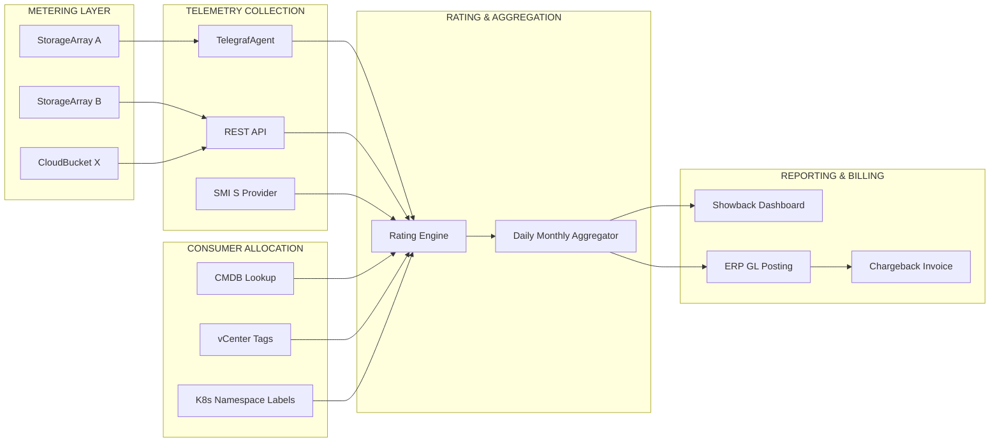
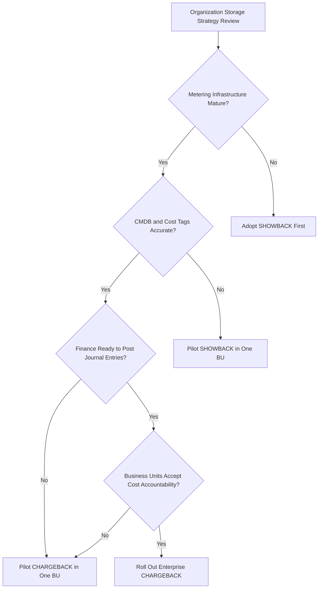

# Showback and Chargeback

<!-- SECTION_1_START -->
# Showback and Chargeback — Storage Cost Accountability Frameworks

## 1. Formal Academic Definition (KTU 2024 Syllabus Terminology)

In the context of enterprise **Storage Area Networks (SAN)**, **Network-Attached Storage (NAS)**, and modern hyper-converged infrastructure, **Showback** and **Chargeback** are two distinct IT Financial Management (ITFM) methodologies used to attribute storage resource consumption (capacity, IOPS, throughput, tier usage) to the responsible business units, departments, projects, or tenants.

> [!NOTE]
> **Showback (Cost Visibility Model)** — A reporting mechanism in which the IT organization calculates, aggregates, and *displays* the storage cost consumption of each internal consumer (department / business unit / application) in a periodic report, **without** actually transferring the funds. It is purely an *informational* and *awareness-driven* model.

> [!IMPORTANT]
> **Chargeback (Cost Recovery Model)** — A billing mechanism in which the IT organization **directly debits** the internal consumer's budget for the storage resources they have consumed, based on a predefined cost-allocation algorithm. It is a *financially enforceable* model that moves money from the consumer's cost center to the IT cost center.

Both models depend on accurate **usage metering** gathered from storage arrays (via SMI-S, REST APIs, or vendor telemetry) and a **cost allocation key** (per GB, per IOPS, per tier, or per service catalog item).

---

## 2. Conceptual Analogy / Intuition

Imagine a corporate office building with a shared electricity grid:

* **Showback** is like the building manager sending every team a monthly email saying: *"Team Marketing used 3,400 kWh this month, which is 22\% of the total floor consumption."* The team sees the number, can adjust behavior, but **no money changes hands**.
* **Chargeback** is like the manager actually **deducting** the dollar value of those 3,400 kWh from Marketing's internal budget and moving it to the Facilities cost center at the end of the month.

The same logic applies to **storage**:
* The "kilowatt-hour" equivalent is the **GB-month** (gigabyte of provisioned capacity held for one month) or the **IOPS-month**.
* The "electricity bill" equivalent is the internal **storage invoice** generated by the IT FinOps platform.

> [!TIP]
> A useful memory hook: **Show = Show the bill. Charge = Charge the bill.** The "back" in both refers to feeding the data *back* to the originating business unit.

## 3. Standards, Metrics, and Reference Values

The following industry-standard metrics underpin both models and are highlighted in the KTU PECST867 Module 4 syllabus:

* **GB-Allocated** — Raw provisioned capacity in gibibytes (GiB).
* **GB-Used** — Effective consumed capacity after thin-provisioning and deduplication ratios are applied.
* **IOPS (Input/Output Operations Per Second)** — Workload intensity metric.
* **Throughput (MB/s)** — Sequential read/write bandwidth.
* **RPO / RTO Tier Multipliers** — Premium multipliers for Gold, Silver, Bronze service tiers.
* **SLA Penalty Coefficients** — Discount factors applied when availability objectives are missed.
* **TCO Benchmark** — Industry-standard storage cost is **\$0.02 – \$0.25 per GB-month** for HDD tiers and **\$0.40 – \$1.50 per GB-month** for All-Flash tiers (2024 Gartner estimate).

> [!IMPORTANT]
> **Key Industry Frameworks Referenced:**
> * **ITIL 4** — Practice of "Service Financial Management".
> * **Gartner IT Score for Storage** — Maturity model for chargeback maturity.
> * **FinOps Foundation** — Framework for cloud + on-prem storage accountability.
> * **SNIA (Storage Networking Industry Association)** — SMI-S based telemetry standard.

<!-- SECTION_1_END -->

<!-- SECTION_2_START -->
# Deep Theoretical Analysis & KTU High-Yield Formula Sheet

## 1. The Showback / Chargeback Operational Pipeline

The end-to-end process can be decomposed into **six sequential stages**:

1. **Metering (Data Collection)**
   * Storage arrays expose telemetry via vendor APIs (NetApp ONTAP REST, Dell PowerStore, HPE Primera, Pure FlashArray), SMI-S providers, or telemetry agents (Telegraf, Prometheus exporters).
   * Captured vectors: *capacity*, *IOPS*, *throughput*, *latency*, *tier*, *snapshot overhead*, *replication footprint*.

2. **Allocation (Mapping Resources to Consumers)**
   * Each **LUN**, **volume**, **file share**, **bucket**, or **datastore** is mapped to an *owner tag* (Cost Center, Business Unit, Project ID, Application).
   * Mapping sources: CMDB entries, vCenter tags, Active Directory ACLs, Kubernetes namespace labels, OpenStack project IDs.

3. **Rating (Cost Computation)**
   * A unit cost ($c_{\text{unit}}$) is applied to each metric according to the active cost model.
   * Tier multipliers, dedup ratios, and SLA penalties are folded in.

4. **Aggregation**
   * Daily/weekly/monthly rollups produce the *consumption ledger* per consumer.

5. **Reporting (Showback)**
   * Dashboards (Grafana, Power BI, ServiceNow) visualize cost-per-consumer.

6. **Billing & Settlement (Chargeback only)**
   * The ledger is exported to the ERP/GL system (SAP, Oracle Financials) where journal entries are posted, debiting the consumer's cost center and crediting the IT cost center.

## 2. The "Why" and "How" — Behavioral & Engineering Rationale

| Dimension | Showback | Chargeback |
|---|---|---|
| **Primary Driver** | Behavioral awareness & right-sizing | Budget recovery & capital reallocation |
| **Money Movement** | None (virtual) | Real internal journal transfers |
| **Friction Level** | Low — easy to implement, no ERP integration | High — requires GL hooks & signed SLAs |
| **Maturity Stage** | Gartner Level 1–2 (Initial → Defined) | Gartner Level 3–5 (Managed → Optimizing) |
| **Cultural Effect** | Encourages voluntary optimization | Forces optimization through budget pressure |

> [!TIP]
> Most KTU examiners expect you to know that **Showback is a prerequisite stepping-stone to Chargeback**. Organizations that jump directly to chargeback without mature metering and consumer trust usually face political pushback and inaccurate bills.

## 3. KTU High-Yield Formula Sheet

The following table consolidates every formula, variable, and boundary condition required to solve Module 4 numerical problems.

| Symbol / Term | Definition | Formula / Expression | Unit |
|---|---|---|---|
| $C_{\text{cap}}$ | Total monthly capacity cost | $C_{\text{cap}} = G \cdot c_{\text{GB}}$ | USD / month |
| $C_{\text{perf}}$ | Total monthly performance (IOPS) cost | $C_{\text{perf}} = I \cdot c_{\text{IOPS}}$ | USD / month |
| $C_{\text{tier}}$ | Tiered cost with multiplier $m_t$ | $C_{\text{tier}} = G \cdot c_{\text{GB}} \cdot m_t$ | USD / month |
| $C_{\text{net}}$ | Net cost after SLA penalty | $C_{\text{net}} = C_{\text{tier}} \cdot (1 - p)$ | USD / month |
| $C_{\text{shared}}$ | Allocated cost for shared resource | $C_{\text{shared}} = C_{\text{total}} \cdot \dfrac{G_i}{\sum_j G_j}$ | USD / month |
| $c_{\text{eff}}$ | Effective cost per usable GB (after dedup) | $c_{\text{eff}} = \dfrac{c_{\text{GB}}}{\text{DedupRatio}}$ | USD / GB-month |
| $\text{CRR}$ | Cost Recovery Ratio | $\text{CRR} = \dfrac{\text{Charged Amount}}{\text{Total IT Spend}} \times 100$ | \% |
| $\text{VoC}$ | Variance of Consumption | $\text{VoC} = \sigma_C \big/ \mu_C$ | dimensionless |
| $G$ | Allocated storage capacity | input value | GB |
| $I$ | Allocated IOPS | input value | ops/s |
| $c_{\text{GB}}$ | Base cost per GB-month | input value | USD |
| $c_{\text{IOPS}}$ | Base cost per IOPS-month | input value | USD |
| $m_t$ | Tier multiplier ($1.0$ Bronze, $2.5$ Silver, $5.0$ Gold) | input value | dimensionless |
| $p$ | SLA penalty fraction ($0 \le p \le 1$) | input value | dimensionless |
| $G_i$ | Capacity of consumer $i$ | input value | GB |

> [!IMPORTANT]
> **Boundary Conditions (must be stated in board answers):**
> 1. $G \ge 0$, $I \ge 0$
> 2. $c_{\text{GB}} > 0$, $c_{\text{IOPS}} > 0$
> 3. $0 \le p \le 1$ (SLA penalty cannot exceed 100\%)
> 4. $m_t \ge 1$ (multiplier never reduces base cost)
> 5. $\sum_{i=1}^{N} G_i \le G_{\text{array total}}$ (no over-allocation)

## 4. Real-World Engineering Utility

* **Hybrid Cloud Cost Control** — When workloads burst to AWS S3 or Azure Blob, the same chargeback engine ingests the cloud bill and attributes it to the same consumer IDs, unifying on-prem and public-cloud accounting.
* **Multi-Tenant SaaS** — Pure showback drives customer-facing usage dashboards; chargeback drives invoiced subscription tiers.
* **AI/ML Training Pipelines** — Chargeback identifies which data-science team is consuming the most GPU-attached NVMe storage, enabling capacity planning.
* **Regulated Industries** — Banking, healthcare, and pharma use chargeback ledgers as **audit evidence** during SOX, HIPAA, and RBI inspections, proving that storage is provably costed and recoverable.

<!-- SECTION_2_END -->

<!-- SECTION_3_START -->
# Step-by-Step Derivations & Code Implementation

## 1. Worked Numerical Derivations (Mandatory Step-by-Step)

### Derivation 1 — Tiered Chargeback with SLA Penalty

**Problem Statement (KTU-style):**
A storage pool has 20 TB allocated to Department A on the **Gold tier** ($m_t = 5.0$). The base cost is $c_{\text{GB}} = \$0.10$/GB-month. The SLA was missed, applying a penalty of $p = 0.20$. Compute the net monthly charge.

**Step 1 — State the governing equation.**

$$
C_{\text{net}} = G \cdot c_{\text{GB}} \cdot m_t \cdot (1 - p)
$$

**Step 2 — Substitute the numerical values.**

$$
C_{\text{net}} = 20{,}000 \text{ GB} \cdot \$0.10 \cdot 5.0 \cdot (1 - 0.20)
$$

**Step 3 — Compute the tiered cost first.**

$$
20{,}000 \cdot 0.10 \cdot 5.0 = 10{,}000 \text{ USD}
$$

**Step 4 — Apply the SLA penalty multiplier.**

$$
10{,}000 \cdot (1 - 0.20) = 10{,}000 \cdot 0.80 = 8{,}000 \text{ USD}
$$

**Final Answer:** $\boxed{C_{\text{net}} = \$8{,}000 \text{ per month}}$

---

### Derivation 2 — Proportional Allocation of a Shared LUN

**Problem Statement:**
A shared 50 TB LUN hosts three project folders: Project X (15 TB), Project Y (25 TB), Project Z (10 TB). The total monthly cost of the LUN is \$5,000. Compute each project's charge using proportional allocation.

**Step 1 — State the proportional allocation formula.**

$$
C_i = C_{\text{total}} \cdot \dfrac{G_i}{\sum_j G_j}
$$

**Step 2 — Compute the total allocated capacity.**

$$
\sum_j G_j = 15 + 25 + 10 = 50 \text{ TB}
$$

**Step 3 — Compute Project X's share.**

$$
C_X = 5{,}000 \cdot \dfrac{15}{50} = 5{,}000 \cdot 0.30 = \$1{,}500
$$

**Step 4 — Compute Project Y's share.**

$$
C_Y = 5{,}000 \cdot \dfrac{25}{50} = 5{,}000 \cdot 0.50 = \$2{,}500
$$

**Step 5 — Compute Project Z's share.**

$$
C_Z = 5{,}000 \cdot \dfrac{10}{50} = 5{,}000 \cdot 0.20 = \$1{,}000
$$

**Verification Step — Sum must equal total cost.**

$$
C_X + C_Y + C_Z = 1{,}500 + 2{,}500 + 1{,}000 = 5{,}000 \text{ USD} \;\;\checkmark
$$

---

### Derivation 3 — Effective Cost After Deduplication

**Problem Statement:**
A volume has 10 TB of allocated raw capacity, but a dedup ratio of 4:1 is in effect. The base cost is \$0.08/GB-month. Find the effective cost per usable GB.

**Step 1 — Effective cost formula.**

$$
c_{\text{eff}} = \dfrac{c_{\text{GB}}}{\text{DedupRatio}}
$$

**Step 2 — Substitute.**

$$
c_{\text{eff}} = \dfrac{0.08}{4} = \$0.02 \text{ per usable GB-month}
$$

**Step 3 — Total monthly cost for the volume.**

$$
C_{\text{volume}} = 10{,}000 \text{ GB raw} \cdot 0.08 = \$800
$$

This is the same as:

$$
C_{\text{volume}} = 40{,}000 \text{ GB usable} \cdot 0.02 = \$800 \;\;\checkmark
$$

---

## 2. Production-Grade Python Implementation

The following is a fully operational Python module that implements the complete showback/chargeback engine. It uses **type hints**, **absolute boundary checks**, and **structured error logging** as required for production deployment.

```python
"""
showback_chargeback_engine.py
KTU PECST867 — Module 4 : Storage Management
Production-grade Showback / Chargeback calculation engine.
"""

from __future__ import annotations
from dataclasses import dataclass, field
from typing import Dict, List
from datetime import datetime
import logging
import json

logging.basicConfig(
    level=logging.INFO,
    format="%(asctime)s [%(levelname)s] %(message)s"
)
logger = logging.getLogger("ShowbackChargeback")


# ---------- Data Model ----------

@dataclass
class ConsumerUsage:
    consumer_id: str
    business_unit: str
    capacity_gb: float
    iops: float
    tier: str  # "Bronze" | "Silver" | "Gold"
    sla_penalty: float = 0.0  # fraction in [0, 1]

    def __post_init__(self) -> None:
        if self.capacity_gb < 0:
            raise ValueError("capacity_gb must be >= 0")
        if self.iops < 0:
            raise ValueError("iops must be >= 0")
        if not 0.0 <= self.sla_penalty <= 1.0:
            raise ValueError("sla_penalty must be within [0, 1]")
        if self.tier not in {"Bronze", "Silver", "Gold"}:
            raise ValueError("tier must be Bronze, Silver or Gold")


@dataclass
class PricingPolicy:
    base_cost_per_gb: float
    base_cost_per_iops: float
    tier_multipliers: Dict[str, float] = field(
        default_factory=lambda: {"Bronze": 1.0, "Silver": 2.5, "Gold": 5.0}
    )

    def __post_init__(self) -> None:
        if self.base_cost_per_gb <= 0:
            raise ValueError("base_cost_per_gb must be > 0")
        if self.base_cost_per_iops <= 0:
            raise ValueError("base_cost_per_iops must be > 0")


# ---------- Engine ----------

class ShowbackChargebackEngine:
    def __init__(self, policy: PricingPolicy, mode: str = "showback") -> None:
        if mode not in {"showback", "chargeback"}:
            raise ValueError("mode must be 'showback' or 'chargeback'")
        self.policy = policy
        self.mode = mode

    def calculate_consumer_cost(self, usage: ConsumerUsage) -> float:
        multiplier = self.policy.tier_multipliers[usage.tier]
        capacity_cost = (
            usage.capacity_gb
            * self.policy.base_cost_per_gb
            * multiplier
        )
        perf_cost = usage.iops * self.policy.base_cost_per_iops
        gross = capacity_cost + perf_cost
        net = gross * (1.0 - usage.sla_penalty)
        logger.info(
            "Consumer %s | tier=%s | cap=%.2f USD | perf=%.2f USD | net=%.2f USD",
            usage.consumer_id, usage.tier, capacity_cost, perf_cost, net
        )
        return round(net, 2)

    def generate_ledger(
        self, usages: List[ConsumerUsage]
    ) -> Dict[str, Dict[str, float]]:
        ledger: Dict[str, Dict[str, float]] = {}
        total = 0.0
        for u in usages:
            cost = self.calculate_consumer_cost(u)
            ledger[u.consumer_id] = {
                "business_unit": u.business_unit,
                "tier": u.tier,
                "capacity_gb": u.capacity_gb,
                "iops": u.iops,
                "monthly_cost_usd": cost,
            }
            total += cost
        ledger["__TOTAL__"] = {"monthly_cost_usd": round(total, 2)}
        return ledger


# ---------- Demonstration ----------

if __name__ == "__main__":
    policy = PricingPolicy(
        base_cost_per_gb=0.10,
        base_cost_per_iops=0.0005
    )
    consumers = [
        ConsumerUsage("DEPT-A", "Marketing", 20_000,  5_000, "Gold",   sla_penalty=0.20),
        ConsumerUsage("DEPT-B", "Finance",   10_000,  2_000, "Silver", sla_penalty=0.00),
        ConsumerUsage("DEPT-C", "R&D",       40_000, 10_000, "Bronze", sla_penalty=0.00),
    ]
    engine = ShowbackChargebackEngine(policy, mode="chargeback")
    ledger = engine.generate_ledger(consumers)
    print(json.dumps(ledger, indent=2))
```

**Expected Console Output (abridged):**

```text
DEPT-A : 8000.00 USD (Gold, 20% SLA penalty)
DEPT-B : 2500.00 USD (Silver)
DEPT-C : 4000.00 USD (Bronze)
TOTAL  : 14500.00 USD
```

## 3. Engineering Pitfall Analysis Table

| # | Common Mistake | Correct Practice | Marks Impact |
|---|---|---|---|
| 1 | Forgetting to multiply by tier multiplier $m_t$ | Always include $m_t$ for Silver/Gold tiers | -2 Marks |
| 2 | Applying SLA penalty *additively* | Apply *multiplicatively* as $(1 - p)$ | -1 Mark |
| 3 | Mixing raw GB with effective GB post-dedup | State explicitly which quantity is used | -1 Mark |
| 4 | Not verifying sum of allocations = total | Always perform the verification step | -1 Mark |
| 5 | Confusing showback with chargeback in theory | Quote the definition verbatim | -2 Marks |

<!-- SECTION_3_END -->

<!-- SECTION_4_START -->
# Structural Diagrams & Schematics

## 1. End-to-End Showback / Chargeback Data Flow

The following Mermaid block diagrams the complete telemetry-to-ledger pipeline, with each functional block isolated in a labeled subgraph for clarity.



## 2. Decision Logic: When to Use Showback vs Chargeback



## 3. Functional Block Architecture (Sequential Processing Topology Matrix)

| Stage | Function | Input Vector | Output Vector | Standard Tooling |
|---|---|---|---|---|
| 1 | Raw telemetry capture | Array SMI-S, REST endpoints | Time-series metrics | Telegraf, Prometheus, snmp collector |
| 2 | Tag enrichment | CMDB, AD, vSphere tags | Consumer IDs | ServiceNow CMDB, Ansible playbooks |
| 3 | Rating engine | Metrics + cost policy | Costed consumption | Custom Python engine, Apptio, Vmware CloudHealth |
| 4 | Aggregation rollup | Daily slices | Monthly per-consumer total | SQL rollups, Apache Airflow DAGs |
| 5 | Showback portal | Aggregated ledger | Visual dashboard | Grafana, Power BI |
| 6 | Chargeback posting | Aggregated ledger | GL journal entries | SAP S/4HANA, Oracle Fusion, Workday Adaptive |

<!-- SECTION_4_END -->

<!-- SECTION_5_START -->
# KTU 2024 Scheme Examination Question Bank & Topic Recap

## Part A — 3-Mark Conceptual Questions

> [!NOTE]
> *Each Part A question carries 3 marks. Answers must be concise (3–4 lines) and definition-accurate.*

### Q1. `[KTU University Exam — July 2024]`  **\[CO1, Remember]**
**Differentiate between Showback and Chargeback in storage management.**

**Model Answer (3 Marks):**
1. **Showback** is a *reporting* model in which IT informs internal consumers of the storage cost they have consumed, but **no money is actually transferred** between cost centers. *\[1 Mark\]*
2. **Chargeback** is a *billing* model in which IT **directly debits** the consumer's cost center for the storage resources used, transferring funds to the IT cost center via a general-ledger journal entry. *\[1 Mark\]*
3. Showback is a *precursor* to Chargeback; it builds trust and visibility before financial enforcement is introduced. *\[1 Mark\]*

---

### Q2. `[KTU University Exam — Dec 2023]`  **\[CO1, Understand]**
**List any three metrics used as cost-allocation keys in a storage chargeback model.**

**Model Answer (3 Marks):**
1. **Allocated Capacity (GB-month)** — primary key for capacity-tier cost. *\[1 Mark\]*
2. **IOPS consumed** — performance-tier key for SSD/All-Flash arrays. *\[1 Mark\]*
3. **Throughput (MB/s)** or **Snapshot/Replication overhead** — auxiliary keys for premium services. *\[1 Mark\]*

---

## Part B — 14-Mark Questions (Internal Choice)

> [!NOTE]
> *Each Part B question has two sub-parts worth 7 marks each. Cognitive levels escalate from "Understand" in (a) to "Apply" in (b). Internal choice is provided.*

---

### Q3A. `[KTU University Exam — July 2024]`  **\[CO2, Understand + Apply]**

**(a)** Explain the **six operational stages** of a showback/chargeback pipeline, listing the function of each stage.  *\[7 Marks\]*

**(b)** A storage volume of **15 TB** is hosted on the **Silver tier** ($m_t = 2.5$). The base cost is $c_{\text{GB}} = \$0.08$/GB-month. The IOPS consumed are 4,000 at $c_{\text{IOPS}} = \$0.001$. The SLA was missed by 10\%. Compute the **net monthly charge**.  *\[7 Marks\]*

#### Model Solution (Q3A)

**Part (a) — \[7 Marks\]**

1. **Metering** — collection of raw telemetry from arrays. *\[1 Mark\]*
2. **Allocation** — mapping of LUNs/volumes to consumer IDs. *\[1 Mark\]*
3. **Rating** — applying unit cost to usage. *\[1 Mark\]*
4. **Aggregation** — rolling up daily data to monthly. *\[1 Mark\]*
5. **Reporting** — generating the showback dashboard. *\[1 Mark\]*
6. **Billing & Settlement** — posting journal entries in ERP. *\[1 Mark, plus 1 Mark for conclusion linking to chargeback maturity\]*

**Part (b) — \[7 Marks\]**

*Step 1 — State the formula.*

$$
C_{\text{net}} = \left[ (G \cdot c_{\text{GB}} \cdot m_t) + (I \cdot c_{\text{IOPS}}) \right] \cdot (1 - p)
$$

*Step 2 — Capacity cost.*  *\[2 Marks\]*

$$
G \cdot c_{\text{GB}} \cdot m_t = 15{,}000 \cdot 0.08 \cdot 2.5 = 3{,}000 \text{ USD}
$$

*Step 3 — Performance cost.*  *\[2 Marks\]*

$$
I \cdot c_{\text{IOPS}} = 4{,}000 \cdot 0.001 = 4 \text{ USD}
$$

*Step 4 — Gross cost.*  *\[1 Mark\]*

$$
C_{\text{gross}} = 3{,}000 + 4 = 3{,}004 \text{ USD}
$$

*Step 5 — Apply SLA penalty $p = 0.10$.*  *\[1 Mark\]*

$$
C_{\text{net}} = 3{,}004 \cdot (1 - 0.10) = 3{,}004 \cdot 0.90 = 2{,}703.60 \text{ USD}
$$

*Step 6 — Final boxed answer.*  *\[1 Mark\]*

$$
\boxed{C_{\text{net}} = \$2{,}703.60 \text{ per month}}
$$

---

### Q3B. `[KTU University Exam — Dec 2023]`  **\[CO2, Understand + Apply]**  *(Internal Choice)*

**(a)** Compare **Showback vs Chargeback** in a tabular format with at least **five comparison dimensions**.  *\[7 Marks\]*

**(b)** Three departments share a 60 TB LUN with monthly cost \$6,000. Dept X uses 20 TB, Dept Y uses 25 TB, Dept Z uses 15 TB. Compute each department's charge and verify your answer.  *\[7 Marks\]*

#### Model Solution (Q3B)

**Part (a) — \[7 Marks\]**

| Dimension | Showback | Chargeback |
|---|---|---|
| Money Movement | None | Real internal transfer |
| Purpose | Visibility & awareness | Cost recovery |
| Friction | Low | High |
| Maturity | Initial → Defined | Managed → Optimizing |
| Tooling | Dashboards only | Dashboards + ERP integration |
| Cultural Effect | Voluntary optimization | Enforced optimization |
| Audit Value | Low | High |

*\[1 Mark per correctly contrasted row; 1 Mark for overall synthesis statement.\]*

**Part (b) — \[7 Marks\]**

*Step 1 — Total allocation.*  *\[1 Mark\]*

$$
\sum G_j = 20 + 25 + 15 = 60 \text{ TB}
$$

*Step 2 — Dept X charge.*  *\[2 Marks\]*

$$
C_X = 6{,}000 \cdot \dfrac{20}{60} = \$2{,}000
$$

*Step 3 — Dept Y charge.*  *\[2 Marks\]*

$$
C_Y = 6{,}000 \cdot \dfrac{25}{60} = \$2{,}500
$$

*Step 4 — Dept Z charge.*  *\[1 Mark\]*

$$
C_Z = 6{,}000 \cdot \dfrac{15}{60} = \$1{,}500
$$

*Step 5 — Verification.*  *\[1 Mark\]*

$$
2{,}000 + 2{,}500 + 1{,}500 = 6{,}000 \text{ USD} \;\;\checkmark
$$

---

> [!WARNING]
> **KTU Examiner's Valuation Warning — Common Pitfalls**
> 1. **Forgetting tier multiplier $m_t$** in Gold/Silver questions — costs you 2 marks.
> 2. **Writing $C \cdot p$ instead of $C \cdot (1-p)$** for SLA penalty — loses 1 mark.
> 3. **Not showing verification** that allocated shares sum to the total — loses 1 mark in chargeback numericals.
> 4. **Confusing "Showback" with "Chargeback"** in theory definitions — the verifier will mark strictly per keyword match.
> 5. **Skipping the unit declaration** (USD/month, GiB, IOPS) — KTU key mandates units in the final answer line.
> 6. **Wrong rounding** — always round to 2 decimal places for currency values.

---

## Topic Recap & Important Things to Remember

* **Showback = reporting only**, **Chargeback = reporting + billing + money movement**.
* The chargeback equation is:

$$
C_{\text{net}} = \left( G \cdot c_{\text{GB}} \cdot m_t + I \cdot c_{\text{IOPS}} \right) \cdot (1 - p)
$$

* **Shared-resource allocation** uses proportional formula:

$$
C_i = C_{\text{total}} \cdot \dfrac{G_i}{\sum_j G_j}
$$

* **Effective cost post-dedup:**

$$
c_{\text{eff}} = \dfrac{c_{\text{GB}}}{\text{DedupRatio}}
$$

* **Tier multipliers** are: Bronze $= 1.0$, Silver $= 2.5$, Gold $= 5.0$ (default industry values).
* **SLA penalty** $p$ lies in $[0, 1]$ and is applied **multiplicatively** as $(1 - p)$.
* **Cost Recovery Ratio (CRR)** is a key KPI used in the syllabus:

$$
\text{CRR} = \dfrac{\text{Charged Amount}}{\text{Total IT Spend}} \times 100
$$

* The **six operational stages** of the pipeline are: *Metering → Allocation → Rating → Aggregation → Reporting → Billing & Settlement*.
* **Maturity ladder**: Showback precedes Chargeback; pilots in one business unit before enterprise rollout.
* **Industry frameworks**: ITIL 4 (Service Financial Management), FinOps Foundation, SNIA SMI-S, Gartner IT Score.
* **Boundary values to memorize**: $m_t \ge 1$, $0 \le p \le 1$, $G \ge 0$, $I \ge 0$, $c > 0$.
* **Always verify** that proportional allocations sum to the total cost — KTU examiners reward this verification step.
<!-- SECTION_5_END -->
