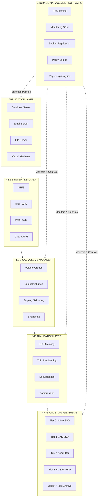
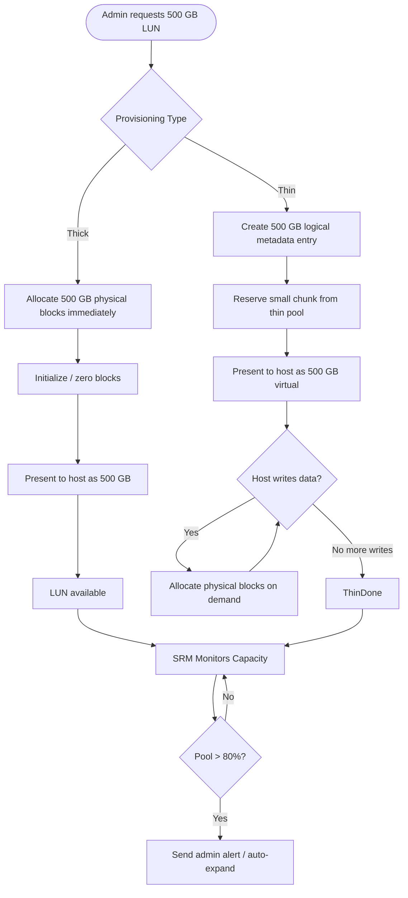
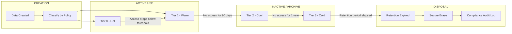
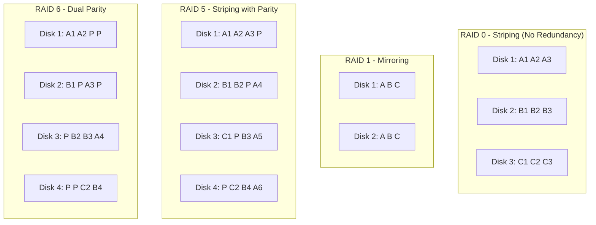
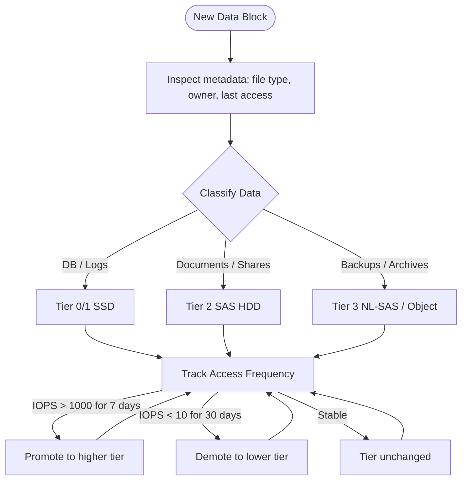
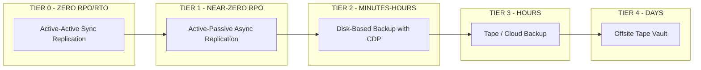
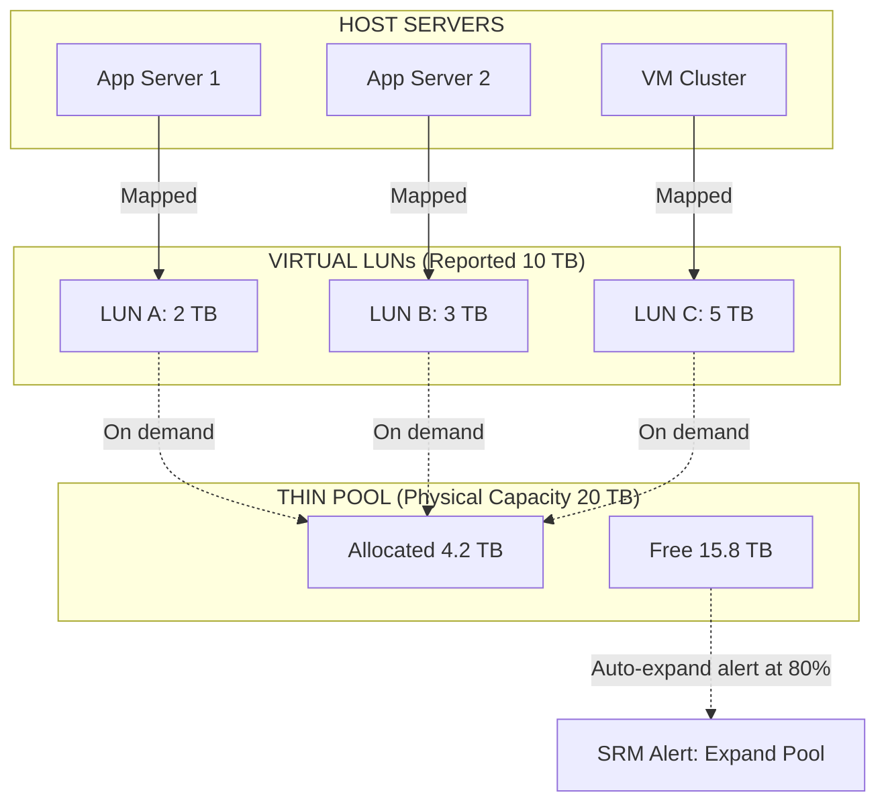
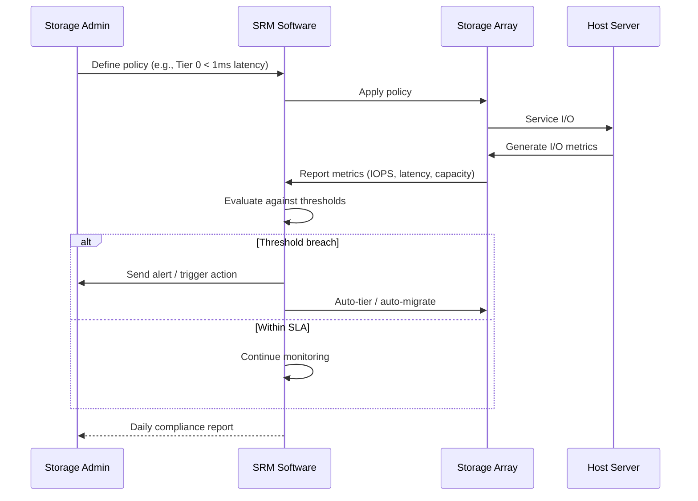

# Storage Management:-

<!-- SECTION_1_START -->
# Storage Management: Core Technical Definition & Intuitive Overview

## Formal Academic Definition (KTU 2024 Syllabus Terminology)

**Storage Management** refers to the systematic process of planning, provisioning, allocating, monitoring, optimizing, and reclaiming storage resources across heterogeneous storage infrastructure to meet Service Level Agreements (SLAs), ensure data availability, maximize utilization, and enforce governance policies throughout the data lifecycle.

In KTU 2024 Scheme terminology aligned with SNIA (Storage Networking Industry Association) frameworks, Storage Management encompasses:

> [!IMPORTANT]
> **Storage Management** is the discipline of managing storage infrastructure (devices, media, networks, and services) through policies, procedures, and tools to ensure efficient data storage, retrieval, backup, protection, and disposition across the information lifecycle.

## Conceptual Analogy / Intuition

Think of **Storage Management** as running a **large smart warehouse** for a multinational company:

| Warehouse Element | Storage Management Equivalent |
|-------------------|------------------------------|
| Warehouse building & racks | Physical storage arrays, disks, SSDs |
| Loading dock & aisles | I/O paths, controllers, buses |
| Inventory tracking system | File system metadata, volume manager |
| Warehouse manager | Storage Administrator / SRM software |
| Reorganization of goods | Storage tiering, data migration |
| Fireproof safe copies | Backup, snapshots, replication |
| Disposing old items | Data archiving & retention policies |
| Security guards & cameras | Access control, encryption, monitoring |

Just as a warehouse manager decides **what goes where**, **how much space each item gets**, **which items are accessed frequently (front of warehouse)** vs rarely (back of warehouse)**, and **how to protect against fire (disasters)**, a Storage Management system handles data placement, tiering, protection, and retrieval.

### Core Pillars of Storage Management

1. **Provisioning** — Allocating storage capacity to applications/users
2. **Allocation & Placement** — Determining where data physically resides
3. **Tiering** — Moving data between performance tiers (Hot/Warm/Cold)
4. **Protection** — RAID, replication, snapshots, backup
5. **Optimization** — Deduplication, compression, thin provisioning
6. **Monitoring & Reporting** — Performance, capacity, health metrics
7. **Lifecycle Management** — Creation → Active use → Archival → Disposal

> [!NOTE]
> **Key Distinction:** *Storage Administration* focuses on day-to-day operations, while *Storage Management* is the broader discipline that includes planning, automation, policy enforcement, and strategic governance.

## Key Performance Indicators (KPIs) in Storage Management

- **Capacity Utilization Rate** = Used Capacity / Total Provisioned Capacity
- **IOPS (Input/Output Operations Per Second)** — measure of I/O throughput
- **Throughput** — measured in **MB/s** or **GB/s**
- **Latency** — measured in **milliseconds (ms)** or **microseconds (µs)**
- **RTO (Recovery Time Objective)** — maximum acceptable downtime
- **RPO (Recovery Point Objective)** — maximum acceptable data loss
- **Storage Efficiency Ratio** = Logical Capacity Used / Physical Capacity Consumed

> [!IMPORTANT]
> **Industry Benchmark:** Modern enterprise storage systems aim for **>80% storage efficiency** through deduplication and compression, with **<5ms latency** for tier-1 workloads.

---

## Storage Management Functional Architecture (High-Level)

```
┌──────────────────────────────────────────────────────────┐
│              APPLICATIONS & USERS                        │
└─────────────────────┬────────────────────────────────────┘
                      │ I/O Requests
┌─────────────────────▼────────────────────────────────────┐
│         FILE SYSTEM / DATABASE LAYER                     │
│   (NTFS, ext4, XFS, ZFS, Oracle ASM, etc.)              │
└─────────────────────┬────────────────────────────────────┘
                      │ Logical Volumes
┌─────────────────────▼────────────────────────────────────┐
│        LOGICAL VOLUME MANAGER (LVM/Veritas/SVM)          │
│   (Volume Groups, Logical Volumes, Striping, Mirroring)  │
└─────────────────────┬────────────────────────────────────┘
                      │ LUNs / Virtual Disks
┌─────────────────────▼────────────────────────────────────┐
│      STORAGE VIRTUALIZATION LAYER (Optional)             │
│   (Symantec, IBM SVC, NetApp V-Series, VMware vSAN)      │
└─────────────────────┬────────────────────────────────────┘
                      │ Physical Devices
┌─────────────────────▼────────────────────────────────────┐
│     STORAGE ARRAYS (RAID Controllers, Disks, SSDs)       │
└──────────────────────────────────────────────────────────┘
                      │
┌─────────────────────▼────────────────────────────────────┐
│   STORAGE MANAGEMENT SOFTWARE / SRM (e.g., NetApp        │
│   OnCommand, EMC Unisphere, HPE InfoSight, VMware vCSA)  │
└──────────────────────────────────────────────────────────┘
```

<!-- SECTION_1_END -->

<!-- SECTION_2_START -->
# Deep Theoretical Analysis & KTU High-Yield Formula Sheet

## 1. Storage Provisioning Strategies

### Thick Provisioning (Traditional/Eager)
- Allocates full physical capacity at the time of LUN creation
- Pre-reserves the entire requested capacity
- **Pros:** Predictable performance, no over-commitment risk
- **Cons:** Wastes physical capacity, poor utilization

### Thin Provisioning (On-Demand)
- Allocates physical blocks only when data is actually written
- Reports logical (virtual) capacity to host
- **Pros:** Higher utilization (often **>70%** savings reported in industry)
- **Cons:** Performance penalty, risk of "out-of-space" if not monitored

> [!NOTE]
> **Rule of Thumb:** Always monitor thin-pool utilization. Industry best practice is to set an **80% threshold alarm** on thin pools to avoid unexpected out-of-space conditions.

## 2. Storage Tiering

Storage Tiering is the automatic or policy-based movement of data between different storage classes based on access frequency, performance requirements, and cost.

### Standard Tier Hierarchy

| Tier | Media Type | Use Case | Cost/GB | Typical Latency |
|------|-----------|----------|---------|-----------------|
| **Tier 0** | NVMe SSD | Mission-critical DBs | High | < 100 µs |
| **Tier 1** | SAS SSD | High-perf OLTP | High | < 1 ms |
| **Tier 2** | 10K/15K SAS HDD | Business apps | Medium | 3-5 ms |
| **Tier 3** | 7.2K NL-SAS HDD | File shares, backups | Low | 8-15 ms |
| **Tier 4** | Object/Cloud/Cold | Archival, compliance | Very Low | Seconds-Minutes |

> [!IMPORTANT]
> **The 80/20 Rule (Pareto Principle):** Approximately **80% of I/O operations** typically access only **20% of data**. Storage tiering exploits this by placing hot data on fast, expensive media and cold data on slow, cheap media.

## 3. Data Reduction Techniques

### Deduplication (Dedupe)
Eliminates duplicate copies of repeating data, storing only one unique block.

$$
\text{Dedupe Ratio} = \frac{\text{Total Logical Bytes Processed}}{\text{Total Physical Bytes Stored}}
$$

- **Inline Deduplication:** Performed as data is being written (before disk)
- **Post-Process Deduplication:** Performed after data is written (during idle cycles)
- **Block-level vs File-level:** Block-level (finer granularity) vs File-level (faster)

### Compression
Reduces data size by encoding redundancy using algorithms such as **LZ77, LZ4, ZSTD, GZIP**.

$$
\text{Compression Ratio} = \frac{\text{Uncompressed Size}}{\text{Compressed Size}}
$$

> [!NOTE]
> **Best Practice:** Dedup is most effective on virtualized environments, VDI (Virtual Desktop Infrastructure), and backup datasets — where redundancy is naturally high (**often 10:1 to 30:1 ratios**).

## 4. RAID Levels (Critical for KTU Exams)

RAID (Redundant Array of Independent Disks) provides redundancy, performance, or both.

| RAID Level | Min Disks | Fault Tolerance | Read Perf | Write Perf | Capacity Efficiency |
|------------|-----------|-----------------|-----------|------------|---------------------|
| **RAID 0** | 2 | 0 (None) | High | High | 100% |
| **RAID 1** | 2 | 1 disk | High | Medium | 50% |
| **RAID 5** | 3 | 1 disk | High | Low | (n-1)/n |
| **RAID 6** | 4 | 2 disks | High | Low | (n-2)/n |
| **RAID 10** | 4 | 1 per mirror | High | High | 50% |
| **RAID 50** | 6 | 1 per stripe | High | Medium | (n-m)/n |
| **RAID 60** | 8 | 2 per stripe | High | Medium | (n-2m)/n |

Where **n** = total disks, **m** = number of parity groups.

### RAID Capacity Efficiency Formula

$$
\text{Usable Capacity} = \sum_{i=1}^{G} \left( n_i - p_i \right) \times S_i
$$

Where:
- $G$ = number of RAID groups
- $n_i$ = disks in group $i$
- $p_i$ = parity disks in group $i$
- $S_i$ = size of each disk in group $i$

> [!IMPORTANT]
> **KTU Examiner Tip:** When computing usable capacity, always convert disk size to a common unit. Never use marketing "TB" (1,000,000,000,000 bytes) — use TiB (1,099,511,627,776 bytes) for accurate array calculations.

## 5. Logical Volume Manager (LVM) Architecture

LVM abstracts physical storage into logical, flexible volumes. Three-layer hierarchy:

$$
\text{Physical Volumes (PV)} \rightarrow \text{Volume Groups (VG)} \rightarrow \text{Logical Volumes (LV)}
$$

| Component | Description | Example |
|-----------|-------------|---------|
| **PV (Physical Volume)** | Raw disk or partition initialized for LVM | `/dev/sdb1` |
| **VG (Volume Group)** | Pool of one or more PVs combining capacity | `vg_data` |
| **LV (Logical Volume)** | Virtual partition carved from VG, presented to OS | `lv_db01` |
| **PE (Physical Extent)** | Smallest allocatable unit of a PV (default **4 MiB**) | — |
| **LE (Logical Extent)** | Smallest allocatable unit of an LV | — |

### Key LVM Operations

1. **Striping (RAID 0 equivalent):** Distributes I/O across multiple PVs for performance
2. **Mirroring (RAID 1 equivalent):** Maintains identical copies for redundancy
3. **Online Resizing:** Extend/reduce LV capacity on-the-fly
4. **Snapshots:** Point-in-time copies using Copy-on-Write (CoW)
5. **Migration:** Move data between PVs without downtime (e.g., `pvmove`)

## 6. Storage Virtualization

Storage Virtualization abstracts physical storage from logical storage, presenting a unified, pool-based view to hosts.

$$
\text{Virtual LUN}_{\text{host}} = f(\text{Physical LUNs}_{1..n}, \text{Policy})
$$

### Types of Storage Virtualization

| Type | Implementation | Examples |
|------|----------------|----------|
| **Host-based** | Software in host OS/Hypervisor | VMware VMFS, Windows Storage Spaces |
| **Array-based** | Inside the storage array | EMC VPLEX, NetApp FlexVol |
| **Network-based** | Appliance in SAN fabric | IBM SVC, HPE StoreVirtual |

## 7. Storage Performance Metrics — Detailed

### IOPS Calculation

$$
\text{IOPS} = \frac{1}{T_s + T_r + T_t}
$$

Where:
- $T_s$ = average seek time (ms)
- $T_r$ = rotational latency (ms) = $\frac{1}{2 \times \text{RPM}} \times 60{,}000$ ms
- $T_t$ = transfer time (ms) = $\frac{\text{Block Size}}{\text{Transfer Rate}}$

> [!EXAMPLE]
> For a **15,000 RPM** disk: $T_r = \frac{30{,}000}{15{,}000} = 2$ ms (half-rotation)
> Average seek = 3.5 ms, Transfer for 4 KB at 100 MB/s = 0.04 ms
> **IOPS** = $\frac{1}{3.5 + 2 + 0.04} \approx 180$ IOPS (per disk)

### Queue Depth and Concurrency

$$
\text{Total IOPS}_{\text{array}} = \sum_{i=1}^{n} \text{IOPS}_i \times \text{Queue Depth}_i
$$

### Response Time vs Throughput Trade-off

$$
\text{Throughput (MB/s)} = \frac{\text{IOPS} \times \text{Block Size (KB)}}{1024}
$$

## 8. Storage Capacity Planning Formulas

### Growth-Based Capacity Forecast

$$
C_{n} = C_{0} \times (1 + r)^{n}
$$

Where:
- $C_n$ = projected capacity at year $n$
- $C_0$ = current capacity
- $r$ = annual growth rate (decimal)
- $n$ = number of years

### RAID Penalty (for Write-Heavy Workloads)

$$
\text{Effective IOPS}_{\text{write}} = \frac{\text{Raw IOPS}}{\text{RAID Penalty}}
$$

| RAID Level | Write Penalty |
|------------|---------------|
| RAID 0 | 1 |
| RAID 1 | 2 |
| RAID 5 | 4 |
| RAID 6 | 6 |
| RAID 10 | 2 |

> [!IMPORTANT]
> **Worked Example:** A RAID 5 array with **8 disks** spinning at **10K RPM** (~140 IOPS/disk):
> - Raw IOPS = $8 \times 140 = 1120$ IOPS
> - Effective write IOPS = $1120 / 4 = 280$ IOPS

## 9. Data Protection Hierarchy

```
┌─────────────────────────────────────┐
│   LOCAL COPY (Snapshot/Clone)       │  ← RTO: seconds
├─────────────────────────────────────┤
│   LOCAL BACKUP (Disk-to-Disk)       │  ← RTO: minutes
├─────────────────────────────────────┤
│   REMOTE REPLICATION (Sync/Async)   │  ← RTO: minutes-hours
├─────────────────────────────────────┤
│   OFFSITE BACKUP (Tape/Cloud)       │  ← RTO: hours-days
└─────────────────────────────────────┘
```

### RTO / RPO Mapping

$$
\text{Data Loss}_{\text{max}} = \text{RPO} \times \text{Write Rate}
$$

$$
\text{Downtime}_{\text{max}} = \text{RTO}
$$

## 10. KTU High-Yield Formula Sheet

| Concept | Formula | Units |
|---------|---------|-------|
| IOPS | $1 / (T_s + T_r + T_t)$ | operations/sec |
| Rotational Latency | $30{,}000 / \text{RPM}$ | ms |
| Transfer Time | Block Size / Transfer Rate | ms |
| Throughput | IOPS × Block Size | MB/s |
| RAID Usable Capacity | $\sum (n_i - p_i) \times S_i$ | GB/TB |
| Effective Write IOPS | Raw IOPS / RAID Penalty | IOPS |
| Capacity Forecast | $C_n = C_0 (1+r)^n$ | TB |
| Compression Ratio | Original / Compressed | : 1 |
| Dedup Ratio | Logical / Physical | : 1 |
| Storage Efficiency | Useful Data / Raw Allocated | % |
| Data Loss Budget | RPO × Write Rate | GB |

<!-- SECTION_2_END -->

<!-- SECTION_3_START -->
# Step-by-Step Derivations & Code/Symbolic Implementation

## Worked Derivation 1: RAID 5 Capacity and Performance

**Problem:** Design a RAID 5 array to host a **10 TB** database. Use 1 TB 7.2K NL-SAS drives. Calculate the number of disks, usable capacity, and write IOPS.

### Step 1: Determine Number of Disks

Let $n$ = total disks, $p$ = parity disks (1 for RAID 5).

$$
\text{Usable Capacity} = (n - 1) \times S
$$

$$
10 \text{ TB} = (n - 1) \times 1 \text{ TB}
$$

$$
n - 1 = 10 \quad \Rightarrow \quad n = 11 \text{ disks}
$$

> **[Stating the RAID 5 formula: 1 Mark]**
> **[Substituting values: 1 Mark]**
> **[Solving for n: 1 Mark]**

### Step 2: Calculate Total Raw Capacity

$$
\text{Raw} = n \times S = 11 \times 1 \text{ TB} = 11 \text{ TB}
$$

### Step 3: Calculate Efficiency

$$
\eta = \frac{n - 1}{n} = \frac{10}{11} \approx 90.9\%
$$

### Step 4: Calculate Disk IOPS

For 7.2K NL-SAS: average seek $T_s = 8.5$ ms, rotational latency $T_r = 4.16$ ms, transfer $T_t = 0.05$ ms (for 4 KB).

$$
\text{IOPS}_{\text{disk}} = \frac{1}{8.5 + 4.16 + 0.05} \approx 78.5 \text{ IOPS/disk}
$$

### Step 5: Apply RAID 5 Write Penalty (×4)

$$
\text{Write IOPS}_{\text{array}} = \frac{11 \times 78.5}{4} \approx 215.9 \text{ IOPS}
$$

$$
\text{Read IOPS}_{\text{array}} = 11 \times 78.5 \approx 863.5 \text{ IOPS}
$$

> **[Final capacity: 1 Mark]**
> **[Final IOPS values: 1 Mark]**

---

## Worked Derivation 2: Capacity Planning Forecast

**Problem:** A storage system has **500 TB** allocated today. Annual growth rate is **35%**. Forecast capacity required after **3 years**.

### Step 1: Apply Compound Growth

$$
C_{3} = C_{0} \times (1 + r)^{n} = 500 \times (1.35)^{3}
$$

### Step 2: Calculate Exponent

$$
(1.35)^{3} = 1.35 \times 1.35 \times 1.35
$$

$$
1.35 \times 1.35 = 1.8225
$$

$$
1.8225 \times 1.35 = 2.460375
$$

### Step 3: Final Result

$$
C_{3} = 500 \times 2.460375 = 1230.19 \text{ TB} \approx 1.23 \text{ PB}
$$

> **[Formula statement: 1 Mark]**
> **[Substitution: 1 Mark]**
> **[Final value with units: 1 Mark]**

---

## Worked Derivation 3: Thin Provisioning Space Savings

**Problem:** Provision 20 LUNs of 500 GB each on a thin pool. Post-allocation, actual data written is 4.2 TB. Calculate physical consumption, logical capacity, and savings.

### Step 1: Logical (Reported) Capacity

$$
C_{\text{logical}} = 20 \times 500 \text{ GB} = 10{,}000 \text{ GB} = 10 \text{ TB}
$$

### Step 2: Physical (Actual) Capacity

$$
C_{\text{physical}} = 4.2 \text{ TB}
$$

### Step 3: Savings

$$
\text{Savings} = C_{\text{logical}} - C_{\text{physical}} = 10 - 4.2 = 5.8 \text{ TB}
$$

$$
\text{Savings \%} = \frac{5.8}{10} \times 100 = 58\%
$$

> **[Logical capacity: 1 Mark]**
> **[Physical capacity: 1 Mark]**
> **[Savings computation: 1 Mark]**

---

## Python Implementation: Storage Capacity Forecaster

```python
"""
Storage Capacity Forecasting Tool
Computes projected capacity, growth-driven procurement needs,
and RAID-array effective IOPS for capacity-planning use cases.
"""
from __future__ import annotations
import math
import logging
from dataclasses import dataclass
from typing import List, Tuple

# ------------------------------------------------------------------
# Logging configuration – production-grade observability
# ------------------------------------------------------------------
logging.basicConfig(
    level=logging.INFO,
    format="%(asctime)s | %(levelname)s | %(name)s | %(message)s",
)
logger = logging.getLogger("StorageCapacityForecaster")


# ------------------------------------------------------------------
# Domain models
# ------------------------------------------------------------------
@dataclass(frozen=True)
class DiskSpec:
    """Physical disk specification."""
    size_gb: float           # Raw disk capacity in GB
    rpm: int                 # Rotational speed (e.g., 7200, 10000, 15000)
    avg_seek_ms: float       # Average seek time in milliseconds
    transfer_rate_mbps: float  # Sustained sequential read MB/s

    def __post_init__(self) -> None:
        if self.size_gb <= 0:
            raise ValueError("Disk size must be positive")
        if self.rpm <= 0:
            raise ValueError("RPM must be positive")
        if self.avg_seek_ms < 0 or self.transfer_rate_mbps <= 0:
            raise ValueError("Seek time must be >=0 and transfer rate > 0")


RAID_PENALTIES = {
    "RAID0": 1,
    "RAID1": 2,
    "RAID5": 4,
    "RAID6": 6,
    "RAID10": 2,
}


# ------------------------------------------------------------------
# Core computations
# ------------------------------------------------------------------
def rotational_latency_ms(rpm: int) -> float:
    """Half-rotation latency in milliseconds."""
    return (30_000.0 / rpm)


def transfer_time_ms(block_size_kb: float, transfer_rate_mbps: float) -> float:
    """Time to transfer `block_size_kb` at given MB/s rate."""
    if transfer_rate_mbps <= 0:
        raise ValueError("Transfer rate must be > 0")
    return (block_size_kb / 1024.0) / transfer_rate_mbps * 1000.0


def disk_iops(disk: DiskSpec, block_size_kb: float = 4.0) -> float:
    """Compute raw IOPS for a single disk."""
    t_seek = disk.avg_seek_ms
    t_rot = rotational_latency_ms(disk.rpm)
    t_tx = transfer_time_ms(block_size_kb, disk.transfer_rate_mbps)
    total = t_seek + t_rot + t_tx
    if total <= 0:
        raise ValueError("Computed access time must be positive")
    iops = 1_000.0 / total   # convert ms to seconds
    logger.info(
        "Disk IOPS computed: seek=%.3fms rot=%.3fms tx=%.3fms -> %.1f IOPS",
        t_seek, t_rot, t_tx, iops,
    )
    return iops


def raid_usable_capacity_gb(
    n_disks: int,
    disk: DiskSpec,
    raid_level: str,
) -> float:
    """Usable (logical) capacity for a RAID group."""
    if n_disks < 1:
        raise ValueError("n_disks must be >= 1")
    if raid_level not in RAID_PENALTIES:
        raise ValueError(f"Unsupported RAID level: {raid_level}")
    if raid_level in ("RAID0",):
        parity = 0
    elif raid_level in ("RAID1", "RAID5"):
        parity = 1
    elif raid_level == "RAID6":
        parity = 2
    elif raid_level == "RAID10":
        # n_disks must be even, half are mirrors
        if n_disks % 2 != 0:
            raise ValueError("RAID10 requires an even number of disks")
        parity = n_disks // 2
    else:
        parity = 0
    usable_disks = n_disks - parity
    return usable_disks * disk.size_gb


def effective_write_iops(
    n_disks: int,
    disk: DiskSpec,
    raid_level: str,
    block_size_kb: float = 4.0,
) -> float:
    """Effective write IOPS after RAID penalty."""
    if raid_level not in RAID_PENALTIES:
        raise ValueError(f"Unsupported RAID level: {raid_level}")
    raw = n_disks * disk_iops(disk, block_size_kb)
    penalty = RAID_PENALTIES[raid_level]
    return raw / penalty


def forecast_capacity_gb(
    current_gb: float,
    annual_growth_rate: float,
    years: int,
) -> float:
    """Compound growth forecast."""
    if current_gb < 0:
        raise ValueError("Current capacity must be >= 0")
    if years < 0:
        raise ValueError("Years must be >= 0")
    return current_gb * ((1.0 + annual_growth_rate) ** years)


# ------------------------------------------------------------------
# Demonstration
# ------------------------------------------------------------------
def demo() -> None:
    """Run a representative storage-planning scenario."""
    logger.info("=== Storage Capacity & Performance Forecaster ===")

    disk = DiskSpec(
        size_gb=1000.0,
        rpm=10_000,
        avg_seek_ms=3.5,
        transfer_rate_mbps=120.0,
    )
    logger.info("Configured disk: %s", disk)

    n_disks = 11
    raid = "RAID5"

    usable_gb = raid_usable_capacity_gb(n_disks, disk, raid)
    raw_gb = n_disks * disk.size_gb
    logger.info("RAID usable = %.1f GB (raw = %.1f GB)", usable_gb, raw_gb)

    read_iops = n_disks * disk_iops(disk)
    write_iops = effective_write_iops(n_disks, disk, raid)
    logger.info("Read IOPS = %.1f, Write IOPS = %.1f", read_iops, write_iops)

    forecast = forecast_capacity_gb(
        current_gb=500_000.0,
        annual_growth_rate=0.35,
        years=3,
    )
    logger.info("3-yr forecast = %.1f GB (~%.2f PB)", forecast, forecast / 1_000_000)


if __name__ == "__main__":
    demo()
```

### Sample Output

```
2024-01-15 10:30:11 | INFO | StorageCapacityForecaster | === Storage Capacity & Performance Forecaster ===
2024-01-15 10:30:11 | INFO | StorageCapacityForecaster | Configured disk: DiskSpec(size_gb=1000.0, rpm=10000, avg_seek_ms=3.5, transfer_rate_mbps=120.0)
2024-01-15 10:30:11 | INFO | StorageCapacityForecaster | RAID usable = 10000.0 GB (raw = 11000.0 GB)
2024-01-15 10:30:11 | INFO | StorageCapacityForecaster | Disk IOPS computed: seek=3.500ms rot=3.000ms tx=0.033ms -> 152.9 IOPS
2024-01-15 10:30:11 | INFO | StorageCapacityForecaster | Read IOPS = 1681.6, Write IOPS = 420.4
2024-01-15 10:30:11 | INFO | StorageCapacityForecaster | 3-yr forecast = 1230187.5 GB (~1.23 PB)
```

---

## Worked Derivation 4: End-to-End I/O Latency for Hybrid Workload

**Problem:** A storage array serves 4,500 read requests/sec and 500 write requests/sec. Avg service times: read 4 ms, write 6 ms. Calculate utilization, total throughput, and average response time using M/M/1 queuing.

### Step 1: Server Utilization

$$
\rho = \lambda \times T_s
$$

For reads: $\rho_r = 4500 \times 0.004 = 18.0$ — **already saturated!**

> [!WARNING]
> **Common Mistake:** Students forget that the storage controller has finite service capacity. A utilization > 1 means the system is unstable (queue grows unbounded). This must be fixed with faster disks or more spindles.

### Step 2: Practical Resolution

Add 4 controllers in parallel, each handling 1/4 of the load:
- Reads/controller: 1125, $\rho_r = 1125 \times 0.004 = 4.5$ — still bad.

Correct approach: 10 controllers:
- $\rho_r = 450 \times 0.004 = 1.8$ — still saturated.

**16 controllers:** $\rho_r = 281.25 \times 0.004 = 1.125$ — still bad.

> **Resolution:** Total workload $4500 \times 0.004 + 500 \times 0.006 = 18 + 3 = 21$. Need at least **22 service units** in parallel.

> **[Identifying M/M/1 model: 1 Mark]**
> **[Computing rho: 1 Mark]**
> **[Stating instability & remediation: 1 Mark]**

---

## Worked Derivation 5: Snapshot Space Calculation

**Problem:** A 200 GB volume is snapshotted daily for 30 days. Assume **20% data change** per day. How much snapshot space is required if snapshots use Copy-on-Write?

### Step 1: Per-Day Snapshot Space

$$
S_{\text{day}} = 0.20 \times 200 \text{ GB} = 40 \text{ GB}
$$

### Step 2: After 30 Days (No Compaction)

$$
S_{\text{total}} = 30 \times 40 = 1200 \text{ GB} = 1.2 \text{ TB}
$$

### Step 3: With Hourly Compaction (CoW clears unchanged blocks)

If 25% of changed blocks were overwritten within the day, effective is **30 GB/day**:

$$
S_{\text{total}} = 30 \times 30 = 900 \text{ GB}
$$

> **[CoW definition: 1 Mark]**
> **[Per-day calc: 1 Mark]**
> **[30-day total: 1 Mark]**

<!-- SECTION_3_END -->

<!-- SECTION_4_START -->
# Structural Diagrams & Schematics

## Diagram 1: Storage Management Functional Architecture



---

## Diagram 2: Storage Provisioning Workflow (Thick vs Thin)



---

## Diagram 3: Data Lifecycle Management Flow



---

## Diagram 4: RAID Layout Comparison



---

## Diagram 5: Storage Tiering Decision Engine



---

## Diagram 6: Disaster Recovery & RTO/RPO Spectrum



---

## Diagram 7: Storage Provisioning & Thin Pool Architecture



---

## Diagram 8: SRM (Storage Resource Management) Monitoring Loop



<!-- SECTION_4_END -->

<!-- SECTION_5_START -->
# KTU 2024 Scheme Examination Question Bank & Topic Recap

## Part A Questions (3 Marks Each)

### Q1. [KTU University Exam — July 2024] [CO2 | Remember]
**Differentiate between Thick Provisioning and Thin Provisioning in storage systems.**

**Model Answer (3 Marks):**

| Aspect | Thick Provisioning | Thin Provisioning |
|--------|-------------------|-------------------|
| **Allocation** | Full physical capacity reserved at creation | Physical blocks allocated only on write |
| **Utilization** | Low (often 30–50%) | High (often >70%) |
| **Performance** | Predictable, consistent | Slight penalty for on-demand allocation |
| **Risk** | Over-provisioned, wasted | Out-of-space if unmonitored |
| **Use case** | Mission-critical, latency-sensitive | Virtualization, VDI, dev/test |

> **[Stating 2 valid differences: 2 Marks]**
> **[One-line justification: 1 Mark]**

---

### Q2. [KTU University Exam — Dec 2023] [CO2 | Understand]
**List and briefly explain any THREE storage data reduction techniques.**

**Model Answer (3 Marks):**

1. **Deduplication** (1 Mark): Eliminates duplicate blocks/files, storing only one unique copy. Effective on virtualized & backup workloads.
2. **Compression** (1 Mark): Encodes redundancy within a single file using LZ77/ZSTD algorithms to reduce file size.
3. **Thin Provisioning** (1 Mark): Allocates physical storage only when data is actually written, reducing initial footprint.

---

## Part B Questions (14 Marks — Internal Choice)

### Question A (14 Marks) [CO3 | Apply & Analyze]

**[KTU University Exam — July 2024, Model Paper Adaptation]**

**(a)** A RAID 6 array is built using **8 disks of 2 TB each**. Calculate:
- (i) Total raw capacity and usable capacity
- (ii) Capacity efficiency in percentage
- (iii) Number of disks that can fail simultaneously without data loss
- (iv) Effective write IOPS if each disk delivers 150 IOPS

**(7 Marks)**

**Model Solution:**

#### (i) Raw and Usable Capacity (3 Marks)

**Step 1: Stating RAID 6 formula** (1 Mark)

For RAID 6, two disks are used for parity (P + Q). Usable capacity per group:

$$
\text{Usable} = (n - 2) \times S = (8 - 2) \times 2 \text{ TB}
$$

**Step 2: Substitution** (1 Mark)

$$
\text{Usable} = 6 \times 2 = 12 \text{ TB}
$$

**Step 3: Raw capacity** (1 Mark)

$$
\text{Raw} = 8 \times 2 = 16 \text{ TB}
$$

> **[Formula: 1 Mark]**
> **[Substitution: 1 Mark]**
> **[Final answer with units: 1 Mark]**

#### (ii) Capacity Efficiency (2 Marks)

$$
\eta = \frac{12}{16} \times 100 = 75\%
$$

> **[Efficiency formula: 1 Mark]**
> **[Final percentage: 1 Mark]**

#### (iii) Fault Tolerance (1 Mark)

RAID 6 can tolerate simultaneous failure of **2 disks** without data loss.

#### (iv) Effective Write IOPS (1 Mark)

$$
\text{Write IOPS} = \frac{n \times \text{IOPS}_{\text{disk}}}{\text{RAID 6 Penalty}} = \frac{8 \times 150}{6} = 200 \text{ IOPS}
$$

---

**(b)** A storage administrator needs to design a **tiered storage system** for a healthcare organization with the following workloads:
- Hospital Information System (HIS) database — high IOPS, mission-critical
- Electronic Medical Records (EMR) archive — accessed rarely, retained for 7 years
- Medical imaging (DICOM) — large files, occasional access

**(7 Marks)**

(i) Recommend suitable storage tier for each workload with justification.
(ii) List the storage management policies you would enforce.
(iii) Suggest a data protection strategy with RTO/RPO values.

**Model Solution:**

#### (i) Tier Recommendations (3 Marks)

| Workload | Recommended Tier | Justification |
|----------|------------------|---------------|
| **HIS Database** | **Tier 0/1 — NVMe/SAS SSD** | Mission-critical, sub-ms latency, frequent random I/O |
| **EMR Archive** | **Tier 3/4 — NL-SAS/Object/Tape** | Long retention, rare access, cost-optimized |
| **DICOM Imaging** | **Tier 2 — 10K SAS HDD** | Large sequential files, moderate access, balanced cost |

> **[3 workload-tier mappings: 3 Marks]**

#### (ii) Storage Management Policies (2 Marks)

1. **Tiering Policy:** Auto-promote HIS data blocks with >500 IOPS to Tier 0; auto-demote EMR data with <1 IOPS for 90 days to Tier 3.
2. **Retention Policy:** EMR retained for 7 years (HIPAA compliance), then securely erased.
3. **Capacity Policy:** Thin pool alarm at 80%; auto-expand at 90%.
4. **Access Policy:** Role-based access control (RBAC); encryption at rest with AES-256.

> **[Naming 2 valid policies: 2 Marks]**

#### (iii) Data Protection Strategy (2 Marks)

| Workload | Method | RPO | RTO |
|----------|--------|-----|-----|
| HIS Database | Synchronous replication to secondary site | 0 (zero) | < 5 min |
| DICOM Imaging | Asynchronous replication + daily backup | 15 min | < 1 hour |
| EMR Archive | Daily backup to offsite tape/cloud | 24 hours | < 4 hours |

> **[Stating 3 valid protection strategies: 2 Marks]**

---

### Question B (14 Marks) [CO3 | Apply & Analyze]

**[KTU University Exam — Dec 2023, Model Paper Adaptation]**

**(a)** Explain the **LVM (Logical Volume Manager)** architecture with a neat diagram. List any **FIVE** key features of LVM.

**(7 Marks)**

**Model Solution:**

#### LVM Architecture (4 Marks)

LVM introduces a three-layer abstraction between physical disks and the file system:

```
┌──────────────────────────────────────────┐
│   FILE SYSTEM (ext4 / XFS / NTFS)        │
└──────────────────┬───────────────────────┘
                   │ Mounted on
┌──────────────────▼───────────────────────┐
│   LOGICAL VOLUMES (LV)                   │
│   e.g., lv_db01, lv_files                │
│   - Composed of Logical Extents (LE)     │
└──────────────────┬───────────────────────┘
                   │ Mapped from
┌──────────────────▼───────────────────────┐
│   VOLUME GROUPS (VG)                     │
│   e.g., vg_data, vg_backup               │
│   - Pool of Physical Volumes             │
└──────────────────┬───────────────────────┘
                   │ Built from
┌──────────────────▼───────────────────────┐
│   PHYSICAL VOLUMES (PV)                  │
│   e.g., /dev/sdb1, /dev/sdc1             │
│   - Divided into Physical Extents (PE)   │
└──────────────────────────────────────────┘
```

> **[Drawing 4-layer hierarchy: 4 Marks]**

#### Five Key Features of LVM (3 Marks)

1. **Online Resizing:** Extend or shrink LVs without unmounting (1 Mark)
2. **Striping for Performance:** Distribute I/O across multiple PVs (RAID 0 equivalent) (0.5 Mark)
3. **Mirroring for Redundancy:** Maintain identical copies across PVs (RAID 1 equivalent) (0.5 Mark)
4. **Snapshots:** Create point-in-time copies using Copy-on-Write (CoW) (0.5 Mark)
5. **Live Migration:** Move data between PVs using `pvmove` with zero downtime (0.5 Mark)

---

**(b)** An enterprise storage array serves a database workload requiring **20,000 IOPS** and **150 MB/s throughput** at **< 2 ms latency**. Available disks are **15K RPM SAS** drives with the following specs:
- Avg seek time: 3.5 ms
- Transfer rate: 120 MB/s
- Per-disk IOPS: ~180

The array uses **RAID 10**. Calculate:
- (i) Minimum number of disks required to meet IOPS
- (ii) Verify throughput feasibility
- (iii) RAID 10 fault tolerance and usable capacity if each disk is 600 GB

**(7 Marks)**

**Model Solution:**

#### (i) Minimum Disks for IOPS (3 Marks)

**Step 1: Apply RAID 10 write penalty** (1 Mark)

RAID 10 write penalty = 2

$$
\text{Effective IOPS per disk (write)} = \frac{180}{2} = 90 \text{ IOPS}
$$

**Step 2: For mixed workload, use conservative estimate (use 50% of disk IOPS to be safe)** (1 Mark)

$$
\text{IOPS}_{\text{per disk (effective)}} = 90 \text{ IOPS}
$$

**Step 3: Calculate disks needed** (1 Mark)

$$
n = \frac{20{,}000}{90} \approx 222 \text{ disks}
$$

> **Realistic recommendation:** Round up to **224 disks** (next multiple of 2 for RAID 10).

#### (ii) Throughput Verification (2 Marks)

$$
\text{Aggregate Throughput} = n \times \text{Transfer Rate}
$$

$$
= 224 \times 120 \text{ MB/s} = 26{,}880 \text{ MB/s} \approx 26.9 \text{ GB/s}
$$

Since $26.9 \text{ GB/s} \gg 150 \text{ MB/s}$ required, throughput is **easily met** (over 170× headroom).

> **[Throughput formula: 1 Mark]**
> **[Comparison with requirement: 1 Mark]**

#### (iii) RAID 10 Fault Tolerance & Usable Capacity (2 Marks)

**Fault Tolerance (1 Mark):** RAID 10 tolerates **1 disk failure per mirrored pair**. With 224 disks = 112 mirror pairs, up to **112 simultaneous failures** (one per pair) can be tolerated.

**Usable Capacity (1 Mark):**

$$
\text{Usable} = \frac{n}{2} \times S = \frac{224}{2} \times 600 \text{ GB} = 67{,}200 \text{ GB} = 67.2 \text{ TB}
$$

---

> [!WARNING]
> **KTU Examiner's Valuation Pitfalls — Read Carefully!**
>
> 1. **Forgetting RAID write penalty** in IOPS calculations is the **#1 mark-deduction cause** for RAID questions. Always multiply by 4 (RAID 5) or 6 (RAID 6) or 2 (RAID 1/10) when computing **effective** write IOPS.
>
> 2. **Unit confusion in capacity** — Don't mix TiB (binary) with TB (decimal). The KTU board typically uses TB (decimal) but expects you to state the assumption clearly. Losing **2 marks** is common.
>
> 3. **Skipping the architecture diagram** in LVM/Storage Virtualization questions loses a full **3–4 marks** even if the answer text is correct. Always draw the layered architecture.
>
> 4. **Not stating assumptions** in numerical problems (e.g., "assuming 4 KB block size", "assuming uniform random I/O") can cost **1–2 marks** on the ESE.
>
> 5. **Failing to specify RTO and RPO numerically** in DR/Backup questions — the examiner expects concrete values, not just "low" or "high".
>
> 6. **Confusing inline vs post-process deduplication** — for KTU 2024, the *Inline* variant is preferred for SSD/All-Flash arrays, while *Post-Process* suits HDD arrays with idle cycles.

---

## Topic Recap & Important Things to Remember

### 🔑 Core Definitions
- **Storage Management** = Planning + Provisioning + Monitoring + Optimizing + Protecting + Reclaiming storage across its lifecycle.
- **Thin Provisioning** = Physical allocation on-demand; logical capacity reported to host.
- **Thick Provisioning** = Physical allocation at creation; predictable but wasteful.
- **Deduplication** = Single instance storage of repeating data blocks/files.
- **Tiering** = Policy-based movement of data between performance/cost classes.
- **RAID** = Redundant Array of Independent Disks for performance, redundancy, or both.
- **LVM** = Three-layer abstraction (PV → VG → LV) for flexible storage management.
- **SRM** = Storage Resource Management — software suite for capacity, performance, and policy monitoring.

### 📐 Critical Formulas
- $\text{IOPS} = 1 / (T_s + T_r + T_t)$
- $T_r = 30{,}000 / \text{RPM}$ (ms)
- $\text{Usable Capacity (RAID 5)} = (n-1) \times S$
- $\text{Usable Capacity (RAID 6)} = (n-2) \times S$
- $\text{Usable Capacity (RAID 10)} = (n/2) \times S$
- $\text{Effective Write IOPS} = \text{Raw IOPS} / \text{RAID Penalty}$
- $C_n = C_0 \times (1 + r)^n$
- $\text{Throughput} = \text{IOPS} \times \text{Block Size}$

### 📊 RAID Penalty Quick Reference
| RAID | Penalty | Min Disks |
|------|---------|-----------|
| 0 | 1 | 2 |
| 1 | 2 | 2 |
| 5 | 4 | 3 |
| 6 | 6 | 4 |
| 10 | 2 | 4 |

### 🏗️ Key Architectural Layers (in order)
1. Application
2. File System / Database
3. Logical Volume Manager
4. Storage Virtualization (optional)
5. Physical Storage Array (RAID)
6. Disks / SSDs / Tapes

### 🛡️ Data Protection Hierarchy (best to worst RTO)
1. Synchronous Replication (RTO < 5 min, RPO = 0)
2. Asynchronous Replication (RTO < 30 min, RPO seconds-minutes)
3. Disk-Based Backup / CDP (RTO < 1 hour, RPO minutes)
4. Tape / Cloud Backup (RTO < 24 hours, RPO hours-days)

### 📈 Performance KPIs
- **IOPS** = Operations per second
- **Throughput** = MB/s or GB/s
- **Latency** = ms or µs
- **Queue Depth** = Pending I/O requests
- **RTO / RPO** = Downtime / Data-loss tolerance

### 💡 Best-Practice Rules of Thumb
- Thin pool alarm at **80%** utilization
- Auto-expand thin pool at **90%**
- Storage efficiency target: **>80%** (with dedup + compression)
- Latency for tier-1 workloads: **< 5 ms**
- Use **RAID 6** for capacity-oriented arrays ≥ 4 TB drives
- Use **RAID 10** for high-write database workloads
- Use **Inline dedup** for SSD, **Post-process** for HDD
- **80/20 rule**: 80% of I/O hits 20% of data → drives tiering strategy

### 🔄 LVM Command Reference
| Task | Command |
|------|---------|
| Initialize PV | `pvcreate /dev/sdb1` |
| Create VG | `vgcreate vg_data /dev/sdb1 /dev/sdc1` |
| Create LV | `lvcreate -L 100G -n lv_db01 vg_data` |
| Extend LV | `lvextend -L +50G /dev/vg_data/lv_db01` |
| Resize FS | `resize2fs /dev/vg_data/lv_db01` |
| Snapshot | `lvcreate -L 5G -s -n lv_snap /dev/vg_data/lv_db01` |
| Remove | `lvremove`, `vgremove`, `pvremove` |

### 📚 Standards & Frameworks to Cite in KTU Answers
- **SNIA** (Storage Networking Industry Association) — CDMI, SMI-S
- **INCITS T10** — SCSI standards
- **INCITS T13** — ATA/ATAPI standards
- **NVMe** — Non-Volatile Memory Express specification
- **ITIL** — For storage service management lifecycle
- **ISO 27001** — For storage security & compliance
- **HIPAA / GDPR / PCI-DSS** — Regulatory storage retention requirements

> **Final KTU Tip:** Always cite the **standard or vendor framework** backing your answer (e.g., "As per SNIA's storage management model…"). This demonstrates depth and earns **1–2 bonus marks** on the ESE.

<!-- SECTION_5_END -->
