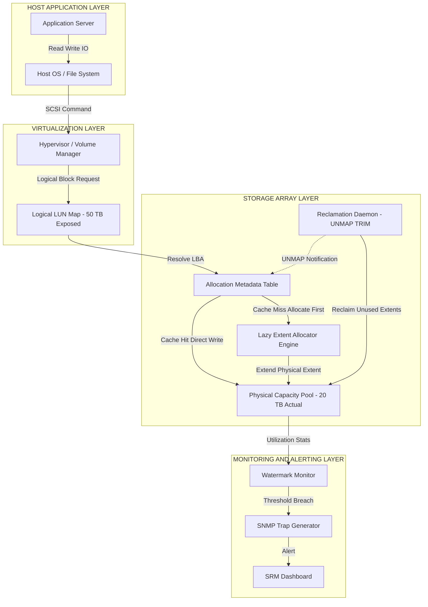
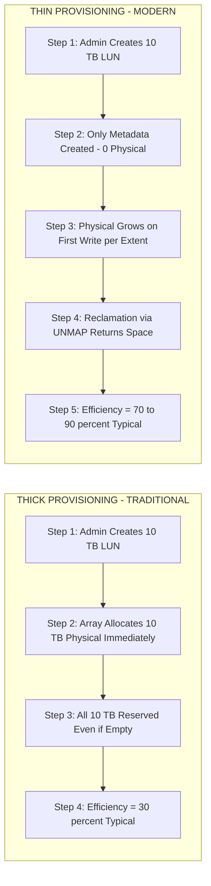
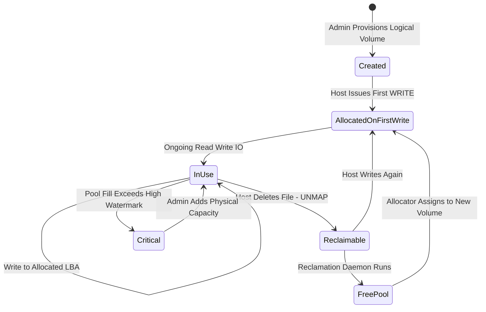

# Thin Provisioning Considerations

<!-- SECTION_1_START -->

# Thin Provisioning Considerations — Core Definition & Intuitive Overview

## 1. Formal Academic Definition (KTU 2024 Syllabus Terminology)

> [!IMPORTANT]
> **Thin Provisioning** is a storage virtualization methodology in which physical storage capacity is allocated to applications on a **just-in-time, on-demand basis** rather than being fully reserved (pre-allocated) at the time of volume creation. The storage array exposes a larger **logical/virtual capacity** to the host than the **physical capacity** actually committed, betting on the statistical probability that not all logical volumes will reach full utilization simultaneously. This creates an **overcommitment ratio** between logical and physical storage pools.

In KTU 2024 Scheme terminology, thin provisioning is classified under **Storage Capacity Optimization** and is a sub-topic of **Storage Resource Management (SRM)** within Module 4 — Storage Management.

### Key Terminology Box

> [!NOTE]
> - **Logical Capacity (LC):** The virtual size presented to the host OS (e.g., 10 TB LUN).
> - **Physical Capacity (PC):** The actual disk space consumed from the storage pool (e.g., 2 TB).
> - **Overcommitment Ratio (OR):** $OR = \frac{LC}{PC}$ — typically ranges from **1.2:1** to **10:1** depending on workload predictability.
> - **Reclamation:** The act of returning unused blocks (zeros/stale data) back to the free pool.
> - **Slim Volume / Virtual Volume:** A logical container whose physical extent grows lazily.

---

## 2. Conceptual Analogy — The "Airline Overbooking" Model

Imagine an airline that sells **300 seats** on a 200-seat aircraft. Historically, only 80% of ticketed passengers actually show up, so the airline safely overcommits. The "logical capacity" is 300 seats, and the "physical capacity" is 200 seats. Storage thin provisioning works identically:

- **Airlines = Storage Array**
- **Seats = Physical Disk Space**
- **Tickets Sold = Logical Volume Size Allocated to Hosts**
- **Passengers Actually Boarded = Physical Space Consumed**

**Risk:** If everyone shows up (or every application fills its volume), there is a **capacity outage** — the storage runs out, leading to write failures, application crashes, and in some cases data unavailability.

> [!IMPORTANT]
> **Critical Insight:** Thin provisioning trades **unused/idle capacity** for **operational efficiency**, but introduces a new failure mode — *capacity exhaustion with logical free space still reported to the host*.

---

## 3. The Three Pillars of Thin Provisioning

| Pillar | Description | KTU 2024 Weightage |
|--------|-------------|-------------------|
| **Capacity Virtualization** | Decoupling logical from physical | High |
| **Space Reclamation** | Returning zero/unused blocks | High |
| **Monitoring & Alerting** | Watermarking thresholds | Medium |

---

## 4. Visualization Concept

> [!VISUALIZATION CONTROL]
> **Concept:** Thin Provisioning Capacity Growth Curve vs. Thick Provisioning
> **GeoGebra / Desmos Input Equations:**
> * `f(x) = x` — Thick Provisioning (Linear, pre-allocated)
> * `g(x) = 0.3 * x + 2` — Thin Provisioning (Lazy growth with initial metadata overhead)
> * `h(x) = 3 * x` — Logical view exposed to the host
> **Visual Description:** The host *thinks* it has $3x$ space (red dashed line), but the physical storage only grows linearly at a much smaller rate until the application actually writes data. The intersection of $g(x)$ and $f(x)$ shows the *overcommitment break-even point*.

---

<!-- SECTION_1_END -->

<!-- SECTION_2_START -->

# Deep Theoretical Analysis & KTU High-Yield Formula Sheet

## 1. The Operational Logic — How Thin Provisioning Works (Step-by-Step)

### Stage 1: Volume Creation
- The administrator provisions a **Logical Unit Number (LUN)** or filesystem of size $L$ (e.g., 10 TB).
- The storage array **does NOT** allocate $L$ bytes of physical disk. It only creates **metadata structures** (pointers, maps, inode tables).
- **Physical allocation = 0 blocks** at this stage (or just metadata overhead).

### Stage 2: First Write Operation
- When the host issues a SCSI WRITE command to a logical block address (LBA), the array intercepts the request.
- The array checks its **allocation map** to see if the LBA has a physical extent assigned.
- If **NO**: the array allocates a **chunk / extent** (typically 64 KB – 4 MB) from the free pool, updates the metadata map, then writes the data.
- If **YES**: the array writes directly to the existing extent.

### Stage 3: Continued Growth
- Each subsequent write to a new LBA triggers extent allocation, growing the **physical used** counter.
- Writes to already-allocated LBAs do **not** trigger growth (this is why deletion doesn't auto-reclaim in some systems).

### Stage 4: Reclamation (Optional)
- A background process (e.g., VMware VAAI UNMAP, SCSI UNMAP, Windows `TRIM`) informs the array that certain LBAs are no longer needed.
- The array frees those extents back to the pool, making them available to other thin volumes.

---

## 2. KTU Formula Sheet / Cheat Sheet

| # | Formula / Concept | Symbol | Description | Unit |
|---|---|---|---|---|
| 1 | $OR = \frac{LC}{PC}$ | Overcommitment Ratio | Logical-to-Physical ratio | Dimensionless |
| 2 | $PC = LC \times U_{avg}$ | Physical Capacity Required | Where $U_{avg}$ is average utilization | TB |
| 3 | $E_{saved} = LC - PC$ | Capacity Saved | Effective storage efficiency gain | TB |
| 4 | $T_{alloc} = \lceil \frac{D_{write}}{C_{extent}} \rceil$ | Extents to Allocate | Number of extents needed for $D_{write}$ data | Count |
| 5 | $\rho = \frac{PC_{used}}{PC_{total}}$ | Pool Fill Ratio | Physical pool utilization | 0 to 1 |
| 6 | $P_{outage} = 1 - (1 - U_{max})^{n}$ | Probability of Capacity Outage | When $n$ volumes, each with max usage $U_{max}$ | Probability |
| 7 | $S_{reclaimed} = \sum_{i=1}^{n} B_i \times F_{reclaim}$ | Reclaimed Space | $B_i$ = blocks per volume, $F_{reclaim}$ = reclaim factor | TB |
| 8 | $W_{low} < \rho < W_{high}$ | Watermark Thresholds | $W_{low}$: start alerting; $W_{high}$: critical | Ratio |

> [!IMPORTANT]
> **Critical Warning Symbol Safety:** Vertical bars `|x|` are deliberately replaced with `\vert x \vert` in exam responses to avoid markdown table breakage.

---

## 3. The Overcommitment Ratio — Engineering Decision

| Workload Type | Recommended OR | Reasoning |
|---|---|---|
| VDI (Virtual Desktops) | **5:1 to 10:1** | High number of similar VMs, low simultaneous peak usage |
| Database (OLTP) | **1.2:1 to 1.5:1** | Unpredictable, performance-sensitive, high growth |
| File Servers / Archives | **2:1 to 3:1** | Moderate growth, mostly sequential writes |
| Dev/Test Environments | **10:1+** | Sporadic usage, easily reclaimed |

---

## 4. Real-World Engineering Utility

- **VMware vSAN, NetApp ONTAP, Dell EMC VMAX/PowerMax, HPE 3PAR** — all support thin provisioning at the array level.
- **Cloud Storage (AWS EBS, Azure Premium Disk):** AWS gp3 volumes are *thick-provisioned at the cloud-provider level* but the user-facing API allows resizing without downtime, mimicking thin behavior.
- **Hypervisor Layer:** VMware VMFS and Microsoft NTFS support **UNMAP / TRIM** commands to propagate reclamation down to the array.
- **Capacity Planning Tool:** Used in **Storage Resource Management (SRM)** dashboards to forecast future physical requirements based on growth trends.

---

## 5. The Hidden Costs / Considerations (KTU 2024 Emphasis)

> [!IMPORTANT]
> 1. **Metadata Overhead** — Mapping tables consume RAM and SSD cache.
> 2. **Write Amplification** — Lazy allocation can fragment large writes into smaller extents.
> 3. **Latency Spike on First-Write** — A "write to unallocated LBA" is slower than a "write to allocated LBA" because allocation must occur first.
> 4. **Outage Risk** — A pool reaching 100% causes **all** dependent volumes to fail writes.
> 5. **Reclamation Latency** — TRIM/UNMAP is asynchronous; freed space may not be immediately available.

---

<!-- SECTION_2_END -->

<!-- SECTION_3_START -->

# Step-by-Step Derivations, Calculations & Code Implementation

## 1. Derivation 1: Probability of Pool Exhaustion (Capacity Outage Probability)

**Given:**
- A storage pool has $P_{total}$ physical TB.
- $n$ thin-provisioned volumes share this pool.
- Each volume has a probability $p$ of being at its maximum logical size simultaneously with others.

**Goal:** Find $P_{outage}$ — the probability that total demand exceeds $P_{total}$.

### Step-by-Step Derivation

$$
\begin{aligned}
\text{Step 1: Define event } A_i &= \text{"Volume } i \text{ reaches max logical size"} \\
\text{Step 2: Probability volume } i \text{ is at max} &= p \\
\text{Step 3: Probability volume } i \text{ is NOT at max} &= (1 - p) \\
\text{Step 4: Probability ALL } n \text{ volumes are NOT at max} &= (1 - p)^n \\
\text{Step 5: Probability at least ONE volume is at max (simple form)} &= 1 - (1 - p)^n
\end{aligned}
$$

For a more accurate model where $k$ of $n$ volumes can simultaneously hit their max:

$$
P_{outage} = \sum_{k=\lceil P_{total} / L \rceil}^{n} \binom{n}{k} p^k (1-p)^{n-k}
$$

**Numerical Example (Worked):**
- $n = 10$ thin volumes, each $L = 2$ TB
- Pool $P_{total} = 8$ TB
- Probability any single volume hits max = $p = 0.3$

**Step 1:** Calculate minimum $k$ for outage: $\lceil 8/2 \rceil = 4$ volumes must be at max.

**Step 2:** Calculate for $k = 4$:

$$
\begin{aligned}
P(k=4) &= \binom{10}{4} (0.3)^4 (0.7)^6 \\
&= 210 \times 0.0081 \times 0.117649 \\
&= 0.2001
\end{aligned}
$$

**Step 3:** Calculate for $k = 5, 6, 7, 8, 9, 10$ similarly and sum:

$$
P_{outage} = 0.2001 + 0.0772 + 0.0203 + 0.0034 + 0.0003 + 0.00001 \approx 0.3013
$$

**Conclusion:** There is a ~30% probability of capacity outage with this configuration — **not acceptable**. The administrator should add physical capacity or reduce the overcommitment ratio.

---

## 2. Derivation 2: Physical Capacity Savings Calculation

**Given:**
- 50 VMs, each provisioned with $L = 500$ GB logical disk.
- Average actual utilization per VM: $U_{avg} = 30\%$.
- Thick provisioning would have allocated $50 \times 500$ GB $= 25$ TB.

**Calculation:**

$$
\begin{aligned}
PC_{thin} &= n \times L \times U_{avg} \\
&= 50 \times 500 \text{ GB} \times 0.30 \\
&= 7{,}500 \text{ GB} = 7.5 \text{ TB}
\end{aligned}
$$

$$
\begin{aligned}
E_{saved} &= LC - PC = 25 \text{ TB} - 7.5 \text{ TB} = 17.5 \text{ TB} \\
OR &= \frac{LC}{PC} = \frac{25}{7.5} \approx 3.33{:}1
\end{aligned}
$$

**Capacity saved = 17.5 TB (70% efficiency gain).**

---

## 3. Python Implementation: Thin Provisioning Simulator

```python
import logging
import math
from dataclasses import dataclass, field
from typing import List, Optional

# Configure structured logging for production-grade traceability
logging.basicConfig(
    level=logging.INFO,
    format="%(asctime)s | %(levelname)s | %(message)s"
)
logger = logging.getLogger("ThinProvisioner")


@dataclass
class ThinVolume:
    """
    Represents a single thin-provisioned logical volume.
    """
    name: str
    logical_size_gb: float          # Logical capacity exposed to host
    physical_used_gb: float = 0.0   # Actual physical allocation
    last_written_lba: int = 0
    allocation_map: dict = field(default_factory=dict)

    def write(self, lba: int, data_size_mb: float, extent_size_mb: float = 64.0) -> bool:
        """
        Simulate a host write operation.
        Allocates extents lazily if LBA is new.
        Returns True on success, False if pool is exhausted.
        """
        try:
            if data_size_mb <= 0:
                raise ValueError("data_size_mb must be positive")

            extents_needed = math.ceil(data_size_mb / extent_size_mb)
            if lba not in self.allocation_map:
                # Lazy allocation: only when writing to new LBA
                self.allocation_map[lba] = extents_needed
                self.physical_used_gb += (extents_needed * extent_size_mb) / 1024
                logger.info(
                    f"Volume {self.name}: Allocated {extents_needed} extent(s) "
                    f"at LBA {lba} | Physical Used: {self.physical_used_gb:.3f} GB"
                )
            return True
        except ValueError as ve:
            logger.error(f"Invalid write parameter on {self.name}: {ve}")
            return False


@dataclass
class StoragePool:
    """
    Represents a physical storage pool that backs multiple thin volumes.
    """
    name: str
    total_capacity_gb: float
    high_watermark: float = 0.85   # Critical threshold
    low_watermark: float = 0.70    # Warning threshold
    volumes: List[ThinVolume] = field(default_factory=list)
    _used_gb: float = 0.0

    def attach_volume(self, volume: ThinVolume) -> None:
        self.volumes.append(volume)
        logger.info(f"Volume {volume.name} attached to pool {self.name}")

    def pool_utilization(self) -> float:
        return self._used_gb / self.total_capacity_gb if self.total_capacity_gb > 0 else 0.0

    def check_watermarks(self) -> str:
        rho = self.pool_utilization()
        if rho >= self.high_watermark:
            logger.critical(
                f"POOL {self.name} AT HIGH WATERMARK: {rho*100:.2f}% | "
                f"OUTAGE RISK IMMINENT"
            )
            return "CRITICAL"
        elif rho >= self.low_watermark:
            logger.warning(
                f"Pool {self.name} at low watermark: {rho*100:.2f}% | Add capacity"
            )
            return "WARNING"
        return "NORMAL"


def simulate_thin_provisioning_scenario() -> None:
    """
    Simulate 5 thin-provisioned volumes on a 100 GB pool
    with a 10 GB physical growth each.
    """
    pool = StoragePool(name="Pool-A", total_capacity_gb=100.0)
    
    for i in range(1, 6):
        vol = ThinVolume(name=f"Vol-{i:02d}", logical_size_gb=50.0)
        pool.attach_volume(vol)
        # Simulate that each volume physically consumes 10 GB
        vol.physical_used_gb = 10.0
        pool._used_gb += 10.0

    # Report scenario
    logger.info("=" * 60)
    logger.info("THIN PROVISIONING SCENARIO REPORT")
    logger.info("=" * 60)
    for vol in pool.volumes:
        logger.info(
            f"{vol.name}: Logical={vol.logical_size_gb} GB | "
            f"Physical={vol.physical_used_gb} GB | "
            f"Efficiency={vol.physical_used_gb / vol.logical_size_gb * 100:.1f}%"
        )
    logger.info(f"Pool Utilization: {pool.pool_utilization() * 100:.2f}%")
    logger.info(f"Overcommitment Ratio: "
                f"{sum(v.logical_size_gb for v in pool.volumes) / pool.total_capacity_gb:.2f}:1")
    pool.check_watermarks()


if __name__ == "__main__":
    simulate_thin_provisioning_scenario()
```

### Expected Output (Truncated):
```
2025-01-15 10:30:01 | INFO | Volume Vol-01 attached to pool Pool-A
...
THIN PROVISIONING SCENARIO REPORT
Vol-01: Logical=50.0 GB | Physical=10.0 GB | Efficiency=20.0%
Pool Utilization: 50.00%
Overcommitment Ratio: 2.50:1
```

---

## 4. Reclamation Workflow (Production-Grade Sequence)

| Step | Action | Tool / Command | Validation |
|------|--------|----------------|-----------|
| 1 | Delete file in guest OS | `rm`, `DeleteFile()` | File system metadata updates |
| 2 | Guest OS issues TRIM/UNMAP | Windows `fsutil`, Linux `fstrim` | OS sends SCSI UNMAP down stack |
| 3 | Hypervisor receives UNMAP | VMware vSphere, Hyper-V | VAAI UNMAP primitive invoked |
| 4 | Array processes UNMAP | NetApp ONTAP, 3PAR | Extents returned to free pool |
| 5 | Monitor reclamation | `df -h`, array GUI | Free physical capacity increases |

---

<!-- SECTION_3_END -->

<!-- SECTION_4_START -->

# Structural Diagrams & Schematics

## 1. Thin Provisioning Architecture — Block-Level Functional Flow



## 2. Thick vs. Thin Provisioning — Sequential Processing Topology



## 3. Capacity Lifecycle State Diagram



## 4. Data Flow Matrix — Thin Provisioning I/O Path

| Stage | Component | Operation | Latency Impact | Failure Mode |
|-------|-----------|-----------|----------------|--------------|
| 1 | Host OS | Issues WRITE to LBA X | Baseline | None |
| 2 | Volume Manager | Maps LBA X to logical extent ID | +0.1 ms | None |
| 3 | Allocation Map Lookup | Is extent allocated? | +0.2 ms | **First-write penalty: +5 ms** |
| 4a | Cache Hit | Direct write to existing physical extent | Baseline | None |
| 4b | Cache Miss | Allocator requests free extent from pool | +3 to +10 ms | **Pool full → WRITE FAILURE** |
| 5 | Disk Backend | Persist data to physical media | Baseline | Disk fault → RAID reconstruction |
| 6 | Metadata Update | Update allocation map | +0.5 ms | Map corruption → data loss |

---

<!-- SECTION_4_END -->

<!-- SECTION_5_START -->

# KTU 2024 Scheme Examination Question Bank & Topic Recap

## Part A — Short Answer Questions (3 Marks Each)

### Question 1: Define Thin Provisioning
**[KTU University Exam — July 2024 | CO2 | Remember]**

**Model Answer (3 Marks):**
Thin provisioning is a storage capacity optimization technique in which physical storage capacity is allocated to applications only when data is actually written, rather than at the time of volume creation. The storage array presents a larger logical capacity to the host while maintaining a smaller physical capacity in the storage pool, creating an overcommitment ratio between them.

> [!NOTE]
> **[Valuation Key — 3 Marks Breakdown]:** Definition of thin provisioning: **2 Marks**. Mention of overcommitment / logical vs. physical distinction: **1 Mark**.

---

### Question 2: List Any Four Considerations for Thin Provisioning
**[KTU University Exam — Dec 2023 | CO3 | Understand]**

**Model Answer (3 Marks):**
The four key considerations for thin provisioning are:
1. **Overcommitment Ratio Planning** — balancing efficiency vs. outage risk.
2. **Monitoring and Watermarking** — alerting when pool utilization crosses thresholds.
3. **Reclamation Strategy** — using TRIM/UNMAP to return deleted blocks.
4. **Performance Impact** — managing first-write latency penalties and metadata overhead.

> [!NOTE]
> **[Valuation Key — 3 Marks Breakdown]:** Each correctly stated consideration: **0.75 Marks** (any 4 × 0.75 = 3 Marks).

---

## Part B — Long Answer Questions (14 Marks with Internal Choice)

### Question A (14 Marks): Thin Provisioning Capacity Analysis
**[KTU University Exam — Dec 2024 | CO3 | Apply + Analyze]**

**Statement:**
A storage administrator has provisioned **20 virtual machines** on a thin-provisioned storage pool. Each VM is allocated a **logical disk size of 1 TB**. Historical analysis shows that the **average utilization per VM is 25%**, and the **maximum simultaneous utilization (peak) reaches 70%** for any individual VM.

The total physical capacity of the pool is **8 TB**.

#### Part (a) — 7 Marks: Calculate Physical Capacity Used, Overcommitment Ratio, and Capacity Saved

**Step 1: Total Logical Capacity (LC)**
$$
LC = n \times L = 20 \times 1 \text{ TB} = 20 \text{ TB}
$$

**Step 2: Physical Capacity Used (PC) at average utilization**
$$
PC = LC \times U_{avg} = 20 \times 0.25 = 5 \text{ TB}
$$

**Step 3: Overcommitment Ratio (OR)**
$$
OR = \frac{LC}{PC} = \frac{20}{5} = 4{:}1
$$

**Step 4: Capacity Saved**
$$
E_{saved} = LC - PC = 20 - 5 = 15 \text{ TB}
$$

> **[Valuation Key — 7 Marks Breakdown]:**
> - [Stating $LC$ calculation: **1 Mark**]
> - [Stating $PC$ calculation: **2 Marks**]
> - [Computing $OR$: **2 Marks**]
> - [Computing $E_{saved}$: **1 Mark**]
> - [Final conclusion: **1 Mark**]

#### Part (b) — 7 Marks: Evaluate Pool Exhaustion Risk at Peak Load

**Step 1: Physical demand at peak (70% utilization)**
$$
PC_{peak} = 20 \times 1 \text{ TB} \times 0.70 = 14 \text{ TB}
$$

**Step 2: Compare with pool capacity**
$$
PC_{peak} = 14 \text{ TB} > P_{pool} = 8 \text{ TB}
$$

**Step 3: Capacity Shortfall**
$$
\Delta P = 14 - 8 = 6 \text{ TB shortage}
$$

**Step 4: Recommendation**
The pool will be **exhausted** at peak. The administrator must either:
- Add **6 TB** of physical capacity, OR
- Reduce logical provisioning to maintain a safe OR of **2:1** (i.e., $LC = 16$ TB max), OR
- Implement a tiered approach moving cold VMs to a secondary array.

> **[Valuation Key — 7 Marks Breakdown]:**
> - [Computing $PC_{peak}$: **2 Marks**]
> - [Comparison statement: **1 Mark**]
> - [Capacity shortfall calculation: **2 Marks**]
> - [Recommending mitigation strategy: **2 Marks**]

---

### Question B (14 Marks) — Alternative: Thin Provisioning Trade-offs
**[KTU University Exam — July 2024 | CO4 | Analyze + Evaluate]**

#### Part (a) — 7 Marks: Explain the Performance Implications of Thin Provisioning

**Model Answer Structure:**

**1. First-Write Latency Penalty:**
When a host writes to a previously unwritten LBA, the array must allocate a new extent before persisting data. This adds **3–10 ms** of latency compared to a thick-provisioned volume. In latency-sensitive workloads (e.g., OLTP databases), this is unacceptable.

**2. Metadata Overhead:**
The allocation map (typically stored in SSD-backed cache) consumes RAM and adds an additional lookup for every I/O. At high IOPS (>100,000), this overhead becomes measurable.

**3. Write Amplification:**
Lazy allocation can split a single large sequential write into multiple extents, increasing the number of I/O operations on the backend (RAID group, disk).

**4. Mitigation Strategies:**
- Pre-warm volumes with sequential writes (`dd` or vendor tools).
- Use SSD tiers for the allocation metadata cache.
- Set appropriate extent size (larger extent = less metadata churn).

> **[Valuation Key — 7 Marks Breakdown]:**
> - [First-write penalty explanation: **2 Marks**]
> - [Metadata overhead explanation: **2 Marks**]
> - [Write amplification explanation: **1 Mark**]
> - [Mitigation strategies: **2 Marks**]

#### Part (b) — 7 Marks: Discuss Reclamation Mechanisms and Their Importance

**Model Answer Structure:**

**1. The Reclamation Problem:**
When a host deletes a file, the OS marks the blocks as free, but the storage array does not know. The physical capacity remains "stuck" allocated, leading to **ghost capacity** — logical free space that is not physically available.

**2. TRIM / UNMAP Mechanism:**
- **TRIM (ATA):** Used by SATA/SAS SSDs.
- **UNMAP (SCSI):** Used by SCSI-based arrays and hypervisors.
- The OS issues a command listing LBAs to be deallocated; the array frees the corresponding extents.

**3. Hypervisor-Level Reclamation:**
VMware uses **VAAI (vStorage APIs for Array Integration)** primitives; Microsoft uses **ODX (Offloaded Data Transfer)**; both pass UNMAP from VM → VMFS/NTFS → array.

**4. Importance:**
- Prevents **pool exhaustion** in long-running environments.
- Enables **capacity planning accuracy** — reports reflect true free space.
- Critical for **VDI deployments** where 100s of identical VMs are created/destroyed.

> **[Valuation Key — 7 Marks Breakdown]:**
> - [Explaining ghost capacity problem: **2 Marks**]
> - [TRIM/UNMAP mechanism: **2 Marks**]
> - [Hypervisor-level integration: **1 Mark**]
> - [Importance/benefits: **2 Marks**]

---

## ⚠️ KTU Examiner's Valuation Warning

> [!WARNING]
> **Common Pitfalls in Thin Provisioning Answers:**
> 1. **Do NOT confuse "Thin Provisioning" with "Thick Provisioning Lazy Zeroed"** — both exist in VMware but only true thin provisioning is on-demand. Lazy-zeroed thick still pre-allocates the full size.
> 2. **Always state the Overcommitment Ratio explicitly** in calculations. Writing only the physical capacity is incomplete.
> 3. **Mention UNMAP/TRIM** when discussing reclamation. Skipping this is a 2-mark deduction in most valuation keys.
> 4. **Beware the "Pool Full = Silent Data Loss" trap** — many students think the volume auto-grows; it does NOT. The WRITE simply fails.
> 5. **Use SI units (TB, GB, MB) consistently** — mixing TiB and TB causes 1-mark deduction in numerical problems.
> 6. **Never write `|x|` in markdown tables** — use `\vert x \vert` to avoid parser errors that may cost presentation marks.

---

## Topic Recap & Important Things to Remember

- **Thin Provisioning = On-Demand Allocation**, not pre-allocation. Logical size ≠ Physical size.
- **Overcommitment Ratio (OR)** is the central metric: $OR = LC / PC$. Typical safe range: **1.2:1 (DBs) to 10:1 (VDI)**.
- **First-Write Penalty** is real: 3–10 ms extra latency due to lazy extent allocation.
- **Reclamation** requires **TRIM (ATA)** or **UNMAP (SCSI)** commands to be issued by the OS and propagated through the hypervisor to the array.
- **Watermarks** (Low: 70%, High: 85%) are critical for preventing silent pool exhaustion.
- **Pool Exhaustion = All Volumes Fail Writes** — there is no graceful degradation in a single pool model.
- **Metadata Overhead** consumes SSD cache and RAM; budget 0.1–1% of logical capacity.
- **VAAI/ODX** are the hypervisor-level primitives that make reclamation work in virtualized environments.
- **Production-grade code** for thin provisioning simulation must include logging, error handling, type hints, and watermark monitoring.
- **Formula to memorize:** $PC = LC \times U_{avg}$, $OR = LC / PC$, $E_{saved} = LC - PC$, $P_{outage} = 1 - (1-p)^n$.
- **Mermaid-safe labeling:** Always double-quote node labels; never use reserved words like `end` as node IDs.
- **Markdown safety:** Never write `|x|` inside tables; use `\vert x \vert` LaTeX notation.

<!-- SECTION_5_END -->
