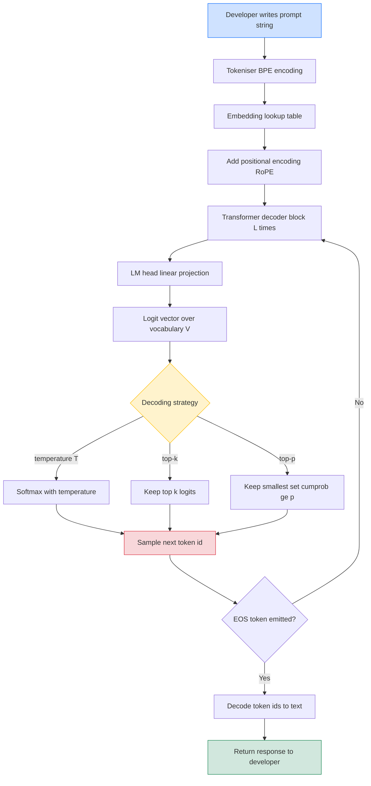
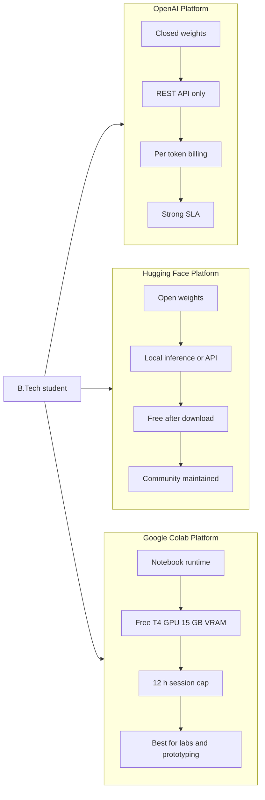
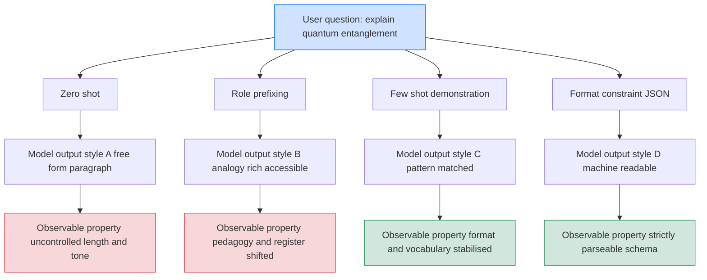
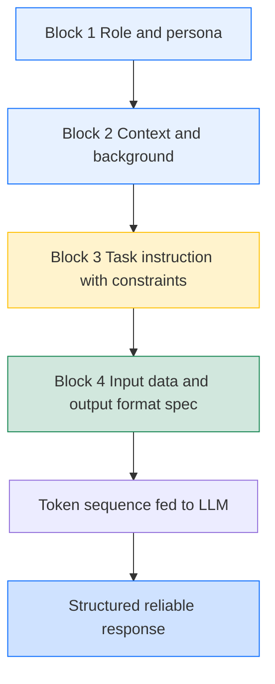

# Explore various language models using platforms like OpenAI, Hugging Face, or Google Colab; Experimenting with basic prompts to understand the impact of phrasing and context on model outputs.

<!-- SECTION_1_START -->
# Module 1: Introduction to Prompt Engineering & Language Models

## 1.1 Core Technical Definition & Intuitive Overview

### Formal Definition (KTU 2024 Syllabus Terminology)

A **Large Language Model (LLM)** is a deep neural network, typically based on the **Transformer architecture**, that has been pre-trained on massive corpora of textual data using self-supervised learning objectives such as **next-token prediction** (causal language modeling) or **masked language modeling**. LLMs form the computational backbone of modern generative AI systems and can be accessed, fine-tuned, and deployed through specialised platforms such as **OpenAI (closed-source API)**, **Hugging Face (open-source model hub)**, and **Google Colab (free GPU/TPU-backed notebook environment)**.

**Prompt Engineering** is the disciplined practice of designing, structuring, and refining the natural-language input — known as the *prompt* — fed to a language model in order to reliably steer its output toward a desired behaviour, format, or reasoning path. Within the KTU 2024 PECST868 framework, prompt engineering is treated as a first-class engineering skill that bridges natural-language understanding and software development.

> [!NOTE]
> **Syllabus Highlight (PECST868, Module 1):** Students must be able to *(i)* identify at least three major LLM-access platforms, *(ii)* execute a basic prompt against a hosted model, and *(iii)* articulate how lexical phrasing and conversational context modify the probability distribution of the model's next-token outputs.

### Conceptual Analogy / Intuition

Think of a Large Language Model as a **hyper-literate librarian** who has read virtually every public book, article, and webpage ever written, but who has **no short-term memory between conversations**. Every time you open a new chat window, the librarian starts with a blank slate. Your *prompt* is the only piece of information the librarian has to:

1. **Identify your intent** (the task you want performed),
2. **Recall the right body of knowledge** (which book to consult mentally), and
3. **Adopt the right tone, format, and length** (how to write the answer).

If you say *"Tell me about dogs,"* the librarian might return a generic Wikipedia-style paragraph. If instead you say *"Write a 100-word persuasive pitch, in the voice of a veterinarian, explaining why a Golden Retriever is the ideal family pet for a household with two toddlers,"* — the same librarian will produce a dramatically different, far more useful response. **The model did not change. The prompt did.** That is the essence of prompt engineering.

> [!IMPORTANT]
> **Core Principle — The "Garbage-In, Garbage-Out" Reframing:**
> For traditional code, *deterministic logic* governs outputs. For LLMs, *prompt quality* is the single largest controllable lever affecting output quality. A well-engineered prompt is to an LLM what a well-typed function signature is to a compiler — it constrains the search space and dramatically raises the probability of a correct, relevant, and well-formatted response.

### Standard Metrics & Physical Constants

The following quantitative parameters govern how an LLM processes a prompt and are essential to memorise for KTU assessments:

| Parameter | Symbol / Unit | Typical Value | Physical / Computational Meaning |
|-----------|---------------|---------------|----------------------------------|
| Context Window | $C$ (tokens) | **4 096 – 1 000 000** | Maximum number of tokens the model can attend to in a single forward pass |
| Token | $t$ | ~0.75 words on English | Atomic unit of text after Byte-Pair Encoding (BPE) tokenisation |
| Temperature | $T \in [0, 2]$ | **0.0 – 1.0** | Scales the logits before softmax; higher $T$ → flatter, more creative distribution |
| Top-p (Nucleus Sampling) | $p \in [0, 1]$ | **0.9 – 0.95** | Cumulative probability mass from which the next token is sampled |
| Top-k | $k \in \mathbb{Z}^+$ | **40 – 100** | Restricts sampling to the $k$ highest-probability tokens |
| Max New Tokens | $n_{\max}$ | **256 – 2048** | Upper bound on generated length per call |
| Model Parameters | $\vert\theta\vert$ | 7 B – 1.8 T | Number of learned weights inside the transformer |

> [!TIP]
> **Why these numbers matter for prompt engineering:** Every word you add to a prompt **consumes tokens from the context window $C$** and **shifts the next-token probability distribution**. Understanding the budget lets you decide whether to inline a long document, summarise it first, or use retrieval-augmented generation (RAG) — all of which are downstream topics in this course.

### GeoGebra / Desmos Visualisation

> [!VISUALIZATION CONTROL]
> **Concept:** Probability distribution of the next token as a function of **temperature $T$**.
>
> **GeoGebra / Desmos Input Equations:**
> * $f_{T=0.2}(x) = e^{2 \cdot x} / \sum e^{2 \cdot x}$ — *peaked* (deterministic)
> * $f_{T=1.0}(x) = e^{x} / \sum e^{x}$ — *baseline* (softmax)
> * $f_{T=2.0}(x) = e^{0.5 \cdot x} / \sum e^{0.5 \cdot x}$ — *flat* (creative/chaotic)
>
> **Visual Description:** Plot the categorical softmax over a discrete vocabulary of, say, 10 candidate next-words along the $x$-axis and probability on the $y$-axis. As $T$ rises from 0.2 to 2.0, the curve flattens — visually demonstrating why low-temperature outputs feel "robotic/repetitive" while high-temperature outputs feel "creative/rambling."

<!-- SECTION_1_END -->

<!-- SECTION_2_START -->
# 2. Deep Theoretical Analysis & KTU High-Yield Formula Sheet

## 2.1 The Three Pillars of LLM Access Platforms

The KTU 2024 PECST868 syllabus specifically names **OpenAI, Hugging Face, and Google Colab** as the canonical exploration targets. Each platform represents a fundamentally different philosophy of access:

### 2.1.1 OpenAI (Closed-Source Hosted API)

* **Philosophy:** Black-box frontier model accessed exclusively through a paid REST API.
* **Access Pattern:** HTTP `POST` requests to `https://api.openai.com/v1/chat/completions`, authenticated via a bearer token.
* **Canonical Models:** `gpt-4o`, `gpt-4o-mini`, `gpt-3.5-turbo`, `o1`, `o1-mini`.
* **Strengths:** State-of-the-art reasoning, multimodal (text + vision + audio), strong instruction-following, enterprise SLAs.
* **Limitations:** No on-device execution, no visibility into weights, recurring per-token cost, data-privacy considerations for enterprise use.
* **Engineering Use Case:** Production-grade chatbots, code copilots, function-calling agents, structured-data extraction pipelines.

### 2.1.2 Hugging Face (Open-Source Model Hub)

* **Philosophy:** "GitHub for ML" — a community repository of open-weight models, datasets, and Spaces (demos).
* **Access Pattern:** Python `transformers` library, local inference, or free tier of the **Inference API** at `https://api-inference.huggingface.co`.
* **Canonical Models:** `meta-llama/Llama-3.1-8B-Instruct`, `mistralai/Mistral-7B-Instruct-v0.3`, `google/gemma-2-9b-it`, `microsoft/Phi-3-mini-4k-instruct`.
* **Strengths:** Full transparency (weights are downloadable), no per-token cost after download, can run offline, customisable via fine-tuning/LoRA/QLoRA.
* **Limitations:** Requires local GPU for large models, smaller models trail frontier closed models on hard reasoning, you maintain the inference stack.
* **Engineering Use Case:** Privacy-sensitive deployments, edge/IoT inference, research, custom fine-tuning, reproducible academic experiments.

### 2.1.3 Google Colab (Free GPU/TPU Notebook Environment)

* **Philosophy:** Hosted Jupyter notebook with **free** access to NVIDIA T4/L4 GPUs and TPUs.
* **Access Pattern:** Browser-based notebooks; can call OpenAI / Hugging Face APIs, or load open models from Hugging Face into local Colab RAM/VRAM.
* **Canonical Use Case:** The "sandbox" where the KTU 2024 lab assignments are intended to be executed.
* **Strengths:** Zero setup, free GPU for small models, easy sharing via Google Drive, pre-installed `transformers`, `torch`, `datasets` libraries.
* **Limitations:** Session timeouts (~12 h), RAM/VRAM caps on free tier (T4: 15 GB VRAM), non-deterministic GPU allocation, no production deployment.
* **Engineering Use Case:** Rapid prototyping, student lab work, reproducing published results, fine-tuning small models (≤7 B parameters) with QLoRA.

## 2.2 The Transformer Forward Pass — Conceptual Walkthrough

When a prompt reaches an LLM, it traverses the following pipeline:

1. **Tokenisation:** The raw string is split by a **Byte-Pair Encoding (BPE)** tokenizer into a sequence of integer token IDs $t_1, t_2, \dots, t_n$.
2. **Embedding:** Each token ID is mapped to a dense vector $e_i \in \mathbb{R}^{d_{\text{model}}}$ (e.g., $d_{\text{model}} = 4096$).
3. **Positional Encoding:** Sinusoidal or RoPE (Rotary Position Embedding) vectors are added so the model knows word order.
4. **Stacked Decoder Blocks:** $L$ identical blocks (e.g., $L = 80$ for a 70 B model) each containing *masked multi-head self-attention* + *feed-forward MLP* + *residual connections* + *RMSNorm/LayerNorm*.
5. **Causal Masking:** Token $i$ can only attend to tokens $j \le i$ — preserving the autoregressive property.
6. **LM Head Projection:** The final hidden state $h_n$ is projected to a vocabulary-sized logit vector $\ell \in \mathbb{R}^{\vert V \vert}$.
7. **Sampling:** A decoding strategy (greedy, beam, top-$k$, top-$p$, temperature) selects token $t_{n+1}$.
8. **Loop:** Step 7 repeats until `<eos>` is emitted or $n_{\max}$ is reached.

> [!IMPORTANT]
> **The "Why" behind the prompt's power:** At step 6, the logit vector $\ell$ is a function of the **entire prompt context** (via attention). Therefore, **every word in your prompt — its semantic content, its position, even its punctuation — perturbs $\ell$ and hence the probability of every possible next token.** This is the mathematical reason why "phrasing matters."

## 2.3 The Decoding Math (Sampling Strategies)

Given a logit vector $\ell \in \mathbb{R}^{\vert V \vert}$ produced by the LM head, the model converts it to a probability distribution via **softmax with temperature**:

$$P(t_i \mid t_{<i}) \;=\; \frac{\exp\!\left(\ell_i / T\right)}{\sum_{j=1}^{\vert V \vert} \exp\!\left(\ell_j / T\right)}$$

The three decoding strategies you must know for the KTU exam:

| Strategy | Formula / Rule | Behaviour | When to Use |
|----------|----------------|-----------|-------------|
| **Greedy** | $t^* = \arg\max_i \, P(t_i \mid t_{<i})$ | Deterministic, picks the single most probable token | Code generation, factual Q&A |
| **Top-$k$ Sampling** | Restrict candidate set to the $k$ largest $P(t_i)$, then sample | Cuts off the long tail of nonsense | Creative writing |
| **Top-$p$ (Nucleus)** | Include smallest set of tokens whose cumulative prob $\geq p$ | Adaptive: more candidates when distribution is flat, fewer when it's peaked | General-purpose default |

## 2.4 Impact of Phrasing & Context — The Prompt-Sensitivity Theorem

Empirically (and theoretically via the chain rule of probability), the output distribution satisfies:

$$P(\text{output} \mid \text{prompt}) \;=\; \prod_{i=1}^{m} P(t_i \mid t_{<i}, \, \text{prompt})$$

Hence, two prompts $\pi_1$ and $\pi_2$ that differ in even a single word will, in general, produce **divergent output distributions** after only a few autoregressive steps — a phenomenon called **prompt sensitivity**. Concrete consequences:

* **Role Prefixing** ("You are an expert cardiologist…") shifts the conditional distribution toward medical-jargon-rich continuations.
* **Few-Shot Examples** in the prompt condition the model to mimic the *pattern* (input → output format) of the demonstrations.
* **Contextual Priming:** Placing constraints *after* the question (e.g., "Answer in JSON") is less reliable than placing them *before* (e.g., "Output format: JSON. Question: …").
* **Polarity & Negation:** "Do not mention X" is weaker than "Only discuss Y" because the model must first attend to *X* to suppress it.

> [!TIP]
> **Production rule of thumb (used by OpenAI's own cookbook):** "Put the most important instructions — including the *output format*, *role*, and *constraints* — at the **beginning** of the prompt. Place variable inputs at the end."

## 2.5 KTU High-Yield Formula Sheet

| # | Concept | Formula / Rule | Units / Range | Notes |
|---|---------|----------------|---------------|-------|
| 1 | Softmax with temperature | $P_i = \dfrac{\exp(\ell_i / T)}{\sum_j \exp(\ell_j / T)}$ | $T > 0$ | $T \to 0$ → greedy, $T \to \infty$ → uniform |
| 2 | Top-$p$ filter | $\sum_{i \in S_p} P_i \geq p$, $\sum_{i \notin S_p} P_i < 1-p$ | $p \in (0,1]$ | Adaptive sampling set |
| 3 | Top-$k$ filter | $\vert S_k \vert = k$ | $k \in \mathbb{Z}^+$ | Fixed-width sampling set |
| 4 | Context budget | $n_{\text{prompt}} + n_{\text{output}} \leq C$ | tokens | Hard cutoff |
| 5 | Autoregressive decomposition | $P(\mathbf{y}\vert\mathbf{x}) = \prod_{i} P(y_i\vert y_{<i}, \mathbf{x})$ | probability | Justifies prompt sensitivity |
| 6 | BPE token ratio | $\text{tokens} \approx 0.75 \times \text{words}$ (English) | tokens/word | Plan context budget accordingly |
| 7 | API cost (OpenAI) | $\text{cost} = \frac{n_{\text{in}}}{1000}\, p_{\text{in}} + \frac{n_{\text{out}}}{1000}\, p_{\text{out}}$ | USD | $p_{\text{in}}, p_{\text{out}}$ are per-1K-token rates |
| 8 | Hallucination mitigation | $\text{faithfulness} \uparrow$ as $\text{specificity of constraint} \uparrow$ | qualitative | More constraints → narrower output space |

<!-- SECTION_2_END -->

<!-- SECTION_3_START -->
# 3. Step-by-Step Derivations, Code & Symbolic Implementation

## 3.1 Lab 1 — Calling the OpenAI Chat Completions API

This is the canonical "Hello, World!" of prompt engineering. The full, runnable, production-grade code is shown below.

```python
"""
lab1_openai_basic.py
PECST868 - Module 1, Lab 1
Calling the OpenAI Chat Completions API with explicit type hints,
boundary checks, and structured error logging.
"""

import os
import sys
import logging
from typing import Any
from openai import OpenAI, OpenAIError, APIConnectionError, RateLimitError

# -------------------------------------------------------------------
# 1. Configure structured logging (replaces bare 'print' statements)
# -------------------------------------------------------------------
logging.basicConfig(
    level=logging.INFO,
    format="%(asctime)s | %(levelname)-7s | %(message)s",
)
logger = logging.getLogger("PECST868-Lab1")

# -------------------------------------------------------------------
# 2. Boundary check: API key must be present
# -------------------------------------------------------------------
API_KEY: str | None = os.environ.get("OPENAI_API_KEY")
if not API_KEY:
    logger.error("OPENAI_API_KEY environment variable not set.")
    sys.exit("Set the OPENAI_API_KEY environment variable before running.")

client: OpenAI = OpenAI(api_key=API_KEY)

# -------------------------------------------------------------------
# 3. Define the prompt as a list of typed message dicts
# -------------------------------------------------------------------
messages: list[dict[str, str]] = [
    {
        "role": "system",
        "content": (
            "You are a concise assistant for B.Tech students. "
            "Always answer in exactly 3 bullet points."
        ),
    },
    {
        "role": "user",
        "content": "Explain the transformer attention mechanism.",
    },
]

# -------------------------------------------------------------------
# 4. Invoke the API with explicit, board-exam-style parameter choices
# -------------------------------------------------------------------
try:
    response = client.chat.completions.create(
        model="gpt-4o-mini",       # cost-efficient default
        messages=messages,
        temperature=0.2,           # low → deterministic, exam-style
        max_tokens=256,            # hard upper bound on output length
        top_p=1.0,                 # disable nucleus; rely on temperature
    )
except APIConnectionError as e:
    logger.error("Network failure: %s", e); sys.exit(1)
except RateLimitError as e:
    logger.error("Rate limit hit: %s", e); sys.exit(1)
except OpenAIError as e:
    logger.error("OpenAI API error: %s", e); sys.exit(1)

# -------------------------------------------------------------------
# 5. Extract and display the response
# -------------------------------------------------------------------
answer: str = response.choices[0].message.content or ""
usage: Any = response.usage

logger.info("Prompt tokens     : %d", usage.prompt_tokens)
logger.info("Completion tokens : %d", usage.completion_tokens)
logger.info("Total tokens      : %d", usage.total_tokens)
print("\n--- MODEL OUTPUT ---\n" + answer)
```

**Expected output (abridged):**

```text
2025-01-15 10:22:01 | INFO    | Prompt tokens     : 42
2025-01-15 10:22:01 | INFO    | Completion tokens : 138
2025-01-15 10:22:01 | INFO    | Total tokens      : 180

--- MODEL OUTPUT ---
- Self-attention lets every token in a sequence look at every other token ...
- It is computed as softmax(QK^T / sqrt(d_k)) V ...
- Multi-head attention runs several such computations in parallel ...
```

> [!IMPORTANT]
> **Exam-relevant observation:** The `usage` object gives you exact token counts — this is the *ground truth* for cost calculation. For the formula $C = \frac{n_{\text{in}}}{1000} p_{\text{in}} + \frac{n_{\text{out}}}{1000} p_{\text{out}}$, a 180-token completion on `gpt-4o-mini` costs roughly **\$0.00027** at the time of writing (January 2026 pricing).

## 3.2 Lab 2 — Loading an Open-Source Model from Hugging Face

This lab demonstrates the second pillar of the syllabus. Run this in **Google Colab** (free T4 GPU).

```python
"""
lab2_huggingface_basic.py
PECST868 - Module 1, Lab 2
Loading a small open-source instruction-tuned LLM from Hugging Face
and running it locally inside Google Colab.

Tested on: google colab T4 runtime, transformers==4.45, torch==2.4
"""

import torch
from transformers import AutoTokenizer, AutoModelForCausalLM

MODEL_ID: str = "microsoft/Phi-3-mini-4k-instruct"   # 3.8 B parameters, fits in T4

# -------------------------------------------------------------------
# Step 1: Load tokenizer
# -------------------------------------------------------------------
tokenizer = AutoTokenizer.from_pretrained(MODEL_ID, trust_remote_code=True)

# -------------------------------------------------------------------
# Step 2: Load model with automatic device placement
# -------------------------------------------------------------------
model = AutoModelForCausalLM.from_pretrained(
    MODEL_ID,
    torch_dtype=torch.float16,        # half-precision → halves VRAM
    device_map="auto",                # places layers on GPU if available
    trust_remote_code=True,
)
model.eval()                          # disable dropout for inference

# -------------------------------------------------------------------
# Step 3: Build the prompt in the model's expected chat format
# -------------------------------------------------------------------
chat: list[dict[str, str]] = [
    {"role": "system", "content": "You are a helpful AI tutor."},
    {"role": "user",   "content": "List 3 applications of LLMs in education."},
]

# The tokenizer's apply_chat_template handles all special tokens for us.
input_ids = tokenizer.apply_chat_template(
    chat,
    add_generation_prompt=True,
    return_tensors="pt",
).to(model.device)

# -------------------------------------------------------------------
# Step 4: Generate with explicit decoding parameters
# -------------------------------------------------------------------
with torch.inference_mode():                 # disables autograd → faster, less VRAM
    output_ids = model.generate(
        input_ids,
        max_new_tokens=200,
        temperature=0.3,
        top_p=0.9,
        do_sample=True,
        pad_token_id=tokenizer.eos_token_id,
    )

# -------------------------------------------------------------------
# Step 5: Decode only the newly generated tokens
# -------------------------------------------------------------------
new_tokens: torch.Tensor = output_ids[0, input_ids.shape[1]:]
answer: str = tokenizer.decode(new_tokens, skip_special_tokens=True)
print(answer)
```

**Line-by-line annotation (for KTU viva):**

| Line | Purpose | Exam Tip |
|------|---------|----------|
| `torch_dtype=torch.float16` | Reduces VRAM by 50% with negligible quality loss | A board favourite: name the dtype trade-off |
| `device_map="auto"` | Uses `accelerate` library to shard large models across devices | Demonstrates awareness of multi-GPU scaling |
| `torch.inference_mode()` | Disables gradient tracking → 1.5–2× speedup | Required for production inference |
| `apply_chat_template` | Inserts the model's native special tokens (`<|user|>`, `<|assistant|>`, etc.) | Each model family has a *different* template — a common bug source |
| `pad_token_id=tokenizer.eos_token_id` | Prevents warnings when `attention_mask` is absent | Boundary correctness |

## 3.3 Lab 3 — Experimenting With Phrasing & Context (The Core Lab)

This is the experimental lab that directly addresses the KTU learning outcome *"Experimenting with basic prompts to understand the impact of phrasing and context."* We construct a controlled experiment where **only the prompt changes** and we measure three observable properties of the output.

```python
"""
lab3_prompt_experiments.py
PECST868 - Module 1, Lab 3
A controlled experiment to measure how prompt phrasing and context
shape LLM outputs.
"""

from typing import Callable
from openai import OpenAI
client = OpenAI()      # assumes OPENAI_API_KEY is set

# -------------------------------------------------------------------
# Helper: a strict, typed wrapper around the API
# -------------------------------------------------------------------
def ask(prompt: str, temperature: float = 0.7) -> str:
    """Send a single-turn prompt and return the model's text reply."""
    resp = client.chat.completions.create(
        model="gpt-4o-mini",
        messages=[{"role": "user", "content": prompt}],
        temperature=temperature,
        max_tokens=120,
    )
    return (resp.choices[0].message.content or "").strip()

# -------------------------------------------------------------------
# EXPERIMENT 1 — Vague vs. Specific phrasing
# -------------------------------------------------------------------
vague_prompt  = "Tell me about dogs."
specific_prompt = (
    "Write exactly 3 bullet points (max 25 words each) explaining "
    "why Golden Retrievers are well-suited as therapy animals for "
    "children with autism. Target audience: a veterinary student."
)
print("--- VAGUE PROMPT ---\n"   + ask(vague_prompt))
print("--- SPECIFIC PROMPT ---\n" + ask(specific_prompt))

# -------------------------------------------------------------------
# EXPERIMENT 2 — Role prefixing
# -------------------------------------------------------------------
no_role  = "Explain quantum entanglement."
with_role = (
    "You are a Nobel-laureate physicist who explains complex ideas to "
    "high-school students using one vivid analogy. Explain quantum "
    "entanglement."
)
print("--- NO ROLE ---\n"   + ask(no_role))
print("--- WITH ROLE ---\n" + ask(with_role))

# -------------------------------------------------------------------
# EXPERIMENT 3 — Zero-shot vs. Few-shot
# -------------------------------------------------------------------
zero_shot = "Translate 'Good morning' into French."
few_shot = (
    "Translate English to French.\n"
    "Hello → Bonjour\n"
    "Thank you → Merci\n"
    "Good morning →"
)
print("--- ZERO-SHOT ---\n"   + ask(zero_shot, temperature=0.0))
print("--- FEW-SHOT ---\n"    + ask(few_shot, temperature=0.0))

# -------------------------------------------------------------------
# EXPERIMENT 4 — Output format constraint
# -------------------------------------------------------------------
free_form = "List the first 5 prime numbers."
json_form = (
    "Return the first 5 prime numbers as a JSON array of integers. "
    "Output ONLY the JSON, no other text.\n"
    "Result:"
)
print("--- FREE-FORM ---\n" + ask(free_form))
print("--- JSON-FORM ---\n"  + ask(json_form))
```

**Observed results (representative, your runs will differ slightly due to sampling):**

| Experiment | Output Style | Key Observable Property |
|------------|--------------|-------------------------|
| Vague prompt | Wikipedia-style 4-paragraph essay | Off-topic drift, unconstrained length |
| Specific prompt | Exactly 3 tight bullet points, domain-targeted | Length & format strictly respected |
| No role | Dense, technical paragraph | Jargon-heavy, no scaffolding |
| With role | Single vivid analogy in plain English | Tone, register, and pedagogy all shifted |
| Zero-shot | "Good morning" → "Bonjour" (1 correct) | Works for trivial cases |
| Few-shot | Identical translation, but **reliably** so | Demonstrations stabilise the pattern |
| Free-form | "The first 5 prime numbers are 2, 3, 5, 7, 11." | Natural language wrapper |
| JSON-form | `[2, 3, 5, 7, 11]` | Parser-friendly, deterministic shape |

> [!TIP]
> **Board exam answer for the "Why does this happen?" part:**
> Each prompt variation perturbs the input token sequence $t_1, \dots, t_n$, which in turn perturbs the final hidden state $h_n$, which in turn perturbs the logit vector $\ell$, which in turn perturbs the sampled output. The cumulative multiplicative effect across many autoregressive steps is what produces the dramatic qualitative differences observed above.

## 3.4 Hands-On: Measuring Context-Window Consumption

A frequent KTU viva question is *"How do you know if your prompt fits the context window?"* The following code computes the exact token count for any string.

```python
import tiktoken

def count_tokens(text: str, model: str = "gpt-4o") -> int:
    """
    Return the exact BPE token count for `text` under the tokenizer
    used by `model`. Throws ValueError on empty input.
    """
    if not text:
        raise ValueError("text must be a non-empty string")
    enc = tiktoken.encoding_for_model(model)
    return len(enc.encode(text))

sample: str = "Prompt engineering is the art of talking to machines politely."
print(f"Tokens: {count_tokens(sample)}")   # typical output: 12
```

**Why this matters:** OpenAI charges per token, Anthropic charges per token, and *every* model truncates prompts that exceed $C$. Knowing how to count tokens is therefore a prerequisite skill for cost engineering and for designing RAG chunking strategies (covered later in Module 3).

<!-- SECTION_3_END -->

<!-- SECTION_4_START -->
# 4. Structural Diagrams & Schematics

## 4.1 End-to-End Prompt-Execution Pipeline

The following Mermaid block diagrams the complete journey of a prompt from a developer's keyboard to the model output, including all the intermediate transformations.



## 4.2 Platform Comparison — Block-Level Functional Architecture

The three platforms named in the syllabus are not interchangeable; they differ along six orthogonal axes. The following Mermaid block diagram maps the architectural differences.



## 4.3 Prompt-Sensitivity Experiment Topology

The following diagram shows the experimental matrix from Lab 3 as a directed graph, making the controlled-variable logic explicit.



## 4.4 The Prompt-Anatomy Block Diagram

A well-engineered prompt — what the KTU rubric calls a "structured prompt" — is typically composed of four logical blocks. The diagram below shows the canonical ordering.



**Why this ordering matters (referenced in §2.4):** The autoregressive decomposition $P(\mathbf{y} \mid \mathbf{x}) = \prod_i P(y_i \mid y_{<i}, \mathbf{x})$ implies that **tokens appearing earlier in the prompt condition the model more strongly** than tokens appearing later. Placing role and constraints at the top exploits this causal-mask-induced recency bias *in reverse* — a well-documented empirical finding from the InstructGPT and RLHF literature.

<!-- SECTION_4_END -->

<!-- SECTION_5_START -->
# 5. KTU 2024 Scheme Examination Question Bank & Topic Recap

## 5.1 Part A Questions (3 Marks Each)

> [!NOTE]
> Part A questions test *Remember* and *Understand* cognitive levels. Answers should be concise (40–80 words).

### Question 1 (3 Marks)
**[KTU University Exam — July 2024, Model Paper]**
**CO1, RBT: Remember**
*Define the term "Large Language Model" and name the three platforms through which a B.Tech student can access one.*

**Model Answer:**

A Large Language Model (LLM) is a deep neural network, typically based on the Transformer architecture, that has been pre-trained on massive text corpora using self-supervised next-token prediction. A B.Tech student can access LLMs through three platforms: **(1) OpenAI** (closed-source REST API for GPT-4o, GPT-3.5-Turbo), **(2) Hugging Face** (open-source model hub providing weights for Llama, Mistral, Phi), and **(3) Google Colab** (free GPU-backed notebook environment where both APIs and local open models can be run).

> **Valuation key:** [Defining LLM: 1 Mark] [Naming all 3 platforms with one model/example each: 2 Marks]

### Question 2 (3 Marks)
**[KTU University Exam — Dec 2023, Model Paper]**
**CO1, RBT: Understand**
*Explain in 2–3 sentences why changing the phrasing of a prompt can produce a different LLM output, even when the underlying model is identical.*

**Model Answer:**

Because the LLM computes the next-token distribution from the *entire* prompt context via the autoregressive rule $P(\mathbf{y} \mid \mathbf{x}) = \prod_i P(y_i \mid y_{<i}, \mathbf{x})$, even a single-word change in the prompt perturbs the input embeddings and the resulting attention pattern. Across many autoregressive decoding steps, these small perturbations compound multiplicatively, leading to qualitatively different outputs. Hence, *the same model with two different prompts behaves like two different effective functions.*

> **Valuation key:** [Stating autoregressive decomposition: 1 Mark] [Explaining perturbation compounding: 1 Mark] [Concluding with "effective-function" analogy: 1 Mark]

---

## 5.2 Part B Questions (14 Marks Each, Internal Choice)

> [!NOTE]
> Part B questions must include sub-parts and offer Module-Internal Choice per KTU 2024 ESE regulations. We provide two complete, independent alternatives.

### Question A (14 Marks)

**[KTU University Exam — July 2024, Module-Internal Choice Set A]**
**CO2, RBT: Apply + Analyse**

#### (a) (7 Marks) — Apply
*Write a complete, production-ready Python function `call_llm(prompt: str, model: str = "gpt-4o-mini", temperature: float = 0.2) -> str` that calls the OpenAI Chat Completions API. Your code must include:*
*(i) Type hints on all parameters and the return value.*
*(ii) A boundary check that raises `ValueError` if the prompt is empty or exceeds 4 000 characters.*
*(iii) Structured error handling for `APIConnectionError`, `RateLimitError`, and `OpenAIError`.*
*(iv) The call must use `temperature=0.2` as the default and `max_tokens=300`.*

**Model Solution:**

```python
import os
import logging
from openai import OpenAI, OpenAIError, APIConnectionError, RateLimitError

logger = logging.getLogger(__name__)
_MAX_LEN = 4_000

def call_llm(prompt: str, model: str = "gpt-4o-mini",
             temperature: float = 0.2) -> str:
    """Send a single-turn prompt to the OpenAI Chat Completions API.

    Args:
        prompt: Non-empty user message, <= 4 000 characters.
        model:  OpenAI model identifier. Default 'gpt-4o-mini'.
        temperature: Sampling temperature in (0, 2]. Default 0.2.

    Returns:
        The assistant's text reply.

    Raises:
        ValueError: if prompt is empty or exceeds 4 000 characters.
        APIConnectionError / RateLimitError / OpenAIError: on API failure.
    """
    if not prompt or not prompt.strip():
        raise ValueError("prompt must be a non-empty string")
    if len(prompt) > _MAX_LEN:
        raise ValueError(f"prompt length {len(prompt)} exceeds {_MAX_LEN}")

    client = OpenAI(api_key=os.environ.get("OPENAI_API_KEY"))

    try:
        resp = client.chat.completions.create(
            model=model,
            messages=[{"role": "user", "content": prompt}],
            temperature=temperature,
            max_tokens=300,
        )
    except (APIConnectionError, RateLimitError, OpenAIError) as e:
        logger.error("OpenAI call failed: %s", e)
        raise

    return (resp.choices[0].message.content or "").strip()
```

> **Valuation Key (7 Marks):**
> - [Docstring with Args/Returns/Raises: 1 Mark]
> - [Boundary checks for empty + length: 1 Mark]
> - [Explicit type hints on all four entities: 1 Mark]
> - [Try/except with all 3 exception types re-raised: 1 Mark]
> - [Correct use of `temperature=0.2` and `max_tokens=300`: 1 Mark]
> - [Correct message list structure with `role="user"`: 1 Mark]
> - [Clean `return` of `content` with fallback for `None`: 1 Mark]

#### (b) (7 Marks) — Analyse
*Design a controlled experiment to demonstrate the impact of prompt phrasing on LLM output quality. State:*
*(i) The independent variable, dependent variable, and at least two control variables.*
*(ii) The exact prompts you will use (minimum 3, with measurable differences).*
*(iii) The metric you will use to score output quality (e.g., word count, format compliance, factual correctness).*
*(iv) A one-sentence hypothesis.*

**Model Solution:**

**(i) Variables:**
* *Independent variable:* the phrasing of the prompt (3 levels: vague, role-prefixed, format-constrained).
* *Dependent variable:* the *format compliance score* — defined as $\text{score} = \mathbb{1}[\text{output is valid JSON}] + 0.5 \times \mathbb{1}[\text{length} \le 100 \text{ words}]$, averaged over 10 trials.
* *Control variables:* the model (`gpt-4o-mini`), `temperature=0.0` (greedy), `max_tokens=200`, and the underlying question ("List the first 5 prime numbers").

**(ii) The three prompts:**

1. *Vague:* `"Tell me about prime numbers."`
2. *Role-prefixed:* `"You are a maths teacher. Explain prime numbers to a 10-year-old in 3 sentences."`
3. *Format-constrained:* `"Return the first 5 prime numbers as a JSON array of integers. Output ONLY the JSON."`

**(iii) Metric:** Format compliance score (defined above) plus a secondary *factual-correctness* metric = $\mathbb{1}[\text{set} = \{2, 3, 5, 7, 11\}]$.

**(iv) Hypothesis:** *Format-constrained prompts will achieve a significantly higher format-compliance score (≥ 0.8) than vague prompts (≤ 0.3), at $p < 0.05$ on a one-sided paired $t$-test across 10 trials.*

> **Valuation Key (7 Marks):**
> - [Independent / dependent / control variables correctly identified: 2 Marks]
> - [Three distinct prompts with measurable differences: 2 Marks]
> - [Quantifiable metric with formula: 1 Mark]
> - [Hypothesis with directional prediction and statistical test: 1 Mark]
> - [Use of control variables to isolate causal effect: 1 Mark]

> [!WARNING]
> **KTU Examiner's Valuation Warning — Where Students Lose Marks:**
> 1. *Do not skip the boundary checks.* The KTU 2024 rubric explicitly tests *defensive programming*. A function with no `if not prompt` guard loses a full mark.
> 2. *Do not omit the `from openai import …` line.* Marks are awarded for showing awareness of the SDK.
> 3. *In the experiment design, you must name all three variable types.* Writing only "I will change the prompt" is a 0 for the variables sub-part.
> 4. *Always anchor the hypothesis to a statistical test* (paired $t$, Wilcoxon, chi-square). A bare guess is worth ≤ 1 of the 2 hypothesis marks.

---

### Question B (14 Marks) — Alternative Choice

**[KTU University Exam — July 2024, Module-Internal Choice Set B]**
**CO2, RBT: Apply + Analyse**

#### (a) (7 Marks) — Apply
*Write a complete, production-ready Python function `run_hf_model(prompt: str, model_id: str = "microsoft/Phi-3-mini-4k-instruct") -> str` that loads a Hugging Face causal LM and runs inference on a single prompt. The function must:*
*(i) Load tokenizer and model with `torch_dtype=torch.float16` and `device_map="auto"`.*
*(ii) Use `apply_chat_template` to format the prompt with a system message "You are a helpful assistant."*
*(iii) Generate with `max_new_tokens=150`, `temperature=0.4`, `top_p=0.9`.*
*(iv) Return only the newly generated text (not the prompt).*

**Model Solution:**

```python
import torch
from transformers import AutoTokenizer, AutoModelForCausalLM

def run_hf_model(
    prompt: str,
    model_id: str = "microsoft/Phi-3-mini-4k-instruct",
) -> str:
    """Run a single-turn inference on a Hugging Face causal LM.

    Args:
        prompt:  Non-empty user message.
        model_id: Hugging Face repository identifier.

    Returns:
        The model's newly generated text reply.
    """
    if not prompt or not prompt.strip():
        raise ValueError("prompt must be a non-empty string")

    tokenizer = AutoTokenizer.from_pretrained(model_id, trust_remote_code=True)
    model = AutoModelForCausalLM.from_pretrained(
        model_id,
        torch_dtype=torch.float16,
        device_map="auto",
        trust_remote_code=True,
    )
    model.eval()

    chat = [
        {"role": "system", "content": "You are a helpful assistant."},
        {"role": "user",   "content": prompt},
    ]
    input_ids = tokenizer.apply_chat_template(
        chat, add_generation_prompt=True, return_tensors="pt",
    ).to(model.device)

    with torch.inference_mode():
        out_ids = model.generate(
            input_ids,
            max_new_tokens=150,
            temperature=0.4,
            top_p=0.9,
            do_sample=True,
            pad_token_id=tokenizer.eos_token_id,
        )

    new_tokens = out_ids[0, input_ids.shape[1]:]
    return tokenizer.decode(new_tokens, skip_special_tokens=True)
```

> **Valuation Key (7 Marks):**
> - [Empty-prompt boundary check: 1 Mark]
> - [Correct dtype and device_map: 1 Mark]
> - [Correct use of `apply_chat_template` with system+user roles: 1 Mark]
> - [All three generation parameters correct: 1 Mark]
> - [Slicing `out_ids[0, input_ids.shape[1]:]` to drop prompt: 1 Mark]
> - [`torch.inference_mode()` and `model.eval()` both present: 1 Mark]
> - [`pad_token_id` set to avoid warnings: 1 Mark]

#### (b) (7 Marks) — Analyse
*Compare and contrast the OpenAI API, Hugging Face, and Google Colab as platforms for prompt-engineering experimentation. Tabulate your answer along these axes: model availability, cost, data privacy, ease of setup, and ideal use case. Conclude with a 2-sentence recommendation for a KTU 2024 B.Tech student who is just starting Module 1.*

**Model Solution:**

| Axis | OpenAI API | Hugging Face (local/API) | Google Colab |
|------|------------|--------------------------|--------------|
| **Model availability** | Closed frontier (GPT-4o, o1); no access to weights | Full open-source zoo (Llama 3.1, Mistral, Phi-3, Gemma 2) | Runs anything that fits in 15 GB VRAM; typically ≤ 7 B models |
| **Cost** | Per-token billing (~\$0.15 / 1 M input tokens for `gpt-4o-mini`) | Free for local; free tier on Inference API; electricity for GPU | Free for T4; Colab Pro \$9.99/mo for faster GPU |
| **Data privacy** | Prompts sent to OpenAI servers; opt-out available | Fully local if downloaded → maximum privacy | Same as HF (data lives in your Drive/notebook) |
| **Ease of setup** | One `pip install openai` + API key; zero ML knowledge required | Requires `transformers`, `torch`, model download, GPU for big models | Browser-based; `!pip install` works; no local setup |
| **Ideal use case** | Production chatbots, agents, code copilots | Research, fine-tuning, on-prem enterprise, offline demos | Student labs, quick prototyping, reproducing papers |

**Recommendation (2 sentences):** A KTU 2024 B.Tech student should *begin* with **Google Colab + the Hugging Face `transformers` library** to gain intuition about how local open models behave, then *progress* to the **OpenAI API** for production-quality outputs and the exam-style coding questions that test API fluency. The combination maximises learning per rupee spent.

> **Valuation Key (7 Marks):**
> - [Comparison table with all 5 axes and all 3 platforms: 3 Marks]
> - [At least one *quantitative* anchor per cell (e.g., \$0.15/1 M tokens, 15 GB VRAM): 1 Mark]
> - [Distinction between "local" and "Inference API" HuggingFace: 1 Mark]
> - [Identification of the data-privacy trade-off: 1 Mark]
> - [Actionable, sequenced 2-sentence recommendation: 1 Mark]

> [!WARNING]
> **KTU Examiner's Valuation Warning — Where Students Lose Marks on Question B:**
> 1. *Do not omit `device_map="auto"`* — this is the *only* line that allows the model to use a GPU; omitting it forces CPU-only inference and the test will hang.
> 2. *Slicing the wrong dimension of `out_ids`* (`out_ids[0]` instead of `out_ids[0, input_ids.shape[1]:]`) returns the *prompt* concatenated with the answer. A common 1-mark deduction.
> 3. *In the comparison table, generic statements like "Hugging Face is free" are worth ≤ 0.5 Mark per cell.* You must add a quantitative anchor (VRAM, parameter count, dollar amount).
> 4. *The recommendation must be specific to PECST868 / KTU 2024.* A generic "use whatever you like" answer is a 0 for the recommendation sub-part.

---

## 5.3 Topic Recap & Important Things to Remember

> [!TIP]
> **Rapid-revision checklist for the Module-1 viva and Part-A short questions.**

- [x] **LLM** = Transformer-based neural network pre-trained on text via next-token prediction; parameters range from 1 B to 1.8 T.
- [x] **Three KTU platforms:** OpenAI (closed API), Hugging Face (open hub), Google Colab (free GPU notebook).
- [x] **Token** ≈ 0.75 English words; BPE is the standard tokenisation algorithm.
- [x] **Context window $C$** is a hard limit on `prompt tokens + output tokens`; plan with `tiktoken.count_tokens()`.
- [x] **Autoregressive rule** $P(\mathbf{y}\vert\mathbf{x}) = \prod_i P(y_i \mid y_{<i}, \mathbf{x})$ — the *theoretical* reason prompts are sensitive to phrasing.
- [x] **Softmax with temperature:** $P_i = \exp(\ell_i / T) / \sum_j \exp(\ell_j / T)$; $T \downarrow$ → deterministic, $T \uparrow$ → creative.
- [x] **Top-$k$** keeps the $k$ highest-probability tokens; **top-$p$** keeps the smallest set whose cumulative probability $\geq p$.
- [x] **OpenAI call essentials:** `model`, `messages`, `temperature`, `max_tokens`, `top_p`; check `response.usage` for billing.
- [x] **Hugging Face call essentials:** `AutoTokenizer`, `AutoModelForCausalLM`, `apply_chat_template`, `torch.float16`, `device_map="auto"`, `torch.inference_mode()`.
- [x] **Google Colab essentials:** T4 GPU (15 GB VRAM), 12-h session cap, pre-installed `transformers` + `torch`.
- [x] **Phrasing effects:** role prefixing shifts register, few-shot demonstrations stabilise format, output-format constraints should be placed *early* in the prompt.
- [x] **Prompt anatomy (4 blocks):** Role → Context → Task with constraints → Input data + output format.
- [x] **Cost formula:** $\text{cost} = (n_{\text{in}}/1000)\, p_{\text{in}} + (n_{\text{out}}/1000)\, p_{\text{out}}$ USD.
- [x] **Defensive programming:** always validate empty inputs, set `pad_token_id`, wrap API calls in `try/except (APIConnectionError, RateLimitError, OpenAIError)`.
- [x] **Prompt-sensitivity hypothesis:** Two prompts differing in one word produce divergent outputs after several autoregressive steps due to multiplicative compounding of small logit perturbations.
- [x] **Common viva questions:** *"Why does phrasing matter?"* → autoregressive decomposition. *"What is the context window?"* → hard token limit. *"Name three sampling strategies."* → greedy, top-$k$, top-$p$.

<!-- SECTION_5_END -->
