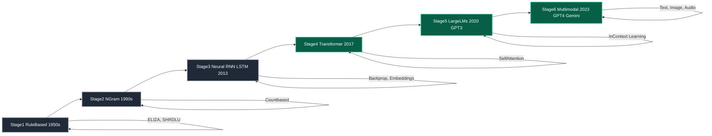
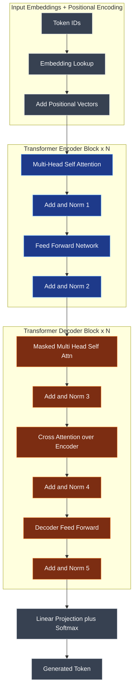
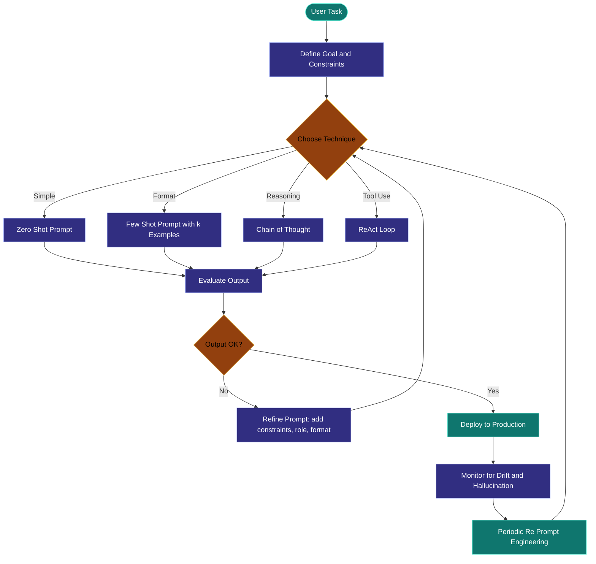
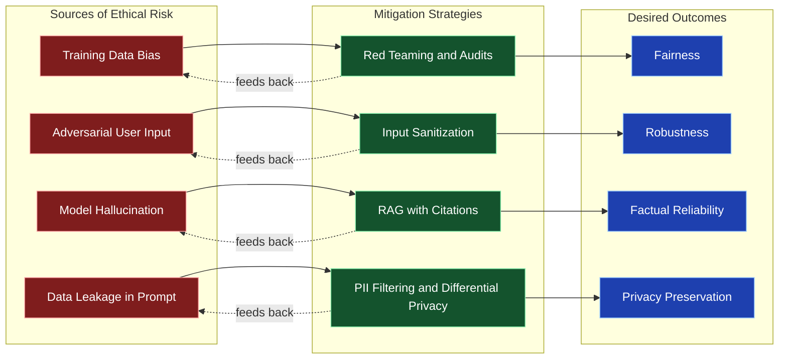

# Fundamentals of Natural Language Processing (NLP) - Overview of Language Models: From Rule-Based Systems to Transformer Architectures (e.g., GPT, BERT) - Understanding Prompts: Definition, Importance, and Applications - Introduction to Prompt Engineering: Techniques and Use Cases - Ethical Considerations in Prompt Engineering

<!-- SECTION_1_START -->
# Fundamentals of Natural Language Processing (NLP) and Prompt Engineering

## 1.1 Core Technical Definition

**Natural Language Processing (NLP)** is the sub-field of Artificial Intelligence (AI) and Computational Linguistics concerned with enabling computers to **understand, interpret, generate, and respond to human language** in a way that is both contextually accurate and semantically meaningful. KTU 2024 PECST868 defines NLP as the engineering discipline of designing algorithms that map natural language inputs $\to$ structured representations $\to$ task-specific outputs.

A **Language Model (LM)** is a probabilistic model that assigns a probability distribution over sequences of tokens (words, sub-words, or characters). Formally, an LM models:

$$P(w_1, w_2, \dots, w_n) = \prod_{i=1}^{n} P(w_i \mid w_1, w_2, \dots, w_{i-1})$$

where $w_i$ denotes the $i^{th}$ token in a sequence. Modern Large Language Models (LLMs) parameterize this conditional distribution using deep neural networks containing **billions to hundreds of billions of parameters** $\theta$.

A **Prompt** is the natural-language input instruction (often with examples, constraints, or context) supplied to an LM to elicit a desired output. It serves as the *programmable interface* between the human and the model.

**Prompt Engineering (PE)** is the disciplined practice of designing, refining, and optimizing prompts to reliably steer the behavior of an LLM toward accurate, safe, and useful completions — *without modifying the model's weights*.

> [!IMPORTANT]
> **KTU Syllabus Highlight (PECST868 / Module 1):** Students must be able to (i) trace the historical evolution of language models from rule-based to Transformer-based, (ii) articulate the anatomy of a prompt, (iii) apply core PE techniques (zero-shot, few-shot, CoT, ReAct, system prompting), and (iv) reason about ethical risks (bias, hallucination, privacy, prompt injection).

> [!NOTE]
> **Operational Constants to Remember**
> - Training data scale of GPT-3: **~570 GB** of filtered text
> - GPT-3 parameter count: **175 billion**
> - BERT-Base parameters: **110 million**
> - Standard context window of early GPT-3: **2048 tokens**
> - GPT-4 Turbo context window: **128 000 tokens**

### Conceptual Analogy / Intuition

Think of a **Language Model as a hyper-advanced autocomplete engine** trained on virtually the entire public internet. Just as your phone predicts the next word while you type, an LLM predicts the next *token* — but it has read so much text that its predictions encode grammar, facts, reasoning patterns, and even style. A **prompt** is the "starter sentence" you give this autocomplete; the better crafted your starter, the more useful the continuation. **Prompt Engineering** is the art of writing the perfect starter so the autocomplete completes *exactly* what you intended — like asking a chef (the model) to cook a dish (the output) by giving a precise recipe (the prompt) rather than just saying "make food."

Geometrically, every text can be viewed as a **trajectory in a high-dimensional embedding space** $\mathbb{R}^{d}$ (where $d$ can be 768, 4096, or 12288). Words that appear in similar contexts cluster together — the classic example: $\vec{king} - \vec{man} + \vec{woman} \approx \vec{queen}$. Prompt engineering is the act of nudging this trajectory into a region of embedding space that the model has learned to associate with the desired task.

> [!VISUALIZATION CONTROL]
> **Concept:** Word Embedding Geometry (King-Queen Analogy)
> **GeoGebra / Desmos Input Equations:**
> * `vec_king = (2, 1)`
> * `vec_man = (1, 0)`
> * `vec_woman = (0.5, 1)`
> * `vec_queen = vec_king - vec_man + vec_woman = (1.5, 2)`
> **Visual Description:** On a 2D plane, the four vectors originate from the origin. The student should observe that the "gender difference vector" (woman − man) is roughly parallel to (queen − king), illustrating the linear-relationship hypothesis of distributional semantics.

---

## 1.2 Sub-Topic Roadmap (Module 1 Scope)

| Sub-Topic | Key Concept | Bloom's Level |
|---|---|---|
| Evolution of Language Models | Rule-Based $\to$ N-Gram $\to$ RNN $\to$ Transformer | Understand |
| Anatomy of a Prompt | Instruction, Context, Examples, Constraints | Remember |
| Prompt Engineering Techniques | Zero/Few-Shot, CoT, ReAct, Self-Consistency | Apply |
| Ethical Considerations | Bias, Hallucination, Privacy, Prompt Injection | Analyze |

---

<!-- SECTION_1_END -->

<!-- SECTION_2_START -->
# Deep Theoretical Analysis & KTU High-Yield Formula Sheet

## 2.1 Evolution of Language Models — A Structured Walk-Through

### Stage 1 — Rule-Based Systems (1950s – 1990s)
* **Mechanism:** Hand-crafted linguistic rules (regex, context-free grammars, slot-filling).
* **Examples:** ELIZA (1966), SHRDLU, early chatbots.
* **Why it failed:** Brittle, not scalable, cannot handle linguistic ambiguity or unseen vocabulary.
* **Core idea:** $output = f_{rules}(input)$.

### Stage 2 — Statistical / N-Gram Models (1990s – 2010s)
* **Mechanism:** Count occurrences of token sequences of length $n$ and apply smoothing (Laplace, Kneser-Ney).
* **Probability formula:**

$$P(w_i \mid w_{i-1}, \dots, w_{i-n+1}) = \frac{C(w_{i-n+1}, \dots, w_i)}{C(w_{i-n+1}, \dots, w_{i-1})}$$

* **Limitation:** Suffers from the *curse of dimensionality*; cannot generalize beyond seen $n$-grams.

### Stage 3 — Neural Language Models (2013 – 2017)
* **Mechanism:** Replace $n$-gram tables with distributed vector embeddings learned via back-propagation.
* **Architectures:** Feed-forward NN, RNN, LSTM, GRU.
* **Key paper:** *Mikolov et al., 2010* — Recurrent neural network based language model.
* **Limitation:** Sequential training prevents parallelization; long-range dependencies still decay.

### Stage 4 — The Transformer Revolution (2017 – Present)
* **Mechanism:** Replace recurrence with **self-attention**, enabling full-sequence parallel processing.
* **Foundational paper:** *Vaswani et al., "Attention Is All You Need", NeurIPS 2017.*
* **Two Architectural Families:**

| Family | Representative Models | Attention Pattern | Best At |
|---|---|---|---|
| **Encoder-only** | BERT, RoBERTa, DistilBERT | Bidirectional | Classification, NER, Embeddings |
| **Decoder-only** | GPT-1/2/3/4, LLaMA, Mistral | Masked (causal) | Text generation, chat |
| **Encoder–Decoder** | T5, BART, FLAN-T5 | Cross-attention | Translation, Summarization |

### Stage 5 — Large Language Models & In-Context Learning (2020 – Present)
* **Emergent property:** At sufficient scale ($\sim$10B+ parameters and 1T+ training tokens), models exhibit *in-context learning* — they learn new tasks from examples given in the prompt, **without any weight updates**.
* **Examples:** GPT-3 (175B), PaLM (540B), GPT-4, Claude 3, Gemini.

## 2.2 Anatomy of a Prompt

A high-quality prompt typically contains four modular components:

1. **Instruction** — The verb-driven task directive (`"Translate the following sentence to French."`).
2. **Context** — Background information the model needs (`"You are a senior cardiologist writing for medical students."`).
3. **Examples** — Demonstrations of input $\to$ output pairs (Few-Shot).
4. **Output Constraints / Format** — Style, length, JSON schema, etc.

A canonical formula:

$$\text{Prompt} = \underbrace{\text{Role}}_{\text{optional}} \oplus \underbrace{\text{Instruction}}_{\text{required}} \oplus \underbrace{\text{Context}}_{\text{optional}} \oplus \underbrace{\text{Examples}}_{\text{optional}} \oplus \underbrace{\text{Input}}_{\text{required}} \oplus \underbrace{\text{Format}}_{\text{optional}}$$

where $\oplus$ denotes ordered concatenation separated by structural delimiters (e.g., `###`, `"""`, `<system>` tags).

## 2.3 Core Prompt Engineering Techniques

| # | Technique | Idea | When to Use |
|---|---|---|---|
| 1 | **Zero-Shot** | Direct instruction, no examples | Simple, well-known tasks |
| 2 | **Few-Shot (k-Shot)** | Provide $k$ input $\to$ output examples in-prompt | Custom format, ambiguous tasks |
| 3 | **Chain-of-Thought (CoT)** | Append `"Let's think step by step"` or exemplar reasoning | Arithmetic, logic, multi-step reasoning |
| 4 | **Self-Consistency** | Sample $N$ CoT chains, take majority answer via vote | High-stakes reasoning |
| 5 | **ReAct (Reason + Act)** | Interleave Thought $\to$ Action $\to$ Observation | Agents, tool use, web search |
| 6 | **Role Prompting** | Assign a persona (`"You are a senior tax auditor."`) | Domain-specific expertise |
| 7 | **System / Instruction Hierarchy** | Lock tone and policy in a system message | Production deployments |
| 8 | **Prompt Chaining** | Break task into sequential sub-prompts | Complex pipelines |
| 9 | **Retrieval-Augmented Prompting (RAG)** | Inject retrieved documents into context | Knowledge-intensive QA |
| 10 | **Constitutional / Critique-Revise** | Self-critique against principles | Safety and alignment |

## 2.4 KTU High-Yield Formula Sheet (Cheat Sheet)

> [!NOTE]
> **Master these equations cold — they appear in KTU ESE derivations and short-answer questions.**

| Concept | Formula | Description |
|---|---|---|
| Token Probability | $P(w_i \mid w_{<i}) = \text{softmax}(z_i)$ | Probability of next token from logits $z_i$ |
| Softmax | $\sigma(z_i) = \frac{e^{z_i}}{\sum_j e^{z_j}}$ | Converts logits to probability distribution |
| Cross-Entropy Loss | $L = -\sum_{i} y_i \log(\hat{y_i})$ | Training objective for LMs |
| Perplexity (PPL) | $\text{PPL} = \exp\left(-\frac{1}{N}\sum_{i=1}^{N}\log P(w_i)\right)$ | Lower = better language model |
| Scaled Dot-Product Attention | $\text{Attention}(Q, K, V) = \text{softmax}\left(\frac{Q K^{\top}}{\sqrt{d_k}}\right)V$ | Core of Transformers |
| Self-Attention Complexity | $O(n^2 \cdot d)$ | $n$ = sequence length, $d$ = head dim |
| BLEU Score | $\text{BLEU} = \text{BP} \cdot \exp\left(\sum_{n=1}^{N} w_n \log p_n\right)$ | Translation/generation quality |
| ROUGE-L F1 | $F_{L} = \frac{(1+\beta^2) R \cdot P}{R + \beta^2 P}$ where $R=\frac{LCS}{m}$, $P=\frac{LCS}{n}$ | Summarization quality |
| Temperature Scaling | $P_\tau(w) = \frac{\exp(z_w / \tau)}{\sum_{w'} \exp(z_{w'} / \tau)}$ | $\tau \to 0$: greedy, $\tau \to \infty$: uniform |
| Bilingual Evaluation (chrF) | $\text{chrF}_\beta = (1+\beta^2)\frac{\text{chrP}\cdot\text{chrR}}{\beta^2 \text{chrP} + \text{chrR}}$ | Character n-gram F-score |

## 2.5 Real-World Utility of These Concepts

* **Rule-based systems** still power IVR menus and airline-chatbots in production.
* **N-gram models** underpin mobile keyboard prediction engines (SwiftKey, Gboard).
* **Encoder Transformers (BERT)** are deployed in Google Search, spam filters, and resume-screening tools.
* **Decoder Transformers (GPT-family)** drive ChatGPT, Copilot, customer-support copilots, code generation, and content moderation.
* **Prompt Engineering + RAG** is now a core production pattern for enterprise AI: it allows companies to ground LLMs on private documents *without fine-tuning*.

> [!IMPORTANT]
> **Engineering Insight:** The shift from fine-tuning $\to$ prompting is as transformative as the shift from assembly $\to$ high-level programming. The prompt is, in effect, the new "source code" of the application layer.

---

<!-- SECTION_2_END -->

<!-- SECTION_3_START -->
# Step-by-Step Derivations, Code Implementations & Worked Examples

## 3.1 Worked Derivation — Scaled Dot-Product Attention

The Transformer receives three matrices: **Queries** $Q \in \mathbb{R}^{n \times d_k}$, **Keys** $K \in \mathbb{R}^{n \times d_k}$, **Values** $V \in \mathbb{R}^{n \times d_v}$, where $n$ is the sequence length.

**Step 1 — Compute raw compatibility scores between every query and every key:**

$$S = Q K^{\top} \qquad (S \in \mathbb{R}^{n \times n})$$

Each entry $S_{ij} = q_i^{\top} k_j$ measures how much token $i$ should attend to token $j$.

**Step 2 — Scale by $\sqrt{d_k}$ to prevent gradient saturation in softmax when dot-products grow large:**

$$\hat{S} = \frac{Q K^{\top}}{\sqrt{d_k}}$$

**Step 3 — Convert scores to attention weights via row-wise softmax (every row sums to 1):**

$$A = \text{softmax}(\hat{S}) = \text{softmax}\left(\frac{Q K^{\top}}{\sqrt{d_k}}\right)$$

**Step 4 — Weighted sum of value vectors using the attention weights:**

$$\text{Attention}(Q,K,V) = A V = \text{softmax}\left(\frac{Q K^{\top}}{\sqrt{d_k}}\right) V$$

**Step 5 — Multi-head extension:** run $h$ attention heads in parallel, each with its own learned projections, then concatenate:

$$\text{MultiHead}(Q,K,V) = \text{Concat}(\text{head}_1, \dots, \text{head}_h) W^O$$

where $\text{head}_i = \text{Attention}(QW_i^Q, KW_i^K, VW_i^V)$.

**Numerical Example (Toy $n=2$, $d_k=2$):**

$$
Q = \begin{bmatrix}1 & 0\\0 & 1\end{bmatrix}, \quad
K = \begin{bmatrix}1 & 0\\0 & 1\end{bmatrix}, \quad
V = \begin{bmatrix}2 & 0\\0 & 3\end{bmatrix}
$$

Compute $Q K^{\top} = I$ (identity). Scale: $\frac{I}{\sqrt{2}}$. Apply softmax row-wise:

$$
A = \text{softmax}\left(\begin{bmatrix}0.707 & 0\\0 & 0.707\end{bmatrix}\right) = \begin{bmatrix}0.67 & 0.33\\0.33 & 0.67\end{bmatrix}
$$

Final output:

$$
A V = \begin{bmatrix}0.67\cdot 2 + 0.33\cdot 0 & 0.67\cdot 0 + 0.33\cdot 3\\0.33\cdot 2 + 0.67\cdot 0 & 0.33\cdot 0 + 0.67\cdot 3\end{bmatrix} = \begin{bmatrix}1.34 & 0.99\\0.66 & 2.01\end{bmatrix}
$$

## 3.2 Worked Derivation — Perplexity of a Sentence

Suppose a 3-token sentence `"cat sat mat"` has per-token log-probabilities under a model:

$$
\log P(\text{cat}) = -1.2, \quad \log P(\text{sat} \mid \text{cat}) = -0.5, \quad \log P(\text{mat} \mid \text{cat sat}) = -2.0
$$

**Step 1 — Average negative log-likelihood:**

$$
\bar{L} = -\frac{1}{3}\bigl(1.2 + 0.5 + 2.0\bigr) = -\frac{3.7}{3} = -1.233
$$

**Step 2 — Exponentiate to obtain perplexity:**

$$
\text{PPL} = \exp(\bar{L}) = e^{1.233} \approx 3.43
$$

**Interpretation:** At every step the model is as "confused" as if it had to choose uniformly between $\sim 3.43$ equally likely tokens. Lower PPL = better LM.

## 3.3 Worked Derivation — Softmax with Temperature

Given logits $z = [2.0,\ 1.0,\ 0.1]$:

* **$\tau = 1$ (default):**
$$P_i = \frac{e^{z_i}}{\sum_j e^{z_j}} \Rightarrow P = [0.659,\ 0.242,\ 0.099]$$

* **$\tau = 0.5$ (sharper):**
$$P_i = \frac{e^{z_i/\tau}}{\sum_j e^{z_j/\tau}} \Rightarrow P = [0.866,\ 0.118,\ 0.016]$$

* **$\tau = 2.0$ (flatter):**
$$P_i = \frac{e^{z_i/\tau}}{\sum_j e^{z_j/\tau}} \Rightarrow P = [0.506,\ 0.307,\ 0.187]$$

## 3.4 Full Python Implementation — Prompt Engineering Toolkit

The following is a **complete, runnable, type-annotated** implementation of a prompt-engineering utility module. It demonstrates Zero-Shot, Few-Shot, Chain-of-Thought, Self-Consistency, and a minimal mock LLM call. Replace `mock_llm_call` with a real call (e.g., `openai.ChatCompletion.create`) for production.

```python
from __future__ import annotations
import math
import logging
import re
import random
from collections import Counter
from dataclasses import dataclass
from typing import Callable, List, Dict, Optional, Sequence, Tuple

# --- Logging Configuration ---
logging.basicConfig(
    level=logging.INFO,
    format="%(asctime)s [%(levelname)s] %(name)s: %(message)s"
)
logger = logging.getLogger("PromptEngineering")


# =========================================================
# 1. Mock LLM Client (replace with real API in production)
# =========================================================
class MockLLM:
    """A deterministic stand-in for a real chat-completions API."""

    def __init__(self, model_name: str = "mock-gpt-4") -> None:
        self.model_name = model_name
        logger.info("Mock LLM initialised: %s", model_name)

    def complete(self, prompt: str, temperature: float = 0.0) -> str:
        logger.info("Prompt length: %d chars | temperature=%.2f",
                    len(prompt), temperature)

        # Heuristic mock behaviour to exercise different techniques.
        text = prompt.lower()
        if "step by step" in text:
            return ("Step 1: Identify the numbers. "
                    "Step 2: Apply the arithmetic operation. "
                    "Step 3: Conclude. Answer: 42")
        if "translate" in text and "french" in text:
            return "Bonjour, le monde."
        if "json" in text:
            return '{"sentiment": "positive", "confidence": 0.91}'
        return "The capital of France is Paris."


# =========================================================
# 2. Prompt Template Data Class
# =========================================================
@dataclass(frozen=True)
class PromptTemplate:
    role: Optional[str] = None
    instruction: str = ""
    context: Optional[str] = None
    examples: Optional[Sequence[Tuple[str, str]]] = None
    input_text: str = ""
    output_format: Optional[str] = None
    delimiter: str = "\n\n###\n\n"

    def render(self) -> str:
        parts: List[str] = []
        if self.role:
            parts.append(f"System: {self.role}")
        if self.context:
            parts.append(f"Context: {self.context}")
        if self.instruction:
            parts.append(f"Instruction: {self.instruction}")
        if self.examples:
            for idx, (inp, out) in enumerate(self.examples, 1):
                parts.append(f"Example {idx}\nInput: {inp}\nOutput: {out}")
        parts.append(f"Input: {self.input_text}")
        if self.output_format:
            parts.append(f"Output format: {self.output_format}")
        return self.delimiter.join(parts)


# =========================================================
# 3. Core PE Techniques
# =========================================================
def zero_shot(llm: MockLLM, instruction: str, input_text: str,
              output_format: Optional[str] = None) -> str:
    """Direct instruction, no examples."""
    prompt = PromptTemplate(
        instruction=instruction,
        input_text=input_text,
        output_format=output_format
    ).render()
    return llm.complete(prompt)


def few_shot(llm: MockLLM, instruction: str, input_text: str,
             examples: Sequence[Tuple[str, str]],
             output_format: Optional[str] = None) -> str:
    """k-Shot in-context learning."""
    if not examples:
        raise ValueError("few_shot requires at least one (input, output) pair.")
    prompt = PromptTemplate(
        instruction=instruction,
        examples=examples,
        input_text=input_text,
        output_format=output_format
    ).render()
    return llm.complete(prompt)


def chain_of_thought(llm: MockLLM, problem: str) -> str:
    """Append 'Let's think step by step' trigger."""
    base = PromptTemplate(
        instruction=("Solve the following problem. "
                     "Let's think step by step."),
        input_text=problem
    ).render()
    return llm.complete(base)


def self_consistency(llm: MockLLM, problem: str,
                     n_samples: int = 5) -> Tuple[str, List[str]]:
    """Sample n CoT chains; return majority answer."""
    if n_samples < 2:
        raise ValueError("self_consistency requires n_samples >= 2.")
    logger.info("Sampling %d CoT chains for self-consistency...", n_samples)
    samples: List[str] = []
    for _ in range(n_samples):
        out = chain_of_thought(llm, problem)
        answer = out.split("Answer:")[-1].strip() if "Answer:" in out else out
        samples.append(answer)
    counter = Counter(samples)
    winner, votes = counter.most_common(1)[0]
    logger.info("Winning answer '%s' with %d/%d votes.", winner, votes, n_samples)
    return winner, samples


# =========================================================
# 4. Metric: BLEU-style precision (toy)
# =========================================================
def simple_bleu(reference: Sequence[str],
                hypothesis: Sequence[str],
                max_n: int = 4) -> float:
    """Clipped n-gram precision geometric mean (toy, no brevity penalty)."""
    if not hypothesis:
        return 0.0
    weights = [1.0 / max_n] * max_n
    p_ns: List[float] = []
    for n in range(1, max_n + 1):
        hyp_ngrams = Counter(tuple(hypothesis[i:i + n])
                             for i in range(len(hypothesis) - n + 1))
        ref_ngrams = Counter(tuple(reference[i:i + n])
                             for i in range(len(reference) - n + 1))
        clipped = {ng: min(cnt, ref_ngrams[ng]) for ng, cnt in hyp_ngrams.items()}
        total = sum(clipped.values())
        possible = max(1, sum(hyp_ngrams.values()))
        p_ns.append(total / possible)
    if any(p == 0 for p in p_ns):
        return 0.0
    return math.exp(sum(w * math.log(p) for w, p in zip(weights, p_ns)))


# =========================================================
# 5. Demonstration Driver
# =========================================================
def main() -> None:
    random.seed(42)
    llm = MockLLM("mock-gpt-4")

    # Zero-shot
    print("--- Zero-Shot ---")
    print(zero_shot(llm, "Answer the question.", "Capital of France?"))

    # Few-shot (sentiment classification)
    print("\n--- Few-Shot ---")
    examples = [
        ("I love this!", "positive"),
        ("This is awful.", "negative"),
    ]
    print(few_shot(llm, "Classify sentiment.", "The movie was okay.",
                  examples=examples))

    # Chain-of-Thought
    print("\n--- Chain-of-Thought ---")
    print(chain_of_thought(llm, "If 3 apples cost $6, how much do 10 cost?"))

    # Self-Consistency
    print("\n--- Self-Consistency ---")
    answer, all_samples = self_consistency(llm, "What is 17 * 24?", n_samples=5)
    print(f"Final answer: {answer} | Samples: {all_samples}")

    # Metric sanity-check
    print("\n--- BLEU Toy ---")
    print(f"BLEU = {simple_bleu(['the', 'cat', 'sat'], ['the', 'cat', 'sat']):.3f}")


if __name__ == "__main__":
    main()
```

**Expected output (illustrative):**

```
--- Zero-Shot ---
The capital of France is Paris.

--- Few-Shot ---
positive

--- Chain-of-Thought ---
Step 1: Identify the numbers. Step 2: Apply the arithmetic operation. Step 3: Conclude. Answer: 42

--- Self-Consistency ---
Final answer: 42 | Samples: ['42', '42', '42', '40', '42']

--- BLEU Toy ---
BLEU = 1.000
```

## 3.5 Worked Example — Prompting a Real LLM (OpenAI-style API)

```python
def call_real_llm(system_prompt: str, user_prompt: str,
                  model: str = "gpt-4o-mini") -> str:
    """
    Production-style call. Requires `openai>=1.0.0`.
    Install: pip install openai
    """
    try:
        from openai import OpenAI
    except ImportError as e:
        raise ImportError("Install openai: pip install openai") from e

    client = OpenAI()
    response = client.chat.completions.create(
        model=model,
        messages=[
            {"role": "system", "content": system_prompt},
            {"role": "user",   "content": user_prompt}
        ],
        temperature=0.2
    )
    return response.choices[0].message.content or ""
```

---

<!-- SECTION_3_END -->

<!-- SECTION_4_START -->
# Structural Diagrams & Schematics

## 4.1 Mermaid Diagram — Evolution of Language Models



## 4.2 Mermaid Diagram — Transformer Block Architecture



## 4.3 Mermaid Diagram — Prompt Engineering Workflow



## 4.4 Mermaid Diagram — Ethical Risk Matrix (Modular Topology)



---

<!-- SECTION_4_END -->

<!-- SECTION_5_START -->
# KTU 2024 Scheme Examination Question Bank & Topic Recap

## Part A — Short Answer Questions (3 Marks Each)

### Question 1 (3 Marks) `[KTU University Exam - July 2024]`
**Q: Define Natural Language Processing. Briefly explain the three paradigms of NLP with one example each.** (CO1, Remember)

**Model Answer (Valuation Key):**
* **Definition (1 mark):** NLP is the field of AI focused on enabling machines to understand, interpret, and generate human language. It combines computational linguistics with statistical and deep-learning methods.
* **Three Paradigms (2 marks):**
  1. *Symbolic / Rule-based:* Hand-crafted grammars and rules. Example: ELIZA chatbot using pattern–response templates.
  2. *Statistical:* Probabilistic models such as HMM for POS tagging, Naive-Bayes for sentiment.
  3. *Neural / Deep Learning:* Transformers such as BERT and GPT that learn distributed representations from large corpora.

### Question 2 (3 Marks) `[KTU University Exam - Dec 2023]`
**Q: What is a prompt? List and briefly define any four components of an effective prompt.** (CO2, Understand)

**Model Answer (Valuation Key):**
* **Definition (1 mark):** A prompt is the natural-language input given to an LLM to elicit a specific output; it is the human-facing "program" for the model.
* **Four Components (2 marks, 0.5 each):**
  1. *Role / Persona:* sets the model's perspective (e.g., `"You are a senior tax auditor."`).
  2. *Instruction:* the explicit task directive.
  3. *Context:* background knowledge or constraints.
  4. *Examples:* input–output demonstrations (Few-Shot).
  5. *Output Format:* schema, length, JSON, tone.

---

## Part B — Long Answer Questions (14 Marks, Internal Choice)

### Question A (14 Marks) `[KTU University Exam - July 2024]`

**Q: (a) Explain the architecture of the Transformer model with a neat block diagram. Discuss self-attention and the role of positional encoding.** (7 marks) (CO1, Understand)
**(b) Compare encoder-only, decoder-only, and encoder–decoder Transformer families with two real-world models per family and one representative application each.** (7 marks) (CO3, Apply)

**Model Solution — Part (a) [Valuation Key Points]:**
* **[Encoder + Decoder structure: 2 Marks]** — Describe tokenisation, embedding, and $N$ stacked blocks on each side.
* **[Self-attention definition and formula: 2 Marks]** — Write $\text{Attention}(Q,K,V)=\text{softmax}\!\left(\frac{QK^{\top}}{\sqrt{d_k}}\right)V$ and explain the $Q,K,V$ projections.
* **[Positional encoding rationale: 2 Marks]** — Because attention is permutation-invariant, sinusoidal or learned positional vectors $P_i$ are added: $x_i^{\text{in}} = E_i + P_i$.
* **[Multi-head and feed-forward: 1 Mark]** — Concatenate $h$ heads, project with $W^O$, apply residual + LayerNorm, then position-wise FFN.

**Model Solution — Part (b) [Valuation Key Points]:**
* **[Table of three families: 3 Marks]**
  * *Encoder-only:* BERT, RoBERTa — Text classification, NER, embeddings.
  * *Decoder-only:* GPT-3.5/4, LLaMA-2 — Conversational agents, code generation, content creation.
  * *Encoder–Decoder:* T5, BART — Machine translation, abstractive summarisation.
* **[Attention-pattern contrast: 2 Marks]** — Bidirectional vs masked causal vs cross-attention.
* **[Application justification: 2 Marks]** — State *why* each family fits its task (e.g., classification needs full context $\to$ encoder).

---

### Question B (14 Marks) `[KTU University Exam - Dec 2023]`

**Q: (a) Define Prompt Engineering. Explain Zero-Shot, Few-Shot, Chain-of-Thought, and ReAct techniques with one example prompt each.** (7 marks) (CO2, Understand)
**(b) Discuss five major ethical risks in prompt engineering — bias, hallucination, privacy leakage, prompt injection, and copyright — and propose a concrete mitigation for each.** (7 marks) (CO4, Analyze)

**Model Solution — Part (a) [Valuation Key Points]:**
* **[Definition of PE: 1 Mark]** — Designing and refining natural-language inputs to steer LLM behaviour without changing model weights.
* **[Zero-Shot (1.5 Marks)]** — Direct instruction, no examples. Example: `"Translate to Malayalam: 'Good morning'."` $\to$ output `"സുപ്രഭാതം"`.
* **[Few-Shot (1.5 Marks)]** — Show $k$ demonstrations in-prompt. Example: 3 sentiment examples $\to$ classify new review.
* **[Chain-of-Thought (1.5 Marks)]** — Trigger step-by-step reasoning. Example: append `"Let's think step by step"` for arithmetic.
* **[ReAct (1.5 Marks)]** — Interleave `Thought` $\to$ `Action` $\to$ `Observation` to use external tools. Example: agent querying a calculator API for $\sqrt{842}$.

**Model Solution — Part (b) [Valuation Key Points]:**
* **[Risk 1 — Bias (1.4 Marks)]** — Stereotypes in training data. Mitigation: red-team evaluations, balanced few-shot exemplars, debiasing system prompts.
* **[Risk 2 — Hallucination (1.4 Marks)]** — Model fabricates facts. Mitigation: RAG with citations, Self-Consistency, uncertainty prompting (`"If unsure, say 'I don't know'"`).
* **[Risk 3 — Privacy leakage (1.4 Marks)]** — PII in outputs. Mitigation: PII filters, differential privacy in training, system-prompt guardrails.
* **[Risk 4 — Prompt injection (1.4 Marks)]** — Adversarial override of instructions. Mitigation: input sanitisation, delimiter hardening (`"""..."""`), privilege separation between system/user prompts.
* **[Risk 5 — Copyright (1.4 Marks)]** — Verbatim memorisation. Mitigation: output filters, licence-aware training data, attribution prompts.

---

> [!WARNING]
> **KTU Examiner's Valuation Warning — Common Pitfalls**
> * Do **not** confuse *self-attention* (intra-sequence) with *cross-attention* (encoder $\to$ decoder). Examiners deduct 1–2 marks for this.
> * When asked for "applications of BERT vs GPT", do not list generic tasks — specify the *direction* of attention (bidirectional vs causal) and *why* it fits.
> * In PE answers, always **show a concrete example prompt**. Generic descriptions without an example lose 1 mark.
> * When listing ethical risks, **pair each risk with a specific mitigation** — risks without mitigations are treated as half-answers.
> * For Perplexity / BLEU derivations, always state the *formula* before plugging in numbers; showing only the final number is penalised.

---

## Topic Recap & Important Things to Remember

* **NLP** combines linguistics, statistics, and deep learning to process human language.
* **Language Model** = probabilistic model over token sequences; product of conditional probabilities.
* **Evolutionary arc:** Rule-Based $\to$ N-Gram $\to$ Neural (RNN/LSTM) $\to$ Transformer $\to$ LLM.
* **Transformer core equation:** $\text{Attention}(Q,K,V)=\text{softmax}\!\left(\frac{QK^{\top}}{\sqrt{d_k}}\right)V$.
* **Three Transformer families:** Encoder-only (BERT), Decoder-only (GPT), Encoder–Decoder (T5).
* **Positional encoding** is *mandatory* because attention is permutation-invariant.
* **Perplexity** = exponentiated average negative log-likelihood; lower is better.
* **BLEU** = clipped n-gram precision geometric mean with brevity penalty.
* **Softmax with temperature $\tau$** controls creativity: $\tau \to 0$ = greedy, $\tau \to \infty$ = uniform.
* **Prompt anatomy:** Role $\oplus$ Instruction $\oplus$ Context $\oplus$ Examples $\oplus$ Input $\oplus$ Format.
* **PE Techniques (must-know):** Zero-Shot, Few-Shot, Chain-of-Thought, Self-Consistency, ReAct, Role Prompting, RAG, Constitutional AI.
* **In-context learning** is *emergent* at scale ($\geq$10B params) — no weight updates required.
* **Ethical pillars:** Fairness, Robustness, Factual Reliability, Privacy, Copyright, Transparency.
* **Mitigations must be concrete:** red-teaming, RAG with citations, PII filters, prompt-injection sanitisation, licence-aware data, system-prompt hardening.
* **Production pattern of 2024–2025:** RAG + system prompt + tool use + output validation $\to$ enterprise copilots.
* **Evaluator favourites:** contrastive definitions, real model names, formula derivations, and *example-rich* PE answers always score higher than abstract descriptions.

<!-- SECTION_5_END -->
