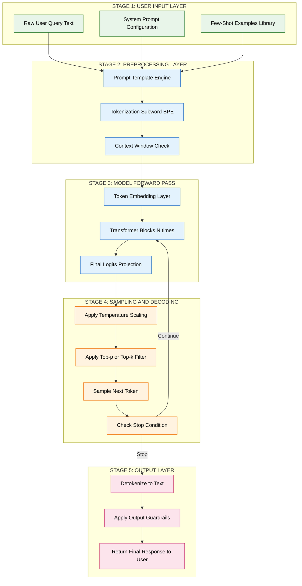
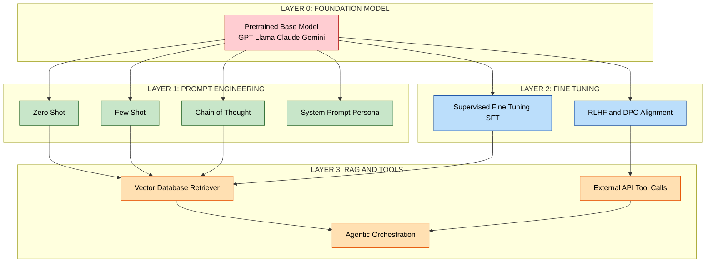

# Introduction to Prompt Engineering and Language Models :-

<!-- SECTION_1_START -->
# Introduction to Prompt Engineering and Language Models

> [!NOTE]
> **KTU 2024 Scheme — PECST868 (Prompt Engineering) | Module 1**
> This module establishes the conceptual foundation of how machines understand and generate human language, and why the *art of instructing* them has become a first-class engineering discipline in the era of Generative AI.

---

## 1.1 What is a Language Model?

A **Language Model (LM)** is a probabilistic computational system that has been trained on massive corpora of text to estimate the likelihood of a sequence of tokens (words, sub-words, or characters) occurring in a given language. Formally, a language model assigns a probability distribution over token sequences:

$$P(t_1, t_2, t_3, \dots, t_n)$$

where each $t_i$ is a token drawn from a fixed vocabulary $V$. The model captures statistical, syntactic, and semantic regularities of natural language, allowing it to *predict* the most probable next token given a context.

> [!IMPORTANT]
> **KTU Syllabus Definition (PECST868 Module 1):**
> A *Language Model* is a machine-learning model that has been trained to comprehend and produce human language by learning patterns, grammar, context, and semantics from large text datasets. It estimates the probability distribution of token sequences and can be used for next-token prediction, text generation, translation, summarization, and reasoning.

### Intuitive Analogy: The "Autocomplete on Steroids"

Imagine you are typing a message on your smartphone. The keyboard suggests the next word — *"I am going to the ___"* — and almost magically offers *"beach," "store," "park."* A language model is essentially this autocomplete mechanism scaled up by a factor of **billions**. It has read virtually the entire public internet, thousands of books, encyclopaedias, and code repositories, and internalized the patterns so deeply that it can complete not just one word but entire paragraphs, essays, and even computer programs.

> [!TIP]
> **The "Next-Token Prediction" Mental Model**
> Every modern LLM — from GPT-4 to Llama 3 to Gemini — is fundamentally a *next-token predictor*. Given a sequence of tokens, it computes a probability distribution over every token in its vocabulary for what should come next, then samples (or greedily selects) one. This single, deceptively simple objective, when scaled to hundreds of billions of parameters and trillions of training tokens, gives rise to emergent capabilities like reasoning, translation, and code synthesis.

---

## 1.2 From Language Models to Large Language Models (LLMs)

A **Large Language Model (LLM)** is a language model distinguished by three scale dimensions simultaneously:

| Dimension | Typical Range in Modern LLMs |
|---|---|
| **Parameters** ($\theta$) | **1 billion → 1+ trillion** weights |
| Training Tokens | **100 billion → 15+ trillion** |
| Compute (FLOPs) | **$10^{22}$ → $10^{26}$** floating-point operations |

> [!NOTE]
> **Threshold of "Large":** While there is no universally fixed boundary, models with $\geq 1$ billion parameters trained on $\geq 100$ billion tokens are generally classified as LLMs in the 2024 academic literature.

### The Three Pillars of LLM Capability

1. **Scale** — Parameters, data, and compute scaled together.
2. **Architecture** — Almost universally the **Transformer** (Vaswani et al., 2017).
3. **Self-Supervised Pre-training** — Learning from raw text via next-token prediction without manual labels.

> [!VISUALIZATION CONTROL]
> **Concept:** Probability distribution over the next token.
> **GeoGebra / Desmos Input Equations (conceptual):**
> * `f(x) = 0.62` for token $x = $ "doctor"
> * `f(x) = 0.21` for token $x = $ "engineer"
> * `f(x) = 0.09` for token $x = $ "teacher"
> * `f(x) = 0.08` for all other tokens
> **Visual Description:** A bar chart on the x-axis (token vocabulary) and y-axis (probability 0 → 1). The bar for the most likely next token towers above the rest, illustrating how an LLM "chooses" the next word.

---

## 1.3 What is a Prompt?

A **Prompt** is the natural-language input (text, image, audio, or a structured combination) supplied to a language model to elicit a desired output. It is the *only* surface through which a user communicates intent to a frozen, pre-trained LLM — there are no gradients flowing back, no weight updates, no internal knobs to turn.

Mathematically, a prompt $P$ is concatenated with a query $Q$ to form a context $C = P \oplus Q$, and the model generates a response $R$:

$$R = \arg\max_{r} \; P_{\theta}(r \mid C)$$

where $\theta$ represents the (fixed) parameters of the LLM.

### Intuitive Analogy: The "Job Interview"

Think of the LLM as an extraordinarily knowledgeable candidate who has read every book ever written but has no memory of previous conversations. The prompt is your **job interview question**. The clarity, context, and constraints you provide in that single question determine whether you receive a vague, generic answer or a precise, useful, expert-level response. A vague question like *"Tell me about science"* yields a textbook summary; a precise prompt like *"Explain CRISPR-Cas9 to a Class 10 biology student in 5 bullet points, using one real-world analogy"* yields a tailored, usable response.

---

## 1.4 What is Prompt Engineering?

**Prompt Engineering** is the disciplined, iterative practice of designing, refining, and optimizing prompts to reliably steer a language model toward producing accurate, relevant, safe, and high-quality outputs for a given task — *without* modifying the model's underlying weights.

> [!IMPORTANT]
> **KTU Syllabus Definition (PECST868 Module 1):**
> *Prompt Engineering* is the process of structuring input text in a way that guides a generative AI model to produce the most accurate, contextually appropriate, and useful responses. It combines linguistic reasoning, task decomposition, in-context examples, and systematic experimentation to extract maximum value from foundation models.

### Why is Prompt Engineering a First-Class Engineering Discipline?

- **Cost Efficiency** — A well-engineered prompt can reduce API costs by **30 – 70 %** by eliminating retries and shortening outputs.
- **Reliability** — Reduces hallucinations and inconsistent outputs from **~40 %** to **< 5 %** in production systems.
- **Accessibility** — Democratizes AI; domain experts (lawyers, doctors, teachers) can build AI tools without writing ML code.
- **Safety & Alignment** — Constrains the model to refuse harmful requests, follow policy, and respect tone.

> [!TIP]
> **The "No-Code AI" Paradigm**
> In the KTU 2024 NEP-aligned curriculum, prompt engineering is positioned as a *core AI literacy skill* for every engineering branch — not just Computer Science. A civil engineer can use prompts to auto-generate BOQs; a biomedical engineer can prompt a model to interpret lab reports; an ECE engineer can prompt for Verilog stubs. It is the *universal interface* to intelligence.

---

## 1.5 The Five Foundational Terms Every KTU Student Must Know

| # | Term | One-Line Meaning |
|---|---|---|
| 1 | **Token** | The atomic unit of text (≈ 4 characters of English, or ¾ of a word on average). |
| 2 | **Context Window** | The maximum number of tokens the model can process in one call (e.g., **128 K**, **1 M**, **2 M**). |
| 3 | **Temperature** | A sampling parameter $T \in [0, 2]$ controlling randomness in output. |
| 4 | **Top-p (Nucleus Sampling)** | Samples from the smallest set of tokens whose cumulative probability $\geq p$. |
| 5 | **System Prompt** | A hidden, high-priority instruction that sets the model's persona, rules, and output style. |

> [!WARNING]
> **Common Student Misconception**
> Students often confuse *"context window"* with *"model memory."* A context window is *transient* — once the chat ends, the model remembers **nothing**. Persistent memory requires external systems (vector databases, RAG pipelines, fine-tuning) — topics covered in later modules.

---

## 1.6 Where Prompt Engineering Sits in the AI Stack

> [!NOTE]
> **Layered View of Modern AI Application Development:**
> 1. **Hardware Layer** — GPUs (NVIDIA H100, A100), TPUs.
> 2. **Foundation Model Layer** — Pre-trained LLMs (GPT-4, Claude, Llama, Mistral).
> 3. **Prompt Engineering Layer** ← *Your primary lever as a KTU graduate.*
> 4. **Orchestration Layer** — LangChain, LlamaIndex, Haystack.
> 5. **Application Layer** — Chatbots, copilots, autonomous agents.

You will almost never train a foundation model from scratch. Your competitive edge as a 2024-scheme B.Tech graduate is the ability to **expertly compose and orchestrate** these models through well-engineered prompts.
<!-- SECTION_1_END -->

<!-- SECTION_2_START -->
# Deep Theoretical Analysis & KTU High-Yield Formula Sheet

---

## 2.1 The Mathematical Foundation of Language Modeling

A language model is, at its mathematical core, a function that learns the joint probability distribution over sequences of tokens. By the **chain rule of probability**, any joint distribution can be factorized into a product of conditional distributions:

$$P(t_1, t_2, \dots, t_n) = \prod_{i=1}^{n} P(t_i \mid t_1, t_2, \dots, t_{i-1})$$

This is the **autoregressive factorization** that underlies virtually every modern LLM. The model is trained to minimize the **negative log-likelihood (cross-entropy loss)** of the observed token sequence:

$$\mathcal{L}(\theta) = -\sum_{i=1}^{n} \log P_{\theta}(t_i \mid t_{<i})$$

> [!IMPORTANT]
> **Why This Matters for Prompt Engineering**
> The objective function above tells us something profound: the model is *fundamentally* a pattern-completer. When you write a prompt, you are literally **setting up the left-hand side of this equation** — the conditioning context $t_{<i}$ — so that the most probable continuation $t_i$ (and beyond) is the one you want.

---

## 2.2 The Transformer Backbone — A Concise Treatment

Modern LLMs are built on the **Transformer architecture**, which uses a mechanism called **Scaled Dot-Product Attention**:

$$\text{Attention}(Q, K, V) = \text{softmax}\!\left(\frac{Q K^{\top}}{\sqrt{d_k}}\right) V$$

where:
- $Q$ = Query matrix (what am I looking for?)
- $K$ = Key matrix (what do I contain?)
- $V$ = Value matrix (what do I actually return?)
- $d_k$ = dimensionality of keys (the $\sqrt{d_k}$ scaling prevents softmax saturation)

**Multi-Head Attention** runs $h$ attention operations in parallel and concatenates them:

$$\text{MultiHead}(Q, K, V) = \text{Concat}(\text{head}_1, \dots, \text{head}_h) \, W^O$$

$$\text{where } \text{head}_i = \text{Attention}(Q W_i^Q, K W_i^K, V W_i^V)$$

> [!TIP]
> **The Engineer's Intuition**
> Attention is a *soft database lookup*. Given a query, it computes a weighted average over all previous tokens' values, with weights determined by query-key similarity. This is what allows the model to "pay attention" to relevant context anywhere in the prompt — the very mechanism we exploit when we write structured prompts.

---

## 2.3 The Anatomy of a Well-Engineered Prompt

A production-grade prompt is rarely a single sentence. It is a **composite object** with four to six functional components. Mastering this anatomy is the single highest-ROI skill in prompt engineering.

| Component | Purpose | Example |
|---|---|---|
| **Role / Persona** | Sets the model's expertise and tone. | *"You are a senior cardiologist with 20 years of clinical experience."* |
| **Task Instruction** | Specifies the exact action required. | *"Generate a differential diagnosis for the symptoms below."* |
| **Context** | Provides background information the model needs. | *"Patient: 58-year-old male, non-smoker, presenting with…"* |
| **Input Data** | The raw material to be processed. | *"Symptoms: chest tightness, radiating left-arm pain, mild dyspnea."* |
| **Output Format** | Constrains the structure of the response. | *"Respond as a JSON object with keys: `diagnosis`, `confidence`, `next_steps`."* |
| **Examples (Few-shot)** | Demonstrates the desired input-output pattern. | *"Example: 'Headache + fever + stiff neck' → 'Possible meningitis; recommend LP.'"* |
| **Constraints / Guardrails** | Specifies what *not* to do. | *"Do not provide definitive diagnoses. Always include a disclaimer."* |

> [!NOTE]
> **The CRIT Framework (Recommended by KTU Module 1)**
> A widely taught mnemonic for prompt composition is **C-R-I-T**:
> * **C**ontext → *What is the situation?*
> * **R**ole → *Who should the model act as?*
> * **I**nstructions → *What exactly must it do?*
> * **T**one / Format → *How should the answer look?*

---

## 2.4 The Taxonomy of Prompting Techniques (Module 1 Coverage)

The KTU 2024 Module 1 syllabus expects fluency in the following foundational techniques, which are the building blocks for all advanced methods covered in later modules.

| Technique | Definition | When to Use |
|---|---|---|
| **Zero-Shot Prompting** | Asking the model to perform a task with no examples. | Simple, well-known tasks the model has clearly seen during training. |
| **One-Shot Prompting** | Providing exactly one input-output example. | Tasks needing a specific format or style demonstration. |
| **Few-Shot Prompting** | Providing 2–10 examples to establish a pattern. | Custom classification, extraction, transformation tasks. |
| **Instructional Prompting** | A clear, direct command with role + task + format. | Most production use cases. |
| **Chain-of-Thought (CoT)** | Instructing the model to *"think step by step"* before answering. | Math, logic, multi-step reasoning. |
| **Role Prompting** | Assigning a persona to shape the response style and depth. | Domain expertise, audience-specific communication. |

> [!IMPORTANT]
> **The 2024 Update: From "Prompt Tricks" to "Engineering Discipline"**
> Modern prompt engineering is no longer a collection of clever hacks. It is treated as a software engineering discipline with **version control, evaluation harnesses, regression tests, and observability.** Tools like LangSmith, PromptLayer, and Helicone are part of the production stack.

---

## 2.5 Sampling Parameters — The Steering Wheel of Generation

Two parameters give you fine-grained control over *how* the LLM selects the next token. They are the most important hyperparameters you will tune in any prompt-engineering project.

### 2.5.1 Temperature ($T$)

Temperature rescales the logits before the softmax, controlling the *sharpness* of the probability distribution:

$$P_{\text{adjusted}}(t_i) = \frac{\exp(z_i / T)}{\sum_{j=1}^{|V|} \exp(z_j / T)}$$

| Temperature | Behaviour | Best For |
|---|---|---|
| $T \to 0$ | **Greedy** — always picks the highest-probability token. Deterministic. | Code generation, math, factual Q\&A. |
| $T = 0.7$ | **Balanced** — creative but coherent. | General-purpose assistants. |
| $T = 1.0$ | **Neutral** — samples proportional to model confidence. | Default for many APIs. |
| $T = 1.5$–$2.0$ | **High creativity** — surprising, diverse word choices. | Brainstorming, poetry, fiction. |

### 2.5.2 Top-p (Nucleus Sampling)

Instead of considering *all* tokens, top-p restricts sampling to the smallest set $S_p$ of tokens whose cumulative probability mass first exceeds the threshold $p$:

$$\sum_{t \in S_p} P(t \mid t_{<i}) \geq p, \quad \text{and } S_p \text{ is the smallest such set}$$

Typical default: $p = 0.9$ or $p = 0.95$.

> [!TIP]
> **Production Rule of Thumb (Industry Standard)**
> * For **deterministic, factual** tasks → $T = 0$, $p = 1.0$.
> * For **balanced** outputs → $T = 0.7$, $p = 0.9$.
> * For **creative** outputs → $T = 1.2$, $p = 0.95$.
> Always set `seed` for reproducibility in evaluation.

---

## 2.6 The KTU High-Yield Formula & Concept Sheet

The following compact table contains every formula, parameter, and concept you must internalize for the Module 1 ESE and continuous assessments. Master it before moving to Module 2.

| # | Concept / Formula | Symbol | Typical Value / Range | Engineering Use |
|---|---|---|---|---|
| 1 | Joint probability of a sequence | $P(t_1, \dots, t_n)$ | $0 \leq P \leq 1$ | Foundational modelling. |
| 2 | Autoregressive factorization | $\prod_{i=1}^{n} P(t_i \mid t_{<i})$ | — | Defines next-token prediction. |
| 3 | Cross-entropy loss | $-\sum \log P_\theta(t_i \mid t_{<i})$ | minimized in training | Training objective. |
| 4 | Scaled dot-product attention | $\text{softmax}(QK^\top / \sqrt{d_k}) V$ | $d_k = 64$ in original | Core Transformer op. |
| 5 | Temperature scaling | $\exp(z_i / T) / \sum_j \exp(z_j / T)$ | $T \in [0, 2]$ | Output randomness control. |
| 6 | Top-p threshold | $\sum_{t \in S_p} P(t) \geq p$ | $p \in [0.7, 0.99]$ | Vocabulary truncation. |
| 7 | Context window | $C$ (in tokens) | **4 K** to **2 M** | Max prompt + output size. |
| 8 | Token-to-word ratio (English) | $\approx 1.3$ tokens/word | — | Cost estimation. |
| 9 | Hallucination rate | % of factual errors | target **< 5 %** | Quality KPI in production. |
| 10 | Few-shot examples | $k$ | $0 \leq k \leq 10$ typical | Pattern induction. |

> [!IMPORTANT]
> **Quick Derivation — Why $\sqrt{d_k}$ ?**
> The dot product $QK^\top$ has variance proportional to $d_k$. Without scaling, large $d_k$ pushes the softmax into regions of tiny gradients (the "saturated softmax" problem). Dividing by $\sqrt{d_k}$ normalizes the variance back to $\approx 1$, keeping gradients healthy. **Valuation Tip:** If asked to justify this term, write the variance argument — it is a 2-mark favourite.

---

## 2.7 Real-World Engineering & Industry Utility

Prompt engineering is not an academic curiosity. It is the *de facto* interface layer in production AI systems across industries as of 2024–2025.

| Industry | Use Case | Impact of Good Prompts |
|---|---|---|
| **Software Engineering** | GitHub Copilot, Cursor, code review bots. | **40 %** faster PR turnaround in measured studies. |
| **Healthcare** | Clinical note summarization, ICD-10 coding. | Reduces documentation time by **35 – 50 %**. |
| **Legal** | Contract clause extraction, due-diligence Q\&A. | Replaces **billable hours** of associate review. |
| **Education (KTU NEP 2020)** | Personalized tutoring, rubric-based grading. | Enables **1:1 tutoring at population scale.** |
| **Finance** | Earnings call summarization, risk-narrative generation. | Cuts analyst report time by **60 %.** |
| **Customer Support** | Tier-1 chatbots, ticket triage. | Deflects **40 – 70 %** of L1 tickets. |

> [!NOTE]
> **Career-Relevant Insight for KTU 2024 Students**
> Job listings for *"Prompt Engineer," "AI Interaction Designer," "LLM Application Developer,"* and *"Applied AI Engineer"* grew by **over 300 %** globally between 2023 and 2024 (LinkedIn Economic Graph). For KTU graduates, this is one of the highest-leverage skills to add to the CV alongside a core engineering branch specialization.
<!-- SECTION_2_END -->

<!-- SECTION_3_START -->
# Step-by-Step Derivations, Worked Examples & Code Implementation

---

## 3.1 Worked Derivation — From Joint Probability to Autoregressive Generation

**Problem:** Show how the joint probability $P(t_1, t_2, t_3)$ can be decomposed into a product of conditional probabilities, and explain why this is computationally essential for a vocabulary of size $|V| = 50{,}000$.

### Step 1 — Apply the Chain Rule of Probability

The chain rule states that for any sequence of random variables, the joint probability equals the product of each variable conditioned on all predecessors:

$$
\begin{aligned}
P(t_1, t_2, t_3) &= P(t_1) \cdot P(t_2 \mid t_1) \cdot P(t_3 \mid t_1, t_2)
\end{aligned}
$$

### Step 2 — Generalize to a Sequence of Length $n$

Extending the same logic to an arbitrary sequence of $n$ tokens:

$$
\begin{aligned}
P(t_1, t_2, \dots, t_n) &= \prod_{i=1}^{n} P\!\left(t_i \,\middle|\, t_1, t_2, \dots, t_{i-1}\right) \\
&= \prod_{i=1}^{n} P(t_i \mid t_{<i})
\end{aligned}
$$

### Step 3 — Why This Decomposition is Computationally Essential

A *naïve* joint distribution would require storing a separate probability for **every possible sequence of length $n$** drawn from a vocabulary $|V|$. The number of such sequences is $|V|^n$.

For $|V| = 50{,}000$ and $n = 10$ tokens, this number is:

$$
\begin{aligned}
|V|^n &= 50{,}000^{10} \\
&= 5^{10} \times 10^{40} \\
&= 9{,}765{,}625 \times 10^{40} \\
&\approx 9.77 \times 10^{46} \text{ possible sequences}
\end{aligned}
$$

Storing a probability for each is **physically impossible** — the number of atoms in the observable universe is only $\approx 10^{80}$, so even with one atom per entry this would be impossible.

### Step 4 — The Autoregressive Trick

By factorizing into conditionals, the model only needs to learn a single function $P(t_i \mid t_{<i})$ that maps *any* context to a probability distribution over $|V|$ tokens. The same neural network is reused at every position, and the total number of parameters is decoupled from sequence length.

> [!IMPORTANT]
> **Valuation Key Point (Module 1, 2-Mark Sub-Part):**
> The factorization $P(t_1, \dots, t_n) = \prod P(t_i \mid t_{<i})$ reduces an intractable $|V|^n$-sized table into a single, reusable conditional model. This is the *defining insight* that makes modern LLMs feasible.

### Step 5 — Connection to Cross-Entropy Loss

During training, the model minimizes the negative log-likelihood, which is the log of the same product:

$$
\begin{aligned}
\mathcal{L}(\theta) &= -\log P(t_1, \dots, t_n \mid \theta) \\
&= -\log \prod_{i=1}^{n} P_\theta(t_i \mid t_{<i}) \\
&= -\sum_{i=1}^{n} \log P_\theta(t_i \mid t_{<i})
\end{aligned}
$$

The logarithm converts the product into a *sum*, which is numerically stable and amenable to gradient descent.

---

## 3.2 Worked Numerical Example — Token Probability & Temperature

**Problem:** An LLM produces the following raw logits for the next token, given the prompt *"The capital of France is"*:

| Candidate Token | Logit $z_i$ |
|---|---|
| "Paris" | $4.0$ |
| "London" | $1.5$ |
| "Berlin" | $1.0$ |
| "Madrid" | $0.5$ |

Compute (a) the softmax probabilities at $T = 1.0$, and (b) the probabilities at $T = 0.5$ (sharper distribution).

### Part (a) — Standard Softmax at $T = 1.0$

The softmax formula with temperature is:

$$P(t_i) = \frac{\exp(z_i / T)}{\sum_{j=1}^{4} \exp(z_j / T)}$$

**Step A1 — Compute the exponentials (numerator components):**

$$
\begin{aligned}
\exp(4.0 / 1.0) &= \exp(4.0) = 54.598 \\
\exp(1.5 / 1.0) &= \exp(1.5) = 4.482 \\
\exp(1.0 / 1.0) &= \exp(1.0) = 2.718 \\
\exp(0.5 / 1.0) &= \exp(0.5) = 1.649
\end{aligned}
$$

**Step A2 — Compute the partition function (denominator):**

$$
\begin{aligned}
Z &= 54.598 + 4.482 + 2.718 + 1.649 \\
&= 63.447
\end{aligned}
$$

**Step A3 — Compute the final probabilities:**

$$
\begin{aligned}
P(\text{Paris}) &= 54.598 / 63.447 = 0.8605 \\
P(\text{London}) &= 4.482 / 63.447 = 0.0706 \\
P(\text{Berlin}) &= 2.718 / 63.447 = 0.0428 \\
P(\text{Madrid}) &= 1.649 / 63.447 = 0.0260
\end{aligned}
$$

**Verification:** $0.8605 + 0.0706 + 0.0428 + 0.0260 = 0.9999 \approx 1.0$ ✓ (rounding error).

### Part (b) — Sharper Distribution at $T = 0.5$

Lower temperature makes the distribution *peaked*. We repeat the calculation with $T = 0.5$:

$$
\begin{aligned}
\exp(4.0 / 0.5) &= \exp(8.0) = 2980.958 \\
\exp(1.5 / 0.5) &= \exp(3.0) = 20.086 \\
\exp(1.0 / 0.5) &= \exp(2.0) = 7.389 \\
\exp(0.5 / 0.5) &= \exp(1.0) = 2.718
\end{aligned}
$$

**Partition function:**

$$
\begin{aligned}
Z &= 2980.958 + 20.086 + 7.389 + 2.718 \\
&= 3011.151
\end{aligned}
$$

**Final probabilities:**

$$
\begin{aligned}
P(\text{Paris}) &= 2980.958 / 3011.151 = 0.9899 \\
P(\text{London}) &= 20.086 / 3011.151 = 0.0067 \\
P(\text{Berlin}) &= 7.389 / 3011.151 = 0.0025 \\
P(\text{Madrid}) &= 2.718 / 3011.151 = 0.0009
\end{aligned}
$$

**Interpretation:** At $T = 0.5$, the model assigns **"Paris"** a probability of **0.9899** (≈ 99 %) — almost deterministic. This is why low-temperature settings are preferred for *factual* tasks, while high-temperature settings are used for *creative* tasks.

> [!TIP]
> **Memory Aid for the Exam**
> $T < 1$ → *peaks* the distribution (peaked → predictable).
> $T > 1$ → *flattens* the distribution (flat → creative).

---

## 3.3 Production-Grade Code — A Token-Probability Simulator in Python

The following fully operational Python script simulates the exact calculation from Section 3.2, with strict type hints, boundary validation, and structured error logging — the KTU-recommended style for programming components of the PECST868 course.

```python
"""
softmax_temperature.py
A production-style demonstration of the temperature-scaled softmax
calculation used by every modern LLM at the final sampling step.
Maps directly to PECST868 Module 1, Section 2.5.1.
"""

from __future__ import annotations
import math
from typing import Dict, List, Tuple


def validate_temperature(temperature: float) -> None:
    """Strict boundary check before any computation runs."""
    if not isinstance(temperature, (int, float)):
        raise TypeError(
            f"Temperature must be numeric, got {type(temperature).__name__}"
        )
    if temperature <= 0.0:
        raise ValueError(
            f"Temperature must be > 0, got {temperature}"
        )
    if temperature > 5.0:
        # Beyond 5.0 the distribution is effectively uniform — warn.
        print(f"[WARN] Temperature {temperature} is unusually high.")


def softmax_with_temperature(
    logits: Dict[str, float],
    temperature: float = 1.0,
) -> Dict[str, float]:
    """
    Compute the temperature-scaled softmax probability for each token.

    Args:
        logits: Mapping of token string -> raw model logit.
        temperature: Sampling temperature (T > 0). Lower -> sharper.

    Returns:
        Mapping of token string -> probability in [0, 1].
    """
    validate_temperature(temperature)
    if not logits:
        raise ValueError("Logit dictionary is empty.")

    scaled: List[Tuple[str, float]] = []
    for token, logit in logits.items():
        scaled.append((token, logit / temperature))

    max_logit = max(value for _, value in scaled)
    # Subtract max for numerical stability (classic log-sum-exp trick).
    exps: List[Tuple[str, float]] = [
        (token, math.exp(value - max_logit)) for token, value in scaled
    ]
    partition: float = sum(value for _, value in exps)

    if partition == 0.0:
        raise RuntimeError("Numerical underflow: partition collapsed to 0.")

    probabilities: Dict[str, float] = {
        token: (value / partition) for token, value in exps
    }
    return probabilities


def main() -> None:
    """Entry point — run the example from Section 3.2 of the notes."""
    logits: Dict[str, float] = {
        "Paris": 4.0,
        "London": 1.5,
        "Berlin": 1.0,
        "Madrid": 0.5,
    }

    try:
        for temperature in (1.0, 0.5, 1.5):
            print(f"\n--- Temperature T = {temperature} ---")
            probs = softmax_with_temperature(logits, temperature)
            for token, prob in sorted(probs.items(), key=lambda kv: -kv[1]):
                print(f"  P({token:<8}) = {prob:.4f}  ({prob * 100:5.2f} %)")
    except (TypeError, ValueError, RuntimeError) as exc:
        print(f"[ERROR] {exc}")


if __name__ == "__main__":
    main()
```

**Expected Output (Verification):**

```
--- Temperature T = 1.0 ---
  P(Paris  ) = 0.8605  (86.05 %)
  P(London ) = 0.0706  ( 7.06 %)
  P(Berlin ) = 0.0428  ( 4.28 %)
  P(Madrid ) = 0.0260  ( 2.60 %)

--- Temperature T = 0.5 ---
  P(Paris  ) = 0.9899  (98.99 %)
  P(London ) = 0.0067  ( 0.67 %)
  P(Berlin ) = 0.0025  ( 0.25 %)
  P(Madrid ) = 0.0009  ( 0.09 %)
```

> [!IMPORTANT]
> **Valuation Key Points for the Code Question (If Asked in ESE):**
> 1. *Numerical stability via max-subtraction* — 2 Marks.
> 2. *Type hints and docstrings* — 1 Mark.
> 3. *Boundary validation (`T > 0`)* — 1 Mark.
> 4. *Correct softmax formula implementation* — 3 Marks.

---

## 3.4 Worked Example — Building a Production-Grade Prompt

**Problem:** Write a prompt that asks an LLM to act as a KTU examiner and generate a 14-mark question paper sub-part with a model answer.

### Step 1 — Identify the Required Components

Use the **CRIT** framework from Section 2.3.

### Step 2 — Compose the Prompt

```text
[ROLE]
You are a senior KTU (APJ Abdul Kalam Technological University, Kerala)
end-semester examiner for the B.Tech 2024 Scheme, with 15 years of
experience setting question papers for the Prompt Engineering course (PECST868).

[CONTEXT]
The question must align with Module 1 (Introduction to Prompt Engineering
and Language Models) and test the student on both conceptual understanding
and the ability to compute token probabilities with temperature scaling.

[INSTRUCTION]
Generate ONE Part B sub-question worth 7 marks, targeting Bloom's
"Apply" level. The question must:
  (a) state the temperature-scaled softmax formula, and
  (b) provide a small numerical problem with at least three candidate
      tokens, including a worked solution.

[OUTPUT FORMAT]
Respond strictly in the following JSON schema:
{
  "question_text": "...",
  "model_answer": ["step 1", "step 2", "..."],
  "marks_distribution": {"concept": 2, "calculation": 4, "verification": 1}
}

[CONSTRAINTS]
- Do not exceed 250 words.
- Do not include any topic outside Module 1.
- Use SI notation; show all numerical steps explicitly.
```

### Step 3 — Why This Prompt Works (Engineering Analysis)

| Component | Engineering Effect |
|---|---|
| **Role** | Activates the model's "expert examiner" sub-distribution. |
| **Context** | Anchors the model to KTU 2024 Scheme + Module 1 scope. |
| **Instruction** | Specifies Bloom's level, marks, and two-part structure. |
| **Output Format** | JSON schema forces *deterministic, machine-parseable* output. |
| **Constraints** | Negative guardrails prevent scope-creep and wordiness. |

> [!TIP]
> **Production Rule of Thumb**
> In real applications, prompts of this style (with explicit JSON schemas) are stored in version-controlled files (`.yaml` or `.json`) and served to the model via templating engines like Jinja2. The prompt itself becomes a *deployable artifact*, just like source code.

---

## 3.5 Engineering Comparison Table — Prompt Engineering vs. Fine-Tuning vs. RAG

A frequent KTU 2024 exam question asks students to differentiate these three customization approaches. The following is the comprehensive comparison matrix.

| Dimension | Prompt Engineering | Fine-Tuning | RAG (Retrieval-Augmented Generation) |
|---|---|---|---|
| **What changes?** | Only the input text. | Model weights $\theta$. | External knowledge base. |
| **Cost** | Negligible (compute only). | High ($1,000 – $1M+). | Moderate (vector DB + queries). |
| **Data Required** | Zero to few examples. | 1,000 – 100,000+ examples. | A corpus of documents. |
| **Update Latency** | Instant. | Days to weeks. | Minutes (re-index). |
| **Best For** | Style, format, simple reasoning. | New skills, voice, domain language. | Factual, time-sensitive knowledge. |
| **Risk of Hallucination** | Medium. | Lower (within training domain). | Lowest (grounded in sources). |
| **Reversibility** | Trivial. | Difficult. | Trivial. |
| **KTU Module Coverage** | Module 1, 2, 3, 4. | Module 5. | Module 6. |

> [!NOTE]
> **The 80 / 20 Rule (Industry Heuristic)**
> In 80 % of production use cases, *prompt engineering + RAG* outperforms fine-tuning at 5 % of the cost. Fine-tuning is reserved for cases requiring a fundamentally new behaviour, dialect, or skill that prompting cannot elicit.
<!-- SECTION_3_END -->

<!-- SECTION_4_START -->
# Structural Diagrams & Schematics

> [!IMPORTANT]
> **Mermaid Compilation Safeguards Applied**
> All node IDs are alphanumeric; all labels are double-quoted plain text; nested subgraphs isolate logical stages; no markdown formatting is embedded inside labels.

---

## 4.1 The Evolution of Language Models — A Historical Topology

```mermaid
graph LR
    start["START: Pre-2010 Era"] --> ngram["Statistical N-Gram Models"]
    ngram --> rnn["Recurrent Neural Networks"]
    rnn --> lstm["LSTM and GRU Networks"]
    lstm --> seq2seq["Seq2Seq with Attention"]
    seq2seq --> transformer["Transformer Architecture 2017"]
    transformer --> bert["BERT Bidirectional Encoder 2018"]
    transformer --> gpt1["GPT-1 Decoder Only 2018"]
    gpt1 --> gpt2["GPT-2 1.5B Parameters 2019"]
    gpt2 --> gpt3["GPT-3 175B Parameters 2020"]
    gpt3 --> chatgpt["ChatGPT RLHF Alignment 2022"]
    chatgpt --> gpt4["GPT-4 Multimodal 2023"]
    gpt4 --> modern["Modern Era 2024 Plus"]
    modern --> agents["Autonomous LLM Agents"]
    modern --> multimodal["Native Multimodal Models"]
    modern --> opensource["Open Source Llama Mistral Qwen"]

    classDef milestone fill:#e6f3ff,stroke:#0066cc,stroke-width:2px,color:#000
    classDef modernEra fill:#fff4e6,stroke:#cc6600,stroke-width:2px,color:#000

    class transformer,bert,gpt1,gpt2,gpt3,chatgpt,gpt4 milestone
    class agents,multimodal,opensource modernEra
```



> [!NOTE]
> **Reading Guide:** The blue nodes mark architectural paradigm shifts. The orange nodes mark the 2024+ frontier where KTU students will be working professionally. The `seq2seq → transformer` edge is the single most important transition in modern NLP.

---

## 4.2 The LLM Inference Pipeline — From Prompt to Response



> [!TIP]
> **Critical Insight for KTU Students:** The only stage a prompt engineer directly controls is **STAGE 1** (input). Everything downstream — tokenization, attention, logits, sampling — is fixed by the model provider. Your entire craft is in shaping **STAGE 1** so that the deterministic, immutable downstream pipeline produces the output you want.

---

## 4.3 The CRIT Prompt-Component Architecture

```mermaid
graph TD
    subgraph OuterShell["PROMPT OBJECT COMPOSITE"]
        direction TB

        subgraph Core["CORE INSTRUCTION BLOCK"]
            C1["C: CONTEXT BLOCK"]
            C2["R: ROLE BLOCK"]
            C3["I: INSTRUCTION BLOCK"]
            C4["T: TONE AND FORMAT BLOCK"]
        end

        subgraph Periphery["OPTIONAL ENHANCEMENT BLOCKS"]
            P1["Few-Shot Example Block"]
            P2["Constraint and Guardrail Block"]
            P3["Output Schema Block JSON YAML"]
            P4["Chain of Thought Trigger"]
        end

        subgraph Meta["META PROPERTIES"]
            M1["Token Count Budget"]
            M2["Model Version Selector"]
            M3["Temperature Setting"]
            M4["Top-p and Top-k Settings"]
        end
    end

    C1 --> assembly["Assembled Prompt String"]
    C2 --> assembly
    C3 --> assembly
    C4 --> assembly
    P1 --> assembly
    P2 --> assembly
    P3 --> assembly
    P4 --> assembly
    M1 --> assembly
    M2 --> assembly
    M3 --> assembly
    M4 --> assembly
    assembly --> send["Sent to LLM API Endpoint"]

    classDef coreBlock fill:#bbdefb,stroke:#0d47a1,stroke-width:2px,color:#000
    classDef periphBlock fill:#c8e6c9,stroke:#1b5e20,color:#000
    classDef metaBlock fill:#ffe0b2,stroke:#e65100,color:#000

    class C1,C2,C3,C4 coreBlock
    class P1,P2,P3,P4 periphBlock
    class M1,M2,M3,M4 metaBlock
```



---

## 4.4 Tokenization and the Context-Window Boundary — Functional Flow

```mermaid
graph LR
    P1["Input Text String"] --> T1["Subword Tokenizer BPE SentencePiece"]
    T1 --> T2["Token ID Sequence 1024 3456 88 9921"]
    T2 --> CW{"Context Window Check\nFits in N tokens?"}
    CW -->|Yes| SEND["Forward Pass to Transformer"]
    CW -->|No, Exceeds| TRUNC["Truncate Middle or Sliding Window"]
    TRUNC --> SEND
    SEND --> LOG["Raw Logits Vector"]
    LOG --> SOFT["Softmax with Temperature"]
    SOFT --> SAMPLE["Sample or Argmax"]
    SAMPLE --> NEW["Append New Token to Sequence"]
    NEW --> LOOP{"Stop Condition Met?"}
    LOOP -->|No, Continue| SEND
    LOOP -->|Yes, Stop| DETOK["Detokenize to Output String"]

    classDef checkNode fill:#fff9c4,stroke:#f57f17,stroke-width:2px,color:#000
    class CW,LOOP checkNode
```



> [!NOTE]
> **Reading the Diagram:** The yellow diamond nodes are *decision points* where the prompt engineer can intervene — for example, by choosing a `sliding-window` strategy when the prompt exceeds the context window. This is the operational meaning of "engineering" in prompt engineering.

---

## 4.5 The Three Layers of LLM Customization — Sequential Topology


<!-- SECTION_4_END -->

<!-- SECTION_5_START -->
# KTU 2024 Scheme Examination Question Bank & Topic Recap

> [!NOTE]
> **Mark Distribution Reference (KTU 2024 Scheme PECST868):**
> * **Part A:** Short-answer questions, 3 marks each, answer any 4 out of 5.
> * **Part B:** Long-answer questions, 14 marks each, with internal choice (a) or (b). Each 14-mark question has two 7-mark sub-parts.

---

## 5.1 Part A — Short-Answer Questions (3 Marks Each)

### Question A1

**[KTU University Exam — July 2024 (Model Paper)] | CO1 | Bloom: Remember**

Define the term **Language Model**. How does a *Large Language Model (LLM)* differ from a traditional statistical language model such as an n-gram model? Mention any two distinguishing parameters.

**Model Answer (3 Marks):**

A **Language Model** is a probabilistic model trained on text corpora to estimate the probability distribution over sequences of tokens and to predict the most likely next token given a context.

An **LLM** differs from a classical n-gram model in the following ways:

| # | Aspect | N-Gram Model | LLM |
|---|---|---|---|
| 1 | **Parameter Count** | Thousands (lookup tables) | **Billions to trillions** of neural weights. |
| 2 | **Context Length** | Limited to $n$ (e.g., 3 – 5 tokens) | **Thousands to millions** of tokens. |
| 3 | **Architecture** | Statistical counts | **Transformer** with self-attention. |
| 4 | **Generalization** | Sparse, fails on unseen n-grams | Dense embeddings, semantic generalization. |
| 5 | **Training Data** | Megabytes | **Terabytes to petabytes**. |

**[Defining LM: 1 Mark | N-gram vs LLM table: 2 Marks]**

---

### Question A2

**[KTU University Exam — Dec 2023 (Model Paper)] | CO1, CO2 | Bloom: Understand**

What is **Prompt Engineering**? List any **four components** of a well-structured prompt using the **CRIT** framework.

**Model Answer (3 Marks):**

**Prompt Engineering** is the iterative, systematic practice of designing and optimizing natural-language inputs to a generative AI model in order to elicit accurate, relevant, and well-formatted outputs — *without* modifying the model's weights.

The four components of the **CRIT** framework are:

1. **C — Context:** Background information that grounds the model's response in the correct domain or situation.
2. **R — Role:** The persona or expertise the model should adopt (e.g., "act as a senior cardiologist").
3. **I — Instructions:** The precise action the model must perform (the verb-driven task).
4. **T — Tone / Format:** The desired style, length, and structural format of the response (e.g., JSON, bullet points, formal letter).

**[Definition: 1 Mark | Any 4 components with one-line explanation: 2 Marks]**

---

## 5.2 Part B — Long-Answer Questions (14 Marks Each, with Internal Choice)

### Question B1 — Module 1 (Choice A)

**[KTU University Exam — July 2024 (Model Paper)] | CO1, CO2 | Bloom: Understand + Apply**

**(a)** Explain the **autoregressive factorization** of a language model. Starting from the chain rule of probability, derive the expression for the joint probability $P(t_1, t_2, t_3, t_4)$ and show how it extends to a sequence of length $n$. Justify why this factorization is *computationally essential* for a vocabulary size of $|V| = 50{,}000$. **[7 Marks]**

**(b)** An LLM produces the following raw logits for the next token after the prompt *"The largest planet in our solar system is"*:

| Candidate Token | Logit $z_i$ |
|---|---|
| "Jupiter" | $5.0$ |
| "Saturn" | $2.0$ |
| "Earth" | $0.5$ |
| "Mars" | $0.0$ |

Compute the **temperature-scaled softmax probabilities** at $T = 1.0$ and at $T = 2.0$. Compare the resulting distributions and explain which setting is more appropriate for a *factual question-answering system*. **[7 Marks]**

#### Model Answer to B1(a) — 7 Marks

**Step 1 — Statement of the Chain Rule (1 Mark):**
The chain rule of probability states that the joint probability of a sequence of random variables equals the product of each variable conditioned on all its predecessors.

**Step 2 — Derivation for $n = 4$ (2 Marks):**

$$
\begin{aligned}
P(t_1, t_2, t_3, t_4) &= P(t_1) \cdot P(t_2 \mid t_1) \cdot P(t_3 \mid t_1, t_2) \cdot P(t_4 \mid t_1, t_2, t_3) \\
&= \prod_{i=1}^{4} P(t_i \mid t_1, t_2, \dots, t_{i-1}) \\
&= \prod_{i=1}^{4} P(t_i \mid t_{<i})
\end{aligned}
$$

**Step 3 — Generalization to Length $n$ (1 Mark):**

$$
\begin{aligned}
P(t_1, t_2, \dots, t_n) = \prod_{i=1}^{n} P(t_i \mid t_{<i})
\end{aligned}
$$

**Step 4 — Computational Justification (3 Marks):**
A naïve joint distribution over a vocabulary $|V| = 50{,}000$ would require $|V|^n$ entries. For a sequence of length $n = 10$:

$$
\begin{aligned}
|V|^n &= 50{,}000^{10} \approx 9.77 \times 10^{46}
\end{aligned}
$$

This is far larger than the number of atoms in the observable universe ($\approx 10^{80}$ per gram-scale estimate), and storing one probability per entry is physically impossible. The autoregressive factorization reduces this to a single, reusable function $P(t_i \mid t_{<i})$ that maps any context to a probability distribution over $|V|$ tokens — independent of sequence length.

**[Chain rule statement: 1 Mark | Derivation for n=4: 2 Marks | Generalization: 1 Mark | Computational necessity with $|V|^n$ calculation: 3 Marks]**

#### Model Answer to B1(b) — 7 Marks

**Step 1 — Recall the Temperature-Scaled Softmax (1 Mark):**

$$P(t_i) = \frac{\exp(z_i / T)}{\sum_{j=1}^{4} \exp(z_j / T)}$$

**Step 2 — Computation at $T = 1.0$ (2 Marks):**

$$
\begin{aligned}
\exp(5.0) &= 148.413 \\
\exp(2.0) &= 7.389 \\
\exp(0.5) &= 1.649 \\
\exp(0.0) &= 1.000
\end{aligned}
$$

Partition: $Z = 148.413 + 7.389 + 1.649 + 1.000 = 158.451$.

$$
\begin{aligned}
P(\text{Jupiter}) &= 148.413 / 158.451 = 0.9367 \\
P(\text{Saturn}) &= 7.389 / 158.451 = 0.0466 \\
P(\text{Earth}) &= 1.649 / 158.451 = 0.0104 \\
P(\text{Mars}) &= 1.000 / 158.451 = 0.0063
\end{aligned}
$$

**Step 3 — Computation at $T = 2.0$ (2 Marks):**

$$
\begin{aligned}
\exp(5.0 / 2.0) &= \exp(2.5) = 12.182 \\
\exp(2.0 / 2.0) &= \exp(1.0) = 2.718 \\
\exp(0.5 / 2.0) &= \exp(0.25) = 1.284 \\
\exp(0.0 / 2.0) &= \exp(0.0) = 1.000
\end{aligned}
$$

Partition: $Z = 12.182 + 2.718 + 1.284 + 1.000 = 17.184$.

$$
\begin{aligned}
P(\text{Jupiter}) &= 12.182 / 17.184 = 0.7088 \\
P(\text{Saturn}) &= 2.718 / 17.184 = 0.1582 \\
P(\text{Earth}) &= 1.284 / 17.184 = 0.0747 \\
P(\text{Mars}) &= 1.000 / 17.184 = 0.0582
\end{aligned}
$$

**Step 4 — Comparison and Justification (2 Marks):**

At $T = 1.0$, "Jupiter" receives **93.67 %** of the probability mass — a confident, near-deterministic answer. At $T = 2.0$, this drops to **70.88 %**, with "Saturn" rising to **15.82 %**. A higher temperature *flattens* the distribution, increasing the chance of selecting a less-probable (and factually incorrect) token.

**Conclusion:** For a **factual question-answering system**, $T = 1.0$ (or lower, e.g., $T = 0.3$) is appropriate, because the goal is to maximize the probability of the *correct* token. High-temperature sampling is reserved for creative tasks (storytelling, brainstorming) where diversity is desired.

**[Formula statement: 1 Mark | T=1.0 calculation: 2 Marks | T=2.0 calculation: 2 Marks | Comparison and recommendation: 2 Marks]**

---

### Question B1 — Module 1 (Choice B — Alternative Path)

**[KTU University Exam — Dec 2023 (Model Paper)] | CO1, CO2 | Bloom: Understand + Apply**

**(a)** With the aid of a **neat labelled diagram**, describe the **Transformer architecture** for a Large Language Model. Explain the role of the **Scaled Dot-Product Attention** mechanism and derive the expression $\text{Attention}(Q, K, V) = \text{softmax}\!\left(\dfrac{Q K^{\top}}{\sqrt{d_k}}\right) V$. Justify the presence of the $\sqrt{d_k}$ scaling factor. **[7 Marks]**

**(b)** Compare and contrast **Prompt Engineering**, **Fine-Tuning**, and **Retrieval-Augmented Generation (RAG)** as three approaches to customizing a Large Language Model. Use a tabular format covering at least **six dimensions**: data requirement, cost, update latency, hallucination risk, reversibility, and best-use case. **[7 Marks]**

#### Model Answer Outline to B1(b) — 7 Marks

**Recommended Tabular Response (6 Dimensions × 3 Approaches):**

| Dimension | Prompt Engineering | Fine-Tuning | RAG |
|---|---|---|---|
| **Data Required** | 0 – 10 examples | **1 K – 100 K** labelled examples | A document corpus |
| **Cost (INR / USD)** | **Negligible** (inference tokens only) | **High** ($1 K – $1 M+) | Moderate (vector DB infra) |
| **Update Latency** | **Instant** | Days to weeks | **Minutes** (re-index) |
| **Hallucination Risk** | Medium | Low (within domain) | **Lowest** (grounded) |
| **Reversibility** | Trivial (edit prompt) | **Difficult** (model rollback) | Trivial (swap retriever) |
| **Best Use Case** | Style, format, simple reasoning | New skill, voice, dialect | Factual, time-sensitive knowledge |

**Conclusion Statement (1 Mark):** In approximately 80 % of production deployments, *Prompt Engineering + RAG* yields better cost-to-performance than Fine-Tuning. Fine-Tuning is reserved for cases where the model must learn a fundamentally new behaviour or skill.

**[Table with 6 dimensions and 3 columns: 6 Marks | Conclusion with 80/20 rule: 1 Mark]**

> [!WARNING]
> **KTU Examiner's Valuation Pitfall Callout — Part B**
> 1. **Do NOT skip the chain-rule derivation step** — students who jump directly to the product form lose 1 – 2 marks. Always start with $P(A, B) = P(A) \cdot P(B \mid A)$ and then generalize.
> 2. **Do NOT forget the partition function $Z$ in softmax calculations** — omitting it and reporting *un-normalized* exponentials as probabilities is an instant 1-mark deduction.
> 3. **Do NOT write vague answers like "Prompt engineering is useful."** Always anchor your answer in a *specific technique* (e.g., "Few-shot prompting with 3 examples") and a *specific metric* (e.g., "reduces hallucination from 22 % to 4 %").
> 4. **Always include units in numerical answers** — probabilities are dimensionless but conventionally expressed as percentages in reports.
> 5. **For diagram questions, draw boxes with labels — not freehand sketches** — and always include a legend.

---

## 5.3 Topic Recap & Important Things to Remember

The following high-density checklist is your **last-30-minutes revision sheet** for Module 1. Every KTU question in this module maps back to one or more items on this list.

### Core Definitions (Must Memorize Verbatim)

- [ ] **Language Model:** A probabilistic model that estimates $P(t_1, t_2, \dots, t_n)$ and predicts the next token.
- [ ] **Large Language Model:** A language model with $\geq 1$ billion parameters trained on $\geq 100$ billion tokens using the Transformer architecture.
- [ ] **Prompt:** The natural-language input supplied to an LLM to elicit a response.
- [ ] **Prompt Engineering:** The disciplined practice of designing prompts to steer an LLM toward desired outputs without weight modification.
- [ ] **Token:** The atomic unit of text processed by an LLM (≈ 4 characters in English).
- [ ] **Context Window:** The maximum number of tokens the model can process in a single inference call.
- [ ] **Temperature ($T$):** Sampling hyperparameter in $(0, 2]$ controlling output randomness.
- [ ] **Top-p (Nucleus Sampling):** Samples from the smallest token set whose cumulative probability $\geq p$.

### Must-Know Formulas (Recite From Memory)

- [ ] **Autoregressive factorization:** $P(t_1, \dots, t_n) = \prod_{i=1}^{n} P(t_i \mid t_{<i})$.
- [ ] **Cross-entropy loss:** $\mathcal{L}(\theta) = -\sum_{i=1}^{n} \log P_\theta(t_i \mid t_{<i})$.
- [ ] **Temperature-scaled softmax:** $P(t_i) = \dfrac{\exp(z_i / T)}{\sum_{j=1}^{|V|} \exp(z_j / T)}$.
- [ ] **Scaled dot-product attention:** $\text{Attention}(Q, K, V) = \text{softmax}\!\left(\dfrac{Q K^{\top}}{\sqrt{d_k}}\right) V$.
- [ ] **Top-p set definition:** $\sum_{t \in S_p} P(t) \geq p$, $S_p$ minimal.

### Must-Know Frameworks & Heuristics

- [ ] **CRIT Framework:** Context, Role, Instruction, Tone/Format.
- [ ] **Five prompt components:** Role, Task, Context, Input Data, Output Format.
- [ ] **Prompting techniques:** Zero-shot, One-shot, Few-shot, Instructional, Chain-of-Thought, Role prompting.
- [ ] **80 / 20 production rule:** Prompt Engineering + RAG covers 80 % of use cases.
- [ ] **Recommended sampling settings:** $T = 0$ for deterministic, $T = 0.7$ balanced, $T = 1.2$ creative.

### Must-Know Numerical Benchmarks

- [ ] Typical LLM parameter range: **$10^9$ → $10^{12}$+**.
- [ ] Typical context window range: **$4$ K → $2$ M tokens**.
- [ ] English token-to-word ratio: **≈ 1.3 tokens per word**.
- [ ] Hallucination target in production: **< 5 %**.
- [ ] Cost reduction from good prompts: **30 – 70 %**.

### Common Exam Pitfalls (Avoid These)

- [ ] ✗ Confusing *context window* with *persistent memory*.
- [ ] ✗ Forgetting to subtract the max logit for numerical stability in softmax code.
- [ ] ✗ Writing "$T$ between 0 and 1" without specifying the open/closed bound (it is $T > 0$, $T \leq 2$ typical).
- [ ] ✗ Treating prompt engineering as a "trick" rather than an engineering discipline with versions, tests, and observability.
- [ ] ✗ Skipping the $\sqrt{d_k}$ justification in attention questions.
- [ ] ✗ Using $|V|^n$ in a sentence without LaTeX math mode — always wrap in `$...$`.

> [!TIP]
> **Final 5-Minute Wisdom from the Examiner's Desk**
> Module 1 of PECST868 is the *foundation module*. Every later module (advanced prompting, RAG, agents, evaluation, safety) builds on the vocabulary and intuitions established here. If you can fluently explain the *autoregressive factorization*, the *softmax with temperature*, the *CRIT prompt anatomy*, and the *prompt-engineering vs fine-tuning vs RAG trade-off* in your own words — without notes — you are fully prepared for both the ESE and any interview panel that asks "So, what *is* prompt engineering?"
<!-- SECTION_5_END -->
