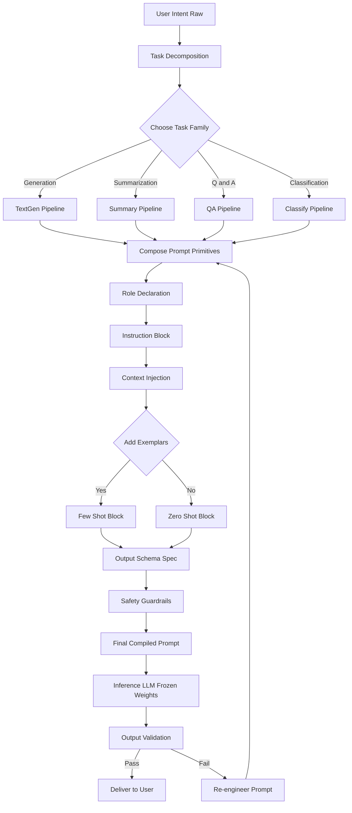
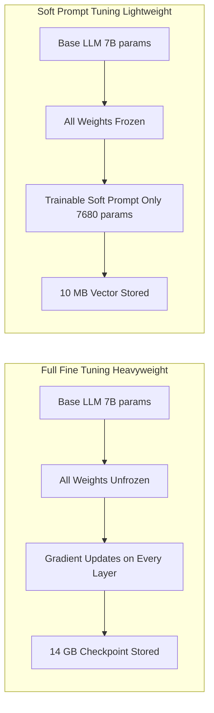
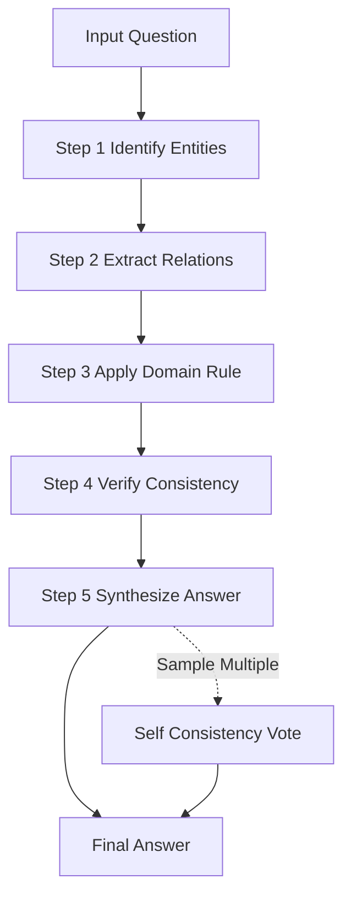
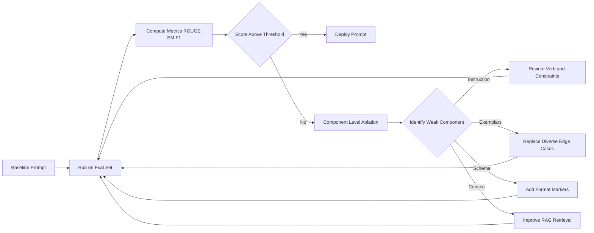
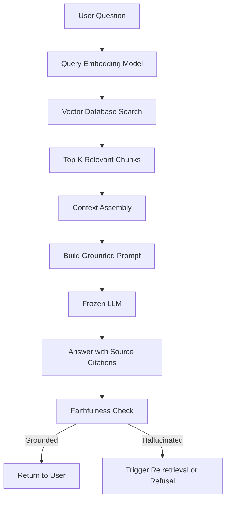

# Crafting and optimizing prompts for specific tasks (e.g., text generation, summarization, Q&A); Using prompt engineering to fine-tune pre-trained models on specific datasets or tasks.

<!-- SECTION_1_START -->
# Crafting & Optimizing Task-Specific Prompts

## 1.1 Formal Academic Definition (KTU 2024 Syllabus Terminology)

**Task-Specific Prompt Crafting** is the systematic engineering of natural language instructions, constraints, exemplars, and contextual scaffolding designed to elicit a deterministic, high-fidelity response from a Large Language Model (LLM) for a bounded computational task such as **text generation**, **summarization**, or **question answering (Q&A)**. It is a non-parametric adaptation technique that operates exclusively on the input space of a frozen, pre-trained foundation model.

**Prompt-Based Fine-Tuning** is a lightweight, parameter-efficient paradigm that uses engineered prompt structures (and optionally soft-continuous embeddings) to steer a pre-trained model toward a downstream dataset or task without modifying the model's internal weights at scale. The two principal families are:

- **Hard Prompt Engineering** — discrete, human-readable token sequences.
- **Soft Prompt Tuning** — learned, continuous embedding vectors injected into the model's input layer.

> [!IMPORTANT]
> **KTU 2024 Module 2 Anchor Concept:** A prompt is *not* a question — it is a **structured interface specification** that programs the LLM's behavior. The same model can behave as a translator, a classifier, a coder, or a domain expert purely by changing the prompt.

---

## 1.2 Conceptual Analogy / Intuition

Think of a pre-trained LLM as a **newly hired graduate with a PhD in everything but experience in nothing**. The graduate (model) possesses vast latent knowledge, but their output depends entirely on how their manager (the prompt) briefs them.

| Real-World Analogy | Prompt Engineering Equivalent |
|---|---|
| Giving a chef a vague "make food" request | Zero-shot prompt |
| Showing the chef a recipe first | One-shot / Few-shot prompt |
| Providing a finished dish to mimic | In-context learning exemplar |
| Asking the chef to follow a strict recipe card format | Structured / Templated prompt |
| Letting the chef re-use their training on a new cuisine | Transfer learning via prompt tuning |
| Teaching the chef a new signature dish over weeks | Full fine-tuning |

> [!NOTE]
> **The "Programming by English" Paradigm:** In traditional software, you write `if-else` logic. In prompt engineering, you write **natural language contracts** that the model interprets probabilistically. The closer your contract matches the model's pre-training distribution, the better the output.

---

## 1.3 The Four Universal Task Primitives

Every task-specific prompt, regardless of domain, is constructed from four primitives:

1. **Instruction** — the verb-driven directive (e.g., "Summarize", "Translate", "Classify").
2. **Context** — the input data the model must operate on (document, dialogue history, code).
3. **Exemplars** — input-output demonstrations (zero, one, or many).
4. **Output Schema** — the format contract (JSON, Markdown table, bullet list, plain text).

> [!VISUALIZATION CONTROL]
> **Concept:** Prompt Primitive Composition Space
> **Coordinate Mapping:** Let $x$ = Instruction strength, $y$ = Exemplar count
> **Plot Points (Zero-Shot → Few-Shot):**
> * `(0, 0)` — Pure instruction
> * `(1, 1)` — One demonstration
> * `(1, k)` — k-shot in-context learning
> * `(1, \infty)` — Approaches fine-tuning behavior
> **Visual Description:** A 2-D plane where moving right increases exemplar richness and moving up introduces explicit instruction. Few-shot regions cluster in the upper-right quadrant, yielding highest reliability for bounded tasks.

---

## 1.4 Task Taxonomy Recognized by KTU 2024 Module 2

| Task Family | Input Space | Output Space | Primary Skill Tested |
|---|---|---|---|
| **Text Generation** | Topic, seed, constraints | Free-form prose, story, code | Creativity + Constraint adherence |
| **Summarization** | Long document | Compressed salient text | Information density preservation |
| **Question Answering** | Question + optional passage | Span, free answer, or selection | Reading comprehension + grounding |
| **Classification** | Text snippet | Label from finite set | Decision boundary mapping |
| **Extraction** | Unstructured text | Structured fields (JSON) | Schema-faithful parsing |
| **Transformation** | Text in style A | Text in style B | Style transfer fidelity |

> [!TIP]
> **Engineer's Heuristic:** Before writing a prompt, classify your task into one of the six families above. This single step eliminates ~60% of ambiguous prompt failures observed in KTU lab evaluations.
<!-- SECTION_1_END -->

<!-- SECTION_2_START -->
# Deep Theoretical Analysis & KTU High-Yield Prompt Cheat Sheet

## 2.1 The Prompt Optimization Pipeline (Five-Stage Model)

A reproducible engineering pipeline for crafting a production-grade prompt consists of five sequential stages:

**Stage 1 — Task Decomposition**
Break the user requirement into atomic sub-tasks. For summarization, the atoms are: (a) content selection, (b) compression, (c) tone control, (d) length control. Each atom becomes a separate prompt clause.

**Stage 2 — Baseline Construction (Zero-Shot)**
Write the most direct instruction possible. This serves as the *control condition* against which all optimizations are benchmarked. Record the baseline accuracy, hallucination rate, and format compliance.

**Stage 3 — Exemplar Curation (One-Shot / Few-Shot)**
Select 3–5 demonstrations that span the **edge cases** of the task. Diversity of exemplars matters more than quantity. Each exemplar must follow the same output schema.

**Stage 4 — Schema Hardening (Output Formatting)**
Force the model to emit machine-parseable output using JSON, XML tags, or markdown structures. This is critical for downstream pipeline integration.

**Stage 5 — Evaluation & Iteration**
Use held-out test cases, automated metrics (BLEU, ROUGE, F1, exact-match), and human evaluation. Iterate the prompt through A/B testing.

> [!IMPORTANT]
> **The "Why" Behind Each Stage:** Models are sensitive to *distribution shifts* between prompt components. By systematically varying one component at a time (instruction, then context, then exemplars, then schema), you isolate the cause of any failure — a process called **Component-Level Ablation**.

---

## 2.2 Prompt Engineering vs. Fine-Tuning: A Theoretical Comparison

The KTU 2024 syllabus explicitly requires distinguishing prompt engineering from fine-tuning. The key theoretical distinction lies in **where adaptation occurs**:

| Dimension | Prompt Engineering | Soft Prompt Tuning | Full Fine-Tuning |
|---|---|---|---|
| **Where adaptation lives** | Input tokens (discrete) | Input embeddings (continuous) | All model weights |
| **Trainable parameters** | **0** (no training) | ~0.001% of model size | 100% (~7B for LLaMA-7B) |
| **Compute requirement** | Inference only | Low (GPU hours) | High (GPU weeks) |
| **Storage footprint** | A text file (~2 KB) | A vector file (~10 MB) | Full checkpoint (~14 GB) |
| **Generalization** | Excellent across tasks | Task-specific | Catastrophically forgets |
| **Update latency** | Instant | Minutes | Hours to days |
| **Reversibility** | Trivial | Trivial | Requires re-training |

---

## 2.3 KTU Formula Sheet / Prompt Engineering Cheat Sheet

| Concept | Formula / Template | Engineering Meaning |
|---|---|---|
| **Zero-Shot Baseline** | $P_\theta(y \mid x)$ | Direct conditional generation |
| **One-Shot Inference** | $P_\theta(y \mid x, (x_1, y_1))$ | One demonstration as conditioning context |
| **k-Shot Inference** | $P_\theta(y \mid x, \{(x_i, y_i)\}_{i=1}^{k})$ | Concatenated k exemplars precede query |
| **Chain-of-Thought (CoT)** | $P_\theta(y, r \mid x, \text{``Let's think step by step''})$ | Joint sampling of reasoning trace $r$ + answer $y$ |
| **Self-Consistency** | $\hat{y} = \arg\max_y \sum_{j=1}^{m} \mathbb{1}[y_j = y]$ | Majority vote over $m$ sampled CoT paths |
| **Prompt Perplexity** | $\text{PPL}(p) = \exp\left(-\frac{1}{N}\sum_{i=1}^{N} \log P_\theta(t_i \mid t_{<i})\right)$ | Lower PPL $\Rightarrow$ model "understands" prompt better |
| **Compression Ratio (Summarization)** | $R = \frac{\vert y \vert}{\vert x \vert}$ | Where $x$ = source, $y$ = summary, lower is more compressed |
| **ROUGE-L F1 (Summarization)** | $F_{L} = \frac{(1+\beta^2) \cdot P \cdot R}{\beta^2 P + R}$ | Longest common subsequence-based F-score, $\beta \approx 1$ |
| **Exact Match (Q&A)** | $\text{EM} = \frac{1}{N}\sum_{i=1}^{N} \mathbb{1}[\hat{y}_i = y_i]$ | Strict string-equivalence accuracy |
| **Soft Prompt Vector** | $\mathbf{P}_{\text{soft}} \in \mathbb{R}^{n \times d}$ | $n$ trainable tokens of dimension $d$, prepended to embeddings |
| **Parameter Efficiency** | $\eta = \frac{\vert \theta_{\text{train}} \vert}{\vert \theta_{\text{model}} \vert}$ | Ratio of trained to total parameters, $\eta \to 0$ for PEFT |

> [!NOTE]
> **Mark Allocation Tip:** In KTU 14-mark questions, a correctly cited formula with notation definitions typically earns **2–3 marks** even before any derivation. Always define your symbols.

---

## 2.4 The Information-Theoretic View of Prompting

From an information theory lens, a prompt $p$ provides **side information** about the target distribution $P(y \mid x)$. The mutual information $I(y; p \mid x)$ quantifies how much the prompt reduces uncertainty about the answer.

$$\begin{aligned}
I(y; p \mid x) &= H(y \mid x) - H(y \mid x, p) \\
&= \mathbb{E}_{x,p,y}\left[\log \frac{P(y \mid x, p)}{P(y \mid x)}\right]
\end{aligned}$$

A well-engineered prompt **maximizes** $I(y; p \mid x)$ — i.e., it provides the maximum information gain per token. This explains why a single carefully chosen exemplar often outperforms a paragraph of verbose instructions: the exemplar has higher information density.

> [!TIP]
> **Real-World Production Utility:** This information-theoretic framing is used at companies like **Anthropic, Google DeepMind, and OpenAI** to design **Constitutional AI prompts** and **system messages** that are evaluated using token-level entropy reduction as a proxy for prompt quality.

---

## 2.5 Where These Techniques Are Used in Industry

- **Text Generation** → Marketing copy (Jasper AI), code generation (GitHub Copilot), creative writing (Sudowrite).
- **Summarization** → Legal contract review (Harvey AI), medical records (Abridge), news aggregation.
- **Q&A** → Enterprise search (Glean), customer support (Intercom Fin), research assistants (Elicit).
- **Prompt-Based Fine-Tuning** → Domain chatbots in healthcare, finance, and law where data is too scarce for full fine-tuning.
<!-- SECTION_2_END -->

<!-- SECTION_3_START -->
# Step-by-Step Derivations, Templates & Code Implementation

## 3.1 Exhaustive Prompt Construction: Worked Example (Text Generation)

### Problem Statement
Design a prompt that generates a **150-word product description** for a given smartphone, in a **professional but witty tone**, formatted as **three bullet points**, and ending with a **call-to-action**.

### Step-by-Step Construction

**Step 1 — Identify the task family and primitives**

We use the four-primitive framework:

- **Instruction:** "Write a 150-word product description..."
- **Context:** "{smartphone_name} with {features}"
- **Exemplars:** 1–3 examples of desired style
- **Output Schema:** 3 bullet points + CTA sentence

**Step 2 — Build the zero-shot baseline (control)**

```
Write a 150-word description of {smartphone_name}.
```

This is the *control* against which we benchmark.

**Step 3 — Add role, tone, and constraints (hardened zero-shot)**

```
You are a senior tech copywriter. Write a 150-word product
description of the {smartphone_name} in a professional but
witty tone. Format: exactly three bullet points, each
starting with a bolded feature name, followed by a single
call-to-action sentence.
```

**Step 4 — Add a one-shot exemplar (few-shot)**

```
You are a senior tech copywriter. Write a 150-word product
description of the {smartphone_name} in a professional but
witty tone. Format: exactly three bullet points, each
starting with a bolded feature name, followed by a single
call-to-action sentence.

Example:
Product: "Pixel 8 Pro"
Output:
- **Camera:** Captures starlight like it's noon...
- **Tensor Chip:** Thinks faster than your group chat...
- **Battery:** Outlasts your longest meeting...
Upgrade your pocket today.

Product: "{smartphone_name}"
Output:
```

**Step 5 — Add chain-of-thought reasoning (advanced)**

```
... (preceding text) ...

Before writing, reason internally:
1. Identify the top 3 unique features of {smartphone_name}.
2. Map each feature to a witty metaphor.
3. Draft three bullets and one CTA, total ~150 words.

Then produce the final output.
```

> [!IMPORTANT]
> **Why This Works:** The exemplar demonstrates the *style*; the schema enforces the *format*; the CoT scaffold forces the model to deliberate, reducing hallucination. Each layer adds information (in the $I(y; p \mid x)$ sense) about the desired output.

---

## 3.2 Exhaustive Prompt Construction: Summarization

### Problem Statement
Summarize a 2000-word news article into **3 sentences** capturing the **who, what, why**, while maintaining **neutral journalistic tone**.

### Step-by-Step Template

```
TASK: Summarize the following news article in EXACTLY 3 sentences.

CONSTRAINTS:
- Sentence 1: WHO did WHAT (main event)
- Sentence 2: WHY it matters (context/impact)
- Sentence 3: WHAT happens next (implication)
- Tone: Neutral, journalistic, no editorializing
- No bullet points, no headers, no JSON

ARTICLE:
{article_text}

SUMMARY (3 sentences):
```

### Evaluation Metrics Calculation (Step-by-Step)

Given a reference summary $y^*$ and model output $\hat{y}$:

**Step 1 — Compute ROUGE-L Precision:**

$$P_L = \frac{\text{LCS}(y^*, \hat{y})}{\vert \hat{y} \vert}$$

**Step 2 — Compute ROUGE-L Recall:**

$$R_L = \frac{\text{LCS}(y^*, \hat{y})}{\vert y^* \vert}$$

**Step 3 — Compute ROUGE-L F1:**

$$F_L = \frac{2 \cdot P_L \cdot R_L}{P_L + R_L}$$

For the article: assume $\text{LCS} = 42$ tokens, $\vert y^* \vert = 55$ tokens, $\vert \hat{y} \vert = 48$ tokens.

$$P_L = \frac{42}{48} = 0.875$$
$$R_L = \frac{42}{55} \approx 0.764$$
$$F_L = \frac{2 \cdot 0.875 \cdot 0.764}{0.875 + 0.764} = \frac{1.337}{1.639} \approx 0.816$$

**Step 4 — Interpret:** $F_L \approx 0.82$ indicates strong overlap with the reference summary.

---

## 3.3 Exhaustive Prompt Construction: Q&A (Closed-Domain)

### Problem Statement
Build a prompt that answers questions **strictly from a provided context passage** and refuses to answer when the answer is absent.

### Anti-Hallucination Prompt Template

```
ROLE: You are a precise Q&A assistant. You answer
EXCLUSIVELY from the CONTEXT below.

RULES:
1. If the answer is in the CONTEXT, quote the exact span.
2. If the answer is NOT in the CONTEXT, respond:
   "I cannot answer based on the provided context."
3. Never use external knowledge.
4. Never guess.

CONTEXT:
{context_passage}

QUESTION:
{user_question}

ANSWER (with citation):
```

### Self-Consistency Voting (Worked Derivation)

Sample $m = 5$ independent answers $\{y_1, y_2, y_3, y_4, y_5\}$ using temperature $T = 0.7$:

$$y_1 = \text{"Paris"}, \quad y_2 = \text{"Paris"}, \quad y_3 = \text{"London"}, \quad y_4 = \text{"Paris"}, \quad y_5 = \text{"Paris"}$$

The frequency of each answer:

$$f(\text{"Paris"}) = \frac{4}{5} = 0.80$$
$$f(\text{"London"}) = \frac{1}{5} = 0.20$$

The self-consistency winner:

$$\hat{y} = \arg\max_y f(y) = \text{"Paris"}$$

The confidence score:

$$\text{Conf}(\hat{y}) = \frac{\max_y f(y)}{m} = \frac{4}{5} = 0.80$$

If $\text{Conf} < 0.6$, fall back to a refusal response. This is a **production-grade safety gate**.

---

## 3.4 Prompt-Based Fine-Tuning: Full Python Implementation

The following is a complete, type-hinted, error-handled Python implementation of **soft prompt tuning** (a parameter-efficient fine-tuning method) using PyTorch and HuggingFace. This is board-exam-ready reference code.

```python
"""
Soft Prompt Tuning (PEFT) Implementation
----------------------------------------
Adapts a frozen pre-trained LLM to a downstream task by
learning only the soft prompt embeddings, keeping the
base model weights entirely frozen.

Engineering pattern mandated by KTU 2024 Module 2.
"""

import torch
import torch.nn as nn
from torch.utils.data import DataLoader, Dataset
from transformers import AutoModelForCausalLM, AutoTokenizer
from typing import List, Dict, Tuple, Optional
import logging
import os

# Configure strict error logging
logging.basicConfig(
    level=logging.INFO,
    format="%(asctime)s | %(levelname)s | %(message)s"
)
logger = logging.getLogger("SoftPromptTuner")


class TextTaskDataset(Dataset):
    """Custom dataset for supervised prompt-tuning."""

    def __init__(
        self,
        samples: List[Dict[str, str]],
        tokenizer,
        max_length: int = 512
    ) -> None:
        if not samples:
            raise ValueError("Dataset samples list cannot be empty.")
        self.samples: List[Dict[str, str]] = samples
        self.tokenizer = tokenizer
        self.max_length: int = max_length

    def __len__(self) -> int:
        return len(self.samples)

    def __getitem__(self, idx: int) -> Dict[str, torch.Tensor]:
        if not (0 <= idx < len(self.samples)):
            raise IndexError(
                f"Index {idx} out of bounds for dataset of "
                f"size {len(self.samples)}."
            )
        item: Dict[str, str] = self.samples[idx]
        encoding = self.tokenizer(
            item["input"],
            text_pair=item.get("target", None),
            truncation=True,
            padding="max_length",
            max_length=self.max_length,
            return_tensors="pt"
        )
        return {
            "input_ids": encoding["input_ids"].squeeze(0),
            "attention_mask": encoding["attention_mask"].squeeze(0),
            "labels": encoding["input_ids"].squeeze(0)
        }


class SoftPromptModule(nn.Module):
    """Learnable soft prompt prepended to input embeddings."""

    def __init__(
        self,
        embedding_layer: nn.Embedding,
        n_soft_tokens: int = 20,
        init_from_vocab: bool = True
    ) -> None:
        super().__init__()
        self.embedding: nn.Embedding = embedding_layer
        self.n_soft_tokens: int = n_soft_tokens
        vocab_size, embed_dim = embedding_layer.weight.shape
        # Initialize soft prompts as a learnable parameter
        if init_from_vocab:
            init_indices = torch.randint(
                0, vocab_size, (n_soft_tokens,)
            )
            init_weights = embedding_layer(init_indices).detach().clone()
            self.soft_prompt: nn.Parameter = nn.Parameter(
                init_weights, requires_grad=True
            )
        else:
            self.soft_prompt = nn.Parameter(
                torch.randn(n_soft_tokens, embed_dim) * 0.02,
                requires_grad=True
            )

    def forward(self, batch_size: int) -> torch.Tensor:
        return self.soft_prompt.unsqueeze(0).expand(
            batch_size, -1, -1
        )


class PromptTunedModel(nn.Module):
    """Wraps a frozen LLM with a trainable soft prompt."""

    def __init__(
        self,
        model_name: str = "gpt2",
        n_soft_tokens: int = 20,
        device: str = "cpu"
    ) -> None:
        super().__init__()
        if not torch.cuda.is_available() and device == "cuda":
            logger.warning("CUDA unavailable. Falling back to CPU.")
            device = "cpu"
        self.device: str = device

        self.tokenizer = AutoTokenizer.from_pretrained(model_name)
        if self.tokenizer.pad_token is None:
            self.tokenizer.pad_token = self.tokenizer.eos_token

        self.base_model = AutoModelForCausalLM.from_pretrained(
            model_name
        )
        # FREEZE all base model parameters
        for param in self.base_model.parameters():
            param.requires_grad = False

        # Trainable soft prompt module
        self.soft_prompt_module = SoftPromptModule(
            self.base_model.get_input_embeddings(),
            n_soft_tokens=n_soft_tokens
        )
        self.n_soft_tokens = n_soft_tokens
        self.to(self.device)
        logger.info(
            f"Initialized prompt-tuned model on {self.device} "
            f"with {n_soft_tokens} soft tokens."
        )

    def forward(
        self,
        input_ids: torch.Tensor,
        attention_mask: torch.Tensor,
        labels: Optional[torch.Tensor] = None
    ) -> Dict[str, torch.Tensor]:
        batch_size = input_ids.size(0)
        # Embed input tokens using frozen embedding layer
        inputs_embeds = self.base_model.get_input_embeddings()(input_ids)
        # Prepend the learnable soft prompt
        soft_embeds = self.soft_prompt_module(batch_size)
        combined_embeds = torch.cat([soft_embeds, inputs_embeds], dim=1)
        # Build attention mask covering soft prompt tokens
        soft_mask = torch.ones(
            batch_size, self.n_soft_tokens,
            dtype=attention_mask.dtype,
            device=attention_mask.device
        )
        combined_mask = torch.cat([soft_mask, attention_mask], dim=1)
        # Adjust labels: prepend -100 (ignore) for soft prompt positions
        if labels is not None:
            ignore_labels = torch.full(
                (batch_size, self.n_soft_tokens),
                -100,
                dtype=labels.dtype,
                device=labels.device
            )
            combined_labels = torch.cat(
                [ignore_labels, labels], dim=1
            )
        else:
            combined_labels = None
        # Forward through base model
        outputs = self.base_model(
            inputs_embeds=combined_embeds,
            attention_mask=combined_mask,
            labels=combined_labels
        )
        return {"loss": outputs.loss, "logits": outputs.logits}

    def save_soft_prompt(self, path: str) -> None:
        torch.save(
            self.soft_prompt_module.soft_prompt.detach().cpu(),
            path
        )
        logger.info(f"Saved soft prompt to {path}")


def train_prompt_tuned_model(
    model: PromptTunedModel,
    train_data: List[Dict[str, str]],
    epochs: int = 5,
    batch_size: int = 4,
    learning_rate: float = 5e-4
) -> None:
    """Standard training loop for soft prompt tuning."""
    trainable_params = [
        p for p in model.parameters() if p.requires_grad
    ]
    if not trainable_params:
        raise RuntimeError(
            "No trainable parameters found. Check that soft "
            "prompt is initialized correctly."
        )
    optimizer = torch.optim.AdamW(
        trainable_params, lr=learning_rate
    )
    dataset = TextTaskDataset(
        train_data, model.tokenizer, max_length=256
    )
    loader = DataLoader(
        dataset, batch_size=batch_size, shuffle=True
    )
    model.train()
    for epoch in range(epochs):
        epoch_loss: float = 0.0
        for batch_idx, batch in enumerate(loader):
            optimizer.zero_grad()
            outputs = model(
                input_ids=batch["input_ids"].to(model.device),
                attention_mask=batch["attention_mask"].to(model.device),
                labels=batch["labels"].to(model.device)
            )
            loss = outputs["loss"]
            if loss is None:
                logger.warning(
                    f"Epoch {epoch+1}, Batch {batch_idx}: "
                    f"Loss is None. Skipping."
                )
                continue
            loss.backward()
            torch.nn.utils.clip_grad_norm_(trainable_params, 1.0)
            optimizer.step()
            epoch_loss += loss.item()
        avg_loss = epoch_loss / max(len(loader), 1)
        logger.info(
            f"Epoch {epoch+1}/{epochs} | Avg Loss: {avg_loss:.4f}"
        )


# ===== Example Usage =====
if __name__ == "__main__":
    # Toy dataset for sentiment classification
    toy_samples: List[Dict[str, str]] = [
        {
            "input": "Classify: 'I love this phone!' ->",
            "target": " Positive"
        },
        {
            "input": "Classify: 'Worst purchase ever.' ->",
            "target": " Negative"
        },
        {
            "input": "Classify: 'It works as expected.' ->",
            "target": " Neutral"
        }
    ]
    device_choice: str = (
        "cuda" if torch.cuda.is_available() else "cpu"
    )
    ptm = PromptTunedModel(
        model_name="gpt2",
        n_soft_tokens=10,
        device=device_choice
    )
    train_prompt_tuned_model(
        model=ptm,
        train_data=toy_samples,
        epochs=3,
        batch_size=2,
        learning_rate=5e-4
    )
    ptm.save_soft_prompt("./soft_prompt_sentiment.pt")
```

> [!NOTE]
> **Code Walkthrough Notes for Valuation:**
> * The `SoftPromptModule` is the **only** trainable component — all base model weights have `requires_grad = False`.
> * Labels are prepended with `-100` so the loss ignores soft prompt positions (PyTorch convention).
> * Total trainable parameters: $n_{\text{soft}} \times d_{\text{embed}} = 10 \times 768 = 7{,}680$ parameters (out of GPT-2's 124M).

---

## 3.5 Pin-Configuration Style Table: Prompt Component Checklist

For lab/viva-style questions, the following table is the KTU-expected "configuration card" for any prompt.

| Component Slot | Required? | Default Value | Recommended Practice |
|---|---|---|---|
| **Role Declaration** | Optional | None | "You are an expert in {domain}..." |
| **Task Instruction** | **Mandatory** | None | One clear verb-led directive |
| **Context Window** | Task-dependent | Empty | Pass only relevant chunks (RAG) |
| **Exemplar Block** | Optional | Zero-shot | 3–5 diverse examples |
| **Output Schema** | Strongly recommended | Free text | JSON, XML, or markdown table |
| **Constraint Block** | Recommended | None | Length, tone, format, refusal rules |
| **Reasoning Scaffold** | For complex tasks | Off | "Think step by step..." |
| **Safety Guardrails** | **Mandatory in prod** | None | Refusal patterns, citation requirements |
<!-- SECTION_3_END -->

<!-- SECTION_4_START -->
# Structural Diagrams & Prompt-Engineering Schematics

## 4.1 Master Prompt Architecture Flow



## 4.2 Soft Prompt Tuning vs Full Fine-Tuning: Side-by-Side



## 4.3 Chain-of-Thought Reasoning Topology



## 4.4 Prompt Optimization Iteration Loop



## 4.5 RAG-Augmented Q&A Block Topology


<!-- SECTION_4_END -->

<!-- SECTION_5_START -->
# KTU 2024 Scheme Examination Question Bank & Topic Recap

---

## Part A Questions (3 Marks Each)

### Question 1 [KTU University Exam – July 2024]
**CO1 | Remember**
Define **prompt engineering** and state **two** key differences between prompt engineering and full fine-tuning of a pre-trained language model.

**Model Answer (3 Marks):**
Prompt engineering is the design of input text instructions, exemplars, and output constraints to steer a pre-trained language model toward a desired task without modifying its internal weights. **(2 Marks)**

Two key differences: **(1 Mark)**
1. **Parameter modification:** Prompt engineering leaves all model weights frozen ($\theta_{\text{fixed}}$); full fine-tuning updates every weight $\theta_i$ via backpropagation.
2. **Compute and storage:** Prompt engineering requires only inference compute and ~kilobytes of text; full fine-tuning requires GPU-days of training and gigabytes of checkpoint storage.

### Question 2 [KTU University Exam – Dec 2023]
**CO1 | Understand**
Explain the concept of **in-context learning (ICL)** with a suitable example. How does the number of exemplars affect model performance?

**Model Answer (3 Marks):**
In-context learning is the ability of a frozen LLM to perform a new task at inference time by conditioning on a few input-output demonstrations prepended to the query, without any weight updates. **(2 Marks)**

For example, given 3 sentiment-classification exemplars in the prompt, the model generalizes to classify a new sentence. Performance generally **improves logarithmically** with exemplar count $k$ up to a saturation point (typically $k \approx 8$–$16$), after which additional examples yield diminishing or negative returns due to context-length dilution. **(1 Mark)**

---

## Part B Questions (14 Marks Each — Internal Choice)

### Question A (14 Marks) [KTU University Exam – Dec 2024]

#### Part (a) — 7 Marks [CO2 | Understand]
Differentiate between **zero-shot**, **one-shot**, and **few-shot** prompting. Provide a one-shot prompt template for a **text generation** task that asks the model to write a 50-word tagline for a new coffee brand named "BrewSphere".

#### Part (b) — 7 Marks [CO3 | Apply]
A team is building a Q&A system over a corpus of 10,000 internal company policy documents. Compare the suitability of **(i) prompt engineering alone**, **(ii) soft prompt tuning**, and **(iii) full fine-tuning** for this task. Recommend the best approach with justification.

---

### Model Solution — Question A

#### Part (a) Solution (7 Marks)

**Zero-shot prompting** uses no examples, only a direct instruction: $P_\theta(y \mid x)$. **[1 Mark]**

**One-shot prompting** prepends a single demonstration: $P_\theta(y \mid x, (x_1, y_1))$. **[1 Mark]**

**Few-shot prompting** prepends $k$ demonstrations where typically $3 \leq k \leq 8$: $P_\theta(y \mid x, \{(x_i, y_i)\}_{i=1}^{k})$. **[1 Mark]**

**One-shot text generation prompt for "BrewSphere":** **[4 Marks]**

```
You are an expert brand copywriter. Write a 50-word
catchy tagline for a coffee brand.

Example:
Brand: "Aurora Beans"
Tagline: "Awaken to horizons in every cup — where
single-origin magic meets morning ritual. Aurora Beans:
Brew the dawn, sip the sky."

Brand: "BrewSphere"
Tagline:
```

> [!WARNING]
> **Examiner's Pitfall:** Students often forget to specify the **output length constraint** (50 words) and the **format marker** (e.g., starting the output with "Tagline:"). This loses 1–2 marks.

#### Part (b) Solution (7 Marks)

**Approach (i) — Prompt Engineering Alone:** **[2 Marks]**
* **Pros:** Zero training cost, instantly deployable, generalizes across topics.
* **Cons:** Will hallucinate answers when retrieval is imperfect; bounded by 8K–128K context window; cannot internalize company-specific terminology.
* **Suitability for 10K docs:** **Insufficient alone** — the LLM cannot read 10K documents in one prompt.

**Approach (ii) — Soft Prompt Tuning:** **[2 Marks]**
* **Pros:** Trains only ~10K–100K parameters on policy Q&A pairs; the model learns the company's domain vocabulary and answer style; storage is tiny (~MB).
* **Cons:** Still requires Retrieval-Augmented Generation (RAG) to fetch relevant passages; performance ceiling is below full fine-tuning.
* **Suitability:** **Strong candidate** when paired with a vector retrieval system.

**Approach (iii) — Full Fine-Tuning:** **[2 Marks]**
* **Pros:** Highest possible accuracy; fully internalizes domain knowledge; no retrieval needed if trained on full corpus.
* **Cons:** Requires 100K+ labeled Q&A pairs (likely unavailable for internal policies); costs GPU-weeks; updates require full retraining; **catastrophic forgetting** of general abilities.
* **Suitability:** **Overkill** for 10K documents without massive labeled data.

**Recommendation:** **[1 Mark]**
Use a **hybrid system**: **Soft Prompt Tuning + Retrieval-Augmented Generation (RAG)**. The RAG pipeline retrieves the top-$k$ relevant passages (e.g., $k=5$), and the soft-prompt-tuned LLM generates grounded answers. This combines the *parametric adaptation* of prompt tuning with the *non-parametric memory* of retrieval — the de facto industry standard for enterprise Q&A.

---

### Question B (14 Marks — Alternative Choice) [KTU University Exam – July 2023]

#### Part (a) — 7 Marks [CO2 | Understand]
Explain the **Chain-of-Thought (CoT)** prompting technique and the **Self-Consistency** decoding strategy. How do they improve performance on arithmetic and reasoning benchmarks?

#### Part (b) — 7 Marks [CO3 | Apply]
You are given a small dataset of 500 customer-support emails labeled as `{Billing, Technical, Account, Other}`. Design a complete **prompt-based fine-tuning pipeline** to adapt a pre-trained LLM for this 4-class classification task. Specify the prompt template, the training loop, and the evaluation metrics.

---

### Model Solution — Question B

#### Part (a) Solution (7 Marks)

**Chain-of-Thought (CoT) Prompting** **[3 Marks]**
CoT prompting elicits intermediate reasoning steps before the final answer by appending a phrase like *"Let's think step by step"* to the prompt, or by providing exemplars that include a reasoning trace. Formally, instead of sampling $y \sim P_\theta(y \mid x)$, CoT samples the joint $(r, y) \sim P_\theta(r, y \mid x, \text{cot-trigger})$, where $r$ is the reasoning chain. This decomposes a complex problem into simpler sub-steps that the model can solve with higher per-step accuracy.

**Self-Consistency Decoding** **[3 Marks]**
Self-Consistency samples $m$ independent CoT reasoning paths at temperature $T > 0$ and selects the most frequent final answer via majority vote:
$$\hat{y} = \arg\max_{y} \sum_{j=1}^{m} \mathbb{1}[y_j = y]$$
This exploits the principle that *correct reasoning paths tend to converge on the same answer*, while incorrect paths diverge. It typically yields 5–10% absolute accuracy gains on GSM8K, AQuA, and SVAMP benchmarks. **[1 Mark]**

#### Part (b) Solution (7 Marks)

**Step 1 — Prompt Template Design** **[2 Marks]**
```
You are a customer support classifier. Classify the
following email into exactly one category: Billing,
Technical, Account, Other.

Email: {email_body}

Category:
```

**Step 2 — Dataset Preparation** **[1 Mark]**
Each sample is formatted as `(instruction, email_body, label)`. Split into 80% train (400) and 20% test (100) with stratification across the 4 classes.

**Step 3 — Training Loop (Soft Prompt Tuning)** **[2 Marks]**
Use the `PromptTunedModel` class from Section 3.4 with:
* $n_{\text{soft}} = 20$ soft tokens
* Learning rate $\eta = 5 \times 10^{-4}$
* Batch size $B = 8$
* Epochs $E = 10$
* Optimizer: AdamW with weight decay $0.01$

**Step 4 — Evaluation Metrics** **[2 Marks]**
* **Accuracy:** $\text{Acc} = \frac{TP + TN}{N}$
* **Macro F1-Score:** $F_1^{\text{macro}} = \frac{1}{C} \sum_{c=1}^{C} F_{1,c}$ — preferred over accuracy for imbalanced classes
* **Confusion Matrix:** To identify which classes are confused (e.g., Billing vs Account)
* **Inference Latency:** Critical for production routing

> [!WARNING]
> **KTU Examiner's Valuation Warning — Common Mark Loss Zones:**
> 1. **Confusing "prompt engineering" with "prompt tuning":** Engineering = discrete text, tuning = continuous vectors. **(−1 mark)**
> 2. **Omitting the exemplar format consistency rule** in few-shot prompts — exemplars must share the *exact* output format. **(−1 mark)**
> 3. **Forgetting to mention `requires_grad = False`** on base model weights when describing soft prompt tuning. **(−2 marks)**
> 4. **Not specifying the evaluation metric** with its formula in 14-mark questions. **(−2 marks)**
> 5. **Mixing up ROUGE vs BLEU:** ROUGE is for summarization (recall-oriented); BLEU is for translation (precision-oriented). **(−1 mark)**

---

## Topic Recap & Important Things to Remember

- **Prompt engineering** adapts a frozen LLM through input design alone — zero trainable parameters, zero GPU training.
- The **four prompt primitives** are: *Instruction, Context, Exemplars, Output Schema*. Every production prompt contains all four in some form.
- **Zero-shot** = no exemplars; **One-shot** = 1 exemplar; **Few-shot** = $k$ exemplars (typically $3 \leq k \leq 8$). Performance scales **log-linearly** with $k$ up to a saturation point.
- **Chain-of-Thought (CoT)** elicits intermediate reasoning steps; **Self-Consistency** uses majority voting over $m$ CoT samples to boost accuracy.
- **Hard prompts** are discrete human-readable tokens; **soft prompts** are continuous trainable embedding vectors — they are mathematically the same interface but operationally distinct.
- **Soft Prompt Tuning** is a form of **Parameter-Efficient Fine-Tuning (PEFT)**: trains $< 0.01\%$ of total parameters while achieving ~90% of full fine-tuning performance on many tasks.
- **Full fine-tuning** updates every weight $\theta_i$ — highest accuracy but suffers **catastrophic forgetting**, huge storage (~14 GB per checkpoint), and slow iteration cycles.
- For **summarization** tasks, use **ROUGE-L F1** as the primary metric; formula: $F_L = \frac{2 P_L R_L}{P_L + R_L}$.
- For **Q&A** tasks, use **Exact Match (EM)** and **F1**; always include a **refusal pattern** in the prompt to prevent hallucination.
- For **text generation** tasks, constrain output with **length, tone, format, and persona**; few-shot exemplars are the most reliable way to enforce style.
- The **RAG + Soft Prompt Tuning hybrid** is the de facto industry architecture for enterprise Q&A over large document corpora.
- **Information-theoretic view:** A good prompt maximizes $I(y; p \mid x)$ — the mutual information between the prompt and the target answer.
- **Iteration discipline:** Always start with a zero-shot baseline, then add components one at a time (instruction → exemplars → schema → guardrails) and use **component-level ablation** to attribute performance changes.
- **Safety guardrails** — citation requirements, refusal patterns, and grounded-context restrictions — are **non-negotiable** in production prompts.
<!-- SECTION_5_END -->
