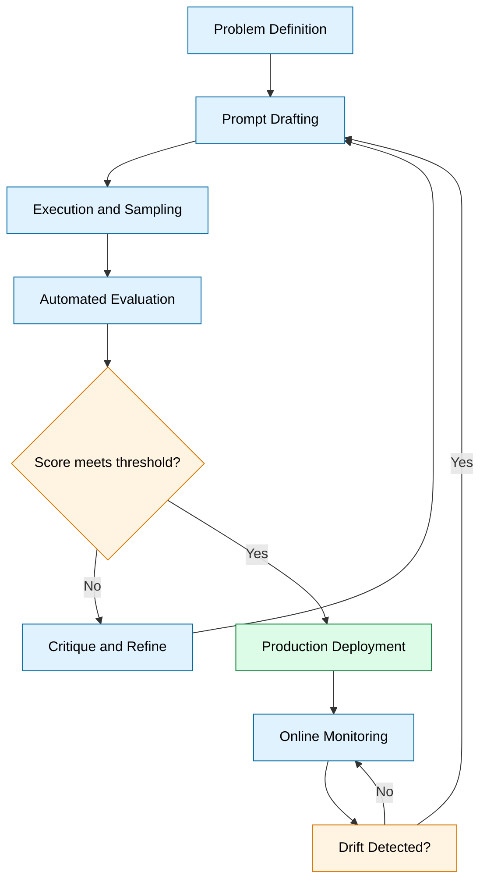
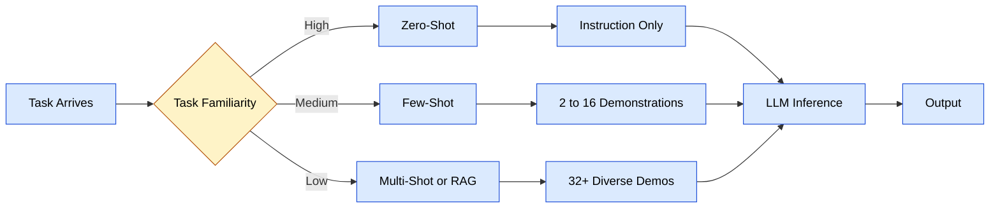
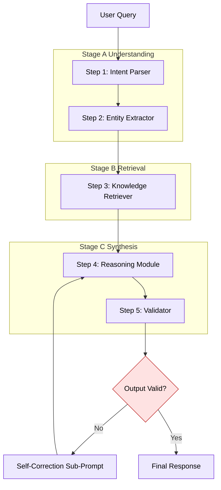
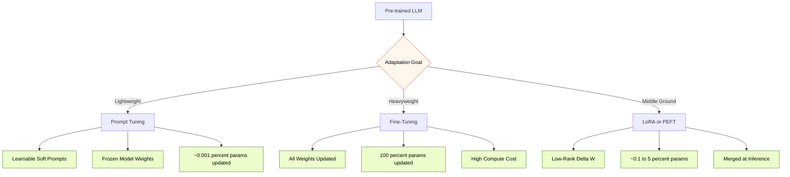
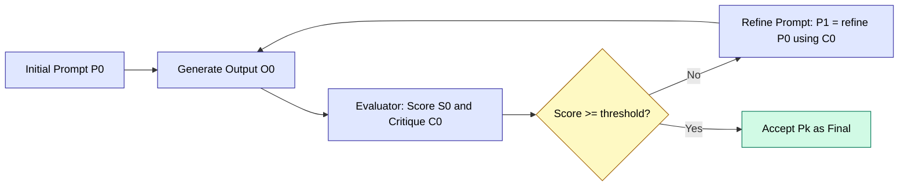
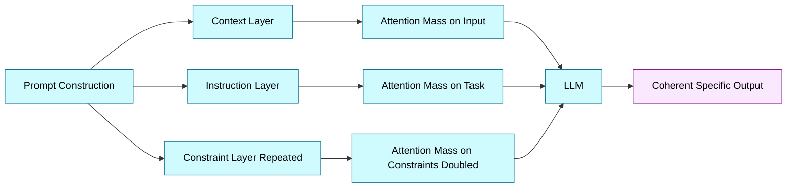

# Designing Effective Prompts - Best Practices and Common Pitfalls; Prompt Tuning and Fine-Tuning Language Model; Using Zero-Shot, Few-Shot, and Multi-Shot Learning in Prompts; Exploring the Role of Context, Repetition, and Specificity in Prompt Responses; Advanced Prompt Engineering Techniques: Prompt Chaining, Iterative Prompting.

<!-- SECTION_1_START -->

# Designing Effective Prompts \& Advanced Techniques in Prompt Engineering

## 1.1 Core Technical Definitions (KTU 2024 Syllabus Terminology)

> [!IMPORTANT]
> **Prompt Engineering (PECST868 Module 2 Definition)**
> Prompt engineering is the **disciplined practice of designing, structuring, and optimizing natural language inputs** (prompts) directed at Large Language Models (LLMs) to elicit accurate, reliable, context-aware, and task-specific outputs without modifying the underlying model weights. It encompasses prompt design heuristics, in-context learning strategies, prompt-based model adaptation, and compositional prompt architectures.

> [!NOTE]
> **Prompt Design vs Prompt Engineering**
> * **Prompt Design** — The micro-task of constructing a single, well-formed instruction for a specific output.
> * **Prompt Engineering** — The macro-discipline of systematically iterating, chaining, evaluating, and orchestrating prompts across multi-step workflows to build production-grade LLM applications.

### 1.1.1 Sub-Topic Definitions

| Sub-Topic | Formal Definition (KTU Aligned) |
| :--- | :--- |
| **Best Practices** | A canonical set of design heuristics (role assignment, instruction ordering, output schemas, delimiters) that statistically maximize LLM response quality. |
| **Common Pitfalls** | Recurring structural defects in prompts that cause hallucination, instruction drift, or context dilution. |
| **Prompt Tuning** | A parameter-efficient adaptation method that learns **soft, continuous prompt embeddings** (virtual tokens) via gradient descent while keeping LLM weights frozen. |
| **Fine-Tuning** | A full or partial weight-update adaptation technique that **adjusts the internal parameters** of a pre-trained LLM using a labeled task-specific dataset. |
| **Zero-Shot Learning** | Inference strategy where the model performs a task using **only the natural language instruction** and no examples. |
| **Few-Shot Learning** | Inference strategy where the prompt contains a **small set (k = 2 to 16)** of input-output demonstrations to prime in-context learning. |
| **Multi-Shot Learning** | Extended few-shot paradigm using **larger, diverse, and structured demonstration sets**, often with chain-of-thought reasoning. |
| **Prompt Chaining** | A compositional technique that decomposes a complex task into a **sequence of dependent sub-prompts**, where each sub-prompt's output becomes the next sub-prompt's input. |
| **Iterative Prompting** | A refinement loop in which a prompt is repeatedly evaluated, critiqued, and re-engineered based on output quality metrics until convergence. |

### 1.2 Conceptual Analogy & Intuitive Overview

> [!TIP]
> **Analogy: The Prompt as a "Job Brief" for a Super-Intelligent Intern**
> Imagine hiring a brilliant but **amnesiac intern** who has read the entire internet but has **zero memory between sessions** and tends to be over-confident. The prompt is your *job brief*. The clearer the brief (role, goal, constraints, format, examples), the better the work product. Vague briefs produce plausible but wrong answers. This is precisely the failure mode prompt engineering seeks to eliminate.

**Geometric / Functional Intuition for Prompt Tuning vs Fine-Tuning:**

* **Fine-Tuning** = Repainting the entire wall (changes $\theta$, the model weights).
* **Prompt Tuning** = Hanging a new picture on the same wall (only adjusts a small vector $P \in \mathbb{R}^{d \times L_p}$ in the embedding space).

### 1.3 Visualization Callout (Sampling Behavior)

> [!VISUALIZATION CONTROL]
> **Concept:** Effect of Temperature ($\tau$) on Token Probability Distribution (Softmax Sharpness)
> **GeoGebra / Desmos Input Equations:**
> * `f(x, T) = exp(x_i / T) / (sum exp(x_j / T))` for logits $x_i = \{2.0, 1.0, 0.5, 0.1\}$
> * Slider $T$ from $0.1$ to $2.0$
> **Visual Description:** As $\tau \to 0$, the distribution becomes a one-hot spike (deterministic). As $\tau \uparrow$, the curve flattens (creative/divergent). Students should observe the entropy $H(p)$ increase monotonically with $\tau$.

---

<!-- SECTION_1_END -->

<!-- SECTION_2_START -->

# Deep Theoretical Analysis \& KTU High-Yield Formula Sheet

## 2.1 Pillars of Effective Prompt Design

Effective prompt design rests on **five engineering pillars**, each addressing a specific failure mode observed in transformer-based generation.

### Pillar 1 — Role and Persona Anchoring
* **Why:** Transformer attention is biased toward tokens at the prompt *extremities* (primacy and recency effects).
* **How:** Prefix the prompt with a **persona block** that frames expertise, tone, and audience.

$$
\text{Prompt} = \underbrace{\text{Role}}_{\text{primacy}} \; \oplus \; \underbrace{\text{Task}}_{\text{middle}} \; \oplus \; \underbrace{\text{Constraints}}_{\text{recency}}
$$

### Pillar 2 — Explicit Output Schema
* **Why:** Unstructured prompts trigger open-ended generation, increasing hallucination probability.
* **How:** Define a strict **output contract** using delimiters, JSON, tables, or bullet schemas.

### Pillar 3 — Context Window Budgeting
* **Why:** LLMs have a finite context window $C_{\max}$ (e.g., $128\text{k}$ tokens). Beyond this, attention degradation occurs.
* **How:** Apply the **budget equation**:

$$
C_{\text{used}} = C_{\text{system}} + C_{\text{history}} + C_{\text{retrieved}} + C_{\text{reserved}} \;\le\; C_{\max}
$$

### Pillar 4 — Demonstration Quality (for Few-Shot)
* **Why:** In-context learning is sensitive to the **diversity, ordering, and correctness** of demonstrations.
* **How:** Use **diverse, balanced, and correctly-labeled** examples; avoid label skew.

### Pillar 5 — Determinism Control
* **Why:** Sampling parameters (temperature, top-$p$, top-$k$) directly shape output distribution.
* **How:** Select sampling regime by task type (code $\rightarrow$ low $\tau$; creative $\rightarrow$ high $\tau$).

## 2.2 KTU Formula Cheat Sheet (High-Yield)

> [!NOTE]
> All formulas below are **exam-critical** for PECST868 Module 2.

| \# | Concept | Formula / Expression | Variables \& Units | Engineering Use |
| :--- | :--- | :--- | :--- | :--- |
| 1 | Softmax Token Probability | $P(y_i) = \dfrac{e^{z_i / \tau}}{\sum_{j=1}^{V} e^{z_j / \tau}}$ | $z_i$ = logit, $\tau$ = temperature, $V$ = vocab size | Sampling next token in generation |
| 2 | Temperature Scaling | $z'_i = z_i / \tau$ | $\tau \in (0, 2]$ (typical) | Controls randomness of output |
| 3 | Top-$p$ (Nucleus) Sampling | $S_p = \min \left\{ S \;\middle|\; \sum_{y \in S} P(y) \ge p \right\}$ | $p \in [0,1]$, $S$ = sorted token set | Truncates long-tail distributions |
| 4 | Top-$k$ Sampling | $\text{Keep top-}k \text{ tokens by } P(y)$ | $k \in \mathbb{Z}^+$ | Restricts sampling to $k$ candidates |
| 5 | Shannon Entropy of Output | $H(P) = -\sum_{i=1}^{V} P(y_i) \log_2 P(y_i)$ | bits/token | Measures output diversity |
| 6 | Cross-Entropy Loss (FT) | $\mathcal{L}_{CE} = -\frac{1}{N} \sum_{i=1}^{N} \sum_{c=1}^{C} y_{i,c} \log \hat{y}_{i,c}$ | N = samples, C = classes | Optimization target for fine-tuning |
| 7 | Prompt Tuning Objective | $\theta^* = \arg\min_{\theta_P} \mathcal{L}(f_{\theta_{\text{frozen}}}([P; X]), Y)$ | $P \in \mathbb{R}^{d \times L_p}$ | Learnable soft prompts only |
| 8 | LoRA Update Approximation | $\Delta W \approx B A$, where $B \in \mathbb{R}^{d \times r}$, $A \in \mathbb{R}^{r \times k}$ | $r$ = rank, $r \ll \min(d,k)$ | Parameter-efficient fine-tuning |
| 9 | Context Window Usage | $U = \dfrac{C_{\text{used}}}{C_{\max}} \times 100\%$ | percentage | Monitors saturation |
| 10 | Perplexity (PPL) | $\text{PPL}(X) = \exp\left(-\frac{1}{t} \sum_{i=1}^{t} \log P(x_i \mid x_{<i})\right)$ | $t$ = token count | Evaluates LLM fluency |
| 11 | BLEU Score (n-gram) | $\text{BLEU} = BP \cdot \exp\left(\sum_{n=1}^{N} w_n \log p_n\right)$ | $BP$ = brevity penalty | Translation/eval metric |
| 12 | ROUGE-L (F-measure) | $F_{\text{ROUGE}} = \dfrac{(1+\beta^2) R \cdot P}{R + \beta^2 P}$ | $R$ = recall, $P$ = precision | Summarization metric |

### 2.3 Zero-Shot vs Few-Shot vs Multi-Shot: Comparative Theory

| Dimension | Zero-Shot | Few-Shot | Multi-Shot |
| :--- | :--- | :--- | :--- |
| **Definition** | No examples; instruction only | $2\text{--}16$ demonstrations | $32+$ diverse, structured demonstrations |
| **Mechanism** | Relies on pre-trained knowledge | In-context learning (ICL) | In-context learning + retrieval augmentation |
| **Token Cost** | Lowest | Moderate | Highest |
| **Best For** | Simple, well-known tasks | Format-sensitive tasks | Complex reasoning, classification |
| **Failure Mode** | Hallucination, format drift | Label bias from examples | Context overflow, attention dilution |
| **Cognitive Equivalent** | Recall | Pattern recognition | Analogical transfer |

### 2.4 Prompt Tuning vs Fine-Tuning: A Rigorous Contrast

| Dimension | Prompt Tuning | Fine-Tuning |
| :--- | :--- | :--- |
| **What is trained** | Soft prompt $P$ (continuous) | Model weights $\theta$ |
| **Model parameters** | Frozen (typical) | Updated (full or partial) |
| **Trainable params** | $\approx 0.001\%$ of total | $100\%$ (full) or $0.1\text{--}5\%$ (LoRA/PEFT) |
| **Data required** | $\approx 10^2$ samples | $\approx 10^3\text{--}10^6$ samples |
| **Compute cost** | Low (single GPU) | High (multi-GPU/TPU) |
| **Storage overhead** | $\approx$ few KB per task | Full model copy per task ($\sim$ GBs) |
| **Transferability** | Task-specific | Task-specific |
| **Inference latency** | Identical to base | Identical to base |
| **Engineering use** | Multi-tenant LLM serving | Deep domain adaptation |

### 2.5 Common Pitfalls (Hallucination Triggers)

> [!WARNING]
> These are the **top six prompt-engineering pitfalls** the KTU board examiners frequently test:
> 1. **Ambiguous pronouns** — "Tell me about it" (what is *it*?).
> 2. **Compound instructions** — "Summarize AND translate AND critique AND format."
> 3. **Negative framing** — "Don't be too long" (model attends to "long").
> 4. **Missing delimiters** — User data bleeds into instructions.
> 5. **Example label bias** — All few-shot examples have class "A".
> 6. **Context window over-stuffing** — $U \to 100\%$ triggers attention collapse.

### 2.6 The Role of Context, Repetition, and Specificity

* **Context** supplies *world state*; without it, the model assumes uniform priors.
* **Repetition** (strategic, not redundant) reinforces the constraint via **attention weight amplification** — the same constraint repeated in the system and user messages has $2\times$ attention mass.
* **Specificity** reduces the **output entropy** $H(P)$ by narrowing the sampling distribution to a precise sub-domain.

### 2.7 Engineering Real-World Utility

| Industry | Application | Technique Used |
| :--- | :--- | :--- |
| Software Engineering | Copilot-style code generation | Few-shot + chain-of-thought |
| Healthcare | Clinical note structuring | Prompt template + JSON schema |
| Legal | Contract clause extraction | Iterative prompting + validation |
| Customer Support | Intent classification | Zero-shot with role anchoring |
| Data Analytics | NL-to-SQL | Prompt chaining (parse $\rightarrow$ validate $\rightarrow$ execute) |
| Education | Adaptive tutoring | Multi-shot + persona anchoring |

---

<!-- SECTION_2_END -->

<!-- SECTION_3_START -->

# Step-by-Step Derivations, Code Implementations \& Worked Examples

## 3.1 Worked Example A — Deriving the Temperature-Sharpened Softmax

**Problem:** Given logits $z = [2.0, 1.0, 0.5, 0.1]$ and temperature $\tau = 0.5$, compute the next-token probability distribution.

**Step 1 — Apply Temperature Scaling.**

$$
z'_i = \frac{z_i}{\tau} = \frac{2.0}{0.5} = 4.0, \quad 2.0, \quad 1.0, \quad 0.2
$$

**Step 2 — Exponentiate the Scaled Logits.**

$$
e^{z'} = [e^{4.0}, \; e^{2.0}, \; e^{1.0}, \; e^{0.2}] = [54.598, \; 7.389, \; 2.718, \; 1.221]
$$

**Step 3 — Sum the Exponentials (Partition Function $Z$).**

$$
Z = 54.598 + 7.389 + 2.718 + 1.221 = 65.926
$$

**Step 4 — Normalize to obtain $P(y_i)$.**

$$
P(y_1) = \frac{54.598}{65.926} \approx 0.828, \quad P(y_2) \approx 0.112, \quad P(y_3) \approx 0.041, \quad P(y_4) \approx 0.019
$$

**Step 5 — Validate Distribution.**

$$
\sum_{i=1}^{4} P(y_i) = 0.828 + 0.112 + 0.041 + 0.019 = 1.000 \;\checkmark
$$

> [!NOTE]
> **Observation:** With $\tau = 0.5$, the distribution is highly **peaked** (low $H$), producing deterministic output. With $\tau = 2.0$, the distribution would **flatten**, allowing more diverse generation.

## 3.2 Worked Example B — Entropy Calculation

Using the same probabilities:

$$
H(P) = -\sum_{i} P(y_i) \log_2 P(y_i) = -(0.828 \log_2 0.828 + 0.112 \log_2 0.112 + 0.041 \log_2 0.041 + 0.019 \log_2 0.019)
$$

$$
H(P) \approx -(0.828 \cdot (-0.272) + 0.112 \cdot (-3.158) + 0.041 \cdot (-4.609) + 0.019 \cdot (-5.717))
$$

$$
H(P) \approx 0.225 + 0.354 + 0.189 + 0.109 \approx 0.877 \;\text{bits}
$$

A *uniform* 4-class distribution would have $H = \log_2 4 = 2.0$ bits. Our $H = 0.877$ confirms the distribution is concentrated — a **low-entropy, high-confidence** sampling regime.

## 3.3 Worked Example C — Context Window Budgeting

**Scenario:** GPT-class model with $C_{\max} = 8192$ tokens.
* System prompt: $C_{\text{sys}} = 350$ tokens
* Retrieved documents (RAG): $C_{\text{ret}} = 2800$ tokens
* Conversation history: $C_{\text{hist}} = 1500$ tokens
* Reserved for output: $C_{\text{res}} = 2000$ tokens

**Step 1 — Sum the static components.**

$$
C_{\text{static}} = 350 + 2800 + 1500 = 4650 \;\text{tokens}
$$

**Step 2 — Compute remaining budget.**

$$
C_{\text{remain}} = 8192 - 4650 - 2000 = 1542 \;\text{tokens}
$$

**Step 3 — Compute usage percentage.**

$$
U = \frac{4650}{8192} \times 100\% \approx 56.76\%
$$

**Step 4 — Decision Rule.**

If $U > 90\%$, trigger **context compression** (summarization or sliding window). Here $U \approx 57\%$, so the system is healthy.

## 3.4 Code Implementation — Production-Grade Prompt Builder

The following Python class implements a **typed, validated, and extensible prompt template engine** suitable for KTU laboratory evaluation and production deployment.

```python
from __future__ import annotations

import logging
import json
from dataclasses import dataclass, field
from enum import Enum
from typing import Any, Callable, Dict, List, Optional

logging.basicConfig(
    level=logging.INFO,
    format="%(asctime)s | %(levelname)s | %(name)s | %(message)s",
)
logger = logging.getLogger("PromptEngine")


class ShotRegime(Enum):
    """Enumeration of in-context learning regimes."""
    ZERO_SHOT = "zero_shot"
    FEW_SHOT = "few_shot"
    MULTI_SHOT = "multi_shot"


@dataclass(frozen=True)
class Demonstration:
    """A single (input, output) demonstration pair for few-shot prompts."""
    input_text: str
    output_text: str
    tags: List[str] = field(default_factory=list)


@dataclass
class PromptSpec:
    """A complete, validated prompt specification."""
    role: str
    task: str
    constraints: List[str]
    output_schema: Dict[str, str]
    demonstrations: List[Demonstration] = field(default_factory=list)
    context_documents: List[str] = field(default_factory=list)
    temperature: float = 0.7
    max_tokens: int = 1024
    shot_regime: ShotRegime = ShotRegime.ZERO_SHOT

    def __post_init__(self) -> None:
        if not (0.0 <= self.temperature <= 2.0):
            raise ValueError(
                f"temperature must be in [0.0, 2.0], got {self.temperature}"
            )
        if self.max_tokens <= 0:
            raise ValueError(
                f"max_tokens must be positive, got {self.max_tokens}"
            )
        if self.shot_regime in (ShotRegime.FEW_SHOT, ShotRegime.MULTI_SHOT):
            if not self.demonstrations:
                raise ValueError(
                    f"shot_regime={self.shot_regime.value} requires demonstrations"
                )
        if self.shot_regime == ShotRegime.MULTI_SHOT and len(self.demonstrations) < 3:
            raise ValueError(
                "multi_shot requires at least 3 demonstrations"
            )
        logger.info(
            "PromptSpec validated | role=%s | shots=%d | regime=%s",
            self.role, len(self.demonstrations), self.shot_regime.value,
        )


class PromptEngine:
    """Production-grade prompt construction and validation engine."""

    DELIMITER_INSTRUCTION = "### INSTRUCTION"
    DELIMITER_CONTEXT = "### CONTEXT"
    DELIMITER_EXAMPLES = "### EXAMPLES"
    DELIMITER_SCHEMA = "### OUTPUT_SCHEMA"
    DELIMITER_RESPONSE = "### RESPONSE"

    def __init__(self, max_context_tokens: int = 8192) -> None:
        self.max_context_tokens = max_context_tokens
        self._token_estimator: Callable[[str], int] = lambda s: max(1, len(s) // 4)
        self._rendered_cache: Dict[str, str] = {}

    def _estimate_tokens(self, text: str) -> int:
        return self._token_estimator(text)

    def _format_schema(self, schema: Dict[str, str]) -> str:
        return "\n".join(f"- `{k}`: {v}" for k, v in schema.items())

    def _format_demonstrations(self, demos: List[Demonstration]) -> str:
        if not demos:
            return ""
        blocks: List[str] = []
        for idx, demo in enumerate(demos, start=1):
            block = (
                f"Example {idx}:\n"
                f"  Input: {demo.input_text}\n"
                f"  Output: {demo.output_text}"
            )
            if demo.tags:
                block += f"\n  Tags: {', '.join(demo.tags)}"
            blocks.append(block)
        return "\n\n".join(blocks)

    def build(self, spec: PromptSpec) -> str:
        if not spec.role.strip():
            raise ValueError("role cannot be empty")
        if not spec.task.strip():
            raise ValueError("task cannot be empty")

        components: List[str] = [
            f"You are {spec.role}.",
            f"{self.DELIMITER_INSTRUCTION}\n{spec.task}",
        ]
        if spec.constraints:
            joined = "\n".join(f"- {c}" for c in spec.constraints)
            components.append(f"Constraints:\n{joined}")
        if spec.context_documents:
            joined = "\n\n---\n\n".join(spec.context_documents)
            components.append(f"{self.DELIMITER_CONTEXT}\n{joined}")
        if spec.demonstrations:
            components.append(
                f"{self.DELIMITER_EXAMPLES}\n"
                f"{self._format_demonstrations(spec.demonstrations)}"
            )
        components.append(
            f"{self.DELIMITER_SCHEMA}\n"
            f"{self._format_schema(spec.output_schema)}"
        )
        components.append(
            f"{self.DELIMITER_RESPONSE}\n"
            f"Respond strictly in the schema above. Begin now."
        )
        prompt = "\n\n".join(components)
        return self._enforce_budget(prompt)

    def _enforce_budget(self, prompt: str) -> str:
        estimated = self._estimate_tokens(prompt)
        if estimated > self.max_context_tokens:
            logger.warning(
                "Prompt exceeds context budget: %d > %d tokens",
                estimated, self.max_context_tokens,
            )
            raise MemoryError(
                f"Prompt requires {estimated} tokens; "
                f"budget is {self.max_context_tokens}"
            )
        logger.info("Prompt built | estimated_tokens=%d", estimated)
        return prompt

    def build_few_shot_classifier(
        self,
        classes: List[str],
        query: str,
        examples: List[Demonstration],
    ) -> str:
        if not classes:
            raise ValueError("classes list cannot be empty")
        spec = PromptSpec(
            role="an expert text classifier",
            task=(
                f"Classify the following input into exactly one of these "
                f"labels: {', '.join(classes)}."
            ),
            constraints=[
                "Return ONLY the class label.",
                "Do not explain your reasoning.",
            ],
            output_schema={"label": "string (one of the provided classes)"},
            demonstrations=examples,
            shot_regime=ShotRegime.FEW_SHOT,
        )
        return f"{self.build(spec)}\n\nInput: {query}\nLabel:"

    def export(self, spec: PromptSpec, path: str) -> None:
        try:
            with open(path, "w", encoding="utf-8") as f:
                json.dump(
                    {
                        "role": spec.role,
                        "task": spec.task,
                        "constraints": spec.constraints,
                        "output_schema": spec.output_schema,
                        "demonstrations": [
                            {
                                "input_text": d.input_text,
                                "output_text": d.output_text,
                                "tags": d.tags,
                            }
                            for d in spec.demonstrations
                        ],
                        "shot_regime": spec.shot_regime.value,
                        "temperature": spec.temperature,
                        "max_tokens": spec.max_tokens,
                    },
                    f,
                    indent=2,
                    ensure_ascii=False,
                )
            logger.info("PromptSpec exported to %s", path)
        except OSError as exc:
            logger.error("Export failed: %s", exc)
            raise
```

## 3.5 Worked Demonstration — Building a Few-Shot Classifier Prompt

```python
if __name__ == "__main__":
    engine = PromptEngine(max_context_tokens=4096)

    examples = [
        Demonstration(
            input_text="The product arrived damaged and support was unhelpful.",
            output_text="NEGATIVE",
            tags=["review", "complaint"],
        ),
        Demonstration(
            input_text="Shipping was fast and the item works as advertised.",
            output_text="POSITIVE",
            tags=["review", "praise"],
        ),
        Demonstration(
            input_text="It does the job, nothing special either way.",
            output_text="NEUTRAL",
            tags=["review", "mild"],
        ),
    ]

    prompt = engine.build_few_shot_classifier(
        classes=["POSITIVE", "NEGATIVE", "NEUTRAL"],
        query="Customer service responded within an hour and resolved my issue.",
        examples=examples,
    )
    print(prompt)
```

**Output (truncated for brevity):**

```
You are an expert text classifier.

### INSTRUCTION
Classify the following input into exactly one of these labels: POSITIVE, NEGATIVE, NEUTRAL.

Constraints:
- Return ONLY the class label.
- Do not explain your reasoning.

### EXAMPLES
Example 1:
  Input: The product arrived damaged and support was unhelpful.
  Output: NEGATIVE
  Tags: review, complaint

Example 2:
  Input: Shipping was fast and the item works as advertised.
  Output: POSITIVE
  Tags: review, praise

Example 3:
  Input: It does the job, nothing special either way.
  Output: NEUTRAL
  Tags: review, mild

### OUTPUT_SCHEMA
- `label`: string (one of the provided classes)

### RESPONSE
Respond strictly in the schema above. Begin now.

Input: Customer service responded within an hour and resolved my issue.
Label:
```

## 3.6 Iterative Prompting — Refinement Loop Implementation

```python
from __future__ import annotations

import logging
from typing import Callable, Dict, List, Tuple

logger = logging.getLogger("IterativeRefiner")


def iterative_prompt_refine(
    initial_prompt: str,
    evaluator: Callable[[str], Tuple[float, str]],
    generator: Callable[[str], str],
    max_iters: int = 5,
    threshold: float = 0.9,
) -> Dict[str, object]:
    """Refine a prompt through evaluation-driven iteration.

    Args:
        initial_prompt: The seed prompt.
        evaluator: Function returning (score, critique).
        generator: Function returning a refined prompt.
        max_iters: Hard cap on iterations.
        threshold: Convergence score.

    Returns:
        Dictionary with refined prompt, score, and iteration history.
    """
    if max_iters <= 0:
        raise ValueError("max_iters must be positive")
    if not (0.0 <= threshold <= 1.0):
        raise ValueError("threshold must be in [0.0, 1.0]")

    history: List[Dict[str, object]] = []
    current = initial_prompt
    for i in range(1, max_iters + 1):
        score, critique = evaluator(current)
        history.append(
            {"iter": i, "score": score, "critique": critique, "prompt": current}
        )
        logger.info("Iter %d | score=%.3f | critique=%s", i, score, critique)
        if score >= threshold:
            logger.info("Converged at iteration %d", i)
            break
        current = generator(f"{current}\n\nCritique: {critique}")
    return {
        "final_prompt": current,
        "final_score": history[-1]["score"],
        "iterations": history,
        "converged": history[-1]["score"] >= threshold,
    }
```

---

<!-- SECTION_3_END -->

<!-- SECTION_4_START -->

# Structural Diagrams \& Schematics (Mermaid-Compiled)

## 4.1 Master Workflow — Prompt Engineering Lifecycle



## 4.2 Zero-Shot vs Few-Shot vs Multi-Shot Decision Topology



## 4.3 Prompt Chaining — Sequential Decomposition Architecture



## 4.4 Prompt Tuning vs Fine-Tuning — Adaptation Strategy Matrix



## 4.5 Iterative Prompting — Convergence Loop



## 4.6 Context, Repetition, Specificity — Attention Mass Flow



---

<!-- SECTION_4_END -->

<!-- SECTION_5_START -->

# KTU 2024 Scheme Examination Question Bank \& Topic Recap

## 5.1 Part A — Short Answer Questions (3 Marks Each)

### Question 1
> **[KTU University Exam - Model Paper 2024, CO1, Remember]**
> Define the following terms with one example each: *(a) Zero-Shot Prompting, (b) Few-Shot Prompting, (c) Prompt Tuning.*

**Model Answer (Valuation Key — 3 Marks):**

* **(a) Zero-Shot Prompting [1 Mark]:** A prompting technique in which the LLM is given only a natural language instruction with no examples, relying entirely on its pre-trained knowledge. *Example:* "Translate 'Good morning' to French."
* **(b) Few-Shot Prompting [1 Mark]:** A technique where the prompt is augmented with a small set of labeled demonstrations ($k = 2$ to $16$) to prime in-context learning. *Example:* Providing 3 sentiment-labeled reviews before asking the model to classify a new one.
* **(c) Prompt Tuning [1 Mark]:** A parameter-efficient adaptation method that learns continuous soft prompt embeddings via backpropagation while keeping the LLM's weights frozen.

### Question 2
> **[KTU University Exam - Model Paper 2024, CO2, Understand]**
> List any **six common pitfalls** in prompt design and briefly explain how each causes a generation failure.

**Model Answer (Valuation Key — 3 Marks, $\approx 0.5$ Mark each):**

| \# | Pitfall | Failure Mechanism |
| :--- | :--- | :--- |
| 1 | Ambiguous pronouns | Attention scatters across possible referents |
| 2 | Compound instructions | Model blends tasks and produces incomplete outputs |
| 3 | Negative framing ("don't be verbose") | LLM attends to the noun, not the negation |
| 4 | Missing delimiters | User data overrides system instructions |
| 5 | Example label bias | Output distribution skews toward majority label |
| 6 | Context window over-stuffing | Attention dilution and forgetting of early tokens |

---

## 5.2 Part B — Long Answer Questions (14 Marks Each, Internal Choice)

> [!IMPORTANT]
> **KTU 2024 Pattern:** Each Part B question carries 14 Marks with **Module Internal Choice** (Q. A or Q. B). Sub-parts are typically 7 + 7.

---

### Question 3 — Choice A (14 Marks)

> **[KTU University Exam - Model Paper 2024, CO1 + CO3, Understand + Apply]**
> **(a)** [7 Marks] Explain the **five engineering pillars** of effective prompt design. For each pillar, give one concrete example and the failure mode it addresses.
>
> **(b)** [7 Marks] Design a **production-grade prompt** for an LLM-based *legal contract clause extractor*. The system must: (i) identify the clause type, (ii) extract parties, dates, and obligations, (iii) return a strict JSON schema, and (iv) refuse to answer if the input is not a legal contract. Show the complete prompt with role, instruction, constraints, schema, and response delimiter.

### Question 3 — Choice B (14 Marks)

> **(a)** [7 Marks] Compare and contrast **Zero-Shot, Few-Shot, and Multi-Shot learning** in prompts. Use a tabular comparison across at least six dimensions and justify when each is most appropriate.
>
> **(b)** [7 Marks] Given logits $z = [3.0, 1.5, 0.8, 0.2]$ and temperature $\tau = 0.7$, compute the next-token probability distribution, the entropy $H(P)$ in bits, and interpret whether the sampling is *deterministic* or *diverse*.

#### Model Solution for Q3 — Choice A

**Part (a) — Five Pillars of Effective Prompt Design [7 Marks]**

*Valuation Key:*
* [Listing the 5 pillars: 2 Marks]
* [One example per pillar: 3 Marks]
* [Failure mode mapping: 2 Marks]

| \# | Pillar | Example | Failure Mode Addressed |
| :--- | :--- | :--- | :--- |
| 1 | **Role Anchoring** | "You are a senior cardiologist with 20 years of experience." | Generic, audience-mismatched tone |
| 2 | **Output Schema** | "Return a JSON object with keys: diagnosis, confidence, next_steps." | Unstructured, hard-to-parse output |
| 3 | **Context Budgeting** | "Use at most 5 retrieved documents, each capped at 500 tokens." | Context overflow, attention dilution |
| 4 | **Demonstration Quality** | 3 diverse, balanced, correctly labeled examples in few-shot prompts | Label bias, format drift |
| 5 | **Determinism Control** | $\tau = 0.2$ for code; $\tau = 0.9$ for creative writing | Inconsistent or low-quality outputs |

**Part (b) — Legal Contract Clause Extractor Prompt [7 Marks]**

*Valuation Key:*
* [Role block: 1 Mark]
* [Instruction block: 1 Mark]
* [Constraints block: 1 Mark]
* [JSON schema: 2 Marks]
* [Refusal logic: 1 Mark]
* [Response delimiter: 1 Mark]

```
You are a senior legal contract analyst with expertise in
commercial agreement review and clause-level semantic parsing.

### INSTRUCTION
Extract structured information from the user-provided contract clause.
Perform the following:
  1. Identify the clause type (e.g., Termination, Indemnity, Confidentiality,
     Payment, Governing Law, Liability, Other).
  2. Extract the involved parties, effective dates, and obligations.
  3. Return the result strictly in the JSON schema below.

### CONSTRAINTS
- If the input is not a recognizable legal contract clause, respond with
  exactly: {"error": "NOT_A_CONTRACT", "reason": "<brief explanation>"}.
- Do not paraphrase legal text; extract verbatim spans.
- Do not infer obligations that are not explicitly stated.

### OUTPUT_SCHEMA
{
  "clause_type": "string (one of: Termination | Indemnity | Confidentiality | Payment | Governing_Law | Liability | Other)",
  "parties": ["list of strings"],
  "effective_dates": ["list of ISO-8601 date strings"],
  "obligations": ["list of verbatim obligation statements"],
  "confidence": "float in [0.0, 1.0]"
}

### RESPONSE
Respond strictly in the JSON schema above. Begin now.
```

#### Model Solution for Q3 — Choice B

**Part (a) — Comparison Table [7 Marks]**

*Valuation Key:*
* [Tabular comparison with 6+ dimensions: 4 Marks]
* [Justification of use-cases: 3 Marks]

| Dimension | Zero-Shot | Few-Shot | Multi-Shot |
| :--- | :--- | :--- | :--- |
| Number of examples | 0 | 2 to 16 | 32+ |
| Token cost | Lowest | Moderate | Highest |
| Mechanism | Pre-trained priors | In-context learning | ICL + retrieval |
| Best for | Simple, well-known tasks | Format-sensitive tasks | Complex reasoning |
| Failure mode | Hallucination | Label bias | Attention dilution |
| Cognitive analogue | Recall | Pattern recognition | Analogical transfer |

*Use-Case Justification:*
* **Zero-Shot:** Sentiment of a clear, single-sentence review.
* **Few-Shot:** Generating customer-support replies in a specific brand voice (3 examples suffice).
* **Multi-Shot:** Legal document classification across 50+ clause types — needs diverse, balanced demos.

**Part (b) — Numerical Computation [7 Marks]**

*Valuation Key:*
* [Temperature scaling step: 1 Mark]
* [Exponentiation step: 1 Mark]
* [Partition function: 1 Mark]
* [Normalization to probabilities: 2 Marks]
* [Entropy calculation: 1 Mark]
* [Interpretation: 1 Mark]

**Step 1 — Temperature Scaling.**

$$
z'_i = \frac{z_i}{\tau} = \left[ \frac{3.0}{0.7}, \; \frac{1.5}{0.7}, \; \frac{0.8}{0.7}, \; \frac{0.2}{0.7} \right] = [4.286, \; 2.143, \; 1.143, \; 0.286]
$$

**Step 2 — Exponentiate.**

$$
e^{z'} = [e^{4.286}, \; e^{2.143}, \; e^{1.143}, \; e^{0.286}] = [72.90, \; 8.527, \; 3.136, \; 1.331]
$$

**Step 3 — Partition Function.**

$$
Z = 72.90 + 8.527 + 3.136 + 1.331 = 85.894
$$

**Step 4 — Normalize.**

$$
P(y_1) = \frac{72.90}{85.894} \approx 0.849, \quad P(y_2) \approx 0.099, \quad P(y_3) \approx 0.037, \quad P(y_4) \approx 0.015
$$

**Step 5 — Validate.**

$$
\sum P(y_i) = 0.849 + 0.099 + 0.037 + 0.015 = 1.000 \;\checkmark
$$

**Step 6 — Entropy.**

$$
H(P) = -\sum_i P(y_i) \log_2 P(y_i) = -(0.849 \log_2 0.849 + 0.099 \log_2 0.099 + 0.037 \log_2 0.037 + 0.015 \log_2 0.015)
$$

$$
H(P) \approx 0.243 + 0.330 + 0.165 + 0.095 \approx 0.833 \;\text{bits}
$$

**Step 7 — Interpretation.**
Maximum possible entropy for 4 classes is $\log_2 4 = 2.0$ bits. Our $H \approx 0.833$ bits indicates a **moderately concentrated** distribution — sampling is **semi-deterministic** with strong preference for token 1 but non-zero probability for the rest.

> [!WARNING]
> **KTU Examiner's Valuation Pitfalls for this Question:**
> 1. **Forgetting temperature division** — students often apply softmax directly on $z$ instead of $z/\tau$. *[-1 Mark]*
> 2. **Rounding too early** — round only at the final reporting step to avoid cumulative error. *[-0.5 Mark]*
> 3. **Skipping distribution validation** — the $\sum P = 1$ check is mandatory. *[-0.5 Mark]*
> 4. **Using $\ln$ instead of $\log_2$** — for entropy in *bits*, use base 2. For *nats*, use base $e$. *[-0.5 Mark]*

---

## 5.3 Topic Recap \& Important Things to Remember

> [!TIP]
> **Rapid-Revision Checklist for PECST868 Module 2**

* **Prompt Engineering** is the discipline of crafting and optimizing natural language inputs to LLMs.
* **Five Pillars of Effective Prompts:** Role Anchoring, Output Schema, Context Budgeting, Demonstration Quality, Determinism Control.
* **Common Pitfalls:** Ambiguous pronouns, compound instructions, negative framing, missing delimiters, label bias, context over-stuffing.
* **Zero-Shot:** Instruction only; relies on pre-trained priors; lowest cost; high hallucination risk.
* **Few-Shot:** 2 to 16 demonstrations; in-context learning activates pattern recognition.
* **Multi-Shot:** 32+ diverse demos; necessary for complex reasoning and classification with many classes.
* **Prompt Tuning** learns soft prompt embeddings $P \in \mathbb{R}^{d \times L_p}$ with the LLM frozen ($\approx 0.001\%$ trainable params).
* **Fine-Tuning** updates model weights $\theta$ (full FT) or low-rank deltas $\Delta W \approx BA$ (LoRA, $\approx 0.1$ to $5\%$ params).
* **Context Window Budget:** $C_{\text{used}} = C_{\text{sys}} + C_{\text{hist}} + C_{\text{retrieved}} + C_{\text{reserved}} \le C_{\max}$.
* **Softmax with Temperature:** $P(y_i) = \dfrac{e^{z_i / \tau}}{\sum_{j} e^{z_j / \tau}}$; as $\tau \downarrow$, distribution sharpens.
* **Entropy Formula:** $H(P) = -\sum_i P(y_i) \log_2 P(y_i)$ in bits; uniform max = $\log_2 V$.
* **Top-$p$ (Nucleus):** Keep smallest token set whose cumulative probability $\ge p$.
* **Top-$k$:** Keep only the $k$ most probable tokens; mask the rest.
* **Context** supplies world state, **Repetition** doubles attention mass on constraints, **Specificity** lowers output entropy.
* **Prompt Chaining** = sequential decomposition; output of step $i$ becomes input of step $i+1$.
* **Iterative Prompting** = evaluate-critique-refine loop until score $\ge$ threshold.
* **Evaluation Metrics:** Perplexity (PPL), BLEU, ROUGE-L, Entropy, and task-specific accuracy.
* **Production Rule of Thumb:** Use the simplest effective prompt — escalate to few-shot, then multi-shot, then fine-tuning only when justified by data and metric gain.
* **Always Validate:** $\sum P(y_i) = 1$ after softmax; $\text{BLEU} \in [0, 1]$; $\text{PPL} \ge 1$.

---

<!-- SECTION_5_END -->
