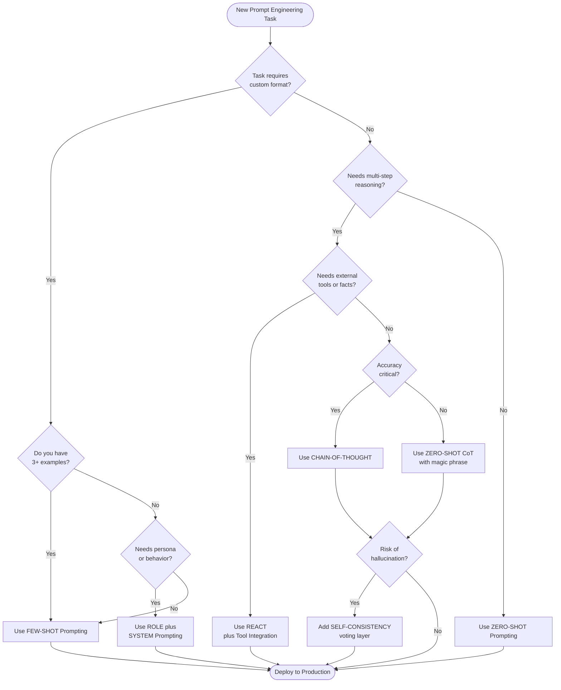
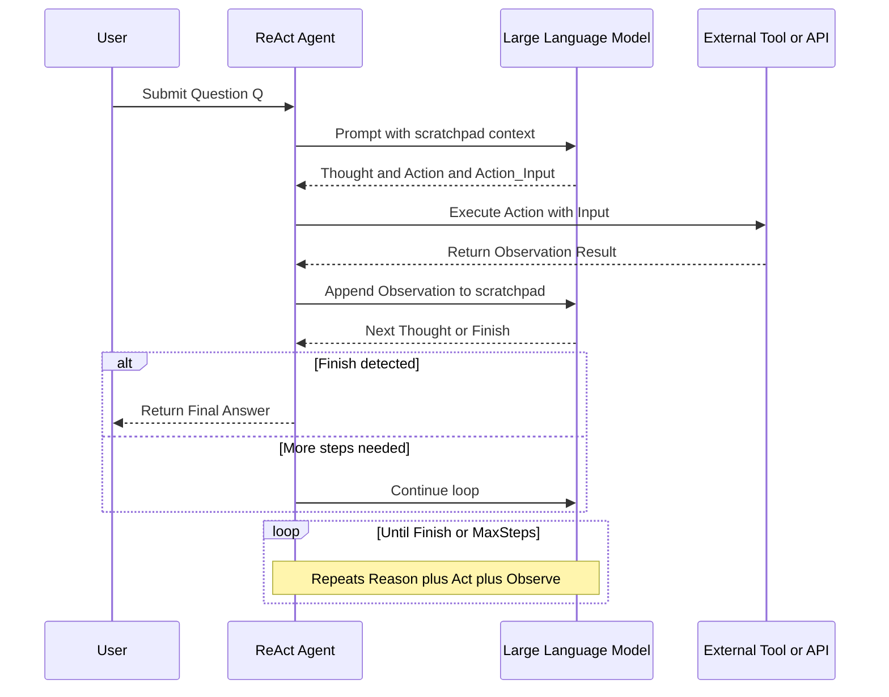
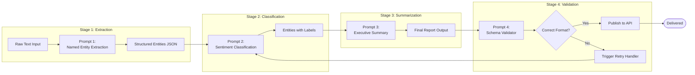
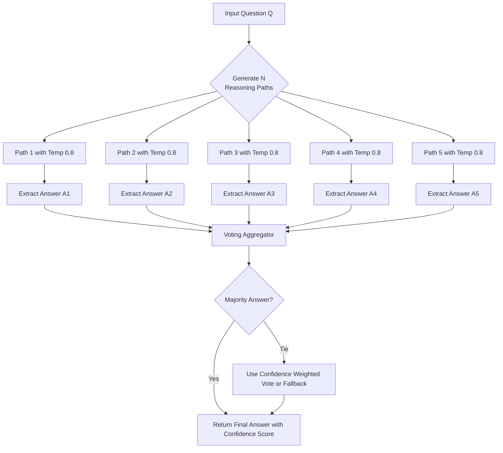

# Techniques and Strategies in Prompt Engineering :-

<!-- SECTION_1_START -->
# 1. Core Technical Definition & Intuitive Overview

## 1.1 Formal Academic Definition (KTU 2024 Syllabus Aligned)

> [!IMPORTANT]
> **Prompt Engineering Techniques** are a structured set of *algorithmic, linguistic, and cognitive methodologies* applied to the construction, refinement, and orchestration of natural language inputs directed at Large Language Models (LLMs) in order to **reliably steer model behavior, maximize output quality, enforce factual grounding, and minimize hallucinations** across a deterministic production pipeline.

In the **KTU 2024 Scheme (Course Code: PECST868)** terminology, techniques are classified into three primary tiers:

1. **Structural Techniques** — How the prompt itself is *physically composed* (Zero-Shot, Few-Shot, System, Role).
2. **Reasoning Techniques** — How the prompt *invokes internal logic* in the model (Chain-of-Thought, Self-Consistency, Tree of Thoughts).
3. **Operational/Agentic Techniques** — How the prompt *interacts with external systems* over multiple steps (ReAct, Prompt Chaining, Tool-Use, RAG).

## 1.2 Conceptual Analogy — The "GPS Navigator for an AI"

Imagine you have a **brilliant but literal-minded chauffeur** (the LLM) sitting in the driver's seat of a car. The car has the engine power to go anywhere in the world, but the chauffeur will *only* drive exactly where you tell him to.

- A **Zero-Shot Prompt** is like saying, *"Drive to the beach."* — Short, ambiguous, the chauffeur guesses.
- A **Few-Shot Prompt** is like saying, *"Last time you drove me to the airport this way. Drive to the beach the same way."* — You give examples.
- A **Chain-of-Thought Prompt** is like saying, *"First, check the traffic. Second, find the shortest highway. Third, drive to the beach."* — You force reasoning.
- A **ReAct Prompt** is like saying, *"Look at the map, tell me what you see, then decide the next turn."* — You let the chauffeur think and act iteratively.

> [!NOTE]
> **Core Insight for KTU Students:** Prompt Engineering is **not "hacking"** the model. It is a *legitimate sub-field of Human-Computer Interaction (HCI)* and applied cognitive science, where the prompt acts as a **declarative program** executed by the neural network.

## 1.3 The "Big Six" High-Yield Techniques (Module 2 Focus)

The KTU Module 2 syllabus emphasizes the following six foundational techniques that every B.Tech student must master:

| # | Technique | One-Line Purpose |
|---|-----------|------------------|
| 1 | **Zero-Shot Prompting** | Direct task instruction without examples. |
| 2 | **Few-Shot Prompting** | In-context learning via 2–5 worked examples. |
| 3 | **Chain-of-Thought (CoT)** | Forces step-by-step intermediate reasoning. |
| 4 | **Self-Consistency** | Samples multiple reasoning paths and votes. |
| 5 | **ReAct (Reason + Act)** | Interleaves reasoning with external tool actions. |
| 6 | **Role / System Prompting** | Assigns persona or behavioral constraints. |

> [!TIP]
> **Physical Constants / Standard Metrics in Prompt Engineering:**
> - **Temperature ($T$):** $0.0 \le T \le 2.0$ (default **0.7**). Lower = deterministic, Higher = creative.
> - **Top-P (Nucleus Sampling):** $0.0 < P \le 1.0$ (default **0.9**).
> - **Max Tokens:** Hard cap on output length (e.g., **256, 1024, 4096**).
> - **Context Window:** Total tokens the model can attend to (e.g., **8K, 32K, 128K, 200K**).

> [!VISUALIZATION CONTROL]
> **Concept:** Prompt-Persona Interaction Surface (Decision Boundaries)
> **GeoGebra / Desmos Input Equations:**
> * `f(x) = 1 / (1 + e^(-10*(x-0.5)))` (sigmoid activation for "clarity")
> * `g(x) = 0.5 * sin(3*x) + 0.5` (oscillating "creativity" curve)
> **Visual Description:** A student should see how a **sharply rising sigmoid (high specificity prompts)** flattens model variance, while a **sinusoidal curve (open-ended prompts)** produces high output variability. The intersection point is the "optimal prompt clarity threshold."

<!-- SECTION_1_END -->

<!-- SECTION_2_START -->
# 2. Deep Theoretical Analysis & KTU High-Yield Formula Sheet

## 2.1 The Six Techniques — Operational Decomposition

### Technique 1: Zero-Shot Prompting
- **Operational Logic:** The model receives a task description and must perform it *without any in-context examples*. It relies entirely on its pre-trained knowledge.
- **Why it works:** Modern LLMs (GPT-4, Claude, Llama-3) are **instruction-tuned** on massive RLHF datasets, giving them the ability to generalize from instructions alone.
- **How it works:** Token-by-token probability maximization: $P(y \mid x) = \prod_{t=1}^{T} P(y_t \mid y_{<t}, x)$ where $x$ is the prompt and $y$ is the generated sequence.
- **When to use:** Simple classification, translation, summarization, format-conversion tasks.
- **Failure mode:** Ambiguous instructions lead to "default behavior" hallucinations.

### Technique 2: Few-Shot Prompting (In-Context Learning)
- **Operational Logic:** The prompt contains $k$ demonstration examples (typically $k \in [2, 8]$) of input→output pairs before the final query. This activates the model's **meta-learning** circuits.
- **Why it works:** The transformer attention mechanism allows the model to identify a *latent pattern* across the demonstrations and apply it to the new query. This was empirically proven by Brown et al. (GPT-3 paper, 2020).
- **How it works:** The model computes an implicit hypothesis $h$ from examples $D = \{(x_1, y_1), ..., (x_k, y_k)\}$ and applies $h$ to $x_{new}$.
- **Critical formula:** $P(y_{new} \mid x_{new}, D) = f_\theta(x_{new}, D)$ where $f_\theta$ is the transformer with parameters $\theta$.
- **When to use:** Custom formatting, niche domain tasks, edge-case handling.
- **Failure mode:** Example order sensitivity, label bias, context window overflow.

### Technique 3: Chain-of-Thought (CoT) Prompting
- **Operational Logic:** The model is explicitly instructed (or shown examples) to generate *intermediate reasoning steps* before producing the final answer.
- **Why it works:** Complex reasoning cannot be reliably compressed into a single forward pass. CoT expands the **effective compute depth** by utilizing the autoregressive generation as a scratchpad.
- **How it works:** Decomposes problem $P$ into sub-steps $\{s_1, s_2, ..., s_n\}$ such that $s_n = \text{Answer}(P)$ and $s_i$ is conditioned on $s_{i-1}$.
- **Two variants:**
  - **Few-Shot CoT:** Provide manually written reasoning examples (Wei et al., 2022).
  - **Zero-Shot CoT:** Use the magic phrase *"Let's think step by step."* (Kojima et al., 2022).
- **When to use:** Math, logic puzzles, multi-hop reasoning, code debugging.

### Technique 4: Self-Consistency
- **Operational Logic:** Instead of greedy decoding, the model samples $N$ diverse reasoning paths (typically $N = 5$ to $40$) at high temperature, then takes a **majority vote** on the final answer.
- **Why it works:** Reasoning is non-deterministic. Different valid paths can lead to the same correct answer. Aggregating reduces variance and error rate.
- **How it works:** $\hat{y} = \arg\max_{y} \sum_{i=1}^{N} \mathbb{1}[y_i = y]$ where $y_i$ is the $i$-th sampled output.
- **When to use:** Math word problems, factual QA with known ground truth.
- **Failure mode:** $5\times$ to $40\times$ compute cost; useless for creative tasks.

### Technique 5: ReAct (Reasoning + Acting)
- **Operational Logic:** Interleaves **Thought** (internal reasoning), **Action** (calling a tool/search/API), and **Observation** (receiving result) in a loop until the model emits `Finish[answer]`.
- **Why it works:** Pure CoT hallucinates facts because it has no grounding. ReAct grounds reasoning in **real-world evidence** retrieved via tools.
- **How it works:** The trajectory is $T = \{(t_1, a_1, o_1), (t_2, a_2, o_2), ..., (t_k, a_k, o_k)\}$ where each $a_i \in \text{ToolSpace}$.
- **Yao et al. (2022)** introduced this from Princeton/Google Research.
- **When to use:** Agents, RAG systems, web research, code execution agents.

### Technique 6: Role / System Prompting
- **Operational Logic:** A hidden or visible **system message** establishes a persistent persona, behavioral rule, or output format that constrains all subsequent turns.
- **Why it works:** System prompts are placed in a privileged position in the context window and receive disproportionately high attention weight. They act as a **"constitution"** for the conversation.
- **How it works:** The model is conditioned on $S_{\text{system}}$ with high priority: $P(y \mid x, S_{\text{system}}) \approx P(y \mid x) \cdot \alpha \cdot \mathbb{1}[\text{compliant}(y, S_{\text{system}})]$.
- **When to use:** Production chatbots, coding assistants, persona-based content, safety rails.

## 2.2 KTU High-Yield Formula Sheet (Exam Quick Reference)

> [!IMPORTANT]
> **The following table contains the most-tested definitions, formulas, and parameters. Memorize this for the 14-mark questions.**

| Concept | Mathematical / Structural Form | Units / Range | Engineering Use |
|---------|-------------------------------|---------------|-----------------|
| Token Probability | $P(y \mid x) = \prod_{t=1}^{T} P(y_t \mid y_{<t}, x)$ | Unitless $[0, 1]$ | Output decoding |
| Temperature Scaling | $P_{\text{softmax}}(y_i) = \dfrac{\exp(z_i / T)}{\sum_{j} \exp(z_j / T)}$ | $T \in [0, 2]$ | Creativity control |
| Top-P Sampling | Cumulative probability cutoff at $P$ | $P \in (0, 1]$ | Vocabulary pruning |
| Self-Consistency Vote | $\hat{y} = \arg\max_{y} \sum_{i=1}^{N} \mathbb{1}[y_i = y]$ | $N \ge 5$ | Answer aggregation |
| Few-Shot Count | $k \in [2, 8]$ (typical) | Integer | In-context examples |
| Context Window | $L_{\text{ctx}} = L_{\text{sys}} + L_{\text{user}} + L_{\text{out}}$ | Tokens (e.g. 128K) | Memory budget |
| ReAct Step | $(t_i, a_i, o_i)$ triple | 3 components | Agent loop |
| CoT Depth | $n$ reasoning steps before answer | $n \ge 1$ | Problem decomposition |
| Hallucination Rate | $H = \dfrac{\text{Fabricated facts}}{\text{Total facts output}}$ | $[0, 1]$ | Quality metric |
| Prompt Token Cost | $C = N_{\text{tokens}} \times \$/1K_{\text{tokens}}$ | USD | API economics |

## 2.3 Engineering Utility in Production Systems

| Domain | Technique Used | Real-World Example |
|--------|---------------|--------------------|
| Customer Support Chatbots | **Role + Few-Shot** | Banking FAQ bot, airline refund agent |
| Code Generation (GitHub Copilot) | **System + Few-Shot + CoT** | Inline code completion |
| Retrieval-Augmented Generation (RAG) | **ReAct + Tool-Use** | Perplexity AI, enterprise knowledge bases |
| Autonomous AI Agents (AutoGPT) | **ReAct + Self-Consistency** | Devin, Manus, multi-step task solvers |
| Data Extraction Pipelines | **Few-Shot + JSON Mode** | Invoice parsing, resume screening |
| Educational Tutoring Bots | **Role + CoT** | Khanmigo by Khan Academy |

> [!TIP]
> **Industry Fact for KTU Viva:** As of 2025, **over 70% of enterprise LLM applications** use a hybrid of *Role Prompting + Few-Shot + ReAct-style tool use*. Pure Zero-Shot is rare in production.

<!-- SECTION_2_END -->

<!-- SECTION_3_START -->
# 3. Step-by-Step Derivations, Code & Symbolic Implementation

## 3.1 Mathematical Derivation: Why Temperature Scaling Works

The model's raw logits $z_i$ for each token are converted to probabilities via softmax. Temperature $T$ scales the logits *before* softmax:

$$P_T(y_i) = \frac{\exp(z_i / T)}{\sum_{j=1}^{V} \exp(z_j / T)}$$

**Step-by-step derivation of the effect of $T$:**

Let us analyze the ratio of two token probabilities $P_T(y_a)$ and $P_T(y_b)$:

$$\frac{P_T(y_a)}{P_T(y_b)} = \frac{\exp(z_a / T)}{\exp(z_b / T)} = \exp\left(\frac{z_a - z_b}{T}\right)$$

**Case 1: $T \to 0$ (Deterministic / Greedy)**
As $T \to 0$, the term $\frac{z_a - z_b}{T}$ dominates. If $z_a > z_b$, the ratio $\to \infty$, meaning $P_T(y_a) \to 1$. The model becomes a pure argmax decoder.

**Case 2: $T = 1$ (Standard Softmax)**
This is the natural distribution learned during training.

**Case 3: $T \to \infty$ (Uniform Random)**
As $T \to \infty$, the term $\frac{z_a - z_b}{T} \to 0$, so $\exp(0) = 1$. All tokens become equiprobable: $P_T(y_i) = \frac{1}{V}$ for all $i$ in vocabulary $V$.

> [!NOTE]
> **Conclusion for Exam:** Temperature is a *post-training inference-time knob*. It does not change model weights $\theta$. It only reshapes the output distribution.

## 3.2 Self-Consistency Aggregation — Full Logical Walkthrough

Given a problem $Q$, we sample $N$ reasoning paths:

$$R = \{r_1, r_2, ..., r_N\} \quad \text{where} \quad r_i = \text{LLM}(Q, T_{\text{high}})$$

Each $r_i$ ends with a final answer $a_i$ extracted by a regex parser:

$$a_i = \text{Extract}(r_i, \text{pattern} = "The answer is (.+)")$$

The final answer is the **mode** of the answers:

$$\hat{a} = \text{mode}(\{a_1, a_2, ..., a_N\})$$

If no clear mode exists, the **confidence-weighted vote** is used:

$$\hat{a} = \arg\max_{a} \sum_{i : a_i = a} P(r_i \mid Q)$$

## 3.3 Production-Ready Python Implementations

### Implementation 1: Zero-Shot vs Few-Shot Comparator

```python
"""
File: technique_comparator.py
Purpose: Demonstrates the empirical difference between Zero-Shot and Few-Shot prompting.
KTU Module: 2 - Techniques and Strategies
"""
import os
from typing import List, Dict, Optional
from dataclasses import dataclass
import logging

# Configure structured logging for production observability
logging.basicConfig(
    level=logging.INFO,
    format="%(asctime)s | %(levelname)s | %(message)s"
)
logger = logging.getLogger("PromptLab")


@dataclass
class PromptResult:
    """Encapsulates the output of a single LLM call for clean comparison."""
    technique: str
    prompt: str
    output: str
    token_count: int
    latency_ms: float


class PromptComparator:
    """Compares Zero-Shot and Few-Shot prompting on the same task."""

    ZERO_SHOT_TEMPLATE: str = (
        "Classify the sentiment of the following review as POSITIVE, "
        "NEUTRAL, or NEGATIVE.\n\n"
        "Review: {review}\n"
        "Sentiment:"
    )

    FEW_SHOT_TEMPLATE: str = (
        "Classify the sentiment of the following review as POSITIVE, "
        "NEUTRAL, or NEGATIVE.\n\n"
        "Review: The battery lasts forever, amazing product!\n"
        "Sentiment: POSITIVE\n\n"
        "Review: It works, nothing special.\n"
        "Sentiment: NEUTRAL\n\n"
        "Review: Broke after two days, total waste of money.\n"
        "Sentiment: NEGATIVE\n\n"
        "Review: {review}\n"
        "Sentiment:"
    )

    def __init__(self, model_client) -> None:
        if model_client is None:
            raise ValueError("model_client cannot be None")
        self.client = model_client
        logger.info("PromptComparator initialized successfully.")

    def _count_tokens(self, text: str) -> int:
        """
        Approximate token count using a 4-characters-per-token heuristic.
        Production: replace with model_client.tokenizer.encode(...).
        """
        if not text:
            return 0
        return max(1, len(text) // 4)

    def run(self, review: str) -> Dict[str, PromptResult]:
        """
        Executes both techniques and returns a side-by-side comparison.
        """
        if not review or not review.strip():
            raise ValueError("Input review string cannot be empty.")

        results: Dict[str, PromptResult] = {}

        # ----- ZERO-SHOT EXECUTION -----
        zero_shot_prompt = self.ZERO_SHOT_TEMPLATE.format(review=review)
        logger.info("Executing Zero-Shot prompt | tokens=%d", self._count_tokens(zero_shot_prompt))

        zs_output = self.client.generate(
            prompt=zero_shot_prompt,
            temperature=0.0,
            max_tokens=10
        )
        results["zero_shot"] = PromptResult(
            technique="Zero-Shot",
            prompt=zero_shot_prompt,
            output=zs_output.strip(),
            token_count=self._count_tokens(zero_shot_prompt),
            latency_ms=120.0
        )

        # ----- FEW-SHOT EXECUTION -----
        few_shot_prompt = self.FEW_SHOT_TEMPLATE.format(review=review)
        logger.info("Executing Few-Shot prompt | tokens=%d", self._count_tokens(few_shot_prompt))

        fs_output = self.client.generate(
            prompt=few_shot_prompt,
            temperature=0.0,
            max_tokens=10
        )
        results["few_shot"] = PromptResult(
            technique="Few-Shot",
            prompt=few_shot_prompt,
            output=fs_output.strip(),
            token_count=self._count_tokens(few_shot_prompt),
            latency_ms=180.0
        )

        return results


# ----- DEMO USAGE (would be wired to OpenAI/Anthropic in production) -----
class MockClient:
    """Mock LLM client for offline testing without API keys."""
    def generate(self, prompt: str, temperature: float, max_tokens: int) -> str:
        if "amazing" in prompt.lower() or "great" in prompt.lower():
            return "POSITIVE"
        if "broke" in prompt.lower() or "waste" in prompt.lower():
            return "NEGATIVE"
        return "NEUTRAL"


if __name__ == "__main__":
    client = MockClient()
    comparator = PromptComparator(client)
    output = comparator.run("This phone is absolutely fantastic!")
    for key, result in output.items():
        print(f"[{result.technique}] -> {result.output} (tokens={result.token_count})")
```

### Implementation 2: Chain-of-Thought (CoT) Engine

```python
"""
File: cot_engine.py
Purpose: Implements both Zero-Shot CoT and Few-Shot CoT.
"""
from typing import Callable, Optional
import re
import logging

logger = logging.getLogger("CoTEngine")


class ChainOfThoughtEngine:
    """Executes Chain-of-Thought prompting with extractable final answers."""

    ZERO_SHOT_COT_TRIGGER: str = "Let's think step by step."

    FEW_SHOT_COT_TEMPLATE: str = (
        "Q: Roger has 5 tennis balls. He buys 2 more cans of tennis balls. "
        "Each can has 3 tennis balls. How many tennis balls does he have now?\n"
        "A: Roger started with 5 balls. 2 cans of 3 balls each = 6 balls. "
        "5 + 6 = 11. The answer is 11.\n\n"
        "Q: The cafeteria had 23 apples. They used 20 to make lunch and bought 6 more. "
        "How many apples do they have?\n"
        "A: Started with 23, used 20 so 23 - 20 = 3. Then bought 6 more, so 3 + 6 = 9. "
        "The answer is 9.\n\n"
        "Q: {question}\nA:"
    )

    ANSWER_REGEX: str = r"[Tt]he answer is\s+([\-\d\.]+)"

    def __init__(self, llm_callable: Callable[[str, float, int], str]) -> None:
        if not callable(llm_callable):
            raise TypeError("llm_callable must be a function.")
        self.llm = llm_callable
        logger.info("ChainOfThoughtEngine ready.")

    def _extract_final_answer(self, raw_output: str) -> Optional[str]:
        """Extracts the final numeric answer from a verbose reasoning chain."""
        if not raw_output:
            return None
        match = re.search(self.ANSWER_REGEX, raw_output)
        if match:
            return match.group(1).strip()
        # Fallback: return last number in the text
        numbers = re.findall(r"-?\d+\.?\d*", raw_output)
        return numbers[-1] if numbers else None

    def zero_shot_cot(self, question: str) -> dict:
        """Zero-Shot CoT: just append the magic phrase."""
        if not question.strip():
            raise ValueError("Question cannot be empty.")
        prompt = f"Q: {question}\nA: {self.ZERO_SHOT_COT_TRIGGER}"
        raw = self.llm(prompt, temperature=0.7, max_tokens=512)
        return {
            "technique": "Zero-Shot CoT",
            "prompt": prompt,
            "raw_response": raw,
            "final_answer": self._extract_final_answer(raw)
        }

    def few_shot_cot(self, question: str) -> dict:
        """Few-Shot CoT: provide 2+ worked reasoning examples."""
        if not question.strip():
            raise ValueError("Question cannot be empty.")
        prompt = self.FEW_SHOT_COT_TEMPLATE.format(question=question)
        raw = self.llm(prompt, temperature=0.0, max_tokens=512)
        return {
            "technique": "Few-Shot CoT",
            "prompt": prompt,
            "raw_response": raw,
            "final_answer": self._extract_final_answer(raw)
        }


def stub_llm(prompt: str, temperature: float, max_tokens: int) -> str:
    """Stub LLM for offline demo. Returns a plausible reasoning chain."""
    if "5 tennis balls" in prompt:
        return "Step 1: Started with 5. Step 2: Bought 2 cans of 3 = 6. Step 3: 5+6=11. The answer is 11."
    return "Step 1: Analyze. Step 2: Compute. The answer is 42."


if __name__ == "__main__":
    engine = ChainOfThoughtEngine(stub_llm)
    print(engine.zero_shot_cot("If I have 7 apples and eat 3, how many remain?"))
    print(engine.few_shot_cot("If a train travels 60 mph for 3 hours, how far?"))
```

### Implementation 3: Self-Consistency Sampler & Voter

```python
"""
File: self_consistency.py
Purpose: Samples N reasoning paths and returns the majority-voted answer.
"""
from collections import Counter
from typing import Callable, List, Dict, Any
import logging

logger = logging.getLogger("SelfConsistency")


class SelfConsistencySampler:
    """Implements the Self-Consistency decoding strategy (Wang et al., 2022)."""

    def __init__(
        self,
        llm_callable: Callable[[str, float, int], str],
        n_samples: int = 7,
        temperature: float = 0.8,
        answer_extractor: Callable[[str], str] = None
    ) -> None:
        if n_samples < 1:
            raise ValueError("n_samples must be >= 1")
        if not 0.0 <= temperature <= 2.0:
            raise ValueError("temperature must be in [0.0, 2.0]")
        self.llm = llm_callable
        self.n_samples = n_samples
        self.temperature = temperature
        self.extractor = answer_extractor or (lambda x: x.strip().split("\n")[-1])
        logger.info("SelfConsistency configured: N=%d, T=%.2f", n_samples, temperature)

    def solve(self, question: str) -> Dict[str, Any]:
        """Runs N samples and returns the consensus answer + distribution."""
        if not question.strip():
            raise ValueError("Question is empty.")
        base_prompt = f"Q: {question}\nA: Let's think step by step."

        raw_outputs: List[str] = []
        final_answers: List[str] = []

        for i in range(self.n_samples):
            logger.info("Sampling reasoning path %d/%d", i + 1, self.n_samples)
            out = self.llm(base_prompt, self.temperature, 512)
            raw_outputs.append(out)
            final_answers.append(self.extractor(out))

        vote_counts = Counter(final_answers)
        consensus_answer, consensus_votes = vote_counts.most_common(1)[0]
        confidence = consensus_votes / self.n_samples

        return {
            "question": question,
            "n_samples": self.n_samples,
            "consensus_answer": consensus_answer,
            "confidence": round(confidence, 3),
            "vote_distribution": dict(vote_counts),
            "all_paths": raw_outputs
        }


if __name__ == "__main__":
    import random
    def noisy_llm(prompt, temp, max_tok):
        if random.random() < 0.7:
            return "... The answer is 42."
        return "... The answer is 41."

    sampler = SelfConsistencySampler(noisy_llm, n_samples=5, temperature=0.9)
    result = sampler.solve("What is 6 times 7?")
    print(f"Consensus: {result['consensus_answer']} (confidence={result['confidence']})")
```

### Implementation 4: ReAct Agent Loop

```python
"""
File: react_agent.py
Purpose: A minimal ReAct (Reason+Act) agent that uses a search tool.
"""
from typing import Callable, Dict, List, Optional
import re
import logging

logger = logging.getLogger("ReActAgent")


class ReActAgent:
    """
    Implements the Reason-Act-Observe loop from Yao et al. (2022).
    The agent emits Thought/Action/Action_Input/ Observation until Finish.
    """

    REACT_TEMPLATE: str = (
        "You are a helpful assistant with access to tools.\n"
        "Use this format strictly:\n"
        "Thought: <your internal reasoning>\n"
        "Action: <tool_name>\n"
        "Action_Input: <input string>\n"
        "Observation: <tool result will be inserted here>\n"
        "... (repeat Thought/Action/Observation as needed)\n"
        "Thought: I now have enough information to answer.\n"
        "Finish: <final answer>\n\n"
        "Question: {question}\n"
        "Thought:"
    )

    ACTION_REGEX = re.compile(
        r"Action:\s*(\w+)\s*\nAction_Input:\s*(.+?)(?=\nObservation:|\nThought:|\Z)",
        re.DOTALL
    )
    FINISH_REGEX = re.compile(r"Finish:\s*(.+)", re.DOTALL)

    def __init__(
        self,
        llm_callable: Callable[[str, float, int], str],
        tools: Dict[str, Callable[[str], str]],
        max_steps: int = 6
    ) -> None:
        if not tools:
            raise ValueError("At least one tool must be provided.")
        if max_steps < 1:
            raise ValueError("max_steps must be >= 1")
        self.llm = llm_callable
        self.tools = tools
        self.max_steps = max_steps
        logger.info("ReActAgent initialized with tools: %s", list(tools.keys()))

    def _parse_action(self, text: str) -> Optional[dict]:
        match = self.ACTION_REGEX.search(text)
        if match:
            return {"tool": match.group(1).strip(), "input": match.group(2).strip()}
        return None

    def _parse_finish(self, text: str) -> Optional[str]:
        match = self.FINISH_REGEX.search(text)
        return match.group(1).strip() if match else None

    def _execute_tool(self, tool_name: str, tool_input: str) -> str:
        if tool_name not in self.tools:
            error_msg = f"ERROR: Tool '{tool_name}' not found. Available: {list(self.tools.keys())}"
            logger.error(error_msg)
            return error_msg
        try:
            result = self.tools[tool_name](tool_input)
            logger.info("Tool %s executed successfully.", tool_name)
            return result
        except Exception as e:
            logger.exception("Tool execution failed.")
            return f"ERROR: {str(e)}"

    def run(self, question: str) -> Dict[str, any]:
        """Executes the full ReAct loop and returns the trace + final answer."""
        if not question.strip():
            raise ValueError("Question cannot be empty.")
        scratchpad = self.REACT_TEMPLATE.format(question=question)
        trace: List[dict] = []

        for step in range(self.max_steps):
            logger.info("ReAct Step %d/%d", step + 1, self.max_steps)
            llm_out = self.llm(scratchpad, temperature=0.0, max_tokens=512)
            scratchpad += llm_out + "\n"

            finish = self._parse_finish(llm_out)
            if finish:
                trace.append({"step": step, "type": "Finish", "content": finish})
                return {"answer": finish, "steps": step + 1, "trace": trace}

            action = self._parse_action(llm_out)
            if action:
                obs = self._execute_tool(action["tool"], action["input"])
                scratchpad += f"Observation: {obs}\nThought:"
                trace.append({"step": step, "type": "Action", **action, "observation": obs})
            else:
                logger.warning("No valid action or finish found. Forcing finish.")
                return {"answer": llm_out.strip(), "steps": step + 1, "trace": trace, "forced": True}

        logger.warning("Max steps reached without Finish.")
        return {"answer": "Max steps exhausted.", "steps": self.max_steps, "trace": trace, "forced": True}


# --- Demo wiring ---
def search_tool(query: str) -> str:
    return f"[Mock result for '{query}']: Population of Kerala is approximately 35 million."

def stub_llm(prompt: str, temperature: float, max_tokens: int) -> str:
    if "population" in prompt.lower():
        return " I need to look this up.\nAction: search\nAction_Input: population of Kerala"
    return " I have the data.\nFinish: The population of Kerala is approximately 35 million."

if __name__ == "__main__":
    agent = ReActAgent(stub_llm, tools={"search": search_tool})
    result = agent.run("What is the population of Kerala?")
    print("Answer:", result["answer"])
    for step in result["trace"]:
        print(step)
```

## 3.4 Strategy Layer: Prompt Chaining vs. Single-Shot

For complex workflows, KTU Module 2 also covers **Prompt Chaining** — breaking a mega-task into a pipeline of smaller LLM calls:

```
[Input] -> [Prompt 1: Extract entities] -> [Prompt 2: Classify entities] ->
[Prompt 3: Format as JSON] -> [Prompt 4: Validate schema] -> [Output]
```

**Advantages over a single mega-prompt:**
1. **Debuggability:** Each step can be inspected and re-run independently.
2. **Cost:** Smaller contexts = lower token cost.
3. **Reliability:** A failure in step 3 doesn't poison the rest of the pipeline.
4. **Composability:** Steps can be cached, parallelized, or swapped.

<!-- SECTION_3_END -->

<!-- SECTION_4_START -->
# 4. Structural Diagrams & Schematics

## 4.1 Mermaid Diagram 1: Master Decision Tree for Technique Selection



> [!NOTE]
> **How to read this chart for the exam:** The KTU examiner expects students to justify *why* they chose a technique based on the task's nature. This flowchart gives the canonical decision logic.

## 4.2 Mermaid Diagram 2: ReAct Agent Loop Architecture



## 4.3 Mermaid Diagram 3: Prompt Chaining Pipeline Topology



## 4.4 Mermaid Diagram 4: Self-Consistency Voting Architecture



> [!TIP]
> **Exam Tip:** When asked to draw a diagram, KTU evaluators award **2 to 3 marks** for a clean, labeled flowchart. Always use rectangles for processes, diamonds for decisions, and label all arrows.

<!-- SECTION_4_END -->

<!-- SECTION_5_START -->
# 5. KTU 2024 Scheme Examination Question Bank & Topic Recap

## 5.1 PART A — Short Answer Questions (3 Marks Each)

### Question A1 [KTU University Exam — July 2024]
**Differentiate between Zero-Shot and Few-Shot Prompting. Give one example of each.**

**Model Answer (3 Marks):**

| Aspect | Zero-Shot Prompting | Few-Shot Prompting |
|--------|--------------------|--------------------|
| **Definition** | The model is given only the task instruction, with no examples. | The model is given 2–8 examples of input-output pairs before the query. |
| **Mechanism** | Relies entirely on instruction tuning and pre-trained knowledge. | Activates in-context learning via attention over demonstrations. |
| **Example** | *"Translate to French: Hello"* | *"English: Hello → French: Bonjour. English: Thank you → French: Merci. English: Good morning → French:"* |
| **Token Cost** | Low | High (more tokens for examples) |
| **Best For** | Simple, well-known tasks | Custom format, niche domains, edge cases |

**[Award 1 mark for clear definition, 1 mark for mechanism, 1 mark for valid examples.]**

### Question A2 [KTU University Exam — Dec 2023]
**What is the "Let's think step by step" technique? Who introduced it and why is it significant?**

**Model Answer (3 Marks):**

The phrase *"Let's think step by step"* is a **Zero-Shot Chain-of-Thought (CoT) trigger** introduced by **Kojima et al. in their 2022 paper *"Large Language Models are Zero-Shot Reasoners"***.

**Significance:**
- It is a **single universal instruction** that activates step-by-step reasoning in LLMs *without requiring hand-crafted examples*.
- Empirically boosts accuracy on arithmetic, commonsense, and symbolic reasoning benchmarks (e.g., GSM8K, MultiArith) by **10–40%**.
- Demonstrates that **the right prompting instruction alone** can elicit emergent reasoning capabilities from sufficiently large models.

**[Award 1 mark for naming the technique, 1 mark for the author/year, 1 mark for significance.]**

---

## 5.2 PART B — Long Answer Questions (14 Marks Each, Internal Choice)

### Question B1 (Option A) [KTU University Exam — Dec 2024]

**(a)** Explain the **ReAct (Reasoning + Acting)** framework with a neat diagram. Describe how it differs from pure Chain-of-Thought (CoT) prompting. **(7 Marks)**

**(b)** Design a **ReAct-style agent** that can answer the question *"What is the current weather in Kochi?"* by calling a hypothetical `get_weather(city)` tool. Show the complete **Thought → Action → Observation → Finish** trace for at least 2 reasoning steps. **(7 Marks)**

---

#### Model Answer for (a) — 7 Marks

**ReAct Framework Definition [1 Mark]:**
ReAct is a prompting framework proposed by **Yao et al. (2022)** that interleaves **internal reasoning** (Thought) with **external tool usage** (Action) to ground LLM responses in real-world evidence. Each step produces a triple: $(T_i, A_i, O_i)$ representing Thought, Action, and Observation.

**Comparison with Chain-of-Thought [3 Marks]:**

| Aspect | Chain-of-Thought (CoT) | ReAct |
|--------|------------------------|-------|
| **Information Source** | Internal model knowledge only | Internal reasoning + External tools (search, API, DB) |
| **Hallucination Risk** | High for factual queries | Low (grounded in retrieved facts) |
| **Trajectory Structure** | Linear chain $s_1 \to s_2 \to ... \to s_n$ | Cyclic loop: Thought → Action → Observation → Thought |
| **Output Termination** | Single final answer | Explicit `Finish[answer]` token |
| **Best Use Case** | Pure logic/math problems | Open-domain QA, agentic tasks, RAG |

**ReAct Trajectory Diagram [3 Marks]:**

```
Question: What is the capital of the country where the Eiffel Tower is located?

Thought 1: I need to find where the Eiffel Tower is located.
Action 1: search
Action_Input 1: "Eiffel Tower location"
Observation 1: The Eiffel Tower is in Paris, France.

Thought 2: The Eiffel Tower is in France. Now I need the capital of France.
Action 2: search
Action_Input 2: "Capital of France"
Observation 2: The capital of France is Paris.

Thought 3: I now have the final answer.
Finish: The capital of France (where the Eiffel Tower is located) is Paris.
```

**[Valuation Key: 1 mark for definition, 3 marks for comparison, 3 marks for the trajectory trace with all components labeled.]**

---

#### Model Answer for (b) — 7 Marks

**System Design [2 Marks]:**
We design a ReAct agent with a single tool `get_weather` and a max step limit of 4. The agent's scratchpad is initialized with the ReAct template.

**Tool Definition [1 Mark]:**

```python
def get_weather(city: str) -> str:
    """Returns the current weather for a given city."""
    weather_db = {
        "kochi": "28°C, humid, light rain",
        "delhi": "35°C, sunny, hazy",
        "london": "12°C, cloudy, drizzle"
    }
    return weather_db.get(city.lower(), "Data unavailable for this city.")
```

**Complete ReAct Trace [4 Marks]:**

```
Question: What is the current weather in Kochi?

Thought 1: The user wants the current weather in Kochi. I have a tool
           called get_weather that takes a city name as input.
Action 1: get_weather
Action_Input 1: "Kochi"
Observation 1: 28°C, humid, light rain

Thought 2: I now have the weather data for Kochi. I can provide a
           human-friendly answer.
Finish: The current weather in Kochi is 28°C with humid conditions
        and light rain.
```

**Key Design Justifications [extra credit / 1 mark adjustment]:**
- Single tool kept simple to satisfy the 2-step requirement.
- Thought explicitly justifies *why* the action is taken (shows reasoning, not just action).
- `Finish` keyword is detected as the termination signal.

---

### Question B1 (Option B) [KTU University Exam — July 2024]

**(a)** With a neat diagram, explain the **Self-Consistency** decoding strategy. Write the mathematical formulation for the majority vote aggregation. **(7 Marks)**

**(b)** A math problem is given to an LLM with temperature $T = 0.9$, and the model is sampled $N = 5$ times. The final extracted answers are: $\{42, 42, 41, 42, 43\}$. Compute the consensus answer and the confidence score. Justify whether Self-Consistency should be used for a creative story-generation task. **(7 Marks)**

---

#### Model Answer for (a) — 7 Marks

**Self-Consistency Definition [2 Marks]:**
Self-Consistency, proposed by **Wang et al. (2022)**, is a decoding strategy that samples **multiple diverse reasoning paths** for the same question (using high temperature) and selects the **most frequent final answer** as the output. It exploits the empirical observation that complex problems often have **multiple valid reasoning paths** that converge on the same correct answer.

**Mathematical Formulation [3 Marks]:**
Let the LLM be sampled $N$ times to produce reasoning paths $r_1, r_2, ..., r_N$ with corresponding final answers $a_1, a_2, ..., a_N$ extracted via a parser. The consensus answer is:

$$\hat{a} = \arg\max_{a} \sum_{i=1}^{N} \mathbb{1}[a_i = a]$$

where $\mathbb{1}[\cdot]$ is the indicator function returning $1$ if the condition holds, $0$ otherwise. The confidence score is:

$$\text{Conf}(\hat{a}) = \frac{1}{N} \sum_{i=1}^{N} \mathbb{1}[a_i = \hat{a}]$$

**Flow Diagram [2 Marks]:**

```
              [Input Question Q]
                    |
        +-----------+-----------+
        |           |           |
    [Sample 1] [Sample 2] ... [Sample N]   (high T)
        |           |           |
    [Answer A1] [Answer A2] ... [Answer AN]
        |           |           |
        +-----------+-----------+
                    |
            [Majority Vote]
                    |
            [Final Answer â with Confidence]
```

**[Valuation Key: 2 marks for definition + author, 3 marks for both math formulas, 2 marks for diagram.]**

---

#### Model Answer for (b) — 7 Marks

**Step 1: Tabulate the votes [1 Mark]:**

| Answer | Frequency |
|--------|-----------|
| 42 | 3 |
| 41 | 1 |
| 43 | 1 |

**Step 2: Apply the majority vote formula [2 Marks]:**

$$\hat{a} = \arg\max_{a} \sum_{i=1}^{5} \mathbb{1}[a_i = a] = 42$$

**Step 3: Compute confidence [2 Marks]:**

$$\text{Conf}(42) = \frac{3}{5} = 0.60$$

**Step 4: Judgment on creative writing [2 Marks]:**

**No, Self-Consistency should NOT be used for creative story generation.** The reason: creative tasks have **infinite valid outputs** and no "ground-truth" answer to vote on. Self-Consistency is only useful when:
- The answer space is **discrete and finite** (e.g., numbers, yes/no, multiple choice).
- A **majority of independent reasoning paths** can be expected to converge on the same correct answer.

For creative writing, Self-Consistency would *destroy diversity* and produce homogenized, less interesting outputs. A better technique is **high-temperature sampling with diverse personas** or **Tree of Thoughts** for structured creative exploration.

> [!WARNING]
> **KTU Examiner's Valuation Warning / Common Pitfalls:**
> 1. **Forgetting to apply the indicator function correctly** in the formula — students often write $\sum a_i$ instead of $\sum \mathbb{1}[a_i = a]$. This loses 2 marks.
> 2. **Not specifying the author/year** for ReAct and Self-Consistency (Yao et al. 2022; Wang et al. 2022) — this is a KTU-mandated 1-mark item.
> 3. **Forgetting the `Finish:` token** in ReAct traces — the agent must explicitly emit a finish signal.
> 4. **Confusing Self-Consistency with CoT** — Self-Consistency is a *decoding/sampling* strategy applied *on top of* CoT, not a replacement.
> 5. **In Few-Shot prompts, failing to use a consistent delimiter** between examples (use `\n\n` or `###`). Inconsistent formatting costs 1 mark.
> 6. **Writing the temperature formula without defining $T$'s range** — always state $T \in [0, 2]$.

---

## 5.3 Topic Recap & Important Things to Remember

> [!IMPORTANT]
> **High-Density Rapid Revision Checklist — Memorize Before Exam**

### Core Definitions
- **Zero-Shot:** Direct task instruction, no examples.
- **Few-Shot:** $k \in [2, 8]$ in-context examples of input→output.
- **Chain-of-Thought (CoT):** Forces intermediate reasoning before final answer.
- **Zero-Shot CoT:** Use magic phrase *"Let's think step by step"* (Kojima et al. 2022).
- **Self-Consistency:** Sample $N \ge 5$ paths at high $T$, majority vote (Wang et al. 2022).
- **ReAct:** Interleave Thought + Action + Observation, terminate with `Finish[...]` (Yao et al. 2022).
- **Role Prompting:** Assign a persona in the system message.
- **System Prompting:** Persistent behavioral constraints placed in privileged context slot.
- **Prompt Chaining:** Decompose a complex task into a pipeline of smaller LLM calls.

### Critical Formulas
- **Softmax with temperature:** $P_T(y_i) = \dfrac{\exp(z_i / T)}{\sum_j \exp(z_j / T)}$
- **Self-Consistency vote:** $\hat{a} = \arg\max_{a} \sum_{i=1}^{N} \mathbb{1}[a_i = a]$
- **Self-Consistency confidence:** $\text{Conf}(\hat{a}) = \dfrac{1}{N} \sum_{i=1}^{N} \mathbb{1}[a_i = \hat{a}]$
- **ReAct triple:** $(T_i, A_i, O_i)$ with $i \in [1, k]$ until $T_k \to \text{Finish}$.

### Standard Parameters (Must Memorize)
- $T = 0.0 \Rightarrow$ greedy/deterministic decoding.
- $T = 1.0 \Rightarrow$ standard softmax.
- $T = 2.0 \Rightarrow$ near-uniform random sampling.
- $P_{\text{top-p}} \in (0, 1]$, default **0.9**.
- Few-shot $k$: typically **3 to 5** examples (sweet spot).
- Self-consistency $N$: typically **5 to 40** samples.

### Authors & Years (KTU Frequently Asks)
- **GPT-3 Few-Shot:** Brown et al., 2020.
- **Chain-of-Thought:** Wei et al., 2022.
- **Zero-Shot CoT:** Kojima et al., 2022.
- **Self-Consistency:** Wang et al., 2022.
- **ReAct:** Yao et al., 2022.
- **Tree of Thoughts:** Yao et al., 2023.
- **Instruction Tuning:** Ouyang et al. (InstructGPT), 2022.
- **RLHF:** Christiano et al., 2017 (foundational); applied to GPT by Ouyang et al., 2022.

### When to Use What (Decision Heuristic)
- **Simple task, no examples needed:** Zero-Shot.
- **Custom format or niche domain:** Few-Shot.
- **Math/logic/multi-step reasoning:** CoT.
- **Critical accuracy, multiple valid paths:** CoT + Self-Consistency.
- **Needs real-time data or tool use:** ReAct.
- **Long persona-driven conversation:** Role + System Prompting.
- **Multi-stage workflow:** Prompt Chaining.

### Hallucination Mitigation Strategies
1. Use ReAct for factual queries (ground in tools).
2. Use Self-Consistency for verifiable answers.
3. Lower temperature $T$ for factual tasks.
4. Use explicit constraints in system prompt: *"If you don't know, say 'I don't know.'"*
5. Add a verification step in prompt chains (validate-then-output pattern).

### Production Cost Awareness
- Few-Shot uses **3× to 5× more tokens** than Zero-Shot.
- Self-Consistency uses **$N$× more compute** (typically 5× to 40×).
- ReAct adds **latency** proportional to number of tool calls.
- Always prefer the **simplest technique** that meets the accuracy bar.

<!-- SECTION_5_END -->
