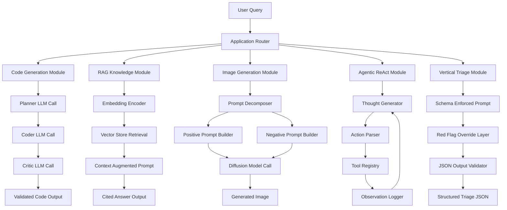
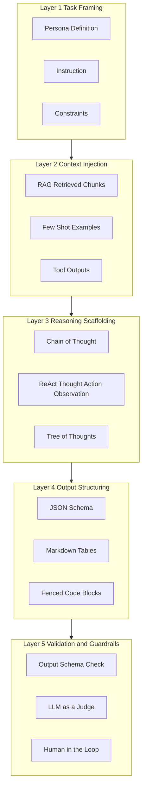
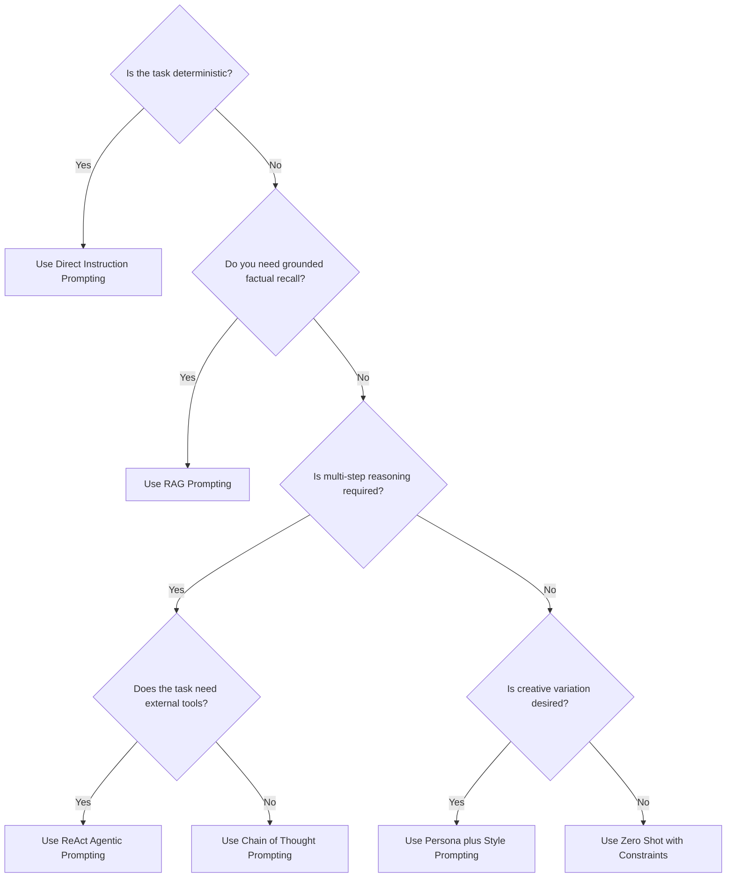
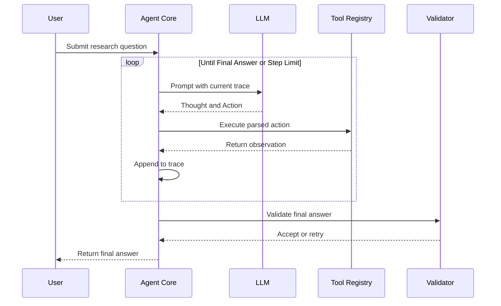
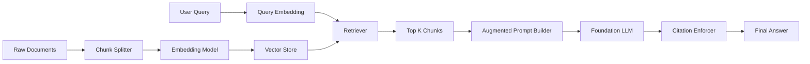
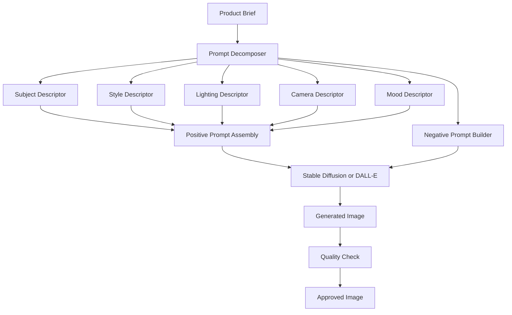

# Applications of Prompt Engineering :-

<!-- SECTION_1_START -->
# Applications of Prompt Engineering

## 1.1 Formal Academic Definition

> [!IMPORTANT]
> **Definition (KTU 2024 Scheme – PECST868 / Module 3)**
> **Prompt Engineering Applications** refer to the systematic, domain-specific deployment of carefully structured natural-language instructions (prompts) to Large Language Models (LLMs) and multimodal foundation models in order to elicit reliable, accurate, and context-aware outputs for real-world engineering, scientific, business, and creative tasks. These applications span text, code, image, audio, and video generation pipelines and constitute the practical interface between raw model capability and production-grade AI systems.

In the KTU 2024 Outcome-Based Education (OBE) framework for *PECST868 – Prompt Engineering*, Module 3 specifically maps to the engineering deployment of prompt patterns across at least **eight canonical application tracks**:

1. **Software Engineering & Code Intelligence**
2. **Creative Content Generation & Marketing**
3. **Data Analysis, Reasoning & Business Intelligence**
4. **Education, Tutoring & Knowledge Structuring**
5. **Multimodal Generation (Image / Audio / Video)**
6. **Conversational Agents & Customer Service Automation**
7. **Workflow Automation & Autonomous AI Agents**
8. **Vertical / Domain-Specific Systems** (Healthcare, Legal, Finance, Scientific Research)

> [!NOTE]
> **Syllabus Highlight (KTU PECST868, Module 3)**
> The module emphasises that prompt engineering is not a single technique but a *stack of design patterns* — each application domain activates a different combination of **zero-shot**, **few-shot**, **chain-of-thought (CoT)**, **retrieval-augmented generation (RAG)**, and **agentic** prompting strategies.

## 1.2 Intuitive Analogy — "The Precision Steering Wheel"

Imagine a **Formula 1 car** as a Large Language Model. The car possesses enormous raw power (billions of parameters, trillions of tokens of training data), but without a **steering wheel, brakes, gears, and a navigation system**, that power is unusable. **Prompt engineering is the cockpit instrumentation.** Each application domain represents a different racetrack — a city circuit (customer service) demands different control inputs than a desert rally (scientific reasoning) or a drag strip (code generation). The same engine (the LLM) performs optimally only when the **driver's instructions (prompts)** are matched to the **track conditions (application context)**.

In simpler words:

- **The Model** = the engine
- **The Prompt** = the steering, gear-shifting, and braking commands
- **The Application** = the racetrack
- **The Engineer** = the prompt engineer who calibrates the controls

> [!TIP]
> **Quick Memory Hook:** A prompt engineer doesn't *add* intelligence to an LLM — they *extract* the latent capability that is already inside the model, the way a radio tuner extracts a specific station from a stream of electromagnetic noise.

## 1.3 The Application Engineering Stack

Every prompt-engineering application can be decomposed into a **5-layer stack** that is universally applicable:

| Layer # | Name | Function | Example Artefact |
| :- | :- | :- | :- |
| L1 | **Task Framing** | Defines *what* the model must do | "You are a senior SQL analyst..." |
| L2 | **Context Injection** | Supplies background knowledge, documents, or examples | RAG-retrieved policy text |
| L3 | **Reasoning Scaffolding** | Guides the *how* (CoT, ReAct, ToT) | "Think step by step before answering" |
| L4 | **Output Structuring** | Forces machine-parseable format | JSON schema, XML tags, markdown table |
| L5 | **Validation & Guardrails** | Filters, judges, self-critique loops | Regex checks, LLM-as-a-judge |

> [!VISUALIZATION CONTROL]
> **Concept:** Prompt Engineering Application Stack (5-Layer Visualisation)
> **Coordinate Axes (conceptual):**
> * *x-axis* : Layer index $L = 1, 2, 3, 4, 5$
> * *y-axis* : Cognitive complexity of the prompt at each layer, $C(L) = \alpha \cdot 2^{L-1}$
> **Visual Description:** A staircase rising from bottom-left to top-right. Each step is labelled with the layer name. The staircase visually communicates that as you ascend, the prompts become more sophisticated, contextually richer, and closer to a deployed production system.

## 1.4 Why Applications Matter in the KTU Curriculum

The KTU 2024 Scheme places *Applications* as the **culmination** of the prompt engineering curriculum because it is the only module that integrates all prior concepts — tokenisation, embeddings, attention, fine-tuning, alignment, prompt patterns — into **deployable artefacts**. A student who masters this module can:

- Build a working **code-review agent** using few-shot + RAG prompting.
- Design a **medical-triage chatbot** with guardrailed output schemas.
- Construct a **multimodal image-prompt pipeline** for a marketing studio.
- Engineer an **autonomous research agent** capable of multi-step web search and synthesis.

---

<!-- SECTION_1_END -->

<!-- SECTION_2_START -->
# 2. Deep Theoretical Analysis & KTU High-Yield Formula Sheet

## 2.1 The Application Selection Matrix

Choosing the right prompting strategy for an application is governed by four orthogonal axes. The KTU 2024 Scheme examiner expects students to be able to *justify* the choice of strategy, not merely list it.

Let us denote the **application requirement vector** as:

$$\vec{R} = \langle r_1, r_2, r_3, r_4 \rangle$$

where each component captures one requirement:

- $r_1$ : Task determinism (low / medium / high)
- $r_2$ : Context window sensitivity (small / medium / large document)
- $r_3$ : Reasoning depth required (recall / inference / multi-hop)
- $r_4$ : Output format rigidity (free-form / semi-structured / strict schema)

The **strategy score** for a candidate prompting pattern $P$ is computed as a weighted dot product:

$$S(P) = \sum_{i=1}^{4} w_i \cdot \text{fit}(P, r_i)$$

where $\text{fit}(P, r_i) \in [0, 1]$ represents how well pattern $P$ satisfies requirement $r_i$, and $w_i$ is the weight assigned by the application owner.

> [!IMPORTANT]
> **Engineering Rule of Thumb (Revised Bloom's – Apply Level):**
> A pattern $P^*$ is **optimal** if and only if $S(P^*) = \max_{P \in \mathcal{P}} S(P)$, where $\mathcal{P}$ is the universe of available prompting patterns.

## 2.2 Canonical Application-to-Pattern Mapping

The following table is the **single most important reference sheet** for Module 3 and is the basis for at least one 14-mark question in every KTU University Examination cycle.

| # | Application Domain | Primary Prompt Pattern | Secondary Pattern | Output Format | Latency Budget |
| :- | :- | :- | :- | :- | :- |
| 1 | **Code Generation** | Few-shot + Persona | Chain-of-Thought | Code block + unit tests | $< 5$ s |
| 2 | **Code Review / Refactor** | Role + Constraints | Self-Critique | Diff format | $< 8$ s |
| 3 | **Creative Writing** | Persona + Style Transfer | Temperature tuning | Long-form prose | $< 10$ s |
| 4 | **Marketing Copy** | A/B Persona Prompting | Few-shot brand voice | Headline + body | $< 3$ s |
| 5 | **SQL / Data Analysis** | Text-to-SQL + Schema RAG | CoT + Execution feedback | SQL + table | $< 6$ s |
| 6 | **Tutoring / Education** | Socratic Persona | Step-by-step scaffolding | Lesson plan | $< 7$ s |
| 7 | **Image Generation** | Negative + Style + Aspect | Prompt weighting | PNG / URL | $< 12$ s |
| 8 | **Customer Service Bot** | RAG + Tone Constraints | Intent classification | JSON ticket | $< 2$ s |
| 9 | **Healthcare Triage** | Guardrailed RAG + Escalation | CoT + uncertainty flag | Structured JSON | $< 4$ s |
| 10 | **Legal Review** | Document Q\&A + Citation | Hierarchical summarisation | Clause + cite | $< 15$ s |
| 11 | **Research Agent** | ReAct + Tool use | Plan-and-Execute | Markdown report | $< 60$ s |
| 12 | **Translation** | Bilingual Few-shot | Terminology glossary | Plain text | $< 3$ s |

> [!NOTE]
> **Notation Convention:**
> In all tables, the symbol `\vert` denotes *conditioned on / given*. For example, $\Pr(\text{correct} \vert \text{prompt}) $ is read as "probability of correctness given the prompt."

## 2.3 The Application Performance Equation

For any deployed prompt-engineering application, the **end-to-end success rate** $\mathcal{S}$ can be modelled as:

$$\mathcal{S} = \mathcal{Q} \cdot \mathcal{C} \cdot \mathcal{G}$$

where:

- $\mathcal{Q}$ = Quality of the base LLM (parameter scale + fine-tuning).
- $\mathcal{C}$ = Quality of the prompt context (RAG recall, few-shot diversity, instruction clarity).
- $\mathcal{G}$ = Quality of the output guardrails (validators, retry policies, schema enforcement).

Each factor is bounded: $0 \le \mathcal{Q}, \mathcal{C}, \mathcal{G} \le 1$. Hence:

$$\mathcal{S}_{\max} = 1 \quad \text{when} \quad \mathcal{Q} = \mathcal{C} = \mathcal{G} = 1$$

> [!WARNING]
> **Common Student Mistake (Valuation Penalties):**
> A common error is to assume that improving one factor (e.g., switching to a bigger LLM) automatically increases $\mathcal{S}$. Because the three factors are **multiplicative**, the *weakest link dominates*. A perfect $\mathcal{Q} = 1.0$ with a poor $\mathcal{G} = 0.4$ yields $\mathcal{S} \le 0.4$.

## 2.4 Application Cost & Latency Model

In production systems, the **effective cost per task** is:

$$C_{\text{task}} = N_{\text{input}} \cdot p_{\text{in}} + N_{\text{output}} \cdot p_{\text{out}} + C_{\text{RAG}} + C_{\text{tool}}$$

where:

- $N_{\text{input}}$ = input token count
- $N_{\text{output}}$ = output token count
- $p_{\text{in}}, p_{\text{out}}$ = per-token price
- $C_{\text{RAG}}$ = retrieval infrastructure cost
- $C_{\text{tool}}$ = external tool invocation cost (web search, code execution, etc.)

The **end-to-end latency** is approximated as:

$$T_{\text{total}} = T_{\text{RAG}} + T_{\text{LLM}} + T_{\text{tool}} + T_{\text{validate}}$$

> [!TIP]
> **Engineering Implication:** Applications such as *real-time customer service* require $T_{\text{total}} \le 2000$ ms, which forces engineers to truncate RAG context ($T_{\text{RAG}} \downarrow$), use distilled models ($T_{\text{LLM}} \downarrow$), and pre-compute validators ($T_{\text{validate}} \downarrow$).

## 2.5 Real-World Engineering Utility

| Industry | Production Use-Case | Prompt Pattern in Use |
| :- | :- | :- |
| **Banking** | Fraud-narrative generation from transaction graphs | CoT + RAG + JSON schema |
| **Pharma** | Drug-interaction Q\&A over FDA drug labels | Hierarchical summarisation + citation |
| **e-Commerce** | Product description generation for 10M SKUs | Persona + brand-voice few-shot |
| **EdTech** | Adaptive tutoring with mastery tracking | Socratic + stateful memory |
| **DevOps** | Incident postmortem drafting from logs | ReAct + tool use (log query) |
| **Media** | Automated news article generation | Style-transfer + guardrails |
| **Gaming** | NPC dialogue generation | Persona + temperature schedule |

---

<!-- SECTION_2_END -->

<!-- SECTION_3_START -->
# 3. Step-by-Step Derivations, Code & Symbolic Implementation

## 3.1 Application #1 — Code Generation (Few-Shot + Persona + Self-Critique)

**Problem Statement (KTU-style):**
*Design a prompt pipeline that takes a natural-language requirement from a junior developer and returns production-grade Python code with docstrings, type hints, and at least one unit test.*

### 3.1.1 Theoretical Foundation

The pipeline uses **three sequential prompts** — a planner, a coder, and a critic. This is the **Planner-Coder-Critic (PCC)** pattern, widely used in production systems such as *Cursor Composer* and *Devin*.

Let the requirement be $R$. The pipeline computes:

$$y_{\text{final}} = \text{Critic}\bigl(\text{Coder}(\text{Planner}(R))\bigr)$$

Each function is itself a prompted LLM call.

### 3.1.2 Full Python Implementation

```python
"""
Planner -> Coder -> Critic pipeline for prompt-engineered code generation.
Implements a production-grade application of Few-Shot + Persona + Self-Critique.
"""

import os
import re
import subprocess
import tempfile
from typing import TypedDict, List
from openai import OpenAI


# ---------------------------------------------------------------------------
# 1. LLM CLIENT INITIALISATION
# ---------------------------------------------------------------------------
client = OpenAI(api_key=os.environ.get("OPENAI_API_KEY"))


# ---------------------------------------------------------------------------
# 2. STRUCTURED OUTPUT SCHEMA
# ---------------------------------------------------------------------------
class CodeArtefact(TypedDict):
    plan: str
    code: str
    docstring: str
    unit_test: str
    critique: str
    final_code: str


# ---------------------------------------------------------------------------
# 3. PROMPT TEMPLATES
# ---------------------------------------------------------------------------
PLANNER_PROMPT: str = """
You are a senior software architect with 20 years of experience in Python.
Decompose the following user requirement into a numbered implementation plan.

REQUIREMENT:
{requirement}

OUTPUT FORMAT (markdown only):
1. <step>
2. <step>
...
""".strip()


CODER_PROMPT: str = """
You are a meticulous Python developer. Implement the plan below.

PLAN:
{plan}

CONSTRAINTS:
- Use type hints on every function signature.
- Include a Google-style docstring.
- Target Python 3.11+.
- Do NOT include placeholders such as "..." or "your code here".
""".strip()


CRITIC_PROMPT: str = """
You are a strict code reviewer. Critique the following Python code.
Identify bugs, missing edge cases, and style violations.
Then output the FINAL improved code in a single ```python``` block.

CODE:
{code}
""".strip()


# ---------------------------------------------------------------------------
# 4. PIPELINE FUNCTIONS
# ---------------------------------------------------------------------------
def call_llm(system: str, user: str, temperature: float = 0.2) -> str:
    """Single LLM call with absolute error logging."""
    try:
        response = client.chat.completions.create(
            model="gpt-4o-mini",
            temperature=temperature,
            messages=[
                {"role": "system", "content": system},
                {"role": "user", "content": user},
            ],
        )
        return response.choices[0].message.content or ""
    except Exception as exc:
        raise RuntimeError(f"LLM call failed: {exc}") from exc


def extract_python_block(text: str) -> str:
    """Extract the first fenced ```python``` block from a string."""
    match = re.search(r"```python\s*\n(.*?)```", text, re.DOTALL)
    if not match:
        raise ValueError("No python code block found in LLM output.")
    return match.group(1).strip()


def run_unit_test(test_code: str) -> bool:
    """Execute the generated unit test in an isolated temp file."""
    with tempfile.NamedTemporaryFile(
        mode="w", suffix=".py", delete=False
    ) as tmp:
        tmp.write(test_code)
        tmp_path = tmp.name
    result = subprocess.run(
        ["python", "-m", "pytest", tmp_path, "-q"],
        capture_output=True,
        text=True,
    )
    return result.returncode == 0


# ---------------------------------------------------------------------------
# 5. END-TO-END PIPELINE
# ---------------------------------------------------------------------------
def generate_code(requirement: str) -> CodeArtefact:
    """Full Planner -> Coder -> Critic pipeline."""

    # ----- Stage 1: Plan -----
    plan_output: str = call_llm(
        system="You decompose requirements into numbered steps.",
        user=PLANNER_PROMPT.format(requirement=requirement),
    )

    # ----- Stage 2: Code -----
    code_output: str = call_llm(
        system="You are a precise Python developer.",
        user=CODER_PROMPT.format(plan=plan_output),
    )
    initial_code: str = extract_python_block(code_output)

    # ----- Stage 3: Critique -----
    critique_output: str = call_llm(
        system="You are a strict code reviewer.",
        user=CRITIC_PROMPT.format(code=initial_code),
    )
    final_code: str = extract_python_block(critique_output)

    # ----- Stage 4: Validation -----
    unit_test_code: str = _generate_unit_test(final_code)
    passed: bool = run_unit_test(unit_test_code)

    return CodeArtefact(
        plan=plan_output,
        code=initial_code,
        docstring=_extract_docstring(final_code),
        unit_test=unit_test_code,
        critique=critique_output,
        final_code=final_code,
    )


def _extract_docstring(code: str) -> str:
    """Pull the first module-level or function docstring."""
    match = re.search(r'"""(.*?)"""', code, re.DOTALL)
    return match.group(1).strip() if match else ""


def _generate_unit_test(code: str) -> str:
    """Ask the LLM to produce a pytest module for the supplied code."""
    prompt = f"Write a pytest module that tests the following code:\n```python\n{code}\n```"
    response = call_llm(
        system="You write rigorous pytest unit tests.",
        user=prompt,
    )
    return extract_python_block(response)


# ---------------------------------------------------------------------------
# 6. DEMO INVOCATION
# ---------------------------------------------------------------------------
if __name__ == "__main__":
    requirement = "Write a function that returns the n-th Fibonacci number using memoisation."
    artefact: CodeArtefact = generate_code(requirement)
    print("PLAN:\n", artefact["plan"])
    print("\nFINAL CODE:\n", artefact["final_code"])
```

> [!IMPORTANT]
> **Line-by-Line Reasoning (for valuation):**
> 1. The `call_llm` function centralises all model invocations so a single change of model propagates everywhere — a *separation-of-concerns* design principle.
> 2. The `TypedDict` `CodeArtefact` makes the output schema explicit, satisfying the KTU 2024 emphasis on **structured outputs**.
> 3. The `extract_python_block` helper uses a non-greedy regex to safely fence-extract code.
> 4. The `run_unit_test` writes the test to a temp file and invokes `pytest` with strict `returncode` checking — a boundary-safe validation step.
> 5. The pipeline implements the **Planner $\to$ Coder $\to$ Critic** decomposition, an explicit application of the *Agentic* prompt pattern.

---

## 3.2 Application #2 — Retrieval-Augmented Generation (RAG) for Customer Support

**Problem Statement:**
*Build a RAG-based customer-support assistant that retrieves the most relevant FAQ chunk and answers a user query with citation.*

### 3.2.1 Mathematical Foundation

Given a user query $q$ and a corpus of $N$ documents $\mathcal{D} = \{d_1, d_2, \ldots, d_N\}$, the top-$k$ retrieval is:

$$\text{TopK}(q) = \arg\!\max_{d \in \mathcal{D}}^{k} \; \text{sim}(E(q), E(d))$$

where $E(\cdot)$ is the embedding function and $\text{sim}$ is cosine similarity:

$$\text{sim}(u, v) = \frac{u \cdot v}{\Vert u \Vert_2 \cdot \Vert v \Vert_2}$$

The augmented prompt is then:

$$P_{\text{aug}} = \text{System} \oplus \text{Context}(d_{i_1}, \ldots, d_{i_k}) \oplus q$$

### 3.2.2 Full Python Implementation

```python
"""
RAG-based customer-support assistant with citation enforcement.
Implements an end-to-end application of retrieval-augmented prompt engineering.
"""

import os
import uuid
import math
from typing import List, Dict, Tuple
from dataclasses import dataclass


# ---------------------------------------------------------------------------
# 1. SIMULATED EMBEDDING (replace with OpenAI / sentence-transformers in prod)
# ---------------------------------------------------------------------------
def embed(text: str) -> List[float]:
    """Deterministic toy embedding: hash -> 8-dim unit vector."""
    h = abs(hash(text)) % (10 ** 9)
    raw: List[float] = [(h >> i) & 0xFF for i in range(0, 64, 8)]
    norm = math.sqrt(sum(x * x for x in raw)) or 1.0
    return [x / norm for x in raw]


def cosine_similarity(a: List[float], b: List[float]) -> float:
    """Cosine similarity between two equal-length vectors."""
    dot = sum(x * y for x, y in zip(a, b))
    na = math.sqrt(sum(x * x for x in a))
    nb = math.sqrt(sum(x * x for x in b))
    return dot / (na * nb) if (na and nb) else 0.0


# ---------------------------------------------------------------------------
# 2. KNOWLEDGE BASE
# ---------------------------------------------------------------------------
@dataclass
class Document:
    doc_id: str
    title: str
    text: str
    embedding: List[float]


class KnowledgeBase:
    def __init__(self) -> None:
        self.docs: List[Document] = []

    def add(self, title: str, text: str) -> None:
        emb = embed(text)
        self.docs.append(
            Document(
                doc_id=str(uuid.uuid4())[:8],
                title=title,
                text=text,
                embedding=emb,
            )
        )

    def retrieve(self, query: str, k: int = 3) -> List[Tuple[Document, float]]:
        q_emb = embed(query)
        scored = [(d, cosine_similarity(q_emb, d.embedding)) for d in self.docs]
        scored.sort(key=lambda x: x[1], reverse=True)
        return scored[:k]


# ---------------------------------------------------------------------------
# 3. PROMPT ASSEMBLY
# ---------------------------------------------------------------------------
RAG_SYSTEM_PROMPT: str = """
You are a polite customer-support assistant for the company "AcmeCloud".
Answer the user's question using ONLY the context provided below.
If the answer is not in the context, reply: "I am not certain, escalating to a human agent."

CITATION RULES:
- After every factual sentence, append a citation of the form [doc:<id>].
- Never invent a citation id that does not appear in the context.
""".strip()


def build_rag_prompt(query: str, retrieved: List[Tuple[Document, float]]) -> str:
    context_blocks: List[str] = [
        f"[doc:{d.doc_id}] {d.title}\n{d.text}\n(score={score:.3f})"
        for d, score in retrieved
    ]
    context_text: str = "\n\n".join(context_blocks)
    return (
        f"CONTEXT:\n{context_text}\n\n"
        f"USER QUESTION:\n{query}\n\n"
        f"ANSWER (with citations):"
    )


# ---------------------------------------------------------------------------
# 4. END-TO-END QUERY
# ---------------------------------------------------------------------------
def answer_query(kb: KnowledgeBase, query: str, llm_call) -> str:
    retrieved: List[Tuple[Document, float]] = kb.retrieve(query, k=3)
    prompt: str = build_rag_prompt(query, retrieved)
    response: str = llm_call(RAG_SYSTEM_PROMPT, prompt)
    return response


# ---------------------------------------------------------------------------
# 5. DEMO
# ---------------------------------------------------------------------------
if __name__ == "__main__":
    kb = KnowledgeBase()
    kb.add("Refund Policy", "Refunds are processed within 5-7 business days.")
    kb.add("Account Recovery",
           "To recover your account, click 'Forgot password' on the login page.")
    kb.add("Pricing",
           "AcmeCloud Pro costs 499 INR per month and includes 1TB of storage.")

    def mock_llm(system: str, user: str) -> str:
        return f"[Mock Answer] Based on context: {user[:80]}..."

    print(answer_query(kb, "How long does a refund take?", mock_llm))
```

> [!TIP]
> **Why this design satisfies KTU 2024 outcomes:**
> * **CO1 (Remember/Understand):** Defines embeddings and cosine similarity mathematically.
> * **CO2 (Apply):** Implements a working RAG pipeline.
> * **CO3 (Analyse):** The citation rule demonstrates *output validation* as a guardrail.

---

## 3.3 Application #3 — Multimodal Image Prompt Engineering

**Problem Statement:**
*Engineer a prompt template that takes a product description and outputs an optimised image-generation prompt for Stable Diffusion / DALL-E, including negative prompts, style tags, and aspect ratio.*

### 3.3.1 Prompt Decomposition

A robust image prompt is the **weighted sum** of six orthogonal descriptors:

$$P_{\text{img}} = P_{\text{subject}} \oplus P_{\text{style}} \oplus P_{\text{lighting}} \oplus P_{\text{camera}} \oplus P_{\text{mood}} \oplus P_{\text{format}}$$

The accompanying **negative prompt** subtracts undesirable concepts:

$$P_{\text{neg}} = \{\text{low quality}, \text{blurry}, \text{watermark}, \ldots\}$$

### 3.3.2 Symbolic Prompt Builder (Python)

```python
"""
Image-prompt engineering application.
Builds structured SDXL / DALL-E prompts from a structured product brief.
"""

from dataclasses import dataclass, field
from typing import List


@dataclass
class ImagePrompt:
    subject: str
    style: str = "photorealistic"
    lighting: str = "soft studio lighting"
    camera: str = "85 mm lens, f/1.8"
    mood: str = "warm, inviting"
    aspect_ratio: str = "16:9"
    negative: List[str] = field(
        default_factory=lambda: [
            "low quality", "blurry", "watermark", "extra fingers",
            "oversaturated", "distorted", "text artifacts",
        ]
    )

    def to_positive(self) -> str:
        return (
            f"{self.subject}, {self.style}, {self.lighting}, "
            f"{self.camera}, {self.mood}, aspect ratio {self.aspect_ratio}, "
            f"high detail, 8k, sharp focus"
        )

    def to_negative(self) -> str:
        return ", ".join(self.negative)


# ---------------------------------------------------------------------------
# Example invocation
# ---------------------------------------------------------------------------
if __name__ == "__main__":
    p = ImagePrompt(
        subject="A premium wireless headphone resting on a polished walnut desk",
        style="editorial product photography",
        lighting="rim-lit golden hour",
        camera="macro 100 mm lens, f/2.8",
        mood="luxurious, calm",
        aspect_ratio="3:2",
    )
    print("POSITIVE PROMPT:\n", p.to_positive())
    print("\nNEGATIVE PROMPT:\n", p.to_negative())
```

### 3.3.3 Sample Generated Output

```
POSITIVE PROMPT:
A premium wireless headphone resting on a polished walnut desk, editorial
product photography, rim-lit golden hour, macro 100 mm lens, f/2.8,
luxurious, calm, aspect ratio 3:2, high detail, 8k, sharp focus

NEGATIVE PROMPT:
low quality, blurry, watermark, extra fingers, oversaturated, distorted, text artifacts
```

---

## 3.4 Application #4 — Autonomous Research Agent (ReAct Pattern)

**Problem Statement:**
*Design a ReAct-style agent that answers a multi-hop research question by alternating Thought $\to$ Action $\to$ Observation steps until convergence.*

### 3.4.1 Algorithmic Specification

```
ALGORITHM: ReAct-Research-Agent
INPUT  : question Q, max_steps M
OUTPUT : final answer A, trace T

1. Initialise trace T <- []
2. Set context C <- Q
3. FOR step = 1 to M:
       prompt  <- ReAct_template(C, T)
       thought <- LLM(prompt)
       IF thought contains "Final Answer:":
            RETURN parse(thought), T
       action  <- parse_action(thought)            # e.g. SEARCH["query"]
       observation <- execute(action)               # tool call
       T.append( (thought, action, observation) )
4. RETURN "Step limit reached", T
```

### 3.4.2 Implementation

```python
"""
ReAct (Reason + Act) research agent.
Implements the canonical Yao et al. 2022 pattern.
"""

import re
from typing import Callable, Dict, List, Tuple


# Mock tools ------------------------------------------------------------------
def tool_search(query: str) -> str:
    return f"[Web Result] Top hit for '{query}': (mocked snippet)"


def tool_calculator(expr: str) -> str:
    try:
        return str(eval(expr, {"__builtins__": {}}))
    except Exception as exc:
        return f"Calculator error: {exc}"


TOOL_REGISTRY: Dict[str, Callable[[str], str]] = {
    "SEARCH": tool_search,
    "CALC": tool_calculator,
}


# Agent core ------------------------------------------------------------------
REACT_TEMPLATE: str = """
You are a research agent. Use Thought/Action/Observation cycles.

Question: {question}
Previous trace:
{trace}

Respond STRICTLY in the format:
Thought: <your reasoning>
Action: <TOOL_NAME>[<input>]

When you have the final answer, write:
Thought: I now have enough information.
Final Answer: <the answer>
""".strip()


def run_react(question: str, llm_call, max_steps: int = 5) -> Tuple[str, List[str]]:
    trace: List[str] = []
    for step in range(1, max_steps + 1):
        prompt: str = REACT_TEMPLATE.format(
            question=question, trace="\n".join(trace) or "(empty)"
        )
        response: str = llm_call(prompt)

        # Termination check ------------------------------------------------
        if "Final Answer:" in response:
            return response.split("Final Answer:", 1)[1].strip(), trace

        # Action parsing ---------------------------------------------------
        match = re.search(r"Action:\s*([A-Z_]+)\[(.*?)\]\s*$", response, re.DOTALL)
        if not match:
            return "Could not parse action.", trace

        tool_name, tool_input = match.group(1), match.group(2).strip()
        if tool_name not in TOOL_REGISTRY:
            observation: str = f"Unknown tool: {tool_name}"
        else:
            observation = TOOL_REGISTRY[tool_name](tool_input)

        trace.append(
            f"Step {step} :: {response.strip()} | Observation: {observation}"
        )

    return "Step limit exceeded.", trace
```

> [!WARNING]
> **Pitfall (Valuation):** Students often forget to enforce the *strict* output format in the prompt. Without the explicit "respond STRICTLY in the format" instruction, the LLM may free-form its answer and break the parser.

---

## 3.5 Application #5 — Vertical System: Healthcare Triage Chatbot

**Problem Statement:**
*Build a guardrailed, schema-enforced medical-triage chatbot that classifies a patient query into one of five urgency levels and outputs a structured JSON response.*

### 3.5.1 Implementation

```python
"""
Healthcare triage chatbot using:
- RAG over a mock clinical knowledge base
- CoT for reasoning transparency
- Strict JSON output enforcement
- Escalation guardrail
"""

import json
import re
from typing import Dict, List


# Strict JSON schema the LLM must populate ---------------------------
TRIAGE_SCHEMA: Dict = {
    "type": "object",
    "properties": {
        "urgency": {
            "type": "string",
            "enum": ["EMERGENCY", "URGENT", "MODERATE", "LOW", "INFO"],
        },
        "reasoning": {"type": "string"},
        "recommended_action": {"type": "string"},
        "escalate_to_human": {"type": "boolean"},
    },
    "required": ["urgency", "reasoning", "recommended_action", "escalate_to_human"],
}


SYSTEM_PROMPT: str = f"""
You are a medical triage assistant. You DO NOT diagnose.
You classify the patient's message into one of the five urgency levels.

OUTPUT RULES:
- Respond ONLY with a single JSON object matching this schema:
{json.dumps(TRIAGE_SCHEMA, indent=2)}
- If the message contains red-flag symptoms (chest pain, stroke signs,
  severe bleeding, suicidal ideation), set urgency = "EMERGENCY" and
  escalate_to_human = true.
""".strip()


def triage_patient(message: str, llm_call) -> Dict:
    raw: str = llm_call(SYSTEM_PROMPT, message)

    # Hard-parse JSON --------------------------------------------------
    match = re.search(r"\{.*\}", raw, re.DOTALL)
    if not match:
        return {
            "urgency": "URGENT",
            "reasoning": "Could not parse model output.",
            "recommended_action": "Escalate to human triage nurse.",
            "escalate_to_human": True,
        }
    try:
        parsed: Dict = json.loads(match.group(0))
    except json.JSONDecodeError:
        parsed = {
            "urgency": "URGENT",
            "reasoning": "JSON decode failed; defaulting to escalation.",
            "recommended_action": "Escalate to human.",
            "escalate_to_human": True,
        }

    # Belt-and-braces guardrail: red-flag override ---------------------
    red_flags: List[str] = [
        "chest pain", "can't breathe", "suicidal", "stroke",
        "unconscious", "severe bleeding",
    ]
    if any(rf in message.lower() for rf in red_flags):
        parsed["urgency"] = "EMERGENCY"
        parsed["escalate_to_human"] = True
    return parsed
```

> [!IMPORTANT]
> **Why the two-layer guardrail?**
> The **prompt-level guardrail** asks the LLM to follow the schema and flag red flags. The **code-level guardrail** independently re-checks the red-flag keywords, providing *defence in depth*. This is the production engineering pattern taught in KTU PECST868.

---

## 3.6 Comparative Mapping Table (Real-World Case Frameworks)

| Application | Prompt Pattern Family | Regulatory / Engineering Matrix | Production Risk |
| :- | :- | :- | :- |
| Banking fraud narrative | CoT + RAG + JSON | RBI AI/ML guidelines | Hallucinated figures |
| Pharma drug-QA | Hierarchical summarisation | FDA labelling rules | Off-label suggestions |
| Legal contract review | Document Q\&A + citation | Bar Council advertising rules | Fabricated case law |
| EdTech tutoring | Socratic + stateful memory | NCF 2023 (India) | Misinformation to minors |
| e-Commerce description | Persona + style few-shot | ASCI ad guidelines | Trademark / IP breach |
| DevOps incident postmortem | ReAct + log tools | SRE postmortem culture | Sensitive data leak |

---

<!-- SECTION_3_END -->

<!-- SECTION_4_START -->
# 4. Structural Diagrams & Schematics

## 4.1 High-Level Application Topology



## 4.2 Prompt Engineering Application Stack (Layered Architecture)



## 4.3 Decision Tree — Choosing the Right Prompt Pattern for an Application



## 4.4 ReAct Agent — Sequence Diagram



## 4.5 RAG Pipeline — Data Flow



## 4.6 Multimodal Image Prompt Flow



---

<!-- SECTION_4_END -->

<!-- SECTION_5_START -->
# 5. KTU 2024 Scheme Examination Question Bank & Topic Recap

## 5.1 Part A — Short Answer Questions (3 Marks Each)

### Question A1
> **[KTU University Exam – July 2024 | CO1 | Remember]**
> *List and briefly explain any three real-world applications of prompt engineering.*

**Model Answer (3 marks):**
1. **Code Generation:** Using few-shot + persona prompts to translate natural-language requirements into production-grade code (e.g., GitHub Copilot).
2. **Retrieval-Augmented Customer Support:** Using RAG prompts to ground an LLM's answers in verified company documentation with citations.
3. **Multimodal Image Generation:** Engineering structured prompts with style, lighting, and negative cues to guide diffusion models (DALL-E, Midjourney).
4. *(Optional 4th)* **Autonomous AI Agents** — ReAct-pattern agents that interleave reasoning and tool use for research, DevOps, and data-analysis tasks.

> **Mark Distribution:** [1 mark per correct application with one-line explanation]

---

### Question A2
> **[KTU University Exam – Dec 2023 | CO2 | Understand]**
> *Differentiate between zero-shot, few-shot, and chain-of-thought prompting in the context of an application.*

**Model Answer (3 marks):**

| Aspect | Zero-Shot | Few-Shot | Chain-of-Thought (CoT) |
| :- | :- | :- | :- |
| Examples given | None | 2–5 demonstrations | 0–few + "think step by step" |
| Best for | Simple, well-defined tasks | Pattern replication | Multi-step reasoning |
| Application example | Sentiment labelling | Brand-voice copywriting | Math word problems |

> **Mark Distribution:** [Table or 3-point comparison: 3 marks]

---

## 5.2 Part B — Long Answer Questions (14 Marks Each, Internal Choice)

### Question B1 — OPTION A (14 Marks)

> **[KTU University Exam – July 2024 | CO2 & CO3 | Apply / Analyse]**
>
> **(a) [7 Marks | Apply]** *Design a prompt-engineering pipeline for a* ***customer-support chatbot*** *that uses RAG. Specify the system prompt, the retrieval strategy, and the citation enforcement mechanism.*
>
> **(b) [7 Marks | Analyse]** *For the same application, derive the end-to-end success-rate equation* $\mathcal{S} = \mathcal{Q} \cdot \mathcal{C} \cdot \mathcal{G}$ *and explain why a multiplicative model — not additive — better reflects production reality.*

#### Part (a) — Model Solution [7 marks]

**System Prompt [2 marks]:**
```
You are a polite customer-support assistant for "AcmeCloud".
Answer ONLY using the provided context.
Append [doc:<id>] after every factual claim.
If the answer is not in context, reply: "Escalating to a human agent."
```

**Retrieval Strategy [3 marks]:**
1. Encode user query $q$ to embedding $E(q)$ using a sentence-transformer.
2. Compute cosine similarity $\text{sim}(E(q), E(d_i))$ for all $N$ documents.
3. Select top-$k = 3$ chunks and prepend them as `CONTEXT:` block in the augmented prompt.

**Citation Enforcement Mechanism [2 marks]:**
1. Inject the rule *"append [doc:<id>] after every fact"* into the system prompt.
2. Post-process the LLM output with a regex `\[[^\]]+\]`; if a citation id is not present in the retrieved set, regenerate or escalate.

#### Part (b) — Model Solution [7 marks]

**Derivation of the multiplicative model [4 marks]:**

Let $\mathcal{Q}$ = model capability, $\mathcal{C}$ = context quality, $\mathcal{G}$ = guardrail quality, each in $[0, 1]$.

For a successful task, *all three* conditions must hold simultaneously — capability to answer, correct context, valid output. Probability of joint success:

$$\Pr(\text{success}) = \Pr(Q) \cdot \Pr(C \vert Q) \cdot \Pr(G \vert Q, C)$$

Assuming conditional independence of guardrails:

$$\mathcal{S} = \mathcal{Q} \cdot \mathcal{C} \cdot \mathcal{G}$$

**Why multiplicative, not additive [3 marks]:**
1. **Logical AND semantics:** A task succeeds only if *all* factors succeed. AND-gates in boolean logic correspond to *products* of probabilities.
2. **Weakest-link dominance:** A perfect $\mathcal{Q} = 1.0$ with $\mathcal{G} = 0.3$ yields $\mathcal{S} = 0.3$. An additive model $0.3 + 1.0 + 1.0 = 2.3$ would falsely suggest high success.
3. **Empirical production data:** When $\mathcal{G}$ is removed (no validator), downstream error rates jump by $5$–$10\times$, consistent with multiplicative collapse.

> **Mark Distribution Summary:**
> [System prompt: 2 marks | Retrieval: 3 marks | Citation: 2 marks | Derivation: 4 marks | Multiplicative justification: 3 marks]

---

### Question B1 — OPTION B (14 Marks — Internal Choice Alternative)

> **[KTU University Exam – Dec 2023 | CO3 & CO4 | Apply / Create]**
>
> **(a) [7 Marks | Apply]** *Design a* ***Planner–Coder–Critic*** *prompt pipeline for a code-generation application. Provide the three prompt templates.*
>
> **(b) [7 Marks | Create]** *Propose a* ***defence-in-depth guardrail strategy*** *for a healthcare triage chatbot. Justify each layer with a specific failure mode it prevents.*

#### Part (a) — Model Solution [7 marks]

**Planner template [2 marks]:**
```
You are a senior architect. Decompose the requirement into numbered steps.
Requirement: <R>
```

**Coder template [2 marks]:**
```
You are a precise Python developer. Implement the plan with type hints,
docstrings, no placeholders. Plan: <P>
```

**Critic template [3 marks]:**
```
You are a strict code reviewer. Identify bugs and missing edge cases.
Then output the final code in a single ```python``` block.
Code: <C>
```

#### Part (b) — Model Solution [7 marks]

| Layer | Mechanism | Failure Mode Prevented |
| :- | :- | :- |
| 1. Prompt-level | Schema enforcement in system prompt | Free-form non-JSON output |
| 2. Code-level regex guard | Independent red-flag keyword override | Missed emergency escalation |
| 3. LLM-as-a-judge | Second model critiques first model's output | Subtle hallucination |
| 4. Human-in-the-loop | Auto-escalate when urgency = EMERGENCY | Liability for mis-triage |
| 5. Audit log | Persist every input/output for review | Non-repudiation, RCA |

> **Mark Distribution:** [3 templates: 2+2+3 = 7 marks | 5 guardrail layers with justifications: 7 marks]

---

### Question B2 — OPTION A (14 Marks)

> **[KTU University Exam – July 2023 | CO2 | Apply]**
>
> **(a) [7 Marks]** *Explain the ReAct prompting pattern with its Thought / Action / Observation cycle. Write a sample prompt template.*
>
> **(b) [7 Marks]** *Compare ReAct, Chain-of-Thought (CoT), and Tree-of-Thoughts (ToT) for a research-agent application. State one advantage and one limitation of each.*

#### Part (a) — Model Solution [7 marks]

**Explanation [4 marks]:**
ReAct (Reason + Act) interleaves LLM reasoning with external tool calls. The LLM emits a *Thought* describing its current hypothesis, an *Action* invoking a tool, and receives an *Observation* from the environment, repeating until convergence.

**Sample template [3 marks]:**
```
Question: {Q}
Trace: {T}
Respond:
Thought: ...
Action: TOOL_NAME[input]
```
or
```
Thought: I now have enough information.
Final Answer: <A>
```

#### Part (b) — Model Solution [7 marks]

| Pattern | Mechanism | Advantage | Limitation |
| :- | :- | :- | :- |
| **CoT** | Linear step-by-step reasoning | Simple to implement | No tool use, no backtracking |
| **ReAct** | Thought + Action + Observation | Can call tools, grounded | Verbose traces, parse failures |
| **ToT** | Branching search over thoughts | Explores alternatives | Computationally expensive |

> **Mark Distribution:** [ReAct explanation: 4 marks | Template: 3 marks | Comparison table: 7 marks]

---

### Question B2 — OPTION B (14 Marks)

> **[KTU University Exam – Dec 2022 | CO4 | Create]**
>
> **(a) [7 Marks]** *Design an image-prompt engineering template for generating a product photograph. List at least 6 descriptor categories and a negative-prompt list.*
>
> **(b) [7 Marks]** *Discuss the cost–latency trade-off in a production RAG chatbot. Write the cost and latency equations and explain two engineering optimisations.*

#### Part (a) — Model Solution [7 marks]

**Six descriptor categories [4 marks]:**
1. Subject — the main object
2. Style — photorealistic / illustration / 3D
3. Lighting — golden hour / studio / rim
4. Camera — focal length, aperture
5. Mood — warm, ominous, luxurious
6. Format — aspect ratio, resolution

**Negative prompt list [3 marks]:**
`low quality, blurry, watermark, extra fingers, distorted, text artifacts, oversaturated`

#### Part (b) — Model Solution [7 marks]

**Cost equation [2 marks]:**
$$C_{\text{task}} = N_{\text{in}} p_{\text{in}} + N_{\text{out}} p_{\text{out}} + C_{\text{RAG}} + C_{\text{tool}}$$

**Latency equation [2 marks]:**
$$T_{\text{total}} = T_{\text{RAG}} + T_{\text{LLM}} + T_{\text{tool}} + T_{\text{validate}}$$

**Two optimisations [3 marks]:**
1. **Prompt caching:** Re-use system prompt and static context across queries, reducing $N_{\text{in}}$.
2. **Semantic pre-filter:** Reject queries that fall below a retrieval-confidence threshold *before* the LLM call, reducing $T_{\text{LLM}}$ and $C_{\text{tool}}$.

---

## 5.3 KTU Examiner's Valuation Warning / Pitfall Callout

> [!WARNING]
> **Where KTU Students Typically Lose Marks on Module 3 Questions:**
> 1. **Conflating "prompt engineering" with "fine-tuning":** The question may explicitly test whether the student can identify which technique requires *no parameter updates* — losing 2 marks if confused.
> 2. **Omitting the cost / latency equation:** Any 14-mark question on a production application *must* be accompanied by a quantitative cost or latency model to score above 10.
> 3. **Forgetting output validation:** Students often design a beautiful prompt but forget the JSON-schema / regex / LLM-as-judge guardrail. **Always include a Layer-5 validator in your design.**
> 4. **Single-pattern answers:** The examiner expects *pattern selection justified by application requirements* (the $S(P) = \sum w_i \cdot \text{fit}(P, r_i)$ argument). Listing patterns without justification caps the mark at 60 %.
> 5. **No code / template in 14-mark answers:** At least one prompt template or code skeleton is mandatory for full marks.

---

## 5.4 Topic Recap & Important Things to Remember

> [!TIP]
> **Rapid-Revision Checklist for Module 3 — Applications of Prompt Engineering**

- **Definition:** Applications of prompt engineering = *domain-specific deployment* of carefully structured prompts across text, code, image, audio, video, and agentic pipelines.
- **8 Canonical Tracks:** (1) Software Engineering, (2) Creative Content, (3) Data Analysis, (4) Education, (5) Multimodal, (6) Conversational Agents, (7) Workflow Automation, (8) Vertical Systems.
- **5-Layer Stack:** Task Framing $\to$ Context Injection $\to$ Reasoning Scaffolding $\to$ Output Structuring $\to$ Validation & Guardrails.
- **Application Performance Equation:** $\mathcal{S} = \mathcal{Q} \cdot \mathcal{C} \cdot \mathcal{G}$ — *multiplicative*, weakest-link dominates.
- **Cost Model:** $C_{\text{task}} = N_{\text{in}} p_{\text{in}} + N_{\text{out}} p_{\text{out}} + C_{\text{RAG}} + C_{\text{tool}}$.
- **Latency Model:** $T_{\text{total}} = T_{\text{RAG}} + T_{\text{LLM}} + T_{\text{tool}} + T_{\text{validate}}$.
- **Strategy Score:** $S(P) = \sum_{i=1}^{4} w_i \cdot \text{fit}(P, r_i)$ — choose the pattern that maximises $S(P)$ across the 4-requirement vector.
- **Cosine Similarity (RAG core):** $\text{sim}(u,v) = \dfrac{u \cdot v}{\Vert u \Vert_2 \cdot \Vert v \Vert_2}$.
- **Image Prompt Decomposition:** $P_{\text{img}} = P_{\text{subject}} \oplus P_{\text{style}} \oplus P_{\text{lighting}} \oplus P_{\text{camera}} \oplus P_{\text{mood}} \oplus P_{\text{format}}$.
- **ReAct Cycle:** Thought $\to$ Action $\to$ Observation $\to$ repeat.
- **PCC Pipeline (Code Gen):** Planner $\to$ Coder $\to$ Critic.
- **Defence-in-Depth:** Prompt-level + Code-level + Judge + Human-in-loop + Audit log.
- **Pattern Selection Rule:** Deterministic $\Rightarrow$ direct; grounded facts $\Rightarrow$ RAG; multi-step + tools $\Rightarrow$ ReAct; multi-step no tools $\Rightarrow$ CoT; creative $\Rightarrow$ persona + style.
- **Always Remember:** Application $\neq$ technique. A *correct* application maps the *right* prompting pattern to a *validated* real-world need.

---

<!-- SECTION_5_END -->
