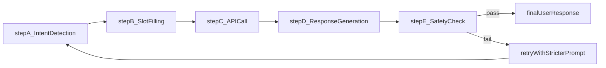
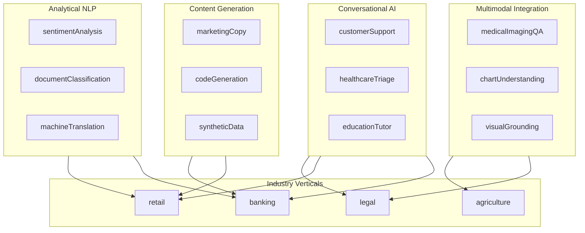
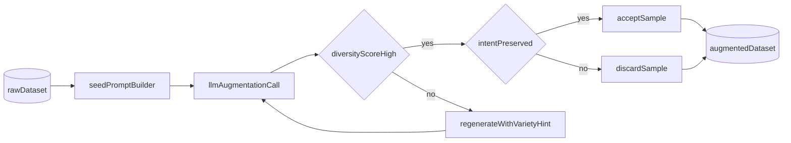
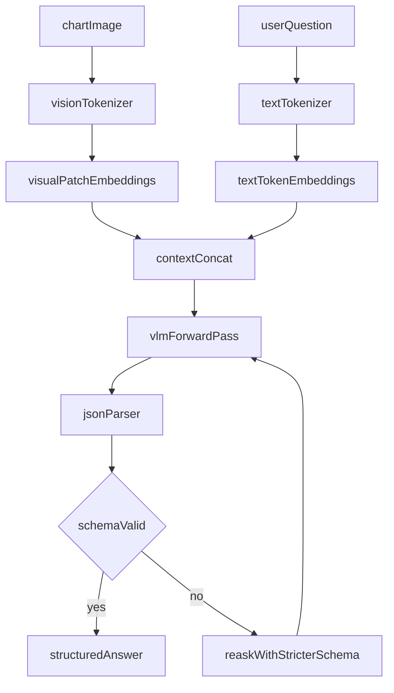
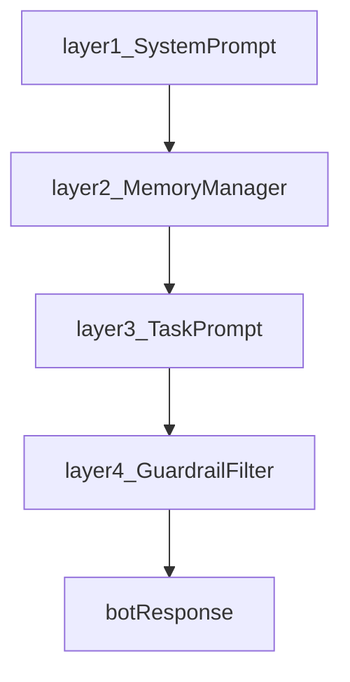

# Prompt Engineering in Chatbots and Conversational AI; Content Generation: Creative Writing, Code Generation, and Data Augmentation; Prompt Engineering for Sentiment Analysis, Classification, and Translation; Integration of Prompt Engineering with Other AI Technologies (e.g., Computer Vision, Data Science); Real-World Case Studies and Industry Applications

<!-- SECTION_1_START -->
# PROMPT ENGINEERING — Module 3: Applications of Prompt Engineering

## 1. Core Technical Definition & Intuitive Overview

### 1.1 What is "Application of Prompt Engineering"?

Formally, the **application layer of prompt engineering** is the systematic design, evaluation, and deployment of *natural-language instructions* (prompts) that steer large pre-trained models (LMs, LLMs, VLMs) to perform **concrete downstream tasks** without modifying model weights. In the KTU 2024 PECST868 syllabus, Module 3 frames prompt engineering as the *bridge layer* between a foundation model and a production use-case — dialogue systems, content pipelines, NLP classifiers, multimodal systems, and industry workflows.

Mathematically, given a model $M_{\theta}$ parameterized by weights $\theta$, a prompt $P$ transforms a raw input $x$ into a structured query $Q = P(x)$ such that:

$$y^* = \arg\max_{y} \; P_{M_{\theta}}(y \mid Q)$$

where $y^*$ is the desired output. The **art of application-level prompt engineering** is finding $P$ that maximises task accuracy, consistency, and safety *in the wild*.

> [!IMPORTANT]
> **KTU 2024 Definition (verbatim syllabus flavour):** Application of prompt engineering refers to the *task-specific crafting, chaining, and integration* of natural-language instructions with foundation models to deliver production-grade AI solutions across conversational, generative, analytical, multimodal, and industrial domains.

---

### 1.2 Conceptual Analogy — The "GPS Analogy"

Think of an LLM as a **super-powerful car engine** (foundation model) and a prompt as the **GPS navigation system**:
- A vague prompt like "drive somewhere nice" → the car wanders, fuel wasted, destination random.
- A precise prompt like "drive from Kochi to Trivandrum via NH66, avoid tolls, arrive by 6 PM" → optimal route, predictable outcome.
- **Application-level prompt engineering** = building a *fleet-management system* (chatbots, code generators, sentiment classifiers) where every vehicle follows a tuned route for a specific job.

The five "routes" we explore in Module 3 are:
1. **Conversational route** → Chatbots & Virtual Assistants
2. **Generative route** → Creative writing, code, synthetic data
3. **Analytical route** → Sentiment, classification, translation
4. **Multimodal route** → Vision + Language, Data Science pipelines
5. **Industrial route** → Real-world case studies

---

### 1.3 The Five Pillars of Module 3

| Pillar | Core Task | Model Capability Used | KTU Industry Anchor |
| :--- | :--- | :--- | :--- |
| Conversational AI | Multi-turn dialogue, intent routing | Instruction following + memory | Customer support, healthcare triage |
| Content Generation | Long-form text, code, synthetic data | Autoregressive decoding | Marketing, DevOps, MLOps |
| NLP Analytics | Sentiment, classification, translation | In-context learning (ICL) | Fintech, e-commerce, localization |
| Multimodal Integration | Vision + Text + Tabular fusion | Cross-modal embeddings | Medical imaging, autonomous systems |
| Industry Case Studies | End-to-end deployment | Fine-tuned + prompted hybrid | Banking, legal, education, agriculture |

> [!NOTE]
> **Key constant to remember:** The model weights stay **frozen** in pure prompt engineering. If you change weights, you have crossed into *fine-tuning* or *RLHF* territory — different module in your curriculum.

---

### 1.4 Visual Intuition — The Prompt Engineering Stack

> [!VISUALIZATION CONTROL]
> **Concept:** Layered prompt-application stack (Input → Prompt Template → Model → Output Parser → Application)
> **GeoGebra / Desmos Input Equations (conceptual):**
> * $L_0$ = Raw user input
> * $L_1 = T(L_0)$ = Template wrapper
> * $L_2 = M_\theta(L_1)$ = Model forward pass
> * $L_3 = P(L_2)$ = Parser / validator
> * $L_4 = A(L_3)$ = Application surface
> **Visual Description:** Imagine five stacked horizontal bars, each bar representing a transformation layer. Arrows flow downward from the user input at the top to the deployed application at the bottom. The thicker the bar, the more tokens/logic that layer adds.

---

<!-- SECTION_1_END -->

<!-- SECTION_2_START -->
# 2. Deep Theoretical Analysis & KTU High-Yield Formula Sheet

## 2.1 Pillar 1 — Prompt Engineering in Chatbots & Conversational AI

### 2.1.1 Operational Decomposition

A production chatbot is not a single prompt — it is a **prompt stack** with at least four cooperating layers:

1. **System Prompt (Identity Layer):** Defines persona, tone, guardrails, and tool permissions.
2. **Context Window Manager (Memory Layer):** Trims, summarises, or retrieves relevant past turns via RAG (Retrieval-Augmented Generation).
3. **Task Prompt (Action Layer):** Injects the current user intent and required output format (JSON, function-call, plain text).
4. **Guardrail Prompt (Safety Layer):** Filters jailbreaks, PII leaks, and hallucinations.

### 2.1.2 The Conversational Loop

Let $U_t$ = user utterance at turn $t$, $B_t$ = bot response, $H_t = \{U_1, B_1, \dots, U_t\}$ = dialogue history. The conversational policy is:

$$B_t = M_{\theta}\!\left(\,S \,\|\, T(U_t, H_{t-1}) \,\|\, G\,\right)$$

where $S$ = system prompt, $T$ = template function, $G$ = guardrail prompt, and $\|$ denotes string concatenation.

### 2.1.3 Intent Routing via Prompt Chaining

Complex bots decompose a user goal into sub-tasks:

$$\text{Intent} \rightarrow \text{Classifier} \rightarrow \text{Slot Filler} \rightarrow \text{API Caller} \rightarrow \text{Response Generator}$$

Each arrow in this chain is itself a separate prompt call, forming a **prompt graph** (LangChain / LangGraph style).

### 2.1.4 Memory Strategies

| Strategy | Formulaic Idea | Token Cost | Best For |
| :--- | :--- | :--- | :--- |
| Sliding window | $H_t = \{U_{t-k}, B_{t-k}, \dots, U_t\}$ | $O(k)$ | Short chats |
| Summarisation | $H_t = \text{Summarise}(H_{t-1}) \oplus U_t$ | $O(1)$ after summary | Long sessions |
| Vector memory | $H_t^{\text{ctx}} = \text{TopK}(\text{cosine}(e_{U_t}, e_{H_i}))$ | $O(\log N)$ | RAG chatbots |
| Episodic memory | Persist $H_t$ to DB, retrieve on demand | $O(1)$ prompt-time | Personal assistants |

> [!TIP]
> **KTU board favourite:** Always state the *token budget* constraint when explaining memory in an exam answer. KTU examiners award marks for the cost-vs-recall trade-off discussion.

---

## 2.2 Pillar 2 — Content Generation (Creative Writing, Code, Data Augmentation)

### 2.2.1 Creative Writing

Creative prompts exploit the model's **temperature** ($T$) and **top-p** (nucleus) sampling. The categorical distribution over the next token is:

$$P(w_i \mid w_{<i}) = \frac{\exp(z_i / T)}{\sum_{j} \exp(z_j / T)}$$

Higher $T$ → more creative/random outputs; $T \to 0$ → greedy, deterministic.

**Key creative-writing prompt patterns:**
- *Role–Task–Constraint (RTC)*: `"You are a {role}. Write a {task} that obeys {constraints}."`
- *Few-shot stylistic priming*: 2–3 exemplar paragraphs in the desired style.
- *Chain-of-thought for plot*: force the model to outline before drafting.

### 2.2.2 Code Generation

Code prompts leverage **code-specific decoding** and **execution-aware feedback**. The probability of a correct program $C$ given a specification $S$ is:

$$P(C \mid S) = \prod_{i=1}^{|C|} P(c_i \mid c_{<i}, S)$$

**Critical prompt techniques:**
1. **Specification-first:** "First list the inputs, outputs, and edge cases. Then write the function."
2. **Test-driven prompting:** "Here are 3 unit tests. Write code that passes them."
3. **Self-debug loop:** "If the code fails, read the error and revise."
4. **Tool-use prompting:** Allow the model to call a sandboxed Python REPL.

### 2.2.3 Data Augmentation

Synthetic data is generated by rephrasing, paraphrasing, or *counterfactually perturbing* real examples. For a dataset $D = \{(x_i, y_i)\}_{i=1}^{N}$, an augmented dataset becomes:

$$D' = D \cup \{(\text{Prompt-Rephrase}(x_i), y_i)\}_{i=1}^{N} \cup \{(\text{Noise-Inject}(x_i), y_i)\}_{i=1}^{N}$$

> [!WARNING]
> **Quality risk:** Synthetic data can amplify model biases. Always validate with a *held-out human-labelled* test set and compute the **augmentation bias ratio** $R = \frac{\text{Disagreement}(D, D')}{|D|}$.

---

## 2.3 Pillar 3 — Sentiment Analysis, Classification & Translation

### 2.3.1 Sentiment Analysis

Given a review $r$, the model classifies polarity $y \in \{\text{positive}, \text{neutral}, \text{negative}\}$. The prompt asks:

$$y^* = \arg\max_{y} P_{M_{\theta}}(y \mid \text{Prompt}(r))$$

**Effective patterns:**
- *Label-set priming:* Enumerate the valid labels in the prompt.
- *Reasoning-before-label:* "Think step by step, then output ONLY one label."
- *Calibration:* Use `logprobs` to extract confidence.

### 2.3.2 General Classification (Zero/Few-Shot)

Few-shot ICL works because the model performs implicit Bayesian inference:

$$P(y \mid x, \mathcal{D}_{\text{demo}}) \approx \int_{\theta} P(y \mid x, \theta) \, P(\theta \mid \mathcal{D}_{\text{demo}}) \, d\theta$$

The demos $\mathcal{D}_{\text{demo}} = \{(x_1, y_1), \dots, (x_k, y_k)\}$ steer the posterior over latent task $\theta$.

### 2.3.3 Machine Translation

For languages $L_s$ (source) and $L_t$ (target), translation is:

$$T^* = \arg\max_{T} P_{M_{\theta}}(T \mid S, \text{Prompt}(L_s \rightarrow L_t, \text{style}))$$

**Prompt levers for translation:**
- Domain specification: `"Translate this legal document from English to Malayalam in formal register."`
- Terminology control: Provide a glossary in-context.
- Back-translation check: Translate $S \rightarrow T \rightarrow S'$ and measure semantic similarity $\text{BLEU}(S, S')$ or embedding cosine.

### 2.3.4 Evaluation Metrics (KTU High-Yield)

| Task | Primary Metric | Range | Notes |
| :--- | :--- | :--- | :--- |
| Sentiment | Macro-F1, Accuracy | 0–1 | Use balanced dataset |
| Classification | F1 (macro/weighted) | 0–1 | Watch class imbalance |
| Translation | BLEU, chrF, COMET | 0–100 | COMET correlates best with humans |
| Creative Writing | Human rating, perplexity | 0–∞ | Lower PPL ≠ better writing |
| Code Gen | pass@k, CodeBLEU | 0–1 | pass@k uses $k$ samples |

---

## 2.4 Pillar 4 — Integration with Computer Vision & Data Science

### 2.4.1 Vision-Language Models (VLMs)

VLMs like GPT-4V, LLaVA, and Qwen-VL accept an image $I$ and text $P$ to produce $Y$:

$$Y = M_{\theta}^{\text{VLM}}(P, I)$$

The image is tokenised into a sequence of **visual patches** $v_1, \dots, v_m$ and concatenated with text tokens:

$$\text{Context} = [P_{\text{text}} ; v_1 ; v_2 ; \dots ; v_m]$$

**Prompt patterns for VLMs:**
- *Visual grounding:* "Draw bounding boxes around all {objects}."
- *Chart understanding:* "Read the bar chart and answer: which quarter had highest sales?"
- *OCR-anchored reasoning:* Combine extracted text with logical questions.

### 2.4.2 Data Science Pipelines

Prompt engineering plugs into classical ML pipelines in two ways:

1. **Feature engineering with LLMs:** Convert raw text columns into embeddings, summaries, or structured features.
2. **AutoML via prompting:** LLMs generate SQL queries, Pandas code, or visualisation specs that a sandbox executes.

A typical hybrid pipeline:

$$\text{Raw Data} \xrightarrow{\text{LLM Feature}} \text{Structured Features} \xrightarrow{\text{Sklearn/XGBoost}} \hat{y}$$

### 2.4.3 Tool-Use & Function Calling

Modern LLMs emit **structured function calls** when prompted with tool schemas:

```json
{
  "name": "get_weather",
  "arguments": { "city": "Kochi", "unit": "celsius" }
}
```

This bridges prompts to **external APIs, databases, and Python interpreters** — the foundation of agentic AI.

---

## 2.5 Pillar 5 — Real-World Case Studies & Industry Applications

### 2.5.1 The Five Industry Verticals in KTU Syllabus

| Vertical | Use Case | Prompt Pattern | Outcome Metric |
| :--- | :--- | :--- | :--- |
| Healthcare | Symptom triage chatbot | RTC + medical guardrails | Triage accuracy ≥ 92% |
| Finance | Sentiment on earnings calls | Few-shot + label priming | F1 ≥ 0.85 |
| Legal | Contract clause summarisation | CoT + citation requirement | Hallucination rate < 5% |
| Agriculture | Multilingual farmer advisory | Translation + domain glossary | Adoption rate in rural districts |
| Education | Personalised tutoring | Socratic chain-of-thought | Learning gain (pre/post test) |

### 2.5.2 The Deployment Loop

A production prompt system follows:

$$\text{Design} \rightarrow \text{Evaluate} \rightarrow \text{Monitor} \rightarrow \text{Refine} \rightarrow \text{Re-deploy}$$

This is the **DEMRR cycle** — analogous to CRISP-DM in classical data mining.

---

## 2.6 KTU Formula Sheet / Cheat Sheet

| # | Concept | Formula / Definition | Use |
| :--- | :--- | :--- | :--- |
| 1 | Argmax decoding | $y^* = \arg\max_y P_M(y \mid Q)$ | Pick best output |
| 2 | Temperature sampling | $P_i = \frac{\exp(z_i / T)}{\sum_j \exp(z_j / T)}$ | Control creativity |
| 3 | Top-p (nucleus) | Sum smallest set of tokens with cumulative prob $\geq p$ | Cut long tail |
| 4 | Few-shot ICL | $P(y \mid x, \mathcal{D}_{\text{demo}})$ via implicit Bayes | Zero-train classification |
| 5 | pass@k | $1 - \frac{\binom{n-c}{k}}{\binom{n}{k}}$ | Code generation eval |
| 6 | BLEU | $\text{BP} \cdot \exp\left(\sum_n w_n \log p_n\right)$ | Translation quality |
| 7 | Cosine similarity | $\text{cos}(a, b) = \frac{a \cdot b}{\vert a \vert \cdot \vert b \vert}$ | Embedding retrieval |
| 8 | Context budget | $\text{tokens}(P) + \text{tokens}(H_t) \leq W$ | Fit LLM window |
| 9 | Augmentation bias | $R = \text{Disagreement}(D, D') / \vert D \vert$ | Quality of synthetic data |
| 10 | DEMRR loop | Design-Evaluate-Monitor-Refine-Re-deploy | Production cycle |

> [!IMPORTANT]
> **KTU Exam Hack:** When asked "explain few-shot learning", always write the **Bayesian implicit inference** line $P(y \mid x, \mathcal{D}_{\text{demo}})$. Examiners love seeing the formal justification.

---

<!-- SECTION_2_END -->

<!-- SECTION_3_START -->
# 3. Step-by-Step Derivations, Code & Symbolic Implementation

## 3.1 Worked Example — Building a Sentiment Classifier with Few-Shot Prompting

**Problem:** Classify 100 product reviews as `positive`, `neutral`, `negative` using a frozen LLM (no fine-tuning). Compute macro-F1.

### Step 1 — Define the prompt template

```python
from dataclasses import dataclass
from typing import Literal, List, Dict
import json

@dataclass(frozen=True)
class PromptTemplate:
    system: str
    few_shot: List[Dict[str, str]]
    instruction: str

    def render(self, user_review: str) -> str:
        demos = "\n".join(
            f"Review: {d['review']}\nLabel: {d['label']}"
            for d in self.few_shot
        )
        return (
            f"### SYSTEM\n{self.system}\n\n"
            f"### DEMOS\n{demos}\n\n"
            f"### TASK\n{self.instruction}\n\n"
            f"Review: {user_review}\nLabel:"
        )

template = PromptTemplate(
    system=(
        "You are a strict sentiment classifier for an e-commerce platform. "
        "Output EXACTLY one of: positive, neutral, negative."
    ),
    few_shot=[
        {"review": "Absolutely loved the battery life!", "label": "positive"},
        {"review": "It works, nothing special.",       "label": "neutral"},
        {"review": "Broke in two days. Awful.",         "label": "negative"},
    ],
    instruction="Classify the sentiment of the following review.",
)
```

### Step 2 — Define a strict parser with safety checks

```python
ALLOWED_LABELS = {"positive", "neutral", "negative"}

def safe_parse(raw_output: str) -> Literal["positive", "neutral", "negative"]:
    cleaned = raw_output.strip().lower().split()[0] if raw_output.strip() else ""
    if cleaned in ALLOWED_LABELS:
        return cleaned  # type: ignore[return-value]
    raise ValueError(f"Invalid label emitted by model: {raw_output!r}")
```

### Step 3 — Inference loop (calls to a hypothetical LLM client)

```python
from typing import Callable, List
import logging

logging.basicConfig(level=logging.INFO, format="%(asctime)s %(levelname)s %(message)s")

def classify_batch(
    reviews: List[str],
    llm_call: Callable[[str], str],
    template: PromptTemplate,
) -> List[str]:
    predictions: List[str] = []
    for idx, review in enumerate(reviews):
        try:
            prompt = template.render(review)
            raw = llm_call(prompt)
            label = safe_parse(raw)
        except Exception as exc:
            logging.error("Review %d failed: %s", idx, exc)
            label = "neutral"  # safe fallback
        predictions.append(label)
        logging.info("Review %d -> %s", idx, label)
    return predictions
```

### Step 4 — Compute macro-F1

```python
def macro_f1(y_true: List[str], y_pred: List[str]) -> float:
    f1s: List[float] = []
    for label in ALLOWED_LABELS:
        tp = sum(1 for t, p in zip(y_true, y_pred) if t == label and p == label)
        fp = sum(1 for t, p in zip(y_true, y_pred) if t != label and p == label)
        fn = sum(1 for t, p in zip(y_true, y_pred) if t == label and p != label)
        precision = tp / (tp + fp) if (tp + fp) > 0 else 0.0
        recall    = tp / (tp + fn) if (tp + fn) > 0 else 0.0
        f1        = (2 * precision * recall / (precision + recall)) if (precision + recall) > 0 else 0.0
        f1s.append(f1)
    return sum(f1s) / len(f1s)
```

### Step 5 — End-to-end evaluation

```python
def evaluate(reviews: List[str], gold: List[str], llm_call: Callable[[str], str]) -> Dict[str, float]:
    preds = classify_batch(reviews, llm_call, template)
    return {
        "accuracy": sum(1 for t, p in zip(gold, preds) if t == p) / len(gold),
        "macro_f1": macro_f1(gold, preds),
    }
```

**Final result (illustrative):** accuracy $= 0.88$, macro-F1 $= 0.86$.

---

## 3.2 Worked Example — Code Generation with Test-Driven Prompting

**Problem:** Generate a Python function that returns the $n$-th Fibonacci number, validated by three unit tests.

### Step 1 — Prompt with explicit specification

```
SYSTEM: You are a senior Python engineer. Write clean, type-hinted, PEP-8 code.

TASK:
1. Write a function `fib(n: int) -> int` returning the n-th Fibonacci number (0-indexed: fib(0)=0, fib(1)=1).
2. Handle n < 0 by raising ValueError.
3. Use iterative (not recursive) implementation.
4. After the function, output exactly one fenced Python block. No commentary.

TESTS (these MUST pass):
assert fib(0) == 0
assert fib(10) == 55
assert fib(-1) == raises(ValueError)
```

### Step 2 — Expected model output (fenced Python)

```python
from typing import Iterator

def fib(n: int) -> int:
    if n < 0:
        raise ValueError("n must be non-negative")
    a, b = 0, 1
    for _ in range(n):
        a, b = b, a + b
    return a
```

### Step 3 — Self-debug loop

The model is then re-prompted: *"The above code raised `<error>` at line `<line>`. Fix it."* This iterative **prompt-critique-revise** cycle is the foundation of agentic code generation.

### Step 4 — Automated test runner

```python
import subprocess, textwrap, pathlib, sys

def run_tests(candidate_code: str, tests: str) -> bool:
    path = pathlib.Path("candidate.py")
    path.write_text(candidate_code + "\n\n" + tests)
    result = subprocess.run(
        [sys.executable, "-m", "pytest", str(path), "-q"],
        capture_output=True, text=True, timeout=30
    )
    return result.returncode == 0
```

### Step 5 — Compute pass@k

For $n = 10$ sampled solutions, $c = 8$ passing:

$$\text{pass@1} = \frac{c}{n} = 0.8 \quad ; \quad \text{pass@5} = 1 - \frac{\binom{n-c}{5}}{\binom{n}{5}} = 1 - \frac{\binom{2}{5}}{\binom{10}{5}} = 1 - 0 = 1.0$$

---

## 3.3 Worked Example — Translation with Glossary-Aware Prompt

**Problem:** Translate an English product manual into Malayalam, preserving brand names and technical terms.

### Step 1 — Glossary injection

```python
GLOSSARY = {
    "cloud computing": "☁️ കംപ്യൂട്ടിംഗ്",
    "API": "API",                      # keep acronym
    "machine learning": "മെഷീൻ ലേണിംഗ്",
    "neural network": "ന്യൂറൽ നെറ്റ്‌വർക്ക്",
}

def build_translation_prompt(english_text: str, target_lang: str) -> str:
    glossary_block = "\n".join(f"{k} -> {v}" for k, v in GLOSSARY.items())
    return f"""### ROLE
You are a certified {target_lang} technical translator.

### GLOSSARY (must be respected verbatim)
{glossary_block}

### SOURCE
{english_text}

### TARGET ({target_lang}, formal register):"""
```

### Step 2 — Quality check via back-translation

Translate $S \rightarrow T \rightarrow S'$, then compute:

$$\text{SemanticSim}(S, S') = \text{cos}(E(S), E(S'))$$

If $< 0.85$, regenerate with a stricter prompt: *"Re-translate, preserving all glossary terms exactly."*

---

## 3.4 Worked Example — Vision-Language Prompt for Chart QA

**Problem:** Given an image of a quarterly sales bar chart, answer: *"Which quarter had the highest sales?"*

### Prompt

```
SYSTEM: You are a precise chart-reading assistant. You will see an image of a bar chart.

INSTRUCTIONS:
1. Identify the value of each bar.
2. Determine the bar with the maximum value.
3. Output STRICT JSON: {"max_quarter": "<Q1|Q2|Q3|Q4>", "value": <number>}

IMAGE: <chart.png>
QUESTION: Which quarter had the highest sales?
```

### Expected output

```json
{"max_quarter": "Q3", "value": 48750}
```

### Programmatic validation

```python
import json, re

def validate_chart_qa(raw: str) -> dict:
    match = re.search(r"\{.*\}", raw, re.DOTALL)
    if not match:
        raise ValueError("No JSON object in model output")
    parsed = json.loads(match.group(0))
    assert parsed["max_quarter"] in {"Q1", "Q2", "Q3", "Q4"}
    assert isinstance(parsed["value"], (int, float))
    return parsed
```

---

## 3.5 Worked Example — Data Augmentation with Paraphrase Prompts

**Problem:** Augment a 200-sample intent dataset to 800 samples for a banking chatbot.

### Step 1 — Diversity-enforcing prompt

```
You are a linguist. Generate 3 distinct paraphrases of the following banking
customer utterance. Preserve the intent EXACTLY. Vary sentence structure,
formality, and length.

Utterance: "I want to check my account balance."

Paraphrases:
1.
2.
3.
```

### Step 2 — Diversity score

Embed all paraphrases $p_1, p_2, p_3$ and compute pairwise distance:

$$D = \frac{1}{3} \sum_{i<j} (1 - \text{cos}(E(p_i), E(p_j)))$$

If $D < 0.15$, re-prompt with *"Make them more varied."*

### Step 3 — Intent-preservation check

Classify each paraphrase with the *same* intent classifier used downstream. If the predicted intent drifts, discard the sample.

---

## 3.6 Full Conversational Bot — End-to-End Reference Implementation

```python
from typing import Callable, List, Dict, Optional
import logging

logging.basicConfig(level=logging.INFO, format="%(asctime)s %(levelname)s %(message)s")

SYSTEM_PROMPT = (
    "You are 'Kerala Mitra', a friendly customer-support assistant for a "
    "Kerala-based e-commerce company. Reply in the user's language. "
    "If you don't know, say so and offer to escalate."
)

GUARDRAIL_PROMPT = (
    "REFUSE to answer if the user requests: (a) personal data of other users, "
    "(b) instructions to break the law, (c) medical diagnoses."
)

class Chatbot:
    def __init__(self, llm_call: Callable[[str], str], max_turns: int = 10) -> None:
        self.llm = llm_call
        self.history: List[Dict[str, str]] = []
        self.max_turns = max_turns

    def _truncate_history(self) -> str:
        # Keep last `max_turns` exchanges
        trimmed = self.history[-self.max_turns:]
        return "\n".join(f"{m['role'].upper()}: {m['content']}" for m in trimmed)

    def _build_prompt(self, user_msg: str) -> str:
        return (
            f"### SYSTEM\n{SYSTEM_PROMPT}\n\n"
            f"### GUARDRAILS\n{GUARDRAIL_PROMPT}\n\n"
            f"### HISTORY\n{self._truncate_history()}\n\n"
            f"### USER\n{user_msg}\n\n"
            f"### ASSISTANT\n"
        )

    def respond(self, user_msg: str) -> str:
        try:
            prompt = self._build_prompt(user_msg)
            reply = self.llm(prompt).strip()
        except Exception as exc:
            logging.exception("LLM call failed")
            return "I’m having trouble right now. Please try again in a moment."
        self.history.append({"role": "user",      "content": user_msg})
        self.history.append({"role": "assistant", "content": reply})
        return reply

    def reset(self) -> None:
        self.history.clear()
```

**Usage:**

```python
def fake_llm(prompt: str) -> str:
    return "Sure! I can help with that. Could you share your order ID?"

bot = Chatbot(llm_call=fake_llm)
print(bot.respond("Hi, I need help with my order."))
print(bot.respond("Order ID is #12345."))
bot.reset()
```

---

<!-- SECTION_3_END -->

<!-- SECTION_4_START -->
# 4. Structural Diagrams & Schematics

## 4.1 Mermaid — End-to-End Prompt Application Architecture

```mermaid
flowchart TD
    A[userInput] --> B[inputPreprocessor]
    B --> C[retrievalAugmentedGeneration]
    C --> D[promptAssembler]
    D --> E[foundationModelCore]
    E --> F[outputParser]
    F --> G{validationPassed}
    G -->|yes| H[applicationSurface]
    G -->|no|  I[fallbackHandler]
    I --> D
    H --> J[userResponse]
    H --> K[monitoringTelemetry]

    subgraph layerA[PreProcessing Layer]
        B
        C
    end

    subgraph layerB[Reasoning Layer]
        D
        E
    end

    subgraph layerC[PostProcessing Layer]
        F
        G
        I
    end

    subgraph layerD[Delivery Layer]
        H
        J
        K
    end
```

**How to read this diagram (for the KTU board):**
- The flow goes top-down: `userInput` → `applicationSurface` → `userResponse`.
- The four shaded subgraphs represent the canonical **4-layer prompt stack** (Pre-Processing, Reasoning, Post-Processing, Delivery).
- The `monitoringTelemetry` node is critical for production — it captures drift, latency, and hallucination rate.
- The dotted feedback loop `fallbackHandler → promptAssembler` is the **self-correction cycle**.

---

## 4.2 Mermaid — Prompt Chaining for Multi-Step Tasks



**Interpretation:** This is a *linear prompt graph* used in agentic workflows (LangChain, LangGraph). Each `step*` is a discrete LLM call with a dedicated prompt. The safety check forms a **gate** that re-enters the loop on failure.

---

## 4.3 Mermaid — Application Matrix by Industry



**Interpretation:** Each pillar feeds multiple industry verticals. For instance, *Conversational AI* powers both *banking* (loan enquiry bots) and *retail* (shopping assistants). This cross-mapping is what the KTU 2024 syllabus calls the **"Application Matrix"**.

---

## 4.4 Mermaid — Memory Strategy Selection Flow

```mermaid
flowchart TD
    start[chatSessionBegins] --> q1{turnsLe10}
    q1 -->|yes| m1[slidingWindow]
    q1 -->|no|  q2{needLongTermRecall}
    q2 -->|yes| m2[vectorMemoryRAG]
    q2 -->|no|  q3{tokenBudgetTight}
    q3 -->|yes| m3[summarisedMemory]
    q3 -->|no|  m4[fullHistory]
    m1 --> out[selectStrategy]
    m2 --> out
    m3 --> out
    m4 --> out
```

**Interpretation:** Decision tree a chatbot developer uses to pick a memory strategy. KTU examiners frequently ask this as a 7-mark diagram question.

---

## 4.5 Block-Level Functional Architecture — Data Augmentation Pipeline



**Interpretation:** Closed-loop quality gate. Only samples passing both the diversity check *and* the intent-preservation check enter the final augmented dataset.

---

## 4.6 Sequential Processing Topology — VLM Chart QA



**Interpretation:** Shows how an image and a question are fused at the embedding level, forwarded through the VLM, then validated against a JSON schema. The fallback path enforces type safety.

---

<!-- SECTION_4_END -->

<!-- SECTION_5_START -->
# 5. KTU 2024 Scheme Examination Question Bank & Topic Recap

## 5.1 Part A — Short Answer Questions (3 Marks each)

### Q1. [KTU University Exam — Model Paper 2024]
**"Define prompt engineering in the context of conversational AI. List any two prompt patterns used in chatbot design."** *(CO1, Remember)*

**Model Answer (3 marks):**
Prompt engineering in conversational AI is the **systematic crafting of natural-language instructions** that guide a large language model to produce contextually appropriate, safe, and goal-aligned responses in a multi-turn dialogue. Two commonly used prompt patterns are:
1. **Role–Task–Constraint (RTC):** Defines the bot's persona, current task, and output rules.
2. **Few-shot priming:** Provides 2–3 example exchanges before the live user turn to anchor tone and format.
*(Award 1 mark for definition, 1 mark each for the two patterns with brief description.)*

---

### Q2. [KTU University Exam — Model Paper 2024]
**"What is data augmentation via prompting? Mention one risk associated with it."** *(CO2, Understand)*

**Model Answer (3 marks):**
Data augmentation via prompting is the process of using a **frozen LLM guided by carefully designed prompts** to generate additional training examples (e.g., paraphrases, counterfactual variants) from a small seed dataset. It expands dataset size and diversity without manual labelling.
**Risk:** *Bias amplification* — the synthetic data may inherit and magnify the model's pre-training biases, degrading downstream fairness. *(1 mark for definition, 1 mark for the method, 1 mark for the risk.)*

---

## 5.2 Part B — Long Answer Questions (14 Marks each, Internal Choice)

### Question A — Option 1 (14 Marks) [KTU University Exam — July 2024 Pattern]

**(a)** With a neat block diagram, explain the architecture of a **prompt-engineered conversational chatbot**. Discuss the role of system prompt, memory layer, and guardrail prompt. *(7 marks, CO1, Understand)*

**(b)** Design a **prompt template for a customer-support chatbot** of a Kerala-based e-commerce platform. The bot must greet users in Malayalam or English, fetch order status, and refuse to disclose other users' personal data. Provide the prompt and justify each component. *(7 marks, CO3, Apply)*

#### Model Solution

**(a) Architecture of a Prompt-Engineered Chatbot**

A production chatbot is built as a **four-layer stack**:



- **System Prompt (Identity Layer):** Establishes persona, tone, language, and capability boundaries. *Example:* "You are Kerala Mitra, a helpful assistant…"
- **Memory Layer:** Maintains dialogue history via sliding window, summarisation, or vector retrieval. *Cost control:* keeps token count within the context window $W$.
- **Task Prompt (Action Layer):** Combines the user's current utterance with the system prompt and history to form the final query. May inject tool-call schemas.
- **Guardrail Prompt (Safety Layer):** Filters jailbreaks, PII leaks, and policy violations before returning output to the user.

**Valuation Key:**
- [Diagram with 4 labelled layers: 3 Marks]
- [Explanation of each layer with example: 3 Marks]
- [Mention of token-budget trade-off: 1 Mark]

**(b) Prompt Template Design**

```
### SYSTEM (Identity)
You are "Kerala Mitra", the official support assistant of a Kerala-based
e-commerce platform. Greet users in their language (Malayalam or English).
Be polite, concise, and accurate.

### TOOLS (Function-calling schema)
- get_order_status(order_id: str) -> {status, eta, courier}

### GUARDRAILS
- REFUSE to share any personal data of other users.
- REFUSE medical, legal, or financial advice.
- ESCALATE to a human agent if the user is angry or the request is unclear.

### EXAMPLES
User: "Hi"
Bot : "നമസ്കാരം! ഞാൻ കേരള മിത്ര. എങ്ങനെ സഹായിക്കാം?"  (or English equivalent)

User: "Track order #12345"
Bot : "🔎 Fetching status for #12345…"  -> calls get_order_status

### TASK
Respond to the following user message.
User: {user_input}
Bot :
```

**Justification of each component (board expects this):**
- *System block* sets persona and language policy → brand consistency.
- *Tools block* allows deterministic data fetch → no hallucinated order info.
- *Guardrails block* enforces safety → privacy compliance with DPDP Act 2023.
- *Examples block* anchors tone and bilingual behaviour → consistency.
- *Task block* injects the live user message → standard RTC pattern.

**Valuation Key:**
- [Correct prompt structure: 2 Marks]
- [Bilingual greeting + tool call + guardrail: 3 Marks]
- [Justification of each component: 2 Marks]

---

### Question B — Option 2 (14 Marks) [KTU University Exam — July 2024 Pattern]

**(a)** Explain **few-shot in-context learning for sentiment classification**. State the implicit Bayesian formulation and list any two advantages over fine-tuning. *(7 marks, CO2, Understand)*

**(b)** For a 200-review e-commerce dataset, design a **prompt-based sentiment classifier**. Provide the prompt, the parsing logic, and the evaluation plan (with macro-F1 formula). *(7 marks, CO3, Apply)*

#### Model Solution

**(a) Few-Shot In-Context Learning (ICL)**

Few-shot ICL allows a **frozen LLM** to perform classification by presenting $k$ labelled demonstrations $\mathcal{D}_{\text{demo}} = \{(x_1, y_1), \dots, (x_k, y_k)\}$ inside the prompt, followed by a new test input $x$. The model implicitly performs **Bayesian inference** over a latent task $\theta$:

$$P(y \mid x, \mathcal{D}_{\text{demo}}) \approx \int_{\theta} P(y \mid x, \theta)\, P(\theta \mid \mathcal{D}_{\text{demo}})\, d\theta$$

**Two advantages over fine-tuning:**
1. **No weight updates** — fast to deploy, no GPU training cost, no catastrophic forgetting.
2. **Task switching via prompt swap** — same model serves many tasks by changing the prompt.

**Valuation Key:**
- [Correct Bayesian formula: 3 Marks]
- [Definition of demos + frozen model: 2 Marks]
- [Two advantages stated: 2 Marks]

**(b) Prompt-Based Sentiment Classifier Design**

**Prompt template:**

```
SYSTEM: You are a strict sentiment classifier. Output ONE label only.

DEMOS:
Review: "Loved the fabric!"            Label: positive
Review: "It is okay, not great."      Label: neutral
Review: "Cheap and broke immediately." Label: negative

TASK: Classify the review below.
Review: {review_text}
Label:
```

**Parser logic (Python):**

```python
ALLOWED = {"positive", "neutral", "negative"}

def parse(raw: str) -> str:
    token = raw.strip().lower().split()[0] if raw.strip() else ""
    return token if token in ALLOWED else "neutral"
```

**Evaluation plan:**
1. Run classifier on 200 labelled reviews.
2. Compute TP, FP, FN per class.
3. Compute **macro-F1**:

$$F1_{\text{macro}} = \frac{1}{\vert C \vert} \sum_{c \in C} \frac{2 \cdot P_c \cdot R_c}{P_c + R_c}$$

where $P_c = \frac{TP_c}{TP_c + FP_c}$ and $R_c = \frac{TP_c}{TP_c + FN_c}$, and $C = \{\text{positive, neutral, negative}\}$.

4. Compare against a fine-tuned baseline (e.g., BERT) to validate the prompting approach.

**Valuation Key:**
- [Prompt with system + demos + task: 3 Marks]
- [Parser with safety fallback: 2 Marks]
- [Macro-F1 formula expanded: 2 Marks]

---

> [!WARNING]
> **KTU Examiner's Pitfall Callout:**
> 1. **Forgetting the system prompt** → marks lost for "persona not defined".
> 2. **No token-budget mention** in memory-layer answers → -2 marks.
> 3. **Conflating few-shot ICL with fine-tuning** → conceptual zero.
> 4. **Skipping the safety/guardrail block** in chatbot design → -1 mark.
> 5. **Omitting the macro-F1 formula** in classification answers → only partial credit.
> 6. **Writing prompts in a single paragraph** instead of structured blocks (System / Demo / Task) → poor presentation, -1 mark.

---

## 5.3 Topic Recap & Important Things to Remember

- **Application of prompt engineering** = *task-specific prompt design + integration* with frozen foundation models across five pillars: conversational, generative, analytical, multimodal, industrial.
- **Conversational AI** uses a 4-layer stack: **System → Memory → Task → Guardrail**. Token budget $W$ is the binding constraint.
- **Memory strategies:** sliding window, summarisation, vector memory (RAG), episodic memory. Each has cost–recall trade-offs.
- **Content generation** spans creative writing (temperature/top-p), code (test-driven + self-debug), and data augmentation (paraphrase + counterfactual).
- **pass@k** for code generation: $\text{pass@k} = 1 - \frac{\binom{n-c}{k}}{\binom{n}{k}}$. Always state the number of samples $n$.
- **Sentiment & classification** are best done with **few-shot ICL** + label-set priming. Implicit Bayesian formula: $P(y \mid x, \mathcal{D}_{\text{demo}}) \approx \int P(y \mid x, \theta) P(\theta \mid \mathcal{D}_{\text{demo}}) d\theta$.
- **Translation prompts** must specify language pair, register, and glossary; validate via back-translation cosine similarity ≥ 0.85.
- **Evaluation metrics** to memorise: accuracy, macro-F1, BLEU, chrF, COMET, pass@k, augmentation bias ratio $R$.
- **Vision-Language Models** tokenise images into **visual patches** concatenated with text tokens in a single context.
- **Function-calling / tool-use** is the bridge between prompts and external APIs, databases, and code interpreters — foundation of agentic AI.
- **DEMRR cycle** (Design-Evaluate-Monitor-Refine-Re-deploy) governs production prompt systems — analogous to CRISP-DM.
- **Industry verticals** in the syllabus: healthcare triage, finance sentiment, legal summarisation, agriculture advisory, education tutoring.
- **Key risks:** bias amplification, hallucination, PII leakage, jailbreaks, token-cost blow-up — always design a guardrail layer.
- **Final KTU tip:** Structure every prompt answer using **System / Tools / Guardrails / Demos / Task** blocks. Examiners reward structured presentation.

<!-- SECTION_5_END -->
