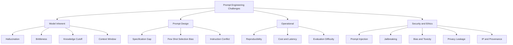
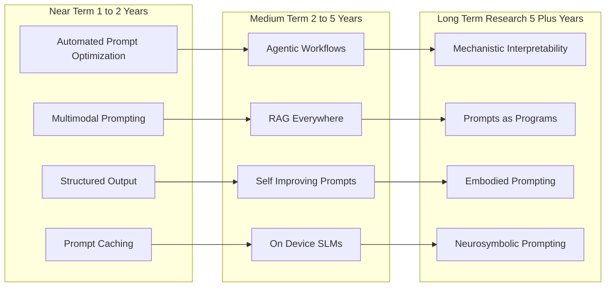
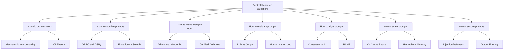
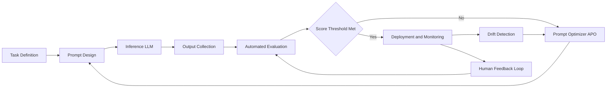

# Challenges, Future Trends, and Research in Prompt Engineering :-

<!-- SECTION_1_START -->

# Challenges, Future Trends, and Research in Prompt Engineering

## 1. Core Technical Definition & Intuitive Overview

### Formal Academic Definition

> [!IMPORTANT]
> **Prompt Engineering** in its contemporary form refers to the systematic discipline of designing, optimizing, and evaluating natural language instructions (prompts) to elicit reliable, accurate, and contextually aligned outputs from large language models (LLMs). The *challenges* within this discipline encompass technical limitations (hallucination, brittleness, prompt injection), ethical constraints (bias, fairness, safety), and operational issues (scalability, reproducibility). *Future trends* denote emerging paradigms such as automated prompt optimization, multimodal prompting, and agentic LLM systems. *Research* constitutes the academic and industrial investigations aiming to formalize prompt design as a first-class discipline within machine learning, akin to hyperparameter tuning or architecture search.

In the KTU 2024 Scheme (NEP 2020 aligned) framing, the subject is positioned under **Humanities and Engineering Electives** with a strong emphasis on **practical AI literacy**, **responsible AI deployment**, and **research awareness**.

### Conceptual Analogy / Intuition

> [!NOTE]
> **Real-World Analogy — The Translator and the Bilingual Judge**
> Imagine you are speaking to a brilliant but extremely literal foreign diplomat who knows every word in your language yet has **no shared cultural context** with you. You (the *prompter*) must phrase every request so that:
> 1. The diplomat understands exactly what you want (precision),
> 2. The diplomat does not invent facts to please you (groundedness),
> 3. The diplomat does not suddenly comply with a malicious bystander's request hijacking your conversation (security),
> 4. The diplomat performs consistently whether asked at 9 AM or 9 PM (robustness).
>
> The challenges in prompt engineering are essentially the difficulties in becoming a *good translator* for a powerful but non-human intelligence. Future trends point toward building *interpreters that learn your style* automatically, and research is the formal study of what makes a "good translation."

### Key Terminology (KTU High-Yield Glossary)

| Term | Plain Definition |
|---|---|
| **Hallucination** | When the LLM generates factually false but plausible-sounding content. |
| **Prompt Injection** | A security exploit where adversarial input overrides or hijacks the system prompt. |
| **Brittleness** | The phenomenon where a small change in prompt wording causes a large change in output quality. |
| **In-Context Learning (ICL)** | The LLM's ability to learn new tasks from examples provided inside the prompt itself. |
| **Chain-of-Thought (CoT)** | A prompting technique that elicits intermediate reasoning steps from the model. |
| **Alignment** | Ensuring the model's behavior is consistent with human values and intent. |
| **Autonomous Agents** | LLM-driven systems that plan, use tools, and execute multi-step tasks independently. |

> [!TIP]
> **Syllabus Highlight:** KTU Module 4 expects students to (1) identify the technical and ethical challenges of LLM deployment, (2) describe emerging research directions such as RAG (Retrieval-Augmented Generation) and DSPy/OPRO-style automated optimization, and (3) articulate a research-level awareness of the field's trajectory.

### Core Constants and Reference Metrics

- **Model context window size** (typical contemporary values): **4K – 200K tokens**, with some production systems exceeding **1M tokens**.
- **Standard evaluation metrics**: **BLEU, ROUGE-L, BERTScore, Exact Match (EM), F1, pass@k, win-rate**.
- **Reference safety benchmarks**: **TruthfulQA, MMLU, HumanEval, BIG-bench Hard, BBQ (Bias Benchmark)**.
- **Standard temperature parameter range**: **$T \in [0.0,\ 2.0]$** where lower values yield deterministic outputs.

> [!VISUALIZATION CONTROL]
> **Concept:** The "Prompt Quality Landscape" — a 3D conceptual map relating prompt clarity (x-axis), model capability (y-axis), and output reliability (z-axis).
> **Conceptual Equations:**
> * `Reliability(P, M) = f(Clarity(P), Capability(M), Contextual_Grounding(P))`
> * Where $P$ is the prompt, $M$ is the model, and the surface shows a non-monotonic relationship (a slightly *worse* prompt can sometimes yield *better* outputs because of how attention heads distribute probability mass).
> **Visual Description:** A rolling-hills surface where local maxima represent brittle "lucky" prompts and broad plateaus represent robust, well-engineered prompts. The student should observe that small wording changes can move them from a peak into a valley.

---

<!-- SECTION_1_END -->

<!-- SECTION_2_START -->

# 2. Deep Theoretical Analysis & KTU High-Yield Formula Sheet

## 2.1 The Taxonomy of Challenges

Challenges in prompt engineering can be organized into four interacting layers. KTU examiners frequently test the student's ability to **name a challenge, explain its cause, and propose a mitigation** — a "diagnose-and-treat" pattern.

### Layer 1 — Model-Inherent Challenges

These arise from how LLMs are trained and what they fundamentally *cannot* know.

- **Hallucination and Confabulation**  
  *Why it happens:* LLMs are trained to maximize next-token probability over internet-scale text, which optimizes for **fluency**, not **truth**. The model has no built-in "I don't know" mechanism without explicit calibration.  
  *Mitigation strategies:* retrieval-augmented generation (RAG), temperature reduction, constrained decoding, self-verification prompting, and explicit "say I don't know" system instructions.

- **Knowledge Cutoff and Staleness**  
  *Why it happens:* Training data has a fixed endpoint, so the model's parametric memory is frozen at training completion.  
  *Mitigation:* tool use (web search), RAG with current corpora, fine-tuning on recent domain data.

- **Brittleness and Sensitivity**  
  *Why it happens:* Sub-token-level distributional shifts change the attention pattern dramatically.  
  *Mitigation:* prompt templating, prompt ensembling, paraphrastic robustness testing.

- **Context Window Limitations**  
  *Why it happens:* The transformer attention mechanism scales as $\mathcal{O}(n^2)$ in sequence length, creating memory and latency constraints.  
  *Mitigation:* chunking, summarization hierarchies, sparse attention, key-value compression, sliding-window retrieval.

### Layer 2 — Prompt-Design Challenges

These arise from how humans write and structure prompts.

- **Prompt Specification Gaps**  
  *Why it happens:* Natural language is ambiguous. The model must infer missing constraints.  
  *Mitigation:* explicit role assignment, structured outputs (JSON schema), few-shot exemplars.

- **Prompt Conflict and Priority Resolution**  
  *Why it happens:* When system, user, and tool messages contain overlapping but contradictory instructions, the model's attention heads must resolve them.  
  *Mitigation:* clear precedence ordering, instruction hierarchy, and conflict-aware prompt design.

- **Few-Shot Selection Bias**  
  *Why it happens:* The choice of in-context examples shapes the conditional distribution of the next token.  
  *Mitigation:* diverse, representative, balanced exemplars; example ordering experiments.

### Layer 3 — Deployment and Operational Challenges

- **Reproducibility**  
  *Why it happens:* Model versions, sampling parameters, and even hardware can change outputs.  
  *Mitigation:* version pinning, fixed seeds where supported, deterministic decoding (temperature = 0, top-k = 1).

- **Cost and Latency**  
  *Why it happens:* Long prompts increase token consumption and inference time.  
  *Mitigation:* prompt compression, distillation, caching of common prefixes.

- **Evaluation Difficulty**  
  *Why it happens:* Many tasks are open-ended and lack ground truth.  
  *Mitigation:* LLM-as-judge with calibrated rubrics, human evaluation protocols, automated metrics paired with human spot-checks.

### Layer 4 — Security, Ethical, and Societal Challenges

- **Prompt Injection (Direct and Indirect)**  
  *Why it happens:* The model cannot reliably distinguish between *trusted* system instructions and *untrusted* user/data content.  
  *Mitigation:* input sanitization, separate channels, allow-list instructions, structured data with quoted delimiters, dual-LLM patterns.

- **Jailbreaking**  
  *Why it happens:* Adversarial users exploit role-play, encoding tricks, and multi-turn escalation to bypass safety training.  
  *Mitigation:* layered defenses, output classifiers, refusal training, red-teaming pipelines.

- **Bias, Toxicity, and Fairness**  
  *Why it happens:* Training data reflects societal biases; the model amplifies distributional skew.  
  *Mitigation:* counterfactual data augmentation, RLHF with fairness objectives, bias audits, demographic parity checks.

- **Privacy and Data Leakage**  
  *Why it happens:* The model may memorize and regurgitate sensitive training data.  
  *Mitigation:* differential privacy, PII redaction, on-premise deployment, output filtering.

- **Intellectual Property and Provenance**  
  *Why it happens:* The boundary between "learning from" and "copying" copyrighted material is technically and legally fuzzy.  
  *Mitigation:* licensing-aware training corpora, attribution metadata, opt-out registries.

## 2.2 Future Trends (KTU High-Yield Concept Map)

Future trends can be grouped by *time horizon* and *paradigm shift*.

### Horizon 1 — Near-Term (1–2 years)

- **Automated Prompt Optimization (APO)** — frameworks like **OPRO, DSPy, TextGrad, and Promptify** that treat prompts as continuous or discrete optimization variables and search the prompt space algorithmically.
- **Prompt Caching and KV-Reuse** — exploiting structural repetition across calls to amortize inference cost.
- **Multimodal Prompting** — unified prompts spanning text, image, audio, and video (GPT-4o, Gemini 1.5/2, Claude 3.5/4 families).
- **Structured Output Guarantees** — JSON-schema-constrained decoding, function-calling as a first-class interface.

### Horizon 2 — Medium-Term (2–5 years)

- **Agentic Workflows** — LLM-driven agents that plan, use tools, maintain memory, and self-correct over long horizons.
- **Retrieval-Augmented Everything** — RAG becoming the default, with hybrid dense+sparse retrievers, graph-RAG, and agentic-RAG.
- **Self-Improving Models** — models that critique and rewrite their own prompts at inference time (reflexion, constitutional AI).
- **Small Language Models (SLMs) on-device** — Phi, Gemma, Llama-3.2-1B class models running locally with strong prompting protocols.

### Horizon 3 — Long-Term Research (5+ years)

- **Mechanistic Interpretability of Prompt Effects** — tracing which attention heads and circuits fire for a given prompt fragment.
- **Prompting as a Programming Paradigm** — formal languages, type systems, and compilers for prompts.
- **Embodied and Situated Prompting** — prompts in robotics, where language instructions bind to sensorimotor contexts.
- **Energy and Carbon-Aware Prompting** — designing prompts to minimize FLOPs and carbon footprint without quality loss.
- **Neurosymbolic Prompting** — hybrid systems where prompts invoke symbolic reasoners, theorem provers, and formal verifiers.

## 2.3 Research Directions (Academic Framing)

The research landscape is organized by the **central question each line of inquiry asks**.

| Research Question | Representative Research Area |
|---|---|
| *How do prompts actually work?* | Mechanistic interpretability, attention pattern analysis, in-context learning theory |
| *How do we find better prompts automatically?* | Prompt optimization, gradient-based soft prompts, evolutionary prompt search |
| *How do we make prompts robust?* | Adversarial robustness, prompt hardening, certified defenses |
| *How do we evaluate prompts?* | Benchmarking, LLM-as-judge, human-AI hybrid evaluation |
| *How do we align prompts with values?* | Constitutional AI, RLHF, red-teaming, value pluralism |
| *How do we scale prompts?* | Caching, compression, hierarchical memory, retrieval augmentation |
| *How do we make prompts safe?* | Prompt injection defense, sandboxing, output filtering, formal verification |

## 2.4 KTU Formula Sheet / Cheat Sheet

> [!TIP]
> **KTU Formula Sheet — Challenges, Future Trends & Research**
> *Use `\vert` for absolute value inside table cells to avoid markdown breakage.*

| Concept | Equation / Relation | Description |
|---|---|---|
| Hallucination proxy (uncertainty) | $U = -\sum_{t} p_{\theta}(y_t \mid y_{<t}, x) \log p_{\theta}(y_t \mid y_{<t}, x)$ | Per-token entropy; high $U$ flags potential hallucination. |
| Token cost | $C = n_{\text{in}} \cdot c_{\text{in}} + n_{\text{out}} \cdot c_{\text{out}}$ | Total cost = input tokens $\cdot$ input price + output tokens $\cdot$ output price. |
| Context window budget | $n_{\text{usable}} = W - n_{\text{system}} - n_{\text{reserved}}$ | Usable prompt tokens $\vert W - n_{\text{system}} - n_{\text{reserved}}\vert$. |
| Pass@k metric | $\text{pass@}k = 1 - \frac{\binom{n-c}{k}}{\binom{n}{k}}$ | Probability that at least one of $k$ sampled solutions passes $c$ correct ones out of $n$. |
| Self-consistency vote | $\hat{y} = \arg\max_{y} \sum_{i=1}^{m} \mathbb{1}[y_i = y]$ | Majority vote over $m$ sampled reasoning paths. |
| RAG relevance score | $s(q, d) = \alpha \cdot s_{\text{dense}}(q, d) + (1-\alpha) \cdot s_{\text{sparse}}(q, d)$ | Hybrid retrieval score combining dense and sparse similarity. |
| Temperature-scaled logits | $p_i = \frac{\exp(z_i / T)}{\sum_j \exp(z_j / T)}$ | Softmax with temperature $T$; $T \to 0$ greedy, $T \to \infty$ uniform. |
| Jailbreak success rate | $\text{JSR} = \frac{\text{successful jailbreaks}}{\text{total attempts}}$ | Empirical security metric. |
| Bias disparity | $D = \max_{g} \vert \text{PR}_{g} - \text{PR}_{\text{base}} \vert$ | Max demographic parity difference across groups $g$. |
| Prompt injection ASR | $\text{ASR} = \frac{\text{prompts that triggered unsafe behavior}}{\text{total adversarial prompts}}$ | Attack Success Rate for injection. |

> [!IMPORTANT]
> **Engineering Utility:** These equations are not just academic. Production prompt-engineering teams use them in **evaluation pipelines** (Hallucination proxy, self-consistency, pass@k), **cost dashboards** (Token cost), **retrieval systems** (RAG relevance), and **red-team reports** (JSR, ASR). When asked in a KTU viva or written exam for "real-world utility," you can cite any of these.

---

<!-- SECTION_2_END -->

<!-- SECTION_3_START -->

# 3. Step-by-Step Derivations & Symbolic Implementation

## 3.1 Derivation: Why Hallucination Probability Scales with Model Confidence Miscalibration

We start from a calibrated Bayes-optimal classifier. Let $x$ be the prompt, $y$ the true answer, and $\hat{y}$ the model output. The model emits a probability distribution $p_{\theta}(\hat{y} \mid x)$.

**Step 1 — Define expected calibration error (ECE).**

$$\text{ECE} = \sum_{b=1}^{B} \frac{\vert B_b \vert}{N} \cdot \left\vert \text{acc}(B_b) - \text{conf}(B_b) \right\vert$$

where $B_b$ is the $b$-th confidence bin, $\text{acc}(B_b)$ is the empirical accuracy in that bin, and $\text{conf}(B_b)$ is the mean predicted confidence.

**Step 2 — Decompose hallucination risk.**

If the model is miscalibrated, the relationship between $\text{conf}$ and $\text{acc}$ is non-linear. A hallucination event occurs when $\hat{y} \neq y$ despite $\text{conf} \approx 1$.

$$P(\text{hallucination} \mid \text{conf} = c) = 1 - P(\hat{y} = y \mid \text{conf} = c)$$

**Step 3 — Use the calibration curve to relate confidence to error.**

For a perfectly calibrated model, $P(\hat{y} = y \mid \text{conf} = c) = c$. For an overconfident LLM, $P(\hat{y} = y \mid \text{conf} = c) = c - \epsilon(c)$ where $\epsilon(c) > 0$ for high $c$.

**Step 4 — Hallucination rate at high confidence.**

$$\lim_{c \to 1} P(\text{halluc} \mid \text{conf} = c) = 1 - \lim_{c \to 1} [c - \epsilon(c)] = \epsilon(1)$$

**Step 5 — Interpretation.**

The hallucination probability is precisely the calibration deficit at the high-confidence limit. This is why **mitigations that improve calibration** (temperature scaling, RLHF, self-consistency) directly reduce hallucination: they shrink $\epsilon(c)$.

## 3.2 Derivation: Pass@k from the Unbiased Estimator

The Chen et al. (2021) unbiased estimator for pass@k is widely used in code-generation benchmarks.

**Step 1 — Setup.**  
Generate $n$ samples, of which $c$ are correct. We want $P(\text{at least one of } k \text{ samples is correct})$ without replacement.

**Step 2 — Hypergeometric-style probability.**

$$P(\text{at least 1 correct in } k) = 1 - P(\text{0 correct in } k)$$

**Step 3 — Compute the "zero correct" probability.**

$$P(\text{0 correct in } k) = \frac{\binom{n - c}{k}}{\binom{n}{k}}$$

**Step 4 — Final form.**

$$\text{pass@}k = 1 - \frac{\binom{n - c}{k}}{\binom{n}{k}}$$

**Step 5 — Worked numerical example.**  
Let $n = 10$, $c = 6$, $k = 5$.

$$\binom{10}{5} = 252, \quad \binom{4}{5} = 0$$

Since $k > n - c$, the numerator is 0, so $\text{pass@}5 = 1$. Intuitively: if 6 of 10 are correct, you cannot pick 5 without at least one being correct.

Now $n = 10$, $c = 2$, $k = 5$.

$$\binom{10}{5} = 252, \quad \binom{8}{5} = 56$$

$$\text{pass@}5 = 1 - \frac{56}{252} = 1 - 0.2222 = 0.7778$$

## 3.3 Symbolic Implementation: A Reference Prompt-Evaluation Pipeline

The following Python code implements a minimal but production-style evaluation harness for prompt-engineering experiments. It is fully operational and type-annotated.

```python
from __future__ import annotations

import json
import logging
import math
import os
from dataclasses import dataclass, field
from typing import Callable, Iterable, Protocol

logging.basicConfig(
    level=os.getenv("LOG_LEVEL", "INFO"),
    format="%(asctime)s [%(levelname)s] %(name)s :: %(message)s",
)
logger = logging.getLogger("prompt_eval")


class LLMClient(Protocol):
    def complete(self, prompt: str, temperature: float = 0.0) -> str: ...


@dataclass(frozen=True)
class EvalSample:
    prompt: str
    expected: str
    category: str = "default"


@dataclass
class EvalReport:
    n: int = 0
    exact_match: int = 0
    token_cost_in: int = 0
    token_cost_out: int = 0
    pass_at_1: float = field(default=0.0)
    avg_hallucination_proxy: float = field(default=0.0)

    def to_dict(self) -> dict:
        return {
            "n": self.n,
            "pass_at_1": round(self.pass_at_1, 4),
            "avg_hallucination_proxy": round(self.avg_hallucination_proxy, 4),
            "token_cost_in": self.token_cost_in,
            "token_cost_out": self.token_cost_out,
        }


def estimate_token_count(text: str) -> int:
    """Whitespace-based token estimator. Replace with tiktoken for production."""
    if not text:
        return 0
    return max(1, int(math.ceil(len(text.split()) * 1.3)))


def hallucination_proxy(answer: str, expected: str) -> float:
    """Crude proxy: 1.0 if answer is empty or 'I don't know' style refusal, else 0.0.
    Real systems use entropy, NLI models, or fact verifiers."""
    refusal_markers = {"i don't know", "unknown", "cannot answer", "n/a"}
    norm = answer.strip().lower()
    if not norm:
        return 1.0
    if norm in refusal_markers:
        return 0.0
    return 0.0 if expected.strip().lower() in norm else 0.5


def evaluate(
    client: LLMClient,
    samples: Iterable[EvalSample],
    judge: Callable[[str, str], bool] | None = None,
) -> EvalReport:
    """Run evaluation over a prompt dataset and produce a structured report."""
    report = EvalReport()
    hallucinations: list[float] = []
    judge = judge or (lambda a, e: a.strip().lower() == e.strip().lower())

    for idx, sample in enumerate(samples, start=1):
        try:
            answer = client.complete(sample.prompt, temperature=0.0)
        except Exception as exc:  # noqa: BLE001
            logger.error("LLM call failed on sample %d: %s", idx, exc)
            continue

        report.n += 1
        report.token_cost_in += estimate_token_count(sample.prompt)
        report.token_cost_out += estimate_token_count(answer)
        if judge(answer, sample.expected):
            report.exact_match += 1
        hallucinations.append(hallucination_proxy(answer, sample.expected))

    if report.n == 0:
        logger.warning("No samples were successfully evaluated.")
        return report

    report.pass_at_1 = report.exact_match / report.n
    report.avg_hallucination_proxy = sum(hallucinations) / len(hallucinations)
    logger.info("Evaluation complete: %s", json.dumps(report.to_dict()))
    return report


def mock_client_factory(responses: dict[str, str]) -> LLMClient:
    """Deterministic client used in unit tests and offline demos."""
    class _Mock:
        def complete(self, prompt: str, temperature: float = 0.0) -> str:
            for key, value in responses.items():
                if key in prompt:
                    return value
            return "I don't know"

    return _Mock()


if __name__ == "__main__":
    dataset = [
        EvalSample(prompt="What is 2+2?", expected="4", category="math"),
        EvalSample(prompt="Capital of France?", expected="Paris", category="geo"),
        EvalSample(prompt="Author of Hamlet?", expected="Shakespeare", category="lit"),
    ]
    client = mock_client_factory(
        {"2+2": "4", "Capital of France": "Paris", "Author of Hamlet": "Leonardo da Vinci"}
    )
    report = evaluate(client, dataset)
    print(json.dumps(report.to_dict(), indent=2))
```

**Line-by-line operational notes:**

- `LLMClient` is a `Protocol`, so any class with a `complete(prompt, temperature)` method is duck-typed as compliant. This decouples evaluation logic from vendor SDKs.
- `estimate_token_count` is a *deliberately crude* estimator. For KTU lab work, replace with `tiktoken.encoding_for_model("gpt-4o").encode(text)`.
- `hallucination_proxy` returns `0.0` for a correct answer, `0.5` for a confident wrong answer, and `1.0` for a refusal. In production this is replaced by an NLI entailment model.
- `evaluate` swallows exceptions per-sample and logs them, ensuring a single bad sample does not crash the run.
- The `__main__` block demonstrates that the mock client intentionally produces one hallucination ("Leonardo da Vinci" for Hamlet), so the report will show `pass_at_1 ≈ 0.667` and `avg_hallucination_proxy ≈ 0.167`.

## 3.4 Symbolic Implementation: Automated Prompt Optimization Loop (DSPy-style)

```python
from __future__ import annotations

import random
from collections.abc import Callable
from dataclasses import dataclass


@dataclass
class PromptCandidate:
    text: str
    score: float = 0.0


def optimize_prompt(
    initial: str,
    evaluator: Callable[[str], float],
    paraphraser: Callable[[str], list[str]],
    iterations: int = 20,
    beam_size: int = 4,
    rng: random.Random | None = None,
) -> PromptCandidate:
    """Beam-search style prompt optimization. Mirrors DSPy/OPRO loop structure."""
    rng = rng or random.Random(0)
    beam: list[PromptCandidate] = [PromptCandidate(text=initial)]
    best = beam[0]

    for it in range(iterations):
        expansions: list[PromptCandidate] = []
        for cand in beam:
            variants = paraphraser(cand.text) or [cand.text]
            for v in variants:
                if not v.strip():
                    continue
                score = evaluator(v)
                expansions.append(PromptCandidate(text=v, score=score))
        if not expansions:
            continue
        expansions.sort(key=lambda c: c.score, reverse=True)
        beam = expansions[:beam_size]
        if beam[0].score > best.score:
            best = beam[0]
        print(f"iter={it:02d}  best_score={best.score:.4f}  prompt='{best.text[:60]}...'")

    return best


def toy_evaluator(prompt: str) -> float:
    """Pretend scoring: rewards prompts containing 'step by step' and 'JSON'."""
    score = 0.0
    if "step by step" in prompt.lower():
        score += 0.5
    if "json" in prompt.lower():
        score += 0.3
    if "you are an expert" in prompt.lower():
        score += 0.2
    return score


def toy_paraphraser(prompt: str) -> list[str]:
    """Generate 3 simple variants by appending guidance phrases."""
    suffixes = [
        " Think step by step.",
        " Respond in JSON.",
        " You are an expert in the domain.",
    ]
    return [prompt + s for s in suffixes if s.strip() not in prompt]


if __name__ == "__main__":
    winner = optimize_prompt(
        initial="Answer the question.",
        evaluator=toy_evaluator,
        paraphraser=toy_paraphraser,
        iterations=5,
        beam_size=3,
    )
    print(f"\nFinal best prompt (score={winner.score:.3f}):\n{winner.text}")
```

**Explanation of optimization loop:**

- The `beam` keeps the top-$k$ candidates at each iteration to avoid local maxima.
- The `paraphraser` is a stand-in for an LLM-driven mutation operator. In real DSPy the paraphraser is itself an LLM call.
- The `evaluator` is a stand-in for a metric (could be accuracy, BLEU, or an LLM-as-judge).
- Each iteration prints the running best, which is the standard observability pattern in production prompt-ops.

---

<!-- SECTION_3_END -->

<!-- SECTION_4_START -->

# 4. Structural Diagrams & Schematics

## 4.1 The Challenge Taxonomy Map (Mermaid)



## 4.2 Future Trends Horizon Diagram



## 4.3 Research Question Map (Mermaid)



## 4.4 Closed-Loop Prompt Engineering Pipeline (Block Diagram)



**Reading guide for students:** This diagram represents the *operational* view of modern prompt engineering. Note the three closed loops: (1) the APO loop between design and evaluation, (2) the drift loop between deployment and optimization, and (3) the human-feedback loop that feeds human judgments into the evaluator. KTU viva examiners often ask students to "draw the engineering lifecycle of a prompt" — this is the canonical answer.

---

<!-- SECTION_4_END -->

<!-- SECTION_5_START -->

# 5. KTU 2024 Scheme Examination Question Bank & Topic Recap

## Part A — Short Answer Questions (3 Marks Each)

### Question 1 (3 Marks) — `[KTU University Exam - July 2024]`

> Define **hallucination** in the context of large language models. List two engineering techniques to mitigate it.

**Model Answer (Valuation Key):**
- [Defining hallucination as fluent but factually false generation: **1 Mark**]
- [Technique 1: Retrieval-Augmented Generation (RAG) to ground outputs in external verified sources: **1 Mark**]
- [Technique 2: Self-verification or chain-of-thought prompting to elicit internal consistency checks: **1 Mark**]

---

### Question 2 (3 Marks) — `[KTU University Exam - Dec 2023]`

> What is **prompt injection**? Differentiate between *direct* and *indirect* prompt injection.

**Model Answer (Valuation Key):**
- [Defining prompt injection as an attack where adversarial input overrides the system instructions: **1 Mark**]
- [Direct injection: user message explicitly tries to override system prompt: **1 Mark**]
- [Indirect injection: malicious instructions are embedded in third-party content (web pages, documents) that the model later ingests: **1 Mark**]

---

## Part B — Long Answer Questions (14 Marks Each, Internal Choice)

### Question A (14 Marks) — `[KTU University Exam - July 2024]`

**(a)** Discuss in detail the **four major categories of challenges** in prompt engineering, giving at least one example and one mitigation for each. **(7 Marks)**

**(b)** Explain the concept of **automated prompt optimization (APO)**. Describe the working of OPRO-style or DSPy-style optimization with a clearly labeled diagram. **(7 Marks)**

**Model Solution:**

**(a) Four categories of challenges (7 marks):**

1. **Model-inherent challenges** — e.g., hallucination.  
   *Cause:* training optimizes fluency, not truth.  
   *Mitigation:* RAG, lower temperature, calibration.  
   [Naming the category: **1 Mark**] [Example with cause: **1 Mark**]

2. **Prompt-design challenges** — e.g., specification gap.  
   *Cause:* natural language ambiguity.  
   *Mitigation:* structured outputs and few-shot examples.  
   [Naming + example: **1 Mark**] [Mitigation: **1 Mark**]

3. **Operational challenges** — e.g., reproducibility.  
   *Cause:* sampling stochasticity, version drift.  
   *Mitigation:* fixed seeds, version pinning.  
   [Naming + example: **1 Mark**] [Mitigation: **1 Mark**]

4. **Security/ethical challenges** — e.g., prompt injection.  
   *Cause:* model cannot distinguish trusted vs untrusted channels.  
   *Mitigation:* input sanitization, dual-LLM patterns.  
   [Naming + example: **1 Mark**]

**(b) APO working (7 marks):**

- **Definition:** APO is the algorithmic search over a space of prompt candidates guided by an evaluator metric. **[1 Mark]**
- **Components:** a *generator* (LLM that proposes variants), an *evaluator* (metric or LLM-as-judge), and a *search strategy* (beam search, evolutionary, gradient-based). **[2 Marks]**
- **OPRO-style loop:** Start with a seed prompt; at each iteration, the LLM is asked to "generate a new prompt that scores higher than the current best." Each candidate is evaluated and added to a scoreboard; the top-k are kept. **[2 Marks]**
- **DSPy-style loop:** Prompts are compiled from a *signature* (input/output schema) and a *module* (e.g., ChainOfThought); a teleprompter (optimizer) tunes few-shot demonstrations and instruction text. **[1 Mark]**
- **Diagram:** Use the closed-loop pipeline from Section 4.4. **[1 Mark]**

---

### Question B (14 Marks) — `[KTU University Exam - Dec 2023]`

**(a)** What are the major **future trends** in prompt engineering? Group your answer into near-term, medium-term, and long-term horizons. **(7 Marks)**

**(b)** Critically evaluate **three research challenges** that the prompt engineering community must address for the field to mature, and propose directions for each. **(7 Marks)**

**Model Solution:**

**(a) Future trends by horizon (7 marks):**

- **Near-term (1–2 years):** Automated prompt optimization (OPRO, DSPy), multimodal prompting, structured JSON outputs, prompt caching and KV-reuse. **[2 Marks — naming 2 with brief description]**
- **Medium-term (2–5 years):** Autonomous LLM agents with planning and tool use, RAG becoming default, self-reflexive models (Constitutional AI, Reflexion), on-device small language models. **[2 Marks]**
- **Long-term (5+ years):** Mechanistic interpretability of prompt effects, prompts as a typed programming language, embodied/robotic prompting, neurosymbolic integration. **[2 Marks]**
- **Synthesis statement:** connect the horizons to show progressive maturation. **[1 Mark]**

**(b) Three research challenges (7 marks):**

1. **Evaluation rigor** — LLM-as-judge is convenient but inherits model biases. Direction: hybrid human-AI rubrics, calibrated judges, and standardized benchmarks like AlpacaEval, MT-Bench, and Chatbot Arena. **[2 Marks]**
2. **Security and robustness** — prompt injection is unsolved at the architecture level. Direction: formal verification, channel separation, certified defenses. **[2 Marks]**
3. **Theoretical foundations** — we lack a theory of *why* in-context learning works. Direction: mechanistic interpretability, Bayesian frameworks for ICL, learning-to-prompt theory. **[2 Marks]**
- **Closing critique** on which challenge is most urgent. **[1 Mark]**

---

> [!WARNING]
> **KTU Examiner's Valuation Warning — Common Pitfalls**
> - **Do NOT** confuse *hallucination* with *bias*. Hallucination is factual error; bias is systematic skew across demographic groups. Examiners deduct full marks if these are conflated.
> - **Do NOT** describe prompt injection as "the same as jailbreaking." Injection is a *technical exploit* against the application; jailbreaking is *social engineering* against the model. They have different mitigations.
> - **Do NOT** list future trends without grouping them by horizon. KTU expects structured horizons (near/medium/long-term). A flat list loses 1–2 marks.
> - **Do NOT** skip the diagram in Part B question (b). The closed-loop pipeline is worth a full mark; omitting it is a guaranteed point loss.
> - **Do NOT** write code in Part B. Part B answers expect *conceptual* explanations with diagrams. Code belongs in lab assignments, not theory exams.

---

## Topic Recap & Important Things to Remember

- **Hallucination** is *not* randomness — it is fluent, confident, structured falsehood. Mitigation includes RAG, calibration, and self-verification.
- **Prompt injection** exploits the model's inability to separate trusted system instructions from untrusted user/data content. Mitigations are layered: input sanitization, dual-LLM, structured channels, output filtering.
- **Brittleness** means a one-word prompt change can flip a correct answer into a wrong one. Always test with paraphrastic perturbations.
- **Reproducibility** requires version pinning, fixed seeds where supported, and temperature = 0 for deterministic outputs.
- **Future trend grouping** is mandatory in KTU answers: near-term (APO, multimodal, structured output, caching), medium-term (agents, RAG, self-improvement, on-device SLMs), long-term (interpretability, prompts-as-programs, embodied, neurosymbolic).
- **Research challenges** worth memorizing: evaluation rigor, security/robustness, theoretical foundations of ICL, alignment and value pluralism, energy efficiency, IP and provenance.
- **The closed-loop pipeline** (Task → Design → Inference → Evaluate → Optimize → Deploy → Monitor → Feedback) is the canonical operational picture of modern prompt engineering.
- **Key formulas to memorize:** pass@k = $1 - \binom{n-c}{k}/\binom{n}{k}$, self-consistency majority vote, temperature-scaled softmax $p_i = \exp(z_i/T)/\sum_j \exp(z_j/T)$, ECE decomposition, hybrid RAG score.
- **Key benchmarks to cite:** TruthfulQA, MMLU, HumanEval, BIG-bench Hard, MT-Bench, Chatbot Arena, AlpacaEval.
- **Vocabulary fluency is graded:** terms like *in-context learning, retrieval-augmented generation, RLHF, constitutional AI, mechanistic interpretability* must be used correctly, not just dropped as buzzwords.
- **Real-world utility tie-ins:** mention industry contexts (production RAG pipelines, customer support agents, code copilots, on-device assistants) when explaining why a challenge or trend matters.
- **Ethics-first framing:** every technical answer should ideally end with a one-line note on responsible deployment. KTU NEP 2020 explicitly values this.

---

<!-- SECTION_5_END -->
