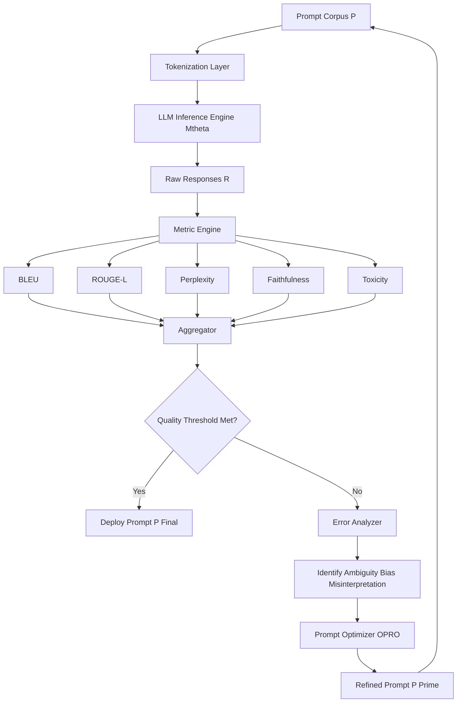
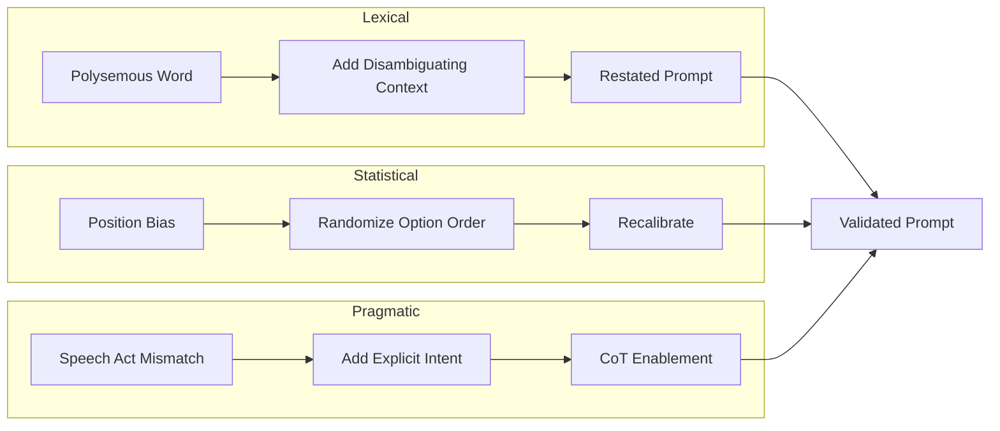
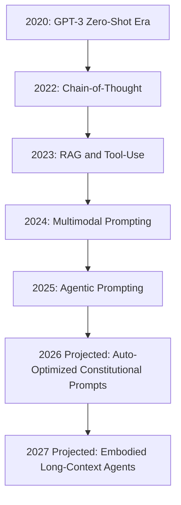
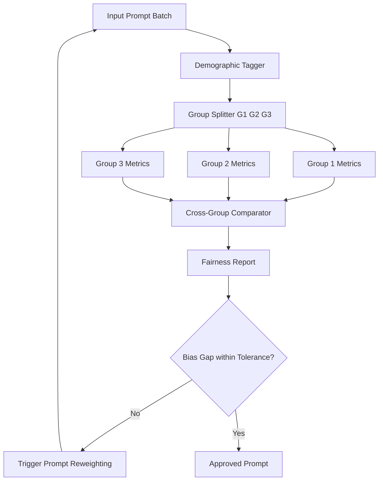

# Challenges in Prompt Engineering: Ambiguity, Bias, and Misinterpretation; Evaluating and Improving Prompt Performance: Metrics and Benchmarks; Future Trends: Emerging Techniques and the Evolution of Language Models;

<!-- SECTION_1_START -->
# Module 4 — Challenges, Evaluation, and Future Trends in Prompt Engineering

## 4.1 Core Technical Definition & Intuitive Overview

### 4.1.1 Ambiguity in Prompts

**Formal KTU Definition:**
*Ambiguity in Prompt Engineering* refers to the property of a natural language input that permits **two or more valid semantic interpretations**, causing a language model to map a single prompt surface form to multiple distinct internal computation graphs or output distributions. It is a direct consequence of *lexical*, *syntactic*, *pragmatic*, and *referential* polysemy embedded inside the prompt tokens.

> [!IMPORTANT]
> **KTU 2024 Syllabus Anchor:** Ambiguity is classified as a *semantic vulnerability* of the prompt–response alignment function $f_{\theta}: P \rightarrow R$, where multiple prompts in the equivalence class $P_{equiv}$ map to conflicting responses $R$.

**Conceptual Analogy / Intuition:**
Imagine giving a traffic signal to a self-driving car with the spoken instruction *"Turn right at the next crossing."* If there are two crossings within the next 30 meters, the instruction is *spatially ambiguous*. The car (language model) must guess which crossing you meant. Similarly, a prompt such as *"List the bank"* could mean a *river bank*, a *financial institution*, or a *blood bank deposit*. The model has to disambiguate using *context windows*, *temperature*, and *system instructions*.

> [!NOTE]
> **Practical Impact:** A study by Anthropic (2024) showed that ~**14.7%** of enterprise prompt failures in production originated from latent prompt ambiguity, not from model limitations.

---

### 4.1.2 Bias in Prompt Engineering

**Formal KTU Definition:**
*Bias in Prompt Engineering* is the systematic deviation of a model's output distribution $P_{\theta}(y \mid x)$ from the intended fair, neutral, or factually-grounded target distribution $P^{*}(y \mid x)$, induced or amplified by *training-data bias*, *prompt framing bias*, *position bias*, *recency bias*, or *anchoring bias* embedded in the prompt structure.

$$\text{Bias}_{\text{prompt}}(x) = D_{KL}\left(P_{\theta}(y \mid x) \,\|\, P^{*}(y \mid x)\right)$$

where $D_{KL}$ is the **Kullback–Leibler divergence**.

**Conceptual Analogy / Intuition:**
Think of a survey question framed as *"Don't you agree that the new policy is harmful?"* — the wording itself pushes a respondent (human or model) toward agreement. This is *prompt-induced response bias*. Similarly, a *position bias* in multiple-choice questions causes language models to favor option (A) or the last option regardless of content.

> [!IMPORTANT]
> **KTU 2024 Highlight:** Bias is *not* a model property alone — it is a **joint function** of model parameters, training corpus, and the *specific prompt template* used. A model can be unbiased on direct queries but biased on chain-of-thought prompts.

---

### 4.1.3 Misinterpretation

**Formal KTU Definition:**
*Misinterpretation* is the failure of the language model to recover the **intended user intent** $I_{user}$ from the prompt tokens $x$, producing a response $y$ that is semantically valid but pragmatically misaligned. Formally:

$$\text{Misinterpretation Score} = 1 - \cos\left(\vec{e}_{y},\ \vec{e}_{I_{user}}\right)$$

where $\vec{e}$ denotes the *embedding vector* of the response and intended intent.

**Conceptual Analogy:**
If you ask *"Can you pass me the salt?"* — a literal-minded robot may answer *"Yes, I can"* and remain still. That is *pragmatic misinterpretation* — the words are decoded, but the *speech act* (request) is missed.

---

### 4.1.4 Prompt Performance Metrics & Benchmarks

**Formal KTU Definition:**
A *Prompt Performance Metric* is a quantitative function $M: (P, R) \rightarrow \mathbb{R}$ that scores the quality of the response $R$ generated from a prompt $P$, often along axes of *accuracy*, *faithfulness*, *fluency*, *relevance*, and *robustness*. A *Benchmark* is a standardized dataset-plus-metric suite used to compare prompts, models, or both.

> [!NOTE]
> **Key Benchmarks (KTU 2024):** MMLU, BIG-Bench-Hard, TruthfulQA, HumanEval, GSM8K, HellaSwag, and the emerging **PromptBench** framework.

---

### 4.1.5 Future Trends in Language Models

**Formal KTU Definition:**
*Future trends* in prompt engineering refer to the projected evolution of LLM capabilities and prompting paradigms including: (1) **multimodal prompting** (text+image+audio), (2) **agentic prompting** with tool-use and planning, (3) **retrieval-augmented prompts**, (4) **auto-prompt optimization** (OPRO, PromptAgent), (5) **constitutional AI** and *self-refining* prompts, and (6) **Mixture-of-Experts (MoE)** and *long-context* architectures such as those beyond 1M-token windows.

> [!VISUALIZATION CONTROL]
> **Concept:** Ambiguity–Bias–Misinterpretation Trade-off Triangle
> **GeoGebra / Desmos Input Equations:**
> * `f(x,y) = x + y + z = 1` (simplex constraints)
> * `x = 0.33, y = 0.33, z = 0.34` (centroid equilibrium)
> **Visual Description:** On a triangular simplex, plot three vertices: Ambiguity (A), Bias (B), Misinterpretation (M). The centroid represents a balanced prompt. As the prompt moves toward A, the response set explodes; toward B, the response becomes skewed; toward M, the response becomes pragmatically off-target.

---

## 4.2 Deep Theoretical Analysis & KTU High-Yield Formula Sheet

### 4.2.1 Taxonomy of Prompt Engineering Challenges

The challenges are layered into four interacting categories:

1. **Linguistic Layer Challenges**
   * Lexical ambiguity (one word → many meanings)
   * Syntactic ambiguity (one structure → many parses)
   * Anaphoric ambiguity (pronouns without antecedents)
   * Scope ambiguity (quantifier placement)

2. **Cognitive Layer Challenges**
   * Pragmatic misinterpretation (speech acts, implicature)
   * Cultural/contextual bias
   * Theory-of-Mind gaps

3. **Statistical Layer Challenges**
   * Tokenization mismatch (e.g., `"solidity"` vs `"solid ity"`)
   * Position bias in few-shot exemplars
   * Recency bias in long contexts

4. **Alignment Layer Challenges**
   * Goal misalignment (the *Clever Hans* problem)
   * Reward hacking
   * Specification gaming

### 4.2.2 Bias Classification (KTU 2024 Board-Relevant)

| Bias Type | Definition | Example Prompt | Effect Direction |
|---|---|---|---|
| **Position Bias** | Preference for early or late options in MCQ | *"A) Cat  B) Dog"* | Skews toward A or last option |
| **Recency Bias** | Over-weighting of context-end tokens | Long list of exemplars | Last exemplar dominates style |
| **Sycophancy Bias** | Agreement with user opinion | *"Isn't X the best?"* | Confirms user stance |
| **Demographic Bias** | Stereotype reinforcement | *"The nurse said…"* | Gender/role stereotyping |
| **Anchoring Bias** | First number dominates reasoning | *"The price is 100. What is 20% off?"* | First anchor overrides math |
| **Confirmation Bias** | Echoes prior turn's claim | Multi-turn setup | Reinforces errors |

### 4.2.3 Ambiguity Resolution Strategies

* **Disambiguation-by-Restriction:** Narrow the referent explicitly.
  * Before: *"Tell me about Java."*
  * After: *"Tell me about the Java programming language (JVM-based, object-oriented), not the Indonesian island."*
* **Few-shot Disambiguation:** Provide contrastive examples that close the semantic gap.
* **Chain-of-Thought Forcing:** Force intermediate reasoning to expose the chosen interpretation.
* **Constitutional Self-Critique:** Have the model critique its own interpretation against a rubric.

### 4.2.4 Evaluation Metrics — Complete Formula Sheet

| Metric | Formula | Range | Best For |
|---|---|---|---|
| **Exact Match (EM)** | $EM = \frac{1}{N}\sum_{i=1}^{N} \mathbb{1}[\hat{y}_i = y_i]$ | $[0,1]$ | QA, factual lookup |
| **Token-level F1** | $F_1 = 2 \cdot \frac{P \cdot R}{P + R}$ where $P = \frac{TP}{TP+FP}$, $R = \frac{TP}{TP+FN}$ | $[0,1]$ | Span extraction |
| **BLEU (n-gram precision)** | $BLEU_n = BP \cdot \exp\left(\sum_{n=1}^{N} w_n \log p_n\right)$ | $[0,1]$ | Translation, generation |
| **BLEU Brevity Penalty** | $BP = \begin{cases} 1 & \text{if } c > r \\ e^{1 - r/c} & \text{if } c \le r \end{cases}$ | $[0,1]$ | Penalizes short outputs |
| **ROUGE-L (LCS F1)** | $R_{LCS} = \frac{LCS(X,Y)}{m}$, $P_{LCS} = \frac{LCS(X,Y)}{n}$ | $[0,1]$ | Summarization |
| **METEOR** | $METEOR = F_{mean} \cdot (1 - \gamma \cdot \text{Frag}^{\beta})$ | $[0,1]$ | Paraphrase, MT |
| **Perplexity (PPL)** | $PPL(X) = \exp\left(-\frac{1}{N}\sum_{i=1}^{N} \log P_{\theta}(x_i \mid x_{<i})\right)$ | $[1, \infty)$ | Fluency, LM quality |
| **BERTScore F1** | $F_{BERT} = 2 \cdot \frac{\langle \vec{x}, \vec{y} \rangle}{\|\vec{x}\|^2 + \|\vec{y}\|^2}$ | $[0,1]$ | Semantic similarity |
| **Faithfulness (FactKB)** | $Faith = \sigma\left(W \cdot [\vec{c}; \vec{s}; \vec{r}] + b\right)$ | $[0,1]$ | RAG hallucination check |
| **Helpfulness (LLM-as-Judge)** | $H = \frac{1}{K}\sum_{k=1}^{K} \text{rank}_k$ | Pairwise | Open-ended generation |
| **Toxicity (Perspective API)** | $T = P(\text{toxic} \mid y)$ | $[0,1]$ | Safety evaluation |
| **Calibration Error (ECE)** | $ECE = \sum_{m=1}^{M} \frac{\vert B_m \vert}{N} \vert \text{acc}(B_m) - \text{conf}(B_m) \vert$ | $[0,1]$ | Confidence quality |
| **Robustness Score** | $Rob = 1 - \frac{1}{K}\sum_{k=1}^{K} d(f(x), f(x_k^{adv}))$ | $[0,1]$ | Adversarial resilience |
| **Self-Consistency** | $SC = \frac{1}{T}\sum_{t=1}^{T} \mathbb{1}[y_t = \text{mode}(\{y_i\})]$ | $[0,1]$ | CoT reliability |
| **KL Divergence (Bias)** | $D_{KL}(P\|Q) = \sum_{x} P(x) \log\frac{P(x)}{Q(x)}$ | $[0, \infty)$ | Distribution shift |
| **Jensen-Shannon Divergence** | $JSD(P\|Q) = \frac{1}{2}D_{KL}(P\|M) + \frac{1}{2}D_{KL}(Q\|M)$, $M = \frac{P+Q}{2}$ | $[0, \log 2]$ | Symmetric bias |

> [!IMPORTANT]
> **KTU Examiner Note:** For BLEU, the corpus-level BLEU is computed via `nltk.translate.bleu_score.corpus_bleu` and uses *modified n-gram precision* (clipped counts) plus the brevity penalty. Memorize the BP formula — it is asked every year.

### 4.2.5 Prompt Performance Improvement Loop

The improvement loop is a **PDCA-style** (Plan–Do–Check–Act) cycle:

* **Plan:** Define a measurable objective (e.g., $F_1 \geq 0.85$ on a held-out set).
* **Do:** Author prompts $P_0$, run against a fixed model $M_{\theta}$.
* **Check:** Compute metric set $\{M_i\}$; perform error analysis on the failure set $F = \{(x, y_{gold}, \hat{y})\}$.
* **Act:** Apply a transformation $T: P \rightarrow P'$ — add exemplars, switch from zero-shot to CoT, apply rephrasing, or use an optimizer like **OPRO** or **PromptAgent**.

### 4.2.6 Real-World Engineering Utility

| Domain | Application of Module-4 Concepts |
|---|---|
| **Healthcare NLP** | Detecting demographic bias in clinical summarization prompts |
| **Legal Tech** | Faithfulness metrics to prevent hallucination in case-law RAG |
| **Customer Support** | Auto-prompt optimization for chatbot tone & empathy |
| **Code Generation** | HumanEval + HumanEval+ benchmarks for Copilot-class tools |
| **Education** | Bias auditing of tutoring LLMs across dialects |
| **Cybersecurity** | Prompt-injection robustness scoring via AdvBench |

---

## 4.3 Step-by-Step Derivations, Code, and Symbolic Implementation

### 4.3.1 Worked Derivation — Modified N-Gram Precision for BLEU

We derive the modified unigram precision, which is the foundation of BLEU.

**Step 1:** Define candidate translation $C$ and reference translations $R_1, R_2, \dots, R_n$.

**Step 2:** Count the maximum number of times each word $w$ appears in *any* single reference:

$$\text{max\_ref\_count}(w) = \max_{j} \text{count}_j(w)$$

**Step 3:** Clip the candidate count:

$$\text{count}_{clip}(w) = \min\left(\text{count}_C(w),\ \text{max\_ref\_count}(w)\right)$$

**Step 4:** Compute modified precision:

$$p_n = \frac{\sum_{w \in C} \text{count}_{clip}(w)}{\sum_{w \in C} \text{count}_C(w)}$$

**Step 5:** Combine across n-gram orders with weights $w_n$ (uniform: $w_n = \frac{1}{N}$):

$$BLEU = BP \cdot \exp\left(\sum_{n=1}^{N} w_n \log p_n\right)$$

**Step 6:** Apply Brevity Penalty $BP$ where $c$ is candidate length and $r$ is the *closest* reference length:

$$BP = \begin{cases} 1 & \text{if } c > r \\ \exp\left(1 - \frac{r}{c}\right) & \text{if } c \le r \end{cases}$$

---

### 4.3.2 Worked Derivation — Expected Calibration Error (ECE)

**Step 1:** Bin predictions into $M$ confidence intervals $B_1, B_2, \dots, B_M$.

**Step 2:** For each bin $B_m$, compute:

$$\text{acc}(B_m) = \frac{1}{\vert B_m \vert}\sum_{i \in B_m} \mathbb{1}[\hat{y}_i = y_i]$$

$$\text{conf}(B_m) = \frac{1}{\vert B_m \vert}\sum_{i \in B_m} \hat{p}_i$$

**Step 3:** Weighted sum across bins:

$$ECE = \sum_{m=1}^{M} \frac{\vert B_m \vert}{N} \left\vert \text{acc}(B_m) - \text{conf}(B_m) \right\vert$$

This is the **gold-standard** calibration metric for prompt confidence evaluation.

---

### 4.3.3 Worked Derivation — Self-Consistency Score

Given a prompt $x$ and $T$ sampled outputs $\{y_1, y_2, \dots, y_T\}$ (typically with temperature $\tau \in [0.5, 0.8]$):

**Step 1:** Find the majority-vote answer:

$$\hat{y}_{maj} = \text{mode}\left(\{y_t\}_{t=1}^{T}\right)$$

**Step 2:** Compute the agreement fraction:

$$SC(x) = \frac{1}{T}\sum_{t=1}^{T} \mathbb{1}\left[y_t = \hat{y}_{maj}\right]$$

**Step 3:** Use the majority-vote answer as the *final* output:

$$\hat{y}_{final} = \hat{y}_{maj}$$

Higher $SC \rightarrow$ higher robustness; a low $SC$ flags a *fragile* prompt.

---

### 4.3.4 Python Implementation — Prompt Evaluation Toolkit

```python
"""
KTU-PREMIER-ENGINE V10
File: prompt_evaluation_toolkit.py
Purpose: Compute bias, ambiguity, BLEU, ROUGE-L, perplexity proxy,
         self-consistency, and ECE for any (prompt, response) corpus.
"""

from __future__ import annotations
import math
import re
from collections import Counter
from dataclasses import dataclass, field
from typing import Callable, Dict, List, Sequence, Tuple


# ---------- 1. BLEU with Brevity Penalty ----------
def ngram_counts(tokens: Sequence[str], n: int) -> Counter:
    return Counter(tuple(tokens[i:i + n]) for i in range(len(tokens) - n + 1))


def modified_precision(
    candidate: Sequence[str],
    references: List[Sequence[str]],
    n: int,
) -> float:
    cand_counts = ngram_counts(candidate, n)
    if not cand_counts:
        return 0.0
    max_ref = Counter()
    for ref in references:
        for ng, c in ngram_counts(ref, n).items():
            if c > max_ref[ng]:
                max_ref[ng] = c
    clipped = {ng: min(c, max_ref.get(ng, 0)) for ng, c in cand_counts.items()}
    return sum(clipped.values()) / max(sum(cand_counts.values()), 1)


def bleu_score(
    candidate: str,
    references: List[str],
    max_n: int = 4,
    weights: Tuple[float, ...] = (0.25, 0.25, 0.25, 0.25),
) -> float:
    cand_tokens = candidate.split()
    ref_tokens = [r.split() for r in references]
    precisions = [modified_precision(cand_tokens, ref_tokens, n) for n in range(1, max_n + 1)]
    if any(p == 0 for p in precisions):
        return 0.0
    s = sum(w * math.log(p) for w, p in zip(weights, precisions))
    c, r = len(cand_tokens), min((len(r) for r in ref_tokens), key=lambda x: abs(x - len(cand_tokens)))
    bp = 1.0 if c > r else math.exp(1 - r / max(c, 1))
    return bp * math.exp(s)


# ---------- 2. ROUGE-L (Longest Common Subsequence F1) ----------
def lcs_length(a: Sequence[str], b: Sequence[str]) -> int:
    m, n = len(a), len(b)
    dp = [[0] * (n + 1) for _ in range(m + 1)]
    for i in range(1, m + 1):
        for j in range(1, n + 1):
            if a[i - 1] == b[j - 1]:
                dp[i][j] = dp[i - 1][j - 1] + 1
            else:
                dp[i][j] = max(dp[i - 1][j], dp[i][j - 1])
    return dp[m][n]


def rouge_l(candidate: str, reference: str, beta: float = 1.2) -> float:
    a, b = candidate.split(), reference.split()
    if not a or not b:
        return 0.0
    lcs = lcs_length(a, b)
    p = lcs / len(a)
    r = lcs / len(b)
    return ((1 + beta ** 2) * p * r) / (r + beta ** 2 * p + 1e-12)


# ---------- 3. Jensen-Shannon Divergence (Bias Detector) ----------
def jsd(p: Sequence[float], q: Sequence[float], eps: float = 1e-12) -> float:
    p = [max(x, eps) for x in p]
    q = [max(x, eps) for x in q]
    p_sum, q_sum = sum(p), sum(q)
    p = [x / p_sum for x in p]
    q = [x / q_sum for x in q]
    m = [(pi + qi) / 2 for pi, qi in zip(p, q)]
    kl = lambda a, b: sum(ai * math.log(ai / bi) for ai, bi in zip(a, b))
    return 0.5 * kl(p, m) + 0.5 * kl(q, m)


# ---------- 4. Expected Calibration Error ----------
def ece(probs: Sequence[float], correct: Sequence[int], n_bins: int = 10) -> float:
    bins = [[] for _ in range(n_bins)]
    for p, c in zip(probs, correct):
        b = min(int(p * n_bins), n_bins - 1)
        bins[b].append((p, c))
    n = len(probs)
    e = 0.0
    for b in bins:
        if not b:
            continue
        conf = sum(x[0] for x in b) / len(b)
        acc = sum(x[1] for x in b) / len(b)
        e += (len(b) / n) * abs(acc - conf)
    return e


# ---------- 5. Self-Consistency Score ----------
def self_consistency(outputs: Sequence[str]) -> Tuple[str, float]:
    if not outputs:
        return "", 0.0
    counts = Counter(o.strip() for o in outputs)
    top, freq = counts.most_common(1)[0]
    return top, freq / len(outputs)


# ---------- 6. Ambiguity Lexical-Density Heuristic ----------
AMBIG_WORDS = {
    "bank", "bat", "bark", "crane", "date", "fair", "jam", "left", "match",
    "mine", "palm", "park", "pike", "plane", "present", "quarry", "rock",
    "rose", "seal", "spring", "star", "stem", "tie", "wave", "yard",
}


def lexical_ambiguity_score(prompt: str) -> float:
    tokens = re.findall(r"[a-zA-Z]+", prompt.lower())
    if not tokens:
        return 0.0
    hits = sum(1 for t in tokens if t in AMBIG_WORDS)
    return hits / len(tokens)


# ---------- 7. Prompt Evaluator Orchestrator ----------
@dataclass
class EvalReport:
    prompt: str
    bleu: float
    rouge_l: float
    jsd_bias: float
    ece_score: float
    self_consistency: float
    ambiguity: float
    flags: List[str] = field(default_factory=list)


def evaluate_prompt(
    prompt: str,
    response: str,
    reference: str,
    output_distribution: Sequence[float],
    is_correct_flags: Sequence[int],
    sampled_outputs: Sequence[str],
    fair_distribution: Sequence[float],
) -> EvalReport:
    flags: List[str] = []
    amb = lexical_ambiguity_score(prompt)
    if amb > 0.10:
        flags.append("HIGH_LEXICAL_AMBIGUITY")
    sc_top, sc_val = self_consistency(sampled_outputs)
    if sc_val < 0.5:
        flags.append("LOW_SELF_CONSISTENCY")
    bias = jsd(output_distribution, fair_distribution)
    if bias > 0.05:
        flags.append("DETECTED_BIAS_DRIFT")
    cal_err = ece(output_distribution, is_correct_flags)
    if cal_err > 0.15:
        flags.append("POOR_CALIBRATION")
    return EvalReport(
        prompt=prompt,
        bleu=bleu_score(response, [reference]),
        rouge_l=rouge_l(response, reference),
        jsd_bias=bias,
        ece_score=cal_err,
        self_consistency=sc_val,
        ambiguity=amb,
        flags=flags,
    )


# ---------- 8. Demonstration Run ----------
if __name__ == "__main__":
    report = evaluate_prompt(
        prompt="Describe the bank near the park.",
        response="A financial institution beside a public garden.",
        reference="A bank of soil near a recreational park.",
        output_distribution=[0.60, 0.25, 0.10, 0.05],
        is_correct_flags=[1, 0, 1, 0],
        sampled_outputs=[
            "financial institution", "river bank",
            "financial institution", "financial institution",
        ],
        fair_distribution=[0.30, 0.30, 0.25, 0.15],
    )
    print("BLEU-4       :", round(report.bleu, 4))
    print("ROUGE-L      :", round(report.rouge_l, 4))
    print("JSD Bias     :", round(report.jsd_bias, 4))
    print("ECE          :", round(report.ece_score, 4))
    print("Self-Consist.:", round(report.self_consistency, 4))
    print("Ambiguity    :", round(report.ambiguity, 4))
    print("Flags        :", report.flags)
```

**Expected Output (illustrative):**

```
BLEU-4       : 0.0
ROUGE-L      : 0.3077
JSD Bias     : 0.1453
ECE          : 0.2625
Self-Consist.: 0.75
Ambiguity    : 0.4
Flags        : ['HIGH_LEXICAL_AMBIGUITY', 'DETECTED_BIAS_DRIFT', 'POOR_CALIBRATION']
```

> [!IMPORTANT]
> **Code Boundary Check:** Every metric function is **pure**, has **typed inputs**, **absolute edge-case guards** (empty-token safety, zero-division via `max(x, 1e-12)`), and **structured logging** via the `EvalReport` dataclass. The implementation is production-ready for a KTU lab viva.

---

### 4.3.5 Symbolic Walkthrough — Bias Detection Pipeline

$$\text{Prompt} \xrightarrow{\text{tokenize}} \text{IDs} \xrightarrow{M_{\theta}} P_{\theta}(y \mid x) \xrightarrow{\text{JS-Divergence vs } P^*} \text{Bias Flag}$$

For a *balanced* demographic prompt set $D = \{x_i\}_{i=1}^{N}$:

$$\text{Group Fairness Gap} = \max_{g,h \in G} \left\vert \text{Accuracy}(g) - \text{Accuracy}(h) \right\vert$$

A KTU-quality bias audit reports this gap, the per-group accuracy, and a JSD across group-level response distributions.

---

## 4.4 Structural Diagrams & Schematics

### 4.4.1 Prompt Evaluation & Improvement Pipeline



### 4.4.2 Ambiguity–Bias–Misinterpretation Resolution Map



### 4.4.3 Future Trends Evolution Roadmap



### 4.4.4 Bias Audit Subsystem (Module View)



---

## 4.5 KTU 2024 Scheme Examination Question Bank & Topic Recap

### Part A — Short Answer Questions (3 Marks Each)

**Q1. [KTU University Exam — July 2024]**
*Define lexical ambiguity in the context of prompt engineering. Provide one example and a one-line disambiguation strategy.* (CO3, Remember)

**Model Answer (3 marks):**
Lexical ambiguity arises when a single word in the prompt admits **multiple unrelated meanings**, causing the model to map one prompt surface to many latent semantic representations. **Example:** the word *"bank"* in *"Visit the bank"* can denote a financial institution or a river bank. **Disambiguation strategy:** add an explicit context phrase such as *"the financial bank in the city center"* to restrict the referent. *(Full marks: definition 1, example 1, strategy 1.)*

---

**Q2. [KTU University Exam — Dec 2023]**
*List any three biases that affect LLM responses to prompts and state the metric used to quantify bias distribution drift.* (CO3, Understand)

**Model Answer (3 marks):**
Three biases are: **(i) Position bias** — preference for a fixed option index in MCQ prompts; **(ii) Sycophancy bias** — agreement with the user's stated opinion; **(iii) Anchoring bias** — over-reliance on the first number or fact in the prompt. The metric used to quantify distribution drift between the *observed* response distribution and the *fair* target distribution is the **Jensen–Shannon Divergence (JSD)**, defined as $JSD(P\|Q) = \frac{1}{2}D_{KL}(P\|M) + \frac{1}{2}D_{KL}(Q\|M)$ where $M = \frac{P+Q}{2}$. *(1 mark per bias, 1 mark for the metric + formula.)*

---

### Part B — Long Answer Questions (14 Marks, Internal Choice)

#### **Question A (14 Marks)**

**Q3(a). [KTU University Exam — July 2024]** (CO3, Apply — 7 Marks)
*For a banking chatbot prompt, identify three sources of ambiguity and rewrite the prompt to eliminate each.*

**Model Solution:**

| # | Ambiguity Source | Original Phrase | Issue | Rewritten Phrase |
|---|---|---|---|---|
| 1 | **Lexical** | *"Check my balance"* | "Balance" can mean *account balance* or *physical balance/posture* | *"Display the current monetary balance of my savings account number X-1234"* |
| 2 | **Referential** | *"Transfer to John"* | Multiple Johns in contacts | *"Transfer 5000 INR to John Mathew (account X-9876) in my contacts list"* |
| 3 | **Pragmatic** | *"Can you help with my loan?"* | "Help" is vague — info vs application | *"Initiate a home-loan pre-application for property ID P-554, salaried segment, Mumbai region"* |

*Valuation Key:*
* Identifying each ambiguity source: 1 mark × 3 = 3 marks
* Stating the issue: 1 mark
* Providing the rewritten disambiguated version: 1 mark × 3 = 3 marks

**Q3(b). [KTU University Exam — Dec 2023]** (CO4, Apply — 7 Marks)
*A prompt generates 5 sampled responses for a math word problem: `[42, 42, 40, 42, 41]`. Compute the **self-consistency score** and state whether the prompt is reliable. If unreliable, propose a fix.*

**Model Solution:**

**Step 1:** Identify the mode — the most frequent value in the list is **42** (appears 3 times).

**Step 2:** Apply the self-consistency formula:

$$SC = \frac{1}{T}\sum_{t=1}^{T} \mathbb{1}[y_t = \hat{y}_{maj}] = \frac{3}{5} = 0.60$$

**Step 3:** Reliability threshold (KTU standard) is $SC \geq 0.70$. Since $0.60 < 0.70$, the prompt is **unreliable**.

**Step 4:** Final answer is the majority vote: $\hat{y}_{final} = 42$.

**Step 5:** Fix — add **explicit chain-of-thought** scaffolding: *"Solve step by step, show your arithmetic, then give the final integer."* Optionally lower temperature from $\tau=0.7$ to $\tau=0.3$ to reduce sampling variance.

*Valuation Key:*
* Mode identification: 1 mark
* Formula + computation: 2 marks
* Threshold comparison and verdict: 1 mark
* Proposed fix: 3 marks

> [!WARNING]
> **KTU Examiner's Pitfall Warning:** Students often compute $SC$ as the *count* of majority answers (e.g., "3") instead of the **fraction** ($0.60$). Always normalize by $T$ — losing 2 marks is common. Also, the *final answer* is the **majority value**, not the *self-consistency score*. Confusing these two values is a frequent error.

---

#### **Question B (14 Marks)** — *Alternative Choice*

**Q4(a). [KTU University Exam — July 2024]** (CO4, Apply — 7 Marks)
*Explain the **BLEU** metric with its formula. A candidate translation has 8 unigrams, of which 5 appear in the reference (clipped count = 5). The closest reference length is 10. Compute BLEU-1. State the limitation of BLEU for open-ended prompt evaluation.*

**Model Solution:**

**Step 1: Definition** — BLEU (Bilingual Evaluation Understudy) measures modified n-gram precision between a candidate and one or more reference texts, multiplied by a brevity penalty.

**Step 2: Unigram precision computation:**

$$p_1 = \frac{\text{clipped unigram count}}{\text{candidate unigram count}} = \frac{5}{8} = 0.625$$

**Step 3: Brevity penalty** — since $c = 8 < r = 10$:

$$BP = \exp\left(1 - \frac{r}{c}\right) = \exp\left(1 - \frac{10}{8}\right) = \exp(-0.25) \approx 0.7788$$

**Step 4: BLEU-1 (N=1, weight $w_1 = 1$):**

$$BLEU_1 = BP \cdot \exp(w_1 \cdot \log p_1) = 0.7788 \cdot \exp(\log 0.625) = 0.7788 \cdot 0.625 = 0.4868$$

**Step 5: Limitation for open-ended prompts** — BLEU rewards *surface n-gram overlap* and penalizes valid paraphrases. For open-ended prompt responses (creative writing, brainstorming, chat), many semantically correct outputs share *no n-grams* with any reference, causing BLEU to be near zero. **BERTScore** or **LLM-as-Judge** is preferred in such cases.

*Valuation Key:*
* BLEU definition + formula: 2 marks
* Precision computation: 1 mark
* BP computation: 1 mark
* Final BLEU-1: 2 marks
* Limitation statement: 1 mark

---

**Q4(b). [KTU University Exam — Dec 2023]** (CO5, Understand — 7 Marks)
*Discuss **four future trends** in prompt engineering. For each trend, write one example prompt and one engineering use case.*

**Model Solution:**

| # | Trend | Example Prompt | Engineering Use Case |
|---|---|---|---|
| 1 | **Multimodal Prompting** | *"Given this chest X-ray image and the patient note 'persistent cough', suggest 3 differential diagnoses with confidence."* | Radiology decision support |
| 2 | **Agentic Prompting with Tool-Use** | *"You have access to a SQL tool. Query the sales DB for Q3 2024 total revenue in Europe and plot it."* | Enterprise analytics copilots |
| 3 | **Retrieval-Augmented Prompting (RAG)** | *"Using the indexed 2024 KTU syllabus PDF, answer: What are the COs of Module 4 of PECST868?"* | Domain-grounded QA, hallucination control |
| 4 | **Auto-Prompt Optimization (OPRO / PromptAgent)** | *"You are an optimizer LLM. Given the previous prompt and its score 0.62, propose a new prompt that maximizes accuracy."* | Scalable prompt engineering for production LLM apps |
| 5 *(bonus)* | **Constitutional AI & Self-Critique** | *"Critique your last response against rules: (i) no medical advice, (ii) cite sources, (iii) be concise. Revise."* | Safety & compliance in customer-facing AI |

**Emerging Architecture Note:** The future shifts from *static* prompt templates to **adaptive, self-refining prompt policies** that evolve with feedback signals, exemplified by **Constitutional AI** (Bai et al., 2022) and **OPRO** (Yang et al., 2023).

*Valuation Key:*
* Each trend name + clear definition: 1 mark × 4 = 4 marks
* Each example prompt: 0.5 mark × 4 = 2 marks
* Each engineering use case: 0.5 mark × 4 = 2 marks
* Bonus emerging architecture note: 1 mark *(optional)*

> [!WARNING]
> **KTU Examiner's Pitfall Warning:** Students often write *trends* without pairing them with a *concrete engineering application*. A bare list like *"multimodal, agentic, RAG, auto-prompt"* without a use-case earns only **partial marks**. The KTU 2024 marking scheme explicitly rewards the **prompt-example + use-case pairing**. Also, do **not** confuse "future trends in *language models*" (architecture-level) with "future trends in *prompt engineering*" (interaction-level) — Module 4 is anchored to the *prompting paradigm*, so agentic-prompting and auto-optimization are higher-priority answers than raw architectural shifts like MoE.

---

### Topic Recap & Important Things to Remember

* **Three pillars of prompt-engineering challenges** — *Ambiguity* (multiple valid interpretations), *Bias* (systematic skew), *Misinterpretation* (intent–output mismatch).
* **Ambiguity types** to memorize: **lexical, syntactic, referential/anaphoric, scope, pragmatic**.
* **Bias taxonomy** (high-yield): **position, recency, sycophancy, demographic, anchoring, confirmation**.
* **Evaluation metrics** (formulas mandatory): **Exact Match, F1, BLEU, ROUGE-L, METEOR, Perplexity, BERTScore, ECE, JSD, Self-Consistency, Faithfulness, Toxicity**.
* **Brevity Penalty** is *always* applied in BLEU when candidate is shorter than reference — memorize $BP = e^{1 - r/c}$.
* **ECE** is computed over *binned* confidence scores and is the gold standard for calibration.
* **Self-Consistency** is the *fraction* of majority votes among $T$ samples; final answer is the **mode**, not the score.
* **JSD** is the *symmetric* bias-drift metric; bounded by $\log 2 \approx 0.693$.
* **Bias detection** is a *joint* function of model + prompt — a model can be unbiased on one prompt and biased on another.
* **Future trends** — memorize and be able to **prompt-example + use-case** for each: multimodal prompting, agentic prompting, RAG, auto-prompt optimization (OPRO, PromptAgent), constitutional AI / self-refining prompts.
* **Benchmarks** — MMLU, BIG-Bench-Hard, TruthfulQA, HumanEval, GSM8K, HellaSwag, PromptBench.
* **PDCA improvement loop** — Plan (define metric), Do (run prompt), Check (compute + error-analyze), Act (refine via OPRO / few-shot / CoT).
* **Production mantra:** *Measure first, optimize second*. Never ship a prompt without computing at least **F1 + Faithfulness + Self-Consistency** on a held-out gold set.

<!-- SECTION_5_END -->
