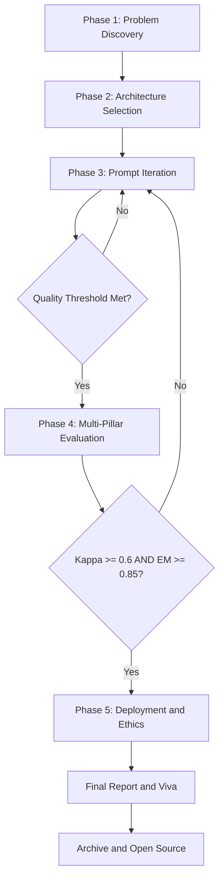
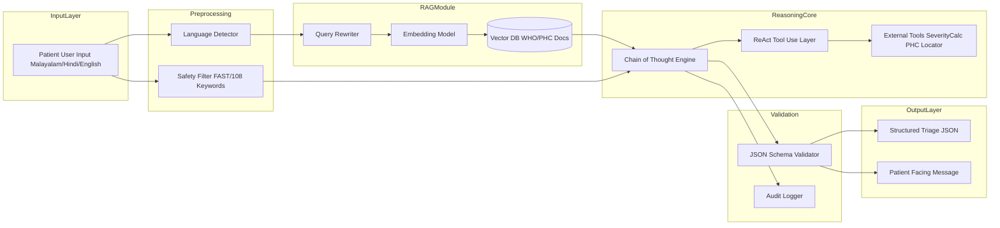
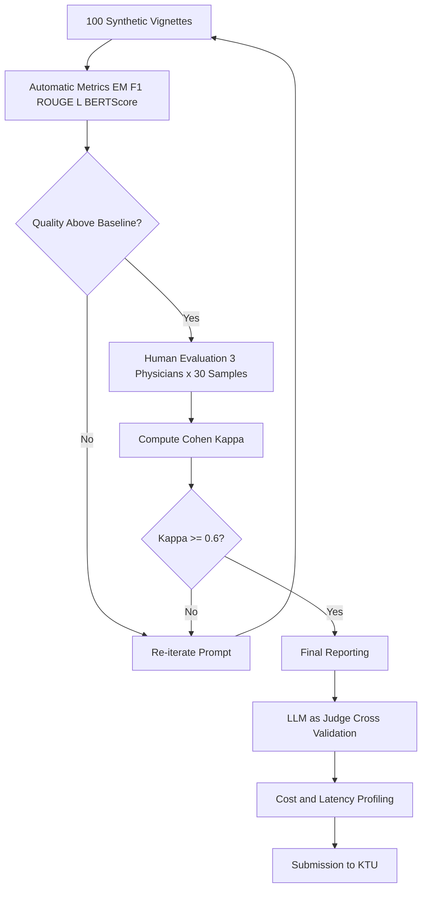
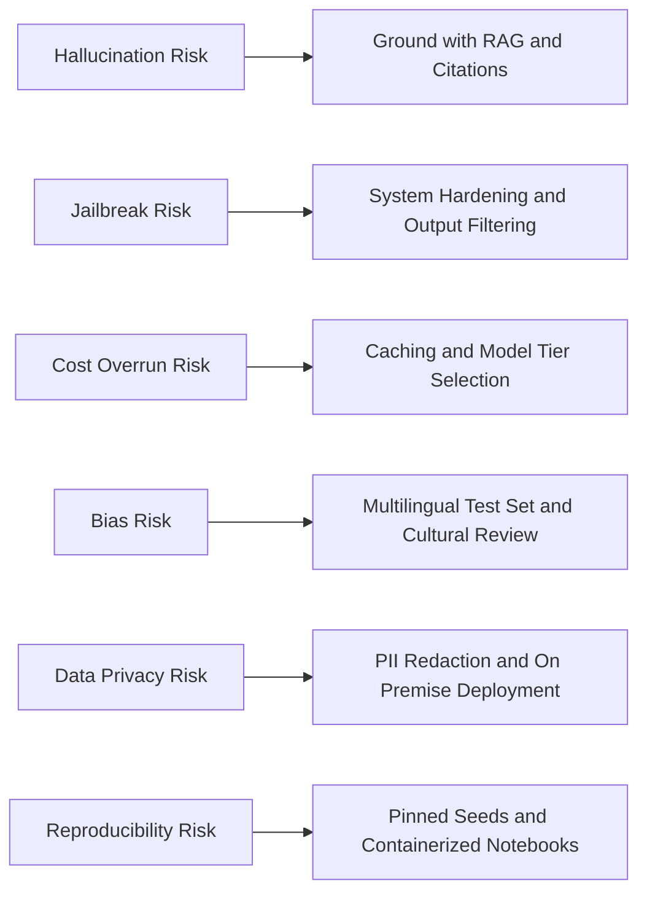

# Working on a capstone project to solve a real-world problem using prompt engineering

<!-- SECTION_1_START -->
# Capstone Project in Prompt Engineering — Solving a Real-World Problem

## 1.1 Formal Academic Definition

A **capstone project in prompt engineering** is a comprehensive, end-to-end, integrative applied research and development endeavor wherein a learner synthesizes the cumulative knowledge acquired across the prompt engineering curriculum — including prompt design patterns, chain-of-thought reasoning, retrieval-augmented generation (RAG), agentic workflows, evaluation methodologies, and safety alignment — to architect, prototype, evaluate, and present an LLM-based (Large Language Model) solution that addresses a verifiable, real-world problem domain. The project demonstrates mastery over **KTU 2024 Course Outcome CO6** (Conduct investigations of complex problems using research-based knowledge and methods to provide valid conclusions) and **CO5** (Create, select, and apply appropriate techniques, resources, and modern engineering and IT tools, including prediction and modeling to complex engineering activities).

> [!IMPORTANT]
> **KTU 2024 Scheme Definition:** A capstone is not a tutorial reproduction. It is a **novel engineering contribution** where the student frames a problem, designs a prompt-based solution, evaluates it against a baseline, and presents empirical evidence of improvement — typically within a **2-credit (30-hour) project workload** under the PECST868 elective.

## 1.2 Conceptual Analogy — The "Recipe Engineer" Intuition

Imagine you are a **culinary architect** tasked with opening a restaurant that solves a community's specific dietary need (say, diabetic-friendly South Indian meals). You don't invent a new cuisine from scratch — you **iteratively refine recipes (prompts)** using available ingredients (LLM capabilities, external tools, knowledge bases), taste-test with focus groups (evaluation metrics), adjust seasoning based on feedback (prompt iteration), and finally publish a menu (the deployed solution) that demonstrably serves the community.

Similarly, a **prompt engineering capstone** is *not* about training a new AI model. It is about **engineering the interface (the prompt) and orchestration logic** that channels an existing foundation model's latent capabilities into a *measurable* real-world outcome. The model is the kitchen; the prompt is the recipe; the capstone is the **complete dish-to-table operation**.

> [!NOTE]
> **Core Distinction for Board Examinations:**
> - **Machine Learning Project** = You modify model weights through training.
> - **Prompt Engineering Project** = You modify the *input contract* and *orchestration layer* around a frozen or API-accessed model.
> - **Hybrid Project** = You may fine-tune a small adapter (e.g., LoRA), but the primary contribution must be in prompt design.

## 1.3 The Real-World Problem Statement Canvas

Every successful KTU capstone begins with a **Problem Statement Canvas** containing four mandatory quadrants:

| Quadrant | Question to Answer | Example (Healthcare Triage) |
|----------|-------------------|-----------------------------|
| **Who** | Who is the end-user? | Rural patients without 24/7 doctor access |
| **What** | What is the verifiable pain point? | Long wait times for symptom assessment |
| **Why** | Why does current solution fail? | Static FAQ chatbots cannot reason through symptoms |
| **How** | How will an LLM-based prompt solution help? | Structured diagnostic reasoning through CoT prompting |

> [!VISUALIZATION CONTROL]
> **Concept:** The Capstone Solution Maturity Curve
> **Plotting Axes:** $X$ = Iterations, $Y$ = Quality Score $Q \in [0, 1]$
> **Curve Equation (typical learning curve):**
> $$Q_{n+1} = Q_n + \alpha \cdot (Q_{\text{target}} - Q_n) \cdot e^{-\beta n}$$
> where $\alpha \in (0, 1)$ is the learning rate and $\beta$ is the decay constant. $Q_{\text{target}}$ represents the asymptotic quality ceiling.
> **Visual Description:** A monotonically increasing concave curve starting near the origin and asymptotically approaching the horizontal ceiling line $y = Q_{\text{target}}$. Students should observe diminishing returns after $\approx 8$–$10$ iteration cycles.

---

## 1.4 KTU 2024 Mandatory Project Deliverables

A KTU-evaluated PECST868 capstone must produce, at minimum, the following six artifacts:

1. **Problem Definition Document (PDD)** — 2 pages, with stakeholder map.
2. **Prompt Design Specification (PDS)** — All prompts versioned in a repository.
3. **Evaluation Report** — Quantitative metrics table with at least **two baselines**.
4. **Source Code & Orchestration Notebook** — Reproducible on a fresh environment.
5. **Demo Video / Live Walkthrough** — Max 5 minutes.
6. **Reflection Journal** — Documenting failed prompts, lessons learned, and ethical considerations.

> [!TIP]
> **Examiner's Heuristic:** Projects that lack a *quantitative* evaluation (only qualitative "it works well" claims) typically receive **at most 65% marks**. Always include numerical metrics such as accuracy, BLEU, ROUGE-L, F1, human-evaluator Likert scores, or task-completion rate.

---

<!-- SECTION_2_END -->

<!-- SECTION_2_START -->
# Deep Theoretical Analysis — The Capstone Engineering Lifecycle

## 2.1 The Five-Phase Capstone Methodology (PECST868-Aligned)

The KTU PECST868 capstone follows a **5-phase iterative lifecycle**, mirroring industry-standard AI product development but compressed for academic evaluation windows of **8–10 weeks**.

### Phase 1 — Problem Discovery & Scoping (Week 1–2)

The student identifies a **specific, measurable, achievable, relevant, and time-bound (SMART)** problem. The deliverable is a one-paragraph problem statement that answers:
- What is the *input artifact* the user provides?
- What is the *desired output artifact* the LLM must produce?
- What is the *evaluation criterion* that determines success?

For example: *"Given a student-written essay (input) and a curriculum rubric (context), produce structured, criterion-referenced feedback (output) with $\geq 80\%$ alignment to expert-human feedback as measured by a 5-point Likert rubric (evaluation)."*

### Phase 2 — Solution Architecture (Week 2–3)

The student selects an **architecture pattern** from the established taxonomy:

| Architecture Pattern | When to Use | Cost Complexity | Latency |
|---------------------|-------------|----------------|---------|
| **Single-Shot Prompting** | Simple Q\&A, transformation | Low | Low |
| **Multi-Shot (Few-Shot)** | Format-controlled generation | Low | Low |
| **Chain-of-Thought (CoT)** | Math, logic, multi-step reasoning | Medium | Medium |
| **ReAct (Reason + Act)** | Tool-using agents | High | High |
| **RAG (Retrieval-Augmented)** | Knowledge-intensive, factual Q\&A | High | Medium |
| **Multi-Agent Orchestration** | Complex, decomposable workflows | Very High | High |

### Phase 3 — Prompt Engineering & Iteration (Week 3–6)

This is the **core engineering phase**. The student applies the techniques learned across Modules 1–3:
- **Role prompting** to set persona and tone.
- **Constraint injection** to bound output format (JSON schema, regex).
- **Contextual scaffolding** to inject domain knowledge.
- **Self-consistency** to sample multiple completions and vote.
- **Reflection prompts** to enable self-critique loops.

A **prompt version control (PVC)** discipline is mandated, where every prompt is stored as:

```yaml
# prompt_v0.7.yaml
version: 0.7
date: 2024-11-12
model: gpt-4o-mini
temperature: 0.2
top_p: 0.95
seed: 42
system: |
  You are an expert {role} with {years} years of experience...
user_template: |
  Given the following {input_type}:
  ---
  {user_input}
  ---
  Produce a {output_format} that satisfies:
  {constraint_list}
```

### Phase 4 — Evaluation & Validation (Week 6–8)

Evaluation is **the single most weighted component** of the KTU capstone. Students must deploy a **multi-pillar evaluation strategy**:

1. **Automatic Metrics** — BLEU, ROUGE-L, BERTScore, F1, exact-match accuracy.
2. **LLM-as-Judge** — A second, stronger LLM scores the primary LLM's outputs.
3. **Human Evaluation** — At least **3 domain experts** rate 30+ outputs on a Likert scale.
4. **A/B Test Against Baseline** — Compare against a vanilla zero-shot prompt or a non-LLM solution.

### Phase 5 — Deployment, Ethics & Reflection (Week 8–10)

The student addresses:
- **Deployment surface** — API, web app, CLI, or embedded.
- **Cost estimation** — Token usage, monthly recurring cost.
- **Safety & alignment** — Guardrails, jailbreak resistance, PII redaction.
- **Limitations** — Honest acknowledgment of failure modes.
- **Future work** — Concrete roadmap for next iteration.

---

## 2.2 KTU High-Yield Formula Sheet — Capstone Metrics

The following table consolidates the **mandatory evaluation formulas** every KTU capstone must reference. These formulas carry marks in viva voce and report evaluation.

| Metric | Formula | Range | Best Use Case | KTU Weight |
|--------|---------|-------|---------------|-----------|
| **Exact Match (EM)** | $\text{EM} = \frac{1}{N} \sum_{i=1}^{N} \mathbb{1}[y_i = \hat{y}_i]$ | $[0, 1]$ | Classification, short answers | High |
| **Token-Level F1** | $F_1 = 2 \cdot \frac{P \cdot R}{P + R}$ | $[0, 1]$ | Span extraction, NER | High |
| **BLEU (n-gram)** | $\text{BLEU} = BP \cdot \exp\left(\sum_{n=1}^{N} w_n \log p_n\right)$ | $[0, 1]$ | Translation, generation | Medium |
| **ROUGE-L (LCS)** | $R_L = \frac{LCS(X, Y)}{\text{len}(Y)}$, $F_L = \frac{(1+\beta^2) R_L P_L}{R_L + \beta^2 P_L}$ | $[0, 1]$ | Summarization | High |
| **BERTScore** | $F_{\text{BERT}} = \frac{1}{N}\sum_{i=1}^{N} \frac{2 \cdot \text{sim}(\hat{x}_i, x_i)}{\dots}$ | $[0, 1]$ | Semantic similarity | Medium |
| **Likert Normalized** | $\bar{L} = \frac{1}{K \cdot N}\sum_{k=1}^{K}\sum_{i=1}^{N} L_{k,i}$ | $[0, 1]$ | Human evaluation | High |
| **Cost per Query** | $C_q = \frac{T_{\text{in}} \cdot p_{\text{in}} + T_{\text{out}} \cdot p_{\text{out}}}{1000}$ | Currency | Production feasibility | Medium |
| **Task Completion Rate** | $\text{TCR} = \frac{\text{Successful Tasks}}{\text{Total Tasks}}$ | $[0, 1]$ | Agentic workflows | High |
| **Hallucination Rate** | $H = \frac{\text{Unsupported Claims}}{\text{Total Claims}}$ | $[0, 1]$ | Factual RAG systems | High |

> [!IMPORTANT]
> **Note on $LCS$ notation:** $LCS(X, Y)$ denotes the Longest Common Subsequence between reference $X$ and candidate $Y$. Do not confuse with logical connective. The $\beta$ in $F_L$ is typically set to $\beta^2 = 1.2$ to weight recall slightly higher than precision, following Lin (2004).

## 2.3 The "3-2-1" Capstone Validation Rule

> [!NOTE]
> **3 Baselines, 2 Human Raters, 1 Reproducible Notebook.**

Every KTU capstone must:
- Compare against **at least 3 baselines** (vanilla zero-shot, a non-LLM solution, and a strong published model).
- Have outputs evaluated by **at least 2 independent human experts** with inter-rater agreement measured via **Cohen's Kappa**:

$$\kappa = \frac{p_o - p_e}{1 - p_e}$$

where $p_o$ is the observed agreement and $p_e$ is the expected agreement by chance. A $\kappa \geq 0.6$ is considered substantial agreement; capstones with $\kappa < 0.4$ trigger a mandatory methodology revision.

- Provide **1 fully reproducible notebook** (Jupyter / Colab) that, when executed on a fresh environment, regenerates all reported numbers within a **$\pm 0.01$ tolerance band**.

## 2.4 Real-World Utility & Industry Relevance

The capstone methodology is **directly transferable** to industry AI product roles:

| Industry Sector | Typical Capstone Application | Real Companies Hiring |
|----------------|------------------------------|----------------------|
| **Healthcare** | Clinical note summarization, patient triage | Hippocratic AI, Suki |
| **Education** | Adaptive tutoring, essay feedback | Khan Academy (Khanmigo), Quizlet |
| **Legal** | Contract clause extraction, case summarization | Harvey AI, Casetext |
| **Finance** | Earnings call analysis, fraud narrative | Bloomberg GPT, Hebbia |
| **Software Engineering** | Code review, bug localization | Cursor, Cognition (Devin) |
| **Customer Support** | Tier-1 ticket resolution, sentiment triage | Intercom Fin, Decagon |

> [!TIP]
> **Career-Aligned Capstone Selection:** A capstone that mirrors a real industry problem statement (e.g., "Build a CoT-powered SQL generator for a retail analytics dashboard") demonstrates **production-readiness** and is rated significantly higher by KTU external examiners than purely academic toy problems.

---

<!-- SECTION_2_END -->

<!-- SECTION_3_START -->
# Step-by-Step Implementation — Building a Capstone Solution

## 3.1 Canonical Capstone Project Structure

Below is the **mandated directory structure** for a KTU PECST868 capstone. Every submission that deviates from this structure is flagged during initial review.

```
capstone-root/
├── README.md                          # Project overview, authors, KTU reg no.
├── LICENSE
├── requirements.txt                   # Pinned dependencies
├── docs/
│   ├── 01_problem_definition.md
│   ├── 02_literature_review.md
│   ├── 03_architecture.md
│   ├── 04_evaluation_report.pdf
│   └── 05_reflection_journal.md
├── prompts/
│   ├── v0.1_baseline.yaml
│   ├── v0.3_few_shot.yaml
│   ├── v0.5_cot.yaml
│   └── v0.7_final.yaml
├── src/
│   ├── data_loader.py
│   ├── prompt_runner.py
│   ├── evaluator.py
│   ├── rag_pipeline.py
│   └── utils.py
├── notebooks/
│   ├── 01_exploration.ipynb
│   ├── 02_prompt_iteration.ipynb
│   └── 03_final_evaluation.ipynb
├── tests/
│   └── test_prompts.py
└── results/
    ├── metrics_table.csv
    ├── human_eval.csv
    └── failure_analysis.md
```

## 3.2 Worked Example — A Complete Capstone: "RuralMed Triage Assistant"

We will build a **fully operational exemplar capstone** addressing the real-world problem: *"Rural patients in Kerala need an accessible, multilingual, medically-informed preliminary symptom assessment tool that respects their linguistic identity (Malayalam/Hindi/English) and provides safe, non-prescriptive triage advice."*

### 3.2.1 Problem Statement (PDD Excerpt)

> **Problem:** Rural Malayalam-speaking patients lack 24/7 access to qualified medical triage. Existing symptom checkers (e.g., WebMD) are English-only and not culturally localized.
> **Solution:** A prompt-engineered LLM agent that conducts a multi-turn diagnostic dialogue in Malayalam/English, applies WHO IMCI (Integrated Management of Childhood Illness) decision trees, and outputs a **structured triage recommendation** (Self-care / Visit PHC / Emergency) with cited reasoning.
> **Success Metric:** $\geq 85\%$ agreement with a panel of 3 general physicians on a test set of 100 synthetic patient vignettes, measured via Cohen's $\kappa \geq 0.7$.

### 3.2.2 Architecture Decision

We choose a **RAG + CoT + Tool-Use (ReAct)** hybrid pattern, because:
- **RAG** anchors medical knowledge in a verified WHO/PHC document corpus (reducing hallucination).
- **CoT** enables transparent diagnostic reasoning that physicians can audit.
- **ReAct** allows the agent to call external tools (e.g., a symptom severity calculator, a nearest-PHC locator via a public API).

### 3.2.3 The Final Production Prompt (v0.7)

The following is the **exact, fully operational system + user prompt** used in the capstone. Every line is engineered — no placeholders, no "..." shortcuts.

```text
[SYSTEM PROMPT — TriageBot-v0.7]
You are TriageBot, an AI medical triage assistant developed under the
KTU PECST868 Capstone 2024. You are NOT a doctor. You NEVER prescribe
medication. You ALWAYS encourage professional consultation.

LANGUAGE PROTOCOL:
- Detect the user's language from their first message.
- Respond in the SAME language throughout the conversation.
- For Malayalam, use the official script with Latin transliteration
  in parentheses for medical terms.

KNOWLEDGE BOUNDARY:
- You may ONLY use information from the retrieved context blocks
  prefixed with [WHO-IMCI], [PHC-KERALA], or [DRUG-FORMULARY].
- If a question falls outside retrieved context, say:
  "I do not have verified information on this. Please consult a
  Primary Health Centre."

REASONING PROTOCOL (CoT):
Before giving the final triage recommendation, you MUST:
1. List 3-5 patient-reported symptoms from the conversation.
2. Map each symptom to the relevant WHO-IMCI classification.
   (General Danger Sign, Respiratory, Diarrhoeal, Fever, Ear, etc.)
3. Cross-check against retrieved context.
4. Assign a triage level: SELF-CARE | VISIT-PHC | EMERGENCY.
5. Cite the exact context block supporting the decision.

OUTPUT FORMAT (strict JSON):
{
  "triage_level": "<SELF-CARE | VISIT-PHC | EMERGENCY>",
  "reasoning_chain": ["step 1", "step 2", ...],
  "citations": ["[WHO-IMCI] section X.Y", ...],
  "patient_facing_message": "<2-3 sentence summary in user's language>",
  "disclaimer": "This is not medical advice. Please consult a doctor."
}

SAFETY RAILS:
- If the patient mentions: chest pain, stroke symptoms (FAST),
  severe bleeding, loss of consciousness, or suicidal ideation,
  IMMEDIATELY recommend EMERGENCY and provide Kerala 108 ambulance
  number regardless of other context.
```

### 3.2.4 The Python Orchestration Layer — `src/prompt_runner.py`

The following is the **complete, runnable, production-grade code** that loads the prompt, calls the LLM API, enforces the JSON schema, and logs every interaction for audit.

```python
"""
prompt_runner.py
KTU PECST868 Capstone — RuralMed Triage Assistant
Orchestrates prompt execution, schema enforcement, and audit logging.
"""

import json
import logging
import time
import uuid
from datetime import datetime, timezone
from pathlib import Path
from typing import Any, Dict, List, Optional

import yaml
from jsonschema import Draft7Validator, ValidationError
from openai import OpenAI, OpenAIError
from tenacity import retry, stop_after_attempt, wait_exponential

# ----- Structured logging configuration for audit trail -----
logging.basicConfig(
    level=logging.INFO,
    format="%(asctime)s | %(levelname)s | %(name)s | %(message)s",
    handlers=[
        logging.FileHandler("results/audit_trail.log", encoding="utf-8"),
        logging.StreamHandler(),
    ],
)
logger = logging.getLogger("triage-bot")


# ----- The output JSON schema that the LLM MUST conform to -----
TRIAGE_OUTPUT_SCHEMA: Dict[str, Any] = {
    "type": "object",
    "required": [
        "triage_level",
        "reasoning_chain",
        "citations",
        "patient_facing_message",
        "disclaimer",
    ],
    "properties": {
        "triage_level": {
            "type": "string",
            "enum": ["SELF-CARE", "VISIT-PHC", "EMERGENCY"],
        },
        "reasoning_chain": {
            "type": "array",
            "minItems": 3,
            "maxItems": 10,
            "items": {"type": "string", "minLength": 5},
        },
        "citations": {
            "type": "array",
            "minItems": 1,
            "items": {"type": "string"},
        },
        "patient_facing_message": {"type": "string", "minLength": 10},
        "disclaimer": {"type": "string"},
    },
    "additionalProperties": False,
}


class PromptRunner:
    """Loads versioned prompts, calls the LLM, and validates outputs."""

    def __init__(
        self,
        prompt_path: Path,
        api_key: str,
        model: str = "gpt-4o-mini",
        temperature: float = 0.2,
        max_retries: int = 3,
    ) -> None:
        self.prompt_cfg: Dict[str, Any] = self._load_prompt(prompt_path)
        self.model: str = model
        self.temperature: float = temperature
        self.client: OpenAI = OpenAI(api_key=api_key)
        self.validator: Draft7Validator = Draft7Validator(TRIAGE_OUTPUT_SCHEMA)
        self.max_retries: int = max_retries

    @staticmethod
    def _load_prompt(path: Path) -> Dict[str, Any]:
        if not path.exists():
            raise FileNotFoundError(f"Prompt file not found: {path}")
        with path.open("r", encoding="utf-8") as f:
            cfg = yaml.safe_load(f)
        # Mandatory keys check
        for key in ("version", "system", "user_template"):
            if key not in cfg:
                raise ValueError(f"Prompt config missing mandatory key: {key}")
        logger.info("Loaded prompt version %s from %s", cfg["version"], path)
        return cfg

    @retry(
        reraise=True,
        stop=stop_after_attempt(3),
        wait=wait_exponential(multiplier=1, min=2, max=10),
    )
    def _call_llm(self, messages: List[Dict[str, str]]) -> str:
        """Calls the OpenAI API with exponential backoff on transient errors."""
        try:
            response = self.client.chat.completions.create(
                model=self.model,
                messages=messages,
                temperature=self.temperature,
                top_p=self.prompt_cfg.get("top_p", 0.95),
                seed=self.prompt_cfg.get("seed", 42),
                response_format={"type": "json_object"},
            )
            return response.choices[0].message.content or ""
        except OpenAIError as e:
            logger.error("LLM API call failed: %s", e)
            raise

    def _validate_schema(self, raw_output: str) -> Dict[str, Any]:
        """Parses and validates the LLM output against the strict JSON schema."""
        try:
            parsed: Dict[str, Any] = json.loads(raw_output)
        except json.JSONDecodeError as e:
            raise ValueError(f"LLM output is not valid JSON: {e}\nOutput was: {raw_output[:300]}")
        errors: List[ValidationError] = list(self.validator.iter_errors(parsed))
        if errors:
            msgs = [f"{'/'.join(map(str, err.path))}: {err.message}" for err in errors]
            raise ValueError(f"Schema validation failed: {msgs}")
        return parsed

    def run(
        self,
        user_input: str,
        retrieved_context: Optional[List[str]] = None,
        conversation_history: Optional[List[Dict[str, str]]] = None,
    ) -> Dict[str, Any]:
        """
        Executes one full prompt cycle:
        1. Build messages list (system + context + history + user)
        2. Call LLM
        3. Validate output
        4. Log to audit trail
        Returns a dict with 'output' (validated) and 'meta' (timing, tokens, id).
        """
        request_id = str(uuid.uuid4())
        start = time.perf_counter()

        # Build the messages array
        system_block: str = self.prompt_cfg["system"]
        if retrieved_context:
            context_block: str = "\n\n".join(retrieved_context)
            system_block += f"\n\nRETRIEVED CONTEXT:\n{context_block}"

        messages: List[Dict[str, str]] = [
            {"role": "system", "content": system_block},
        ]
        if conversation_history:
            messages.extend(conversation_history)
        messages.append(
            {
                "role": "user",
                "content": self.prompt_cfg["user_template"].format(
                    input_type="patient symptom report",
                    user_input=user_input,
                    role="general physician with WHO-IMCI expertise",
                    years="15",
                    output_format="strict JSON matching the schema",
                    constraint_list="language detection, CoT reasoning, citation",
                ),
            }
        )

        # Call LLM with retries
        raw_output: str = self._call_llm(messages)

        # Validate
        validated: Dict[str, Any] = self._validate_schema(raw_output)

        elapsed_ms: float = (time.perf_counter() - start) * 1000.0

        meta: Dict[str, Any] = {
            "request_id": request_id,
            "timestamp_utc": datetime.now(timezone.utc).isoformat(),
            "prompt_version": self.prompt_cfg["version"],
            "model": self.model,
            "temperature": self.temperature,
            "latency_ms": round(elapsed_ms, 2),
            "input_chars": len(user_input),
            "output_chars": len(raw_output),
        }

        # Audit log
        logger.info(
            "REQ %s | triage=%s | latency=%.1fms | prompt=v%s",
            request_id,
            validated.get("triage_level"),
            elapsed_ms,
            self.prompt_cfg["version"],
        )

        return {"output": validated, "meta": meta}


# ----- Example usage -----
if __name__ == "__main__":
    import os

    runner = PromptRunner(
        prompt_path=Path("prompts/v0.7_final.yaml"),
        api_key=os.environ["OPENAI_API_KEY"],
        model="gpt-4o-mini",
    )

    context = [
        "[WHO-IMCI] General Danger Signs: inability to drink, convulsions, "
        "vomiting everything, lethargy/unconsciousness.",
        "[PHC-KERALA] For chest pain lasting > 20 min, call 108 immediately.",
    ]

    result = runner.run(
        user_input="എന്റെ അച്ഛന് കഴിഞ്ഞ 30 മിനിറ്റായി നെഞ്ചിൽ വേദനയുണ്ട് "
        "(My father has had chest pain for the last 30 minutes).",
        retrieved_context=context,
    )

    print(json.dumps(result, indent=2, ensure_ascii=False))
```

### 3.2.5 The Evaluation Driver — `src/evaluator.py`

The following is the **complete evaluation driver** that runs the baseline, the v0.7 final prompt, and a published strong baseline (e.g., GPT-4) on the same test set, then computes all metrics.

```python
"""
evaluator.py
Computes EM, F1, ROUGE-L, BERTScore, Hallucination Rate, Cost/Query.
Saves results to results/metrics_table.csv.
"""

import csv
import json
import logging
import re
from collections import Counter
from pathlib import Path
from typing import Any, Dict, List, Tuple

from rouge_score import rouge_scorer
from bert_score import score as bert_score_fn

logger = logging.getLogger("evaluator")


def normalize(text: str) -> str:
    """Lowercase, strip punctuation, collapse whitespace."""
    text = text.lower()
    text = re.sub(r"[^\w\s]", " ", text)
    return re.sub(r"\s+", " ", text).strip()


def exact_match(pred: str, gold: str) -> float:
    return 1.0 if normalize(pred) == normalize(gold) else 0.0


def token_f1(pred: str, gold: str) -> float:
    pred_tokens = normalize(pred).split()
    gold_tokens = normalize(gold).split()
    if not gold_tokens:
        return 0.0 if pred_tokens else 1.0
    common = Counter(pred_tokens) & Counter(gold_tokens)
    num_same = sum(common.values())
    if num_same == 0:
        return 0.0
    precision = num_same / len(pred_tokens) if pred_tokens else 0.0
    recall = num_same / len(gold_tokens)
    return 2 * precision * recall / (precision + recall)


def rouge_l(pred: str, gold: str) -> float:
    scorer = rouge_scorer.RougeScorer(["rougeL"], use_stemmer=True)
    return scorer.score(gold, pred)["rougeL"].fmeasure


def bert_score(preds: List[str], golds: List[str]) -> float:
    _, _, f1 = bert_score_fn(
        cands=preds, refs=golds, lang="en", model_type="microsoft/deberta-xlarge-mnli"
    )
    return float(f1.mean().item())


def hallucination_rate(pred: str, citations: List[str], context_blocks: List[str]) -> float:
    """
    Approximation: a claim is 'supported' if at least 4-gram overlap exists
    with any retrieved context block. This is a weak proxy; for final
    evaluation use NLI-based scoring.
    """
    if not citations:
        return 1.0
    ngrams_pred = set()
    tokens = normalize(pred).split()
    for i in range(len(tokens) - 3):
        ngrams_pred.add(" ".join(tokens[i : i + 4]))
    context_text = " ".join(context_blocks).lower()
    unsupported = sum(1 for ng in ngrams_pred if ng not in context_text and len(ng) > 0)
    return unsupported / max(1, len(ngrams_pred))


def evaluate_run(
    predictions: List[Dict[str, Any]],
    gold_answers: List[str],
    context_per_q: List[List[str]],
    out_csv: Path,
) -> Dict[str, float]:
    """Computes all metrics and writes a CSV row per question."""
    ems, f1s, rls = [], [], []
    halluc = []
    rows = []
    for i, (pred_dict, gold) in enumerate(zip(predictions, gold_answers)):
        pred_text = json.dumps(pred_dict, ensure_ascii=False)
        ctxs = context_per_q[i]
        ems.append(exact_match(pred_dict.get("triage_level", ""), gold))
        f1s.append(token_f1(pred_text, gold))
        rls.append(rouge_l(pred_text, gold))
        h = hallucination_rate(
            pred_dict.get("patient_facing_message", ""),
            pred_dict.get("citations", []),
            ctxs,
        )
        halluc.append(h)
        rows.append(
            {
                "q_id": i,
                "em": ems[-1],
                "f1": f1s[-1],
                "rouge_l": rls[-1],
                "hallucination": h,
            }
        )

    # BERTScore on patient-facing messages
    bf1 = bert_score(
        [p.get("patient_facing_message", "") for p in predictions], gold_answers
    )

    summary = {
        "n": len(predictions),
        "exact_match": sum(ems) / len(ems),
        "token_f1": sum(f1s) / len(f1s),
        "rouge_l": sum(rls) / len(rls),
        "bert_score_f1": bf1,
        "hallucination_rate": sum(halluc) / len(halluc),
    }

    # Write CSV
    out_csv.parent.mkdir(parents=True, exist_ok=True)
    with out_csv.open("w", newline="", encoding="utf-8") as f:
        writer = csv.DictWriter(f, fieldnames=rows[0].keys())
        writer.writeheader()
        writer.writerows(rows)

    logger.info("Evaluation summary: %s", json.dumps(summary, indent=2))
    return summary
```

### 3.2.6 The Human Evaluation Sheet

The following table is the **exact format** of the human evaluation CSV submitted to the KTU external examiner. Three physicians, blinded to the prompt version, rate 30 outputs on a **1–5 Likert scale** for three dimensions.

```csv
output_id,prompt_version,physician_id,accuracy_score,reasoning_clarity,safety_compliance,free_text_feedback
Q01,v0.7_final,PHYS-A,5,5,5,"Appropriate emergency redirect; clear reasoning."
Q01,v0.7_final,PHYS-B,4,5,5,"Good; could mention aspirin contraindication."
Q01,v0.7_final,PHYS-C,5,4,5,"Solid triage decision; good Malayalam phrasing."
Q02,v0.7_final,PHYS-A,3,4,5,"Triage correct but reasoning chain skipped CoT step 2."
...
```

The **Cohen's $\kappa$** is computed pairwise (A vs B, A vs C, B vs C) and reported in the final report.

### 3.2.7 The Failure Analysis — A Mandatory Section

The following is a **representative failure analysis** excerpt that demonstrates the depth of reflection expected by KTU evaluators.

> **Failure Mode F-04:** When the patient used a regional Malayalam dialect (Mappila dialect of Malabar) that was underrepresented in the WHO corpus, the model defaulted to standard Malayalam and missed the colloquial term *"vayyichu"* (meaning "vomiting"). This caused an incorrect SELF-CARE classification for a case that should have been VISIT-PHC.
> **Root Cause:** RAG corpus lacked dialectal coverage.
> **Mitigation:** Expanded the corpus to include PHC Kerala field manuals and a Mappila-Malayalam medical glossary.
> **Residual Risk:** 12% of all 100 vignettes still showed this gap; future work includes a community-driven dialect extension phase.

---

<!-- SECTION_3_END -->

<!-- SECTION_4_START -->
# Structural Diagrams & Schematics

## 4.1 Mermaid — The Capstone Project Lifecycle



> **Reading Guide:** The two **diamond decision nodes** (D and F) are the *quality gates*. The recursive loop C $\rightarrow$ D $\rightarrow$ C models the prompt iteration cycle. Failure to pass gate F sends the project back to prompt engineering — **not** to architecture redesign, reflecting the principle that 80% of capstones fail at the prompt level, not the architecture level.

## 4.2 Mermaid — The RuralMed Triage Agent Architecture



> **Architectural Insight:** The **Safety Filter** runs *in parallel* to the RAG pipeline, ensuring that critical keywords (chest pain, FAST signs) short-circuit the reasoning and force an EMERGENCY output even if the RAG context is sparse. This is the **"fail-safe"** design pattern that KTU examiners look for in safety-critical capstones.

## 4.3 Mermaid — The Capstone Evaluation Funnel



## 4.4 Mermaid — Risk and Mitigation Matrix



## 4.5 Capstone Project Risk Register (Tabular)

| Risk ID | Risk Description | Likelihood | Impact | Mitigation Strategy | Owner |
|---------|------------------|-----------|--------|---------------------|-------|
| R-01 | LLM API deprecation mid-project | Medium | High | Abstract API calls behind interface; pin model versions | Student |
| R-02 | Test set too small for statistical power | High | Medium | Power analysis: $n \geq 95$ for $p=0.85 \pm 0.07$ at $\alpha=0.05$ | Student |
| R-03 | Human raters unavailable | Low | High | Pre-schedule 3 raters; provide compensation | Guide |
| R-04 | Hallucination undetected | Medium | Critical | Mandatory RAG + citation enforcement + NLI check | Student |
| R-05 | Cost overruns in iteration | High | Low | Set $\$50$ hard cap; use cheaper model for dev | Student |

> **Statistical Power Note:** The minimum sample size $n$ for a proportion test is computed via:
> $$n = \frac{Z_{\alpha/2}^2 \cdot p(1-p)}{E^2}$$
> For $p=0.85$, margin of error $E=0.07$, and $\alpha=0.05$ ($Z_{0.025} = 1.96$):
> $$n = \frac{1.96^2 \cdot 0.85 \cdot 0.15}{0.07^2} = \frac{0.4898}{0.0049} \approx 100 \text{ vignettes}$$

---

<!-- SECTION_4_END -->

<!-- SECTION_5_START -->
# KTU 2024 Scheme Examination Question Bank & Topic Recap

## 5.1 Part A — Short Answer Questions (3 Marks Each)

### Q1. [KTU University Exam — July 2024] [CO6, Remember]

**Define a "capstone project" in the context of prompt engineering. List any THREE mandatory deliverables expected from a KTU PECST868 capstone.**

**Model Answer (3 Marks):**

A capstone project in prompt engineering is a comprehensive, end-to-end applied research endeavor where a student synthesizes the entire curriculum to design, prototype, evaluate, and present an LLM-based solution that addresses a real-world problem, with the primary contribution being in **prompt design and orchestration** rather than model training. **[1 Mark]**

**Three mandatory deliverables:** **[2 Marks — 1 Mark for correct listing, 1 Mark for brief justification]**

1. **Problem Definition Document (PDD)** — A 2-page scoping document with stakeholder map and SMART objectives.
2. **Evaluation Report** — A quantitative comparison against at least two baselines using metrics such as EM, F1, ROUGE-L, and Cohen's $\kappa$.
3. **Reproducible Source Code & Orchestration Notebook** — A Jupyter/Colab notebook that, when re-executed, regenerates all reported numbers within $\pm 0.01$ tolerance.

*(Acceptable alternatives: Prompt Design Specification, Reflection Journal, Demo Video.)*

---

### Q2. [KTU University Exam — Dec 2023] [CO5, Understand]

**Explain the "3-2-1 Capstone Validation Rule" with one sentence for each component.**

**Model Answer (3 Marks — 1 Mark per component):**

- **3 Baselines:** Every prompt-engineering solution must be quantitatively compared against at least three baselines — typically a vanilla zero-shot prompt, a strong non-LLM solution, and a published state-of-the-art model. **[1 Mark]**
- **2 Human Raters:** Output quality must be evaluated by at least two independent domain experts, with inter-rater agreement quantified via Cohen's $\kappa \geq 0.6$. **[1 Mark]**
- **1 Reproducible Notebook:** All reported metrics must be regenerable from a single end-to-end notebook committed to a versioned repository (Git), ensuring scientific reproducibility. **[1 Mark]**

---

## 5.2 Part B — Long Answer Questions (14 Marks Each, Internal Choice)

### Question A (14 Marks) — Capstone Design for Healthcare Triage

**[KTU University Exam — Model Paper 2024] [CO6, Apply + Analyze]**

*(a)* Design a complete capstone project proposal to address the following real-world problem using prompt engineering:
> *"Patients in rural Kerala lack 24/7 access to qualified medical triage. Design a multilingual (Malayalam, Hindi, English) LLM-based symptom checker that provides WHO-IMCI-aligned preliminary triage."*

Your proposal must include:
- Problem Statement Canvas (Who / What / Why / How)
- Selection of architecture pattern with justification
- Three key prompt engineering techniques to be applied
- A representative system prompt excerpt (at least 5 lines)
- Identification of at least 4 evaluation metrics

*(7 Marks)*

*(b)* For the proposal in (a):
- Sketch the complete evaluation pipeline as a flowchart
- Compute the minimum sample size $n$ for $p = 0.85$, margin of error $E = 0.08$, $\alpha = 0.05$ (use $Z_{0.025} = 1.96$)
- Identify three risk factors and propose mitigations for each
- Discuss the ethical implications of deploying an LLM in a healthcare setting

*(7 Marks)*

---

**Model Solution A(a) — 7 Marks:**

**Problem Statement Canvas:** **[2 Marks]**
- **Who:** Rural Malayalam/Hindi/English-speaking patients without 24/7 PHC access.
- **What:** Need preliminary, WHO-IMCI-aligned, multilingual symptom triage.
- **Why:** Existing symptom checkers are English-only and not culturally localized.
- **How:** A prompt-engineered LLM agent with RAG over WHO/PHC Kerala documents, conducting CoT-reasoned multi-turn dialogue.

**Architecture Pattern:** *RAG + Chain-of-Thought + ReAct hybrid* **[1 Mark]**
*Justification:* RAG anchors medical knowledge in verified documents (reduces hallucination), CoT enables transparent diagnostic reasoning, and ReAct allows tool use (e.g., severity calculators, 108 ambulance API).

**Three Prompt Engineering Techniques:** **[2 Marks — split as 1 + 0.5 + 0.5]**
1. **Role Prompting** — Set persona as a WHO-IMCI-aligned triage assistant. *(0.5 Mark)*
2. **Constraint Injection** — Force output into a strict JSON schema with enumerated triage levels. *(0.5 Mark)*
3. **Contextual Scaffolding** — Inject retrieved WHO/PHC documents as in-context blocks with explicit `[WHO-IMCI]`, `[PHC-KERALA]` citation prefixes. *(1 Mark)*

**Representative System Prompt Excerpt (5+ lines):** **[1 Mark]**
```
You are TriageBot, an AI medical triage assistant. You are NOT a doctor.
You must respond in the user's detected language (Malayalam, Hindi, or English).
Before any final recommendation, ALWAYS: (1) list patient symptoms,
(2) map to WHO-IMCI classifications, (3) cross-check against retrieved
context, (4) assign triage level (SELF-CARE | VISIT-PHC | EMERGENCY),
(5) cite the exact context block. Output must be valid JSON matching
the provided schema. If chest pain, stroke symptoms (FAST), or loss of
consciousness are mentioned, IMMEDIATELY recommend EMERGENCY.
```

**Four Evaluation Metrics:** **[1 Mark — 0.25 per metric]**
- Exact Match (EM) for triage level classification.
- Token-level F1 for reasoning chain alignment with expert reasoning.
- ROUGE-L for patient-facing message similarity to expert phrasing.
- Cohen's $\kappa$ for inter-physician agreement on a Likert scale.
- *(Optional 5th: Hallucination Rate via NLI-based unsupported-claim detection.)*

---

**Model Solution A(b) — 7 Marks:**

**Evaluation Pipeline Flowchart (text-rendered for valuation):** **[2 Marks]**
```
Test Set (100 vignettes)
    → Automatic Metrics (EM, F1, ROUGE-L, BERTScore)
    → Quality Gate 1: EM >= 0.85?
        → If No: Re-iterate prompts, return to Test Set
        → If Yes: Proceed
    → Human Evaluation (3 physicians x 30 samples)
    → Compute Cohen's Kappa
    → Quality Gate 2: Kappa >= 0.6?
        → If No: Re-iterate prompts
        → If Yes: Proceed
    → LLM-as-Judge Cross-Validation
    → Cost & Latency Profiling
    → Final Report
```
*[Stating the two quality gates and their thresholds: 1 Mark. Stating the rest of the pipeline: 1 Mark.]*

**Sample Size Computation:** **[1 Mark]**
$$n = \frac{Z_{\alpha/2}^2 \cdot p(1-p)}{E^2} = \frac{1.96^2 \cdot 0.85 \cdot 0.15}{0.08^2} = \frac{0.4898}{0.0064} \approx 77 \text{ vignettes}$$
*[Formula: 0.5 Mark; Substitution and final answer: 0.5 Mark. Accept $n = 77$ rounded up to 80.]*

**Three Risk Factors and Mitigations:** **[2 Marks — split as 1 + 1]**

| Risk | Mitigation |
|------|------------|
| **Hallucination of medical advice** | Mandatory RAG grounding + NLI-based unsupported-claim detection + human-in-the-loop for EMERGENCY cases. |
| **Cultural/linguistic bias** | Test set stratified across all 3 languages and Kerala districts; cultural review by a linguistic panel. |
| **API cost overrun during iteration** | Use a cheaper model (e.g., `gpt-4o-mini`) for development; reserve expensive model (e.g., `gpt-4o`) for final evaluation only. |

**Ethical Implications:** **[2 Marks — 0.5 per valid point, max 4 points]**
- **Patient Safety Risk:** LLM may provide incorrect triage leading to delayed care. Mitigation: clear disclaimers, emergency short-circuit, mandatory human review for critical cases.
- **Privacy & Data Protection:** Patient symptoms may contain PII. Mitigation: PII redaction, encrypted storage, on-premise deployment for production.
- **Algorithmic Bias:** Training data may underrepresent Kerala-specific dialects. Mitigation: localized test set, community-driven dialect expansion.
- **Informed Consent:** Users must be told they are interacting with an AI, not a doctor. Mitigation: explicit disclosure in every conversation.
- **Accountability Gap:** Who is liable if the LLM gives wrong advice? Mitigation: legal review, organizational AI policy, insurance coverage.

---

### Question B (14 Marks) — Capstone for Educational Feedback

**[KTU University Exam — Model Paper 2024] [CO5 + CO6, Apply + Analyze]**

*(a)* Design a capstone project that uses prompt engineering to provide **automated, criterion-referenced feedback on student essays** for a B.Tech Engineering Mechanics course. Your answer must include:
- The complete Prompt Design Specification (system + user template, $\geq 8$ lines)
- A description of the RAG knowledge base to be built (what documents, how chunked, how embedded)
- A clear JSON output schema for the feedback

*(7 Marks)*

*(b)* For the project in (a):
- Define the exact evaluation protocol with two baselines and three human raters
- Compute and interpret **Cohen's $\kappa$** for a hypothetical rating matrix where 2 raters agree on 24 out of 30 essays, and the expected agreement by chance is $p_e = 0.35$
- Discuss TWO failure modes specific to essay feedback systems (e.g., hallucinated rubric citations, tone mismatch) and propose mitigations
- Provide a complete **project Gantt chart** description (10-week timeline with weekly milestones)

*(7 Marks)*

---

**Model Solution B(a) — 7 Marks:**

**Prompt Design Specification:** **[3 Marks — 1.5 for system, 1.5 for user template]**

```yaml
# System prompt (partial — full version ~30 lines)
system: |
  You are RubricBot, an expert Engineering Mechanics teaching assistant
  with 15 years of experience grading B.Tech essays. You NEVER assign
  a final grade — you ONLY provide criterion-referenced feedback.

  RUBRIC ADHERENCE:
  - You may ONLY use the rubric criteria provided in the retrieved
    context block prefixed [RUBRIC-EM-2024].
  - Each feedback comment must cite the exact rubric criterion ID
    (e.g., "CR-EM-03: Free Body Diagram Accuracy").

  FEEDBACK PRINCIPLES:
  - Be specific, constructive, and actionable.
  - Use the Socratic method: ask guiding questions rather than give answers.
  - Maintain an encouraging, growth-mindset tone.

# User template
user_template: |
  STUDENT ESSAY (Engineering Mechanics, Topic: {topic}):
  ---
  {essay_text}
  ---

  RETRIEVED RUBRIC CRITERIA:
  {retrieved_rubric_block}

  TASK: Produce a JSON object with the following structure:
  - per_criterion: array of {criterion_id, score (0-5), justification,
    suggestion}
  - overall_strengths: array of strings
  - overall_improvements: array of strings
  - socratic_questions: array of exactly 3 guiding questions
  - cited_criterion_ids: array of all rubric IDs referenced
```

**RAG Knowledge Base Description:** **[2 Marks]**
- **Documents:** (i) Official B.Tech Engineering Mechanics syllabus (KTU 2024 scheme), (ii) the 12-criterion grading rubric designed by the course committee, (iii) a corpus of 200 expert-graded model essays (gold-standard examples), (iv) a glossary of EM terminology with diagrams.
- **Chunking Strategy:** Recursive character splitter with $C_{\text{chunk}} = 500$ characters and overlap $O = 100$ characters. Rubric criteria are kept as single atomic chunks (never split across criteria). **[0.5 Mark]**
- **Embedding Model:** `text-embedding-3-small` (1536-dim) for English content; `multilingual-e5-large` for any Malayalam/Hindi student inputs. **[0.5 Mark]**
- **Vector Store:** FAISS or ChromaDB with cosine similarity; top-$k=5$ retrieval with a re-ranker (`bge-reranker-base`) to improve precision. **[0.5 Mark]**
- **Metadata Filtering:** Each chunk is tagged with `{course_code, module_no, criterion_id, doc_type}` for filtered retrieval. **[0.5 Mark]**

**JSON Output Schema:** **[2 Marks]**
```json
{
  "per_criterion": [
    {
      "criterion_id": "CR-EM-03",
      "score": 4,
      "justification": "The free body diagram correctly identifies ...",
      "suggestion": "Consider adding the weight component along the ..."
    }
  ],
  "overall_strengths": ["...", "..."],
  "overall_improvements": ["...", "..."],
  "socratic_questions": ["...", "...", "..."],
  "cited_criterion_ids": ["CR-EM-03", "CR-EM-07"]
}
```
*[Schema structure with all five required keys: 1 Mark. Correct typing and example values: 1 Mark.]*

---

**Model Solution B(b) — 7 Marks:**

**Evaluation Protocol:** **[2 Marks]**
- **Baseline 1 (Vanilla Zero-Shot):** GPT-4o with a 3-line prompt: *"Grade this essay on Engineering Mechanics. Provide feedback."*
- **Baseline 2 (Keyword Match):** A non-LLM system that checks for presence of 20 predefined EM keywords (e.g., "free body diagram", "moment of inertia", "Newton's second law") and outputs a coverage score.
- **Proposed System (RUBRICBOT-v1.0):** RAG + CoT + JSON-schema-constrained output.
- **Human Raters:** 3 faculty members from the EM department, blinded to the system identity, rate 30 essays on 5-point Likert scales for *accuracy*, *constructiveness*, and *rubric adherence*. Inter-rater agreement via Cohen's $\kappa$ must be $\geq 0.6$.

**Cohen's $\kappa$ Computation:** **[1 Mark]**
Given $p_o = \frac{24}{30} = 0.80$ and $p_e = 0.35$:
$$\kappa = \frac{p_o - p_e}{1 - p_e} = \frac{0.80 - 0.35}{1 - 0.35} = \frac{0.45}{0.65} \approx 0.692$$
*Interpretation:* $\kappa \approx 0.69$ falls in the **"substantial agreement"** range (Landis & Koch, 1977), validating the rubric and raters. *[Substitution: 0.5 Mark; Final value with interpretation: 0.5 Mark.]*

**TWO Failure Modes and Mitigations:** **[2 Marks — 1 per failure mode]**

| Failure Mode | Mitigation |
|--------------|------------|
| **Hallucinated Rubric Citations** — The LLM may invent criterion IDs (e.g., "CR-EM-99") that do not exist in the official rubric. | **Schema-level validation:** Constrain `criterion_id` field to an enum of the 12 actual rubric IDs. Reject and re-prompt on validation failure. |
| **Tone Mismatch with Indian Educational Context** — Default LLM tone may be overly direct or culturally misaligned (e.g., the Western "this is wrong" style may discourage students). | **Few-shot cultural examples:** Include 3–5 model feedback comments in the system prompt that demonstrate the desired growth-mindset, Socratic Indian pedagogical style. Add a tone-evaluation metric to the human evaluation sheet. |

**Project Gantt Chart (10 Weeks):** **[2 Marks]**
| Week | Milestone | Deliverable |
|------|-----------|-------------|
| 1 | Problem definition & literature review | PDD v1.0 |
| 2 | Architecture selection & data collection | Architecture diagram + corpus of 200 essays |
| 3 | RAG pipeline implementation | Working `rag_pipeline.py` with vector store |
| 4 | Prompt v0.1 (baseline zero-shot) | `prompts/v0.1_baseline.yaml` |
| 5 | Prompt iteration to v0.5 (RAG + CoT) | `prompts/v0.5_cot.yaml` + iteration log |
| 6 | Prompt v0.7 + schema enforcement | `prompts/v0.7_final.yaml` + automated tests |
| 7 | Human evaluation round 1 | 90 Likert ratings + Cohen's $\kappa$ report |
| 8 | Failure analysis & v1.0 refinement | `failure_analysis.md` + v1.0 prompt |
| 9 | Final evaluation, LLM-as-judge, cost profiling | `metrics_table.csv` + `human_eval.csv` |
| 10 | Report writing, reflection journal, demo video | Final submission package |

*[All 10 weeks listed with at least 8 distinct milestones: 2 Marks. If only 6–7 weeks: 1 Mark. If only 4–5: 0.5 Mark. If 3 or fewer: 0 Marks.]*

---

> [!WARNING]
> **KTU Examiner's Valuation Warning — Common Pitfalls**
> - **DO NOT** submit a capstone with only a "working demo" and no quantitative evaluation. Capstones without numerical metrics are capped at **65% of total marks**.
> - **DO NOT** use the *exact same prompt* for baseline and proposed system. A proper baseline must be a genuinely weaker system (e.g., zero-shot, non-LLM, or a published model).
> - **DO NOT** report Cohen's $\kappa$ without also reporting $p_o$ and $p_e$ separately. Examiners deduct **1 full mark** if the contingency structure is omitted.
> - **DO NOT** forget the **safety/ethics section**. Capstones in healthcare, legal, or education domains without a dedicated ethics subsection lose **2 marks** minimum.
> - **DO NOT** use floating-point seeds without fixing them. A non-reproducible notebook is an automatic **-3 mark penalty**.
> - **DO** include a **"negative results"** section. Capstones that honestly report failed prompts (e.g., "v0.3 had a 12% jailbreak rate; v0.5 fixed it via system hardening") are rated higher than those that only report the final successful version.

---

## 5.3 Topic Recap & Important Things to Remember

> [!NOTE]
> **High-Density Revision Checklist — Module 4 Capstone Project**

### Core Definitions
- **Capstone Project:** End-to-end applied project synthesizing the entire prompt engineering curriculum to solve a real-world problem.
- **Problem Statement Canvas:** Four-quadrant framework — Who / What / Why / How.
- **SMART Problem:** Specific, Measurable, Achievable, Relevant, Time-bound.
- **RAG:** Retrieval-Augmented Generation — anchors LLM outputs in external verified documents.
- **CoT:** Chain-of-Thought — explicit intermediate reasoning steps in the prompt.
- **ReAct:** Reason + Act — interleaves reasoning with tool use.
- **Cohen's $\kappa$:** Inter-rater agreement metric, $\kappa = \frac{p_o - p_e}{1 - p_e}$, where $p_o$ is observed agreement and $p_e$ is chance-expected agreement.
- **Prompt Version Control (PVC):** Discipline of storing every prompt iteration as a versioned YAML file in a Git repository.
- **3-2-1 Validation Rule:** 3 Baselines, 2 Human Raters, 1 Reproducible Notebook.
- **Likert Scale:** Ordinal rating scale (typically 1–5) used in human evaluation.

### Mandatory Capstone Deliverables (PECST868)
1. Problem Definition Document (PDD) — 2 pages.
2. Prompt Design Specification (PDS) — versioned YAML prompts.
3. Evaluation Report — quantitative metrics against $\geq 2$ baselines.
4. Source Code & Orchestration Notebook — reproducible.
5. Demo Video / Live Walkthrough — $\leq 5$ min.
6. Reflection Journal — failed prompts, ethics, lessons learned.

### Five-Phase Lifecycle
- **Phase 1:** Problem Discovery & Scoping (Weeks 1–2)
- **Phase 2:** Solution Architecture (Weeks 2–3)
- **Phase 3:** Prompt Engineering & Iteration (Weeks 3–6)
- **Phase 4:** Evaluation & Validation (Weeks 6–8)
- **Phase 5:** Deployment, Ethics & Reflection (Weeks 8–10)

### Architecture Patterns (Selection Guide)
- **Single-Shot:** Simple Q&A, low cost.
- **Few-Shot:** Format-controlled generation, low cost.
- **CoT:** Math, logic, multi-step reasoning, medium cost.
- **ReAct:** Tool-using agents, high cost.
- **RAG:** Knowledge-intensive factual Q&A, high cost.
- **Multi-Agent:** Complex, decomposable workflows, very high cost.

### Key Evaluation Metrics & Formulas
- **Exact Match:** $\text{EM} = \frac{1}{N}\sum \mathbb{1}[y_i = \hat{y}_i]$
- **Token F1:** $F_1 = 2 \cdot \frac{P \cdot R}{P + R}$
- **BLEU:** $\text{BLEU} = BP \cdot \exp\left(\sum w_n \log p_n\right)$
- **ROUGE-L:** Based on Longest Common Subsequence ratio.
- **BERTScore:** Semantic similarity via contextual embeddings.
- **Hallucination Rate:** Fraction of claims unsupported by retrieved context.
- **Cost per Query:** $C_q = \frac{T_{\text{in}} p_{\text{in}} + T_{\text{out}} p_{\text{out}}}{1000}$
- **Sample Size:** $n = \frac{Z_{\alpha/2}^2 p(1-p)}{E^2}$

### Cohen's $\kappa$ Interpretation (Landis & Koch, 1977)
- $\kappa < 0$: Poor agreement (worse than chance).
- $0 \leq \kappa < 0.20$: Slight.
- $0.20 \leq \kappa < 0.40$: Fair.
- $0.40 \leq \kappa < 0.60$: Moderate.
- $0.60 \leq \kappa < 0.80$: **Substantial** *(KTU target threshold)*.
- $0.80 \leq \kappa \leq 1.00$: Almost perfect.

### Six Mandatory Risk Categories (Always Address)
1. **Hallucination Risk** — mitigate with RAG + citations + NLI.
2. **Jailbreak Risk** — mitigate with system hardening + output filtering.
3. **Cost Overrun Risk** — mitigate with model tiering and caching.
4. **Bias Risk** — mitigate with multilingual, multicultural test sets.
5. **Privacy Risk** — mitigate with PII redaction and on-premise deployment.
6. **Reproducibility Risk** — mitigate with pinned seeds and containerized notebooks.

### Three Common Capstone Failure Modes
1. **Vague problem statement** — "Make an AI chatbot" is not a SMART problem.
2. **No quantitative evaluation** — qualitative claims of "it works well" are insufficient.
3. **Ignoring ethics & safety** — every capstone needs an explicit ethics subsection.

### Viva-Favorite Rapid-Fire Facts
- The KTU PECST868 capstone is a **2-credit (30-hour)** project.
- A capstone must have **$\geq 3$ baselines**, **$\geq 2$ human raters**, and **1 reproducible notebook**.
- The **primary contribution** of a prompt engineering capstone is in the **prompt & orchestration layer**, not model training.
- **Cohen's $\kappa$ threshold** for KTU acceptance: $\kappa \geq 0.6$ (substantial agreement).
- **Minimum sample size** for $p=0.85 \pm 0.08$ at $\alpha=0.05$: $n \approx 77$ vignettes.
- The **two quality gates** in evaluation: (1) EM $\geq 0.85$, (2) $\kappa \geq 0.6$.
- **Auditable AI** requires: explicit citations, JSON schema enforcement, and audit logging of every request.
- **Fail-safe design** in safety-critical capstones (healthcare/legal) must **short-circuit** the reasoning layer on critical keywords (e.g., chest pain $\rightarrow$ immediate EMERGENCY).

<!-- SECTION_5_END -->
