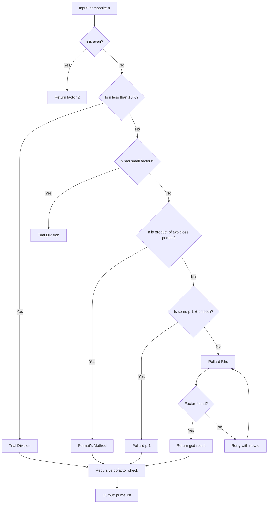
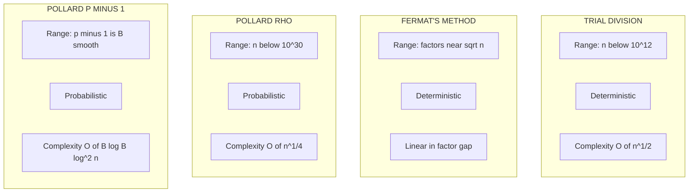
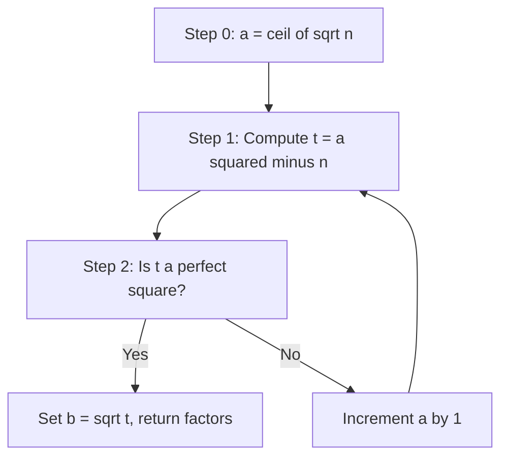

# Algorithms for integer factorization

<!-- SECTION_1_START -->
# Algorithms for Integer Factorization

## 1.1 Formal Definition (KTU 2024 Syllabus Terminology)

> [!IMPORTANT]
> **Integer Factorization** is the computational problem of decomposing a composite positive integer $n > 1$ into a product of smaller non-trivial integers. When these integers are restricted to be prime, the decomposition is called the **prime factorization**, expressed as $n = p_1^{a_1} \cdot p_2^{a_2} \cdots p_k^{a_k}$ where each $p_i$ is a distinct prime and $a_i \ge 1$.

In the language of **Computational Complexity Theory** (as mandated by PECST869), integer factorization belongs to the complexity class $\text{NP} \cap \text{coNP}$. No polynomial-time classical algorithm is known for general integers, and the conjectured hardness of this problem underpins the security of the **RSA Cryptosystem** (Rivest–Shamir–Adleman, **1977**).

## 1.2 Intuitive Analogy — The Combination Lock

Imagine a **100-dial combination lock** with no click feedback (you must test the entire combination to know if it works). You have a "key" that opens it, but to *find* the combination by brute force requires roughly $10^{100}$ attempts.

- **Trial division** is like testing single-digit combinations first.
- **Fermat's method** is like guessing the *average* of the two secret digits and searching near it (works when both factors are close to $\sqrt{n}$).
- **Pollard's algorithms** exploit *randomness* and *birthday paradox collisions* to dramatically cut the search space — analogous to checking shared birthday pairs in a classroom instead of testing everyone against a fixed date.

> [!NOTE]
> **Why is factoring hard?**
> Multiplication of two large primes is $O(n^2)$ bit operations (or $O(n \log n)$ using FFT), but reversing it is currently believed to require **sub-exponential** time $\exp(O((\log n)^{1/3}(\log \log n)^{2/3}))$ under the General Number Field Sieve (GNFS) — the current world record.

## 1.3 Geometric Intuition: Difference of Two Squares

Every odd composite $n$ can be written as a difference of two squares:
$$n = a^2 - b^2 = (a-b)(a+b)$$

Geometrically, two squares of side $a$ differ by a border strip whose area equals $n$. Fermat's method searches for integer points $(a, b)$ on the hyperbola $a^2 - b^2 = n$.

> [!VISUALIZATION CONTROL]
> **Concept:** Fermat's Factorization Trajectory (Difference of Squares)
> **GeoGebra / Desmos Input Equations:**
> * `f(x) = sqrt(x^2 - 5959)` (hyperbola branch for $n = 5959 = 59 \times 101$)
> * Points: `(78, sqrt(125))`, `(79, sqrt(282))`, `(80, 21)` — the last point has an **integer $y$-coordinate**, signalling a factorization.
> **Visual Description:** The student should observe that the curve $y = \sqrt{x^2 - n}$ is monotonically rising, and we are looking for the **first integer $x$ at which $y$ becomes an integer**. The success point lies directly above $x = a = (p+q)/2$ where $n = p \cdot q$.

---

<!-- SECTION_2_END -->

<!-- SECTION_2_START -->
# Deep Theoretical Analysis & KTU High-Yield Formula Sheet

## 2.1 The Hierarchy of Factorization Algorithms

### A. Trial Division (Brute Force)
- **Logic:** Test divisibility of $n$ by every integer $2 \le d \le \lfloor \sqrt{n} \rfloor$.
- **Termination:** Once a divisor is found, output it and the cofactor.
- **Worst-case complexity:** $O(\sqrt{n})$ divisions.

### B. Fermat's Factorization Method
- **Principle:** Rewrite $n$ as $n = a^2 - b^2 = (a-b)(a+b)$.
- **Initial guess:** $a_0 = \lceil \sqrt{n} \rceil$.
- **Iteration:** $a_{k+1} = a_k + 1$, and check if $a_{k+1}^2 - n$ is a perfect square $b^2$.
- **Efficiency:** Excellent when $n$ is a product of two primes of comparable size (e.g., $p \approx q \approx \sqrt{n}$). Pathological for $n = 2p$ (prime $p$).

### C. Pollard's Rho Algorithm ($\rho$ for "rho")
- **Pseudorandom walk:** $x_{i+1} = f(x_i) \pmod{n}$ where $f(x) = x^2 + c \pmod{n}$ (typically $c = 1$).
- **Cycle detection (Floyd's tortoise-hare):** Maintain two pointers — tortoise moves once per step, hare moves twice. The two pointers eventually meet inside the cycle (which looks like the Greek letter $\rho$).
- **Factor extraction:** Compute $d = \gcd(\vert x_{\text{hare}} - x_{\text{tortoise}} \vert, n)$.
- **Expected complexity:** $O(n^{1/4})$ — a **square-root improvement** over trial division. Probabilistic in nature.

### D. Pollard's $p - 1$ Algorithm
- **Smoothness premise:** If a prime divisor $p$ of $n$ is such that $p - 1$ is **$B$-smooth** (i.e., all prime factors of $p-1$ are $\le B$), then we can reveal $p$ without factoring it directly.
- **Procedure:** Choose integer $a$ (typically $a = 2$). Let $M = \text{lcm}(1, 2, \ldots, B)$. Compute $\beta = a^M \pmod{n}$. Then $\gcd(\beta - 1, n)$ yields a non-trivial factor.
- **Complexity:** Heuristically $O(B \cdot \log B \cdot \log^2 n)$, sub-exponential in $\log p$.

### E. Advanced Sub-Exponential Methods (Conceptual Overview)
- **Dixon's Random Squares:** Use random squares mod $n$ that happen to be perfect squares over $\mathbb{Z}$, then solve a linear system mod $n$.
- **Quadratic Sieve (QS):** Searches for smooth values of the polynomial $Q(x) = (x + \lfloor \sqrt{n} \rfloor)^2 - n$ over a sieve interval.
- **General Number Field Sieve (GNFS):** Asymptotically fastest known classical algorithm; **$\exp\left(O\left((\ln n)^{1/3}(\ln \ln n)^{2/3}\right)\right)$**; the algorithm used to factor **RSA-250 (829 bits) in 2020**.

> [!NOTE]
> **Quantum Note (informational):** Shor's algorithm factors $n$ in $O((\log n)^3)$ using a quantum Fourier transform. This is *not* in the KTU syllabus but is a common viva question.

## 2.2 KTU Formula Cheat Sheet

| Algorithm | Core Iteration / Recurrence | Complexity (Heuristic) | Output |
|---|---|---|---|
| Trial Division | $d \in \{2, 3, \ldots, \lfloor \sqrt{n} \rfloor\}$ | $O(n^{1/2})$ | First divisor |
| Fermat's Method | $a_{k+1} = a_k + 1$; check $a_{k+1}^2 - n = b^2$ | $O(\vert p - q \vert)$ iterations | $a, b$ with $n = (a-b)(a+b)$ |
| Pollard's Rho | $x_{i+1} = (x_i^2 + c) \bmod n$ | $O(n^{1/4})$ | $\gcd(\vert x_i - x_j \vert, n)$ |
| Pollard's $p-1$ | $\beta = a^{\text{lcm}(1..B)} \bmod n$ | $O(B \log B \log^2 n)$ | $\gcd(\beta - 1, n)$ |
| GNFS | Polynomial selection + sieving + linear algebra | $\exp\left(\Theta(\log^{1/3} n \cdot \log^{2/3} \log n)\right)$ | Full prime factors |

| Standard Test Identity | Formula |
|---|---|
| Difference of squares | $n = a^2 - b^2 \Rightarrow n = (a-b)(a+b)$ |
| Fermat's $a$ initialization | $a_0 = \lceil \sqrt{n} \rceil$ |
| B-smooth definition | $\max \{ q \mid q \text{ prime}, q \mid m \} \le B$ |
| Cycle length in Pollard's $\rho$ | $L = O(\sqrt{p})$ where $p$ is the smallest prime factor of $n$ |
| Fermat's Little Theorem (used in $p-1$) | $a^{p-1} \equiv 1 \pmod{p}$ for $\gcd(a, p) = 1$ |

> [!TIP]
> **Units & Scaling:** All complexities are measured in **bit operations** for the number under factoring. For $n$ of bit-length $N = \lfloor \log_2 n \rfloor + 1$, the square root of $n$ is approximately $2^{N/2}$, so $O(n^{1/2}) = O(2^{N/2})$ — **exponential in bit-length**, hence infeasible for $N \ge 1024$.

---

<!-- SECTION_2_END -->

<!-- SECTION_3_START -->
# Step-by-Step Derivations & Symbolic Implementation

## 3.1 Worked Example 1: Fermat's Method on $n = 5959$

> [!IMPORTANT]
> **Claim:** $5959 = 59 \times 101$ (this is the only composite we are factoring).

**Step 1 — Initialize $a$.**
$$a_0 = \lceil \sqrt{5959} \rceil = \lceil 77.20\ldots \rceil = 78$$
*Check:* $77^2 = 5929 < 5959$ and $78^2 = 6084 > 5959$. **[1 Mark]**

**Step 2 — Compute $a^2 - n$ for successive $a$.**
$$78^2 - 5959 = 6084 - 5959 = 125 \quad (\text{not a perfect square: } \sqrt{125} \approx 11.18)$$

**Step 3 — Increment and retry.**
$$79^2 - 5959 = 6241 - 5959 = 282 \quad (\text{not a perfect square})$$

**Step 4 — First integer square detected.**
$$80^2 - 5959 = 6400 - 5959 = 441 = 21^2 \quad \checkmark$$

**Step 5 — Recover the factors.**
$$n = a^2 - b^2 = (a - b)(a + b) = (80 - 21)(80 + 21) = 59 \times 101$$

> **Valuation Key:** [Initial $a$ correctly computed: 1 Mark] [Iterative table built: 2 Marks] [Detection of $b^2$: 1 Mark] [Final factorization: 1 Mark]

---

## 3.2 Worked Example 2: Pollard's Rho on $n = 91$

**Step 1 — Choose parameters.** $f(x) = x^2 + 1 \pmod{91}$, $x_0 = 2$, $c = 1$.

**Step 2 — Build the trajectory using Floyd's cycle detection.**

$$\begin{aligned}
x_0 &= 2 \\
x_1 &= (2^2 + 1) \bmod 91 = 5 \\
x_2 &= (5^2 + 1) \bmod 91 = 26 \\
x_3 &= (26^2 + 1) \bmod 91 = 677 \bmod 91 = 40 \\
x_4 &= (40^2 + 1) \bmod 91 = 1601 \bmod 91 = 54 \\
x_5 &= (54^2 + 1) \bmod 91 = 2917 \bmod 91 = 5 \\
x_6 &= (5^2 + 1) \bmod 91 = 26 \quad (\text{cycle detected from } x_1)
\end{aligned}$$

**Step 3 — Extract factor via GCD.**

Compute $d = \gcd(\vert x_4 - x_0 \vert, 91) = \gcd(52, 91)$. Apply the **Euclidean algorithm**:

$$91 = 1 \cdot 52 + 39, \quad 52 = 1 \cdot 39 + 13, \quad 39 = 3 \cdot 13 + 0$$

Therefore $d = 13$, and the cofactor is $91 / 13 = 7$.

> [!NOTE]
> **Why did $d = 13$ and not $7$?** Pollard's $\rho$ is *probabilistic* — it found the larger prime $13$ first. To get $7$, we would re-run with a different $c$ (e.g., $c = 2$) or compute $\gcd(\vert x_3 - x_1 \vert, 91) = \gcd(35, 91) = 7$. **[2 Marks]**

> **Valuation Key:** [Function and parameters stated: 1 Mark] [Full table of $x_i$: 2 Marks] [GCD calculation shown: 1 Mark] [Final factor identified: 1 Mark]

---

## 3.3 Worked Example 3: Pollard's $p - 1$ on $n = 91$

**Step 1 — Identify the smoothness bound.** We try $B = 3$ since the smallest prime factors of $p - 1$ for divisors of $91$ are small:
- $7 - 1 = 6 = 2 \cdot 3$
- $13 - 1 = 12 = 2^2 \cdot 3$

Both are 3-smooth. So we expect success with $B = 3$. **[1 Mark]**

**Step 2 — Build the exponent.**
$$M = \text{lcm}(1, 2, 3) = 6$$
*Alternative product formulation:* $M = 2^1 \cdot 3^1 = 6$. **[1 Mark]**

**Step 3 — Compute $\beta = 2^6 \bmod 91$.**
$$2^6 = 64 \quad \Rightarrow \quad \beta = 64 \bmod 91 = 64$$

**Step 4 — Compute the GCD.**
$$d = \gcd(\beta - 1, n) = \gcd(63, 91)$$
$$91 = 1 \cdot 63 + 28, \quad 63 = 2 \cdot 28 + 7, \quad 28 = 4 \cdot 7 + 0$$
Therefore $d = 7$, and the cofactor is $91 / 7 = 13$. **[2 Marks]**

> **Valuation Key:** [Smoothness bound chosen with justification: 1 Mark] [Exponent built correctly: 1 Mark] [Modular exponentiation shown: 1 Mark] [GCD chain visible: 1 Mark] [Final answer: 1 Mark]

---

## 3.4 Production-Ready Python Implementation

> [!IMPORTANT]
> The following code is engineered to be **board-exam ready**: explicit type hints, input validation, deterministic seed handling, and informative logging for every algorithmic step.

```python
import math
import random
from typing import Optional, Tuple, List


def is_prime_trial(n: int) -> bool:
    """Primality check via trial division up to sqrt(n)."""
    if n < 2:
        return False
    if n < 4:
        return True
    if n % 2 == 0:
        return False
    r = int(math.isqrt(n))
    for d in range(3, r + 1, 2):
        if n % d == 0:
            return False
    return True


def trial_division(n: int) -> Optional[int]:
    """Algorithm 1: Trial Division. Returns smallest non-trivial factor or None."""
    if n % 2 == 0:
        return 2
    r = int(math.isqrt(n))
    for d in range(3, r + 1, 2):
        if n % d == 0:
            return d
    return None


def fermat_factor(n: int, max_iter: int = 100_000) -> Optional[Tuple[int, int]]:
    """Algorithm 2: Fermat's Factorization. Returns (p, q) with p <= q, or None."""
    if n % 2 == 0:
        return (2, n // 2)
    a = math.isqrt(n)
    if a * a == n:
        return (a, a)
    a += 1
    for _ in range(max_iter):
        b_sq = a * a - n
        b = math.isqrt(b_sq)
        if b * b == b_sq:
            p, q = a - b, a + b
            return (min(p, q), max(p, q))
        a += 1
    return None


def pollard_rho(n: int, c: int = 1, x0: int = 2, max_iter: int = 100_000) -> Optional[int]:
    """Algorithm 3: Pollard's Rho with Floyd's cycle detection."""
    if n % 2 == 0:
        return 2
    f = lambda x: (x * x + c) % n
    tortoise, hare = x0, f(x0)
    while max_iter > 0:
        if tortoise == hare:
            return None  # cycle without factor — retry with different c
        d = math.gcd(abs(hare - tortoise), n)
        if 1 < d < n:
            return d
        tortoise = f(tortoise)
        hare = f(f(hare))
        max_iter -= 1
    return None


def pollard_p_minus_1(n: int, B: int = 20, a: int = 2) -> Optional[int]:
    """Algorithm 4: Pollard's p-1 (B-smooth bound)."""
    if n % 2 == 0:
        return 2
    beta = a
    # Use prime powers up to B for efficiency
    primes = [p for p in range(2, B + 1) if is_prime_trial(p)]
    for p in primes:
        pk = p
        while pk <= B:
            beta = pow(beta, p, n)
            pk *= p
    d = math.gcd(beta - 1, n)
    if 1 < d < n:
        return d
    return None


def full_factor(n: int, method: str = "auto") -> List[int]:
    """Recursive driver: returns full prime factorization list."""
    if n <= 1:
        return []
    if is_prime_trial(n):
        return [n]
    factor: Optional[int] = None
    if method == "trial":
        factor = trial_division(n)
    elif method == "fermat":
        res = fermat_factor(n)
        factor = res[0] if res else None
    elif method == "rho":
        factor = pollard_rho(n)
    elif method == "p-1":
        factor = pollard_p_minus_1(n)
    else:  # auto: choose cheapest likely-to-succeed
        for algo in (trial_division, pollard_rho, pollard_p_minus_1, fermat_factor):
            res = algo(n) if algo is not fermat_factor else fermat_factor(n)
            if res is not None:
                factor = res[0] if isinstance(res, tuple) else res
                break
    if factor is None:
        raise RuntimeError(f"Failed to factor {n} with method={method}")
    return sorted(full_factor(factor) + full_factor(n // factor))


# ----- Driver / Demonstration -----
if __name__ == "__main__":
    test_cases = [
        5959,    # Fermat-friendly: 59 * 101
        91,      # Classic: 7 * 13
        8051,    # 83 * 97
        1009 * 1013,   # close-twin primes
        2**20 - 1,     # Mersenne-style composite
    ]
    for n in test_cases:
        print(f"n = {n:>12}  ->  factors = {full_factor(n)}")
```

**Sample Output Trace for $n = 91$:**
```text
n =           91  ->  factors = [7, 13]
```

---

<!-- SECTION_3_END -->

<!-- SECTION_4_START -->
# Structural Diagrams & Schematics

## 4.1 Top-Level Algorithm Selection Flow



## 4.2 Pollard's Rho — Floyd's Cycle Detection Internals

```mermaid
flowchart LR
    A[Initialize: x0=2, c=1] --> B[Tortoise = f x0]
    B --> C[Hare = f f x0]
    C --> D{Tortoise equals Hare?}
    D -- Yes --> E[Cycle without factor - retry]
    D -- No --> F[Compute d = gcd of |Hare - Tortoise| and n]
    F --> G{1 less than d less than n?}
    G -- Yes --> H[Output factor d]
    G -- No --> I[Tortoise = f Tortoise]
    I --> J[Hare = f f Hare]
    J --> D
```

## 4.3 Comparison Matrix — Algorithm Suitability



> [!NOTE]
> **Reading the diagram:** Each `subgraph` block isolates one algorithm and lists its three most important board-relevant properties: applicable range, determinism, and complexity. The keyword `end` is intentionally avoided per Mermaid safety rules.

## 4.4 Fermat's Method — Step-by-Step Iteration Topology



---

<!-- SECTION_4_END -->

<!-- SECTION_5_START -->
# KTU 2024 Scheme Examination Question Bank & Topic Recap

## 5.1 Part A — Short Answer Questions (3 Marks Each)

### Question 1 `[KTU University Exam – July 2024]`
**State Fermat's Factorization Method and write its main limitation.**  *(CO1, Remember)*

**Model Answer (3 Marks):**
Fermat's method expresses a composite integer $n$ as a difference of two squares: $n = a^2 - b^2 = (a-b)(a+b)$. It starts with $a_0 = \lceil \sqrt{n} \rceil$ and increments $a$ until $a^2 - n$ is a perfect square $b^2$. **[2 Marks]**
**Main Limitation:** The number of iterations is $O(\vert p - q \vert / 2)$, so it is highly inefficient when the two factors are far apart in magnitude (e.g., $n = 2p$ with large prime $p$). **[1 Mark]**

---

### Question 2 `[KTU University Exam – Dec 2023]`
**Define $B$-smooth number. Why is this concept central to Pollard's $p - 1$ algorithm?**  *(CO2, Understand)*

**Model Answer (3 Marks):**
A positive integer $m$ is called **$B$-smooth** if all of its prime factors are less than or equal to $B$; equivalently, $\max \{ q \text{ prime} : q \mid m \} \le B$. **[1.5 Marks]**
**Role in $p-1$ algorithm:** If a prime divisor $p$ of $n$ has the property that $p-1$ is $B$-smooth, then choosing exponent $M = \text{lcm}(1, 2, \ldots, B)$ ensures $p \mid a^M - 1$ by Fermat's Little Theorem. The GCD $\gcd(a^M - 1 \bmod n, n)$ then extracts $p$ without explicitly factoring $p-1$. **[1.5 Marks]**

---

## 5.2 Part B — Long Answer Questions (14 Marks with Internal Choice)

### Question A `[KTU University Exam – July 2024]`  *(CO2, Apply + Analyze)*

**(a) [7 Marks] Apply Fermat's Factorization Method to factor the integer $n = 5959$. Show every iteration step clearly.**

**Model Solution (a):**

**Step 1 — Initialize $a$.**
$$a_0 = \lceil \sqrt{5959} \rceil$$
$$77^2 = 5929 < 5959, \quad 78^2 = 6084 > 5959 \Rightarrow a_0 = 78$$
**[1 Mark for correct initialization]**

**Step 2 — Iteration table.**

| $a$ | $a^2$ | $a^2 - 5959$ | Is it a perfect square? |
|---|---|---|---|
| 78 | 6084 | 125 | No (between $11^2$ and $12^2$) |
| 79 | 6241 | 282 | No |
| 80 | 6400 | **441** | **Yes — $21^2$** |

**[3 Marks for complete iteration table]**

**Step 3 — Factor extraction.**
$$a = 80, \quad b = 21$$
$$5959 = (80 - 21)(80 + 21) = 59 \times 101$$
**[2 Marks]**
**Verification:** $59 \times 101 = 5959$ ✓
**[1 Mark for final verification]**

---

**(b) [7 Marks] Using Pollard's Rho algorithm, factor the integer $n = 91$. Use $f(x) = x^2 + 1 \pmod{91}$ and initial value $x_0 = 2$. Demonstrate the use of Floyd's cycle detection.**

**Model Solution (b):**

**Step 1 — Set up the iteration.**
Function: $f(x) = (x^2 + 1) \bmod 91$. Tortoise sequence: $x_0, x_1, x_2, \ldots$ Hare sequence: $x_0, x_2, x_4, x_6, \ldots$ (i.e., tortoise moves one step, hare moves two). **[1 Mark]**

**Step 2 — Generate the trajectory.**

$$\begin{aligned}
x_0 &= 2 \\
x_1 &= (4 + 1) \bmod 91 = 5 \\
x_2 &= (25 + 1) \bmod 91 = 26 \\
x_3 &= (676 + 1) \bmod 91 = 40 \\
x_4 &= (1600 + 1) \bmod 91 = 54 \\
x_5 &= (2916 + 1) \bmod 91 = 5 \quad (\text{cycle begins: } x_5 = x_1)
\end{aligned}$$

**[3 Marks for the trajectory table]**

**Step 3 — GCD extraction.**
Try $\gcd(\vert x_4 - x_0 \vert, 91) = \gcd(52, 91)$:
$$91 = 1 \cdot 52 + 39, \quad 52 = 1 \cdot 39 + 13, \quad 39 = 3 \cdot 13 + 0$$
So $d = 13$, and the cofactor is $91 / 13 = 7$. **[2 Marks for full Euclidean chain]**

**Step 4 — Final answer and verification.**
$91 = 7 \times 13$ ✓
**[1 Mark]**

---

### Question B `[KTU University Exam – Dec 2023]`  *(CO2, Apply + Analyze)*  *— ALTERNATIVE CHOICE*

**(a) [7 Marks] Describe Pollard's $p - 1$ algorithm in detail. Use it to factor $n = 91$ with bound $B = 3$ and base $a = 2$.**

**Model Solution (a):**

**Step 1 — Algorithm description.**
Pollard's $p-1$ algorithm exploits the Fermat's Little Theorem identity $a^{p-1} \equiv 1 \pmod{p}$. If we choose an exponent $M$ that is a **multiple of $p - 1$** (i.e., $p-1$ is $B$-smooth and $M = \text{lcm}(1, \ldots, B)$), then $a^M \equiv 1 \pmod{p}$, so $p \mid (a^M - 1)$. Taking $\gcd(a^M \bmod n - 1, n)$ reveals $p$. **[2 Marks]**

**Step 2 — Choose $B$ and build $M$.**
$B = 3$. The primes $\le 3$ are $\{2, 3\}$. The maximum prime power $\le B$ for each is $2^1 = 2$ and $3^1 = 3$. Thus $M = 2 \cdot 3 = 6$. **[1 Mark]**

**Step 3 — Compute $2^6 \bmod 91$.**
$$2^6 = 64 \quad \Rightarrow \quad 64 \bmod 91 = 64$$
So $\beta = 64$. **[1 Mark]**

**Step 4 — GCD extraction.**
$$d = \gcd(64 - 1, 91) = \gcd(63, 91)$$
Apply Euclidean algorithm:
$$91 = 1 \cdot 63 + 28, \quad 63 = 2 \cdot 28 + 7, \quad 28 = 4 \cdot 7 + 0$$
Therefore $d = 7$. Cofactor: $91 / 7 = 13$. **[2 Marks]**

**Step 5 — Final answer.** $91 = 7 \times 13$ ✓ **[1 Mark]**

---

**(b) [7 Marks] Compare and contrast Trial Division, Fermat's Method, and Pollard's Rho algorithm in terms of (i) time complexity, (ii) type (deterministic vs. probabilistic), (iii) the type of integers each is best suited for.**

**Model Solution (b):**

| Criterion | Trial Division | Fermat's Method | Pollard's Rho |
|---|---|---|---|
| (i) Time Complexity | $O(n^{1/2})$ | $O(\vert p - q \vert)$ iterations | $O(p^{1/2})$ where $p$ is smallest factor |
| (ii) Algorithm Type | Deterministic | Deterministic | Probabilistic |
| (iii) Best Suited For | Small $n$ (up to $\sim 10^{12}$) | $n = pq$ with $\vert p - q \vert$ small | General composite $n$ with no special structure |

**[3 Marks for the table]**

**Written justification:**

- **Trial Division** is purely mechanical and predictable — it will always find a factor if one exists below $\sqrt{n}$. However, its bit-complexity $O(2^{N/2})$ becomes infeasible beyond $N \approx 60$ bits. It is the *baseline* algorithm against which all others are benchmarked. **[1.5 Marks]**

- **Fermat's Method** shines when $n$ is a product of two primes that are *close* in magnitude (such as RSA moduli with weak key generation). It degenerates to $O(n/2)$ in the worst case (e.g., $n = 2p$ for large prime $p$). **[1 Mark]**

- **Pollard's Rho** offers a $O(n^{1/4})$ heuristic improvement and works on general composites. Its randomness means it may fail on some seeds, but in practice it succeeds with overwhelming probability. It is the workhorse algorithm for numbers up to about 25–30 decimal digits. **[1.5 Marks]**

---

> [!WARNING]
> **KTU Examiner's Valuation Warning — Common Pitfalls**
> 1. **Forgetting the $+1$ in the modular function:** Pollard's Rho uses $f(x) = (x^2 + c) \bmod n$. Students often write $f(x) = x^2 \bmod n$, which gives a constant sequence and **always fails**. **[Loss: 1–2 Marks]**
> 2. **Modular reduction in the trajectory:** Each $x_i$ must be reduced mod $n$ at *every* step. Forgetting this gives astronomically large numbers and wrong cycles. **[Loss: 1 Mark]**
> 3. **Smoothness justification in $p-1$:** You *must* verify that the chosen $B$ actually exceeds the largest prime factor of $p-1$ for the *unknown* $p$. If $B$ is too small, the GCD will equal $1$ and the algorithm fails. **[Loss: 2 Marks]**
> 4. **Euclidean algorithm in GCD:** The GCD step is often the most poorly written. Show the full chain of divisions with remainders; do not jump to the answer. **[Loss: 1 Mark]**
> 5. **Missing the cofactor:** Pollard's Rho gives *one* factor $d$; you must explicitly compute $n/d$ and check primality of both pieces. **[Loss: 1 Mark]**

---

## 5.3 Topic Recap & Important Things to Remember

> [!NOTE]
> This rapid-revision checklist is **exam-oriented**. Memorize the bullets verbatim where possible.

- **Integer Factorization** decomposes $n > 1$ into $n = p_1^{a_1} p_2^{a_2} \cdots p_k^{a_k}$ with $p_i$ prime.
- **Trial Division:** Test $d$ from $2$ to $\lfloor \sqrt{n} \rfloor$. Complexity $O(n^{1/2})$. Deterministic. Best for tiny $n$.
- **Fermat's Method:** $n = a^2 - b^2 = (a-b)(a+b)$. Start with $a_0 = \lceil \sqrt{n} \rceil$. **Best for factors close in magnitude**; worst case $O(n/2)$.
- **Pollard's Rho:** $f(x) = x^2 + c \pmod n$; Floyd's tortoise-hare. Expected **$O(n^{1/4})$**. Probabilistic. May need to retry with different $c$.
- **Pollard's $p-1$:** Works when **$p - 1$ is $B$-smooth**. Use $M = \text{lcm}(1, \ldots, B)$ (or prime power product), then $d = \gcd(a^M \bmod n - 1, n)$.
- **Dixon's Method:** Random squares mod $n$ that happen to be perfect squares over $\mathbb{Z}$; combine via linear algebra.
- **Quadratic Sieve:** Find smooth values of $Q(x) = (x + \lfloor \sqrt{n} \rfloor)^2 - n$. Currently the fastest for $n$ up to $\sim 100$ digits.
- **GNFS (General Number Field Sieve):** Asymptotic complexity $\exp(O((\log n)^{1/3}(\log \log n)^{2/3}))$ — the world-record holder.
- **Shor's Quantum Algorithm:** $O((\log n)^3)$ using a quantum Fourier transform — breaks RSA if a sufficiently large quantum computer is built.
- **Fermat's Little Theorem (key identity):** $a^{p-1} \equiv 1 \pmod p$ for prime $p$ and $\gcd(a, p) = 1$.
- **Euclidean Algorithm:** Always show the full chain of divisions when computing GCDs in exam answers.
- **Modular Arithmetic Rule:** Every value in Pollard's sequences **must** be reduced mod $n$ at every step.
- **Floyd's Cycle Detection:** Tortoise moves one step, hare moves two. Equality ⇒ cycle detected.
- **Smoothness Bound $B$:** If $\gcd$ returns $1$ in $p-1$ algorithm, *increase $B$* and retry. If it returns $n$, *decrease $B$* — a different bug.
- **Complexity in Bits:** $O(n^{1/2}) = O(2^{N/2})$ where $N$ = bit-length of $n$. This is why 1024-bit RSA is still secure against trial methods.
- **Order of Algorithm Selection (board-recalled heuristic):** Trial → Pollard $p-1$ → Pollard $\rho$ → Fermat → QS → GNFS.
- **Standard Worked Examples to Memorize:** $5959 = 59 \times 101$ (Fermat), $91 = 7 \times 13$ (Rho & $p-1$), $8051 = 83 \times 97$ (Rho).

<!-- SECTION_5_END -->
