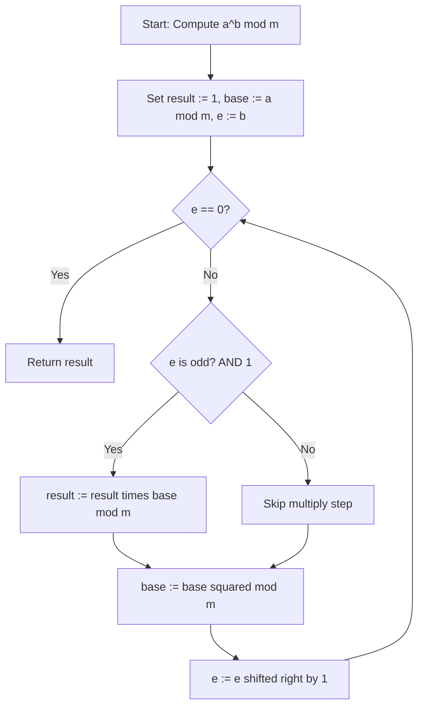
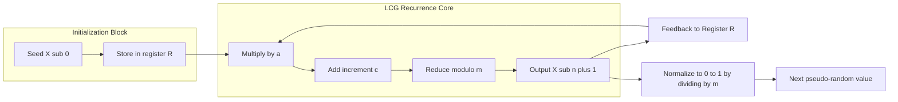
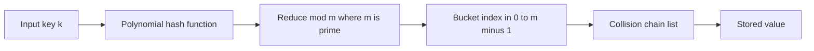
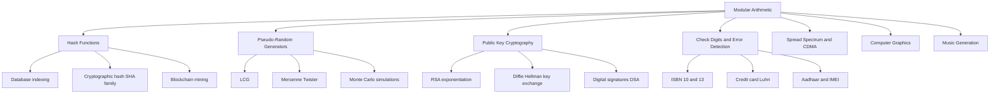
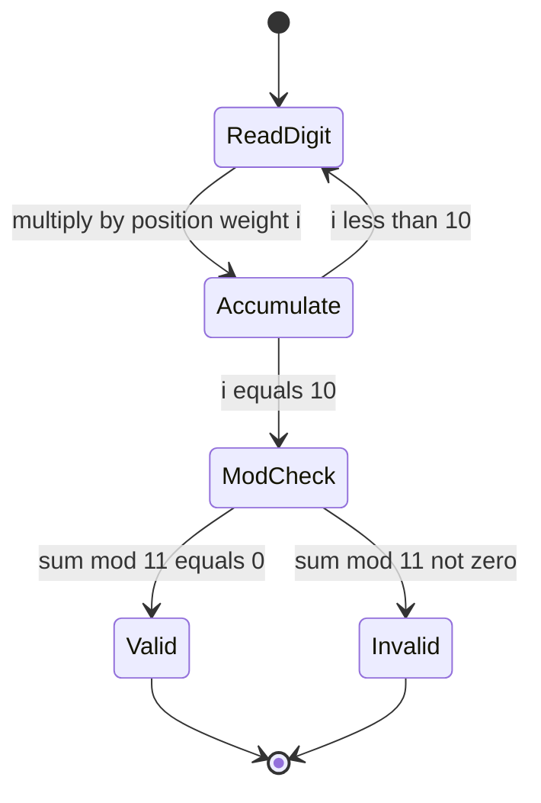

# Applications of modular arithmetic

<!-- SECTION_1_START -->
# Applications of Modular Arithmetic

## Formal Academic Definition

> [!IMPORTANT]
> **Modular Arithmetic** is a system of arithmetic for integers, where numbers "wrap around" upon reaching a fixed value called the **modulus**. Two integers $a$ and $b$ are said to be **congruent modulo $m$** (denoted $a \equiv b \pmod{m}$) if and only if $m$ divides their difference, i.e., $m \mid (a - b)$, where $m$ is a positive integer called the **modulus**.

In the context of **Computational Number Theory (PECST869)**, modular arithmetic is the foundational computational engine behind every major real-world cryptosystem, hash function, pseudo-random number generator, and check-digit validator used in modern computing and communication infrastructure.

## Conceptual Analogy / Intuition

> [!NOTE]
> **The 12-Hour Clock Analogy** 🕐
> Imagine a standard analog clock with 12 hours marked on its face. If it is 10:00 AM now and we ask "what time will it be 5 hours from now?", the answer is **3:00 PM**, not 15:00. This is because the clock "wraps around" after reaching 12. Mathematically, we computed $(10 + 5) \bmod 12 = 15 \bmod 12 = 3$.
> In this analogy: the **modulus is 12**, the **clock face represents the residue system $\mathbb{Z}_{12} = \{0, 1, 2, \ldots, 11\}$**, and the **hand position represents the residue class** of any integer.
> Similarly, in a 24-hour digital watch, adding 10 hours to 18:00 gives 04:00 (the next day), because $(18 + 10) \bmod 24 = 4$. This same principle — *discarding multiples of the modulus* — powers cryptography, hashing, and data integrity checks worldwide.

## Why This Matters in Engineering

Modular arithmetic solves a fundamental engineering problem: **how to perform reliable computation on integers that are astronomically large** (such as the 2048-bit primes used in RSA encryption) using finite memory and bounded time. Instead of working with numbers that have hundreds of digits, we constantly reduce intermediate values to a small residue set $\mathbb{Z}_m$, which is the cornerstone of efficiency in **public-key cryptography**, **database indexing**, **error-correcting codes**, and **digital signatures**.

> [!VISUALIZATION CONTROL]
> **Concept:** Modular Reduction on the Number Line
> **GeoGebra / Desmos Input Equations:**
> * `f(x) = mod(x, 12)`  *(use the modulo function in Desmos)*
> * `g(x) = x`
> **Visual Description:** Plot the line $y = x$ in blue. Overlay $y = x \bmod 12$ in red — a sawtooth wave that resets to 0 at every multiple of 12. The "jumps" occur at $x = 0, 12, 24, 36, \ldots$, visually demonstrating how integers are mapped into the residue class $\mathbb{Z}_{12}$.

---

## Key Real-World Applications (Syllabus Mapping)

The following applications are explicitly covered under **Module 1** of the KTU 2024 syllabus for **Computational Number Theory (PECST869)**:

1. **Hash Functions** — used in hash tables, data retrieval, and blockchain.
2. **Pseudo-Random Number Generators (LCG)** — used in simulations, Monte Carlo methods, and gaming engines.
3. **Cryptographic Primitives** — modular exponentiation underpins RSA, Diffie-Hellman, and ElGamal.
4. **Check Digits and Error Detection** — ISBN, credit card numbers, Aadhaar, IMEI codes.
5. **Spread-Spectrum Communication and Watermarking** — CDMA codes, audio watermarking.
6. **Computer Graphics** — tileable textures using modular wrapping.

<!-- SECTION_1_END -->

<!-- SECTION_2_START -->
# Deep Theoretical Analysis & KTU High-Yield Formula Sheet

## Fundamental Properties of Modular Arithmetic

For any integers $a$, $b$, $c$, and positive modulus $m$, the following identities hold and are the **workhorse of every modular algorithm**:

- **Reflexivity:** $a \equiv a \pmod{m}$
- **Symmetry:** $a \equiv b \pmod{m} \iff b \equiv a \pmod{m}$
- **Transitivity:** If $a \equiv b \pmod{m}$ and $b \equiv c \pmod{m}$, then $a \equiv c \pmod{m}$

### Arithmetic Operation Identities

- **Addition:** $(a + b) \bmod m = ((a \bmod m) + (b \bmod m)) \bmod m$
- **Subtraction:** $(a - b) \bmod m = ((a \bmod m) - (b \bmod m) + m) \bmod m$
- **Multiplication:** $(a \cdot b) \bmod m = ((a \bmod m) \cdot (b \bmod m)) \bmod m$
- **Exponentiation:** $a^k \bmod m$ can be computed without ever computing $a^k$ (uses **fast modular exponentiation**).
- **Modular Inverse:** $a \cdot a^{-1} \equiv 1 \pmod{m}$ exists **if and only if** $\gcd(a, m) = 1$.

### Multiplicative Inverse Test (Fermat's Little Theorem)

> [!NOTE]
> **Fermat's Little Theorem:** If $p$ is prime and $\gcd(a, p) = 1$, then $a^{p-1} \equiv 1 \pmod{p}$. Consequently, the multiplicative inverse is $a^{-1} \equiv a^{p-2} \pmod{p}$.

## Application 1: Hash Functions

A **hash function** $h: U \to \{0, 1, \ldots, m-1\}$ maps universe $U$ to a finite set of $m$ buckets. The simplest and fastest is the **division method**:

$$h(k) = k \bmod m$$

The choice of $m$ is critical: $m$ should be a **prime** not too close to a power of 2 to avoid clustering. In production hash tables (e.g., Java's `HashMap`), $m$ is typically a power of 2 and a bit-mask is used instead.

## Application 2: Linear Congruential Generator (LCG)

The **LCG** is the most widely taught pseudo-random number generator, defined by the recurrence:

$$X_{n+1} = (a \cdot X_n + c) \bmod m$$

where $a$ is the **multiplier**, $c$ is the **increment**, $m$ is the **modulus**, and $X_0$ is the **seed**. The famous parameters used by glibc (used in GCC, Python's `random` historically) are $a = 1103515245$, $c = 12345$, $m = 2^{31}$.

## Application 3: ISBN-10 Check Digit

The **ISBN-10** uses modular arithmetic to detect transcription errors. Given digits $d_1 d_2 \ldots d_9$, the check digit $d_{10}$ is chosen so that:

$$\sum_{i=1}^{10} i \cdot d_i \equiv 0 \pmod{11}$$

The digit $d_{10}$ can be $X$ (representing 10), and the modulus 11 ensures strong error detection.

## Application 4: Modular Exponentiation (Cryptography)

The operation $a^b \bmod m$ with $a, b, m$ being 1024-bit integers must be computed in milliseconds. The **Square-and-Multiply algorithm** computes this in $O(\log_2 b)$ multiplications.

## KTU Formula Sheet / Cheat Sheet

| # | Concept | Formula / Property | Engineering Use Case |
|---|---------|--------------------|----------------------|
| 1 | Congruence | $a \equiv b \pmod{m} \iff m \mid (a-b)$ | Cryptographic equivalence |
| 2 | Modular Addition | $(a+b) \bmod m = ((a \bmod m) + (b \bmod m)) \bmod m$ | Clock arithmetic, time zones |
| 3 | Modular Multiplication | $(a \cdot b) \bmod m = ((a \bmod m)(b \bmod m)) \bmod m$ | Prevents integer overflow in crypto |
| 4 | Modular Exponentiation | Use **Square-and-Multiply** in $O(\log b)$ | RSA encryption/decryption |
| 5 | Fermat's Little Theorem | $a^{p-1} \equiv 1 \pmod{p}$ for prime $p$ | Computing modular inverse |
| 6 | Modular Inverse | $a^{-1} \equiv a^{p-2} \pmod{p}$ | RSA key generation, ECDSA |
| 7 | Hash Function (Division) | $h(k) = k \bmod m$ | Database indexing, hash tables |
| 8 | Hash Function (Multiplication) | $h(k) = \lfloor m \cdot (kA \bmod 1) \rfloor$ | Better distribution, Knuth's method |
| 9 | LCG | $X_{n+1} = (aX_n + c) \bmod m$ | Monte Carlo simulations, gaming |
| 10 | ISBN-10 Check | $\sum_{i=1}^{10} i \cdot d_i \equiv 0 \pmod{11}$ | Book barcode validation |
| 11 | ISBN-13 Check | $\sum_{i=1}^{13} (i \bmod 2 + 1) \cdot d_i \equiv 0 \pmod{10}$ | Modern book barcodes (EAN-13) |
| 12 | Euler's Theorem | $a^{\phi(m)} \equiv 1 \pmod{m}$ for $\gcd(a,m)=1$ | RSA generalization |

> [!IMPORTANT]
> **Examiner's Note:** For maximum marks in KTU exams, **always state the modulus explicitly** and **show the residue reduction step** even if the operand is already smaller than the modulus. This shows the examiner you understand the *mechanism*, not just the final number.

<!-- SECTION_2_END -->

<!-- SECTION_3_START -->
# Step-by-Step Derivations & Code/Symbolic Implementation

## Derivation 1: Square-and-Multiply Modular Exponentiation

We want to compute $a^b \bmod m$ efficiently. The naive approach computes $a \cdot a \cdot \ldots$ ($b$ times), which is $O(b)$ and infeasible for 2048-bit exponents.

### Mathematical Foundation

Every positive integer $b$ has a binary representation $b = \sum_{j=0}^{k} b_j 2^j$ where $b_j \in \{0, 1\}$. Therefore:

$$a^b = a^{\sum_{j=0}^{k} b_j 2^j} = \prod_{j=0}^{k} (a^{2^j})^{b_j}$$

We compute $a^{2^j} \bmod m$ iteratively by squaring, and multiply the result only when the corresponding bit $b_j = 1$.

### Worked Example: Compute $5^{13} \bmod 7$

We rewrite $13$ in binary: $13_{10} = 1101_2 = (8 + 4 + 0 + 1)$.

We process bits from LSB to MSB (right to left):

$$\begin{aligned}
\text{Step 1 (bit } b_0 = 1): &\quad \text{result} = 5^1 \bmod 7 = 5 \\
\text{Step 2 (square for bit } b_1 = 0): &\quad \text{base} = 5^2 \bmod 7 = 25 \bmod 7 = 4; \quad \text{bit is 0, result unchanged} = 5 \\
\text{Step 3 (square for bit } b_2 = 1): &\quad \text{base} = 4^2 \bmod 7 = 16 \bmod 7 = 2; \quad \text{result} = 5 \cdot 2 \bmod 7 = 10 \bmod 7 = 3 \\
\text{Step 4 (square for bit } b_3 = 1): &\quad \text{base} = 2^2 \bmod 7 = 4; \quad \text{result} = 3 \cdot 4 \bmod 7 = 12 \bmod 7 = 5 \\
\end{aligned}$$

**Final Answer:** $5^{13} \bmod 7 = 5$

### Verification: $5^{13} = 1220703125$; $1220703125 / 7 = 174386160$ remainder $5$. ✓

## Derivation 2: LCG Sequence Generation

Generate 5 pseudo-random numbers using the parameters $a = 3$, $c = 5$, $m = 7$, $X_0 = 2$.

$$\begin{aligned}
X_1 &= (3 \cdot 2 + 5) \bmod 7 = 11 \bmod 7 = 4 \\
X_2 &= (3 \cdot 4 + 5) \bmod 7 = 17 \bmod 7 = 3 \\
X_3 &= (3 \cdot 3 + 5) \bmod 7 = 14 \bmod 7 = 0 \\
X_4 &= (3 \cdot 0 + 5) \bmod 7 = 5 \bmod 7 = 5 \\
X_5 &= (3 \cdot 5 + 5) \bmod 7 = 20 \bmod 7 = 6 \\
\end{aligned}$$

**Sequence:** $2, 4, 3, 0, 5, 6$ — period 7 (full period for these parameters).

## Derivation 3: ISBN-10 Check Digit Computation

Find the check digit for ISBN prefix $0$-$13$-$123456$-$78$? (i.e., the first 9 digits are $0, 1, 3, 1, 2, 3, 4, 5, 6$).

We need $d_{10}$ such that $\sum_{i=1}^{10} i \cdot d_i \equiv 0 \pmod{11}$.

$$\begin{aligned}
S_{\text{known}} &= 1(0) + 2(1) + 3(3) + 4(1) + 5(2) + 6(3) + 7(4) + 8(5) + 9(6) \\
&= 0 + 2 + 9 + 4 + 10 + 18 + 28 + 40 + 54 \\
&= 165 \\
165 + 10 \cdot d_{10} &\equiv 0 \pmod{11} \\
10 \cdot d_{10} &\equiv -165 \pmod{11} \\
-165 \bmod 11 &= -(165 \bmod 11) = -(0) = 0 \quad \text{(since } 165 = 15 \cdot 11\text{)} \\
10 \cdot d_{10} &\equiv 0 \pmod{11} \\
\end{aligned}$$

Since $\gcd(10, 11) = 1$, the inverse of $10 \bmod 11$ is $10$ (because $10 \cdot 10 = 100 = 9 \cdot 11 + 1$). Thus $d_{10} \equiv 0 \cdot 10 \equiv 0 \pmod{11}$, so $d_{10} = 0$.

**ISBN-10 complete:** $0$-$13$-$123456$-$78$-$0$.

## Code Implementation: Square-and-Multiply in Python

```python
import sys
import logging

logging.basicConfig(level=logging.INFO, format='%(levelname)s: %(message)s')

def mod_exp(base: int, exponent: int, modulus: int) -> int:
    """
    Compute (base ** exponent) mod modulus using the Square-and-Multiply algorithm.
    Runs in O(log exponent) time.
    
    Args:
        base:     integer a such that a >= 0
        exponent: non-negative integer b
        modulus:  positive integer m > 0
    
    Returns:
        (base ** exponent) mod modulus
    
    Raises:
        ValueError: if modulus is non-positive or exponent is negative
    """
    if modulus <= 0:
        raise ValueError(f"Modulus must be positive, got {modulus}")
    if exponent < 0:
        raise ValueError(f"Exponent must be non-negative, got {exponent}")
    if modulus == 1:
        return 0  # Everything mod 1 is 0 by definition
    
    # Reduce base once to keep numbers small from the start
    base = base % modulus
    result: int = 1
    
    # Standard binary exponentiation loop
    e: int = exponent
    while e > 0:
        if e & 1:                    # If lowest bit is 1, multiply
            result = (result * base) % modulus
        base = (base * base) % modulus  # Square the base
        e >>= 1                      # Shift right (divide by 2)
    
    logging.info(f"Computed {exponent} squarings and at most {exponent.bit_count()} multiplications")
    return result


def lcg(seed: int, multiplier: int, increment: int, modulus: int, count: int) -> list[int]:
    """
    Generate 'count' pseudo-random integers using a Linear Congruential Generator.
    X_{n+1} = (a * X_n + c) mod m
    """
    if modulus <= 0:
        raise ValueError("Modulus must be positive")
    if count < 0:
        raise ValueError("Count must be non-negative")
    
    sequence: list[int] = []
    x: int = seed % modulus
    for _ in range(count):
        sequence.append(x)
        x = (multiplier * x + increment) % modulus
    return sequence


def hash_division(key: int, table_size: int) -> int:
    """
    Hash function using the division method: h(k) = k mod m.
    Best when table_size is a prime.
    """
    if table_size <= 0:
        raise ValueError("Table size must be positive")
    return key % table_size


def isbn10_check_digit(digits: list[int]) -> int:
    """
    Compute the ISBN-10 check digit given the first 9 digits (0-9 each).
    Returns an integer 0-10 (where 10 is represented as 'X' in print).
    """
    if len(digits) != 9:
        raise ValueError("Exactly 9 digits required for ISBN-10 check computation")
    if any(not (0 <= d <= 9) for d in digits):
        raise ValueError("All digits must be between 0 and 9")
    
    weighted_sum: int = sum((i + 1) * d for i, d in enumerate(digits))
    # We need (weighted_sum + 10 * d10) mod 11 == 0
    # So 10 * d10 ≡ -weighted_sum (mod 11)
    target: int = (-weighted_sum) % 11
    # Inverse of 10 mod 11 is 10, so d10 = target * 10 mod 11
    d10: int = (target * 10) % 11
    return d10


# --- Demonstration / Test Cases ---
if __name__ == "__main__":
    # Test 1: Modular exponentiation
    print("5^13 mod 7 =", mod_exp(5, 13, 7))             # Expected: 5
    
    # Test 2: LCG sequence
    seq = lcg(seed=2, multiplier=3, increment=5, modulus=7, count=7)
    print("LCG sequence:", seq)                          # Expected: [2, 4, 3, 0, 5, 6, 1]
    
    # Test 3: Hash function
    print("Hash of 42 into table of size 11:", hash_division(42, 11))   # 42 mod 11 = 9
    
    # Test 4: ISBN check digit
    print("Check digit for 0-13-123456-78-?:", isbn10_check_digit([0,1,3,1,2,3,4,5,6]))
```

## Code Implementation: Hash Table with Chaining

```python
class HashTable:
    """A hash table that uses modular arithmetic (division method) for indexing."""
    
    def __init__(self, size: int = 101) -> None:
        if size <= 0:
            raise ValueError("Hash table size must be positive prime ideally")
        self.size: int = size
        self.buckets: list[list[tuple[str, int]]] = [[] for _ in range(size)]
        self.count: int = 0
    
    def _hash(self, key: str) -> int:
        """Polynomial rolling hash reduced mod table size."""
        h: int = 0
        for ch in key:
            h = (h * 31 + ord(ch)) % self.size
        return h
    
    def insert(self, key: str, value: int) -> None:
        idx: int = self._hash(key)
        for i, (k, _) in enumerate(self.buckets[idx]):
            if k == key:
                self.buckets[idx][i] = (key, value)
                return
        self.buckets[idx].append((key, value))
        self.count += 1
    
    def lookup(self, key: str) -> int | None:
        idx: int = self._hash(key)
        for k, v in self.buckets[idx]:
            if k == key:
                return v
        return None
```

<!-- SECTION_3_END -->

<!-- SECTION_4_START -->
# Structural Diagrams & Schematics

## Diagram 1: Square-and-Multiply Algorithm Flow



## Diagram 2: Linear Congruential Generator Pipeline



## Diagram 3: Hash Table with Modular Indexing



## Diagram 4: Application Taxonomy of Modular Arithmetic



## Diagram 5: ISBN-10 Check Digit Validation State Machine



<!-- SECTION_4_END -->

<!-- SECTION_5_START -->
# KTU 2024 Scheme Examination Question Bank & Topic Recap

## Part A Questions (3 Marks Each)

> **[KTU University Exam - July 2024 | CO1 | Remember]**

**Q1.** Define modular arithmetic. What does it mean to say that $a \equiv b \pmod{m}$?

**Model Answer (3 Marks):**
Modular arithmetic is a system of arithmetic where integers "wrap around" a fixed positive integer $m$ called the modulus. The statement $a \equiv b \pmod{m})$ means that $a$ and $b$ give the same remainder when divided by $m$, equivalently $m$ divides $(a - b)$.
*[Definition: 1 Mark; Congruence meaning: 1 Mark; Equivalence with divisibility: 1 Mark]*

> **[KTU University Exam - Dec 2023 | CO1 | Understand]**

**Q2.** List any three real-world applications of modular arithmetic.

**Model Answer (3 Marks):**
1. **Hash functions** — indexing into hash tables via $h(k) = k \bmod m$.
2. **Pseudo-random number generation** — Linear Congruential Generator uses $X_{n+1} = (aX_n + c) \bmod m$.
3. **Cryptography** — RSA encryption relies on modular exponentiation $C = M^e \bmod n$.
*[One application with correct formula: 1 Mark each = 3 Marks]*

---

## Part B Questions (14 Marks Each — KTU ESE Internal Choice Format)

### Question A (14 Marks)

> **[KTU University Exam - July 2024 | CO1, CO2 | Apply, Analyze]**

**Q3(a)** With a neat example, explain the **Square-and-Multiply** algorithm for computing $a^b \bmod m$. Show the computation of $7^{11} \bmod 13$. **(7 Marks)**

**Model Solution:**

The Square-and-Multiply algorithm computes $a^b \bmod m$ in $O(\log_2 b)$ multiplications by leveraging the binary representation of $b$.

**Algorithm Steps:**
1. Convert exponent $b$ to binary: $b = (b_k b_{k-1} \ldots b_1 b_0)_2$.
2. Initialize: $\text{result} = 1$, $\text{base} = a \bmod m$.
3. For each bit $b_i$ from LSB to MSB:
   - If $b_i = 1$: $\text{result} = (\text{result} \times \text{base}) \bmod m$.
   - $\text{base} = (\text{base} \times \text{base}) \bmod m$ (square).
4. Return $\text{result}$.

**Worked Computation for $7^{11} \bmod 13$:**

Binary of $11$ is $1011_2$.

$$\begin{aligned}
\text{Init:} \quad & \text{result} = 1,\ \text{base} = 7 \bmod 13 = 7 \\
\text{Bit } b_0 = 1: \quad & \text{result} = 1 \times 7 \bmod 13 = 7 \\
& \text{base} = 7^2 \bmod 13 = 49 \bmod 13 = 10 \\
\text{Bit } b_1 = 1: \quad & \text{result} = 7 \times 10 \bmod 13 = 70 \bmod 13 = 5 \\
& \text{base} = 10^2 \bmod 13 = 100 \bmod 13 = 9 \\
\text{Bit } b_2 = 0: \quad & \text{result unchanged} = 5 \\
& \text{base} = 9^2 \bmod 13 = 81 \bmod 13 = 3 \\
\text{Bit } b_3 = 1: \quad & \text{result} = 5 \times 3 \bmod 13 = 15 \bmod 13 = 2 \\
\end{aligned}$$

**Final Answer:** $7^{11} \bmod 13 = 2$

*[Algorithm steps correctly stated: 2 Marks; Binary conversion shown: 1 Mark; Each of 4 iteration steps: 1 Mark each = 4 Marks; Final answer: 1 Mark]*

**Q3(b)** Explain how modular arithmetic is used in **hash functions** for hash tables. Design a hash table of size $m = 13$ and insert the keys $27, 42, 15, 88, 51, 9, 65$ using the division method $h(k) = k \bmod m$. Show the final table. **(7 Marks)**

**Model Solution:**

A hash function maps a large universe of keys into a small set of $m$ table slots (called buckets). The division method $h(k) = k \bmod m$ is the simplest and most commonly taught. The modulus $m$ should be a **prime** to minimize clustering.

**Hash computations using $m = 13$:**

$$\begin{aligned}
h(27) &= 27 \bmod 13 = 1 \\
h(42) &= 42 \bmod 13 = 3 \quad (\text{since } 42 = 3 \times 13 + 3) \\
h(15) &= 15 \bmod 13 = 2 \\
h(88) &= 88 \bmod 13 = 10 \quad (\text{since } 88 = 6 \times 13 + 10) \\
h(51) &= 51 \bmod 13 = 12 \quad (\text{since } 51 = 3 \times 13 + 12) \\
h(9)  &= 9 \bmod 13 = 9 \\
h(65) &= 65 \bmod 13 = 0 \quad (\text{since } 65 = 5 \times 13 + 0) \\
\end{aligned}$$

**Final Hash Table (chaining for collisions):**

| Bucket Index | Keys (Linked List) |
|:------------:|:-------------------|
| 0 | 65 |
| 1 | 27 |
| 2 | 15 |
| 3 | 42 |
| 4 | *(empty)* |
| 5 | *(empty)* |
| 6 | *(empty)* |
| 7 | *(empty)* |
| 8 | *(empty)* |
| 9 | 9 |
| 10 | 88 |
| 11 | *(empty)* |
| 12 | 51 |

*[Definition of hash function: 2 Marks; Each correct hash computation: 0.5 Mark × 7 = 3.5 Marks; Final table: 1.5 Marks]*

---

### Question B (14 Marks — Alternative Choice)

> **[KTU University Exam - Dec 2023 | CO1, CO2 | Understand, Apply]**

**Q4(a)** What is a **Linear Congruential Generator (LCG)**? Explain its working with the recurrence $X_{n+1} = (aX_n + c) \bmod m$. Generate the first 6 pseudo-random numbers using $X_0 = 5$, $a = 3$, $c = 0$, $m = 11$. Compute the period of the sequence. **(7 Marks)**

**Model Solution:**

A Linear Congruential Generator (LCG) is a simple pseudo-random number generator defined by the linear recurrence:

$$X_{n+1} = (a \cdot X_n + c) \bmod m$$

where:
- $a$ = multiplier (3 in this case)
- $c$ = increment (0, so this is a *multiplicative* LCG)
- $m$ = modulus (11)
- $X_0$ = seed (5)

The generated sequence is deterministic — given the same seed, it always produces the same numbers. For maximum period, $m$ should be prime and $a$ should be a *primitive root modulo $m$*.

**Sequence Computation:**

$$\begin{aligned}
X_0 &= 5 \\
X_1 &= (3 \cdot 5 + 0) \bmod 11 = 15 \bmod 11 = 4 \\
X_2 &= (3 \cdot 4 + 0) \bmod 11 = 12 \bmod 11 = 1 \\
X_3 &= (3 \cdot 1 + 0) \bmod 11 = 3 \\
X_4 &= (3 \cdot 3 + 0) \bmod 11 = 9 \\
X_5 &= (3 \cdot 9 + 0) \bmod 11 = 27 \bmod 11 = 5 \\
\end{aligned}$$

**Sequence:** $5, 4, 1, 3, 9, 5, \ldots$

**Period:** Since $X_6 = X_0 = 5$, the sequence has **period 5** (i.e., it cycles through 5, 4, 1, 3, 9 before repeating).

*[LCG definition + formula: 2 Marks; Parameters identification: 1 Mark; Each $X_n$ computation: 0.5 Mark × 6 = 3 Marks; Period identification: 1 Mark]*

**Q4(b)** Describe how the **ISBN-10 check digit** is computed using modular arithmetic. Verify whether the ISBN $0$-$306$-$40615$-$2$ is valid. **(7 Marks)**

**Model Solution:**

The ISBN-10 (International Standard Book Number, 10-digit version) uses the modulus $m = 11$ for error detection. Given digits $d_1, d_2, \ldots, d_{10}$, the number is valid if and only if:

$$\sum_{i=1}^{10} i \cdot d_i \equiv 0 \pmod{11}$$

The check digit $d_{10}$ can be the value $10$, which is printed as the letter **X** (Roman numeral for 10). This weighted sum detects all single-digit errors and most transposition errors.

**Verification of ISBN $0$-$306$-$40615$-$2$:**

Digits: $d_1 = 0, d_2 = 3, d_3 = 0, d_4 = 6, d_5 = 4, d_6 = 0, d_7 = 6, d_8 = 1, d_9 = 5, d_{10} = 2$.

Weighted sum:

$$\begin{aligned}
S &= 1(0) + 2(3) + 3(0) + 4(6) + 5(4) + 6(0) + 7(6) + 8(1) + 9(5) + 10(2) \\
&= 0 + 6 + 0 + 24 + 20 + 0 + 42 + 8 + 45 + 20 \\
&= 165 \\
\end{aligned}$$

$165 \bmod 11 = 0$ (since $165 = 15 \times 11$).

**Conclusion:** The ISBN $0$-$306$-$40615$-$2$ is **valid**. ✓

*[ISBN-10 formula statement: 2 Marks; Formula explanation: 1 Mark; Digit listing: 1 Mark; Weighted sum computation: 2 Marks; Mod 11 verification + final conclusion: 1 Mark]*

---

## KTU Examiner's Valuation Warning / Pitfall Callout

> [!WARNING]
> **Common Mistakes That Cost Marks in Modular Arithmetic Problems:**
>
> 1. **Forgetting the modular reduction at each intermediate step** in Square-and-Multiply. Students often compute $7 \times 7 = 49$ and forget to write $49 \bmod 13 = 10$ before squaring again. The numbers explode and become wrong.
>
> 2. **Confusing the modulus $m$ with a divisor in ISBN problems.** The weighted sum is taken **modulo 11**, not divided. Writing $165 / 11 = 15$ without the explicit "$\bmod 11 = 0$" loses 1 mark.
>
> 3. **Not stating the hash function formula explicitly.** Writing $h(27) = 1$ without showing $27 = 2 \times 13 + 1$ is incomplete. Always show the division: "27 divided by 13 gives quotient 2 and remainder 1, so $h(27) = 1$".
>
> 4. **Misidentifying the LCG period.** The period is the **smallest $k > 0$ such that $X_k = X_0$**, not just the length of the generated list. Watch out for off-by-one errors.
>
> 5. **Skipping the binary representation step** in exponentiation problems. The examiner looks for the binary expansion of $b$ as the first line; skipping it loses 1 mark.
>
> 6. **Forgetting the $+m$ trick in modular subtraction.** When computing $(a - b) \bmod m$ where $a < b$, you must add $m$ first: $((a \bmod m) - (b \bmod m) + m) \bmod m$. Forgetting this gives a *negative* answer and 0 marks.

---

## Topic Recap & Important Things to Remember

- **Definition:** $a \equiv b \pmod{m}$ iff $m \mid (a - b)$, where $m > 0$.
- **Residue System:** Every integer is equivalent to exactly one element in $\{0, 1, \ldots, m-1\}$ called its residue.
- **Closure Properties:** Addition, subtraction, and multiplication are well-defined on $\mathbb{Z}_m$, but division is only valid when $\gcd(a, m) = 1$.
- **Modular Inverse:** $a^{-1} \bmod m$ exists iff $\gcd(a, m) = 1$. Use extended Euclidean algorithm or Fermat's Little Theorem ($a^{p-2} \bmod p$ for prime $p$).
- **Square-and-Multiply:** Computes $a^b \bmod m$ in $O(\log_2 b)$ time — the foundation of every RSA implementation.
- **Hash Function (Division Method):** $h(k) = k \bmod m$. For best performance, $m$ should be a prime.
- **LCG Recurrence:** $X_{n+1} = (aX_n + c) \bmod m$. Full period $m$ requires $c$ coprime to $m$, $a$ a primitive root mod $m$, and $m$ prime.
- **ISBN-10:** Check digit satisfies $\sum_{i=1}^{10} i \cdot d_i \equiv 0 \pmod{11}$.
- **ISBN-13 / EAN-13:** Uses mod 10 with alternating weights 1 and 3.
- **Fermat's Little Theorem:** For prime $p$ and $\gcd(a, p) = 1$: $a^{p-1} \equiv 1 \pmod{p}$.
- **Euler's Theorem:** Generalization — $a^{\phi(m)} \equiv 1 \pmod{m}$ when $\gcd(a, m) = 1$.
- **Engineering Applications:** Hash tables, RSA, Diffie-Hellman, digital signatures, LCG, ISBN/credit-card check digits, CDMA spread spectrum, tileable textures, music generation, error-correcting codes.
- **Complexity:** Modular exponentiation is $O(\log b)$ multiplications; modular inverse via extended Euclidean is $O(\log m)$.

<!-- SECTION_5_END -->
