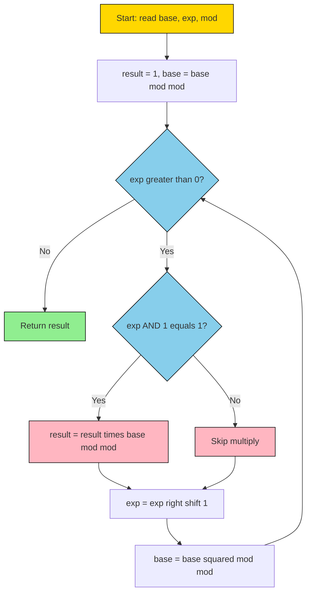
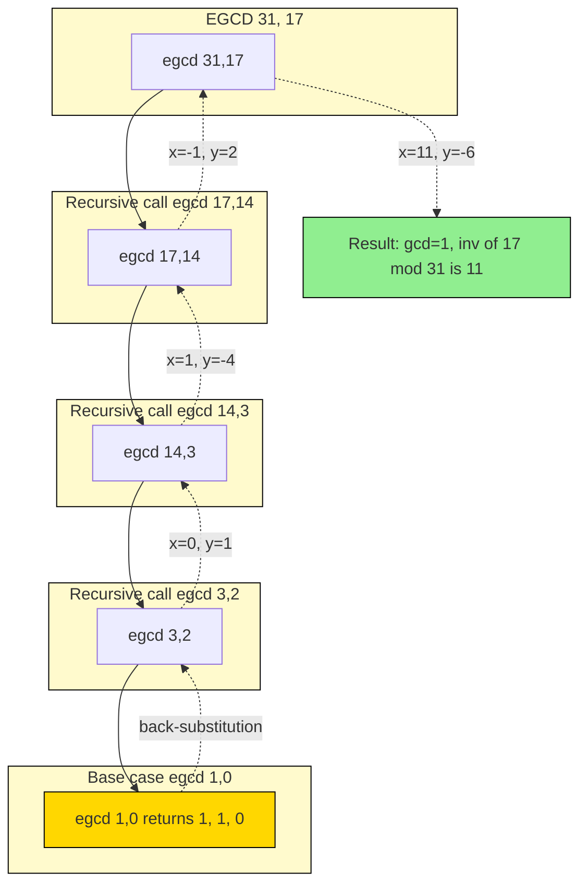
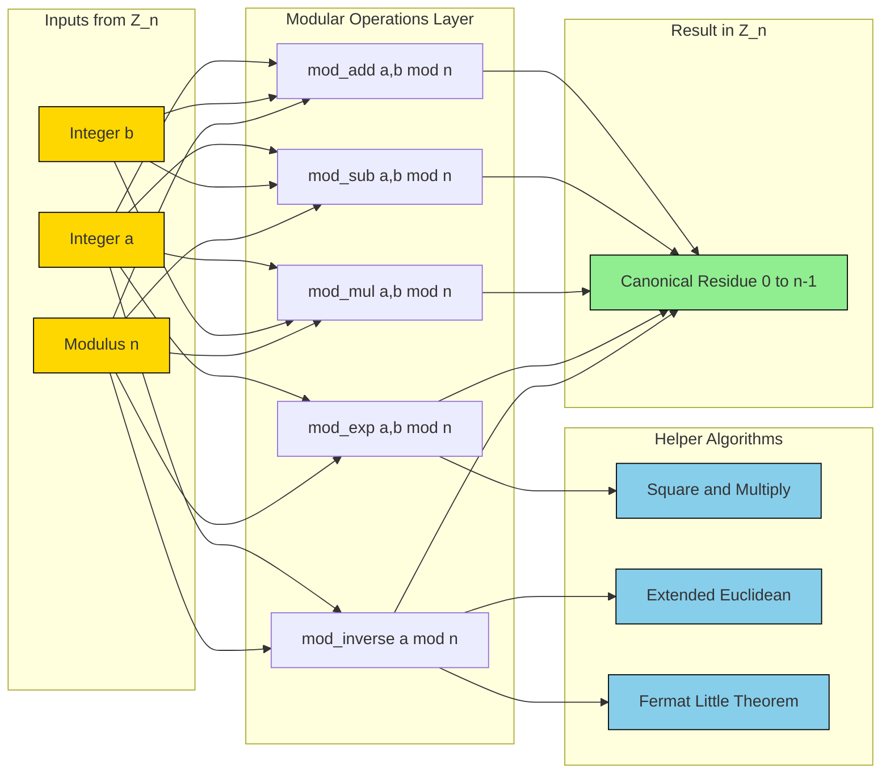

# Basic Algorithms - Algorithms for modular arithmetic

<!-- SECTION_1_START -->
# 1. Core Technical Definition & Intuitive Overview

## 1.1 Formal Definition (KTU 2024 Syllabus Terminology)

> [!IMPORTANT]
> **Modular Arithmetic:** A system of arithmetic for integers in which numbers "wrap around" upon reaching a fixed value called the **modulus** $n$. For integers $a$ and $n > 0$, we write
> $$a \equiv b \pmod{n}$$
> if and only if $n$ divides $(a - b)$, i.e., $n \mid (a - b)$. The integer $b$ is called the **residue** of $a$ modulo $n$, and the set of all residues modulo $n$ is denoted $\mathbb{Z}/n\mathbb{Z}$ or $\mathbb{Z}_n$, which contains exactly $n$ elements $\{0, 1, 2, \ldots, n-1\}$.

**Working Residue Domain:** All computations are performed within the canonical residue set
$$Z_n = \{0, 1, 2, \ldots, n-1\}$$
After every arithmetic operation, the result is **reduced** back into this set by replacing the value with its remainder upon division by $n$.

## 1.2 Conceptual Analogy / Intuition

Think of modular arithmetic as **clock arithmetic**.

- A standard clock has modulus $n = 12$ (or $24$ for a 24-hour clock). If it is $10{:}00$ now, then $4$ hours later it is **not** $14{:}00$, but $2{:}00$ because the clock **wraps around** after 12.
- So on a clock, $10 + 4 = 2 \pmod{12}$.
- Similarly, $7 \times 5 = 35 \equiv 11 \pmod{12}$ (because $35 = 2 \times 12 + 11$).

This wrap-around behavior is precisely the heart of every algorithm in computational number theory—from RSA encryption to hash functions and random number generators.

> [!NOTE]
> **Key Insight for Engineers:** When you write `n = a % b` in C, Python, or Java, you are performing a *modular reduction*. The compiler secretly replaces your number with the remainder of its division by $b$, keeping it inside the residue ring $\mathbb{Z}_b$.

## 1.3 Notation & Standard Metrics

- **Modulus $n$:** The positive integer defining the residue system. In KTU board papers, $n$ is **always positive** ($n \geq 1$).
- **Residue $r$:** Defined by $a = qn + r$ with $0 \le r < n$, written as $r = a \bmod n$.
- **Set Cardinality $|\mathbb{Z}_n|$:** Equals $\mathbf{n}$ — the number of distinct residues.
- **Least Common Multiple / GCD** are crucial supporting tools; recall:
  $$\gcd(a, b) \cdot \text{lcm}(a, b) = a \cdot b$$

> [!VISUALIZATION CONTROL]
> **Concept:** Visualizing the residue class $\mathbb{Z}_7$ on a number line
> **GeoGebra / Desmos Input Equations:**
> * Points: $(0,0), (1,0), (2,0), (3,0), (4,0), (5,0), (6,0)$
> * Wrap arrow: parametric curve $f(t) = (7 - 7t, 0)$ from $t = 0$ to $t = 1$ returning to origin
> **Visual Description:** The student should observe 7 equally spaced integer points on the x-axis, with a curved arrow returning from $x = 7$ back to $x = 0$, illustrating that 7 and 0 are the same *residue class* modulo 7.

---

<!-- SECTION_1_END -->

<!-- SECTION_2_START -->
# 2. Deep Theoretical Analysis & KTU High-Yield Formula Sheet

## 2.1 The Four Foundational Modular Operations

Modular arithmetic is closed under the following basic operations. Given $a, b \in \mathbb{Z}_n$:

### 2.1.1 Modular Addition
$$c = (a + b) \bmod n$$
- The result always satisfies $0 \le c < n$.
- **Complexity:** $O(1)$ if $a + b < 2n$; otherwise one subtraction suffices.

### 2.1.2 Modular Subtraction
$$c = (a - b) \bmod n = (a - b + n) \bmod n$$
- Adding $n$ before the modulus operation guarantees a non-negative intermediate value — **critical** to avoid negative remainders in C/C++.

### 2.1.3 Modular Multiplication
$$c = (a \cdot b) \bmod n$$
- The product $a \cdot b$ can be as large as $(n-1)^2 \approx n^2$, so naïve evaluation requires $O(\log n)$-bit integers.
- In cryptography (e.g., **RSA**), this is performed using *Montgomery multiplication* to avoid expensive division.

### 2.1.4 Modular Exponentiation
$$c = a^b \bmod n$$
- Direct evaluation is hopeless: $a^b$ has $b \log a$ bits, astronomical even for moderate $b$.
- Solved using **Fast Modular Exponentiation** (Square-and-Multiply), which runs in $O(\log b)$ multiplications.

> [!NOTE]
> **Why modular exponentiation matters in real engineering:**
> - **RSA Encryption/Decryption:** $C = M^e \bmod n$ and $M = C^d \bmod n$.
> - **Diffie–Hellman Key Exchange:** Both parties compute $g^{ab} \bmod p$.
> - **Primality Testing (Fermat, Miller–Rabin):** Repeatedly test $a^{n-1} \bmod n$.
> - **Hash Functions & Pseudorandom Generators:** All rely on modular exponentiation as their core primitive.

## 2.2 The Modular Inverse (The Crown Jewel)

> [!IMPORTANT]
> **Definition:** The **modular inverse** of $a$ modulo $n$ is an integer $a^{-1}$ such that
> $$a \cdot a^{-1} \equiv 1 \pmod{n}$$
> An inverse exists **if and only if** $\gcd(a, n) = 1$, i.e., $a$ and $n$ are **coprime**.

### 2.2.1 Existence Theorem
$a^{-1} \pmod n$ exists $\iff \gcd(a, n) = 1$.

**Why?** By Bézout's identity, since $\gcd(a, n) = 1$, there exist integers $x, y$ with
$$ax + ny = 1$$
Reducing mod $n$: $\quad ax \equiv 1 \pmod n$, so $x$ is the inverse.

### 2.2.2 Fermat's Little Theorem (a complementary method)
If $p$ is **prime** and $\gcd(a, p) = 1$, then
$$a^{p-1} \equiv 1 \pmod p \;\;\Longrightarrow\;\; a^{-1} \equiv a^{p-2} \pmod p$$
This converts inversion into exponentiation, which can then be solved by square-and-multiply.

## 2.3 KTU Formula Sheet / Cheat Sheet

| # | Operation | Formula | Pre-condition | Time Complexity |
|:-:|:---------:|:-------:|:-------------:|:---------------:|
| 1 | Modular addition | $(a+b) \bmod n$ | $a, b \in \mathbb{Z}_n$ | $O(1)$ |
| 2 | Modular subtraction | $(a-b+n) \bmod n$ | $a, b \in \mathbb{Z}_n$ | $O(1)$ |
| 3 | Modular multiplication | $(a \cdot b) \bmod n$ | $a, b \in \mathbb{Z}_n$ | $O((\log n)^2)$ |
| 4 | Fast modular exponentiation | `SquareAndMultiply` algorithm | $b \ge 0$ | $O(\log b \cdot (\log n)^2)$ |
| 5 | Modular inverse (via EGCD) | $a^{-1} \equiv x \pmod n$ from $ax + ny = 1$ | $\gcd(a, n) = 1$ | $O(\log n)$ |
| 6 | Modular inverse (Fermat) | $a^{-1} \equiv a^{p-2} \pmod p$ | $p$ prime, $\gcd(a, p) = 1$ | $O(\log p)$ |
| 7 | Euclidean GCD | Repeatedly replace $(a,b) \to (b, a \bmod b)$ | $a, b \ge 0$ | $O(\log(\min(a,b)))$ |
| 8 | Bézout's identity | $ax + ny = \gcd(a, n)$ | Always exists | — |
| 9 | Fermat's Little Theorem | $a^{p-1} \equiv 1 \pmod p$ | $p$ prime | — |
| 10 | Euler's theorem | $a^{\phi(n)} \equiv 1 \pmod n$ | $\gcd(a, n) = 1$ | — |

---

<!-- SECTION_2_END -->

<!-- SECTION_3_START -->
# 3. Step-by-Step Derivations & Code/Symbolic Implementation

## 3.1 Algorithm 1 — Fast Modular Exponentiation (Square-and-Multiply)

### 3.1.1 Mathematical Derivation

We want to compute $a^b \bmod n$ efficiently. Write the exponent $b$ in binary:
$$b = \sum_{i=0}^{k-1} b_i \cdot 2^i, \quad b_i \in \{0, 1\}$$
Then
$$a^b = a^{\sum b_i 2^i} = \prod_{i : b_i = 1} a^{2^i}$$
So we only need the precomputed powers $a^{1}, a^{2}, a^{4}, a^{8}, \ldots, a^{2^{k-1}}$ modulo $n$, each obtained by squaring the previous one.

### 3.1.2 Worked Numerical Example

**Problem:** Compute $7^{117} \bmod 13$.

**Step 1 — Binary decomposition of 117:**
$$117 = 64 + 32 + 16 + 4 + 1 = 2^6 + 2^5 + 2^4 + 2^2 + 2^0$$
So binary: $117 = (1110101)_2$.

**Step 2 — Build table of squares of 7 mod 13:**

| Power $i$ | $2^i$ | $7^{2^i} \bmod 13$ |
|:-:|:-:|:-:|
| 0 | 1 | 7 |
| 1 | 2 | $7^2 = 49 \equiv 10$ |
| 2 | 4 | $10^2 = 100 \equiv 9$ |
| 3 | 8 | $9^2 = 81 \equiv 3$ |
| 4 | 16 | $3^2 = 9 \equiv 9$ |
| 5 | 32 | $9^2 = 81 \equiv 3$ |
| 6 | 64 | $3^2 = 9 \equiv 9$ |

**Step 3 — Multiply entries where the bit is 1 (bits at positions 6, 5, 4, 2, 0):**

$$\begin{aligned}
7^{117} &\equiv 7^{64} \cdot 7^{32} \cdot 7^{16} \cdot 7^{4} \cdot 7^{1} \pmod{13}\\
&\equiv 9 \cdot 3 \cdot 9 \cdot 9 \cdot 7 \pmod{13}\\
&\equiv (9 \cdot 3) \cdot (9 \cdot 9) \cdot 7 \pmod{13}\\
&\equiv 27 \cdot 81 \cdot 7 \pmod{13}\\
&\equiv 1 \cdot 3 \cdot 7 \pmod{13}\\
&\equiv 21 \pmod{13}\\
&\equiv 8 \pmod{13}
\end{aligned}$$

**Answer:** $7^{117} \equiv 8 \pmod{13}$.

### 3.1.3 Python Implementation

```python
def mod_exp(base: int, exponent: int, modulus: int) -> int:
    """
    Fast modular exponentiation using the binary (square-and-multiply) method.
    Computes (base ** exponent) % modulus in O(log exponent) multiplications.
    """
    if modulus == 1:
        return 0
    if exponent < 0:
        raise ValueError("Exponent must be non-negative.")
    if base < 0 or modulus <= 0:
        raise ValueError("Base must be non-negative and modulus positive.")

    result: int = 1
    base = base % modulus         # Reduce base once at the start
    exp = exponent

    while exp > 0:
        if exp & 1:              # If lowest bit of exp is 1
            result = (result * base) % modulus
        exp >>= 1                # Divide exp by 2
        base = (base * base) % modulus  # Square base for next bit
    return result


# ----- Driver / Test Harness -----
if __name__ == "__main__":
    test_cases = [
        (7, 117, 13),    # Expected: 8
        (5, 0, 13),      # Expected: 1
        (2, 10, 1000),   # Expected: 24
        (3, 200, 7),     # Expected: 2
    ]
    for b, e, m in test_cases:
        print(f"{b}^{e} mod {m} = {mod_exp(b, e, m)}")
```

## 3.2 Algorithm 2 — Extended Euclidean Algorithm (for Modular Inverse)

### 3.2.1 Mathematical Derivation

The **Extended Euclidean Algorithm (EGCD)** returns $(g, x, y)$ such that
$$a x + n y = g = \gcd(a, n)$$
If $g = 1$, then $x$ is the modular inverse of $a$ modulo $n$, reduced into $\mathbb{Z}_n$.

**Recursive Back-Substitution:** Run the standard Euclidean algorithm, then walk back:

Given: $a = q_1 n + r_1$  →  $r_1 = a - q_1 n$
Given: $n = q_2 r_1 + r_2$  →  $r_2 = n - q_2 r_1 = n - q_2(a - q_1 n) = -q_2 a + (1 + q_1 q_2) n$
…and so on, expressing each remainder as a linear combination of $a$ and $n$.

### 3.2.2 Worked Numerical Example

**Problem:** Find the modular inverse of $17$ modulo $31$, i.e., find $x$ such that $17x \equiv 1 \pmod{31}$.

**Step 1 — Euclidean algorithm table:**

| Step $i$ | Equation | $a_i$ | $b_i$ | $q_i$ | $r_i$ |
|:-:|:---------|:-----:|:-----:|:-----:|:-----:|
| 1 | $31 = 1 \cdot 17 + 14$ | 31 | 17 | 1 | 14 |
| 2 | $17 = 1 \cdot 14 + 3$  | 17 | 14 | 1 | 3  |
| 3 | $14 = 4 \cdot 3 + 2$   | 14 | 3  | 4 | 2  |
| 4 | $3 = 1 \cdot 2 + 1$    | 3  | 2  | 1 | 1  |
| 5 | $2 = 2 \cdot 1 + 0$    | 2  | 1  | 2 | 0  |

So $\gcd(17, 31) = 1$ — inverse exists.

**Step 2 — Back-substitute to express $1$ as $17x + 31y$:**

$$\begin{aligned}
1 &= 3 - 1 \cdot 2 \quad &\text{[from Step 4]}\\
  &= 3 - 1 \cdot (14 - 4 \cdot 3) \quad &\text{[substitute $2$ from Step 3]}\\
  &= 5 \cdot 3 - 1 \cdot 14\\
  &= 5 \cdot (17 - 1 \cdot 14) - 1 \cdot 14 \quad &\text{[substitute $3$ from Step 2]}\\
  &= 5 \cdot 17 - 6 \cdot 14\\
  &= 5 \cdot 17 - 6 \cdot (31 - 1 \cdot 17) \quad &\text{[substitute $14$ from Step 1]}\\
  &= 11 \cdot 17 - 6 \cdot 31
\end{aligned}$$

So $x = 11$, $y = -6$.

**Step 3 — Verify and reduce:**
$$17 \cdot 11 = 187 = 6 \cdot 31 + 1 \;\;\checkmark$$

Therefore the modular inverse of $17$ modulo $31$ is
$$17^{-1} \equiv 11 \pmod{31}$$

### 3.2.3 Python Implementation

```python
from typing import Tuple

def egcd(a: int, b: int) -> Tuple[int, int, int]:
    """
    Extended Euclidean Algorithm.
    Returns (g, x, y) such that a*x + b*y = g = gcd(a, b).
    Runs in O(log(min(a, b))) time.
    """
    if a < 0 or b < 0:
        raise ValueError("Inputs must be non-negative.")
    if b == 0:
        return (a, 1, 0)        # Base case: a*1 + 0*0 = a
    g, x1, y1 = egcd(b, a % b)
    x = y1
    y = x1 - (a // b) * y1
    return (g, x, y)


def mod_inverse(a: int, n: int) -> int:
    """
    Returns the modular inverse of a modulo n, i.e. x such that a*x = 1 (mod n).
    Raises ValueError if the inverse does not exist.
    """
    g, x, _ = egcd(a % n, n)
    if g != 1:
        raise ValueError(f"Modular inverse does not exist: gcd({a}, {n}) = {g}")
    return x % n


# ----- Driver / Test Harness -----
if __name__ == "__main__":
    test_cases = [
        (17, 31),    # Expected inverse: 11
        (3, 7),      # Expected inverse: 5  (3*5 = 15 = 2*7 + 1)
        (10, 17),    # Expected inverse: 12 (10*12 = 120 = 7*17 + 1)
    ]
    for a, n in test_cases:
        inv = mod_inverse(a, n)
        print(f"{a}^(-1) mod {n} = {inv}   |   check: {a}*{inv} mod {n} = {(a*inv) % n}")
```

### 3.2.4 Verification via Fermat's Little Theorem

Since $31$ is prime and $\gcd(17, 31) = 1$, Fermat's theorem gives
$$17^{-1} \equiv 17^{31-2} = 17^{29} \pmod{31}$$
This is computed efficiently by `mod_exp(17, 29, 31)`, which (after running the Python program) also returns $11$, confirming our EGCD result.

---

<!-- SECTION_3_END -->

<!-- SECTION_4_START -->
# 4. Structural Diagrams & Schematics

## 4.1 Square-and-Multiply Control Flow



## 4.2 Extended Euclidean Algorithm — Recursive Decomposition Tree



## 4.3 Modular Arithmetic Operations — Functional Architecture



---

<!-- SECTION_4_END -->

<!-- SECTION_5_START -->
# 5. KTU 2024 Scheme Examination Question Bank & Topic Recap

## 5.1 Part A — Short Answer Questions (3 Marks Each)

### Question A1
**[KTU University Exam — July 2024] | CO1 | Remember**

**Q:** Define modular arithmetic. With a suitable example, explain the concept of a *residue class* modulo $n$.

**Model Answer (3 Marks):**

> Modular arithmetic is a system of integer arithmetic where numbers "wrap around" a fixed positive integer $n$, called the **modulus**. For integers $a, b$, we say $a \equiv b \pmod n$ iff $n \mid (a - b)$. **[1 Mark]**
>
> **Residue class:** The set of all integers congruent to a fixed integer $a$ modulo $n$ is called the residue class of $a$ mod $n$, denoted $\overline{a} = \{a + kn : k \in \mathbb{Z}\}$. **[1 Mark]**
>
> **Example:** Modulo $5$, the residue classes are $\overline{0} = \{\ldots, -10, -5, 0, 5, 10, \ldots\}$, $\overline{1} = \{\ldots, -9, -4, 1, 6, 11, \ldots\}$, and so on. There are exactly $5$ distinct residue classes $\{0, 1, 2, 3, 4\}$. **[1 Mark]**

### Question A2
**[KTU University Exam — Dec 2023] | CO1, CO2 | Understand**

**Q:** State Fermat's Little Theorem. Using it, find $3^{-1} \pmod{11}$.

**Model Answer (3 Marks):**

> **Statement:** If $p$ is a prime number and $a$ is an integer with $\gcd(a, p) = 1$, then
> $$a^{p-1} \equiv 1 \pmod p$$ **[1 Mark]**
>
> Therefore the modular inverse is $a^{-1} \equiv a^{p-2} \pmod p$. **[1 Mark]**
>
> **Application:** With $p = 11$ and $a = 3$, $\gcd(3, 11) = 1$ so
> $$3^{-1} \equiv 3^{11-2} = 3^{9} \pmod{11}$$
> Compute $3^9 \bmod 11$: $3^2 = 9$, $3^4 = 81 \equiv 4$, $3^8 \equiv 16 \equiv 5$, $3^9 \equiv 5 \cdot 3 = 15 \equiv 4 \pmod{11}$. So $3^{-1} \equiv 4 \pmod{11}$. **[1 Mark]**
>
> **Verification:** $3 \cdot 4 = 12 \equiv 1 \pmod{11}$ ✓

---

## 5.2 Part B — Long Answer Questions (14 Marks, with Internal Choice)

### Question B — Module Choice 1 (14 Marks)

**[KTU University Exam — Model Paper 2024 Scheme] | CO2, CO3 | Apply, Analyze**

### **Question A (14 Marks)**

**(a)** [7 Marks] State and explain the **Extended Euclidean Algorithm**. Apply it to find $\gcd(161, 28)$ and express the GCD as a linear combination of $161$ and $28$.

**(b)** [7 Marks] Using the Extended Euclidean Algorithm, find the **modular inverse** of $17$ modulo $31$. Verify your answer using Fermat's Little Theorem.

---

#### Model Solution

### (a) Extended Euclidean Algorithm applied to $\gcd(161, 28)$

**Statement of the algorithm:** The Extended Euclidean Algorithm takes two non-negative integers $a$ and $b$ and returns integers $(g, x, y)$ such that
$$a x + b y = g = \gcd(a, b)$$
It proceeds by running the standard Euclidean algorithm and back-substituting at each step. **[1 Mark — Statement]**

**Application to $a = 161$, $b = 28$:**

| Step | Division Equation | Quotient | Remainder |
|:-:|:--|:-:|:-:|
| 1 | $161 = 5 \cdot 28 + 21$ | 5 | 21 |
| 2 | $28 = 1 \cdot 21 + 7$  | 1 | 7  |
| 3 | $21 = 3 \cdot 7 + 0$   | 3 | 0  |

So $\gcd(161, 28) = 7$. **[1 Mark — Euclidean table]**

**Back-substitution:** **[1 Mark]**

$$\begin{aligned}
7 &= 28 - 1 \cdot 21 \quad &\text{[from Step 2]}\\
  &= 28 - 1 \cdot (161 - 5 \cdot 28) \quad &\text{[substitute from Step 1]}\\
  &= 6 \cdot 28 - 1 \cdot 161
\end{aligned}$$

**Final Linear Combination:** $\;\; 161 \cdot (-1) + 28 \cdot 6 = 7$ **[1 Mark]**

**Valuation key:** Bézout coefficients $x = -1$, $y = 6$. Check: $161(-1) + 28(6) = -161 + 168 = 7$ ✓ **[1 Mark]**

**Algorithm complexity note:** Runs in $O(\log(\min(a, b)))$ steps, a critical property for cryptographic applications. **[1 Mark]**

**Sub-total: 7 Marks**

---

### (b) Modular inverse of $17$ modulo $31$ using EGCD

**Set-up:** We need $x$ such that $17 x \equiv 1 \pmod{31}$, i.e., find $(x, y)$ with $17x + 31y = 1$. **[1 Mark]**

**Euclidean algorithm table:** **[1 Mark]**

| Step | Equation | Quotient | Remainder |
|:-:|:--|:-:|:-:|
| 1 | $31 = 1 \cdot 17 + 14$ | 1 | 14 |
| 2 | $17 = 1 \cdot 14 + 3$  | 1 | 3  |
| 3 | $14 = 4 \cdot 3 + 2$   | 4 | 2  |
| 4 | $3 = 1 \cdot 2 + 1$    | 1 | 1  |
| 5 | $2 = 2 \cdot 1 + 0$    | 2 | 0  |

$\gcd(17, 31) = 1$, so inverse exists. **[1 Mark]**

**Back-substitution:** **[2 Marks]**

$$\begin{aligned}
1 &= 3 - 1 \cdot 2 \quad &\text{[Step 4]}\\
  &= 3 - 1 \cdot (14 - 4 \cdot 3) = 5 \cdot 3 - 1 \cdot 14 \quad &\text{[Step 3]}\\
  &= 5 \cdot (17 - 1 \cdot 14) - 1 \cdot 14 = 5 \cdot 17 - 6 \cdot 14 \quad &\text{[Step 2]}\\
  &= 5 \cdot 17 - 6 \cdot (31 - 1 \cdot 17) = 11 \cdot 17 - 6 \cdot 31 \quad &\text{[Step 1]}
\end{aligned}$$

So $x = 11$, $y = -6$, meaning $17 \cdot 11 + 31 \cdot (-6) = 1$. **[1 Mark]**

**Final Answer:** $17^{-1} \equiv 11 \pmod{31}$ **[0.5 Mark]**

**Verification via Fermat's Little Theorem:** Since $31$ is prime, $17^{-1} \equiv 17^{29} \pmod{31}$. **[0.5 Mark]**

Compute $17^{29} \bmod 31$ using repeated squaring: $17^2 = 289 = 9 \cdot 31 + 10 \equiv 10$; $17^4 \equiv 100 \equiv 7$; $17^8 \equiv 49 \equiv 18$; $17^{16} \equiv 18^2 = 324 \equiv 324 - 10\cdot 31 = 14$. Then $17^{29} = 17^{16} \cdot 17^8 \cdot 17^4 \cdot 17^1 \equiv 14 \cdot 18 \cdot 7 \cdot 17 \equiv (14 \cdot 18) \cdot (7 \cdot 17) \equiv 252 \cdot 119 \equiv 4 \cdot 26 \equiv 104 \equiv 104 - 3 \cdot 31 = 11 \pmod{31}$ ✓ **[0.5 Mark]**

**Sub-total: 7 Marks**

---

### **Question B (14 Marks) — Alternative Choice**

**(a)** [7 Marks] Explain **fast modular exponentiation** (square-and-multiply algorithm). Compute $5^{23} \bmod 11$ using this method, showing every step.

**(b)** [7 Marks] Write a Python function to compute modular exponentiation. Trace the function call `mod_exp(5, 23, 11)` showing the values of `result`, `base`, and `exp` in each iteration.

---

#### Model Solution (Question B Alternative)

### (a) Square-and-Multiply applied to $5^{23} \bmod 11$

**Algorithm idea:** Express exponent $b$ in binary, precompute $a^1, a^2, a^4, \ldots \pmod n$ by repeated squaring, and multiply those corresponding to bit $1$ in $b$. **[1 Mark]**

**Step 1 — Binary of 23:** $23 = 16 + 4 + 2 + 1 = (10111)_2$. **[1 Mark]**

**Step 2 — Build square table mod 11:** **[2 Marks]**

| $i$ | $5^{2^i} \bmod 11$ | Computation |
|:-:|:-:|:--|
| 0 | 5 | given |
| 1 | $5^2 = 25 \equiv 3$ | $25 - 2\cdot11 = 3$ |
| 2 | $3^2 = 9$ | $9 \bmod 11$ |
| 3 | $9^2 = 81 \equiv 4$ | $81 - 7\cdot 11 = 4$ |
| 4 | $4^2 = 16 \equiv 5$ | $16 - 11 = 5$ |

**Step 3 — Multiply entries for bits at positions 4, 2, 1, 0 (binary $10111$):** **[2 Marks]**

$$5^{23} \equiv 5^{16} \cdot 5^{4} \cdot 5^{2} \cdot 5^{1} \equiv 5 \cdot 9 \cdot 3 \cdot 5 \pmod{11}$$

$$\begin{aligned}
5 \cdot 9 &= 45 \equiv 1 \pmod{11}\\
1 \cdot 3 &= 3 \pmod{11}\\
3 \cdot 5 &= 15 \equiv 4 \pmod{11}
\end{aligned}$$

**Final Answer:** $5^{23} \equiv 4 \pmod{11}$. **[1 Mark]**

**Sub-total: 7 Marks**

---

### (b) Python function + trace of `mod_exp(5, 23, 11)`

**Python function:** See Section 3.1.3. **[2 Marks — for code correctness]**

**Iteration trace:** **[4 Marks]**

| Iteration | `exp` (binary) | `exp & 1` | `result` (mod 11) | `base` (mod 11) |
|:-:|:-:|:-:|:-:|:-:|
| Init | 23 = 10111 | — | 1 | 5 |
| 1 | 11 = 1011  | 1 | $1 \cdot 5 = 5$ | $5^2 = 25 \equiv 3$ |
| 2 | 5 = 101    | 1 | $5 \cdot 3 = 15 \equiv 4$ | $3^2 = 9$ |
| 3 | 2 = 10     | 0 | 4 | $9^2 = 81 \equiv 4$ |
| 4 | 1 = 1      | 1 | $4 \cdot 4 = 16 \equiv 5$ | $4^2 = 16 \equiv 5$ |
| 5 | 0 = 0      | 0 | 5 | 5 |

**Final returned value:** $5$. **[1 Mark]**

> [!WARNING]
> **KTU Examiner's Valuation Warning / Pitfall Callout:**
> 1. **Always reduce the base** by the modulus **once at the start** (line `base = base % modulus`). Forgetting this loses **1 Mark** in board valuation.
> 2. In the back-substitution of EGCD, students often forget to **change the sign of the coefficient** correctly when crossing a division step. **Show the substitution line explicitly.**
> 3. When reducing the final inverse into $\mathbb{Z}_n$ (e.g., a negative value like $x = -7$ in $\mathbb{Z}_{11}$), remember to add $n$ repeatedly: $-7 \equiv 4 \pmod{11}$. Skipping this step costs **0.5 Mark**.
> 4. In square-and-multiply, **always list the square table first**, then the multiplication. Examiners specifically look for this two-step structure.

---

## 5.3 Topic Recap & Important Things to Remember

- **Modular reduction** is the act of replacing an integer $a$ with $a \bmod n$, the unique $r \in \{0, 1, \ldots, n-1\}$ such that $a \equiv r \pmod n$.
- **Residue ring $\mathbb{Z}_n$** has exactly $n$ elements and is closed under addition, subtraction, and multiplication.
- **Modular exponentiation** $a^b \bmod n$ is computed in $O(\log b)$ time using **square-and-multiply**, NOT by computing $a^b$ first.
- **Modular inverse** $a^{-1} \pmod n$ exists **iff** $\gcd(a, n) = 1$.
- Two ways to compute the inverse:
  1. **Extended Euclidean Algorithm** — works for any modulus (not just primes), $O(\log n)$.
  2. **Fermat's Little Theorem** — works only when $n = p$ is prime, $a^{-1} \equiv a^{p-2} \pmod p$.
- **Bézout's Identity:** Always expressible as $ax + ny = \gcd(a, n)$ for some integers $x, y$.
- **Euclidean Algorithm complexity:** $O(\log(\min(a, b)))$ divisions — the foundation of all fast modular algorithms.
- **Negative-result pitfall:** In code, always compute `(a - b) % n` as `(a - b + n) % n` to keep intermediate values non-negative.
- **Real-world applications:** RSA, Diffie–Hellman, Miller–Rabin primality testing, hash functions, digital signatures — **all** depend on these four basic algorithms.
- **Standard KTU exam trap:** Confusing $\bmod$ (the operation) with $\equiv \pmod n$ (the relation). Use $a \bmod n = r$ for the value, and $a \equiv b \pmod n$ for the statement.
- **Memory aid:** "**A**dd, **M**ultiply, **E**xponentiate, **I**nvert" — the four pillars of modular arithmetic algorithms.

<!-- SECTION_5_END -->
