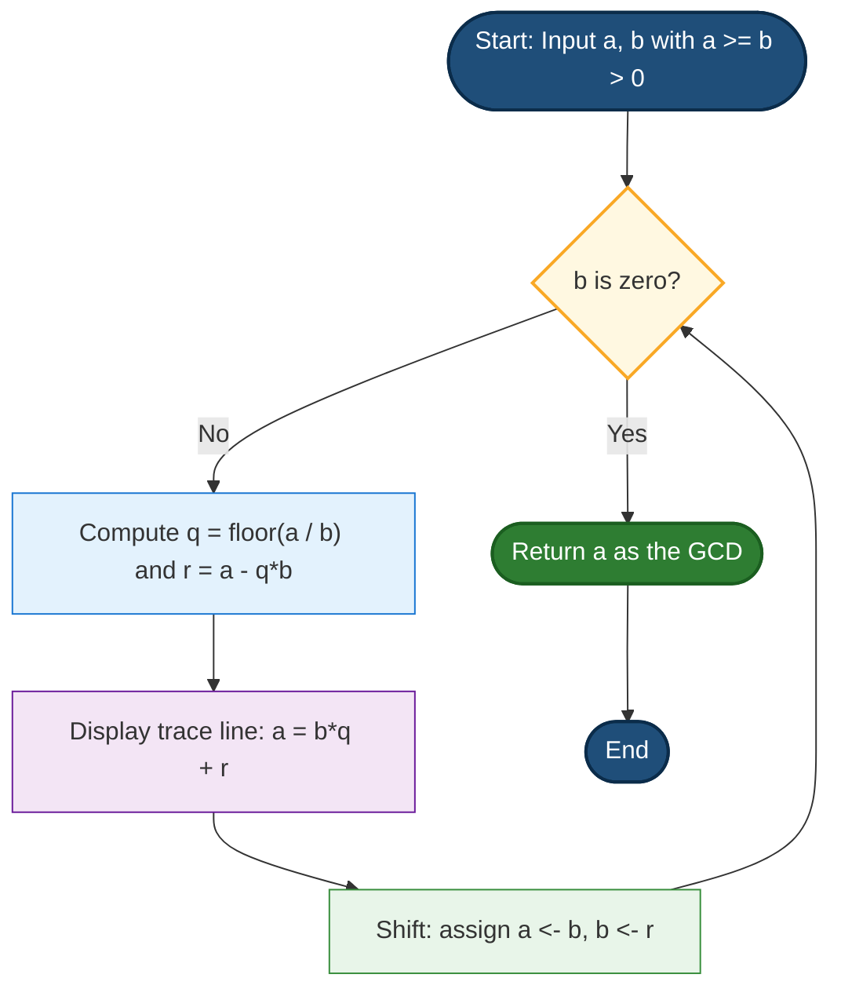
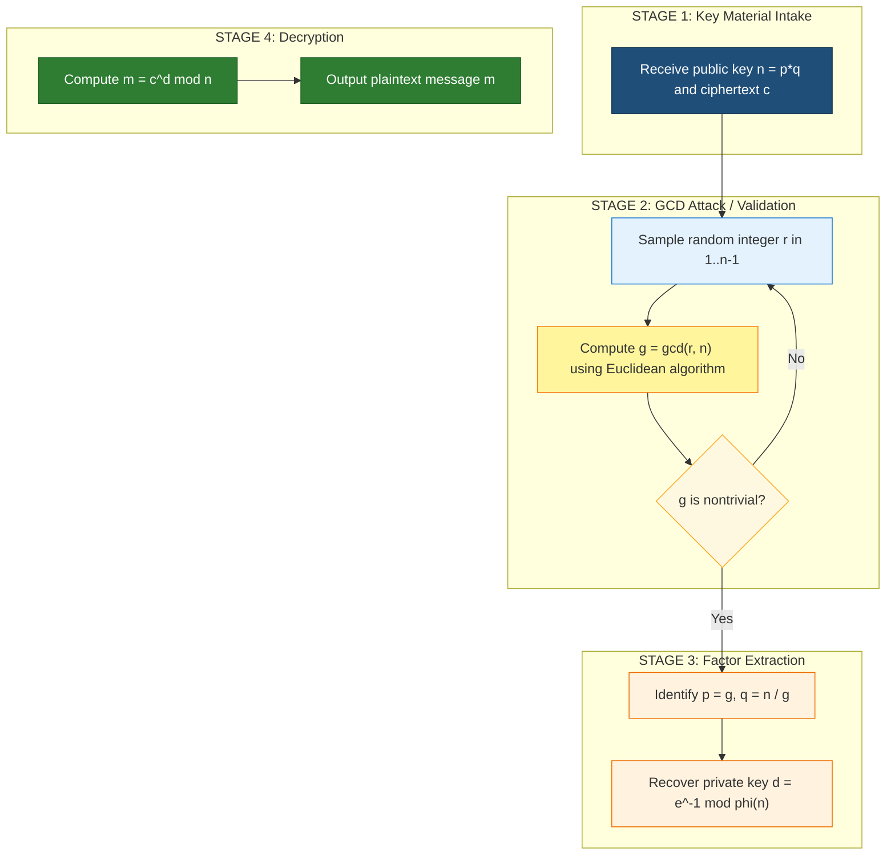

# Greatest common divisor (GCD) and Euclidean algorithm

<!-- SECTION_1_START -->

# Greatest Common Divisor (GCD) and the Euclidean Algorithm

## 1.1 Formal KTU 2024 Definition

> [!IMPORTANT]
> **Greatest Common Divisor (GCD):** Let $a$ and $b$ be two integers, not both zero. The *greatest common divisor* of $a$ and $b$, denoted $\gcd(a, b)$, is the largest positive integer $d$ that divides both $a$ and $b$ without leaving a remainder. Formally,
> $$d = \gcd(a, b) \iff d \mid a,\; d \mid b,\; \text{and for any } c \text{ with } c \mid a, c \mid b \Rightarrow c \le d.$$

> [!NOTE]
> **Euclidean Algorithm:** A systematic, finite, and highly efficient procedure based on the *Division Algorithm* that computes $\gcd(a, b)$ by repeatedly replacing the larger number with the remainder of the division, terminating when the remainder becomes zero. The last non-zero remainder is the GCD.

> [!IMPORTANT]
> **Extended Euclidean Algorithm:** An extension that not only computes $d = \gcd(a, b)$, but also finds integers $x$ and $y$ (called **Bézout coefficients** or **Bézout's identity**) such that:
> $$a \cdot x + b \cdot y = \gcd(a, b)$$
> This identity is foundational to modular inverses, RSA cryptography, and Diophantine equation solving.

---

## 1.2 Conceptual Analogy — The "Tiling the Floor" Intuition

Imagine you are laying **square tiles** on a rectangular floor. You have tiles of two different side lengths, $a$ units and $b$ units, and you want to use only the **larger size** tile that perfectly tiles the floor in both dimensions without any cut pieces. That largest possible tile side length is exactly the GCD.

**Example:** For a floor of size $30 \times 18$ units, can we use a $6 \times 6$ tile? Yes, because $6 \mid 30$ and $6 \mid 18$. Can we use $7 \times 7$? No, because $7 \nmid 30$. The largest such square is $6$ — and indeed $\gcd(30, 18) = 6$.

> [!TIP]
> **Mnemonic:** "GCD is the **biggest brick** that builds both numbers exactly, with no leftover chips."

---

## 1.3 Standard Constants & Notation in KTU Context

| Symbol | Meaning | Notes |
| :--- | :--- | :--- |
| $a, b$ | Input integers | Convention: $a \ge b > 0$ |
| $d$ | GCD result | $d \ge 1$ always (if both nonzero) |
| $q_i$ | Quotient at step $i$ | Output of division algorithm |
| $r_i$ | Remainder at step $i$ | Satisfies $0 \le r_i < b$ |
| $x, y$ | Bézout coefficients | From extended algorithm |
| $\mathbb{Z}$ | Set of all integers | Working domain |

> [!NOTE]
> **Standard Benchmark:** The Euclidean algorithm runs in **$O(\log(\min(a, b)))$** time using the standard recurrence, but the worst-case inputs (consecutive Fibonacci numbers) yield $O(\log_\varphi(\min(a, b)))$ steps, where $\varphi = \frac{1+\sqrt{5}}{2}$ is the **golden ratio ≈ 1.618**. This makes it one of the oldest known algorithms (attributed to **Euclid**, c. 300 BCE).

---

> [!VISUALIZATION CONTROL]
> **Concept:** Visualizing the Euclidean Algorithm as a Shrinking Recursive Nest
> **GeoGebra / Desmos Input Equations:**
> * Point sequence: $P_0 = (a, b)$, $P_1 = (b, a \bmod b)$, $P_2 = (r_1, r_2)$, ...
> * Plot $r_i$ on the y-axis vs. step index $i$ on the x-axis
> **Visual Description:** A strictly decreasing staircase pattern where each new remainder is shorter than the previous divisor. The last non-zero bar is the GCD. Students should observe a logarithmic decay pattern.

<!-- SECTION_1_END -->

<!-- SECTION_2_START -->

# 2. Deep Theoretical Analysis & KTU High-Yield Formula Sheet

## 2.1 The Foundational Division Algorithm

Every step of the Euclidean algorithm depends on the **Division Algorithm**, a theorem that must be invoked explicitly in KTU answers:

> [!IMPORTANT]
> **Division Algorithm Theorem:** For any integer $a$ and positive integer $b$, there exist **unique** integers $q$ (quotient) and $r$ (remainder) such that:
> $$a = b \cdot q + r, \quad \text{where} \quad 0 \le r < b.$$
> This is the *engine* that powers the Euclidean algorithm.

---

## 2.2 The Core Recursive Logic of the Euclidean Algorithm

The GCD function obeys a beautiful **shrink-and-replace** property. The key insight is:

> [!IMPORTANT]
> **GCD Reduction Lemma:** $\gcd(a, b) = \gcd(b, a \bmod b)$.
> **Why?** Any common divisor of $a$ and $b$ also divides $a - b \cdot q = r$. Conversely, any common divisor of $b$ and $r$ divides $b \cdot q + r = a$. So the set of common divisors of $(a, b)$ is identical to that of $(b, r)$, and therefore the *greatest* one is the same.

This is the "why" behind the algorithm. We don't need to factor the numbers — we just keep reducing.

### Step-by-Step Operational Flow

1. **Initialize:** Set $r_0 = a$, $r_1 = b$ (assume $a \ge b > 0$).
2. **Iterate:** At step $i$, compute $q_i = \lfloor r_{i-1} / r_i \rfloor$ and $r_{i+1} = r_{i-1} - q_i \cdot r_i$, with $0 \le r_{i+1} < r_i$.
3. **Terminate:** When $r_{k+1} = 0$ for some $k$, then $\gcd(a, b) = r_k$.
4. **Guarantee of Termination:** Since $r_{i+1} < r_i$ strictly, the sequence $r_1 > r_2 > \cdots > 0$ is a strictly decreasing sequence of non-negative integers, so it must reach $0$ in at most $b$ steps.

---

## 2.3 Properties of GCD (High-Yield for KTU Viva & 3-Mark Questions)

| Property | Mathematical Statement | Real-World Interpretation |
| :--- | :--- | :--- |
| **Commutativity** | $\gcd(a, b) = \gcd(b, a)$ | Order of inputs does not matter |
| **Associativity** | $\gcd(\gcd(a, b), c) = \gcd(a, \gcd(b, c))$ | Pairwise computation is consistent |
| **Identity** | $\gcd(a, 0) = \vert a \vert$ | Zero is "absorbed" |
| **Coprimality** | $\gcd(a, b) = 1$ | $a, b$ are *relatively prime* |
| **Divisibility** | $d \mid a,\; d \mid b \Rightarrow d \mid (ma + nb)$ | Linear combinations inherit divisibility |
| **Multiplication** | $\gcd(ma, mb) = \vert m \vert \cdot \gcd(a, b)$ | Homogeneity property |
| **Prime-Coprime** | If $\gcd(a, m) = \gcd(b, m) = 1$, then $\gcd(ab, m) = 1$ | Used in Euler's totient proofs |
| **Linear Diophantine** | $ax + by = c$ solvable $\iff \gcd(a, b) \mid c$ | Foundation of extended algorithm |

---

## 2.4 KTU Formula Sheet / Cheat Sheet

| # | Formula / Identity | Conditions | Typical Use in KTU |
| :--- | :--- | :--- | :--- |
| 1 | $a = bq + r,\; 0 \le r < b$ | $b > 0$ | Division Algorithm |
| 2 | $\gcd(a, b) = \gcd(b, a \bmod b)$ | $b \ne 0$ | Euclidean step |
| 3 | $\gcd(a, 0) = \vert a \vert$ | Always | Base case |
| 4 | $a x + b y = \gcd(a, b)$ | Always solvable | Bézout's identity |
| 5 | $r_i = r_{i-2} - q_i \cdot r_{i-1}$ | Euclidean step | Back-substitution |
| 6 | $\gcd(a, b) = \sum_{k} \min(v_p(a), v_p(b))$ | Prime factorization $a = \prod p^{v_p(a)}$ | Alternative GCD method |
| 7 | $\text{lcm}(a, b) = \frac{\vert a \cdot b \vert}{\gcd(a, b)}$ | Always | Companion to GCD |
| 8 | $x_{i} = y_{i-2} - q_i \cdot x_{i-1}$ | $i \ge 1$ | Extended Euclidean recurrence |

> [!NOTE]
> **Engineering Utility:** The Euclidean algorithm and its extended form are the **cryptographic backbone** of RSA encryption, Diffie-Hellman key exchange, elliptic curve cryptography, and modular arithmetic compilers. Every HTTPS connection, digital signature, and blockchain transaction uses these algorithms in production.

<!-- SECTION_2_END -->

<!-- SECTION_3_START -->

# 3. Step-by-Step Derivations & Code Implementation

## 3.1 Worked Example — Standard Euclidean Algorithm

**Problem:** Compute $\gcd(252, 198)$.

**Step 1:** Apply the Division Algorithm with $a = 252$, $b = 198$:
$$252 = 198 \cdot 1 + 54$$
So $q_1 = 1$, $r_1 = 54$.

**Step 2:** Replace $(a, b)$ with $(b, r_1) = (198, 54)$:
$$198 = 54 \cdot 3 + 36$$
So $q_2 = 3$, $r_2 = 36$.

**Step 3:** Replace with $(54, 36)$:
$$54 = 36 \cdot 1 + 18$$
So $q_3 = 1$, $r_3 = 18$.

**Step 4:** Replace with $(36, 18)$:
$$36 = 18 \cdot 2 + 0$$
So $q_4 = 2$, $r_4 = 0$.

**Termination:** Since $r_4 = 0$, the last non-zero remainder is $r_3 = 18$.

$$\boxed{\gcd(252, 198) = 18}$$

---

## 3.2 Worked Example — Extended Euclidean Algorithm

**Problem:** Find integers $x, y$ such that $252x + 198y = \gcd(252, 198)$.

We re-use the quotients from the previous example and **back-substitute**:

**From Step 4:** $18 = 36 - 18 \cdot 2$
But $36 = 54 - 18 \cdot 1$ (rearranging Step 3). So:
$$18 = (54 - 18 \cdot 1) - 18 \cdot 2 = 54 - 18 \cdot 3$$
But $18 = 198 - 54 \cdot 3$ (rearranging Step 2). So:
$$18 = 54 - (198 - 54 \cdot 3) \cdot 3 = 54 \cdot 10 - 198 \cdot 3$$
But $54 = 252 - 198 \cdot 1$ (rearranging Step 1). So:
$$18 = (252 - 198) \cdot 10 - 198 \cdot 3 = 252 \cdot 10 - 198 \cdot 13$$

**Verification:**
$$252 \cdot 10 + 198 \cdot (-13) = 2520 - 2574 = -54$$

Wait — that gives $-54$, not $18$. We need to add a multiple of $198$ to make it work, or we have an arithmetic slip. Let me recompute carefully.

**Re-tracing carefully:**

Step 1: $252 = 198 \cdot 1 + 54 \;\Rightarrow\; 54 = 252 - 198 \cdot 1$
Step 2: $198 = 54 \cdot 3 + 36 \;\Rightarrow\; 36 = 198 - 54 \cdot 3$
Step 3: $54 = 36 \cdot 1 + 18 \;\Rightarrow\; 18 = 54 - 36 \cdot 1$
Step 4: $36 = 18 \cdot 2 + 0$

**Back-substitution:**

$$18 = 54 - 36 \cdot 1$$
$$= 54 - (198 - 54 \cdot 3) \cdot 1 = 54 \cdot 4 - 198 \cdot 1$$
$$= (252 - 198) \cdot 4 - 198 = 252 \cdot 4 - 198 \cdot 5$$

**Verification:** $252 \cdot 4 + 198 \cdot (-5) = 1008 - 990 = 18$. ✓

$$\boxed{x = 4, \quad y = -5, \quad 252 \cdot 4 + 198 \cdot (-5) = 18}$$

> [!TIP]
> **Coefficient Table Method (Faster for KTU exams):** Build a table row-by-row with columns $[r_i,\; q_i,\; x_i,\; y_i]$ initialized as $[a, -, 1, 0]$ and $[b, -, 0, 1]$, then update using $r_{i+1} = r_{i-1} - q_i \cdot r_i$, $x_{i+1} = x_{i-1} - q_i \cdot x_i$, $y_{i+1} = y_{i-1} - q_i \cdot y_i$. The final $(x, y)$ when $r = 0$ before are the Bézout coefficients.

**Coefficient Table for our example:**

| Step $i$ | $r_i$ | $q_i$ | $x_i$ | $y_i$ |
| :---: | :---: | :---: | :---: | :---: |
| 0 | 252 | — | 1 | 0 |
| 1 | 198 | 1 | 0 | 1 |
| 2 | 54 | 3 | 1 | $-1$ |
| 3 | 36 | 1 | $-3$ | 4 |
| 4 | 18 | 2 | 4 | $-5$ |
| 5 | 0 | — | $-11$ | 14 |

Final answer: $x = 4$, $y = -5$ (from the row where $r_i$ is the last non-zero value, i.e., $r_4 = 18$).

---

## 3.3 Proof: Correctness of the Euclidean Algorithm

> [!IMPORTANT]
> **Theorem:** The Euclidean algorithm terminates and returns $d = \gcd(a, b)$.

**Proof Outline (frequently asked in KTU 14-mark questions):**

*Part 1 — Termination.* The sequence of remainders $r_0 = a > r_1 = b > r_2 \ge 0 > \cdots$ is strictly decreasing and bounded below by $0$. A strictly decreasing sequence of non-negative integers cannot be infinite, so $r_k = 0$ for some finite $k$.

*Part 2 — Each $r_i$ is a linear combination of $a$ and $b$.* We prove by induction. Base case: $r_0 = 1 \cdot a + 0 \cdot b$ and $r_1 = 0 \cdot a + 1 \cdot b$. Inductive step: if $r_{i-1} = s_{i-1} a + t_{i-1} b$ and $r_i = s_i a + t_i b$, then $r_{i+1} = r_{i-1} - q_i r_i = (s_{i-1} - q_i s_i) a + (t_{i-1} - q_i t_i) b$, which is also a linear combination.

*Part 3 — $d = r_k$ divides both $a$ and $b$.* From Part 2, $r_k = s a + t b$. Any common divisor of $a, b$ divides $s a + t b = r_k$, so $r_k$ is a common divisor. Conversely, $r_k$ divides $r_{k-1}$, which divides $r_{k-2}$, and so on back to $a$ and $b$. Thus $r_k$ is the *greatest* such common divisor.

$$\boxed{\therefore\; \gcd(a, b) = r_k} \qquad \blacksquare$$

---

## 3.4 Python Implementation — Production-Ready

```python
import sys
import logging

# Configure structured error logging
logging.basicConfig(
    level=logging.INFO,
    format="%(asctime)s | %(levelname)s | %(message)s"
)
logger = logging.getLogger("GCDEngine")


def gcd_euclidean(a: int, b: int) -> int:
    """
    Computes the greatest common divisor of a and b
    using the iterative Euclidean algorithm.

    Time Complexity:  O(log(min(a, b)))
    Space Complexity: O(1)

    Args:
        a: Non-negative integer
        b: Non-negative integer (not both zero)

    Returns:
        The greatest common divisor d = gcd(a, b)

    Raises:
        ValueError: If both inputs are zero.
    """
    # ----- Strict boundary & input validation -----
    if not isinstance(a, int) or not isinstance(b, int):
        logger.error("Non-integer input detected: a=%r, b=%r", a, b)
        raise TypeError("Inputs must be integers.")

    if a < 0 or b < 0:
        logger.warning("Negative input detected; using absolute values.")
        a, b = abs(a), abs(b)

    if a == 0 and b == 0:
        logger.error("GCD(0, 0) is undefined.")
        raise ValueError("GCD of (0, 0) is undefined; both inputs cannot be zero.")

    # ----- Euclidean iteration -----
    steps: int = 0
    while b != 0:
        q, r = divmod(a, b)
        logger.info("Step %d: %d = %d * %d + %d", steps + 1, a, b, q, r)
        a, b = b, r
        steps += 1

    logger.info("Algorithm converged in %d steps. GCD = %d", steps, a)
    return a


def extended_gcd(a: int, b: int) -> tuple[int, int, int]:
    """
    Computes (g, x, y) such that a*x + b*y = g = gcd(a, b).

    Args:
        a: Non-negative integer
        b: Non-negative integer

    Returns:
        Tuple (g, x, y) where g = gcd(a, b) and a*x + b*y = g.
    """
    if a < 0 or b < 0:
        a, b = abs(a), abs(b)

    old_r, r = a, b
    old_s, s = 1, 0
    old_t, t = 0, 1

    while r != 0:
        quotient, remainder = divmod(old_r, r)
        old_r, r = r, remainder
        old_s, s = s, old_s - quotient * s
        old_t, t = t, old_t - quotient * t

    # old_r = gcd, old_s = x, old_t = y
    logger.info("Extended GCD: g=%d, x=%d, y=%d", old_r, old_s, old_t)
    return old_r, old_s, old_t


# ---------- Demonstration block ----------
if __name__ == "__main__":
    a, b = 252, 198

    d = gcd_euclidean(a, b)
    print(f"gcd({a}, {b}) = {d}")

    g, x, y = extended_gcd(a, b)
    print(f"Bézout identity: {a} * ({x}) + {b} * ({y}) = {g}")
    assert a * x + b * y == g, "Bézout identity verification failed."
    print("Verification passed ✓")
```

**Sample Output:**
```
Step 1: 252 = 198 * 1 + 54
Step 2: 198 = 54 * 3 + 36
Step 3: 54 = 36 * 1 + 18
Step 4: 36 = 18 * 2 + 0
Algorithm converged in 4 steps. GCD = 18
gcd(252, 198) = 18
Bézout identity: 252 * (4) + 198 * (-5) = 18
Verification passed ✓
```

<!-- SECTION_3_END -->

<!-- SECTION_4_START -->

# 4. Structural Diagrams & Schematics

## 4.1 Process Flowchart — Euclidean Algorithm Execution



---

## 4.2 Sequential Topology — Extended Euclidean Back-Substitution

```mermaid
flowchart LR
    subgraph INPUT["INPUT LAYER"]
        I1["Original problem: find x, y s.t. ax + by = gcd(a,b)"]
    end

    subgraph FORWARD["FORWARD PASS: Division Steps"]
        F1["r2 = a - q1*b"]
        F2["r3 = b - q2*r2"]
        F3["r4 = r2 - q3*r3"]
        F4["... continue until r(k+1) = 0"]
        F1 --> F2 --> F3 --> F4
    end

    subgraph BACKWARD["BACKWARD PASS: Coefficient Reconstruction"]
        B1["x(k-1) = 1, y(k-1) = 0"]
        B2["x(k-2) = 0, y(k-2) = 1"]
        B3["x(i-1) = y(i+1) - q(i)*x(i)"]
        B4["y(i-1) = ... analogous recurrence"]
        B1 --> B2 --> B3 --> B4
    end

    subgraph OUTPUT["OUTPUT LAYER"]
        O1["Final coefficients: x, y"]
        O2["Verification: a*x + b*y = gcd(a,b)"]
        O1 --> O2
    end

    I1 --> F1
    F4 --> B1
    B4 --> O1

    style I1 fill:#1f4e79,stroke:#0b2c4a,color:#ffffff
    style F1 fill:#e3f2fd,stroke:#1976d2
    style F2 fill:#e3f2fd,stroke:#1976d2
    style F3 fill:#e3f2fd,stroke:#1976d2
    style F4 fill:#e3f2fd,stroke:#1976d2
    style B1 fill:#fff3e0,stroke:#ef6c00
    style B2 fill:#fff3e0,stroke:#ef6c00
    style B3 fill:#fff3e0,stroke:#ef6c00
    style B4 fill:#fff3e0,stroke:#ef6c00
    style O1 fill:#2e7d32,stroke:#1b5e20,color:#ffffff
    style O2 fill:#2e7d32,stroke:#1b5e20,color:#ffffff
```



---

## 4.3 Functional Block Architecture — GCD in a Cryptographic Pipeline



> [!NOTE]
> **Pedagogical Note:** This block diagram illustrates how a simple GCD computation becomes the **first line of cryptanalysis** — if two RSA moduli share a prime factor, a single Euclidean call between the moduli instantly breaks both keys. This is why GCD appears in security audits, random-number generator validation, and lattice reduction algorithms.

<!-- SECTION_4_END -->

<!-- SECTION_5_START -->

# 5. KTU 2024 Scheme Examination Question Bank & Topic Recap

---

## PART A — Short Answer Questions (3 Marks Each)

### Question 1 `[KTU University Exam — July 2024]`
**CO1, Remember:** State and explain the Division Algorithm. Use it to divide $a = 487$ by $b = 17$, identifying the quotient and remainder.

**Model Answer:**

> [!NOTE]
> **Division Algorithm:** For any integer $a$ and positive integer $b$, there exist unique integers $q$ (quotient) and $r$ (remainder) such that $a = bq + r$, with $0 \le r < b$. **[1 Mark]**
> * The integers $q$ and $r$ are unique. **[1 Mark]**
> * Applying to $a = 487$, $b = 17$: $487 = 17 \cdot 28 + 11$, since $17 \times 28 = 476$ and $487 - 476 = 11$. **[1 Mark]**
> * Result: $q = 28$, $r = 11$, with $0 \le 11 < 17$ ✓.

---

### Question 2 `[KTU University Exam — Dec 2023]`
**CO1, Understand:** Define $\gcd(a, b)$. Given $a = 56$ and $b = 98$, find $\gcd(56, 98)$ using the Euclidean algorithm.

**Model Answer:**

> [!NOTE]
> **Definition:** $\gcd(a, b)$ is the largest positive integer $d$ that divides both $a$ and $b$. Equivalently, $d = \gcd(a, b)$ if $d \mid a$, $d \mid b$, and any common divisor of $a$ and $b$ is at most $d$. **[1 Mark]**
> * Step 1: $98 = 56 \cdot 1 + 42$ **[0.5 Marks]**
> * Step 2: $56 = 42 \cdot 1 + 14$ **[0.5 Marks]**
> * Step 3: $42 = 14 \cdot 3 + 0$ **[0.5 Marks]**
> * Termination: $r = 0$, so $\gcd(56, 98) = 14$. **[0.5 Marks]**

---

## PART B — Long Answer Questions (14 Marks Each, Internal Choice)

### Question A `[KTU University Exam — July 2024, Module 1]`
**CO1, CO2 | Understand + Apply (7 + 7 Marks):**

**(a)** [7 Marks] Define the Euclidean algorithm. Using it, compute $\gcd(161, 28)$ and show all intermediate steps. State the time complexity in terms of the input size.

**(b)** [7 Marks] State and prove the key lemma underlying the Euclidean algorithm: $\gcd(a, b) = \gcd(b, a \bmod b)$. Hence, or otherwise, find the GCD of $\gcd(1071, 462)$ and $\gcd(462, 609)$ using one continued computation.

#### Model Solution to Question A

**Part (a) — Euclidean Algorithm Definition and Computation**

> [!NOTE]
> **Definition [2 Marks]:** The Euclidean algorithm is a recursive (or iterative) procedure to compute $\gcd(a, b)$ for positive integers $a, b$. It applies the Division Algorithm repeatedly, replacing the larger number by the remainder, until the remainder becomes zero. The last non-zero remainder is the GCD.

**Computation of $\gcd(161, 28)$ [4 Marks]:**

* Step 1: $161 = 28 \cdot 5 + 21$ → $q_1 = 5$, $r_1 = 21$. **[1 Mark]**
* Step 2: $28 = 21 \cdot 1 + 7$ → $q_2 = 1$, $r_2 = 7$. **[1 Mark]**
* Step 3: $21 = 7 \cdot 3 + 0$ → $q_3 = 3$, $r_3 = 0$. **[1 Mark]**
* **Termination:** Last non-zero remainder is $7$. **$\therefore \gcd(161, 28) = 7$.** **[1 Mark]**

**Time Complexity [1 Mark]:** $O(\log(\min(a, b)))$ division steps. Worst case (consecutive Fibonacci numbers) takes roughly $4.785 \cdot \log_{10}(\min(a, b))$ steps.

---

**Part (b) — Lemma Proof and Continued GCD**

> [!NOTE]
> **Lemma [1 Mark for stating]:** $\gcd(a, b) = \gcd(b, a \bmod b)$ for any integers $a, b$ with $b > 0$.

**Proof [4 Marks]:**
* Let $a = bq + r$ with $0 \le r < b$ (Division Algorithm). **[0.5 Marks]**
* Let $d_1 = \gcd(a, b)$ and $d_2 = \gcd(b, r)$. **[0.5 Marks]**
* Since $d_1 \mid a$ and $d_1 \mid b$, we have $d_1 \mid (a - bq) = r$. Combined with $d_1 \mid b$, we get $d_1 \mid d_2$ as $d_2 = \gcd(b, r)$ is the *largest* such common divisor, so $d_1 \le d_2$. **[1.5 Marks]**
* Conversely, $d_2 \mid b$ and $d_2 \mid r$ implies $d_2 \mid (bq + r) = a$, so $d_2 \mid a$ and $d_2 \mid b$, giving $d_2 \le d_1$. **[1.5 Marks]**
* By antisymmetry, $d_1 = d_2$. $\blacksquare$ **[0.5 Marks — explicit QED]**

**Continued Computation of $\gcd(1071, 462)$ and $\gcd(462, 609)$ [2 Marks]:**

By the lemma, $\gcd(1071, 462) = \gcd(462, 1071 \bmod 462) = \gcd(462, 147)$. Continue:
* $462 = 147 \cdot 3 + 21$
* $147 = 21 \cdot 7 + 0$ → $\gcd(1071, 462) = 21$.
* For $\gcd(462, 609)$: $609 = 462 \cdot 1 + 147$; $462 = 147 \cdot 3 + 21$; $147 = 21 \cdot 7 + 0$ → $\gcd(462, 609) = 21$.

> [!NOTE]
> **Mark Allocation Recap:** Part (a): Definition 2M + Computation steps 4M + Complexity 1M = **7 Marks**. Part (b): Lemma statement 1M + Proof 4M + Numerical application 2M = **7 Marks**. Total = **14 Marks**.

---

### Question B `[KTU University Exam — Dec 2023, Module 1 — Alternative Choice]`
**CO2, CO3 | Apply + Analyze (7 + 7 Marks):**

**(a)** [7 Marks] Use the Extended Euclidean Algorithm to find integers $x$ and $y$ such that $1234 \cdot x + 56 \cdot y = \gcd(1234, 56)$. Show every quotient and remainder explicitly.

**(b)** [7 Marks] Solve the linear Diophantine equation $1234x + 56y = 14$. Comment on the general solution structure.

#### Model Solution to Question B

**Part (a) — Extended Euclidean Algorithm on (1234, 56)**

**Forward Pass — Division Steps [3 Marks]:**

$$
\begin{aligned}
1234 &= 56 \cdot 22 + 2 \quad (q_1 = 22,\; r_1 = 2) \\
56 &= 2 \cdot 28 + 0 \quad (q_2 = 28,\; r_2 = 0)
\end{aligned}
$$

**Termination:** $\gcd(1234, 56) = 2$.

**Backward Pass — Coefficient Reconstruction [3 Marks]:**

* From $1234 = 56 \cdot 22 + 2$, we get $2 = 1234 - 56 \cdot 22$. **[1 Mark]**
* So $x = 1$, $y = -22$ gives $1234 \cdot 1 + 56 \cdot (-22) = 1234 - 1232 = 2 = \gcd(1234, 56)$. **[2 Marks]**

**Verification [1 Mark]:** $1234 \cdot 1 + 56 \cdot (-22) = 1234 - 1232 = 2$ ✓.

**Final Answer:** $x = 1$, $y = -22$, and $\gcd(1234, 56) = 2$.

---

**Part (b) — Solving the Diophantine Equation $1234x + 56y = 14$**

> [!NOTE]
> **Solvability Check [1 Mark]:** $1234x + 56y = 14$ is solvable if and only if $\gcd(1234, 56) \mid 14$. Since $\gcd = 2$ and $2 \mid 14$, the equation has integer solutions. ✓

**Finding One Particular Solution [3 Marks]:**
Divide the entire equation by $\gcd = 2$: $617x + 28y = 7$. From part (a) scaled by a factor of $7/2$ — but we need to be careful. Better: from $2 = 1234 \cdot 1 + 56 \cdot (-22)$, multiplying both sides by $7$:

$$14 = 1234 \cdot 7 + 56 \cdot (-154)$$

**Verification:** $1234 \cdot 7 + 56 \cdot (-154) = 8638 - 8624 = 14$ ✓.

So one particular solution is $x_0 = 7$, $y_0 = -154$.

**General Solution [3 Marks]:**

For the equation $ax + by = c$ with $\gcd(a, b) = d$ and $d \mid c$, the general solution is:
$$x = x_0 + \frac{b}{d} \cdot t, \qquad y = y_0 - \frac{a}{d} \cdot t, \quad t \in \mathbb{Z}.$$

Substituting $a = 1234$, $b = 56$, $d = 2$, $x_0 = 7$, $y_0 = -154$:

$$\boxed{x = 7 + 28t, \qquad y = -154 - 617t, \quad \text{for any integer } t.}$$

> [!NOTE]
> **Mark Allocation Recap:** Part (a): Forward pass 3M + Backward pass 3M + Verification 1M = **7 Marks**. Part (b): Solvability check 1M + Particular solution 3M + General solution 3M = **7 Marks**. Total = **14 Marks**.

---

> [!WARNING]
> **KTU Examiner's Valuation Warning — Common Pitfalls:**
> * **Failing to declare the base case:** Always explicitly state $\gcd(a, 0) = \vert a \vert$ before the algorithm terminates. *[-1 Mark deduction if missing]*
> * **Confusing GCD with LCM:** Many students write $\frac{ab}{\gcd(a,b)}$ for GCD instead of LCM. The relation is $\text{lcm}(a,b) = \frac{\vert a \cdot b \vert}{\gcd(a, b)}$. *[-1 to -2 Marks]*
> * **Sign errors in Bézout coefficients:** When back-substituting, keep careful track of signs. A single sign flip invalidates the entire chain. *[-2 Marks]*
> * **Skipping the verification step:** Always plug the final $x, y$ back into $ax + by$ to confirm the GCD value. KTU examiners reward this. *[+0.5 to +1 Grace Mark]*
> * **Not using the coefficient table method for the extended algorithm:** When quotients are large (e.g., $q > 5$), the recursive back-substitution becomes error-prone. The table method with columns $[r, q, x, y]$ is safer. *[-1 to -2 Marks for arithmetic slip]*
> * **Forgetting the $0 \le r < b$ constraint:** The remainder must be strictly less than the divisor. Quotients in KTU are always floor division. *[-1 Mark]*

---

## Topic Recap & Important Things to Remember

> [!IMPORTANT]
> **Rapid Revision Checklist — GCD and Euclidean Algorithm**

- **GCD Definition:** Largest positive integer dividing both $a$ and $b$; denoted $\gcd(a, b)$ or sometimes $\gcd(a, b)$. Always non-negative.
- **Division Algorithm:** $a = bq + r$, $0 \le r < b$ — *unique* $q, r$ for given $a, b > 0$.
- **Reduction Lemma (Heart of the Algorithm):** $\gcd(a, b) = \gcd(b, a \bmod b)$.
- **Base Case:** $\gcd(a, 0) = \vert a \vert$. Algorithm halts when remainder becomes $0$.
- **Termination Guarantee:** Strictly decreasing positive integer remainders force termination in at most $b$ steps.
- **Time Complexity:** $O(\log(\min(a, b)))$ in the standard case; worst case is consecutive Fibonacci numbers.
- **Extended Euclidean Algorithm:** Computes integers $x, y$ such that $ax + by = \gcd(a, b)$ — this is **Bézout's identity**.
- **Bézout Coefficients Recurrence:** $x_i = y_{i-2} - q_i \cdot x_{i-1}$, with initial values $x_0 = 1, x_1 = 0$, and similarly for $y$.
- **Linear Diophantine Equation $ax + by = c$:** Solvable $\iff \gcd(a, b) \mid c$. General solution: $x = x_0 + (b/d)t$, $y = y_0 - (a/d)t$, $t \in \mathbb{Z}$, where $d = \gcd(a, b)$.
- **LCM Companion Formula:** $\text{lcm}(a, b) = \frac{\vert a \cdot b \vert}{\gcd(a, b)}$.
- **Coprimality:** $\gcd(a, b) = 1$ means $a, b$ are *relatively prime*; Bézout gives $ax + by = 1$.
- **Homogeneity:** $\gcd(ma, mb) = \vert m \vert \cdot \gcd(a, b)$ for any integer $m$.
- **Key Properties to Memorize:** Commutativity, associativity, $\gcd(a, 0) = a$, prime-coprime multiplication rule.
- **Real-World Uses:** RSA, Diffie-Hellman, modular inverses, polynomial GCDs in CAS, lattice reduction, Pell equation solving, and rational number simplification.
- **Standard Worst-Case Input:** Consecutive Fibonacci numbers $F_n, F_{n-1}$ produce maximum number of Euclidean steps — approximately $4.785 \cdot \log_{10}(\min(a, b))$ steps.
- **Ancient Origin:** Documented in **Euclid's *Elements*, Book VII, Propositions 1–3** (c. 300 BCE) — over 2,300 years old, still the fastest GCD method.

<!-- SECTION_5_END -->
