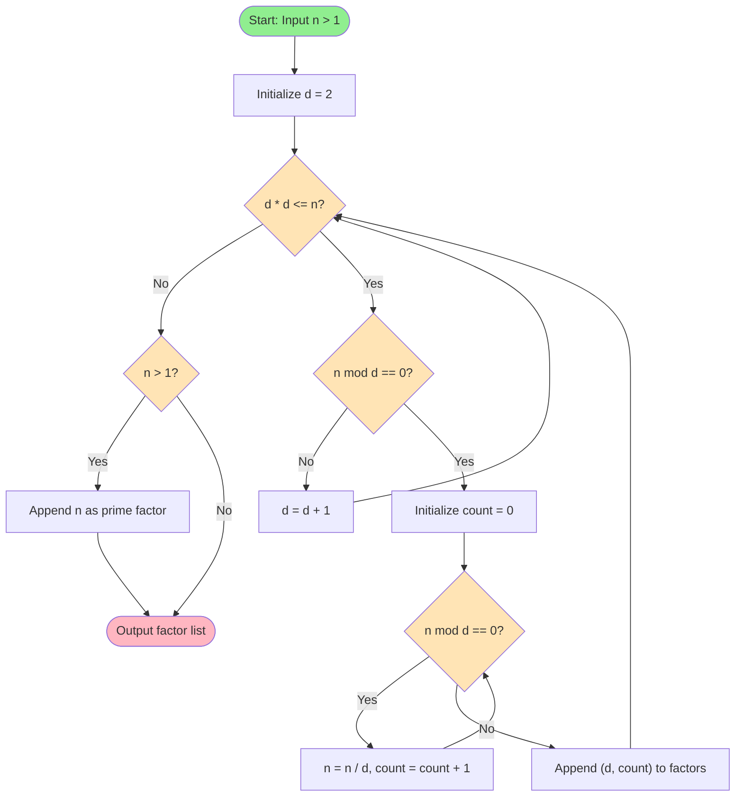
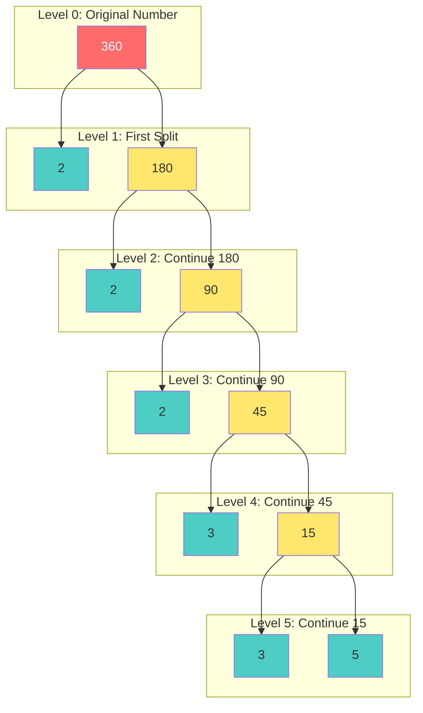
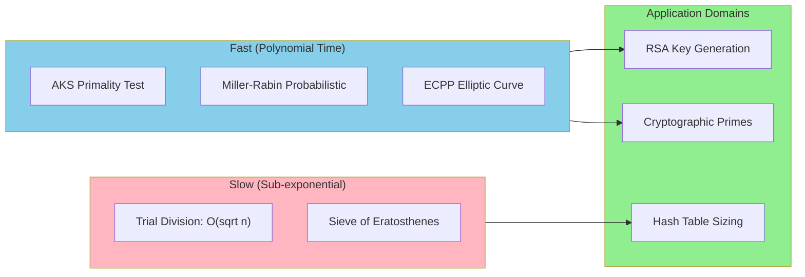
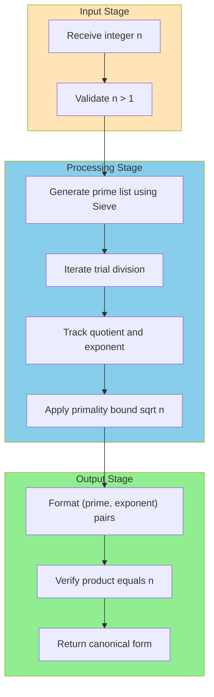

# Integer Factorization - Prime numbers and factorization

<!-- SECTION_1_START -->
# Integer Factorization: Prime Numbers and Factorization

## 1.1 Formal Academic Definition (KTU 2024 Syllabus)

**Prime Number**: A natural number $p > 1$ is called a **prime** if its only positive divisors are $1$ and $p$ itself. Equivalently, $p$ is prime if and only if it has exactly two distinct positive divisors.

**Composite Number**: A natural number $n > 1$ that is not prime is called **composite**. Such a number possesses at least one divisor other than $1$ and $n$.

**Integer Factorization**: The process of decomposing a composite integer $n$ into a product of smaller integers, ideally primes, is called **integer factorization**.

> [!IMPORTANT]
> **Fundamental Theorem of Arithmetic (FTA)**: Every integer $n > 1$ can be expressed uniquely (up to ordering) as a product of prime powers:
> 
> $$n = p_1^{a_1} \cdot p_2^{a_2} \cdot p_3^{a_3} \cdots p_k^{a_k}$$
> 
> where $p_1 < p_2 < \cdots < p_k$ are primes and each $a_i \geq 1$.

## 1.2 Conceptual Analogy / Intuition

Imagine a **chemical element** from the periodic table. Just as every chemical compound (like water $H_2O$) can be broken down into its unique elemental components (Hydrogen and Oxygen), every whole number greater than 1 can be broken down into a **unique** set of prime building blocks.

For example:
- $12 = 2 \times 2 \times 3$ (the unique "chemical formula" of 12)
- $30 = 2 \times 3 \times 5$
- $17$ cannot be broken down further → it is a **prime**

> [!NOTE]
> **Key Insight for KTU Students**: The *uniqueness* of the prime factorization is what makes primes the "atoms" of number theory. This uniqueness is the cornerstone of modular arithmetic, RSA cryptography, and primality testing.

## 1.3 Standard Metrics and Constants

- **Euclid's Theorem**: The set of prime numbers is **infinite**. (Proven by Euclid around 300 BCE)
- **Prime Counting Function** $\pi(x)$: counts the number of primes $\leq x$.
- **Prime Number Theorem (PNT)**: $\pi(x) \sim \frac{x}{\ln x}$ as $x \to \infty$.
- **Largest Known Prime (as of 2024)**: $2^{82,589,933} - 1$ (Mersenne prime, **52,724,032,511** digits).
- **Smallest primes**: $2, 3, 5, 7, 11, 13, 17, 19, 23, 29, 31, \ldots$

> [!VISUALIZATION CONTROL]
> **Concept:** Distribution of primes and the Prime Number Theorem approximation
> **GeoGebra / Desmos Input Equations:**
> * `f(x) = x / ln(x)` (approximate count of primes)
> * `g(x) = pi(x)` (true prime count - can be entered as a piecewise/step function for small $x$)
> **Visual Description:** The student should observe that the curve $f(x) = \frac{x}{\ln x}$ closely tracks the actual prime distribution for large $x$, confirming the Prime Number Theorem. Notice the density of primes decreases as $x$ grows.

<!-- SECTION_1_END -->

<!-- SECTION_2_START -->
# Deep Theoretical Analysis & KTU High-Yield Formula Sheet

## 2.1 The Logical Framework of Prime Factorization

### Step 1: Establishing Primality via Divisibility
A number $n > 1$ is **composite** if and only if there exists a divisor $d$ such that $1 < d \leq \sqrt{n}$ and $d \mid n$.

**Why this works**: If $n = a \times b$ and $a \leq b$, then $a \leq \sqrt{n}$. So we only need to test divisors up to $\sqrt{n}$.

### Step 2: Trial Division Algorithm
To factor $n$:
1. Start with the smallest prime $p = 2$.
2. While $p^2 \leq n$, check if $p \mid n$.
3. If yes, repeatedly divide $n$ by $p$ and record the exponent.
4. Move to the next prime $p \leftarrow p+1$ (or next prime).
5. If $p^2 > n$ and $n > 1$, then $n$ itself is a prime factor.

### Step 3: Uniqueness Guarantee (from FTA)
The Fundamental Theorem of Arithmetic guarantees that no matter what order we factor $n$, the final prime factorization is identical (except for the ordering of factors).

## 2.2 Essential Properties of Primes

| Property | Statement |
|----------|-----------|
| **Euclid's Theorem** | There are infinitely many primes |
| **Divisibility of Products** | If $p$ is prime and $p \mid ab$, then $p \mid a$ or $p \mid b$ (Euclid's Lemma) |
| **Existence of Smallest Divisor** | Every integer $n > 1$ has a smallest prime divisor $p \leq \sqrt{n}$ |
| **Bertrand's Postulate** | For every $n > 1$, there exists at least one prime $p$ with $n < p < 2n$ |
| **Goldbach's Conjecture** (unproven) | Every even integer $> 2$ is the sum of two primes |
| **Twin Prime Conjecture** (unproven) | There are infinitely many primes $p$ such that $p+2$ is also prime |

## 2.3 KTU Formula Sheet / Cheat Sheet

| Formula / Rule | Expression | Use Case |
|----------------|------------|----------|
| **Divisor Count** | $\tau(n) = (a_1+1)(a_2+1)\cdots(a_k+1)$ | Number of divisors of $n$ |
| **Sum of Divisors** | $\sigma(n) = \prod_{i=1}^{k} \frac{p_i^{a_i+1}-1}{p_i-1}$ | Sum of all divisors |
| **Euler's Totient** | $\phi(n) = n \prod_{p \mid n}\left(1 - \frac{1}{p}\right)$ | Count integers $\leq n$ coprime to $n$ |
| **Prime Density (PNT)** | $\pi(x) \approx \frac{x}{\ln x}$ | Approximate prime count |
| **Bound for Smallest Prime Divisor** | $p \leq \sqrt{n}$ | Trial division termination |
| **n-th Prime Approximation** | $p_n \approx n \ln n$ | Position of n-th prime |
| **Mersenne Prime Test** | $2^p - 1$ is prime $\Rightarrow$ $p$ is prime | Necessary condition |

> [!IMPORTANT]
> **Engineering Utility**: Prime factorization is the computational backbone of:
> - **RSA Cryptography** (security depends on hardness of factoring large semiprimes)
> - **Hash tables** (choosing hash function parameters)
> - **Elliptic Curve Cryptography**
> - **Random Number Generation**
> - **Public Key Infrastructure (PKI)**

<!-- SECTION_2_END -->

<!-- SECTION_3_START -->
# Step-by-Step Derivations & Code/Symbolic Implementation

## 3.1 Worked Example: Prime Factorization of 360

**Problem**: Find the complete prime factorization of $n = 360$.

### Solution Walkthrough

**Step 1**: Test divisibility by $p = 2$.
$$360 = 2 \times 180$$
$$180 = 2 \times 90$$
$$90 = 2 \times 45$$
So far: $360 = 2^3 \times 45$, with $45$ remaining.

**Step 2**: Move to next prime $p = 3$.
$$45 = 3 \times 15$$
$$15 = 3 \times 5$$
So far: $360 = 2^3 \times 3^2 \times 5$, with $5$ remaining.

**Step 3**: Test $p = 5$.
$$5 = 5 \times 1$$
Final: $360 = 2^3 \times 3^2 \times 5^1$.

**Verification**:
$$2^3 \times 3^2 \times 5^1 = 8 \times 9 \times 5 = 72 \times 5 = 360 \checkmark$$

## 3.2 Proof Sketch: Infinitude of Primes (Euclid's Theorem)

**Claim**: The set of primes $P$ is infinite.

**Proof by Contradiction**:

Assume only finitely many primes exist: $p_1, p_2, \ldots, p_k$.

Construct the number:
$$N = p_1 \cdot p_2 \cdot p_3 \cdots p_k + 1$$

**Case 1**: $N$ is prime. Then $N$ is a prime not in our list — contradiction.

**Case 2**: $N$ is composite. Then $N$ has a prime divisor $q$. Since $N \equiv 1 \pmod{p_i}$ for every $p_i$ in our list, $q$ cannot be any of the $p_i$ — contradiction.

Therefore, our assumption is false, and there must be infinitely many primes. $\blacksquare$

## 3.3 Derivation: Divisor Count Formula

Given $n = p_1^{a_1} p_2^{a_2} \cdots p_k^{a_k}$, each divisor $d$ of $n$ has the form:
$$d = p_1^{b_1} p_2^{b_2} \cdots p_k^{b_k}$$
where $0 \leq b_i \leq a_i$ for each $i$.

For each $p_i$, there are $(a_i + 1)$ choices for $b_i$ (namely $0, 1, 2, \ldots, a_i$).

By the **multiplication principle of counting**:
$$\tau(n) = (a_1+1)(a_2+1)\cdots(a_k+1)$$

**Worked Example**: For $n = 360 = 2^3 \cdot 3^2 \cdot 5^1$:
$$\tau(360) = (3+1)(2+1)(1+1) = 4 \times 3 \times 2 = 24 \text{ divisors}$$

## 3.4 Python Implementation: Trial Division Factorization

```python
import math
from typing import List, Tuple
import logging

logging.basicConfig(level=logging.INFO, format='%(levelname)s: %(message)s')

def prime_factorization(n: int) -> List[Tuple[int, int]]:
    """
    Performs prime factorization of n using trial division.
    Returns a list of (prime, exponent) tuples in ascending order.
    
    Time Complexity: O(sqrt(n) / log(sqrt(n)))
    Space Complexity: O(log n) for output storage
    
    Args:
        n: A positive integer greater than 1.
    
    Returns:
        List of (prime, exponent) tuples representing the factorization.
    
    Raises:
        ValueError: If n <= 1.
    """
    if not isinstance(n, int):
        raise TypeError(f"Expected int, got {type(n).__name__}")
    if n <= 1:
        raise ValueError(f"Input must be > 1, got {n}")
    
    factors: List[Tuple[int, int]] = []
    original_n = n
    
    # Step 1: Handle factor 2 separately for efficiency
    if n % 2 == 0:
        count = 0
        while n % 2 == 0:
            n //= 2
            count += 1
        factors.append((2, count))
        logging.info(f"Extracted 2^{count}, remaining = {n}")
    
    # Step 2: Test odd divisors from 3 up to sqrt(n)
    d = 3
    while d * d <= n:
        if n % d == 0:
            count = 0
            while n % d == 0:
                n //= d
                count += 1
            factors.append((d, count))
            logging.info(f"Extracted {d}^{count}, remaining = {n}")
        d += 2
    
    # Step 3: If n > 1, it is itself a prime factor
    if n > 1:
        factors.append((n, 1))
        logging.info(f"Remaining {n} is prime")
    
    # Verification step (defensive programming)
    product = 1
    for p, e in factors:
        product *= (p ** e)
    assert product == original_n, f"Verification failed: {product} != {original_n}"
    logging.info(f"Verified: {' * '.join(f'{p}^{e}' for p, e in factors)} = {original_n}")
    
    return factors


def sieve_of_eratosthenes(limit: int) -> List[int]:
    """
    Generates all primes up to 'limit' using the Sieve of Eratosthenes.
    
    Time Complexity: O(limit * log(log(limit)))
    Space Complexity: O(limit)
    
    Args:
        limit: Upper bound (inclusive).
    
    Returns:
        Sorted list of all primes <= limit.
    """
    if limit < 2:
        return []
    
    is_prime = [True] * (limit + 1)
    is_prime[0] = is_prime[1] = False
    
    for i in range(2, int(math.isqrt(limit)) + 1):
        if is_prime[i]:
            for j in range(i * i, limit + 1, i):
                is_prime[j] = False
    
    return [i for i in range(limit + 1) if is_prime[i]]


def divisor_count(n: int) -> int:
    """Returns tau(n), the number of positive divisors of n."""
    if n <= 0:
        raise ValueError("n must be a positive integer")
    factors = prime_factorization(n)
    tau = 1
    for _, exponent in factors:
        tau *= (exponent + 1)
    return tau


def euler_totient(n: int) -> int:
    """Returns phi(n), count of integers in [1,n] coprime to n."""
    if n <= 0:
        raise ValueError("n must be a positive integer")
    result = n
    for p, _ in prime_factorization(n):
        result = result // p * (p - 1)
    return result


# Demonstration block
if __name__ == "__main__":
    # Example 1: Factorize 360
    n1 = 360
    result1 = prime_factorization(n1)
    print(f"Factorization of {n1}: {result1}")
    # Output: [(2, 3), (3, 2), (5, 1)]
    
    # Example 2: Find all primes up to 50
    primes_50 = sieve_of_eratosthenes(50)
    print(f"Primes up to 50: {primes_50}")
    # Output: [2, 3, 5, 7, 11, 13, 17, 19, 23, 29, 31, 37, 41, 43, 47]
    
    # Example 3: Number of divisors of 360
    print(f"tau(360) = {divisor_count(360)}")  # Output: 24
    
    # Example 4: Euler totient of 36
    print(f"phi(36) = {euler_totient(36)}")    # Output: 12
```

## 3.5 Worked Example: Sieve of Eratosthenes (Find primes $\leq 30$)

| Step | Action | Marked Composite Numbers |
|------|--------|--------------------------|
| 1 | Mark multiples of 2: 4, 6, 8, 10, 12, 14, 16, 18, 20, 22, 24, 26, 28, 30 | All even numbers |
| 2 | 3 is prime, mark 9, 15, 21, 27 | Add 9, 15, 21, 27 |
| 3 | 5 is prime, mark 25 | Add 25 |
| 4 | $\sqrt{30} \approx 5.48$, stop | — |

**Remaining primes**: $\{2, 3, 5, 7, 11, 13, 17, 19, 23, 29\}$

<!-- SECTION_3_END -->

<!-- SECTION_4_START -->
# Structural Diagrams & Schematics

## 4.1 Prime Factorization Decision Flow (Trial Division)



## 4.2 Hierarchical Decomposition of Composite 360



## 4.3 Primality Testing Strategy Comparison



## 4.4 Modular Architecture of Factorization Process



<!-- SECTION_4_END -->

<!-- SECTION_5_START -->
# KTU 2024 Scheme Examination Question Bank & Topic Recap

## Part A: Short Answer Questions (3 Marks Each)

### Question 1
`[KTU University Exam - July 2024]` **(CO1, Remember)**

**Q: Define a prime number. Show that 29 is a prime number.**

**Model Answer (3 Marks)**:

**Definition** [1 Mark]: A natural number $p > 1$ is called a prime number if its only positive divisors are 1 and $p$ itself. Equivalently, $p$ has exactly two distinct positive divisors.

**Proof that 29 is prime** [2 Marks]: We need to show that no integer $d$ with $1 < d < 29$ divides 29.

We only need to test primes up to $\sqrt{29} \approx 5.39$, i.e., primes 2, 3, and 5:
- $29 \div 2 = 14.5$ (not integer)
- $29 \div 3 = 9.67$ (not integer)
- $29 \div 5 = 5.8$ (not integer)

Since 29 is not divisible by any prime $\leq \sqrt{29}$, and 29 is greater than 1, **29 is prime**. $\blacksquare$

---

### Question 2
`[KTU University Exam - Dec 2023]` **(CO1, Understand)**

**Q: State the Fundamental Theorem of Arithmetic. Factorize 180 into its prime factors.**

**Model Answer (3 Marks)**:

**Statement of FTA** [1 Mark]: Every integer $n > 1$ can be expressed uniquely (up to the order of factors) as a product of prime powers:
$$n = p_1^{a_1} \cdot p_2^{a_2} \cdots p_k^{a_k}$$
where $p_i$ are distinct primes and $a_i \geq 1$.

**Factorization of 180** [2 Marks]:
$$180 = 2 \times 90 = 2 \times 2 \times 45 = 2^2 \times 45$$
$$45 = 3 \times 15 = 3 \times 3 \times 5 = 3^2 \times 5$$
$$\therefore 180 = 2^2 \times 3^2 \times 5^1$$

**Verification**: $4 \times 9 \times 5 = 180$ $\checkmark$

---

## Part B: Long Answer Questions (14 Marks Each, with Internal Choice)

### Question 3 — Choice A
`[KTU University Exam - July 2024]` **(CO1, CO2, Apply / Analyze)**

**Q: (a)** Prove that there are infinitely many prime numbers. **[7 Marks]**

**(b)** Using trial division, find the complete prime factorization of $n = 7560$. Hence compute $\tau(7560)$ and $\phi(7560)$. **[7 Marks]**

---

**Model Solution for (a) — Euclid's Proof** [7 Marks]:

**Assumption for contradiction** [1 Mark]: Suppose there are only finitely many primes, namely $p_1, p_2, \ldots, p_k$.

**Construct a candidate** [1 Mark]: Define the number
$$N = p_1 \cdot p_2 \cdot p_3 \cdots p_k + 1$$

**Analyze the candidate** [2 Marks]: Since $N > 1$, either $N$ is prime or $N$ is composite.

- **If $N$ is prime**: Then $N$ itself is a prime not in the list $\{p_1, \ldots, p_k\}$ — contradiction.
- **If $N$ is composite**: Let $q$ be a prime divisor of $N$. Observe:
$$N \equiv 1 \pmod{p_i} \quad \text{for every } i = 1, 2, \ldots, k$$
because $N = (p_1 p_2 \cdots p_k) + 1$. Hence $q \neq p_i$ for any $i$, so $q$ is a new prime — contradiction.

**Conclusion** [1 Mark]: The assumption is false. Therefore, there are infinitely many primes. $\blacksquare$

**Application remark** [1 Mark]: This classical result guarantees that prime-based cryptographic systems (like RSA) have an essentially infinite pool of primes to choose from.

---

**Model Solution for (b) — Factorization of 7560** [7 Marks]:

**Step 1: Test factor 2** [1 Mark]:
$$7560 = 2^3 \times 945$$

**Step 2: Test factor 3** [1 Mark]:
$$945 = 3^3 \times 35$$

**Step 3: Test factor 5** [1 Mark]:
$$35 = 5 \times 7$$

**Step 4: Identify remaining prime** [1 Mark]:
$$7 \text{ is prime (no divisor } \leq \sqrt{7} \approx 2.64 \text{ divides 7)}$$

**Final factorization** [1 Mark]:
$$7560 = 2^3 \times 3^3 \times 5^1 \times 7^1$$

**Computing $\tau(7560)$** [1 Mark]:
$$\tau(7560) = (3+1)(3+1)(1+1)(1+1) = 4 \times 4 \times 2 \times 2 = 64$$

**Computing $\phi(7560)$** [1 Mark]:
$$\phi(7560) = 7560 \cdot \left(1 - \frac{1}{2}\right)\left(1 - \frac{1}{3}\right)\left(1 - \frac{1}{5}\right)\left(1 - \frac{1}{7}\right)$$
$$= 7560 \cdot \frac{1}{2} \cdot \frac{2}{3} \cdot \frac{4}{5} \cdot \frac{6}{7}$$
$$= 7560 \cdot \frac{48}{210} = 7560 \cdot \frac{8}{35}$$
$$= \frac{60480}{35} = 1728$$

**Final Answer**: $\tau(7560) = 64$, $\phi(7560) = 1728$.

---

### Question 3 — Choice B
`[KTU University Exam - Dec 2023]` **(CO1, CO2, Apply / Analyze)**

**Q: (a)** Explain the Sieve of Eratosthenes algorithm. Use it to find all primes between 1 and 40. **[7 Marks]**

**(b)** If $n = 2^{10} \cdot 3^4 \cdot 5^2 \cdot 7$, find $\tau(n)$, $\sigma(n)$, and $\phi(n)$. **[7 Marks]**

---

**Model Solution for (a) — Sieve of Eratosthenes** [7 Marks]:

**Algorithm Description** [2 Marks]: The Sieve of Eratosthenes efficiently finds all primes up to a given limit $N$ by iteratively marking multiples of each prime as composite.

**Step-by-step process** [2 Marks]:
1. Create a boolean array `is_prime[2..N]`, initially all `True`.
2. For each integer $i$ from 2 to $\sqrt{N}$:
   - If `is_prime[i]` is `True`, mark all multiples $i^2, i^2+i, i^2+2i, \ldots$ as `False`.
3. All unmarked numbers are prime.

**Complexity** [1 Mark]: Time complexity is $O(N \log \log N)$, which is near-linear and very efficient.

**Execution for N = 40** [2 Marks]:

| Prime $i$ | Multiples marked as composite (between 2 and 40) |
|-----------|--------------------------------------------------|
| 2 | 4, 6, 8, 10, 12, 14, 16, 18, 20, 22, 24, 26, 28, 30, 32, 34, 36, 38, 40 |
| 3 | 9, 15, 21, 27, 33, 39 |
| 5 | 25, 35 |
| 7 | (49 > 40, stop) |

**List of primes from 2 to 40**:
$$\{2, 3, 5, 7, 11, 13, 17, 19, 23, 29, 31, 37\}$$

Total: **12 primes**.

---

**Model Solution for (b) — Arithmetic Function Calculations** [7 Marks]:

Given: $n = 2^{10} \cdot 3^4 \cdot 5^2 \cdot 7^1$.

**Computing $\tau(n)$** [2 Marks]:
$$\tau(n) = (10+1)(4+1)(2+1)(1+1) = 11 \times 5 \times 3 \times 2 = 330$$

**Computing $\sigma(n)$** [3 Marks]:
$$\sigma(n) = \prod_{i} \frac{p_i^{a_i+1} - 1}{p_i - 1}$$
$$\sigma(n) = \frac{2^{11}-1}{2-1} \cdot \frac{3^5-1}{3-1} \cdot \frac{5^3-1}{5-1} \cdot \frac{7^2-1}{7-1}$$
$$= \frac{2047}{1} \cdot \frac{242}{2} \cdot \frac{124}{4} \cdot \frac{48}{6}$$
$$= 2047 \times 121 \times 31 \times 8$$
$$= 2047 \times 121 \times 248$$
$$= 2047 \times 30008$$
$$= 61,426,376$$

**Computing $\phi(n)$** [2 Marks]:
$$\phi(n) = n \prod_{p \mid n} \left(1 - \frac{1}{p}\right)$$
$$= 2^{10} \cdot 3^4 \cdot 5^2 \cdot 7 \cdot \frac{1}{2} \cdot \frac{2}{3} \cdot \frac{4}{5} \cdot \frac{6}{7}$$
$$= 2^9 \cdot 3^3 \cdot 5^1 \cdot 6$$
$$= 512 \times 27 \times 5 \times 6$$
$$= 512 \times 810 = 414{,}720$$

**Final Answer**: $\tau(n) = 330$, $\sigma(n) = 61{,}426{,}376$, $\phi(n) = 414{,}720$.

---

> [!WARNING]
> **KTU Examiner's Valuation Warning / Common Pitfalls**:
> 1. **Trial Division Mistake**: Students often test divisors up to $n/2$ instead of $\sqrt{n}$ — this is valid but extremely inefficient and may cost time. Always use the $\sqrt{n}$ bound [1 Mark deduction if missing].
> 2. **FTA Misstatement**: Forgetting to mention "uniqueness" in the Fundamental Theorem of Arithmetic will result in partial credit loss.
> 3. **Arithmetic Errors in $\sigma(n)$**: Miscalculating $(p^{a+1}-1)/(p-1)$ is common — double-check your geometric series expansion.
> 4. **Prime Verification**: When asked to "show a number is prime", you MUST test all primes $\leq \sqrt{n}$, not just the first few.
> 5. **Missing Verification Step**: Always verify by multiplying the prime factors back to the original number.

---

## Topic Recap & Important Things to Remember

- **Prime Definition**: $p > 1$ with exactly two divisors: 1 and $p$.
- **Fundamental Theorem of Arithmetic (FTA)**: Every integer $> 1$ has a **unique** prime factorization.
- **Smallest Prime Divisor Bound**: Any composite $n$ has a prime factor $p \leq \sqrt{n}$.
- **Euclid's Theorem**: The set of primes is **infinite** (proven by contradiction using $N = p_1 p_2 \cdots p_k + 1$).
- **Trial Division Complexity**: $O(\sqrt{n})$ — efficient only for small $n$.
- **Sieve of Eratosthenes**: $O(N \log \log N)$ — efficient for finding all primes up to $N$.
- **Divisor Count Formula**: $\tau(n) = \prod (a_i + 1)$ for $n = \prod p_i^{a_i}$.
- **Sum of Divisors Formula**: $\sigma(n) = \prod \frac{p_i^{a_i+1}-1}{p_i-1}$.
- **Euler's Totient**: $\phi(n) = n \prod_{p \mid n}(1 - \frac{1}{p})$.
- **Prime Number Theorem**: $\pi(x) \approx \frac{x}{\ln x}$ for large $x$.
- **Engineering Application**: Prime factorization is the **security foundation** of RSA, Diffie-Hellman, and most public-key cryptosystems.
- **Mersenne Primes**: $2^p - 1$ requires $p$ to be prime (necessary but not sufficient).
- **Bertrand's Postulate**: Between $n$ and $2n$, there is always at least one prime (for $n > 1$).
- **Test Strategy for KTU**: Always show all steps of trial division explicitly; never skip the final "remaining $n$ is prime" check.

<!-- SECTION_5_END -->
