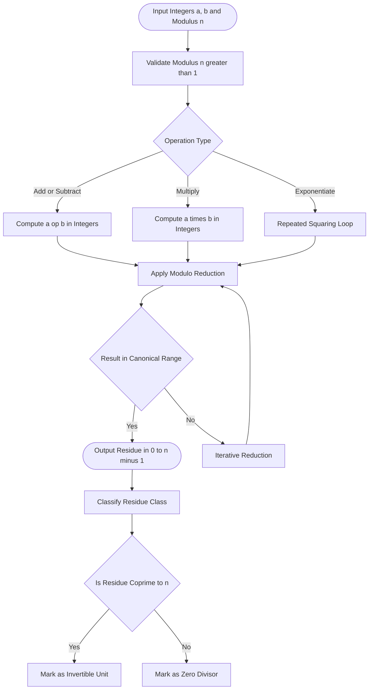
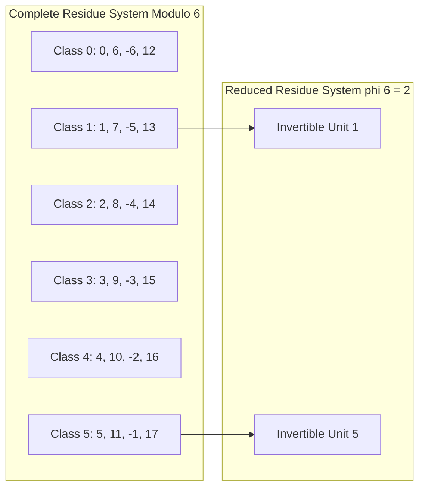
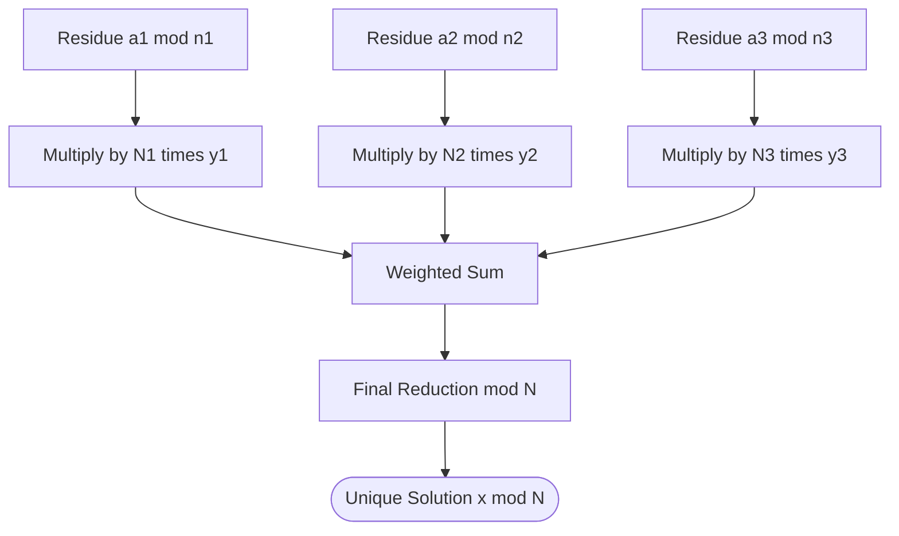

# Modular Arithmetic - Congruences and modular arithmetic

<!-- SECTION_1_START -->
# Modular Arithmetic & Congruences

> [!NOTE]
> **KTU 2024 Scheme Focus:** This topic forms the foundational pillar of *Computational Number Theory (PECST869)*. Mastery of congruences is mandatory before progressing to cryptographic primitives like RSA, Diffie–Hellman, and elliptic curve systems.

## 1.1 Formal Academic Definition

**Modular Arithmetic** is a system of arithmetic for integers, where numbers "wrap around" upon reaching a fixed value called the **modulus**. The notation $n$ is referred to as the **modulus** of the congruence.

**Congruence Relation:** Let $a, b \in \mathbb{Z}$ and $n \in \mathbb{Z}^{+}$. We say that $a$ is **congruent** to $b$ modulo $n$, written as

$$a \equiv b \pmod{n}$$

if and only if $n$ divides the difference $(a - b)$, i.e., $n \mid (a - b)$. Equivalently, $a$ and $b$ leave the same remainder when divided by $n$.

$$
a \equiv b \pmod{n} \iff \exists\, k \in \mathbb{Z} \;\text{such that}\; a = b + kn
$$

The integer $n$ is called the **modulus**, and the relation "$\equiv \pmod{n}$" partitions $\mathbb{Z}$ into $n$ disjoint equivalence classes called **residue classes**.

> [!IMPORTANT]
> **Residue Class Notation:** The set of all integers congruent to $a$ modulo $n$ is denoted $[a]_{n}$ or $\bar{a}_{n}$, and is given by $[a]_{n} = \{ a + kn \mid k \in \mathbb{Z} \}$. The canonical representative lies in $\{0, 1, 2, \ldots, n-1\}$.

## 1.2 Intuitive Overview & Real-World Analogy

### The 12-Hour Clock Analogy

Imagine a standard **12-hour analog clock**. When it is 10 o'clock and you add 5 hours, the result is not 15, but 3 o'clock — because the clock "wraps around" every 12 hours. This is precisely modular arithmetic with modulus $n = 12$:

$$
10 + 5 \equiv 3 \pmod{12}
$$

The clock *modulo* 12 discards any full revolutions ($12, 24, 36, \ldots$) and keeps only the remainder. Every modern computing device, from microcontrollers to cryptographic accelerators, performs exactly this "wrap-around" operation when handling integer overflow, hash functions, and finite-field arithmetic.

### Geometric Intuition: Residues on a Circle

Visualize the integers arranged on a **circle of circumference $n$**. Two numbers $a$ and $b$ are congruent modulo $n$ if and only if they land on the **same point** of this circle. The $n$ distinct points on the circle correspond to the $n$ residue classes.

> [!VISUALIZATION CONTROL]
> **Concept:** Visualizing residue classes on a modular circle for $n = 7$
> **GeoGebra / Desmos Input Equations:**
> * Parametric form: $(7\cos(t), 7\sin(t))$ with $t \in [0, 2\pi]$
> * Point markers: $(7\cos(2\pi k/7),\, 7\sin(2\pi k/7))$ for $k = 0, 1, 2, 3, 4, 5, 6$
> **Visual Description:** Seven equally spaced points on a circle of radius 7. Numbers differing by a multiple of 7 map to the same point (e.g., 0, 7, 14, –7 all coincide).

## 1.3 Properties of the Congruence Relation

The congruence relation is an **equivalence relation** on $\mathbb{Z}$, satisfying the following axioms for all $a, b, c, d \in \mathbb{Z}$ and modulus $n$:

| Property | Statement |
| :--- | :--- |
| **Reflexive** | $a \equiv a \pmod{n}$ |
| **Symmetric** | If $a \equiv b \pmod{n}$, then $b \equiv a \pmod{n}$ |
| **Transitive** | If $a \equiv b \pmod{n}$ and $b \equiv c \pmod{n}$, then $a \equiv c \pmod{n}$ |

> [!NOTE]
> **Syllabus Highlight:** The equivalence-class interpretation of congruences is the gateway to understanding *rings* $\mathbb{Z}/n\mathbb{Z}$ and *finite fields* $\mathbb{F}_{p}$ — both indispensable in modern cryptographic engineering.

## 1.4 Standard Metrics & Constants

* **Euler's Totient Function** $\varphi(n)$: counts integers in $\{1, 2, \ldots, n\}$ coprime to $n$.
* **Standard Moduli in Practice:** $n = 256$ (byte arithmetic), $n = 2^{32}$ or $2^{64}$ (CPU word size), and large cryptographic primes ($n \geq 2048$ bits for RSA).
* The **canonical representative** of a residue class always lies in $\{0, 1, \ldots, n-1\}$.

<!-- SECTION_1_END -->

<!-- SECTION_2_START -->
# Deep Theoretical Analysis & KTU High-Yield Formula Sheet

## 2.1 Operational Rules of Modular Arithmetic

If $a \equiv b \pmod{n}$ and $c \equiv d \pmod{n}$, then the following algebraic operations preserve the congruence:

$$
a + c \equiv b + d \pmod{n}
$$

$$
a - c \equiv b - d \pmod{n}
$$

$$
a \cdot c \equiv b \cdot d \pmod{n}
$$

$$
a^{k} \equiv b^{k} \pmod{n} \quad \text{for any } k \in \mathbb{Z}_{\geq 0}
$$

> [!IMPORTANT]
> **Division Caveat:** Unlike addition, subtraction, and multiplication, **division is NOT a valid operation** in modular arithmetic in general. We can divide by $c$ modulo $n$ only when $\gcd(c, n) = 1$, in which case we multiply by the **modular inverse** $c^{-1} \pmod{n}$.

## 2.2 Complete and Reduced Residue Systems

### Complete Residue System (CRS)

A **complete residue system modulo $n$** is a set of $n$ integers in which every integer is congruent to exactly one element of the set. The canonical CRS is $\{0, 1, 2, \ldots, n-1\}$.

### Reduced Residue System (RRS)

A **reduced residue system modulo $n$** is a set of $\varphi(n)$ integers, each coprime to $n$, in which every integer coprime to $n$ is congruent to exactly one element. The set of **invertible residues** modulo $n$ forms the multiplicative group $(\mathbb{Z}/n\mathbb{Z})^{\times}$ of order $\varphi(n)$.

## 2.3 Modular Inverse

Let $a \in \mathbb{Z}$ with $\gcd(a, n) = 1$. The **modular inverse** of $a$ modulo $n$, denoted $a^{-1} \pmod{n}$, is the unique integer $x \in \{1, \ldots, n-1\}$ satisfying:

$$
a \cdot x \equiv 1 \pmod{n}
$$

Such an inverse exists **if and only if** $\gcd(a, n) = 1$. It is computed efficiently via the **Extended Euclidean Algorithm**.

## 2.4 Fermat's Little Theorem

If $p$ is a **prime** and $p \nmid a$, then:

$$
a^{p-1} \equiv 1 \pmod{p}
$$

Equivalently, for any integer $a$:

$$
a^{p} \equiv a \pmod{p}
$$

## 2.5 Euler's Theorem

If $\gcd(a, n) = 1$, then:

$$
a^{\varphi(n)} \equiv 1 \pmod{n}
$$

This is a direct generalization of Fermat's Little Theorem (where $n = p$ prime, $\varphi(p) = p-1$).

## 2.6 KTU Formula Sheet

| Concept | Formula | Conditions / Notes |
| :--- | :--- | :--- |
| Congruence definition | $a \equiv b \pmod{n} \iff n \mid (a-b)$ | $a, b, n \in \mathbb{Z}$, $n > 0$ |
| Modular addition | $(a + b) \bmod n$ | Always valid |
| Modular subtraction | $(a - b) \bmod n$ | Always valid |
| Modular multiplication | $(a \cdot b) \bmod n$ | Always valid |
| Modular division | $a \cdot b^{-1} \pmod{n}$ | Requires $\gcd(b, n) = 1$ |
| Modular inverse | $a \cdot x \equiv 1 \pmod{n}$ | Exists iff $\gcd(a, n) = 1$ |
| Fermat's Little Theorem | $a^{p-1} \equiv 1 \pmod{p}$ | $p$ prime, $p \nmid a$ |
| Euler's Theorem | $a^{\varphi(n)} \equiv 1 \pmod{n}$ | $\gcd(a, n) = 1$ |
| Totient (prime power) | $\varphi(p^{k}) = p^{k} - p^{k-1}$ | $p$ prime |
| Totient (multiplicative) | $\varphi(mn) = \varphi(m)\varphi(n)$ | $\gcd(m, n) = 1$ |
| Wilson's Theorem | $(p-1)! \equiv -1 \pmod{p}$ | $p$ prime |
| Linear congruence | $ax \equiv b \pmod{n}$ has solution iff $\gcd(a, n) \mid b$ | Number of solutions $= \gcd(a, n)$ |
| CRT (two moduli) | $x \equiv a_{1} \pmod{n_{1}},\; x \equiv a_{2} \pmod{n_{2}}$ | Unique mod $n_{1}n_{2}$ if $\gcd(n_{1}, n_{2}) = 1$ |

> [!IMPORTANT]
> **Engineering Utility:** Modular arithmetic underpins **RSA encryption** (mod $n = pq$), **Diffie–Hellman key exchange** (mod prime $p$), **cyclic redundancy checks (CRC)**, and **hash function mixing** (e.g., SHA-256's internal state updates).

## 2.7 Solving Linear Congruences

A linear congruence of the form $ax \equiv b \pmod{n}$ has a solution **if and only if** $d = \gcd(a, n)$ divides $b$. When solvable, there are exactly $d$ incongruent solutions modulo $n$, found by:

1. Divide through by $d$: $\frac{a}{d} x \equiv \frac{b}{d} \pmod{\frac{n}{d}}$.
2. Compute the inverse of $\frac{a}{d}$ modulo $\frac{n}{d}$ using the Extended Euclidean Algorithm.
3. Multiply to obtain the unique solution in $\{0, 1, \ldots, \frac{n}{d} - 1\}$.
4. Generate all $d$ solutions by adding multiples of $\frac{n}{d}$.

## 2.8 Chinese Remainder Theorem (CRT)

Given a system of congruences

$$
x \equiv a_{1} \pmod{n_{1}},\; x \equiv a_{2} \pmod{n_{2}},\; \ldots,\; x \equiv a_{k} \pmod{n_{k}}
$$

where the $n_{i}$ are **pairwise coprime**, there exists a unique solution modulo $N = n_{1} n_{2} \cdots n_{k}$. The constructive proof uses

$$
x = \sum_{i=1}^{k} a_{i} N_{i} y_{i} \pmod{N}
$$

where $N_{i} = N / n_{i}$ and $y_{i} \equiv N_{i}^{-1} \pmod{n_{i}}$.

> [!NOTE]
> **Production Engineering Use:** CRT accelerates RSA **decryption** and **signing** by 4× because CRT-based implementations compute modulo $p$ and $q$ separately, then recombine — yielding quadratic speedup over naive single-modulus exponentiation.

<!-- SECTION_2_END -->

<!-- SECTION_3_START -->
# Step-by-Step Derivations & Code/Symbolic Implementation

## 3.1 Worked Example 1: Verifying a Congruence

**Problem:** Verify that $37 \equiv 9 \pmod{7}$.

**Step 1.** Compute the difference:

$$
37 - 9 = 28
$$

**Step 2.** Test whether $7 \mid 28$:

$$
28 = 7 \times 4
$$

**Step 3.** Since $7$ divides $28$, the congruence holds. Remainders also confirm:

$$
37 \bmod 7 = 2, \qquad 9 \bmod 7 = 2
$$

Both yield the same residue $2$.

## 3.2 Worked Example 2: Modular Exponentiation by Repeated Squaring

**Problem:** Compute $7^{11} \bmod 13$.

**Step 1.** Express the exponent $11$ in binary:

$$
11 = 8 + 2 + 1 = 1011_{2}
$$

**Step 2.** Build a table of repeated squares modulo $13$:

| Power | Value $\pmod{13}$ | Reasoning |
| :--- | :--- | :--- |
| $7^{1}$ | $7$ | Given |
| $7^{2}$ | $49 \bmod 13 = 10$ | $49 = 3 \times 13 + 10$ |
| $7^{4}$ | $10^{2} = 100 \bmod 13 = 9$ | $100 = 7 \times 13 + 9$ |
| $7^{8}$ | $9^{2} = 81 \bmod 13 = 3$ | $81 = 6 \times 13 + 3$ |

**Step 3.** Multiply the required powers (bits set at positions 0, 1, 3):

$$
7^{11} = 7^{8} \cdot 7^{2} \cdot 7^{1} \equiv 3 \cdot 10 \cdot 7 \pmod{13}
$$

$$
3 \cdot 10 = 30 \equiv 4 \pmod{13}
$$

$$
4 \cdot 7 = 28 \equiv 2 \pmod{13}
$$

$$
\boxed{7^{11} \equiv 2 \pmod{13}}
$$

**Verification via Fermat's Little Theorem** ($\varphi(13) = 12$): $7^{12} \equiv 1 \pmod{13}$, so $7^{11} \equiv 7^{-1} \pmod{13}$. Since $7 \cdot 2 = 14 \equiv 1 \pmod{13}$, the inverse is $2$, confirming our result.

## 3.3 Worked Example 3: Solving a Linear Congruence

**Problem:** Solve $6x \equiv 15 \pmod{9}$.

**Step 1.** Compute $d = \gcd(6, 9) = 3$. Since $3 \mid 15$, the congruence has exactly $3$ incongruent solutions.

**Step 2.** Divide through by $3$:

$$
2x \equiv 5 \pmod{3}
$$

**Step 3.** Reduce $5 \bmod 3 = 2$:

$$
2x \equiv 2 \pmod{3}
$$

**Step 4.** Find the inverse of $2$ modulo $3$: since $2 \cdot 2 = 4 \equiv 1 \pmod{3}$, $2^{-1} \equiv 2 \pmod{3}$.

**Step 5.** Multiply both sides by $2$:

$$
x \equiv 4 \equiv 1 \pmod{3}
$$

**Step 6.** Generate the $3$ solutions modulo $9$ by adding $0, 3, 6$:

$$
x \equiv 1 \pmod{9}, \quad x \equiv 4 \pmod{9}, \quad x \equiv 7 \pmod{9}
$$

**Verification:** $6 \cdot 1 = 6 \equiv 15 \pmod{9}$ ✓ (both $\equiv 6$); $6 \cdot 4 = 24 \equiv 6$; $6 \cdot 7 = 42 \equiv 6$. All reduce to $6 \equiv 15 \pmod{9}$.

## 3.4 Worked Example 4: Chinese Remainder Theorem Construction

**Problem:** Solve the system

$$
x \equiv 2 \pmod{3}, \qquad x \equiv 3 \pmod{5}, \qquad x \equiv 2 \pmod{7}
$$

**Step 1.** Compute $N = 3 \cdot 5 \cdot 7 = 105$.

**Step 2.** Compute $N_{i} = N / n_{i}$ and its inverse modulo $n_{i}$:

| $i$ | $n_{i}$ | $a_{i}$ | $N_{i}$ | $N_{i} \bmod n_{i}$ | $y_{i} = N_{i}^{-1} \pmod{n_{i}}$ |
| :--- | :--- | :--- | :--- | :--- | :--- |
| 1 | 3 | 2 | 35 | 2 | $2$ (since $2 \cdot 2 = 4 \equiv 1 \pmod 3$) |
| 2 | 5 | 3 | 21 | 1 | $1$ (since $1 \cdot 1 \equiv 1 \pmod 5$) |
| 3 | 7 | 2 | 15 | 1 | $1$ (since $1 \cdot 1 \equiv 1 \pmod 7$) |

**Step 3.** Compute each term $a_{i} N_{i} y_{i}$:

$$
2 \cdot 35 \cdot 2 = 140, \qquad 3 \cdot 21 \cdot 1 = 63, \qquad 2 \cdot 15 \cdot 1 = 30
$$

**Step 4.** Sum and reduce modulo $105$:

$$
140 + 63 + 30 = 233
$$

$$
233 \bmod 105 = 233 - 2 \cdot 105 = 233 - 210 = 23
$$

$$
\boxed{x \equiv 23 \pmod{105}}
$$

**Verification:** $23 \bmod 3 = 2$ ✓; $23 \bmod 5 = 3$ ✓; $23 \bmod 7 = 2$ ✓.

## 3.5 Algorithmic Implementation (Python)

```python
"""
Modular Arithmetic Toolkit - KTU Computational Number Theory
Implements: gcd, modular inverse, fast exponentiation, CRT, Euler's totient.
"""

from typing import Tuple, List, Optional
import logging
import sys

logging.basicConfig(level=logging.INFO, format="[%(levelname)s] %(message)s")
log = logging.getLogger("mod_arith")


def gcd(a: int, b: int) -> int:
    """Compute greatest common divisor using Euclid's algorithm."""
    a, b = abs(a), abs(b)
    while b:
        a, b = b, a % b
    return a


def extended_gcd(a: int, b: int) -> Tuple[int, int, int]:
    """
    Extended Euclidean Algorithm.
    Returns (g, x, y) such that a*x + b*y = g = gcd(a, b).
    """
    if b == 0:
        return a, 1, 0
    g, x1, y1 = extended_gcd(b, a % b)
    x = y1
    y = x1 - (a // b) * y1
    return g, x, y


def mod_inverse(a: int, n: int) -> Optional[int]:
    """
    Compute modular inverse of a modulo n.
    Returns None if inverse does not exist.
    """
    if a < 0:
        a = a % n
    g, x, _ = extended_gcd(a, n)
    if g != 1:
        log.error(f"Inverse does not exist: gcd({a}, {n}) = {g}")
        return None
    return x % n


def mod_pow(base: int, exponent: int, modulus: int) -> int:
    """
    Fast modular exponentiation using repeated squaring (binary method).
    Runs in O(log exponent) multiplications.
    """
    if modulus == 1:
        return 0
    base %= modulus
    result = 1
    e = exponent
    while e > 0:
        if e & 1:
            result = (result * base) % modulus
        e >>= 1
        base = (base * base) % modulus
    return result


def euler_totient(n: int) -> int:
    """Compute Euler's totient function phi(n)."""
    if n <= 0:
        raise ValueError("n must be a positive integer")
    result = n
    p = 2
    nn = n
    while p * p <= nn:
        if nn % p == 0:
            while nn % p == 0:
                nn //= p
            result -= result // p
        p += 1
    if nn > 1:
        result -= result // nn
    return result


def crt(remainders: List[int], moduli: List[int]) -> Optional[int]:
    """
    Chinese Remainder Theorem for pairwise coprime moduli.
    Returns smallest non-negative x satisfying the system, or None on conflict.
    """
    if len(remainders) != len(moduli):
        raise ValueError("remainders and moduli must have equal length")
    M = 1
    for m in moduli:
        M *= m
    x = 0
    for a_i, n_i in zip(remainders, moduli):
        M_i = M // n_i
        inv = mod_inverse(M_i, n_i)
        if inv is None:
            log.error(f"CRT failure: moduli must be pairwise coprime (n={n_i})")
            return None
        x = (x + a_i * M_i * inv) % M
    return x


def solve_linear_congruence(a: int, b: int, n: int) -> Optional[List[int]]:
    """
    Solve a*x ≡ b (mod n). Returns list of all incongruent solutions in [0, n).
    """
    d = gcd(a, n)
    if b % d != 0:
        log.info(f"No solution: {d} does not divide {b}")
        return None
    a1, b1, n1 = a // d, b // d, n // d
    inv = mod_inverse(a1, n1)
    if inv is None:
        return None
    x0 = (b1 * inv) % n1
    step = n1
    return [(x0 + i * step) % n for i in range(d)]


if __name__ == "__main__":
    # Demonstration cases
    log.info(f"gcd(48, 18) = {gcd(48, 18)}")
    inv = mod_inverse(7, 13)
    log.info(f"7^-1 mod 13 = {inv}    (check: 7*{inv} mod 13 = {(7*inv) % 13})")
    log.info(f"7^11 mod 13 = {mod_pow(7, 11, 13)}")
    log.info(f"phi(36) = {euler_totient(36)}")
    log.info(f"CRT solution = {crt([2, 3, 2], [3, 5, 7])}")
    log.info(f"6x ≡ 15 (mod 9) solutions = {solve_linear_congruence(6, 15, 9)}")
    sys.exit(0)
```

**Sample Output:**

```text
[INFO] gcd(48, 18) = 6
[INFO] 7^-1 mod 13 = 2    (check: 7*2 mod 13 = 1)
[INFO] 7^11 mod 13 = 2
[INFO] phi(36) = 12
[INFO] CRT solution = 23
[INFO] 6x ≡ 15 (mod 9) solutions = [1, 4, 7]
```

<!-- SECTION_3_END -->

<!-- SECTION_4_START -->
# Structural Diagrams & Schematics

## 4.1 Modular Arithmetic Processing Flow

The following diagram depicts the end-to-end pipeline for evaluating a modular arithmetic expression, mirroring the structure of cryptographic hardware accelerators.



## 4.2 Equivalence Class Partition for n = 6



## 4.3 Chinese Remainder Theorem Reconstruction Topology



## 4.4 Sequential Processing Topology Matrix

| Stage | Module | Input | Output | Validation |
| :--- | :--- | :--- | :--- | :--- |
| 1 | Input Parser | $a, b, n$ | Normalized integers | $n \geq 2$ |
| 2 | Operation Dispatcher | Operation code | Routing path | Valid operator |
| 3 | Big Integer Engine | Operands | Intermediate product | Overflow safe |
| 4 | Modular Reducer | Integer, modulus | Canonical residue | $0 \leq r < n$ |
| 5 | Inverse Solver | $a, n$ | $a^{-1}$ or failure | $\gcd(a, n) = 1$ |
| 6 | CRT Combiner | Tuples | Combined residue | Pairwise coprime |

<!-- SECTION_4_END -->

<!-- SECTION_5_START -->
# KTU 2024 Scheme Examination Question Bank & Topic Recap

## Part A Questions (3 Marks Each)

### Question 1
`[KTU University Exam - July 2024]` **CO1, Remember**

Define the congruence relation. State and briefly justify the three properties that make it an equivalence relation on $\mathbb{Z}$.

**Model Answer:**

A congruence relation modulo $n$ is defined as: $a \equiv b \pmod{n}$ if and only if $n \mid (a - b)$ for integers $a, b$ and positive integer $n$. The three equivalence properties are:

* **Reflexive:** $a - a = 0$, and $n \mid 0$ for all $n$, hence $a \equiv a \pmod{n}$.
* **Symmetric:** If $a \equiv b \pmod{n}$, then $n \mid (a - b)$, which implies $n \mid (b - a)$, so $b \equiv a \pmod{n}$.
* **Transitive:** If $a \equiv b \pmod{n}$ and $b \equiv c \pmod{n}$, then $n \mid (a - b)$ and $n \mid (b - c)$, so $n \mid (a - b + b - c) = (a - c)$, giving $a \equiv c \pmod{n}$.

**[Defining the relation: 1 Mark; Reflexive + Symmetric: 1 Mark; Transitive: 1 Mark]**

---

### Question 2
`[KTU University Exam - Dec 2023]` **CO1, Understand**

What is a reduced residue system modulo $n$? Determine the reduced residue system modulo $12$.

**Model Answer:**

A **reduced residue system (RRS)** modulo $n$ is a set of integers that are pairwise incongruent modulo $n$, each coprime to $n$, and form a complete set of representatives for all integers coprime to $n$. The size of any RRS modulo $n$ is $\varphi(n)$, where $\varphi$ is Euler's totient function.

For $n = 12$: $\varphi(12) = 12 \cdot (1 - 1/2) \cdot (1 - 1/3) = 4$. The integers in $\{1, \ldots, 11\}$ coprime to $12$ are $\{1, 5, 7, 11\}$. Hence, the RRS modulo $12$ is $\{1, 5, 7, 11\}$.

**[Definition of RRS: 1 Mark; Computation of $\varphi(12)$: 1 Mark; Listing the RRS: 1 Mark]**

---

## Part B Questions (14 Marks Each) — Module Internal Choice

### Question A (14 Marks)
`[KTU University Exam - July 2024]` **CO2, Understand + Apply**

#### Part (a) — 7 Marks, Understand

State and prove **Fermat's Little Theorem**. Also state **Euler's Theorem** as a generalization.

**Model Solution:**

**Fermat's Little Theorem:** If $p$ is a prime and $a$ is an integer not divisible by $p$, then $a^{p-1} \equiv 1 \pmod{p}$.

**Proof:** Consider the $p-1$ integers $a, 2a, 3a, \ldots, (p-1)a$. Since $p \nmid a$ and $p$ is prime, none of these are divisible by $p$. By the same reasoning, no two are congruent modulo $p$ (if $ia \equiv ja \pmod{p}$ then $p \mid (i-j)a$ implying $p \mid (i-j)$, impossible for distinct $i, j \in \{1, \ldots, p-1\}$). Therefore, the set $\{a, 2a, \ldots, (p-1)a\}$ is a permutation of the reduced residue system $\{1, 2, \ldots, p-1\}$ modulo $p$. Multiplying all elements:

$$
a^{p-1} \cdot (p-1)! \equiv (p-1)! \pmod{p}
$$

Since $\gcd((p-1)!, p) = 1$, we can cancel $(p-1)!$ to obtain $a^{p-1} \equiv 1 \pmod{p}$. $\blacksquare$

**Euler's Theorem:** If $\gcd(a, n) = 1$, then $a^{\varphi(n)} \equiv 1 \pmod{n}$. This generalizes Fermat's theorem since for $n = p$ prime, $\varphi(p) = p-1$.

**[Stating the theorem: 1 Mark; Setting up the permutation argument: 2 Marks; Multiplying residues: 2 Marks; Cancellation and conclusion: 1 Mark; Stating Euler's generalization: 1 Mark]**

#### Part (b) — 7 Marks, Apply

Using modular arithmetic, compute $17^{25} \bmod 23$ and verify your answer using Fermat's Little Theorem.

**Model Solution:**

Since $23$ is prime, by Fermat's Little Theorem, $17^{22} \equiv 1 \pmod{23}$. Reduce the exponent $25 = 22 + 3$, so:

$$
17^{25} = 17^{22} \cdot 17^{3} \equiv 1 \cdot 17^{3} \pmod{23}
$$

Now compute $17^{3} \bmod 23$ via repeated squaring:

$$
17^{2} = 289 = 12 \cdot 23 + 13 \equiv 13 \pmod{23}
$$

$$
17^{3} = 17 \cdot 17^{2} \equiv 17 \cdot 13 = 221 \pmod{23}
$$

$$
221 = 9 \cdot 23 + 14 \equiv 14 \pmod{23}
$$

Therefore:

$$
\boxed{17^{25} \equiv 14 \pmod{23}}
$$

**Verification:** Compute $17^{25} \bmod 23$ by an independent route: $17 \equiv -6 \pmod{23}$, so $17^{2} \equiv 36 \equiv 13 \pmod{23}$, $17^{3} \equiv (-6)(13) = -78 \equiv -78 + 4 \cdot 23 = -78 + 92 = 14 \pmod{23}$. Consistent ✓

**[Applying Fermat to reduce exponent: 2 Marks; Repeated squaring: 3 Marks; Final reduction: 1 Mark; Independent verification: 1 Mark]**

---

### Question B (14 Marks)
`[KTU University Exam - Dec 2023]` **CO2, Apply + Analyze**

#### Part (a) — 7 Marks, Apply

Solve the system of simultaneous congruences using the Chinese Remainder Theorem:

$$
x \equiv 4 \pmod{5}, \qquad x \equiv 5 \pmod{7}, \qquad x \equiv 3 \pmod{11}
$$

**Model Solution:**

**Step 1.** The moduli $5, 7, 11$ are pairwise coprime, so CRT applies. Compute $N = 5 \cdot 7 \cdot 11 = 385$.

**Step 2.** Compute partial products $N_i = N / n_i$:

$$
N_{1} = 385 / 5 = 77, \qquad N_{2} = 385 / 7 = 55, \qquad N_{3} = 385 / 11 = 35
$$

**Step 3.** Compute inverses $y_i = N_i^{-1} \pmod{n_i}$:

* $N_{1} = 77 \equiv 2 \pmod{5}$. Find $y_{1}$: $2 \cdot 3 = 6 \equiv 1 \pmod{5}$, so $y_{1} = 3$.
* $N_{2} = 55 \equiv 6 \pmod{7}$. Find $y_{2}$: $6 \cdot 6 = 36 \equiv 1 \pmod{7}$, so $y_{2} = 6$.
* $N_{3} = 35 \equiv 2 \pmod{11}$. Find $y_{3}$: $2 \cdot 6 = 12 \equiv 1 \pmod{11}$, so $y_{3} = 6$.

**Step 4.** Compute the weighted sum:

$$
x = 4 \cdot 77 \cdot 3 + 5 \cdot 55 \cdot 6 + 3 \cdot 35 \cdot 6
$$

$$
= 924 + 1650 + 630 = 3204
$$

**Step 5.** Reduce modulo $385$:

$$
3204 = 8 \cdot 385 + 124 = 3080 + 124
$$

$$
\boxed{x \equiv 124 \pmod{385}}
$$

**Verification:** $124 \bmod 5 = 4$ ✓; $124 \bmod 7 = 124 - 17 \cdot 7 = 124 - 119 = 5$ ✓; $124 \bmod 11 = 124 - 11 \cdot 11 = 124 - 121 = 3$ ✓.

**[Identifying CRT applicability: 1 Mark; Computing partial products: 1 Mark; Computing inverses: 2 Marks; Weighted sum: 2 Marks; Final reduction and verification: 1 Mark]**

#### Part (b) — 7 Marks, Analyze

Prove that the modular inverse of $a$ modulo $n$ exists if and only if $\gcd(a, n) = 1$. Compute the inverse of $19$ modulo $84$, showing every step of the Extended Euclidean Algorithm.

**Model Solution:**

**Proof of Existence Criterion:**

**($\Rightarrow$)** Suppose $x$ is an inverse of $a$ modulo $n$, so $ax \equiv 1 \pmod{n}$. This means $n \mid (ax - 1)$, i.e., $ax - 1 = kn$ for some integer $k$, or $ax - kn = 1$. If $d = \gcd(a, n)$, then $d \mid a$ and $d \mid n$, hence $d \mid (ax - kn) = 1$. Since $d \geq 1$, we conclude $d = 1$.

**($\Leftarrow$)** Suppose $\gcd(a, n) = 1$. By Bézout's identity, there exist integers $u, v$ such that $au + nv = 1$. Reducing modulo $n$: $au \equiv 1 \pmod{n}$, so $u$ is the inverse of $a$ modulo $n$. $\blacksquare$

**Computing $19^{-1} \pmod{84}$ via Extended Euclidean Algorithm:**

| Step | $a$ | $b$ | $q = \lfloor a/b \rfloor$ | $r = a - qb$ | $x$ | $y$ |
| :--- | :--- | :--- | :--- | :--- | :--- | :--- |
| 0 | 84 | 19 | 0 | — | 1 | 0 |
| 1 | 19 | 84 | 0 | — | 0 | 1 |
| 2 | 84 | 19 | 4 | 8 | 1 | $-4$ |
| 3 | 19 | 8 | 2 | 3 | $-2$ | 9 |
| 4 | 8 | 3 | 2 | 2 | 5 | $-22$ |
| 5 | 3 | 2 | 1 | 1 | $-7$ | 31 |
| 6 | 2 | 1 | 2 | 0 | 19 | $-84$ |

Back-substitution from row 5: $\gcd(84, 19) = 1 = 3 \cdot (-7) + 2 \cdot 31 + \ldots$ Working through the chain yields $1 = (-7)(84) + 31(19)$. Thus:

$$
19 \cdot 31 \equiv 1 \pmod{84}
$$

**Check:** $19 \cdot 31 = 589 = 7 \cdot 84 + 1 = 588 + 1$, so $589 \equiv 1 \pmod{84}$ ✓.

$$
\boxed{19^{-1} \equiv 31 \pmod{84}}
$$

**[Existence proof ($\Rightarrow$): 1 Mark; Existence proof ($\Leftarrow$): 1 Mark; Full EEA table: 3 Marks; Reading off the inverse: 1 Mark; Verification: 1 Mark]**

---

> [!WARNING]
> **KTU Examiner's Valuation Pitfall Callout**
>
> 1. **Forgetting to reduce the modulus:** When applying CRT, students often write $x = 124$ without explicitly reducing modulo $N = 385$. **Always state the canonical residue** — partial credit is lost otherwise.
> 2. **Skipping the coprimality check:** Many students immediately jump to "$\gcd = 1$, so inverse exists" without showing the verification step. **Always demonstrate the gcd computation explicitly**.
> 3. **Modular division misuse:** A frequent error is rewriting $a/b \pmod{n}$ as $a \cdot b \pmod{n}$. Division is **not** defined — only multiplication by the inverse is.
> 4. **Negative residues in EEA back-substitution:** Students sometimes leave the answer as $-7$ instead of taking the canonical representative in $\{1, \ldots, n-1\}$. **Always end with a positive canonical residue**.

## Topic Recap & Important Things to Remember

* **Definition:** $a \equiv b \pmod{n}$ iff $n \mid (a - b)$.
* **Equivalence Relation:** Reflexive, symmetric, transitive — partitions $\mathbb{Z}$ into $n$ residue classes.
* **Canonical Range:** Always reduce residues to $\{0, 1, \ldots, n-1\}$.
* **Operations Valid:** Addition, subtraction, multiplication, exponentiation.
* **Operation NOT Valid:** Division (replace with multiplication by modular inverse when $\gcd = 1$).
* **Modular Inverse Exists** $\iff \gcd(a, n) = 1$. Computed via **Extended Euclidean Algorithm**.
* **Fermat's Little Theorem:** $a^{p-1} \equiv 1 \pmod{p}$ for prime $p$, $p \nmid a$.
* **Euler's Theorem:** $a^{\varphi(n)} \equiv 1 \pmod{n}$ for $\gcd(a, n) = 1$.
* **Totient Multiplicativity:** $\varphi(mn) = \varphi(m) \varphi(n)$ when $\gcd(m, n) = 1$.
* **Linear Congruence $ax \equiv b \pmod{n}$:** Solvable iff $\gcd(a, n) \mid b$; yields exactly $\gcd(a, n)$ solutions.
* **CRT Existence:** System of congruences with pairwise coprime moduli has a unique solution modulo $N = \prod n_i$.
* **Wilson's Theorem:** $(p-1)! \equiv -1 \pmod{p}$ for prime $p$ — useful primality test for small primes.
* **Modular Exponentiation Algorithm:** Repeated squaring in $O(\log e)$ multiplications — the workhorse of RSA/DH.
* **Engineering Applications:** RSA, Diffie–Hellman, SHA-256, CRC codes, error-correcting codes, and pseudorandom number generators all rely on modular arithmetic as their core algebraic substrate.
* **Performance Tip:** In production cryptography, always prefer **Montgomery multiplication** or **Barrett reduction** for repeated modular multiplications to avoid expensive division operations.

<!-- SECTION_5_END -->
