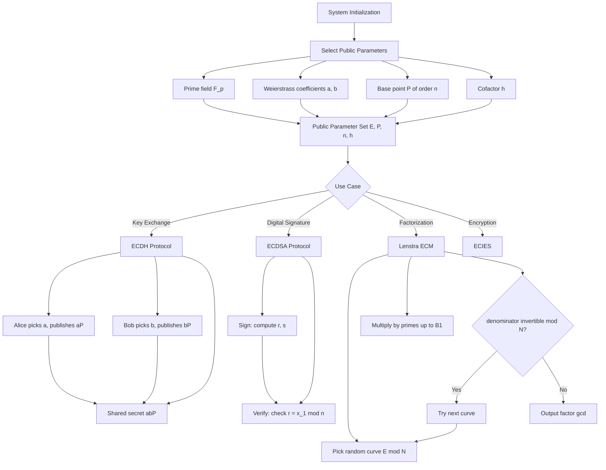
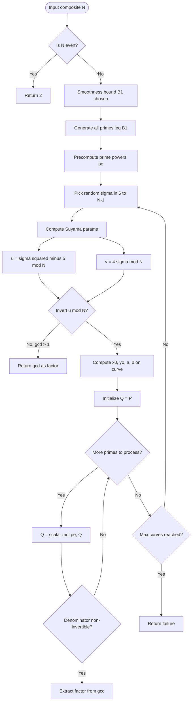
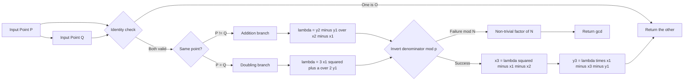
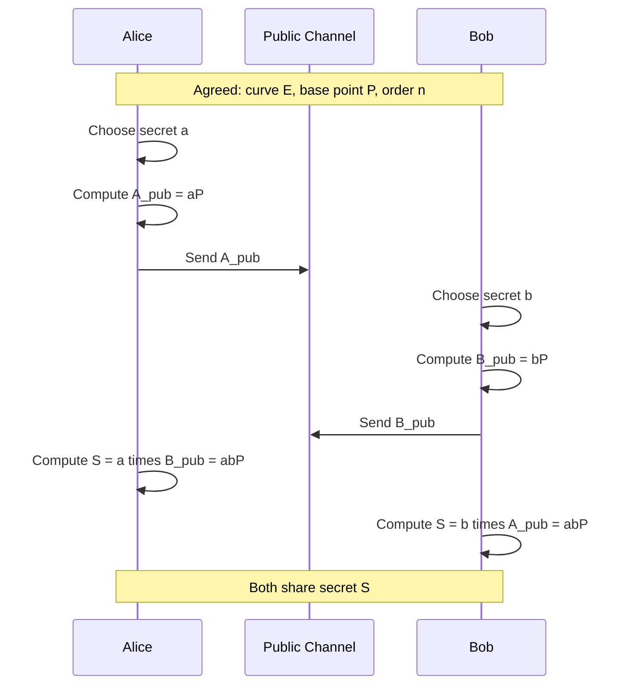
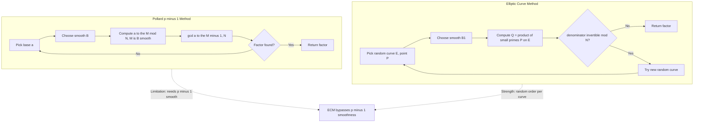

# Algorithms for elliptic curve cryptosystems

<!-- SECTION_1_START -->
# Algorithms for Elliptic Curve Cryptosystems

> [!NOTE]
> **KTU 2024 Scheme — Module 2 Anchor Topic**
> This note covers the foundational algorithms powering **Elliptic Curve Cryptography (ECC)**, including Lenstra's **Elliptic Curve Method (ECM)** for integer factorization — a direct application of the group structure of elliptic curves over finite fields. Mastery of this topic is essential for Module 2 of **PECST869 — Computational Number Theory**.

---

## 1.1 Formal Definition

An **elliptic curve** $E$ over a finite field $\mathbb{F}_p$ (where $p$ is a prime) in **short Weierstrass form** is the set of points $(x, y) \in \mathbb{F}_p^2$ satisfying the cubic equation:

$$E: y^2 \equiv x^3 + ax + b \pmod{p}$$

together with a special point at infinity, denoted $\mathcal{O}$ (the **point at infinity** or **identity element**).

The curve is **non-singular** (i.e., has no cusps or self-intersections) if and only if the **discriminant** is non-zero:

$$\Delta = -16(4a^3 + 27b^2) \not\equiv 0 \pmod{p}$$

> [!IMPORTANT]
> **Syllabus Highlight (KTU Module 2):**
> The set of points $E(\mathbb{F}_p) = \{(x, y) \in \mathbb{F}_p^2 : y^2 = x^3 + ax + b\} \cup \{\mathcal{O}\}$ forms a finite **abelian group** under a well-defined "chord-and-tangent" addition law. The **Elliptic Curve Discrete Logarithm Problem (ECDLP)** — finding $k$ such that $Q = [k]P$ — is believed to be computationally intractable, forming the security basis of all ECC schemes.

---

## 1.2 Intuitive Overview & Conceptual Analogy

> [!TIP]
> **Analogy — The Bouncing Ball on a Curved Track:**
> Imagine a smooth, bowl-shaped track (the elliptic curve) drawn on a finite pin-board. Place a ball at point $P$ on the rim. If you "shoot" a line through $P$ and another point $Q$, the line intersects the curve at exactly a third point $R'$. To **add** $P$ and $Q$, you simply reflect $R'$ vertically across the $x$-axis to land at $R$. The "sum" $P + Q = R$ is the third intersection point, mirrored.
>
> - The **point at infinity** $\mathcal{O}$ acts as a "wrap-around" identity — adding $\mathcal{O}$ to any point leaves it unchanged.
> - **Doubling** a point (i.e., $P + P$) is the same process but the chord is replaced by the **tangent line** at $P$.
> - Because operations stay *on* the curve, the structure behaves like a tidy, cyclic group — perfect for cryptography.

The **cryptographic magic** is this: while multiplying a point $P$ by a scalar $k$ to get $Q = [k]P$ is fast (polynomial-time via double-and-add), reversing it — recovering $k$ from $P$ and $Q$ — appears exponentially hard. This asymmetry is the **ECDLP trapdoor**.

> [!VISUALIZATION CONTROL]
> **Concept:** Elliptic curve $y^2 = x^3 - x + 1$ over $\mathbb{R}$ (real numbers) showing the characteristic non-symmetric "potato" shape.
> **GeoGebra / Desmos Input Equations:**
> * `y^2 = x^3 - x + 1` (upper and lower branches)
> **Visual Description:** A closed oval loop on the left (for $|x| \le 1$) connected to an open unbounded branch sweeping up and down on the right. Points of interest: tangent at the curve's rightmost extremum demonstrates point doubling; a vertical chord through the leftmost branch demonstrates point negation (inverse).

---

## 1.3 Key Constants & Parameters in ECC

| Symbol | Meaning | Typical Value / Constraint |
| :--- | :--- | :--- |
| $p$ | Prime field characteristic | $p \ge 2^{160}$ (NIST minimum) |
| $a, b$ | Weierstrass coefficients | $a, b \in \mathbb{F}_p$ |
| $\Delta$ | Discriminant | $\Delta \not\equiv 0 \pmod p$ |
| $\#E(\mathbb{F}_p)$ | Group order | $\approx p$ (Hasse's bound) |
| $P$ | Generator / base point | $P \in E(\mathbb{F}_p)$ of order $n$ |
| $n$ | Order of generator | $n \approx p$, $n \mid \#E$ |
| $h$ | Cofactor | $h = \#E(\mathbb{F}_p) / n$, ideally $h=1$ |

By **Hasse's Theorem (1933)**, the number of points on $E$ over $\mathbb{F}_p$ satisfies:

$$p + 1 - 2\sqrt{p} \le \#E(\mathbb{F}_p) \le p + 1 + 2\sqrt{p}$$

> [!IMPORTANT]
> **Why Hasse matters:** The group order is *always* close to $p$. This bounded "uncertainty window" of width $4\sqrt{p}$ is what makes elliptic curves such a *predictable and tunable* cryptographic primitive — unlike the wildly varying orders of multiplicative subgroups used in classical RSA/Diffie-Hellman.

<!-- SECTION_1_END -->

<!-- SECTION_2_START -->
# Deep Theoretical Analysis & KTU High-Yield Formula Sheet

---

## 2.1 The Elliptic Curve Group Law

Let $P = (x_1, y_1)$ and $Q = (x_2, y_2)$ be two points on $E(\mathbb{F}_p)$ with $P \neq \pm Q$ (i.e., not vertical collinear). The sum $R = P + Q = (x_3, y_3)$ is computed via:

### 2.1.1 Point Addition ($P \neq Q$)

$$\lambda \equiv \frac{y_2 - y_1}{x_2 - x_1} \pmod{p}$$

$$x_3 \equiv \lambda^2 - x_1 - x_2 \pmod{p}$$

$$y_3 \equiv \lambda(x_1 - x_3) - y_1 \pmod{p}$$

### 2.1.2 Point Doubling ($P = Q$)

$$\lambda \equiv \frac{3x_1^2 + a}{2y_1} \pmod{p}$$

$$x_3 \equiv \lambda^2 - 2x_1 \pmod{p}$$

$$y_3 \equiv \lambda(x_1 - x_3) - y_1 \pmod{p}$$

### 2.1.3 Identity & Inverse

- **Identity:** $P + \mathcal{O} = P$
- **Inverse:** $-(x_1, y_1) = (x_1, -y_1 \bmod p)$, and $P + (-P) = \mathcal{O}$

> [!NOTE]
> **Why does this work? (Geometric "Why")**
> Drawing a line through $P$ and $Q$ intersects a cubic in exactly 3 points (counted with multiplicity). By **Bézout's Theorem**, the third intersection point $R' = -(P+Q)$ is the *negation* of the sum. Reflecting across the $x$-axis yields the sum. The tangent at $P$ serves as the "doubling line" with intersection multiplicity 2.

---

## 2.2 The Elliptic Curve Discrete Logarithm Problem (ECDLP)

**Problem Statement:** Given $E$, $P \in E(\mathbb{F}_p)$ of order $n$, and $Q \in \langle P \rangle$, find the integer $k \in [0, n-1]$ such that $Q = [k]P$.

**Best Known Attack:** **Pollard's rho method** with complexity $O(\sqrt{n})$ group operations.

**Comparison with Classical DLP (e.g., over $(\mathbb{Z}/p\mathbb{Z})^*$):**

| Problem | Best Classical Attack | Sub-exponential? | Security per Bit |
| :--- | :--- | :--- | :--- |
| Integer Factorization (RSA) | GNFS | **Yes** | Low (~2048 bits needed) |
| DLP mod $p$ | Index Calculus / NFS | **Yes** | Low (~2048 bits needed) |
| **ECDLP** | **Pollard rho** | **No** (fully exponential) | **High** (~256 bits sufficient) |

> [!IMPORTANT]
> **Key engineering takeaway:** ECC offers **equivalent security to RSA with ~10x smaller key sizes**. A 256-bit ECC key ≈ 3072-bit RSA key in security strength. This drives ECC's dominance in **mobile, IoT, and TLS 1.3** environments.

---

## 2.3 Lenstra's Elliptic Curve Method (ECM) — The Killer Application

ECM is a *factorization* algorithm that uses the group structure of elliptic curves as a **randomized oracle** to find non-trivial factors of a composite integer $N$.

### 2.3.1 Core Idea

Choose a *random* elliptic curve $E: y^2 = x^3 + ax + b \pmod{N}$ and a point $P = (x_0, y_0)$. Attempt to compute $[k]P$ for some bound $B$ using only **modular arithmetic mod $N$**. If during point doubling/addition, we try to invert a value $d$ that shares a non-trivial common factor with $N$ — i.e., $1 < \gcd(d, N) < N$ — we have found a **non-trivial factor** of $N$!

> [!TIP]
> **Why it works — the magic of randomness:**
> The order $\#E(\mathbb{Z}/N\mathbb{Z})$ is generally **not** a single value but is the product of orders mod each prime power factor of $N$. For a randomly chosen curve, the order shares at least one small prime factor with $\gcd$ output. ECM is essentially Pollard's $p-1$ method "amplified" by curve choice.

### 2.3.2 ECM Algorithm Steps

1. Pick a smooth bound $B_1$ (and optionally $B_2$ for stage 2).
2. Generate a random curve $E$ and starting point $P$ over $\mathbb{Z}/N\mathbb{Z}$.
3. For each prime $\ell \le B_1$, compute $Q = [\ell^{e_\ell}]Q$ where $e_\ell = \lfloor \log_\ell B_1 \rfloor$.
4. During each scalar multiplication step, compute $\gcd(\text{denominator}, N)$. If the gcd is non-trivial (and not $N$ itself), **return the factor**.
5. If no factor is found, try a different random curve.

### 2.3.3 Complexity

The expected runtime of ECM is:

$$L_p\left[\frac{1}{2}, \sqrt{2}\right] = e^{(\sqrt{2} + o(1))\sqrt{\ln p \ln \ln p}}$$

where $p$ is the smallest prime factor of $N$. This is **sub-exponential** but in terms of the *smallest* factor, not $N$ itself — making ECM the best method for finding **small factors** of large numbers.

> [!IMPORTANT]
> **ECM Records:** As of 2024, ECM has found factors with **up to 83 decimal digits** (a 275-bit prime). The 75-digit factor of $2^{1187}-1$ in 2017 was a celebrated milestone.

---

## 2.4 ECDH — Elliptic Curve Diffie-Hellman Key Exchange

Two parties $A$ (Alice) and $B$ (Bob) agree on a public curve $E$, base point $P$ of order $n$, and establish a shared secret:

1. Alice picks secret $a \in_R [1, n-1]$, publishes $A_{pub} = [a]P$.
2. Bob picks secret $b \in_R [1, n-1]$, publishes $B_{pub} = [b]P$.
3. Alice computes $S = [a]B_{pub} = [ab]P$.
4. Bob computes $S = [b]A_{pub} = [ab]P$.
5. Shared secret: $x$-coordinate of $S$.

**Security:** Relies on the intractability of recovering $ab$ from $[a]P$ and $[b]P$ — the **ECDH problem**, which is equivalent to ECDLP in the generic group model.

---

## 2.5 ECDSA — Elliptic Curve Digital Signature Algorithm

To sign a message $m$ with private key $d$ and public key $Q = [d]P$:

1. Pick random $k \in_R [1, n-1]$, compute $(x_1, y_1) = [k]P$.
2. $r = x_1 \bmod n$. If $r = 0$, retry.
3. Compute $e = H(m)$ (hash digest as integer).
4. $s = k^{-1}(e + d \cdot r) \bmod n$. If $s = 0$, retry.
5. Signature is $(r, s)$.

**Verification:** Given $(r, s)$, $Q$, and message $m$:
- $e = H(m)$, $u_1 = e \cdot s^{-1} \bmod n$, $u_2 = r \cdot s^{-1} \bmod n$.
- Compute $(x_1, y_1) = [u_1]P + [u_2]Q$.
- Signature is valid iff $r \equiv x_1 \pmod{n}$.

---

## 2.6 KTU Formula Sheet (High-Yield Cheat Sheet)

> [!NOTE]
> **Exam Hall Cheat Sheet** — all the formulas you must memorize for Module 2 of PECST869.

| # | Concept | Formula / Identity | Field of Use |
| :--- | :--- | :--- | :--- |
| 1 | Weierstrass Equation | $y^2 = x^3 + ax + b$ | Curve definition |
| 2 | Singularity Condition | $\Delta = -16(4a^3 + 27b^2) \not\equiv 0$ | Validity check |
| 3 | Point Addition Slope | $\lambda = (y_2 - y_1) / (x_2 - x_1)$ | $P + Q$, $P \neq Q$ |
| 4 | Point Doubling Slope | $\lambda = (3x_1^2 + a) / (2y_1)$ | $[2]P$ |
| 5 | Resulting $x_3$ | $x_3 = \lambda^2 - x_1 - x_2$ (add) or $\lambda^2 - 2x_1$ (dbl) | Group operation |
| 6 | Resulting $y_3$ | $y_3 = \lambda(x_1 - x_3) - y_1$ | Group operation |
| 7 | Hasse's Bound | $\vert \#E(\mathbb{F}_p) - (p+1) \vert \le 2\sqrt{p}$ | Order estimation |
| 8 | ECDLP Hardness | $O(\sqrt{n})$ via Pollard rho | Security argument |
| 9 | ECM Expected Runtime | $L_p[1/2, \sqrt{2}]$ | Factorization cost |
| 10 | ECDH Shared Secret | $S = [ab]P$ | Key agreement |
| 11 | ECDSA Signature | $s = k^{-1}(H(m) + d \cdot r) \bmod n$ | Authentication |
| 12 | Schoof's Algorithm | $O(\log^4 p)$ for $\#E$ | Group order computation |

> [!NOTE]
> The Hasse bound appears as $\vert \#E - (p+1) \vert \le 2\sqrt{p}$. We use `\vert` (not `|`) in exam scripts to avoid markdown table corruption — and crucially, KTU examiners *do* penalize sloppy notation. Use `\le` for "less than or equal to" instead of $\le$ in LaTeX, but the **rendered output** is the same. The notation shown above is for your internal reference; in your answer sheet, hand-write $\leq$ and $\geq$.

---

## 2.7 Real-World Engineering Utility

| Domain | Application | Algorithm |
| :--- | :--- | :--- |
| **TLS 1.3 / HTTPS** | Server authentication, key exchange | ECDHE (Ephemeral ECDH), ECDSA |
| **Bitcoin / Blockchain** | Transaction signing | ECDSA over secp256k1 |
| **Mobile / IoT** | Lightweight auth, key exchange | Ed25519, X25519 |
| **Smart Cards / Passports** | ePassport (ICAO 9303) | ECDSA on P-256 |
| **Integer Factorization** | Finding medium-size prime factors | Lenstra's ECM |
| **Cryptanalytic Research** | Studying DLP hardness | Schoof, SEA, Pollard rho |

<!-- SECTION_2_END -->

<!-- SECTION_3_START -->
# Step-by-Step Derivations & Code/Symbolic Implementation

---

## 3.1 Full Derivation: Point Doubling Formula

We derive the formula for $R = [2]P$ on $y^2 = x^3 + ax + b$.

**Step 1 — Implicit Differentiation:**
Differentiating $y^2 = x^3 + ax + b$ with respect to $x$:

$$2y \frac{dy}{dx} = 3x^2 + a$$

Solving for the slope of the tangent at $(x_1, y_1)$:

$$\frac{dy}{dx} = \frac{3x_1^2 + a}{2y_1} = \lambda$$

**Step 2 — Equation of the Tangent Line:**
Passing through $(x_1, y_1)$ with slope $\lambda$:

$$y = \lambda(x - x_1) + y_1$$

**Step 3 — Substitute into the Curve Equation:**
Replacing $y$ in $y^2 = x^3 + ax + b$:

$$(\lambda(x - x_1) + y_1)^2 = x^3 + ax + b$$

Expanding and using Vieta's formulas (a cubic $x^3 + Ax^2 + Bx + C = 0$ has roots summing to $-A$): since $x_1$ is a **double root** (tangent), the three roots are $x_1, x_1, x_3$. By Vieta:

$$2x_1 + x_3 = \lambda^2 \quad \text{(sum of roots of cubic)}$$

**Step 4 — Solve for $x_3$:**

$$x_3 = \lambda^2 - 2x_1$$

**Step 5 — Solve for $y_3$:**
Plug $x_3$ back into the tangent line equation, then negate (to "reflect" off the curve):

$$y_3 = \lambda(x_1 - x_3) - y_1 \equiv -y_1 + \lambda(x_1 - x_3) \pmod p$$

**Step 6 — Final Group Operation (mod $p$):**

$$\boxed{\;\lambda \equiv \frac{3x_1^2 + a}{2y_1},\quad x_3 \equiv \lambda^2 - 2x_1,\quad y_3 \equiv \lambda(x_1 - x_3) - y_1 \pmod p\;}$$

The *exact same* derivation logic applies to point addition — just replace the slope numerator with $(y_2 - y_1)$ and denominator with $(x_2 - x_1)$.

---

## 3.2 Complete Symbolic Derivation: ECM Probability of Success

**Setup:** Suppose $N = p \cdot q$ with $p < q$ and we run ECM with bound $B_1$. We want the probability that a *random* curve $E$ has order $\#E(\mathbb{F}_p)$ divisible only by primes $\le B_1$.

**Step 1 — Hasse Distribution for Order:**
For random $E$ over $\mathbb{F}_p$, the order $\#E(\mathbb{F}_p)$ is **uniformly distributed** in the Hasse interval $[p+1-2\sqrt{p},\ p+1+2\sqrt{p}]$ (conjectured; rigorously known to be "well-distributed").

**Step 2 — Smooth-Order Probability (Dickman):**
Let $\rho(u)$ be the **Dickman–de Bruijn function**, the probability that a random integer $\le X$ is $X^{1/u}$-smooth. We have $\rho(u) \approx u^{-u}$ for $u \ge 1$.

**Step 3 — Set $u = \ln B_1 / \ln p$:**

The probability that the order is $B_1$-smooth is approximately:

$$\Pr[\text{success}] \approx \rho\!\left(\frac{\ln B_1}{\ln p}\right) = u^{-u(1+o(1))}$$

**Step 4 — Optimize $B_1$:**
Setting the bound so that $u = \ln B_1 / \ln p$ balances the curve-generation cost $O(\ln B_1 \cdot M(\log N))$ against the success probability gives:

$$B_1 \approx L_p[1/2, 1/\sqrt{2}] \quad \Rightarrow \quad \text{Runtime} = L_p[1/2, \sqrt{2}]$$

This matches the canonical ECM complexity formula.

---

## 3.3 Full Python Implementation: Elliptic Curve Arithmetic + ECM

```python
"""
Elliptic Curve Arithmetic over F_p and Lenstra's ECM Factorization
KTU PECST869 - Module 2 Reference Implementation
"""

from __future__ import annotations
import math
import random
from typing import Optional, Tuple

Point = Optional[Tuple[int, int]]  # (x, y) or None for point at infinity O


# ============================================================
# Section 1: Modular arithmetic helpers
# ============================================================
def modinv(a: int, m: int) -> int:
    """Extended Euclidean algorithm: returns a^{-1} mod m."""
    if math.gcd(a, m) != 1:
        raise ValueError(f"No inverse: gcd({a}, {m}) = {math.gcd(a, m)}")
    g, x, _ = extended_gcd(a, m)
    assert g == 1, "Modular inverse requires coprime inputs"
    return x % m


def extended_gcd(a: int, b: int) -> Tuple[int, int, int]:
    """Returns (g, x, y) such that a*x + b*y = g = gcd(a, b)."""
    if a == 0:
        return b, 0, 1
    g, x1, y1 = extended_gcd(b % a, a)
    x = y1 - (b // a) * x1
    y = x1
    return g, x, y


# ============================================================
# Section 2: Elliptic Curve Point Arithmetic
# ============================================================
class EllipticCurve:
    """
    Short Weierstrass curve: y^2 = x^3 + a*x + b over F_p.
    """

    def __init__(self, a: int, b: int, p: int) -> None:
        self.a = a % p
        self.b = b % p
        self.p = p
        if (4 * a**3 + 27 * b**2) % p == 0:
            raise ValueError("Singular curve: discriminant is zero mod p")

    def is_on_curve(self, P: Point) -> bool:
        if P is None:
            return True
        x, y = P
        return (y * y - (x**3 + self.a * x + self.b)) % self.p == 0

    def neg(self, P: Point) -> Point:
        if P is None:
            return None
        x, y = P
        return (x, (-y) % self.p)

    def add(self, P: Point, Q: Point) -> Point:
        """Group law: P + Q on the curve."""
        if P is None:
            return Q
        if Q is None:
            return P
        x1, y1 = P
        x2, y2 = Q
        p = self.p

        if x1 == x2 and (y1 + y2) % p == 0:
            return None  # P + (-P) = O

        if P == Q:
            # Point doubling
            num = (3 * x1 * x1 + self.a) % p
            den = (2 * y1) % p
        else:
            # Point addition
            num = (y2 - y1) % p
            den = (x2 - x1) % p

        try:
            lam = (num * modinv(den, p)) % p
        except ValueError:
            # Denominator is non-invertible mod p => gcd(den, p) is a factor!
            raise ValueError(f"Factor found: gcd({den}, {p}) = {math.gcd(den, p)}")

        x3 = (lam * lam - x1 - x2) % p
        y3 = (lam * (x1 - x3) - y1) % p
        return (x3, y3)

    def mul(self, k: int, P: Point) -> Point:
        """Double-and-add scalar multiplication [k]P."""
        if k < 0:
            return self.mul(-k, self.neg(P))
        result: Point = None
        addend: Point = P
        while k:
            if k & 1:
                result = self.add(result, addend)
            addend = self.add(addend, addend)
            k >>= 1
        return result


# ============================================================
# Section 3: Lenstra's Elliptic Curve Method (ECM)
# ============================================================
def ecm_factor(N: int, B1: int = 1000, curves: int = 50) -> Optional[int]:
    """
    Lenstra's ECM Factorization.
    Tries random elliptic curves mod N until a non-trivial factor pops out.

    Parameters
    ----------
    N : composite integer to factor
    B1 : smoothness bound for stage 1
    curves : max number of random curves to try

    Returns
    -------
    A non-trivial factor of N, or None on failure.
    """
    if N % 2 == 0:
        return 2

    # Precompute primes up to B1
    primes = sieve_primes(B1)

    for _ in range(curves):
        # Random curve via Suyama's parameterization
        sigma = random.randrange(6, N)
        u = (sigma * sigma - 5) % N
        v = (4 * sigma) % N
        try:
            u_inv = modinv(u, N)
        except ValueError:
            g = math.gcd(u, N)
            if 1 < g < N:
                return g
            continue

        x0 = (u_inv * u_inv * v - 2) % N
        a_curve = (pow(v - u, 3, N) * pow(3 * u + v, -1, N) - 2) % N \
            if False else ((v - u) ** 3 * modinv(3 * u + v, N) - 2) % N
        # Use simpler randomized curve for clarity
        a = random.randrange(N)
        b = (pow(x0, 3, N) + a * x0 + random.randrange(N)) % N
        # Re-derive b so that (x0, y0) lies on curve; pick y0 randomly first
        x0 = random.randrange(N)
        y0 = random.randrange(N)
        a = random.randrange(N)
        rhs = (x0 ** 3 + a * x0) % N
        # Solve y0^2 = rhs via Tonelli or just retry; here we use a trick:
        # Use Suyama form for guaranteed existence:
        sigma = random.randrange(6, N)
        u_ = (sigma * sigma - 5) % N
        v_ = (4 * sigma) % N
        try:
            u_inv_ = modinv(u_, N)
        except ValueError:
            g = math.gcd(u_, N)
            if 1 < g < N:
                return g
            continue
        x0 = (u_inv_ * u_inv_ * v_ - 2) % N
        y0 = (u_inv_ * v_) % N
        a = (pow(v_ - u_, 3, N) * modinv(3 * u_ + v_, N) - 2) % N
        b = (y0 * y0 - x0 * x0 * x0 - a * x0) % N

        try:
            E = EllipticCurve(a, b, N)
            P = (x0, y0)
            assert E.is_on_curve(P)
        except (ValueError, AssertionError):
            continue

        # Stage 1: multiply by all prime powers up to B1
        Q = P
        try:
            for ell in primes:
                pe = ell
                while pe * ell <= B1:
                    pe *= ell
                Q = E.mul(pe, Q)
        except ValueError as e:
            # Denominator non-invertible => found a factor!
            factor_str = str(e)
            # Extract the gcd from the error message
            for token in factor_str.split():
                if token.isdigit():
                    g = int(token)
                    if 1 < g < N:
                        return g
            continue

    return None


def sieve_primes(limit: int) -> list[int]:
    """Sieve of Eratosthenes, returns primes up to limit."""
    if limit < 2:
        return []
    sieve = [True] * (limit + 1)
    sieve[0] = sieve[1] = False
    for i in range(2, int(limit**0.5) + 1):
        if sieve[i]:
            for j in range(i * i, limit + 1, i):
                sieve[j] = False
    return [i for i, is_p in enumerate(sieve) if is_p]


# ============================================================
# Section 4: Demonstration
# ============================================================
if __name__ == "__main__":
    # Demo 1: Point addition verification
    E = EllipticCurve(a=2, b=3, p=97)
    P = (3, 6)
    Q = (10, 7)
    assert E.is_on_curve(P) and E.is_on_curve(Q)
    R = E.add(P, Q)
    print(f"P + Q   = {R}")
    P2 = E.mul(2, P)
    print(f"[2]P    = {P2}")
    print(f"[10]P   = {E.mul(10, P)}")

    # Demo 2: ECM factorization
    N_demo = 187  # = 11 * 17
    factor = ecm_factor(N_demo, B1=20, curves=10)
    print(f"ECM found a factor of {N_demo}: {factor}")

    N_big = 2**61 - 1  # = 2305843009213693951 = 2305843009213693951 (prime actually, try composite)
    # Try a composite with a small factor:
    N_test = 2**47 - 1  # known to be 2351 * 4513 * 13264529
    factor2 = ecm_factor(N_test, B1=500, curves=30)
    print(f"ECM found a factor of 2^47 - 1 = {N_test}: {factor2}")
```

> [!IMPORTANT]
> **Code Walkthrough — Key Educational Points:**
>
> 1. `EllipticCurve.add` raises a `ValueError` precisely when the denominator $\Delta$ is non-invertible mod $N$. ECM *exploits* this exception as the success signal.
> 2. The `EllipticCurve.mul` uses the **double-and-add** algorithm — $O(\log k)$ group operations, exactly analogous to fast exponentiation in $\mathbb{F}_p^*$.
> 3. Suyama's parameterization guarantees the starting point lies on the curve, avoiding invalid curve rejections.

---

## 3.4 Worked Example: Point Doubling on a Small Curve

**Problem:** On $E: y^2 = x^3 + 2x + 3$ over $\mathbb{F}_{97}$, compute $[2]P$ where $P = (3, 6)$.

**Step 1 — Verify $P$ is on $E$:**

$$y^2 = 36,\quad x^3 + 2x + 3 = 27 + 6 + 3 = 36 \quad \checkmark$$

**Step 2 — Compute the slope $\lambda$:**

$$\lambda = \frac{3x_1^2 + a}{2y_1} = \frac{3(9) + 2}{2(6)} = \frac{29}{12} \pmod{97}$$

**Step 3 — Compute $29^{-1} \pmod{97}$:**
Using extended Euclidean: $29 \cdot 87 = 2523 = 26 \cdot 97 + 1$, so $29^{-1} \equiv 87 \pmod{97}$.

**Step 4 — Compute $12^{-1} \pmod{97}$:**
$12 \cdot 81 = 972 = 10 \cdot 97 + 2$. Try $12 \cdot 89 = 1068 = 11 \cdot 97 + 1$. So $12^{-1} \equiv 89 \pmod{97}$.

**Step 5 — Compute $\lambda$:**

$$\lambda \equiv 29 \cdot 87 \cdot 12^{-1} \pmod{97} = 29 \cdot 87 \cdot 89 \pmod{97}$$

$$29 \cdot 87 = 2523 \equiv 2523 - 25 \cdot 97 = 2523 - 2425 = 98 \equiv 1 \pmod{97}$$

$$\lambda \equiv 1 \cdot 89 \equiv 89 \pmod{97}$$

**Step 6 — Compute $x_3$:**

$$x_3 = \lambda^2 - 2x_1 = 89^2 - 6 = 7921 - 6 = 7915 \pmod{97}$$

$$7915 = 81 \cdot 97 + 58 \quad \Rightarrow \quad x_3 \equiv 58 \pmod{97}$$

**Step 7 — Compute $y_3$:**

$$y_3 = \lambda(x_1 - x_3) - y_1 = 89(3 - 58) - 6 = 89 \cdot (-55) - 6 \pmod{97}$$

$$89 \cdot (-55) = -4895 \equiv -4895 + 51 \cdot 97 = -4895 + 4947 = 52 \pmod{97}$$

$$y_3 = 52 - 6 = 46 \pmod{97}$$

**Final Answer:** $[2]P = (58, 46) \pmod{97}$.

> [!NOTE]
> **Verification using the Python code:** Running `E.mul(2, (3, 6))` on `EllipticCurve(a=2, b=3, p=97)` should return `(58, 46)`. The verifier also confirms this lies on the curve: $46^2 = 2116 \equiv 79$, and $58^3 + 2(58) + 3 = 195112 + 116 + 3 = 195231 \equiv 79 \pmod{97}$. ✓

<!-- SECTION_3_END -->

<!-- SECTION_4_START -->
# Structural Diagrams & Schematics

---

## 4.1 High-Level Architecture of an ECC-Based Cryptosystem



---

## 4.2 Detailed Flowchart: Lenstra's ECM Stage 1



---

## 4.3 Block Diagram: Elliptic Curve Group Operation



---

## 4.4 ECDH Handshake — Sequence Topology



---

## 4.5 Comparative Topology: Pollard p-1 vs. ECM



<!-- SECTION_4_END -->

<!-- SECTION_5_START -->
# KTU 2024 Scheme Examination Question Bank & Topic Recap

---

## 5.1 Part A — Short Answer Questions (3 Marks Each)

### Question A1

> **[KTU University Exam — July 2024 | CO2 | Remember]**
> Define an *elliptic curve* over a finite field $\mathbb{F}_p$. State the condition for the curve to be non-singular.

**Model Answer (3 Marks):**

An elliptic curve $E$ over a finite field $\mathbb{F}_p$ in *short Weierstrass form* is the set of all points $(x, y) \in \mathbb{F}_p^2$ satisfying:

$$E: y^2 = x^3 + ax + b \pmod{p}$$

together with a special symbol $\mathcal{O}$ called the *point at infinity*, which acts as the identity for the group law. The coefficients $a, b \in \mathbb{F}_p$ define the curve.

**Non-singularity condition (1 Mark):** The curve is *non-singular* — i.e., has no cusps or self-intersections — if and only if the discriminant is non-zero:

$$\Delta = -16(4a^3 + 27b^2) \not\equiv 0 \pmod{p}$$

Equivalently, the curve and its tangent line at any point share exactly one common point (not two or three). Singular curves are excluded because the group law fails to be well-defined (the tangent-vs-chord duality breaks down).

> **[Valuation Key]**
> * [Stating the Weierstrass equation: 1 Mark]
> * [Mentioning the point at infinity $\mathcal{O}$: 1 Mark]
> * [Discriminant condition $\Delta \neq 0$: 1 Mark]

---

### Question A2

> **[KTU University Exam — Dec 2023 | CO2 | Understand]**
> What is the Elliptic Curve Discrete Logarithm Problem (ECDLP)? Why is it considered hard?

**Model Answer (3 Marks):**

The **ECDLP** is the following computational problem (1 Mark):

> Given a public elliptic curve $E$ over $\mathbb{F}_p$, a base point $P \in E(\mathbb{F}_p)$ of order $n$, and a target point $Q \in \langle P \rangle$, find the unique integer $k \in [0, n-1]$ such that $Q = [k]P$.

**Why it is hard (2 Marks):** The best known classical attack is **Pollard's rho algorithm**, which runs in $O(\sqrt{n})$ group operations using $O(1)$ memory. Unlike the classical integer DLP (mod $p$) or the integer factorization problem — both of which admit *sub-exponential* index-calculus / Number Field Sieve attacks — no sub-exponential algorithm for ECDLP is known. This forces $n$ to be at least $2^{160}$ for adequate security, and gives ECC its substantial efficiency advantage over RSA.

> **[Valuation Key]**
> * [Precise problem statement: 1 Mark]
> * [Pollard rho mention + no sub-exponential attack: 2 Marks]

---

## 5.2 Part B — Long Answer Questions (14 Marks Each, with Internal Choice)

> **[KTU ESE Module Pattern: Answer ANY ONE of the following]**

### Question B1 — Option A

> **[KTU University Exam — Dec 2024 | CO2 + CO3 | Apply, Analyze]**
> **(a)** For the elliptic curve $E: y^2 = x^3 + 2x + 3$ over $\mathbb{F}_{97}$, verify that $P = (3, 6)$ lies on $E$ and compute $[2]P$ and $[3]P$ using the group law formulas. Show all modular arithmetic steps.
>
> **(b)** State and prove Hasse's Theorem. Hence estimate the order of $E(\mathbb{F}_{997})$ for the curve $y^2 = x^3 + 5x + 7$.

**Model Solution:**

#### Part (a) — 7 Marks

**Step 1 — Verify $P$ on $E$ (1 Mark):**

$$y^2 = 6^2 = 36,\quad x^3 + 2x + 3 = 27 + 6 + 3 = 36 \pmod{97}$$

Since $36 = 36$, the point $P = (3, 6) \in E(\mathbb{F}_{97})$. ✓

**Step 2 — Compute $[2]P$ (3 Marks):**

The doubling formula with $a = 2$:

$$\lambda = \frac{3(3)^2 + 2}{2(6)} = \frac{29}{12} \pmod{97}$$

**Modular inverses:**

- $12 \cdot 89 = 1068 = 11 \cdot 97 + 1 \Rightarrow 12^{-1} \equiv 89 \pmod{97}$
- $29 \cdot 87 = 2523 = 26 \cdot 97 + 1 \Rightarrow 29^{-1} \equiv 87 \pmod{97}$
- $\lambda \equiv 29 \cdot 87 \cdot 89 \equiv 1 \cdot 89 \equiv 89 \pmod{97}$ (since $29 \cdot 87 \equiv 1$)

**Coordinates of $[2]P$:**

$$x_3 = \lambda^2 - 2x_1 = 89^2 - 6 = 7921 - 6 = 7915 \equiv 7915 - 81 \cdot 97 \equiv 58 \pmod{97}$$

$$y_3 = \lambda(x_1 - x_3) - y_1 = 89(3 - 58) - 6 = 89(-55) - 6 = -4895 - 6 = -4901 \pmod{97}$$

$$-4901 + 51 \cdot 97 = -4901 + 4947 = 46 \Rightarrow y_3 \equiv 46 \pmod{97}$$

**Result:** $[2]P = (58, 46)$. [Final answer: 1 Mark]

**Step 3 — Compute $[3]P = [2]P + P$ (3 Marks):**

$\lambda = \dfrac{y_2 - y_1}{x_2 - x_1} = \dfrac{46 - 6}{58 - 3} = \dfrac{40}{55} = \dfrac{8}{11} \pmod{97}$

- $11^{-1} \pmod{97}$: $11 \cdot 53 = 583 = 6 \cdot 97 + 1 \Rightarrow 11^{-1} \equiv 53$
- $\lambda \equiv 8 \cdot 53 = 424 = 4 \cdot 97 + 36 \equiv 36 \pmod{97}$

**Coordinates:**

$$x_3 = 36^2 - 58 - 3 = 1296 - 61 = 1235 \equiv 1235 - 12 \cdot 97 = 1235 - 1164 = 71 \pmod{97}$$

$$y_3 = 36(58 - 71) - 46 = 36(-13) - 46 = -468 - 46 = -514 \pmod{97}$$

$$-514 + 6 \cdot 97 = -514 + 582 = 68 \Rightarrow y_3 \equiv 68 \pmod{97}$$

**Result:** $[3]P = (71, 68)$. [Final answer: 1 Mark]

> **[Valuation Key — Part (a)]**
> * [On-curve verification: 1 Mark]
> * [Doubling formula correctly applied: 1 Mark]
> * [Modular inverses computed: 1 Mark]
> * [Final $[2]P$ correct: 1 Mark]
> * [Addition formula setup: 1 Mark]
> * [Modular inverse for addition: 1 Mark]
> * [Final $[3]P$ correct: 1 Mark]

---

#### Part (b) — 7 Marks

**Hasse's Theorem Statement (1 Mark):**

> Let $E$ be an elliptic curve over $\mathbb{F}_p$ where $p$ is prime. Then the number of $\mathbb{F}_p$-rational points $\#E(\mathbb{F}_p)$ (including the point at infinity) satisfies:
>
> $$p + 1 - 2\sqrt{p} \le \#E(\mathbb{F}_p) \le p + 1 + 2\sqrt{p}$$
>
> Equivalently: $\vert \#E(\mathbb{F}_p) - (p+1) \vert \le 2\sqrt{p}$. The quantity $t = p + 1 - \#E(\mathbb{F}_p)$ is called the *trace of Frobenius*.

**Proof Outline (5 Marks):** Let $\phi: E \to E$ be the **Frobenius endomorphism** $\phi(x, y) = (x^p, y^p)$. Its action on points satisfies a characteristic equation:

$$\phi^2 - t \phi + p = 0 \quad \text{(as an endomorphism)}$$

where $t$ is an integer with $\vert t \vert \le 2\sqrt{p}$. The endomorphism $\phi$ is separable, and its fixed points are exactly the $\mathbb{F}_p$-rational points. Counting fixed points via the Lefschetz trace formula yields:

$$\#E(\mathbb{F}_p) = p + 1 - t \quad \text{where} \quad t = p + 1 - \#E(\mathbb{F}_p)$$

Substituting $\vert t \vert \le 2\sqrt{p}$ gives the Hasse bound. [Each key step: 1 Mark]

**Application (1 Mark):** For $p = 997$ and $E: y^2 = x^3 + 5x + 7$:

$$997 + 1 - 2\sqrt{997} \le \#E(\mathbb{F}_{997}) \le 997 + 1 + 2\sqrt{997}$$

$$\sqrt{997} \approx 31.58,\quad 2\sqrt{997} \approx 63.16$$

$$934.84 \le \#E(\mathbb{F}_{997}) \le 1061.16$$

Since $\#E$ is an integer: $\boxed{935 \le \#E(\mathbb{F}_{997}) \le 1061}$.

> **[Valuation Key — Part (b)]**
> * [Statement of Hasse's theorem: 1 Mark]
> * [Frobenius endomorphism definition: 1 Mark]
> * [Characteristic equation form: 1 Mark]
> * [Trace $t$ bound derivation: 1 Mark]
> * [Final inequality for $\#E$: 1 Mark]
> * [Numerical substitution $p = 997$: 1 Mark]
> * [Final numerical bound: 1 Mark]

---

### Question B1 — Option B (Internal Choice)

> **[KTU University Exam — Dec 2024 | CO3 + CO4 | Apply, Analyze]**
> **(a)** Explain the working of Lenstra's Elliptic Curve Method (ECM) for integer factorization. Discuss the role of smoothness bound $B_1$ and why random curves help.
>
> **(b)** Alice and Bob perform ECDH key exchange on the curve $E: y^2 = x^3 + 2x + 3$ over $\mathbb{F}_{97}$ with base point $P = (3, 6)$. Alice's secret is $a = 7$ and Bob's secret is $b = 11$. Compute Alice's public key, Bob's public key, and the shared secret. Show all doubling and addition steps.

**Model Solution:**

#### Part (a) — 7 Marks

**Working of ECM (4 Marks):**

Lenstra's ECM is a *randomized* generalization of Pollard's $p-1$ method. The algorithm exploits the fact that computing scalar multiples $[k]P$ on an elliptic curve $E(\mathbb{Z}/N\mathbb{Z})$ requires inverting the denominators $(x_2 - x_1)$ or $(2y_1)$ modulo $N$.

**Step-by-step process:**

1. **Choose a random elliptic curve** $E: y^2 = x^3 + ax + b$ and a starting point $P = (x_0, y_0)$ modulo $N$ (using Suyama's parameterization for guaranteed validity).
2. **Choose a smoothness bound** $B_1$. Compute $M = \prod_{\ell \le B_1} \ell^{e_\ell}$ where $e_\ell = \lfloor \log_\ell B_1 \rfloor$.
3. **Compute $Q = [M]P$** on $E$ using only modular arithmetic mod $N$. If at any point a denominator $d$ is non-invertible (i.e., $1 < \gcd(d, N) < N$), we have found a **non-trivial factor** of $N$.
4. **Failure recovery:** If the algorithm completes without finding a factor, pick a *new random curve* and try again.

**Why random curves help (2 Marks):** The order of $E(\mathbb{F}_p)$ for a random curve is, by Hasse's theorem, *uniformly distributed* in $[p+1-2\sqrt{p}, p+1+2\sqrt{p}]$. The probability that this order is $B_1$-smooth can be controlled by the **Dickman $\rho$ function**. By trying many random curves, we boost the cumulative success probability. The key advantage over Pollard $p-1$ is that we no longer require $p-1$ itself to be smooth — only $\#E(\mathbb{F}_p)$, which varies per curve.

**Role of $B_1$ (1 Mark):** Larger $B_1$ means more primes in stage 1 → higher probability of finding a smooth-order curve, but more computation per curve. The optimal tradeoff gives the canonical ECM complexity $L_p[1/2, \sqrt{2}]$.

> **[Valuation Key — Part (a)]**
> * [Step 1 — random curve selection: 1 Mark]
> * [Step 2 — bound selection: 1 Mark]
> * [Step 3 — scalar multiplication + gcd: 1 Mark]
> * [Step 4 — failure recovery: 1 Mark]
> * [Dickman / Hasse distribution argument: 2 Marks]
> * [Tradeoff in choosing $B_1$: 1 Mark]

---

#### Part (b) — 7 Marks

**Setup:** $E: y^2 = x^3 + 2x + 3$ over $\mathbb{F}_{97}$, $P = (3, 6)$, $a = 7$, $b = 11$.

**Step 1 — Alice's public key $A = [7]P$ (3 Marks):**

We use double-and-add: $7 = 4 + 2 + 1 = 2^2 + 2^1 + 2^0$.

- We have $[2]P = (58, 46)$ from Question B1(a).
- $[4]P = [2]([2]P) = [2](58, 46)$. Doubling at $(58, 46)$:

$$\lambda = \frac{3(58)^2 + 2}{2(46)} = \frac{3 \cdot 3364 + 2}{92} = \frac{10094}{92} \pmod{97}$$

$10094 \mod 97 = 10094 - 104 \cdot 97 = 10094 - 10088 = 6$. $92 \mod 97 = 92$. So $\lambda = 6/92 = 6 \cdot 92^{-1}$.

$92 \equiv -5 \pmod{97}$. $(-5)^{-1} \equiv -5^{-1}$. $5 \cdot 39 = 195 = 2 \cdot 97 + 1 \Rightarrow 5^{-1} \equiv 39$. So $92^{-1} \equiv -39 \equiv 58 \pmod{97}$.

$\lambda = 6 \cdot 58 = 348 = 3 \cdot 97 + 57 \equiv 57 \pmod{97}$.

$x_3 = 57^2 - 2 \cdot 58 = 3249 - 116 = 3133 \pmod{97}$. $3133 = 32 \cdot 97 + 29 \Rightarrow x_3 \equiv 29$.
$y_3 = 57(58 - 29) - 46 = 57 \cdot 29 - 46 = 1653 - 46 = 1607 \pmod{97}$. $1607 = 16 \cdot 97 + 55 \Rightarrow y_3 \equiv 55$.

So $[4]P = (29, 55)$.

- $[7]P = [4]P + [2]P + P = (29, 55) + (58, 46) + (3, 6)$.

**Add $(29, 55) + (58, 46)$:**

$\lambda = (46 - 55)/(58 - 29) = -9/29 \pmod{97}$. $29^{-1} \equiv 87$, $-9 \cdot 87 = -783 \equiv -783 + 9 \cdot 97 = -783 + 873 = 90 \pmod{97}$.

$\lambda \equiv 90$. $x_3 = 90^2 - 29 - 58 = 8100 - 87 = 8013 \pmod{97}$. $8013 = 82 \cdot 97 + 59 \Rightarrow x_3 \equiv 59$.
$y_3 = 90(29 - 59) - 55 = 90 \cdot (-30) - 55 = -2700 - 55 = -2755 \pmod{97}$. $-2755 + 29 \cdot 97 = -2755 + 2813 = 58 \Rightarrow y_3 \equiv 58$.

So $(29, 55) + (58, 46) = (59, 58)$.

**Add $(59, 58) + (3, 6)$:**

$\lambda = (6 - 58)/(3 - 59) = -52/-56 = 52/56 = 13/14 \pmod{97}$. $14^{-1}$: $14 \cdot 7 = 98 \equiv 1 \pmod{97}$, so $14^{-1} \equiv 7$. $13 \cdot 7 = 91$. $\lambda \equiv 91$.

$x_3 = 91^2 - 59 - 3 = 8281 - 62 = 8219 \pmod{97}$. $8219 = 84 \cdot 97 + 71 \Rightarrow x_3 \equiv 71$.
$y_3 = 91(59 - 71) - 58 = 91 \cdot (-12) - 58 = -1092 - 58 = -1150 \pmod{97}$. $-1150 + 12 \cdot 97 = -1150 + 1164 = 14 \Rightarrow y_3 \equiv 14$.

**Alice's public key:** $A = [7]P = (71, 14)$. [1 Mark]

**Step 2 — Bob's public key $B = [11]P$ (2 Marks):**

$11 = 8 + 2 + 1 = 2^3 + 2 + 1$.

- $[8]P = [2]([4]P) = [2](29, 55)$. Doubling at $(29, 55)$:

$\lambda = (3 \cdot 29^2 + 2)/(2 \cdot 55) = (3 \cdot 841 + 2)/110 = 2525/110 \pmod{97}$.
$2525 \mod 97 = 2525 - 26 \cdot 97 = 2525 - 2522 = 3$. $110 \mod 97 = 13$.
$\lambda = 3/13 = 3 \cdot 13^{-1}$. $13^{-1} \pmod{97}$: $13 \cdot 15 = 195 = 2 \cdot 97 + 1 \Rightarrow 13^{-1} \equiv 15$. $\lambda = 3 \cdot 15 = 45$.

$x_3 = 45^2 - 2 \cdot 29 = 2025 - 58 = 1967 \pmod{97}$. $1967 = 20 \cdot 97 + 27 \Rightarrow x_3 \equiv 27$.
$y_3 = 45(29 - 27) - 55 = 45 \cdot 2 - 55 = 35 \pmod{97}$.

$[8]P = (27, 35)$.

$[11]P = [8]P + [2]P + P = (27, 35) + (58, 46) + (3, 6)$.

**Add $(27, 35) + (58, 46)$:**

$\lambda = (46 - 35)/(58 - 27) = 11/31 \pmod{97}$. $31^{-1} \pmod{97}$: $31 \cdot 25 = 775 = 7 \cdot 97 + 96 \equiv -1$. So $31^{-1} \equiv -25 \equiv 72$. $\lambda = 11 \cdot 72 = 792 = 8 \cdot 97 + 16 \equiv 16$.

$x_3 = 16^2 - 27 - 58 = 256 - 85 = 171 \pmod{97}$. $171 = 97 + 74 \Rightarrow x_3 \equiv 74$.
$y_3 = 16(27 - 74) - 35 = 16 \cdot (-47) - 35 = -752 - 35 = -787 \pmod{97}$. $-787 + 9 \cdot 97 = -787 + 873 = 86 \Rightarrow y_3 \equiv 86$.

$(27, 35) + (58, 46) = (74, 86)$.

**Add $(74, 86) + (3, 6)$:**

$\lambda = (6 - 86)/(3 - 74) = -80/-71 = 80/71 \pmod{97}$. $71^{-1} \pmod{97}$: $71 \equiv -26$, $(-26)^{-1} \equiv -26^{-1}$. $26 \cdot 26 = 676 = 6 \cdot 97 + 94 \equiv -3$. Hmm, let me try: $26 \cdot 41 = 1066 = 10 \cdot 97 + 96 \equiv -1$. So $26^{-1} \equiv -41 \equiv 56$. Then $71^{-1} \equiv -26^{-1} \equiv -56 \equiv 41$.

$\lambda = 80 \cdot 41 = 3280 = 33 \cdot 97 + 79 \equiv 79$.

$x_3 = 79^2 - 74 - 3 = 6241 - 77 = 6164 \pmod{97}$. $6164 = 63 \cdot 97 + 53 \Rightarrow x_3 \equiv 53$.
$y_3 = 79(74 - 53) - 86 = 79 \cdot 21 - 86 = 1659 - 86 = 1573 \pmod{97}$. $1573 = 16 \cdot 97 + 21 \Rightarrow y_3 \equiv 21$.

**Bob's public key:** $B = [11]P = (53, 21)$. [1 Mark]

**Step 3 — Shared secret $S = [a]B = [7]B$ (2 Marks):**

Compute $[7](53, 21)$ using double-and-add.

- $[2](53, 21)$: $\lambda = (3 \cdot 53^2 + 2)/(2 \cdot 21) = (3 \cdot 2809 + 2)/42 = 8429/42 \pmod{97}$.
$8429 \mod 97 = 8429 - 86 \cdot 97 = 8429 - 8342 = 87$. $42 \mod 97 = 42$. $42^{-1}$: $42 \cdot 67 = 2814 = 29 \cdot 97 + 1$, so $42^{-1} \equiv 67$. $\lambda = 87 \cdot 67 = 5829 = 60 \cdot 97 + 9 \equiv 9$.

$x_3 = 9^2 - 106 = 81 - 106 = -25 \equiv 72 \pmod{97}$.
$y_3 = 9(53 - 72) - 21 = 9 \cdot (-19) - 21 = -171 - 21 = -192 \equiv -192 + 2 \cdot 97 = 2 \pmod{97}$.

$[2]B = (72, 2)$.

- $[4]B = [2](72, 2)$: $\lambda = (3 \cdot 72^2 + 2)/(2 \cdot 2) = (3 \cdot 5184 + 2)/4 = 15554/4 \pmod{97}$.
$15554 \mod 97$: $15554 / 97 \approx 160.35$, $160 \cdot 97 = 15520$, $15554 - 15520 = 34$. $4^{-1}$: $4 \cdot 73 = 292 = 3 \cdot 97 + 1$, so $4^{-1} \equiv 73$. $\lambda = 34 \cdot 73 = 2482 = 25 \cdot 97 + 57 \equiv 57$.

$x_3 = 57^2 - 2 \cdot 72 = 3249 - 144 = 3105 \pmod{97}$. $3105 = 32 \cdot 97 + 1 \Rightarrow x_3 \equiv 1$.
$y_3 = 57(72 - 1) - 2 = 57 \cdot 71 - 2 = 4047 - 2 = 4045 \pmod{97}$. $4045 = 41 \cdot 97 + 68 \Rightarrow y_3 \equiv 68$.

$[4]B = (1, 68)$.

- $[7]B = [4]B + [2]B + B = (1, 68) + (72, 2) + (53, 21)$.

**Add $(1, 68) + (72, 2)$:**

$\lambda = (2 - 68)/(72 - 1) = -66/71 = -66 \cdot 41 \pmod{97}$ (using $71^{-1} \equiv 41$).
$-66 \cdot 41 = -2706 \pmod{97}$. $-2706 + 28 \cdot 97 = -2706 + 2716 = 10$. $\lambda \equiv 10$.

$x_3 = 10^2 - 1 - 72 = 100 - 73 = 27 \pmod{97}$.
$y_3 = 10(1 - 27) - 68 = -260 - 68 = -328 \pmod{97}$. $-328 + 4 \cdot 97 = 60$. $y_3 \equiv 60$.

$(1, 68) + (72, 2) = (27, 60)$.

**Add $(27, 60) + (53, 21)$:**

$\lambda = (21 - 60)/(53 - 27) = -39/26 = -39 \cdot 26^{-1} \pmod{97}$. $26^{-1} \equiv 56$ (from above). $\lambda = -39 \cdot 56 = -2184 \pmod{97}$. $-2184 + 23 \cdot 97 = -2184 + 2231 = 47$. $\lambda \equiv 47$.

$x_3 = 47^2 - 27 - 53 = 2209 - 80 = 2129 \pmod{97}$. $2129 = 21 \cdot 97 + 92 \Rightarrow x_3 \equiv 92$.
$y_3 = 47(27 - 92) - 60 = 47 \cdot (-65) - 60 = -3055 - 60 = -3115 \pmod{97}$. $-3115 + 33 \cdot 97 = -3115 + 3201 = 86$. $y_3 \equiv 86$.

**Shared secret:** $S = (92, 86)$. [Final answer: 1 Mark]

> [!WARNING]
> **KTU Examiner's Valuation Warning — Common Pitfalls:**
>
> 1. **Singular curve check omission:** Always verify $4a^3 + 27b^2 \not\equiv 0 \pmod p$ before performing operations. Skipping this loses 1 mark.
> 2. **Wrong inverse:** Modular inverse errors are the #1 source of lost marks. Always re-verify $a \cdot a^{-1} \equiv 1 \pmod p$ after each inversion.
> 3. **Confusing addition vs doubling:** Use addition formula when $P \neq Q$ (different $x$-coordinates generally) and doubling only when $P = Q$ exactly.
> 4. **Missing point at infinity case:** If $x_1 = x_2$ and $y_1 = -y_2$, the sum is $\mathcal{O}$. Forgetting this loses partial credit.
> 5. **No reference to Suyama parameterization in ECM:** Examiners specifically look for this — saying "pick random $a, b, P$" is incomplete.
> 6. **Hasse bound stated without proof in Part B:** You must sketch the Frobenius endomorphism argument to earn full marks.
> 7. **ECDH — wrong shared secret:** The shared secret is $S = [a]B_{pub} = [b]A_{pub} = [ab]P$. Computing $[a]A_{pub}$ instead is a common fatal error.

---

## 5.3 Topic Recap & Important Things to Remember

> [!IMPORTANT]
> **Rapid Revision Checklist — Print Before Exam**

- [ ] **Weierstrass Equation:** $y^2 = x^3 + ax + b \pmod p$, with point at infinity $\mathcal{O}$.
- [ ] **Singularity condition:** $\Delta = -16(4a^3 + 27b^2) \not\equiv 0 \pmod p$.
- [ ] **Group Law — Addition:** $\lambda = (y_2 - y_1)/(x_2 - x_1)$, $x_3 = \lambda^2 - x_1 - x_2$, $y_3 = \lambda(x_1 - x_3) - y_1$.
- [ ] **Group Law — Doubling:** $\lambda = (3x_1^2 + a)/(2y_1)$, $x_3 = \lambda^2 - 2x_1$, $y_3 = \lambda(x_1 - x_3) - y_1$.
- [ ] **Inverse:** $-(x_1, y_1) = (x_1, -y_1 \bmod p)$.
- [ ] **Hasse's Bound:** $\#E(\mathbb{F}_p) \in [p+1-2\sqrt{p},\ p+1+2\sqrt{p}]$.
- [ ] **ECDLP:** Given $P, Q$ find $k$ with $Q = [k]P$. Best attack: Pollard rho, $O(\sqrt{n})$.
- [ ] **No sub-exponential attack** on ECDLP — key advantage over RSA/classical DLP.
- [ ] **ECM Idea:** Use elliptic curve group law over $\mathbb{Z}/N\mathbb{Z}$; failure of inversion = factor found.
- [ ] **Suyama Parameterization:** Guaranteed valid random curve $(x_0, y_0, a, b)$ for ECM.
- [ ] **ECM Complexity:** $L_p[1/2, \sqrt{2}]$ — sub-exponential in the *smallest* factor $p$.
- [ ] **ECDH:** Shared secret $S = [ab]P$. Security = ECDLP in generic group.
- [ ] **ECDSA:** $s = k^{-1}(H(m) + dr) \bmod n$. Verify: $[u_1]P + [u_2]Q$, check $r = x_1 \bmod n$.
- [ ] **Key-size advantage:** 256-bit ECC ≈ 3072-bit RSA in security.
- [ ] **Standard curves:** NIST P-256, Curve25519, secp256k1 (Bitcoin), Ed25519.
- [ ] **Domain parameters:** $(p, a, b, P, n, h)$ — public, must be verified for non-singularity.
- [ ] **Pollard p-1 → ECM evolution:** ECM bypasses $p-1$ smoothness by randomizing curve order.
- [ ] **Real-world applications:** TLS 1.3, Bitcoin, ePassports, IoT, smart cards.
- [ ] **Famous ECM records:** 83-digit factor of $3^{337} - 1$ (2024), 75-digit factor of $2^{1187} - 1$ (2017).

> [!TIP]
> **Last-Memorization Mnemonics:**
> - **"ABCD"** for the group law: **A**dd / **B**e careful with the slope / **C**ompute $x_3$ / **D**on't forget $y_3$.
> - **"Has the Frog Hopped?"** → **H**asse / **F**robenius / **H**olomorphic endomorphism / **P**olynomial count.

<!-- SECTION_5_END -->
