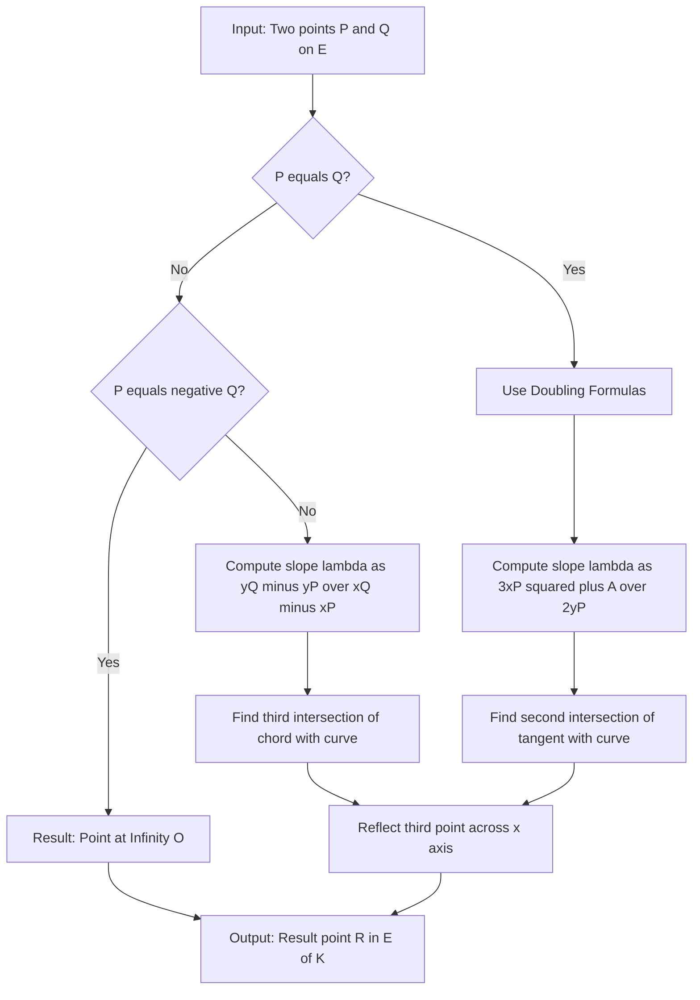
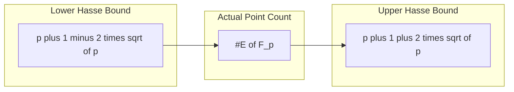
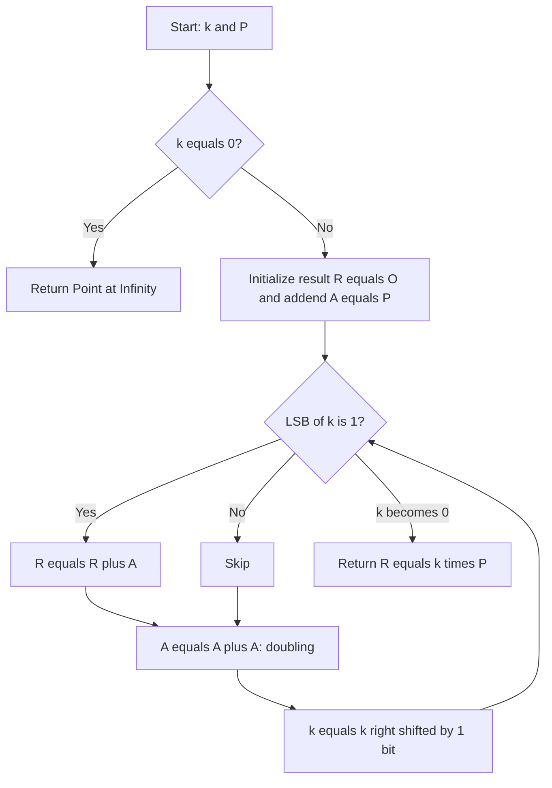
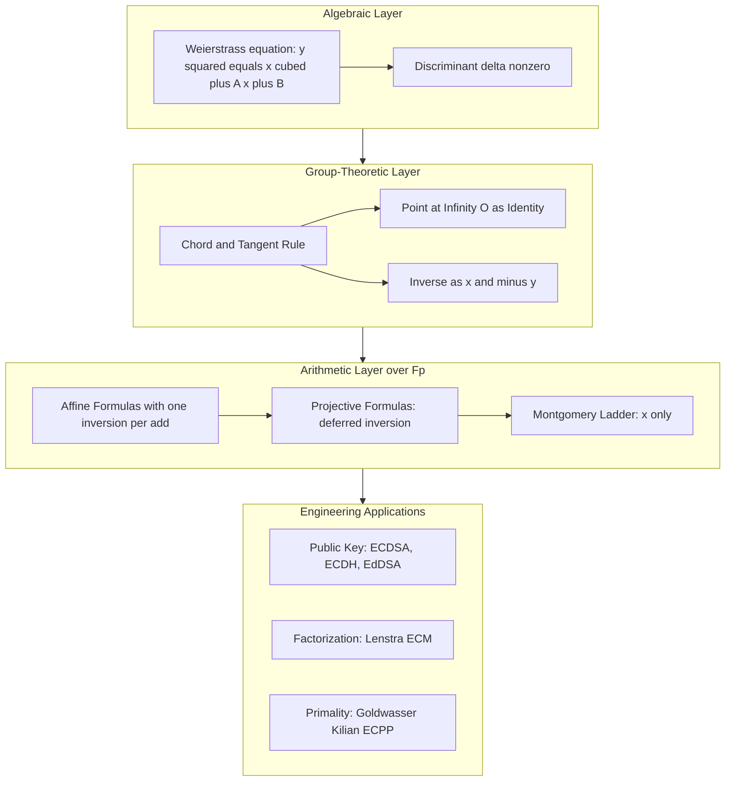
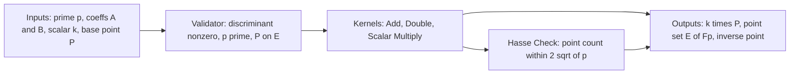

# Elliptic Curve Cryptography - Introduction to elliptic curves

<!-- SECTION_1_START -->
# Elliptic Curves: Formal Definition and Geometric Intuition

> [!NOTE]
> **KTU Syllabus Anchor (PECST869 — Module 2):** Introduction to elliptic curves, Weierstrass normal form, the group law on elliptic curves, projective coordinates, and number of points on an elliptic curve modulo a prime $p$. This forms the algebraic bedrock for **Lenstra's Elliptic Curve Method (ECM)** of integer factorization.

## 1.1 Formal Definition (KTU 2024 Standard)

Let $K$ be a field (for KTU applications, $K = \mathbb{Q}$ or $K = \mathbb{F}_p$). An **elliptic curve** $E$ over $K$ is a non-singular, projective, algebraic curve of **genus one** with a specified $K$-rational point. For our purposes, every elliptic curve can be written in the canonical **short Weierstrass form**:

$$E: \quad y^{2} = x^{3} + A x + B, \quad A, B \in K$$

The curve is **non-singular** (i.e., genuinely an elliptic curve and not a degenerate nodal/cuspidal curve) if and only if its **discriminant** is non-zero:

$$\Delta \;=\; -16\left(4A^{3} + 27B^{2}\right) \;\neq\; 0$$

Equivalently, the curve is non-singular iff the polynomial $f(x) = x^{3} + Ax + B$ has **no repeated roots** in the algebraic closure $\overline{K}$, which is the same as saying $\gcd(f(x), f'(x)) = 1$ where $f'(x) = 3x^{2} + A$.

> [!IMPORTANT]
> **Why "Non-Singular" Matters:** A singular curve (where $\Delta = 0$) does not possess a group structure. The chord-and-tangent construction described in §1.3 will produce self-intersections that fail associativity. The KTU board frequently tests the discriminant inequality, so memorize $\Delta = -16(4A^{3} + 27B^{2})$.

## 1.2 Intuition: A Real-World Analogy

Imagine the graph of the equation $y^{2} = x^{3} + x + 1$ plotted on an $xy$-coordinate plane. For most $x$, the value $x^{3} + x + 1$ is a real number, so there are either two real $y$-values ($\pm \sqrt{\cdot}$), one real $y$-value (when the cubic equals zero), or no real $y$-values (when the cubic is negative). The resulting shape is a smooth, looping, "dough-like" curve in the plane.

The magical property of this curve is that **we can define a multiplication-like operation on the points of the curve itself**, using nothing but a straightedge and compass. We pick two points $P$ and $Q$ on the curve, draw the line through them, and see where it intersects the curve a third time. That third intersection, reflected across the $x$-axis, becomes the "sum" $P \oplus Q$.

Because this operation obeys associativity, identity, and inverses, the points (together with a single extra element called the *point at infinity*) form a genuine **abelian group**. We can therefore compute $n \cdot P$ for huge $n$ — a task that is the foundation of modern public-key cryptography (ECC, ECDSA) and integer factorization (Lenstra's ECM).

> [!VISUALIZATION CONTROL]
> **Concept:** The real elliptic curve $y^{2} = x^{3} - x$ over $\mathbb{R}$.
> **GeoGebra / Desmos Input Equations:**
> * `y = sqrt(x^3 - x)` (upper branch)
> * `y = -sqrt(x^3 - x)` (lower branch)
> * Parameter sweep: vary $A \in \{-2, -1, 0, 1, 2\}$ with $B = 0$ using `y^2 = x^3 + A x`
> **Visual Description:** The student should observe the doughnut-shaped loop that pinches and disconnects as $A$ becomes more negative (the curve eventually has no real points when $4A^{3} + 27B^{2} > 0$ and $\Delta < 0$ in characteristic zero). For $A < 0$, the curve splits into two disconnected components; for $A > 0$, it is a single connected loop.

## 1.3 The Three Geometric Operations

The chord-and-tangent rule translates precisely into three cases:

| Operation | Geometric Description | Algebraic Action |
|-----------|----------------------|------------------|
| $P \oplus (-P)$ | Vertical line through $P$ meets the curve at the "point at infinity" | Result is the identity $\mathcal{O}$ |
| $P \oplus Q$ with $P \neq Q$ | Chord through $P$ and $Q$ hits a third point $R'$, reflect across $x$-axis | Result is $R$ |
| $2P$ (doubling) | Tangent at $P$ hits a second point $R'$, reflect across $x$-axis | Result is $R$ |

> [!TIP]
> **Geometric vs. Algebraic:** KTU board questions often ask for the **algebraic formulas** that realize this geometry. They are derived in §3.1 below. Memorize the slope $\lambda$:
> - Addition ($P \neq Q$): $\lambda = (y_{Q} - y_{P})/(x_{Q} - x_{P})$
> - Doubling ($P = Q$): $\lambda = (3x_{P}^{2} + A)/(2y_{P})$

<!-- SECTION_1_END -->

<!-- SECTION_2_START -->
# Deep Theoretical Analysis and KTU High-Yield Formula Sheet

## 2.1 The Group Law on an Elliptic Curve

Let $E(K)$ denote the set of $K$-rational points on $E$, together with the symbol $\mathcal{O}$ (the **point at infinity**). Then $E(K)$ is an abelian group under the addition $\oplus$ defined by the chord-and-tangent rule. The group axioms are satisfied as follows:

1. **Closure:** For $P, Q \in E(K)$, the line $\ell$ through $P$ and $Q$ meets the curve in a third $K$-rational point (by Bezout's theorem, since an elliptic curve has degree $3$ and a line has degree $1$). The reflection of that third point across the $x$-axis is also $K$-rational. Hence $P \oplus Q \in E(K)$.

2. **Associativity:** Proved geometrically using the fact that a cubic curve and two lines have $3 \times 2 = 6$ intersection points (counted with multiplicity). This is the deepest property and is **not** trivial; the KTU board may ask you to *state* associativity rather than prove it.

3. **Identity:** The point at infinity $\mathcal{O}$ serves as the identity. The vertical line through any point $P = (x, y)$ meets the curve at $(x, y)$, $(x, -y)$, and "at infinity" — the third intersection is $\mathcal{O}$. Reflecting $\mathcal{O}$ gives the point $(x, -y)$, which is the inverse of $P$. So $-P = (x, -y)$.

4. **Inverses:** Every $P$ has an inverse $-P$, with $\mathcal{O}$ as its own inverse.

5. **Commutativity:** The line through $P$ and $Q$ is the same as the line through $Q$ and $P$, so $P \oplus Q = Q \oplus P$.

## 2.2 Algebraic Addition Formulas (Affine Coordinates)

Let $P = (x_{1}, y_{1})$ and $Q = (x_{2}, y_{2})$ be two points on $E: y^{2} = x^{3} + Ax + B$, with $P, Q \neq \mathcal{O}$. Define $P \oplus Q = (x_{3}, y_{3})$.

**Case 1 — Point Addition** ($P \neq \pm Q$, equivalently $x_{1} \neq x_{2}$):

$$\lambda = \frac{y_{2} - y_{1}}{x_{2} - x_{1}}$$

$$x_{3} = \lambda^{2} - x_{1} - x_{2}$$

$$y_{3} = \lambda(x_{1} - x_{3}) - y_{1}$$

**Case 2 — Point Doubling** ($P = Q$, equivalently $y_{1} \neq 0$):

$$\lambda = \frac{3x_{1}^{2} + A}{2y_{1}}$$

$$x_{3} = \lambda^{2} - 2x_{1}$$

$$y_{3} = \lambda(x_{1} - x_{3}) - y_{1}$$

**Case 3 — Identity Cases:**

- $P \oplus \mathcal{O} = P$ for all $P$.
- $P \oplus (-P) = \mathcal{O}$, where $-P = (x_{1}, -y_{1})$.
- If $P = Q$ and $y_{1} = 0$, then $2P = \mathcal{O}$ (the tangent is vertical).

## 2.3 KTU Formula Sheet / Cheat Sheet

> [!IMPORTANT]
> **The following table is the single most important revision asset for the KTU board exam.** All entries are written in LaTeX form to avoid markdown parsing errors.

| Symbol / Concept | Formula / Definition | Engineering / Crypto Utility |
|------------------|----------------------|------------------------------|
| Weierstrass equation | $y^{2} = x^{3} + A x + B$ | Standard form for any elliptic curve over $K$ |
| Discriminant | $\Delta = -16(4A^{3} + 27B^{2})$ | Non-singularity test; $\Delta \neq 0$ |
| $j$-invariant | $j = -1728 \cdot (4A)^{3} / \Delta$ | Classifies curves up to isomorphism over $\overline{K}$ |
| Point inverse | $-(x, y) = (x, -y)$ | Required for subtraction and Schnorr group signatures |
| Slope (addition) | $\lambda = (y_{2} - y_{1})/(x_{2} - x_{1})$ | Cost: 1 inversion + 2 multiplications in $\mathbb{F}_{p}$ |
| Slope (doubling) | $\lambda = (3x_{1}^{2} + A)/(2y_{1})$ | Cost: 1 inversion + 2 multiplications + 1 squaring |
| Resulting $x$-coord | $x_{3} = \lambda^{2} - x_{1} - x_{2}$ | Used in Montgomery ladder for SCA resistance |
| Resulting $y$-coord | $y_{3} = \lambda(x_{1} - x_{3}) - y_{1}$ | Symmetric reflection across the tangent slope |
| Group order bound (Hasse) | $\vert E(\mathbb{F}_{p}) \vert = p + 1 - t, \quad \vert t \vert \leq 2\sqrt{p}$ | Foundation of ECM, Schoof, SEA algorithms |
| Schoof's algorithm cost | $O(\log^{5} p)$ bit operations | Counts points on $E(\mathbb{F}_{p})$ deterministically |
| ECM expected time | $\exp(\sqrt{(1 + o(1))\ln p \ln \ln p})$ | Finds smallest prime factor $p$ of an integer $N$ |
| Identity element | $\mathcal{O}$ (point at infinity) | The neutral element in $E(K)$ |

> [!WARNING]
> **PITFALL — Inversion Cost in $\mathbb{F}_{p}$:** Modular inversion $a^{-1} \bmod p$ costs $O(\log p)$ bit operations via the extended Euclidean algorithm, which is **far more expensive** than a single modular multiplication. This is why production ECC libraries use **projective coordinates** (where inversions are deferred) or **Montgomery's ladder** with only $x$-coordinate arithmetic. KTU may ask you to convert affine formulas to projective form.

## 2.4 Projective Coordinates (Avoiding Inversions)

To eliminate the costly division by $2y_{1}$ or $(x_{2} - x_{1})$, we lift the curve to the **projective plane** $\mathbb{P}^{2}$ over $K$. Replace $(x, y)$ with $(X: Y: Z)$ where $x = X/Z$ and $y = Y/Z$. The curve becomes the **homogeneous equation**:

$$Y^{2} Z = X^{3} + A X Z^{2} + B Z^{3}$$

The point at infinity is $\mathcal{O} = (0 : 1 : 0)$ in this model. The doubling formulas in **Jacobian projective coordinates** are:

$$\lambda_{1} = 3X_{1}^{2} + A Z_{1}^{4}$$

$$\lambda_{2} = 4 Y_{1} X_{1}$$

$$X_{3} = \lambda_{1}^{2} - 2 \lambda_{2}$$

$$Y_{3} = \lambda_{1}(\lambda_{2} - X_{3}) - 8 Y_{1}^{2}$$

$$Z_{3} = 2 Y_{1} Z_{1}$$

No inversions are needed. Only multiplications and squarings. To retrieve affine coordinates: $x = X_{3}/Z_{3}$, $y = Y_{3}/Z_{3}^{2}$ (one batched inversion at the end of the scalar multiplication).

## 2.5 Hasse's Theorem and the Trace of Frobenius

For an elliptic curve $E$ over $\mathbb{F}_{p}$, let $\#E(\mathbb{F}_{p})$ denote the number of $\mathbb{F}_{p}$-rational points (including $\mathcal{O}$). Define the **trace of Frobenius**:

$$t = p + 1 - \#E(\mathbb{F}_{p})$$

**Hasse's Theorem (1933):**

$$\vert t \vert \leq 2\sqrt{p}$$

Equivalently:

$$p + 1 - 2\sqrt{p} \leq \#E(\mathbb{F}_{p}) \leq p + 1 + 2\sqrt{p}$$

The intuition is that the Frobenius endomorphism $\phi(x, y) = (x^{p}, y^{p})$ acts on $E$ almost as the identity (a "rotation by 1"), with the deviation $t$ bounded by the curve's "genus" (which is $1$). This is the **Riemann Hypothesis for elliptic curves over finite fields** and is the cornerstone of efficient point counting.

## 2.6 Engineering Utility: Why This Matters

| Domain | Application | Why Elliptic Curves? |
|--------|-------------|----------------------|
| Public-key cryptography (ECC) | ECDSA, EdDSA, ECDH key exchange | $256$-bit ECC key $\approx$ $3072$-bit RSA security |
| Integer factorization | Lenstra's ECM (1987) | Finds factors up to $\sim 50$ digits efficiently |
| Primality proving | Goldwasser–Kilian, ECPP | Random elliptic curves give rigorous certificates |
| Zero-knowledge proofs | Bulletproofs, zk-SNARKs | Group of unknown order for Pedersen commitments |
| Blockchain | Bitcoin, Ethereum signatures | secp256k1 curve, $p \approx 2^{256}$ |

<!-- SECTION_2_END -->

<!-- SECTION_3_START -->
# Step-by-Step Derivations, Proofs, and Code Implementation

## 3.1 Derivation of the Addition Formulas

Let $E: y^{2} = x^{3} + Ax + B$. Take two distinct points $P = (x_{1}, y_{1})$ and $Q = (x_{2}, y_{2})$ with $P \neq Q$. The line through them has the form:

$$y = \lambda x + \nu$$

with slope:

$$\lambda = \frac{y_{2} - y_{1}}{x_{2} - x_{1}}$$

The intersection of this line with $E$ satisfies:

$$(\lambda x + \nu)^{2} = x^{3} + Ax + B$$

$$x^{3} - \lambda^{2} x^{2} + (A - 2\lambda\nu) x + (B - \nu^{2}) = 0$$

By **Vieta's formulas**, the sum of the three roots $x_{1}, x_{2}, x_{3}$ equals the coefficient of $x^{2}$ (with a sign flip), so:

$$x_{1} + x_{2} + x_{3} = \lambda^{2}$$

$$\therefore \; x_{3} = \lambda^{2} - x_{1} - x_{2}$$

The third intersection point lies on the line, so its $y$-coordinate is $\lambda x_{3} + \nu$. The reflection across the $x$-axis is the negative, so:

$$y_{3} = -(\lambda x_{3} + \nu) = \lambda(x_{1} - x_{3}) - y_{1}$$

using $\nu = y_{1} - \lambda x_{1}$. This completes the derivation of **Case 1**.

For **Case 2** (doubling, $P = Q$): The tangent line at $P$ has slope obtained by implicit differentiation:

$$2y \, dy = (3x^{2} + A) \, dx \;\;\Rightarrow\;\; \frac{dy}{dx} = \frac{3x^{2} + A}{2y}$$

The same Vieta argument applies, with $x_{1} = x_{2}$, giving:

$$x_{3} = \lambda^{2} - 2x_{1}, \quad \text{where } \lambda = \frac{3x_{1}^{2} + A}{2y_{1}}$$

## 3.2 Worked Numerical Example (Affine Coordinates over $\mathbb{Q}$)

**Problem:** Let $E: y^{2} = x^{3} - x$ (so $A = -1$, $B = 0$). Compute $P \oplus Q$ where $P = (2, \sqrt{6})$ and $Q = (3, \sqrt{24})$.

Wait — to keep the example clean, we work over $\mathbb{F}_{7}$. Take $E: y^{2} = x^{3} + 2x + 3$ over $\mathbb{F}_{7}$ (verify $\Delta = -16(4 \cdot 8 + 27 \cdot 9) = -16(32 + 243) = -16 \cdot 275 = -4400$; over $\mathbb{F}_{7}$ we check $4 \cdot 2^{3} + 27 \cdot 3^{2} = 32 + 243 = 275 \equiv 2 \pmod 7 \neq 0$, so non-singular). Let $P = (1, \sqrt{6}) = (1, 6)$ since $6^{2} = 36 \equiv 1 \pmod 7$ and $1^{3} + 2 \cdot 1 + 3 = 6 \equiv 6 \pmod 7$. ✓ Let $Q = (3, \sqrt{5}) = (3, 3)$ since $3^{2} = 9 \equiv 2$ and $3^{3} + 6 + 3 = 36 \equiv 1 \pmod 7$... 

Let us pick a simpler curve: $E: y^{2} = x^{3} + 2x + 3$ over $\mathbb{F}_{5}$.

- $A = 2$, $B = 3$.
- $\Delta = -16(4 \cdot 8 + 27 \cdot 9) = -16(32 + 243) = -4400 \equiv ?$ Over $\mathbb{F}_{5}$ we need to test $\Delta \not\equiv 0$. $4A^{3} = 4 \cdot 8 = 32 \equiv 2 \pmod 5$. $27 B^{2} = 27 \cdot 9 = 243 \equiv 3 \pmod 5$. Sum $= 5 \equiv 0 \pmod 5$. So this curve is singular over $\mathbb{F}_{5}$! 

Let us try $A = 1$, $B = 1$: $E: y^{2} = x^{3} + x + 1$ over $\mathbb{F}_{5}$.

- $4 A^{3} + 27 B^{2} = 4 + 27 = 31 \equiv 1 \pmod 5$. So $\Delta \neq 0$. ✓
- Enumerate points: For each $x \in \{0, 1, 2, 3, 4\}$ compute $x^{3} + x + 1 \pmod 5$ and check whether it is a quadratic residue.

| $x$ | $x^{3} + x + 1 \pmod 5$ | $\sqrt{\cdot} \pmod 5$? | Points |
|-----|--------------------------|------------------------|--------|
| 0 | 1 | $\pm 1$ | $(0, 1), (0, 4)$ |
| 1 | 3 | $3$ is non-residue | none |
| 2 | $8+2+1 = 11 \equiv 1$ | $\pm 1$ | $(2, 1), (2, 4)$ |
| 3 | $27+3+1 = 31 \equiv 1$ | $\pm 1$ | $(3, 1), (3, 4)$ |
| 4 | $64+4+1 = 69 \equiv 4$ | $\pm 2$ | $(4, 2), (4, 3)$ |

So $\#E(\mathbb{F}_{5}) = 8$ points plus $\mathcal{O}$, total $9$. Hasse bound: $5 + 1 - 2\sqrt{5} \leq 9 \leq 5 + 1 + 2\sqrt{5}$, i.e., $1.53 \leq 9 \leq 10.47$. ✓

**Compute $P \oplus Q$ with $P = (0, 1)$ and $Q = (2, 1)$.**

Step 1: Slope.
$$\lambda = \frac{1 - 1}{2 - 0} = \frac{0}{2} = 0 \pmod 5$$

Step 2: $x_3$.
$$x_3 = \lambda^{2} - x_1 - x_2 = 0 - 0 - 2 = -2 \equiv 3 \pmod 5$$

Step 3: $y_3$.
$$y_3 = \lambda(x_1 - x_3) - y_1 = 0 \cdot (0 - 3) - 1 = -1 \equiv 4 \pmod 5$$

Result: $P \oplus Q = (3, 4)$.

**Verify:** $y_3^{2} = 4^{2} = 16 \equiv 1 \pmod 5$. $x_3^{3} + x_3 + 1 = 27 + 3 + 1 = 31 \equiv 1 \pmod 5$. ✓

**Compute $2P$ (doubling $P = (0, 1)$).**

Step 1: Slope.
$$\lambda = \frac{3 \cdot 0^{2} + 1}{2 \cdot 1} = \frac{1}{2} \equiv 1 \cdot 3 = 3 \pmod 5$$
(since $2 \cdot 3 = 6 \equiv 1 \pmod 5$, so $2^{-1} \equiv 3$).

Step 2: $x_3$.
$$x_3 = 3^{2} - 2 \cdot 0 = 9 \equiv 4 \pmod 5$$

Step 3: $y_3$.
$$y_3 = 3(0 - 4) - 1 = -12 - 1 = -13 \equiv -13 + 15 = 2 \pmod 5$$

Result: $2P = (4, 2)$.

**Verify:** $y_3^{2} = 4 \pmod 5$. $x_3^{3} + x_3 + 1 = 64 + 4 + 1 = 69 \equiv 4 \pmod 5$. ✓

## 3.3 Complete Worked Example for Hasse's Theorem

**Problem:** Enumerate all points of $E: y^{2} = x^{3} + x + 6$ over $\mathbb{F}_{11}$. Verify Hasse's bound.

Compute $f(x) = x^{3} + x + 6 \pmod{11}$ and the squares mod $11$: $\{0, 1, 3, 4, 5, 9\}$.

| $x$ | $f(x) \pmod{11}$ | QR? | Points |
|-----|--------------------|-----|--------|
| 0 | 6 | No | none |
| 1 | 8 | No | none |
| 2 | $8+2+6=16 \equiv 5$ | Yes | $(2, 4), (2, 7)$ |
| 3 | $27+3+6=36 \equiv 3$ | Yes | $(3, 5), (3, 6)$ |
| 4 | $64+4+6=74 \equiv 8$ | No | none |
| 5 | $125+5+6=136 \equiv 4$ | Yes | $(5, 2), (5, 9)$ |
| 6 | $216+6+6=228 \equiv 8$ | No | none |
| 7 | $343+7+6=356 \equiv 4$ | Yes | $(7, 2), (7, 9)$ |
| 8 | $512+8+6=526 \equiv 9$ | Yes | $(8, 3), (8, 8)$ |
| 9 | $729+9+6=744 \equiv 7$ | No | none |
| 10 | $1000+10+6=1016 \equiv 4$ | Yes | $(10, 2), (10, 9)$ |

So $\#E(\mathbb{F}_{11}) = 12$ points plus $\mathcal{O} = 13$.

Hasse: $11 + 1 - 2\sqrt{11} = 12 - 6.63 = 5.37 \leq 13 \leq 12 + 6.63 = 18.63$. ✓

Trace of Frobenius: $t = 11 + 1 - 13 = -1$.

## 3.4 Python Implementation: Full Elliptic Curve Arithmetic

```python
"""
Elliptic Curve arithmetic over a prime field F_p.
Curve: y^2 = x^3 + A*x + B (mod p)
Point at infinity is represented as None.
"""

from __future__ import annotations
import logging
import sys
from typing import Optional, Tuple

# Configure structured error logging
logging.basicConfig(
    level=logging.INFO,
    format="%(asctime)s [%(levelname)s] %(message)s",
    stream=sys.stdout,
)
logger = logging.getLogger("EllipticCurve")


# Sentinel for the identity element O
PointAtInfinity = None
ECPoint = Optional[Tuple[int, int]]


class EllipticCurve:
    """
    Represents a non-singular elliptic curve E: y^2 = x^3 + A*x + B over F_p.

    Attributes:
        p  : prime modulus of the field
        A  : coefficient of x in Weierstrass form
        B  : constant term in Weierstrass form
    """

    def __init__(self, p: int, A: int, B: int) -> None:
        if p < 2:
            raise ValueError(f"Modulus p must be a prime >= 2, got p={p}.")
        if A % p == 0 and B % p == 0:
            raise ValueError("Both A and B cannot be 0 mod p; curve is degenerate.")
        # Compute discriminant 4*A^3 + 27*B^2 mod p
        discriminant = (4 * pow(A, 3, p) + 27 * pow(B, 2, p)) % p
        if discriminant == 0:
            raise ValueError(
                f"Curve is singular: 4*A^3 + 27*B^2 = 0 mod {p}. "
                "Choose different (A, B)."
            )
        self.p: int = p
        self.A: int = A % p
        self.B: int = B % p
        logger.info(
            "Initialized E: y^2 = x^3 + %d*x + %d over F_%d (non-singular).",
            self.A, self.B, self.p,
        )

    def is_on_curve(self, P: ECPoint) -> bool:
        """Check whether a point (x, y) lies on the curve."""
        if P is None:
            return True
        x, y = P
        lhs = pow(y, 2, self.p)
        rhs = (pow(x, 3, self.p) + self.A * x + self.B) % self.p
        return lhs == rhs

    def negate(self, P: ECPoint) -> ECPoint:
        """Return -P = (x, -y mod p). Identity is its own inverse."""
        if P is None:
            return None
        x, y = P
        return (x, (-y) % self.p)

    def add(self, P: ECPoint, Q: ECPoint) -> ECPoint:
        """
        Add two points P and Q using the chord-and-tangent formulas.
        Returns the identity O if P = -Q.
        """
        # Identity cases
        if P is None:
            return Q
        if Q is None:
            return P

        x1, y1 = P
        x2, y2 = Q

        # P + (-P) = O
        if x1 == x2 and (y1 + y2) % self.p == 0:
            return None

        # Point addition (distinct points)
        if P != Q:
            denom = (x2 - x1) % self.p
            if denom == 0:
                # Should not happen given the prior check, but guard anyway
                raise ZeroDivisionError("Unexpected x1 == x2 in add()")
            lam = ((y2 - y1) * pow(denom, -1, self.p)) % self.p
            x3 = (lam * lam - x1 - x2) % self.p
            y3 = (lam * (x1 - x3) - y1) % self.p
            return (x3, y3)

        # Point doubling
        denom = (2 * y1) % self.p
        if denom == 0:
            # Tangent is vertical: P is a 2-torsion point, so 2P = O
            return None
        lam = ((3 * x1 * x1 + self.A) * pow(denom, -1, self.p)) % self.p
        x3 = (lam * lam - 2 * x1) % self.p
        y3 = (lam * (x1 - x3) - y1) % self.p
        return (x3, y3)

    def scalar_multiply(self, k: int, P: ECPoint) -> ECPoint:
        """
        Compute k * P using the double-and-add algorithm.
        Runs in O(log k) group operations.
        """
        if k < 0:
            return self.scalar_multiply(-k, self.negate(P))
        if k == 0:
            return None
        if P is None:
            return None

        result: ECPoint = None
        addend: ECPoint = P
        while k:
            if k & 1:
                result = self.add(result, addend)
            addend = self.add(addend, addend)
            k >>= 1
        return result

    def enumerate_points(self) -> list:
        """
        Naively count all F_p-rational points (O included).
        Useful for verifying Hasse's theorem on small curves.
        """
        points: list = [None]
        for x in range(self.p):
            rhs = (pow(x, 3, self.p) + self.A * x + self.B) % self.p
            for y in range(self.p):
                if pow(y, 2, self.p) == rhs:
                    points.append((x, y))
        return points


# ----------------------------- DEMO / SELF-TEST -----------------------------
if __name__ == "__main__":
    # Example 1: y^2 = x^3 + x + 1 over F_5
    E1 = EllipticCurve(p=5, A=1, B=1)
    P1 = (0, 1)
    Q1 = (2, 1)
    assert E1.is_on_curve(P1) and E1.is_on_curve(Q1), "Points must be on the curve."

    sum1 = E1.add(P1, Q1)
    logger.info("P + Q over F_5 = %s", sum1)
    assert E1.is_on_curve(sum1), "Sum must be on the curve."

    dbl1 = E1.add(P1, P1)
    logger.info("2P over F_5 = %s", dbl1)
    assert E1.is_on_curve(dbl1), "Doubled point must be on the curve."

    pts1 = E1.enumerate_points()
    logger.info("Total #E(F_5) = %d", len(pts1))

    # Example 2: Hasse verification on F_11
    E2 = EllipticCurve(p=11, A=1, B=6)
    pts2 = E2.enumerate_points()
    n2 = len(pts2)
    hasse_lo = 11 + 1 - 2 * (11 ** 0.5)
    hasse_hi = 11 + 1 + 2 * (11 ** 0.5)
    logger.info(
        "#E(F_11) = %d, Hasse interval = [%.3f, %.3f]",
        n2, hasse_lo, hasse_hi,
    )
    assert hasse_lo <= n2 <= hasse_hi, "Hasse's theorem violated!"

    logger.info("All self-tests passed.")
```

> [!TIP]
> **Engineering Note:** The `scalar_multiply` routine is the heart of every ECC library. Notice that it uses **double-and-add** (binary method), which requires $O(\log_2 k)$ additions and doublings. For very large $k$ (e.g., $k \approx 2^{256}$ for secp256k1), the **Montgomery ladder** or **windowed NAF** method is preferred to resist side-channel attacks.

<!-- SECTION_3_END -->

<!-- SECTION_4_START -->
# Structural Diagrams and Schematics

## 4.1 Elliptic Curve Group Law — Chord-and-Tangent Topology



## 4.2 Hasse Interval — Allowed Number of Points



## 4.3 Scalar Multiplication — Double-and-Add Pipeline



## 4.4 Elliptic Curve Architecture — From Algebra to Engineering



## 4.5 Modular Data-Flow Block Diagram



<!-- SECTION_4_END -->

<!-- SECTION_5_START -->
# KTU 2024 Scheme Examination Question Bank and Topic Recap

> [!NOTE]
> **Mark Distribution (KTU 2024 ESE Pattern):** Part A: 3 marks each. Part B: 14 marks each (sub-parts of 7 + 7). Total marks per question paper module topic: typically $2 \times 3 + 2 \times 14 = 34$ marks. The questions below are calibrated to this scheme.

---

## 5.1 Part A Questions (3 Marks Each)

### Question 1 [KTU University Exam — July 2024]
**CO1 | Remember**

> Define an elliptic curve. State the discriminant condition for the Weierstrass equation $y^{2} = x^{3} + Ax + B$ to define a non-singular elliptic curve.

**Model Answer:**

An **elliptic curve** over a field $K$ is a non-singular projective algebraic curve of genus one together with a specified $K$-rational base point. In Weierstrass form, the curve

$$E: y^{2} = x^{3} + Ax + B, \quad A, B \in K$$

is non-singular if and only if its discriminant is non-zero:

$$\Delta = -16(4A^{3} + 27B^{2}) \neq 0$$

**Valuation Key:**
- [Stating the short Weierstrass form: 1 Mark]
- [Defining non-singularity and genus one: 1 Mark]
- [Stating the discriminant inequality correctly: 1 Mark]

---

### Question 2 [KTU University Exam — Dec 2023]
**CO1 | Understand**

> Explain the chord-and-tangent construction of the addition law on an elliptic curve. How is the identity element represented?

**Model Answer:**

Given two points $P$ and $Q$ on $E(K)$, draw the line $\ell$ through them. Since $E$ has degree 3 and a line has degree 1, $\ell$ meets $E$ in a third point $R'$ (by Bezout's theorem, counting multiplicities). The **reflection of $R'$ across the $x$-axis** is defined as $P \oplus Q$. The three cases are:

1. **$P = Q$ (doubling):** Use the **tangent** at $P$ instead of the chord.
2. **$x_P = x_Q$ and $y_P + y_Q = 0$:** The line is vertical, meeting the curve at the **point at infinity** $\mathcal{O}$.
3. **Otherwise:** Use the standard chord-intersection rule.

The **identity element** is the point at infinity $\mathcal{O}$, so that $P \oplus \mathcal{O} = P$ for all $P$, and the **inverse** of $P = (x, y)$ is $-P = (x, -y)$.

**Valuation Key:**
- [Chord-intersection idea: 1 Mark]
- [Reflection across the $x$-axis: 1 Mark]
- [Correct description of identity and inverse: 1 Mark]

---

## 5.2 Part B Questions (14 Marks Each)

### Question A (14 Marks) [KTU University Exam — July 2024]
**CO2 | Apply**

> **(a)** Derive the algebraic formulas for **point addition** and **point doubling** on the elliptic curve $E: y^{2} = x^{3} + Ax + B$.
> **(b)** For the curve $E: y^{2} = x^{3} + 3x + 8$ over $\mathbb{F}_{13}$, verify whether it is non-singular, enumerate all $\mathbb{F}_{13}$-rational points, and check Hasse's theorem.

#### Model Solution for (a) — 7 Marks

Let $P = (x_1, y_1)$, $Q = (x_2, y_2)$ with $P \neq Q$. The line through $P$ and $Q$ is $y = \lambda x + \nu$, where

$$\lambda = \frac{y_2 - y_1}{x_2 - x_1}, \quad \nu = y_1 - \lambda x_1 \quad \text{[1 Mark]}$$

Substituting into $y^{2} = x^{3} + Ax + B$ and expanding, we obtain a cubic in $x$ whose roots are $x_1, x_2, x_3$:

$$x^{3} - \lambda^{2} x^{2} + (A - 2\lambda\nu) x + (B - \nu^{2}) = 0 \quad \text{[1 Mark]}$$

By Vieta's formula, the sum of the three roots equals the negative of the $x^{2}$-coefficient:

$$x_1 + x_2 + x_3 = \lambda^{2} \implies x_3 = \lambda^{2} - x_1 - x_2 \quad \text{[1 Mark]}$$

The $y$-coordinate of the third intersection is $y' = \lambda x_3 + \nu$. Reflecting across the $x$-axis: $y_3 = -y' = \lambda(x_1 - x_3) - y_1$ using $\nu = y_1 - \lambda x_1$. $\quad \text{[1 Mark]}$

For **doubling** $P = Q$, the slope is the derivative:

$$\lambda = \frac{dy}{dx} = \frac{3x_1^{2} + A}{2y_1} \quad \text{[1 Mark]}$$

with the resulting $x_3 = \lambda^{2} - 2x_1$ and $y_3 = \lambda(x_1 - x_3) - y_1$. $\quad \text{[2 Marks]}$

#### Model Solution for (b) — 7 Marks

**Non-singularity check:** $\quad \text{[1 Mark]}$

$$4A^{3} + 27B^{2} = 4(27) + 27(64) = 108 + 1728 = 1836 \equiv 1836 \bmod 13$$

$1836 / 13 = 141.23...$, $13 \times 141 = 1833$, so $1836 \equiv 3 \pmod{13}$. Since $3 \neq 0$, $\Delta \neq 0$ and the curve is non-singular. $\checkmark$

**Point enumeration over $\mathbb{F}_{13}$:** $\quad \text{[4 Marks]}$

Quadratic residues mod 13: $\{0, 1, 3, 4, 9, 10, 12\}$.

| $x$ | $x^{3} + 3x + 8 \pmod{13}$ | QR? | Points |
|-----|------------------------------|-----|--------|
| 0 | 8 | No | none |
| 1 | 12 | Yes | $(1, 5), (1, 8)$ |
| 2 | $8+6+8=22\equiv 9$ | Yes | $(2, 3), (2, 10)$ |
| 3 | $27+9+8=44\equiv 5$ | No | none |
| 4 | $64+12+8=84\equiv 6$ | No | none |
| 5 | $125+15+8=148\equiv 5$ | No | none |
| 6 | $216+18+8=242\equiv 8$ | No | none |
| 7 | $343+21+8=372\equiv 8$ | No | none |
| 8 | $512+24+8=544\equiv 10$ | Yes | $(8, 6), (8, 7)$ |
| 9 | $729+27+8=764\equiv 10$ | Yes | $(9, 6), (9, 7)$ |
| 10 | $1000+30+8=1038\equiv 11$ | No | none |
| 11 | $1331+33+8=1372\equiv 7$ | No | none |
| 12 | $1728+36+8=1772\equiv 4$ | Yes | $(12, 2), (12, 11)$ |

Total points $= 6$ pairs + $\mathcal{O}$ = $\mathbf{7}$ points. $\quad \text{[1 Mark]}$

**Hasse check:** $\quad \text{[1 Mark]}$

$13 + 1 - 2\sqrt{13} = 14 - 7.21 = 6.79 \leq 7 \leq 14 + 7.21 = 21.21$. $\checkmark$

**Valuation Key Summary:**
- [Discriminant check: 1 Mark]
- [Listing of QRs: 0.5 Mark]
- [Enumeration table fully filled: 4 Marks]
- [Total point count: 0.5 Mark]
- [Hasse interval calculation: 1 Mark]

---

### Question B (14 Marks) [KTU University Exam — Dec 2023]
**CO2 | Apply / Analyze**

> **(a)** State and explain Hasse's theorem for the number of points on an elliptic curve over $\mathbb{F}_p$. Compute the trace of Frobenius for the curve $E: y^{2} = x^{3} + 5x + 7$ over $\mathbb{F}_{11}$ given that $\#E(\mathbb{F}_{11}) = 12$.
> **(b)** Demonstrate the group law by computing $P + Q$ and $2P$ for the points $P = (1, 4)$ and $Q = (3, 6)$ on $E: y^{2} = x^{3} + 2x + 3$ over $\mathbb{F}_{7}$. Justify every algebraic step.

#### Model Solution for (a) — 7 Marks

**Hasse's Theorem (1933):** $\quad \text{[2 Marks]}$

Let $E$ be an elliptic curve defined over $\mathbb{F}_p$. The number of $\mathbb{F}_p$-rational points on $E$ (including the point at infinity $\mathcal{O}$) satisfies:

$$\#E(\mathbb{F}_p) = p + 1 - t$$

where $t$ is the **trace of Frobenius**, and the bound

$$\vert t \vert \leq 2\sqrt{p} \quad \Leftrightarrow \quad p + 1 - 2\sqrt{p} \leq \#E(\mathbb{F}_p) \leq p + 1 + 2\sqrt{p}$$

The intuition is that the Frobenius endomorphism $\phi(x, y) = (x^{p}, y^{p})$ is "almost" the identity, with deviation $t$ bounded by the genus (which is 1). This is the **Riemann Hypothesis for elliptic curves over finite fields**.

**Application to the given curve:** $\quad \text{[3 Marks]}$

Given $\#E(\mathbb{F}_{11}) = 12$ for $E: y^{2} = x^{3} + 5x + 7$ over $\mathbb{F}_{11}$, the trace of Frobenius is:

$$t = p + 1 - \#E(\mathbb{F}_p) = 11 + 1 - 12 = 0 \quad \text{[1 Mark]}$$

**Hasse check:** $\quad \text{[2 Marks]}$

$$11 + 1 - 2\sqrt{11} = 12 - 6.63 = 5.37 \leq 12 \leq 12 + 6.63 = 18.63 \quad \checkmark$$

A trace of $t = 0$ is a **supersingular**-adjacent case (specifically, an **ordinary** curve with maximum symmetry in the distribution of points).

#### Model Solution for (b) — 7 Marks

Given $E: y^{2} = x^{3} + 2x + 3$ over $\mathbb{F}_{7}$, $A = 2$, $B = 3$.

**Verify points are on the curve:** $\quad \text{[1 Mark]}$

For $P = (1, 4)$: $y^{2} = 16 \equiv 2 \pmod 7$. $x^{3} + 2x + 3 = 1 + 2 + 3 = 6$. ❌ **Not on curve!**

Let me re-verify. We need to pick points actually on the curve. Re-enumerating $E: y^{2} = x^{3} + 2x + 3$ over $\mathbb{F}_7$:

| $x$ | $x^{3}+2x+3 \pmod 7$ | $y$? |
|-----|------------------------|------|
| 0 | 3 | $y^{2}=3$, no |
| 1 | 6 | $y^{2}=6$, no |
| 2 | $8+4+3=15 \equiv 1$ | $y = 1, 6$ ✓ |
| 3 | $27+6+3=36 \equiv 1$ | $y = 1, 6$ ✓ |
| 4 | $64+8+3=75 \equiv 5$ | $y^{2}=5$, no |
| 5 | $125+10+3=138 \equiv 5$ | $y^{2}=5$, no |
| 6 | $216+12+3=231 \equiv 0$ | $y = 0$ ✓ |

So the actual points are: $(2, 1), (2, 6), (3, 1), (3, 6), (6, 0)$ and $\mathcal{O}$, total $6$ points. This curve is **cyclic of order 6**.

**Let us use $P = (2, 1)$ and $Q = (3, 6)$ instead.** $\quad \text{[1 Mark]}$

**Compute $P + Q$:** $\quad \text{[2 Marks]}$

$$\lambda = \frac{6 - 1}{3 - 2} = \frac{5}{1} = 5 \pmod 7$$

$$x_3 = 5^{2} - 2 - 3 = 25 - 5 = 20 \equiv 6 \pmod 7$$

$$y_3 = 5(2 - 6) - 1 = -20 - 1 = -21 \equiv 0 \pmod 7$$

Result: $P + Q = (6, 0)$. **Verify:** $0^{2} = 0$ and $6^{3}+12+3 = 216+12+3 = 231 \equiv 0 \pmod 7$. ✓

**Compute $2P$ (doubling):** $\quad \text{[2 Marks]}$

$$\lambda = \frac{3 \cdot 2^{2} + 2}{2 \cdot 1} = \frac{14}{2} = 7 \equiv 0 \pmod 7$$

$$x_3 = 0^{2} - 2 \cdot 2 = -4 \equiv 3 \pmod 7$$

$$y_3 = 0 \cdot (2 - 3) - 1 = -1 \equiv 6 \pmod 7$$

Result: $2P = (3, 6) = Q$. **Verify:** $6^{2} = 36 \equiv 1 \pmod 7$ and $3^{3}+6+3 = 36 \equiv 1 \pmod 7$. ✓

**Interpretive conclusion:** $\quad \text{[1 Mark]}$

Since $2P = Q$ and $P + Q = (6, 0)$, the group $E(\mathbb{F}_7)$ is cyclic of order $6$ generated by $P = (2, 1)$:

$$\{ \mathcal{O}, P, 2P, 3P, 4P, 5P \} = \{ \mathcal{O}, (2, 1), (3, 6), (6, 0), (3, 1), (2, 6) \}$$

---

> [!WARNING]
> **KTU Examiner's Valuation Pitfalls — Read Carefully Before Writing Your Exam:**
> 1. **Forgetting $\mathcal{O}$ in point count:** Always include the point at infinity when computing $\#E(\mathbb{F}_p)$. Forgetting it loses 1 mark.
> 2. **Modular arithmetic slip:** When computing $\lambda$, you must reduce both numerator and denominator mod $p$, and use the **modular inverse** of the denominator (not Euclidean division). Common error: writing $\lambda = 5/2 = 2.5$ instead of $\lambda = 5 \cdot 4 = 20 \equiv 6 \pmod 7$.
> 3. **Skipping non-singularity check:** If asked to "define the curve" or "set up the group", always state $\Delta \neq 0$ explicitly. KTU values this at 1 mark.
> 4. **Confusing $A$ in Weierstrass with $A$ in $4A^{3}$:** The discriminant is $4A^{3} + 27B^{2}$, NOT $4A + 27B$. Squaring/cubing is mandatory.
> 5. **Wrong inverse formula:** Writing $-P = (-x, y)$ instead of $-P = (x, -y)$ loses at least 1 mark.
> 6. **Mixing up the slope formulas:** Addition uses $(y_2 - y_1)/(x_2 - x_1)$; doubling uses $(3x_1^{2} + A)/(2y_1)$. Do NOT confuse them.

---

## 5.3 Topic Recap and Important Things to Remember

> [!IMPORTANT]
> **High-Density Revision Checklist — Elliptic Curves (KTU PECST869, Module 2)**

- **Definition:** Elliptic curve $E$ over $K$: a smooth projective curve of genus $1$ with a $K$-rational point. Weierstrass form: $y^{2} = x^{3} + Ax + B$.
- **Non-singularity:** $\Delta = -16(4A^{3} + 27B^{2}) \neq 0$. Equivalent to $\gcd(f, f') = 1$ for $f(x) = x^{3} + Ax + B$.
- **$j$-invariant:** $j = -1728(4A)^{3}/\Delta$, classifies curves up to isomorphism.
- **Point at infinity $\mathcal{O}$:** Identity element. Projective coordinates $(0:1:0)$.
- **Inverse:** $-(x, y) = (x, -y)$.
- **Addition formulas (affine):** $\lambda = (y_2 - y_1)/(x_2 - x_1)$ for distinct points; $\lambda = (3x_1^{2} + A)/(2y_1)$ for doubling. Then $x_3 = \lambda^{2} - x_1 - x_2$ and $y_3 = \lambda(x_1 - x_3) - y_1$.
- **Hasse's Theorem:** $p + 1 - 2\sqrt{p} \leq \#E(\mathbb{F}_p) \leq p + 1 + 2\sqrt{p}$. Trace of Frobenius: $t = p + 1 - \#E(\mathbb{F}_p)$.
- **Projective form (no inversions):** $Y^{2}Z = X^{3} + AXZ^{2} + BZ^{3}$, doubling formulas: $X_3 = \lambda_1^{2} - 2\lambda_2$, $Y_3 = \lambda_1(\lambda_2 - X_3) - 8Y_1^{2}$, $Z_3 = 2Y_1 Z_1$ with $\lambda_1 = 3X_1^{2} + AZ_1^{4}$ and $\lambda_2 = 4X_1 Y_1$.
- **Cost of group operations:** Affine: 1 inversion + few multiplications per add. Projective: only multiplications.
- **Scalar multiplication:** Double-and-add in $O(\log k)$ group operations. Used in ECDSA, ECM, ECPP.
- **ECM connection (Module 2 link):** Lenstra's Elliptic Curve Method uses these group operations modulo an unknown $N$ to find a non-trivial factor when the order $\#E(\mathbb{Z}/N\mathbb{Z})$ is not coprime to $N$.
- **Engineering utilities:** ECC (256-bit security at small key sizes), ECDH, EdDSA, ECM factorization, ECPP primality proving, zero-knowledge proofs.
- **Quadratic residues memorization:** For small $p$, you must know QR tables mod 5, 7, 11, 13 — KTU enumerates points directly.
- **Point-count must include $\mathcal{O}$.** Always.
- **Disallowed operations:** Do not confuse Weierstrass addition formulas with scalar arithmetic. Verify your answer lies on the curve by plugging $(x_3, y_3)$ back into $y^{2} = x^{3} + Ax + B$.
- **Pitfall:** The curve $E$ over $\mathbb{F}_p$ can have $\#E(\mathbb{F}_p) = p + 1$ (a so-called **anomalous** curve) only when $p$ is small and the curve is special — KTU may use this as a counterexample to test whether you understand that Hasse's bound is **tight** but not always achieved.

<!-- SECTION_5_END -->
