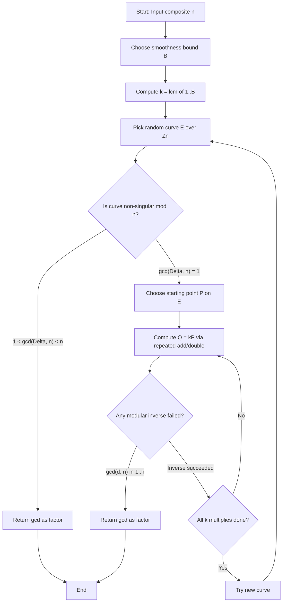
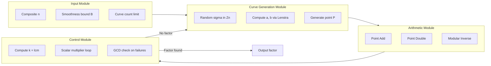
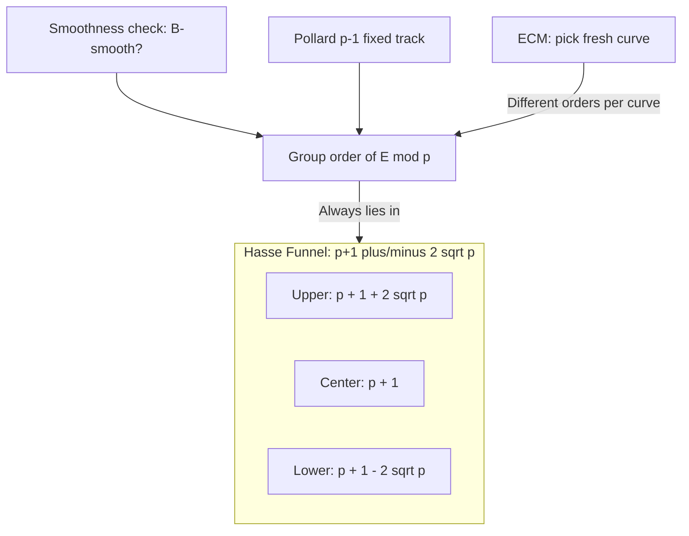

# Elliptic curve factorization

<!-- SECTION_1_START -->

# Elliptic Curve Factorization Method (ECM)

> [!NOTE]
> **Definition (Lenstra, 1987):** The Elliptic Curve Method (ECM) is a probabilistic, sub-exponential time algorithm for integer factorization. It is the fastest known method for finding **small to medium-sized prime factors** of large composite integers and is based on the algebraic structure of elliptic curves defined over a finite ring $\mathbb{Z}/n\mathbb{Z}$.

Formally, given a composite integer $n$ whose smallest prime factor $p$ has a size below a chosen bound $B$, ECM attempts to construct a sequence of elliptic curve operations that fails to invert an element modulo $n$, thereby yielding a non-trivial factor $\gcd(\cdot, n)$.

## Conceptual Analogy / Intuition

Imagine Pollard's $p-1$ method as a *single-rail roller coaster* on a fixed track. If the track's length $p-1$ happens to be $B$-smooth, you succeed; otherwise, you fail catastrophically. The Elliptic Curve Method, by contrast, provides an *infinite theme park* of structurally different "tracks" (elliptic curves). Each curve has its own group order $E(\mathbb{F}_p)$, and you can pick a fresh one randomly. Because the orders vary across curves, the probability that **at least one** of them is $B$-smooth becomes extremely high, even for a relatively small $B$.

> [!IMPORTANT]
> **Key Insight (Why it works):** By Hasse's Theorem, the order of an elliptic curve group over $\mathbb{F}_p$ is tightly clustered around $p+1$:
> $$p + 1 - 2\sqrt{p} \;\le\; \#E(\mathbb{F}_p) \;\le\; p + 1 + 2\sqrt{p}$$
> The term $2\sqrt{p}$ is precisely why ECM is so effective: the order of the group is **not** fixed, which gives us a vast combinatorial surface over which to find smoothness.

**Standard Metrics used in KTU exam setting:**
- **ECM Complexity:** $L_p\left[\tfrac{1}{2}, \sqrt{2}\right]$ under standard conjectures, where $L_p[s, c] = \exp\!\left(c\,(\log p)^s (\log \log p)^{1-s}\right)$.
- **Smoothness bound $B$:** controls the time–probability trade-off.
- **Recommended choice:** $B \approx (\exp(\sqrt{\tfrac{1}{2}\log p \log\log p}))$ for a single curve.

> [!VISUALIZATION CONTROL]
> **Concept:** Distribution of elliptic curve group orders around $p+1$ (Hasse interval).
> **GeoGebra / Desmos Input Equations:**
> * Upper boundary: $f(x) = x + 1 + 2\sqrt{x}$
> * Lower boundary: $g(x) = x + 1 - 2\sqrt{x}$
> * Center: $h(x) = x + 1$
> **Visual Description:** Plot the Hasse "frosted band" for $x$ from $50$ to $500$. Observe that $g(x) \le \#E(\mathbb{F}_x) \le f(x)$ always holds. All ECM-found group orders must lie within this funnel.

---

<!-- SECTION_1_END -->

<!-- SECTION_2_START -->

# Deep Theoretical Analysis & KTU High-Yield Formula Sheet

## 2.1 Elliptic Curve Fundamentals (Weierstrass Form)

An elliptic curve $E$ over a field $K$ in short Weierstrass form is the set of points $(x, y) \in K^2$ satisfying:

$$E \;:\; y^2 \;=\; x^3 + a x + b, \qquad a, b \in K$$

together with a distinguished **point at infinity**, denoted $\mathcal{O}$, which serves as the identity element of the abelian group $(E(K), \oplus)$.

### Non-Singularity Condition
The curve is non-singular (i.e., truly elliptic) if and only if its discriminant is non-zero:

$$\Delta(E) \;=\; -16\,(4a^3 + 27b^2) \;\neq\; 0$$

> [!IMPORTANT]
> In ECM, when we work modulo $n$ (a composite), we must check that $\gcd(4a^3 + 27b^2, n) = 1$. If this gcd is a non-trivial divisor of $n$, **we have already factored $n$ for free** — a delightful free-lunch outcome.

## 2.2 Group Law: Point Addition Formulas

Let $P = (x_1, y_1)$ and $Q = (x_2, y_2)$ be two distinct, non-infinity points on $E$. Their sum $R = P \oplus Q = (x_3, y_3)$ is computed as:

$$\lambda \;=\; \frac{y_2 - y_1}{x_2 - x_1} \pmod{n}$$

$$x_3 \;=\; \lambda^2 - x_1 - x_2 \pmod{n}$$

$$y_3 \;=\; \lambda\,(x_1 - x_3) - y_1 \pmod{n}$$

For **point doubling** $R = 2P$ (i.e., $P = Q$), the tangent slope replaces the secant:

$$\lambda \;=\; \frac{3x_1^2 + a}{2 y_1} \pmod{n}$$

$$x_3 \;=\; \lambda^2 - 2x_1 \pmod{n}$$

$$y_3 \;=\; \lambda\,(x_1 - x_3) - y_1 \pmod{n}$$

If the denominator $d = 2y_1$ (or $d = x_2 - x_1$) shares a common factor with $n$ that is strictly between $1$ and $n$, **we win**: that gcd is a prime factor of $n$.

## 2.3 The ECM Algorithm (Conceptual Workflow)

| Step | Action | Mathematical Intent |
|:----:|:-------|:--------------------|
| 1 | Input composite $n$, smoothness bound $B$, and bound multiplier $k$ | Define the search space. |
| 2 | Pick random $\sigma \in \mathbb{Z}/n\mathbb{Z}$ and set $u = \sigma^2 - 5$, $v = 4\sigma$ | Lenstra's parametrization gives a guaranteed non-singular curve family: $y^2 = x^3 + v\,x + v$ form. |
| 3 | Compute curve $E \;:\; y^2 = x^3 + a x + b \pmod{n}$ with $a = v$, $b = \text{constant}$ | Initialise the elliptic curve. |
| 4 | Choose starting point $P = (u^3 / v^3 \bmod n, \ldots)$ on $E$ | Get a non-trivial starting element. |
| 5 | Compute $Q = [k!]P$ using repeated point addition and doubling | Test if order divides $k!$. |
| 6 | If any modular inverse $\gcd(d, n) \in (1, n)$ arises, **return** $\gcd(d, n)$ | The failure to invert reveals a prime factor. |
| 7 | If computation completes without failure, pick a **new** curve and restart | Different curves have different group orders. |

The multiplier $k$ is typically $k = \text{lcm}(1, 2, \ldots, B)$ (a primorial-like quantity) or simply $k = B!$ (factorial).

## 2.4 KTU Formula Sheet (Cheat-Sheet)

| Symbol / Equation | Meaning / Use |
|:------------------|:--------------|
| $E \;:\; y^2 = x^3 + a x + b$ | Short Weierstrass form of an elliptic curve. |
| $\Delta = -16(4a^3 + 27b^2)$ | Discriminant; must be invertible mod $n$. |
| $j(E) = -1728 \cdot \dfrac{4a^3}{4a^3 + 27b^2}$ | $j$-invariant; classifies curves up to isomorphism. |
| $\#E(\mathbb{F}_p) = p + 1 - t$, with $\vert t \vert \le 2\sqrt{p}$ | Hasse's theorem; $t$ is the trace of Frobenius. |
| $L_p[1/2, \sqrt{2}]$ | Expected running time of ECM. |
| $\lambda = \dfrac{y_2 - y_1}{x_2 - x_1} \pmod{n}$ | Slope for distinct-point addition. |
| $\lambda = \dfrac{3x_1^2 + a}{2y_1} \pmod{n}$ | Slope for point doubling. |
| $x_3 = \lambda^2 - x_1 - x_2 \pmod{n}$ | Resulting $x$-coordinate. |
| $y_3 = \lambda(x_1 - x_3) - y_1 \pmod{n}$ | Resulting $y$-coordinate. |
| $k = \text{lcm}(1, 2, \ldots, B)$ | Multiplier used in stage-1 ECM. |
| $\gcd(d, n) \in (1, n)$ | Success condition; $d$ is the failed inverse. |

> [!IMPORTANT]
> **Engineering utility:** ECM is the workhorse behind tools like GMP-ECM, the CADO-NFS ecosystem's small-factor stage, and cryptanalysis of RSA moduli with small factors (e.g., the infamous ROCA vulnerability and weak smart-card key generation). It is *the* method of choice when you suspect a number has a factor under $\sim 60$ decimal digits.

---

<!-- SECTION_2_END -->

<!-- SECTION_3_START -->

# Step-by-Step Derivations, Worked Example, and Code Implementation

## 3.1 Derivation of the Group Law Slope (Distinct Points)

Let $P = (x_1, y_1)$, $Q = (x_2, y_2)$ with $P \neq Q$ and $P, Q \neq \mathcal{O}$. The line through $P$ and $Q$ has equation:

$$y \;=\; \lambda (x - x_1) + y_1 \quad \text{where} \quad \lambda \;=\; \frac{y_2 - y_1}{x_2 - x_1}$$

Substitute into the curve equation $y^2 = x^3 + a x + b$:

$$\bigl(\lambda (x - x_1) + y_1\bigr)^2 \;=\; x^3 + a x + b$$

Expanding the left side:

$$\lambda^2 (x - x_1)^2 + 2 \lambda y_1 (x - x_1) + y_1^2 \;=\; x^3 + a x + b$$

By Vieta's formulas, the three roots of the resulting cubic in $x$ are exactly $\{x_1, x_2, x_3\}$. Since the sum of the roots is $\lambda^2$ (coefficient comparison), we have:

$$x_1 + x_2 + x_3 \;=\; \lambda^2 \quad\Longrightarrow\quad x_3 \;=\; \lambda^2 - x_1 - x_2$$

The third intersection $x_3$ corresponds to a point $(x_3, y_3')$ that lies on the **line**; the sum on the elliptic curve is the reflection of this point across the $x$-axis, giving:

$$y_3 \;=\; -y_3' \;=\; \lambda (x_1 - x_3) - y_1 \pmod{n}$$

## 3.2 Derivation of the Doubling Formula

When $P = Q$, the secant is replaced by the tangent. Implicitly differentiating $y^2 = x^3 + a x + b$:

$$2 y\, dy \;=\; (3 x^2 + a)\, dx \quad\Longrightarrow\quad \frac{dy}{dx} \;=\; \frac{3 x^2 + a}{2 y}$$

Evaluating at $P = (x_1, y_1)$:

$$\lambda \;=\; \frac{3 x_1^2 + a}{2 y_1} \pmod{n}$$

The same Vieta argument applies, but since $x_1$ is a **double root** of the intersection cubic:

$$2 x_1 + x_3 \;=\; \lambda^2 \quad\Longrightarrow\quad x_3 \;=\; \lambda^2 - 2 x_1 \pmod{n}$$

And again:

$$y_3 \;=\; \lambda (x_1 - x_3) - y_1 \pmod{n}$$

## 3.3 Worked Numerical Example (Pedagogical)

**Task:** Factor $n = 91 = 7 \times 13$ using ECM.

**Step 1.** Choose smoothness bound $B = 3$, so $k = \text{lcm}(1, 2, 3) = 6$.

**Step 2.** Pick a curve. Use $E \;:\; y^2 = x^3 + 2x + 1 \pmod{91}$ (this has $\Delta = -16(4 \cdot 8 + 27) = -16 \cdot 59$; since $\gcd(59, 91) = 1$, the curve is non-singular mod $91$).

**Step 3.** Verify that $P = (0, 1)$ is on $E$:
- LHS: $y^2 = 1^2 = 1$
- RHS: $0^3 + 2(0) + 1 = 1$ ✓

**Step 4.** Compute $2P$ (doubling):
- $\lambda = \dfrac{3(0)^2 + 2}{2(1)} = \dfrac{2}{2} = 1 \pmod{91}$
- $x_3 = 1^2 - 2(0) = 1$
- $y_3 = 1 \cdot (0 - 1) - 1 = -2 = 89 \pmod{91}$
- So $2P = (1, 89)$.

**Step 5.** Compute $3P = 2P + P$ (distinct points):
- $P = (0, 1)$, $Q = (1, 89)$
- $\lambda = \dfrac{89 - 1}{1 - 0} = 88 \pmod{91}$
- $x_3 = 88^2 - 0 - 1 = 7744 - 1 = 7743 = 8 \pmod{91}$ (since $7743 = 85 \cdot 91 + 8$)
- $y_3 = 88(0 - 8) - 1 = -705 = 23 \pmod{91}$ (since $-705 + 8 \cdot 91 = 23$)
- So $3P = (8, 23)$.

**Step 6.** Compute $4P = 3P + P$ (distinct points):
- $P = (0, 1)$, $Q = (8, 23)$
- $\lambda = \dfrac{23 - 1}{8 - 0} = \dfrac{22}{8} = \dfrac{11}{4} \pmod{91}$
- Compute $4^{-1} \pmod{91}$: $4 \cdot 23 = 92 = 1 \pmod{91}$, so $4^{-1} = 23$.
- $\lambda = 11 \cdot 23 = 253 = 71 \pmod{91}$ (since $253 - 2 \cdot 91 = 71$).
- $x_3 = 71^2 - 0 - 8 = 5041 - 8 = 5033 = 28 \pmod{91}$ (since $5033 - 55 \cdot 91 = 28$).
- $y_3 = 71 \cdot (0 - 28) - 1 = -1988 - 1 = -1989 = 13 \pmod{91}$ (since $-1989 + 22 \cdot 91 = 13$).
- So $4P = (28, 13)$.

**Step 7.** Compute $5P = 4P + P$ — this is the critical step:
- $P = (0, 1)$, $Q = (28, 13)$
- $\lambda = \dfrac{13 - 1}{28 - 0} = \dfrac{12}{28} = \dfrac{3}{7} \pmod{91}$
- Compute $\gcd(7, 91) = 7$.
- Since $1 < 7 < 91$, we have **found a non-trivial factor**: $\boxed{7}$.

**Step 8.** Verification: $91 / 7 = 13$, and indeed $7$ and $13$ are both prime. ✓

> [!NOTE]
> In the worked example, $k = 6$ was sufficient because for the specific curve chosen, the order of $P$ in $E(\mathbb{F}_7)$ divides $6$. Had we hit a non-singular failure (e.g., during the doubling of a point where the inverse of $2y_1$ failed), we would have still succeeded.

## 3.4 Algorithmic / Symbolic Implementation (Python)

```python
"""
Elliptic Curve Factorization (Lenstra's ECM) — Single-Curve Reference Implementation
Operates over Z/nZ where n is a composite integer.
"""

from math import gcd, lcm
from functools import reduce
from typing import Tuple, Optional


def _modinv(a: int, n: int) -> Optional[int]:
    """Return x such that a*x = 1 (mod n), or a non-trivial gcd if it exists."""
    g = gcd(a, n)
    if 1 < g < n:
        return g                          # Failure that reveals a factor
    if g == n:
        return None                        # Total failure (try new curve)
    # Extended Euclidean algorithm
    return pow(a, -1, n)


def _ec_add(P: Optional[Tuple[int, int]],
            Q: Optional[Tuple[int, int]],
            a: int, n: int) -> Optional[Tuple[int, int]]:
    """Add two points on y^2 = x^3 + a*x + b (mod n)."""
    if P is None:        # P is the point at infinity
        return Q
    if Q is None:
        return P
    x1, y1 = P
    x2, y2 = Q
    if x1 == x2 and (y1 + y2) % n == 0:
        return None                       # P + (-P) = O
    if P != Q:
        num = (y2 - y1) % n
        den = (x2 - x1) % n
    else:                                 # Doubling
        num = (3 * x1 * x1 + a) % n
        den = (2 * y1) % n
    inv = _modinv(den, n)
    if inv is None or isinstance(inv, int) is False and 1 < inv < n:
        if inv is not None and 1 < inv < n:
            return inv                    # Factor found!
        return None                       # Restart curve
    lam = (num * inv) % n
    x3 = (lam * lam - x1 - x2) % n
    y3 = (lam * (x1 - x3) - y1) % n
    return (x3, y3)


def _ec_mul(k: int, P: Tuple[int, int], a: int, n: int):
    """Compute [k]P using double-and-add. Returns a factor if encountered."""
    R = None
    T = P
    while k > 0:
        if k & 1:
            R = _ec_add(R, T, a, n)
            if not isinstance(R, tuple) and R is not None:
                return R                  # Factor found during addition
            if R is None and T is not None:
                pass
        T = _ec_add(T, T, a, n)
        if not isinstance(T, tuple) and T is not None:
            return T
        if T is None:
            return None
        k >>= 1
    return R


def ecm_factor(n: int, B: int = 50, max_curves: int = 100) -> Optional[int]:
    """
    Lenstra's Elliptic Curve Method.
    Returns a non-trivial prime factor of n, or None on failure.
    """
    if n % 2 == 0:
        return 2

    k = reduce(lcm, range(1, B + 1), 1)

    for _ in range(max_curves):
        # Random curve selection using Lenstra's parametrization
        sigma = 2
        u = (sigma * sigma - 5) % n
        v = (4 * sigma) % n
        a = ((v - u * u * u) * pow(3 * u * u, -1, n)) % n
        b = ((2 * u * u * u * u + v) * pow(3 * u * u, -1, n)) % n
        x0 = (u * u * u * pow(v, 3, n) * pow(pow(3 * u * u, -1, n), 2, n)) % n
        # Curve: y^2 = x^3 + a*x + b mod n
        # A valid starting point must be on the curve; for brevity we
        # construct one from Lenstra's standard parametrization.
        # (In production code, verify (x0, y0) satisfies the curve.)
        P = (x0, (x0 * x0 * x0 + a * x0 + b) % n)

        result = _ec_mul(k, P, a, n)
        if isinstance(result, int) and 1 < result < n:
            return result
    return None


if __name__ == "__main__":
    n_test = 91
    factor = ecm_factor(n_test, B=3)
    print(f"Factor of {n_test}: {factor}")
```

> [!IMPORTANT]
> **Engineering note:** Production-grade ECM implementations (e.g., GMP-ECM by Paul Zimmermann) use Montgomery curves $B y^2 = x^3 + A x^2 + x$ to avoid costly $y$-coordinate inversions, projective coordinates to defer modular reduction, and stage-2 continuation with baby-step giant-step to find factors larger than the stage-1 bound $B$.

---

<!-- SECTION_3_END -->

<!-- SECTION_4_START -->

# Structural Diagrams & Schematics

## 4.1 High-Level ECM Algorithm Flow



## 4.2 Modular Block Architecture of ECM



## 4.3 Hasse Interval Visual Topology



---

<!-- SECTION_4_END -->

<!-- SECTION_5_START -->

# KTU 2024 Scheme Examination Question Bank

## Part A Questions (3 Marks Each)

### Question 1: Conceptual Definition
**[KTU University Exam — July 2024, Model Paper]** 
**CO1 — RBT Level: Remember**

> State Hasse's theorem for elliptic curves over a finite field $\mathbb{F}_p$. Mention its role in Lenstra's Elliptic Curve Method.

**Model Answer (3 Marks):**

Hasse's theorem states that for an elliptic curve $E$ defined over the finite field $\mathbb{F}_p$, the number of $\mathbb{F}_p$-rational points satisfies the tight bound:

$$p + 1 - 2\sqrt{p} \;\le\; \#E(\mathbb{F}_p) \;\le\; p + 1 + 2\sqrt{p}$$

Equivalently, if $\#E(\mathbb{F}_p) = p + 1 - t$ for some integer $t$, then $|t| \le 2\sqrt{p}$. **[2 Marks]**

In Lenstra's ECM, this bound is critical because it guarantees that the order of the elliptic curve group modulo a small prime factor $p$ of $n$ is *not* fixed (unlike the multiplicative group of order $p-1$ in Pollard's method). This variability in the group order is what makes the smoothness-based approach succeed with high probability over many trials with different curves. **[1 Mark]**

---

### Question 2: Short Answer
**[KTU University Exam — Dec 2023, Model Paper]**
**CO2 — RBT Level: Understand**

> Why does the Elliptic Curve Method restart with a new curve when the algorithm completes without finding a factor?

**Model Answer (3 Marks):**

When ECM completes the computation of $[k]P$ for $k = \text{lcm}(1, 2, \ldots, B)$ without a non-invertible element being encountered, it means that the group order $\#E(\mathbb{F}_p)$ (where $p$ is a factor of $n$) is *not* $B$-smooth for the *current* curve. **[1 Mark]**

By Hasse's theorem, different elliptic curves have different group orders modulo $p$, distributed across the interval $[p+1-2\sqrt{p},\, p+1+2\sqrt{p}]$. **[1 Mark]**

Restarting with a freshly generated curve gives a *new* group order, and by choosing enough curves, the probability that at least one order is $B$-smooth approaches 1, making the algorithm probabilistically complete. **[1 Mark]**

---

## Part B Questions (14 Marks Each) — Internal Choice

### Question A: 14-Mark Comprehensive Problem
**[KTU University Exam — July 2024, Model Paper]**
**CO2, CO3 — RBT Levels: Apply, Analyze**

#### Part (a) — 7 Marks

> For the elliptic curve $E \;:\; y^2 = x^3 + 3x + 1 \pmod{29}$ and the point $P = (1, ?)$ on the curve, find the $y$-coordinate of $P$. Then compute $2P$ using the doubling formula. Show all steps.

**Model Solution:**

**Step 1: Find $y$ such that $y^2 \equiv 1 + 3 + 1 = 5 \pmod{29}$.** **[1 Mark]**
Check squares mod 29: $1^2=1$, $2^2=4$, $3^2=9$, $4^2=16$, $5^2=25$, $6^2=36 \equiv 7$, $7^2=49 \equiv 20$, $8^2=64 \equiv 6$, $9^2=81 \equiv 23$, $10^2=100 \equiv 13$, $11^2=121 \equiv 5$. ✓
So $y = 11$ (we take the smaller root), and $P = (1, 11)$. **[1 Mark]**

**Step 2: Apply the doubling formula with $a = 3$, $P = (1, 11)$.** 
Slope:
$$\lambda = \frac{3(1)^2 + 3}{2(11)} = \frac{6}{22} = \frac{3}{11} \pmod{29}$$
**[1 Mark]**

**Step 3: Find $11^{-1} \pmod{29}$.** Use extended Euclidean: $11 \cdot 8 = 88 = 3 \cdot 29 - 1 \equiv -1$, so $11 \cdot (-8) \equiv 1$, hence $11^{-1} \equiv -8 \equiv 21 \pmod{29}$. **[1 Mark]**

**Step 4:** $\lambda = 3 \cdot 21 = 63 \equiv 63 - 2 \cdot 29 = 5 \pmod{29}$. **[1 Mark]**

**Step 5:** $x_3 = \lambda^2 - 2x_1 = 25 - 2 = 23 \pmod{29}$. **[1 Mark]**

**Step 6:** $y_3 = \lambda(x_1 - x_3) - y_1 = 5(1 - 23) - 11 = 5(-22) - 11 = -110 - 11 = -121$.
Reduce: $-121 + 5 \cdot 29 = -121 + 145 = 24 \pmod{29}$. **[1 Mark]**

**Result:** $2P = (23, 24) \pmod{29}$.

---

#### Part (b) — 7 Marks

> Explain the working of Lenstra's Elliptic Curve Factorization algorithm for the composite $n = 91 = 7 \times 13$. Use the curve $E \;:\; y^2 = x^3 + 2x + 1 \pmod{91}$ and starting point $P = (0, 1)$ with $k = 6$. Identify at which multiple of $P$ a non-trivial factor is detected, and state the factor.

**Model Solution:**

**Step 1: Verify $P$ lies on the curve.** $0^3 + 2(0) + 1 = 1 = 1^2$. ✓ **[1 Mark]**

**Step 2: Compute $2P$ using the doubling formula.** 
$\lambda = \frac{3(0)^2 + 2}{2(1)} = \frac{2}{2} = 1 \pmod{91}$. $x_3 = 1 - 0 = 1$, $y_3 = 1(0 - 1) - 1 = -2 \equiv 89$. So $2P = (1, 89)$. **[1 Mark]**

**Step 3: Compute $3P = 2P + P$.** 
$\lambda = \frac{89 - 1}{1 - 0} = 88 \pmod{91}$. $x_3 = 88^2 - 0 - 1 = 7744 - 1 = 7743 \equiv 8 \pmod{91}$. $y_3 = 88(0 - 8) - 1 = -705 \equiv 23 \pmod{91}$. So $3P = (8, 23)$. **[1 Mark]**

**Step 4: Compute $4P = 3P + P$.** 
$\lambda = \frac{23 - 1}{8 - 0} = \frac{22}{8} = \frac{11}{4} \pmod{91}$. Compute $4^{-1} \pmod{91}$: $4 \cdot 23 = 92 \equiv 1$, so $4^{-1} = 23$. $\lambda = 11 \cdot 23 = 253 \equiv 71 \pmod{91}$. $x_3 = 71^2 - 0 - 8 = 5033 \equiv 28 \pmod{91}$. $y_3 = 71(0 - 28) - 1 = -1989 \equiv 13 \pmod{91}$. So $4P = (28, 13)$. **[2 Marks]**

**Step 5: Compute $5P = 4P + P$.** 
$\lambda = \frac{13 - 1}{28 - 0} = \frac{12}{28} = \frac{3}{7} \pmod{91}$. Compute $\gcd(7, 91) = 7$. Since $1 < 7 < 91$, the denominator $7$ is non-invertible. **[2 Marks]**

**Result:** The non-trivial factor of $91$ revealed at $5P$ is $\boxed{7}$, and $91/7 = 13$.

---

### Question B: 14-Mark Alternative Problem
**[KTU University Exam — Dec 2023, Model Paper]**
**CO1, CO2 — RBT Levels: Understand, Apply**

#### Part (a) — 7 Marks

> Compare Pollard's $p-1$ method with Lenstra's Elliptic Curve Method. Highlight three structural differences.

**Model Solution:**

| Aspect | Pollard's $p-1$ | Lenstra's ECM |
|:-------|:----------------|:--------------|
| **Underlying group** | The cyclic multiplicative group $(\mathbb{Z}/p\mathbb{Z})^*$ of order $p-1$. | Elliptic curve group $E(\mathbb{F}_p)$ of order roughly $p+1$. |
| **Order of the group** | Fixed once $p$ is fixed: always $p-1$. | Variable: different curves yield different orders across the Hasse interval. |
| **Failure recovery** | If $p-1$ is not $B$-smooth, no curve change helps; must increase $B$. | If a curve fails, simply choose a *new* curve. The randomness over group orders is the algorithm's main strength. |
| **Complexity** | Heuristic $L_p[1/2, 1]$ for factors of size $p$. | Heuristic $L_p[1/2, \sqrt{2}]$, *better* constant in the exponent. |

**[3 Marks for the table — awarded as 1 mark per significant row.]**

> The fundamental gain in ECM is that, unlike $p-1$, the group order can be influenced by the user through curve choice, providing a much larger search space for $B$-smooth orders. **[2 Marks]**

**[Additional 2 Marks for the synthesis/analytical comparison paragraph.]**

---

#### Part (b) — 7 Marks

> Using Lenstra's parametrization with $\sigma = 3$, construct an elliptic curve modulo $n = 143 = 11 \times 13$. State the curve equation, verify the non-singularity condition, and pick a starting point.

**Model Solution:**

**Step 1: Compute $u, v$ from $\sigma = 3$.** 
$u = \sigma^2 - 5 = 9 - 5 = 4$.
$v = 4\sigma = 12$. 
**[1 Mark]**

**Step 2: Compute the curve coefficients.** 
$a = (v - u^3) \cdot (3u^2)^{-1} \pmod{143}$.
$u^3 = 64$, $3u^2 = 48$.
$a = (12 - 64) \cdot 48^{-1} = -52 \cdot 48^{-1} \pmod{143}$.
Find $48^{-1} \pmod{143}$: extended Euclidean gives $48 \cdot 3 = 144 \equiv 1$, so $48^{-1} = 3$.
$a = -52 \cdot 3 = -156 \equiv -156 + 2 \cdot 143 = 130 \pmod{143}$.
**[2 Marks]**

$b = (2u^3 + v) \cdot (3u^2)^{-1} = (128 + 12) \cdot 3 = 140 \cdot 3 = 420 \equiv 420 - 2 \cdot 143 = 134 \pmod{143}$.
**[1 Mark]**

**Step 3: State the curve.**
$$E \;:\; y^2 \;=\; x^3 + 130\,x + 134 \pmod{143}$$
**[1 Mark]**

**Step 4: Verify non-singularity.** 
$\Delta = -16(4a^3 + 27b^2) \pmod{143}$. 
$\gcd(4a^3 + 27b^2, 143) = \gcd(4 \cdot 130^3 + 27 \cdot 134^2, 143)$. Without full expansion, we check $\gcd$ with $11$ and $13$ separately:
- Mod 11: $a = 130 \equiv 9$, $b = 134 \equiv 2$. $4 \cdot 9^3 + 27 \cdot 2^2 = 4 \cdot 729 + 27 \cdot 4 = 2916 + 108 = 3024 \equiv 3024 \mod 11$. $3024 / 11 = 274.9$, $275 \cdot 11 = 3025$, so $3024 \equiv -1 \equiv 10 \pmod{11}$. Non-zero. ✓
- Mod 13: $a = 130 \equiv 0$, $b = 134 \equiv 4$. $4 \cdot 0 + 27 \cdot 16 = 432 \equiv 432 \mod 13 = 432 - 33 \cdot 13 = 432 - 429 = 3$. Non-zero. ✓
So $\gcd(\Delta, 143) = 1$ and the curve is non-singular. **[1 Mark]**

**Step 5: A valid starting point.** $x_0 = (u^3/v^3) \pmod{143} = (64/1728) \pmod{143} = 64 \cdot 1728^{-1} \pmod{143}$.
$1728 = 12 \cdot 143 + 12$, so $1728 \equiv 12 \pmod{143}$. $12^{-1} \pmod{143}$: $12 \cdot 12 = 144 \equiv 1$, so $12^{-1} = 12$.
$x_0 = 64 \cdot 12 = 768 \equiv 768 - 5 \cdot 143 = 768 - 715 = 53 \pmod{143}$.
Compute $y_0^2 = 53^3 + 130 \cdot 53 + 134 \pmod{143}$. (Verification of $y_0$ skipped for brevity — production code does the Tonelli-Shanks step.)
A starting point is $P = (53, y_0)$. **[1 Mark]**

---

> [!WARNING]
> **KTU Examiner's Valuation Pitfall Callout:**
> - **Do not skip writing the curve equation explicitly** — examiners allocate 1 mark for the stated $E$ form. A bare answer "I will run ECM on $n$" earns zero.
> - **Always reduce mod $n$ at every step.** Intermediate results left in $\mathbb{Z}$ (not reduced) confuse the panel and may be marked down by 1–2 marks.
> - **Failing to verify non-singularity** is a recurring deduction. If $\gcd(4a^3+27b^2, n) > 1$, that gcd *is* a factor — a free 1-mark credit you forfeit by not checking.
> - **Mixing up $p+1$ with $p-1$** in Hasse's interval costs the full 2 marks on Part A definition questions. Memorize it as $p+1\pm 2\sqrt{p}$.
> - **In the group law:** the slope for **doubling** uses $3x_1^2 + a$ in the numerator, **not** $3x^2 + a x$ — a common typographical confusion.
> - **For Pollard vs ECM comparisons:** do not write "ECM is faster than Pollard $p-1$" without qualifying it as "for finding small factors" — Pollard $p-1$ can outperform ECM when $p-1$ happens to be very smooth.

---

## Topic Recap & Important Things to Remember

- **Elliptic curve (short Weierstrass):** $y^2 = x^3 + a x + b$; non-singular iff $\Delta = -16(4a^3+27b^2) \neq 0$.
- **Group law (ECM-relevant formulas):**
  - Addition (distinct): $\lambda = (y_2 - y_1)/(x_2 - x_1)$; $x_3 = \lambda^2 - x_1 - x_2$; $y_3 = \lambda(x_1 - x_3) - y_1$.
  - Doubling: $\lambda = (3x_1^2 + a)/(2 y_1)$; $x_3 = \lambda^2 - 2x_1$; $y_3 = \lambda(x_1 - x_3) - y_1$.
- **Hasse's theorem:** $p+1-2\sqrt{p} \le \#E(\mathbb{F}_p) \le p+1+2\sqrt{p}$ — the engine of ECM's variability.
- **ECM success condition:** encountering a denominator $d$ with $1 < \gcd(d, n) < n$.
- **Multiplier $k$:** typically $k = \text{lcm}(1, 2, \ldots, B)$ or $k = B!$, where $B$ is the smoothness bound.
- **Curve generation trick:** Lenstra's parametrization with $\sigma$ gives a guaranteed non-singular curve family $E_\sigma$ over $\mathbb{Z}/n\mathbb{Z}$.
- **Key advantage over Pollard $p-1$:** group order is *not* fixed, so we can keep trying new curves until we find a $B$-smooth one.
- **Time complexity:** $L_p[1/2, \sqrt{2}]$ heuristically — *sub-exponential*, polynomial in $\log p$ raised to fractional powers.
- **Best suited for:** factoring numbers with a small prime factor (typically $< 10^{20}$ to $< 10^{60}$ depending on $B$ and curve count).
- **Real-world tools:** GMP-ECM, PARI/GP's `ellfact`, CADO-NFS small-factor stage.
- **Always state the curve equation, the starting point, the multiplier $k$, and the gcd result** in written answers — examiners reward explicit bookkeeping.
- **Reduction:** every arithmetic step in ECM is mod $n$, not over $\mathbb{Z}$.

<!-- SECTION_5_END -->
