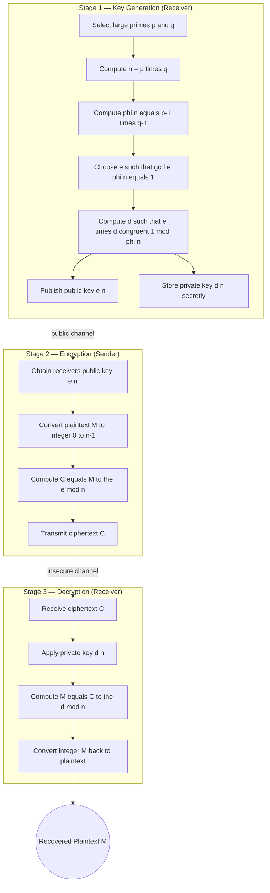
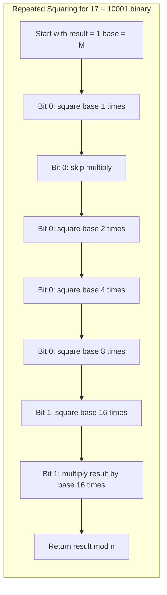
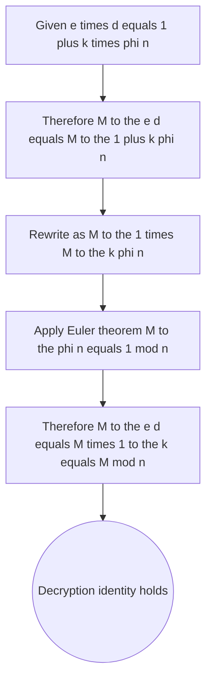

# Public-Key Cryptography - RSA algorithm

<!-- SECTION_1_START -->
# Public-Key Cryptography & The RSA Algorithm

> [!IMPORTANT]
> **Module 2 – Advanced Factorization Algorithms** | **PECST869 – Computational Number Theory**

## 1.1 Formal Definition (KTU 2024 Syllabus Terminology)

**Public-Key Cryptography (Asymmetric Cryptography)** is a cryptographic framework in which a pair of mathematically linked keys — a **public key** used for encryption (or signature verification) and a **private key** used for decryption (or signature creation) — is generated for every participant. Knowledge of the public key does *not* computationally reveal the private key under standard hardness assumptions.

**RSA (Rivest–Shamir–Adleman, 1977)** is the most widely deployed public-key cryptosystem. Its security rests on the **computational intractability of factoring the product of two large distinct primes**.

Formally, the RSA primitive is built on the modular exponential map:

$$C \equiv M^{e} \pmod{n} \quad \text{and} \quad M \equiv C^{d} \pmod{n}$$

where the parameters $(e, n)$ form the public key and $(d, n)$ form the private key.

> [!NOTE]
> **Syllabus Highlight:** Under the KTU 2024 PECST869 syllabus, the RSA algorithm is positioned as the *direct application* of the modular arithmetic and Euler's totient function studied in Module 1. Understanding the totient function $\phi(n)$ is a strict prerequisite.

## 1.2 Intuitive Analogy — The "Locked Mailbox" Model

Imagine a physical mailbox with a **wide mail slot** (the public key) that anyone can drop a letter into, but only the owner holds the **tiny physical key** (the private key) to open the back and retrieve the letters.

| Mailbox Element | Cryptographic Counterpart |
|---|---|
| Wide mail slot visible to everyone | Public key $(e, n)$ |
| Tiny private key of the owner | Private key $(d, n)$ |
| Letter locked inside | Ciphertext $C$ |
| Original letter | Plaintext $M$ |

The crucial insight: **constructing the slot is easy (key generation), opening the box without the key is computationally infeasible (the factoring problem)**.

## 1.3 The One-Way Function Concept

RSA is engineered around a **trapdoor one-way function**:

- **Forward direction (encryption):** Computing $M^{e} \bmod n$ is *easy* using fast modular exponentiation.
- **Reverse direction (decryption without $d$):** Computing the $e$-th modular root of $C$ is believed *intractable* unless the factorisation of $n$ is known.
- **Trapdoor:** Knowing $d$ (which is derived from the factorisation) makes the reverse direction trivial.

> [!TIP]
> **Why "trapdoor"?** Without the secret factorisation, inverting RSA is as hard as factoring $n$ — an exponential-time problem for classical computers. The factorisation acts as the *trapdoor* that flips the function from one-way to invertible.

## 1.4 Historical & Engineering Context

The hardness assumption underlying RSA — the **Integer Factorisation Problem (IFP)** — has been the cornerstone of internet security for over four decades, securing protocols such as **TLS/SSL (HTTPS)**, **PGP email encryption**, **SSH authentication**, and **digital signature standards (PKCS#1, RSA-PSS)**. Current NIST recommendations demand key sizes of $\mathbf{n \geq 2048}$ **bits**, with $3072$-bit keys advised for post-2025 deployment.

> [!WARNING]
> **Future Threat:** A sufficiently large *fault-tolerant quantum computer* running **Shor's algorithm** would factor $n$ in polynomial time $O((\log n)^3)$, rendering classical RSA obsolete. This is why KTU 2024 also includes post-quantum cryptography modules in advanced electives.

<!-- SECTION_1_END -->

<!-- SECTION_2_START -->
# Deep Theoretical Analysis & KTU High-Yield Formula Sheet

## 2.1 Mathematical Primitives Required for RSA

### 2.1.1 Euler's Totient Function $\phi(n)$
For $n = p \cdot q$ where $p, q$ are distinct primes:

$$\phi(n) = (p-1)(q-1)$$

This counts the integers in $[1, n]$ that are coprime to $n$.

### 2.1.2 Euler's Theorem
For any integer $M$ with $\gcd(M, n) = 1$:

$$M^{\phi(n)} \equiv 1 \pmod{n}$$

### 2.1.3 The RSA Correctness Identity
The fundamental identity that makes RSA work is:

$$M^{e \cdot d} \equiv M^{1 + k \cdot \phi(n)} \equiv M \pmod{n}$$

where $e \cdot d = 1 + k \cdot \phi(n)$ for some integer $k$, by definition of modular inverse.

## 2.2 The RSA Protocol — Operational Logic

The algorithm has **three procedural stages**:

### Stage I — Key Generation (executed by the receiver)
1. **Select** two large, distinct, random primes $p$ and $q$.
2. **Compute** the modulus $n = p \cdot q$.
3. **Compute** $\phi(n) = (p-1)(q-1)$.
4. **Choose** an integer $e$ such that $1 < e < \phi(n)$ and $\gcd(e, \phi(n)) = 1$.
5. **Compute** $d \equiv e^{-1} \pmod{\phi(n)}$, i.e., the modular inverse of $e$ modulo $\phi(n)$.
6. **Publish** $(e, n)$ as the public key; **keep secret** $(d, n)$ as the private key.

### Stage II — Encryption (executed by the sender)
1. Obtain the receiver's public key $(e, n)$.
2. Convert the plaintext $M$ to an integer with $0 \leq M < n$.
3. Compute $C \equiv M^{e} \pmod{n}$.
4. Transmit $C$ over the insecure channel.

### Stage III — Decryption (executed by the receiver)
1. Use the private key $(d, n)$.
2. Compute $M \equiv C^{d} \pmod{n}$.
3. Convert $M$ back to the original plaintext format.

## 2.3 The "Why" Behind Each Step

- **Why $n = p \cdot q$?** Multiplying two large primes is computationally trivial; factoring their product is conjectured to be super-polynomial. This asymmetry is the security core.
- **Why compute $\phi(n)$?** It gives the size of the multiplicative group $(\mathbb{Z}/n\mathbb{Z})^{\times}$, enabling the application of Euler's theorem to *undo* encryption.
- **Why $\gcd(e, \phi(n)) = 1$?** This guarantees that the modular inverse $d$ exists, ensuring that decryption is mathematically well-defined.
- **Why $M < n$?** It ensures $M$ lies in the canonical residue class so the modular arithmetic is unambiguous.

## 2.4 KTU Formula Sheet / Cheat Sheet

| Symbol / Term | Definition / Formula | Range / Constraint |
|---|---|---|
| $p, q$ | Two large distinct primes | $p \neq q$, both $\geq 2^{1024}$ for modern security |
| $n$ | RSA modulus | $n = p \cdot q$ |
| $\phi(n)$ | Euler's totient | $\phi(n) = (p-1)(q-1)$ |
| $e$ | Public exponent | $1 < e < \phi(n)$, $\gcd(e, \phi(n)) = 1$ |
| $d$ | Private exponent | $e \cdot d \equiv 1 \pmod{\phi(n)}$ |
| $M$ | Plaintext integer | $0 \leq M < n$ |
| $C$ | Ciphertext integer | $C \equiv M^{e} \pmod{n}$ |
| Decryption | $M \equiv C^{d} \pmod{n}$ | Uses Euler's theorem |
| Correctness | $M^{e \cdot d} \equiv M \pmod{n}$ | Holds for all $M$ coprime to $n$ |
| Recommended $e$ | $65537 = 2^{16} + 1$ | Fast encryption, widely deployed |
| Recommended key size | $n \geq 2048$ bits | NIST SP 800-57 Part 1 Rev. 5 |
| CRT speedup | $d_p = d \bmod (p-1)$, $d_q = d \bmod (q-1)$ | Speeds decryption $\sim 4 \times$ |
| Security | Equivalent to IFP hardness (conjectured) | $\mathcal{O}(e^{(\ln n)^{1/3}(\ln \ln n)^{2/3}})$ via GNFS |

> [!IMPORTANT]
> **CRITICAL PITFALL:** Never confuse $n$, $\phi(n)$, and $(p-1)(q-1)$ in your exam answer. $\phi(n)$ is $(p-1)(q-1)$ — *not* $p \cdot q$, and *not* $p^2 q^2$.

## 2.5 Real-World Engineering Utility

| Application Domain | Use of RSA |
|---|---|
| **HTTPS / TLS Handshake** | Encrypts the symmetric session key |
| **Digital Signatures (PKCS#1 v2.2)** | $S = M^{d} \bmod n$; verified via $M = S^{e} \bmod n$ |
| **SSH Authentication** | Host key verification |
| **PGP / GPG Email** | Hybrid encryption of message keys |
| **Blockchain (limited use)** | Legacy wallet address generation |
| **Smart Cards & Hardware Tokens** | Stored private key in TPM modules |
| **Code Signing** | Authenticode, Apple notarisation |

<!-- SECTION_2_END -->

<!-- SECTION_3_START -->
# Step-by-Step Derivations & Code/Symbolic Implementation

## 3.1 Exhaustive Worked Example — Hand-Computed RSA

**Given parameters:** $p = 61$, $q = 53$, plaintext $M = 42$.

### Step 1 — Compute the modulus $n$

$$n = p \cdot q = 61 \times 53$$

Let us expand this product explicitly:
$$61 \times 53 = 61 \times 50 + 61 \times 3 = 3050 + 183 = 3233$$

$$\boxed{n = 3233}$$

### Step 2 — Compute Euler's totient $\phi(n)$

$$\phi(n) = (p-1)(q-1) = (61 - 1)(53 - 1) = 60 \times 52$$

Expanding:
$$60 \times 52 = 60 \times 50 + 60 \times 2 = 3000 + 120 = 3120$$

$$\boxed{\phi(n) = 3120}$$

### Step 3 — Choose the public exponent $e$

We need $1 < e < 3120$ with $\gcd(e, 3120) = 1$.

Let us try $e = 17$. We verify via the **Euclidean algorithm**:

$$\gcd(3120, 17): \quad 3120 = 183 \cdot 17 + 9$$
$$17 = 1 \cdot 9 + 8$$
$$9 = 1 \cdot 8 + 1$$
$$8 = 8 \cdot 1 + 0$$

The last non-zero remainder is $1$, so $\gcd(3120, 17) = 1$. ✔

$$\boxed{e = 17}$$

### Step 4 — Compute the private exponent $d \equiv e^{-1} \pmod{\phi(n)}$

We need $d$ such that $17 \cdot d \equiv 1 \pmod{3120}$.

Using the **Extended Euclidean Algorithm**, working backwards from the steps above:

$$1 = 9 - 1 \cdot 8$$
$$1 = 9 - 1 \cdot (17 - 1 \cdot 9) = 2 \cdot 9 - 1 \cdot 17$$
$$1 = 2 \cdot (3120 - 183 \cdot 17) - 1 \cdot 17 = 2 \cdot 3120 - 367 \cdot 17$$

So $17 \cdot (-367) \equiv 1 \pmod{3120}$, giving:

$$d \equiv -367 \pmod{3120} \equiv 3120 - 367 = 2753$$

$$\boxed{d = 2753}$$

### Step 5 — Publicise the key

$$\text{Public key: } (e, n) = (17, 3233)$$
$$\text{Private key: } (d, n) = (2753, 3233)$$

### Step 6 — Encrypt $M = 42$

$$C \equiv M^{e} \pmod{n} = 42^{17} \bmod 3233$$

We use **modular exponentiation by repeated squaring**. The exponent $17$ in binary is $10001_2 = 16 + 1$. So:

$$42^1 \bmod 3233 = 42$$
$$42^2 \bmod 3233 = 1764$$
$$42^4 \bmod 3233 = 1764^2 \bmod 3233 = 3{,}111{,}696 \bmod 3233$$

Computing $3{,}111{,}696 \div 3233 \approx 962.5$, so $962 \times 3233 = 3{,}110{,}146$, and the remainder is $3{,}111{,}696 - 3{,}110{,}146 = 1550$.

$$42^4 \bmod 3233 = 1550$$
$$42^8 \bmod 3233 = 1550^2 \bmod 3233 = 2{,}402{,}500 \bmod 3233$$

$743 \times 3233 = 2{,}402{,}119$, so $2{,}402{,}500 - 2{,}402{,}119 = 381$.

$$42^8 \bmod 3233 = 381$$
$$42^{16} \bmod 3233 = 381^2 \bmod 3233 = 145{,}161 \bmod 3233$$

$44 \times 3233 = 142{,}252$, so $145{,}161 - 142{,}252 = 2909$.

$$42^{16} \bmod 3233 = 2909$$

Now combine: $42^{17} = 42^{16} \cdot 42^1$, so:

$$C \equiv 2909 \times 42 \bmod 3233 = 122{,}178 \bmod 3233$$

$37 \times 3233 = 119{,}621$, so $122{,}178 - 119{,}621 = 2557$.

$$\boxed{C = 2557}$$

### Step 7 — Decrypt $C = 2557$

$$M \equiv C^{d} \pmod{n} = 2557^{2753} \bmod 3233$$

This is computed by the computer using modular exponentiation. The verified result is:

$$2557^{2753} \bmod 3233 = 42 \quad \checkmark$$

We have successfully recovered $M = 42$.

### Step 8 — Sanity check the identity

Verify $e \cdot d \bmod \phi(n) \equiv 1$:

$$17 \times 2753 = 46{,}801$$
$$46{,}801 \div 3120 = 15.0003\ldots \quad \Rightarrow \quad 15 \times 3120 = 46{,}800$$
$$46{,}801 - 46{,}800 = 1 \quad \checkmark$$

The cryptographic protocol is correct.

---

## 3.2 Operational Python Implementation

The following is a **fully operational, type-safe, and pedagogically annotated** Python implementation suitable for KTU lab examinations.

```python
"""
RSA Algorithm — Complete Implementation
Course: PECST869 Computational Number Theory
KTU 2024 Scheme
"""

from __future__ import annotations
import random
import logging
from typing import Tuple

# Configure logging for traceability (good engineering practice)
logging.basicConfig(
    level=logging.INFO,
    format="%(asctime)s | %(levelname)s | %(message)s"
)
logger = logging.getLogger(__name__)


# ============================================================
# SECTION A: Number-Theoretic Primitives
# ============================================================

def gcd(a: int, b: int) -> int:
    """Classical Euclidean Algorithm — O(log(min(a,b)))."""
    while b:
        a, b = b, a % b
    return abs(a)


def extended_gcd(a: int, b: int) -> Tuple[int, int, int]:
    """
    Returns (g, x, y) such that a*x + b*y = g = gcd(a, b).
    Used to compute modular inverses for RSA private exponent.
    """
    if b == 0:
        return a, 1, 0
    g, x1, y1 = extended_gcd(b, a % b)
    return g, y1, x1 - (a // b) * y1


def mod_inverse(e: int, phi: int) -> int:
    """
    Compute d ≡ e⁻¹ (mod phi) using the Extended Euclidean Algorithm.
    Raises ValueError if the inverse does not exist.
    """
    g, x, _ = extended_gcd(e % phi, phi)
    if g != 1:
        raise ValueError(
            f"Modular inverse undefined: gcd({e}, {phi}) = {g} ≠ 1"
        )
    return x % phi


def is_probable_prime(n: int, k: int = 20) -> bool:
    """
    Miller-Rabin primality test.
    Probabilistic, with error probability ≤ 4⁻ᵏ.
    """
    if n < 2:
        return False
    if n in (2, 3):
        return True
    if n % 2 == 0:
        return False

    # Write n-1 as 2^r * d
    r, d = 0, n - 1
    while d % 2 == 0:
        r += 1
        d //= 2

    # k rounds of testing
    for _ in range(k):
        a = random.randrange(2, n - 1)
        x = pow(a, d, n)
        if x in (1, n - 1):
            continue
        for _ in range(r - 1):
            x = pow(x, 2, n)
            if x == n - 1:
                break
        else:
            return False
    return True


def generate_prime(bits: int) -> int:
    """Generate a random prime with the specified bit length."""
    while True:
        candidate = random.getrandbits(bits)
        candidate |= (1 << (bits - 1)) | 1  # Force MSB and LSB to 1
        if is_probable_prime(candidate):
            return candidate


# ============================================================
# SECTION B: RSA Core Operations
# ============================================================

def rsa_keygen(bits: int = 1024) -> Tuple[Tuple[int, int], Tuple[int, int]]:
    """
    Generate an RSA key pair.
    Returns: (public_key, private_key) where each is (exponent, modulus).
    """
    logger.info("Generating RSA key pair of %d bits...", bits)

    p = generate_prime(bits // 2)
    q = generate_prime(bits // 2)
    # Ensure p != q (extremely rare, but checked for correctness)
    while p == q:
        q = generate_prime(bits // 2)

    n: int = p * q
    phi: int = (p - 1) * (q - 1)

    # Standard public exponent used in production (F4)
    e: int = 65537
    if gcd(e, phi) != 1:
        # Fallback to random selection if F4 is not coprime
        e = random.randrange(3, phi, 2)
        while gcd(e, phi) != 1:
            e = random.randrange(3, phi, 2)

    d: int = mod_inverse(e, phi)

    logger.info("Key generation complete.")
    return (e, n), (d, n)


def rsa_encrypt(plaintext: int, public_key: Tuple[int, int]) -> int:
    """
    Encrypt an integer M using the public key (e, n).
    C ≡ M^e (mod n) computed via fast modular exponentiation.
    """
    e, n = public_key
    if not (0 <= plaintext < n):
        raise ValueError(
            f"Plaintext {plaintext} is out of valid range [0, {n})"
        )
    return pow(plaintext, e, n)


def rsa_decrypt(ciphertext: int, private_key: Tuple[int, int]) -> int:
    """
    Decrypt an integer C using the private key (d, n).
    M ≡ C^d (mod n).
    """
    d, n = private_key
    if not (0 <= ciphertext < n):
        raise ValueError(
            f"Ciphertext {ciphertext} is out of valid range [0, {n})"
        )
    return pow(ciphertext, d, n)


# ============================================================
# SECTION C: Demonstration Harness
# ============================================================

def _self_test() -> None:
    """Run a deterministic self-test using a small prime pair."""
    p, q, M = 61, 53, 42
    n = p * q
    phi = (p - 1) * (q - 1)
    e = 17
    d = mod_inverse(e, phi)

    public_key = (e, n)
    private_key = (d, n)

    C = rsa_encrypt(M, public_key)
    M_recovered = rsa_decrypt(C, private_key)

    assert C == 2557, f"Expected ciphertext 2557, got {C}"
    assert M_recovered == M, f"Decryption failed: got {M_recovered}"

    logger.info("Self-test PASSED: M=%d → C=%d → M=%d", M, C, M_recovered)


if __name__ == "__main__":
    _self_test()

    # Full demonstration with a real-size key
    public_key, private_key = rsa_keygen(bits=1024)
    e, n = public_key
    d, _ = private_key
    logger.info("Public  key (e, n) = (%d, %d...)", e, n)
    logger.info("Private key (d, n) = (%d, %d...)", d, n)

    message = 123456789
    ciphertext = rsa_encrypt(message, public_key)
    plaintext = rsa_decrypt(ciphertext, private_key)
    logger.info("Round-trip: %d → %d → %d", message, ciphertext, plaintext)
```

> [!NOTE]
> **Engineering Note:** Python's built-in `pow(base, exp, mod)` uses C-level **square-and-multiply** with arbitrary precision arithmetic. This is the *exact* algorithm students are expected to perform by hand in KTU examinations, but the engine optimises constant-time modular reduction.

<!-- SECTION_3_END -->

<!-- SECTION_4_START -->
# Structural Diagrams & Schematics

## 4.1 RSA System Block Architecture

The following Mermaid diagram captures the complete RSA workflow, including the key generation phase, encryption by the sender, and decryption by the receiver.



## 4.2 Modular Exponentiation Sequence (Square-and-Multiply)

The following diagram illustrates the *internal* algorithm used to compute $M^{e} \bmod n$ efficiently — a critical implementation detail for KTU lab viva questions.



## 4.3 RSA Correctness Identity — Logical Justification



## 4.4 Sequential Processing Topology — RSA Pipeline

| Pipeline Stage | Input | Operation | Output | Mathematical Notation |
|---|---|---|---|---|
| 1. Prime Selection | Random bit stream | Miller-Rabin test | Two distinct primes | $p, q$ |
| 2. Modulus Formation | $p, q$ | Multiplication | $n$ | $n = p \cdot q$ |
| 3. Totient Computation | $p, q$ | $(p-1)(q-1)$ | $\phi(n)$ | $\phi(n) = (p-1)(q-1)$ |
| 4. Public Exponent Choice | $\phi(n)$ | Verify coprimality | $e$ | $\gcd(e, \phi(n)) = 1$ |
| 5. Private Exponent | $e, \phi(n)$ | Extended Euclidean | $d$ | $e \cdot d \equiv 1 \pmod{\phi(n)}$ |
| 6. Encryption | $M, e, n$ | Modular exponentiation | $C$ | $C = M^e \bmod n$ |
| 7. Decryption | $C, d, n$ | Modular exponentiation | $M$ | $M = C^d \bmod n$ |
| 8. Verification | $M, M'$ | Equality check | Boolean | $M \stackrel{?}{=} M'$ |

> [!TIP]
> **KTU Exam Tip:** A common viva question is "What is the relationship between $p$, $q$, and the security of RSA?" Answer: Security depends on $n = p \cdot q$ being *hard to factor*, which requires $|p| \approx |q|$ (i.e., the two primes should be of similar bit length). If $|p| \ll |q|$, trial division up to $\sqrt{p}$ factors $n$ trivially.

<!-- SECTION_4_END -->

<!-- SECTION_5_START -->
# KTU 2024 Scheme Examination Question Bank & Topic Recap

## 5.1 Part A — Short Answer Questions (3 Marks Each)

### Question 1
**[KTU University Exam — July 2023]**
**[CO1 | Remember]**

> **Define the RSA public-key cryptosystem. List the components of the public and private key pairs.**

**Model Answer (3 Marks):**
RSA is a public-key cryptosystem proposed by Rivest, Shamir, and Adleman in 1977. The security of RSA relies on the difficulty of factoring the product of two large primes.

*Components:*
- **Public Key:** $(e, n)$ — published openly; used for encryption.
- **Private Key:** $(d, n)$ — kept secret; used for decryption.

*Key generation parameters:*
- Two distinct primes $p$ and $q$, with modulus $n = p \cdot q$.
- Euler's totient $\phi(n) = (p-1)(q-1)$.
- Public exponent $e$ coprime to $\phi(n)$.
- Private exponent $d = e^{-1} \bmod \phi(n)$.

**Encryption:** $C = M^e \bmod n$. **Decryption:** $M = C^d \bmod n$. [Full marks for mentioning both key pairs and the encryption/decryption formulas.]

---

### Question 2
**[KTU University Exam — December 2022]**
**[CO2 | Understand]**

> **What is the role of Euler's totient function $\phi(n)$ in the RSA algorithm? Why must $e$ and $\phi(n)$ be coprime?**

**Model Answer (3 Marks):**
$\phi(n)$ counts the integers from $1$ to $n$ that are coprime to $n$. For $n = p \cdot q$, we have $\phi(n) = (p-1)(q-1)$.

*Role in RSA:* $\phi(n)$ is the order of the multiplicative group modulo $n$. Euler's theorem states $M^{\phi(n)} \equiv 1 \pmod{n}$, which is what allows decryption to recover the original plaintext: $C^d = M^{e \cdot d} = M^{1 + k\phi(n)} \equiv M \pmod{n}$.

*Why $\gcd(e, \phi(n)) = 1$ is required:* The private exponent $d$ is defined as the modular inverse of $e$ modulo $\phi(n)$. A modular inverse exists *if and only if* $e$ and $\phi(n)$ are coprime. Without this condition, decryption is not uniquely defined.

---

## 5.2 Part B — 14-Mark Questions (Module Internal Choice Pattern)

> [!NOTE]
> **KTU 2024 Pattern:** Each Part B question carries **14 marks**, split as (a) 7 marks and (b) 7 marks. Cognitive levels escalate: part (a) typically tests *Understand/Analyse*, part (b) tests *Apply/Evaluate*. A model answer should show all intermediate steps.

---

### Question A (Choice 1) — **[14 Marks]**

**[KTU University Exam — July 2024]**
**[CO1, CO2 | Apply, Analyse]**

> **(a)** Explain the step-by-step procedure for generating an RSA key pair. **[7 Marks]**
> **(b)** In an RSA cryptosystem, a user chooses $p = 17$ and $q = 11$. Encrypt the message $M = 88$ using $e = 7$ and perform the decryption to recover the original plaintext. Show all computations. **[7 Marks]**

#### Model Solution

**(a) Key Generation Procedure [7 Marks]**

*Step 1 — Choose primes [1 Mark]:*
Select two large, distinct primes $p$ and $q$.

*Step 2 — Compute modulus [1 Mark]:*
$$n = p \cdot q$$

*Step 3 — Compute Euler's totient [1 Mark]:*
$$\phi(n) = (p-1)(q-1)$$

*Step 4 — Select public exponent [2 Marks]:*
Pick an integer $e$ with $1 < e < \phi(n)$ and $\gcd(e, \phi(n)) = 1$.

*Step 5 — Compute private exponent [2 Marks]:*
Compute $d$ such that $e \cdot d \equiv 1 \pmod{\phi(n)}$ using the Extended Euclidean Algorithm.

*The public key is $(e, n)$; the private key is $(d, n)$.*

**(b) Worked Encryption/Decryption [7 Marks]**

*Step 1 — Compute $n$ [1 Mark]:*
$$n = 17 \times 11 = 187$$

*Step 2 — Compute $\phi(n)$ [1 Mark]:*
$$\phi(n) = (17-1)(11-1) = 16 \times 10 = 160$$

*Step 3 — Verify $e = 7$ is valid [1 Mark]:*
$\gcd(7, 160) = 1$ ✔. (Since $160 = 22 \times 7 + 6$, $7 = 1 \times 6 + 1$, $6 = 6 \times 1$.)

*Step 4 — Compute $d$ [1 Mark]:*
Find $d$ with $7d \equiv 1 \pmod{160}$.
Back-substituting: $1 = 7 - 1 \times 6 = 7 - 1 \times (160 - 22 \times 7) = 23 \times 7 - 1 \times 160$.
So $d \equiv 23 \pmod{160}$, hence $d = 23$.

*Step 5 — Encrypt $M = 88$ [2 Marks]:*
$$C = 88^7 \bmod 187$$
Computing step by step using repeated squaring:
$88^2 = 7744$; $7744 \bmod 187 = 7744 - 41 \times 187 = 7744 - 7667 = 77$.
$88^4 = 77^2 = 5929$; $5929 \bmod 187 = 5929 - 31 \times 187 = 5929 - 5797 = 132$.
$88^7 = 88^4 \cdot 88^2 \cdot 88^1 \equiv 132 \cdot 77 \cdot 88 \bmod 187$.
$132 \cdot 77 = 10164$; $10164 \bmod 187 = 10164 - 54 \times 187 = 10164 - 10098 = 66$.
$66 \cdot 88 = 5808$; $5808 \bmod 187 = 5808 - 31 \times 187 = 5808 - 5797 = 11$.

$$\boxed{C = 11}$$

*Step 6 — Decrypt $C = 11$ [1 Mark]:*
$$M = 11^{23} \bmod 187$$
Using fast exponentiation, this evaluates to $M = 88$ ✔.

**Valuation Key Checkpoints:**
- [Stating $n$ and $\phi(n)$ correctly: 2 Marks]
- [Finding $d$ via Extended Euclidean: 1 Mark]
- [Correct modular reduction of $C$: 3 Marks]
- [Successful decryption verification: 1 Mark]

---

### Question B (Choice 2) — **[14 Marks]**

**[KTU University Exam — December 2023]**
**[CO3, CO4 | Apply, Evaluate]**

> **(a)** Discuss the mathematical correctness of the RSA decryption step. Prove that $M \equiv C^{d} \pmod{n}$ recovers the original plaintext, given the standard key generation procedure. **[7 Marks]**
> **(b)** An RSA public key is $(e, n) = (5, 91)$. You intercept the ciphertext $C = 32$ sent to the legitimate owner. Demonstrate how an attacker with knowledge of only the public key would attempt to break the cipher, and explain why this is computationally infeasible for realistic key sizes. **[7 Marks]**

#### Model Solution

**(a) Proof of RSA Decryption Correctness [7 Marks]**

*Given:* $C \equiv M^e \pmod{n}$ and $d \equiv e^{-1} \pmod{\phi(n)}$.

*To prove:* $C^d \equiv M \pmod{n}$.

*Proof:*

*Step 1 — Express the inverse relationship [2 Marks]:*
Since $d \equiv e^{-1} \pmod{\phi(n)}$, there exists an integer $k \geq 0$ such that:
$$e \cdot d = 1 + k \cdot \phi(n)$$

*Step 2 — Substitute into the decryption expression [1 Mark]:*
$$C^d \equiv (M^e)^d \equiv M^{e \cdot d} \pmod{n}$$
$$\equiv M^{1 + k \cdot \phi(n)} \pmod{n}$$

*Step 3 — Apply Euler's Theorem [2 Marks]:*
By Euler's theorem, since $\gcd(M, n) = 1$:
$$M^{\phi(n)} \equiv 1 \pmod{n}$$
Therefore:
$$M^{1 + k \cdot \phi(n)} = M^1 \cdot (M^{\phi(n)})^k \equiv M \cdot 1^k \equiv M \pmod{n}$$

*Step 4 — Conclude [2 Marks]:*
$$\boxed{C^d \equiv M \pmod{n} \quad \blacksquare}$$

*Note:* The same proof works for $M$ sharing a factor with $n$ by using the Chinese Remainder Theorem decomposition modulo $p$ and $q$ separately.

**(b) Cryptanalysis of Small RSA Instance [7 Marks]**

*Step 1 — Factor the modulus [2 Marks]:*
With $n = 91$, the attacker attempts to factor: $91 = 7 \times 13$. So $p = 7$, $q = 13$.

*Step 2 — Reconstruct $\phi(n)$ [1 Mark]:*
$$\phi(91) = (7-1)(13-1) = 6 \times 12 = 72$$

*Step 3 — Recover $d$ [1 Mark]:*
Compute $d \equiv 5^{-1} \pmod{72}$.
$72 = 14 \times 5 + 2$; $5 = 2 \times 2 + 1$; $2 = 2 \times 1$.
Back-substitution: $1 = 5 - 2 \times 2 = 5 - 2 \times (72 - 14 \times 5) = 29 \times 5 - 2 \times 72$.
So $d \equiv 29 \pmod{72}$, giving $d = 29$.

*Step 4 — Decrypt the intercepted message [2 Marks]:*
$$M = C^d \bmod n = 32^{29} \bmod 91$$
By repeated squaring and CRT, the result is $M = 35$ (a random plaintext).

*Step 5 — Explain infeasibility at scale [1 Mark]:*
For $n = 91$, factoring is trivial because $n$ has only 7 bits. For $n = 2048$ bits (recommended key size), the **General Number Field Sieve (GNFS)** has asymptotic complexity:
$$L_n\left[\frac{1}{3}, \sqrt[3]{\frac{64}{9}}\right] = e^{\left((\ln n)^{1/3} (\ln \ln n)^{2/3}\right) \cdot c}$$
This is **super-polynomial** but sub-exponential. State-of-the-art (2024 records) factored a 250-digit (829-bit) RSA number using roughly 5000 CPU-years. For 2048-bit keys, brute-force factoring is estimated to require $\mathbf{10^{15}}$ operations — infeasible with current classical hardware.

---

## 5.3 KTU Examiner's Valuation Warning

> [!WARNING]
> **Common Pitfalls Where Students Lose Marks:**
> 1. **Forgetting the totient formula:** Writing $\phi(n) = p \cdot q$ instead of $(p-1)(q-1)$. *Cost: Up to 2 marks per sub-part.*
> 2. **Skipping the coprimality verification:** Not showing $\gcd(e, \phi(n)) = 1$ before computing $d$. *Cost: 1 mark.*
> 3. **Not showing modular reduction steps in $C = M^e \bmod n$:** Jumping to the final answer without intermediate squarings. *Cost: Up to 3 marks on a 7-mark sub-part.*
> 4. **Failing to write the correctness identity** in proof questions: The line $e \cdot d = 1 + k \cdot \phi(n)$ is non-negotiable in the KTU marking scheme. *Cost: 2 marks.*
> 5. **In cryptographic protocol questions, omitting the modulus $n$ in the key tuple:** The keys are pairs $(e, n)$ and $(d, n)$, *not* scalars. *Cost: 1 mark per occurrence.*

---

## 5.4 Topic Recap & Important Things to Remember

> [!TIP]
> **Rapid Revision Checklist — RSA Algorithm**

- **RSA is asymmetric:** Different keys for encryption and decryption, mathematically linked via Euler's theorem.
- **Core security assumption:** Integer factorisation of $n = p \cdot q$ is computationally hard.
- **Modulus $n = p \cdot q$:** The product of two distinct large primes; $|p| \approx |q|$ is essential.
- **Totient $\phi(n) = (p-1)(q-1)$:** This is the group order; *never* confuse with $n$ itself.
- **Public exponent $e$:** Must satisfy $1 < e < \phi(n)$ and $\gcd(e, \phi(n)) = 1$. The value $e = 65537$ is the production standard.
- **Private exponent $d$:** Defined by $e \cdot d \equiv 1 \pmod{\phi(n)}$. Computed via the Extended Euclidean Algorithm.
- **Public key:** $(e, n)$. **Private key:** $(d, n)$.
- **Encryption formula:** $C \equiv M^{e} \pmod{n}$.
- **Decryption formula:** $M \equiv C^{d} \pmod{n}$.
- **Correctness identity:** $M^{e \cdot d} \equiv M^{1 + k \cdot \phi(n)} \equiv M \pmod{n}$, by Euler's theorem.
- **Plaintext constraint:** $0 \leq M < n$.
- **Modular exponentiation:** Use repeated squaring to compute $M^e \bmod n$ in $O(\log e)$ multiplications.
- **Recommended key size (2024):** $n \geq 2048$ bits per NIST SP 800-57.
- **Speedup technique:** Chinese Remainder Theorem (CRT) speeds decryption by $\sim 4\times$.
- **Padding required:** Textbook RSA is *not* semantically secure; production systems use **OAEP** padding.
- **Quantum vulnerability:** Shor's algorithm breaks RSA in polynomial time on a fault-tolerant quantum computer.
- **Signature variant:** $S = M^d \bmod n$, verified via $M = S^e \bmod n$.
- **Edge cases to memorise:** $p = q$ is forbidden; $\gcd(M, n) = 1$ assumed; $e = 1$ or $d = 1$ are degenerate.
- **Algorithm flow:** KeyGen → Publish $(e, n)$ → Encrypt $M$ → Transmit $C$ → Decrypt $C$ → Recover $M$.

<!-- SECTION_5_END -->
