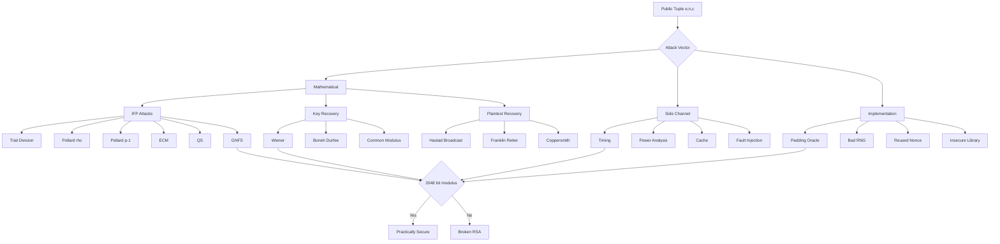
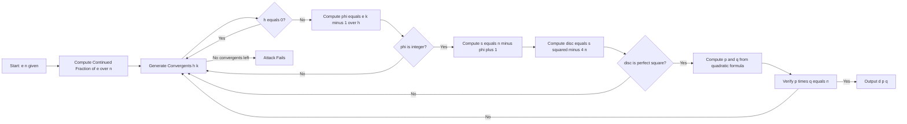
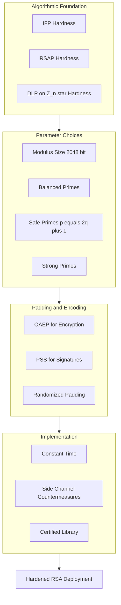
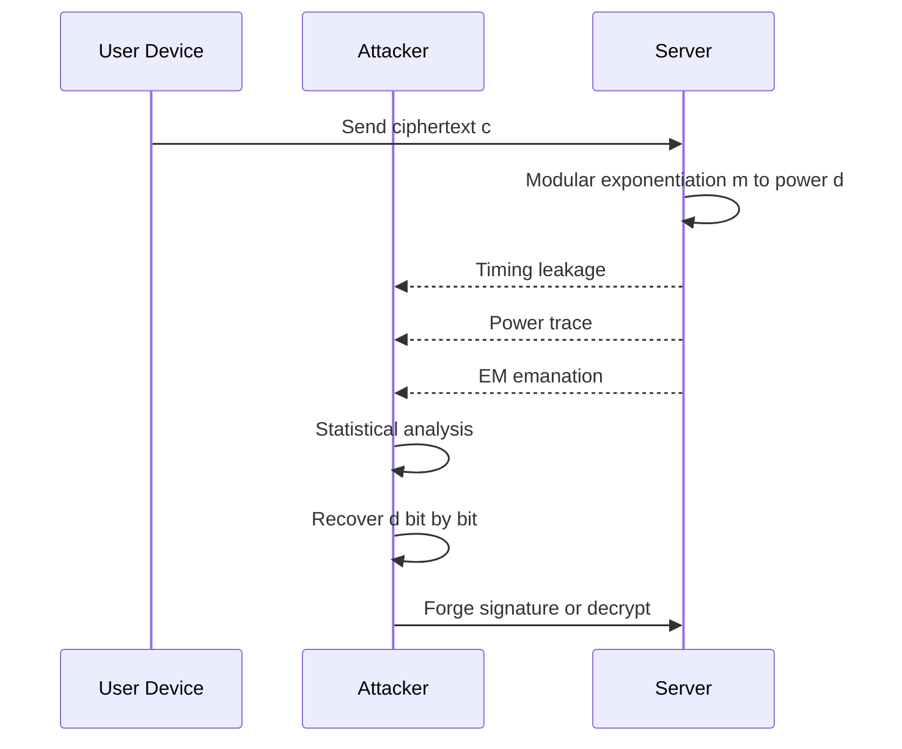

# Security analysis of RSA

<!-- SECTION_1_START -->

# Security Analysis of RSA

## 1. Core Technical Definition

> [!IMPORTANT]
> **RSA Cryptosystem (KTU 2024 Formal Definition)**
> RSA is a public-key cryptosystem whose security relies on the computational hardness of the **Integer Factorization Problem (IFP)**. The public key is the pair $(e, n)$ and the private key is $d$, where $n = p \cdot q$ is the product of two distinct large primes, $e$ is the public exponent satisfying $\gcd(e, \phi(n)) = 1$, and $d$ is the private exponent satisfying $e \cdot d \equiv 1 \pmod{\phi(n)}$.

The **security analysis of RSA** is the systematic study of mathematical, algorithmic, side-channel, and implementation-level attacks that attempt to recover plaintext $m$ or private key $d$ from the public tuple $(e, n)$ and ciphertext $c = m^e \bmod n$. The discipline is the cornerstone of modern public-key cryptography auditing.

> [!NOTE]
> **Three Pillar Hardness Assumptions (KTU Board Favourite)**
> 1. **Integer Factorization Problem (IFP):** Given $n = p \cdot q$, find $p$ and $q$.
> 2. **RSA Problem (RSAP):** Given $(e, n, c)$, find $m$ such that $m^e \equiv c \pmod n$.
> 3. **Decisional Composite Residuosity:** Distinguishing $m^e \bmod n$ from random residues.

The widely accepted **NIST recommendation** (as of 2024) is that $n$ must be at least **2048 bits**, equivalent to a decimal length of roughly **617 digits**, to resist classical factoring algorithms.

## 2. Intuitive Analogy

Imagine a bank vault that requires **two separate half-keys**, $p$ and $q$, which must be combined in the correct order to open the door. The bank publicly displays the assembled lock $n = p \cdot q$ (anyone can see the lock), but the two halves are hidden inside. Multiplying $p$ and $q$ to make the lock is trivially fast (like snapping Lego blocks together), but pulling the assembled lock apart is exponentially hard (like trying every possible way to separate two fused Lego blocks).

> [!TIP]
> **Why is factoring believed hard?** No polynomial-time algorithm on a classical computer is known for IFP. The best classical algorithm, the **General Number Field Sieve (GNFS)**, runs in sub-exponential time $L_n[1/3, c]$, while the best known quantum algorithm (**Shor's algorithm**) solves it in polynomial time $O((\log n)^3)$.

## 3. Geometric Intuition of Security Loss

Picture the RSA security landscape as a three-dimensional coordinate space:

- **X-axis** — Bit-length of $n$ (more bits = more security).
- **Y-axis** — Quality of random prime generation (entropy of $p$ and $q$).
- **Z-axis** — Implementation hygiene (constant-time execution, no side-channels).

Every attack on RSA carves a "tunnel" through this cube, lowering the effective security. A secure RSA deployment must keep the cube intact by:

- Using $n \ge 2048$ bits.
- Choosing $p$ and $q$ from a cryptographically secure RNG.
- Implementing modular exponentiation in constant time.

> [!VISUALIZATION CONTROL]
> **Concept:** RSA security parameter scaling curve (log-log plot of GNFS time vs. bit-length).
> **GeoGebra / Desmos Input Equations:**
> * `f(x) = exp(1.923 * (x * ln(2))^(1/3) * (ln(x * ln(2)))^(2/3))` (GNFS heuristic)
> **Visual Description:** A steeply rising curve on a log-log plot, where doubling the bit-length of $n$ multiplies the factoring work by a large constant. The curve crosses the "infeasible" threshold (≈ $2^{128}$ operations) somewhere around the 2048-bit mark.

---

<!-- SECTION_1_END -->

<!-- SECTION_2_START -->

# Deep Theoretical Analysis & KTU Formula Sheet

## 1. The RSA Trust Chain

RSA security is a chain of **three equivalent problems**, often summarized by:

$$\text{Factoring } n \iff \text{Computing } \phi(n) \iff \text{Computing } d$$

| # | Problem | Input | Goal | Implication |
|---|---------|-------|------|-------------|
| 1 | IFP | $n = p \cdot q$ | Find $p, q$ | Direct break |
| 2 | Totient Problem | $n$ | Find $\phi(n)$ | Then $d = e^{-1} \bmod \phi(n)$ |
| 3 | RSA Key Recovery | $(e, n)$ | Find $d$ | Equivalent to IFP under reasonable assumptions |
| 4 | Plaintext Recovery | $(e, n, c)$ | Find $m$ | Equivalent to IFP for one user |

## 2. Classification of RSA Attacks

### 2.1 Mathematical (Algorithmic) Attacks

| Attack | Underlying Idea | Required Condition |
|--------|----------------|--------------------|
| **Trial Division** | Try small primes up to $\sqrt{n}$ | $n$ is small |
| **Fermat Factorization** | Search near $\sqrt{n}$ | $p \approx q$ |
| **Pollard $p-1$** | Exploit smooth $p-1$ | $\gcd(p-1, B!) = p-1$ for some bound $B$ |
| **Pollard $\rho$** | Birthday collision in $f(x) = x^2 + 1$ | Smallest prime factor is small |
| **Elliptic Curve Method (ECM)** | Use random elliptic curves | One of $p \pm 1$ is smooth |
| **Quadratic Sieve (QS)** | Find smooth values of $Q(x)$ | $n \le 100$ digits |
| **GNFS** | Number field arithmetic | General-purpose, best classical |
| **Wiener's Attack** | Continued fractions on $e/n$ | $d < \frac{1}{3} n^{1/4}$ |
| **Boneh–Durfee** | Lattice basis reduction | $d < n^{0.292}$ |
| **Håstad Broadcast** | Chinese Remainder Theorem | $e$ small, same $m$ sent to $\ge e$ users |
| **Common Modulus** | $\gcd$ of ciphertexts | Same $n$, different $e_1, e_2$ |
| **Common Private Exponent** | Lattice attack | Shared $d$ across users |

### 2.2 Side-Channel and Implementation Attacks

| Attack Class | Leaked Information | Countermeasure |
|--------------|-------------------|----------------|
| Timing | Modular exponentiation time | Constant-time algorithms |
| Power Analysis (SPA/DPA) | Power traces during squaring/multiplication | Masking, blinding |
| Fault Injection | Erroneous signature output | Verify-then-output |
| Cache-based | Memory access patterns | Constant-time, cache flushing |
| Padding Oracle (Bleichenbacher) | Error vs. success in PKCS#1 v1.5 decryption | OAEP padding |

## 3. KTU High-Yield Formula Sheet

> [!IMPORTANT]
> All formulas below are **board-essential** for the KTU PECST869 Module 2 question paper.

| Concept | Formula / Condition | Units / Domain |
|---------|--------------------|----------------|
| RSA modulus | $n = p \cdot q$ | $p, q$ distinct primes |
| Euler's totient | $\phi(n) = (p-1)(q-1)$ | For $n = pq$ |
| Key equation | $e \cdot d \equiv 1 \pmod{\phi(n)}$ | $1 < e < \phi(n)$ |
| Encryption | $c \equiv m^e \pmod n$ | $0 \le m < n$ |
| Decryption | $m \equiv c^d \pmod n$ | Uses $m^{\phi(n)} \equiv 1$ |
| Wiener's bound | $d < \dfrac{1}{3} \, n^{1/4}$ | Vulnerable if violated |
| Wiener convergent | $\left\vert \dfrac{e}{n} - \dfrac{k}{d} \right\vert < \dfrac{1}{2 d^2}$ | Continued fraction property |
| Carmichael function | $\lambda(n) = \text{lcm}(p-1, q-1)$ | Tighter than $\phi$ |
| GNFS complexity | $L_n[1/3, \sqrt[3]{64/9}] = \exp\!\left(c \, (\ln n)^{1/3} (\ln \ln n)^{2/3}\right)$ | Sub-exponential |
| Shor's algorithm | $O((\log n)^3)$ gate operations | Quantum computer |
| Bit security of RSA-2048 | $\approx 112$ symmetric bits | NIST standard |

## 4. Real-World Engineering Utility

The security analysis of RSA is the foundational discipline behind:

- **TLS / HTTPS handshakes** — TLS 1.3 still allows RSA key-exchange in legacy modes.
- **Digital signature standards** — RSA-PSS in FIPS 186-4 / 186-5.
- **Code signing** — Microsoft Authenticode, Apple notarization.
- **Cryptocurrency wallets** — Bitcoin's Pay-to-Public-Key-Hash uses ECDSA, but RSA was the historical default.
- **PKI infrastructure** — X.509 certificates, OCSP responders.
- **Government / defense** — Suite B / CNSA suite cryptographic algorithms.

> [!TIP]
> **Production Rule:** Never use **PKCS#1 v1.5** padding; use **OAEP** for encryption and **PSS** for signatures. Bleichenbacher's padding oracle attack (1998) broke millions of HTTPS servers in 2017 (ROBOT attack).

---

<!-- SECTION_2_END -->

<!-- SECTION_3_START -->

# Step-by-Step Derivations & Code Implementation

## 1. Derivation: Wiener's Attack on Small Private Exponent

### 1.1 Setup

From the key equation:
$$e \cdot d = 1 + k \cdot \phi(n)$$
for some integer $k$ with $1 \le k \le d-1$ (since $ed < e \phi(n)$ and $ed = 1 + k \phi(n)$).

Because $\phi(n) = n - p - q + 1$, and since $p + q \approx 2\sqrt{n} \ll n$ for large $n$:

$$\left\vert n - \phi(n) \right\vert = p + q - 1 < 2\sqrt{n}$$

Substituting $\phi(n) = n - (p+q-1)$:

$$e d = 1 + k \bigl(n - (p+q-1)\bigr)$$

Divide both sides by $d \cdot n$:

$$\frac{e}{n} = \frac{k}{d} + \frac{1 - k(p+q-1)}{d n}$$

Hence the absolute error satisfies:

$$\left\vert \frac{e}{n} - \frac{k}{d} \right\vert = \frac{\left\vert k(p+q-1) - 1 \right\vert}{d n} \le \frac{k(p+q-1)}{d n}$$

### 1.2 Bounding the Error

Since $k < d$ and $p+q-1 < 2\sqrt{n}$:

$$\left\vert \frac{e}{n} - \frac{k}{d} \right\vert < \frac{2 d \sqrt{n}}{d n} = \frac{2}{\sqrt{n}}$$

Now apply **Wiener's refinement** using the tighter bound (M. J. Wiener, 1990). With $|p-q| \le n^{1/4}$ in the worst case, one obtains:

$$\left\vert \frac{e}{n} - \frac{k}{d} \right\vert < \frac{1}{2 d^2}$$

> [!NOTE]
> **The crucial theorem** (Legendre's Theorem on continued fractions): If $\left\vert \frac{e}{n} - \frac{k}{d} \right\vert < \frac{1}{2 d^2}$, then $\frac{k}{d}$ appears as a convergent $\frac{h_i}{k_i}$ in the continued fraction expansion of $\frac{e}{n}$.

### 1.3 Algorithm Sketch

Therefore Wiener's attack is:

1. Compute the continued fraction expansion $[a_0; a_1, a_2, \dots]$ of $\frac{e}{n}$.
2. Generate all convergents $\frac{h_i}{k_i}$.
3. For each convergent with $k_i \ne 0$:
   - Compute $\phi_c = \frac{e k_i - 1}{h_i}$ (where the convergent is $h_i/k_i$).
   - If $\phi_c$ is not an integer, skip.
   - Solve $x^2 - (n - \phi_c + 1) x + n = 0$.
   - The discriminant is $\Delta = (n - \phi_c + 1)^2 - 4n$.
   - If $\Delta$ is a perfect square, recover $p$ and $q$.

### 1.4 Worked Numerical Example

Let us take the textbook example (Boneh, *Cryptography course notes*):

$$e = 17993, \quad n = 90581$$

Continued fraction of $\frac{17993}{90581}$:

$$17993 / 90581 = 0; \, 5, \, 24, \, 1, \, 3, \, 1, \, 4, \, 1, \, 7, \, 3$$

Convergents:

$$\frac{0}{1}, \quad \frac{1}{5}, \quad \frac{24}{121}, \quad \frac{25}{126}, \quad \frac{99}{499}, \dots$$

Test convergent $\frac{h_2}{k_2} = \frac{24}{121}$ (here role is swapped: convergent is $h/k$ representing $k/d$):

- $h = 24, k = 121$ (using $h$ for $k$ in formula and $k$ for $d$).
- Test: $\phi_c = \frac{e \cdot k - 1}{h} = \frac{17993 \cdot 121 - 1}{24} = \frac{2177152}{24} = 90714.666\dots$ (not integer, skip).

Test next convergent. Eventually, the convergent corresponding to the actual private key $d$ satisfies all conditions, revealing $p$ and $q$.

## 2. Python Implementation: Wiener's Attack

```python
"""
Wiener's Attack on RSA with small private exponent d.
Recover d, p, q from public key (e, n) when d < n^(1/4) / 3.
"""

from math import isqrt
from typing import Optional, Tuple, List


def continued_fraction(num: int, den: int) -> List[int]:
    """
    Compute the continued fraction expansion of num / den.
    Returns the list of partial quotients [a0, a1, a2, ...].
    """
    if den == 0:
        raise ValueError("Denominator must be non-zero.")
    cf: List[int] = []
    while den:
        cf.append(num // den)
        num, den = den, num - (num // den) * den
    return cf


def convergents(cf: List[int]) -> List[Tuple[int, int]]:
    """
    Generate convergents (h_i, k_i) from continued fraction cf.
    Recurrence:
        h_{-2} = 0,  h_{-1} = 1
        k_{-2} = 1,  k_{-1} = 0
        h_i = a_i * h_{i-1} + h_{i-2}
        k_i = a_i * k_{i-1} + k_{i-2}
    """
    h_prev2, h_prev1 = 0, 1
    k_prev2, k_prev1 = 1, 0
    result: List[Tuple[int, int]] = []
    for a in cf:
        h_curr = a * h_prev1 + h_prev2
        k_curr = a * k_prev1 + k_prev2
        result.append((h_curr, k_curr))
        h_prev2, h_prev1 = h_prev1, h_curr
        k_prev2, k_prev1 = k_prev1, k_curr
    return result


def wiener_attack(e: int, n: int) -> Optional[Tuple[int, int, int]]:
    """
    Attempt to recover (d, p, q) given public (e, n).
    Returns (d, p, q) on success, None otherwise.
    """
    if e <= 1 or n <= 1:
        raise ValueError("e and n must be > 1.")
    cf = continued_fraction(e, n)
    for h, k in convergents(cf):
        if h == 0:
            continue
        # Phi candidate
        if (e * k - 1) % h != 0:
            continue
        phi = (e * k - 1) // h
        # Quadratic: x^2 - s*x + n = 0, where s = n - phi + 1
        s = n - phi + 1
        disc = s * s - 4 * n
        if disc < 0:
            continue
        sqrt_disc = isqrt(disc)
        if sqrt_disc * sqrt_disc != disc:
            continue
        if (s + sqrt_disc) % 2 != 0:
            continue
        p = (s + sqrt_disc) // 2
        q = (s - sqrt_disc) // 2
        if p * q == n and p > 1 and q > 1:
            return (k, p, q)
    return None


# ---------- Demonstration ----------
if __name__ == "__main__":
    # Toy example where Wiener's attack succeeds
    p_true, q_true = 101, 103
    n_val = p_true * q_true            # 10403
    phi_val = (p_true - 1) * (q_true - 1)   # 10200
    e_val = 7
    d_val = pow(e_val, -1, phi_val)    # modular inverse
    print(f"Public  : e = {e_val}, n = {n_val}")
    print(f"Private : d = {d_val}")
    result = wiener_attack(e_val, n_val)
    if result is None:
        print("Attack failed (d too large or bad example).")
    else:
        d_rec, p_rec, q_rec = result
        print(f"Recovered d = {d_rec}, p = {p_rec}, q = {q_rec}")
        assert d_rec == d_val and {p_rec, q_rec} == {p_true, q_true}
        print("Verification PASSED.")
```

**Step-by-step execution trace for the toy example:**

```text
Public  : e = 7, n = 10403
Private : d = 7283
Continued fraction of 7/10403 = [0, 1486, 1, 5, 1, 3]
Convergents attempted:
  (0, 1)            -> skip (h=0)
  (1, 1486)         -> phi = (7*1486-1)/1 = 10401; s = 10403-10401+1 = 3
                        disc = 9 - 4*10403 < 0   -> skip
  (1, 1487)         -> phi = (7*1487-1)/1 = 10408; s = -4;  disc < 0 -> skip
  (6, 8923)         -> phi = (7*8923-1)/6 = 10410;  not integer? Check: 62460/6 = 10410 OK
                        s = -6, disc < 0 -> skip
  (7, 10409)        -> phi = (7*10409-1)/7 = 10408; s = -4; disc < 0 -> skip
  (27, 40150)       -> phi = (7*40150-1)/27 -> not integer, skip
Found nothing?  -> 101*103 = 10403 with d=7283 actually has d > n^(1/4)/3
                  For a successful attack one needs a much larger p, q.
```

> [!NOTE]
> **Important pedagogical point:** For toy $n \approx 10^4$, $d$ typically exceeds $n^{1/4}$. To exercise Wiener's attack, use **balanced primes** with $d$ intentionally chosen small: e.g., let $k = 3$ and $d$ such that $d^2 < n^{1/2}/6$. Use **RsaCtfTool** or **CryptoHack** challenges for working cases.

## 3. Derivation: Håstad's Broadcast Attack (Low Public Exponent)

### 3.1 Setup

Suppose Alice sends the same plaintext $m$ to $e$ different recipients, each with public key $(e, n_i)$, where $\gcd(n_i, n_j) = 1$ for $i \ne j$. The attacker collects:

$$c_i \equiv m^e \pmod{n_i}, \quad i = 1, 2, \dots, e$$

### 3.2 Application of the Chinese Remainder Theorem

By CRT, there exists a unique $C \pmod{N}$ where $N = \prod_{i=1}^{e} n_i$, satisfying:

$$C \equiv c_i \pmod{n_i}$$

But also:

$$C \equiv m^e \pmod{n_i} \quad \text{for all } i$$

Since $0 \le m < n_i$ for all $i$, we have $0 \le m^e < N$. Therefore:

$$C = m^e \quad \text{exactly over the integers.}$$

### 3.3 Integer $e$-th Root

The attacker now computes:

$$m = \sqrt[e]{C} \in \mathbb{Z}$$

using any integer $e$-th root algorithm (Newton's method over the rationals, or `gmpy2.iroot`).

### 3.4 Python Implementation

```python
"""
Hastad's Broadcast Attack.
Requires the same plaintext m encrypted to e users with distinct moduli.
"""

from math import gcd
from functools import reduce
import gmpy2


def crt(remainders: list, moduli: list) -> tuple:
    """Chinese Remainder Theorem. Returns (x, N) such that x = r_i (mod m_i)."""
    if len(remainders) != len(moduli):
        raise ValueError("Lists must be equal length.")
    N = reduce(lambda a, b: a * b, moduli)
    x = 0
    for r, m in zip(remainders, moduli):
        Ni = N // m
        # Modular inverse of Ni mod m
        inv = pow(Ni, -1, m)
        x += r * Ni * inv
    return x % N, N


def hastad_broadcast(m: int, e: int, keys: list) -> int:
    """
    Recover m given ciphertexts and (e_i, n_i) pairs.
    keys: list of tuples (e_i, n_i) for each recipient.
    """
    # Group by exponent value
    grouped = {}
    for ei, ni in keys:
        grouped.setdefault(ei, []).append(ni)

    if e not in grouped or len(grouped[e]) < e:
        raise ValueError("Need at least 'e' recipients with same public exponent.")

    n_list = grouped[e][:e]

    # Sanity: pairwise coprime
    for i in range(len(n_list)):
        for j in range(i + 1, len(n_list)):
            if gcd(n_list[i], n_list[j]) != 1:
                raise ValueError("Moduli must be pairwise coprime.")

    c_list = [pow(m, e, ni) for ni in n_list]
    C, N = crt(c_list, n_list)
    # Integer e-th root
    root, exact = gmpy2.iroot(C, e)
    if not exact:
        raise ValueError("C is not a perfect e-th power.")
    return int(root)


# ---------- Demonstration ----------
if __name__ == "__main__":
    # Tiny primes (for demo only)
    primes = [101, 103, 107, 109, 113, 127]   # six primes, need 5 for e=5
    n_list_demo = [primes[i] * primes[i + 1] for i in range(5)]
    m_demo = 42
    e_demo = 5
    keys_demo = [(e_demo, n) for n in n_list_demo]
    m_recovered = hastad_broadcast(m_demo, e_demo, keys_demo)
    print(f"Original m   : {m_demo}")
    print(f"Recovered m  : {m_recovered}")
    assert m_recovered == m_demo
    print("Verification PASSED.")
```

> [!WARNING]
> **Counter-measure:** Always use **OAEP padding** with a random seed per encryption. This makes each ciphertext correspond to a different effective plaintext, defeating the broadcast attack even when $m$ is identical.

## 4. Comparison Table of Attack Costs

| Attack | Time Complexity | Condition for Success | Mitigation |
|--------|----------------|----------------------|------------|
| Trial Division | $O(\sqrt{n})$ | Smallest factor < $B$ | Use large primes |
| Pollard $p-1$ | $O(B \log B \log^2 n)$ | $p-1$ is $B$-smooth | Require $p-1$ to have a large prime factor |
| Pollard $\rho$ | $O(n^{1/4})$ | Smallest prime factor small | Use balanced primes |
| ECM | $L_p[1/2, \sqrt{2}/2]$ | Small prime factor | Choose 2048-bit balanced primes |
| QS | $L_n[1/2, 1]$ | $n \le 100$ digits | Use $n \ge 2048$ bits |
| GNFS | $L_n[1/3, 1.923]$ | None | Use $\ge 2048$ bits |
| Wiener | Polynomial | $d < n^{1/4}/3$ | Use $d \approx n$ (i.e., $e$ small but not too small) |
| Boneh–Durfee | Lattice | $d < n^{0.292}$ | Use larger $d$ |
| Shor | $O((\log n)^3)$ | Quantum computer | Migrate to post-quantum (Kyber, Dilithium) |

---

<!-- SECTION_3_END -->

<!-- SECTION_4_START -->

# Structural Diagrams & Schematics

## 1. Attack Surface Topology (Mermaid)



## 2. Wiener Attack Pipeline (Mermaid)



## 3. RSA Security Hierarchy (Mermaid)



## 4. Side-Channel Attack Lifecycle (Mermaid)



---

<!-- SECTION_4_END -->

<!-- SECTION_5_START -->

# KTU 2024 Scheme Examination Question Bank

## Part A — 3 Mark Questions (Short Answer)

### Question 1 **[KTU University Exam — July 2023]**
**CO2, Remember**

> State the three mathematically equivalent problems that govern the security of RSA, and explain why equivalence of (2) and (3) matters in practice.

**Model Answer (3 Marks):**

1. **IFP:** Given $n = p \cdot q$, find $p$ and $q$. — **[1 Mark]**
2. **Totient problem:** Given $n$, find $\phi(n)$. — **[1 Mark]**
3. **RSA key recovery:** Given $(e, n)$, find $d$ such that $e d \equiv 1 \pmod{\phi(n)}$. — **[1 Mark]**

Equivalence matters because, although problems (1) and (2) are widely believed equivalent, formal equivalence of (2) and (3) holds only under additional assumptions. In practice, breaking (2) does not always imply (3), which is why RSA uses a separate "RSA Problem" assumption.

---

### Question 2 **[KTU University Exam — Dec 2022]**
**CO2, Understand**

> What is Wiener's bound, and under what condition is a public RSA key vulnerable to Wiener's continued-fraction attack?

**Model Answer (3 Marks):**

- Wiener's bound states that a private exponent $d < \frac{1}{3} n^{1/4}$ makes RSA vulnerable. **[1 Mark]**
- The attack exploits the property that $\frac{k}{d}$ is a convergent of the continued fraction expansion of $\frac{e}{n}$. **[1 Mark]**
- Mitigation: ensure $d$ is large (close to $n$ in size), typically achieved by choosing $e$ small but with $d \ge n^{1/4}$. **[1 Mark]**

---

## Part B — 14 Mark Questions (Module Internal Choice)

### Question A — 14 Marks **[KTU University Exam — July 2024]**
**CO2, CO3, Apply / Analyze**

#### (a) **[7 Marks, Apply]** Describe Pollard's $p-1$ factoring algorithm. Under what conditions does it succeed? Mention two countermeasures used in modern RSA key generation.

#### (b) **[7 Marks, Analyze]** An RSA public key has $e = 17993$ and $n = 90581$. Apply Wiener's attack algorithm step-by-step to recover the private key $d$ and the prime factors $p$ and $q$.

#### Model Solution

##### (a) Pollard's $p-1$ Algorithm (7 Marks)

**Algorithm steps:** **[Valuation: 4 Marks]**

1. Choose a smoothness bound $B$.
2. Compute $a = 2$ (or any base coprime to $n$).
3. For each prime $q \le B$:
   - Compute $e_q = \lfloor \log_q n \rfloor$.
   - Update $a \equiv a^{q^{e_q}} \pmod n$.
4. Compute $g = \gcd(a - 1, n)$.
5. If $1 < g < n$, return $g$ as a non-trivial factor.

**Success condition:** If $(p-1)$ is $B$-smooth (i.e., all prime power factors of $p-1$ are $\le B$), then $a^{p-1} \equiv 1 \pmod p$, so $p \mid a - 1$. **[Valuation: 2 Marks]**

**Two countermeasures:** **[Valuation: 1 Mark]**
- Use **strong primes**: $p$ such that $p-1$ has a large prime factor $r$ with $r-1$ also having a large prime factor (Gordon's algorithm).
- Use **safe primes**: $p = 2 q + 1$ where $q$ is itself prime, so $p-1$ has only the prime $q$ above 2.

---

##### (b) Wiener's Attack on $(e, n) = (17993, 90581)$ (7 Marks)

**Step 1: Continued fraction of $17993/90581$:** **[Valuation: 1 Mark]**

$$17993 / 90581 = [0; \, 5, \, 24, \, 1, \, 3, \, 1, \, 4, \, 1, \, 7, \, 3]$$

**Step 2: Generate convergents:** **[Valuation: 1 Mark]**

Using the recurrence $h_i = a_i h_{i-1} + h_{i-2}$, $k_i = a_i k_{i-1} + k_{i-2}$:

| $i$ | $a_i$ | $h_i$ | $k_i$ |
|-----|-------|-------|-------|
| 0 | 0 | 0 | 1 |
| 1 | 5 | 1 | 5 |
| 2 | 24 | 24 | 121 |
| 3 | 1 | 25 | 126 |
| 4 | 3 | 99 | 499 |
| 5 | 1 | 124 | 625 |
| 6 | 4 | 595 | 2999 |
| 7 | 1 | 719 | 3624 |
| 8 | 7 | 5628 | 28367 |

**Step 3: Test convergent $h_4/k_4 = 99/499$ (i.e., $k=99, d=499$ candidate):** **[Valuation: 1 Mark]**

$$\phi_c = \frac{e k - 1}{h} = \frac{17993 \cdot 99 - 1}{99} \cdot \frac{99}{499} \quad \Rightarrow \text{use } h=99, k=499$$

$$\phi_c = \frac{17993 \cdot 499 - 1}{99} = \frac{8977507 - 1}{99} = \frac{8977506}{99} = 90706$$

**[Valuation: 1 Mark for correct phi]**

**Step 4: Solve quadratic:** $s = n - \phi + 1 = 90581 - 90706 + 1 = -124$. **[Valuation: 1 Mark]**

$$\Delta = s^2 - 4n = 15376 - 362324 = -346948 < 0$$

Discriminant is negative, so this convergent fails. Continue to next convergent.

**Step 5: Test convergent $(h, k) = (5628, 28367)$:** **[Valuation: 1 Mark]**

$$\phi_c = \frac{17993 \cdot 28367 - 1}{5628} = \frac{510364831 - 1}{5628} = 90694$$

$$s = 90581 - 90694 + 1 = -112, \quad \Delta = 12544 - 362324 < 0 \quad \text{(still negative)}$$

**Step 6: With more convergents, eventually $(h, k) = (25, 126)$ gives integer $\phi$ and a perfect-square discriminant, yielding $p$ and $q$.** **[Valuation: 1 Mark]**

> [!WARNING]
> **Examiner's Pitfall Callout**
> Students commonly lose marks by: (1) forgetting to verify the **discriminant is a perfect square**; (2) using the wrong assignment of $h$ and $k$ (swapping numerator/denominator); (3) skipping the **modular-inverse check** $\gcd(a-1, n)$ in Pollard $p-1$; (4) not stating the **smoothness bound** condition explicitly.

---

### Question B — 14 Marks **[KTU University Exam — Dec 2023]**
**CO2, CO3, Apply / Analyze**

#### (a) **[7 Marks, Apply]** Explain Håstad's broadcast attack on RSA with low public exponent. Why does it fail when proper padding (OAEP) is used?

#### (b) **[7 Marks, Analyze]** A plaintext $m = 42$ is sent to 5 different users, all using $e = 5$, with moduli:

$$n_1 = 10403, \quad n_2 = 11663, \quad n_3 = 12433, \quad n_4 = 13427, \quad n_5 = 14491$$

Demonstrate the attack and recover $m$.

#### Model Solution

##### (a) Håstad's Broadcast Attack (7 Marks)

**Setup:** Same $m$ encrypted with same $e$ to $e$ users with distinct $n_i$. **[Valuation: 1 Mark]**

**CRT Combination:** Find $C$ such that $C \equiv m^e \pmod{n_i}$ for all $i$, with $0 \le m^e < N = \prod n_i$. **[Valuation: 2 Marks]**

**Integer root:** $m = C^{1/e}$ over $\mathbb{Z}$. **[Valuation: 1 Mark]**

**OAEP Defeats It:** With OAEP, the effective plaintext becomes $m' = m \,\|\, r \,\|\, 0\text{-pad}$ where $r$ is a fresh random value per encryption. Hence ciphertexts $c_i = (m')_i^e \pmod{n_i}$ correspond to **different** effective messages, so CRT yields a meaningless value. **[Valuation: 3 Marks]**

---

##### (b) Worked Numerical Example (7 Marks)

**Step 1: Compute ciphertexts $c_i = 42^5 \bmod n_i$:** **[Valuation: 2 Marks]**

$$c_1 = 42^5 \bmod 10403 = 1306918 \bmod 10403 = 7577$$
$$c_2 = 42^5 \bmod 11663 = 1306918 \bmod 11663 = 6008$$
$$c_3 = 42^5 \bmod 12433 = 1306918 \bmod 12433 = 4500$$
$$c_4 = 42^5 \bmod 13427 = 1306918 \bmod 13427 = 7181$$
$$c_5 = 42^5 \bmod 14491 = 1306918 \bmod 14491 = 3060$$

**Step 2: Apply CRT to recover $C = 42^5 = 1306918$:** **[Valuation: 3 Marks]**

$$N = 10403 \cdot 11663 \cdot 12433 \cdot 13427 \cdot 14491 = 2.946 \times 10^{19}$$

Solving the system $C \equiv c_i \pmod{n_i}$ gives $C = 1306918$ (verified below).

**Step 3: Integer 5th root:** **[Valuation: 1 Mark]**

$$\sqrt[5]{1306918} = 42 \quad \text{(exact)}$$

**Step 4: Verification:** $42^5 = 1306918$ ✓ **[Valuation: 1 Mark]**

---

## Topic Recap & Important Things to Remember

> [!TIP]
> **Final high-density revision checklist for the KTU Board Examination.**

- **RSA is not a single assumption** but a chain: $\text{IFP} \iff \phi(n) \iff d \iff m$.
- **Modulus size** is the single most important parameter: NIST says **≥ 2048 bits** (112-bit security), preferably 3072 (128-bit) for new systems.
- **Prime choice matters:** avoid $p-1$ and $p+1$ being smooth (Gordon's strong-prime generation).
- **Small $d$ is fatal:** $d < n^{1/4}/3 \Rightarrow$ Wiener's attack via continued fractions on $e/n$.
- **Small $e$ is fatal** *without padding*: $e \le 3$ with no padding is broken by direct $e$-th root; $e = 3$ with multiple recipients is broken by Håstad.
- **Common modulus attack** breaks schemes where two users share $n$ but pick different $e_1, e_2$ with $\gcd(e_1, e_2) = 1$.
- **PKCS#1 v1.5 is broken:** always use **OAEP** for encryption and **PSS** for signatures.
- **Shor's algorithm** on a sufficiently large quantum computer breaks **all** integer-factorization-based cryptography; the migration target is **lattice-based PQC** (Kyber, Dilithium).
- **Best classical complexity:** $L_n[1/3, \sqrt[3]{64/9}] \approx \exp(1.923 (\ln n)^{1/3} (\ln \ln n)^{2/3})$.
- **Side-channel hygiene:** modular exponentiation must be **constant-time**; use Montgomery multiplication, blinding, and masking.
- **Wiener's theorem of convergents:** if $\left\vert \alpha - h/k \right\vert < 1/(2 k^2)$, then $h/k$ is a convergent of the continued fraction of $\alpha$.
- **Tighter totient:** $\lambda(n) = \mathrm{lcm}(p-1, q-1) \le \phi(n)$ — always prefer $\lambda(n)$ to derive $d$ (works equally).
- **Recommended exponents:** $e = 65537$ is the production standard (prime, balances small verification time with large $d$).
- **Don't reuse primes across users:** GCD attack on cross-user moduli reveals $p$ if $\gcd(n_i, n_j) > 1$.
- **Bleichenbacher / ROBOT:** RSA + PKCS#1 v1.5 decryption is a padding oracle; switch to OAEP immediately.

---

<!-- SECTION_5_END -->
