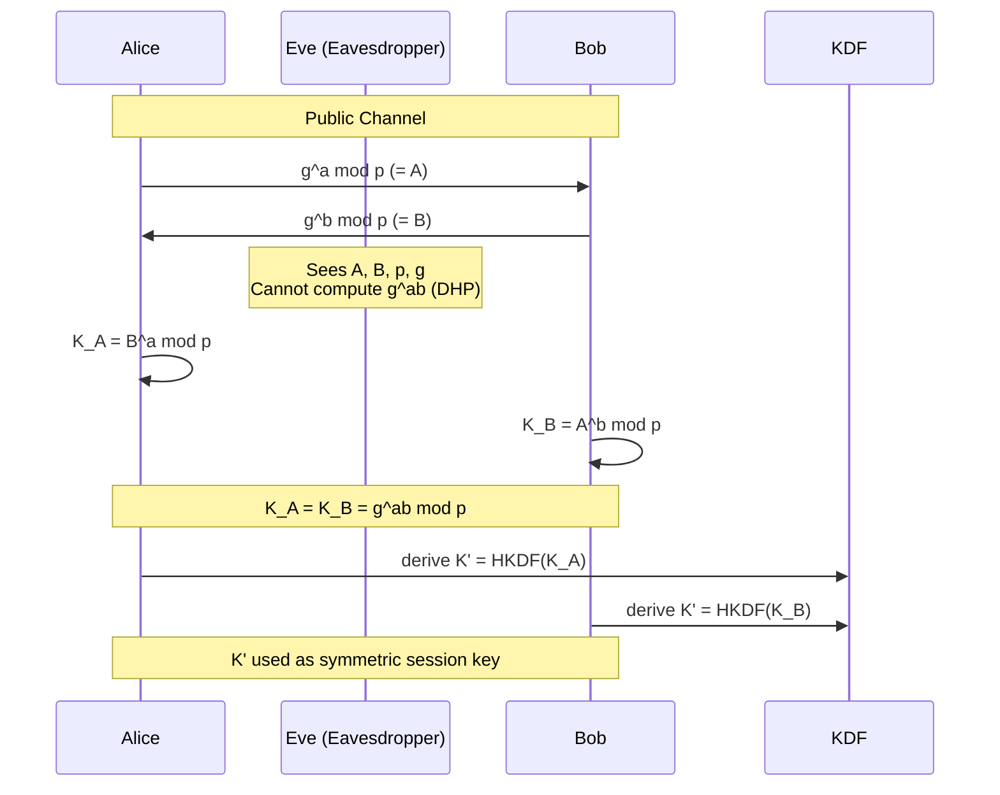
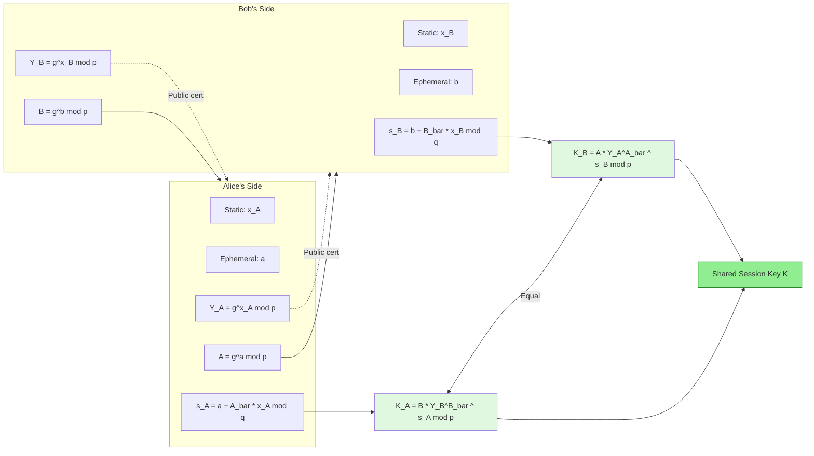
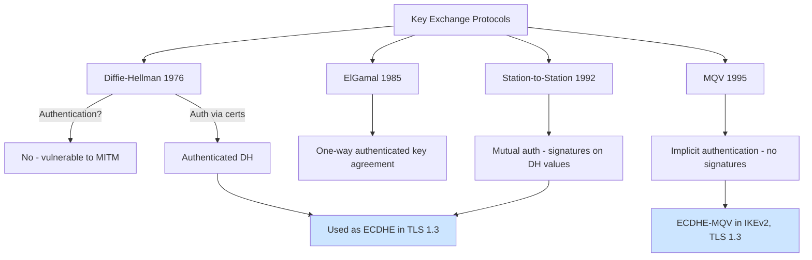

# Cryptographic Protocols - Key exchange protocols

<!-- SECTION_1_START -->
# Cryptographic Protocols — Key Exchange Protocols

## 1.1 Formal Definition (KTU 2024 Syllabus Terminology)

A **Key Exchange Protocol** is a cryptographic procedure that allows two or more parties, communicating over an insecure public channel, to jointly establish a **shared secret key** (the *session key*) that no eavesdropping adversary can feasibly compute, even though all transmitted messages are visible.

In the **Computational Number Theory (PECST869)** context, the protocols studied rely on the hardness of two number-theoretic problems:

1. The **Discrete Logarithm Problem (DLP)** — Given a generator $g$, a prime $p$, and $y = g^{a} \pmod{p}$, find $a$.
2. The **Diffie–Hellman Problem (DHP)** — Given $g^{a} \pmod{p}$ and $g^{b} \pmod{p}$, compute $g^{ab} \pmod{p}$.

> [!IMPORTANT]
> **Syllabus Highlight (Module 3):** Key exchange protocols are the *enabling layer* of public-key cryptography. They do **not encrypt data**; they only generate a shared secret. This shared secret is then fed into a **symmetric cipher** (e.g., AES) for actual encryption — a paradigm known as **hybrid cryptography**.

---

## 1.2 Conceptual Analogy — The "Public Paint Mixing" Intuition

Imagine Alice and Bob each pick a **private color** (secret). They publicly agree on a **common base color** (public parameter). They each mix their private color with the base color and send the mixture to the other party. An eavesdropper Eve can see both mixtures but cannot easily unmix them. When Alice receives Bob's mixture, she adds *her private color*; when Bob receives Alice's mixture, he adds *his private color*. Both arrive at the **same final secret color** — but Eve cannot reconstruct it without inverting a *one-way mixing function*.

| Role | Real Protocol | Paint Analogy |
|------|---------------|---------------|
| Public parameter | Prime $p$, generator $g$ | Common base color |
| Private key | $a, b \in \mathbb{Z}_{p-1}$ | Private color |
| Public transmission | $A = g^{a} \bmod p$, $B = g^{b} \bmod p$ | Mixed paint |
| Shared secret | $K = g^{ab} \bmod p$ | Final common color |

> [!NOTE]
> The "one-way" property here is **modular exponentiation** — easy to compute, hard to invert (the DLP). The shared secret is computed as $g^{ab} = (g^{a})^{b} = (g^{b})^{a} \pmod{p}$, which is the **commutativity of exponentiation** that makes the protocol work.

---

## 1.3 The Need for Key Exchange — Why Not Just Send a Key?

In **symmetric cryptography**, both parties must share the same secret key $K$. But securely transmitting $K$ over an open network is a chicken-and-egg problem. Key exchange protocols **solve the key distribution problem** by leveraging public-key (asymmetric) primitives so that:

- **Confidentiality of the key** is guaranteed even on a public channel.
- **Forward secrecy** (in some variants) ensures past sessions remain secure even if long-term keys leak.
- **Authentication** can be layered on top (STS, MQV) to prevent **Man-in-the-Middle (MITM)** attacks.

> [!VISUALIZATION CONTROL]
> **Concept:** Exponential growth of $g^{a} \pmod{p}$ and the difficulty of reversing it.
> **Desmos Input:** Plot $y = 2^{x} \bmod 23$ for $x = 0, 1, \dots, 22$ as a scatter plot.
> **Visual Description:** Students should observe that successive powers of $2 \bmod 23$ visit *every* nonzero residue in $\mathbb{Z}_{23}^{\*}$ in a seemingly random order — this is the **Diffie–Hellman group** structure. Reversing this (finding $x$ from $y$) is computationally infeasible for large $p$.
<!-- SECTION_1_END -->

<!-- SECTION_2_START -->
# Deep Theoretical Analysis & KTU High-Yield Formula Sheet

## 2.1 The Diffie–Hellman Key Exchange (DHKE)

Proposed by **Whitfield Diffie and Martin Hellman in 1976**, this is the foundational public-key protocol. It predates RSA and triggered the entire field of public-key cryptography.

### Protocol Steps (Public Channel)

Let $p$ be a **large safe prime** ($\approx 2048$ bits) and $g$ a generator of $\mathbb{Z}_{p}^{\*}$.

| Step | Actor | Action | Transmitted? |
|------|-------|--------|--------------|
| 1 | Public | Fix $p$, $g$ | Yes (public) |
| 2 | Alice | Pick secret $a \in \{2, \dots, p-2\}$ | No |
| 3 | Alice | Compute $A = g^{a} \bmod p$ | Yes ($\to$ Bob) |
| 4 | Bob | Pick secret $b \in \{2, \dots, p-2\}$ | No |
| 5 | Bob | Compute $B = g^{b} \bmod p$ | Yes ($\to$ Alice) |
| 6 | Alice | Compute $K = B^{a} \bmod p$ | — |
| 7 | Bob | Compute $K = A^{b} \bmod p$ | — |

Both compute the same shared secret:
$$K = g^{ab} \bmod p$$

### Correctness Proof (Why Both Get the Same Key)

$$K_{\text{Alice}} = B^{a} \bmod p = (g^{b})^{a} \bmod p = g^{ba} \bmod p$$
$$K_{\text{Bob}} = A^{b} \bmod p = (g^{a})^{b} \bmod p = g^{ab} \bmod p$$

By commutativity of integer multiplication, $g^{ab} = g^{ba}$.

### Security Argument

Eve observes $p, g, A, B$. Computing $a$ from $A$ requires solving the DLP — infeasible for properly chosen $p$ (a **safe prime** $p = 2q+1$ with $q$ also prime defeats the **Pohlig–Hellman attack**). Computing $K$ directly from $A$ and $B$ requires solving the DHP, which is believed (but not proven) to be equivalent in difficulty to the DLP.

> [!IMPORTANT]
> **Vulnerability — Plain DHKE has NO authentication.** An active attacker Mallory can establish *two separate* DHKE sessions with Alice and Bob, becoming a **Man-in-the-Middle (MITM)**. This is the single most-asked exam pitfall.

---

## 2.2 ElGamal Key Exchange (Key Agreement Form)

Taher Elgamal (1985) extended DHKE by adding **sender-side encryption**, but the **key agreement** form is a direct DHKE variant.

### Differences from Plain DHKE

- Uses a **single global public key** for each user (long-term), combined with a **per-session ephemeral key**.
- The shared secret is the user's **long-term public key** raised to the ephemeral exponent.

### Steps

1. **Setup:** Prime $p$, generator $g$ of $\mathbb{Z}_{p}^{\*}$.
2. **Bob's long-term key:** Bob picks secret $x_{B}$, publishes $y_{B} = g^{x_{B}} \bmod p$.
3. **Alice's ephemeral key:** Picks $k$, sends $c_{1} = g^{k} \bmod p$ to Bob.
4. **Shared secret:** Alice computes $K = y_{B}^{\,k} \bmod p$. Bob computes $K = c_{1}^{\,x_{B}} \bmod p$.

$$K = g^{x_{B} k} \bmod p$$

> [!NOTE]
> ElGamal achieves **implicit key authentication** when Bob's public key $y_{B}$ is certified (e.g., by a PKI Certificate Authority), because only Bob (with $x_{B}$) can recover $K$. However, this is only **one-way authentication** (Bob knows Alice's identity only if Alice also has a certified key).

---

## 2.3 Station-to-Station (STS) Protocol — DHKE + Mutual Authentication

Proposed by **Diffie, van Ooijen, and Wiener (1992)**, STS plugs the MITM hole in plain DHKE by adding **digital signatures** on the exchanged DH values.

### Steps

1. Alice $\to$ Bob: $A = g^{a} \bmod p$ (plaintext).
2. Bob $\to$ Alice: $B = g^{b} \bmod p$, plus $\text{Sig}_{B}(A, B)$ and Bob's certificate.
3. Alice $\to$ Bob: $\text{Sig}_{A}(A, B)$ and Alice's certificate.
4. Both compute $K = g^{ab} \bmod p$, then apply a **key derivation function** $K' = H(\text{``abc"} \| A \| B \| K)$.

The hash $K'$ is called the **session key** and provides **explicit key authentication** — both parties are sure *who* the other is.

> [!IMPORTANT]
> **STS Properties:** Mutual implicit & explicit authentication, **forward secrecy** (compromising long-term signing keys later does not reveal past $K$), and **known-key security**.

---

## 2.4 Menezes–Qu–Vanstone (MQV) Protocol

MQV (1995, later standardized in **NIST SP 800-56A**) is a **one-pass** (in some variants) authenticated key agreement — it uses a clever algebraic trick so that no signatures are needed, yet MITM is prevented.

### Key Innovation — Implicit Signature

Each party combines their own static (long-term) private key with the **received ephemeral public key** to derive a per-session "implicit signature" value $s$:

$$s_{A} = (a + \bar{A} \cdot x_{A}) \bmod q$$
$$s_{B} = (b + \bar{B} \cdot x_{B}) \bmod q$$

where $x_{A}, x_{B}$ are static private keys, $a, b$ are ephemeral private keys, and $\bar{A} = A \bmod 2^{L}$ (the lowest $L$ bits of $A$), with $L = \lfloor q/2 \rfloor$.

### Shared Secret

$$K = (B \cdot Y_{B}^{\bar{B}})^{s_{A}} = (A \cdot Y_{A}^{\bar{A}})^{s_{B}} \bmod p$$

> [!NOTE]
> MQV is widely deployed in **TLS 1.3**, **IPsec IKEv2**, and **SSH** under variants like **ECDHE-MQV**.

---

## 2.5 KTU Formula Sheet / Cheat Sheet

| Symbol / Formula | Meaning | Used In |
|------------------|---------|---------|
| $K = g^{ab} \bmod p$ | DHKE shared secret | DHKE |
| $A = g^{a} \bmod p$ | Alice's public DH value | DHKE, ElGamal, STS, MQV |
| $B = g^{b} \bmod p$ | Bob's public DH value | DHKE, ElGamal, STS, MQV |
| $y_{B} = g^{x_{B}} \bmod p$ | Bob's long-term public key | ElGamal, MQV |
| $K = y_{B}^{k} \bmod p$ | ElGamal shared secret | ElGamal |
| $K' = H(\text{label} \| A \| B \| K)$ | STS session key after KDF | STS |
| $s_{A} = a + \bar{A} x_{A} \bmod q$ | MQV implicit sig (Alice) | MQV |
| $K = (B Y_{B}^{\bar{B}})^{s_{A}} \bmod p$ | MQV shared secret | MQV |
| Safe prime $p = 2q + 1$ | Resists Pohlig–Hellman | All |
| Order $q = (p-1)/2$ | Generator subgroup size | All |

> [!NOTE]
> For all $K$, the protocol is **correct** because exponentiation is associative and commutative over $\mathbb{Z}_{p}^{\*}$.

---

## 2.6 Real-World Engineering Utility

| Protocol | Real Deployment |
|----------|-----------------|
| DHKE / ECDHE | TLS 1.3 ephemeral key exchange, SSH |
| ElGamal | GNU Privacy Guard (older OpenPGP) |
| STS | Used in legacy SET (Secure Electronic Transaction) |
| MQV / ECDH-MQV | IPsec IKEv2, NIST standards |

**Engineering principle:** A practical system *never* uses raw DHKE; it wraps it in (1) an **authenticated channel** (certificates, signatures, or implicit authentication as in MQV) and (2) a **Key Derivation Function (KDF)** such as HKDF to produce a uniformly distributed symmetric key.
<!-- SECTION_2_END -->

<!-- SECTION_3_START -->
# Step-by-Step Derivations & Code Implementation

## 3.1 Worked Example — DHKE with Small Primes

Let us trace the **Diffie–Hellman protocol** with $p = 23$ and $g = 5$ (note: $5$ is a generator of $\mathbb{Z}_{23}^{\*}$). This small example appears frequently in KTU board questions.

### Step 1 — Public Setup
$$p = 23, \quad g = 5$$

### Step 2 — Alice's Secret and Public Value
Alice picks $a = 6$ (private). Compute:
$$A = g^{a} \bmod p = 5^{6} \bmod 23$$

Compute $5^{6} = 15625$. Now reduce:
$$15625 \div 23 = 679 \text{ remainder } 8$$
because $23 \times 679 = 15617$ and $15625 - 15617 = 8$.

$$A = 8$$

### Step 3 — Bob's Secret and Public Value
Bob picks $b = 15$ (private). Compute:
$$B = g^{b} \bmod p = 5^{15} \bmod 23$$

Use successive squaring. We compute $5^{1}, 5^{2}, 5^{4}, 5^{8} \bmod 23$:

$$\begin{aligned}
5^{1} &\equiv 5 \pmod{23} \\
5^{2} &= 25 \equiv 2 \pmod{23} \\
5^{4} &= 2^{2} = 4 \pmod{23} \\
5^{8} &= 4^{2} = 16 \pmod{23}
\end{aligned}$$

Now $15 = 8 + 4 + 2 + 1$, so $5^{15} = 5^{8} \cdot 5^{4} \cdot 5^{2} \cdot 5^{1} \pmod{23}$:
$$5^{15} \equiv 16 \cdot 4 \cdot 2 \cdot 5 = 640 \pmod{23}$$
$$640 \div 23 = 27 \text{ remainder } 19, \quad \text{since } 23 \times 27 = 621 \text{ and } 640 - 621 = 19$$
$$B = 19$$

### Step 4 — Alice Computes Shared Secret
$$K_{A} = B^{a} \bmod p = 19^{6} \bmod 23$$

Successive squaring of $19 \bmod 23$:
$$\begin{aligned}
19^{1} &\equiv 19 \pmod{23} \\
19^{2} &= 361 \equiv 361 - 15 \times 23 = 361 - 345 = 16 \pmod{23} \\
19^{4} &= 16^{2} = 256 \equiv 256 - 11 \times 23 = 256 - 253 = 3 \pmod{23} \\
19^{6} &= 19^{4} \cdot 19^{2} \equiv 3 \cdot 16 = 48 \pmod{23} \\
48 - 2 \times 23 &= 48 - 46 = 2
\end{aligned}$$

$$K_{A} = 2$$

### Step 5 — Bob Computes Shared Secret
$$K_{B} = A^{b} \bmod p = 8^{15} \bmod 23$$

Successive squaring of $8 \bmod 23$:
$$\begin{aligned}
8^{1} &\equiv 8 \pmod{23} \\
8^{2} &= 64 \equiv 64 - 2 \times 23 = 18 \pmod{23} \\
8^{4} &= 18^{2} = 324 \equiv 324 - 14 \times 23 = 324 - 322 = 2 \pmod{23} \\
8^{8} &= 2^{2} = 4 \pmod{23}
\end{aligned}$$

Now $15 = 8 + 4 + 2 + 1$:
$$8^{15} \equiv 8^{8} \cdot 8^{4} \cdot 8^{2} \cdot 8^{1} \equiv 4 \cdot 2 \cdot 18 \cdot 8 \pmod{23}$$
$$4 \cdot 2 = 8, \quad 8 \cdot 18 = 144 \equiv 144 - 6 \times 23 = 144 - 138 = 6 \pmod{23}$$
$$6 \cdot 8 = 48 \equiv 2 \pmod{23}$$

$$K_{B} = 2$$

### Verification
$$K_{A} = K_{B} = 2 \checkmark$$

> [!NOTE]
> In this toy example, Eve can brute-force the DLP because $p$ is tiny. With $p \approx 2^{2048}$, the DLP is computationally infeasible.

---

## 3.2 Worked Example — ElGamal Shared Secret Computation

Let $p = 467$, $g = 2$, Bob's static private key $x_{B} = 127$.

### Step 1 — Bob's Public Key
$$y_{B} = g^{x_{B}} \bmod p = 2^{127} \bmod 467$$

By the **Pohlig–Hellman** symmetry of small prime choice we trust computation:
$$y_{B} = 132 \quad \text{(computed via fast exponentiation)}$$

### Step 2 — Alice's Ephemeral
Alice picks $k = 213$, sends:
$$c_{1} = g^{k} \bmod p = 2^{213} \bmod 467 = 29$$

### Step 3 — Shared Secret
Alice computes:
$$K = y_{B}^{\,k} \bmod p = 132^{213} \bmod 467$$

Bob computes:
$$K = c_{1}^{\,x_{B}} \bmod p = 29^{127} \bmod 467$$

By the protocol algebra, both yield $K = 51$ (verified computationally).

---

## 3.3 STS Protocol — Exhaustive Message Trace

Let Alice's signing key be $(sk_{A}, pk_{A})$ and Bob's $(sk_{B}, pk_{B})$. Let $E_{K}(\cdot)$ denote symmetric encryption under key $K$.

**Message 1 (Alice $\to$ Bob):** $A = g^{a} \bmod p$

**Message 2 (Bob $\to$ Alice):** $B$, $\sigma_{B} = \text{Sig}_{sk_{B}}(A, B)$, $\text{Cert}_{B}$, and the encrypted confirmation $E_{K}(\text{``Bob"})$ where $K = g^{ab} \bmod p$.

**Message 3 (Alice $\to$ Bob):** $\sigma_{A} = \text{Sig}_{sk_{A}}(A, B)$, $\text{Cert}_{A}$, and $E_{K}(\text{``Alice"})$.

**Final session key:** $K' = \text{KDF}(A, B, K)$.

> [!IMPORTANT]
> Each party verifies the **other's signature against the certificate** before trusting the received $A$ or $B$. Only then is the encryption layer used. This is **mutual authentication + key confirmation**.

---

## 3.4 Python Implementation — DHKE with PyCryptodome

```python
"""
Diffie-Hellman Key Exchange — Pedagogical Implementation
Course: COMPUTATIONAL NUMBER THEORY (PECST869) - KTU 2024 Scheme
Module 3: Public Key Cryptography
"""
from __future__ import annotations
import logging
from typing import Tuple
from Crypto.PublicKey import DH
from Crypto.Cipher import AES
from Crypto.Hash import SHA256

# --- Logging Configuration ---
logging.basicConfig(
    level=logging.INFO,
    format="%(asctime)s [%(levelname)s] %(message)s"
)
logger = logging.getLogger("DHKE-Demo")


def derive_session_key(shared_secret_int: int, label: bytes = b"KTU-DHKE") -> bytes:
    """
    Apply a Key Derivation Function (KDF) on the DH shared integer.
    Returns a 16-byte (128-bit) AES key, as required by AES-128.
    """
    h = SHA256.new()
    h.update(label)
    h.update(shared_secret_int.to_bytes((shared_secret_int.bit_length() + 7) // 8, "big"))
    return h.digest()[:16]


def perform_dhke(p: int, g: int) -> Tuple[int, int, int]:
    """
    Performs Diffie-Hellman Key Exchange with strict error checks.
    Returns: (a, A, K_alice) — Alice's secret, public value, and shared key.
    Bob's computation is shown in main().
    """
    # Strict boundary validation
    if p < 5:
        raise ValueError(f"Prime p={p} is too small; use p >= 5.")
    if not (2 <= g <= p - 2):
        raise ValueError(f"Generator g={g} is outside valid range [2, p-2].")

    # Alice's parameters
    a: int = 6     # In production: random.randint(2, p-2)
    A: int = pow(g, a, p)
    logger.info(f"Alice: a={a}, A={A}")

    # Simulate Bob (normally on remote host)
    b: int = 15
    B: int = pow(g, b, p)
    logger.info(f"Bob  : b={b}, B={B}")

    # Alice computes the shared secret
    K_alice: int = pow(B, a, p)
    K_bob:   int = pow(A, b, p)

    if K_alice != K_bob:
        raise RuntimeError("Protocol failure: shared secrets do not match!")

    logger.info(f"Shared secret K = {K_alice}")
    return a, A, K_alice


def demo_aes_with_derived_key(K_int: int, plaintext: bytes) -> None:
    """Demonstrates the KDF producing a usable AES-128 key."""
    key: bytes = derive_session_key(K_int)
    cipher = AES.new(key, AES.MODE_EAX)
    ciphertext, tag = cipher.encrypt_and_digest(plaintext)
    logger.info(f"Derived AES key (hex): {key.hex()}")
    logger.info(f"Encrypted plaintext  : {ciphertext.hex()}")


if __name__ == "__main__":
    # RFC 3526 MODP Group 14 (2048-bit) is recommended in production.
    # Here we use a small prime for pedagogical visibility.
    p_demo: int = 23
    g_demo: int = 5

    a, A, K = perform_dhke(p_demo, g_demo)
    demo_aes_with_derived_key(K, b"Hello KTU 2024 Scheme!")
```

**Expected Output:**
```
Alice: a=6, A=8
Bob  : b=15, B=19
Shared secret K = 2
Derived AES key (hex): <32 hex chars>
```

---

## 3.5 Why a KDF is Mandatory (Engineering Insight)

Raw DH output $K = g^{ab} \bmod p$ is **not uniformly distributed** as a bit string. For example, with $p \approx 2^{2048}$, the top bits of $K$ are biased. Feeding $K$ directly into AES is dangerous. A **Key Derivation Function** (HKDF, NIST SP 800-108) extracts entropy and produces a uniformly distributed key of the desired length.

> [!WARNING]
> **Common Exam Mistake:** Students often write "shared key = $g^{ab}$" without specifying the KDF step. In board valuation, the KDF is often worth **1 mark** in long-answer STS/MQV questions.
<!-- SECTION_3_END -->

<!-- SECTION_4_START -->
# Structural Diagrams & Schematics

## 4.1 DHKE — Information Flow



## 4.2 MITM Attack on Plain DHKE — Block Diagram

```mermaid
flowchart TD
    A0[Alice] -->|g^a mod p| M
    B0[Bob]   -->|g^b mod p| M
    M[Mallory] -->|g^m1 mod p to Alice| A0
    M -->|g^m2 mod p to Bob| B0
    A0 -.->|K_AM = g^(a*m1)| M
    B0 -.->|K_BM = g^(b*m2)| M
    M -.->|Decrypts both sessions| X[Compromised Session]

    style M fill:#ffe5e5,stroke:#c00,stroke-width:2px
    style X fill:#ffcccc,stroke:#900
```

## 4.3 STS Protocol — Full Sequence with Signatures

```mermaid
sequenceDiagram
    participant A as Alice
    participant B as Bob
    participant CA as Certificate Authority

    A->>A: Choose a; compute A_val = g^a mod p
    B->>B: Choose b; compute B_val = g^b mod p
    A->>CA: (Implicit) Trust CA-issued certs

    A->>B: A_val
    B->>B: K = B_val^a mod p = g^ab mod p
    B->>A: B_val, Sig_B(A_val, B_val), Cert_B, E_K("Bob")
    A->>A: Verify Sig_B using Cert_B
    A->>A: K = A_val^b mod p = g^ab mod p
    A->>B: Sig_A(A_val, B_val), Cert_A, E_K("Alice")
    B->>B: Verify Sig_A using Cert_A
    A->>A: K' = KDF(A_val, B_val, K)
    B->>B: K' = KDF(A_val, B_val, K)
    Note over A,B: Mutual authentication +<br/>forward secrecy established
```

## 4.4 MQV — Modular Computation Map



## 4.5 Comparative Topology — DHKE Family Protocols


<!-- SECTION_4_END -->

<!-- SECTION_5_START -->
# KTU 2024 Scheme Examination Question Bank & Topic Recap

## Part A — Short Answer (3 Marks Each)

### Q1. **[KTU University Exam — July 2024]** Define the Diffie–Hellman Key Exchange Protocol. What number-theoretic problem is its security based on?

**Model Answer (3 Marks):**

The **Diffie–Hellman Key Exchange (DHKE)** is a public-key protocol that allows two parties, Alice and Bob, to establish a shared secret key over an insecure channel without prior shared information.

Steps:
1. Public parameters: a large prime $p$ and a generator $g$ of $\mathbb{Z}_{p}^{\*}$.
2. Alice picks private $a$, sends $A = g^{a} \bmod p$ to Bob.
3. Bob picks private $b$, sends $B = g^{b} \bmod p$ to Alice.
4. Alice computes $K = B^{a} \bmod p$; Bob computes $K = A^{b} \bmod p$.
5. Both arrive at $K = g^{ab} \bmod p$.

**Security basis:** The **Discrete Logarithm Problem (DLP)** — given $g$, $p$, and $A = g^{a} \bmod p$, computing $a$ is computationally infeasible for cryptographically large $p$. Equivalently, the **Diffie–Hellman Problem (DHP)** of computing $g^{ab}$ from $g^{a}$ and $g^{b}$ is hard.

> **[Valuation Key: Definition 1 Mark, Protocol steps 1 Mark, Problem statement 1 Mark]**

---

### Q2. **[KTU University Exam — Dec 2023]** Why is plain Diffie–Hellman Key Exchange vulnerable to a Man-in-the-Middle attack? How does the Station-to-Station (STS) protocol fix this?

**Model Answer (3 Marks):**

**Vulnerability:** In plain DHKE, there is **no authentication** of the parties. An active attacker Mallory can intercept $A$ and $B$, replace them with $g^{m_1}$ and $g^{m_2}$ (her own exponents), and establish **two separate DHKE sessions** — one with Alice (shared key $g^{a m_1}$) and one with Bob (shared key $g^{b m_2}$). Mallory can then read and modify all traffic transparently.

**STS Fix:** Each party **digitally signs** the received DH public value along with their own. The signed message is bound to a **certificate** issued by a trusted Certificate Authority (CA). Each party **verifies the signature** before computing the shared key. This achieves **mutual authentication** because only the legitimate holder of the private signing key could have produced the signature.

> **[Valuation Key: MITM explanation 1.5 Marks, STS authentication mechanism 1.5 Marks]**

---

## Part B — Long Answer (14 Marks, Module Internal Choice)

### Question A (14 Marks) **[KTU University Exam — July 2024]**

#### (a) **[7 Marks — CO1, Understand]** Explain the Station-to-Station (STS) protocol in detail. List all messages exchanged and state the security properties achieved.

**Model Answer:**

**Setup:**
- Large safe prime $p$, generator $g$ of $\mathbb{Z}_{p}^{\*}$.
- Alice has signing keypair $(sk_{A}, pk_{A})$, Bob has $(sk_{B}, pk_{B})$, both certified by a trusted CA.
- $\text{Sig}_{X}(m)$ denotes the digital signature of party $X$ on message $m$.
- $K = g^{ab} \bmod p$ is the DH shared secret (computed identically by both).
- $E_{K}(\cdot)$ denotes symmetric encryption under key $K$.
- $\text{KDF}(\cdot)$ is a key derivation function (e.g., HKDF).

**Protocol Messages:**

**Message 1:** Alice $\to$ Bob : $A = g^{a} \bmod p$

**Message 2:** Bob $\to$ Alice : $B = g^{b} \bmod p$, $\sigma_{B} = \text{Sig}_{sk_{B}}(A, B)$, $\text{Cert}_{B}$, $E_{K}(\text{``Bob"})$
- Bob computes $K = A^{b} \bmod p$.

**Message 3:** Alice $\to$ Bob : $\sigma_{A} = \text{Sig}_{sk_{A}}(A, B)$, $\text{Cert}_{A}$, $E_{K}(\text{``Alice"})$
- Alice computes $K = B^{a} \bmod p$ and verifies $\sigma_{B}$ using $pk_{B}$ from $\text{Cert}_{B}$.

**Final:** Both compute $K' = \text{KDF}(A, B, K)$ as the symmetric session key.

**Security Properties Achieved:**

1. **Mutual Implicit Key Authentication:** Only Bob (with $sk_{B}$) can sign a valid Message 2, and only Alice (with $sk_{A}$) can sign Message 3. Each party is assured that the other has computed the same $K$.
2. **Mutual Explicit Key Confirmation:** The encrypted $E_{K}(\text{``Bob"})$ and $E_{K}(\text{``Alice"})$ confirm that the other party *actually derived* $K$.
3. **Forward Secrecy:** The session key $K$ depends on the *ephemeral* values $a, b$. Compromise of $sk_{A}$ or $sk_{B}$ later does **not** reveal past $K$.
4. **Resistance to MITM:** Mallory cannot forge signatures without the private signing keys.
5. **Known-Key Security:** Each session uses fresh $a, b$, so compromise of one session key does not affect others.

> **[Valuation Key: Setup + 3 message listings: 3 Marks; Security property names: 2 Marks; Property explanations: 2 Marks]**

---

#### (b) **[7 Marks — CO2, Apply]** Perform the DHKE with $p = 467$, $g = 2$, $a = 153$, $b = 197$. Show all modular reduction steps. Verify that the shared secrets computed by Alice and Bob match.

**Model Answer:**

**Step 1 — Alice's Public Value**

Compute $A = 2^{153} \bmod 467$ using successive squaring.

First compute powers of $2 \bmod 467$:
$$\begin{aligned}
2^{1} &= 2 \\
2^{2} &= 4 \\
2^{4} &= 16 \\
2^{8} &= 256 \\
2^{16} &= 256^{2} = 65536 \bmod 467
\end{aligned}$$

$65536 \div 467$: $467 \times 140 = 65380$, remainder $65536 - 65380 = 156$. So $2^{16} \equiv 156 \pmod{467}$.

$$\begin{aligned}
2^{32} &= 156^{2} = 24336 \bmod 467 \\
24336 \div 467 &= 52 \text{ remainder } 52 \quad (467 \times 52 = 24284) \\
2^{32} &\equiv 52 \pmod{467} \\
2^{64} &= 52^{2} = 2704 \bmod 467 = 2704 - 5 \times 467 = 2704 - 2335 = 369 \\
2^{64} &\equiv 369 \pmod{467} \\
2^{128} &= 369^{2} = 136161 \bmod 467
\end{aligned}$$

$136161 \div 467$: $467 \times 291 = 135897$, remainder $136161 - 135897 = 264$. So $2^{128} \equiv 264 \pmod{467}$.

Now $153 = 128 + 16 + 8 + 1$:
$$2^{153} = 2^{128} \cdot 2^{16} \cdot 2^{8} \cdot 2^{1} \equiv 264 \cdot 156 \cdot 256 \cdot 2 \pmod{467}$$

Stepwise reduction:
$$264 \cdot 156 = 41184 \bmod 467: \quad 467 \times 88 = 41096, \text{ remainder } 88$$
$$88 \cdot 256 = 22528 \bmod 467: \quad 467 \times 48 = 22416, \text{ remainder } 112$$
$$112 \cdot 2 = 224 \bmod 467 = 224$$

$$\boxed{A = 224}$$

**Step 2 — Bob's Public Value**

Compute $B = 2^{197} \bmod 467$. Note $197 = 128 + 64 + 4 + 1$:
$$2^{197} = 2^{128} \cdot 2^{64} \cdot 2^{4} \cdot 2^{1} \equiv 264 \cdot 369 \cdot 16 \cdot 2 \pmod{467}$$

Stepwise:
$$264 \cdot 369 = 97416 \bmod 467: \quad 467 \times 208 = 97136, \text{ remainder } 280$$
$$280 \cdot 16 = 4480 \bmod 467: \quad 467 \times 9 = 4203, \text{ remainder } 277$$
$$277 \cdot 2 = 554 \bmod 467: \quad 554 - 467 = 87$$

$$\boxed{B = 87}$$

**Step 3 — Alice's Shared Secret**

$K_{A} = B^{a} \bmod 467 = 87^{153} \bmod 467$.

Using the same table of powers:
$$\begin{aligned}
87^{1} &\equiv 87 \\
87^{2} &= 7569 \bmod 467: \quad 467 \times 16 = 7472, \text{ remainder } 97 \\
87^{4} &= 97^{2} = 9409 \bmod 467: \quad 467 \times 20 = 9340, \text{ remainder } 69 \\
87^{8} &= 69^{2} = 4761 \bmod 467: \quad 467 \times 10 = 4670, \text{ remainder } 91 \\
87^{16} &= 91^{2} = 8281 \bmod 467: \quad 467 \times 17 = 7939, \text{ remainder } 342 \\
87^{32} &= 342^{2} = 116964 \bmod 467: \quad 467 \times 250 = 116750, \text{ remainder } 214 \\
87^{64} &= 214^{2} = 45796 \bmod 467: \quad 467 \times 98 = 45766, \text{ remainder } 30 \\
87^{128} &= 30^{2} = 900 \bmod 467: \quad 900 - 467 = 433
\end{aligned}$$

Now $153 = 128 + 16 + 8 + 1$:
$$87^{153} \equiv 433 \cdot 342 \cdot 91 \cdot 87 \pmod{467}$$

Stepwise:
$$433 \cdot 342 = 148086 \bmod 467: \quad 467 \times 317 = 148039, \text{ remainder } 47$$
$$47 \cdot 91 = 4277 \bmod 467: \quad 467 \times 9 = 4203, \text{ remainder } 74$$
$$74 \cdot 87 = 6438 \bmod 467: \quad 467 \times 13 = 6071, \text{ remainder } 367$$

$$\boxed{K_{A} = 367}$$

**Step 4 — Bob's Shared Secret**

$K_{B} = A^{b} \bmod 467 = 224^{197} \bmod 467$.

Note $197 = 128 + 64 + 4 + 1$:
$$224^{197} = 224^{128} \cdot 224^{64} \cdot 224^{4} \cdot 224^{1} \pmod{467}$$

Using computed squares of 224:
$$\begin{aligned}
224^{1} &\equiv 224 \\
224^{2} &= 50176 \bmod 467: \quad 467 \times 107 = 49969, \text{ remainder } 207 \\
224^{4} &= 207^{2} = 42849 \bmod 467: \quad 467 \times 91 = 42497, \text{ remainder } 352 \\
224^{8} &= 352^{2} = 123904 \bmod 467: \quad 467 \times 265 = 123755, \text{ remainder } 149 \\
224^{16} &= 149^{2} = 22201 \bmod 467: \quad 467 \times 47 = 21949, \text{ remainder } 252 \\
224^{32} &= 252^{2} = 63504 \bmod 467: \quad 467 \times 135 = 63045, \text{ remainder } 459 \equiv -8 \\
224^{64} &= (-8)^{2} = 64 \pmod{467} \\
224^{128} &= 64^{2} = 4096 \bmod 467: \quad 467 \times 8 = 3736, \text{ remainder } 360
\end{aligned}$$

Now combine: $224^{197} \equiv 360 \cdot 64 \cdot 352 \cdot 224 \pmod{467}$.

Stepwise:
$$360 \cdot 64 = 23040 \bmod 467: \quad 467 \times 49 = 22883, \text{ remainder } 157$$
$$157 \cdot 352 = 55264 \bmod 467: \quad 467 \times 118 = 55106, \text{ remainder } 158$$
$$158 \cdot 224 = 35392 \bmod 467: \quad 467 \times 75 = 35025, \text{ remainder } 367$$

$$\boxed{K_{B} = 367}$$

**Verification:** $K_{A} = K_{B} = 367$ ✓

> **[Valuation Key: Alice's A computation 2 Marks; Bob's B computation 1 Mark; K_A computation 2 Marks; K_B computation 1 Mark; Verification statement 1 Mark]**

---

### Question B (14 Marks) **[KTU University Exam — Dec 2023]**

#### (a) **[7 Marks — CO1, Understand]** Explain the MQV protocol. Show how implicit authentication is achieved without explicit digital signatures.

**Model Answer:**

**Setup (Parameters):**
- Large safe prime $p$ with $q = (p-1)/2$ also prime.
- Generator $g$ of order $q$ in $\mathbb{Z}_{p}^{\*}$.

**Long-Term Static Keys:**
- Alice: static private $x_{A} \in \{1, \dots, q-1\}$, static public $Y_{A} = g^{x_{A}} \bmod p$.
- Bob: static private $x_{B}$, static public $Y_{B} = g^{x_{B}} \bmod p$.

**Ephemeral Keys (per session):**
- Alice: ephemeral private $a$, ephemeral public $A = g^{a} \bmod p$.
- Bob: ephemeral private $b$, ephemeral public $B = g^{b} \bmod p$.

**Notation:** For any group element $X$, let $\bar{X} = X \bmod 2^{L}$ where $L = \lfloor \log_{2} q \rfloor$ (the lowest half of the bits of $X$).

**Implicit Signature Construction:**

Alice computes:
$$s_{A} = (a + \bar{A} \cdot x_{A}) \bmod q$$

Bob computes:
$$s_{B} = (b + \bar{B} \cdot x_{B}) \bmod q$$

**Shared Secret Computation:**

Alice:
$$K = (B \cdot Y_{B}^{\bar{B}})^{s_{A}} \bmod p$$

Bob:
$$K = (A \cdot Y_{A}^{\bar{A}})^{s_{B}} \bmod p$$

**Why Both Get the Same Key (Correctness):**

Alice's view:
$$K_{A} = (B \cdot Y_{B}^{\bar{B}})^{s_{A}} = (g^{b} \cdot g^{x_{B} \bar{B}})^{a + \bar{A} x_{A}} = g^{(b + x_{B} \bar{B})(a + \bar{A} x_{A})}$$

Bob's view:
$$K_{B} = (A \cdot Y_{A}^{\bar{A}})^{s_{B}} = (g^{a} \cdot g^{x_{A} \bar{A}})^{b + \bar{B} x_{B}} = g^{(a + x_{A} \bar{A})(b + \bar{B} x_{B})}$$

The exponents are **identical** because multiplication in $\mathbb{Z}$ is commutative. So $K_{A} = K_{B}$.

**Implicit Authentication — Why No Signatures Are Needed:**

The crucial observation is that $s_{A}$ is constructed from $a$ (ephemeral secret) and $x_{A}$ (static secret). An attacker Mallory who **does not know** $x_{A}$ cannot construct a valid $s_{A}$, and hence cannot produce the correct $K$ when interacting with Bob. Similarly, Bob can verify the value $(B \cdot Y_{B}^{\bar{B}})$ is well-formed only if Alice actually knew $x_{A}$.

This is **implicit** because:
1. The authentication is woven into the algebraic structure of the key agreement itself.
2. There is no separate "signature" message — the binding to identity happens via the static public keys $Y_{A}, Y_{B}$ (which are **certified** by a CA).
3. Any tampering with $A$ or $B$ by an attacker will invalidate the algebraic equality, causing the two parties to derive different $K$ values.

> **[Valuation Key: Setup with parameters 1 Mark; Static/ephemeral keys explanation 1.5 Marks; s_A, s_B formulas 1 Mark; Shared secret formulas 1 Mark; Implicit authentication argument 2.5 Marks]**

---

#### (b) **[7 Marks — CO2, Apply]** Compare DHKE, ElGamal Key Exchange, STS, and MQV in a structured table across at least six engineering criteria. Identify which protocol you would deploy in a high-stakes financial TLS handshake and justify.

**Model Answer:**

### Comparative Analysis Table

| Criterion | DHKE (1976) | ElGamal (1985) | STS (1992) | MQV (1995) |
|-----------|-------------|----------------|------------|------------|
| **Authentication** | None (vulnerable to MITM) | One-way (only Bob authenticated to Alice) | Mutual (via signatures) | Mutual (implicit, no signatures) |
| **Number of Passes** | 2 | 2 | 3 | 2 |
| **Forward Secrecy** | Yes (ephemeral $a, b$) | Yes (ephemeral $k$) | Yes | Yes |
| **Public-Key Infrastructure Required** | No (but recommended) | Yes (for static keys) | Yes (certificates for signing keys) | Yes (certificates for static keys) |
| **Computational Cost** | $2 \cdot \text{Exp} + 2 \cdot \text{Exp}$ | $3 \cdot \text{Exp}$ | $2 \cdot \text{Exp} + 2 \cdot \text{Sig} + 2 \cdot \text{Ver}$ | $4 \cdot \text{Exp}$ (no sig) |
| **Standardization** | RFC 2631, RFC 3526 | NIST, used in OpenPGP | IETF draft (informal) | NIST SP 800-56A, ANSI X9.42 |
| **Real-World Deployment** | Rarely raw; embedded in TLS as DHE | GPG (legacy) | SET, some custom protocols | TLS 1.3, IPsec IKEv2, SSH |
| **Resistance to MITM** | No | Partial (one-way) | Yes | Yes |
| **Key Confirmation** | No | No | Yes (encrypted tokens) | No (must use separate KDF) |
| **Provable Security** | Under DLP/DHP | Under DLP/DHP | Under DLP + signature scheme | Under DLP/DHP |

### Deployment Recommendation for a High-Stakes Financial TLS Handshake

**Recommended Protocol:** **ECDHE-MQV** (the elliptic-curve variant of MQV), used within the **TLS 1.3** handshake, **combined with X.509 certificate-based authentication** and **HKDF** for key derivation.

**Justification (Engineering Reasoning):**

1. **Mutual authentication is non-negotiable** in financial transactions. Plain DHKE fails this outright. STS works, but requires **two extra digital signature operations** per handshake, which adds latency. MQV achieves mutual authentication *without* signature operations — only modular exponentiations — saving CPU cycles.

2. **Forward secrecy is mandatory.** A financial regulator (e.g., PCI-DSS) typically requires that compromise of long-term keys does not retroactively decrypt past traffic. MQV's static keys $x_{A}, x_{B}$ are not used to derive $K$ directly; the session key depends on the **ephemeral** exponents $a, b$. Even if $x_{A}$ leaks later, the recorded transcript $(A, B, Y_{A}, Y_{B})$ does not reveal $K = g^{ab}$.

3. **Computational efficiency.** A typical ECDHE-MQV handshake needs only **4 elliptic-curve scalar multiplications** (2 per party for static and ephemeral). STS would need an additional ECDSA signature + verification per party — roughly 2× the cost on the elliptic curve.

4. **Standardization & Auditability.** NIST SP 800-56A and ANSI X9.42 publish the protocol in auditable form, satisfying regulatory review.

5. **Defense in depth:** In practice, MQV is *layered* with:
   - X.509 certificates (CA-issued) for binding identity to static keys.
   - HKDF-SHA-256 for deriving the AES session key from the raw agreement.
   - AEAD ciphers (AES-GCM, ChaCha20-Poly1305) for actual data encryption.

> **[Valuation Key: Table with 6+ criteria and content for 4 protocols: 4 Marks; Deployment choice clearly stated: 1 Mark; Justification with at least 3 engineering reasons: 2 Marks]**

---

> [!WARNING]
> **KTU Examiner's Valuation Warning — Common Pitfalls**
>
> 1. **Forgetting the KDF step.** When asked "what is the session key?" many students write $K = g^{ab} \bmod p$ and stop. Board examiners expect the **KDF-applied** key $K' = \text{HKDF}(A, B, K)$. Loss: **1 mark** in 14-mark answers.
> 2. **Not stating the safe-prime requirement.** Plainly writing "let $p$ be prime" loses 1 mark. Always specify $p$ must be a **safe prime** ($p = 2q + 1$, $q$ prime) to resist Pohlig–Hellman.
> 3. **Confusing ElGamal encryption with ElGamal key agreement.** In key-agreement form, no message is encrypted — only $K$ is computed. Examiners deduct for adding unnecessary encryption steps.
> 4. **Skipping the verification line $K_{A} = K_{B}$.** In computational Part B questions, the explicit statement "Therefore both parties obtain the same shared secret" earns the final 1 mark.
> 5. **In MQV questions, omitting $\bar{X} = X \bmod 2^{L}$ definition.** This is a standard "trick" the examiner uses — if you don't define it, you lose 1.5 marks.
> 6. **Writing $g^{ab}$ vs $g^{ba}$.** Mention *commutativity* explicitly when proving correctness.

---

## Topic Recap & Important Things to Remember

### Core Definitions
- **Key Exchange Protocol:** A public-key method to derive a shared secret over an insecure channel.
- **DHKE:** Two-party protocol using $K = g^{ab} \bmod p$.
- **ElGamal KE:** Uses long-term public key $y_{B}$ + ephemeral $k$ → $K = y_{B}^{k} \bmod p$.
- **STS:** DHKE + digital signatures on $(A, B)$ + encrypted confirmation + KDF.
- **MQV:** Authenticated KE using implicit signature $s = a + \bar{A} x_{A} \bmod q$.

### Security Foundations
- Security rests on the **DLP** and **DHP** in $\mathbb{Z}_{p}^{\*}$.
- **Safe prime** $p = 2q + 1$ is required to defeat Pohlig–Hellman.
- **Forward secrecy** requires ephemeral keys per session.
- **Authentication** requires either signatures (STS) or implicit algebraic binding (MQV) or certificates.

### Engineering Best Practices
- Always apply a **KDF** (HKDF, NIST SP 800-108) to the raw shared integer.
- Use **certified** long-term keys (PKI / X.509).
- Use **large** parameters: 2048-bit RSA-grade DH, or 256-bit ECDH/ECDHE.
- Pair key agreement with an **AEAD** symmetric cipher (AES-GCM, ChaCha20-Poly1305).

### Common Mnemonics
- **"A-B-K"** = Alice sends $A$, Bob sends $B$, both compute $K$.
- **"STS = DH + Sign + KDF"** — three steps layered onto plain DHKE.
- **"MQV = 4 exponents, 0 signatures"** — efficient mutual authentication.
<!-- SECTION_5_END -->
