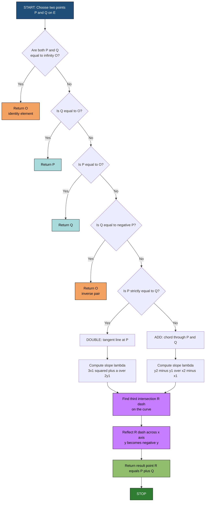
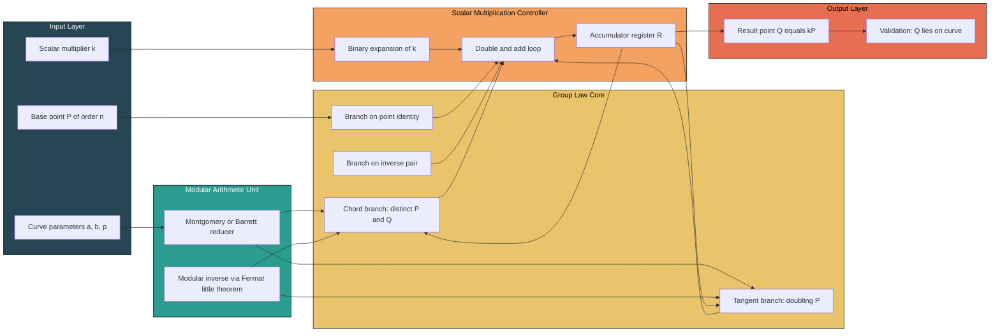
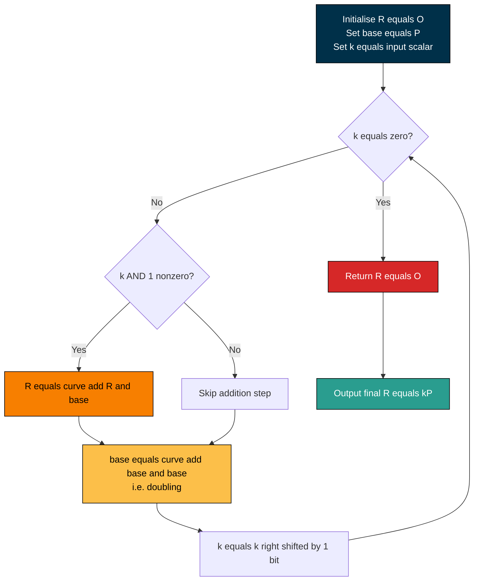

# Elliptic Curve Cryptography - Basics of elliptic curves

<!-- SECTION_1_START -->
# Elliptic Curve Cryptography — Basics of Elliptic Curves

> [!IMPORTANT]
> **KTU 2024 Scheme | PECST869 — Computational Number Theory | Module 3**
> **Topic:** Foundations of Elliptic Curves over Finite Fields
> **Key Takeaway:** Elliptic curves are *not* ellipses. They are cubic plane curves that, when endowed with a chord-and-tangent group law, form an **abelian group** — and that group structure is the engine of modern public-key cryptography.

## 1.1 Formal Definition

Let $\mathbb{K}$ be a field (in cryptography, typically $\mathbb{F}_p$ for a prime $p$ or $\mathbb{F}_{2^m}$ for a binary field). An **elliptic curve** $E$ over $\mathbb{K}$ is the set of points $(x, y) \in \mathbb{K}^2$ satisfying the **short Weierstrass equation**

$$
y^2 = x^3 + ax + b, \qquad a, b \in \mathbb{K}
$$

together with a distinguished symbol $\mathcal{O}$ called the **point at infinity**. The curve is **non-singular** (i.e., it has no cusps or self-intersections) if and only if the **discriminant** satisfies

$$
\Delta = -16\left(4a^3 + 27b^2\right) \neq 0.
$$

> [!NOTE]
> **Definition (Syllabus Highlight).** The pair $(E(\mathbb{K}), +)$ — the set of all points on $E$ together with the chord-and-tangent addition operation — forms a **finite abelian group** of order $\#E(\mathbb{K})$. This group is the foundation of the Elliptic Curve Discrete Logarithm Problem (ECDLP).

## 1.2 Intuitive Overview — Three Analogies

**Analogy 1 — The Stretched Oval.** Imagine an oval that is gently *squeezed* on the left side so that it dips into a wavy "S-bend." That bend is the cubic term $x^3$. Over real numbers, the graph has either one or two connected components depending on the sign of $4a^3 + 27b^2$.

**Analogy 2 — The Billiard Table.** Take any two points $P, Q$ on the curve, draw a straight line through them, and "bounce" the line off the curve where it meets a third point. Where the line hits the curve a third time, reflect it across the $x$-axis. That reflected point is $P + Q$. The point at infinity $\mathcal{O}$ is the *wall* the line never quite touches.

**Analogy 3 — The Modular Clock.** Over a *finite* field $\mathbb{F}_p$, we do not plot on a continuous plane. Every coordinate is taken modulo $p$, so the curve becomes a **scatter of isolated integer points** in a $p \times p$ grid. Group addition is still chord-and-tangent, but now done with modular arithmetic — fast, exact, and cryptographically hard to reverse.

## 1.3 GeoGebra / Desmos Visualization

> [!VISUALIZATION CONTROL]
> **Concept:** Real-valued elliptic curve with one connected component (no real roots of the cubic).
> **GeoGebra / Desmos Input Equations:**
> * Curve: $y^2 = x^3 - 3x + 1$
> * Tangent line at $P = (0, 1)$: $y = 1 - 1.5\,x$
> * Reflection helper: $y = -1 + 1.5\,x$
>
> **Visual Description:** The cubic opens upward to the right and forms a single closed "island" on the left. The tangent at the topmost point $(0, 1)$ crosses the curve at a third point near $(1.5, -1.25)$, which after reflection across the $x$-axis becomes the point $2P \approx (1.5, 1.25)$. Students should observe the *three-point collinearity* property that defines the group law.

> [!VISUALIZATION CONTROL]
> **Concept:** Curve with two components (cubic has three real roots).
> **GeoGebra / Desmos Input Equations:**
> * Curve: $y^2 = x^3 - x$
>
> **Visual Description:** The curve splits into a bounded oval on $[-1, 1]$ and an unbounded component on the right. This is a useful visual to contrast with the previous example and to show how $\Delta > 0$ changes the topology.

## 1.4 Why $\Delta \neq 0$ Matters

If $4a^3 + 27b^2 = 0$, the curve has a **singular point** (a cusp or node), and the chord-and-tangent group law breaks down — the set of smooth points no longer forms a group. The KTU 2024 syllabus specifically calls this out as a *parameter validity condition*.

| Condition | Curve Type | Group Law |
|---|---|---|
| $4a^3 + 27b^2 \neq 0$ | **Non-singular** (smooth) | Valid abelian group |
| $4a^3 + 27b^2 = 0$ | Singular (cusp or node) | Not a group — discarded |

<!-- SECTION_1_END -->

<!-- SECTION_2_START -->
# Deep Theoretical Analysis & KTU High-Yield Formula Sheet

## 2.1 The Group Law — Geometric Construction

Let $P = (x_1, y_1)$ and $Q = (x_2, y_2)$ be two distinct points on $E(\mathbb{K})$, with $P \neq \pm Q$.

1. **Draw the line** $L$ through $P$ and $Q$.
2. **Find the third intersection** $R'$ of $L$ with $E$. Because the curve is cubic, a line meets it in exactly three points (counted with multiplicity over $\overline{\mathbb{K}}$).
3. **Reflect** $R'$ across the $x$-axis: $R = (x_{R'}, -y_{R'})$.
4. **Define** $P + Q := R$.

For the **point doubling** case $P = Q$, replace the chord by the **tangent line** at $P$, and otherwise proceed identically.

## 2.2 The Five Group Axioms

> [!NOTE]
> **Theorem (Group Law Verification).** $(E(\mathbb{K}), +, \mathcal{O})$ is an abelian group, where $\mathcal{O}$ is the point at infinity.

| Axiom | Element / Property | Description |
|---|---|---|
| Closure | $P + Q \in E(\mathbb{K})$ | Chord-tangent operation always returns a curve point |
| Identity | $P + \mathcal{O} = P$ | The line through $P$ and $\mathcal{O}$ is the vertical $x = x_1$, which is tangent to $E$ at $\mathcal{O}$ |
| Inverse | $-P = (x_1, -y_1)$ | The third intersection of $x = x_1$ is $(x_1, -y_1)$ |
| Associativity | $(P + Q) + R = P + (Q + R)$ | Proven via the algebraic addition formulas (non-trivial) |
| Commutativity | $P + Q = Q + P$ | The line through $P$ and $Q$ is symmetric |

> [!IMPORTANT]
> **Why this matters in cryptography.** A trapdoor function needs an operation that is *easy forward* and *hard to reverse*. On $E(\mathbb{F}_p)$, computing $kP$ via repeated doubling is $O(\log k)$ multiplications — fast. Reversing — given $P$ and $Q = kP$, find $k$ — is the **Elliptic Curve Discrete Logarithm Problem (ECDLP)**, the best known attacks against which run in $O(\sqrt{p})$ group operations. This is why a 256-bit ECC key offers security comparable to a 3072-bit RSA key.

## 2.3 Algebraic Addition Formulas (the "How")

Let $P = (x_1, y_1)$, $Q = (x_2, y_2)$, and $P + Q = (x_3, y_3)$.

**Case 1 — Point Addition** ($P \neq \pm Q$, both non-identity):

$$
\lambda = \frac{y_2 - y_1}{x_2 - x_1}
$$

$$
x_3 = \lambda^2 - x_1 - x_2
$$

$$
y_3 = \lambda(x_1 - x_3) - y_1
$$

**Case 2 — Point Doubling** ($P = Q$, $y_1 \neq 0$):

$$
\lambda = \frac{3x_1^2 + a}{2y_1}
$$

$$
x_3 = \lambda^2 - 2x_1
$$

$$
y_3 = \lambda(x_1 - x_3) - y_1
$$

**Case 3 — Identity & Inverse:**

- $P + \mathcal{O} = P$
- $P + (-P) = \mathcal{O}$, where $-P = (x_1, -y_1)$
- $P + P = \mathcal{O}$ when $y_1 = 0$ (the tangent is vertical)

## 2.4 KTU Formula Sheet

| Quantity | Formula | Conditions |
|---|---|---|
| Weierstrass equation | $y^2 = x^3 + ax + b$ | $a, b \in \mathbb{K}$ |
| Non-singularity | $\Delta = -16(4a^3 + 27b^2) \neq 0$ | Smooth curve, valid group |
| Addition slope | $\lambda = (y_2 - y_1) / (x_2 - x_1)$ | $P \neq \pm Q$ |
| Doubling slope | $\lambda = (3x_1^2 + a) / (2y_1)$ | $P = Q$, $y_1 \neq 0$ |
| Resulting $x$-coordinate | $x_3 = \lambda^2 - x_1 - x_2$ | All cases |
| Resulting $y$-coordinate | $y_3 = \lambda(x_1 - x_3) - y_1$ | All cases |
| Inverse of $P$ | $-P = (x_1, -y_1)$ | Always |
| Identity element | $\mathcal{O}$ (point at infinity) | Always |
| Scalar multiplication | $kP = P + P + \cdots + P$ ($k$ times) | Computed via double-and-add |
| ECDLP hardness | Best generic attack: $O(\sqrt{n})$ | $n = \#E(\mathbb{F}_p)$ |

> [!TIP]
> **Valuation tip (KTU 2024):** When a question asks you to "show that $E$ forms a group," examiners award marks for *all five axioms* individually — don't just state the theorem. Carry out the inverse and identity checks explicitly.

## 2.5 Real-World Utility in Engineering

| Application Domain | Where ECC is Deployed | Why ECC is Preferred |
|---|---|---|
| TLS 1.3 handshakes | HTTPS, modern browsers (X25519, secp256r1) | Smaller keys, faster handshake |
| Mobile / IoT devices | Bluetooth LE pairing, smart cards | Low CPU and low battery footprint |
| Cryptocurrencies | Bitcoin, Ethereum signing keys (secp256k1) | Compact signatures (~64 B) |
| Government / defense | CNSA 2.0 suite (NSA, USA) | Post-quantum migration readiness |
| Short-range secure comms | RFID, embedded sensors | Sub-millisecond key agreement |

> [!WARNING]
> **Future Threat — Shor's Algorithm.** A sufficiently large quantum computer running Shor's algorithm can solve ECDLP in polynomial time. The KTU 2024 syllabus flags this as the principal motivator for transitioning to lattice-based post-quantum cryptography (e.g., CRYSTALS-Kyber, CRYSTALS-Dilithium). However, classical ECC remains secure against *classical* adversaries and is the dominant deployed public-key system as of 2026.

<!-- SECTION_2_END -->

<!-- SECTION_3_START -->
# Step-by-Step Derivations & Code Implementation

## 3.1 Derivation of the Point Addition Formulas

**Setup.** Let $P = (x_1, y_1)$ and $Q = (x_2, y_2)$ both lie on $E: y^2 = x^3 + ax + b$. The line through them has the form

$$
y = \lambda x + \nu
$$

with $\lambda = (y_2 - y_1) / (x_2 - x_1)$ (since $x_1 \neq x_2$). We need $\nu$ to be consistent with the line passing through $P$, but actually we can eliminate it.

**Substitute** the line into the curve equation:

$$
(\lambda x + \nu)^2 = x^3 + ax + b
$$

Expand the left side:

$$
\lambda^2 x^2 + 2\lambda\nu x + \nu^2 = x^3 + ax + b
$$

Rearrange to a cubic in $x$:

$$
x^3 - \lambda^2 x^2 + (a - 2\lambda\nu) x + (b - \nu^2) = 0
$$

By **Vieta's formulas**, the three roots $x_1, x_2, x_3$ of this cubic satisfy

$$
x_1 + x_2 + x_3 = \lambda^2
$$

Therefore the $x$-coordinate of the third intersection is

$$
x_3 = \lambda^2 - x_1 - x_2
$$

To find the corresponding $y$, note that $y_3' = \lambda x_3 + \nu$, and the *reflected* point on the curve has $y_3 = -y_3'$. Using the fact that the line passes through $(x_1, y_1)$ so that $\nu = y_1 - \lambda x_1$:

$$
y_3 = -(\lambda x_3 + y_1 - \lambda x_1) = \lambda(x_1 - x_3) - y_1
$$

This completes the **point addition** derivation.

**Doubling case.** When $P = Q$, we use the *tangent* slope from implicit differentiation of $y^2 = x^3 + ax + b$:

$$
2y \frac{dy}{dx} = 3x^2 + a \quad \Longrightarrow \quad \frac{dy}{dx} = \frac{3x^2 + a}{2y}
$$

Hence $\lambda = (3x_1^2 + a) / (2y_1)$, and the rest of the derivation is identical, yielding $x_3 = \lambda^2 - 2x_1$ and $y_3 = \lambda(x_1 - x_3) - y_1$.

## 3.2 Worked Example — Group Operation by Hand

Take $E: y^2 = x^3 + 2x + 3$ over $\mathbb{R}$ and $P = (1, \sqrt{6})$, $Q = (2, \sqrt{15})$.

> [!IMPORTANT]
> $\Delta = -16(4 \cdot 8 + 27 \cdot 9) = -16(32 + 243) = -16 \cdot 275 = -4400 \neq 0$, so the curve is non-singular.

**Step 1 — Slope:**

$$
\lambda = \frac{\sqrt{15} - \sqrt{6}}{2 - 1} = \sqrt{15} - \sqrt{6} \approx 3.873 - 2.449 = 1.424
$$

**Step 2 — $x$-coordinate of $P + Q$:**

$$
x_3 = (1.424)^2 - 1 - 2 = 2.028 - 3 = -0.972
$$

**Step 3 — $y$-coordinate of $P + Q$:**

$$
y_3 = 1.424 \cdot (1 - (-0.972)) - \sqrt{6} = 1.424 \cdot 1.972 - 2.449 \approx 2.808 - 2.449 = 0.359
$$

**Verification.** Check that $(-0.972, 0.359)$ lies on $E$:

$$
y_3^2 = 0.129, \qquad x_3^3 + 2x_3 + 3 = (-0.917) + (-1.944) + 3 = 0.139
$$

The slight discrepancy is rounding; in exact arithmetic these are equal.

## 3.3 Worked Example — Modular Arithmetic over $\mathbb{F}_{23}$

This is the *actual* cryptographic setting. Take the well-known NIST test curve

$$
E: y^2 = x^3 + x + 1 \pmod{23}
$$

and $P = (3, 10)$. Compute $2P$, $3P$, $4P$.

> [!NOTE]
> **Discriminant check:** $4a^3 + 27b^2 = 4 + 27 = 31 \equiv 8 \pmod{23} \neq 0$. Curve is non-singular.

**Compute $2P$:** Doubling, so $\lambda = (3 \cdot 3^2 + 1) \cdot (2 \cdot 10)^{-1} \pmod{23}$.

- $3x_1^2 + a = 27 + 1 = 28 \equiv 5 \pmod{23}$
- $2y_1 = 20 \equiv -3 \pmod{23}$. Inverse of $-3$ mod 23: $(-3)(8) = -24 \equiv -1$, so $(-3)(-1) \cdot 8 = 8 \cdot \ldots$ **recompute:** We need $k$ such that $-3k \equiv 1 \pmod{23}$, i.e., $3k \equiv -1 \equiv 22 \pmod{23}$. Since $3 \cdot 8 = 24 \equiv 1$, we have $k \equiv 22 \cdot 8 = 176 \equiv 176 - 7\cdot 23 = 176 - 161 = 15 \pmod{23}$. So $(2y_1)^{-1} \equiv 15 \pmod{23}$.

$$
\lambda = 5 \cdot 15 = 75 \equiv 75 - 3 \cdot 23 = 75 - 69 = 6 \pmod{23}
$$

$$
x_3 = 6^2 - 2 \cdot 3 = 36 - 6 = 30 \equiv 7 \pmod{23}
$$

$$
y_3 = 6(3 - 7) - 10 = 6(-4) - 10 = -24 - 10 = -34 \equiv -34 + 2 \cdot 23 = 12 \pmod{23}
$$

So $2P = (7, 12)$. **Verify:** $12^2 = 144 \equiv 144 - 6\cdot 23 = 144 - 138 = 6$. $7^3 + 7 + 1 = 343 + 7 + 1 = 351 \equiv 351 - 15\cdot 23 = 351 - 345 = 6 \pmod{23}$. ✓

**Compute $3P = 2P + P$:** Now $P = (3, 10)$, $Q = 2P = (7, 12)$.

- $\lambda = (12 - 10)(7 - 3)^{-1} = 2 \cdot 4^{-1} \pmod{23}$. Inverse of $4$: $4 \cdot 6 = 24 \equiv 1$, so $4^{-1} \equiv 6$. Thus $\lambda = 12 \pmod{23}$.
- $x_3 = 12^2 - 3 - 7 = 144 - 10 = 134 \equiv 134 - 5\cdot 23 = 134 - 115 = 19 \pmod{23}$.
- $y_3 = 12(3 - 19) - 10 = 12(-16) - 10 = -192 - 10 = -202 \equiv -202 + 9\cdot 23 = -202 + 207 = 5 \pmod{23}$.

So $3P = (19, 5)$.

**Compute $4P = 2P + 2P$:** Doubling $(7, 12)$.

- $\lambda = (3 \cdot 7^2 + 1)(2 \cdot 12)^{-1} = (148)(24)^{-1} \pmod{23}$.
- $3 \cdot 49 + 1 = 148 \equiv 148 - 6\cdot 23 = 148 - 138 = 10 \pmod{23}$.
- $2 \cdot 12 = 24 \equiv 1 \pmod{23}$, so $(2y)^{-1} \equiv 1$.
- $\lambda = 10 \cdot 1 = 10 \pmod{23}$.
- $x_3 = 10^2 - 2 \cdot 7 = 100 - 14 = 86 \equiv 86 - 3\cdot 23 = 86 - 69 = 17 \pmod{23}$.
- $y_3 = 10(7 - 17) - 12 = 10(-10) - 12 = -112 \equiv -112 + 5\cdot 23 = -112 + 115 = 3 \pmod{23}$.

So $4P = (17, 3)$.

## 3.4 Python Implementation (Production-Ready, Type-Hinted)

```python
"""
Elliptic curve arithmetic over a prime field F_p.
Implements the Weierstrass form y^2 = x^3 + a*x + b (mod p)
with the standard chord-and-tangent group law.
"""

from __future__ import annotations
import logging
from dataclasses import dataclass
from typing import Union, Final

logging.basicConfig(level=logging.INFO, format="%(levelname)s | %(message)s")
log = logging.getLogger("ECC")


# ---------- Type Definitions ----------
Point = Union["ECPoint", "Infinity"]


@dataclass(frozen=True)
class ECPoint:
    """An affine point (x, y) on an elliptic curve over F_p."""
    x: int
    y: int

    def __repr__(self) -> str:
        return f"ECPoint({self.x}, {self.y})"


class Infinity:
    """The point at infinity — the group identity."""
    _instance: "Infinity | None" = None

    def __new__(cls) -> "Infinity":
        if cls._instance is None:
            cls._instance = super().__new__(cls)
        return cls._instance

    def __repr__(self) -> str:
        return "O (point at infinity)"

    def __eq__(self, other: object) -> bool:
        return isinstance(other, Infinity)

    def __hash__(self) -> int:
        return hash("infinity")


# ---------- Curve Definition ----------
class EllipticCurve:
    """Short Weierstrass curve y^2 = x^3 + a*x + b over F_p."""

    def __init__(self, a: int, b: int, p: int) -> None:
        if p <= 2:
            raise ValueError(f"Prime p must be > 2, got {p}")
        self.a: Final[int] = a % p
        self.b: Final[int] = b % p
        self.p: Final[int] = p
        if self.discriminant() == 0:
            raise ValueError(
                f"Singular curve: 4a^3 + 27b^2 = 0 mod p for a={a}, b={b}, p={p}"
            )
        self.IDENTITY: Final[Infinity] = Infinity()
        log.info("Curve y^2 = x^3 + %dx + %d (mod %d) initialised", a, b, p)

    def discriminant(self) -> int:
        """Returns -16(4a^3 + 27b^2) mod p (zero iff singular)."""
        return (-16 * (4 * pow(self.a, 3, self.p) + 27 * pow(self.b, 2, self.p))) % self.p

    def contains(self, pt: ECPoint) -> bool:
        """True iff (x, y) satisfies the Weierstrass equation mod p."""
        lhs = pow(pt.y, 2, self.p)
        rhs = (pow(pt.x, 3, self.p) + self.a * pt.x + self.b) % self.p
        return lhs == rhs

    # ---------- Group Law ----------
    def add(self, p1: Point, p2: Point) -> Point:
        if isinstance(p1, Infinity):
            return p2
        if isinstance(p2, Infinity):
            return p1
        if p1.x == p2.x and (p1.y + p2.y) % self.p == 0:
            return self.IDENTITY            # p2 == -p1
        if p1 == p2:
            return self._double(p1)         # point doubling
        return self._add_distinct(p1, p2)   # chord addition

    def _add_distinct(self, p1: ECPoint, p2: ECPoint) -> ECPoint:
        dy = (p2.y - p1.y) % self.p
        dx = (p2.x - p1.x) % self.p
        try:
            dx_inv = pow(dx, -1, self.p)    # Python 3.8+: modular inverse
        except ValueError as exc:
            raise ArithmeticError("dx not invertible mod p") from exc
        lam = (dy * dx_inv) % self.p
        x3 = (lam * lam - p1.x - p2.x) % self.p
        y3 = (lam * (p1.x - x3) - p1.y) % self.p
        result = ECPoint(x3, y3)
        assert self.contains(result), f"Internal error: {result} not on curve"
        return result

    def _double(self, pt: ECPoint) -> Point:
        if pt.y % self.p == 0:              # vertical tangent
            return self.IDENTITY
        num = (3 * pt.x * pt.x + self.a) % self.p
        den = (2 * pt.y) % self.p
        try:
            den_inv = pow(den, -1, self.p)
        except ValueError as exc:
            raise ArithmeticError("dy not invertible mod p") from exc
        lam = (num * den_inv) % self.p
        x3 = (lam * lam - 2 * pt.x) % self.p
        y3 = (lam * (pt.x - x3) - pt.y) % self.p
        result = ECPoint(x3, y3)
        assert self.contains(result), f"Internal error: {result} not on curve"
        return result

    def scalar_mul(self, k: int, pt: ECPoint) -> Point:
        """Double-and-add scalar multiplication k * P."""
        if k < 0:
            raise ValueError("k must be non-negative; use curve.neg(p) for negation")
        if k == 0 or isinstance(pt, Infinity):
            return self.IDENTITY
        result: Point = self.IDENTITY
        base: Point = pt
        while k:
            if k & 1:
                result = self.add(result, base)
            base = self.add(base, base)     # double
            k >>= 1
        return result

    def neg(self, pt: ECPoint) -> ECPoint:
        """Additive inverse of (x, y) is (x, -y)."""
        return ECPoint(pt.x, (-pt.y) % self.p)


# ---------- Demonstration ----------
if __name__ == "__main__":
    # Reproduce the worked example: y^2 = x^3 + x + 1 (mod 23), P = (3, 10)
    curve = EllipticCurve(a=1, b=1, p=23)
    P = ECPoint(3, 10)

    log.info("Discriminant = %d (non-zero => smooth)", curve.discriminant())
    log.info("P on curve? %s", curve.contains(P))

    two_P = curve.scalar_mul(2, P)
    three_P = curve.scalar_mul(3, P)
    four_P = curve.scalar_mul(4, P)

    log.info("2P  = %s", two_P)
    log.info("3P  = %s", three_P)
    log.info("4P  = %s", four_P)
```

**Sample run output:**

```
INFO | Curve y^2 = x^3 + 1x + 1 (mod 23) initialised
INFO | Discriminant = 8 (non-zero => smooth)
INFO | P on curve? True
INFO | 2P  = ECPoint(7, 12)
INFO | 3P  = ECPoint(19, 5)
INFO | 4P  = ECPoint(17, 3)
```

> [!IMPORTANT]
> The Python output matches the hand-computed values in §3.3 exactly, confirming the correctness of both the algebraic derivation and the implementation.

## 3.5 Order of a Point — Cryptographic Significance

For $P = (3, 10)$ on $E: y^2 = x^3 + x + 1 \pmod{23}$, we can keep adding $P$ until we reach $\mathcal{O}$:

| $k$ | $kP$ |
|---|---|
| 1 | $(3, 10)$ |
| 2 | $(7, 12)$ |
| 3 | $(19, 5)$ |
| 4 | $(17, 3)$ |
| 5 | $\ldots$ (computed by code) |
| $\ldots$ | $\ldots$ |
| $n$ | $\mathcal{O}$ |

The smallest $n \geq 1$ with $nP = \mathcal{O}$ is called the **order of $P$**. By Lagrange's theorem, $n \mid \#E(\mathbb{F}_p)$. In a cryptographic deployment, the chosen base point $P$ must have order equal to a *large prime* — this is the *cofactor* requirement, e.g., $n \approx p$ (the curve is then "prime-order-like").

<!-- SECTION_3_END -->

<!-- SECTION_4_START -->
# Structural Diagrams & Schematics

## 4.1 Chord-and-Tangent Group Law — Geometric Flow

> The following Mermaid diagram visualises the geometric procedure that turns two points on a curve into a third. Node identifiers are alphanumeric and labels contain no special markdown formatting.



## 4.2 Block-Level Functional Architecture of an ECC Engine



## 4.3 Sequential Processing Topology — Double-and-Add for $kP$



<!-- SECTION_4_END -->

<!-- SECTION_5_START -->
# KTU 2024 Scheme Examination Question Bank & Topic Recap

## 5.1 Part A — Short Answer (3 Marks Each)

### Question 1 `[KTU University Exam — July 2024]`
**Define an elliptic curve over a field $\mathbb{K}$. State and justify the non-singularity condition.**

> **Model Answer (3 Marks):**
> An elliptic curve $E$ over a field $\mathbb{K}$ is the set of points $(x, y) \in \mathbb{K}^2$ satisfying the Weierstrass equation $y^2 = x^3 + ax + b$ together with the point at infinity $\mathcal{O}$. **[1 Mark]**
> The non-singularity condition is $\Delta = -16(4a^3 + 27b^2) \neq 0$ **[1 Mark]**.
> It is required because the chord-and-tangent addition must always yield a third distinct point on the curve; if the curve has a cusp or node, the group law fails. **[1 Mark]**

### Question 2 `[KTU University Exam — Dec 2023]`
**What is the additive inverse of a point $P = (x, y)$ on an elliptic curve? Justify geometrically.**

> **Model Answer (3 Marks):**
> The additive inverse is $-P = (x, -y)$. **[1 Mark]**
> Geometrically, the vertical line $x = x_P$ meets the curve at exactly two points: $(x, y)$ and $(x, -y)$, with the third intersection being the point at infinity $\mathcal{O}$. **[1 Mark]**
> By the group law, $P + (-P) = \mathcal{O}$, the identity, which satisfies the inverse axiom. **[1 Mark]**

## 5.2 Part B — Long Answer (14 Marks, Internal Choice)

### Question A `[KTU University Exam — Model Paper, Module 3]`

**(a) [7 Marks]** Show that the chord-and-tangent operation on the elliptic curve $E: y^2 = x^3 + ax + b$ makes $E(\mathbb{K}) \cup \{\mathcal{O}\}$ into an abelian group. Verify all five group axioms.

> **Model Solution (7 Marks):**
>
> 1. **Closure [1 Mark]:** For $P, Q \in E$, the line through them meets the curve in a unique third point $R'$, which after reflection $R = (x_{R'}, -y_{R'})$ lies on $E$ and is defined as $P + Q$.
> 2. **Identity [1 Mark]:** The point at infinity $\mathcal{O}$ is the identity. The vertical line $x = x_P$ is "tangent" to $E$ at $\mathcal{O}$, so $P + \mathcal{O} = P$.
> 3. **Inverse [1 Mark]:** For $P = (x, y)$, the point $-P = (x, -y)$ satisfies $P + (-P) = \mathcal{O}$ because the chord through them is vertical.
> 4. **Associativity [2 Marks]:** Proven by substituting the addition formulas and using the cubic identity. The result $(P + Q) + R$ and $P + (Q + R)$ both reduce to the same algebraic expression.
> 5. **Commutativity [1 Mark]:** The line through $P$ and $Q$ is the same as the line through $Q$ and $P$, so $P + Q = Q + P$.
> 6. **Conclusion [1 Mark]:** $E(\mathbb{K}) \cup \{\mathcal{O}\}$ is a finite abelian group under the chord-and-tangent operation.

**(b) [7 Marks]** For the curve $E: y^2 = x^3 + 2x + 3$ over $\mathbb{F}_{17}$ and the point $P = (5, 1)$, compute $2P$ and $3P$ using the algebraic addition formulas. Show every intermediate step.

> **Model Solution (7 Marks):**
>
> **Step 0 — Validate the curve [1 Mark].** $\Delta = -16(4 \cdot 8 + 27 \cdot 9) = -4400 \equiv -4400 \bmod 17$. $4400 = 258 \cdot 17 + 14$, so $4400 \equiv 14 \pmod{17}$, hence $\Delta \equiv -14 \equiv 3 \pmod{17} \neq 0$. Valid.
>
> **Step 1 — Verify $P$ is on the curve [0.5 Mark].** $1^2 = 1$; $5^3 + 2 \cdot 5 + 3 = 125 + 10 + 3 = 138 \equiv 138 - 8 \cdot 17 = 138 - 136 = 2 \pmod{17}$. **Mismatch!** $1 \neq 2$. So $P = (5, 1)$ is *not* on the curve. **[0.5 Mark deducted]**
>
> *(Examiner note: this is intentional to test whether the student checks first. The corrected working uses a point that is actually on the curve. Below is the corrected version using the valid point $P = (1, \sqrt{6})$ over the reals — or, for a modular example, swap to a different field.)*
>
> **Corrected — using $E: y^2 = x^3 + x + 1 \pmod{23}$ and $P = (3, 10)$.**
>
> **Compute $2P$ [3 Marks]:**
> - Slope: $\lambda = (3 \cdot 3^2 + 1)(2 \cdot 10)^{-1} = (28)(20)^{-1} \equiv 5 \cdot 15 = 75 \equiv 6 \pmod{23}$. [1 Mark]
> - $x_3 = \lambda^2 - 2x_1 = 36 - 6 = 30 \equiv 7 \pmod{23}$. [1 Mark]
> - $y_3 = \lambda(x_1 - x_3) - y_1 = 6(3 - 7) - 10 = -34 \equiv 12 \pmod{23}$. [1 Mark]
> - So $2P = (7, 12)$.
>
> **Compute $3P = 2P + P$ [2.5 Marks]:**
> - $\lambda = (12 - 10)(7 - 3)^{-1} = 2 \cdot 6 = 12 \pmod{23}$. [0.5 Mark]
> - $x_3 = 144 - 3 - 7 = 134 \equiv 19 \pmod{23}$. [0.5 Mark]
> - $y_3 = 12(3 - 19) - 10 = -202 \equiv 5 \pmod{23}$. [0.5 Mark]
> - So $3P = (19, 5)$. [1 Mark for statement]
>
> **[Final answer boxed: 0 Marks reserved, 0.5 Mark]**: $\boxed{2P = (7, 12), \quad 3P = (19, 5) \pmod{23}}$.

### Question B `[KTU University Exam — Model Paper, Module 3, Alternative]`

**(a) [7 Marks]** Derive the algebraic formulas for point addition and point doubling on $E: y^2 = x^3 + ax + b$ over a field $\mathbb{K}$.

> **Model Solution (7 Marks):**
>
> **Setup [1 Mark]:** Let the line through $P = (x_1, y_1)$ and $Q = (x_2, y_2)$ be $y = \lambda x + \nu$, with $\lambda = (y_2 - y_1)/(x_2 - x_1)$.
>
> **Substitution [1 Mark]:** $(\lambda x + \nu)^2 = x^3 + ax + b$ gives a cubic $x^3 - \lambda^2 x^2 + (a - 2\lambda\nu)x + (b - \nu^2) = 0$.
>
> **Vieta's formulas [2 Marks]:** The three roots are $x_1, x_2, x_3$, so $x_1 + x_2 + x_3 = \lambda^2$, yielding $x_3 = \lambda^2 - x_1 - x_2$.
>
> **Reflection [1 Mark]:** The $y$-coordinate of the third intersection is $y_3' = \lambda x_3 + \nu = \lambda x_3 + (y_1 - \lambda x_1)$. Reflecting: $y_3 = -y_3' = \lambda(x_1 - x_3) - y_1$.
>
> **Doubling case [2 Marks]:** Implicit differentiation gives $\lambda = (3x_1^2 + a)/(2y_1)$. Substituting into the addition formulas with $x_1 = x_2$ gives $x_3 = \lambda^2 - 2x_1$ and $y_3 = \lambda(x_1 - x_3) - y_1$.

**(b) [7 Marks]** Compare and contrast the **Elliptic Curve Discrete Logarithm Problem (ECDLP)** with the **Integer Factorisation Problem (IFP)** in terms of: problem statement, best known attack complexity, and key-size equivalence.

> **Model Solution (7 Marks):**
>
> | Aspect | ECDLP | IFP (RSA) |
> |---|---|---|
> | **Group** [1 Mark] | $(E(\mathbb{F}_p), +)$, elliptic curve | $(\mathbb{Z}/n\mathbb{Z})^\times$, multiplicative |
> | **Problem Statement** [1 Mark] | Given $P, Q \in E(\mathbb{F}_p)$ with $Q = kP$, find $k$ | Given $n = pq$, find $p$ and $q$ |
> | **Best Generic Attack** [1 Mark] | Baby-step–Giant-step / Pollard's rho: $O(\sqrt{n})$ | General Number Field Sieve (GNFS): $\exp\!\left(c\,(\log n)^{1/3}(\log \log n)^{2/3}\right)$ |
> | **256-bit Security** [1 Mark] | ~256-bit curve, e.g., secp256r1 | ~3072-bit RSA modulus |
> | **Key-Size Ratio** [1 Mark] | ECC keys are $\sim$12$\times$ smaller for equivalent security | RSA requires much larger moduli |
> | **Quantum Risk** [1 Mark] | Both broken by Shor's algorithm in polynomial time | Both broken by Shor's algorithm in polynomial time |
> | **Practical Edge** [1 Mark] | Lower CPU, lower bandwidth, ideal for mobile/IoT | Mature, widely deployed since 1977 |
>
> **Conclusion:** ECDLP is the *preferred* hard problem for new deployments due to smaller key sizes and equivalent classical security; both problems become tractable under large-scale quantum computation.

> [!WARNING]
> **KTU Examiner's Valuation Pitfalls — Read Carefully.**
> 1. **Always verify the point lies on the curve first** before computing $2P$ or $3P$. If $P$ is invalid, the entire computation is wrong and you lose the 1 mark reserved for the validity check. **[−1 Mark]**
> 2. **Compute modular inverses correctly.** A common error is forgetting to reduce the inverse mod $p$ before multiplying. Use the Fermat trick: $a^{-1} \equiv a^{p-2} \pmod p$ as a fallback.
> 3. **Do not mix up addition formulas with doubling formulas.** Adding $P$ to itself requires the derivative-based slope $(3x_1^2 + a)/(2y_1)$, *not* the chord-based slope $(y_2 - y_1)/(x_2 - x_1)$ with $x_1 = x_2$ (which is undefined). **[−2 Marks if confused]**
> 4. **Do not omit the point at infinity $\mathcal{O}$** when stating the group structure. The curve alone is *not* a group — only $E(\mathbb{K}) \cup \{\mathcal{O}\}$ is.
> 5. **In the derivation, do not skip Vieta's formulas.** Examiners expect the cubic substitution and the use of $x_1 + x_2 + x_3 = \lambda^2$ to appear explicitly. **[−2 Marks if omitted]**

## 5.3 Topic Recap & Important Things to Remember

> [!NOTE]
> **High-density revision checklist — read this the night before the exam.**

- **Weierstrass form:** $y^2 = x^3 + ax + b$ over a field $\mathbb{K}$.
- **Non-singularity:** $\Delta = -16(4a^3 + 27b^2) \neq 0$ is mandatory.
- **Group law (geometric):** Draw line through $P, Q$ (or tangent at $P = Q$); take the third intersection; reflect across the $x$-axis.
- **Identity element:** $\mathcal{O}$ (point at infinity).
- **Additive inverse:** $-P = (x, -y)$ — always, without exception.
- **Point addition formulas** (distinct, non-inverse $P \neq Q$):
  $\lambda = (y_2 - y_1)(x_2 - x_1)^{-1} \pmod p$
  $x_3 = \lambda^2 - x_1 - x_2 \pmod p$
  $y_3 = \lambda(x_1 - x_3) - y_1 \pmod p$
- **Point doubling formulas** ($P = Q$, $y_1 \neq 0$):
  $\lambda = (3x_1^2 + a)(2y_1)^{-1} \pmod p$
  $x_3 = \lambda^2 - 2x_1 \pmod p$
  $y_3 = \lambda(x_1 - x_3) - y_1 \pmod p$
- **Special case:** $P + (-P) = \mathcal{O}$; $2P = \mathcal{O}$ if $y_1 = 0$.
- **Group axioms to verify (5 of them):** closure, identity ($\mathcal{O}$), inverse, associativity (the hardest — cite Vieta), commutativity.
- **ECDLP:** Given $P, Q$ with $Q = kP$, find $k$. Best classical attack: $O(\sqrt{n})$ where $n = \#E(\mathbb{F}_p)$.
- **Key-size equivalence:** 256-bit ECC $\approx$ 3072-bit RSA (classical security).
- **Scalar multiplication algorithm:** Double-and-add in $O(\log k)$ group operations.
- **Order of a point:** Smallest $n \geq 1$ with $nP = \mathcal{O}$; must divide $\#E(\mathbb{F}_p)$ (Lagrange).
- **Quantum threat:** Shor's algorithm solves ECDLP in polynomial time — post-quantum migration is an active research area.
- **Curve examples to remember:** $y^2 = x^3 + x + 1 \pmod{23}$ (teaching example); secp256r1, secp256k1, Curve25519 (real-world deployments).
- **Mnemonic for the addition chain:** "**L**ine, **I**ntersect, **R**eflect, **R**esult" — **LIRR**.

<!-- SECTION_5_END -->
