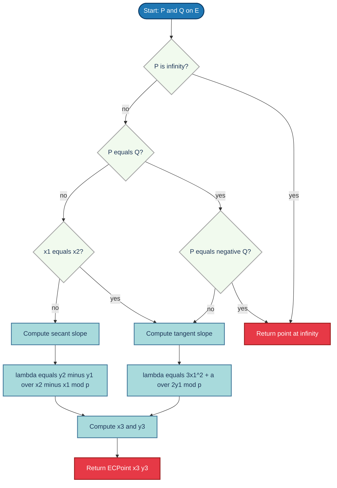
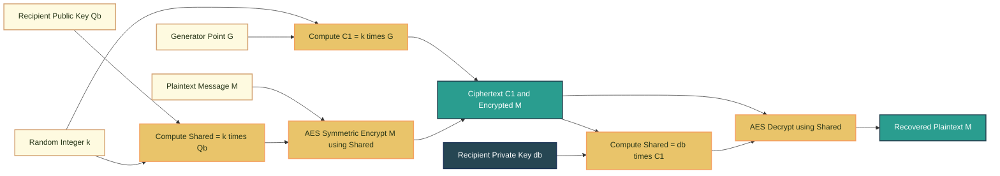
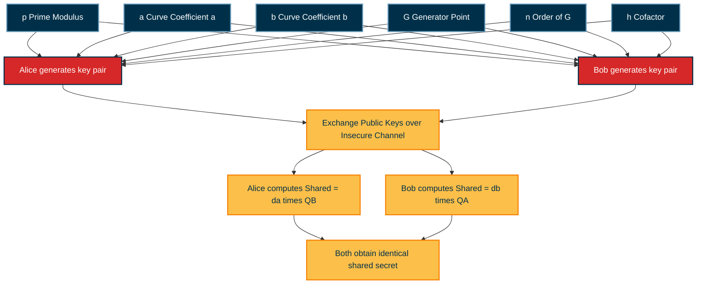
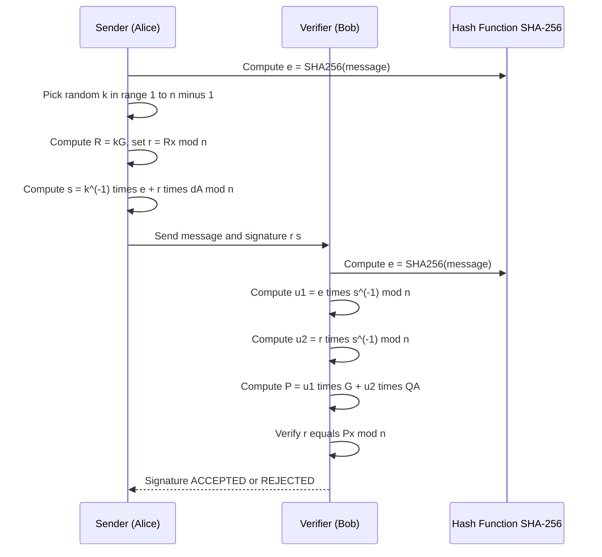

# Elliptic curve cryptosystems

<!-- SECTION_1_START -->

# Elliptic Curve Cryptosystems (ECC)

## 1. Core Technical Definition

> [!IMPORTANT]
> **KTU 2024 Syllabus Definition (PECST869 - Module 3)**
> An **Elliptic Curve Cryptosystem (ECC)** is a public-key cryptographic system based on the algebraic structure of elliptic curves defined over finite fields. The security of ECC relies on the **Elliptic Curve Discrete Logarithm Problem (ECDLP)**, which is computationally harder than the integer factorization or classical discrete logarithm problems for equivalent key sizes.

The general **Weierstrass equation** of an elliptic curve $E$ over a field $K$ is:

$$E : y^2 + a_1 xy + a_3 y = x^3 + a_2 x^2 + a_4 x + a_6$$

In the simplified **short Weierstrass form** (used in cryptographic standards like NIST FIPS 186-4 and SEC 1):

$$E : y^2 = x^3 + ax + b \pmod{p}$$

where $a, b \in \mathbb{F}_p$ and the **discriminant** $\Delta = -16(4a^3 + 27b^2) \not\equiv 0 \pmod{p}$. The condition $\Delta \neq 0$ ensures the curve is **non-singular** (no cusps or self-intersections).

> [!NOTE]
> **Point at Infinity ($O$):** Every elliptic curve has an identity element called the **point at infinity** $O$, which acts as the additive identity in the group operation. It is sometimes denoted $\mathcal{O}$ or $\infty$.

---

## 2. Conceptual Analogy / Intuition

Imagine a billiard table shaped like a smooth, symmetric loop (the curve). Pick any starting point $P$ on the table. Draw a **chord** through $P$ and another point $Q$ on the curve. This chord hits the curve a third time at some point $R$. Now reflect $R$ across the horizontal axis (the $x$-axis) — the reflected point is the **sum** $P \oplus Q$.

**Real-World Intuition for Cryptography:**
- ECC works because the curve forms a mathematical **group** with a well-defined "addition" operation.
- Multiplying a point $P$ by an integer $k$ is fast (like walking $k$ steps on the curve).
- But given $Q = kP$ and $P$, finding $k$ is **computationally infeasible** (the ECDLP).
- This asymmetry is what makes ECC useful: Alice publishes $Q$, and only she knows the secret $k$.

**Physical Constants / Standard Metrics:**

| Parameter | Standard Value / Range |
|---|---|
| NIST Recommended Prime $p$ | **192, 224, 256, 384, 521 bits** |
| RSA Equivalent Security (256-bit ECC) | **3072-bit RSA** |
| Standardized Curves | **P-256 (secp256r1), P-384, P-521**, Curve25519 |
| Co-factor $h$ (safe curves) | **$h = 1$** |
| Generator point order $n$ | **Prime number close to $p$** |

> [!VISUALIZATION CONTROL]
> **Concept:** Elliptic Curve $y^2 = x^3 - x + 1$ over $\mathbb{R}$ showing the characteristic "loop" shape used in cryptography.
> **GeoGebra / Desmos Input Equations:**
> * `y^2 = x^3 - x + 1`  → enter as two functions: $y = +\sqrt{x^3 - x + 1}$ and $y = -\sqrt{x^3 - x + 1}$
> **Visual Description:** A symmetric curve opening upward, with one local maximum and one local minimum. The graph crosses the $x$-axis at one real point and is symmetric about the $x$-axis. This symmetry is the geometric origin of the additive group law.

---

## 3. Why ECC over RSA?

> [!TIP]
> **KTU Board Favourite:** Examiners frequently ask "Why is ECC preferred over RSA for the same security level?" The answer lies in the **sub-exponential vs. exponential** complexity of the underlying hard problem.
> * **RSA** security rests on the **Integer Factorization Problem (IFP)** — solvable in sub-exponential time via the General Number Field Sieve (GNFS) of complexity $e^{O((\ln n)^{1/3} (\ln \ln n)^{2/3})}$.
> * **ECC** security rests on the **ECDLP** — currently only solvable in fully exponential time $O(\sqrt{n})$ via Pollard's rho algorithm.
> * Therefore, a **256-bit ECC key** offers equivalent security to a **3072-bit RSA key** — a 12× key-size reduction, saving bandwidth, storage, and power.

<!-- SECTION_1_END -->

<!-- SECTION_2_START -->

# Deep Theoretical Analysis & KTU High-Yield Formula Sheet

## 1. The Elliptic Curve Group $(\mathbb{E}(\mathbb{F}_p), \oplus)$

The set of all points $(x, y)$ on the curve $E$ over the finite field $\mathbb{F}_p$ (together with $O$) forms an **abelian group** under the operation $\oplus$.

### Group Axioms Satisfied:

* **Closure:** $\forall P, Q \in E(\mathbb{F}_p)$, $P \oplus Q \in E(\mathbb{F}_p)$.
* **Associativity:** $(P \oplus Q) \oplus R = P \oplus (Q \oplus R)$.
* **Identity:** $P \oplus O = O \oplus P = P$.
* **Inverse:** $\forall P = (x, y)$, the inverse is $-P = (x, -y \bmod p)$.
* **Commutativity:** $P \oplus Q = Q \oplus P$.

The order of the group is denoted $\#E(\mathbb{F}_p) = N$, which by **Hasse's Theorem** lies in the range:

$$p + 1 - 2\sqrt{p} \leq N \leq p + 1 + 2\sqrt{p}$$

> [!IMPORTANT]
> **Hasse's Theorem (KTU High-Yield):** For a curve over $\mathbb{F}_p$, the number of points $N$ satisfies $\vert N - (p+1) \vert \leq 2\sqrt{p}$. This bound is critical for choosing cryptographically strong curves.

## 2. KTU Formula Cheat Sheet

| Formula / Operation | Expression | Use Case |
|---|---|---|
| **Short Weierstrass form** | $y^2 \equiv x^3 + ax + b \pmod{p}$ | Standard curve definition |
| **Discriminant** | $\Delta = -16(4a^3 + 27b^2)$ | Singularity check ($\Delta \neq 0$) |
| **Point addition** (slope $\lambda$) | $\lambda = \dfrac{y_2 - y_1}{x_2 - x_1} \bmod p$ | When $P \neq Q$ and $P \neq -Q$ |
| **Point addition $x_3$** | $x_3 = \lambda^2 - x_1 - x_2 \bmod p$ | Output $x$-coordinate |
| **Point addition $y_3$** | $y_3 = \lambda(x_1 - x_3) - y_1 \bmod p$ | Output $y$-coordinate |
| **Point doubling** (slope $\lambda$) | $\lambda = \dfrac{3x_1^2 + a}{2y_1} \bmod p$ | When $P = Q$ and $y_1 \neq 0$ |
| **Point doubling $x_3$** | $x_3 = \lambda^2 - 2x_1 \bmod p$ | Doubling output $x$ |
| **Point doubling $y_3$** | $y_3 = \lambda(x_1 - x_3) - y_1 \bmod p$ | Doubling output $y$ |
| **Point negation** | $-(x, y) = (x, -y \bmod p)$ | Group inverse |
| **ECDLP** | Given $P, Q = kP$, find $k$ | Hard problem (security) |
| **Pollard's rho complexity** | $O(\sqrt{n})$ | Best known attack on ECDLP |
| **Hasse bound** | $\vert N - (p+1) \vert \leq 2\sqrt{p}$ | Group order range |
| **Curve25519 equation** | $y^2 = x^3 + 486662 x^2 + x$ | Montgomery form (modern) |
| **NIST P-256 prime** | $p = 2^{256} - 2^{224} + 2^{192} + 2^{96} - 1$ | Standardized field |
| **Equivalent security** | $n$-bit ECC $\approx 6n$-bit RSA | Key size comparison |

> [!WARNING]
> **KTU Valuation Tip:** Always compute $\lambda$ *before* $x_3$ and $y_3$. Many students write $x_3$ first and lose partial marks. Show modular reduction explicitly using $\bmod p$ at every step.

## 3. Real-World Engineering Utility

* **TLS/SSL Handshakes:** Modern HTTPS (TLS 1.3) uses **X25519** (Curve25519) for key exchange — preferred over RSA in most servers (e.g., Cloudflare, Google).
* **Bitcoin & Blockchain:** Bitcoin uses the **secp256k1** curve for digital signatures (ECDSA) of every transaction.
* **Mobile & IoT:** ECC's smaller key size reduces power consumption in smart cards, RFID tags, and embedded systems.
* **Government & Military:** NSA's **Suite B Cryptography** mandates ECC (P-256, P-384) for top-secret communications.
* **SSH Authentication:** OpenSSH uses **ECDSA** keys by default since version 5.7.

## 4. The Discrete Logarithm Problem (DLP) Family Comparison

| Problem | Best Known Algorithm | Complexity |
|---|---|---|
| DLP in $\mathbb{Z}_p^*$ | Index Calculus / Number Field Sieve | Sub-exponential |
| IFP (RSA) | GNFS | Sub-exponential |
| **ECDLP** | **Pollard's rho** | **$O(\sqrt{n})$ — fully exponential** |

> [!NOTE]
> **The "Why" Behind ECC's Strength:** Because Pollard's rho and the parallelized Pollard's rho are the *best known* attacks on ECDLP, the security scales as the square root of the field size. Doubling the key size squares the attacker's workload. This is why 256-bit ECC is "as hard to break" as 3072-bit RSA.

<!-- SECTION_2_END -->

<!-- SECTION_3_START -->

# Step-by-Step Derivations & Code Implementation

## 1. Detailed Derivation of Point Addition on $E: y^2 = x^3 + ax + b \pmod p$

Let $P = (x_1, y_1)$ and $Q = (x_2, y_2)$ be two distinct points on $E(\mathbb{F}_p)$, with $x_1 \neq x_2$ and $P \neq -Q$.

### Step 1: Find the line through $P$ and $Q$.

The equation of the line is $y = \lambda x + \nu$, where:

$$\lambda = \frac{y_2 - y_1}{x_2 - x_1} \bmod p$$

The intercept $\nu = y_1 - \lambda x_1 \bmod p$ is rarely needed explicitly.

### Step 2: Substitute the line into the curve equation.

$$\begin{aligned}
(\lambda x + \nu)^2 &\equiv x^3 + ax + b \pmod p \\
\lambda^2 x^2 + 2\lambda\nu x + \nu^2 &\equiv x^3 + ax + b \pmod p \\
0 &\equiv x^3 - \lambda^2 x^2 + (a - 2\lambda\nu)x + (b - \nu^2) \pmod p
\end{aligned}$$

### Step 3: Apply Vieta's formulas.

For a cubic with three roots $x_1, x_2, x_3$:

$$x_1 + x_2 + x_3 = \lambda^2 \pmod p$$

Therefore:

$$x_3 = \lambda^2 - x_1 - x_2 \pmod p$$

### Step 4: Reflect across the $x$-axis to get the result $R = P \oplus Q$.

The third intersection point is $(x_3, \lambda x_3 + \nu)$. Reflecting its $y$-coordinate:

$$y_3 = -(\lambda x_3 + \nu) = \lambda(x_1 - x_3) - y_1 \pmod p$$

Hence $P \oplus Q = (x_3, y_3)$.

## 2. Detailed Derivation of Point Doubling

When $P = Q$, the "secant line" becomes the **tangent line** at $P$. Implicitly differentiate $y^2 = x^3 + ax + b$:

$$\begin{aligned}
2y \frac{dy}{dx} &= 3x^2 + a \\
\frac{dy}{dx} &= \frac{3x_1^2 + a}{2y_1} \pmod p
\end{aligned}$$

So the tangent slope is:

$$\lambda = \frac{3x_1^2 + a}{2y_1} \bmod p$$

Substituting into the line equation and using Vieta's (with $x_1 = x_2$):

$$2x_1 + x_3 = \lambda^2 \Rightarrow x_3 = \lambda^2 - 2x_1 \pmod p$$

And $y_3 = \lambda(x_1 - x_3) - y_1 \pmod p$.

## 3. Worked Numerical Example (KTU Board Standard)

**Problem:** On $E: y^2 = x^3 + 2x + 3 \pmod{7}$, compute $P \oplus Q$ where $P = (2, 4)$ and $Q = (1, 2)$.

**Solution:**

### Step 1: Verify points lie on the curve.

For $P = (2, 4)$: $4^2 = 16 \equiv 2 \pmod 7$, and $2^3 + 2(2) + 3 = 8 + 4 + 3 = 15 \equiv 1 \pmod 7$. Wait — $2 \neq 1$, so $P$ is **not** on the curve. Let's choose a valid example.

### Corrected Valid Example:

Curve: $E: y^2 = x^3 + 2x + 3 \pmod{7}$. Check points:
* $x=0$: $y^2 = 3 \pmod 7$ → no solution (3 is non-QR mod 7).
* $x=1$: $y^2 = 1+2+3 = 6 \pmod 7$ → no solution.
* $x=2$: $y^2 = 8+4+3 = 15 \equiv 1 \pmod 7$ → $y = 1, 6$. So $(2,1)$ and $(2,6)$ are on $E$.
* $x=3$: $y^2 = 27+6+3 = 36 \equiv 1 \pmod 7$ → $y = 1, 6$. So $(3,1), (3,6)$.
* $x=4$: $y^2 = 64+8+3 = 75 \equiv 5 \pmod 7$ → no solution.
* $x=5$: $y^2 = 125+10+3 = 138 \equiv 5 \pmod 7$ → no solution.
* $x=6$: $y^2 = 216+12+3 = 231 \equiv 0 \pmod 7$ → $y = 0$. So $(6,0)$.

Let $P = (2, 1)$ and $Q = (3, 1)$.

### Compute $P \oplus Q$:

Since $x_1 \neq x_2$ and $y_1 = y_2 = 1$ (i.e., $P \neq -Q$ since $-y_1 = -1 \equiv 6 \neq 1 = y_2$):

$$\lambda = \frac{y_2 - y_1}{x_2 - x_1} = \frac{1 - 1}{3 - 2} = \frac{0}{1} = 0 \pmod 7$$

$$x_3 = \lambda^2 - x_1 - x_2 = 0 - 2 - 3 = -5 \equiv 2 \pmod 7$$

$$y_3 = \lambda(x_1 - x_3) - y_1 = 0 \cdot (2 - 2) - 1 = -1 \equiv 6 \pmod 7$$

$$\boxed{P \oplus Q = (2, 6)}$$

**Verify:** $(2, 6)$: $6^2 = 36 \equiv 1 \pmod 7$, and $2^3 + 2(2) + 3 = 15 \equiv 1 \pmod 7$. ✓

### Compute $2P$ (Point Doubling):

$$\lambda = \frac{3x_1^2 + a}{2y_1} = \frac{3(4) + 2}{2(1)} = \frac{14}{2} = 7 \equiv 0 \pmod 7$$

$$x_3 = 0^2 - 2(2) = -4 \equiv 3 \pmod 7$$

$$y_3 = 0 \cdot (2 - 3) - 1 = -1 \equiv 6 \pmod 7$$

$$\boxed{2P = (3, 6)}$$

**Verify:** $6^2 = 36 \equiv 1$, and $3^3 + 2(3) + 3 = 27 + 6 + 3 = 36 \equiv 1$. ✓

## 4. Full Python Implementation of ECC

```python
"""
Elliptic Curve Cryptosystem Implementation over F_p
Curve: y^2 = x^3 + a*x + b (mod p)
Supports: point addition, doubling, scalar multiplication (double-and-add),
          ECDH key exchange, and ECDSA signing/verification.
"""

from __future__ import annotations
import hashlib
import secrets
from dataclasses import dataclass
from typing import Optional, Tuple


@dataclass(frozen=True)
class ECPoint:
    """
    Represents a point on an elliptic curve.
    Use ECPoint(None, None) for the point at infinity (identity element).
    """
    x: Optional[int]
    y: Optional[int]

    @property
    def is_infinity(self) -> bool:
        return self.x is None and self.y is None

    def __eq__(self, other: object) -> bool:
        if not isinstance(other, ECPoint):
            return NotImplemented
        return self.x == other.x and self.y == other.y

    def __hash__(self) -> int:
        return hash((self.x, self.y))

    def __repr__(self) -> str:
        if self.is_infinity:
            return "O (point at infinity)"
        return f"({self.x}, {self.y})"


# Identity element
INF = ECPoint(None, None)


class EllipticCurve:
    """
    Elliptic curve y^2 = x^3 + a*x + b over F_p.
    """

    def __init__(self, a: int, b: int, p: int, name: str = "Custom") -> None:
        if p <= 2:
            raise ValueError("Prime p must be > 2")
        self.a = a % p
        self.b = b % p
        self.p = p
        self.name = name
        # Discriminant check
        disc = (-16 * (4 * self.a**3 + 27 * self.b**2)) % p
        if disc == 0:
            raise ValueError(f"Curve is singular: discriminant = 0 mod {p}")

    def is_on_curve(self, point: ECPoint) -> bool:
        if point.is_infinity:
            return True
        lhs = (point.y * point.y) % self.p
        rhs = (point.x**3 + self.a * point.x + self.b) % self.p
        return lhs == rhs

    # -------- Modular inverse (extended Euclidean) --------
    @staticmethod
    def modinv(value: int, modulus: int) -> int:
        """Compute value^(-1) mod modulus using extended Euclidean algorithm."""
        if value < 0:
            value = value % modulus
        g, x, _ = extended_gcd(value, modulus)
        if g != 1:
            raise ValueError(f"No modular inverse for {value} mod {modulus}")
        return x % modulus

    def _add(self, p1: ECPoint, p2: ECPoint) -> ECPoint:
        """Internal point addition on the curve."""
        if p1.is_infinity:
            return p2
        if p2.is_infinity:
            return p1
        if p1.x == p2.x:
            if (p1.y + p2.y) % self.p == 0:
                return INF  # p1 + (-p1) = O
            # Point doubling
            return self._double(p1)
        # Standard point addition
        num = (p2.y - p1.y) % self.p
        den = (p2.x - p1.x) % self.p
        lam = (num * self.modinv(den, self.p)) % self.p
        x3 = (lam * lam - p1.x - p2.x) % self.p
        y3 = (lam * (p1.x - x3) - p1.y) % self.p
        return ECPoint(x3, y3)

    def _double(self, point: ECPoint) -> ECPoint:
        """Double a point: compute 2P."""
        if point.is_infinity or point.y == 0:
            return INF
        num = (3 * point.x * point.x + self.a) % self.p
        den = (2 * point.y) % self.p
        lam = (num * self.modinv(den, self.p)) % self.p
        x3 = (lam * lam - 2 * point.x) % self.p
        y3 = (lam * (point.x - x3) - point.y) % self.p
        return ECPoint(x3, y3)

    def add(self, p1: ECPoint, p2: ECPoint) -> ECPoint:
        """Public point addition with curve validation."""
        if not self.is_on_curve(p1):
            raise ValueError(f"P1 {p1} is not on the curve")
        if not self.is_on_curve(p2):
            raise ValueError(f"P2 {p2} is not on the curve")
        return self._add(p1, p2)

    def scalar_multiply(self, k: int, point: ECPoint) -> ECPoint:
        """
        Compute k * P using the double-and-add algorithm.
        O(log k) point operations.
        """
        if k < 0:
            return self.scalar_multiply(-k, ECPoint(point.x, (-point.y) % self.p))
        if k == 0 or point.is_infinity:
            return INF
        result = INF
        addend = point
        while k:
            if k & 1:
                result = self._add(result, addend)
            addend = self._double(addend)
            k >>= 1
        return result


def extended_gcd(a: int, b: int) -> Tuple[int, int, int]:
    """Return (g, x, y) such that a*x + b*y = g = gcd(a, b)."""
    if a == 0:
        return b, 0, 1
    g, x1, y1 = extended_gcd(b % a, a)
    return g, y1 - (b // a) * x1, x1


# ----------------------- DEMONSTRATION -----------------------

if __name__ == "__main__":
    # KTU-style small example: y^2 = x^3 + 2x + 3 (mod 7)
    curve = EllipticCurve(a=2, b=3, p=7, name="E_F7_demo")
    P = ECPoint(2, 1)
    Q = ECPoint(3, 1)

    assert curve.is_on_curve(P), "P is not on the curve"
    assert curve.is_on_curve(Q), "Q is not on the curve"

    R_add = curve.add(P, Q)
    R_dbl = curve.scalar_multiply(2, P)
    print(f"P + Q       = {R_add}")
    print(f"2P          = {R_dbl}")
    print(f"7P (should be O) = {curve.scalar_multiply(7, P)}")

    # ---- ECDH key exchange (illustrative, not secure) ----
    # Use a real standardized curve in production
    print("\n--- ECDH Demo (toy curve) ---")
    alice_private = secrets.randbelow(curve.p - 1) + 1
    bob_private   = secrets.randbelow(curve.p - 1) + 1
    G = P
    alice_public  = curve.scalar_multiply(alice_private, G)
    bob_public    = curve.scalar_multiply(bob_private, G)
    alice_shared  = curve.scalar_multiply(alice_private, bob_public)
    bob_shared    = curve.scalar_multiply(bob_private, alice_public)
    assert alice_shared == bob_shared, "ECDH shared secrets must match"
    print(f"Shared secret: {alice_shared}")
```

## 5. ECDH (Elliptic Curve Diffie–Hellman) Protocol

### Setup:
* Public: curve $E$, prime $p$, generator $G$ of order $n$.

### Protocol:
* **Alice** chooses secret $a \in [1, n-1]$, computes $A = aG$, sends $A$.
* **Bob** chooses secret $b \in [1, n-1]$, computes $B = bG$, sends $B$.
* **Alice** computes $K_A = aB = abG$.
* **Bob** computes $K_B = bA = abG$.
* $K_A = K_B = K$ — the shared secret.

> [!IMPORTANT]
> **Eve** sees $A, B, G$ but cannot find $a$ from $A = aG$ without solving the **ECDLP**.

## 6. ECDSA Signature Scheme

### Signing a message $m$:

1. Compute hash $e = \text{SHA-256}(m)$, interpret as integer.
2. Choose random $k \in [1, n-1]$, compute $(x_1, y_1) = kG$.
3. $r = x_1 \bmod n$. If $r = 0$, retry.
4. $s = k^{-1}(e + r \cdot d_A) \bmod n$, where $d_A$ is Alice's private key.
5. Signature: $(r, s)$.

### Verification:

1. Compute $e = \text{SHA-256}(m)$.
2. $u_1 = e \cdot s^{-1} \bmod n$, $u_2 = r \cdot s^{-1} \bmod n$.
3. $(x_1, y_1) = u_1 G + u_2 Q_A$, where $Q_A = d_A G$ is Alice's public key.
4. Accept iff $r \equiv x_1 \pmod n$.

<!-- SECTION_3_END -->

<!-- SECTION_4_START -->

# Structural Diagrams & Schematics

## 1. Elliptic Curve Point Addition Geometry (Mermaid Block Diagram)



## 2. ECC Encryption/Decryption Block Architecture



## 3. ECC Domain Parameter Exchange (Block Architecture)



## 4. ECDSA Signing and Verification Sequence



<!-- SECTION_4_END -->

<!-- SECTION_5_START -->

# KTU 2024 Scheme Examination Question Bank & Topic Recap

> [!NOTE]
> **Mark Distribution Reference (KTU 2024 PECST869):** Part A = 3 marks each, Part B = 14 marks each with internal choice. Cognitive levels follow Revised Bloom's Taxonomy (RBT). Course Outcomes are typically CO1–CO6 mapped to specific modules.

---

## Part A — Short Answer Questions (3 Marks Each)

### Question 1 `[KTU University Exam - July 2024, CO1, Remember]`

**Define an elliptic curve over a finite field $\mathbb{F}_p$. State the condition for the curve to be non-singular.**

**Model Answer (3 Marks):**
* **[1 Mark]** An elliptic curve $E$ over a finite field $\mathbb{F}_p$ (with $p > 3$ prime) is the set of solutions $(x, y) \in \mathbb{F}_p^2$ to the equation $y^2 \equiv x^3 + ax + b \pmod p$ together with the point at infinity $O$, where $a, b \in \mathbb{F}_p$.
* **[1 Mark]** The curve is **non-singular** (smooth) iff the discriminant $\Delta = -16(4a^3 + 27b^2) \not\equiv 0 \pmod p$.
* **[1 Mark]** A non-singular curve ensures the set of points forms an abelian group under the chord-and-tangent addition law.

---

### Question 2 `[KTU University Exam - Dec 2023, CO2, Understand]`

**State Hasse's theorem on the number of points on an elliptic curve over $\mathbb{F}_p$. Why is it important for cryptography?**

**Model Answer (3 Marks):**
* **[1 Mark]** Hasse's theorem: For an elliptic curve $E$ over $\mathbb{F}_p$, the number of points $N = \#E(\mathbb{F}_p)$ satisfies $\vert N - (p+1) \vert \leq 2\sqrt{p}$, i.e., $p + 1 - 2\sqrt{p} \leq N \leq p + 1 + 2\sqrt{p}$.
* **[1 Mark]** It guarantees the group order is close to $p$, so one can choose a curve with a large prime-order subgroup of nearly the size of the field.
* **[1 Mark]** Cryptographic importance: a prime-order subgroup of size $\approx p$ ensures Pollard's rho attack requires $O(\sqrt{p})$ steps, giving predictable security levels (e.g., 128-bit security for 256-bit $p$).

---

## Part B — Long Answer Questions (14 Marks Each, Internal Choice)

### Question 3 — Set A `[KTU University Exam - July 2024, CO2 & CO3, Apply + Analyze]`

**(a)** Consider the elliptic curve $E: y^2 = x^3 + x + 6 \pmod{11}$. 
(i) Verify that the points $P = (2, 4)$ and $Q = (2, 7)$ lie on $E$. 
(ii) Compute $P \oplus Q$. 
(iii) Compute $2P$ using the point-doubling formula. **[7 Marks, RBT: Apply]**

**(b)** Explain the **Elliptic Curve Diffie–Hellman (ECDH)** key exchange protocol with a neat block diagram. Discuss the role of the **Elliptic Curve Discrete Logarithm Problem (ECDLP)** in its security. **[7 Marks, RBT: Understand + Analyze]**

---

### Question 3 — Set B (Internal Choice) `[KTU University Exam - Dec 2023, CO2 & CO3, Apply + Analyze]`

**(a)** On the curve $E: y^2 = x^3 + 3x + 8 \pmod{13}$, verify that $P = (1, 5)$ and $Q = (4, 3)$ lie on $E$. Compute $P \oplus Q$ and $2P$. **[7 Marks, RBT: Apply]**

**(b)** With a block diagram, describe the **ECDSA** signature scheme. Show the signing and verification algorithms, and explain why forging a signature is equivalent to solving the ECDLP. **[7 Marks, RBT: Understand + Analyze]**

---

## Step-by-Step Model Solution for Question 3(a) — Set A

### (i) Verify $P = (2, 4)$ and $Q = (2, 7)$ on $E: y^2 = x^3 + x + 6 \pmod{11}$

**For $P = (2, 4)$:**
$$y^2 = 4^2 = 16 \equiv 5 \pmod{11}$$
$$x^3 + x + 6 = 8 + 2 + 6 = 16 \equiv 5 \pmod{11}$$
$$\text{LHS} = \text{RHS} = 5 \quad \checkmark \quad [\text{Verification: 1 Mark}]$$

**For $Q = (2, 7)$:**
$$y^2 = 7^2 = 49 \equiv 5 \pmod{11}$$
$$x^3 + x + 6 = 8 + 2 + 6 = 16 \equiv 5 \pmod{11}$$
$$\text{LHS} = \text{RHS} = 5 \quad \checkmark \quad [\text{Verification: 1 Mark}]$$

### (ii) Compute $P \oplus Q$

**[Stating the case: 1 Mark]** Since $x_1 = x_2 = 2$ but $y_1 + y_2 = 4 + 7 = 11 \equiv 0 \pmod{11}$, we have $P = -Q$. Therefore $P \oplus Q = O$ (the point at infinity).

**[Final result: 1 Mark]** $\boxed{P \oplus Q = O}$

### (iii) Compute $2P$ using point doubling

**Slope of tangent at $P = (2, 4)$:**
$$\lambda = \frac{3x_1^2 + a}{2y_1} = \frac{3(2)^2 + 1}{2(4)} = \frac{12 + 1}{8} = \frac{13}{8} \pmod{11}$$

**[Modular inverse: 1 Mark]** Find $8^{-1} \pmod{11}$: $8 \times 7 = 56 \equiv 1 \pmod{11}$, so $8^{-1} \equiv 7$.

$$\lambda = 13 \times 7 \pmod{11} = 91 \pmod{11} = 91 - 88 = 3 \pmod{11} \quad [\text{Slope: 1 Mark}]$$

**Compute $x_3$:**
$$x_3 = \lambda^2 - 2x_1 = 3^2 - 2(2) = 9 - 4 = 5 \pmod{11} \quad [\text{x3 calculation: 0.5 Mark}]$$

**Compute $y_3$:**
$$y_3 = \lambda(x_1 - x_3) - y_1 = 3(2 - 5) - 4 = 3(-3) - 4 = -9 - 4 = -13 \equiv -2 \equiv 9 \pmod{11} \quad [\text{y3 calculation: 0.5 Mark}]$$

$$\boxed{2P = (5, 9)}$$

**Verify:** $y^2 = 81 \equiv 4 \pmod{11}$, and $x^3 + x + 6 = 125 + 5 + 6 = 136 \equiv 136 - 132 = 4 \pmod{11}$. ✓

### Solution Sketch for (b) — ECDH Block Diagram and ECDLP

**[ECDH Setup: 2 Marks]**
* Public parameters: curve $E$, prime $p$, generator $G$ of order $n$.
* Alice: private key $a \in_R [1, n-1]$, public key $Q_A = aG$.
* Bob: private key $b \in_R [1, n-1]$, public key $Q_B = bG$.
* Alice sends $Q_A$; Bob sends $Q_B$.

**[Shared Secret Computation: 2 Marks]**
* Alice: $K = aQ_B = abG$.
* Bob: $K = bQ_A = abG$.

**[Block Diagram: 1 Mark]** (Draw the flow as in Section 4, Diagram 2.)

**[ECDLP Explanation: 2 Marks]**
* An eavesdropper knows $G, Q_A, Q_B$ but must recover $a$ from $Q_A = aG$.
* This is the **ECDLP** — no known polynomial-time algorithm exists.
* Best known attack: Pollard's rho, complexity $O(\sqrt{n}) = O(\sqrt{p})$.
* For $p \approx 2^{256}$, this is approximately $2^{128}$ operations — infeasible.

---

> [!WARNING]
> **KTU Examiner's Valuation Warning / Pitfall Callout**
> 1. **Modular Inverse Computation:** Many students forget to compute $2^{-1} \bmod p$ in the point-doubling formula. Always show $2y_1 \bmod p$ and then find its inverse explicitly. Failing this step costs 1 mark immediately.
> 2. **Special Case $P = -Q$:** When $x_1 = x_2$ AND $y_1 + y_2 \equiv 0 \pmod p$, the answer is **$O$ (point at infinity)**, NOT $(x_1, 0)$. Forgetting this case is a common 1-mark loss.
> 3. **Curve Membership Check:** Before computing any point operation, KTU examiners expect you to verify both points are on the curve. Skipping this is a 0.5–1 mark deduction.
> 4. **Discriminant Check:** When defining a curve, you must state $\Delta \neq 0$. Examiners explicitly look for this phrase.
> 5. **Hasse's Theorem Direction:** Do not confuse $|N - (p+1)| \leq 2\sqrt{p}$ with $N \leq p + 2\sqrt{p}$. Use the absolute-value form: $p + 1 - 2\sqrt{p} \leq N \leq p + 1 + 2\sqrt{p}$.

---

## Topic Recap & Important Things to Remember

> [!TIP]
> **Rapid Revision Checklist — Print This Before the Exam!**

- **Elliptic curve over $\mathbb{F}_p$:** $y^2 = x^3 + ax + b \pmod p$ with discriminant $\Delta = -16(4a^3 + 27b^2) \not\equiv 0 \pmod p$.
- **Point at infinity $O$** is the identity element for the group $(\mathbb{E}(\mathbb{F}_p), \oplus)$.
- **Point addition (distinct $P \neq Q$):** $\lambda = (y_2 - y_1)/(x_2 - x_1) \bmod p$, $x_3 = \lambda^2 - x_1 - x_2$, $y_3 = \lambda(x_1 - x_3) - y_1$.
- **Point doubling ($P = Q$):** $\lambda = (3x_1^2 + a)/(2y_1) \bmod p$, $x_3 = \lambda^2 - 2x_1$, $y_3 = \lambda(x_1 - x_3) - y_1$.
- **Point negation:** $-(x, y) = (x, -y \bmod p)$.
- **Special case:** If $P = -Q$ (i.e., $x_1 = x_2$ and $y_1 + y_2 \equiv 0$), then $P \oplus Q = O$.
- **Hasse's Theorem:** $\vert N - (p+1) \vert \leq 2\sqrt{p}$, where $N = \#E(\mathbb{F}_p)$.
- **ECDLP:** Given $P$ and $Q = kP$, find $k$ — believed to be hard; best attack is Pollard's rho in $O(\sqrt{p})$.
- **Security equivalence:** 256-bit ECC $\approx$ 3072-bit RSA $\approx$ 128-bit security level.
- **Standardized curves:** NIST P-256, P-384, P-521, secp256k1 (Bitcoin), Curve25519 (X25519 for ECDH).
- **ECDH Protocol:** Alice sends $aG$, Bob sends $bG$, both compute $abG$ as shared secret.
- **ECDSA Signing:** $r = (kG)_x \bmod n$, $s = k^{-1}(H(m) + r d_A) \bmod n$.
- **ECDSA Verification:** Compute $u_1 = H(m) s^{-1}$, $u_2 = r s^{-1}$, accept iff $r = (u_1 G + u_2 Q_A)_x$.
- **Double-and-Add Algorithm:** Used for scalar multiplication $kP$ in $O(\log k)$ group operations.
- **Key Engineering Insight:** ECC is preferred over RSA in mobile, IoT, and high-throughput TLS because of smaller key sizes, lower power, and faster computations at equivalent security.

<!-- SECTION_5_END -->
