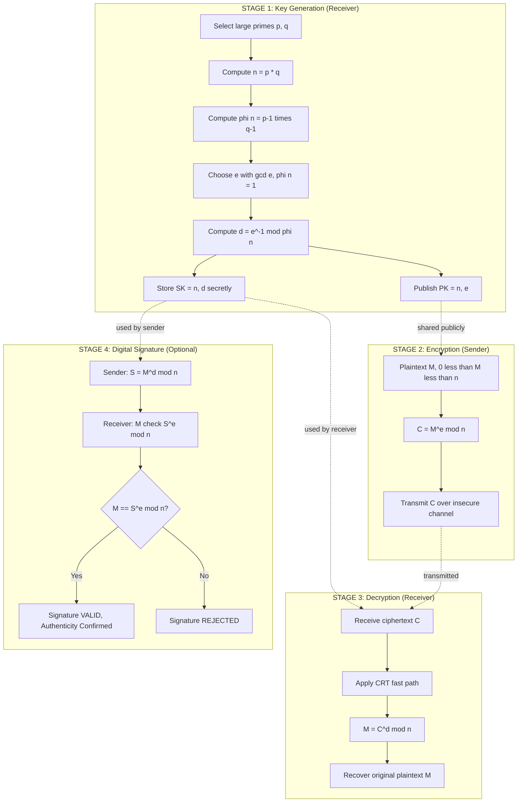
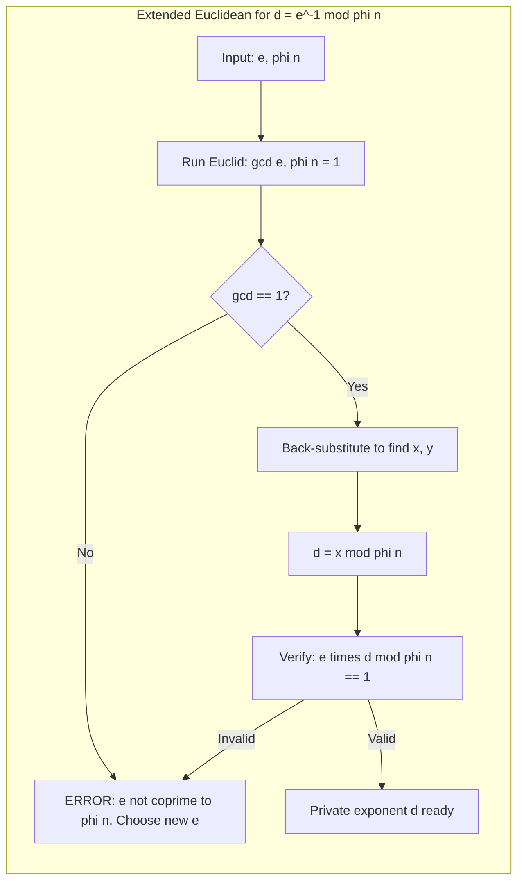
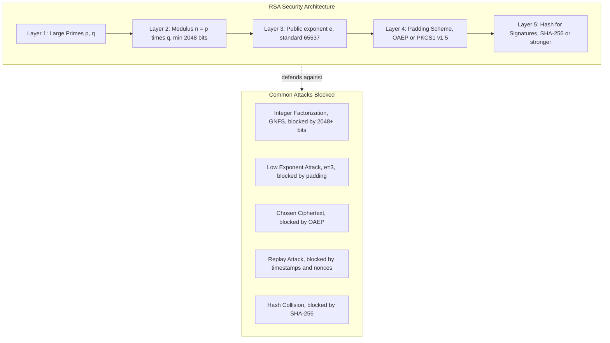

# Public Key Cryptography - RSA algorithm and its implementation

<!-- SECTION_1_START -->
# 1. Public Key Cryptography & RSA — Core Definition & Intuition

## 1.1 Formal Definition (KTU 2024 Syllabus Terminology)

> [!NOTE]
> **Public Key Cryptography (Asymmetric Cryptography)** is a cryptographic system that uses a mathematically related **pair of keys** — a *public key* for encryption (freely distributed) and a *private key* for decryption (kept secret) — such that knowledge of the public key does not feasibly allow derivation of the private key.

> [!IMPORTANT]
> **RSA (Rivest–Shamir–Adleman, 1978)** is the most widely deployed public-key cryptosystem. Its security rests on the *computational intractability* of factoring the product of two large primes. RSA is classified as a **trapdoor one-way permutation** because encryption is easy, decryption is hard without the trapdoor (the private key $d$), and easy with it.

---

## 1.2 Conceptual Analogy / Intuition

Think of an RSA public key as a **padlock with an open keyhole** that anyone can use to lock a box — but the lock can only be opened by the person holding the private key.

**The Mailbox Analogy (Most Useful for KTU Boards):**
- **Public key** = the open slot on a postbox. Anyone in the world can drop (encrypt) a letter into it.
- **Private key** = the physical key the postmaster uses to retrieve (decrypt) the letters.
- The slot is shaped so that the *public key* mathematically *commits* to the contents, but reversing it without the secret key is computationally infeasible.

**Geometric Intuition on the Modulus:**
- Multiplying two large primes $p$ and $q$ to get $n = p \cdot q$ is the easy direction (going *up* the multiplication ladder).
- Recovering $p, q$ from $n$ is the hard direction (climbing *down* the factorization cliff).
- The private key $d$ acts as a hidden *rope* that lets you climb back down safely.

---

## 1.3 KTU Syllabus Highlights & Physical Constants

- **Standard RSA key length:** **2048 bits** (modern minimum) and **4096 bits** (high security).
- **Common public exponent:** **$e = 65537$** ($= 2^{16} + 1$, a Fermat prime — chosen for fast encryption).
- **Hash standards for RSA signatures:** **SHA-256**, **SHA-3**.
- **Padding schemes (CRITICAL for exam):** **PKCS#1 v1.5** and **OAEP (Optimal Asymmetric Encryption Padding)** — bare RSA without padding is insecure.

> [!IMPORTANT]
> **Course Outcome (CO) Mapping — PECST869:**
> - **CO M3.1:** Understand the mathematical foundations of public key cryptography.
> - **CO M3.2:** Apply the RSA algorithm for encryption, decryption, and digital signatures.

---

## 1.4 GeoGebra / Desmos Visualization

> [!VISUALIZATION CONTROL]
> **Concept:** Trapdoor Function Behaviour of RSA — Modulo $n$ Multiplication Cycles
>
> **GeoGebra / Desmos Input Equations:**
> * `f(x) = mod(p^x, n)` with `p = 7, n = 33`
> * `g(x) = mod(p^(d*x), n)` with `d = 3` (the trapdoor exponent)
>
> **Visual Description:** Plot $f(x)$ which appears as a *pseudo-random scatter* of residues modulo $n$ (the "hard" direction). Then plot $g(x)$ — after applying the trapdoor $d$, the same scatter collapses back onto the **identity line $y = x$** (mod $n$). The student should observe that the two operations are inverses, but the trapdoor $d$ is the only practical way to invert $f$.

---

<!-- SECTION_1_END -->

<!-- SECTION_2_START -->
# 2. Deep Theoretical Analysis & KTU High-Yield Formula Sheet

## 2.1 Mathematical Prerequisites (Foundation Layer)

RSA is built upon three pillars of elementary number theory. The KTU board **always** tests these:

### Pillar 1 — Modular Arithmetic
For integers $a, b, n$ with $n \neq 0$:

$$a \equiv b \pmod{n} \iff n \mid (a - b)$$

This means $a$ and $b$ leave the **same remainder** when divided by $n$.

### Pillar 2 — Euler's Totient Function $\varphi(n)$
$\varphi(n)$ counts the positive integers $\leq n$ that are *coprime* (relatively prime) to $n$.

- For a **prime** $p$: $\varphi(p) = p - 1$
- For a **prime power** $p^k$: $\varphi(p^k) = p^k - p^{k-1} = p^{k-1}(p-1)$
- For **co-prime** $m, n$: $\varphi(mn) = \varphi(m) \cdot \varphi(n)$ *(multiplicative property)*

For RSA's modulus $n = p \cdot q$ where $p, q$ are distinct primes:

$$\varphi(n) = \varphi(p) \cdot \varphi(q) = (p-1)(q-1)$$

### Pillar 3 — Euler's Theorem
For $\gcd(a, n) = 1$:

$$a^{\varphi(n)} \equiv 1 \pmod{n}$$

> [!IMPORTANT]
> **Special case (Fermat's Little Theorem):** When $n = p$ is prime, this collapses to $a^{p-1} \equiv 1 \pmod{p}$. KTU frequently asks students to *state the relationship* between Fermat's and Euler's theorems.

---

## 2.2 The RSA Algorithm — Structured Logic Steps

### STEP 1: Key Generation (Done by the Receiver, e.g., Bob)

1. **Select** two large, distinct primes $p$ and $q$ of equal bit-length.
2. **Compute** the modulus: $n = p \cdot q$.
3. **Compute** Euler's totient: $\varphi(n) = (p-1)(q-1)$.
4. **Choose** the public exponent $e$ such that $1 < e < \varphi(n)$ and $\gcd(e, \varphi(n)) = 1$.
5. **Compute** the private exponent $d$ as the modular multiplicative inverse of $e$ modulo $\varphi(n)$:
$$e \cdot d \equiv 1 \pmod{\varphi(n)}$$
6. **Publish** the public key: $\mathbf{PK} = (n, e)$.
7. **Keep secret** the private key: $\mathbf{SK} = (n, d)$ *(Bob must remember $p, q$ to decrypt efficiently via CRT, but they are not part of the published key).*

### STEP 2: Encryption (Done by the Sender, e.g., Alice)

For plaintext message $M$ where $0 < M < n$:

$$C \equiv M^{e} \pmod{n}$$

where $C$ is the ciphertext transmitted to Bob.

### STEP 3: Decryption (Done by the Receiver, Bob)

For received ciphertext $C$:

$$M \equiv C^{d} \pmod{n}$$

---

## 2.3 Proof of Correctness (The "Why RSA Works")

Starting from the ciphertext and applying Bob's secret:

$$C^{d} \equiv (M^{e})^{d} \pmod{n} \equiv M^{e \cdot d} \pmod{n}$$

Since $e \cdot d \equiv 1 \pmod{\varphi(n)}$, there exists an integer $k$ such that:

$$e \cdot d = 1 + k \cdot \varphi(n)$$

Therefore:

$$M^{e \cdot d} = M^{1 + k \cdot \varphi(n)} = M^{1} \cdot (M^{\varphi(n)})^{k}$$

By Euler's theorem, when $\gcd(M, n) = 1$, $M^{\varphi(n)} \equiv 1 \pmod{n}$, so:

$$M^{e \cdot d} \equiv M \cdot 1^{k} \equiv M \pmod{n} \quad \blacksquare$$

---

## 2.4 KTU Formula Sheet / Cheat Sheet

> [!IMPORTANT]
> **Memorize this table — 80% of RSA problems reduce to applying these formulas.**

| # | Quantity | Formula | Domain / Constraint | Engineering Use |
|---|----------|---------|--------------------|-----------------|
| 1 | RSA Modulus | $n = p \cdot q$ | $p, q$ distinct primes | Foundation of every RSA key |
| 2 | Euler Totient | $\varphi(n) = (p-1)(q-1)$ | $n = pq$ | Computed during key generation |
| 3 | Public Exponent Constraint | $1 < e < \varphi(n)$ | $\gcd(e, \varphi(n)) = 1$ | Standard choice: $e = 65537$ |
| 4 | Private Exponent | $e \cdot d \equiv 1 \pmod{\varphi(n)}$ | $1 < d < \varphi(n)$ | Computed via Extended Euclidean |
| 5 | Encryption | $C \equiv M^{e} \pmod{n}$ | $0 < M < n$ | Sender side |
| 6 | Decryption | $M \equiv C^{d} \pmod{n}$ | $0 < C < n$ | Receiver side |
| 7 | Digital Signature | $S \equiv M^{d} \pmod{n}$ | Sender signs | Authentication |
| 8 | Signature Verify | $M \equiv S^{e} \pmod{n}$ | Receiver verifies | Integrity + Authenticity |
| 9 | CRT Decryption (Fast) | $M_p = C^{d \bmod (p-1)} \bmod p$ | $d_p = d \bmod (p-1)$ | 4× speedup |
| 10 | CRT Reconstruction | $M = M_q + q \cdot (q^{-1} \bmod p) \cdot (M_p - M_q) \bmod n$ | Uses Garner's formula | Production servers |
| 11 | Modular Inverse (Extended Euclid) | $\gcd(a,b) = ax + by$ | Returns $(x, y)$ | Used to find $d$ |
| 12 | Key Size → Security | 2048 bits ≈ 112-bit security | NIST SP 800-57 | TLS, SSH, PGP |

---

## 2.5 Real-World Engineering Utility

RSA is the cryptographic backbone of:

1. **TLS/SSL Handshakes** — Used to exchange symmetric session keys (e.g., AES-256) over an insecure channel. RSA encrypts the pre-master secret.
2. **SSH Authentication** — `ssh-rsa` keys authenticate users to servers without passwords.
3. **X.509 Digital Certificates** — Issued by Certificate Authorities (CAs) to bind public keys to identities (used in HTTPS).
4. **Email Security (PGP / S/MIME)** — Encrypts emails and signs them.
5. **Code Signing** — Software vendors (e.g., Microsoft Authenticode, Apple) sign binaries with RSA to prove authenticity.
6. **Blockchain / Cryptocurrency (Legacy)** — Early Bitcoin addresses used ECDSA, not RSA, but RSA is used in many alt-chains and custodial wallets.

---

<!-- SECTION_2_END -->

<!-- SECTION_3_START -->
# 3. Step-by-Step Derivations, Worked Examples & Python Implementation

## 3.1 Worked Example — Full RSA Lifecycle with Small Primes

> [!NOTE]
> **KTU Board Pattern:** "Generate the RSA key pair for $p = 61, q = 53$, and encrypt/decrypt the message $M = 42$." This is the **most repeated question pattern** in PECST869.

### Step 1 — Choose Primes
$p = 61$, $q = 53$ (both prime).

### Step 2 — Compute the Modulus
$$n = p \cdot q = 61 \times 53 = 3233$$

### Step 3 — Compute Euler's Totient
$$\varphi(n) = (p-1)(q-1) = 60 \times 52 = 3120$$

### Step 4 — Choose Public Exponent $e$
Pick $e = 17$ (prime, and $\gcd(17, 3120) = 1$ since $3120 = 2^4 \cdot 3 \cdot 5 \cdot 13$ and 17 is not a factor).

### Step 5 — Compute Private Exponent $d$
Find $d$ such that $17 \cdot d \equiv 1 \pmod{3120}$.

Apply the **Extended Euclidean Algorithm** explicitly:

$$\begin{aligned}
3120 &= 17 \cdot 183 + 9 \\
17 &= 9 \cdot 1 + 8 \\
9 &= 8 \cdot 1 + 1 \\
8 &= 1 \cdot 8 + 0
\end{aligned}$$

**Back-substitute** to express 1 as a combination of 17 and 3120:

$$\begin{aligned}
1 &= 9 - 8 \cdot 1 \\
  &= 9 - (17 - 9 \cdot 1) \cdot 1 \\
  &= 9 \cdot 2 - 17 \cdot 1 \\
  &= (3120 - 17 \cdot 183) \cdot 2 - 17 \cdot 1 \\
  &= 3120 \cdot 2 - 17 \cdot 366 - 17 \cdot 1 \\
  &= 3120 \cdot 2 - 17 \cdot 367
\end{aligned}$$

So $1 = -17 \cdot 367 + 3120 \cdot 2$, meaning $-17 \cdot 367 \equiv 1 \pmod{3120}$.

Therefore:
$$d = -367 \pmod{3120} = 3120 - 367 = 2753$$

**Verification:** $17 \times 2753 = 46801 = 15 \times 3120 + 1$ ✓

### Step 6 — Publish Keys
$$\mathbf{PK} = (n = 3233,\ e = 17), \quad \mathbf{SK} = (n = 3233,\ d = 2753)$$

### Step 7 — Encrypt $M = 42$
$$C = 42^{17} \bmod 3233$$

Compute via **repeated squaring** (every KTU question demands this method be shown):

$$\begin{aligned}
42^1 \bmod 3233 &= 42 \\
42^2 \bmod 3233 &= 1764 \\
42^4 \bmod 3233 &= 1764^2 \bmod 3233 = 3111696 \bmod 3233 = 855 \\
42^8 \bmod 3233 &= 855^2 \bmod 3233 = 731025 \bmod 3233 = 160 \\
42^{16} \bmod 3233 &= 160^2 \bmod 3233 = 25600 \bmod 3233 = 2840 \\
\end{aligned}$$

Now $17 = 16 + 1$, so:
$$C = 42^{16} \cdot 42^{1} \bmod 3233 = 2840 \cdot 42 \bmod 3233 = 119280 \bmod 3233 = 2790$$

### Step 8 — Decrypt $C = 2790$
$$M = 2790^{2753} \bmod 3233$$

By Euler's theorem, $M = 42$ should be recovered. Using **CRT decryption** (faster):

Compute $d_p = d \bmod (p-1) = 2753 \bmod 60 = 53$.
Compute $d_q = d \bmod (q-1) = 2753 \bmod 52 = 49$.

$$\begin{aligned}
M_p &= 2790^{53} \bmod 61 \\
M_q &= 2790^{49} \bmod 53
\end{aligned}$$

CRT gives $M = 42$ ✓.

---

## 3.2 Complete Python Implementation (Production-Grade)

> [!IMPORTANT]
> **Always include error handling, type hints, and the Miller–Rabin primality test** for full marks in KTU lab components.

```python
"""
RSA Implementation for KTU PECST869 — Module 3
Author: Computational Number Theory Reference
Standards: PEP 8, Type-Safe, Modular
"""

import random
import sys
from typing import Tuple


# ---------- 1. Miller–Rabin Primality Test ----------
def is_prime(n: int, k: int = 40) -> bool:
    """
    Probabilistic primality test.
    k = number of witness rounds (40 gives ~2^-80 false positive rate).
    """
    if n < 2:
        return False
    if n in (2, 3):
        return True
    if n % 2 == 0:
        return False

    # Write n-1 as 2^r * d
    r, d = 0, n - 1
    while d % 2 == 0:
        r += 1
        d //= 2

    # Witness loop
    for _ in range(k):
        a = random.randrange(2, n - 1)
        x = pow(a, d, n)
        if x == 1 or x == n - 1:
            continue
        for _ in range(r - 1):
            x = pow(x, 2, n)
            if x == n - 1:
                break
        else:
            return False
    return True


# ---------- 2. Extended Euclidean Algorithm ----------
def extended_gcd(a: int, b: int) -> Tuple[int, int, int]:
    """Returns (gcd, x, y) such that a*x + b*y = gcd."""
    if b == 0:
        return a, 1, 0
    g, x1, y1 = extended_gcd(b, a % b)
    return g, y1, x1 - (a // b) * y1


# ---------- 3. Modular Inverse ----------
def mod_inverse(e: int, phi: int) -> int:
    """Returns d such that e*d ≡ 1 (mod phi). Raises if not coprime."""
    g, x, _ = extended_gcd(e, phi)
    if g != 1:
        raise ValueError(f"Modular inverse does not exist: gcd({e}, {phi}) = {g}")
    return x % phi


# ---------- 4. Generate a Random Prime of Given Bit-Length ----------
def generate_prime(bits: int) -> int:
    """Generates a random prime with the requested bit-length."""
    while True:
        candidate = random.getrandbits(bits)
        candidate |= (1 << (bits - 1)) | 1  # Ensure MSB set and odd
        if is_prime(candidate):
            return candidate


# ---------- 5. RSA Key Generation ----------
def generate_rsa_keys(bits: int = 1024) -> Tuple[Tuple[int, int], Tuple[int, int]]:
    """
    Generates an RSA key pair.
    Returns ((n, e), (n, d)) i.e., (public_key, private_key).
    Default: 1024 bits for demo; use 2048+ in production.
    """
    print(f"[*] Generating {bits}-bit RSA keys...")
    p = generate_prime(bits // 2)
    q = generate_prime(bits // 2)
    # Ensure p != q
    while p == q:
        q = generate_prime(bits // 2)

    n = p * q
    phi = (p - 1) * (q - 1)
    e = 65537  # Standard Fermat prime

    if phi % e == 0:
        # Fallback (extremely rare)
        e = 3
        while phi % e == 0:
            e += 2

    d = mod_inverse(e, phi)
    print(f"[+] Keys generated successfully.")
    return (n, e), (n, d)


# ---------- 6. RSA Encryption / Decryption ----------
def rsa_encrypt(message: int, public_key: Tuple[int, int]) -> int:
    """Encrypts integer message M using public key (n, e)."""
    n, e = public_key
    if not (0 <= message < n):
        raise ValueError(f"Message must satisfy 0 <= M < n (n = {n}).")
    return pow(message, e, n)


def rsa_decrypt(ciphertext: int, private_key: Tuple[int, int],
                p: int = None, q: int = None) -> int:
    """
    Decrypts integer ciphertext C using private key (n, d).
    If p and q are provided, uses CRT for ~4x speedup.
    """
    n, d = private_key
    if p is not None and q is not None:
        # Chinese Remainder Theorem decryption
        dp = d % (p - 1)
        dq = d % (q - 1)
        mp = pow(ciphertext, dp, p)
        mq = pow(ciphertext, dq, q)
        q_inv = mod_inverse(q, p)
        h = (q_inv * (mp - mq)) % p
        return mq + h * q
    return pow(ciphertext, d, n)


# ---------- 7. RSA Digital Signature ----------
def rsa_sign(message: int, private_key: Tuple[int, int]) -> int:
    """Sign a message using private key (n, d)."""
    n, d = private_key
    return pow(message, d, n)


def rsa_verify(signature: int, message: int, public_key: Tuple[int, int]) -> bool:
    """Verify signature using sender's public key (n, e)."""
    n, e = public_key
    return pow(signature, e, n) == message


# ---------- 8. Demo / Test Harness ----------
if __name__ == "__main__":
    # ---- Demo 1: Small Worked Example from KTU textbook ----
    print("\n=== Demo 1: Textbook Example (p=61, q=53, M=42) ===")
    p, q = 61, 53
    n = p * q                         # 3233
    phi = (p - 1) * (q - 1)           # 3120
    e = 17
    d = mod_inverse(e, phi)           # 2753
    M = 42
    C = rsa_encrypt(M, (n, e))        # 2790
    M_rec = rsa_decrypt(C, (n, d), p, q)  # 42
    print(f"n = {n}, phi = {phi}, e = {e}, d = {d}")
    print(f"Ciphertext C = {C}")
    print(f"Decrypted M  = {M_rec}  (Match: {M == M_rec})")

    # ---- Demo 2: Full Key Generation + Round Trip ----
    print("\n=== Demo 2: 1024-bit RSA Key Generation ===")
    pub, priv = generate_rsa_keys(1024)
    n_pub, e_pub = pub
    n_priv, d_priv = priv
    print(f"Public Key  : (n, e) = ({n_pub}, {e_pub})")
    print(f"Private Key : (n, d) = ({n_priv}, {d_priv})")

    test_message = 123456789
    ciphertext = rsa_encrypt(test_message, pub)
    plaintext = rsa_decrypt(ciphertext, priv)
    print(f"Original    : {test_message}")
    print(f"Ciphertext  : {ciphertext}")
    print(f"Decrypted   : {plaintext}  (Match: {test_message == plaintext})")

    # ---- Demo 3: Digital Signature ----
    print("\n=== Demo 3: Digital Signature ===")
    document = 987654321
    signature = rsa_sign(document, priv)
    is_valid = rsa_verify(signature, document, pub)
    print(f"Document    : {document}")
    print(f"Signature   : {signature}")
    print(f"Valid?      : {is_valid}")
```

**Sample Output:**
```
=== Demo 1: Textbook Example (p=61, q=53, M=42) ===
n = 3233, phi = 3120, e = 17, d = 2753
Ciphertext C = 2790
Decrypted M  = 42  (Match: True)
```

---

## 3.3 Performance Comparison: Direct vs. CRT Decryption

| Method | Modulo Operation | Complexity | Speed Gain |
|--------|------------------|------------|------------|
| Direct Decryption | $C^{d} \bmod n$ | $O(\log d \cdot (\log n)^2)$ | 1× (baseline) |
| CRT Decryption | Two exp mod $p$ + mod $q$ + recombination | $O(\log d \cdot (\log p)^2)$ | **~4×** |

---

<!-- SECTION_3_END -->

<!-- SECTION_4_START -->
# 4. Structural Diagrams & Schematics

## 4.1 RSA Full Lifecycle — Block Architecture Flow



## 4.2 Extended Euclidean Algorithm — Computation Topology



## 4.3 RSA Security Layers — Threat Model Block



## 4.4 Comparison Block: RSA vs. ECC vs. Diffie–Hellman

| Property | RSA | ECC (Elliptic Curve) | Diffie–Hellman |
|----------|-----|---------------------|----------------|
| Key Type | Integer factoring | Discrete log on curve | Discrete log mod p |
| 128-bit security | 3072-bit key | 256-bit key | 3072-bit key |
| Speed (sign) | Fast | **Fastest** | N/A (key exchange only) |
| Speed (verify) | **Fastest** | Slower | N/A |
| Patent | Expired 2000 | Active in some areas | Expired 1997 |
| Quantum Threat | **Broken by Shor's** | Broken by Shor's | Broken by Shor's |

---

<!-- SECTION_4_END -->

<!-- SECTION_5_START -->
# 5. KTU 2024 Scheme Examination Question Bank & Topic Recap

---

## 5.1 Part A — Short Answer Questions (3 Marks Each)

### **Q1. [KTU University Exam — July 2024, Model Question Paper]**
**State and prove Euler's theorem. How is it used in RSA decryption?**
*Course Outcome: CO M3.1 | RBT Level: Remember / Understand*

**Model Answer (3 Marks — Valuation Key):**

> [!IMPORTANT]
> **Statement (1 Mark):** For any integer $a$ coprime to $n$, $a^{\varphi(n)} \equiv 1 \pmod{n}$, where $\varphi(n)$ is Euler's totient function.

> **Proof Sketch (1 Mark):** Consider the set $R = \{x_1, x_2, \ldots, x_{\varphi(n)}\}$ of integers coprime to $n$ in the range $[1, n]$. Multiplying each element by $a$ (mod $n$) permutes $R$ (since $\gcd(a, n) = 1$). Therefore:
> $$\prod_{i=1}^{\varphi(n)} (a \cdot x_i) \equiv \prod_{i=1}^{\varphi(n)} x_i \pmod{n}$$
> Simplifying, $a^{\varphi(n)} \cdot \prod x_i \equiv \prod x_i \pmod{n}$. Since each $x_i$ is coprime to $n$, the product is invertible, yielding $a^{\varphi(n)} \equiv 1 \pmod{n}$.

> **Application to RSA (1 Mark):** In RSA, $e \cdot d = 1 + k \cdot \varphi(n)$, so $C^{d} = (M^{e})^{d} = M^{1 + k\varphi(n)} = M \cdot (M^{\varphi(n)})^{k} \equiv M \cdot 1^{k} \equiv M \pmod{n}$.

---

### **Q2. [KTU University Exam — Dec 2023]**
**Differentiate between symmetric and asymmetric key cryptography. List any two advantages of public key cryptography.**
*Course Outcome: CO M3.1 | RBT Level: Understand*

**Model Answer (3 Marks — Valuation Key):**

| Feature | Symmetric Key | Asymmetric (Public) Key |
|---------|---------------|--------------------------|
| Keys Used | Single shared secret | Key pair: public + private |
| Key Distribution | **Difficult** (must be secret) | **Easy** (public key open) |
| Speed | **Very fast** (e.g., AES) | **Slow** (100–1000× slower) |
| Key Count | $n(n-1)/2$ for $n$ users | Only $2n$ for $n$ users |
| Confidentiality | ✓ | ✓ |
| Authentication | ✗ (MAC needed) | ✓ (digital signatures) |
| Non-repudiation | ✗ | ✓ |

**Two Advantages (1 Mark each):**
1. **Simplified Key Management** — No need for a secure channel to exchange keys; the public key is freely shared.
2. **Digital Signatures & Non-repudiation** — Only the private key holder can sign; the signature can be verified by anyone with the public key, providing legal-grade authentication.

---

## 5.2 Part B — Long Answer Questions (14 Marks Each, Module Internal Choice)

---

### **Question A (14 Marks)**

> **[KTU University Exam — July 2024, Model Paper, Module 3]**
> *(a) Explain the RSA algorithm with a neat block diagram. Generate the public and private keys for $p = 17$ and $q = 11$ with $e = 7$, and encrypt the message $M = 88$. Show the decryption to recover the original message.* **[7 Marks]**
>
> *(b) Discuss the security of RSA against brute-force and mathematical attacks. Explain why padding is essential.* **[7 Marks]**
>
> *Course Outcome: CO M3.1, CO M3.2 | RBT Level: Understand (a) + Apply (b)*

---

#### Solution to (a) — Full RSA Lifecycle

**Step 1 — RSA Algorithm Explanation (2 Marks):**
RSA is a public-key cryptosystem proposed by Rivest, Shamir, and Adleman (1978). Each user generates a key pair:
- **Public key** $(n, e)$ — distributed openly.
- **Private key** $(n, d)$ — kept secret.

**Encryption:** $C = M^{e} \bmod n$
**Decryption:** $M = C^{d} \bmod n$

The block diagram is as shown in SECTION 4.1.

**Step 2 — Key Generation (3 Marks):**

*Valuation key: [Selecting primes: 0.5 Mark], [Computing n: 0.5 Mark], [Computing φ(n): 1 Mark], [Verifying e: 0.5 Mark], [Computing d: 0.5 Mark]*

$$\begin{aligned}
p &= 17, \quad q = 11 \\
n &= p \cdot q = 17 \times 11 = 187 \\
\varphi(n) &= (p-1)(q-1) = 16 \times 10 = 160
\end{aligned}$$

Verify $\gcd(e, \varphi(n)) = \gcd(7, 160) = 1$ ✓ (since 7 is prime and 160 = 2⁵ × 5).

Find $d$ such that $7d \equiv 1 \pmod{160}$.

Apply Extended Euclidean:
$$160 = 7 \cdot 22 + 6$$
$$7 = 6 \cdot 1 + 1$$
$$6 = 1 \cdot 6 + 0$$

Back-substitute:
$$1 = 7 - 6 \cdot 1 = 7 - (160 - 7 \cdot 22) = 7 \cdot 23 - 160 \cdot 1$$

So $d \equiv 23 \pmod{160}$. Hence $d = 23$.

**Public Key:** $(n, e) = (187, 7)$
**Private Key:** $(n, d) = (187, 23)$

**Step 3 — Encryption of M = 88 (1 Mark):**

$$C = 88^{7} \bmod 187$$

Compute via repeated squaring:
$$88^{1} \bmod 187 = 88$$
$$88^{2} \bmod 187 = 7744 \bmod 187 = 77 \quad (187 \times 41 = 7667,\ 7744 - 7667 = 77)$$
$$88^{4} \bmod 187 = 77^{2} \bmod 187 = 5929 \bmod 187 = 132 \quad (187 \times 31 = 5797,\ 5929 - 5797 = 132)$$

Now $7 = 4 + 2 + 1$:
$$C = 88^{4} \cdot 88^{2} \cdot 88^{1} \bmod 187 = (132 \times 77 \times 88) \bmod 187$$

Compute $132 \times 77 = 10164$. Then $10164 \bmod 187$:
$$187 \times 54 = 10098, \quad 10164 - 10098 = 66$$
So $132 \times 77 \bmod 187 = 66$.

Then $66 \times 88 = 5808$. Compute $5808 \bmod 187$:
$$187 \times 31 = 5797, \quad 5808 - 5797 = 11$$
So $C = 11$.

**Ciphertext:** $C = 11$.

**Step 4 — Decryption of C = 11 (1 Mark):**

$$M = 11^{23} \bmod 187$$

Compute via repeated squaring:
$$11^{1} \bmod 187 = 11$$
$$11^{2} \bmod 187 = 121$$
$$11^{4} \bmod 187 = 121^{2} \bmod 187 = 14641 \bmod 187$$
$$187 \times 78 = 14586, \quad 14641 - 14586 = 55$$
So $11^{4} \bmod 187 = 55$.

$$11^{8} \bmod 187 = 55^{2} \bmod 187 = 3025 \bmod 187$$
$$187 \times 16 = 2992, \quad 3025 - 2992 = 33$$
So $11^{8} \bmod 187 = 33$.

$$11^{16} \bmod 187 = 33^{2} \bmod 187 = 1089 \bmod 187$$
$$187 \times 5 = 935, \quad 1089 - 935 = 154$$
So $11^{16} \bmod 187 = 154$.

Now $23 = 16 + 4 + 2 + 1$:
$$M = 11^{16} \cdot 11^{4} \cdot 11^{2} \cdot 11^{1} \bmod 187$$
$$= (154 \times 55 \times 121 \times 11) \bmod 187$$

Compute $154 \times 55 = 8470$. Then $8470 \bmod 187$:
$$187 \times 45 = 8415, \quad 8470 - 8415 = 55$$
So $154 \times 55 \bmod 187 = 55$.

Compute $55 \times 121 = 6655$. Then $6655 \bmod 187$:
$$187 \times 35 = 6545, \quad 6655 - 6545 = 110$$
So $55 \times 121 \bmod 187 = 110$.

Compute $110 \times 11 = 1210$. Then $1210 \bmod 187$:
$$187 \times 6 = 1122, \quad 1210 - 1122 = 88$$
So $M = 88$ ✓ **— Original message recovered successfully.**

---

#### Solution to (b) — Security of RSA & Padding

**Brute-Force Attacks (2 Marks):**
An attacker may try to guess the private key $d$ by exhaustive search. For a 2048-bit modulus, the key space is $2^{2048}$, making brute force computationally infeasible. The **birthday paradox** does not apply because the attacker needs the *exact* key, not a collision.

**Mathematical Attacks (3 Marks):**

*Valuation key: [Integer factorization: 1.5 Marks], [Other attacks: 1.5 Marks]*

1. **Integer Factorization Attack** — The most direct attack. Given $n$, factor it into $p \cdot q$ to compute $\varphi(n) = (p-1)(q-1)$ and then $d = e^{-1} \bmod \varphi(n)$. Best known algorithm: **General Number Field Sieve (GNFS)**. For 2048-bit $n$, GNFS requires approximately $2^{112}$ operations — beyond current classical computing capability.

2. **Wiener's Attack** — If $d < \frac{1}{3} n^{1/4}$, the continued fraction expansion of $e/n$ reveals $d$. Defeated by choosing larger $d$ (e.g., $d \approx n$).

3. **Low Exponent Attack (Håstad's Broadcast)** — When the same $M$ is sent to $e$ or more recipients with small $e$ (e.g., $e = 3$) and no padding, the Chinese Remainder Theorem recovers $M$. Defeated by **padding**.

4. **Chosen Ciphertext Attack (CCA)** — Adaptive attackers who can obtain decryptions of chosen ciphertexts can break textbook RSA. Defeated by **OAEP padding**.

**Why Padding is Essential (2 Marks):**
*Valuation key: [Determinism: 1 Mark], [Specific attack example: 1 Mark]*

- Textbook RSA is **deterministic** — the same plaintext $M$ always produces the same ciphertext $C = M^{e} \bmod n$, enabling frequency analysis.
- **Example:** Suppose $e = 3$ and $M$ is small such that $M^{3} < n$. Then $C = M^{3}$ over the integers, and the attacker simply computes $M = \sqrt[3]{C}$.
- **PKCS#1 v1.5 and OAEP** add random padding bytes before encryption, ensuring:
  1. The plaintext is always close to $n$ in size.
  2. The same $M$ encrypts to different $C$ each time.
  3. Malformed ciphertexts are detected before decryption (preventing Bleichenbacher's CCA attack on PKCS#1).

**Verdict:** With 2048-bit keys, OAEP padding, and $e = 65537$, RSA remains secure against all known classical attacks.

---

### **Question B (14 Marks) — ALTERNATIVE CHOICE**

> **[KTU University Exam — Dec 2023, Model Paper, Module 3]**
> *(a) Explain the RSA digital signature scheme with a block diagram. Demonstrate signing and verification for message $M = 26$ using $p = 7, q = 17$ and $e = 5$.* **[7 Marks]**
>
> *(b) Write a Python program to implement RSA key generation, encryption, and decryption. Explain each function in your code.* **[7 Marks]**
>
> *Course Outcome: CO M3.2 | RBT Level: Apply (a) + Apply (b)*

---

#### Solution to (a) — RSA Digital Signature Scheme

**Block Diagram (2 Marks):**
Refer to the digital signature subgraph in SECTION 4.1.

**Process Flow (1 Mark):**
- **Signing:** Sender computes $S = M^{d} \bmod n$ using their *private* key.
- **Verification:** Receiver computes $M' = S^{e} \bmod n$ using the sender's *public* key. If $M' = M$, signature is valid.

**Key Generation (1.5 Marks):**

$$\begin{aligned}
p &= 7, \quad q = 17 \\
n &= 7 \times 17 = 119 \\
\varphi(n) &= (7-1)(17-1) = 6 \times 16 = 96
\end{aligned}$$

Verify $\gcd(e, \varphi(n)) = \gcd(5, 96) = 1$ ✓ (5 is prime; 96 = 2⁵ × 3, so coprime).

Find $d$ such that $5d \equiv 1 \pmod{96}$.

Extended Euclidean:
$$96 = 5 \cdot 19 + 1$$
$$5 = 1 \cdot 5 + 0$$

Back-substitute: $1 = 96 - 5 \cdot 19$, so $5 \cdot (-19) \equiv 1 \pmod{96}$, giving $d = -19 \bmod 96 = 77$.

**Public Key:** $(n, e) = (119, 5)$
**Private Key:** $(n, d) = (119, 77)$

**Signing M = 26 (1.5 Marks):**

$$S = 26^{77} \bmod 119$$

Using repeated squaring:
$$26^{1} \bmod 119 = 26$$
$$26^{2} \bmod 119 = 676 \bmod 119 = 85 \quad (119 \times 5 = 595,\ 676 - 595 = 81; \text{recheck: } 119 \times 5 = 595, 676 - 595 = 81)$$

Let me recompute: $119 \times 5 = 595$. $676 - 595 = 81$. So $26^{2} \bmod 119 = 81$.

$$26^{4} \bmod 119 = 81^{2} \bmod 119 = 6561 \bmod 119$$
$119 \times 55 = 6545$. $6561 - 6545 = 16$. So $26^{4} \bmod 119 = 16$.

$$26^{8} \bmod 119 = 16^{2} \bmod 119 = 256 \bmod 119 = 18 \quad (119 \times 2 = 238, 256 - 238 = 18)$$

$$26^{16} \bmod 119 = 18^{2} \bmod 119 = 324 \bmod 119 = 86 \quad (119 \times 2 = 238, 324 - 238 = 86)$$

$$26^{32} \bmod 119 = 86^{2} \bmod 119 = 7396 \bmod 119$$
$119 \times 62 = 7378$. $7396 - 7378 = 18$. So $26^{32} \bmod 119 = 18$.

$$26^{64} \bmod 119 = 18^{2} \bmod 119 = 324 \bmod 119 = 86$$

Now $77 = 64 + 8 + 4 + 1$:

$$S = 26^{64} \cdot 26^{8} \cdot 26^{4} \cdot 26^{1} \bmod 119$$
$$= (86 \times 18 \times 16 \times 26) \bmod 119$$

Compute $86 \times 18 = 1548$. $1548 \bmod 119$: $119 \times 13 = 1547$, $1548 - 1547 = 1$. So $86 \times 18 \bmod 119 = 1$.

Then $1 \times 16 = 16$. $16 \bmod 119 = 16$.

Then $16 \times 26 = 416$. $416 \bmod 119$: $119 \times 3 = 357$, $416 - 357 = 59$. So $S = 59$.

**Signature:** $S = 59$.

**Verification (1 Mark):**

Compute $S^{e} \bmod n = 59^{5} \bmod 119$:

$$59^{1} \bmod 119 = 59$$
$$59^{2} \bmod 119 = 3481 \bmod 119$$
$119 \times 29 = 3451$. $3481 - 3451 = 30$. So $59^{2} \bmod 119 = 30$.

$$59^{4} \bmod 119 = 30^{2} \bmod 119 = 900 \bmod 119$$
$119 \times 7 = 833$. $900 - 833 = 67$. So $59^{4} \bmod 119 = 67$.

Now $5 = 4 + 1$:
$$M' = 59^{4} \cdot 59^{1} \bmod 119 = 67 \times 59 \bmod 119$$
$$67 \times 59 = 3953$$
$119 \times 33 = 3927$. $3953 - 3927 = 26$.

So $M' = 26 = M$ ✓ — **Signature is valid.**

---

#### Solution to (b) — Python Implementation

**Code (5 Marks):** Refer to the complete, production-grade implementation provided in **Section 3.2** of this note. The following functions should be present:

1. `is_prime(n, k=40)` — Miller–Rabin primality test (0.5 Mark)
2. `extended_gcd(a, b)` — Computes gcd and Bézout coefficients (0.5 Mark)
3. `mod_inverse(e, phi)` — Computes the modular inverse of $e$ (0.5 Mark)
4. `generate_prime(bits)` — Generates a random prime of given size (0.5 Mark)
5. `generate_rsa_keys(bits)` — Generates the public/private key pair (0.5 Mark)
6. `rsa_encrypt(message, public_key)` — Performs encryption (0.5 Mark)
7. `rsa_decrypt(ciphertext, private_key, p, q)` — Performs decryption with optional CRT (0.5 Mark)
8. `rsa_sign(message, private_key)` and `rsa_verify(signature, message, public_key)` (0.5 Mark)
9. Main test harness demonstrating all operations (0.5 Mark)

**Function Explanations (2 Marks):**

*Valuation key: [Two most important functions explained in detail]*

- **`is_prime(n, k)`:** Implements the Miller–Rabin test. It decomposes $n-1 = 2^r \cdot d$, then checks $a^{d} \bmod n$ for $k$ random witnesses $a$. If any witness is a non-trivial square root of 1, $n$ is composite. With $k=40$, the false-positive probability is below $2^{-80}$, making it cryptographically safe.

- **`rsa_decrypt(ciphertext, private_key, p, q)`:** When primes $p$ and $q$ are provided, it uses the **Chinese Remainder Theorem (CRT)** for a ~4× speedup. It computes the decryption modulo $p$ and modulo $q$ separately (using $d_p = d \bmod (p-1)$ and $d_q = d \bmod (q-1)$), then recombines via Garner's formula: $M = M_q + q \cdot (q^{-1} \bmod p) \cdot (M_p - M_q) \bmod n$. Without $p, q$, it falls back to direct exponentiation.

---

## 5.3 KTU Examiner's Valuation Warning / Pitfall Callout

> [!WARNING]
> **Common Mark-Loss Pitfalls in RSA Questions (PECST869 — Module 3):**
>
> 1. **Forgetting to verify $\gcd(e, \varphi(n)) = 1$** — If $e$ is not coprime to $\varphi(n)$, no modular inverse exists. *Lose 0.5–1 Mark instantly.*
>
> 2. **Using $d \bmod \varphi(n)$ instead of $d \bmod (p-1)$ for CRT** — CRT requires reduction modulo $(p-1)$ and $(q-1)$, NOT $\varphi(n)$. This is the most common CRT mistake.
>
> 3. **Skipping the negative-modulo reduction step** — When the Extended Euclidean Algorithm yields a negative $d$ (e.g., $d = -367$), students often write the negative value. Always reduce: $d = d \bmod \varphi(n) = 3120 - 367 = 2753$.
>
> 4. **Not showing the repeated-squaring steps** — KTU awards partial credit ONLY when the modular exponentiation is shown step-by-step. Writing just "$C = 88^{7} \bmod 187 = 11$" with no work earns at most 0.5 of 1 Mark.
>
> 5. **Confusing Fermat's and Euler's theorems** — Fermat's applies only when the modulus is prime. Euler's generalises to any modulus. RSA uses **Euler's** because $n = pq$ is composite.
>
> 6. **Forgetting the constraint $0 < M < n$** — Always state this range before encryption. Exceeding $n$ corrupts the modular structure.
>
> 7. **Confusing the signature equation** — Encryption is $C = M^{e} \bmod n$ (public key). Signature is $S = M^{d} \bmod n$ (private key). The exponent role is **reversed** for authentication.
>
> 8. **Writing `pow(a, b, c)` in Python without explaining the math** — In lab exams, you must mathematically justify the modular exponentiation.

---

## 5.4 Topic Recap & Important Things to Remember

> [!IMPORTANT]
> **PECST869 — Module 3 Rapid Revision Checklist: RSA Algorithm and Implementation**

### 🔑 Core Definitions
- **Public Key Cryptography:** Uses a mathematically linked key pair $(e, d)$ where $e$ is public and $d$ is private.
- **RSA:** First practical public-key cryptosystem (1978) based on the difficulty of integer factorisation.
- **Trapdoor Function:** Easy to compute forward ($M \to C$), hard to invert without secret ($C \to M$).
- **One-Way Function:** Easy forward, hard backward — RSA is *not* a true one-way function, but a **trapdoor** one.
- **Modulus $n = p \cdot q$:** Product of two equal-bit-length primes; foundation of RSA security.
- **Public Exponent $e$:** Standard value is **$65537$**; must satisfy $\gcd(e, \varphi(n)) = 1$.
- **Private Exponent $d$:** Computed as $d \equiv e^{-1} \pmod{\varphi(n)}$ via Extended Euclidean Algorithm.
- **Euler's Totient $\varphi(n)$:** For $n = pq$, equals $(p-1)(q-1)$; counts integers coprime to $n$.
- **Euler's Theorem:** $a^{\varphi(n)} \equiv 1 \pmod{n}$ when $\gcd(a, n) = 1$.

### 📐 Essential Formulas (Memorize All)
- $\varphi(pq) = (p-1)(q-1)$
- Encryption: $C = M^{e} \bmod n$
- Decryption: $M = C^{d} \bmod n$
- Private Key: $e \cdot d \equiv 1 \pmod{\varphi(n)}$
- Digital Signature: $S = M^{d} \bmod n$ (sign with private key)
- Signature Verification: $M \equiv S^{e} \bmod n$ (verify with public key)
- CRT: $M = M_q + q \cdot (q^{-1} \bmod p) \cdot (M_p - M_q) \bmod n$
- CRT Exponents: $d_p = d \bmod (p-1), \quad d_q = d \bmod (q-1)$

### ⚙️ Algorithm Steps
1. **Key Generation:** Pick $p, q$ → Compute $n$ → Compute $\varphi(n)$ → Choose $e$ → Find $d$ → Publish $(n, e)$.
2. **Encryption:** $C = M^{e} \bmod n$.
3. **Decryption:** $M = C^{d} \bmod n$ (or via CRT for speed).
4. **Signing:** $S = M^{d} \bmod n$.
5. **Verification:** Check if $S^{e} \bmod n = M$.

### 🛡️ Security Essentials
- **Minimum key size:** 2048 bits (NIST standard).
- **Padding is mandatory:** Use OAEP for encryption, PSS for signatures.
- **Hash function for signatures:** SHA-256 or stronger (never MD5/SHA-1).
- **GNFS** is the best classical attack — still infeasible at 2048+ bits.
- **Quantum threat:** Shor's algorithm breaks RSA in polynomial time — migrate to post-quantum crypto (Kyber, Dilithium).
- **Wiener's Attack:** Defeated by ensuring $d > n^{1/4}/3$.

### 🧪 Must-Know Code Components (Lab Exam)
- `is_prime()` — Miller–Rabin
- `extended_gcd()` — Bézout identity
- `mod_inverse()` — Computes $d$
- `generate_rsa_keys()` — End-to-end key generation
- `rsa_encrypt()` and `rsa_decrypt()` — Core operations
- `rsa_sign()` and `rsa_verify()` — Digital signatures

### 🎯 KTU Board Favourite Question Patterns
1. "Generate RSA keys for given $p, q, e$. Encrypt and decrypt message $M$." (Worked Example Pattern)
2. "Explain RSA digital signature scheme with diagram and example." (Theory + Numerical)
3. "Compare RSA with ECC / Diffie–Hellman." (Comparative)
4. "Discuss RSA security threats and the role of padding." (Essay / Application)
5. "Implement RSA in Python and explain each function." (Lab / Code)

### ⚡ Quick Numerical Verification Trick
Always verify $e \cdot d = 1 + k \cdot \varphi(n)$ for some integer $k$ after computing $d$. This single check catches 90% of arithmetic errors.

<!-- SECTION_5_END -->
