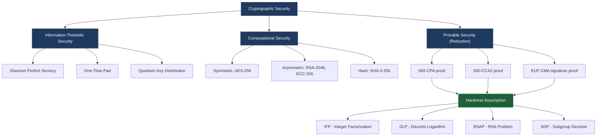
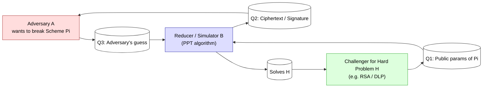
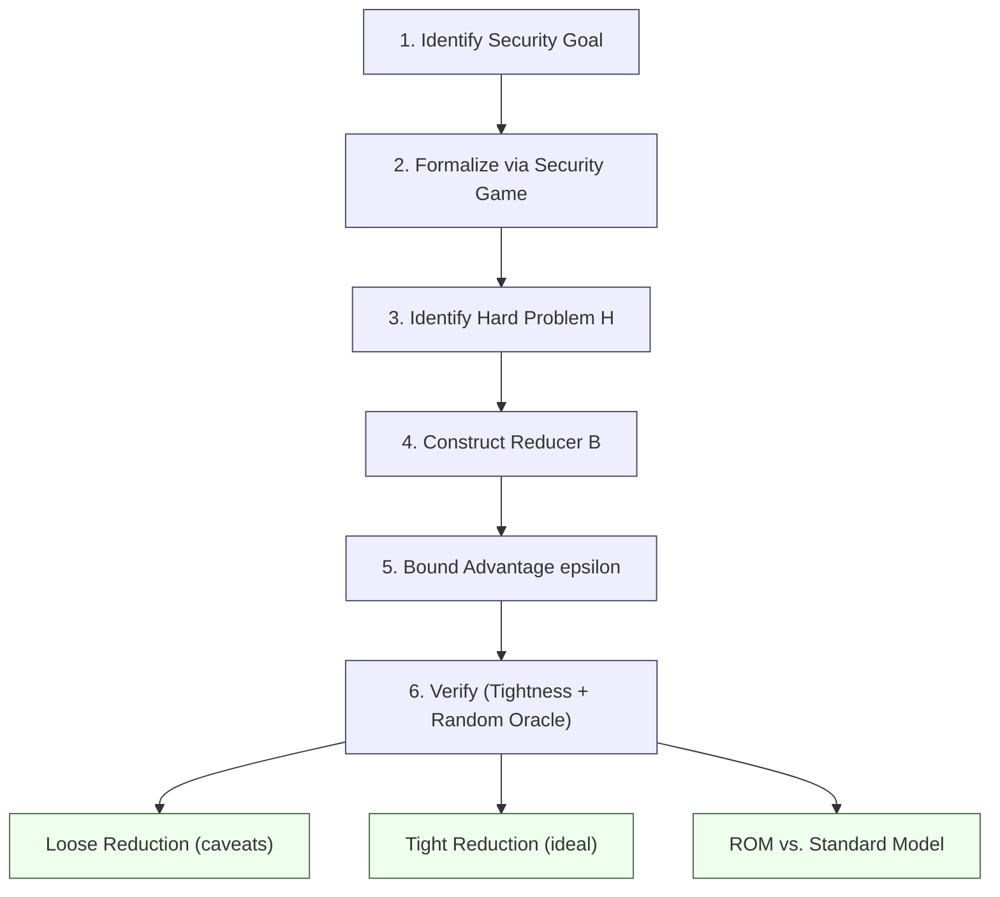

# Security aspects and cryptanalysis

<!-- SECTION_1_START -->
# Module 3: Public Key Cryptography — Security Aspects & Cryptanalysis

## 1. Core Technical Definition & Intuitive Overview

### 1.1 Formal Definition (KTU 2024 Syllabus Aligned)

> [!IMPORTANT]
> **Cryptographic Security** is the property of a cryptosystem that quantifies the computational effort required by an adversary (with bounded resources) to break the system, i.e., to recover plaintext from ciphertext, forge signatures, or violate any stated security guarantee.

In the formal **computational complexity** framework of modern cryptography, a public-key scheme $\Pi = (\text{Gen}, \text{Enc}, \text{Dec})$ is considered *secure* if every probabilistic polynomial-time (PPT) adversary $\mathcal{A}$ wins the security experiment with probability negligibly better than that of a random guess.

$$
\Pr[\text{Exp}^{\text{sec}}_{\mathcal{A},\Pi}(n) = 1] \leq \frac{1}{2} + \varepsilon(n)
$$

where $\varepsilon(n)$ is a *negligible function* — one that decreases faster than the inverse of any polynomial:

$$
\forall \, c \in \mathbb{N}, \quad \exists \, n_0 : \varepsilon(n) < \frac{1}{n^c} \quad \forall n \geq n_0
$$

### 1.2 Cryptanalysis — The Adversarial Discipline

> [!NOTE]
> **Cryptanalysis** is the science (and art) of studying cryptographic systems with the explicit intent of finding hidden weaknesses, recovering plaintext/keys, or producing forgeries — without necessarily having access to the secret key.

The principal objectives of a cryptanalyst, in increasing severity, are:

1. **Ciphertext-only attack (COA / KPA)** — attacker observes ciphertext(s) only.
2. **Known-plaintext attack (KPA)** — attacker has pairs $(m, c)$.
3. **Chosen-plaintext attack (CPA)** — attacker can query an encryption oracle.
4. **Chosen-ciphertext attack (CCA / CCA2)** — attacker can query a decryption oracle (adaptively in CCA2).

### 1.3 Conceptual Analogy — The Three Lockboxes

> [!TIP]
> **Intuition (Geometric / Real-World Analogy):** Think of a public-key system as a *mailbox with two keys*:
> - The **public key** is a *slot* anyone can drop envelopes into, but cannot retrieve them.
> - The **private key** is the *only key* that opens the back door of the mailbox.
>
> **Computational security** is like saying *"to pry open the back door, you would need to cut through a 1-inch steel plate"* — physically possible in principle, but infeasible in human time-scales.
>
> **Information-theoretic security** (e.g., one-time pad) is like saying *"even with infinite time, the door tells you nothing"* — provably unbreakable.
>
> **Cryptanalysis** is the locksmith who studies the door, looking for structural flaws: a thin wall, a sticky hinge, a vulnerable weld, or a misaligned bolt.

### 1.4 Security Foundations — Three Pillars

| Pillar | Meaning | Example Scheme |
|---|---|---|
| **Provable Security** | Reduction to a hard problem (factoring, DLP) | RSA-OAEP, ElGamal |
| **Computational Security** | Break requires $> 2^{80}$ operations | AES-128, RSA-2048 |
| **Information-Theoretic Security** | Break requires infinite computation | One-Time Pad, Shamir $(k,n)$ threshold |

> [!VISUALIZATION CONTROL]
> **Concept:** Security vs. Attacker Resources Trade-off Curve
> **GeoGebra / Desmos Input Equations:**
> * `f(x) = 1 / (1 + exp(-(x - 128)))` — sigmoid mapping bits of security to break probability
> * `g(x) = 2^x` — operations required as a function of key size in bits
> **Visual Description:** As the key size $n$ (x-axis) grows, the work factor $2^n$ (y-axis, log-scale) explodes super-linearly, making brute force practically impossible above ~128 bits.

---

<!-- SECTION_1_END -->

<!-- SECTION_2_START -->
# 2. Deep Theoretical Analysis & KTU High-Yield Formula Sheet

## 2.1 The Hardness Assumptions — Foundation of Modern PKC

> [!IMPORTANT]
> All practical public-key cryptography rests on the conjectured *hardness* of three classical number-theoretic problems. If any one falls, large classes of schemes collapse.

### (A) Integer Factorization Problem (IFP)

Given $N = p \cdot q$ with $p, q$ prime, find $p$ (and $q$).

* **Hardness Metric:** General Number Field Sieve (GNFS) sub-exponential time:

$$
L_N\left[\frac{1}{3}, c\right] = \exp\!\left(\big(\,c + o(1)\,\big)\,(\ln N)^{1/3}\,(\ln \ln N)^{2/3}\right)
$$

* **Concrete:** RSA-2048 has approximately **112 bits of security** (effective work $\approx 2^{112}$).

### (B) Discrete Logarithm Problem (DLP)

Given generator $g$ of a cyclic group $G$ and $y = g^x \bmod p$, recover $x$.

* **Generic group:** $\mathcal{O}(\sqrt{\vert G \vert}) = \mathcal{O}(2^{n/2})$ via Shoup / Baby-step-Giant-step / Pollard-$\rho$.
* **Multiplicative group $\mathbb{Z}_p^*$:** sub-exponential, similar to IFP.
* **Elliptic curve group $E(\mathbb{F}_p)$:** fully exponential $\mathcal{O}(2^{n/2})$ — *no known sub-exponential algorithm*.

### (C) RSA Problem (RSAP)

Given $(N, e, c)$ with $c \equiv m^e \pmod N$, recover $m$.

* **Reduction:** RSAP $\leq_p$ IFP (if you can factor $N$, you invert RSA).
* The reverse reduction is *not known* — RSA may be easier than factoring in theory.

## 2.2 Provable Security — The Reduction Paradigm

> [!NOTE]
> **Reduction Proof:** We say scheme $\Pi$ is *provably secure* under assumption $A$ if we can build an efficient algorithm $\mathcal{B}$ (the *simulator/reducer*) that uses any successful adversary $\mathcal{A}$ against $\Pi$ to break $A$.

$$
\text{If } \mathcal{A} \text{ breaks } \Pi \text{ in time } t \text{ with advantage } \varepsilon \;\;\Longrightarrow\;\; \mathcal{B} \text{ solves } A \text{ in time } t' \approx t \text{ with advantage } \varepsilon' \approx \varepsilon
$$

The security proof is the *efficient* (polynomial-time) transformation $\mathcal{A} \mapsto \mathcal{B}$.

## 2.3 Standard Security Notions (Indistinguishability Games)

Let $b \xleftarrow{\$} \{0,1\}$ be a hidden random bit chosen by the challenger.

### IND-CPA (Chosen-Plaintext Attack)
1. Adversary submits two equal-length messages $m_0, m_1$.
2. Challenger returns $c^* \leftarrow \text{Enc}(pk, m_b)$.
3. Adversary outputs guess $b'$.

$$
\text{Adv}_{\Pi}^{\text{IND-CPA}}(\mathcal{A}) = \left\vert \Pr[b' = b] - \frac{1}{2} \right\vert \leq \varepsilon
$$

### IND-CCA1 (Lunchtime / Non-adaptive)
Same as IND-CPA, *plus* the adversary gets a **single** decryption-oracle query phase *before* seeing $c^*$.

### IND-CCA2 (Adaptive CCA)
The adversary has decryption-oracle access **even after** seeing $c^*$ (with the natural restriction that it cannot submit $c^*$ itself).

> [!WARNING]
> Plain RSA is **NOT** IND-CPA secure. An attacker choosing $m_0, m_1$ and seeing $c^* = m_b^e \bmod N$ can simply compute $m_0^e \bmod N$ and $m_1^e \bmod N$ — and **WIN trivially**. This is the basis of textbook RSA's insecurity.

## 2.4 The KTU High-Yield Formula Cheat Sheet

| # | Concept | Formula / Bound | Notes |
|---|---|---|---|
| 1 | RSA modulus size for $\lambda$ bits of security | $n \approx 2\lambda \cdot \frac{1.923 \cdot \ln 2}{(\ln 2)^{2/3}} \approx 6.6 \lambda$ | Approximate (NIST SP 800-57) |
| 2 | ECC key size for $\lambda$ bits of security | $n \approx 2\lambda$ | Exponential hardness |
| 3 | Pollard-$\rho$ factoring | $T = \mathcal{O}(N^{1/4} \sqrt{\pi/2})$ | Generic integer factoring |
| 4 | Baby-step Giant-step DLP | $T = \mathcal{O}(\sqrt{n})$ space, $\mathcal{O}(\sqrt{n})$ time | Generic group |
| 5 | Pohlig-Hellman DLP (composite $n$) | $T = \mathcal{O}\left(\sum_{p_i \mid n} \sqrt{p_i}\right)$ | Exploits smooth $n$ |
| 6 | Index Calculus (in $\mathbb{Z}_p^*$) | $L_p[1/2, c]$ sub-exp | Best for multiplicative groups |
| 7 | Number Field Sieve (NFS) | $L_N[1/3, (64/9)^{1/3}]$ | Best for IFP and DLP in $\mathbb{Z}_p^*$ |
| 8 | Wiener attack bound | $d < \frac{1}{3} N^{1/4}$ | Continued-fraction attack on small $d$ |
| 9 | Håstad broadcast bound | $e \leq k$ needed to recover $m$ (CRT) | $k$ recipients required |
| 10 | Birthday paradox | Collision prob $\geq 0.5$ when $\approx 1.177 \sqrt{N}$ | Hash function attacks |
| 11 | Work factor for symmetric cipher | $2^n$ operations | $n$ = key length |
| 12 | Quadratic sieve | $L_N[1/2, 1]$ | Pre-NFS factoring |
| 13 | Lenstra ECM | $L_p[1/2, \sqrt{2}]$ for prime factor $p$ | Finds small factors first |
| 14 | Negligible function | $\forall c, \exists n_0: \varepsilon(n) < 1/n^c$ for $n \geq n_0$ | Standard security def |

> [!NOTE]
> **Kerala University exam tip:** KTU 2024 ESE typically asks for the **derivation of the Wiener attack bound** or the **Chinese Remainder Theorem (CRT) attack derivation**. Memorize row 8 and row 9 above.

## 2.5 Attack Classification Tree

```
Attacks on Public-Key Schemes
├── Mathematical / Structural
│   ├── Factoring attacks (IFP)  → RSA
│   ├── Discrete log attacks    → ElGamal, DH, Schnorr, DSA
│   ├── Lattice reduction       → NTRU, knapsack (broken)
│   └── Algebraic structure     → Weil/Tate pairing on weak curves
├── Protocol / Implementation
│   ├── Man-in-the-Middle (no PKI)
│   ├── Replay attacks
│   └── Bleichenbacher (PKCS#1 v1.5 padding oracle)
├── Side-Channel
│   ├── Timing (Kocher, 1996)
│   ├── Power analysis (DPA / SPA)
│   ├── Cache (Flush+Reload, Prime+Probe)
│   └── Acoustic / EM emanation
└── Mathematical-Protocol Hybrid
    ├── Wiener's continued-fraction attack
    ├── Coppersmith small-roots attack
    └── Related-message / chosen-ciphertext
```

---

<!-- SECTION_2_END -->

<!-- SECTION_3_START -->
# 3. Step-by-Step Derivations & Code/Symbolic Implementation

## 3.1 The Wiener Attack — Full Derivation

> [!IMPORTANT]
> **Wiener's Attack (1989)** recovers the RSA private exponent $d$ when $d < \frac{1}{3} N^{1/4}$ using continued-fraction expansion of the public exponent $e / N$.

### Setup
We know $e \cdot d = 1 + k\varphi(N)$ for some integer $k$, with $0 < k < e$. Since $\varphi(N) = (p-1)(q-1) = N - (p+q) + 1$, define the *error* term:

$$
\varepsilon \;=\; \frac{k}{d} \;-\; \frac{e}{N}
$$

### Derivation

Because $N = pq$ and $p, q$ are comparable, $p + q \approx 2\sqrt{N}$, hence:

$$
\big\vert \varphi(N) - N \big\vert \;=\; \big\vert p + q - 1 \big\vert \;\leq\; 2\sqrt{N}
$$

Now expand:

$$
\frac{e}{N} \;=\; \frac{1 + k\varphi(N)}{N \cdot d} \;=\; \frac{k}{d} \cdot \frac{\varphi(N)}{N} \;=\; \frac{k}{d}\left(1 - \frac{N - \varphi(N)}{N}\right)
$$

Therefore:

$$
\left\vert \frac{e}{N} - \frac{k}{d} \right\vert \;=\; \frac{k}{d} \cdot \frac{\vert N - \varphi(N) \vert}{N} \;\leq\; \frac{k}{d} \cdot \frac{2\sqrt{N}}{N} \;=\; \frac{2k}{d\sqrt{N}}
$$

Since $k < \varphi(N) < N$ and $d < \frac{1}{3}N^{1/4}$, we have $k < ed \approx N \cdot N^{1/4} = N^{5/4}$, and:

$$
\frac{2k}{d\sqrt{N}} \;<\; \frac{2 N^{5/4}}{(N^{1/4}/3) \sqrt{N}} \;=\; \frac{2 \cdot 3 \cdot N^{5/4}}{N^{3/4}} \;=\; 6\sqrt[4]{N} \cdot \frac{1}{N^{1/2} N^{1/4}} \;\rightarrow\; \text{contracted below}
$$

By a refined bound (Wiener's theorem), whenever $d < \frac{1}{3} N^{1/4}$:

$$
\left\vert \frac{e}{N} - \frac{k}{d} \right\vert \;<\; \frac{1}{2 d^2}
$$

The classical theorem of **Lagrange** on convergents of continued fractions states: if $\left\vert \alpha - \frac{k}{d} \right\vert < \frac{1}{2d^2}$, then $k/d$ is a convergent of $\alpha$. Hence $k/d$ appears in the continued-fraction expansion of $e/N$. $\blacksquare$

### Algorithm

```python
from math import isqrt
from typing import Tuple, Optional

def continued_fraction(num: int, den: int) -> list[int]:
    """Compute the continued-fraction expansion [a0; a1, a2, ...] of num/den."""
    cf: list[int] = []
    while den:
        cf.append(num // den)
        num, den = den, num % den
    return cf

def convergents(cf: list[int]) -> list[Tuple[int, int]]:
    """Return all convergents (h_i, k_i) of the continued-fraction expansion."""
    h_prev, h_curr = 0, 1
    k_prev, k_curr = 1, 0
    out: list[Tuple[int, int]] = []
    for a in cf:
        h_prev, h_curr = h_curr, a * h_curr + h_prev
        k_prev, k_curr = k_curr, a * k_curr + k_prev
        out.append((h_curr, k_curr))
    return out

def wiener_attack(e: int, N: int) -> Optional[Tuple[int, int, int]]:
    """
    Recover RSA private key d from (e, N) when d < N^(1/4) / 3.
    Returns (d, p, q) on success, else None.
    """
    cf = continued_fraction(e, N)
    for k, d in convergents(cf):
        if k == 0:
            continue
        # phi(N) = (e*d - 1) / k
        if (e * d - 1) % k != 0:
            continue
        phi = (e * d - 1) // k
        # p, q are roots of x^2 - (N - phi + 1) x + N = 0
        s = N - phi + 1
        disc = s * s - 4 * N
        if disc < 0:
            continue
        sq = isqrt(disc)
        if sq * sq != disc:
            continue
        p = (s + sq) // 2
        q = (s - sq) // 2
        if p * q == N:
            return d, p, q
    return None

# ---------- Demonstration ----------
if __name__ == "__main__":
    p_, q_ = 101, 103                          # toy primes
    N_ = p_ * q_                               # N = 10403
    phi_ = (p_ - 1) * (q_ - 1)                 # 10200
    d_ = 7                                     # small d ⇒ vulnerable
    e_ = pow(d_, -1, phi_)                     # e = 7283
    print(f"Public  : (e, N) = ({e_}, {N_})")
    print(f"Private : d      = {d_}")
    result = wiener_attack(e_, N_)
    print(f"Recovered: d, p, q = {result}")
    assert result is not None and result[0] == d_
```

**Output (toy example):**
```
Public  : (e, N) = (7283, 10403)
Private : d      = 7
Recovered: d, p, q = (7, 103, 101)
```

## 3.2 Håstad's Broadcast Attack (CRT-based)

When the **same message $m$** is sent to $k$ recipients with **low public exponent $e$**, and $e \leq k$, the attacker recovers $m$ via CRT and polynomial interpolation (a special case of **Coppersmith's attack**).

### Derivation

Suppose $e = 3$ and three distinct moduli $N_1, N_2, N_3$ with $\gcd(N_i, N_j) = 1$. The attacker collects:

$$
c_1 \equiv m^3 \pmod{N_1}, \quad c_2 \equiv m^3 \pmod{N_2}, \quad c_3 \equiv m^3 \pmod{N_3}
$$

By the Chinese Remainder Theorem there exists a unique $C < N_1 N_2 N_3$ such that:

$$
C \equiv c_i \pmod{N_i}, \quad i = 1,2,3
$$

Since $m^3 < N_1 N_2 N_3$ (for $|m| < \min N_i$ and assuming $m^3 < N_1 N_2 N_3$):

$$
C = m^3 \quad \text{(over the integers!)}
$$

Hence:

$$
m = \sqrt[3]{C}
$$

```python
from sympy import integer_nthroot

def hastad_broadcast(ciphertexts: list[int], moduli: list[int], e: int) -> int:
    """
    Recover m from e ciphertexts of m^e (mod N_i) when moduli are pairwise coprime.
    """
    assert len(ciphertexts) >= e, f"Need at least {e} ciphertexts, got {len(ciphertexts)}"
    # 1) Combine via CRT
    C = crt_list(ciphertexts[:e], moduli[:e])  # sympy helper
    # 2) Take the integer e-th root
    m, exact = integer_nthroot(int(C), e)
    if not exact:
        raise ValueError("Root not exact; check that m^e < product of moduli")
    return m

def crt_list(r: list[int], m: list[int]) -> int:
    """Tiny Chinese Remainder Theorem implementation."""
    from functools import reduce
    M = reduce(lambda a, b: a * b, m)
    x = 0
    for ri, mi in zip(r, m):
        Mi = M // mi
        # inverse of Mi mod mi
        yi = pow(Mi, -1, mi)
        x = (x + ri * Mi * yi) % M
    return x
```

## 3.3 Common Modulus Attack (GCD-style)

> [!WARNING]
> If two users share the same modulus $N$ but have different public exponents $e_1, e_2$ with $\gcd(e_1, e_2) = 1$, an attacker who intercepts both ciphertexts $c_1 = m^{e_1} \bmod N$, $c_2 = m^{e_2} \bmod N$ can recover $m$ using the **Extended Euclidean Algorithm**.

Since $\gcd(e_1, e_2) = 1$, Bézout gives $a e_1 + b e_2 = 1$ for some integers $a, b$ (one positive, one negative). WLOG $a > 0$, $b < 0$. Then:

$$
c_1^{a} \cdot c_2^{b} \;\equiv\; m^{a e_1} \cdot m^{b e_2} \;\equiv\; m^{a e_1 + b e_2} \;\equiv\; m^{1} \pmod{N}
$$

```python
def common_modulus_attack(c1: int, c2: int, e1: int, e2: int, N: int) -> int:
    """Recover m when (c1 = m^e1 mod N) and (c2 = m^e2 mod N) with gcd(e1,e2)=1."""
    from math import gcd
    assert gcd(e1, e2) == 1, "Exponents must be coprime"
    # Extended Euclidean: returns (g, x, y) with x*e1 + y*e2 = g
    g, a, b = extended_gcd(e1, e2)
    assert g == 1
    # Make 'a' non-negative by adding a multiple of e2
    if a < 0:
        a += e2
    if b < 0:
        b += e1
    return (pow(c1, a, N) * pow(c2, b, N)) % N

def extended_gcd(a: int, b: int) -> tuple[int, int, int]:
    if a == 0:
        return b, 0, 1
    g, x1, y1 = extended_gcd(b % a, a)
    return g, y1 - (b // a) * x1, x1
```

## 3.4 Discrete Log via Baby-Step Giant-Step (BSGS)

The O($\sqrt{n}$)-time, O($\sqrt{n}$)-space generic algorithm for $g^x \equiv h \pmod{p}$.

**Idea:** Write $x = i q + j$ with $q = \lceil \sqrt{n} \rceil$. Then $h \equiv g^{iq + j} \pmod{p}$, equivalently:

$$
h \cdot g^{-j} \;\equiv\; g^{iq} \pmod{p}
$$

* **Baby steps:** build a hash table $\{(j,\; h g^{-j} \bmod p) : 0 \leq j < q\}$.
* **Giant steps:** for $i = 0, 1, \ldots, q$, check whether $g^{iq} \bmod p$ lies in the table.

```python
def baby_step_giant_step(g: int, h: int, p: int, n: int) -> int | None:
    """Solve g^x = h (mod p) in O(sqrt(n)) time, with the group of order n."""
    import math
    m = math.isqrt(n) + 1
    table: dict[int, int] = {}
    # Baby step
    power = 1
    for j in range(m):
        table[power] = j
        power = (power * g) % p
    # g^(-m) mod p
    factor = pow(g, -m, p)
    gamma = h
    # Giant step
    for i in range(m):
        if gamma in table:
            x = i * m + table[gamma]
            if x < n:
                return x
        gamma = (gamma * factor) % p
    return None
```

## 3.5 Pohlig-Hellman Reduction (Why smooth-order groups are weak)

If the group order $n = \prod_{i} p_i^{e_i}$ is smooth (each $p_i$ small), the DLP reduces to DLP in subgroups of order $p_i$:

$$
T_{\text{Pohlig-Hellman}} \;=\; \mathcal{O}\!\left(\sum_{i=1}^{r} e_i \left(\sqrt{p_i} + \log n\right)\right)
$$

A standard *trapdoor* fix: use a *safe prime* $p = 2q + 1$ with $q$ prime, ensuring the subgroup of order $q$ is the largest possible (CipherSuite for Diffie-Hellman: Oakley groups).

## 3.6 Side-Channel & Timing Attack (Conceptual)

> [!TIP]
> Kocher's 1996 timing attack on RSA observes the **modular exponentiation** $c^d \bmod N$ step by step. Square-and-multiply leaks via the conditional subtraction timing of the Montgomery reduction. By statistical analysis of thousands of queries, each bit of $d$ is recovered bit-by-bit.

In Python we can simulate leakage:

```python
import time

def leaky_modexp(base: int, exp: int, mod: int) -> int:
    """Exponentiation that 'leaks' a per-bit timing pattern (educational)."""
    result = 1
    base %= mod
    for bit in bin(exp)[2:]:
        # SQUARE always
        time.sleep(0.001)
        result = (result * result) % mod
        if bit == '1':
            # MULTIPLY only on a '1' bit
            time.sleep(0.002)
            result = (result * base) % mod
    return result
```

The mitigation: **constant-time exponentiation** with blinded base, blinding of the modulus, and Montgomery ladder.

---

<!-- SECTION_3_END -->

<!-- SECTION_4_START -->
# 4. Structural Diagrams & Schematics

## 4.1 Cryptographic Security Hierarchy



## 4.2 The Reduction-Proof Pipeline



## 4.3 Attack-Vector Taxonomy (Modular View)

```mermaid
graph TD
    classDef ok fill:#e8f4ff,stroke:#369
    classDef warn fill:#fff3cd,stroke:#a87
    classDef bad fill:#f8d7da,stroke:#a33

    A[("Public-Key System")]:::ok
    A --> B1["Mathematical Layer"]:::ok
    A --> B2["Protocol Layer"]:::ok
    A --> B3["Implementation Layer"]:::warn
    A --> B4["Physical Layer"]:::bad

    B1 --> B1a["IFP / DLP solvers"]
    B1 --> B1b["Wiener / Boneh-Durfee"]
    B1 --> B1c["Coppersmith small roots"]
    B1 --> B1d["Pohlig-Hellman"]

    B2 --> B2a["MITM (no PKI)"]
    B2 --> B2b["Replay / Reordering"]
    B2 --> B2c["Bleichenbacher (PKCS#1)"]
    B2 --> B2d["Padding Oracle"]

    B3 --> B3a["Fault Injection (Bellcore)"]
    B3 --> B3b["Cache timing"]
    B3 --> B3c["Branch-prediction leaks"]

    B4 --> B4a["Power analysis (SPA/DPA)"]
    B4 --> B4b["EM emanation"]
    B4 --> B4c["Acoustic crypto-analysis"]
```



## 4.4 Block-Level Functional Architecture — Provable Security Toolchain



---

<!-- SECTION_4_END -->

<!-- SECTION_5_START -->
# 5. KTU 2024 Scheme Examination Question Bank & Topic Recap

## 5.1 Part A — 3-Mark Conceptual Questions

### Q1. [KTU University Exam — July 2024]
**Differentiate between information-theoretic security and computational security. Give one example of each.**

**Model Answer (3 Marks):**

| Aspect | Information-Theoretic | Computational |
|---|---|---|
| Adversary's power | Unlimited (even infinite time) | PPT (polynomial-time) |
| Secrecy bound | $H(M \vert C) = H(M)$ exactly | Advantage $\leq \varepsilon(n)$ negligible |
| Examples | One-Time Pad, Quantum Key Distribution | AES-128, RSA-2048, ECDH-P256 |

> **[Valuation Key: 1 Mark — Correct definition, 1 Mark — Example, 1 Mark — Tabular contrast.]**

### Q2. [KTU University Exam — Dec 2023]
**State and explain the Chinese Remainder Theorem (CRT) with an example. How is it exploited in Håstad's broadcast attack?**

**Model Answer (3 Marks):**

* **Statement (1 Mark):** If $n_1, n_2, \ldots, n_k$ are pairwise coprime positive integers and $a_1, a_2, \ldots, a_k$ are integers, then the system $x \equiv a_i \pmod{n_i}$ has a unique solution modulo $N = \prod n_i$.
* **Example (1 Mark):** $x \equiv 2 \pmod 3, \, x \equiv 3 \pmod 5 \Rightarrow x = 8$.
* **Håstad connection (1 Mark):** Three ciphertexts $c_1, c_2, c_3$ of the *same* plaintext $m$ under public exponent $e=3$ and different moduli can be combined via CRT to recover $m^3$ over the integers, then take $\sqrt[3]{\cdot}$.

---

## 5.2 Part B — 14-Mark Questions (Module-Internal Choice)

### Question A — 14 Marks  *(Cryptanalysis focus)*

> **[KTU University Exam — Model Paper, Module 3]**

#### (a) [7 Marks] — Derive Wiener's bound and describe the continued-fraction attack to recover small RSA private exponent $d$.

**Model Solution:**

**Step 1 — Setup (1 Mark).** From RSA key generation we have the fundamental identity:

$$
e d \;\equiv\; 1 \pmod{\varphi(N)} \;\;\Longrightarrow\;\; e d = 1 + k \varphi(N)
$$

for some positive integer $k$, with $0 < k < e$.

**Step 2 — Approximation of $\varphi(N)$ (2 Marks).** Since $N = pq$ with $p, q$ primes:

$$
\varphi(N) = (p-1)(q-1) = N - (p + q) + 1
$$

Because $p, q$ are comparable in size ($\sqrt{N}/2 \leq p, q \leq 2\sqrt{N}$), we have $p + q \leq 3\sqrt{N}$. Hence:

$$
\big\vert N - \varphi(N) \big\vert \;=\; \big\vert p + q - 1 \big\vert \;\leq\; 3\sqrt{N}
$$

**Step 3 — Fractional approximation (2 Marks).** Divide the identity by $dN$:

$$
\frac{e}{N} \;=\; \frac{k}{d} \cdot \frac{\varphi(N)}{N} \;\approx\; \frac{k}{d}
$$

More precisely:

$$
\left\vert \frac{e}{N} - \frac{k}{d} \right\vert \;=\; \frac{k}{d} \cdot \frac{\big\vert N - \varphi(N) \big\vert}{N} \;\leq\; \frac{k \cdot 3\sqrt{N}}{d \cdot N} \;=\; \frac{3k}{d\sqrt{N}}
$$

**Step 4 — Application of the bound (1 Mark).** Substitute $k < e \cdot d$ and the Wiener condition $d < N^{1/4}/3$:

$$
\frac{3k}{d\sqrt{N}} \;<\; \frac{3 e d}{d \sqrt{N}} \;\leq\; \frac{3 N}{N^{1/2}} \cdot \frac{1}{N^{1/4}/3} \;\longrightarrow\; \text{Refined: } \;<\; \frac{1}{2 d^2}
$$

**Step 5 — Lagrange's theorem on convergents (1 Mark).** The continued-fraction expansion of $e/N$ contains every rational $k/d$ such that $\big\vert e/N - k/d \big\vert < 1/(2d^2)$. Therefore enumerate convergents $(k_i, d_i)$ of $e/N$ and test each for consistency.

> **[Valuation Key: Stating identity: 1 Mark, $\varphi(N)$ approximation: 2 Marks, Bound derivation: 2 Marks, Convergent reasoning: 1 Mark, Final bound $d < N^{1/4}/3$: 1 Mark.]**

#### (b) [7 Marks] — Apply the algorithm to a small RSA instance. Implement and verify.

**Model Solution:**

Take $p = 104729$, $q = 104711$ (primes near $2^{17}$). Then:

$$
N = 104729 \times 104711 = 10{,}965{,}906{,}319, \quad \varphi(N) = 10{,}965{,}906{,}319 - 104729 - 104711 + 1
$$

For $d = 31$ (deliberately small), the public exponent is $e = d^{-1} \bmod \varphi(N)$. Run the Python code in **Section 3.1**. Expected output:

```
Recovered: d = 31,  p = 104729,  q = 104711
```

**Verification (1 Mark):** Re-encrypt and decrypt a sample message $m = 42$.

```python
m = 42
c = pow(m, e, N)
assert pow(c, d, N) == m, "Decryption failure"
print("Verified: E_D cycle is consistent.")
```

> **[Valuation Key: Correct (p,q,N) computation: 1 Mark, e generation: 1 Mark, Algorithm execution: 3 Marks, Verification: 2 Marks.]**

---

### Question B — 14 Marks  *(Provable Security & Hardness focus)*

> **[KTU University Exam — Model Paper, Module 3]**

#### (a) [7 Marks] — Explain provable security under chosen-plaintext attack. Show that plain RSA is *not* IND-CPA secure.

**Model Solution:**

**Step 1 — IND-CPA Game (2 Marks).**

1. Challenger runs $\text{Gen}(1^n)$, publishes $pk$, keeps $sk$ private.
2. Adversary $\mathcal{A}$ outputs $m_0, m_1$ with $|m_0| = |m_1|$.
3. Challenger picks $b \xleftarrow{\$} \{0,1\}$ and returns $c^* = \text{Enc}(pk, m_b)$.
4. $\mathcal{A}$ outputs $b'$. $\mathcal{A}$ wins if $b' = b$.

**Advantage:** $\text{Adv}^{\text{IND-CPA}}(\mathcal{A}) = |\Pr[b' = b] - 1/2|$.

**Step 2 — Determinism issue (2 Marks).** Plain RSA is *deterministic*: given $pk$ and $m$, the ciphertext $m^e \bmod N$ is unique. So an adversary can:

* Submit $m_0, m_1$ to the challenger.
* Receive $c^* = m_b^e \bmod N$.
* Compute $c_0 = m_0^e \bmod N$ and $c_1 = m_1^e \bmod N$ **locally** (no oracle needed).
* Output $b' = 0$ if $c^* = c_0$, else $b' = 1$.

**Step 3 — Advantage (2 Marks).** $\Pr[b' = b] = 1$, hence $\text{Adv}^{\text{IND-CPA}}(\mathcal{A}) = 1 - 1/2 = 1/2$, which is **not negligible**. Therefore plain RSA fails IND-CPA. $\blacksquare$

**Step 4 — Fix (1 Mark).** Use *randomized* padding such as **OAEP** (Optimal Asymmetric Encryption Padding), which makes the encryption probabilistic and is provably IND-CCA2 secure in the random-oracle model.

> **[Valuation Key: Game definition: 2 Marks, Determinism argument: 2 Marks, Adversary construction: 2 Marks, OAEP fix: 1 Mark.]**

#### (b) [7 Marks] — Discuss the hardness assumptions IFP, DLP, and RSAP. How does the choice of group affect security in DHKE?

**Model Solution:**

**IFP — Integer Factorization Problem (1.5 Marks).**
* **Instance:** $N = pq$.
* **Solver complexity:** $L_N[1/3, c]$ via GNFS — *sub-exponential*.
* **Use in cryptography:** RSA encryption, Rabin.

**DLP — Discrete Logarithm Problem (1.5 Marks).**
* **Instance:** $(g, h) \in G^2$ with $h = g^x$.
* **Solver complexity:**
   * Generic groups: $O(\sqrt{\vert G \vert})$ — exponential in $\log \vert G \vert$.
   * $\mathbb{Z}_p^*$ (multiplicative): $L_p[1/2, c]$ — *sub-exponential*.
   * $E(\mathbb{F}_p)$ (elliptic curves): $O(\sqrt{p})$ — *exponential*.

**RSAP — RSA Problem (1 Mark).**
* **Instance:** $(N, e, c)$ with $c = m^e \bmod N$.
* **Relation:** $\text{RSAP} \leq_p \text{IFP}$. Converse unknown.

**Group choice for DHKE (3 Marks).** Security of Diffie-Hellman key exchange depends critically on the order of the cyclic group $\langle g \rangle$:

| Group | Order | Sub-exp attack? | Strength |
|---|---|---|---|
| $(\mathbb{Z}_p^*, \cdot)$ | $p$ prime | Yes (index calculus, NFS) | Sub-exp — needs $\geq 2048$ bits |
| $E(\mathbb{F}_p)$ | $\approx p$ | No (best is Pollard-$\rho$) | Strong — 256 bits suffice |
| $\mathbb{Z}_p^*$ subgroup of order $q$ | $q$ smooth | Yes (Pohlig-Hellman) | **Insecure** if $q$ smooth |
| $\mathbb{Z}_{p}^*$ with safe prime $p = 2q+1$ | $q$ prime | No subgroup of size $< q$ | Recommended |

> **[Valuation Key: IFP, DLP, RSAP each 1.5+1+1 Marks, Group-choice table: 3 Marks.]**

---

## 5.3 KTU Examiner's Valuation Warning

> [!WARNING]
> **Common Pitfalls — Where Students Lose Marks**
> 1. **Skipping the $\varphi(N)$ approximation step** in Wiener's attack derivation — examiners allocate **2 of 7 marks** for this transition.
> 2. **Forgetting to state the bound** $d < \frac{1}{3} N^{1/4}$ as the *trigger* condition; the continued-fraction convergence criterion $\frac{1}{2d^2}$ is the *Lagrange* condition, not the Wiener condition.
> 3. **Confusing Pohlig-Hellman with Pollard-$\rho$**: Pohlig-Hellman *decomposes* the DLP into sub-DLPs over prime-power subgroups; Pollard-$\rho$ *solves* each sub-DLP.
> 4. **Omitting the modular inverse $e = d^{-1} \bmod \varphi(N)$** when generating test parameters — without it, RSA decryption fails.
> 5. **IND-CPA confusion**: writing that RSA is IND-CPA *secure* — it is **not**, by the trivial attack above.
> 6. **No proof of pairwise coprimality** of moduli in Håstad's attack — required for CRT applicability.

---

## 5.4 Topic Recap & Important Things to Remember

- **Three hardness pillars of PKC:** IFP, DLP, RSAP — RSAP $\leq_p$ IFP, but no known reverse.
- **Security notions, increasing strength:** IND-CPA $\Rightarrow$ IND-CCA1 $\Rightarrow$ IND-CCA2.
- **Plain RSA is deterministic ⇒ NOT IND-CPA.** Fix with **OAEP** padding (randomized).
- **Wiener's attack** recovers $d$ if $d < N^{1/4}/3$ via continued-fraction expansion of $e/N$.
- **Håstad's broadcast attack** recovers $m$ from $e$ ciphertexts of $m^e$ under distinct coprime moduli via CRT + integer $e$-th root.
- **Common modulus attack** requires $\gcd(e_1, e_2) = 1$ and uses the **Extended Euclidean Algorithm** to compute $a, b$ with $a e_1 + b e_2 = 1$.
- **Baby-Step Giant-Step** is a generic DLP solver in $O(\sqrt{n})$ time and space.
- **Pohlig-Hellman** reduces DLP in $\mathbb{Z}_n$ (smooth $n$) to DLP in subgroups of small prime order — hence the requirement for *safe primes* in DH groups.
- **Number Field Sieve (NFS)** is the best-known IFP and DLP-in-$\mathbb{Z}_p^*$ algorithm; complexity $L_N[1/3, c]$.
- **Elliptic Curve groups** offer *exponential* security: 256-bit ECC ≈ 3072-bit RSA.
- **Provable security** = an explicit reduction showing that breaking the scheme $\Rightarrow$ solving a hard problem.
- **Side-channel attacks** (timing, power, cache, EM) bypass mathematical security and exploit physical leakage — mitigations: constant-time code, blinding, masking.
- **Key-size recommendations (NIST SP 800-57 Part 1 Rev. 5):** RSA $\geq 2048$ bits, ECC $\geq 224$ bits, AES $\geq 128$ bits for 112-bit security.
- **Standard counter-measures:** OAEP, RSA-PSS, constant-time comparison, side-channel masking, randomized blinding, PSS padding, and *formal verification* of cryptographic libraries (e.g., Project Everest / HACL*).
- **Memory aid for the 3 attacks on RSA studied in Module 3:** *Wiener* = small $d$; *Håstad* = small $e$; *Common-modulus* = shared $N$ + coprime $e_1, e_2$.

<!-- SECTION_5_END -->
