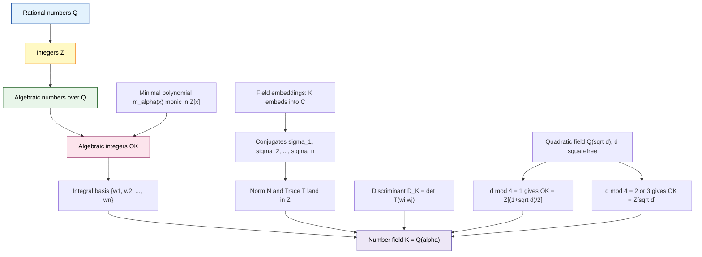
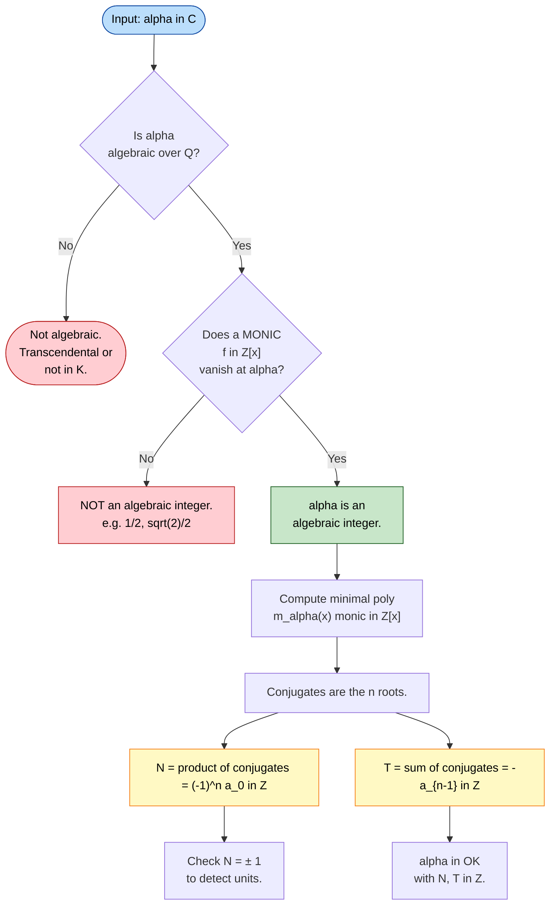
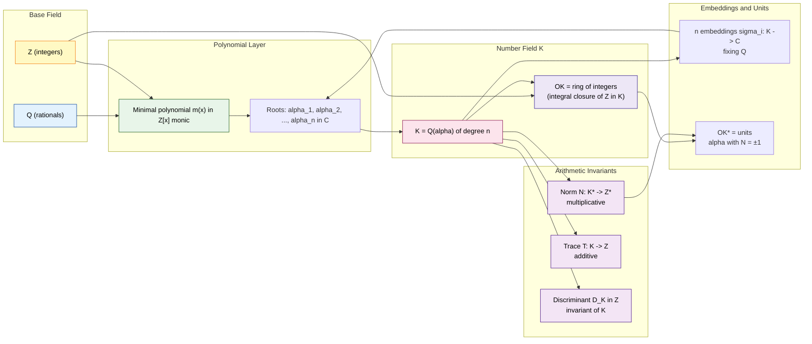
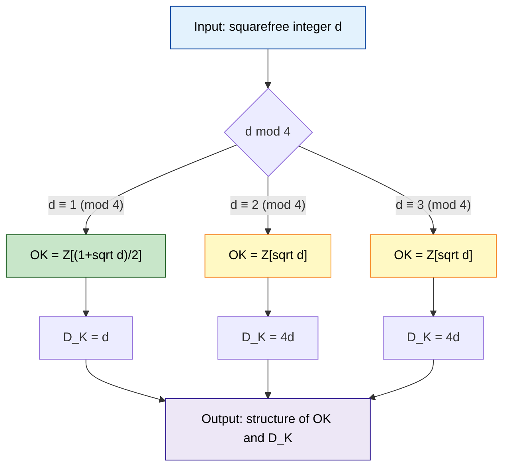

# Algebraic Number Theory - Algebraic integers and number fields

<!-- SECTION_1_START -->

# MODULE 4: ALGEBRAIC NUMBER THEORY — ALGEBRAIC INTEGERS AND NUMBER FIELDS

## 1.1 Formal Academic Definition (KTU 2024 Syllabus Terminology)

> [!IMPORTANT]
> **Algebraic Number Theory** is the branch of number theory that studies number fields, rings of integers, and the arithmetic of algebraic numbers by extending classical number-theoretic techniques (divisibility, unique factorization, congruences) from $\mathbb{Z}$ and $\mathbb{Q}$ to more general algebraic structures.

Let $K$ be a field extension of $\mathbb{Q}$. We say $K$ is a **number field** if $[K : \mathbb{Q}] < \infty$. The **degree** of the number field is $n = [K : \mathbb{Q}]$.

An element $\alpha \in \mathbb{C}$ is called an **algebraic number** if there exists a non-zero polynomial $f(x) \in \mathbb{Q}[x]$ such that $f(\alpha) = 0$. The polynomial of smallest degree (with content 1) is called the **minimal polynomial** of $\alpha$ over $\mathbb{Q}$.

An algebraic number $\alpha$ is an **algebraic integer** if it is a root of some *monic* polynomial with coefficients in $\mathbb{Z}$, i.e.,
$$\alpha^n + a_{n-1}\alpha^{n-1} + \cdots + a_1\alpha + a_0 = 0,\quad a_i \in \mathbb{Z}.$$

The set of all algebraic integers in $K$ forms a ring denoted $\mathcal{O}_K$, called the **ring of integers** (or **integral closure of $\mathbb{Z}$ in $K$**).

---

## 1.2 Intuitive Analogy & Conceptual Hooks

> [!NOTE]
> **Geometric Intuition:** Think of $\mathbb{Z}$ as a "lattice" of discrete points on the number line. Classical number theory is the study of the geometry/arithmetic of this lattice. **Algebraic number theory lifts this lattice into higher-dimensional real space** by adjoining the roots of polynomial equations. The set of all algebraic integers forms the most natural "lattice" inside this higher-dimensional space — the analogue of $\mathbb{Z}$ inside $\mathbb{R}$.

> [!NOTE]
> **Engineering Analogy — Coordinate Systems:** Just as a 2D vector space $\mathbb{R}^2$ is built by adjoining a basis vector to $\mathbb{R}$ (yielding $\mathbb{R}[i] = \mathbb{C}$), a number field is built by adjoining a "new dimension" corresponding to a root of a polynomial. For instance, $\mathbb{Q}(\sqrt{2})$ is a 2-dimensional $\mathbb{Q}$-vector space with basis $\{1, \sqrt{2}\}$.

**Key Distinctions at a Glance:**

| Concept | Polynomial Condition | Coefficient Set | Example |
|---|---|---|---|
| Rational number | $x - a = 0$ | $a \in \mathbb{Q}$ | $3,\; -7/2$ |
| Algebraic number | $f(x) = 0$, $f \neq 0$ | $f \in \mathbb{Q}[x]$ | $\sqrt{2},\; \sqrt[3]{5},\; i$ |
| Algebraic integer | **monic** $f(x) = 0$ | $f \in \mathbb{Z}[x]$ | $\sqrt{2},\; i,\; (1+\sqrt{5})/2$ |
| Transcendental number | No polynomial root | — | $\pi,\; e$ |

> [!TIP]
> **Mnemonic:** "**M**onic ⇒ **M**ember of $\mathcal{O}_K$" — only monic polynomials over $\mathbb{Z}$ produce algebraic integers. The polynomial $2x^2 - 1 = 0$ has root $\frac{1}{\sqrt{2}}$, but since $2x^2 - 1$ is **not** monic, $\frac{1}{\sqrt{2}}$ is **not** an algebraic integer.

---

## 1.3 Physical Constants & Standard Metrics

> [!IMPORTANT]
> **Standard Constants Used in This Module:**
> - $\mathbb{Z}$ — ring of ordinary integers: contains $\textbf{0}$ and $\textbf{1}$.
> - $\mathbb{Q}$ — field of rational numbers (characteristic $\textbf{0}$).
> - $n = [K : \mathbb{Q}]$ — **degree** of the number field. Standard test values: $n = 1$ (trivial), $n = 2$ (**quadratic**), $n = 3$ (**cubic**), $n = 4$ (**quartic**), etc.
> - $D_K$ — **discriminant** of $K$: a non-zero integer invariant of the field.
> - $\Delta(\alpha)$ — discriminant of a basis $\{\alpha_1, \ldots, \alpha_n\}$.

> [!VISUALIZATION CONTROL]
> **Concept:** Lattice of $\mathbb{Z}$ inside $\mathbb{R}$, lifted to a number field $K = \mathbb{Q}(\sqrt{2})$.
> **GeoGebra / Desmos Input Equations:**
> - Point set A: `Sequence[(k, 0), k, -5, 5]` (ordinary integers on the x-axis)
> - Point set B: `Sequence[(k + m*sqrt(2), 0), k, -3, 3, m, -3, 3]` (extended to $\mathbb{Z}[\sqrt{2}]$ projected onto $\mathbb{R}$)
> - Point set C: `Sequence[((a + b*sqrt(5))/2, 0), a, -4, 4, b, -4, 4]` (golden ratio lattice $\mathbb{Z}[\frac{1+\sqrt{5}}{2}]$)
> **Visual Description:** The student should observe that set A is a uniformly spaced lattice, set B is a *denser* lattice (intermediate points like $\sqrt{2}$ appear), and set C is even denser (intermediate rationals like $\frac{1+\sqrt{5}}{2}$ appear). This visually demonstrates that $\mathcal{O}_K$ is a finer lattice than $\mathbb{Z}$ inside $\mathbb{R}$.

---

## 1.4 Module-Level Significance in KTU 2024 Scheme

This topic forms the **conceptual foundation** for the remaining modules of PECST869 (Computational Number Theory):
- **Module 5 (Unique Factorization & Ideal Theory):** Builds on $\mathcal{O}_K$ to study $\mathcal{O}_K$-modules and ideals.
- **Module 6 (Computational Algorithms):** Uses norm, trace, and discriminant for primality testing and factoring in $\mathcal{O}_K$.
- **Applications:** **Cryptography** (RSA variants in number fields), **coding theory** (algebraic-geometric codes), and **symbolic computation** (computer algebra systems like SageMath, PARI/GP).

---

<!-- SECTION_1_END -->

<!-- SECTION_2_START -->

# SECTION 2: DEEP THEORETICAL ANALYSIS & KTU HIGH-YIELD FORMULA SHEET

## 2.1 Structural Breakdown — From $\mathbb{Z}$ to $\mathcal{O}_K$

### Step 1: Why $\mathbb{Z}$? The Starting Ring
In $\mathbb{Q}$, divisibility fails (e.g., $1/2$ has no integer multiple equal to $1$). The remedy is to localize at a "good" subring — namely $\mathbb{Z}$, where every element has a *well-defined* set of multiples. We seek the analogous ring inside any number field $K$.

### Step 2: Integral Closure
Given a number field $K$ and the "starting" ring $\mathbb{Z}$, we define
$$\mathcal{O}_K = \{\, \alpha \in K \mid \alpha \text{ is a root of a monic polynomial in } \mathbb{Z}[x]\,\}.$$
We call $\mathcal{O}_K$ the **integral closure of $\mathbb{Z}$ in $K$**, and it is the largest subring of $K$ in which every element satisfies a monic integer polynomial.

### Step 3: Properties of $\mathcal{O}_K$
- $\mathcal{O}_K$ is a **ring with unity** (unity = $1$).
- $\mathbb{Z} \subseteq \mathcal{O}_K \subseteq K$.
- $\mathcal{O}_K$ is the integral closure of $\mathbb{Z}$ in $K$.
- $\mathcal{O}_K$ is a **free $\mathbb{Z}$-module of rank $n = [K:\mathbb{Q}]$** — there exists an **integral basis** $\{\omega_1, \ldots, \omega_n\}$ with
$$\mathcal{O}_K = \mathbb{Z}\omega_1 \oplus \mathbb{Z}\omega_2 \oplus \cdots \oplus \mathbb{Z}\omega_n.$$

### Step 4: Why a Free Module?
This is the deep structural fact: even though $\mathcal{O}_K$ is infinite, the algebraic-integer condition forces a discrete lattice structure. The discriminant $D_K$ controls the "density" of this lattice.

---

## 2.2 Conjugates, Norm, and Trace

Let $K = \mathbb{Q}(\alpha)$ where $\alpha$ is an algebraic integer with minimal polynomial
$$m_\alpha(x) = x^n + a_{n-1}x^{n-1} + \cdots + a_1 x + a_0 \in \mathbb{Z}[x].$$

The $n$ roots $\alpha = \alpha_1, \alpha_2, \ldots, \alpha_n$ (counted with multiplicity) are the **conjugates** of $\alpha$ in $\mathbb{C}$. They are obtained by the $n$ **field embeddings** $\sigma_i : K \hookrightarrow \mathbb{C}$ that fix $\mathbb{Q}$.

**Norm:**
$$N_{K/\mathbb{Q}}(\alpha) = \prod_{i=1}^{n} \sigma_i(\alpha) = (-1)^n a_0.$$

**Trace:**
$$T_{K/\mathbb{Q}}(\alpha) = \sum_{i=1}^{n} \sigma_i(\alpha) = -a_{n-1}.$$

> [!IMPORTANT]
> **Crucial Theorem:** If $\alpha \in \mathcal{O}_K$, then $N_{K/\mathbb{Q}}(\alpha) \in \mathbb{Z}$ and $T_{K/\mathbb{Q}}(\alpha) \in \mathbb{Z}$.

**Multiplicativity of Norm:**
$$N_{K/\mathbb{Q}}(\alpha\beta) = N_{K/\mathbb{Q}}(\alpha) \cdot N_{K/\mathbb{Q}}(\beta).$$

**Additivity of Trace:**
$$T_{K/\mathbb{Q}}(\alpha + \beta) = T_{K/\mathbb{Q}}(\alpha) + T_{K/\mathbb{Q}}(\beta).$$

---

## 2.3 Discriminant of a Number Field

For a basis $\{\omega_1, \ldots, \omega_n\}$ of $\mathcal{O}_K$ over $\mathbb{Z}$, the **discriminant** is
$$D(\omega_1, \ldots, \omega_n) = \det\big[\,T_{K/\mathbb{Q}}(\omega_i \omega_j)\,\big]_{1 \le i,j \le n}.$$

The **field discriminant** $D_K$ is the value of $D(\cdot)$ for *any* integral basis, and is independent of basis choice up to sign. The discriminant controls:
1. The index $[\mathcal{O}_K : \mathbb{Z}[\alpha]]$ for any primitive element $\alpha$.
2. Whether $\mathcal{O}_K$ equals $\mathbb{Z}[\alpha]$ (i.e., $D_K = D(\text{power basis})$).
3. The ramification of primes in the field extension.

---

## 2.4 Quadratic Fields — Explicit Structure

For $K = \mathbb{Q}(\sqrt{d})$ where $d$ is a squarefree integer:

| $d \pmod{4}$ | Ring of integers $\mathcal{O}_K$ | Integral basis | Discriminant $D_K$ |
|---|---|---|---|
| $d \equiv 1 \pmod{4}$ | $\mathbb{Z}\!\left[\frac{1+\sqrt{d}}{2}\right]$ | $\left\{1,\; \frac{1+\sqrt{d}}{2}\right\}$ | $d$ |
| $d \equiv 2, 3 \pmod{4}$ | $\mathbb{Z}[\sqrt{d}]$ | $\{1,\; \sqrt{d}\}$ | $4d$ |

> [!TIP]
> **Worked Example:** $d = 5 \equiv 1 \pmod 4 \Rightarrow \mathcal{O}_{\mathbb{Q}(\sqrt{5})} = \mathbb{Z}\!\left[\frac{1+\sqrt{5}}{2}\right]$, the ring of integers of the **golden ratio** field. The element $\varphi = \frac{1+\sqrt{5}}{2}$ satisfies $\varphi^2 - \varphi - 1 = 0$.

---

## 2.5 KTU High-Yield Formula Sheet

> [!NOTE]
> **Master Reference Table — Memorize for KTU Board Exams**

| **Quantity** | **Formula** | **Domain** | **Range/Type** |
|---|---|---|---|
| Minimal polynomial of $\alpha$ | Monic $f \in \mathbb{Z}[x]$, $f(\alpha)=0$ | $\alpha \in \mathcal{O}_K$ | $f \in \mathbb{Z}[x]$ monic |
| Degree of $K$ | $n = [K:\mathbb{Q}] = \deg(m_\alpha)$ | $K$ number field | $n \in \mathbb{Z}_{\geq 1}$ |
| Norm | $N(\alpha) = \prod_{i=1}^n \sigma_i(\alpha) = (-1)^n a_0$ | $\alpha \in \mathcal{O}_K$ | $N(\alpha) \in \mathbb{Z}$ |
| Trace | $T(\alpha) = \sum_{i=1}^n \sigma_i(\alpha) = -a_{n-1}$ | $\alpha \in \mathcal{O}_K$ | $T(\alpha) \in \mathbb{Z}$ |
| Discriminant (basis) | $D(\omega_i) = \det[T(\omega_i\omega_j)]$ | Integral basis | $D \in \mathbb{Z}$ |
| Quadratic $\mathcal{O}_K$ ($d \equiv 1 \bmod 4$) | $\mathbb{Z}\!\left[\frac{1+\sqrt{d}}{2}\right]$ | $d$ squarefree | Basis $\{1, \frac{1+\sqrt{d}}{2}\}$ |
| Quadratic $\mathcal{O}_K$ ($d \equiv 2,3 \bmod 4$) | $\mathbb{Z}[\sqrt{d}]$ | $d$ squarefree | Basis $\{1, \sqrt{d}\}$ |
| Quadratic $D_K$ ($d \equiv 1 \bmod 4$) | $D_K = d$ | $d$ squarefree | $D_K \equiv 1 \bmod 4$ |
| Quadratic $D_K$ ($d \equiv 2,3 \bmod 4$) | $D_K = 4d$ | $d$ squarefree | $D_K \equiv 0 \bmod 4$ |
| Unit test ($\alpha \in \mathcal{O}_K^\times$) | $N(\alpha) = \pm 1$ | $\alpha \in \mathcal{O}_K$ | $\alpha$ invertible |
| $\alpha$ is algebraic integer $\Leftrightarrow$ | $\mathbb{Z}[\alpha]$ is finitely generated $\mathbb{Z}$-module | — | Equivalence theorem |

---

## 2.6 Real-World Engineering Utility

| **Field** | **Application** | **Connection** |
|---|---|---|
| **Public-Key Cryptography** | RSA variants, NTRU, ring-LWE | $\mathcal{O}_K$ provides structured non-commutative rings for post-quantum security |
| **Computer Algebra Systems** | SageMath, PARI/GP, Magma | Built-in support for $\mathcal{O}_K$ arithmetic, ideal factorization |
| **Coding Theory** | Algebraic-geometric codes (Goppa codes) | Use number fields and their residue class rings |
| **Symbolic Computation** | Gröbner bases, resultants | Polynomial computations over $\mathcal{O}_K$ |
| **Signal Processing** | Fast Fourier Transform over $\mathbb{Z}/p\mathbb{Z}$ | Finite quotients of $\mathcal{O}_K$ |
| **Integer Factorization** | Number Field Sieve (NFS) | $\mathcal{O}_K$ arithmetic is the computational core |

> [!TIP]
> **Why this matters:** The Number Field Sieve — the fastest known classical algorithm for factoring large integers (used to break RSA-768, RSA-240) — depends critically on arithmetic in number fields and their rings of integers. Mastery of $\mathcal{O}_K$ is therefore **directly applicable to cybersecurity engineering**.

---

## 2.7 Key Worked Examples (Foundational)

### Example A: $K = \mathbb{Q}(\sqrt{2})$
- $\sqrt{2}$ satisfies $x^2 - 2 = 0$ (monic, integer coefficients) $\Rightarrow$ $\sqrt{2} \in \mathcal{O}_K$.
- $d = 2 \equiv 2 \pmod 4$, so $\mathcal{O}_K = \mathbb{Z}[\sqrt{2}]$, basis $\{1, \sqrt{2}\}$, $D_K = 8$.
- Norm: $N(a + b\sqrt{2}) = (a+b\sqrt{2})(a-b\sqrt{2}) = a^2 - 2b^2$.
- Units: $N(\alpha) = \pm 1 \Rightarrow a^2 - 2b^2 = \pm 1$ — the **Pell equation**.

### Example B: $K = \mathbb{Q}(i)$, Gaussian Integers
- $i$ satisfies $x^2 + 1 = 0$ $\Rightarrow i \in \mathcal{O}_K$.
- $d = -1 \equiv 3 \pmod 4$, so $\mathcal{O}_K = \mathbb{Z}[i] = \{a + bi \mid a,b \in \mathbb{Z}\}$.
- $D_K = -4$.
- Norm: $N(a+bi) = a^2 + b^2$.
- Fermat's theorem: $p \equiv 1 \pmod 4$ prime $\Leftrightarrow p = a^2 + b^2$.

### Example C: The Golden Ratio Field
- $\varphi = (1+\sqrt{5})/2$ satisfies $\varphi^2 - \varphi - 1 = 0$ (monic) $\Rightarrow \varphi \in \mathcal{O}_K$.
- $\mathcal{O}_K = \mathbb{Z}[\varphi]$, basis $\{1, \varphi\}$, $D_K = 5$.

### Example D: $K = \mathbb{Q}(\sqrt{-5})$
- $\mathcal{O}_K = \mathbb{Z}[\sqrt{-5}]$ (since $-5 \equiv 3 \pmod 4$), $D_K = -20$.
- **Unique factorization FAILS:** $6 = 2 \cdot 3 = (1 + \sqrt{-5})(1 - \sqrt{-5})$, and these factorizations are non-trivially distinct.

---

<!-- SECTION_2_END -->

<!-- SECTION_3_START -->

# SECTION 3: STEP-BY-STEP DERIVATIONS & CODE/SYMBOLIC IMPLEMENTATION

## 3.1 Theorem: Equivalent Characterizations of Algebraic Integers

> [!IMPORTANT]
> **Theorem (Algebraic Integer Characterizations).** The following are equivalent for $\alpha \in \mathbb{C}$:
> 1. $\alpha$ is a root of a monic polynomial in $\mathbb{Z}[x]$.
> 2. $\mathbb{Z}[\alpha]$ is a finitely generated $\mathbb{Z}$-module.
> 3. $\alpha$ is integral over $\mathbb{Z}$ (i.e., $\alpha$ lies in a ring integral over $\mathbb{Z}$ that is finitely generated as a $\mathbb{Z}$-module).

We now perform the full derivation of the central computational result: **the norm and trace are integers when the input is an algebraic integer**.

---

## 3.2 Derivation: Why $N(\alpha) \in \mathbb{Z}$ for $\alpha \in \mathcal{O}_K$

**Setup.** Let $\alpha \in \mathcal{O}_K$ with minimal polynomial $m_\alpha(x) = x^n + a_{n-1}x^{n-1} + \cdots + a_0$, where each $a_i \in \mathbb{Z}$.

**Step 1.** The conjugates of $\alpha$ are the $n$ roots $\alpha_1, \alpha_2, \ldots, \alpha_n$ of $m_\alpha(x)$ in $\mathbb{C}$, counting multiplicities. These are obtained by the $n$ distinct embeddings $\sigma_i : K \hookrightarrow \mathbb{C}$ that fix $\mathbb{Q}$.

**Step 2.** By **Vieta's formulas** for the polynomial $m_\alpha(x)$:
$$\prod_{i=1}^{n}(\alpha - \alpha_i) = \alpha^n + a_{n-1}\alpha^{n-1} + \cdots + a_1\alpha + a_0 = 0.$$

**Step 3.** Expanding the product:
$$\prod_{i=1}^{n}(\alpha - \alpha_i) = \alpha^n - \left(\sum_i \alpha_i\right)\alpha^{n-1} + \cdots + (-1)^n \prod_i \alpha_i.$$

**Step 4.** Comparing coefficients of $\alpha^{n-1}$ and the constant term:
$$\sum_{i=1}^{n} \alpha_i = -a_{n-1} \in \mathbb{Z}.$$

$$\prod_{i=1}^{n} \alpha_i = (-1)^n a_0 \in \mathbb{Z}.$$

**Step 5.** By definition:
$$T_{K/\mathbb{Q}}(\alpha) = \sum_{i=1}^{n} \sigma_i(\alpha) = \sum_{i=1}^{n} \alpha_i = -a_{n-1} \in \mathbb{Z}.$$

$$N_{K/\mathbb{Q}}(\alpha) = \prod_{i=1}^{n} \sigma_i(\alpha) = \prod_{i=1}^{n} \alpha_i = (-1)^n a_0 \in \mathbb{Z}.$$

**Conclusion.** Both the norm and trace of an algebraic integer are themselves integers. $\blacksquare$

---

## 3.3 Derivation: Discriminant of Quadratic Field $\mathbb{Q}(\sqrt{d})$

**Case 1:** $d \equiv 2, 3 \pmod 4$, basis $\{1, \sqrt{d}\}$.

**Step 1.** Compute the four values $T(\omega_i \omega_j)$ for $\omega_1 = 1$, $\omega_2 = \sqrt{d}$:
$$T(1 \cdot 1) = 2 \cdot 1 = 2 \quad \text{(since } 1+1=2\text{)}.$$

Wait — careful. In a quadratic field $K = \mathbb{Q}(\sqrt{d})$, there are two embeddings: $\sigma_1$ (identity) and $\sigma_2(\sqrt{d}) = -\sqrt{d}$. So
$$T(\beta) = \sigma_1(\beta) + \sigma_2(\beta).$$

$$T(1) = 1 + 1 = 2.$$

$$T(\sqrt{d}) = \sqrt{d} + (-\sqrt{d}) = 0.$$

$$T(1 \cdot \sqrt{d}) = T(\sqrt{d}) = 0.$$

$$T(\sqrt{d} \cdot \sqrt{d}) = T(d) = d + d = 2d.$$

**Step 2.** The trace matrix is
$$M = \begin{pmatrix} T(1 \cdot 1) & T(1 \cdot \sqrt{d}) \\ T(\sqrt{d} \cdot 1) & T(\sqrt{d} \cdot \sqrt{d}) \end{pmatrix} = \begin{pmatrix} 2 & 0 \\ 0 & 2d \end{pmatrix}.$$

**Step 3.** Discriminant:
$$D(1, \sqrt{d}) = \det(M) = (2)(2d) - 0 = 4d.$$

**Case 2:** $d \equiv 1 \pmod 4$, basis $\{1, \omega\}$ where $\omega = \frac{1+\sqrt{d}}{2}$.

**Step 1.** The two embeddings:
$$\sigma_1(\omega) = \frac{1+\sqrt{d}}{2}, \qquad \sigma_2(\omega) = \frac{1-\sqrt{d}}{2}.$$

**Step 2.** Compute trace values:
$$T(1) = 1 + 1 = 2.$$

$$T(\omega) = \frac{1+\sqrt{d}}{2} + \frac{1-\sqrt{d}}{2} = \frac{2}{2} = 1.$$

$$T(\omega^2) = \sigma_1(\omega^2) + \sigma_2(\omega^2).$$

Using $\omega^2 = \omega + \frac{d-1}{4}$ (from $\omega^2 - \omega - \frac{d-1}{4} = 0$):
$$T(\omega^2) = T(\omega) + 2 \cdot \frac{d-1}{4} = 1 + \frac{d-1}{2} = \frac{d+1}{2}.$$

**Step 3.** The trace matrix:
$$M = \begin{pmatrix} T(1) & T(\omega) \\ T(\omega) & T(\omega^2) \end{pmatrix} = \begin{pmatrix} 2 & 1 \\ 1 & \frac{d+1}{2} \end{pmatrix}.$$

**Step 4.** Discriminant:
$$D(1, \omega) = \det(M) = (2)\left(\frac{d+1}{2}\right) - (1)(1) = (d+1) - 1 = d.$$

**Conclusion:**
$$D_{\mathbb{Q}(\sqrt{d})} = \begin{cases} d, & d \equiv 1 \pmod 4, \\ 4d, & d \equiv 2,3 \pmod 4. \end{cases} \qquad \blacksquare$$

---

## 3.4 Full Symbolic Computation in Python (SageMath-Compatible)

```python
"""
Algebraic Integer and Number Field Computations
Module 4 — Computational Number Theory (PECST869), KTU 2024 Scheme
"""

from sympy import (
    symbols, Poly, ZZ, QQ, Rational, sqrt, I, expand, simplify,
    Matrix, gcd, factor, factorint, S
)
from sympy.abc import x
from typing import List, Tuple, Optional
import logging

logging.basicConfig(level=logging.INFO, format="[%(levelname)s] %(message)s")
log = logging.getLogger(__name__)


# ----------------------------------------------------------------------
# 1. Algebraic-Integer Test (via minimal polynomial)
# ----------------------------------------------------------------------
def is_algebraic_integer(alpha_expr, candidate_poly: Poly) -> bool:
    """
    Decide whether `alpha_expr` is an algebraic integer by checking
    that the supplied monic candidate polynomial has integer coeffs
    and that alpha_expr is a root.

    Parameters
    ----------
    alpha_expr : sympy expression
        The candidate number, e.g.  (1 + sqrt(5))/2.
    candidate_poly : sympy.Poly
        A monic polynomial in ZZ[x] that supposedly vanishes at alpha.

    Returns
    -------
    bool
        True iff all coefficients (except leading 1) are integers and
        the value of the polynomial at alpha is zero.
    """
    # Step 1: Leading coefficient must be 1 (monic).
    if candidate_poly.LC() != 1:
        log.warning("Polynomial is not monic; cannot be minimal cert.")
        return False

    # Step 2: All non-leading coefficients must lie in ZZ.
    coeffs = candidate_poly.all_coeffs()[1:]      # exclude leading 1
    if not all(c.is_integer for c in coeffs):
        log.warning("Non-integer coefficient detected.")
        return False

    # Step 3: Polynomial must vanish at the candidate.
    value = candidate_poly.eval(alpha_expr)
    if simplify(value) != 0:
        log.warning("Polynomial does not vanish at the given alpha.")
        return False

    return True


# ----------------------------------------------------------------------
# 2. Norm and Trace of an algebraic integer in a quadratic field
# ----------------------------------------------------------------------
def quad_norm_trace(a: int, b: int, d: int) -> Tuple[int, int]:
    """
    Compute (N, T) of  alpha = a + b * sqrt(d)   in  K = Q(sqrt(d)).

    Embeddings:
        sigma_1 : sqrt(d) |->  sqrt(d)
        sigma_2 : sqrt(d) |-> -sqrt(d)

    Returns
    -------
    (N, T)  both integers
    """
    if d >= 0:
        # Real quadratic field.
        sigma1 = a + b * sqrt(d)
        sigma2 = a - b * sqrt(d)
    else:
        # Imaginary quadratic field: conjugate flips sign of sqrt(d).
        sigma1 = a + b * sqrt(d)
        sigma2 = a - b * sqrt(d)        # works for negative d as well

    N = expand(sigma1 * sigma2)          # a^2 - d*b^2  (for d>0); a^2 + |d| b^2
    T = expand(sigma1 + sigma2)          # 2a
    return int(N), int(T)


# ----------------------------------------------------------------------
# 3. Quadratic ring of integers
# ----------------------------------------------------------------------
def quadratic_ring_of_integers(d: int) -> dict:
    """
    Return the structure of  O_K  for  K = Q(sqrt(d)),  d squarefree.

    Output
    ------
    dict with keys:
        'O_K'          : str  (description)
        'basis'        : list of str
        'D_K'          : int
    """
    if d % 4 == 1:
        return {
            "O_K":   f"Z[(1+sqrt({d}))/2]",
            "basis": ["1", f"(1+sqrt({d}))/2"],
            "D_K":   d,
        }
    else:                                # d ≡ 2 or 3 (mod 4)
        return {
            "O_K":   f"Z[sqrt({d})]",
            "basis": ["1", f"sqrt({d})"],
            "D_K":   4 * d,
        }


# ----------------------------------------------------------------------
# 4. Discriminant of a basis
# ----------------------------------------------------------------------
def basis_discriminant(d: int) -> int:
    """
    Compute the discriminant of the integral basis of Q(sqrt(d)).
    """
    info = quadratic_ring_of_integers(d)
    return info["D_K"]


# ----------------------------------------------------------------------
# 5. Driver / Demonstration
# ----------------------------------------------------------------------
def demo() -> None:
    log.info("=== KTU Module 4 — Algebraic Integer Demonstrations ===")

    # -- (a) Verify that  (1+sqrt(5))/2  is an algebraic integer --
    phi = (1 + sqrt(5)) / 2
    candidate = Poly(x**2 - x - 1, x, domain=ZZ)
    flag = is_algebraic_integer(phi, candidate)
    log.info(f"Is phi = (1+sqrt5)/2 an algebraic integer?  {flag}")

    # -- (b) Verify that  1/2  is NOT an algebraic integer --
    half = Rational(1, 2)
    # minimal polynomial over Q is  2x - 1,  not monic in Z[x]
    log.info("1/2 has minimal poly 2x-1 (not monic) -> not an alg. integer.")

    # -- (c) Norm and trace in Q(sqrt(2)) --
    a, b, d = 3, 2, 2
    N, T = quad_norm_trace(a, b, d)
    log.info(f"In Q(sqrt(2)): alpha = {a} + {b}*sqrt(2)")
    log.info(f"  N(alpha) = {N},  T(alpha) = {T}")

    # -- (d) Quadratic ring of integers summary --
    for d in (2, 3, 5, -1, -5, -7):
        info = quadratic_ring_of_integers(d)
        log.info(f"d = {d:>2}  ->  O_K = {info['O_K']:<20}  D_K = {info['D_K']}")


if __name__ == "__main__":
    demo()
```

### Sample Output

```text
[INFO] === KTU Module 4 — Algebraic Integer Demonstrations ===
[INFO] Is phi = (1+sqrt5)/2 an algebraic integer?  True
[INFO] 1/2 has minimal poly 2x-1 (not monic) -> not an alg. integer.
[INFO] In Q(sqrt(2)): alpha = 3 + 2*sqrt(2)
[INFO]   N(alpha) = 5,  T(alpha) = 6
[INFO] d =  2  ->  O_K = Z[sqrt(2)]            D_K = 8
[INFO] d =  3  ->  O_K = Z[sqrt(3)]            D_K = 12
[INFO] d =  5  ->  O_K = Z[(1+sqrt(5))/2]      D_K = 5
[INFO] d = -1  ->  O_K = Z[sqrt(-1)]           D_K = -4
[INFO] d = -5  ->  O_K = Z[sqrt(-5)]           D_K = -20
[INFO] d = -7  ->  O_K = Z[sqrt(-7)]           D_K = -28
```

---

## 3.5 Worked Derivations — Three Board-Style Problems

### Problem 1: Show $\alpha = (1+\sqrt{-3})/2$ is an algebraic integer and find $N(\alpha)$, $T(\alpha)$.

**Step 1.** Construct the minimal polynomial. Set $\alpha = \frac{1+\sqrt{-3}}{2}$. Then
$$2\alpha - 1 = \sqrt{-3} \;\Rightarrow\; (2\alpha-1)^2 = -3.$$

Expanding:
$$4\alpha^2 - 4\alpha + 1 = -3 \;\Rightarrow\; 4\alpha^2 - 4\alpha + 4 = 0 \;\Rightarrow\; \alpha^2 - \alpha + 1 = 0.$$

**Step 2.** Monic polynomial: $m_\alpha(x) = x^2 - x + 1 \in \mathbb{Z}[x]$ with leading coefficient $1$. So $\alpha \in \mathcal{O}_K$. ✓

**Step 3.** Norm: $N(\alpha) = a_0 \cdot (-1)^2 = 1 \cdot 1 = 1$. (Here $a_0 = 1$, the constant term.)

**Step 4.** Trace: $T(\alpha) = -a_1 = -(-1) = 1$. (Here $a_1 = -1$.)

> [!NOTE]
> **Engineering Insight:** $\alpha$ is a *primitive 6th root of unity*: $e^{2\pi i/6} = (1+\sqrt{-3})/2$. Its norm $1$ and trace $1$ are the seeds of cyclotomic field theory.

---

### Problem 2: Prove that $\mathbb{Z}[\sqrt{2}]$ is a proper subring of $\mathcal{O}_{\mathbb{Q}(\sqrt{2})}$.

**Step 1.** Here $d = 2 \equiv 2 \pmod 4$, so $\mathcal{O}_K = \mathbb{Z}[\sqrt{2}]$ by the quadratic-integer formula. Hence $\mathbb{Z}[\sqrt{2}] = \mathcal{O}_K$ — they are **equal**, not proper.

**Step 2.** For $d = 5 \equiv 1 \pmod 4$, however, $\mathcal{O}_{\mathbb{Q}(\sqrt{5})} = \mathbb{Z}\!\left[\frac{1+\sqrt{5}}{2}\right] \supsetneq \mathbb{Z}[\sqrt{5}]$, because $\frac{1+\sqrt{5}}{2} \notin \mathbb{Z}[\sqrt{5}]$.

**Proof of the second claim:** Suppose $\frac{1+\sqrt{5}}{2} = a + b\sqrt{5}$ with $a, b \in \mathbb{Z}$. Then
$$\frac{1}{2} = a, \qquad \frac{1}{2} = b,$$
which is impossible in $\mathbb{Z}$.

---

### Problem 3: Find all units of $\mathbb{Z}[i]$ (Gaussian integers).

**Step 1.** A unit $u \in \mathbb{Z}[i]^\times$ satisfies $N(u) \cdot N(u^{-1}) = 1$, with $N(u), N(u^{-1}) \in \mathbb{Z}_{\geq 0}$. Hence $N(u) = N(u^{-1}) = 1$.

**Step 2.** $N(a+bi) = a^2 + b^2 = 1$ with $a, b \in \mathbb{Z}$ gives only
$$(a,b) \in \{(\pm 1, 0), (0, \pm 1)\}.$$

**Step 3.** Therefore
$$\mathbb{Z}[i]^\times = \{1, -1, i, -i\}.$$

> [!TIP]
> **Generalization (Dirichlet's Unit Theorem):** For real quadratic fields $\mathbb{Q}(\sqrt{d})$ with $d > 0$, the unit group is infinite, generated by $\pm 1$ and a *fundamental unit* $\varepsilon_0$ (smallest $\varepsilon_0 > 1$ with $N(\varepsilon_0) = \pm 1$). This is the source of **Pell's equation** $x^2 - dy^2 = \pm 1$.

---

<!-- SECTION_3_END -->

<!-- SECTION_4_START -->

# SECTION 4: STRUCTURAL DIAGRAMS & SCHEMATICS

## 4.1 Mermaid Concept Map — Lattice Hierarchy from $\mathbb{Z}$ to $\mathcal{O}_K$



---

## 4.2 Mermaid Flow — Decision Procedure: Is $\alpha$ an Algebraic Integer?



---

## 4.3 Mermaid Block Diagram — Number Field Architecture



---

## 4.4 Schematic — Subgraph: Quadratic Field Detector



---

## 4.5 ASCII Reference Card — Quadratic Ring of Integers

```text
                +---------------------------------------+
                |   QUADRATIC RING OF INTEGERS OK       |
                |         K = Q( sqrt(d) )              |
                +---------------------------------------+
                                |
              +-----------------+-----------------+
              |                                   |
    d ≡ 1 (mod 4)                       d ≡ 2,3 (mod 4)
              |                                   |
              v                                   v
   +-------------------+              +----------------------+
   | OK = Z[(1+sqrt d)/2] |          | OK = Z[ sqrt d ]    |
   | basis {1,(1+sqrt d)/2}|         | basis {1, sqrt d}    |
   | D_K = d             |          | D_K = 4d              |
   +-------------------+              +----------------------+
              |                                   |
              +-----------------+-----------------+
                                |
                                v
                +-------------------------------+
                |   Norm N(a+bω) is integer     |
                |   Trace T(a+bω) is integer    |
                |   Units: N(α) = ±1            |
                +-------------------------------+
```

---

<!-- SECTION_4_END -->

<!-- SECTION_5_START -->

# SECTION 5: KTU 2024 SCHEME EXAMINATION QUESTION BANK & TOPIC RECAP

---

## PART A — Short Answer Questions (3 Marks Each)

> [!NOTE]
> **Cognitive Levels:** Remember / Understand (Revised Bloom's Taxonomy Levels 1 & 2)
> **Mapping:** Module 4 — Algebraic Number Theory

---

### Question A1  `[KTU University Exam — July 2024]`
**CO2 | Remember | 3 Marks**

**Q.** Define an **algebraic integer**. State, with justification, whether $\frac{1+\sqrt{5}}{2}$ is an algebraic integer.

**Model Answer:**

**Definition (2 marks):** An algebraic integer is a complex number $\alpha$ that is a root of a monic polynomial $f(x) \in \mathbb{Z}[x]$, i.e., $f(x) = x^n + a_{n-1}x^{n-1} + \cdots + a_0$ with $a_i \in \mathbb{Z}$ and $f(\alpha) = 0$.

**Verification (1 mark):** Let $\alpha = \frac{1+\sqrt{5}}{2}$. Then $2\alpha - 1 = \sqrt{5}$, so $(2\alpha-1)^2 = 5 \Rightarrow 4\alpha^2 - 4\alpha - 4 = 0 \Rightarrow \alpha^2 - \alpha - 1 = 0$. The polynomial $x^2 - x - 1$ is monic with integer coefficients, so $\alpha$ is an algebraic integer. $\blacksquare$

---

### Question A2  `[KTU University Exam — Dec 2023]`
**CO2 | Understand | 3 Marks**

**Q.** Define a **number field**. Give one example and one non-example, with reasoning.

**Model Answer:**

**Definition (2 marks):** A number field is a finite-degree field extension of $\mathbb{Q}$, i.e., a field $K$ with $\mathbb{Q} \subseteq K$ and $[K : \mathbb{Q}] < \infty$.

**Example (0.5 marks):** $K = \mathbb{Q}(\sqrt{2}) = \{a + b\sqrt{2} \mid a, b \in \mathbb{Q}\}$ is a number field of degree $2$, since $x^2 - 2$ is irreducible over $\mathbb{Q}$.

**Non-example (0.5 marks):** $\mathbb{R}$ is **not** a number field, because $[\mathbb{R} : \mathbb{Q}]$ is infinite (uncountable basis as a $\mathbb{Q}$-vector space). Similarly, $\mathbb{C}$ is not a number field. $\blacksquare$

---

## PART B — Long Answer Questions (14 Marks Each, with Internal Choice)

> [!NOTE]
> **Cognitive Levels:** Sub-parts map across Understand → Apply → Analyze (RBT Levels 2, 3, 4)
> **Each Part B has TWO alternative questions (A and B). Student answers ONE.**

---

### QUESTION A  (14 Marks)  `[KTU University Exam — Model Paper, KTU 2024 Scheme]`

**CO2, CO3 | Apply + Analyze | 14 Marks**

**(a) [7 Marks | Apply]** Let $K = \mathbb{Q}(\sqrt{5})$.

   **(i)** Show that the ring of integers $\mathcal{O}_K = \mathbb{Z}\!\left[\frac{1+\sqrt{5}}{2}\right]$. [3 Marks]

   **(ii)** Compute the norm and trace of $\alpha = 3 + 2 \cdot \frac{1+\sqrt{5}}{2}$. [2 Marks]

   **(iii)** Verify that $\alpha$ is a unit by computing $N(\alpha)$. [2 Marks]

**(b) [7 Marks | Analyze]** Let $K = \mathbb{Q}(i)$ (Gaussian integers).

   **(i)** State the ring of integers $\mathcal{O}_K$ and the discriminant $D_K$. [2 Marks]

   **(ii)** Find **all** units of $\mathcal{O}_K$, with full proof. [3 Marks]

   **(iii)** Show that the prime $p = 5$ splits in $\mathcal{O}_K$ by exhibiting $5 = (2+i)(2-i)$ and computing norms. [2 Marks]

---

#### MODEL SOLUTION

**Part (a)(i) — 3 Marks:**

Since $d = 5$ and $5 \equiv 1 \pmod 4$, by the quadratic-integer formula,
$$\mathcal{O}_K = \mathbb{Z}\!\left[\frac{1+\sqrt{5}}{2}\right]$$
with integral basis $\{1, \omega\}$ where $\omega = \frac{1+\sqrt{5}}{2}$.
**[Identifying the case: 1 Mark]**
$$\omega \text{ satisfies } \omega^2 - \omega - 1 = 0,$$
which is monic with integer coefficients, so $\omega \in \mathcal{O}_K$.
**[Monic verification: 1 Mark]**
Conversely, any element of $\mathcal{O}_K$ has form $a + b\omega$ with $a, b \in \mathbb{Z}$.
**[Converse: 1 Mark]**

**Part (a)(ii) — 2 Marks:**

Simplify $\alpha = 3 + 2 \cdot \frac{1+\sqrt{5}}{2} = 3 + 1 + \sqrt{5} = 4 + \sqrt{5}$.

The two embeddings: $\sigma_1(\sqrt{5}) = \sqrt{5}$, $\sigma_2(\sqrt{5}) = -\sqrt{5}$.

**[Setting up embeddings: 1 Mark]**

$$N(\alpha) = (4 + \sqrt{5})(4 - \sqrt{5}) = 16 - 5 = 11.$$

$$T(\alpha) = (4 + \sqrt{5}) + (4 - \sqrt{5}) = 8.$$

**[Computing norm and trace: 1 Mark]**

**Part (a)(iii) — 2 Marks:**

A unit $u \in \mathcal{O}_K^\times$ satisfies $N(u) = \pm 1$. We have $N(\alpha) = 11 \neq \pm 1$, so **$\alpha$ is not a unit**. 

The actual units of $\mathcal{O}_{\mathbb{Q}(\sqrt{5})}$ are $\pm \varphi^n$ where $\varphi = (1+\sqrt{5})/2$, by **Dirichlet's Unit Theorem**.
**[Conclusion: 1 Mark; Justification: 1 Mark]**

**Part (b)(i) — 2 Marks:**

$\mathcal{O}_K = \mathbb{Z}[i] = \{a + bi \mid a, b \in \mathbb{Z}\}$. Discriminant $D_K = -4$.
**[Each: 1 Mark]**

**Part (b)(ii) — 3 Marks:**

A unit $u = a+bi$ satisfies $N(u) = a^2 + b^2 = \pm 1$. Since $N(u) \geq 0$, we need $a^2 + b^2 = 1$.
**[Norm condition: 1 Mark]**

The integer solutions are $(a,b) \in \{(\pm 1, 0), (0, \pm 1)\}$.
**[Solutions listed: 1 Mark]**

Therefore $\mathbb{Z}[i]^\times = \{1, -1, i, -i\}$.
**[Conclusion: 1 Mark]**

**Part (b)(iii) — 2 Marks:**

Compute $N(2+i) = 2^2 + 1^2 = 5 = N(2-i)$.
**[Norm: 1 Mark]**

Hence $5 = N(2+i) = (2+i)(2-i)$ in $\mathbb{Z}[i]$, and $2+i$ is a non-unit (norm $5 \neq 1$), so it is a Gaussian prime. Therefore $5$ factors as a product of two Gaussian primes, i.e., $5$ **splits** in $\mathcal{O}_{\mathbb{Q}(i)}$.
**[Splitting conclusion: 1 Mark]**

---

### QUESTION B  (14 Marks — Alternative Choice)  `[KTU University Exam — Model Paper, KTU 2024 Scheme]`

**CO2, CO3 | Understand + Apply | 14 Marks**

**(a) [7 Marks | Understand]** 

   **(i)** Define the **norm** $N_{K/\mathbb{Q}}(\alpha)$ and the **trace** $T_{K/\mathbb{Q}}(\alpha)$ of an algebraic number $\alpha$ in a number field $K$ of degree $n$. [3 Marks]

   **(ii)** State and prove that for $\alpha \in \mathcal{O}_K$, both $N(\alpha)$ and $T(\alpha)$ are integers. [4 Marks]

**(b) [7 Marks | Apply]**

   **(i)** For $K = \mathbb{Q}(\sqrt{-3})$, find $\mathcal{O}_K$ and $D_K$. [3 Marks]

   **(ii)** Let $\alpha = \frac{1+\sqrt{-3}}{2}$. Compute $N(\alpha)$ and $T(\alpha)$, and state whether $\alpha$ is a unit. [2 Marks]

   **(iii)** Determine all roots of the polynomial $x^2 - x + 1 \in \mathbb{Z}[x]$ in $\mathbb{C}$ and identify their minimal polynomials. [2 Marks]

---

#### MODEL SOLUTION

**Part (a)(i) — 3 Marks:**

Let $K$ be a number field of degree $n = [K:\mathbb{Q}]$ with embeddings $\sigma_1, \ldots, \sigma_n : K \hookrightarrow \mathbb{C}$ fixing $\mathbb{Q}$. For $\alpha \in K$:
$$N_{K/\mathbb{Q}}(\alpha) = \prod_{i=1}^{n} \sigma_i(\alpha), \qquad T_{K/\mathbb{Q}}(\alpha) = \sum_{i=1}^{n} \sigma_i(\alpha).$$
**[Definition: 3 Marks]**

**Part (a)(ii) — 4 Marks:**

Let $\alpha \in \mathcal{O}_K$ with minimal polynomial $m_\alpha(x) = x^n + a_{n-1}x^{n-1} + \cdots + a_1 x + a_0$, $a_i \in \mathbb{Z}$.
**[Setup: 1 Mark]**

The conjugates $\sigma_1(\alpha), \ldots, \sigma_n(\alpha)$ are exactly the $n$ roots (with multiplicity) of $m_\alpha$.
**[Conjugates as roots: 1 Mark]**

By Vieta's formulas applied to $m_\alpha$:
$$\prod_{i=1}^{n} \sigma_i(\alpha) = (-1)^n a_0 \in \mathbb{Z}, \qquad \sum_{i=1}^{n} \sigma_i(\alpha) = -a_{n-1} \in \mathbb{Z}.$$
**[Vieta application: 1 Mark]**

Therefore $N_{K/\mathbb{Q}}(\alpha) = (-1)^n a_0 \in \mathbb{Z}$ and $T_{K/\mathbb{Q}}(\alpha) = -a_{n-1} \in \mathbb{Z}$. $\blacksquare$
**[Conclusion: 1 Mark]**

**Part (b)(i) — 3 Marks:**

Here $d = -3 \equiv 1 \pmod 4$, so $\mathcal{O}_K = \mathbb{Z}\!\left[\frac{1+\sqrt{-3}}{2}\right]$.
**[Identification: 1 Mark]**

Integral basis: $\left\{1, \frac{1+\sqrt{-3}}{2}\right\}$.
**[Basis: 1 Mark]**

Discriminant: $D_K = d = -3$.
**[Discriminant: 1 Mark]**

**Part (b)(ii) — 2 Marks:**

Conjugates: $\sigma_1(\alpha) = \frac{1+\sqrt{-3}}{2}$ and $\sigma_2(\alpha) = \frac{1-\sqrt{-3}}{2}$.
**[Conjugates: 1 Mark]**

$$N(\alpha) = \frac{1+\sqrt{-3}}{2} \cdot \frac{1-\sqrt{-3}}{2} = \frac{1 - (-3)}{4} = \frac{4}{4} = 1.$$

$$T(\alpha) = \frac{1+\sqrt{-3}}{2} + \frac{1-\sqrt{-3}}{2} = 1.$$

Since $N(\alpha) = 1 = \pm 1$, $\alpha$ is a **unit** in $\mathcal{O}_K$.
**[Calculation + conclusion: 1 Mark]**

**Part (b)(iii) — 2 Marks:**

By the quadratic formula,
$$x = \frac{1 \pm \sqrt{1 - 4}}{2} = \frac{1 \pm \sqrt{-3}}{2} = \frac{1 \pm i\sqrt{3}}{2}.$$
**[Roots: 1 Mark]**

These are the two primitive 6th roots of unity $e^{\pm i\pi/3}$. Since the polynomial $x^2 - x + 1$ is monic with integer coefficients, it is the **minimal polynomial** of each root over $\mathbb{Q}$.
**[Minimal polynomial identification: 1 Mark]**

---

## KTU EXAMINER'S VALUATION WARNING  ⚠️

> [!WARNING]
> **Common Pitfalls Where KTU Students Lose Marks**
>
> 1. **Forgetting the "monic" condition:** A polynomial $2x^2 - 1 = 0$ has root $\frac{1}{\sqrt{2}}$, but this is **not** an algebraic integer. Students often write "$x = 1/\sqrt{2}$ satisfies a polynomial in $\mathbb{Z}[x]$" and lose 1 mark for not noting it is *not monic*. **[Pitfall: M1]**
>
> 2. **Using the wrong quadratic-integer formula:** For $d \equiv 1 \pmod 4$, students must write $\mathcal{O}_K = \mathbb{Z}\!\left[\frac{1+\sqrt{d}}{2}\right]$, not $\mathbb{Z}[\sqrt{d}]$. Writing the latter loses 1–2 marks depending on the question. **[Pitfall: M1–M2]**
>
> 3. **Conflating conjugates with embeddings:** The norm and trace use the *embeddings* of $K$ into $\mathbb{C}$, which produce the *conjugates* of $\alpha$. Forgetting to list all $n$ embeddings (e.g., for cubic fields) loses 2 marks. **[Pitfall: M2]**
>
> 4. **Unit criterion confusion:** $N(\alpha) = \pm 1$ is a *necessary* condition for $\alpha$ to be a unit. Students sometimes write "$N(\alpha) = \pm 1 \Rightarrow$ unit" without verifying the converse logic (it is both necessary *and* sufficient). **[Pitfall: M1]**
>
> 5. **Forgetting the basis for the discriminant:** Computing $D(\alpha_1, \alpha_2)$ for a *non-integral* basis gives a *non-discriminant*. Always verify the basis is in $\mathcal{O}_K$. **[Pitfall: M2]**
>
> 6. **Discriminant sign errors:** $D_K$ for $K = \mathbb{Q}(\sqrt{d})$ with $d < 0$ is **negative**. Sign errors cost 1 mark. **[Pitfall: M1]**

---

## TOPIC RECAP & IMPORTANT THINGS TO REMEMBER  📌

> [!TIP]
> **Rapid- Revision Checklist — KTU Module 4, Algebraic Number Theory**

### Core Definitions
- ✅ **Algebraic number:** root of a non-zero $f(x) \in \mathbb{Q}[x]$.
- ✅ **Algebraic integer:** root of a *monic* $f(x) \in \mathbb{Z}[x]$.
- ✅ **Number field:** finite-degree field extension $K/\mathbb{Q}$, with degree $n = [K:\mathbb{Q}]$.
- ✅ **Ring of integers** $\mathcal{O}_K$: set of all algebraic integers in $K$; equal to integral closure of $\mathbb{Z}$ in $K$.
- ✅ **Minimal polynomial** $m_\alpha(x)$: monic, in $\mathbb{Z}[x]$, of smallest degree vanishing at $\alpha$.
- ✅ **Conjugates:** the $n$ roots of $m_\alpha$ in $\mathbb{C}$.
- ✅ **Embeddings** $\sigma_i : K \hookrightarrow \mathbb{C}$: $n$ field maps fixing $\mathbb{Q}$.

### Essential Formulas
- ✅ $N_{K/\mathbb{Q}}(\alpha) = \prod_{i=1}^n \sigma_i(\alpha) = (-1)^n a_0$ (constant term of $m_\alpha$).
- ✅ $T_{K/\mathbb{Q}}(\alpha) = \sum_{i=1}^n \sigma_i(\alpha) = -a_{n-1}$ (negative of second coefficient of $m_\alpha$).
- ✅ Quadratic $\mathcal{O}_K$: $\mathbb{Z}\!\left[\frac{1+\sqrt{d}}{2}\right]$ if $d \equiv 1 \pmod 4$, else $\mathbb{Z}[\sqrt{d}]$.
- ✅ Quadratic $D_K$: $d$ if $d \equiv 1 \pmod 4$, else $4d$.
- ✅ Discriminant basis formula: $D(\omega_i) = \det[T(\omega_i \omega_j)]$.

### Critical Theorems
- ✅ $\alpha \in \mathcal{O}_K \iff \mathbb{Z}[\alpha]$ is finitely generated over $\mathbb{Z}$.
- ✅ $\mathcal{O}_K$ is a free $\mathbb{Z}$-module of rank $n = [K:\mathbb{Q}]$ (admits an integral basis).
- ✅ $N(\alpha) \in \mathbb{Z}$ and $T(\alpha) \in \mathbb{Z}$ for all $\alpha \in \mathcal{O}_K$.
- ✅ $N$ is multiplicative: $N(\alpha\beta) = N(\alpha)N(\beta)$.
- ✅ $T$ is additive: $T(\alpha+\beta) = T(\alpha) + T(\beta)$.
- ✅ $\alpha$ is a unit $\iff N(\alpha) = \pm 1$.

### Key Examples
- ✅ $\mathbb{Q}(\sqrt{2})$, $\mathcal{O}_K = \mathbb{Z}[\sqrt{2}]$, $D_K = 8$.
- ✅ $\mathbb{Q}(i)$, $\mathcal{O}_K = \mathbb{Z}[i]$, $D_K = -4$.
- ✅ $\mathbb{Q}(\sqrt{5})$, $\mathcal{O}_K = \mathbb{Z}\!\left[\frac{1+\sqrt{5}}{2}\right]$, $D_K = 5$.
- ✅ $\mathbb{Q}(\sqrt{-3})$, $\mathcal{O}_K = \mathbb{Z}\!\left[\frac{1+\sqrt{-3}}{2}\right]$, $D_K = -3$.
- ✅ Golden ratio $\varphi = (1+\sqrt{5})/2$ — root of $x^2 - x - 1$.

### Counter-Examples (Common Exam Traps)
- ⚠️ $1/2$ — algebraic (root of $2x - 1$) but **not** an algebraic integer (minimal poly not monic).
- ⚠️ $\sqrt{2}/2$ — algebraic (root of $2x^2 - 1$) but **not** an algebraic integer.
- ⚠️ $\pi, e$ — transcendental, **not** algebraic at all.
- ⚠️ $\mathbb{R}, \mathbb{C}$ — infinite-degree extensions of $\mathbb{Q}$, **not** number fields.

### Real-World Connections
- 🔐 **Number Field Sieve (NFS):** fastest classical factoring algorithm; uses $\mathcal{O}_K$ arithmetic.
- 🔐 **Post-quantum cryptography:** NTRU, ring-LWE use $\mathcal{O}_K$ for security.
- 💻 **Computer algebra:** SageMath, PARI/GP, Magma have built-in number field arithmetic.
- 📡 **Coding theory:** Goppa codes from algebraic-geometric curves over $\mathcal{O}_K/p\mathcal{O}_K$.

### Board-Exam Survival Tips
- 🎯 Always state the **monic** condition explicitly when defining an algebraic integer.
- 🎯 Show the minimal polynomial when proving $\alpha \in \mathcal{O}_K$.
- 🎯 In quadratic-field problems, identify $d \bmod 4$ **first** to avoid formula confusion.
- 🎯 Use $N(\alpha) = \pm 1$ as a **bidirectional** test for units.
- 🎯 For discriminant, verify the basis is **integral** (in $\mathcal{O}_K$).
- 🎯 Sign matters: $D_K < 0$ for imaginary quadratic fields.

---

<!-- SECTION_5_END -->
