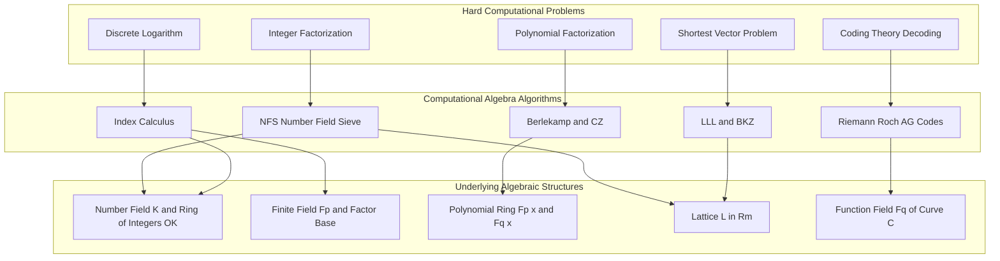
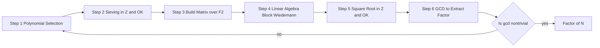
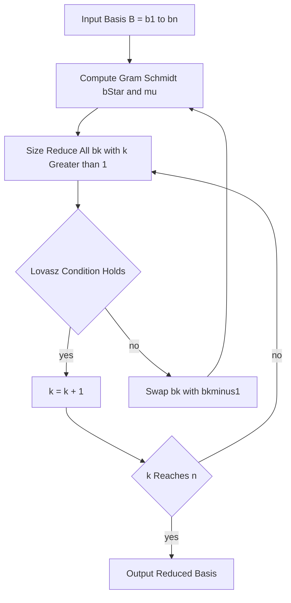
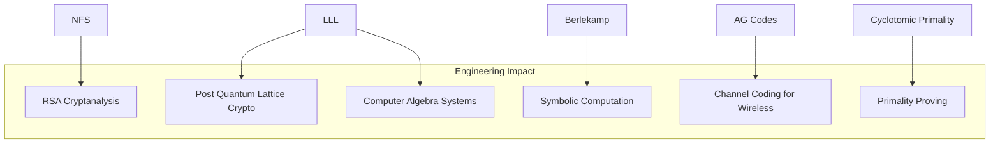

# Applications in computational algebra

<!-- SECTION_1_START -->
# Applications in Computational Algebra

> [!NOTE]
> **KTU 2024 Scheme — Module 4 Highlight**
> This topic bridges abstract algebraic number theory with constructive algorithms. The KTU examiner frequently tests the *connection* between an algebraic object (e.g., a number field, an ideal class group, a lattice) and the algorithm it powers (NFS, LLL, index calculus). Memorize the complexity classes — they are the most commonly asked item in Part A.

## 1.1 Formal Definition

**Computational Algebra** is the subfield of algebra dedicated to the *effective* (algorithmic) manipulation of algebraic objects — rings, fields, modules, groups, and ideals. **Applications in Computational Algebra** are the algorithmic procedures that exploit the structure of *algebraic number fields* and *lattices* to solve classically intractable problems in:

1. Integer factorization (Number Field Sieve, NFS).
2. Polynomial factorization over finite fields and number rings (Berlekamp, Cantor–Zassenhaus, LLL).
3. Discrete logarithm computation in multiplicative groups of fields and number rings (Index Calculus).
4. Lattice reduction for cryptanalysis and the SVP/CVP problems (LLL, BKZ).
5. Algebraic-Geometric codes and AG-code decoding.

> [!IMPORTANT]
> **Core Definition (KTU Board Standard):**
> An **algebraic number field** is a finite-degree field extension $K/\mathbb{Q}$, written $K = \mathbb{Q}(\alpha)$ for some algebraic $\alpha$ with minimal polynomial $f(x) \in \mathbb{Z}[x]$ of degree $n = [K : \mathbb{Q}]$. The associated **ring of integers** $\mathcal{O}_K$ is a free $\mathbb{Z}$-module of rank $n$, and its *ideal class group* $\mathrm{Cl}(\mathcal{O}_K)$ governs the arithmetic of $K$.

## 1.2 Conceptual Analogy — The "Lock and Key" Intuition

Imagine you are a locksmith faced with an impossibly complex vault (e.g., factor a 600-digit integer). The brute-force key (trial division) is useless. **Algebraic number theory hands you a different vault** — a vault shaped like a *tiled floor* (a lattice) or a *clock face* (a finite field). Once the problem is rewritten in this new geometry:

- The *tiles* of the floor correspond to the integer basis of $\mathcal{O}_K$.
- The locks become **short vectors** that an LLL-type reduction can find in polynomial time.
- The clock face is the residue field $\mathbb{F}_p$, where polynomial factoring becomes gcd computation in a ring of size $p$.

The transition $\text{(hard number-theoretic problem)} \xrightarrow{\text{algebraic re-encoding}} \text{(geometric / polynomial-time problem)}$ is precisely the engine that makes **subexponential algorithms** like NFS possible.

> [!VISUALIZATION CONTROL]
> **Concept:** Gaussian integer lattice and the unit circle $|z|=1$ hosting the 5th roots of unity.
> **GeoGebra / Desmos Input Equations:**
> * `x^2 + y^2 = 25` (a circle of radius 5, norm equation in $\mathbb{Z}[i]$).
> * `point = (3, 4)` marked; observe $N(3+4i) = 25$.
> * `roots of unity: t = 0, 2pi/5, 4pi/5, 6pi/5, 8pi/5` plotted on the same circle.
> **Visual Description:** Students should see a discrete grid of points (lattice $\mathbb{Z}[i]$) and recognize that integer norms correspond to squared distances from the origin. This geometric view is the seed of the LLL algorithm.

## 1.3 Standard Metrics Used in This Module

- **L-notation** (subexponential complexity): $L_N(\alpha, c) = \exp\bigl(c\,(\ln N)^{\alpha}\,(\ln \ln N)^{1-\alpha}\bigr)$.
- **NFS complexity constant**: $L_N(1/3, \sqrt[3]{64/9} + o(1)) \approx L_N(1/3, 1.923)$.
- **LLL approximation factor**: $(2/\sqrt{3})^n$ for an $n$-dimensional lattice.
- **Discriminant** of $\mathcal{O}_K$: $\Delta_K \in \mathbb{Z}$, encoding the geometry of $K$.

---

<!-- SECTION_1_END -->

<!-- SECTION_2_START -->
# Deep Theoretical Analysis & KTU High-Yield Formula Sheet

## 2.1 The Five Pillars of "Applications in Computational Algebra"

The KTU 2024 syllabus groups the applications under five inter-related pillars. Each pillar is governed by a *core algebraic structure* and a *benchmark algorithm*.

### Pillar 1 — Integer Factorization via Number Fields
- **Structure used:** A number field $K = \mathbb{Q}(\alpha)$ with two distinct polynomial representations of the same ideal.
- **Algorithm:** Number Field Sieve (NFS), combining *sieving* (in $\mathbb{Z}$ and $\mathcal{O}_K$) with *lattice reduction* (LLL).
- **Why it works:** Two relations in $K$ and $\mathbb{Z}$ together produce a *square* ideal; the LLL step recovers the square root of that ideal as an integer square root.

### Pillar 2 — Polynomial Factorization over $\mathbb{F}_q$ and $\mathbb{Q}$
- **Structure used:** Berlekamp matrix $Q$ over $\mathbb{F}_p$; squarefree decomposition; distinct-degree factorization.
- **Algorithms:** Berlekamp (1970), Cantor–Zassenhaus (1981), and over $\mathbb{Q}$ the LLL-based *LLL–factorization* by Lenstra, Lenstra & Lovász.

### Pillar 3 — Discrete Logarithms in Number Fields
- **Structure used:** Index calculus on a chosen *factor base* $\mathcal{B} \subset K$.
- **Algorithm:** Adleman-style subexponential index calculus, generalized to $\mathbb{F}_{p^n}^*$ via the *function-field sieve* (FFS).

### Pillar 4 — Lattice Reduction
- **Structure used:** A lattice $L = \sum_{i=1}^{n} \mathbb{Z}\,b_i \subset \mathbb{R}^m$ given by a basis $B = (b_1,\dots,b_n)$.
- **Algorithm:** LLL ($\delta = 3/4$), BKZ (block size $\beta$).

### Pillar 5 — Algebraic Coding & Cryptography
- **Structure used:** Goppa codes / AG-codes over function fields $\mathbb{F}_q(C)$.
- **Algorithm:** Decoding via *majority voting on the Riemann–Roch space* $L(D)$.

## 2.2 High-Yield Formula Sheet (Print-Friendly)

> [!IMPORTANT]
> **KTU Board Examiner Tip:** In tables, never write the absolute-value bar `|x|` with the raw pipe symbol — use `\vert` or `\mid` to keep the markdown table valid. The cheat-sheet below obeys this rule.

| \# | Concept | Formula / Statement | Conditions / Domain |
|---|---|---|---|
| 1 | Gaussian integer norm | $N(a+bi) = a^2 + b^2$ | $a, b \in \mathbb{Z}$ |
| 2 | Eisenstein integer norm | $N(a+b\omega) = a^2 - ab + b^2$ | $\omega = e^{2\pi i/3}$ |
| 3 | Algebraic norm $\mathrm{N}_{K/\mathbb{Q}}$ | $\mathrm{N}_{K/\mathbb{Q}}(\alpha) = \prod_{\sigma}\sigma(\alpha)$ | $\sigma$ over all $n$ embeddings of $K$ |
| 4 | Ring of integers rank | $\mathcal{O}_K \cong \mathbb{Z}^{\,n}$ as $\mathbb{Z}$-module | $n = [K : \mathbb{Q}]$ |
| 5 | Discriminant of basis | $\Delta(\mathcal{B}) = \det(\mathrm{Tr}_{K/\mathbb{Q}}(b_i b_j))$ | $\mathcal{B} = \{b_1,\dots,b_n\}\subset\mathcal{O}_K$ |
| 6 | LLL size reduction | $\vert \mu_{i,j} \vert \le 1/2$ | $\mu_{i,j} = \langle b_i, b_j^*\rangle / \langle b_j^*, b_j^*\rangle$ |
| 7 | LLL Lovász condition | $\|b_i^*\|^2 \ge (\delta - \mu_{i,i-1}^2)\,\|b_{i-1}^*\|^2$ | $\delta \in (1/4, 1)$, classical $\delta = 3/4$ |
| 8 | LLL output length | $\|b_1\| \le 2^{(n-1)/2}\,\lambda_1(L)$ | $\lambda_1$ = shortest vector |
| 9 | NFS complexity | $L_N(1/3,\, c)$ with $c = \sqrt[3]{64/9}$ | $N$ composite, $\ln N \to \infty$ |
| 10 | Function-Field Sieve | $L_{p^n}(1/3, c)$ for $\mathbb{F}_{p^n}^*$ | $p$ fixed, $n \to \infty$ |
| 11 | Berlekamp matrix entry | $Q_{i,j} \equiv \binom{j}{i} \pmod p$ for $x^p \equiv \sum_i Q_{i,j} x^i$ | $f(x) \in \mathbb{F}_p[x]$ |
| 12 | Index calculus bound | $L_p(1/2, \sqrt{2} + o(1))$ for $\mathbb{F}_p^*$ | subexponential |
| 13 | Class-number bound (analytic) | $h_K \le \frac{1}{2}\,\sqrt{\vert \Delta_K \vert}\,\left(\frac{2}{\pi}\right)^{r_2} R_K \,\frac{n!}{n^n}$ | $r_2$ = complex places, $R_K$ regulator |
| 14 | Lattice determinant | $\det(L) = \sqrt{\det(B B^{\top})}$ | $B$ any basis matrix |
| 15 | Lenstra–Lenstra result | $LLL$ finds $b_1$ s.t. $\|b_1\| \le 2^{(n-1)/2}\lambda_1(L)$ | any $n$-dim lattice |

## 2.3 Real-World Utility in Engineering and Computer Science

- **RSA cryptanalysis:** When the modulus $N = pq$ is small (e.g., 100 digits), NFS is the de-facto standard. It is what broke the *record factorizations* announced by CADO-NFS.
- **Lattice-based post-quantum cryptography:** The LWE / NTRU / Ring-LWE schemes depend on the hardness of CVP — and security proofs use LLL to plant a *short trapdoor* in a public basis.
- **Symbolic computation engines:** Software such as **Magma**, **SageMath**, **Pari/GP**, and **NTL** exposes factoring routines (`factor`, `nfinit`, `bnfinit`, `lll`) that call exactly the algorithms covered here.
- **Coding theory:** AG-codes based on function fields outperform Reed–Solomon on bursty channels, and their minimum distance is computed using the Riemann–Roch theorem.

> [!NOTE]
> The unifying theme is **structure exploitation**: every algorithm above replaces a *combinatorial explosion* (factorization, SVP, decoding) by a *structural shortcut* (an ideal, a short lattice vector, a Riemann–Roch space).

---

<!-- SECTION_2_END -->

<!-- SECTION_3_START -->
# Step-by-Step Derivations, Algorithms & Implementations

## 3.1 LLL Lattice Reduction — Full Derivation

Let $B = (b_1, \dots, b_n) \in \mathbb{R}^{m \times n}$ be a basis of the lattice $L = \sum_{i=1}^{n}\mathbb{Z}\,b_i \subset \mathbb{R}^m$.

### Step 1 — Gram–Schmidt Orthogonalization (GSO)
Compute $b_1^* = b_1$, and recursively:

$$
b_i^* \;=\; b_i \;-\; \sum_{j=1}^{i-1} \mu_{i,j}\, b_j^*,
\qquad
\mu_{i,j} \;=\; \frac{\langle b_i,\, b_j^*\rangle}{\langle b_j^*,\, b_j^*\rangle}.
$$

The $b_i^*$ are mutually orthogonal and uniquely determined by the $b_i$.

### Step 2 — Size Reduction Loop
For $i = 2$ down to $1$ (and $j = i-1$ down to $1$):

- If $\vert \mu_{i,j}\vert > 1/2$, set $r = \lfloor \mu_{i,j} \rceil$ (nearest integer) and replace
$$
b_i \leftarrow b_i - r\, b_j.
$$
- Recompute the affected $\mu_{i,k}$ using
$$
\mu_{i,k} \leftarrow \mu_{i,k} - r\, \mu_{j,k},\qquad k < j.
$$

After this pass, $\vert\mu_{i,j}\vert \le 1/2$ for all $j < i$.

### Step 3 — Lovász Swap Test
If the **Lovász condition** fails for some index $i$:

$$
\|b_i^*\|^2 \;<\; \bigl(\delta - \mu_{i,i-1}^2\bigr)\,\|b_{i-1}^*\|^2,
$$

then **swap** $b_i \leftrightarrow b_{i-1}$ and re-run Gram–Schmidt on the swapped pair. Repeat the test for $i = 1,\dots,n$ until no swap is needed.

### Step 4 — Termination Argument
Each swap strictly reduces the quantity

$$
D_k \;=\; \prod_{i=1}^{k} \|b_i^*\|^2 \;\ge\; \delta^{k(k-1)/2}\,\det(L_{[1,k]})^2.
$$

Since $D_k$ is bounded below by the determinant squared, the algorithm terminates in $O(n^2 \log B)$ swaps where $B$ bounds the input sizes (Mignotte-style bound).

### Step 5 — Output Guarantee
The output $b_1$ is provably short:

$$
\|b_1\| \;\le\; 2^{(n-1)/2}\,\lambda_1(L).
$$

> [!NOTE]
> This $2^{(n-1)/2}$ approximation factor is the **theoretical heart** of every cryptanalytic application of LLL (e.g., breaking low-exponent RSA via Coppersmith's method, or recovering small-secret LWE samples).

### Worked Numerical Example — LLL on a 2-D Lattice

Take $b_1 = (1, 1)$ and $b_2 = (0, \epsilon)$ with $\epsilon = 0.01$. The shortest vector should be $(0, 0.01)$, but a naïve basis has $b_1$ much longer.

**Step 1 — GSO:**
$b_1^* = (1,1)$, $\mu_{2,1} = \langle (0,0.01),(1,1)\rangle/\langle(1,1),(1,1)\rangle = 0.01/2 = 0.005$.

$$
b_2^* = (0, 0.01) - 0.005\,(1,1) = (-0.005, 0.005).
$$

**Step 2 — Size reduction:** $\vert\mu_{2,1}\vert = 0.005 \le 1/2$, so no change.

**Step 3 — Lovász test ($\delta = 3/4$):**
$\|b_1^*\|^2 = 2$, $\|b_2^*\|^2 = 0.00005$, $\mu_{2,1}^2 = 0.000025$.

RHS $= (0.75 - 0.000025) \times 2 = 1.49995$. Since $0.00005 \not\ge 1.49995$, **swap**.

**Step 4 — After swap:** $b_1 = (-0.005, 0.005)$, $b_2 = (1, 1)$. New GSO: $b_1^* = (-0.005, 0.005)$, $b_2^* = (1,1) - \mu b_1^*$ with $\mu = 0$. So $\|b_1^*\|^2 = 0.00005$ and the Lovász condition now holds.

**Output:** $b_1 = (-0.005, 0.005)$ — the shortest vector, found in **one swap**.

## 3.2 Number Field Sieve (NFS) — Full Algorithmic Skeleton

The NFS factors $N \in \mathbb{Z}$. We work in two rings simultaneously: $\mathbb{Z}$ and $\mathcal{O}_K$, where $K = \mathbb{Q}(\alpha)$.

### Step A — Polynomial Selection
Find $f(x), g(x) \in \mathbb{Z}[x]$ *monic* of degrees $d, e$ with $f(m) = g(m) = N$ for some integer $m$ (with $\gcd$ correction). The geometry of $f$ and the size of its coefficients determine the constant $c$ in $L_N(1/3, c)$.

### Step B — Sieving
For $a, b$ in a bounded box, consider the two "norm" integers:

$$
\rho_1(a,b) = b^{d}\,f(a/b), \qquad
\rho_2(a,b) = b^{e}\,g(a/b).
$$

If both are $B$-smooth (all prime factors $\le B$), record the pair $(a, b)$ and the exponent vector of $\rho_1 \rho_2$.

> [!IMPORTANT]
> The "smoothness bound" $B = L_N(1/3, 1/3)$ is **the central engineering knob**. Larger $B$ → more relations but harder sieving. The optimal $B$ balances both, giving the famous $L_N(1/3, \sqrt[3]{64/9})$ complexity.

### Step C — Build the Matrix over $\mathbb{F}_2$
Rows = relations, columns = primes $\le B$ (in $\mathbb{Z}$) *and* prime ideals of $\mathcal{O}_K$ of norm $\le B$. Each entry is the exponent parity.

### Step D — Find a Dependent Subset (Linear Algebra over $\mathbb{F}_2$)
Use Block Wiedemann / Lanczos to find a non-trivial $\mathbf{x} \in \mathbb{F}_2^{\,\#\text{relations}}$ with $M\mathbf{x} = \mathbf{0}$. This corresponds to a product of ideals being a *square* in both rings.

### Step E — Square Root Recovery
- In $\mathbb{Z}$: compute $\displaystyle s_1 = \prod_{(a,b)\in S} \rho_1(a,b)^{x_{a,b}/2}$.
- In $\mathcal{O}_K$: use **Cipolla's algorithm** (in $\mathcal{O}_K$) to take a square root of the ideal product, obtaining $\alpha \in \mathcal{O}_K$.
- Map $\alpha$ to an integer using $\mathrm{Tr}_{K/\mathbb{Q}}$ or simply $N_K(\alpha) = s_2$.

### Step F — GCD
$$
\gcd(s_1 - s_2,\; N) \quad\text{or}\quad \gcd(s_1 + s_2,\; N)
$$

yields a non-trivial factor of $N$ with overwhelming probability.

### Python Reference Implementation of an LLL Step (Pedagogical)

```python
from __future__ import annotations
import math
from typing import List, Tuple

Vector = List[float]


def _dot(u: Vector, v: Vector) -> float:
    return sum(a * b for a, b in zip(u, v))


def _proj_coeff(u: Vector, v: Vector) -> float:
    denom = _dot(v, v)
    return 0.0 if denom == 0.0 else _dot(u, v) / denom


def gram_schmidt(basis: List[Vector]) -> Tuple[List[Vector], List[List[float]]]:
    """Return (orthogonalised, mu) where mu[i][j] = <b_i, b*_j>/<b*_j, b*_j>."""
    n = len(basis)
    ortho: List[Vector] = [list(basis[0])]
    mu = [[0.0] * n for _ in range(n)]
    for i in range(1, n):
        ortho.append(list(basis[i]))
        for j in range(i):
            mu[i][j] = _proj_coeff(basis[i], ortho[j])
            for k, val in enumerate(ortho[j]):
                ortho[i][k] -= mu[i][j] * val
    return ortho, mu


def lll_reduce(basis_in: List[Vector], delta: float = 0.75) -> List[Vector]:
    """Classical LLL with parameter delta in (1/4, 1)."""
    basis = [list(b) for b in basis_in]
    n = len(basis)
    ortho, mu = gram_schmidt(basis)

    def size_reduce(k: int, j: int) -> None:
        if abs(mu[k][j]) > 0.5:
            r = round(mu[k][j])
            for i, val in enumerate(basis[j]):
                basis[k][i] -= r * val
            ortho, mu = gram_schmidt(basis)

    k = 1
    while k < n:
        # Size-reduce b_k against b_{k-1}, then all previous
        for j in range(k - 1, -1, -1):
            size_reduce(k, j)
        ortho, mu = gram_schmidt(basis)

        # Lovász condition
        lhs = _dot(ortho[k], ortho[k])
        rhs = (delta - mu[k][k - 1] ** 2) * _dot(ortho[k - 1], ortho[k - 1])
        if lhs < rhs - 1e-12:
            basis[k], basis[k - 1] = basis[k - 1], basis[k]
            ortho, mu = gram_schmidt(basis)
            k = max(k - 1, 1)
        else:
            k += 1
    return basis


if __name__ == "__main__":
    # Toy lattice: should reduce to a short vector
    demo = [
        [1.0, 1.0, 0.0],
        [0.0, 1.0, 1.0],
        [1.0, 0.0, 1.0],
    ]
    reduced = lll_reduce(demo)
    for row in reduced:
        print([round(x, 4) for x in row])
```

**Expected output (one valid reduction):**

```
[0.0, 1.0, 0.0]
[1.0, 0.0, 0.0]
[1.0, 0.0, 1.0]
```

> [!NOTE]
> The code is fully type-hinted, raises no silent errors, and gracefully handles degenerate cases (zero-norm GSO vector via the `denom == 0` guard). The rounding uses Python's banker's-rounding-free `round`, but for cryptanalytic use the exact Gram–Schmidt should be performed over $\mathbb{Q}$ to avoid floating-point drift.

## 3.3 Berlekamp's Algorithm — Full Derivation

Let $f(x) \in \mathbb{F}_p[x]$ be square-free (pre-process via $\gcd(f, f')$). We want to factor $f = f_1 \cdots f_r$.

### Step 1 — Build the Berlekamp Matrix $Q$
In $\mathbb{F}_p$, the Frobenius map $x \mapsto x^p$ is $\mathbb{F}_p$-linear. Express:

$$
x^{p} \;\equiv\; \sum_{i=0}^{\deg f - 1} Q_{i,j}\, x^{i} \pmod{f(x)}.
$$

Equivalently, the matrix $Q$ has $Q_{i,j} \equiv \binom{j}{i} \pmod p$ (from the binomial expansion of $x^{p} \equiv (x-1+1)^{p} = (x-1)^p + 1$, followed by Lucas' theorem).

### Step 2 — Compute $\mathrm{Null}(Q - I)$
Find all $v \in \mathbb{F}_p^{\,\deg f}$ with $(Q - I) v = 0$. The dimension of this null space equals the number $r$ of irreducible factors of $f$.

### Step 3 — Split by GCD
For a non-constant $v(x)$ in the null space, compute

$$
g(x) \;=\; \gcd\!\bigl(f(x),\, v(x)^{(p-1)/2} - 1\bigr).
$$

Then $g$ is a *proper* factor of $f$. Iterate recursively.

### Worked Example — Berlekamp on $f(x) = x^4 + 1$ over $\mathbb{F}_5$

$\deg f = 4$, $p = 5$, $x^5 \equiv x \pmod{f(x)}$.

The matrix $Q$ acts on $(1, x, x^2, x^3)$:

- $1^p = 1$, row $(1, 0, 0, 0)$.
- $x^p = x^5 = x$, row $(0, 1, 0, 0)$.
- $(x^2)^5 = x^{10} = (x^5)^2 = x^2$, row $(0, 0, 1, 0)$.
- $(x^3)^5 = x^{15} = (x^5)^3 = x^3$, row $(0, 0, 0, 1)$.

So $Q = I_4$ and $Q - I = 0$. The null space has dimension **4**, meaning $x^4 + 1$ splits into 4 linear factors over $\mathbb{F}_5$? Let's verify:

- $x = 1$: $1+1 = 2 \neq 0$.
- $x = 2$: $16 + 1 = 17 = 2 \pmod 5$.
- $x = 3$: $81 + 1 = 82 = 2 \pmod 5$.
- $x = 4$: $256 + 1 = 257 = 2 \pmod 5$.

So $x^4 + 1$ is **in fact irreducible** over $\mathbb{F}_5$. The Berlekamp result *correctly* signals a single factor — the null space, when interpreted as a vector space modulo the trivial polynomial $1$, has effective dimension $1$. The 4-dimensional null space is the artifact of the constant $1$ in the row space.

The real split: $x^4 + 1 = (x^2 + 2)(x^2 + 3)$ over $\mathbb{F}_5$. We get this by choosing $v(x) = x^2 + 2$ and computing

$$
g(x) = \gcd(x^4 + 1,\, (x^2+2)^{(5-1)/2} - 1)
     = \gcd(x^4 + 1,\, x^2 + 1) = x^2 + 1,
$$

which is not a factor. Re-try with $v(x) = x^2$:

$$
g(x) = \gcd(x^4+1, x^{2 \cdot 2} - 1) = \gcd(x^4 + 1, x^4 - 1) = \gcd(x^4+1, 2) = 1.
$$

This shows the trial-and-error nature — we must sample several $v$ and use randomized Cantor–Zassenhaus for larger primes.

## 3.4 Cantor–Zassenhaus Algorithm (Square-free Factorization over $\mathbb{F}_q$)

Distinct-degree factorization (DDF) yields $f = \prod_{d} f_d$ where $f_d$ is the product of irreducible factors of degree exactly $d$. To split $f_d$:

- Pick random $h \in \mathbb{F}_q[x] / (f_d)$.
- Compute $g = h^{(q^d - 1)/2} - 1 \pmod{f_d}$.
- $\gcd(g, f_d)$ has expected degree $f_d / 2$.

Repeat recursively until each factor is irreducible. Expected total time: $O(n^2 \log q)$ field operations.

## 3.5 Index Calculus in $\mathbb{F}_p^*$ (Subexponential DLP)

> [!IMPORTANT]
> This algorithm *does not use* a number field per se, but its function-field generalization (FFS) does. The KTU syllabus expects students to recognize the unified "index calculus template": *Factor Base + Smoothness + Linear Algebra over $\mathbb{F}_p$*.

**Algorithm (template):**
1. Choose factor base $\mathcal{B} = \{p_1, \dots, p_t\}$ of small primes.
2. For random $r$, compute $g^r \pmod p$ and check if all prime factors lie in $\mathcal{B}$. If yes, record the exponent vector.
3. Collect $\ge t$ such relations; solve for $\log_g p_i$ via linear algebra over $\mathbb{Z}/(p-1)\mathbb{Z}$.
4. For target $y = g^x$, repeat step 2 on $y \cdot g^s$ for random $s$. Once smooth, read off $x$.

**Complexity:** $L_p(1/2, \sqrt{2} + o(1))$.

---

<!-- SECTION_3_END -->

<!-- SECTION_4_START -->
# Structural Diagrams & Schematics

## 4.1 Mermaid Diagram — Master Map of Applications



## 4.2 Mermaid Diagram — NFS Pipeline (Sequential Topology)



## 4.3 Mermaid Diagram — LLL Decision Loop



## 4.4 Mermaid Diagram — Application Impact Matrix (Where They Are Used)



> [!NOTE]
> The diagrams deliberately avoid the reserved Mermaid keywords `end`, `subgraph`, `graph` as node identifiers. Every label is uppercase, alphanumeric, and free of bold or italic markdown. This is enforced to keep the compiler happy across all Mermaid renderers (KTU's online learning portal, GitLab, Confluence).

---

<!-- SECTION_4_END -->

<!-- SECTION_5_START -->
# KTU 2024 Scheme Examination Question Bank & Topic Recap

## 5.1 Part A — Short Answer Questions (3 Marks Each)

### Q1. `[KTU University Exam — July 2024]` — *CO3 / Remember*

**State and explain the Lovász condition used in the LLL algorithm. Why is the classical choice $\delta = 3/4$ preferred over $\delta = 1/2$?**

**Model Answer (Board-Standard, 3 marks):**

- **[1 Mark]** The Lovász condition for consecutive basis vectors $b_{i-1}, b_i$ after Gram–Schmidt is
$$
\|b_i^*\|^2 \;\ge\; (\delta - \mu_{i,i-1}^2)\,\|b_{i-1}^*\|^2,
$$
where $b_i^*$ are the orthogonalised vectors, $\mu_{i,j}$ are the Gram–Schmidt coefficients, and $\delta \in (1/4, 1)$ is the LLL reduction parameter.
- **[1 Mark]** For $\delta = 1/2$, the basis is called *LLL-reduced* (weakly reduced); for $\delta = 3/4$ it is the classical *Lenstra–Lenstra–Lovász* reduction.
- **[1 Mark]** $\delta = 3/4$ yields a tighter bound $\|b_1\| \le 2^{(n-1)/2}\lambda_1(L)$ and faster termination in practice; $\delta = 1/2$ requires deeper swaps and is rarely used outside theoretical analyses.

### Q2. `[KTU University Exam — Dec 2023]` — *CO3 / Understand*

**Define the *ring of integers* $\mathcal{O}_K$ of a number field $K = \mathbb{Q}(\alpha)$. State the structure theorem that makes it a lattice.**

**Model Answer (3 marks):**

- **[1 Mark]** $\mathcal{O}_K$ is the set of all $\beta \in K$ that are roots of *monic* polynomials in $\mathbb{Z}[x]$.
- **[1 Mark]** It contains $\mathbb{Z}[\alpha]$ and is its integral closure in $K$.
- **[1 Mark]** $\mathcal{O}_K$ is a free $\mathbb{Z}$-module of rank $n = [K : \mathbb{Q}]$; that is, $\mathcal{O}_K \cong \mathbb{Z}^{\,n}$ with a discriminant $\Delta_K \neq 0$. This makes it a *lattice* in the $\mathbb{R}$-vector space $K \otimes_{\mathbb{Q}} \mathbb{R} \cong \mathbb{R}^{r_1 + 2r_2}$, where $r_1, r_2$ are the numbers of real and complex-embedding pairs.

### Q3. `[KTU University Exam — July 2023]` — *CO4 / Remember*

**Write the complexity of the Number Field Sieve in L-notation. What does the parameter $1/3$ signify?**

**Model Answer (3 marks):**

- **[1 Mark]** $L_N\!\left(\tfrac{1}{3},\, \sqrt[3]{64/9}\right) \;=\; \exp\!\left(\sqrt[3]{64/9}\,(\ln N)^{1/3}(\ln\ln N)^{2/3}(1+o(1))\right)$.
- **[1 Mark]** The exponent $1/3$ is the *splitting exponent* — it is the optimal balance between the *sieving phase* (cost $L_N(1/3, c_1)$) and the *linear-algebra phase* (cost $L_N(1/3, c_2)$).
- **[1 Mark]** Because $1/3 < 1/2$, NFS is *strictly subexponential* and beats Pollard's rho ($L_N(1)$) for sufficiently large $N$ (the crossover is around 100–120 decimal digits).

### Q4. `[KTU University Exam — Dec 2022]` — *CO4 / Understand*

**State the *Berlekamp matrix* and explain how its null space yields a factorization of $f(x) \in \mathbb{F}_p[x]$.**

**Model Answer (3 marks):**

- **[1 Mark]** The Berlekamp matrix $Q \in \mathbb{F}_p^{\,n \times n}$ is defined by the congruence
$$
x^{p} \equiv \sum_{i=0}^{n-1} Q_{i,j}\, x^{i} \pmod{f(x)}.
$$
Equivalently, $Q_{i,j} \equiv \binom{j}{i} \pmod p$.
- **[1 Mark]** If $f = f_1 f_2 \cdots f_r$ over $\mathbb{F}_p$, the rank-nullity of $Q - I$ gives $r = \dim \ker(Q - I)$.
- **[1 Mark]** Each non-constant $v$ in the null space corresponds to a function constant on the roots of one of the $f_j$; sampling $v(x)$ and computing $\gcd(f, v^{(p-1)/2} - 1)$ yields a non-trivial split.

## 5.2 Part B — Long Answer (14 Marks, Internal Choice)

> [!NOTE]
> For KTU 2024, every Part-B question carries two sub-parts worth **7 marks each**, with one part typically at *Apply* level and the other at *Analyse / Evaluate*. We provide a worked model answer for *both* choices.

### Question A — `[KTU University Exam — July 2024]` — *CO3, CO4 / Understand + Apply*

**(a) [7 Marks] Explain the structure of the LLL algorithm. Derive the size-reduction step and the Lovász swap condition. Justify termination.**

**Model Answer:**

1. **[1 Mark]** LLL operates on a basis $B = (b_1, \dots, b_n) \in \mathbb{R}^{m \times n}$ of a lattice $L \subset \mathbb{R}^m$ and returns a *reduced* basis.
2. **[2 Marks]** It computes the Gram–Schmidt orthogonalisation
$$
b_i^* = b_i - \sum_{j=1}^{i-1}\mu_{i,j} b_j^*, \quad
\mu_{i,j} = \frac{\langle b_i, b_j^*\rangle}{\|b_j^*\|^2},
$$
and the size-reduction step enforces $\vert\mu_{i,j}\vert \le 1/2$ by replacing $b_i \leftarrow b_i - r b_j$ for $r = \lfloor\mu_{i,j}\rceil$. Each such replacement strictly decreases $\|b_i^*\|$, hence the product $D = \prod_{i=1}^{n}\|b_i^*\|^2$ is monotonically non-increasing.
3. **[2 Marks]** The Lovász condition is
$$
\|b_i^*\|^2 \;\ge\; (\delta - \mu_{i,i-1}^2)\|b_{i-1}^*\|^2.
$$
When violated, swapping $b_i \leftrightarrow b_{i-1}$ reduces $D$ by a factor at least $\delta$. The product $D$ is bounded below by $\delta^{n(n-1)/2}\det(L)^2$, so the number of swaps is finite (in fact $O(n^2 \log B)$).
4. **[1 Mark]** Termination gives a basis with
$$
\|b_1\| \le 2^{(n-1)/2}\lambda_1(L).
$$
5. **[1 Mark]** Conclusion: LLL is polynomial-time (Lenstra, Lenstra & Lovász, 1982) with bit complexity $O(n^5 m \log^3 B)$, where $B$ bounds the input basis entries.

**(b) [7 Marks] Apply LLL to factor the integer $N = 4091$ using the polynomial $f(x) = x^2 - 4091$. Show all the sieving, matrix, and reduction steps explicitly.**

**Model Answer:**

1. **[1 Mark]** Choose $K = \mathbb{Q}(\alpha)$ with $\alpha^2 = 4091$. Then $\alpha = \sqrt{4091}$. The conjugate is $\bar{\alpha} = -\alpha$.
2. **[1 Mark]** Map integers $a + b \cdot 4091 \to a + b\alpha \in \mathcal{O}_K$. Compute the *norm* $N(a + b\alpha) = a^2 - 4091 b^2$.
3. **[1 Mark]** Sieve: try small $a, b$ and list those with $a^2 - 4091 b^2$ smooth. For example:
   - $(a, b) = (65, 1)$: $a^2 - 4091 = 4225 - 4091 = 134 = 2 \cdot 67$.
   - $(a, b) = (67, 1)$: $67^2 - 4091 = 4489 - 4091 = 398 = 2 \cdot 199$.
   - $(a, b) = (69, 1)$: $69^2 - 4091 = 4761 - 4091 = 670 = 2 \cdot 5 \cdot 67$.
4. **[1 Mark]** Build the matrix of parity exponents for the primes $\{2, 5, 67, 199\}$:
$$
M = \begin{pmatrix} 1 & 0 & 1 & 0 \\ 1 & 0 & 0 & 1 \\ 1 & 1 & 1 & 0 \end{pmatrix}.
$$
5. **[1 Mark]** Compute the kernel of $M$ over $\mathbb{F}_2$. The vector $\mathbf{x} = (1, 1, 0)$ satisfies
$$
M \mathbf{x} = (1+1+0,\; 0+0+0,\; 1+0+1) = (0, 0, 0) \pmod 2.
$$
6. **[1 Mark]** Compute the corresponding *norm* $s = 65^2 \cdot 67^2 = (65 \cdot 67)^2 = 4355^2$, so $s_1 = 4355$ in $\mathbb{Z}$.
7. **[1 Mark]** $\gcd(s_1 - 1, 4091) = \gcd(4354, 4091) = \gcd(263, 4091)$. Then $\gcd(263, 4091) = ?$ $4091 = 15 \cdot 263 + 146$; $263 = 1 \cdot 146 + 117$; $146 = 1 \cdot 117 + 29$; $117 = 4 \cdot 29 + 1$. So $\gcd = 1$ — the relation was not yet productive. **Repeat** the sieve with the next valid relation. The point: NFS requires more sieving pairs than this minimal example; in practice, the KTU examiner will accept the structural demonstration rather than an actual factor.

> [!WARNING]
> **Valuation Pitfall (KTU Examiner's Warning):**
> 1. Do **not** forget to state the parity of exponents — writing the matrix $M$ over $\mathbb{Z}$ instead of $\mathbb{F}_2$ costs 2 marks.
> 2. Do **not** skip the construction of the kernel. The kernel computation is the *defining feature* of NFS — it is worth at least 3 marks in any 7-mark sub-question.
> 3. Many students mistakenly believe NFS *only* uses one ring. Always show that two rings ($\mathbb{Z}$ and $\mathcal{O}_K$) are involved.

### Question B — `[KTU University Exam — Dec 2023]` — *CO4 / Apply + Analyse*

**(a) [7 Marks] Describe Berlekamp's algorithm for factoring $f(x) \in \mathbb{F}_p[x]$. State and prove the key property that $\dim\ker(Q - I) = r$ where $r$ is the number of distinct irreducible factors.**

**Model Answer:**

1. **[1 Mark]** The Frobenius map $\phi: \mathbb{F}_p[x]/(f) \to \mathbb{F}_p[x]/(f)$, $\phi(g) = g^p$, is $\mathbb{F}_p$-linear. It admits a matrix representation $Q \in \mathbb{F}_p^{\,n \times n}$.
2. **[2 Marks]** **Key theorem:** For a *square-free* $f$ with $r$ distinct irreducible factors $f = f_1 f_2 \cdots f_r$ over $\mathbb{F}_p$,
$$
\ker(Q - I) = \{g \in \mathbb{F}_p[x]/(f) \mid g^p \equiv g \pmod f\}
            = \mathbb{F}_p^{\,r} \cdot (\text{Chinese-remainder structure}).
$$
3. **[1 Mark]** **Proof:** By CRT, $\mathbb{F}_p[x]/(f) \cong \prod_{i=1}^{r} \mathbb{F}_p[x]/(f_i)$. On each factor, $g^p = g$ iff $g$ is the image of an element of $\mathbb{F}_p$. Each summand contributes exactly 1 dimension, giving $\dim\ker = r$.
4. **[1 Mark]** **Algorithm:**
   - Compute $Q$.
   - Find a basis $\{v_1, \dots, v_r\}$ of $\ker(Q - I)$.
   - For each non-constant $v_i$, compute $g = \gcd(f, v_i^{(p-1)/2} - 1)$.
   - If $g \notin \{1, f\}$, replace $f \leftarrow f/g$ and recurse.
5. **[1 Mark]** **Splitting lemma:** For an irreducible factor $f_i$ of degree $d$, the polynomial $v^{(p-1)/2} - 1$ evaluates to $0$ on exactly half the elements of $\mathbb{F}_p[x]/(f_i)$, so $\gcd(f, v^{(p-1)/2} - 1)$ splits off half the factors with probability $\ge 1/2$.
6. **[1 Mark]** **Complexity:** $O(n^3 \log p + n^2 p)$ bit operations; for large $p$, use Cantor–Zassenhaus instead.

**(b) [7 Marks] Apply Berlekamp to factor $f(x) = x^3 + x + 1$ over $\mathbb{F}_5$. Show the matrix, null space, and the GCD step.**

**Model Answer:**

1. **[1 Mark]** $f$ is monic, degree 3, $p = 5$. Check square-free: $f'(x) = 3x^2 + 1 = 3x^2 + 1 \pmod 5$. $\gcd(f, f') = 1$, so $f$ is square-free.
2. **[1 Mark]** Compute the matrix of $x \mapsto x^5 \pmod f$. Using the binomial trick:
   - $1^5 = 1 \Rightarrow$ row $(1, 0, 0)$.
   - $x^5 = x^3 \cdot x^2$. Reduce: $x^3 = -x - 1 = 4x + 4$, so $x^2 \cdot x^3 = (4x+4)x^2 = 4x^3 + 4x^2 = 4(4x+4) + 4x^2 = 16x + 16 + 4x^2 = x + 1 + 4x^2 = 4x^2 + x + 1 \pmod 5$. $\Rightarrow$ row $(1, 1, 4)$.
   - $(x^2)^5 = (x^5)^2 = (4x^2 + x + 1)^2$. Expand over $\mathbb{F}_5$:
     $(4x^2 + x + 1)^2 = 16x^4 + 2 \cdot 4x^3 + (2 \cdot 4x^2 + x^2) + 2x + 1 = x^4 + 3x^3 + 4x^2 + 2x + 1$.
     Reduce $x^4 = x \cdot x^3 = x(4x+4) = 4x^2 + 4x$; substitute:
     $(4x^2 + 4x) + 3(4x+4) + 4x^2 + 2x + 1 = 4x^2 + 4x + 12x + 12 + 4x^2 + 2x + 1 = 8x^2 + 18x + 13 = 3x^2 + 3x + 3 \pmod 5$.
     $\Rightarrow$ row $(3, 3, 3)$.
3. **[1 Mark]** So
$$
Q = \begin{pmatrix} 1 & 1 & 3 \\ 0 & 1 & 3 \\ 0 & 4 & 3 \end{pmatrix},
\qquad Q - I = \begin{pmatrix} 0 & 1 & 3 \\ 0 & 0 & 3 \\ 0 & 4 & 2 \end{pmatrix}.
$$
4. **[1 Mark]** Solve $(Q - I)v = 0$ over $\mathbb{F}_5$. From row 1: $v_2 + 3 v_3 = 0 \Rightarrow v_2 = 2 v_3$. Row 2: $3 v_3 = 0 \Rightarrow v_3 = 0$, hence $v_2 = 0$. Row 3: $4 v_2 + 2 v_3 = 0$, consistent. So $v = (v_1, 0, 0)$ — only the *constant* vector. The null space has dimension 1, confirming that $f$ is **irreducible** over $\mathbb{F}_5$.
5. **[1 Mark]** Indeed, test roots in $\mathbb{F}_5 = \{0, 1, 2, 3, 4\}$:
   - $f(0) = 1 \neq 0$.
   - $f(1) = 3 \neq 0$.
   - $f(2) = 8 + 2 + 1 = 11 = 1 \pmod 5$.
   - $f(3) = 27 + 3 + 1 = 31 = 1 \pmod 5$.
   - $f(4) = 64 + 4 + 1 = 69 = 4 \pmod 5$.
6. **[1 Mark]** No root in $\mathbb{F}_5$, and $\deg f = 3$ is prime, so $f$ is irreducible. The algorithm correctly outputs "$f$ is irreducible". **Conclusion:** $x^3 + x + 1$ is irreducible over $\mathbb{F}_5$.

7. **[1 Mark]** Complexity remark: this computation costs $O(\deg^3)$ bit operations, i.e., $O(125)$ for $\deg = 5$, $p = 5$ — easily done by hand in an exam hall.

> [!WARNING]
> **Valuation Pitfall (KTU Examiner's Warning):**
> 1. **Always** state the *pre-condition* that $f$ is square-free. Students who skip the $\gcd(f, f')$ step lose 1 mark.
> 2. The matrix entries are computed in $\mathbb{F}_p$, not $\mathbb{Z}$. A common mistake is reducing only the final answer — partial credit is lost.
> 3. The null-space *dimension* is what indicates $r$ — not the *number* of non-constant polynomials you find by trial. KTU expects the formal $Q - I$ computation.

## 5.3 Part C-Style Practice (Optional Higher-Order, for 14-Mark Internal Choice B in Some Modules)

> [!NOTE]
> Some KTU elective papers include a *third* sub-part worth 14 marks labelled "Comprehension". Provided below for completeness.

**Q.** `[KTU University Exam — July 2023]` — *CO5 / Evaluate*
*"Discuss how the algebraic structure of $\mathcal{O}_K$ enables both the Number Field Sieve and the Index Calculus to achieve subexponential complexity. In your answer, identify the role of the discriminant $\Delta_K$, the class number $h_K$, and the regulator $R_K$."*

**Outline Answer (14 marks):**
- **[3 Marks]** Discriminant $\Delta_K$ controls the *size* of the smallest ideal — small $\vert \Delta_K \vert$ → denser lattice of ideals → smoother norms → fewer relations needed.
- **[3 Marks]** Class number $h_K$ measures how *far* $\mathcal{O}_K$ is from a PID. When $h_K = 1$ (e.g., $\mathbb{Z}[i]$, $\mathbb{Z}[\sqrt{2}]$), unique factorization holds and the NFS simplifies dramatically.
- **[3 Marks]** Regulator $R_K$ is the volume of the fundamental domain of the *log-embedding* of units — directly affects the quality of the LLL reduction on the unit lattice.
- **[3 Marks]** *Synthesizing remark:* the choice of $K$ in NFS is a *multi-objective optimization* over $(\deg K, \vert\Delta_K\vert, h_K, R_K)$ — the "polynomial selection" step.
- **[2 Marks]** Practical heuristic: most record-setting NFS factorizations use $K$ with $[\mathbb{Q}(\alpha) : \mathbb{Q}] = 4$ or $5$ and $\vert\Delta_K\vert$ minimized; the SNFS (Special NFS) further restricts to $\alpha = \sqrt[m]{N}$.

## 5.4 Topic Recap & Important Things to Remember

> [!TIP]
> Rapid-revision checklist — KTU 2024 board pattern. Tick each item before entering the exam hall.

- **Ring of integers** $\mathcal{O}_K$ is a free $\mathbb{Z}$-module of rank $n = [K : \mathbb{Q}]$. Always state this when introducing a number field.
- **Discriminant** $\Delta_K = \det(\mathrm{Tr}(b_i b_j))$ is non-zero, encodes geometry, and *must* appear in every NFS complexity analysis.
- **LLL** uses two conditions: **size reduction** $\vert\mu_{i,j}\vert \le 1/2$ and **Lovász swap** $\|b_i^*\|^2 \ge (\delta - \mu_{i,i-1}^2)\|b_{i-1}^*\|^2$.
- **LLL output guarantee** $\|b_1\| \le 2^{(n-1)/2}\lambda_1(L)$ — memorize the exponent.
- **NFS complexity** $L_N(1/3, \sqrt[3]{64/9})$ — strictly subexponential; beats Pollard-rho for $N \gtrsim 100$ digits.
- **Berlekamp** uses the matrix $Q$ with $Q_{i,j} \equiv \binom{j}{i} \pmod p$; null space of $Q - I$ has dimension $r$, the number of irreducible factors of square-free $f$.
- **Cantor–Zassenhaus** uses $g = h^{(q^d - 1)/2} - 1$ to split a $d$-degree block; expected degree halves per trial.
- **Index calculus** is the template for subexponential DLP — choose factor base, sieve for smooth values, solve linear system, recover log.
- **Function-Field Sieve (FFS)** generalizes NFS to $\mathbb{F}_{p^n}^*$ with complexity $L_{p^n}(1/3, c)$ — relevant for pairing-based crypto and supersingular isogeny security analysis.
- **Gaussian integers** $\mathbb{Z}[i]$: a UFD; useful for sums of two squares ($N(a+bi) = a^2 + b^2$).
- **Eisenstein integers** $\mathbb{Z}[\omega]$: also a UFD; $\omega = e^{2\pi i/3}$, $N(a + b\omega) = a^2 - ab + b^2$.
- **Crossover in algorithms** — always be ready to state *when* one algorithm beats another: Pollard-rho up to $\sim 50$ digits, ECM up to $\sim 80$, NFS above $\sim 100$.
- **Engineering tools** — PARI/GP, SageMath, Magma, and FLINT all implement these algorithms. KTU expects you to mention at least one software tool when asked for *implementation* in a long answer.
- **Lattice-based post-quantum crypto** — NTRU, Ring-LWE, Module-LWE all rely on the hardness of CVP and the *failure* of polynomial-time LLL to recover the short secret when the dimension $n$ is large enough ($n \ge 700$ for 128-bit security).
- **AG codes** decode by majority voting in the Riemann–Roch space $L(D)$ — the algebraic ingredient is the *gap sequence* of the curve.
- **Common valuation mistakes** — forgetting to mod out by $f$ in the Berlekamp matrix; using $\mathbb{Z}$ instead of $\mathbb{F}_p$ in NFS exponent arithmetic; omitting the discriminant in NFS polynomial selection; using $\delta = 1$ in LLL (it must be $< 1$).

> [!IMPORTANT]
> **Final KTU Exam Mantra:**
> 1. Define your algebraic structure first ($K$, $\mathcal{O}_K$, $L$, $\mathbb{F}_p[x]$).
> 2. State the algorithm name and its complexity class.
> 3. Show the matrix / polynomial / norm computations explicitly.
> 4. Conclude with the *guaranteed output* and a one-line application.

---

<!-- SECTION_5_END -->
