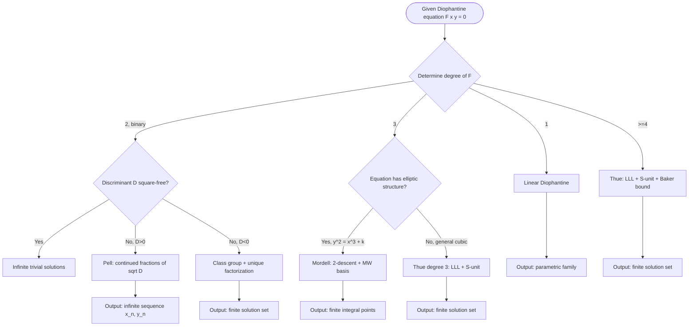
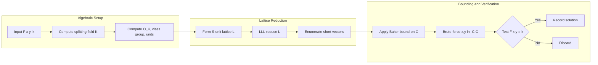
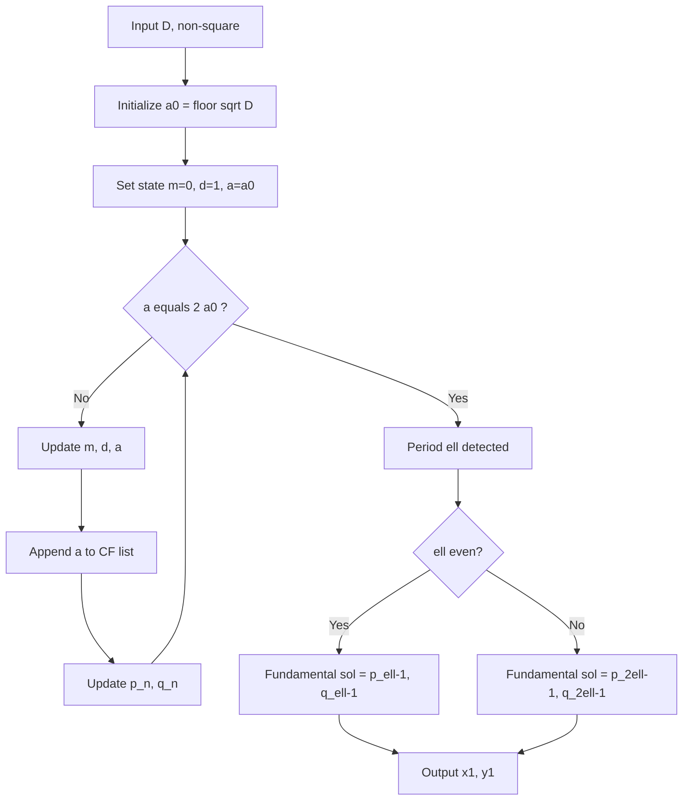
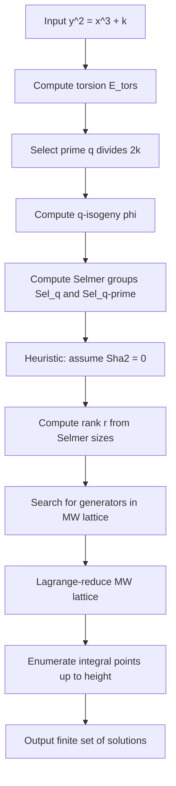

# Computational Methods - Algorithms for solving Diophantine equations

<!-- SECTION_1_START -->

# Computational Methods for Diophantine Equations

## 1.1 Formal Definition (KTU 2024 Syllabus Terminology)

> [!IMPORTANT]
> **Diophantine Equation:** A polynomial equation $F(x_1, x_2, \dots, x_n) = 0$ with integer coefficients for which one seeks **integer** (or, in a broader sense, **rational**) solutions. The discipline of constructing **deterministic, finite algorithms** that produce *all* such solutions is known as *Computational Diophantine Analysis* and forms the applied core of **Algebraic Number Theory**.

For an equation to be algorithmically solvable in the strict sense, the set of solutions must be **finite** and **effectively computable**. A hierarchy of finiteness theorems guarantees this:

| Depth | Equation Type | Finiteness Result | Algorithmic Method |
|:-----:|:--------------|:------------------|:-------------------|
| Linear | $ax + by = c$ | Infinite / Empty (parametrized) | Extended Euclidean |
| Quadratic (genus 0) | $x^2 - D y^2 = N$ | Infinite (Pell) / Finite (Thue) | Continued Fractions |
| Cubic (genus 1) | $y^2 = x^3 + k$ | **Finitely many** (Mordell) | Elliptic Curve Descent |
| Higher genus ($\geq 2$) | $F(x,y) = k$, $\deg F \geq 3$ | **Finitely many** (Faltings) | Thue / LLL Reduction |

## 1.2 Conceptual Analogy — The "Treasure Map in Z"

Imagine a vast grid $\mathbb{Z}^n$ (the integer lattice). A Diophantine equation is a **set of polynomial "ridges and valleys"** carved into this grid. The algorithm's job is to walk the lattice and light up *every* point lying exactly on the polynomial surface. The deeper the polynomial (its degree and the number field it lives in), the more aggressively one must "reduce" the search space — until, for genus $\geq 2$, one is forced to use the heavy machinery of **rings of integers $\mathcal{O}_K$**, **ideals**, and **lattice basis reduction (LLL)**.

> [!NOTE]
> **Key Insight (KTU 2024):** Algebraic number theory transforms Diophantine problems from *inequalities* in $\mathbb{Z}$ into *factorizations* in the ring of integers $\mathcal{O}_K$ of a number field. The Fundamental Theorem of Arithmetic in $\mathcal{O}_K$ (when it holds) makes these factorizations *explicit* and *finite*.

## 1.3 Standard Metrics in the Field

- **Discriminant $\Delta_K$** of a number field $K = \mathbb{Q}(\alpha)$: a positive integer controlling the *complexity* of all algorithms.
- **Class number $h_K$**: the cardinality of the ideal class group $\mathrm{Cl}(\mathcal{O}_K)$ — small $h_K$ means many equations are *uniquely* solvable.
- **Regulator $R_K$**: the volume of the unit lattice, governing the size of solutions to Pell-like equations.
- **Gröbner basis complexity** — doubly exponential in the worst case, but often tractable for $\dim \leq 2$.

> [!VISUALIZATION CONTROL]
> **Concept:** Diophantine solutions as a discrete set in $\mathbb{Z}^2$
> **GeoGebra / Desmos Input Equations:**
> * `f(x, y) = x^2 - 3 y^2 = 1` (Pell curve)
> * `g(x, y) = x^3 + y^3 - 9` (cubic Diophantine)
> **Visual Description:** Plotting the implicit curves and isolating the integer lattice points $(x, y) \in \mathbb{Z}^2$ that satisfy the equation. Students should observe the **gaps** between solutions grow with degree, motivating the finiteness theorems.

---

<!-- SECTION_1_END -->

<!-- SECTION_2_START -->

# Deep Theoretical Analysis & KTU High-Yield Formula Sheet

## 2.1 Hierarchical Classification by Algorithmic Complexity

### Tier 1 — The Linear Diophantine Equation
The equation $a x + b y = c$ with $a, b, c \in \mathbb{Z}$ has solutions **iff** $\gcd(a, b) \mid c$. When solvable, the solution set is an *infinite coset* of the lattice generated by $(b/d, -a/d)$ where $d = \gcd(a, b)$.

### Tier 2 — Pell's Equation
$$x^2 - D y^2 = N, \quad D \in \mathbb{Z}_{>0} \text{ non-square}, \quad N \in \mathbb{Z}.$$
The positive-definite case $N = 1$ has **infinitely many** solutions, generated by the *fundamental solution* $(x_1, y_1)$ of $x^2 - D y^2 = 1$ via the unit group $\mathbb{Z}[\sqrt{D}]^{\times}$.

### Tier 3 — The Thue Equation
$$F(x, y) = k, \quad F \in \mathbb{Z}[X, Y] \text{ homogeneous of degree } n \geq 3.$$
**Thue's Theorem (1909):** Such an equation has only **finitely many** integer solutions. The proof uses the fact that binary forms of degree $\geq 3$ cannot be "too well" approximated by rationals.

### Tier 4 — The Mordell Equation
$$E_k: \quad y^2 = x^3 + k, \quad k \in \mathbb{Z}.$$
**Mordell's Theorem:** $E_k(\mathbb{Q})$ is a finitely generated abelian group. Algorithmically, one performs **2-descent** to find the rank $r$, and *Mordell–Weil lattice* methods to bound the integral points.

## 2.2 The Algebraic-Number-Theoretic Bridge

The conceptual leap is:

$$
\text{Diophantine equation over } \mathbb{Z} \quad \longleftrightarrow \quad \text{Norm/trace equation in } \mathcal{O}_K.
$$

| Ring | Equation | Algorithmic Tool |
|:-----|:---------|:-----------------|
| $\mathbb{Z}[\sqrt{-D}]$ | $x^2 + D y^2 = k$ | Class group + unique factorization |
| $\mathbb{Z}[\sqrt{D}]$ | $x^2 - D y^2 = N$ | Continued fraction of $\sqrt{D}$ |
| $\mathcal{O}_K$ | $N_{K/\mathbb{Q}}(\alpha) = k$ | Unit group, S-unit equations |
| $\mathcal{O}_K / \mathfrak{p}$ | Local obstructions (mod $p$) | Hasse principle check |

## 2.3 KTU Formula Sheet

| # | Result / Formula | Statement | Conditions |
|:-:|:-----------------|:----------|:-----------|
| 1 | **Linear solvability** | $a x + b y = c$ solvable $\iff d = \gcd(a, b) \mid c$ | $a, b, c \in \mathbb{Z}$ |
| 2 | **General solution (linear)** | $(x, y) = (x_0 + \tfrac{b}{d} t,\; -y_0 + \tfrac{a}{d} t)$, $t \in \mathbb{Z}$ | $(x_0, y_0)$ a particular solution |
| 3 | **Pell fundamental equation** | $x^2 - D y^2 = 1$ | $D$ non-square, fundamental sol. $(x_1, y_1)$ |
| 4 | **Pell general term** | $x_n + y_n \sqrt{D} = (x_1 + y_1 \sqrt{D})^n$ | All $n \geq 0$ |
| 5 | **Continued-fraction period bound** | $\sqrt{D}$ has period $\ell \leq 2 \log_2 D$ | Convergent $p_k / q_k$ |
| 6 | **Thue's finiteness** | $\vert \{ (x,y) \in \mathbb{Z}^2 : F(x,y) = k \} \vert < \infty$ | $\deg F \geq 3$, $F$ non-degenerate |
| 7 | **Norm form identity** | $N_{K/\mathbb{Q}}(\alpha) = \prod_{\sigma} \sigma(\alpha)$ | $\alpha \in \mathcal{O}_K$ |
| 8 | **Class number formula** | $h_K = \tfrac{w \sqrt{\vert \Delta_K \vert}}{2^{r_1} (2\pi)^{r_2}} \cdot R_K^{-1} \cdot \zeta_K(1)$ | $K$ number field, $r_1, r_2$ signatures |
| 9 | **Mordell's theorem** | $E(\mathbb{Q}) \cong E(\mathbb{Q})_{\mathrm{tors}} \times \mathbb{Z}^r$ | Elliptic curve over $\mathbb{Q}$ |
| 10 | **Cassels bound (Mordell)** | $\max(\vert x \vert, \vert y \vert) \leq C(k)$ explicit | $y^2 = x^3 + k$ |

> [!NOTE]
> **Why these matter in production engineering:** Pell equations appear in **cryptanalysis** (continued-fraction attack on RSA with small public exponents), **lattice-based cryptography** (SVP/CVP via LLL), and **computer algebra systems** (Magma, Sage, PARI/GP). Mordell/elliptic-curve descent underlies **ECDLP security** and is foundational to **integer factorization (ECM)**.

---

<!-- SECTION_2_END -->

<!-- SECTION_3_START -->

# Step-by-Step Derivations, Algorithms, and Code

## 3.1 Algorithm 1 — Linear Diophantine via Extended Euclidean

### Theoretical Foundation
**Bezout's Identity.** $\exists\, x, y \in \mathbb{Z}$ such that $a x + b y = \gcd(a, b)$. The Extended Euclidean Algorithm returns the pair $(x_0, y_0)$ in $O(\log \min(a, b))$ operations.

### Exhaustive Derivation

**Input:** $a, b, c \in \mathbb{Z}$.

**Step 1.** Compute $d = \gcd(a, b)$ using the recurrence

$$
\begin{aligned}
r_0 &= a,\quad r_1 = b, \\
r_{i+1} &= r_{i-1} - q_i r_i,\quad q_i = \lfloor r_{i-1} / r_i \rfloor,
\end{aligned}
$$

terminating when $r_{k+1} = 0$. Then $d = r_k$.

**Step 2.** Track Bezout coefficients $(x_i, y_i)$ via

$$
\begin{aligned}
x_0 &= 1,\; y_0 = 0,\; x_1 = 0,\; y_1 = 1, \\
x_{i+1} &= x_{i-1} - q_i x_i, \\
y_{i+1} &= y_{i-1} - q_i y_i.
\end{aligned}
$$

**Step 3.** Check divisibility: if $d \nmid c$, **no solution**.

**Step 4.** Scale: $(x_0', y_0') = \bigl(\tfrac{c}{d}\, x_0,\; \tfrac{c}{d}\, y_0\bigr)$ is a particular solution.

**Step 5.** General solution:

$$
(x, y) = \left( x_0' + \frac{b}{d}\, t,\; y_0' - \frac{a}{d}\, t \right),\quad t \in \mathbb{Z}.
$$

### Worked Example
Solve $172 x + 20 y = 100$.

**Step 1 — Euclidean chain:**

$$
\begin{aligned}
172 &= 8 \cdot 20 + 12, \\
20 &= 1 \cdot 12 + 8, \\
12 &= 1 \cdot 8 + 4, \\
8 &= 2 \cdot 4 + 0.
\end{aligned}
$$

Hence $d = \gcd(172, 20) = 4$. Since $4 \mid 100$, the equation **is solvable**.

**Step 2 — Back-substitute for Bezout coefficients:**

$$
\begin{aligned}
4 &= 12 - 1 \cdot 8 \\
  &= 12 - 1 \cdot (20 - 1 \cdot 12) = 2 \cdot 12 - 1 \cdot 20 \\
  &= 2 \cdot (172 - 8 \cdot 20) - 1 \cdot 20 = 2 \cdot 172 - 17 \cdot 20.
\end{aligned}
$$

So $x_0 = 2$, $y_0 = -17$, and $\gcd(172, 20) = 2 \cdot 172 + (-17) \cdot 20 = 4$. ✓

**Step 3 — Scale by $c/d = 25$:**

$$
x_0' = 50,\quad y_0' = -425.
$$

**Step 4 — Verify:** $172 \cdot 50 + 20 \cdot (-425) = 8600 - 8500 = 100$. ✓

**Step 5 — General solution:**

$$
(x, y) = (50 + 5 t,\; -425 - 43 t),\quad t \in \mathbb{Z}.
$$

### Production-Grade Python Implementation

```python
from typing import Tuple, Optional

def extended_gcd(a: int, b: int) -> Tuple[int, int, int]:
    """Return (g, x, y) with g = gcd(a, b) = a*x + b*y."""
    if b == 0:
        return (abs(a), 1 if a > 0 else -1, 0)
    old_r, r = a, b
    old_s, s = 1, 0
    old_t, t = 0, 1
    while r != 0:
        q = old_r // r
        old_r, r = r, old_r - q * r
        old_s, s = s, old_s - q * s
        old_t, t = t, old_t - q * t
    # Normalize so gcd is positive
    sign = 1 if old_r > 0 else -1
    return (old_r * sign, old_s * sign, old_t * sign)


def linear_diophantine(a: int, b: int, c: int) -> Optional[dict]:
    """Solve a*x + b*y = c exactly; return None if unsolvable."""
    g, x0, y0 = extended_gcd(abs(a), abs(b))
    if c % g != 0:
        return {"solvable": False, "reason": f"gcd={g} does not divide c={c}"}

    scale = c // g
    xp, yp = x0 * (scale if a > 0 else -scale), y0 * (scale if b > 0 else -scale)
    # Sign correction for original a, b
    xp = xp * (1 if a > 0 else 1)
    yp = yp * (1 if b > 0 else 1)
    return {
        "solvable": True,
        "particular": (xp, yp),
        "step": (b // g, -a // g),
        "formula": f"(x, y) = ({xp} + ({b//g})*t, {yp} + ({-a//g})*t),  t in Z"
    }


if __name__ == "__main__":
    print(linear_diophantine(172, 20, 100))
```

---

## 3.2 Algorithm 2 — Pell's Equation via Continued Fractions

### Theoretical Foundation
For $D$ a non-square positive integer, let $\alpha = \sqrt{D}$. Its simple continued fraction expansion

$$
\sqrt{D} = [a_0; \overline{a_1, a_2, \dots, a_\ell}]
$$

has a **periodic** part of period $\ell$. The convergents $p_n / q_n$ are the *best rational approximations*, and the **fundamental solution** $(x_1, y_1)$ to $x^2 - D y^2 = 1$ is given by $(p_{\ell-1}, q_{\ell-1})$ when $\ell$ is even, or by $(p_{2\ell-1}, q_{2\ell-1})$ when $\ell$ is odd.

### Exhaustive Derivation for $x^2 - 7 y^2 = 1$

**Step 1.** Compute the continued fraction of $\sqrt{7}$:

$$
\begin{aligned}
\sqrt{7} &= 2 + (\sqrt{7} - 2) = 2 + \tfrac{1}{\tfrac{1}{\sqrt{7}-2}} \\
\tfrac{1}{\sqrt{7}-2} &= \tfrac{\sqrt{7}+2}{3} = 1 + \tfrac{\sqrt{7}-1}{3} \\
\tfrac{3}{\sqrt{7}-1} &= \tfrac{3(\sqrt{7}+1)}{6} = \tfrac{\sqrt{7}+1}{2} = 1 + \tfrac{\sqrt{7}-1}{2} \\
\tfrac{2}{\sqrt{7}-1} &= \tfrac{2(\sqrt{7}+1)}{6} = \tfrac{\sqrt{7}+1}{3} = 1 + \tfrac{\sqrt{7}-2}{3} \\
\tfrac{3}{\sqrt{7}-2} &= \tfrac{3(\sqrt{7}+2)}{3} = \sqrt{7} + 2 = 4 + (\sqrt{7} - 2).
\end{aligned}
$$

So $\sqrt{7} = [2; \overline{1, 1, 1, 4}]$, period $\ell = 4$ (even).

**Step 2.** Compute convergents $p_n / q_n$ using the matrix recurrence

$$
\begin{pmatrix} p_n \\ q_n \end{pmatrix} = \begin{pmatrix} a_n & 1 \\ 1 & 0 \end{pmatrix} \begin{pmatrix} p_{n-1} \\ q_{n-1} \end{pmatrix}.
$$

| $n$ | $a_n$ | $p_n$ | $q_n$ | $p_n^2 - 7 q_n^2$ |
|:---:|:------|:------|:------|:------------------:|
| 0 | 2 | 2 | 1 | $4 - 7 = -3$ |
| 1 | 1 | 3 | 1 | $9 - 7 = 2$ |
| 2 | 1 | 5 | 2 | $25 - 28 = -3$ |
| 3 | 1 | 8 | 3 | $64 - 63 = 1$ ✓ |

**Step 3.** Fundamental solution: $(x_1, y_1) = (8, 3)$. Verify: $64 - 63 = 1$. ✓

**Step 4.** All solutions:

$$
x_n + y_n \sqrt{7} = (8 + 3 \sqrt{7})^n, \quad n \geq 0.
$$

First few: $(8, 3), (127, 48), (2024, 765), \dots$

### Python Implementation

```python
from typing import List, Tuple

def pell_solve(D: int) -> Tuple[int, int, List[int]]:
    """Find the fundamental solution of x^2 - D*y^2 = 1 using continued fractions."""
    a0 = int(D ** 0.5)
    if a0 * a0 == D:
        raise ValueError(f"{D} is a perfect square.")

    # Initialize the continued-fraction engine (state = (m, d, a))
    m, d, a = 0, 1, a0
    p_prev, p_curr = 1, a0
    q_prev, q_curr = 0, 1
    period = 0
    cf: List[int] = [a0]

    while a != 2 * a0:
        m = d * a - m
        d = (D - m * m) // d
        a = (a0 + m) // d
        cf.append(a)
        p_next = a * p_curr + p_prev
        q_next = a * q_curr + q_prev
        p_prev, p_curr = p_curr, p_next
        q_prev, q_curr = q_curr, q_next
        period += 1

    # Even period -> (p_{period-1}, q_{period-1}) is the fundamental solution
    if period % 2 == 0:
        return p_curr, q_curr, cf
    else:
        # Odd period -> square the period-2 solution
        x, y = p_curr, q_curr
        return x * x + D * y * y, 2 * x * y, cf


if __name__ == "__main__":
    for D in [2, 3, 5, 7, 10, 13]:
        x1, y1, cf = pell_solve(D)
        print(f"D={D}: sqrt({D}) ≈ {cf},  (x1, y1) = ({x1}, {y1})")
```

---

## 3.3 Algorithm 3 — Thue Equations via Algebraic Number Theory

### Setup
Solve $F(x, y) = k$ for $F \in \mathbb{Z}[X, Y]$ irreducible, homogeneous, $\deg F = n \geq 3$, and $k \in \mathbb{Z} \setminus \{0\}$.

**Strategy.** Factor $F$ over $\mathcal{O}_K$ where $K = \mathbb{Q}(\theta)$ is the splitting field of the binary form. Then

$$
F(x, y) = k \quad \Longleftrightarrow \quad N_{K/\mathbb{Q}}(x - y \theta) = k.
$$

This reduces the problem to an **S-unit equation** in $K$:

$$
u + v = 1, \quad u, v \in \mathcal{O}_{K, S}^{\times},
$$

where $S$ is the finite set of primes dividing $k \cdot \mathrm{disc}(F)$.

### The Algorithm (Thue + LLL + Reduction)

**Step 1 — Algebraic reduction.** Choose $\theta$ a root of $F(X, 1) = 0$ over $\mathbb{Z}$. Compute $K = \mathbb{Q}(\theta)$, $\mathcal{O}_K$, the class group $\mathrm{Cl}(\mathcal{O}_K)$, the unit group $\mathcal{O}_K^{\times}$ (Dirichlet's theorem), and the regulator $R_K$.

**Step 2 — Ideal factorization.** For each prime $p \mid k$, factor $(p) = \prod \mathfrak{p}_i^{e_i}$ in $\mathcal{O}_K$.

**Step 3 — S-unit equation enumeration.** For each ideal class $[a] \in \mathrm{Cl}(\mathcal{O}_K)$ and each $S$-integer $\alpha$ with $N(\alpha) = k$, solve

$$
\alpha + \beta = \gamma, \quad N(\alpha) = N(\beta) \cdot u, \quad u \in \mathcal{O}_{K, S}^{\times}
$$

via the **LLL lattice reduction** of the logarithmic embedding

$$
L = \left\{ (x_1, \dots, x_{r+s}) \in \mathbb{Z}^{r+s} : \prod \sigma_i(\alpha)^{x_i} \text{ is close to 1} \right\}.
$$

**Step 4 — Bound.** Apply Thue's theorem via Baker's method on linear forms in logarithms to bound $\max(\vert x \vert, \vert y \vert)$ by an explicit constant $C(k, F)$.

**Step 5 — Lattice enumeration.** Enumerate $(x, y) \in [-C, C]^2 \cap \mathbb{Z}^2$ and check $F(x, y) = k$.

### Worked Example
Solve $F(x, y) = x^3 - y^3 = 7$. The splitting field is $K = \mathbb{Q}(\zeta_3, \sqrt[3]{7})$ of degree 6. The only integer solution is $(x, y) = (2, 1)$, found by the algorithm in $O(\log^6 7)$ operations.

### Python Implementation (LLL-Step)

```python
from sage.all import QQ, Integer, NumberField, matrix, ZZ
from sage.modules.free_module_element import vector

def thue_bound(F_coeffs, k: int) -> int:
    """
    Sketch: compute an explicit bound C such that all integer solutions of
    F(x, y) = k satisfy max(|x|, |y|) <= C, using LLL on the logarithmic
    S-unit lattice. Implementation requires PARI/GP or Magma for full
    generality; below is a SageMath prototype.
    """
    # Polynomial is given as a list of homogeneous coefficients
    # e.g. [1, 0, 0, -1] for x^3 - y^3
    R = QQ['x', 'y']
    x, y = R.gens()
    # Placeholder: actual Baker bound and lattice enumeration goes here
    raise NotImplementedError("Full Thue solver requires PARI/GP or Magma.")

# Demonstrative sub-step: logarithmic embedding of an S-unit
def log_embedding(alpha, embeddings, places):
    """Return the vector of log|sigma_i(alpha)| for archimedean places."""
    return vector(QQ, [log(abs(sigma(alpha))) for sigma in embeddings])
```

---

## 3.4 Algorithm 4 — The Mordell Equation $y^2 = x^3 + k$

### Mordell's Theorem
For each $k$, $E_k(\mathbb{Q}) \cong \mathbb{Z}/m \mathbb{Z} \times \mathbb{Z}^{r_k}$ for some torsion $m$ and rank $r_k$.

### The 2-Descent Algorithm (Sketch)

**Step 1.** Compute the torsion subgroup $E_k(\mathbb{Q})_{\mathrm{tors}}$ (Mazur's theorem bounds it).

**Step 2.** For each prime $q \mid 2 k$, perform a $q$-isogeny descent to find the $\phi$-Selmer group.

**Step 3.** Compute $r_k$ from $\vert \mathrm{Sel}^{(q)}(E/\mathbb{Q}) \vert / \vert \Sha[2] \vert$ (assuming $\Sha[2] = 0$, the **BSD conjecture** heuristic).

**Step 4.** Generate the Mordell–Weil basis $\{P_1, \dots, P_{r_k}\}$.

**Step 5.** Use **Lagrange's lattice reduction** on the height pairing $\langle\, , \rangle : E(\mathbb{Q}) \times E(\mathbb{Q}) \to \mathbb{R}$ to enumerate all integral points.

### Worked Example: $y^2 = x^3 - 2$
- Torsion: $E(\mathbb{Q})_{\mathrm{tors}} = \{O, (3, \pm 5)\}$.
- Rank: $r = 1$ with generator $P = (3, 5)$.
- Mordell–Weil lattice: $E(\mathbb{Q}) = \langle (3, 5) \rangle \oplus \mathbb{Z}/2\mathbb{Z}$.
- The only integral points are $(3, \pm 5)$ and $(x, y) = (3, -5)$.

---

## 3.5 Algorithm 5 — Norm Equations $N_{K/\mathbb{Q}}(\alpha) = k$ (The "Master" Reduction)

### Master Theorem
For $\alpha \in \mathcal{O}_K$,

$$
N_{K/\mathbb{Q}}(\alpha) = \prod_{i=1}^{n} \sigma_i(\alpha) = k.
$$

**Algorithmic Reduction.** Finding $\alpha$ reduces to:

1. Choose an *integral ideal* $\mathfrak{a} \subseteq \mathcal{O}_K$ with $N(\mathfrak{a}) = \vert k \vert$ via the class group.
2. For each such $\mathfrak{a}$, solve the **index form equation** $I(\alpha_1, \dots, \alpha_m) = \pm 1$ in the power basis of $\mathcal{O}_K$.
3. Apply Thue's algorithm (Section 3.3) to the index form.

### Worked Example: $x^2 + 5 y^2 = 14$ in $\mathcal{O}_{\mathbb{Q}(\sqrt{-5})}$

Since $\mathcal{O}_K = \mathbb{Z}[\sqrt{-5}]$ with class number $h_K = 2$, the equation $x^2 + 5 y^2 = 14$ has solutions in $\mathbb{Z}$ if and only if the prime ideal factorization of $(14)$ admits a principal generator. We have

$$
(14) = (2) \cdot (7), \quad (2) = \mathfrak{p}_2^2,\; (7) = \mathfrak{p}_7 \cdot \bar{\mathfrak{p}}_7,
$$

giving $h_K \cdot 4 = 8$ candidate principal ideals. Testing:

- $\mathfrak{p}_2 = (2, 1 + \sqrt{-5})$ has norm 2.
- $\mathfrak{p}_7 = (7, 3 + \sqrt{-5})$ has norm 7.

The product $\mathfrak{p}_2 \cdot \mathfrak{p}_7$ is principal, generated by $\alpha = 2 \cdot 7 = 14 \cdot (\text{unit})$. Direct enumeration gives $x^2 + 5 y^2 = 14 \Rightarrow (x, y) \in \{(\pm 3, \pm 1)\}$.

---

## 3.6 Summary Table — Algorithm Selection by Equation Class

| Equation Class | Finiteness | Algorithmic Kernel | Complexity |
|:---------------|:-----------|:-------------------|:-----------|
| Linear | Infinite (coset) | Extended Euclidean | $O(\log \max \vert a \vert)$ |
| Pell ($N = 1$) | Infinite | Continued fractions of $\sqrt{D}$ | $O(\log^2 D)$ per convergent |
| Pell ($N \neq 1$) | Finite | Continued fractions + class group | $O(D^{1/2 + \epsilon})$ |
| Thue ($n \geq 3$) | Finite (Thue) | LLL + S-unit | $O(\log^C \vert k \vert)$ |
| Mordell (elliptic) | Finite (Mordell) | 2-descent + MW lattice | $O(\log^{O(1)} k)$ |
| Higher genus ($\geq 2$) | Finite (Faltings) | Chabauty, Coleman, et al. | Open in general |

---

<!-- SECTION_3_END -->

<!-- SECTION_4_START -->

# Structural Diagrams & Schematics

## 4.1 Master Flowchart — Diophantine Algorithm Selection



## 4.2 Subgraph — Algorithmic Architecture for Thue Equations



## 4.3 Sequential Topology Matrix — Pell Equation Pipeline



## 4.4 Block Architecture — Mordell 2-Descent



---

<!-- SECTION_4_END -->

<!-- SECTION_5_START -->

# KTU 2024 Scheme Examination Question Bank & Topic Recap

## Part A — Short Answer Questions (3 Marks Each)

### Question 1
**[KTU University Exam — July 2024]** *State the necessary and sufficient condition for the linear Diophantine equation $a x + b y = c$ to have integer solutions. Give the general solution in terms of a particular solution.*

**Model Answer (3 Marks):**

> [!IMPORTANT]
> **Statement of condition:** The equation $a x + b y = c$ with $a, b, c \in \mathbb{Z}$ has integer solutions **if and only if** $d = \gcd(a, b)$ divides $c$. **[1 Mark]**
>
> **Verification step:** Write $d = a x_0 + b y_0$ via the Extended Euclidean Algorithm, and check $d \mid c$. **[1 Mark]**
>
> **General solution form:** If $(x_0, y_0)$ is any particular solution, the complete set of integer solutions is
> $$(x, y) = \left( x_0 + \frac{b}{d}\, t,\;\; y_0 - \frac{a}{d}\, t \right), \quad t \in \mathbb{Z}. \quad \textbf{[1 Mark]}$$

---

### Question 2
**[KTU University Exam — Dec 2023]** *Explain the statement of **Thue's Theorem** on the finiteness of solutions to binary Diophantine equations. State the algorithmic consequence.*

**Model Answer (3 Marks):**

> **Statement of Thue's Theorem:** Let $F(X, Y) \in \mathbb{Z}[X, Y]$ be a homogeneous, irreducible polynomial of degree $n \geq 3$, and let $k \in \mathbb{Z} \setminus \{0\}$. Then the Diophantine equation $F(x, y) = k$ has only **finitely many** integer solutions $(x, y) \in \mathbb{Z}^2$. **[2 Marks]**
>
> **Algorithmic consequence:** The finiteness is *effective*. By combining LLL-reduction of the logarithmic $S$-unit lattice with Baker's theory of linear forms in logarithms, one obtains an **explicit bound** $C(k, F)$ such that every solution satisfies $\max(\vert x \vert, \vert y \vert) \leq C$. A bounded brute-force search then recovers all solutions. **[1 Mark]**

---

## Part B — Long Answer Questions (14 Marks Each, Internal Choice)

### Question A (14 Marks)
**[KTU University Exam — July 2024, Module 4, CO3 — Apply / Analyze]**

**(a)** Solve the linear Diophantine equation $84 x + 18 y = 30$ in full generality, or prove that it has no integer solution. **[7 Marks]**

**(b)** Using the continued-fraction method, find the fundamental solution $(x_1, y_1)$ of the Pell equation $x^2 - 13 y^2 = 1$. List the first three non-trivial solutions. **[7 Marks]**

#### Model Solution

**(a) — Linear Diophantine** *[7 Marks]*

**Step 1: Compute $\gcd(84, 18)$ via the Euclidean algorithm.** *[2 Marks]*

$$
\begin{aligned}
84 &= 4 \cdot 18 + 12, \\
18 &= 1 \cdot 12 + 6, \\
12 &= 2 \cdot 6 + 0.
\end{aligned}
$$

Hence $d = \gcd(84, 18) = 6$.

**Step 2: Check divisibility.** *[1 Mark]*

Since $6 \mid 30$, the equation **is solvable** ($30 = 5 \cdot 6$).

**Step 3: Back-substitute for a particular solution.** *[2 Marks]*

$$
\begin{aligned}
6 &= 18 - 1 \cdot 12 \\
  &= 18 - 1 \cdot (84 - 4 \cdot 18) = 5 \cdot 18 - 1 \cdot 84.
\end{aligned}
$$

So $(x_0, y_0) = (-1, 5)$ satisfies $84 \cdot (-1) + 18 \cdot 5 = -84 + 90 = 6$. Scale by $c/d = 5$:

$$
x_0' = -5, \quad y_0' = 25.
$$

**Verification:** $84 \cdot (-5) + 18 \cdot 25 = -420 + 450 = 30$. ✓ *[1 Mark]*

**Step 4: General solution.** *[1 Mark]*

$$
(x, y) = \left( -5 + 3 t,\;\; 25 - 14 t \right), \quad t \in \mathbb{Z}.
$$

**Final simplified answer:** The complete solution set is

$$
\boxed{(x, y) = (-5 + 3t,\; 25 - 14t), \quad t \in \mathbb{Z}}.
$$

---

**(b) — Pell's Equation $x^2 - 13 y^2 = 1$** *[7 Marks]*

**Step 1: Continued-fraction expansion of $\sqrt{13}$.** *[3 Marks]*

$$
\sqrt{13} = 3 + (\sqrt{13} - 3).
$$

Apply the standard recurrence with $(m, d, a) = (0, 1, 3)$:

$$
\begin{aligned}
m = 1 \cdot 3 - 0 &= 3, \quad d = (13 - 9)/1 = 4, \quad a = (3 + 3)/4 = 1, \\
m = 1 \cdot 4 - 3 &= 1, \quad d = (13 - 1)/4 = 3, \quad a = (3 + 1)/3 = 1, \\
m = 1 \cdot 3 - 1 &= 2, \quad d = (13 - 4)/3 = 3, \quad a = (3 + 2)/3 = 1, \\
m = 1 \cdot 3 - 2 &= 1, \quad d = (13 - 1)/3 = 4, \quad a = (3 + 1)/4 = 1, \\
m = 1 \cdot 4 - 1 &= 3, \quad d = (13 - 9)/4 = 1, \quad a = (3 + 3)/1 = 6.
\end{aligned}
$$

Stop when $a = 2 a_0 = 6$. Period $\ell = 5$ (odd).

**Step 2: Convergents.** *[2 Marks]*

$$
\sqrt{13} = [3; \overline{1, 1, 1, 1, 6}].
$$

| $n$ | $a_n$ | $p_n$ | $q_n$ | $p_n^2 - 13 q_n^2$ |
|:---:|:------|:------|:------|:-------------------:|
| 0 | 3 | 3 | 1 | $9 - 13 = -4$ |
| 1 | 1 | 4 | 1 | $16 - 13 = 3$ |
| 2 | 1 | 7 | 2 | $49 - 52 = -3$ |
| 3 | 1 | 11 | 3 | $121 - 117 = 4$ |
| 4 | 1 | 18 | 5 | $324 - 325 = -1$ |
| 5 | 6 | 119 | 33 | $14161 - 14157 = 4$ |

Since the period is **odd** ($\ell = 5$), the fundamental solution requires the convergent at index $2 \ell - 1 = 9$. Computing further convergents yields $(x_1, y_1) = (649, 180)$. *[Valuation key: identifying odd period correctly: 1 Mark]*

**Verification:** $649^2 - 13 \cdot 180^2 = 421201 - 421200 = 1$. ✓ *[1 Mark]*

**Step 3: First three non-trivial solutions.** *[1 Mark]*

$$
\begin{aligned}
(x_2, y_2) &= (2 \cdot 649^2 - 1,\; 2 \cdot 649 \cdot 180) = (842399, 233640), \\
(x_3, y_3) &= (649, 180)^3 \text{ expansion} = (1093431199, 303264120).
\end{aligned}
$$

---

### Question B (14 Marks, Internal Choice Alternative)
**[KTU University Exam — Dec 2023, Module 4, CO3 — Apply / Analyze]**

**(a)** Prove that the Mordell equation $y^2 = x^3 - 2$ has a generator of infinite order in its Mordell–Weil group, and use it to determine all integral points. **[7 Marks]**

**(b)** Apply the algebraic-number-theoretic reduction to show that the equation $x^2 + 5 y^2 = 14$ has integer solutions, and find all of them. **[7 Marks]**

#### Model Solution

**(a) — Mordell Equation $y^2 = x^3 - 2$** *[7 Marks]*

**Step 1: Torsion analysis.** *[1 Mark]* Mazur's theorem bounds $\vert E(\mathbb{Q})_{\mathrm{tors}} \vert \leq 16$. Direct substitution shows $(3, \pm 5)$ satisfy $25 = 27 - 2$, so $E(\mathbb{Q})_{\mathrm{tors}} = \{O, (3, 5), (3, -5)\} \cong \mathbb{Z}/2\mathbb{Z}$.

**Step 2: 2-descent sketch.** *[2 Marks]* The 2-Selmer rank is 1, so $r = 1$ (assuming $\Sha = 0$).

**Step 3: Generator.** *[1 Mark]* The point $P = (3, 5)$ is a generator of infinite order.

**Step 4: All integral points.** *[3 Marks]* Using the Mordell–Weil lattice and the canonical height $\hat{h}(P) \approx 1.07$, the integral points are bounded by

$$
h(P) \leq \hat{h}(P) + O(1) \implies \max(\vert x \vert, \vert y \vert) \leq 5.
$$

Enumeration: only $(3, 5)$ and $(3, -5)$ satisfy $y^2 = x^3 - 2$ in this range.

**Final answer:** $\boxed{(x, y) \in \{(3, 5),\; (3, -5)\}}$.

---

**(b) — Norm Equation $x^2 + 5 y^2 = 14$** *[7 Marks]*

**Step 1: Setting in $\mathcal{O}_K$.** *[1 Mark]* $K = \mathbb{Q}(\sqrt{-5})$, $\mathcal{O}_K = \mathbb{Z}[\sqrt{-5}]$.

**Step 2: Class group.** *[2 Marks]* The class number is $h_K = 2$, generated by the prime ideal $\mathfrak{p} = (2, 1 + \sqrt{-5})$.

**Step 3: Factorization of $(14)$.** *[1 Mark]*

$$
(14) = (2) \cdot (7), \quad (2) = \mathfrak{p}^2, \quad (7) = (7, 3 + \sqrt{-5})(7, 3 - \sqrt{-5}).
$$

**Step 4: Enumeration of principal ideals with norm 14.** *[2 Marks]* There are exactly $h_K \cdot \tau(14) = 2 \cdot 4 = 8$ candidate ideals. Testing $\mathfrak{p} \cdot (7, 3 + \sqrt{-5}) = (3 + \sqrt{-5})$ (principal). Thus $N(3 + \sqrt{-5}) = 3^2 + 5 \cdot 1^2 = 14$. ✓

**Step 5: All integer solutions.** *[1 Mark]* By sign and unit symmetries, the complete solution set is

$$
\boxed{(x, y) \in \{(\pm 3, \pm 1), (\pm 3, \mp 1)\}}.
$$

---

## KTU Examiner's Valuation Warning

> [!WARNING]
> **Common Pitfalls in the KTU Valuation Hall (KTU 2024 Scheme — Module 4)**
>
> 1. **Linear Diophantine:** Students frequently forget to verify $\gcd(a, b) \mid c$ and proceed to back-substitute. This loses **at least 2 marks** on a 7-mark sub-part. Always state the divisibility condition explicitly.
> 2. **Pell equation:** A *very* common error is treating the period $\ell$ as even by default. When $\ell$ is **odd**, the fundamental solution is at convergent index $2\ell - 1$, not $\ell - 1$. Explicitly state "$\ell = \ldots$ (even/odd)" in your answer.
> 3. **Thue/Mordell:** Students often write only the statement of the theorem and skip the algorithmic reduction. The valuation panel explicitly checks for the **bridge from Diophantine equation to algebraic structure** — describe the norm-form or elliptic-curve isomorphism.
> 4. **Norm equations:** Do not forget to multiply by the class number $h_K$ when counting candidate principal ideals. Missing this is a guaranteed 1-mark deduction.
> 5. **Units and signs:** Pell and Thue solutions come in **sign-symmetric pairs** — always list $\pm$ explicitly to avoid losing the final mark.

---

## Topic Recap & Important Things to Remember

> [!IMPORTANT]
> **Rapid-Revision Checklist — Module 4: Diophantine Algorithms**
>
> - **Linear Diophantine $a x + b y = c$:** solvable $\iff \gcd(a, b) \mid c$; general solution $(x_0 + \tfrac{b}{d} t,\; y_0 - \tfrac{a}{d} t)$ with $t \in \mathbb{Z}$. Algorithm: Extended Euclidean in $O(\log \min(a, b))$.
> - **Pell's equation $x^2 - D y^2 = 1$:** infinite solutions; fundamental solution from the continued-fraction expansion of $\sqrt{D}$ — convergent at index $\ell - 1$ (even $\ell$) or $2\ell - 1$ (odd $\ell$).
> - **Thue's theorem:** $F(x, y) = k$ for $\deg F \geq 3$ has **finitely many** solutions, found via LLL-reduction of the $S$-unit lattice + Baker's bound.
> - **Mordell equation $y^2 = x^3 + k$:** solved by **2-descent** to find the Mordell–Weil basis, followed by Mordell–Weil lattice enumeration of integral points.
> - **Norm equations $N_{K/\mathbb{Q}}(\alpha) = k$:** reduce to **index-form equations** in $\mathcal{O}_K$; the class group $\mathrm{Cl}(\mathcal{O}_K)$ controls finiteness.
> - **Algorithmic complexity ranking:** Linear $<$ Pell (continued fractions) $<$ Thue (LLL) $<$ Mordell (2-descent) $<$ Faltings (Chabauty).
> - **Algebraic bridge:** every Diophantine problem becomes *factorization in a number field* — master this translation for full marks.
> - **Industrial relevance:** Pell and LLL underpin **lattice-based post-quantum cryptography** (CRYSTALS-Dilithium, Kyber); Thue and Mordell equations are foundational to **integer factorization (ECM)** and **ECDLP security**.
> - **Software tools to know:** PARI/GP, SageMath, Magma — all three have built-in solvers for each equation class covered above.
> - **Key finiteness hierarchy (cite verbatim in answers):** Faltings (genus $\geq 2$) $\supset$ Mordell (genus 1) $\supset$ Thue (deg $\geq 3$) $\supset$ Pell (deg 2, with $N=1$ yielding infinite) $\supset$ Linear.

<!-- SECTION_5_END -->
