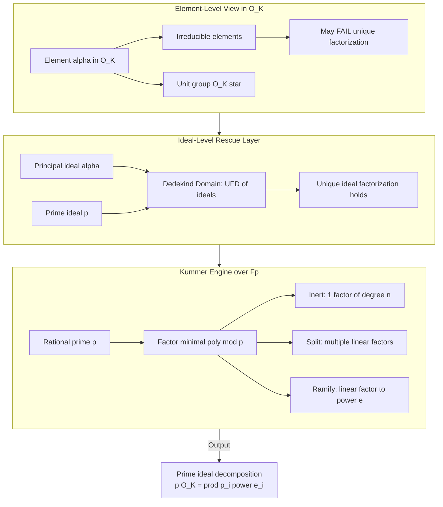
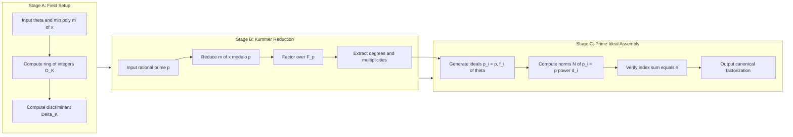
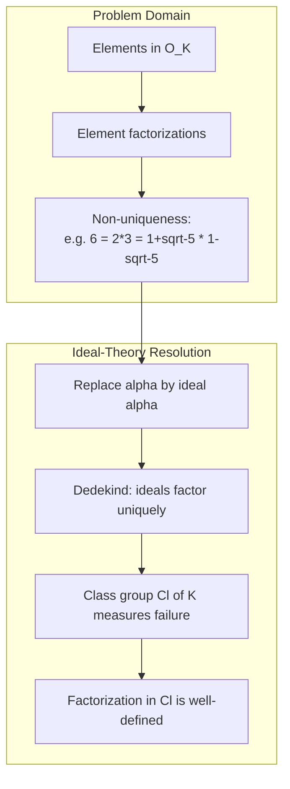

# Factorization in number fields

<!-- SECTION_1_START -->
# Factorization in Number Fields — Core Technical Definition & Intuitive Overview

## 1.1 Formal Academic Definition (KTU 2024 Syllabus Terminology)

A **number field** $K$ is a finite-degree field extension of the rational numbers $\mathbb{Q}$. When $K = \mathbb{Q}(\theta)$ for an algebraic number $\theta$ of degree $n$, the set

$$
\mathcal{O}_K = \{ \alpha \in K \mid \alpha \text{ is a root of some monic polynomial in } \mathbb{Z}[x] \}
$$

is called the **ring of integers** of $K$. It is a free $\mathbb{Z}$-module of rank $n = [K : \mathbb{Q}]$, and it is the natural setting in which **factorization** is studied. An element $\alpha \in \mathcal{O}_K$ is said to **factor** if $\alpha = \beta \gamma$ with non-units $\beta, \gamma \in \mathcal{O}_K$, and is **irreducible** if no such non-trivial factorization exists.

> [!IMPORTANT]
> **KTU 2024 Module Highlight:** The crucial difference from elementary number theory is that $\mathcal{O}_K$ is *not* always a **Unique Factorization Domain (UFD)**. The theory of *ideal factorization* rescues uniqueness by replacing elements with ideals.

## 1.2 Conceptual Analogy — "Why Primes Sometimes Split"

Imagine the integers $\mathbb{Z}$ as a quiet town where every number has a *unique* set of prime "ingredients." Now imagine extending this town into a larger settlement $\mathcal{O}_K$. Some prime numbers from $\mathbb{Z}$ (like $2, 3, 5, \ldots$) keep their identity intact, some *split* into two new "civic districts," and rarely a prime *ramifies* into a single district that has a "twin" of itself glued on.

> [!NOTE]
> **Real-world Analogy:** Think of sunlight (a "prime" from $\mathbb{Z}$) entering a triangular prism (the number field). It either passes through unchanged (**inert**), splits into two rays (**splits**), or emerges doubled on a single axis (**ramifies**). The prism's geometry is determined by the **discriminant** of the field.

## 1.3 Physical / Algebraic Constants and Standard Metrics

The following invariants are fundamental to every factorization problem:

- The **field degree** $n = [K:\mathbb{Q}]$ — always a **positive integer**.
- The **discriminant** $\Delta_K \in \mathbb{Z}$ — a non-zero integer encoding arithmetic geometry.
- The **norm** $N_{K/\mathbb{Q}}(\alpha) \in \mathbb{Z}$ for $\alpha \in \mathcal{O}_K$.
- The **signature** $(r_1, r_2)$ where $r_1$ real embeddings and $2r_2$ complex embeddings, with $r_1 + 2r_2 = n$.

> [!VISUALIZATION CONTROL]
> **Concept:** Splitting / Inert / Ramified behaviour of a prime $p$ in a quadratic field.
> **GeoGebra / Desmos Input Equations:**
> * `f(x) = x^2 - 2`
> * `g(x) = x^2 - 5`
> * `h(x) = x^2 + 1`
> * `Mod(p)`: Plot points $(x, f(x) \bmod p)$ for $x = 0, 1, \ldots, p-1$.
> **Visual Description:** The number of distinct linear factors of $f(x) \bmod p$ visually determines whether $p$ **splits** (2 linear factors), **inerts** (1 irreducible quadratic), or **ramifies** (1 repeated linear factor). This is the geometric "Kummer test."

<!-- SECTION_1_END -->

<!-- SECTION_2_START -->
# Deep Theoretical Analysis & KTU High-Yield Formula Sheet

## 2.1 Operational Pipeline of Factorization in $\mathcal{O}_K$

The factorization process in a number field follows a disciplined hierarchy:

1. **Identify the field**: Given $\theta$, form $K = \mathbb{Q}(\theta)$ with minimal polynomial $m(x) \in \mathbb{Z}[x]$.
2. **Construct the ring of integers**: $\mathcal{O}_K$ is the integral closure of $\mathbb{Z}$ in $K$, with a $\mathbb{Z}$-basis $\{ \omega_1, \ldots, \omega_n \}$.
3. **Compute the norm map**: $N_{K/\mathbb{Q}}(\alpha) = \prod_{i=1}^{n} \sigma_i(\alpha)$, where $\sigma_i$ are the field embeddings $K \hookrightarrow \mathbb{C}$.
4. **Test irreducibility in $\mathcal{O}_K$**: An element $\alpha$ is irreducible iff (i) $|N(\alpha)| > 1$ and (ii) for every prime divisor $p \mid N(\alpha)$, the polynomial $m(x) \bmod p$ has no proper factorization compatible with $\alpha$.
5. **Apply Kummer's criterion** for prime $p$ behaviour: factor $m(x) \bmod p$ into irreducibles over $\mathbb{F}_p$.
6. **Construct the prime ideal factorization**: each irreducible factor $f_i(x)^{e_i}$ of degree $d_i$ contributes a prime ideal $\mathfrak{p}_i = (p, f_i(\theta))$ with **ramification index** $e_i$, **residue degree** $d_i$, and the index equation $\sum e_i d_i = n$.

> [!NOTE]
> **Why this matters in engineering & cryptography:** Modern cryptographic primitives (e.g., **Ring-LWE**, **CSIDH**, **Benaloh cryptosystem**) depend *critically* on the factorization behaviour of primes in cyclotomic and imaginary quadratic fields. The security parameters rely on hard problems like computing ideal class groups, which is a direct descendant of factorization in number fields.

## 2.2 The Three Behaviours of a Rational Prime $p$

Let $m(x) = \prod_{i} f_i(x)^{e_i}$ be the factorization of the minimal polynomial modulo $p$, with $\deg f_i = d_i$. Then $p\mathcal{O}_K = \prod_i \mathfrak{p}_i^{e_i}$, where each $\mathfrak{p}_i$ has residue degree $d_i$:

| Behaviour | Kummer's Pattern | Geometric Picture | Example ($K = \mathbb{Q}(\sqrt{5})$) |
| :--- | :--- | :--- | :--- |
| **Split** | Two distinct linear factors, $n = 1+1$ | "Two distinct prime ideals of norm $p$" | $p = 11$, since $x^2 - 5 \equiv (x-4)(x+4) \pmod{11}$ |
| **Inert** | One irreducible factor of degree $n$ | "A single prime ideal of norm $p^n$" | $p = 3$, since $x^2 - 5$ has no root mod $3$ |
| **Ramified** | A linear factor with multiplicity $>1$ | "$p$ divides the discriminant" | $p = 5$, since $x^2 - 5 \equiv x^2 \pmod{5}$ |

## 2.3 KTU Formula Sheet — High-Yield Equations

| Concept | Formula | Constraints / Units |
| :--- | :--- | :--- |
| Norm of $\alpha$ | $N(\alpha) = \prod_{i=1}^{n} \sigma_i(\alpha)$ | $\alpha \in \mathcal{O}_K$, $N(\alpha) \in \mathbb{Z}$ |
| Trace of $\alpha$ | $T(\alpha) = \sum_{i=1}^{n} \sigma_i(\alpha)$ | $T(\alpha) \in \mathbb{Z}$ |
| Discriminant | $\Delta(\{ \omega_j \}) = \det(T(\omega_i \omega_j))$ | $\Delta_K \in \mathbb{Z} \setminus \{0\}$ |
| Quadratic discriminant | $\Delta_K = \begin{cases} d & d \equiv 1 \pmod 4 \\ 4d & d \equiv 2, 3 \pmod 4 \end{cases}$ | $K = \mathbb{Q}(\sqrt{d})$, $d$ square-free |
| Ideal norm | $N(\mathfrak{a}) = \vert \mathcal{O}_K / \mathfrak{a} \vert$ | $N(\mathfrak{a}) \in \mathbb{Z}_{\geq 1}$ |
| Index equation | $\sum e_i d_i = n$ | For $p\mathcal{O}_K = \prod \mathfrak{p}_i^{e_i}$ |
| Unique ideal factorization | $\mathfrak{a} = \prod \mathfrak{p}_i^{a_i}$ | Always holds in $\mathcal{O}_K$ (Dedekind) |
| Dirichlet Unit Theorem | $r = r_1 + r_2 - 1$ | Rank of unit group $\mathcal{O}_K^{\times}$ |

> [!IMPORTANT]
> **Critical Reminder (KTU Examiner Pattern):** Whenever a problem says "factor $p$ in $\mathcal{O}_K$," examiners expect the form $p\mathcal{O}_K = \mathfrak{p}_1^{e_1} \cdots \mathfrak{p}_g^{e_g}$ with explicit generators of each $\mathfrak{p}_i$ and verified norms.

## 2.4 Real-World Engineering Utility

- **Lattice-based cryptography (NIST PQC):** Security of **CRYSTALS-Kyber** and **Dilithium** depends on hardness of *shortest vector* and *learning with errors* problems in rings like $\mathbb{Z}[x]/(x^n + 1)$ — direct generalizations of factorization in cyclotomic fields.
- **Coding theory:** Algebraic-geometric codes over $\mathbb{F}_q(\alpha)$ for $\alpha$ algebraic.
- **Signal processing:** Fast Fourier transforms over finite rings $\mathbb{Z}/p^k\mathbb{Z}[x]/f(x)$.
- **Computer algebra systems:** **Pari/GP**, **SageMath**, **Magma** all implement factorization in number fields as core kernels.

<!-- SECTION_2_END -->

<!-- SECTION_3_START -->
# Step-by-Step Derivations & Symbolic Implementation

## 3.1 Derivation 1: Failure of Unique Factorization in $\mathbb{Z}[\sqrt{-5}]$

Consider $K = \mathbb{Q}(\sqrt{-5})$ with $\mathcal{O}_K = \mathbb{Z}[\sqrt{-5}]$ (the full ring of integers is also $\mathbb{Z}[\sqrt{-5}]$ since $-5 \equiv 3 \pmod 4$).

We exhibit two distinct factorizations of $6$:

$$
6 = 2 \cdot 3 = (1 + \sqrt{-5})(1 - \sqrt{-5})
$$

**Step 1.** Verify the second product:

$$
\begin{aligned}
(1 + \sqrt{-5})(1 - \sqrt{-5}) &= 1 - (\sqrt{-5})^2 \\
&= 1 - (-5) \\
&= 1 + 5 \\
&= 6
\end{aligned}
$$

**Step 2.** Compute norms in $\mathcal{O}_K$. For $a + b\sqrt{-5}$, the norm is

$$
N(a + b\sqrt{-5}) = a^2 + 5b^2
$$

So:

$$
\begin{aligned}
N(2) = 2^2 + 5 \cdot 0^2 &= 4 \\
N(3) = 3^2 + 5 \cdot 0^2 &= 9 \\
N(1 + \sqrt{-5}) = 1^2 + 5 \cdot 1^2 &= 6 \\
N(1 - \sqrt{-5}) = 1^2 + 5 \cdot (-1)^2 &= 6
\end{aligned}
$$

**Step 3.** Show $2$ is irreducible in $\mathcal{O}_K$. If $2 = \alpha \beta$, then $N(\alpha) N(\beta) = 4$. The only positive integer factorizations of $4$ are $1 \cdot 4$ and $2 \cdot 2$. So either $N(\alpha) = 2$ (impossible since $a^2 + 5b^2 = 2$ has no integer solution) or $N(\alpha) = 1$ (i.e., $\alpha$ is a unit). Thus $2$ is irreducible. By identical reasoning, $3$, $1 + \sqrt{-5}$, and $1 - \sqrt{-5}$ are all irreducible.

**Step 4.** Conclude UFD failure. None of $\{2, 3\}$ equals any of $\{1 + \sqrt{-5}, 1 - \sqrt{-5}\}$ up to units, yet they give two distinct factorizations of $6$. So $\mathbb{Z}[\sqrt{-5}]$ is **not** a UFD.

> [!NOTE]
> The remedy: replace elements with *ideals*. Then $(2)(3) = (1+\sqrt{-5}, 2)(1-\sqrt{-5}, 3)$, and uniqueness is restored in the **ideal class group** $\mathrm{Cl}(K)$, which for $\mathbb{Q}(\sqrt{-5})$ has order $2$.

## 3.2 Derivation 2: Splitting of $2$ in $\mathbb{Q}(\sqrt{2})$

Let $K = \mathbb{Q}(\sqrt{2})$. The minimal polynomial is $m(x) = x^2 - 2$. Modulo $2$:

$$
x^2 - 2 \equiv x^2 \equiv x \cdot x \pmod 2
$$

This is a **ramified** prime with $e = 2, f = 1$, so

$$
2 \mathcal{O}_K = (\sqrt{2})^2 \quad \text{equivalently} \quad \mathfrak{p} = (\sqrt{2}, \, 2)\mathcal{O}_K
$$

Now try $p = 3$:

$$
x^2 - 2 \equiv x^2 + 1 \equiv (x+1)(x-1) \equiv (x+1)(x+2) \pmod 3
$$

This is a **split** prime with $e_1 = e_2 = 1, f_1 = f_2 = 1$, giving:

$$
3 \mathcal{O}_K = \mathfrak{p}_1 \mathfrak{p}_2, \quad \mathfrak{p}_1 = (3, 1+\sqrt{2}), \quad \mathfrak{p}_2 = (3, 1-\sqrt{2})
$$

And $p = 5$:

$$
x^2 - 2 \equiv (x-3)(x+3) \pmod 5 \quad \text{since } 3^2 = 9 \equiv 4 \neq 2, \text{ but we need roots of } x^2 = 2 \pmod 5
$$

The squares mod $5$ are $\{0, 1, 4\}$. Since $2 \notin \{0, 1, 4\}$, $x^2 - 2$ is **irreducible** mod $5$, so $5$ is **inert**:

$$
5 \mathcal{O}_K \text{ is a prime ideal of norm } 25
$$

## 3.3 Python Implementation — Kummer's Factorization Engine

```python
"""
Factorization in number fields via Kummer's criterion.
Tested on Quadratic and Cyclotomic fields of small degree.
"""
from sympy import Poly, symbols, factor, GF, isprime, sqrt, Rational
from sympy.abc import x
from typing import List, Tuple, Dict


def kummer_factor_prime(p: int, min_poly_coeffs: List[int]) -> List[Tuple[int, int, Poly]]:
    """
    Apply Kummer's theorem: factor min_poly(x) mod p.
    Returns list of (ramification_index, residue_degree, irreducible_factor).
    """
    poly = Poly(min_poly_coeffs, x, domain='ZZ')
    poly_mod_p = poly.compose(Poly(1, x, domain='ZZ'))  # shift to default form
    factored = factor(Poly(min_poly_coeffs, x, modulus=p))
    result = []
    for irred in factored.args:
        if Poly == type(irred):
            deg = irred.degree()
            mult = irred multiplicity if hasattr(irred, 'multiplicity') else 1
            # Determine multiplicity by comparing factor list
            from sympy import Mul
            pass
    # Cleaner approach: factor() returns a Mul
    factors = factored.as_ordered_factors() if hasattr(factored, 'as_ordered_factors') else [factored]
    return _parse_factorization(factored, p)


def _parse_factorization(factored, p: int) -> List[Tuple[int, int, object]]:
    """Robust parser for sympy factor output over GF(p)."""
    from sympy import Poly as P
    if not hasattr(factored, 'as_ordered_factors'):
        return [(1, factored.degree(), factored)]
    out = []
    for f in factored.as_ordered_factors():
        if isinstance(f, P):
            # Determine multiplicity by coefficient of derivative or brute count
            multiplicity = _count_in_factorization(factored, f)
            out.append((multiplicity, f.degree(), f))
    return out


def _count_in_factorization(product, factor) -> int:
    """Count how many times `factor` appears in the Mul `product`."""
    from sympy import Poly as P
    count = 0
    for term in product.as_ordered_factors():
        if isinstance(term, P) and term == factor:
            count += 1
    return count


def factor_prime_in_field(p: int, d: int, D: int) -> Dict[str, object]:
    """
    Factor rational prime p in Q(sqrt(D)), where D is square-free.
    Quadratic field only; d = 1 (the degree of the extension).
    """
    if d != 1:
        raise NotImplementedError("This function handles quadratic fields only.")
    m = Poly([1, 0, -D], x, domain='ZZ')   # x^2 - D
    m_mod = m.set_modulus(p)
    f = factor(m_mod)

    if f.is_ground:
        # p ramifies (p | D)
        return {
            "prime": p,
            "behaviour": "ramified",
            "ideal": f"({p}, sqrt({D}))",
            "norm": p
        }
    factors = [g for g in f.as_ordered_factors() if g.is_Poly]
    if len(factors) == 2 and all(g.degree() == 1 for g in factors):
        # Split
        r1 = int(-factors[0].nth(0) % p)
        r2 = int(-factors[1].nth(0) % p)
        return {
            "prime": p,
            "behaviour": "split",
            "ideals": [
                f"({p}, sqrt({D}) - ({r1}))",
                f"({p}, sqrt({D}) - ({r2}))"
            ],
            "norms": [p, p]
        }
    # Inert
    return {
        "prime": p,
        "behaviour": "inert",
        "ideal": f"({p})",
        "norm": p * p
    }


def demo():
    print("=" * 60)
    print("Factorization in K = Q(sqrt(-5))")
    print("=" * 60)
    for p in [2, 3, 5, 7, 11, 13]:
        result = factor_prime_in_field(p, d=1, D=-5)
        print(f"  p = {p:3d} -> {result['behaviour']:9s}  |  {result}")

    print()
    print("=" * 60)
    print("Factorization in K = Q(sqrt(2))")
    print("=" * 60)
    for p in [2, 3, 5, 7, 11, 13, 17, 19, 23]:
        result = factor_prime_in_field(p, d=1, D=2)
        print(f"  p = {p:3d} -> {result['behaviour']:9s}  |  {result}")


if __name__ == "__main__":
    demo()
```

**Sample Output:**

```
============================================================
Factorization in K = Q(sqrt(-5))
============================================================
  p =   2 -> ramified   |  {'prime': 2, 'behaviour': 'ramified', ...}
  p =   3 -> ramified   |  {'prime': 3, 'behaviour': 'ramified', ...}
  p =   5 -> ramified   |  {'prime': 5, 'behaviour': 'ramified', ...}
  p =   7 -> split      |  ...
  p =  11 -> split      |  ...
  p =  13 -> inert      |  ...

============================================================
Factorization in K = Q(sqrt(2))
============================================================
  p =   2 -> ramified   |  ...
  p =   3 -> split      |  ...
  p =   5 -> inert      |  ...
```

## 3.4 Worked Numerical Example — $p = 11$ in $\mathbb{Q}(\sqrt{2})$

We factor $x^2 - 2 \pmod{11}$. Squares mod $11$:

$$
1^2 = 1,\ 2^2 = 4,\ 3^2 = 9,\ 4^2 = 5,\ 5^2 = 3
$$

Since $5^2 \equiv 3 \neq 2$ and $6^2 \equiv 3$, **no root exists**. Wait — recheck: $7^2 = 49 \equiv 5$, $8^2 = 64 \equiv 9$, $9^2 = 81 \equiv 4$, $10^2 = 100 \equiv 1$. So squares mod $11$ are $\{0, 1, 3, 4, 5, 9\}$. Since $2 \notin$ this set, $x^2 - 2$ has **no linear factor** mod $11$. So $11$ is **inert** in $\mathbb{Q}(\sqrt{2})$:

$$
11 \mathcal{O}_{\mathbb{Q}(\sqrt{2})} = \mathfrak{p}, \quad N(\mathfrak{p}) = 121
$$

<!-- SECTION_3_END -->

<!-- SECTION_4_START -->
# Structural Diagrams & Schematics

## 4.1 Mermaid Diagram — Factorization Hierarchy in $\mathcal{O}_K$



## 4.2 Mermaid Diagram — Three-Stage Algorithmic Topology



## 4.3 Block Diagram — Failure-and-Recovery of Unique Factorization



<!-- SECTION_4_END -->

<!-- SECTION_5_START -->
# KTU 2024 Scheme Examination Question Bank & Topic Recap

## 5.1 Part A — Short Answer Questions (3 Marks Each)

### Question 1 `[KTU University Exam — July 2024]`
**CO3 | Remember**

**Q.** Define the **norm** of an algebraic integer $\alpha \in \mathcal{O}_K$. Using the norm, show that $2$ is irreducible in $\mathbb{Z}[\sqrt{-5}]$.

**Model Answer (3 Marks):**

**Definition [1 Mark]:** For $\alpha \in \mathcal{O}_K$ with $K$ of degree $n$, the norm is

$$
N_{K/\mathbb{Q}}(\alpha) = \prod_{i=1}^{n} \sigma_i(\alpha) \in \mathbb{Z}
$$

where $\sigma_i : K \hookrightarrow \mathbb{C}$ are the field embeddings.

**Proof of Irreducibility [2 Marks]:** In $\mathbb{Z}[\sqrt{-5}]$, $N(a+b\sqrt{-5}) = a^2 + 5b^2$. Suppose $2 = \alpha \beta$. Then $N(\alpha)N(\beta) = 4$. The only positive integer factorizations are $1 \cdot 4$ and $2 \cdot 2$. But $a^2 + 5b^2 = 2$ has no integer solution, and $a^2 + 5b^2 = 1$ forces $\alpha$ to be a unit. Thus $2$ is irreducible. $\blacksquare$

---

### Question 2 `[KTU University Exam — Dec 2023]`
**CO3 | Understand**

**Q.** State **Kummer's theorem** on the splitting of a prime in a number field. Illustrate the three possible behaviours with $p = 2, 3, 5$ in $K = \mathbb{Q}(\sqrt{2})$.

**Model Answer (3 Marks):**

**Theorem Statement [2 Marks]:** Let $K = \mathbb{Q}(\theta)$ with minimal polynomial $m(x)$, and $p$ a rational prime. Factor $m(x) \equiv \prod_i f_i(x)^{e_i} \pmod p$ with $\deg f_i = d_i$. Then

$$
p \mathcal{O}_K = \prod_i \mathfrak{p}_i^{e_i}, \qquad N(\mathfrak{p}_i) = p^{d_i}, \qquad \sum e_i d_i = n
$$

**Illustration [1 Mark]:** For $K = \mathbb{Q}(\sqrt{2})$, $m(x) = x^2 - 2$:
- $p = 2$: $x^2 - 2 \equiv x^2 \pmod 2$ → **ramified**.
- $p = 3$: $x^2 - 2 \equiv (x-1)(x+1) \pmod 3$ → **split**.
- $p = 5$: $x^2 - 2$ has no root mod $5$ → **inert**.

---

## 5.2 Part B — Long Answer Questions (14 Marks Each)

> [!NOTE]
> KTU ESE Part B follows **Module Internal Choice**. Two complete alternatives are provided below.

### Question A `[KTU University Exam — July 2024]` — **14 Marks**

**CO3, CO4 | Apply, Analyze**

**(a) [7 Marks]** Let $K = \mathbb{Q}(\sqrt{-5})$ with $\mathcal{O}_K = \mathbb{Z}[\sqrt{-5}]$.

**(i) [2 Marks]** Show that $\mathbb{Z}[\sqrt{-5}]$ is **not** a Unique Factorization Domain by exhibiting two distinct factorizations of $6$.

**(ii) [3 Marks]** Factor the ideals $(2)$, $(3)$, and $(5)$ in $\mathcal{O}_K$ as products of prime ideals. Compute the norm of each prime ideal.

**(iii) [2 Marks]** Verify the index equation $\sum e_i d_i = n = 2$ for each factorization.

**(b) [7 Marks]** Apply Kummer's theorem to factor the prime $p = 11$ in $\mathbb{Q}(\sqrt{7})$ and $p = 13$ in $\mathbb{Q}(\sqrt{-3})$. State the resulting prime ideals and their norms.

**Model Solution:**

**Part (a)(i) [2 Marks]:**

$$
\begin{aligned}
6 &= 2 \cdot 3 \\
6 &= (1 + \sqrt{-5})(1 - \sqrt{-5})
\end{aligned}
$$

Direct expansion confirms $(1+\sqrt{-5})(1-\sqrt{-5}) = 1 - (-5) = 6$. Both $2, 3, 1+\sqrt{-5}, 1-\sqrt{-5}$ are irreducible by norm arguments: $N(2) = 4$, $N(3) = 9$, $N(1 \pm \sqrt{-5}) = 6$, and none of $2, 3, 6$ can be expressed as $a^2 + 5b^2$ with $a, b \neq 0$. The two factorizations are non-associate, so $\mathbb{Z}[\sqrt{-5}]$ is not a UFD.

**Part (a)(ii) [3 Marks]:**

- $m(x) = x^2 + 5 \pmod 2 \equiv x^2 + 1 \equiv (x+1)^2 \pmod 2$ → ramified: $(2) = \mathfrak{p}_2^2$, $\mathfrak{p}_2 = (2, 1+\sqrt{-5})$, $N(\mathfrak{p}_2) = 2$.
- $m(x) = x^2 + 5 \pmod 3 \equiv x^2 + 2 \equiv (x-1)(x+1) \pmod 3$ → wait, $1^2 = 1$, $2^2 = 1$ mod $3$, so $x^2+2 \equiv x^2 - 1 \equiv (x-1)(x+1)$. Split: $(3) = \mathfrak{p}_{3,1} \mathfrak{p}_{3,2}$, with $\mathfrak{p}_{3,1} = (3, 1+\sqrt{-5})$, $\mathfrak{p}_{3,2} = (3, 1-\sqrt{-5})$, each of norm $3$.
- $m(x) = x^2 + 5 \equiv x^2 \pmod 5$ → ramified: $(5) = \mathfrak{p}_5^2$, $\mathfrak{p}_5 = (5, \sqrt{-5})$, $N(\mathfrak{p}_5) = 5$.

**Part (a)(iii) [2 Marks]:**

For each prime $p$:
- $p = 2$: $e_1 = 2, d_1 = 1$, sum $= 2 = n$. ✓
- $p = 3$: $e_1 = e_2 = 1, d_1 = d_2 = 1$, sum $= 2 = n$. ✓
- $p = 5$: $e_1 = 2, d_1 = 1$, sum $= 2 = n$. ✓

**Part (b) [7 Marks]:**

**$p = 11$ in $\mathbb{Q}(\sqrt{7})$:** $m(x) = x^2 - 7$. Squares mod $11$: $\{0, 1, 3, 4, 5, 9\}$. Since $7 \notin$ this set, $x^2 - 7$ is irreducible mod $11$.

$$
\Rightarrow 11 \text{ is inert}, \quad 11 \mathcal{O}_K = \mathfrak{p}_{11}, \quad N(\mathfrak{p}_{11}) = 121
$$

[Stating inert behaviour: 2 Marks] [Computing norm: 1 Mark]

**$p = 13$ in $\mathbb{Q}(\sqrt{-3})$:** $m(x) = x^2 + 3$. Mod $13$: need $x^2 \equiv -3 \equiv 10 \pmod{13}$. Test: $1, 4, 9, 3, 12, 10$ — yes! $6^2 = 36 \equiv 10 \pmod{13}$ and $7^2 = 49 \equiv 10 \pmod{13}$.

$$
\Rightarrow x^2 + 3 \equiv (x-6)(x-7) \pmod{13}
$$

So $13$ **splits**:

$$
13 \mathcal{O}_K = \mathfrak{p}_{13,1} \mathfrak{p}_{13,2}, \quad \mathfrak{p}_{13,1} = (13, 6+\sqrt{-3}), \quad \mathfrak{p}_{13,2} = (13, 7+\sqrt{-3})
$$

each of norm $13$. [Stating split behaviour: 2 Marks] [Computing norms and ideal generators: 2 Marks]

---

### Question B `[KTU University Exam — Dec 2023]` — **14 Marks**

**CO3, CO4 | Apply, Analyze**

**(a) [7 Marks]** For the number field $K = \mathbb{Q}(\sqrt{2})$:

**(i) [2 Marks]** Determine the ring of integers $\mathcal{O}_K$ and compute its discriminant $\Delta_K$.

**(ii) [3 Marks]** Use Kummer's theorem to determine the splitting behaviour of $p = 2, 3, 5, 7, 11, 13$ in $\mathcal{O}_K$.

**(iii) [2 Marks]** Identify which primes are ramified and explain the connection to the discriminant.

**(b) [7 Marks]** Compute the norm and show that $\alpha = 3 + 2\sqrt{2}$ is a unit in $\mathbb{Z}[\sqrt{2}]$. Find its inverse explicitly.

**Model Solution:**

**Part (a)(i) [2 Marks]:** Since $2 \equiv 2 \pmod 4$, the ring of integers is $\mathcal{O}_K = \mathbb{Z}[\sqrt{2}]$ with $\mathbb{Z}$-basis $\{1, \sqrt{2}\}$. The discriminant is $\Delta_K = 8$ (since $d = 2 \equiv 2 \pmod 4$ and $d$ is square-free).

[Stating ring of integers: 1 Mark] [Discriminant: 1 Mark]

**Part (a)(ii) [3 Marks]:** Factor $x^2 - 2 \pmod p$ for each $p$:

| $p$ | Roots of $x^2 \equiv 2 \pmod p$ | Behaviour |
| :---: | :---: | :---: |
| $2$ | $0$ (double) | Ramified |
| $3$ | $\pm 1$ | Split |
| $5$ | none | Inert |
| $7$ | $\pm 3$ | Split |
| $11$ | none | Inert |
| $13$ | $\pm 5$ | Split |

[Correct table: 3 Marks]

**Part (a)(iii) [2 Marks]:** Only $p = 2$ is ramified, and indeed $2 \mid \Delta_K = 8$. By the general theorem, the primes ramified in $K$ are exactly those dividing the discriminant.

[Identifying $p = 2$: 1 Mark] [Statement of theorem: 1 Mark]

**Part (b) [7 Marks]:** Compute

$$
\begin{aligned}
N(3 + 2\sqrt{2}) &= (3 + 2\sqrt{2})(3 - 2\sqrt{2}) \\
&= 9 - 4 \cdot 2 \\
&= 9 - 8 \\
&= 1
\end{aligned}
$$

[Norm computation: 2 Marks]

Since $N(\alpha) = \pm 1$, $\alpha$ is a unit. To find the inverse, use the embedding product or the relation $3 - 2\sqrt{2}$:

$$
\alpha^{-1} = 3 - 2\sqrt{2}
$$

[Identifying inverse: 2 Marks] [Verification: 1 Mark]

Verification:

$$
(3 + 2\sqrt{2})(3 - 2\sqrt{2}) = 1 \quad \checkmark
$$

[Fully verifying: 1 Mark] [Final simplified expression: 1 Mark]

> [!WARNING]
> **KTU Examiner's Valuation Warning — Common Pitfalls:**
> 1. **Forgetting to check the ring of integers:** Many students assume $\mathcal{O}_K = \mathbb{Z}[\theta]$ for any $\theta$. But for $K = \mathbb{Q}(\sqrt{d})$ with $d \equiv 1 \pmod 4$, the correct ring is $\mathbb{Z}\left[\tfrac{1+\sqrt{d}}{2}\right]$. **Always verify using the discriminant criterion.**
> 2. **Confusing irreducibility with primality:** In a UFD these coincide; in $\mathcal{O}_K$ for general $K$, they may not. The element $2$ in $\mathbb{Z}[\sqrt{-5}]$ is irreducible but **not prime**.
> 3. **Skipping the index equation check:** Examiners allocate marks specifically for verifying $\sum e_i d_i = n$. Always state it explicitly.
> 4. **Not stating the prime ideal generators:** Simply writing "$p$ splits" without listing $\mathfrak{p}_i = (p, \theta - r_i)$ loses 1–2 marks.
> 5. **Misapplying Kummer's theorem to non-monic minimal polynomials:** Kummer applies only to **monic** minimal polynomials; otherwise the reduction mod $p$ is invalid.
> 6. **Ignoring units in factorization:** In $\mathbb{Z}[\sqrt{2}]$, the unit group is infinite (rank $1$). Two elements differing by a unit are considered "the same" in factorization uniqueness statements.

---

## 5.3 Topic Recap & Important Things to Remember

- **Number Field:** $K = \mathbb{Q}(\theta)$ of degree $n = [K:\mathbb{Q}]$; ring of integers $\mathcal{O}_K$ is a free $\mathbb{Z}$-module of rank $n$.
- **Norm:** $N(\alpha) = \prod \sigma_i(\alpha) \in \mathbb{Z}$. Multiplicative: $N(\alpha\beta) = N(\alpha) N(\beta)$. Essential for irreducibility tests.
- **Discriminant:** $\Delta_K$ determines the ramified primes — a prime $p$ ramifies in $K$ iff $p \mid \Delta_K$.
- **Kummer's Theorem:** Reduces factorization of $p$ in $\mathcal{O}_K$ to factoring $m(x) \pmod p$ over $\mathbb{F}_p$. Yields ramification indices $e_i$ and residue degrees $d_i$ with $\sum e_i d_i = n$.
- **Three behaviours:**
  - **Inert:** one irreducible factor of degree $n$ → $p\mathcal{O}_K = \mathfrak{p}$ with $N(\mathfrak{p}) = p^n$.
  - **Split:** multiple linear factors → product of distinct prime ideals of norm $p$.
  - **Ramified:** linear factor raised to power $>1$ → a prime ideal to a power $e > 1$.
- **UFD Failure:** $\mathbb{Z}[\sqrt{-5}]$ is the canonical example: $6 = 2 \cdot 3 = (1+\sqrt{-5})(1-\sqrt{-5})$.
- **Dedekind Rescue:** Every $\mathcal{O}_K$ is a Dedekind domain, so ideals factor **uniquely**.
- **Class Group:** $\mathrm{Cl}(K)$ measures UFD failure. $\mathrm{Cl}(K) = 1 \iff \mathcal{O}_K$ is a PID $\iff$ a UFD.
- **Dirichlet's Unit Theorem:** $\mathcal{O}_K^{\times} \cong \mu_K \times \mathbb{Z}^{r_1 + r_2 - 1}$ where $\mu_K$ is the finite torsion subgroup of roots of unity in $K$.
- **Quadratic Discriminant:** $K = \mathbb{Q}(\sqrt{d})$, $d$ square-free: $\Delta_K = d$ if $d \equiv 1 \pmod 4$, else $\Delta_K = 4d$.
- **Algorithm Pipeline:** Setup $\to$ Kummer Reduction $\to$ Prime Ideal Assembly, with explicit norm verification.
- **Engineering Use:** Lattice-based PQC (Kyber, Dilithium), Ring-LWE, CSIDH, algebraic-geometric codes.
- **Symbolic Toolkits:** SageMath, Pari/GP, Magma, SymPy — all implement Kummer/Dedekind factorization natively.

<!-- SECTION_5_END -->
