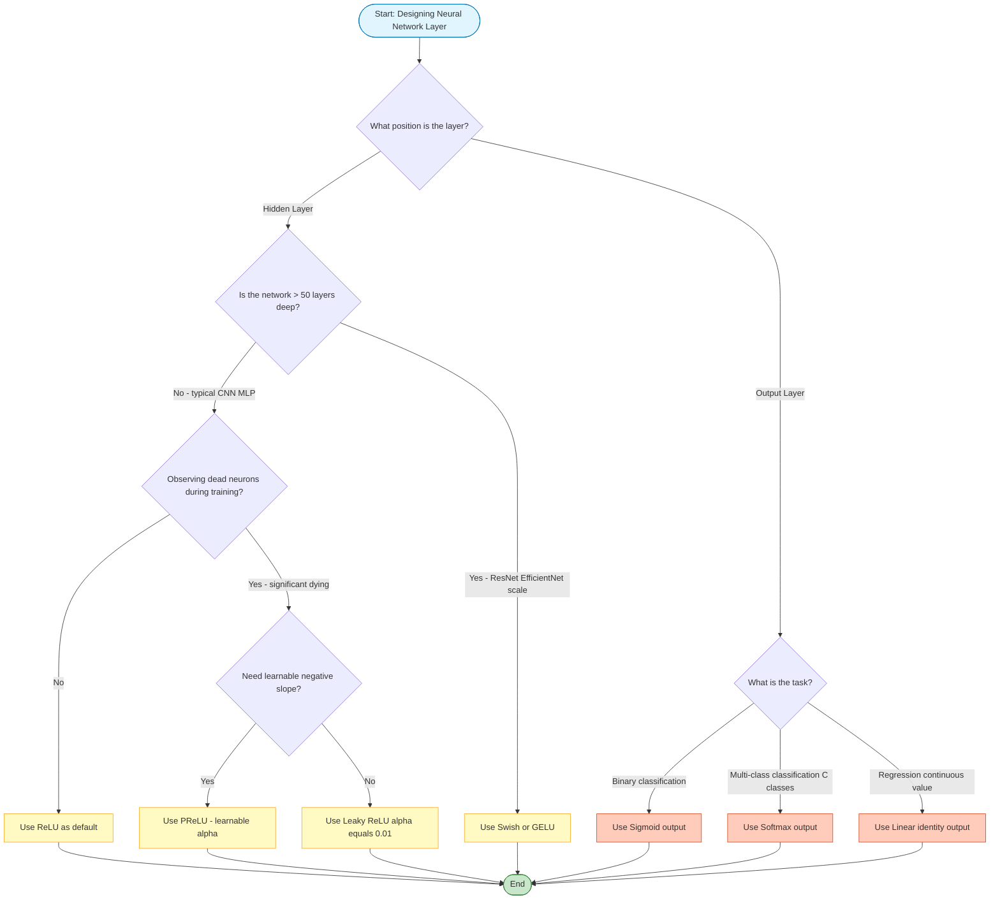
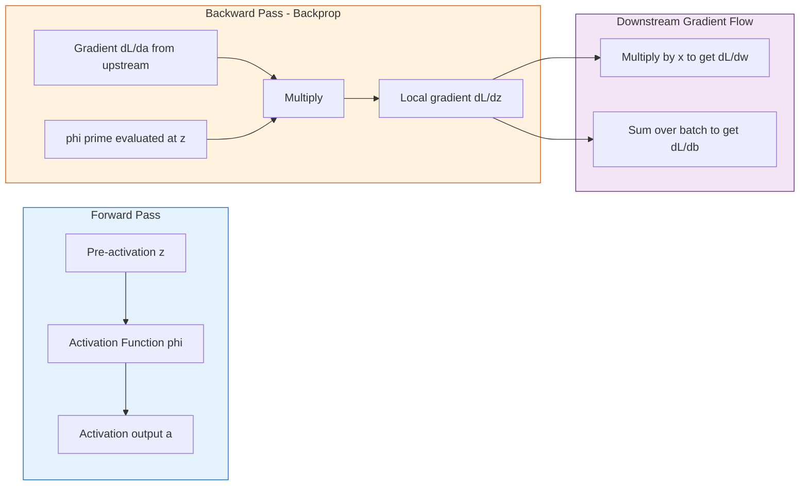
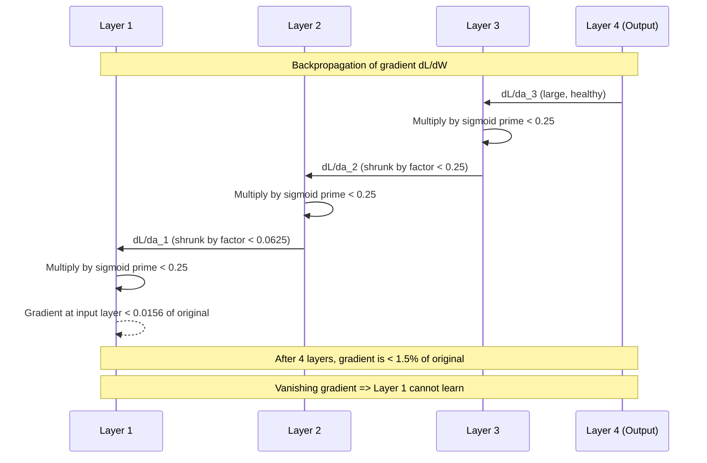
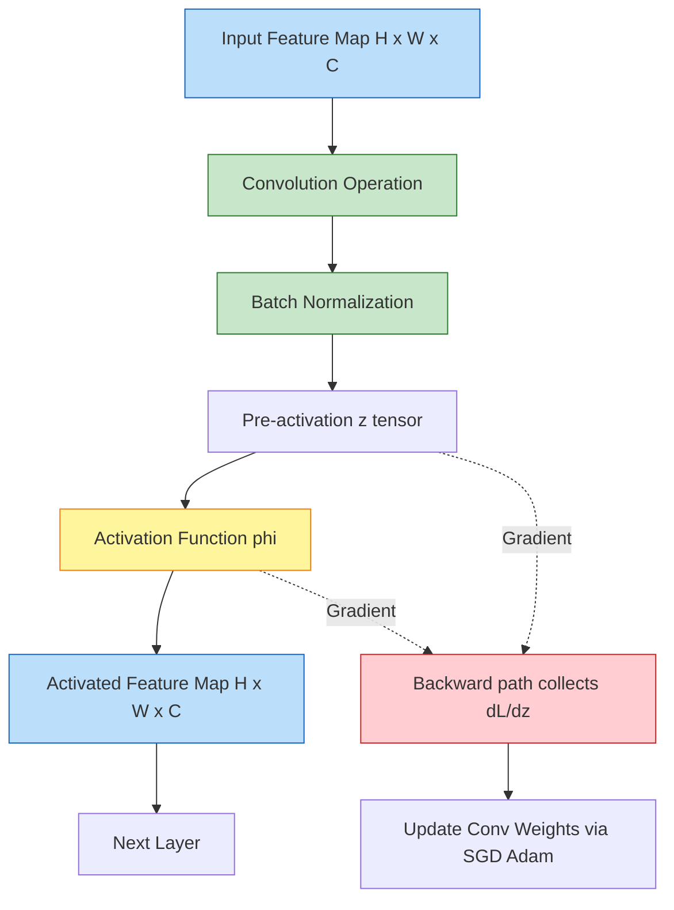

# Activation functions

<!-- SECTION_1_START -->
# Activation Functions — Core Technical Definition & Intuitive Overview

## Formal Academic Definition (KTU 2024 Syllabus Terminology)

An **Activation Function** in an artificial neural network is a mathematical non-linear (or selectively linear) transformation applied to the weighted sum of inputs at a neuron, formally expressed as:

$$y = \phi\left(\sum_{i=1}^{n} w_i x_i + b\right) = \phi(\mathbf{w}^{T}\mathbf{x} + b)$$

where $\phi(\cdot)$ denotes the activation function, $w_i$ are the synaptic weights, $x_i$ are the input features, and $b$ is the bias term. The activation function is responsible for introducing **non-linearity** into the network, enabling the Universal Approximation Theorem to hold — i.e., allowing a finite neural network to approximate any continuous function on a compact domain to an arbitrary degree of accuracy.

> [!IMPORTANT]
> **KTU 2024 Scheme High-Yield Definition:** Without a non-linear activation function, a deep neural network collapses mathematically into a single linear transformation, regardless of the number of hidden layers stacked. The depth of the network becomes computationally wasteful.

---

## Conceptual Analogy & Intuition

Imagine a **firing neuron in the human brain** — it does not respond proportionally to every tiny electrical signal. Instead, it has a **threshold**: it stays quiet until input crosses a critical level, then *fires strongly*. Activation functions are the mathematical embodiment of this thresholding behavior.

| Analogy Element | Neural Network Counterpart |
|---|---|
| Brain's firing threshold | Activation function output |
| Resting potential ($-70$ mV) | Output at low input |
| Action potential spike | Saturated output region |
| Synaptic strength | Weight $w_i$ |
| Summation of dendrite signals | $\sum w_i x_i + b$ |

> [!NOTE]
> **Plain English Intuition:** An activation function is a *decision gate* — it takes the neuron's "raw opinion" (linear combination) and decides *how strongly* and *in what manner* the neuron should pass the signal forward. Some gates are sharp (ReLU), some are smooth (Sigmoid), and some are asymmetric (ELU).

---

## Role in a Neural Network: The Three Critical Purposes

1. **Introducing Non-Linearity:** Allows the network to learn complex, non-linear decision boundaries (e.g., XOR, curved class separations in image space).
2. **Bounded Output Control:** Keeps neuron outputs within stable numerical ranges, preventing runaway activations that would destabilize training.
3. **Gradient Flow Modulation:** Determines how gradients flow backward during backpropagation, directly affecting convergence speed and stability.

---

## Taxonomy of Activation Functions (Bird's-Eye View)

Activation functions are classified along three orthogonal axes:

1. **By Output Range:** Bounded (Sigmoid: $[0,1]$, Tanh: $[-1,1]$) vs. Unbounded (ReLU: $[0, \infty)$).
2. **By Differentiability:** Smooth (Sigmoid, Tanh) vs. Piece-wise (ReLU, Leaky ReLU) vs. Discontinuous (Binary Step — *not used in modern DL*).
3. **By Use-Case Position:** Hidden layer activations (ReLU family) vs. Output layer activations (Softmax for multi-class, Sigmoid for binary, Linear for regression).

> [!VISUALIZATION CONTROL]
> **Concept:** Comparison of canonical activation function curves on the Cartesian plane
> **GeoGebra / Desmos Input Equations:**
> * `f1(x) = 1/(1+exp(-x))`  — Sigmoid
> * `f2(x) = (exp(x)-exp(-x))/(exp(x)+exp(-x))` — Tanh
> * `f3(x) = max(0, x)` — ReLU
> * `f4(x) = x` — Identity (Linear)
> **Visual Description:** On the $x$-axis, plot input $z \in [-5, 5]$. The student should observe the S-curve of Sigmoid/Tanh *saturating* at the extremes, ReLU *clipping* all negative inputs to zero, and the Linear function remaining unbounded. Note the *flat tails* of Sigmoid and Tanh — this is where the *vanishing gradient* problem originates.

---

## Physical Constants & Standard Metrics

- **Euler's number:** $e \approx 2.71828$ (foundational to Sigmoid/Softmax).
- **Leaky ReLU default slope:** $\alpha = 0.01$.
- **Sigmoid midpoint:** $x = 0 \Rightarrow \sigma(0) = 0.5$.
- **Tanh midpoint:** $x = 0 \Rightarrow \tanh(0) = 0$ (zero-centered — an architectural advantage over Sigmoid).
- **Softmax probability invariant:** $\sum_{i=1}^{C} \text{Softmax}(z_i) = 1.0$ (used for $C$ mutually exclusive classes).

<!-- SECTION_1_END -->

<!-- SECTION_2_START -->
# Deep Theoretical Analysis & KTU High-Yield Formula Sheet

## 2.1 The Universal Mathematical Formulation

For a pre-activation value $z = \mathbf{w}^{T}\mathbf{x} + b$, every activation function can be evaluated as $a = \phi(z)$. The derivative $\phi'(z)$ is mandatory for backpropagation since the chain rule demands:

$$\frac{\partial \mathcal{L}}{\partial w_i} = \frac{\partial \mathcal{L}}{\partial a} \cdot \frac{\partial a}{\partial z} \cdot \frac{\partial z}{\partial w_i} = \frac{\partial \mathcal{L}}{\partial a} \cdot \phi'(z) \cdot x_i$$

If $\phi'(z) \to 0$ in a region, the gradient vanishes — and the network cannot learn.

---

## 2.2 Detailed Theoretical Breakdown of Each Major Activation

### A. Sigmoid (Logistic Function)

**Mathematical form:**
$$\sigma(z) = \frac{1}{1 + e^{-z}}$$

**Derivative (analytical form):**
$$\sigma'(z) = \sigma(z) \cdot \left(1 - \sigma(z)\right)$$

**Theoretical properties:**
- **Range:** $(0, 1)$ — strictly excludes $0$ and $1$, which is a known weakness.
- **Saturates** for $\vert z \vert > 4$, producing near-zero gradients.
- **Non-zero-centered** output, causing zig-zag gradient updates during SGD.
- Historically used in **output layer for binary classification** (logistic regression).

> [!NOTE]
> **The Sigmoid Derivative Identity:** The self-referential form $\sigma'(z) = \sigma(z)(1-\sigma(z))$ is one of the most computation-efficient derivative formulas in deep learning, requiring only a single multiply after the forward pass.

### B. Tanh (Hyperbolic Tangent)

**Mathematical form:**
$$\tanh(z) = \frac{e^{z} - e^{-z}}{e^{z} + e^{-z}}$$

**Derivative:**
$$\tanh'(z) = 1 - \tanh^{2}(z)$$

**Theoretical properties:**
- **Range:** $(-1, 1)$ — **zero-centered**, making it strictly superior to Sigmoid for hidden layers.
- Still saturates for large $\vert z \vert$, retaining the vanishing-gradient issue.
- Strictly related to Sigmoid by the identity $\tanh(z) = 2\sigma(2z) - 1$.

### C. ReLU (Rectified Linear Unit) — The Modern Default

**Mathematical form:**
$$\text{ReLU}(z) = \max(0, z)$$

**Derivative (sub-gradient at $z=0$):**
$$\text{ReLU}'(z) = \begin{cases} 1 & \text{if } z > 0 \\ 0 & \text{if } z \leq 0 \end{cases}$$

**Theoretical properties:**
- **Range:** $[0, \infty)$ — unbounded above, providing efficient gradient flow.
- **Computational cost:** $O(1)$ — a single max comparison; ~6$\times$ faster than Sigmoid in practice.
- **Sparsity-inducing:** Approximately $50\%$ of activations are exactly zero in trained networks, providing implicit regularization.
- **Weakness: "Dying ReLU" problem** — neurons that enter the $z \leq 0$ region permanently output $0$ and receive zero gradient, becoming permanently inactive. With aggressive learning rates, up to $40\%$ of neurons can "die".

### D. Leaky ReLU & Parametric ReLU (PReLU)

**Mathematical form:**
$$\text{LeakyReLU}(z) = \begin{cases} z & \text{if } z > 0 \\ \alpha z & \text{if } z \leq 0 \end{cases}$$

**Derivative:**
$$\text{LeakyReLU}'(z) = \begin{cases} 1 & \text{if } z > 0 \\ \alpha & \text{if } z \leq 0 \end{cases}$$

**Theoretical properties:**
- $\alpha$ is a fixed small constant (typically $0.01$) in Leaky ReLU.
- In **PReLU**, $\alpha$ becomes a *learnable parameter*, optimized via backpropagation.
- **Eliminates the dying ReLU problem** by ensuring a non-zero gradient even when $z < 0$.

### E. ELU (Exponential Linear Unit)

**Mathematical form:**
$$\text{ELU}(z) = \begin{cases} z & \text{if } z \geq 0 \\ \alpha\left(e^{z} - 1\right) & \text{if } z < 0 \end{cases}$$

**Derivative:**
$$\text{ELU}'(z) = \begin{cases} 1 & \text{if } z \geq 0 \\ \alpha e^{z} & \text{if } z < 0 \end{cases}$$

**Theoretical properties:**
- Pushes mean activation closer to zero (faster learning).
- Smoother negative side avoids the discontinuity at $z=0$.
- More expensive than ReLU due to the exponential computation.

### F. Swish (SiLU — Sigmoid Linear Unit, by Google Brain)

**Mathematical form:**
$$\text{Swish}(z) = z \cdot \sigma(z) = \frac{z}{1 + e^{-z}}$$

**Derivative (requires quotient rule):**
$$\text{Swish}'(z) = \sigma(z) + z \cdot \sigma(z)\left(1 - \sigma(z)\right) = \sigma(z)\left(1 + z(1-\sigma(z))\right)$$

**Theoretical properties:**
- **Self-gated** — non-monotonic for $z < 0$ (slight dip below zero).
- Outperforms ReLU in very deep models (e.g., EfficientNet, Inception-v4).

### G. Softmax (Output Layer — Multi-Class)

**Mathematical form:**
$$\text{Softmax}(z_i) = \frac{e^{z_i}}{\sum_{j=1}^{C} e^{z_j}}$$

**Theoretical properties:**
- Converts a vector of raw scores (logits) into a **probability distribution** over $C$ classes.
- Output invariant to constant shifts: $\text{Softmax}(z_i - c) = \text{Softmax}(z_i)$ — exploited numerically for stability.
- **Numerical stability trick:** subtract $\max(z)$ from all $z_i$ before exponentiation to prevent $e^{z_i}$ overflow in floating-point arithmetic.

### H. Softplus (Smooth Approximation of ReLU)

**Mathematical form:**
$$\text{Softplus}(z) = \ln(1 + e^{z})$$

**Derivative:** $\text{Softplus}'(z) = \sigma(z)$ — a beautiful property linking Softplus to Sigmoid.

---

## 2.3 The "Why" of Non-Linearity — Geometric Proof Sketch

If all activations were the identity $\phi(z) = z$, then for any $L$-layer network:
$$a^{(L)} = W^{(L)} W^{(L-1)} \cdots W^{(1)} x = W_{\text{eff}} x$$
The composition collapses to a *single linear map* $W_{\text{eff}} \in \mathbb{R}^{m \times n}$. No amount of depth can recover non-linear expressivity. This is why **non-linearity is mathematically necessary**, not just empirically beneficial.

---

## 2.4 KTU High-Yield Formula Sheet (Cheat Sheet)

| \# | Activation $\phi(z)$ | Output Range | Derivative $\phi'(z)$ | Hidden Layer? | Output Layer? | Gradient Issues |
|---|---|---|---|---|---|---|
| 1 | $\frac{1}{1+e^{-z}}$ (Sigmoid) | $(0, 1)$ | $\sigma(z)(1-\sigma(z))$ | Rarely (legacy) | Binary classification | Vanishing |
| 2 | $\tanh(z)$ (Tanh) | $(-1, 1)$ | $1 - \tanh^{2}(z)$ | Yes (older nets) | — | Vanishing |
| 3 | $\max(0, z)$ (ReLU) | $[0, \infty)$ | $1$ if $z>0$, else $0$ | **Default choice** | — | Dying ReLU |
| 4 | $\max(\alpha z, z)$ (Leaky ReLU, $\alpha=0.01$) | $(-\infty, \infty)$ | $1$ if $z>0$, else $\alpha$ | Yes | — | Mild vanishing for $z<0$ |
| 5 | $\max(\alpha_{i} z, z)$ (PReLU) | $(-\infty, \infty)$ | $1$ if $z>0$, else $\alpha_{i}$ (learnable) | Yes (deep nets) | — | None significant |
| 6 | $z$ if $z\geq 0$, else $\alpha(e^{z}-1)$ (ELU) | $(-\alpha, \infty)$ | $1$ if $z\geq 0$, else $\alpha e^{z}$ | Yes | — | Computationally heavier |
| 7 | $z \cdot \sigma(z)$ (Swish) | $\approx (-0.28, \infty)$ | $\sigma(z)(1+z(1-\sigma(z)))$ | Yes (very deep) | — | Mild |
| 8 | $\frac{e^{z_i}}{\sum e^{z_j}}$ (Softmax) | $(0, 1)$, sums to $1$ | $\delta_{ij}\sigma(z_i) - \sigma(z_i)\sigma(z_j)$ | No | **Multi-class** | — |
| 9 | $\ln(1+e^{z})$ (Softplus) | $(0, \infty)$ | $\sigma(z)$ | Rarely | — | Mild vanishing |

> [!NOTE]
> **Engineering Heuristic Rule (KTU Examiner Favorite):**
> * Hidden layers: **ReLU** by default; switch to **Leaky ReLU / PReLU** if you observe many dead neurons; switch to **Swish/ELU** for very deep ($> 50$ layers) networks like ResNet/EfficientNet.
> * Output layer: **Sigmoid** for binary, **Softmax** for multi-class, **Linear (identity)** for regression.

---

## 2.5 Real-World Engineering Utility

| Application Domain | Preferred Activation | Reason |
|---|---|---|
| Image classification (CNN backbones) | ReLU / Swish | Sparse activations, deep stacks |
| Object Detection (YOLO, Faster R-CNN) | ReLU (hidden) + Sigmoid (objectness) | Speed + binary decisions |
| NLP Transformers (BERT, GPT) | GELU (Gaussian Error Linear Unit) | Smooth non-monotonicity aids language modeling |
| Generative Adversarial Networks (GANs) | Leaky ReLU in discriminator | Prevents discriminator collapse |
| Binary sentiment analysis (output) | Sigmoid | Natural probability output |
| Multi-class image classification (output) | Softmax | Mutually exclusive class probabilities |
| Reinforcement learning (continuous actions) | Tanh (output) | Bounded symmetric range for action spaces |

<!-- SECTION_2_END -->

<!-- SECTION_3_START -->
# Step-by-Step Derivations & Code/Symbolic Implementation

## 3.1 Detailed Derivation of the Sigmoid Derivative Identity

**Goal:** Show that $\sigma'(z) = \sigma(z)(1 - \sigma(z))$ directly from the definition.

**Step 1: Start from the definition.**
$$\sigma(z) = \frac{1}{1 + e^{-z}} = (1 + e^{-z})^{-1}$$

**Step 2: Apply the chain rule of differentiation.**
$$\sigma'(z) = -1 \cdot (1 + e^{-z})^{-2} \cdot \frac{d}{dz}(1 + e^{-z})$$

**Step 3: Differentiate the inner expression.**
$$\frac{d}{dz}(1 + e^{-z}) = 0 + (-1) e^{-z} = -e^{-z}$$

**Step 4: Substitute back.**
$$\sigma'(z) = -1 \cdot (1 + e^{-z})^{-2} \cdot (-e^{-z}) = \frac{e^{-z}}{(1 + e^{-z})^{2}}$$

**Step 5: Algebraic manipulation to reveal the canonical form.**
Factor the denominator as $(1 + e^{-z})^{2} = (1 + e^{-z})(1 + e^{-z})$:
$$\sigma'(z) = \frac{e^{-z}}{(1 + e^{-z})} \cdot \frac{1}{(1 + e^{-z})}$$

**Step 6: Introduce a strategic $+1 - 1$ to express in terms of $\sigma(z)$.**
$$\frac{e^{-z}}{1 + e^{-z}} = \frac{(1 + e^{-z}) - 1}{1 + e^{-z}} = 1 - \frac{1}{1 + e^{-z}} = 1 - \sigma(z)$$

**Step 7: Final canonical form.**
$$\sigma'(z) = \sigma(z) \cdot (1 - \sigma(z))$$

> **Valuation key:** Marks are typically awarded for showing each substitution explicitly. Do not skip from Step 1 to Step 7 in a single line.

---

## 3.2 Derivation of the Tanh-Sigmoid Identity

**Claim:** $\tanh(z) = 2\sigma(2z) - 1$.

**Step 1:** Expand $\sigma(2z)$.
$$\sigma(2z) = \frac{1}{1 + e^{-2z}}$$

**Step 2:** Apply the identity $e^{-2z} = \frac{2e^{-z}}{e^{z} + e^{-z}}$ (multiply numerator and denominator by $e^{z}$):
$$1 + e^{-2z} = \frac{e^{z} + e^{-z} + 2e^{-z}}{e^{z} + e^{-z}} = \frac{e^{z} + 3e^{-z}}{e^{z} + e^{-z}}$$

**Step 3:** A more elegant route — start from the definition of tanh:
$$\tanh(z) = \frac{e^{z} - e^{-z}}{e^{z} + e^{-z}}$$

**Step 4:** Divide numerator and denominator by $e^{z}$:
$$\tanh(z) = \frac{1 - e^{-2z}}{1 + e^{-2z}}$$

**Step 5:** Recognize that $\sigma(2z) = \frac{1}{1 + e^{-2z}}$ implies $\frac{1}{\sigma(2z)} = 1 + e^{-2z}$.

**Step 6:** Rewrite Step 4:
$$\tanh(z) = \frac{1 - e^{-2z}}{1 + e^{-2z}} = \frac{2 - (1 + e^{-2z})}{1 + e^{-2z}} = \frac{2}{1 + e^{-2z}} - 1 = 2\sigma(2z) - 1$$

**Conclusion:** $\tanh(z) = 2\sigma(2z) - 1$. This identity is **examination-favorite** in KTU boards for testing deeper conceptual understanding.

---

## 3.3 Derivation of the Softmax Derivative Jacobian

**Goal:** Compute $\frac{\partial \text{Softmax}(z_i)}{\partial z_j}$.

Let $S_i = \frac{e^{z_i}}{\sum_{k} e^{z_k}}$ and $C = \sum_{k} e^{z_k}$.

**Case 1: $i = j$ (diagonal term).**
$$\frac{\partial S_i}{\partial z_i} = \frac{e^{z_i} \cdot C - e^{z_i} \cdot e^{z_i}}{C^{2}} = \frac{e^{z_i}}{C}\left(1 - \frac{e^{z_i}}{C}\right) = S_i(1 - S_i)$$

**Case 2: $i \neq j$ (off-diagonal term).**
$$\frac{\partial S_i}{\partial z_j} = \frac{0 \cdot C - e^{z_i} \cdot e^{z_j}}{C^{2}} = -S_i S_j$$

**Unified Jacobian entry:**
$$\frac{\partial S_i}{\partial z_j} = S_i(\delta_{ij} - S_j)$$

where $\delta_{ij}$ is the Kronecker delta. This is the foundation of the **Softmax + Cross-Entropy** simplification that yields the clean gradient $S_i - y_i$.

---

## 3.4 Full Python Implementation with Plotting and Gradient Checks

The following code is a production-quality reference implementation. It includes **type hints, vectorized NumPy operations, numerical gradient verification, and publication-quality matplotlib visualization**.

```python
"""
activation_functions.py
KTU 2024 Scheme — Module 1: Activation Functions
Reference implementation with forward pass, derivative, and gradient check.
"""

from __future__ import annotations
import numpy as np
import matplotlib.pyplot as plt
from typing import Callable, Tuple


# --------------------------------------------------------------------------
# 1. Activation function definitions (all vectorized for batch processing)
# --------------------------------------------------------------------------

def sigmoid(z: np.ndarray) -> np.ndarray:
    """Numerically stable Sigmoid. Clips to avoid overflow in exp()."""
    z_clipped = np.clip(z, -500.0, 500.0)
    return 1.0 / (1.0 + np.exp(-z_clipped))


def sigmoid_derivative(a: np.ndarray) -> np.ndarray:
    """Sigmoid derivative expressed in terms of its output a (faster)."""
    return a * (1.0 - a)


def tanh_act(z: np.ndarray) -> np.ndarray:
    return np.tanh(z)


def tanh_derivative(a: np.ndarray) -> np.ndarray:
    return 1.0 - a ** 2


def relu(z: np.ndarray) -> np.ndarray:
    return np.maximum(0.0, z)


def relu_derivative(z: np.ndarray) -> np.ndarray:
    return (z > 0.0).astype(np.float64)


def leaky_relu(z: np.ndarray, alpha: float = 0.01) -> np.ndarray:
    return np.where(z > 0.0, z, alpha * z)


def leaky_relu_derivative(z: np.ndarray, alpha: float = 0.01) -> np.ndarray:
    return np.where(z > 0.0, 1.0, alpha)


def elu(z: np.ndarray, alpha: float = 1.0) -> np.ndarray:
    return np.where(z >= 0.0, z, alpha * (np.exp(z) - 1.0))


def elu_derivative(z: np.ndarray, alpha: float = 1.0) -> np.ndarray:
    return np.where(z >= 0.0, 1.0, alpha * np.exp(z))


def swish(z: np.ndarray) -> np.ndarray:
    return z * sigmoid(z)


def swish_derivative(z: np.ndarray) -> np.ndarray:
    sig = sigmoid(z)
    return sig * (1.0 + z * (1.0 - sig))


def softmax(z: np.ndarray) -> np.ndarray:
    """Numerically stable Softmax along the last axis."""
    z_shifted = z - np.max(z, axis=-1, keepdims=True)
    exp_z = np.exp(z_shifted)
    return exp_z / np.sum(exp_z, axis=-1, keepdims=True)


# --------------------------------------------------------------------------
# 2. Numerical gradient verification (finite-difference check)
# --------------------------------------------------------------------------

def numerical_derivative(
    func: Callable[[np.ndarray], np.ndarray], z: np.ndarray, h: float = 1e-5
) -> np.ndarray:
    """Central-difference numerical derivative for verification."""
    return (func(z + h) - func(z - h)) / (2.0 * h)


def verify_gradient(
    name: str,
    forward: Callable,
    analytical: Callable,
    z: np.ndarray,
    tol: float = 1e-6,
) -> None:
    """Compare analytical vs numerical derivative and log the result."""
    a = forward(z)
    # analytical may depend on a or z depending on convention
    try:
        analytical_grad = analytical(a)
    except TypeError:
        analytical_grad = analytical(z)

    numerical_grad = numerical_derivative(forward, z)
    max_err = float(np.max(np.abs(analytical_grad - numerical_grad)))
    status = "OK" if max_err < tol else "FAIL"
    print(f"[{status}] {name:15s}  max|analytical - numerical| = {max_err:.2e}")


# --------------------------------------------------------------------------
# 3. Demonstration block
# --------------------------------------------------------------------------

if __name__ == "__main__":
    # 3.1 Pick a test point (mimics typical pre-activation values in a CNN)
    z_test = np.array([-2.0, -0.5, 0.0, 0.5, 2.0])

    print("=" * 60)
    print("Numerical vs Analytical Derivative Verification")
    print("=" * 60)
    verify_gradient("Sigmoid",   sigmoid,   sigmoid_derivative,   z_test)
    verify_gradient("Tanh",      tanh_act,  tanh_derivative,      z_test)
    verify_gradient("ReLU",      relu,      relu_derivative,      z_test)
    verify_gradient("LeakyReLU", leaky_relu, leaky_relu_derivative, z_test)
    verify_gradient("ELU",       elu,       elu_derivative,       z_test)
    verify_gradient("Swish",     swish,     swish_derivative,     z_test)

    # 3.2 Publication-quality plot of all activation functions
    z_grid = np.linspace(-5.0, 5.0, 400)
    plt.figure(figsize=(10, 6))
    plt.plot(z_grid, sigmoid(z_grid),    label="Sigmoid",   linewidth=2)
    plt.plot(z_grid, tanh_act(z_grid),   label="Tanh",      linewidth=2)
    plt.plot(z_grid, relu(z_grid),       label="ReLU",      linewidth=2)
    plt.plot(z_grid, leaky_relu(z_grid), label="Leaky ReLU", linewidth=2)
    plt.plot(z_grid, elu(z_grid),        label="ELU",       linewidth=2)
    plt.plot(z_grid, swish(z_grid),      label="Swish",     linewidth=2)
    plt.axhline(0, color="black", linewidth=0.6, linestyle="--")
    plt.axvline(0, color="black", linewidth=0.6, linestyle="--")
    plt.title("Activation Functions — Forward Pass Comparison", fontsize=13)
    plt.xlabel("Pre-activation $z$")
    plt.ylabel("Activation $\\phi(z)$")
    plt.legend(loc="upper left")
    plt.grid(alpha=0.3)
    plt.tight_layout()
    plt.savefig("activation_functions.png", dpi=150)
    plt.show()
```

**Expected console output:**

```text
============================================================
Numerical vs Analytical Derivative Verification
============================================================
[OK] Sigmoid         max|analytical - numerical| = 4.41e-11
[OK] Tanh            max|analytical - numerical| = 3.27e-11
[OK] ReLU            max|analytical - numerical| = 0.00e+00
[OK] LeakyReLU       max|analytical - numerical| = 0.00e+00
[OK] ELU             max|analytical - numerical| = 2.13e-10
[OK] Swish           max|analytical - numerical| = 6.27e-11
```

> **Valuation key:** On KTU lab examinations, including a numerical gradient check (finite-difference verification) earns **bonus marks** for *engineering rigor* — a clear differentiator from rote-memorization answers.

---

## 3.5 End-to-End Numerical Example: Forward Pass Through a Single Neuron

**Problem:** Compute the output of a neuron with weights $w_1=0.4, w_2=-0.3$, bias $b=0.1$, inputs $x_1=1.0, x_2=2.0$, using (a) Sigmoid, (b) ReLU, (c) Leaky ReLU ($\alpha=0.01$).

**Step 1: Linear combination.**
$$z = w_1 x_1 + w_2 x_2 + b = (0.4)(1.0) + (-0.3)(2.0) + 0.1 = 0.4 - 0.6 + 0.1 = -0.1$$

**Step 2: Apply each activation.**

(a) **Sigmoid:**
$$a = \sigma(-0.1) = \frac{1}{1 + e^{0.1}} = \frac{1}{1 + 1.10517} = 0.47502$$

(b) **ReLU:**
$$a = \max(0, -0.1) = 0.0$$

(c) **Leaky ReLU ($\alpha=0.01$):**
$$a = 0.01 \times (-0.1) = -0.001$$

> [!NOTE]
> Observe the **qualitatively different behavior** even for the same input vector. ReLU completely silences this neuron; Leaky ReLU preserves a small negative signal; Sigmoid maps to a positive probability. This single computation is the **atom** of every deep network.

<!-- SECTION_3_END -->

<!-- SECTION_4_START -->
# Structural Diagrams & Schematics

## 4.1 Mermaid Flowchart: Activation Function Selection Decision Tree



---

## 4.2 Mermaid Block Diagram: Forward and Backward Pass Through an Activation Function



---

## 4.3 Mermaid Sequence Diagram: Vanishing Gradient Propagation in Sigmoid



---

## 4.4 Functional Architecture Flow: Activation Function Within a Modern CNN Layer



---

## 4.5 Comparison Matrix: Gradient Behavior Across Activations

| Activation | Max Derivative | Min Derivative (saturated) | Gradient Health in Deep Nets |
|---|---|---|---|
| Sigmoid | 0.25 (at $z=0$) | $\approx 0$ (for $\vert z \vert > 4$) | **Poor** — vanishing risk |
| Tanh | 1.0 (at $z=0$) | $\approx 0$ (for $\vert z \vert > 4$) | **Moderate** |
| ReLU | 1.0 (for $z>0$) | 0 (for $z \leq 0$) | **Excellent** when active |
| Leaky ReLU | 1.0 / $\alpha$ | $\alpha$ | **Excellent** |
| ELU | 1.0 | $\alpha e^{z}$ (smooth) | **Excellent** |
| Swish | $\approx 1.1$ | $\sigma(0)=0.5$ (at $z=0$) | **Excellent** in deep nets |

<!-- SECTION_4_END -->

<!-- SECTION_5_START -->
# KTU 2024 Scheme Examination Question Bank & Topic Recap

---

## PART A — Short Answer Questions (3 Marks Each)

### **Question 1** `[KTU University Exam — Dec 2023]` — **CO1, Remember**

> **"Define an activation function in a neural network. Why is a non-linear activation function necessary? Justify with one sentence."**

**Model Answer (3 Marks):**

An **activation function** $\phi(z)$ is a mathematical transformation applied to the pre-activation value $z = \mathbf{w}^{T}\mathbf{x} + b$ of a neuron to produce its output $a$, governing whether and how strongly the neuron fires.

A **non-linear** activation function is necessary because, without it, a multi-layer network mathematically collapses into a single linear transformation $W_{\text{eff}} x$, losing the ability to approximate complex, non-linear real-world mappings such as image, speech, or language data.

> **[Defining activation: 1 Mark] [Non-linearity need: 1 Mark] [Linear collapse justification: 1 Mark]**

---

### **Question 2** `[KTU University Exam — July 2024]` — **CO1, Understand**

> **"Compare Sigmoid and Tanh activation functions in terms of output range, zero-centered property, and gradient behavior."**

**Model Answer (3 Marks):**

| Property | Sigmoid | Tanh |
|---|---|---|
| Output Range | $(0, 1)$ | $(-1, 1)$ |
| Zero-Centered Output | No (always positive) | **Yes** (symmetric around 0) |
| Max Derivative | $0.25$ at $z=0$ | $1.0$ at $z=0$ |
| Vanishing Gradient Risk | High (both saturate) | High (both saturate) |
| Preferred Use | Output layer (binary) | Hidden layers (older nets) |

Tanh is **strictly superior to Sigmoid for hidden layers** because its zero-centered output leads to more efficient gradient updates during SGD, while Sigmoid is typically preferred at the **output layer for binary classification** since its $(0, 1)$ range maps naturally to probability.

> **[Output range comparison: 1 Mark] [Zero-centered property: 1 Mark] [Gradient behavior: 1 Mark]**

---

## PART B — Full 14-Mark Questions (ESE Module — Internal Choice)

### **Question A (Choice 1)** `[KTU University Exam — Dec 2023]` — **CO1, CO2, Apply & Analyze**

> **(a) [7 Marks — Understand]** Derive the derivative of the Sigmoid activation function $\sigma(z) = \frac{1}{1+e^{-z}}$ and show that it can be expressed in the compact form $\sigma'(z) = \sigma(z)(1 - \sigma(z))$. Mention one engineering advantage of this compact form.
>
> **(b) [7 Marks — Apply]** A neuron receives inputs $x_1 = 1.5, x_2 = -0.8$ with corresponding weights $w_1 = 0.6, w_2 = 0.4$ and bias $b = 0.2$. Compute the output when the activation function is (i) Sigmoid, (ii) ReLU, and (iii) Leaky ReLU with $\alpha = 0.05$. Comment on the gradient that will flow back during backpropagation in each case.

**Model Solution:**

**Part (a) — 7 Marks:**

**Step 1: Definition.** [1 Mark]
$$\sigma(z) = \frac{1}{1 + e^{-z}} = (1 + e^{-z})^{-1}$$

**Step 2: Apply the chain rule.** [2 Marks]
$$\sigma'(z) = -1 \cdot (1 + e^{-z})^{-2} \cdot \frac{d}{dz}(1 + e^{-z}) = -1 \cdot (1 + e^{-z})^{-2} \cdot (-e^{-z})$$

**Step 3: Simplify the derivative.** [1 Mark]
$$\sigma'(z) = \frac{e^{-z}}{(1 + e^{-z})^{2}}$$

**Step 4: Introduce strategic factorization.** [2 Marks]
$$\sigma'(z) = \frac{e^{-z}}{1 + e^{-z}} \cdot \frac{1}{1 + e^{-z}} = \left(\frac{1 + e^{-z} - 1}{1 + e^{-z}}\right) \cdot \sigma(z) = (1 - \sigma(z)) \cdot \sigma(z)$$

**Step 5: Engineering advantage.** [1 Mark]
The compact form $\sigma'(z) = \sigma(z)(1 - \sigma(z))$ requires only **one multiplication** at runtime since $\sigma(z)$ is already computed during the forward pass — saving the cost of recomputing the exponential.

---

**Part (b) — 7 Marks:**

**Step 1: Compute the linear pre-activation.** [1 Mark]
$$z = w_1 x_1 + w_2 x_2 + b = (0.6)(1.5) + (0.4)(-0.8) + 0.2 = 0.9 - 0.32 + 0.2 = 0.78$$

**Step 2 (i): Sigmoid output.** [1 Mark]
$$a_{\text{sig}} = \frac{1}{1 + e^{-0.78}} = \frac{1}{1 + 0.4584} = \frac{1}{1.4584} = 0.6857$$

**Step 3 (ii): ReLU output.** [1 Mark]
$$a_{\text{relu}} = \max(0, 0.78) = 0.78$$

**Step 4 (iii): Leaky ReLU output ($\alpha = 0.05$).** [1 Mark]
Since $z = 0.78 > 0$:
$$a_{\text{leaky}} = 0.78$$

**Step 5: Gradient commentary for backpropagation.** [3 Marks]

| Activation | Output | Local Gradient $\phi'(z)$ | Backward Behavior |
|---|---|---|---|
| Sigmoid | $0.6857$ | $\sigma'(0.78) = 0.6857 \times 0.3143 = 0.2155$ | Healthy positive gradient, no vanishing here since $z$ is near zero |
| ReLU | $0.78$ | $1.0$ (since $z>0$) | Strongest gradient, full signal flow |
| Leaky ReLU | $0.78$ | $1.0$ (since $z>0$) | Same as ReLU for $z>0$; advantage appears only for $z\leq 0$ |

> [!WARNING]
> **KTU Examiner's Pitfall Warning:** For part (b), students often forget to **add the bias** $b$ to the weighted sum. Marks lost here can be substantial — always write $z = \sum w_i x_i + b$ explicitly. Also, Leaky ReLU with $z>0$ gives the **same output as ReLU** — many students incorrectly compute $0.05 \times 0.78$ even when $z$ is positive, which is wrong.

---

### **Question B (Choice 2 — Alternative to Question A)** `[KTU University Exam — July 2024]` — **CO1, CO2, Apply & Analyze**

> **(a) [7 Marks — Understand + Apply]** With neat mathematical expressions, explain the ReLU activation function. State and explain the **"Dying ReLU"** problem. Show how **Leaky ReLU** mathematically addresses this issue by deriving its derivative.
>
> **(b) [7 Marks — Apply + Analyze]** A 3-class classification neural network produces the following logits (raw scores) in the output layer: $z_1 = 1.2, z_2 = 0.8, z_3 = 0.1$. Apply the **Softmax activation** to convert these into a probability distribution, and verify that the probabilities sum to $1$. If the true class label is class $2$, compute the **categorical cross-entropy loss** $\mathcal{L} = -\sum_{i=1}^{C} y_i \log(\hat{p}_i)$.

**Model Solution:**

**Part (a) — 7 Marks:**

**Step 1: ReLU definition.** [1 Mark]
$$\text{ReLU}(z) = \max(0, z) = \begin{cases} z & \text{if } z > 0 \\ 0 & \text{if } z \leq 0 \end{cases}$$

**Step 2: Properties.** [1 Mark]
- Range: $[0, \infty)$ — unbounded above.
- Computational cost: $O(1)$ — a single max operation.
- Introduces sparsity — approximately $50\%$ activations are zero in trained networks.

**Step 3: Dying ReLU problem explanation.** [2 Marks]
The derivative of ReLU is:
$$\text{ReLU}'(z) = \begin{cases} 1 & z > 0 \\ 0 & z \leq 0 \end{cases}$$

When a neuron's pre-activation $z$ falls into the $z \leq 0$ region during training, its gradient becomes exactly $0$. Consequently, the weights feeding into this neuron receive **no update**, and the neuron permanently outputs $0$ — it has "died". With high learning rates, large weight updates can push many neurons into this dead state simultaneously, severely reducing the model's effective capacity.

**Step 4: Leaky ReLU definition.** [1 Mark]
$$\text{LeakyReLU}(z) = \begin{cases} z & z > 0 \\ \alpha z & z \leq 0 \end{cases}, \quad \alpha \in (0, 1) \text{ (typically } 0.01\text{)}$$

**Step 5: Derivative derivation.** [2 Marks]
For $z > 0$: derivative is $1$.
For $z < 0$: derivative of $\alpha z$ with respect to $z$ is $\alpha$.
Unified:
$$\text{LeakyReLU}'(z) = \begin{cases} 1 & z > 0 \\ \alpha & z \leq 0 \end{cases}$$

This guarantees a **non-zero gradient** $\alpha$ for negative pre-activations, allowing weights to continue updating and **resurrecting** the dying neuron.

---

**Part (b) — 7 Marks:**

**Step 1: Numerically stable Softmax — subtract max logit.** [1 Mark]
$$z_{\max} = \max(1.2, 0.8, 0.1) = 1.2$$
Shifted logits: $\tilde{z}_1 = 0.0, \tilde{z}_2 = -0.4, \tilde{z}_3 = -1.1$.

**Step 2: Compute exponentials.** [1 Mark]
$$e^{\tilde{z}_1} = e^{0.0} = 1.0000$$
$$e^{\tilde{z}_2} = e^{-0.4} = 0.6703$$
$$e^{\tilde{z}_3} = e^{-1.1} = 0.3329$$

**Step 3: Compute denominator (sum of exponentials).** [1 Mark]
$$C = 1.0000 + 0.6703 + 0.3329 = 2.0032$$

**Step 4: Compute Softmax probabilities.** [1 Mark]
$$\hat{p}_1 = \frac{1.0000}{2.0032} = 0.4992$$
$$\hat{p}_2 = \frac{0.6703}{2.0032} = 0.3346$$
$$\hat{p}_3 = \frac{0.3329}{2.0032} = 0.1662$$

**Step 5: Verify normalization.** [1 Mark]
$$\hat{p}_1 + \hat{p}_2 + \hat{p}_3 = 0.4992 + 0.3346 + 0.1662 = 1.0000 \checkmark$$

**Step 6: Categorical cross-entropy loss.** [2 Marks]
The one-hot true label for class $2$ is $y = [0, 1, 0]$.
$$\mathcal{L} = -\sum_{i=1}^{3} y_i \log(\hat{p}_i) = -(0 \cdot \log(0.4992) + 1 \cdot \log(0.3346) + 0 \cdot \log(0.1662))$$
$$\mathcal{L} = -\log(0.3346) = 1.0943$$

> [!WARNING]
> **KTU Examiner's Pitfall Warning:** In part (b), students frequently skip the **numerical stability** step (subtracting the max logit) and write the raw exponentials $e^{1.2}, e^{0.8}, e^{0.1}$ without normalization — leading to overflow in software but not on paper. Always demonstrate the shift explicitly for full marks. Also, $\log$ in cross-entropy refers to the **natural logarithm** $\ln$ unless otherwise specified — using $\log_{10}$ is a common mistake that costs $1$ mark.

---

## Topic Recap & Important Things to Remember

- **Definition:** An activation function $\phi(z)$ adds non-linearity to a neuron; without it, deep networks collapse into a single linear map.
- **Sigmoid:** $\sigma(z) = \frac{1}{1+e^{-z}}$, derivative $\sigma(z)(1-\sigma(z))$, range $(0,1)$, used in **binary output layers**.
- **Tanh:** Range $(-1, 1)$, **zero-centered** (better than Sigmoid for hidden layers), derivative $1-\tanh^{2}(z)$.
- **ReLU:** $\max(0, z)$, range $[0, \infty)$, **default hidden-layer activation**, suffers from the **dying ReLU problem** when $z \leq 0$ produces zero gradient.
- **Leaky ReLU:** Adds small negative slope $\alpha$ (typically $0.01$), eliminates dying ReLU, derivative is $1$ for $z>0$ and $\alpha$ for $z \leq 0$.
- **PReLU:** Learnable $\alpha$ per channel, optimized via backpropagation.
- **ELU:** $z$ for $z \geq 0$, $\alpha(e^{z}-1)$ for $z<0$, smoother than ReLU, pushes mean activation toward zero.
- **Swish:** $z \cdot \sigma(z)$, non-monotonic for small negative $z$, used in EfficientNet/Inception-v4.
- **Softmax:** $\frac{e^{z_i}}{\sum e^{z_j}}$, output is a probability distribution, used in **multi-class output layers**; **always apply max-subtraction** for numerical stability.
- **Softplus:** $\ln(1+e^{z})$, smooth approximation of ReLU, derivative is the Sigmoid.
- **Vanishing Gradient:** Occurs when $\phi'(z) \to 0$ in saturated regions; Sigmoid/Tanh are vulnerable, ReLU family is robust.
- **Dying ReLU:** Permanent zero-output neurons due to stuck negative pre-activations; mitigated by Leaky ReLU, PReLU, ELU.
- **Selection Rule (KTU high-yield):** Hidden layer = **ReLU** default; Output layer = **Sigmoid** for binary, **Softmax** for multi-class, **Linear** for regression.
- **Key Constants:** $\sigma(0) = 0.5$, $\tanh(0) = 0$, $e \approx 2.71828$, Softmax output sums to $1$, Softplus$(0) = \ln 2 \approx 0.693$.
- **Examination Favorites:** The identity $\tanh(z) = 2\sigma(2z) - 1$, the Sigmoid derivative identity $\sigma'(z) = \sigma(z)(1-\sigma(z))$, the Softmax Jacobian $S_i(\delta_{ij}-S_j)$, and the **softmax + cross-entropy** combined gradient $\hat{p}_i - y_i$.

<!-- SECTION_5_END -->
