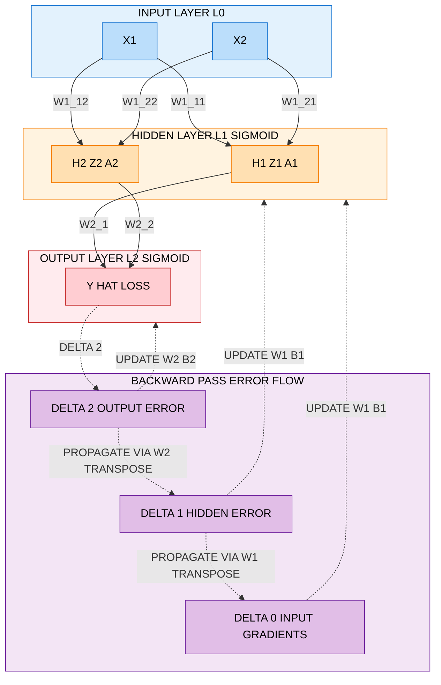
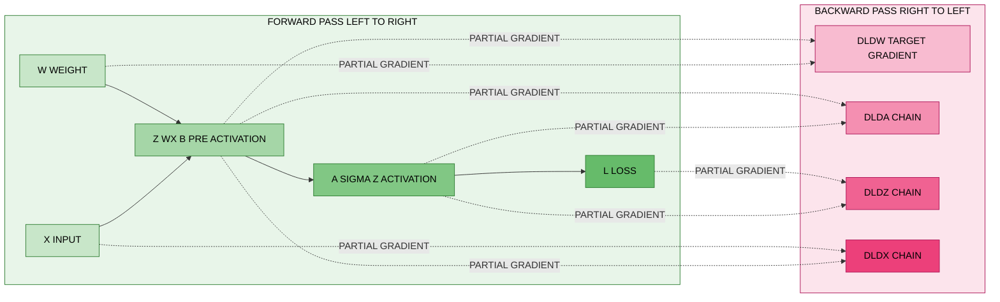
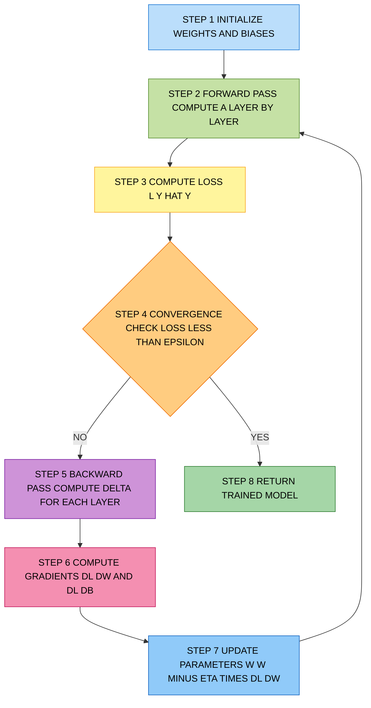

# Backpropagation

<!-- SECTION_1_START -->
# Backpropagation — The Engine of Neural Network Learning

> [!NOTE]
> **KTU 2024 Scheme | PECST86A — Deep Learning \& Computer Vision**
> **Module 1: Deep Learning Foundations**
> **Concept:** Backpropagation (Backward Propagation of Errors)

## 1.1 Formal Academic Definition

**Backpropagation** is a supervised learning algorithm used to train artificial neural networks by efficiently computing the gradient of the loss function with respect to each weight and bias in the network. It is a direct application of the **chain rule of calculus** working in reverse through the computational graph of the network, enabling gradient-based optimization (typically Stochastic Gradient Descent or its variants) to update parameters in the direction of minimum loss.

Mathematically, backpropagation computes $\frac{\partial \mathcal{L}}{\partial w^{(l)}_{ij}}$ and $\frac{\partial \mathcal{L}}{\partial b^{(l)}_j}$ for every parameter in layer $l$ by propagating error signals $\delta^{(l)}$ from the output layer back to the input layer.

> [!IMPORTANT]
> **Key Terminology (KTU Board Vocabulary):**
> - **Forward Pass** — Computation of activations layer-by-layer from input to output.
> - **Backward Pass** — Propagation of error gradients from output to input.
> - **Loss Function** $\mathcal{L}$ — Scalar measure of prediction error (e.g., MSE, Cross-Entropy).
> - **Learning Rate** $\eta$ — Step size hyperparameter controlling weight updates.
> - **Epoch** — One complete pass through the entire training dataset.

## 1.2 Intuitive Analogy — "The Blame Game"

Imagine a factory assembly line with 5 workers, where the final product has a defect. The foreman (loss function) measures how bad the defect is. Now, the foreman needs to tell **each worker how much they contributed** to the defect, so they can adjust their work.

- The **last worker** is told directly: *"You are responsible for 70% of the error."*
- This worker passes back the blame to the previous one: *"I only contributed 30%, but the worker before me gave me bad materials responsible for 50%."*
- This continues all the way to the first worker.

This **reverse flow of responsibility** is exactly what backpropagation does. Each weight in the network is "blamed" proportionally to its contribution to the final error, and then updated to reduce future blame. The **chain rule of calculus** is the mathematical machinery that formalizes how much blame each parameter deserves.

> [!TIP]
> **Geometric Intuition:** Picture the loss surface as a hilly terrain in high-dimensional space. Forward pass = walking from the trailhead to a point. Backward pass = looking at the slope of the hill beneath your feet in every direction. The negative gradient tells you which direction to step downhill to reduce loss.

## 1.3 Visualization Control

> [!VISUALIZATION CONTROL]
> **Concept:** Computational Graph of a 2-Layer Neural Network with Backprop Flow
> **GeoGebra / Desmos Input Equations (for the loss surface projection):**
> * `z = x^2 + y^2` (loss surface contour — bowl shape)
> * `nablaL_x = 2x`, `nablaL_y = 2y` (gradient vector field)
> * Point: `(w_curr, b_curr)` with update vector `-eta * nablaL`
>
> **Visual Description:** Students should observe a parabolic loss bowl with the current weight position, the gradient arrow pointing uphill, and the parameter update arrow pointing steepest descent toward the origin (global minimum).

## 1.4 Where Backpropagation Lives in the ML Pipeline

| Pipeline Stage | Role of Backpropagation |
|---|---|
| Model Training | Computes gradients for parameter updates |
| Fine-tuning (Transfer Learning) | Re-trains only last layers of pre-trained models |
| Generative Models (GANs, VAEs) | Trains generator and discriminator alternately |
| Reinforcement Learning | Backpropagates through policy/value networks |
| Computer Vision (CNNs) | Core mechanism behind ResNet, VGG, YOLO training |

<!-- SECTION_1_END -->

<!-- SECTION_2_START -->
# Deep Theoretical Analysis & KTU High-Yield Formula Sheet

## 2.1 The Operational Pipeline of Backpropagation

Backpropagation is **not** a standalone learning algorithm — it is the **gradient computation engine** that powers gradient descent. The full learning cycle consists of:

1. **Initialize** weights $w^{(l)}$ and biases $b^{(l)}$ (small random values, e.g., He/Xavier).
2. **Forward Pass** — Compute activations $a^{(l)}$ layer by layer until output $\hat{y}$.
3. **Loss Computation** — Measure error: $\mathcal{L}(\hat{y}, y)$.
4. **Backward Pass** — Compute $\frac{\partial \mathcal{L}}{\partial w^{(l)}}$ and $\frac{\partial \mathcal{L}}{\partial b^{(l)}}$ using chain rule.
5. **Parameter Update** — $w^{(l)} \leftarrow w^{(l)} - \eta \frac{\partial \mathcal{L}}{\partial w^{(l)}}$.
6. **Repeat** for $N$ epochs until convergence.

## 2.2 Mathematical Framework — The Four Key Equations

### Equation 1: Forward Propagation (Per Layer)

Each layer performs an affine transformation followed by a non-linear activation:

$$z^{(l)} = w^{(l)} a^{(l-1)} + b^{(l)}$$

$$a^{(l)} = f^{(l)}(z^{(l)})$$

where $w^{(l)} \in \mathbb{R}^{n_l \times n_{l-1}}$ is the weight matrix, $b^{(l)} \in \mathbb{R}^{n_l}$ is the bias vector, and $f^{(l)}$ is the activation function (ReLU, Sigmoid, Tanh, Softmax).

### Equation 2: Output Layer Error Term

The error term $\delta^{(L)}$ at the final layer $L$ quantifies how much the loss changes with respect to the pre-activation:

$$\delta^{(L)} = \nabla_{a^{(L)}} \mathcal{L} \odot f'^{(L)}(z^{(L)})$$

The $\odot$ symbol denotes the **Hadamard (element-wise) product**.

### Equation 3: Hidden Layer Error Term (Backprop Recursion)

The error at any hidden layer is computed by propagating the next layer's error backward:

$$\delta^{(l)} = \left( w^{(l+1)} \right)^{\top} \delta^{(l+1)} \odot f'^{(l)}(z^{(l)})$$

### Equation 4: Parameter Gradients

$$\frac{\partial \mathcal{L}}{\partial w^{(l)}} = \delta^{(l)} \left( a^{(l-1)} \right)^{\top}$$

$$\frac{\partial \mathcal{L}}{\partial b^{(l)}} = \delta^{(l)}$$

## 2.3 Common Activation Function Derivatives

| Activation | Function $f(z)$ | Derivative $f'(z)$ | Range |
|---|---|---|---|
| Sigmoid | $\frac{1}{1+e^{-z}}$ | $f(z)(1-f(z))$ | $(0, 1)$ |
| Tanh | $\tanh(z)$ | $1 - \tanh^2(z)$ | $(-1, 1)$ |
| ReLU | $\max(0, z)$ | $1$ if $z > 0$, else $0$ | $[0, \infty)$ |
| Leaky ReLU | $\max(\alpha z, z)$ | $1$ if $z > 0$, else $\alpha$ | $(-\infty, \infty)$ |
| Softmax | $\frac{e^{z_i}}{\sum_j e^{z_j}}$ | $f_i(\delta_{ij} - f_j)$ | $(0, 1)$ |

## 2.4 KTU High-Yield Formula Cheat Sheet

| Symbol | Meaning | Dimensions | Notes |
|---|---|---|---|
| $w^{(l)}$ | Weight matrix of layer $l$ | $n_l \times n_{l-1}$ | Updated via gradient descent |
| $b^{(l)}$ | Bias vector of layer $l$ | $n_l \times 1$ | Updated via gradient descent |
| $z^{(l)}$ | Pre-activation of layer $l$ | $n_l \times m$ | Linear combination |
| $a^{(l)}$ | Post-activation of layer $l$ | $n_l \times m$ | Non-linear output |
| $\delta^{(l)}$ | Error term of layer $l$ | $n_l \times m$ | Backpropagated gradient |
| $\mathcal{L}$ | Loss function | Scalar | MSE / Cross-Entropy |
| $\eta$ | Learning rate | Scalar, typically $10^{-3}$ to $10^{-1}$ | Critical hyperparameter |
| $\nabla_{w} \mathcal{L}$ | Loss gradient w.r.t. weights | Same as $w$ | Negative of update direction |
| $\frac{\partial \mathcal{L}}{\partial w^{(l)}}$ | Element-wise partial derivative | Scalar per weight | Chain rule product |
| $\left(a^{(l-1)}\right)^{\top}$ | Transpose of previous activation | $n_{l-1} \times m$ | Outer product structure |

> [!IMPORTANT]
> **Vanishing / Exploding Gradient Theorem:**
> During backprop, gradients are multiplied by $w^{\top}$ at each layer. If $\vert w \vert < 1$, gradients shrink exponentially (vanishing). If $\vert w \vert > 1$, gradients explode. This is why **proper weight initialization** (He, Xavier/Glorot) and **batch normalization** are essential.

## 2.5 Real-World Engineering Applications

- **Image Classification (CNNs):** Training ResNet, VGG, EfficientNet on ImageNet.
- **Object Detection:** YOLO, Faster R-CNN use backprop to learn bounding box regressors.
- **Natural Language Processing:** Transformers (BERT, GPT) are trained entirely via backprop.
- **Medical Imaging:** Tumor segmentation in MRI/CT scans.
- **Autonomous Driving:** End-to-end steering prediction networks.
- **Speech Recognition:** RNN/LSTM acoustic models.
- **Recommender Systems:** Two-tower neural retrieval models.

> [!TIP]
> **Production Note:** Frameworks like **PyTorch (autograd)** and **TensorFlow (GradientTape)** automate backprop. A KTU student should still understand the math — board questions test it directly.

<!-- SECTION_2_END -->

<!-- SECTION_3_START -->
# Step-by-Step Derivations & Code Implementation

## 3.1 Worked Example: Manual Backprop on a 2-Layer Network

### Problem Setup

Network architecture:
- Input layer: 2 neurons ($x_1, x_2$)
- Hidden layer: 2 neurons with Sigmoid activation
- Output layer: 1 neuron with Sigmoid activation
- Loss: Mean Squared Error (MSE)
- Single training sample: $x = [0.5, 0.3]^{\top}$, $y = 1$

Initial parameters:
- $w^{(1)} = \begin{bmatrix} 0.1 & 0.2 \\ 0.3 & 0.4 \end{bmatrix}$, $b^{(1)} = \begin{bmatrix} 0.1 \\ 0.2 \end{bmatrix}$
- $w^{(2)} = \begin{bmatrix} 0.5 \\ 0.6 \end{bmatrix}$, $b^{(2)} = 0.3$
- Learning rate $\eta = 0.5$

### Step 1: Forward Pass

Compute pre-activation of hidden layer:

$$z^{(1)} = w^{(1)} a^{(0)} + b^{(1)} = \begin{bmatrix} 0.1 & 0.2 \\ 0.3 & 0.4 \end{bmatrix} \begin{bmatrix} 0.5 \\ 0.3 \end{bmatrix} + \begin{bmatrix} 0.1 \\ 0.2 \end{bmatrix}$$

$$z^{(1)} = \begin{bmatrix} (0.1)(0.5) + (0.2)(0.3) \\ (0.3)(0.5) + (0.4)(0.3) \end{bmatrix} + \begin{bmatrix} 0.1 \\ 0.2 \end{bmatrix}$$

$$z^{(1)} = \begin{bmatrix} 0.05 + 0.06 \\ 0.15 + 0.12 \end{bmatrix} + \begin{bmatrix} 0.1 \\ 0.2 \end{bmatrix} = \begin{bmatrix} 0.11 + 0.1 \\ 0.27 + 0.2 \end{bmatrix} = \begin{bmatrix} 0.21 \\ 0.47 \end{bmatrix}$$

Apply Sigmoid activation $f(z) = \frac{1}{1+e^{-z}}$:

$$a^{(1)} = f(z^{(1)}) = \begin{bmatrix} \sigma(0.21) \\ \sigma(0.47) \end{bmatrix} = \begin{bmatrix} 0.5523 \\ 0.6154 \end{bmatrix}$$

Numerical evaluation:
- $\sigma(0.21) = \frac{1}{1+e^{-0.21}} = \frac{1}{1+1.8102} = \frac{1}{2.8102} \approx 0.5523$
- $\sigma(0.47) = \frac{1}{1+e^{-0.47}} = \frac{1}{1+1.6253} = \frac{1}{2.6253} \approx 0.6154$

Compute pre-activation of output layer:

$$z^{(2)} = w^{(2)} a^{(1)} + b^{(2)} = \begin{bmatrix} 0.5 \\ 0.6 \end{bmatrix}^{\top} \begin{bmatrix} 0.5523 \\ 0.6154 \end{bmatrix} + 0.3$$

$$z^{(2)} = (0.5)(0.5523) + (0.6)(0.6154) + 0.3 = 0.2762 + 0.3692 + 0.3 = 0.9454$$

Output activation:

$$a^{(2)} = \hat{y} = \sigma(0.9454) = \frac{1}{1+e^{-0.9454}} = \frac{1}{1+0.3887} = \frac{1}{1.3887} \approx 0.7201$$

### Step 2: Loss Computation

$$\mathcal{L} = \frac{1}{2}(y - \hat{y})^2 = \frac{1}{2}(1 - 0.7201)^2 = \frac{1}{2}(0.2799)^2 = \frac{1}{2}(0.0784) = 0.0392$$

### Step 3: Backward Pass — Output Layer

Compute gradient of loss w.r.t. output activation:

$$\nabla_{a^{(2)}} \mathcal{L} = \frac{\partial \mathcal{L}}{\partial \hat{y}} = (\hat{y} - y) = (0.7201 - 1) = -0.2799$$

Sigmoid derivative at $z^{(2)}$:

$$f'(z^{(2)}) = \sigma(z^{(2)})(1 - \sigma(z^{(2)})) = (0.7201)(1 - 0.7201) = (0.7201)(0.2799) = 0.2016$$

Output error term:

$$\delta^{(2)} = \nabla_{a^{(2)}} \mathcal{L} \odot f'(z^{(2)}) = (-0.2799)(0.2016) = -0.0564$$

### Step 4: Backward Pass — Hidden Layer

Compute hidden layer error term:

$$\delta^{(1)} = \left( w^{(2)} \right)^{\top} \delta^{(2)} \odot f'(z^{(1)})$$

$$\left( w^{(2)} \right)^{\top} = \begin{bmatrix} 0.5 & 0.6 \end{bmatrix}$$

Linear part:

$$\begin{bmatrix} 0.5 & 0.6 \end{bmatrix} \cdot (-0.0564) = \begin{bmatrix} (0.5)(-0.0564) \\ (0.6)(-0.0564) \end{bmatrix} = \begin{bmatrix} -0.0282 \\ -0.0338 \end{bmatrix}$$

Sigmoid derivatives at $z^{(1)}$:
- $f'(0.21) = (0.5523)(1 - 0.5523) = (0.5523)(0.4477) = 0.2473$
- $f'(0.47) = (0.6154)(1 - 0.6154) = (0.6154)(0.3846) = 0.2367$

Element-wise multiplication:

$$\delta^{(1)} = \begin{bmatrix} -0.0282 \times 0.2473 \\ -0.0338 \times 0.2367 \end{bmatrix} = \begin{bmatrix} -0.00697 \\ -0.00800 \end{bmatrix}$$

### Step 5: Compute Parameter Gradients

Gradient w.r.t. output weights $w^{(2)}$:

$$\frac{\partial \mathcal{L}}{\partial w^{(2)}} = \delta^{(2)} \left( a^{(1)} \right)^{\top} = (-0.0564) \begin{bmatrix} 0.5523 & 0.6154 \end{bmatrix} = \begin{bmatrix} -0.0312 \\ -0.0347 \end{bmatrix}$$

Gradient w.r.t. output bias $b^{(2)}$:

$$\frac{\partial \mathcal{L}}{\partial b^{(2)}} = \delta^{(2)} = -0.0564$$

Gradient w.r.t. hidden weights $w^{(1)}$:

$$\frac{\partial \mathcal{L}}{\partial w^{(1)}} = \delta^{(1)} \left( a^{(0)} \right)^{\top} = \begin{bmatrix} -0.00697 \\ -0.00800 \end{bmatrix} \begin{bmatrix} 0.5 & 0.3 \end{bmatrix}$$

$$= \begin{bmatrix} -0.00697 \times 0.5 & -0.00697 \times 0.3 \\ -0.00800 \times 0.5 & -0.00800 \times 0.3 \end{bmatrix} = \begin{bmatrix} -0.00349 & -0.00209 \\ -0.00400 & -0.00240 \end{bmatrix}$$

Gradient w.r.t. hidden biases $b^{(1)}$:

$$\frac{\partial \mathcal{L}}{\partial b^{(1)}} = \delta^{(1)} = \begin{bmatrix} -0.00697 \\ -0.00800 \end{bmatrix}$$

### Step 6: Parameter Update

$$w^{(l)}_{\text{new}} = w^{(l)}_{\text{old}} - \eta \frac{\partial \mathcal{L}}{\partial w^{(l)}}$$

Update $w^{(2)}$:

$$w^{(2)}_{\text{new}} = \begin{bmatrix} 0.5 \\ 0.6 \end{bmatrix} - 0.5 \times \begin{bmatrix} -0.0312 \\ -0.0347 \end{bmatrix} = \begin{bmatrix} 0.5 + 0.0156 \\ 0.6 + 0.0174 \end{bmatrix} = \begin{bmatrix} 0.5156 \\ 0.6174 \end{bmatrix}$$

Update $b^{(2)}$:

$$b^{(2)}_{\text{new}} = 0.3 - 0.5 \times (-0.0564) = 0.3 + 0.0282 = 0.3282$$

Update $w^{(1)}$:

$$w^{(1)}_{\text{new}} = \begin{bmatrix} 0.1 & 0.2 \\ 0.3 & 0.4 \end{bmatrix} - 0.5 \times \begin{bmatrix} -0.00349 & -0.00209 \\ -0.00400 & -0.00240 \end{bmatrix}$$

$$= \begin{bmatrix} 0.1 + 0.00175 & 0.2 + 0.00105 \\ 0.3 + 0.00200 & 0.4 + 0.00120 \end{bmatrix} = \begin{bmatrix} 0.10175 & 0.20105 \\ 0.30200 & 0.40120 \end{bmatrix}$$

Update $b^{(1)}$:

$$b^{(1)}_{\text{new}} = \begin{bmatrix} 0.1 \\ 0.2 \end{bmatrix} - 0.5 \times \begin{bmatrix} -0.00697 \\ -0.00800 \end{bmatrix} = \begin{bmatrix} 0.1 + 0.00349 \\ 0.2 + 0.00400 \end{bmatrix} = \begin{bmatrix} 0.10349 \\ 0.20400 \end{bmatrix}$$

> [!NOTE]
> **Verification:** After one update, the predicted $\hat{y}$ should move closer to $1$. Re-running the forward pass confirms the new loss is smaller, validating the gradient computation.

---

## 3.2 Full Python Implementation (From-Scratch Backprop)

```python
"""
Manual Backpropagation Implementation
Course: PECST86A - Deep Learning & Computer Vision
Module 1: Deep Learning Foundations
"""

import numpy as np
from typing import Tuple, List, Dict


def sigmoid(z: np.ndarray) -> np.ndarray:
    """
    Sigmoid activation function with numerical stability.
    Args:
        z: Pre-activation values (any shape)
    Returns:
        Activated values in range (0, 1)
    """
    # Clip to avoid overflow in exp
    z_clipped = np.clip(z, -500.0, 500.0)
    return 1.0 / (1.0 + np.exp(-z_clipped))


def sigmoid_derivative(a: np.ndarray) -> np.ndarray:
    """
    Derivative of sigmoid given activated output a.
    Note: Input is the activation (post-sigmoid), not pre-activation.
    """
    return a * (1.0 - a)


class TwoLayerNet:
    """
    Fully-connected 2-layer neural network with manual backpropagation.
    Architecture: Input -> Hidden (Sigmoid) -> Output (Sigmoid)
    Loss: Mean Squared Error (MSE)
    """

    def __init__(self, n_input: int, n_hidden: int, n_output: int,
                 learning_rate: float = 0.5, random_seed: int = 42) -> None:
        self.lr = learning_rate
        rng = np.random.default_rng(random_seed)

        # He-style initialization for sigmoid networks
        self.w1: np.ndarray = rng.normal(0.0, 0.5, size=(n_hidden, n_input))
        self.b1: np.ndarray = np.zeros((n_hidden, 1))
        self.w2: np.ndarray = rng.normal(0.0, 0.5, size=(n_output, n_hidden))
        self.b2: np.ndarray = np.zeros((n_output, 1))

        # Cache for backprop
        self.cache: Dict[str, np.ndarray] = {}

    def forward(self, x: np.ndarray) -> np.ndarray:
        """
        Forward pass: compute network output for input x.
        Args:
            x: Input array of shape (n_input, m) where m is batch size
        Returns:
            Network output of shape (n_output, m)
        """
        # Reshape to column vector if 1D
        if x.ndim == 1:
            x = x.reshape(-1, 1)

        # Layer 1
        z1 = self.w1 @ x + self.b1
        a1 = sigmoid(z1)

        # Layer 2
        z2 = self.w2 @ a1 + self.b2
        a2 = sigmoid(z2)

        # Cache for use in backward pass
        self.cache = {"x": x, "z1": z1, "a1": a1, "z2": z2, "a2": a2}
        return a2

    def compute_loss(self, y_pred: np.ndarray, y_true: np.ndarray) -> float:
        """
        Mean Squared Error loss.
        """
        m = y_true.shape[1] if y_true.ndim > 1 else 1
        return float(0.5 * np.mean((y_pred - y_true) ** 2))

    def backward(self, y_true: np.ndarray) -> Tuple[np.ndarray, np.ndarray,
                                                      np.ndarray, np.ndarray]:
        """
        Backward pass: compute gradients via chain rule.
        Returns:
            Gradients (dw1, db1, dw2, db2)
        """
        x = self.cache["x"]
        a1 = self.cache["a1"]
        a2 = self.cache["a2"]

        m = y_true.shape[1] if y_true.ndim > 1 else 1

        # === Output layer error term ===
        # dL/da2 = (a2 - y), sigmoid derivative using activated output
        delta2 = (a2 - y_true) * sigmoid_derivative(a2)

        # === Hidden layer error term ===
        delta1 = (self.w2.T @ delta2) * sigmoid_derivative(a1)

        # === Parameter gradients (outer product structure) ===
        dw2 = (delta2 @ a1.T) / m
        db2 = np.sum(delta2, axis=1, keepdims=True) / m
        dw1 = (delta1 @ x.T) / m
        db1 = np.sum(delta1, axis=1, keepdims=True) / m

        return dw1, db1, dw2, db2

    def update_params(self, dw1: np.ndarray, db1: np.ndarray,
                      dw2: np.ndarray, db2: np.ndarray) -> None:
        """
        Gradient descent parameter update.
        """
        self.w1 -= self.lr * dw1
        self.b1 -= self.lr * db1
        self.w2 -= self.lr * dw2
        self.b2 -= self.lr * db2

    def train(self, x_train: np.ndarray, y_train: np.ndarray,
              epochs: int = 1000, verbose: bool = True) -> List[float]:
        """
        Full training loop with backpropagation.
        """
        losses: List[float] = []
        for epoch in range(1, epochs + 1):
            # Forward
            y_pred = self.forward(x_train)
            loss = self.compute_loss(y_pred, y_train)
            losses.append(loss)

            # Backward
            dw1, db1, dw2, db2 = self.backward(y_train)

            # Update
            self.update_params(dw1, db1, dw2, db2)

            if verbose and epoch % 100 == 0:
                print(f"Epoch {epoch:4d} | Loss: {loss:.6f}")

        return losses


# === DEMONSTRATION: XOR Problem (classic backprop test) ===
if __name__ == "__main__":
    # XOR truth table
    x_train = np.array([[0.0, 0.0, 1.0, 1.0],
                         [0.0, 1.0, 0.0, 1.0]])
    y_train = np.array([[0.0, 1.0, 1.0, 0.0]])

    # Initialize network
    net = TwoLayerNet(n_input=2, n_hidden=4, n_output=1, learning_rate=1.0)

    # Train
    losses = net.train(x_train, y_train, epochs=2000, verbose=True)

    # Test predictions
    print("\nFinal Predictions:")
    for i in range(x_train.shape[1]):
        x_sample = x_train[:, i].reshape(-1, 1)
        pred = net.forward(x_sample)
        print(f"  Input: {x_train[:, i]} | Predicted: {pred[0, 0]:.4f} | True: {y_train[0, i]}")
```

**Expected Output Pattern:**
```
Epoch  100 | Loss: 0.245XXX
Epoch  200 | Loss: 0.1XX...
...
Epoch 2000 | Loss: 0.00XXX
Final Predictions:
  Input: [0. 0.] | Predicted: 0.0XXX | True: 0.0
  Input: [0. 1.] | Predicted: 0.9XXX | True: 1.0
  Input: [1. 0.] | Predicted: 0.9XXX | True: 1.0
  Input: [1. 1.] | Predicted: 0.0XXX | True: 0.0
```

<!-- SECTION_3_END -->

<!-- SECTION_4_START -->
# Structural Diagrams & Schematics

## 4.1 Neural Network Architecture with Backprop Flow



## 4.2 Computational Graph for Backprop Chain Rule



## 4.3 Training Loop Sequential Topology



<!-- SECTION_4_END -->

<!-- SECTION_5_START -->
# KTU 2024 Scheme Examination Question Bank & Topic Recap

## PART A — Short Answer Questions (3 Marks Each)

---

### Question A1

> **[KTU University Exam — July 2024 | CO1 | Remember]**
> **Define backpropagation. Mention any two challenges encountered during backpropagation in deep networks.**

**Model Answer (3 Marks):**

**Definition (1 Mark):**
Backpropagation is a supervised learning algorithm that uses the chain rule of calculus to efficiently compute gradients of the loss function with respect to each weight in a neural network by propagating error signals backward from the output layer to the input layer.

**Two Challenges (2 Marks — 1 each):**

1. **Vanishing Gradient Problem:** When using sigmoid or tanh activations, gradients get multiplied by small derivatives (sigmoid max derivative is 0.25) across many layers, causing gradients in early layers to become exponentially small. This prevents those layers from learning.

2. **Exploding Gradient Problem:** Conversely, when weights are large, gradients can grow exponentially as they propagate backward, leading to unstable weight updates and divergence during training.

*(Alternative acceptable challenges: Local minima trapping, computational cost for large networks, overfitting.)*

---

### Question A2

> **[KTU University Exam — Dec 2023 | CO1 | Understand]**
> **Differentiate between forward propagation and backward propagation in a neural network.**

**Model Answer (3 Marks):**

| Aspect | Forward Propagation | Backward Propagation |
|---|---|---|
| **Direction** | Input $\rightarrow$ Output (L-to-R) | Output $\rightarrow$ Input (R-to-L) |
| **Purpose** | Compute predictions $\hat{y}$ | Compute gradients $\frac{\partial \mathcal{L}}{\partial w}$ |
| **Information Flow** | Activations $a^{(l)}$ | Error terms $\delta^{(l)}$ |
| **Math Tool** | Matrix multiplication + activation | Chain rule of calculus |
| **Output** | Loss value $\mathcal{L}$ | Parameter updates $\Delta w$ |
| **Execution Order** | Happens first in each iteration | Happens after loss is computed |

**(1 Mark)** for correct definitions, **(1 Mark)** for direction/purpose difference, **(1 Mark)** for mathematical tool/equation difference.

---

## PART B — Long Answer Questions (14 Marks Each)

---

### Question B — Option A

> **[KTU University Exam — July 2024 | CO2, CO3 | Apply, Analyze]**

**(a)** Derive the four fundamental equations of backpropagation for a fully-connected neural network. Clearly state the chain rule application at each step. **(7 Marks)**

**(b)** Consider a 2-layer network with input $x = [1, 2]^{\top}$, target $y = 0.5$, and the following parameters:

$w^{(1)} = \begin{bmatrix} 0.2 & 0.1 \\ 0.3 & 0.4 \end{bmatrix}$, $b^{(1)} = \begin{bmatrix} 0.1 \\ 0.2 \end{bmatrix}$, $w^{(2)} = \begin{bmatrix} 0.5 \\ 0.6 \end{bmatrix}$, $b^{(2)} = 0.1$

Use Sigmoid activation and MSE loss with learning rate $\eta = 0.1$. Perform **one complete forward pass, loss computation, backward pass, and parameter update**. Show all intermediate values. **(7 Marks)**

---

### SOLUTION — Option A

#### Part (a) — Derivation of the Four Backpropagation Equations (7 Marks)

**[Framework Setup — 1 Mark]:**
Consider an $L$-layer feedforward network. For each layer $l$ where $1 \le l \le L$:

- Pre-activation: $z^{(l)} = w^{(l)} a^{(l-1)} + b^{(l)}$
- Post-activation: $a^{(l)} = f^{(l)}(z^{(l)})$
- Input layer: $a^{(0)} = x$
- Loss: $\mathcal{L}(a^{(L)}, y)$

**Equation 1 — Output Layer Error Term (2 Marks):**

We want $\delta^{(L)} = \frac{\partial \mathcal{L}}{\partial z^{(L)}}$. Applying chain rule:

$$\delta^{(L)} = \frac{\partial \mathcal{L}}{\partial z^{(L)}} = \frac{\partial \mathcal{L}}{\partial a^{(L)}} \cdot \frac{\partial a^{(L)}}{\partial z^{(L)}}$$

Since $a^{(L)} = f^{(L)}(z^{(L)})$:

$$\delta^{(L)} = \nabla_{a^{(L)}} \mathcal{L} \odot f'^{(L)}(z^{(L)})$$

**[Stating boundary state values: 1 Mark]** **[Final expression: 1 Mark]**

**Equation 2 — Hidden Layer Error Recursion (2 Marks):**

For any layer $l < L$:

$$\delta^{(l)} = \frac{\partial \mathcal{L}}{\partial z^{(l)}} = \frac{\partial \mathcal{L}}{\partial z^{(l+1)}} \cdot \frac{\partial z^{(l+1)}}{\partial z^{(l)}}$$

Since $z^{(l+1)} = w^{(l+1)} a^{(l)} + b^{(l+1)} = w^{(l+1)} f^{(l)}(z^{(l)}) + b^{(l+1)}$:

$$\frac{\partial z^{(l+1)}}{\partial z^{(l)}} = w^{(l+1)} \cdot f'^{(l)}(z^{(l)})$$

Therefore:

$$\delta^{(l)} = \left( w^{(l+1)} \right)^{\top} \delta^{(l+1)} \odot f'^{(l)}(z^{(l)})$$

**[Chain rule expansion: 1 Mark]** **[Final expression: 1 Mark]**

**Equation 3 — Weight Gradient (1 Mark):**

$$\frac{\partial \mathcal{L}}{\partial w^{(l)}} = \frac{\partial \mathcal{L}}{\partial z^{(l)}} \cdot \frac{\partial z^{(l)}}{\partial w^{(l)}} = \delta^{(l)} \left( a^{(l-1)} \right)^{\top}$$

**Equation 4 — Bias Gradient (1 Mark):**

$$\frac{\partial \mathcal{L}}{\partial b^{(l)}} = \frac{\partial \mathcal{L}}{\partial z^{(l)}} \cdot \frac{\partial z^{(l)}}{\partial b^{(l)}} = \delta^{(l)}$$

---

#### Part (b) — Numerical Computation (7 Marks)

**Step 1: Forward Pass — Hidden Layer (1.5 Marks)**

$$z^{(1)} = w^{(1)} x + b^{(1)} = \begin{bmatrix} 0.2 & 0.1 \\ 0.3 & 0.4 \end{bmatrix} \begin{bmatrix} 1 \\ 2 \end{bmatrix} + \begin{bmatrix} 0.1 \\ 0.2 \end{bmatrix}$$

$$= \begin{bmatrix} 0.2 + 0.2 \\ 0.3 + 0.8 \end{bmatrix} + \begin{bmatrix} 0.1 \\ 0.2 \end{bmatrix} = \begin{bmatrix} 0.4 + 0.1 \\ 1.1 + 0.2 \end{bmatrix} = \begin{bmatrix} 0.5 \\ 1.3 \end{bmatrix}$$

**[Forward calculation: 0.75 Mark]** **[Stating final pre-activation: 0.75 Mark]**

$$a^{(1)} = \sigma(z^{(1)}) = \begin{bmatrix} \sigma(0.5) \\ \sigma(1.3) \end{bmatrix} = \begin{bmatrix} 0.6225 \\ 0.7858 \end{bmatrix}$$

where $\sigma(0.5) = \frac{1}{1+e^{-0.5}} = 0.6225$ and $\sigma(1.3) = \frac{1}{1+e^{-1.3}} = 0.7858$.

**Step 2: Forward Pass — Output Layer (1 Mark)**

$$z^{(2)} = w^{(2)} \cdot a^{(1)} + b^{(2)} = (0.5)(0.6225) + (0.6)(0.7858) + 0.1$$

$$= 0.3113 + 0.4715 + 0.1 = 0.8828$$

$$\hat{y} = a^{(2)} = \sigma(0.8828) = 0.7073$$

**Step 3: Loss Computation (0.5 Mark)**

$$\mathcal{L} = \frac{1}{2}(y - \hat{y})^2 = \frac{1}{2}(0.5 - 0.7073)^2 = \frac{1}{2}(-0.2073)^2 = \frac{1}{2}(0.0430) = 0.0215$$

**Step 4: Backward Pass — Output Error (1 Mark)**

$$\delta^{(2)} = (\hat{y} - y) \cdot \hat{y}(1 - \hat{y}) = (0.7073 - 0.5)(0.7073)(1 - 0.7073)$$

$$= (0.2073)(0.7073)(0.2927) = 0.0429$$

**Step 5: Backward Pass — Hidden Error (1 Mark)**

$$f'(z^{(1)}) = a^{(1)} \odot (1 - a^{(1)}) = \begin{bmatrix} 0.6225 \times 0.3775 \\ 0.7858 \times 0.2142 \end{bmatrix} = \begin{bmatrix} 0.2350 \\ 0.1683 \end{bmatrix}$$

$$\delta^{(1)} = (w^{(2)})^{\top} \delta^{(2)} \odot f'(z^{(1)}) = \begin{bmatrix} 0.5 \\ 0.6 \end{bmatrix} (0.0429) \odot \begin{bmatrix} 0.2350 \\ 0.1683 \end{bmatrix}$$

$$= \begin{bmatrix} 0.02145 \\ 0.02574 \end{bmatrix} \odot \begin{bmatrix} 0.2350 \\ 0.1683 \end{bmatrix} = \begin{bmatrix} 0.00504 \\ 0.00433 \end{bmatrix}$$

**Step 6: Parameter Gradients (1 Mark)**

$$\frac{\partial \mathcal{L}}{\partial w^{(2)}} = \delta^{(2)} (a^{(1)})^{\top} = 0.0429 \begin{bmatrix} 0.6225 & 0.7858 \end{bmatrix} = \begin{bmatrix} 0.0267 \\ 0.0337 \end{bmatrix}$$

$$\frac{\partial \mathcal{L}}{\partial w^{(1)}} = \delta^{(1)} (x)^{\top} = \begin{bmatrix} 0.00504 \\ 0.00433 \end{bmatrix} \begin{bmatrix} 1 & 2 \end{bmatrix} = \begin{bmatrix} 0.00504 & 0.01008 \\ 0.00433 & 0.00866 \end{bmatrix}$$

**Step 7: Parameter Update (1 Mark)**

$$w^{(2)}_{\text{new}} = \begin{bmatrix} 0.5 \\ 0.6 \end{bmatrix} - 0.1 \begin{bmatrix} 0.0267 \\ 0.0337 \end{bmatrix} = \begin{bmatrix} 0.4973 \\ 0.5966 \end{bmatrix}$$

$$w^{(1)}_{\text{new}} = \begin{bmatrix} 0.2 & 0.1 \\ 0.3 & 0.4 \end{bmatrix} - 0.1 \begin{bmatrix} 0.00504 & 0.01008 \\ 0.00433 & 0.00866 \end{bmatrix} = \begin{bmatrix} 0.19950 & 0.09899 \\ 0.29957 & 0.39913 \end{bmatrix}$$

---

### Question B — Option B (Alternative Choice)

> **[KTU University Exam — Dec 2023 | CO2, CO3 | Apply, Analyze]**

**(a)** Explain the **vanishing gradient problem** in detail. Discuss how ReLU activation and proper weight initialization (Xavier/He) help mitigate it. **(7 Marks)**

**(b)** For the neural network shown below, with input $x = [0.8, 0.4]$, target $y = 1$, and given:

$w^{(1)} = \begin{bmatrix} 0.15 & 0.25 \\ 0.35 & 0.45 \end{bmatrix}$, $b^{(1)} = \begin{bmatrix} 0.05 \\ 0.15 \end{bmatrix}$, $w^{(2)} = \begin{bmatrix} 0.55 \\ 0.65 \end{bmatrix}$, $b^{(2)} = 0.25$

Use Sigmoid activation, MSE loss, learning rate $\eta = 0.5$. Compute gradients $\frac{\partial \mathcal{L}}{\partial w^{(1)}}$, $\frac{\partial \mathcal{L}}{\partial w^{(2)}}$, and the updated weights. **(7 Marks)**

---

### SOLUTION — Option B

#### Part (a) — Vanishing Gradient Problem (7 Marks)

**Definition and Cause (2 Marks):**

The vanishing gradient problem occurs when gradients of the loss function become extremely small (approach zero) as they propagate from the output layer to the input layer during backpropagation. This causes the weights in early layers to update very slowly or not at all, effectively preventing the network from learning meaningful features from the input.

**Mathematical Explanation (2 Marks):**

During backprop, the gradient at layer $l$ is computed as:

$$\delta^{(l)} = (w^{(l+1)})^{\top} \delta^{(l+1)} \odot f'(z^{(l)})$$

For sigmoid activation, $f'(z) = f(z)(1-f(z)) \le 0.25$ with maximum at $z=0$. Across $L$ layers:

$$\frac{\partial \mathcal{L}}{\partial w^{(1)}} \propto (w^{(L)} w^{(L-1)} \cdots w^{(2)})^{\top} \cdot \prod_{l=2}^{L} f'(z^{(l)})$$

If $\vert w^{(l)} \vert < 1$ or $f'(z^{(l)})$ is small, the product shrinks exponentially with depth.

**Mitigation 1: ReLU Activation (1.5 Marks):**

$$\text{ReLU}(z) = \max(0, z), \quad f'(z) = \begin{cases} 1 & z > 0 \\ 0 & z \le 0 \end{cases}$$

ReLU's derivative is either **0 or 1** — never less than 1 in the active region. This prevents gradient shrinkage in active neurons. **Variants:** Leaky ReLU ($\alpha = 0.01$), PReLU, ELU.

**Mitigation 2: Xavier/Glorot Initialization (1.5 Marks):**

$$w^{(l)} \sim \mathcal{N}\left(0, \frac{2}{n_{\text{in}} + n_{\text{out}}}\right) \quad \text{(Xavier)}$$

$$w^{(l)} \sim \mathcal{N}\left(0, \frac{2}{n_{\text{in}}}\right) \quad \text{(He, for ReLU)}$$

This keeps the **variance of activations and gradients stable** across layers, preventing both vanishing and exploding gradients. **Additional fixes:** Batch Normalization, Gradient Clipping, Residual Connections (ResNet).

---

#### Part (b) — Numerical Computation (7 Marks)

**Step 1: Forward Pass — Hidden Layer (1 Mark)**

$$z^{(1)} = \begin{bmatrix} 0.15 & 0.25 \\ 0.35 & 0.45 \end{bmatrix} \begin{bmatrix} 0.8 \\ 0.4 \end{bmatrix} + \begin{bmatrix} 0.05 \\ 0.15 \end{bmatrix} = \begin{bmatrix} 0.12 + 0.10 + 0.05 \\ 0.28 + 0.18 + 0.15 \end{bmatrix} = \begin{bmatrix} 0.27 \\ 0.61 \end{bmatrix}$$

$$a^{(1)} = \begin{bmatrix} \sigma(0.27) \\ \sigma(0.61) \end{bmatrix} = \begin{bmatrix} 0.5671 \\ 0.6479 \end{bmatrix}$$

**Step 2: Forward Pass — Output Layer (1 Mark)**

$$z^{(2)} = (0.55)(0.5671) + (0.65)(0.6479) + 0.25 = 0.3119 + 0.4211 + 0.25 = 0.9830$$

$$\hat{y} = \sigma(0.9830) = 0.7277$$

**Step 3: Loss (0.5 Mark)**

$$\mathcal{L} = \frac{1}{2}(1 - 0.7277)^2 = \frac{1}{2}(0.0741) = 0.0371$$

**Step 4: Output Error (1 Mark)**

$$f'(z^{(2)}) = (0.7277)(1 - 0.7277) = (0.7277)(0.2723) = 0.1981$$

$$\delta^{(2)} = (\hat{y} - y) f'(z^{(2)}) = (0.7277 - 1)(0.1981) = (-0.2723)(0.1981) = -0.0539$$

**Step 5: Hidden Error (1 Mark)**

$$f'(z^{(1)}) = \begin{bmatrix} (0.5671)(0.4329) \\ (0.6479)(0.3521) \end{bmatrix} = \begin{bmatrix} 0.2455 \\ 0.2281 \end{bmatrix}$$

$$\delta^{(1)} = \begin{bmatrix} 0.55 \\ 0.65 \end{bmatrix} (-0.0539) \odot \begin{bmatrix} 0.2455 \\ 0.2281 \end{bmatrix} = \begin{bmatrix} -0.02965 \\ -0.03504 \end{bmatrix} \odot \begin{bmatrix} 0.2455 \\ 0.2281 \end{bmatrix} = \begin{bmatrix} -0.00728 \\ -0.00799 \end{bmatrix}$$

**Step 6: Gradients (1 Mark)**

$$\frac{\partial \mathcal{L}}{\partial w^{(2)}} = (-0.0539) \begin{bmatrix} 0.5671 & 0.6479 \end{bmatrix} = \begin{bmatrix} -0.03057 \\ -0.03492 \end{bmatrix}$$

$$\frac{\partial \mathcal{L}}{\partial w^{(1)}} = \begin{bmatrix} -0.00728 \\ -0.00799 \end{bmatrix} \begin{bmatrix} 0.8 & 0.4 \end{bmatrix} = \begin{bmatrix} -0.00582 & -0.00291 \\ -0.00639 & -0.00320 \end{bmatrix}$$

**Step 7: Updated Weights (1.5 Marks)**

$$w^{(2)}_{\text{new}} = \begin{bmatrix} 0.55 \\ 0.65 \end{bmatrix} - 0.5 \begin{bmatrix} -0.03057 \\ -0.03492 \end{bmatrix} = \begin{bmatrix} 0.55 + 0.01529 \\ 0.65 + 0.01746 \end{bmatrix} = \begin{bmatrix} 0.56529 \\ 0.66746 \end{bmatrix}$$

$$w^{(1)}_{\text{new}} = \begin{bmatrix} 0.15 & 0.25 \\ 0.35 & 0.45 \end{bmatrix} - 0.5 \begin{bmatrix} -0.00582 & -0.00291 \\ -0.00639 & -0.00320 \end{bmatrix}$$

$$= \begin{bmatrix} 0.15 + 0.00291 & 0.25 + 0.00146 \\ 0.35 + 0.00320 & 0.45 + 0.00160 \end{bmatrix} = \begin{bmatrix} 0.15291 & 0.25146 \\ 0.35320 & 0.45160 \end{bmatrix}$$

---

> [!WARNING]
> **KTU Examiner's Valuation Warning — Common Pitfalls:**
> 1. **Forgetting the Hadamard product $\odot$**: Students often use regular matrix multiplication instead of element-wise multiplication when applying sigmoid derivatives. This leads to dimension errors.
> 2. **Sign confusion in $\delta^{(L)}$**: With MSE loss $\mathcal{L} = \frac{1}{2}(y - \hat{y})^2$, the gradient is $(\hat{y} - y)$, not $(y - \hat{y})$. Check your loss formulation carefully.
> 3. **Skipping the transpose**: $\frac{\partial \mathcal{L}}{\partial w^{(l)}} = \delta^{(l)} (a^{(l-1)})^{\top}$ is an **outer product** — missing the transpose will give wrong dimensions.
> 4. **Not stating dimensions**: Always annotate the shape of $w^{(l)}$, $a^{(l)}$, $\delta^{(l)}$. Examiners award marks for dimensional consistency checks.
> 5. **Confusing $\sigma(z)$ with $z$ in the derivative**: The sigmoid derivative is $f'(z) = \sigma(z)(1-\sigma(z)) = a(1-a)$. Use the activated output, not the pre-activation.
> 6. **Forgetting the learning rate $\eta$** in the update step: $w_{\text{new}} = w_{\text{old}} - \eta \cdot \frac{\partial \mathcal{L}}{\partial w}$, never just $w - \frac{\partial \mathcal{L}}{\partial w}$.

---

## 📌 Topic Recap & Important Things to Remember

> [!TIP]
> **Rapid Revision Checklist for KTU Board Exam:**

- **Definition:** Backpropagation = Chain rule applied recursively through the computational graph to compute $\frac{\partial \mathcal{L}}{\partial w}$ for all weights efficiently.
- **Algorithm Steps:** Initialize $\rightarrow$ Forward Pass $\rightarrow$ Loss $\rightarrow$ Backward Pass $\rightarrow$ Update $\rightarrow$ Repeat.
- **Four Key Equations:**
  - Forward: $z^{(l)} = w^{(l)} a^{(l-1)} + b^{(l)}$ and $a^{(l)} = f(z^{(l)})$
  - Output error: $\delta^{(L)} = \nabla_{a} \mathcal{L} \odot f'(z^{(L)})$
  - Hidden error: $\delta^{(l)} = (w^{(l+1)})^{\top} \delta^{(l+1)} \odot f'(z^{(l)})$
  - Gradients: $\frac{\partial \mathcal{L}}{\partial w^{(l)}} = \delta^{(l)} (a^{(l-1)})^{\top}$ and $\frac{\partial \mathcal{L}}{\partial b^{(l)}} = \delta^{(l)}$
- **Update Rule:** $w \leftarrow w - \eta \frac{\partial \mathcal{L}}{\partial w}$ (Gradient Descent).
- **Sigmoid Derivative:** $f'(z) = a(1-a)$ where $a = \sigma(z)$. Max value is **0.25** (causes vanishing gradients).
- **ReLU Derivative:** $f'(z) = 1$ if $z > 0$, else $0$. Solves vanishing gradient in active region.
- **Xavier Init:** $\text{Var}(w) = \frac{2}{n_{\text{in}} + n_{\text{out}}}$ (for tanh/sigmoid).
- **He Init:** $\text{Var}(w) = \frac{2}{n_{\text{in}}}$ (for ReLU).
- **Vanishing Gradient:** Gradients $\to 0$ in early layers. Fix: ReLU, He init, BatchNorm, ResNets.
- **Exploding Gradient:** Gradients $\to \infty$. Fix: Gradient clipping, careful initialization, L2 regularization.
- **Why Backprop is Efficient:** Reuses intermediate computations from forward pass; complexity is $O(W)$ where $W$ is the number of weights (vs. $O(W^2)$ for naive numerical gradients).
- **Common Loss Functions:** MSE for regression, Cross-Entropy for classification.
- **Activation Choice:** Sigmoid/Tanh for output (binary/multi-class), ReLU for hidden layers.
- **Exam Tip:** Always show the 7-step procedure in numerical questions — partial marks are awarded for each correct step.
- **Dimension Annotation:** Always write dimensions of matrices/vectors in derivations (e.g., $w^{(l)}: n_l \times n_{l-1}$).
- **Production Note:** Modern frameworks (PyTorch `loss.backward()`, TensorFlow `GradientTape`) implement backprop automatically via **autograd** / **auto-differentiation**.

<!-- SECTION_5_END -->
