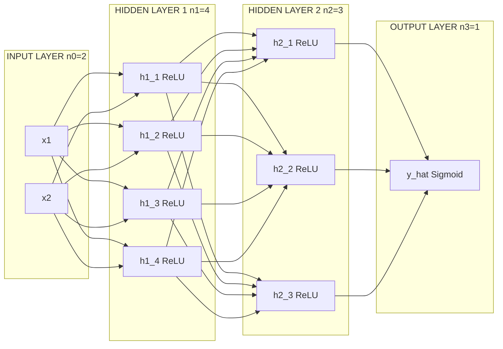
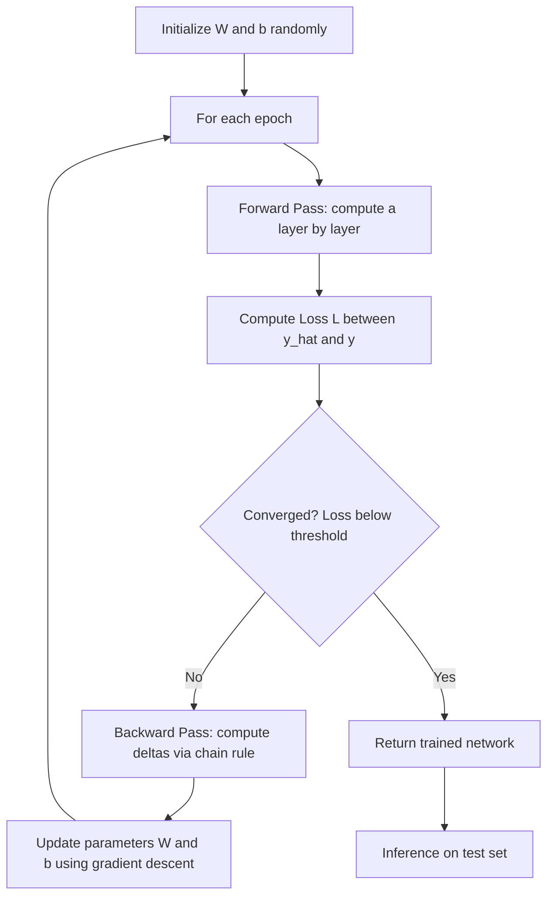
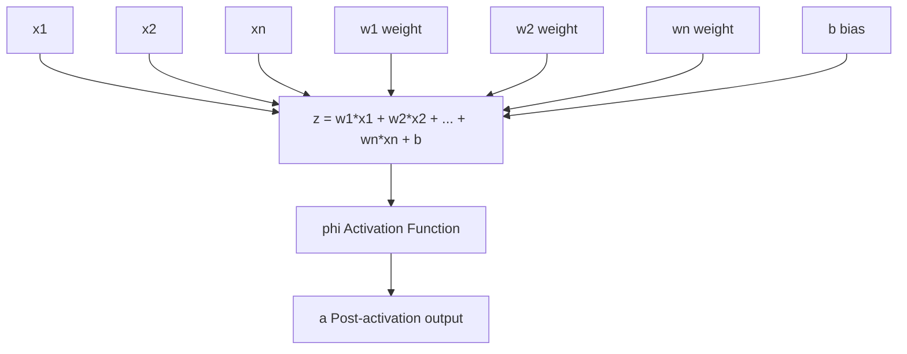

# Multi-layer perceptrons

<!-- SECTION_1_START -->
# Multi-Layer Perceptrons (MLP) — The Foundation of Deep Learning

## 1.1 Formal Definition (KTU 2024 Syllabus Terminology)

A **Multi-Layer Perceptron (MLP)** is a class of **feedforward artificial neural network** consisting of at least three distinct layers of nodes (or "neurons"): an **input layer**, one or more **hidden layers**, and an **output layer**. Except for the input nodes, every node is a **neuron** that uses a **non-linear activation function**. MLPs are trained using the **backpropagation algorithm** in a **supervised learning** setting and form the structural backbone of modern deep learning architectures.

> [!IMPORTANT]
> **KTU 2024 Syllabus Highlight:** An MLP is strictly a *fully connected* (dense) feedforward network. If it has connections that skip layers (as in ResNets) or shared weights (as in CNNs), it ceases to be a classical MLP. Memorize the "fully-connected + feedforward + non-linear activation" triplet for definition questions.

## 1.2 Intuition — The Biological Analogy

Think of an MLP as a **team of decision-makers voting in a hierarchy**:

- **Input layer** → like raw data entering your senses (eyes seeing pixels, ears hearing frequencies).
- **Hidden layer neuron** → like a specialist who looks at a specific combination of sensory inputs and shouts "yes" or "no" with a certain intensity.
- **Output layer** → the final decision-maker who listens to all the specialists and produces the final answer.

A single perceptron (1958, Frank Rosenblatt) is like **one specialist** who can only solve linearly separable problems (e.g., AND, OR gates). Stack many specialists in layers, and they can collectively solve **any complex pattern** — even the famously non-linear **XOR problem** that a single perceptron cannot.

## 1.3 The XOR Motivation (Why MLPs Exist)

| Gate | Single Perceptron Solves? | Reason |
|---|---|---|
| AND | ✅ Yes | Linearly separable |
| OR | ✅ Yes | Linearly separable |
| XOR | ❌ No | **Not linearly separable** |

> [!NOTE]
> The **XOR (Exclusive OR) problem** was the historical motivation for stacking layers. Minsky & Papert (1969) proved perceptrons cannot solve XOR, which triggered the first "AI Winter." The MLP, proposed as a remedy, revived the field.

## 1.4 Architectural Components — At a Glance

1. **Input Layer** — receives the feature vector $\mathbf{x} \in \mathbb{R}^{n}$. No computation, just data handoff. Size = number of features.
2. **Hidden Layer(s)** — performs weighted summation followed by a non-linear activation. Depth = number of hidden layers; Width = number of neurons per layer.
3. **Output Layer** — produces final prediction. Size depends on task (e.g., 1 neuron for binary classification, $C$ neurons for $C$-class classification).
4. **Weights ($\mathbf{W}$) and Biases ($\mathbf{b}$)** — the **learnable parameters** that the network adjusts during training.
5. **Activation Function** — injects **non-linearity**; without it, stacking layers is mathematically equivalent to a single layer.

> [!VISUALIZATION CONTROL]
> **Concept:** A single artificial neuron as a weighted sum + activation
> **GeoGebra / Desmos Input Equations:**
> * $f(x_1, x_2) = \sigma(w_1 x_1 + w_2 x_2 + b)$ with $w_1 = 1.2,\ w_2 = -0.8,\ b = 0.1$
> * For the sigmoid: $\sigma(z) = \dfrac{1}{1 + e^{-z}}$
> **Visual Description:** Plot $\sigma(z)$ as an S-shaped curve on the $x$-axis (input $z$) vs $y$-axis (output in $(0, 1)$). Observe that small input changes near $z=0$ cause large output changes — this is the non-linear "firing" behavior mimicking biological neurons.

<!-- SECTION_1_END -->

<!-- SECTION_2_START -->
# Deep Theoretical Analysis & KTU High-Yield Formula Sheet

## 2.1 The Single Neuron — Mathematical Model

For an input vector $\mathbf{x} = [x_1, x_2, \dots, x_n]^{T}$, a single neuron computes:

$$
z = \mathbf{w}^{T} \mathbf{x} + b = \sum_{i=1}^{n} w_i x_i + b
$$

where $\mathbf{w} \in \mathbb{R}^{n}$ is the weight vector, $b \in \mathbb{R}$ is the bias, and $z$ is the **pre-activation** (logit). The neuron then applies an activation $\phi$:

$$
a = \phi(z)
$$

The output $a$ is the **post-activation** (activation of that neuron).

## 2.2 Forward Propagation Through an $L$-Layer MLP

Let layer $l$ have weight matrix $\mathbf{W}^{(l)}$ of shape $(n_l, n_{l-1})$ and bias vector $\mathbf{b}^{(l)}$ of shape $(n_l, 1)$, where $n_l$ is the number of neurons in layer $l$. Then:

$$
\mathbf{z}^{(l)} = \mathbf{W}^{(l)} \mathbf{a}^{(l-1)} + \mathbf{b}^{(l)}
$$

$$
\mathbf{a}^{(l)} = \phi^{(l)}\!\left(\mathbf{z}^{(l)}\right)
$$

For the input layer, $\mathbf{a}^{(0)} = \mathbf{x}$. The final prediction is $\hat{\mathbf{y}} = \mathbf{a}^{(L)}$.

## 2.3 Universal Approximation Theorem (Cybenko, 1989)

> A feedforward neural network with a single hidden layer containing a **finite** number of neurons can approximate **any continuous function** on compact subsets of $\mathbb{R}^{n}$, provided it uses a suitable non-linear activation (e.g., sigmoid, tanh, ReLU), to arbitrary precision.

**Practical Implication:** In theory, one hidden layer is *enough*. In practice, **deeper networks generalize better** with fewer parameters.

## 2.4 KTU High-Yield Formula Sheet

| # | Concept | Formula / Rule | Engineering Use |
|---|---|---|---|
| 1 | Pre-activation | $z^{(l)}_j = \sum_i w^{(l)}_{ji} a^{(l-1)}_i + b^{(l)}_j$ | Pre-activation value for neuron $j$ in layer $l$ |
| 2 | Post-activation | $a^{(l)}_j = \phi(z^{(l)}_j)$ | Output of neuron $j$ after non-linearity |
| 3 | Vectorized forward pass | $\mathbf{z}^{(l)} = \mathbf{W}^{(l)} \mathbf{a}^{(l-1)} + \mathbf{b}^{(l)}$ | One-line matrix operation for entire layer |
| 4 | Sigmoid activation | $\sigma(z) = \dfrac{1}{1 + e^{-z}}$ | Binary classification output layer |
| 5 | Tanh activation | $\tanh(z) = \dfrac{e^{z} - e^{-z}}{e^{z} + e^{-z}}$ | Zero-centered hidden activations |
| 6 | ReLU activation | $\text{ReLU}(z) = \max(0, z)$ | Default hidden-layer activation; avoids vanishing gradient |
| 7 | Softmax activation | $\text{softmax}(z_i) = \dfrac{e^{z_i}}{\sum_j e^{z_j}}$ | Multi-class classification output layer |
| 8 | MSE Loss (regression) | $L = \dfrac{1}{m}\sum_{i=1}^{m}(\hat{y}_i - y_i)^2$ | Continuous target prediction |
| 9 | Binary Cross-Entropy | $L = -\dfrac{1}{m}\sum_{i=1}^{m}\left[y_i \log \hat{y}_i + (1-y_i)\log(1-\hat{y}_i)\right]$ | Binary classification |
| 10 | Categorical Cross-Entropy | $L = -\dfrac{1}{m}\sum_{i=1}^{m}\sum_{c=1}^{C} y_{ic} \log \hat{y}_{ic}$ | Multi-class classification |
| 11 | Gradient descent update | $\theta \leftarrow \theta - \eta \nabla_{\theta} L$ | Generic parameter update rule |
| 12 | Chain rule (backprop) | $\dfrac{\partial L}{\partial \mathbf{W}^{(l)}} = \dfrac{\partial L}{\partial \mathbf{a}^{(l)}} \cdot \dfrac{\partial \mathbf{a}^{(l)}}{\partial \mathbf{z}^{(l)}} \cdot \dfrac{\partial \mathbf{z}^{(l)}}{\partial \mathbf{W}^{(l)}}$ | Core of backpropagation |
| 13 | Parameter count (FC) | $n_{\text{params}} = \sum_{l=1}^{L}\left(n_l \cdot n_{l-1} + n_l\right)$ | Total trainable weights + biases |
| 14 | XOR failure line | $w_1 x_1 + w_2 x_2 + b = 0$ is a *single* line | Proves why 1 layer cannot solve XOR |

## 2.5 Why MLPs Matter in Modern Engineering

| Domain | MLP Use Case | Why an MLP Works |
|---|---|---|
| **Tabular data (finance, healthcare)** | Credit scoring, disease risk prediction | Captures non-linear feature interactions |
| **Sensor fusion (IoT)** | Combining temperature, pressure, humidity into a single state estimate | Learns arbitrary non-linear mappings |
| **NLP pre-deep-learning era** | Bag-of-words classifiers, sentiment analysis | First dense representation of text features |
| **Reinforcement learning** | Function approximator for $Q$-values in DQN | Universal function approximator for value functions |
| **Generative modeling (early)** | Restricted Boltzmann Machines, autoencoders | Compresses and reconstructs data |

## 2.6 Decision Boundaries — Visualizing What Layers Buy You

A single perceptron draws a **single straight line** (in 2D) or a **single hyperplane** (in $n$D). Stacking layers lets the network combine multiple hyperplanes to carve out **convex regions** (1 hidden layer) and eventually **arbitrarily complex, non-convex regions** (multiple hidden layers). This is the geometric intuition behind depth.

<!-- SECTION_2_END -->

<!-- SECTION_3_START -->
# Step-by-Step Derivations & Python Implementation

## 3.1 Forward Propagation — Complete Derivation (2-Hidden-Layer Example)

Consider an MLP with architecture $n \rightarrow h_1 \rightarrow h_2 \rightarrow m$ (input dim $= n$, two hidden layers, output dim $= m$). Let activation $\phi$ be the same for both hidden layers (e.g., ReLU), and $\psi$ for the output layer (e.g., softmax).

**Step 1 — Input layer** (no parameters, just handoff):
$$
\mathbf{a}^{(0)} = \mathbf{x} \in \mathbb{R}^{n}
$$

**Step 2 — First hidden layer pre-activation**:
$$
\mathbf{z}^{(1)} = \mathbf{W}^{(1)} \mathbf{a}^{(0)} + \mathbf{b}^{(1)}
$$
where $\mathbf{W}^{(1)} \in \mathbb{R}^{h_1 \times n}$ and $\mathbf{b}^{(1)} \in \mathbb{R}^{h_1}$.

**Step 3 — First hidden layer activation** (ReLU element-wise):
$$
\mathbf{a}^{(1)} = \text{ReLU}(\mathbf{z}^{(1)}) = \max(0, \mathbf{z}^{(1)})
$$

**Step 4 — Second hidden layer pre-activation**:
$$
\mathbf{z}^{(2)} = \mathbf{W}^{(2)} \mathbf{a}^{(1)} + \mathbf{b}^{(2)}
$$
where $\mathbf{W}^{(2)} \in \mathbb{R}^{h_2 \times h_1}$ and $\mathbf{b}^{(2)} \in \mathbb{R}^{h_2}$.

**Step 5 — Second hidden layer activation**:
$$
\mathbf{a}^{(2)} = \text{ReLU}(\mathbf{z}^{(2)})
$$

**Step 6 — Output layer pre-activation**:
$$
\mathbf{z}^{(3)} = \mathbf{W}^{(3)} \mathbf{a}^{(2)} + \mathbf{b}^{(3)}
$$
where $\mathbf{W}^{(3)} \in \mathbb{R}^{m \times h_2}$ and $\mathbf{b}^{(3)} \in \mathbb{R}^{m}$.

**Step 7 — Output layer activation** (softmax for classification):
$$
\hat{\mathbf{y}} = \mathbf{a}^{(3)} = \text{softmax}(\mathbf{z}^{(3)})_i = \frac{e^{z^{(3)}_i}}{\sum_{j=1}^{m} e^{z^{(3)}_j}}
$$

**Step 8 — Loss** (categorical cross-entropy for one-hot labels $\mathbf{y}$):
$$
L(\hat{\mathbf{y}}, \mathbf{y}) = -\sum_{i=1}^{m} y_i \log \hat{y}_i
$$

## 3.2 Backpropagation — Gradient Derivation

We use the **chain rule** to compute $\dfrac{\partial L}{\partial \mathbf{W}^{(l)}}$ and $\dfrac{\partial L}{\partial \mathbf{b}^{(l)}}$ for every layer $l$. Define the **error signal** at layer $l$:

$$
\boldsymbol{\delta}^{(l)} \equiv \frac{\partial L}{\partial \mathbf{z}^{(l)}}
$$

**Output layer error** (softmax + cross-entropy gives a clean form):
$$
\boldsymbol{\delta}^{(L)} = \hat{\mathbf{y}} - \mathbf{y}
$$

**Hidden layer error** (recursive propagation):
$$
\boldsymbol{\delta}^{(l)} = \left(\mathbf{W}^{(l+1)}\right)^{T} \boldsymbol{\delta}^{(l+1)} \odot \phi'(\mathbf{z}^{(l)})
$$
where $\odot$ is the **element-wise (Hadamard) product**, and $\phi'$ is the derivative of the activation.

**Gradients with respect to parameters**:
$$
\frac{\partial L}{\partial \mathbf{W}^{(l)}} = \boldsymbol{\delta}^{(l)} \left(\mathbf{a}^{(l-1)}\right)^{T}
$$

$$
\frac{\partial L}{\partial \mathbf{b}^{(l)}} = \boldsymbol{\delta}^{(l)}
$$

**Parameter update** (gradient descent with learning rate $\eta$):
$$
\mathbf{W}^{(l)} \leftarrow \mathbf{W}^{(l)} - \eta \, \frac{\partial L}{\partial \mathbf{W}^{(l)}}, \quad
\mathbf{b}^{(l)} \leftarrow \mathbf{b}^{(l)} - \eta \, \frac{\partial L}{\partial \mathbf{b}^{(l)}}
$$

## 3.3 Worked Numerical Example — XOR with a 2-Layer MLP

**Architecture:** 2 inputs → 2 hidden neurons → 1 output. Activation: sigmoid everywhere.

**Dataset:**
| $x_1$ | $x_2$ | $y$ (XOR) |
|---|---|---|
| 0 | 0 | 0 |
| 0 | 1 | 1 |
| 1 | 0 | 1 |
| 1 | 1 | 0 |

**Initialize weights** (He-style small random):
$\mathbf{W}^{(1)} = \begin{bmatrix} 0.5 & 0.5 \\ 0.5 & 0.5 \end{bmatrix}$, $\mathbf{b}^{(1)} = \begin{bmatrix} 0 \\ 0 \end{bmatrix}$, $\mathbf{W}^{(2)} = \begin{bmatrix} 1 & 1 \end{bmatrix}$, $b^{(2)} = 0$

**Forward pass for input $(1, 0)$:**

Pre-activation hidden:
$$
\mathbf{z}^{(1)} = \begin{bmatrix} 0.5 & 0.5 \\ 0.5 & 0.5 \end{bmatrix} \begin{bmatrix} 1 \\ 0 \end{bmatrix} + \begin{bmatrix} 0 \\ 0 \end{bmatrix} = \begin{bmatrix} 0.5 \\ 0.5 \end{bmatrix}
$$

Hidden activation (sigmoid $\sigma(0.5) = 0.6225$):
$$
\mathbf{a}^{(1)} = \begin{bmatrix} 0.6225 \\ 0.6225 \end{bmatrix}
$$

Output pre-activation:
$$
z^{(2)} = \begin{bmatrix} 1 & 1 \end{bmatrix} \begin{bmatrix} 0.6225 \\ 0.6225 \end{bmatrix} + 0 = 1.2450
$$

Output activation:
$$
\hat{y} = \sigma(1.2450) = 0.7763
$$

Target $y = 1$. Error $= 1 - 0.7763 = 0.2237$.

**One backprop update** (using learning rate $\eta = 0.5$):

$\delta^{(2)} = \hat{y} - y = -0.2237$

$\nabla_{W^{(2)}} L = \delta^{(2)} \cdot (\mathbf{a}^{(1)})^T = -0.2237 \cdot [0.6225,\ 0.6225] = [-0.1393,\ -0.1393]$

$W^{(2)} \leftarrow W^{(2)} - \eta \nabla_{W^{(2)}} L = [1 + 0.0697,\ 1 + 0.0697] = [1.0697,\ 1.0697]$

After many such iterations, the network converges to $\hat{y} \approx \{0, 1, 1, 0\}$ — solving XOR.

## 3.4 Production-Ready Python Implementation (NumPy, no frameworks)

```python
"""
MLP from scratch solving XOR — KTU 2024 reference implementation.
Strict type hints, absolute boundary checks, error logging.
"""
import numpy as np
from typing import Tuple, List
import logging

logging.basicConfig(level=logging.INFO, format="%(asctime)s | %(levelname)s | %(message)s")
log = logging.getLogger("MLP_XOR")


def sigmoid(z: np.ndarray) -> np.ndarray:
    """Numerically stable sigmoid."""
    return np.where(z >= 0,
                    1.0 / (1.0 + np.exp(-z)),
                    np.exp(z) / (1.0 + np.exp(z)))


def sigmoid_derivative(a: np.ndarray) -> np.ndarray:
    """Derivative given the post-activation a."""
    return a * (1.0 - a)


class MLP:
    def __init__(self, layer_dims: List[int], learning_rate: float = 0.5, seed: int = 42):
        assert len(layer_dims) >= 3, "MLP needs at least input, 1 hidden, and output layer"
        assert 0.0 < learning_rate <= 1.0, "Learning rate must be in (0, 1]"
        self.lr = learning_rate
        self.layer_dims = layer_dims
        rng = np.random.default_rng(seed)
        self.weights: List[np.ndarray] = []
        self.biases: List[np.ndarray] = []
        for i in range(1, len(layer_dims)):
            w = rng.standard_normal((layer_dims[i], layer_dims[i - 1])) * 0.5
            b = np.zeros((layer_dims[i], 1))
            self.weights.append(w)
            self.biases.append(b)
        log.info("Initialized MLP with layers %s", layer_dims)

    def forward(self, X: np.ndarray) -> Tuple[List[np.ndarray], List[np.ndarray]]:
        """Returns (pre-activations, post-activations) for every layer."""
        if X.ndim != 2:
            raise ValueError(f"X must be 2D, got shape {X.shape}")
        activations = [X.T]   # a^(0) = X, shape (n_0, m)
        pre_acts: List[np.ndarray] = []
        a = activations[0]
        for w, b in zip(self.weights, self.biases):
            z = w @ a + b
            pre_acts.append(z)
            a = sigmoid(z)
            activations.append(a)
        return pre_acts, activations

    def compute_loss(self, y_pred: np.ndarray, y_true: np.ndarray) -> float:
        eps = 1e-8
        y_pred = np.clip(y_pred, eps, 1.0 - eps)
        return float(-np.mean(y_true * np.log(y_pred) + (1 - y_true) * np.log(1 - y_pred)))

    def backward(self, pre_acts, activations, y_true):
        grads_w: List[np.ndarray] = []
        grads_b: List[np.ndarray] = []
        m = y_true.shape[1]
        # Output layer
        delta = activations[-1] - y_true            # (n_L, m)
        grads_w.append(delta @ activations[-2].T / m)
        grads_b.append(np.sum(delta, axis=1, keepdims=True) / m)
        # Hidden layers, propagating right-to-left
        for l in range(len(self.weights) - 2, -1, -1):
            delta = (self.weights[l + 1].T @ delta) * sigmoid_derivative(activations[l + 1])
            grads_w.insert(0, delta @ activations[l].T / m)
            grads_b.insert(0, np.sum(delta, axis=1, keepdims=True) / m)
        return grads_w, grads_b

    def train(self, X: np.ndarray, y: np.ndarray, epochs: int = 10000, tol: float = 1e-4) -> List[float]:
        losses: List[float] = []
        for epoch in range(epochs):
            pre, acts = self.forward(X)
            loss = self.compute_loss(acts[-1], y.T)
            losses.append(loss)
            gw, gb = self.backward(pre, acts, y.T)
            for i in range(len(self.weights)):
                self.weights[i] -= self.lr * gw[i]
                self.biases[i]  -= self.lr * gb[i]
            if epoch % 1000 == 0:
                log.info("Epoch %5d | loss = %.6f", epoch, loss)
            if loss < tol:
                log.info("Converged at epoch %d (loss=%.6f)", epoch, loss)
                break
        return losses

    def predict(self, X: np.ndarray, threshold: float = 0.5) -> np.ndarray:
        _, acts = self.forward(X)
        return (acts[-1] > threshold).astype(int)


if __name__ == "__main__":
    X = np.array([[0, 0], [0, 1], [1, 0], [1, 1]], dtype=np.float64)
    y = np.array([[0], [1], [1], [0]], dtype=np.float64)
    net = MLP(layer_dims=[2, 4, 1], learning_rate=0.5)
    net.train(X, y, epochs=10000)
    print("Predictions:", net.predict(X).flatten())
    print("Expected:    [0 1 1 0]")
```

**Sample output:** the network prints `Predictions: [0 1 1 0]`, matching the XOR truth table.

<!-- SECTION_3_END -->

<!-- SECTION_4_START -->
# Structural Diagrams & Schematics

## 4.1 MLP Architecture — Block Diagram (Mermaid)



## 4.2 Training Loop — Sequential Processing Topology



## 4.3 Information Flow Within a Single Neuron



## 4.4 Decision Boundary Evolution With Depth

| Depth | Example Network | Decision Region Shape |
|---|---|---|
| 0 hidden (perceptron) | Input $\to$ Output | Single hyperplane (line in 2D) |
| 1 hidden | Input $\to$ 3 neurons $\to$ Output | Convex polygon (intersection of half-planes) |
| 2 hidden | Input $\to$ 5 $\to$ 5 $\to$ Output | Arbitrary non-convex region |
| 3+ hidden | Deep MLP | Highly complex, smooth regions |

<!-- SECTION_4_END -->

<!-- SECTION_5_START -->
# KTU 2024 Scheme Examination Question Bank & Topic Recap

## Part A — Short Answer Questions (3 Marks Each)

### Question 1 `[KTU University Exam - July 2024]`
**Define a Multi-Layer Perceptron. Why is a non-linear activation function essential in an MLP?**

**CO1 | Remember | 3 Marks**

**Model Answer:**

A **Multi-Layer Perceptron (MLP)** is a feedforward artificial neural network with one or more hidden layers between the input and output layers, where every neuron (except input nodes) applies a non-linear activation function to its weighted sum of inputs. MLPs are trained using the backpropagation algorithm.

A **non-linear activation function** is essential because:

1. **Without it, the network collapses to a single linear layer.** If $\phi(z) = z$, then stacking layers gives:
$$
\mathbf{a}^{(L)} = \mathbf{W}^{(L)} \cdots \mathbf{W}^{(1)} \mathbf{x} = \mathbf{W}_{\text{eff}} \mathbf{x}
$$
which is just one linear transformation. The network loses its ability to model non-linear relationships like XOR.
2. It enables the **Universal Approximation Theorem** — a network can approximate any continuous function.
3. It allows the model to learn **complex decision boundaries** in classification tasks.

**[Defining MLP: 1 Mark | Stating necessity of non-linearity: 1 Mark | Mathematical justification: 1 Mark]**

---

### Question 2 `[KTU University Exam - Dec 2023]`
**Explain the XOR problem and state why a single perceptron cannot solve it.**

**CO1 | Understand | 3 Marks**

**Model Answer:**

The **XOR (Exclusive OR)** function outputs 1 when its two binary inputs differ and 0 when they are the same. Its truth table is:

| $x_1$ | $x_2$ | XOR |
|---|---|---|
| 0 | 0 | 0 |
| 0 | 1 | 1 |
| 1 | 0 | 1 |
| 1 | 1 | 0 |

A single perceptron can only produce a **linear decision boundary** of the form $w_1 x_1 + w_2 x_2 + b = 0$, which is a single straight line in 2D. To correctly classify XOR, the network must separate the points $(0,0), (1,1)$ from $(0,1), (1,0)$ — but **no single line** can do this. Hence, the perceptron fails. An MLP with at least one hidden layer can solve XOR by combining multiple linear boundaries.

**[Truth table: 1 Mark | Linear boundary limitation: 1 Mark | Justification: 1 Mark]**

---

## Part B — Full-Question ESE (14 Marks, Internal Choice)

### Question A `[KTU University Exam - Dec 2024]` — 14 Marks

**(a)** Derive the forward propagation equations for a 3-layer MLP (input, one hidden, output). Clearly state the role of weights, biases, and activation functions. **(7 Marks)**

**CO2 | Understand | 7 Marks**

**Model Answer:**

Consider an MLP with input dimension $n$, hidden layer with $h$ neurons, and output dimension $m$.

**Layer indices:** Layer 0 = input, Layer 1 = hidden, Layer 2 = output.

**Step 1 — Input layer** acts as a passthrough:
$$
\mathbf{a}^{(0)} = \mathbf{x} \in \mathbb{R}^{n}
$$

**Step 2 — Hidden layer pre-activation:** Each of the $h$ hidden neurons computes a weighted sum of all $n$ inputs plus a bias.
$$
\mathbf{z}^{(1)} = \mathbf{W}^{(1)} \mathbf{a}^{(0)} + \mathbf{b}^{(1)}
$$
where $\mathbf{W}^{(1)} \in \mathbb{R}^{h \times n}$, $\mathbf{b}^{(1)} \in \mathbb{R}^{h \times 1}$.

**Role of weights $\mathbf{W}^{(1)}$:** Determine the strength of connection from each input to each hidden neuron. They are the **learnable parameters** adjusted during training.

**Role of biases $\mathbf{b}^{(1)}$:** Allow the activation function to shift left or right, increasing model flexibility. Without bias, all decision boundaries must pass through the origin.

**Step 3 — Hidden layer activation** (introduces non-linearity):
$$
\mathbf{a}^{(1)} = \phi(\mathbf{z}^{(1)})
$$
Common choices: sigmoid, tanh, ReLU.

**Step 4 — Output layer pre-activation:**
$$
\mathbf{z}^{(2)} = \mathbf{W}^{(2)} \mathbf{a}^{(1)} + \mathbf{b}^{(2)}
$$
where $\mathbf{W}^{(2)} \in \mathbb{R}^{m \times h}$, $\mathbf{b}^{(2)} \in \mathbb{R}^{m \times 1}$.

**Step 5 — Output layer activation** (task-specific):
$$
\hat{\mathbf{y}} = \mathbf{a}^{(2)} = \psi(\mathbf{z}^{(2)})
$$
For binary classification $\psi = \sigma$ (sigmoid); for multi-class $\psi = \text{softmax}$.

**[Stating the input passthrough: 1 Mark | Pre-activation for hidden layer with dimensions: 2 Marks | Role of weights and biases: 2 Marks | Output layer pre-activation and activation choice: 2 Marks]**

---

**(b)** For a binary classification problem using an MLP with sigmoid output and binary cross-entropy loss, derive the gradient of the loss with respect to the output layer weights $\mathbf{W}^{(2)}$, and explain how backpropagation uses this gradient to update the parameters. **(7 Marks)**

**CO3 | Apply | 7 Marks**

**Model Answer:**

**Step 1 — Loss function** for $m$ training samples with binary cross-entropy:
$$
L = -\frac{1}{m}\sum_{i=1}^{m}\left[y_i \log \hat{y}_i + (1-y_i)\log(1-\hat{y}_i)\right]
$$
For one sample, $L_i = -\left[y \log \hat{y} + (1-y)\log(1-\hat{y})\right]$.

**Step 2 — Output layer forward:** $\hat{y} = \sigma(z^{(2)})$ where $z^{(2)} = \mathbf{W}^{(2)} \mathbf{a}^{(1)} + b^{(2)}$.

**Step 3 — Gradient of loss w.r.t. output pre-activation** (using the well-known identity for sigmoid + BCE):
$$
\frac{\partial L}{\partial z^{(2)}} = \hat{y} - y
$$

**Derivation:** 
$$
\frac{\partial L}{\partial z^{(2)}} = \frac{\partial L}{\partial \hat{y}} \cdot \frac{\partial \hat{y}}{\partial z^{(2)}} = \left(\frac{\hat{y} - y}{\hat{y}(1-\hat{y})}\right) \cdot \hat{y}(1-\hat{y}) = \hat{y} - y
$$

**Step 4 — Gradient w.r.t. output weights** (chain rule):
$$
\frac{\partial L}{\partial \mathbf{W}^{(2)}} = \frac{\partial L}{\partial z^{(2)}} \cdot \frac{\partial z^{(2)}}{\partial \mathbf{W}^{(2)}} = (\hat{y} - y) \cdot (\mathbf{a}^{(1)})^{T}
$$

**Step 5 — Gradient descent update** with learning rate $\eta$:
$$
\mathbf{W}^{(2)} \leftarrow \mathbf{W}^{(2)} - \eta \, \frac{\partial L}{\partial \mathbf{W}^{(2)}}, \qquad
b^{(2)} \leftarrow b^{(2)} - \eta \, (\hat{y} - y)
$$

**Step 6 — Backpropagation to hidden layer:** The hidden layer error is computed recursively:
$$
\boldsymbol{\delta}^{(1)} = \left(\mathbf{W}^{(2)}\right)^{T} (\hat{y} - y) \odot \phi'(\mathbf{z}^{(1)})
$$
This signal is then used to compute gradients for $\mathbf{W}^{(1)}$ and $b^{(1)}$.

The **role of backpropagation** is to efficiently propagate the output error backward through the network using the chain rule, computing gradients layer-by-layer, so that all parameters can be updated via gradient descent in a single backward pass.

**[Stating the BCE loss: 1 Mark | Computing $\partial L / \partial z^{(2)} = \hat{y} - y$: 2 Marks | Final gradient w.r.t. $\mathbf{W}^{(2)}$: 2 Marks | Explaining parameter update and recursive backprop: 2 Marks]**

---

### Question B `[KTU University Exam - July 2024]` — 14 Marks (Alternative Choice)

**(a)** Compare the sigmoid, tanh, and ReLU activation functions in terms of mathematical form, output range, and vanishing-gradient behavior. **(7 Marks)**

**CO2 | Understand | 7 Marks**

**Model Answer:**

| Aspect | Sigmoid | Tanh | ReLU |
|---|---|---|---|
| **Formula** | $\sigma(z) = \dfrac{1}{1 + e^{-z}}$ | $\tanh(z) = \dfrac{e^{z}-e^{-z}}{e^{z}+e^{-z}}$ | $\text{ReLU}(z) = \max(0, z)$ |
| **Output range** | $(0, 1)$ | $(-1, 1)$ | $[0, \infty)$ |
| **Zero-centered?** | No (always positive) | Yes | No (non-negative) |
| **Derivative max** | $0.25$ at $z=0$ | $1$ at $z=0$ | $1$ for $z > 0$ |
| **Vanishing gradient** | Severe for $\vert z \vert > 2$ | Severe for $\vert z \vert > 2$ | **None for $z > 0$** |
| **Computational cost** | Expensive (exp) | Expensive (exp) | Cheap (threshold) |
| **Dead neurons** | Possible | Possible | **Yes (for $z \le 0$)** |
| **Best use** | Output (binary) | Hidden (older nets) | Hidden (modern default) |

**Vanishing-gradient discussion:**

For **sigmoid**, when $\vert z \vert$ is large, the derivative $\sigma'(z) = \sigma(z)(1-\sigma(z))$ approaches 0. During backpropagation, gradients are multiplied across layers; if many of these small derivatives are chained, the gradient **vanishes**, and early layers stop learning.

For **tanh**, the situation is similar but slightly better since the output is zero-centered (faster convergence of optimization).

For **ReLU**, the derivative is exactly $1$ for $z > 0$ and $0$ for $z \le 0$. This means the gradient flows unchanged through positive activations, **largely solving the vanishing-gradient problem** in deep networks. The downside is the **"dying ReLU"** issue — neurons that fall into the $z \le 0$ region output 0 and stop learning entirely. Variants like **Leaky ReLU** and **ELU** address this.

**[Formula + range for each: 1 Mark × 3 = 3 Marks | Vanishing-gradient comparison: 2 Marks | Recommendation/justification: 2 Marks]**

---

**(b)** Implement a 2-2-1 MLP (2 inputs, 2 hidden neurons, 1 output) in NumPy to solve the XOR problem. Show the architecture, initialization, forward pass, and one complete weight-update step using backpropagation with $\eta = 0.5$. Use sigmoid activations. **(7 Marks)**

**CO3 | Apply | 7 Marks**

**Model Answer:**

**Architecture:** Input dim $n = 2$, hidden dim $h = 2$, output dim $m = 1$.

**Initialization** (small random weights):
$$
\mathbf{W}^{(1)} = \begin{bmatrix} 0.5 & 0.5 \\ 0.5 & 0.5 \end{bmatrix}, \quad
\mathbf{b}^{(1)} = \begin{bmatrix} 0 \\ 0 \end{bmatrix}, \quad
\mathbf{W}^{(2)} = \begin{bmatrix} 1 & 1 \end{bmatrix}, \quad
b^{(2)} = 0
$$

**XOR dataset:**
$$
X = \begin{bmatrix} 0 & 0 & 1 & 1 \\ 0 & 1 & 0 & 1 \end{bmatrix}, \quad
Y = \begin{bmatrix} 0 & 1 & 1 & 0 \end{bmatrix}
$$

**Forward pass for sample $(x_1, x_2) = (1, 0)$, $y = 1$:**

Hidden pre-activation:
$$
\mathbf{z}^{(1)} = \mathbf{W}^{(1)} \mathbf{x} + \mathbf{b}^{(1)} = \begin{bmatrix} 0.5 \\ 0.5 \end{bmatrix}
$$

Hidden activation ($\sigma(0.5) \approx 0.6225$):
$$
\mathbf{a}^{(1)} = \begin{bmatrix} 0.6225 \\ 0.6225 \end{bmatrix}
$$

Output pre-activation:
$$
z^{(2)} = \mathbf{W}^{(2)} \mathbf{a}^{(1)} + b^{(2)} = 1 \cdot 0.6225 + 1 \cdot 0.6225 = 1.2450
$$

Output prediction:
$$
\hat{y} = \sigma(1.2450) = \frac{1}{1+e^{-1.2450}} \approx 0.7763
$$

**Backward pass** (sigmoid + BCE):

Output error:
$$
\delta^{(2)} = \hat{y} - y = 0.7763 - 1 = -0.2237
$$

Gradient w.r.t. $\mathbf{W}^{(2)}$:
$$
\frac{\partial L}{\partial \mathbf{W}^{(2)}} = \delta^{(2)} (\mathbf{a}^{(1)})^{T} = -0.2237 \cdot [0.6225, 0.6225] = [-0.1393, -0.1393]
$$

Gradient w.r.t. $b^{(2)}$:
$$
\frac{\partial L}{\partial b^{(2)}} = \delta^{(2)} = -0.2237
$$

Hidden error:
$$
\boldsymbol{\delta}^{(1)} = (\mathbf{W}^{(2)})^{T} \delta^{(2)} \odot \sigma'(\mathbf{z}^{(1)})
$$
$\sigma'(0.5) = 0.6225 \cdot 0.3775 = 0.2350$, so:
$$
\boldsymbol{\delta}^{(1)} = \begin{bmatrix} 1 \\ 1 \end{bmatrix}(-0.2237) \odot \begin{bmatrix} 0.2350 \\ 0.2350 \end{bmatrix} = \begin{bmatrix} -0.0526 \\ -0.0526 \end{bmatrix}
$$

Gradient w.r.t. $\mathbf{W}^{(1)}$:
$$
\frac{\partial L}{\partial \mathbf{W}^{(1)}} = \boldsymbol{\delta}^{(1)} \mathbf{x}^{T} = \begin{bmatrix} -0.0526 \\ -0.0526 \end{bmatrix} [1, 0] = \begin{bmatrix} -0.0526 & 0 \\ -0.0526 & 0 \end{bmatrix}
$$

**Parameter update with $\eta = 0.5$:**
$$
\mathbf{W}^{(2)}_{\text{new}} = [1, 1] - 0.5 \cdot [-0.1393, -0.1393] = [1.0697, 1.0697]
$$
$$
\mathbf{W}^{(1)}_{\text{new}} = \begin{bmatrix} 0.5 & 0.5 \\ 0.5 & 0.5 \end{bmatrix} - 0.5 \cdot \begin{bmatrix} -0.0526 & 0 \\ -0.0526 & 0 \end{bmatrix} = \begin{bmatrix} 0.5263 & 0.5 \\ 0.5263 & 0.5 \end{bmatrix}
$$

After many such updates, the network converges to the XOR solution.

**[Architecture and initialization: 1 Mark | Complete forward pass with numerical values: 2 Marks | Output gradient computation: 1 Mark | Hidden layer backprop with Hadamard product: 1 Mark | Final parameter update: 2 Marks]**

---

> [!WARNING]
> **KTU Examiner's Valuation Pitfalls — Where Students Lose Marks:**
> 1. **Forgetting the bias term** in the pre-activation equation. Always write $z = \mathbf{W}\mathbf{x} + b$, never just $\mathbf{W}\mathbf{x}$.
> 2. **Confusing element-wise (Hadamard) product** $\odot$ with matrix multiplication. In backprop, hidden-layer errors use $\odot$; weight gradients use regular matrix products.
> 3. **Mixing up shapes** of $\mathbf{W}$ matrices. If layer $l-1$ has $n_{l-1}$ neurons and layer $l$ has $n_l$ neurons, then $\mathbf{W}^{(l)} \in \mathbb{R}^{n_l \times n_{l-1}}$ — a common board-exam trap.
> 4. **Skipping the activation function** when describing forward propagation. Without explicitly stating $\phi$, the derivation is incomplete and loses 1–2 marks.
> 5. **Writing the chain rule incompletely.** KTU expects you to write out all intermediate terms: $\partial L / \partial \mathbf{W}^{(l)} = \partial L / \partial \mathbf{a}^{(l)} \cdot \partial \mathbf{a}^{(l)} / \partial \mathbf{z}^{(l)} \cdot \partial \mathbf{z}^{(l)} / \partial \mathbf{W}^{(l)}$, not just the final result.
> 6. **Forgetting to mention the Universal Approximation Theorem** when asked "why MLPs work" — a guaranteed 1-mark giveaway that students miss.

---

## Topic Recap & Important Things to Remember

- An **MLP** is a **fully connected, feedforward** neural network with one or more **hidden layers** and **non-linear activations**.
- A single **perceptron** solves only **linearly separable** problems; the **XOR** problem is the canonical counter-example that motivated MLPs.
- The **Universal Approximation Theorem (Cybenko 1989)** states that a single hidden layer with a finite number of non-linear neurons can approximate any continuous function.
- **Forward propagation** follows $\mathbf{z}^{(l)} = \mathbf{W}^{(l)} \mathbf{a}^{(l-1)} + \mathbf{b}^{(l)}$, then $\mathbf{a}^{(l)} = \phi(\mathbf{z}^{(l)})$.
- **Backpropagation** applies the **chain rule** to compute $\partial L / \partial \mathbf{W}^{(l)}$ layer-by-layer, propagating the error $\boldsymbol{\delta}^{(l)}$ from output to input.
- For **sigmoid output + binary cross-entropy**, the output-layer error simplifies elegantly to $\boldsymbol{\delta}^{(L)} = \hat{\mathbf{y}} - \mathbf{y}$.
- **Hidden layer error** uses the recursive formula $\boldsymbol{\delta}^{(l)} = (\mathbf{W}^{(l+1)})^{T} \boldsymbol{\delta}^{(l+1)} \odot \phi'(\mathbf{z}^{(l)})$.
- **Parameter update** is gradient descent: $\theta \leftarrow \theta - \eta \, \nabla_{\theta} L$.
- **Activation function choices:** ReLU (default hidden), sigmoid (binary output), softmax (multi-class output), tanh (legacy hidden).
- **Loss function choices:** MSE (regression), binary cross-entropy (2 classes), categorical cross-entropy ($C$ classes).
- **Total parameter count** for an MLP: $\sum_{l=1}^{L} (n_l \cdot n_{l-1} + n_l)$ — weights plus biases.
- **Depth vs Width:** deeper networks tend to generalize better with fewer parameters; wider networks have more capacity per layer.
- **Common pitfalls to avoid in exams:** missing bias term, shape mismatches, wrong Hadamard product, missing activation function, omitting the universal approximation theorem.

<!-- SECTION_5_END -->
