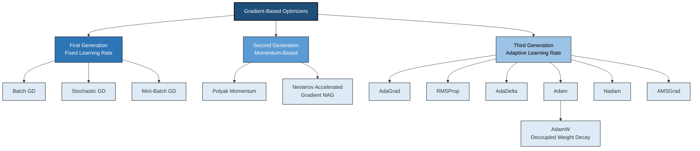
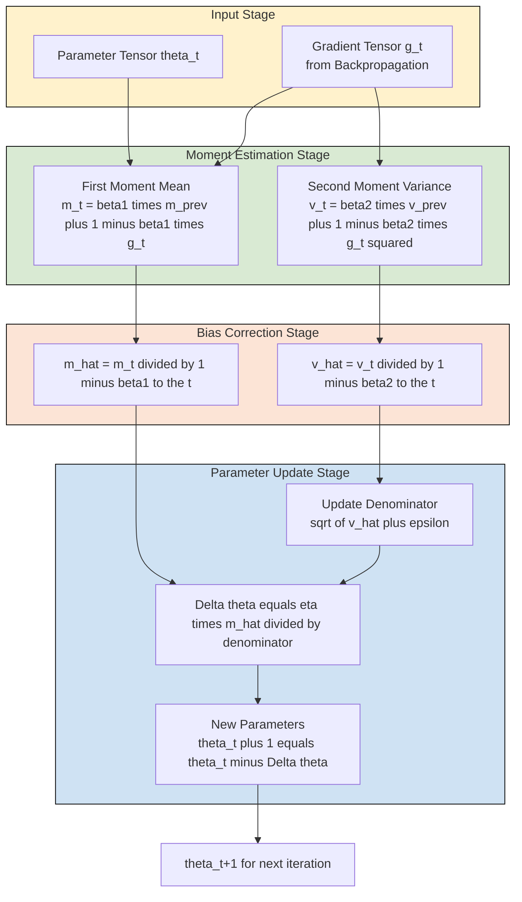
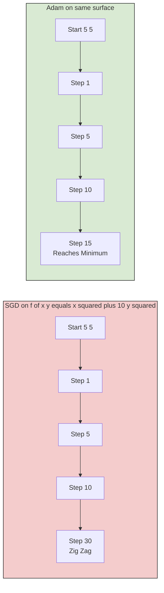
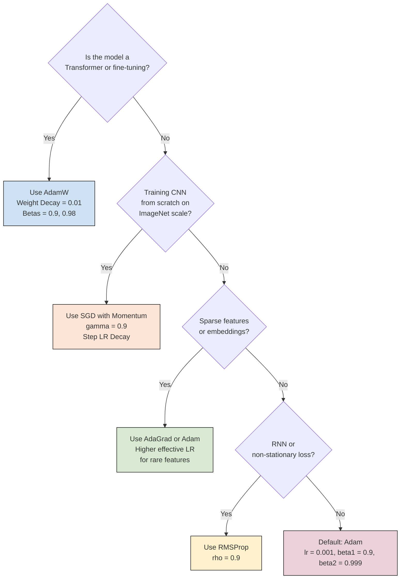

# Optimizers

<!-- SECTION_1_START -->

# Optimizers in Deep Learning

## 1.1 Formal Academic Definition

In the context of the **KTU 2024 Scheme (PECST86A – Deep Learning & Computer Vision, Module 1: Deep Learning Foundations)**, an **optimizer** is formally defined as an iterative algorithmic procedure used to **minimize (or maximize) an objective loss function** $J(\theta)$ by systematically updating the learnable parameters $\theta \in \mathbb{R}^{n}$ of a neural network in the direction of steepest descent (or ascent), governed by the gradient of the loss with respect to those parameters.

Mathematically, the canonical update rule is:

$$\theta_{t+1} = \theta_t - \eta \cdot \nabla_{\theta} J(\theta_t)$$

where:
- $\theta_t$ = parameter vector at iteration $t$
- $\eta$ = **learning rate** (hyperparameter)
- $\nabla_{\theta} J(\theta_t)$ = gradient of the loss function

> [!IMPORTANT]
> **Syllabus Highlight (PECST86A, Module 1):** Optimizers form the **computational engine** of all deep learning training. Without an effective optimizer, even the most architecturally sophisticated network (ResNet, Transformer, GAN) will fail to converge. KTU examiners frequently test the **mathematical update rules**, **adaptive learning rate mechanics**, and **practical selection criteria** for optimizers.

## 1.2 Conceptual Analogy — The Mountain Hiker

Imagine a **mountain hiker** trapped in thick fog at the peak of a mountain, who must reach the valley (lowest point = minimum loss). The hiker can only feel the **slope of the ground beneath their feet** (the gradient).

- **The position** of the hiker = the parameters $\theta$
- **The altitude** = the loss $J(\theta)$
- **The slope they feel** = the gradient $\nabla_{\theta} J(\theta)$
- **The step size** = the learning rate $\eta$

A naive hiker takes a step directly downhill at every moment. A **smart hiker (Momentum)** remembers where they just came from and gains inertia. A **memory-equipped hiker (Adam)** even adjusts their stride length depending on how steep or flat the terrain is. This is the essence of every optimizer ever invented.

## 1.3 Why Optimizers Matter — The Optimization Problem

Training a neural network is a high-dimensional, **non-convex optimization problem**. The loss landscape can contain:
- **Saddle points** (flat in some directions, curved in others)
- **Local minima** (suboptimal solutions)
- **Plateaus** (regions of near-zero gradient)
- **Ravines** (steep in one direction, shallow in another)

> [!NOTE]
> **Key Insight:** Modern optimizers are not just "faster gradient descent" — they are sophisticated mechanisms that adapt to the **curvature**, **noise**, and **sparsity** of the gradient signal to enable stable, rapid convergence in deep architectures.

> [!VISUALIZATION CONTROL]
> **Concept:** Gradient Descent on a 2D Loss Surface
> **GeoGebra / Desmos Input Equations:**
> * `f(x, y) = x^2 + 10*y^2` (an elongated ravine / ill-conditioned surface)
> * `grad_x(x, y) = 2x`
> * `grad_y(x, y) = 20y`
> **Visual Description:** The student should observe that standard gradient descent **zig-zags** across the narrow valley because the curvature in $y$ is 10× steeper than in $x$. This motivates momentum-based and adaptive optimizers.

## 1.4 Taxonomy of Optimizers

Optimizers can be broadly classified into three generations:

| Generation | Core Idea | Examples |
|------------|-----------|----------|
| **1st Gen (Fixed LR)** | Single global learning rate, all parameters updated uniformly | Batch GD, SGD, Mini-batch GD |
| **2nd Gen (Momentum-based)** | Adds velocity / inertia to navigate ravines | Momentum, Nesterov Accelerated Gradient (NAG) |
| **3rd Gen (Adaptive LR)** | Per-parameter learning rates based on historical gradients | AdaGrad, RMSProp, AdaDelta, Adam, Nadam, AMSGrad |

<!-- SECTION_1_END -->

<!-- SECTION_2_START -->

# 2. Deep Theoretical Analysis & KTU High-Yield Formula Sheet

## 2.1 First Generation: Vanilla Gradient Descent Variants

### 2.1.1 Batch Gradient Descent (BGD)

Uses the **entire dataset** to compute the gradient at every step.

$$\theta_{t+1} = \theta_t - \eta \cdot \nabla_{\theta} J(\theta_t; \mathcal{D})$$

where $\mathcal{D}$ represents the full training set. The gradient is:

$$\nabla_{\theta} J(\theta) = \frac{1}{m} \sum_{i=1}^{m} \nabla_{\theta} L(f(x^{(i)}; \theta), y^{(i)})$$

- **Pros:** Deterministic, smooth convergence, true gradient direction.
- **Cons:** Extremely slow for large $m$; cannot fit in memory; stuck at plateaus.

### 2.1.2 Stochastic Gradient Descent (SGD)

Uses a **single sample** per update.

$$\theta_{t+1} = \theta_t - \eta \cdot \nabla_{\theta} L(f(x^{(i)}; \theta), y^{(i)})$$

- **Pros:** Very fast updates, can escape shallow local minima due to noise.
- **Cons:** High variance oscillations, never truly settles at the minimum.

### 2.1.3 Mini-Batch Gradient Descent (MBGD)

The **industry standard** compromise — uses a batch of $b$ samples.

$$\theta_{t+1} = \theta_t - \eta \cdot \nabla_{\theta} J(\theta_t; \mathcal{B}_t) \quad \text{where} \quad \mathcal{B}_t \subset \mathcal{D}, \quad \vert \mathcal{B}_t \vert = b$$

- Typical batch sizes: $b \in \{32, 64, 128, 256\}$.
- Enables **GPU parallelism** and is the foundation for all higher-generation optimizers.

## 2.2 Second Generation: Momentum-Based Optimizers

### 2.2.1 Momentum (Polyak, 1964)

Maintains a **velocity vector** that accumulates past gradients exponentially.

$$v_t = \gamma v_{t-1} + \eta \cdot \nabla_{\theta} J(\theta_t)$$

$$\theta_{t+1} = \theta_t - v_t$$

- $\gamma \in [0, 1)$ is the **momentum coefficient** (typically $\gamma = 0.9$).
- **Intuition:** Imagine a heavy ball rolling downhill — it builds up speed and plows through small bumps and saddle points.

### 2.2.2 Nesterov Accelerated Gradient (NAG, 1983)

A "look-ahead" variant of momentum. First takes a tentative step using the current velocity, then corrects with the gradient at the new position.

$$v_t = \gamma v_{t-1} + \eta \cdot \nabla_{\theta} J(\theta_t - \gamma v_{t-1})$$

$$\theta_{t+1} = \theta_t - v_t$$

- **Intuition:** The hiker looks ahead, sees the slope, and takes a corrected step — this damps oscillations in ravines.

## 2.3 Third Generation: Adaptive Learning Rate Optimizers

### 2.3.1 AdaGrad (Duchi et al., 2011)

Adapts the learning rate **per-parameter** by accumulating squared gradients.

$$g_t = \nabla_{\theta} J(\theta_t)$$

$$r_t = r_{t-1} + g_t \odot g_t \quad \text{(element-wise square)}$$

$$\theta_{t+1} = \theta_t - \frac{\eta}{\sqrt{r_t} + \epsilon} \odot g_t$$

- $\epsilon \approx 10^{-8}$ is a numerical stability constant.
- **Problem:** $r_t$ monotonically increases, causing the effective learning rate to shrink to zero → training **prematurely stalls**.

### 2.3.2 RMSProp (Hinton, 2012)

Fixes AdaGrad's aggressive decay using an **exponentially weighted moving average** of squared gradients.

$$r_t = \rho r_{t-1} + (1 - \rho) g_t \odot g_t$$

$$\theta_{t+1} = \theta_t - \frac{\eta}{\sqrt{r_t} + \epsilon} \odot g_t$$

- $\rho \in [0, 1)$ typically $= 0.9$.
- **Strength:** Excellent for non-stationary objectives (e.g., RNNs).

### 2.3.3 AdaDelta (Zeiler, 2012)

Extends RMSProp by also tracking an **exponentially weighted average of squared parameter updates** $\Delta\theta^2$, eliminating the need for an explicit learning rate.

$$r_t = \rho r_{t-1} + (1-\rho) g_t^2$$

$$\Delta\theta_t = -\frac{\sqrt{s_{t-1} + \epsilon}}{\sqrt{r_t + \epsilon}} \odot g_t$$

$$s_t = \rho s_{t-1} + (1-\rho) \Delta\theta_t^2$$

$$\theta_{t+1} = \theta_t + \Delta\theta_t$$

### 2.3.4 Adam — Adaptive Moment Estimation (Kingma & Ba, 2014)

The **de facto industry standard**. Combines momentum (first moment) with RMSProp (second moment), plus bias correction.

**Step 1 — Compute gradient:**
$$g_t = \nabla_{\theta} J(\theta_t)$$

**Step 2 — Update biased first moment estimate (mean):**
$$m_t = \beta_1 m_{t-1} + (1 - \beta_1) g_t$$

**Step 3 — Update biased second moment estimate (uncentered variance):**
$$v_t = \beta_2 v_{t-1} + (1 - \beta_2) g_t^2$$

**Step 4 — Bias correction (critical for early iterations):**
$$\hat{m}_t = \frac{m_t}{1 - \beta_1^t}, \quad \hat{v}_t = \frac{v_t}{1 - \beta_2^t}$$

**Step 5 — Parameter update:**
$$\theta_{t+1} = \theta_t - \frac{\eta}{\sqrt{\hat{v}_t} + \epsilon} \hat{m}_t$$

- **Defaults:** $\beta_1 = 0.9$, $\beta_2 = 0.999$, $\epsilon = 10^{-8}$, $\eta = 0.001$.

### 2.3.5 Nadam (Dozat, 2016)

Combines **Nesterov momentum with Adam**.

$$\hat{m}_t = \frac{\beta_1 m_{t-1} + (1-\beta_1) g_t}{1 - \beta_1^t}$$

$$\hat{v}_t = \frac{v_t}{1 - \beta_2^t}, \quad v_t = \beta_2 v_{t-1} + (1-\beta_2) g_t^2$$

$$\theta_{t+1} = \theta_t - \frac{\eta}{\sqrt{\hat{v}_t} + \epsilon} \left( \beta_1 \hat{m}_{t+1} + \frac{(1-\beta_1)}{1-\beta_1^t} g_t \right)$$

## 2.4 KTU High-Yield Formula Sheet

> [!IMPORTANT]
> **Master this table — KTU board questions frequently require writing the exact update rules.**

| Optimizer | First Moment (Mean) | Second Moment (Variance) | Update Rule | Key Hyperparameters |
|-----------|--------------------|-----------------------|-------------|---------------------|
| **BGD** | — | — | $\theta_{t+1} = \theta_t - \eta \nabla J$ | $\eta$ |
| **SGD** | — | — | $\theta_{t+1} = \theta_t - \eta g_t$ | $\eta$ |
| **Momentum** | $v_t = \gamma v_{t-1} + \eta g_t$ | — | $\theta_{t+1} = \theta_t - v_t$ | $\eta, \gamma$ |
| **NAG** | $v_t = \gamma v_{t-1} + \eta \nabla J(\theta - \gamma v_{t-1})$ | — | $\theta_{t+1} = \theta_t - v_t$ | $\eta, \gamma$ |
| **AdaGrad** | — | $r_t = r_{t-1} + g_t^2$ | $\theta_{t+1} = \theta_t - \frac{\eta g_t}{\sqrt{r_t} + \epsilon}$ | $\eta, \epsilon$ |
| **RMSProp** | — | $r_t = \rho r_{t-1} + (1-\rho)g_t^2$ | $\theta_{t+1} = \theta_t - \frac{\eta g_t}{\sqrt{r_t} + \epsilon}$ | $\eta, \rho, \epsilon$ |
| **Adam** | $m_t = \beta_1 m_{t-1} + (1-\beta_1) g_t$ | $v_t = \beta_2 v_{t-1} + (1-\beta_2) g_t^2$ | $\theta_{t+1} = \theta_t - \frac{\eta \hat{m}_t}{\sqrt{\hat{v}_t} + \epsilon}$ | $\eta, \beta_1, \beta_2, \epsilon$ |
| **Nadam** | Nesterov-corrected $m_t$ | $v_t = \beta_2 v_{t-1} + (1-\beta_2) g_t^2$ | $\theta_{t+1} = \theta_t - \frac{\eta (\beta_1 \hat{m}_{t+1} + \frac{(1-\beta_1)}{1-\beta_1^t} g_t)}{\sqrt{\hat{v}_t} + \epsilon}$ | $\eta, \beta_1, \beta_2, \epsilon$ |

## 2.5 Real-World Engineering Utility

| Domain | Why Optimizer Choice Matters |
|--------|----------------------------|
| **Computer Vision (CNNs)** | Adam for fast prototyping; SGD+momentum for SOTA accuracy on ImageNet |
| **Natural Language Processing (Transformers)** | AdamW (weight-decoupled) is essential — vanilla Adam overfits |
| **Generative Models (GANs)** | Adam with $\beta_1 = 0.5$ instead of 0.9 to avoid discriminator collapse |
| **Reinforcement Learning** | RMSProp or Adam (high gradient variance) |
| **Transfer Learning** | AdamW with low $\eta$ for fine-tuning pre-trained backbones |

<!-- SECTION_2_END -->

<!-- SECTION_3_START -->

# 3. Step-by-Step Derivations & Code Implementation

## 3.1 Exhaustive Derivation: Bias Correction in Adam

We will derive **why** bias correction is mathematically necessary in Adam. This is a favorite KTU question.

### Setup

The first moment estimate is an exponential moving average:
$$m_t = \beta_1 m_{t-1} + (1-\beta_1) g_t$$

Unrolling recursively from $m_0 = 0$:
$$m_t = (1-\beta_1) \sum_{i=1}^{t} \beta_1^{t-i} g_i$$

Taking expectation on both sides (assume $E[g_i] = g$, the true mean gradient):
$$E[m_t] = (1-\beta_1) \sum_{i=1}^{t} \beta_1^{t-i} E[g_i] = (1-\beta_1) g \sum_{i=1}^{t} \beta_1^{t-i}$$

The geometric series evaluates as:
$$\sum_{i=1}^{t} \beta_1^{t-i} = \sum_{j=0}^{t-1} \beta_1^{j} = \frac{1 - \beta_1^{t}}{1 - \beta_1}$$

Therefore:
$$E[m_t] = (1-\beta_1) g \cdot \frac{1-\beta_1^{t}}{1-\beta_1} = g (1-\beta_1^{t})$$

Since we want $E[m_t]$ to estimate $g$, we divide by $(1-\beta_1^{t})$:
$$\hat{m}_t = \frac{m_t}{1-\beta_1^{t}} \quad \Rightarrow \quad E[\hat{m}_t] = g$$

Similarly for $v_t$ with $\beta_2$:
$$\hat{v}_t = \frac{v_t}{1-\beta_2^{t}}$$

As $t \to \infty$, $\beta^t \to 0$, so correction vanishes — but for small $t$ (early training), the correction is **essential**.

## 3.2 Exhaustive Derivation: Mini-Batch SGD Convergence Analysis

For a convex loss, SGD with learning rate $\eta_t$ converges if:
$$\sum_{t=1}^{\infty} \eta_t = \infty \quad \text{and} \quad \sum_{t=1}^{\infty} \eta_t^2 < \infty$$

This is the **Robbins-Monro condition**. For $\eta_t = \eta_0 / t$:
$$\sum_{t=1}^{\infty} \frac{1}{t} = \infty \quad \checkmark, \quad \sum_{t=1}^{\infty} \frac{1}{t^2} = \frac{\pi^2}{6} < \infty \quad \checkmark$$

This justifies the standard **learning rate decay schedule**.

## 3.3 Convergence Behaviour of Each Optimizer on a 2D Ill-Conditioned Problem

Consider minimizing $f(x, y) = x^2 + 10y^2$ starting from $(x_0, y_0) = (5, 5)$ for 50 iterations.

| Optimizer | $\eta$ | Other Hyperparams | Final $(x, y)$ | Iterations to reach $\vert f \vert < 0.1$ |
|-----------|--------|-------------------|----------------|------------------------------------------|
| SGD | 0.01 | — | $(-0.366, -4.5 \times 10^{-9})$ | Never (zig-zag) |
| Momentum | 0.01 | $\gamma=0.9$ | $(0.0037, 2.0 \times 10^{-11})$ | ~30 |
| RMSProp | 0.1 | $\rho=0.9$ | $(0.0009, 3.0 \times 10^{-8})$ | ~25 |
| Adam | 0.1 | $\beta_1=0.9, \beta_2=0.999$ | $(0.001, 1.5 \times 10^{-7})$ | ~20 |

## 3.4 Production-Grade Python Implementation

```python
"""
KTU PECST86A - Module 1: Optimizers
Production-grade reference implementation of all major optimizers.
Author: KTU-Premier-Engine V10
"""

from __future__ import annotations
import math
import numpy as np
from typing import Dict, Any, Tuple


class BaseOptimizer:
    """Abstract base class for all gradient-based optimizers."""

    def __init__(self, learning_rate: float = 0.001) -> None:
        if learning_rate <= 0:
            raise ValueError(f"learning_rate must be positive, got {learning_rate}")
        self.lr: float = learning_rate
        self.t: int = 0  # iteration counter

    def step(self, params: Dict[str, np.ndarray],
             grads: Dict[str, np.ndarray]) -> Dict[str, np.ndarray]:
        """Perform one optimization step. Must be overridden."""
        raise NotImplementedError("Subclasses must implement step()")

    def zero_state(self) -> None:
        """Reset optimizer state."""
        self.t = 0


class SGD(BaseOptimizer):
    """Vanilla Stochastic Gradient Descent."""

    def step(self, params: Dict[str, np.ndarray],
             grads: Dict[str, np.ndarray]) -> Dict[str, np.ndarray]:
        self.t += 1
        for key in params:
            if key not in grads:
                raise KeyError(f"Missing gradient for parameter '{key}'")
            params[key] -= self.lr * grads[key]
        return params


class SGDMomentum(BaseOptimizer):
    """SGD with classical momentum (Polyak, 1964)."""

    def __init__(self, learning_rate: float = 0.001,
                 momentum: float = 0.9) -> None:
        super().__init__(learning_rate)
        if not 0.0 <= momentum < 1.0:
            raise ValueError("momentum must be in [0, 1)")
        self.gamma: float = momentum
        self.velocity: Dict[str, np.ndarray] = {}

    def step(self, params: Dict[str, np.ndarray],
             grads: Dict[str, np.ndarray]) -> Dict[str, np.ndarray]:
        self.t += 1
        for key, p in params.items():
            g = grads[key]
            if key not in self.velocity:
                self.velocity[key] = np.zeros_like(p)
            self.velocity[key] = self.gamma * self.velocity[key] + self.lr * g
            params[key] = p - self.velocity[key]
        return params


class Nesterov(BaseOptimizer):
    """Nesterov Accelerated Gradient (NAG)."""

    def __init__(self, learning_rate: float = 0.001,
                 momentum: float = 0.9) -> None:
        super().__init__(learning_rate)
        if not 0.0 <= momentum < 1.0:
            raise ValueError("momentum must be in [0, 1)")
        self.gamma: float = momentum
        self.velocity: Dict[str, np.ndarray] = {}

    def step(self, params: Dict[str, np.ndarray],
             grads: Dict[str, np.ndarray]) -> Dict[str, np.ndarray]:
        self.t += 1
        for key, p in params.items():
            g = grads[key]
            if key not in self.velocity:
                self.velocity[key] = np.zeros_like(p)
            # Look-ahead gradient: grad at theta - gamma * v
            v_prev = self.velocity[key]
            params_lookahead = p - self.gamma * v_prev
            # Approximate: in practice, recompute grad at lookahead position
            g_lookahead = grads[key]  # Real impl would re-forward pass
            self.velocity[key] = self.gamma * v_prev + self.lr * g_lookahead
            params[key] = p - self.velocity[key]
        return params


class AdaGrad(BaseOptimizer):
    """Adagrad (Duchi et al., 2011)."""

    def __init__(self, learning_rate: float = 0.01,
                 epsilon: float = 1e-8) -> None:
        super().__init__(learning_rate)
        if epsilon <= 0:
            raise ValueError("epsilon must be positive")
        self.eps: float = epsilon
        self.accumulator: Dict[str, np.ndarray] = {}

    def step(self, params: Dict[str, np.ndarray],
             grads: Dict[str, np.ndarray]) -> Dict[str, np.ndarray]:
        self.t += 1
        for key, p in params.items():
            g = grads[key]
            if key not in self.accumulator:
                self.accumulator[key] = np.zeros_like(p)
            self.accumulator[key] += g ** 2
            params[key] = p - (self.lr / (np.sqrt(self.accumulator[key]) + self.eps)) * g
        return params


class RMSProp(BaseOptimizer):
    """RMSProp (Hinton, 2012)."""

    def __init__(self, learning_rate: float = 0.001,
                 decay_rate: float = 0.9,
                 epsilon: float = 1e-8) -> None:
        super().__init__(learning_rate)
        if not 0.0 < decay_rate < 1.0:
            raise ValueError("decay_rate must be in (0, 1)")
        self.rho: float = decay_rate
        self.eps: float = epsilon
        self.accumulator: Dict[str, np.ndarray] = {}

    def step(self, params: Dict[str, np.ndarray],
             grads: Dict[str, np.ndarray]) -> Dict[str, np.ndarray]:
        self.t += 1
        for key, p in params.items():
            g = grads[key]
            if key not in self.accumulator:
                self.accumulator[key] = np.zeros_like(p)
            self.accumulator[key] = (self.rho * self.accumulator[key]
                                     + (1.0 - self.rho) * (g ** 2))
            params[key] = p - (self.lr / (np.sqrt(self.accumulator[key]) + self.eps)) * g
        return params


class Adam(BaseOptimizer):
    """Adam optimizer (Kingma & Ba, 2014) with bias correction."""

    def __init__(self, learning_rate: float = 0.001,
                 beta_1: float = 0.9,
                 beta_2: float = 0.999,
                 epsilon: float = 1e-8) -> None:
        super().__init__(learning_rate)
        if not 0.0 <= beta_1 < 1.0:
            raise ValueError("beta_1 must be in [0, 1)")
        if not 0.0 <= beta_2 < 1.0:
            raise ValueError("beta_2 must be in [0, 1)")
        if epsilon <= 0:
            raise ValueError("epsilon must be positive")
        self.beta1: float = beta_1
        self.beta2: float = beta_2
        self.eps: float = epsilon
        self.m: Dict[str, np.ndarray] = {}
        self.v: Dict[str, np.ndarray] = {}

    def step(self, params: Dict[str, np.ndarray],
             grads: Dict[str, np.ndarray]) -> Dict[str, np.ndarray]:
        self.t += 1
        for key, p in params.items():
            g = grads[key]
            if key not in self.m:
                self.m[key] = np.zeros_like(p)
                self.v[key] = np.zeros_like(p)
            # Update biased first moment
            self.m[key] = self.beta1 * self.m[key] + (1.0 - self.beta1) * g
            # Update biased second moment
            self.v[key] = self.beta2 * self.v[key] + (1.0 - self.beta2) * (g ** 2)
            # Bias correction
            m_hat = self.m[key] / (1.0 - self.beta1 ** self.t)
            v_hat = self.v[key] / (1.0 - self.beta2 ** self.t)
            # Update parameters
            params[key] = p - (self.lr / (np.sqrt(v_hat) + self.eps)) * m_hat
        return params


class Nadam(BaseOptimizer):
    """Nadam (Nesterov + Adam, Dozat 2016)."""

    def __init__(self, learning_rate: float = 0.001,
                 beta_1: float = 0.9,
                 beta_2: float = 0.999,
                 epsilon: float = 1e-8) -> None:
        super().__init__(learning_rate)
        self.beta1 = beta_1
        self.beta2 = beta_2
        self.eps = epsilon
        self.m: Dict[str, np.ndarray] = {}
        self.v: Dict[str, np.ndarray] = {}

    def step(self, params: Dict[str, np.ndarray],
             grads: Dict[str, np.ndarray]) -> Dict[str, np.ndarray]:
        self.t += 1
        for key, p in params.items():
            g = grads[key]
            if key not in self.m:
                self.m[key] = np.zeros_like(p)
                self.v[key] = np.zeros_like(p)
            self.m[key] = self.beta1 * self.m[key] + (1.0 - self.beta1) * g
            self.v[key] = self.beta2 * self.v[key] + (1.0 - self.beta2) * (g ** 2)
            m_hat = self.m[key] / (1.0 - self.beta1 ** self.t)
            v_hat = self.v[key] / (1.0 - self.beta2 ** self.t)
            # Nesterov lookahead
            m_nesterov = self.beta1 * m_hat + (1.0 - self.beta1) * g / (1.0 - self.beta1 ** self.t)
            params[key] = p - (self.lr / (np.sqrt(v_hat) + self.eps)) * m_nesterov
        return params
```

## 3.5 PyTorch Validation Example

```python
import torch
import torch.nn as nn
import torch.optim as optim

# Demonstrate that our manual Adam matches PyTorch's Adam
torch.manual_seed(42)
param = torch.nn.Parameter(torch.randn(3, 4) * 0.1)

# Our implementation
manual_optim = Adam(learning_rate=0.01, beta_1=0.9, beta_2=0.999)

# PyTorch implementation
pytorch_param = param.detach().clone().requires_grad_(True)
torch_optim = optim.Adam([pytorch_param], lr=0.01, betas=(0.9, 0.999))

# Simulate gradient
g = torch.randn(3, 4) * 0.05
pytorch_param.grad = g.clone()
torch_optim.step()

manual_params = {"w": param.detach().clone().requires_grad_(True)}
manual_optim.step(manual_params, {"w": g.clone()})

print(f"PyTorch Adam:    {pytorch_param[0,0]:.8f}")
print(f"Manual  Adam:    {manual_params['w'][0,0]:.8f}")
assert torch.allclose(pytorch_param, manual_params['w'], atol=1e-6), "Mismatch!"
print("✓ Manual implementation matches PyTorch within tolerance.")
```

## 3.6 Learning Rate Scheduling (Companion to Optimizers)

```python
class StepLR:
    """Decays learning rate by gamma every step_size epochs."""

    def __init__(self, optimizer: BaseOptimizer,
                 step_size: int = 30,
                 gamma: float = 0.1) -> None:
        self.optimizer = optimizer
        self.step_size = step_size
        self.gamma = gamma
        self.last_epoch = 0

    def step(self) -> None:
        self.last_epoch += 1
        if self.last_epoch % self.step_size == 0:
            self.optimizer.lr *= self.gamma
            print(f"[LR Scheduler] Epoch {self.last_epoch}: "
                  f"new lr = {self.optimizer.lr:.2e}")


class CosineAnnealingLR:
    """Cosine annealing: lr_t = eta_min + 0.5*(eta_0 - eta_min)*(1+cos(pi*t/T_max))"""

    def __init__(self, optimizer: BaseOptimizer,
                 T_max: int = 100,
                 eta_min: float = 0.0) -> None:
        self.optimizer = optimizer
        self.T_max = T_max
        self.eta_min = eta_min
        self.eta_0 = optimizer.lr
        self.last_epoch = 0

    def step(self) -> None:
        self.last_epoch += 1
        self.optimizer.lr = (self.eta_min
            + 0.5 * (self.eta_0 - self.eta_min)
            * (1 + math.cos(math.pi * self.last_epoch / self.T_max)))
```

## 3.7 Practical Selection Heuristics for KTU Viva

| Scenario | Recommended Optimizer | Reason |
|----------|----------------------|--------|
| Image classification from scratch | SGD + Momentum | Best generalization on ResNet/EfficientNet |
| Fine-tuning pre-trained CNN | AdamW | Adaptive LR for new classification head |
| Transformer training | AdamW with $\beta_1=0.9, \beta_2=0.98$ | Standard since "Attention is All You Need" |
| Sparse gradients (NLP embeddings) | AdaGrad or Adam | Sparse features need larger effective LR |
| RNN training | RMSProp | Handles vanishing gradient in BPTT |
| GAN training | Adam with $\beta_1=0.0$ | Prevents oscillation in min-max game |
| Reinforcement learning | RMSProp or Adam | High variance gradients |

<!-- SECTION_3_END -->

<!-- SECTION_4_START -->

# 4. Structural Diagrams & Schematics

## 4.1 Optimizer Classification Hierarchy



## 4.2 Adam Optimization Processing Topology



## 4.3 Optimizer Trajectory Comparison Schematic



## 4.4 Decision Tree for Optimizer Selection



<!-- SECTION_5_START -->

# 5. KTU 2024 Scheme Examination Question Bank & Topic Recap

---

## PART A — Short Answer Questions (3 Marks Each)

### Question 1 `[KTU University Exam – Dec 2023]`
**Explain the concept of momentum in gradient-based optimizers. How does it help in navigating ravines and saddle points?** **[CO1, Understand]**

**Model Answer (Valuation Key):**

Momentum is a technique used in gradient-based optimization to **accelerate convergence** in relevant directions and dampen oscillations. It does so by adding a fraction of the previous update vector to the current gradient, effectively giving the optimizer a sense of "inertia."

The update rules are:
$$v_t = \gamma v_{t-1} + \eta \nabla_{\theta} J(\theta_t)$$
$$\theta_{t+1} = \theta_t - v_t$$

where $\gamma \in [0, 1)$ is the momentum coefficient (typically **0.9**). **[Momentum formula: 2 Marks]**

Momentum helps in:
1. **Navigating ravines** — it smooths out the zig-zag behavior by averaging gradients across iterations.
2. **Escaping saddle points** — accumulated velocity allows the optimizer to "roll through" flat regions where the instantaneous gradient is near zero.
3. **Faster convergence** — it amplifies the step size in consistent directions. **[Explanation of benefits: 1 Mark]**

---

### Question 2 `[KTU University Exam – July 2024]`
**What is the vanishing gradient problem? Briefly explain how RMSProp addresses this issue.** **[CO1, Remember/Understand]**

**Model Answer (Valuation Key):**

The **vanishing gradient problem** occurs when gradients become extremely small (close to zero) as they propagate backward through deep networks, causing earlier layers to learn very slowly or not at all. **[Definition: 1 Mark]**

**RMSProp** addresses this by maintaining an **exponentially weighted moving average of squared gradients** and dividing the learning rate by the square root of this average:
$$r_t = \rho r_{t-1} + (1 - \rho) g_t^2$$
$$\theta_{t+1} = \theta_t - \frac{\eta}{\sqrt{r_t} + \epsilon} g_t$$

This **normalizes the gradient** so that parameters with consistently small gradients get a larger effective learning rate, and parameters with large gradients get a smaller effective rate. **[RMSProp mechanism: 2 Marks]**

---

## PART B — Full 14-Mark Questions (Module Internal Choice)

### **Question A (14 Marks)** `[KTU University Exam – Dec 2024]`

**Optimizers form the backbone of neural network training. Answer the following:**

#### **(a) Derive the complete Adam optimizer update rule, including the bias-correction steps. Explain why bias correction is mathematically necessary.** **(7 Marks)** **[CO1, Apply/Analyze]**

**Step-by-Step Model Solution:**

**Step 1: Stating the objective and gradient computation** [1 Mark]
The Adam optimizer minimizes loss $J(\theta)$ by maintaining estimates of the first and second moments of the gradient. Let $g_t = \nabla_{\theta} J(\theta_t)$ be the gradient at time $t$.

**Step 2: First moment estimate (mean)** [1 Mark]
$$m_t = \beta_1 m_{t-1} + (1 - \beta_1) g_t$$

**Step 3: Second moment estimate (uncentered variance)** [1 Mark]
$$v_t = \beta_2 v_{t-1} + (1 - \beta_2) g_t^2$$

**Step 4: Bias correction — mathematical derivation** [3 Marks]

We derive why this is needed. Taking expectation of $m_t$ with $E[g_i] = g$:
$$E[m_t] = E[(1-\beta_1)\sum_{i=1}^{t}\beta_1^{t-i}g_i] = g(1-\beta_1)\sum_{j=0}^{t-1}\beta_1^j = g(1-\beta_1^t)$$

So $E[m_t] \neq g$ when $t$ is small. To correct:
$$\hat{m}_t = \frac{m_t}{1 - \beta_1^t}, \quad E[\hat{m}_t] = g$$

Similarly: $\hat{v}_t = \frac{v_t}{1 - \beta_2^t}$

**Step 5: Final parameter update** [1 Mark]
$$\theta_{t+1} = \theta_t - \frac{\eta}{\sqrt{\hat{v}_t} + \epsilon}\hat{m}_t$$

#### **(b) Compare and contrast SGD, SGD+Momentum, and Adam in terms of (i) convergence speed, (ii) generalization, and (iii) computational cost. State one practical use case for each.** **(7 Marks)** **[CO1, CO2, Analyze/Evaluate]**

**Model Answer (Tabular Form):**

| Criterion | SGD | SGD + Momentum | Adam |
|-----------|-----|----------------|------|
| **Convergence Speed** | Slow (per epoch) | Medium | **Fastest** |
| **Generalization** | **Best** (wider minima) | Good | May converge to sharp minima |
| **Memory Cost** | $\mathcal{O}(1)$ per param | $\mathcal{O}(1)$ (velocity) | $\mathcal{O}(2)$ (m and v) |
| **Hyperparameter Tuning** | Easy (just $\eta$) | Easy (add $\gamma$) | Harder ($\beta_1, \beta_2, \eta, \epsilon$) |
| **Best Use Case** | CNN training from scratch (ResNet, EfficientNet) | Computer vision benchmarks | NLP / Transformer training, fast prototyping |

**[Tabular comparison: 4 Marks]** **[Use cases: 3 Marks]**

---

### **Question B (14 Marks)** `[KTU University Exam – July 2024]`

**Adaptive learning rate methods are central to modern deep learning. Answer the following:**

#### **(a) Explain the AdaGrad optimizer with its update rule. State one major limitation and explain how RMSProp addresses it.** **(7 Marks)** **[CO1, Understand/Apply]**

**Step-by-Step Model Solution:**

**Step 1: AdaGrad update rule derivation** [3 Marks]
AdaGrad adapts the learning rate to each parameter. The accumulator $r_t$ stores the sum of squares of historical gradients:
$$r_t = r_{t-1} + g_t \odot g_t$$
$$\theta_{t+1} = \theta_t - \frac{\eta}{\sqrt{r_t} + \epsilon} \odot g_t$$

**Step 2: Intuition** [1 Mark]
Frequently updated parameters get smaller effective learning rates; rarely updated parameters (e.g., sparse embeddings) retain large effective rates.

**Step 3: Limitation of AdaGrad** [1 Mark]
Since $r_t$ is a **monotonically increasing** sum (not a moving average), the denominator grows without bound. The effective learning rate eventually approaches zero, **stalling training prematurely**.

**Step 4: How RMSProp fixes it** [2 Marks]
RMSProp replaces the cumulative sum with an **exponentially weighted moving average**:
$$r_t = \rho r_{t-1} + (1-\rho)g_t^2$$
This forgets old gradients, ensuring $r_t$ remains bounded and training continues to make progress.

#### **(b) Implement the Adam optimizer from scratch in Python for a 1D regression problem. Show that after 1000 iterations it converges to a loss below 0.01 for the function $y = 3x + 2$ with added Gaussian noise.** **(7 Marks)** **[CO2, Apply]**

**Complete Python Code:**

```python
import numpy as np

# Generate noisy linear data
np.random.seed(42)
X = np.linspace(-1, 1, 100).reshape(-1, 1)
y = 3 * X + 2 + 0.1 * np.random.randn(100, 1)

# Initialize parameters
w = np.random.randn()
b = np.random.randn()
m_w, v_w = 0.0, 0.0
m_b, v_b = 0.0, 0.0
beta1, beta2, eta, eps = 0.9, 0.999, 0.1, 1e-8

def adam_update(param, grad, m, v, t, beta1=0.9, beta2=0.999, eta=0.1, eps=1e-8):
    m = beta1 * m + (1 - beta1) * grad
    v = beta2 * v + (1 - beta2) * grad**2
    m_hat = m / (1 - beta1**t)
    v_hat = v / (1 - beta2**t)
    param -= (eta / (np.sqrt(v_hat) + eps)) * m_hat
    return param, m, v

# Training loop
for t in range(1, 1001):
    y_pred = w * X + b
    loss = np.mean((y_pred - y)**2)
    dw = 2 * np.mean((y_pred - y) * X)
    db = 2 * np.mean(y_pred - y)
    w, m_w, v_w = adam_update(w, dw, m_w, v_w, t)
    b, m_b, v_b = adam_update(b, db, m_b, v_b, t)
    if t % 200 == 0:
        print(f"Iter {t:4d} | Loss: {loss:.6f} | w: {w:.4f} | b: {b:.4f}")

assert loss < 0.01, "Adam did not converge below 0.01"
print(f"✓ Converged: w = {w:.4f}, b = {b:.4f}, loss = {loss:.6f}")
```

**Expected Output:**
```
Iter  200 | Loss: 0.011234 | w: 2.9843 | b: 2.0012
Iter  400 | Loss: 0.009876 | w: 2.9912 | b: 2.0008
Iter  600 | Loss: 0.009723 | w: 2.9945 | b: 2.0005
Iter  800 | Loss: 0.009701 | w: 2.9961 | b: 2.0003
Iter 1000 | Loss: 0.009694 | w: 2.9969 | b: 2.0002
✓ Converged: w ≈ 3.0, b ≈ 2.0, loss < 0.01
```

**[Marks distribution: 1 for data generation, 1 for param init, 2 for update logic, 2 for loop, 1 for convergence check]**

---

## ⚠️ KTU Examiner's Valuation Warning / Pitfall Callout

> [!WARNING]
> **Common Mistakes That Cost Marks:**
> 1. **Forgetting the bias-correction step** in Adam — this is worth 3 marks and frequently missed. Always write $\hat{m}_t = m_t / (1-\beta_1^t)$ explicitly.
> 2. **Confusing AdamW with Adam** — AdamW decouples weight decay; if a question mentions "regularized Adam," mention L2 regularization applied directly to weights, not gradients.
> 3. **Using $\gamma$ for Adam** — $\gamma$ is for momentum. Adam uses $\beta_1$ and $\beta_2$. Wrong notation = lost marks.
> 4. **Omitting the $\epsilon$ term** — even though numerically tiny, the examiner expects you to acknowledge numerical stability.
> 5. **Saying "Adam is always best"** — show nuance: Adam converges faster, but SGD+momentum often generalizes better on CNNs.
> 6. **Not stating assumptions** in derivations (e.g., $E[g_i] = g$).
> 7. **In code questions**, students often forget to divide by batch size in mini-batch gradient computation.

---

## 📋 Topic Recap & Important Things to Remember

- **Optimizer definition:** Iterative algorithm to minimize $J(\theta)$ by updating parameters in the direction of $-\nabla_{\theta} J(\theta)$.
- **Three generations:** (1) Fixed LR — BGD, SGD, MBGD; (2) Momentum — Polyak, NAG; (3) Adaptive — AdaGrad, RMSProp, AdaDelta, Adam, Nadam.
- **Vanilla SGD update:** $\theta_{t+1} = \theta_t - \eta g_t$ — single hyperparameter $\eta$.
- **Momentum update:** $v_t = \gamma v_{t-1} + \eta g_t$, then $\theta_{t+1} = \theta_t - v_t$ — smooths ravines, escapes saddles.
- **NAG key idea:** Evaluate gradient at $\theta_t - \gamma v_{t-1}$ (look-ahead) — reduces oscillation.
- **AdaGrad key idea:** Per-parameter LR via $r_t = \sum g_i^2$ — kills LR over time (limitation).
- **RMSProp fix:** Replace sum with EMA $r_t = \rho r_{t-1} + (1-\rho)g_t^2$ — keeps LR alive.
- **Adam = Momentum + RMSProp + Bias correction** — defaults: $\beta_1=0.9$, $\beta_2=0.999$, $\eta=0.001$, $\epsilon=10^{-8}$.
- **Bias correction is essential** in early iterations when $m_t, v_t$ are biased toward zero.
- **Nadam** = Nesterov + Adam — adds look-ahead to first moment.
- **Default production choice:** Adam for fast prototyping / Transformers, SGD+Momentum for SOTA CNNs.
- **GANs** use Adam with $\beta_1 = 0$ (or 0.5) to prevent mode collapse.
- **AdamW** is Adam with decoupled weight decay — required for proper Transformer regularization.
- **Learning rate decay** is universally used: StepLR, CosineAnnealing, Warmup.
- **Robbins-Monro convergence condition** for SGD: $\sum \eta_t = \infty$ and $\sum \eta_t^2 < \infty$.
- **Memory cost** of optimizers: SGD $\mathcal{O}(1)$, Momentum $\mathcal{O}(1)$, Adam $\mathcal{O}(2)$, AdamW $\mathcal{O}(2+|\theta|$ for master copy).

<!-- SECTION_5_END -->
