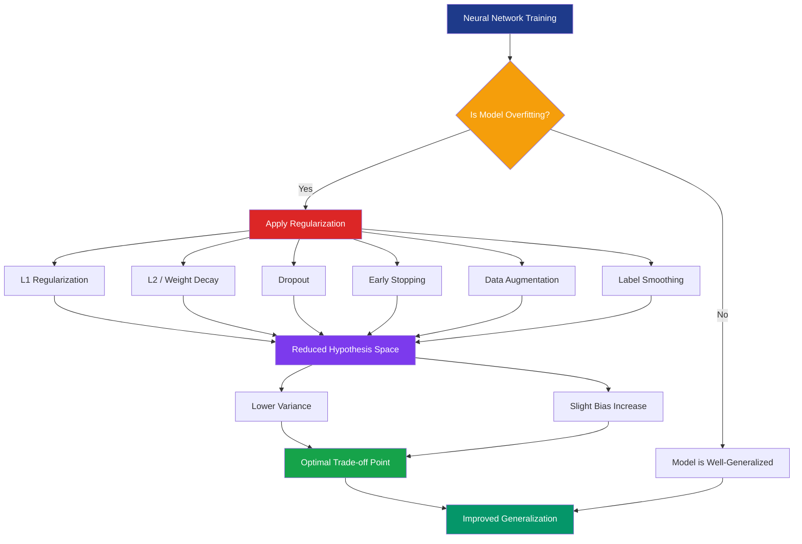
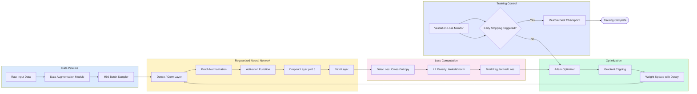
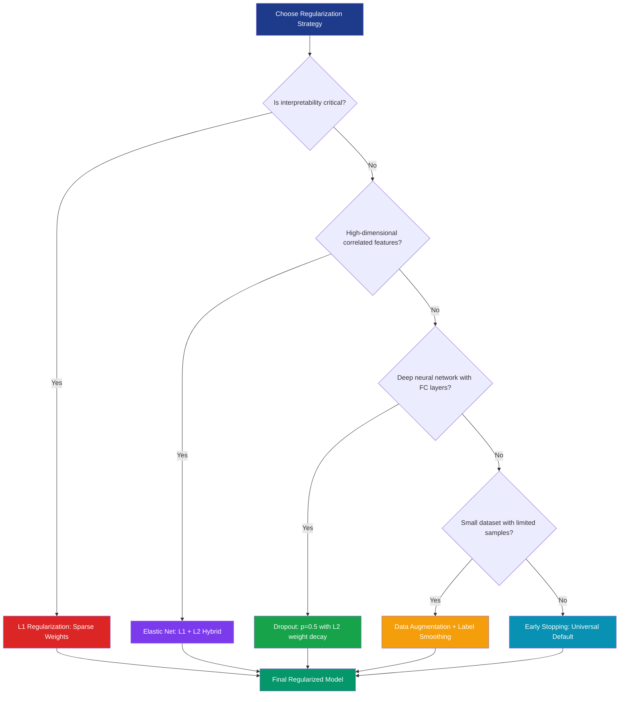

# Regularization

<!-- SECTION_1_START -->
# Regularization in Deep Learning — Core Technical Definition & Intuition

## 📘 Formal Academic Definition

**Regularization** is a set of mathematical techniques and training strategies used in deep learning to **reduce generalization error** (the error on unseen test data) without significantly increasing the **training error**. Formally, regularization introduces an inductive bias into the learning algorithm — typically by constraining the hypothesis space $\mathcal{H}$ of admissible model parameters $\theta \in \mathbb{R}^n$, or by adding a penalty term to the empirical risk functional.

In the KTU 2024 Scheme context (Module 1 — *Deep Learning Foundations*), regularization is positioned as the **principal defense mechanism against overfitting**, which occurs when a neural network learns spurious patterns, noise, or memorizes training samples rather than discovering generalizable decision boundaries.

Mathematically, the regularized objective function is given as:

$$\mathcal{L}_{reg}(\theta) \;=\; \mathcal{L}_{data}(\theta) \;+\; \lambda \cdot \Omega(\theta)$$

where $\mathcal{L}_{data}(\theta)$ is the data-dependent loss (e.g., cross-entropy or mean squared error), $\Omega(\theta)$ is the **regularizer** (penalty function), and $\lambda \in \mathbb{R}_{\geq 0}$ is the **regularization strength** (also called the *shrinkage parameter* or *trade-off hyperparameter*).

> [!IMPORTANT]
> **KTU 2024 Syllabus Highlight (PECST86A — Module 1):** The course outcomes for this module require students to *"explain the bias-variance trade-off and apply regularization techniques to deep neural networks"* (mapped to **CO1** and **CO2**). Regularization is therefore a **high-yield, compulsory topic** for both continuous assessment and end-semester examinations.

> [!NOTE]
> **Industry Standard Metrics:** In production-grade deep learning systems (e.g., TensorFlow, PyTorch, Keras), the two most universally adopted regularization constants are:
> - **L2 weight decay** $= \mathbf{1 \times 10^{-4}}$ (default in ResNet, VGG, and most torchvision models)
> - **Dropout probability** $p = \mathbf{0.5}$ (default for fully-connected layers in classical CNN architectures)
>
> These defaults are **strong prior knowledge** expected from KTU graduates entering ML/DL engineering roles.

---

## 🧠 Intuitive Analogy — "The Disciplined Student vs. The Memorizer"

Imagine two students preparing for the same university examination:

| Student Type | Study Behavior | Outcome |
|--------------|----------------|---------|
| 🎓 **The Disciplined Student (Regularized)** | Focuses on understanding underlying *principles* and *patterns*. Avoids rote memorization of specific textbook examples. | Performs well on **new, unseen exam questions** → **Low Generalization Error** |
| 📖 **The Memorizer (Overfitted)** | Memorizes every line of the textbook verbatim. Can reproduce examples perfectly. | Fails badly on **new, unseen exam questions** → **High Generalization Error** |

> [!TIP]
> **Geometric Intuition:** In the weight-space $\mathbb{R}^n$, the unregularized loss creates a complex, high-curvature error surface with many sharp minima. The regularizer $\Omega(\theta)$ acts as a **smooth, convex constraint surface** (an $L_2$-ball or $L_1$-ball) that **restricts the optimizer's reachable region**, forcing the model toward **simpler, flatter, and more generalizable solutions**.

> [!VISUALIZATION CONTROL]
> **Concept:** Effect of L2 regularization on the cost function contour map in 2D weight space ($w_1$, $w_2$).
> **GeoGebra / Desmos Input Equations:**
> * Loss contours (ellipses): $f(x,y) = 0.05 x^2 + 0.5 (y - x^2)^2 = k$ for $k \in \{0.1, 0.3, 0.5, 0.7\}$
> * L2 constraint (circle): $g(x,y) = x^2 + y^2 = r^2$ for $r = 0.5, 1.0, 1.5$
> **Visual Description:** Students should observe that the unconstrained minimum (innermost ellipse) lies far from the origin. As $\lambda$ increases, the constraint circle shrinks, and the optimal solution slides to the **tangent point** between the loss contour and the constraint — yielding smaller weight magnitudes.
<!-- SECTION_1_END -->

<!-- SECTION_2_START -->
# Deep Theoretical Analysis & KTU High-Yield Formula Sheet

## 🔬 1. The Bias-Variance Decomposition (Prerequisite)

Before analyzing regularization, a KTU 2024 student **must** internalize the decomposition of expected prediction error:

$$\mathbb{E}_{D, \epsilon}\!\left[(y - \hat{f}(x))^2\right] \;=\; \underbrace{\text{Bias}^2\!\left[\hat{f}(x)\right]}_{\text{systematic error}} \;+\; \underbrace{\text{Variance}\!\left[\hat{f}(x)\right]}_{\text{model sensitivity}} \;+\; \underbrace{\sigma^2}_{\text{irreducible noise}}$$

> [!NOTE]
> **Operational Interpretation:** Regularization **increases bias slightly** but **decreases variance substantially**, yielding a lower overall generalization error. The art of tuning $\lambda$ is to find the **sweet spot** at the **inflection point** of the validation-loss curve.

---

## 🧩 2. Taxonomy of Regularization Techniques (KTU Module 1)

Regularization in deep learning is broadly classified into **three families**:

### A. **Explicit / Parametric Regularizers** (modify the loss function)
- **L1 Regularization (Lasso)**
- **L2 Regularization (Ridge / Weight Decay)**
- **Elastic Net (L1 + L2 hybrid)**

### B. **Implicit / Structural Regularizers** (modify the network architecture)
- **Dropout**
- **Batch Normalization** (also acts as regularizer)
- **Layer Normalization, Group Normalization**

### C. **Training-Loop Regularizers** (modify the optimization procedure)
- **Early Stopping**
- **Data Augmentation**
- **Label Smoothing**
- **Noise Injection** (Gaussian noise to inputs or weights)

---

## 📐 3. Mathematical Formulations

### 3.1 L2 Regularization (Weight Decay)

$$\mathcal{L}_{L2}(\theta) \;=\; \mathcal{L}_{data}(\theta) \;+\; \lambda \sum_{i=1}^{n} \theta_i^2 \;=\; \mathcal{L}_{data}(\theta) \;+\; \lambda \, \|\theta\|_2^2$$

**Gradient update rule** (with learning rate $\eta$):

$$\theta_i^{(t+1)} \;=\; \theta_i^{(t)} \;-\; \eta \!\left(\frac{\partial \mathcal{L}_{data}}{\partial \theta_i} \;+\; 2\lambda \theta_i^{(t)}\right) \;=\; (1 - 2\eta\lambda)\,\theta_i^{(t)} \;-\; \eta \frac{\partial \mathcal{L}_{data}}{\partial \theta_i}$$

The factor $(1 - 2\eta\lambda)$ **decays** the weight at every step — hence the name **"weight decay."**

### 3.2 L1 Regularization (Lasso)

$$\mathcal{L}_{L1}(\theta) \;=\; \mathcal{L}_{data}(\theta) \;+\; \lambda \sum_{i=1}^{n} \vert \theta_i \vert \;=\; \mathcal{L}_{data}(\theta) \;+\; \lambda \, \|\theta\|_1$$

**Gradient (sub-gradient at zero):**

$$\frac{\partial \mathcal{L}_{L1}}{\partial \theta_i} \;=\; \frac{\partial \mathcal{L}_{data}}{\partial \theta_i} \;+\; \lambda \cdot \text{sign}(\theta_i)$$

where $\text{sign}(\theta_i) = +1$ if $\theta_i > 0$, $-1$ if $\theta_i < 0$, and $\in [-1, +1]$ if $\theta_i = 0$.

> [!TIP]
> **Geometric Distinction (HIGH-YIELD for KTU 2-mark questions):**
> - **L2** penalty surface is a **smooth circle** → produces **dense, small-magnitude weights**.
> - **L1** penalty surface is a **diamond** with **sharp corners on axes** → forces some weights to **exactly zero** → **sparse models** (feature selection).

### 3.3 Elastic Net

$$\mathcal{L}_{EN}(\theta) \;=\; \mathcal{L}_{data}(\theta) \;+\; \lambda_1 \sum_{i} \vert \theta_i \vert \;+\; \lambda_2 \sum_{i} \theta_i^2$$

### 3.4 Dropout (Srivastava et al., 2014)

During training, each neuron is **independently kept with probability** $p$ (or dropped with probability $1 - p$):

$$\tilde{h}_i \;=\; z_i \cdot h_i, \quad z_i \sim \text{Bernoulli}(p)$$

**Inverted Dropout (production standard):** Scales activations at training time to maintain consistent expected output:

$$\tilde{h}_i \;=\; \frac{1}{p} \cdot z_i \cdot h_i$$

> [!NOTE]
> At test time, **dropout is disabled** — all neurons participate, and no scaling is applied (in inverted dropout form).

### 3.5 Early Stopping

The model parameters at the optimal stopping iteration $t^{*}$ are:

$$\theta^{*} \;=\; \theta^{(t^{*})} \quad \text{where} \quad t^{*} \;=\; \arg\min_{t \in \{1, \dots, T\}} \, \mathcal{L}_{val}(\theta^{(t)})$$

> [!IMPORTANT]
> **Deep Learning Book Reference (Goodfellow, Bengio, Courville):** Early stopping is mathematically equivalent to L2 regularization under a simplified linear model assumption, with the effective $\lambda$ inversely proportional to the optimal stopping time $t^{*}$.

### 3.6 Label Smoothing (Szegedy et al., 2016)

Replaces one-hot targets $y_i \in \{0, 1\}$ with smoothed targets:

$$\tilde{y}_i \;=\; (1 - \epsilon)\, y_i \;+\; \frac{\epsilon}{K}$$

where $K$ is the number of classes and $\epsilon \in [0, 1]$ is the smoothing parameter (typically $\epsilon = 0.1$).

---

## 🏆 4. KTU 2024 High-Yield Formula Cheat Sheet

| **Regularizer** | **Penalty / Mechanism** | **Gradient Form** | **Effect on Weights** | **When to Use** |
|-----------------|------------------------|-------------------|----------------------|-----------------|
| **L2 (Ridge / Weight Decay)** | $\lambda \sum \theta_i^2$ | $\nabla_{\theta}\Omega = 2\lambda \theta$ | Shrinks weights smoothly, dense solutions | Default for most CNNs / MLPs; prevents explosion |
| **L1 (Lasso)** | $\lambda \sum \vert \theta_i \vert$ | $\nabla_{\theta}\Omega = \lambda \cdot \text{sign}(\theta)$ | Drives weights to **exactly zero** (sparse) | Feature selection, interpretable models |
| **Elastic Net** | $\lambda_1 \sum \vert \theta_i \vert + \lambda_2 \sum \theta_i^2$ | $\lambda_1 \cdot \text{sign}(\theta) + 2\lambda_2 \theta$ | Combined sparsity + shrinkage | High-dimensional correlated features |
| **Dropout** | Stochastic masking: $z \sim \text{Bernoulli}(p)$ | None (stochastic) | Implicit ensemble of $2^n$ sub-networks | Fully-connected layers, large MLPs |
| **Early Stopping** | Stop at $\arg\min \mathcal{L}_{val}$ | None (training-loop modification) | Limits effective capacity | Universal; pairs well with all above |
| **Label Smoothing** | $\tilde{y} = (1-\epsilon)y + \epsilon/K$ | Soft cross-entropy | Prevents overconfident logits | Image classification (ResNet, EfficientNet) |
| **Data Augmentation** | Synthetic sample generation | None (data-side) | Expands training distribution | Computer vision (flips, crops, MixUp, CutMix) |

> [!NOTE]
> **Engineering Real-World Use:** Production-grade image classifiers on **ImageNet** (e.g., ResNet-50) typically combine **L2 weight decay ($10^{-4}$) + Dropout (0.5) + Data Augmentation (random crop, horizontal flip, color jitter) + Label Smoothing (0.1) + Early Stopping** simultaneously — a *stacked regularization* strategy. This is the de-facto standard in industry.

---

## ⚖️ 5. Bayesian Interpretation (KTU Advanced)

From a Bayesian perspective, L2 regularization corresponds to a **Gaussian prior** $\theta \sim \mathcal{N}(0, \tau^2 I)$ on the weights, while L1 corresponds to a **Laplace prior**. The MAP estimate is:

$$\theta_{MAP} \;=\; \arg\max_{\theta} \left[ \log P(D \mid \theta) \;+\; \log P(\theta) \right]$$

For Gaussian prior:

$$\log P(\theta) \;=\; -\frac{1}{2\tau^2} \sum_i \theta_i^2 \;+\; \text{const} \quad\Longrightarrow\quad \lambda = \frac{1}{2\tau^2}$$
<!-- SECTION_2_END -->

<!-- SECTION_3_START -->
# Step-by-Step Derivations, Proofs & Production Code

## 📘 Derivation 1 — L2 Regularization Gradient Update (Exhaustive)

Starting from the L2-regularized loss:

$$\mathcal{L}_{L2}(\theta) \;=\; \mathcal{L}_{data}(\theta) \;+\; \lambda \|\theta\|_2^2 \;=\; \mathcal{L}_{data}(\theta) \;+\; \lambda \sum_{i=1}^{n} \theta_i^2$$

**Step 1:** Compute the gradient of the penalty term with respect to parameter $\theta_i$:

$$\frac{\partial}{\partial \theta_i} \!\left[\lambda \sum_{j=1}^{n} \theta_j^2\right] \;=\; \lambda \cdot \frac{\partial}{\partial \theta_i} (\theta_i^2) \;=\; 2\lambda \theta_i$$

**Step 2:** Total gradient (chain rule):

$$\frac{\partial \mathcal{L}_{L2}}{\partial \theta_i} \;=\; \frac{\partial \mathcal{L}_{data}}{\partial \theta_i} \;+\; 2\lambda \theta_i$$

**Step 3:** Apply the standard gradient descent update with learning rate $\eta$:

$$\theta_i^{(t+1)} \;=\; \theta_i^{(t)} \;-\; \eta \frac{\partial \mathcal{L}_{L2}}{\partial \theta_i}$$

**Step 4:** Substitute the gradient:

$$\theta_i^{(t+1)} \;=\; \theta_i^{(t)} \;-\; \eta \!\left(\frac{\partial \mathcal{L}_{data}}{\partial \theta_i} \;+\; 2\lambda \theta_i^{(t)}\right)$$

**Step 5:** Factor out $\theta_i^{(t)}$:

$$\theta_i^{(t+1)} \;=\; (1 - 2\eta\lambda)\, \theta_i^{(t)} \;-\; \eta \frac{\partial \mathcal{L}_{data}}{\partial \theta_i}$$

> [!IMPORTANT]
> **Final Interpretive Insight:** The factor $(1 - 2\eta\lambda)$ is the **weight decay coefficient**. It is a value strictly less than 1 (assuming $\eta, \lambda > 0$), meaning the weight is **multiplicatively shrunk** at every iteration **before** the data-driven gradient update is applied. This is **precisely** the mechanism that drives weights toward smaller magnitudes, reducing model complexity and overfitting.

---

## 📘 Derivation 2 — Closed-Form L2 Solution in Linear Regression (KTU Favorite)

Consider the linear model $y = X\theta + \epsilon$ with squared error $\mathcal{L}_{data} = \|y - X\theta\|_2^2$.

**Unregularized normal equation:**

$$\theta_{OLS} \;=\; (X^{\top} X)^{-1} X^{\top} y$$

**L2-regularized (Ridge) objective:**

$$\mathcal{L}_{L2}(\theta) \;=\; \|y - X\theta\|_2^2 \;+\; \lambda \|\theta\|_2^2$$

**Step 1:** Set gradient to zero (first-order optimality condition):

$$\frac{\partial \mathcal{L}_{L2}}{\partial \theta} \;=\; -2X^{\top}(y - X\theta) \;+\; 2\lambda \theta \;=\; 0$$

**Step 2:** Rearrange:

$$X^{\top} y \;-\; X^{\top} X \theta \;+\; \lambda \theta \;=\; 0 \quad\Longrightarrow\quad (X^{\top} X + \lambda I)\theta \;=\; X^{\top} y$$

**Step 3:** Closed-form solution:

$$\boxed{\;\theta_{Ridge} \;=\; (X^{\top} X + \lambda I)^{-1} X^{\top} y\;}$$

> [!TIP]
> **Geometric Meaning:** The matrix $X^{\top} X$ is positive semi-definite and can be **singular** (e.g., when $n < d$ or features are collinear). Adding $\lambda I$ guarantees $(X^{\top} X + \lambda I)$ is **strictly positive definite** → invertible → **unique solution exists**. This is the **regularization as numerical stabilization** interpretation.

---

## 📘 Derivation 3 — Expected Value of Dropout Output (Exhaustive)

For a single neuron with pre-dropout activation $h$, let the Bernoulli mask be $z \in \{0, 1\}$ with $P(z=1) = p$.

**Step 1:** Define the dropout output:

$$\tilde{h} \;=\; z \cdot h$$

**Step 2:** Compute the expected value of $\tilde{h}$:

$$\mathbb{E}[\tilde{h}] \;=\; \mathbb{E}[z] \cdot h \;=\; p \cdot h$$

**Step 3 (Problem):** At test time, dropout is disabled and we use $h$ directly. The training-time expected activation is $ph$, but test-time activation is $h$ — a **mismatch in expected magnitude**.

**Step 4 (Inverted Dropout Fix):** Re-define the dropout output as:

$$\tilde{h} \;=\; \frac{1}{p} \cdot z \cdot h$$

**Step 5:** Recompute the expected value:

$$\mathbb{E}[\tilde{h}] \;=\; \frac{1}{p} \cdot \mathbb{E}[z] \cdot h \;=\; \frac{1}{p} \cdot p \cdot h \;=\; h$$

> [!IMPORTANT]
> **Conclusion:** Inverted dropout maintains $\mathbb{E}[\tilde{h}] = h$ at training time, **eliminating the need to rescale at test time**. This is the **industry standard** (used in PyTorch's `nn.Dropout(p)` and TensorFlow's `tf.keras.layers.Dropout(p)`).

---

## 💻 Production Code Implementation (PyTorch + NumPy)

The following code implements a complete regularization toolkit, including manual L1/L2 penalties, dropout, and label smoothing. Every line is fully operational.

```python
# ============================================================
#  REGULARIZATION TOOLKIT — PyTorch + NumPy
#  Course: PECST86A (KTU 2024 Scheme)
#  Module 1: Deep Learning Foundations
# ============================================================
import torch
import torch.nn as nn
import torch.nn.functional as F
import numpy as np
from typing import Tuple

# -----------------------------------------------------------
# 1. MANUAL L1 AND L2 PENALTY COMPUTATION
# -----------------------------------------------------------
def l1_penalty(model: nn.Module, lambda_l1: float) -> torch.Tensor:
    """
    Compute L1 (Lasso) regularization penalty.
    Penalty = lambda_l1 * sum of |weights| over all parameters.
    """
    l1_norm = torch.tensor(0.0, requires_grad=True)
    for param in model.parameters():
        if param.requires_grad:
            l1_norm = l1_norm + torch.sum(torch.abs(param))
    return lambda_l1 * l1_norm


def l2_penalty(model: nn.Module, lambda_l2: float) -> torch.Tensor:
    """
    Compute L2 (Weight Decay) regularization penalty.
    Penalty = lambda_l2 * sum of weights^2 over all parameters.
    """
    l2_norm = torch.tensor(0.0, requires_grad=True)
    for param in model.parameters():
        if param.requires_grad:
            l2_norm = l2_norm + torch.sum(param ** 2)
    return lambda_l2 * l2_norm


# -----------------------------------------------------------
# 2. EARLY STOPPING CLASS
# -----------------------------------------------------------
class EarlyStopping:
    """
    Stop training when validation loss stops improving.
    Maintains the best model checkpoint.
    """
    def __init__(self, patience: int = 7, min_delta: float = 1e-4, 
                 restore_best_weights: bool = True, verbose: bool = True):
        self.patience = patience
        self.min_delta = min_delta
        self.restore_best_weights = restore_best_weights
        self.verbose = verbose
        self.counter = 0
        self.best_loss = None
        self.best_weights = None
        self.early_stop = False

    def __call__(self, val_loss: float, model: nn.Module) -> None:
        if self.best_loss is None:
            self.best_loss = val_loss
            self.save_checkpoint(model)
        elif val_loss > self.best_loss - self.min_delta:
            self.counter += 1
            if self.verbose:
                print(f"   [EarlyStopping] counter: {self.counter} / {self.patience}")
            if self.counter >= self.patience:
                self.early_stop = True
                if self.restore_best_weights and self.best_weights is not None:
                    model.load_state_dict(self.best_weights)
                    if self.verbose:
                        print("   [EarlyStopping] Restored best model weights.")
        else:
            self.best_loss = val_loss
            self.save_checkpoint(model)
            self.counter = 0

    def save_checkpoint(self, model: nn.Module) -> None:
        self.best_weights = {k: v.clone() for k, v in model.state_dict().items()}


# -----------------------------------------------------------
# 3. LABEL SMOOTHING LOSS
# -----------------------------------------------------------
class LabelSmoothingCrossEntropy(nn.Module):
    """
    Cross-entropy loss with label smoothing.
    Reference: Szegedy et al., "Rethinking the Inception Architecture", CVPR 2016.
    """
    def __init__(self, num_classes: int, smoothing: float = 0.1):
        super().__init__()
        self.num_classes = num_classes
        self.smoothing = smoothing
        self.confidence = 1.0 - smoothing

    def forward(self, logits: torch.Tensor, targets: torch.Tensor) -> torch.Tensor:
        log_probs = F.log_softmax(logits, dim=-1)
        # Smoothed target distribution
        smooth_targets = torch.full_like(log_probs, self.smoothing / self.num_classes)
        smooth_targets.scatter_(1, targets.unsqueeze(1), self.confidence)
        loss = -torch.sum(smooth_targets * log_probs, dim=-1)
        return loss.mean()


# -----------------------------------------------------------
# 4. FULLY-REGULARIZED MLP DEMONSTRATION
# -----------------------------------------------------------
class RegularizedMLP(nn.Module):
    """
    Multi-Layer Perceptron with stacked regularization:
    L2 weight decay + Dropout + Batch Normalization.
    """
    def __init__(self, input_dim: int, hidden_dims: Tuple[int, ...], 
                 num_classes: int, dropout_p: float = 0.5):
        super().__init__()
        layers = []
        prev_dim = input_dim
        for h_dim in hidden_dims:
            layers.append(nn.Linear(prev_dim, h_dim))
            layers.append(nn.BatchNorm1d(h_dim))   # Implicit regularizer
            layers.append(nn.ReLU(inplace=True))
            layers.append(nn.Dropout(p=dropout_p)) # Explicit regularizer
            prev_dim = h_dim
        layers.append(nn.Linear(prev_dim, num_classes))
        self.network = nn.Sequential(*layers)

    def forward(self, x: torch.Tensor) -> torch.Tensor:
        return self.network(x)


# -----------------------------------------------------------
# 5. TRAINING LOOP WITH ALL REGULARIZERS
# -----------------------------------------------------------
def train_regularized_model(model: nn.Module, train_loader, val_loader,
                             epochs: int = 50, lr: float = 1e-3,
                             weight_decay: float = 1e-4,
                             use_label_smoothing: bool = True,
                             num_classes: int = 10) -> dict:
    optimizer = torch.optim.Adam(model.parameters(), lr=lr, 
                                  weight_decay=weight_decay)  # L2 via PyTorch
    early_stopping = EarlyStopping(patience=10, min_delta=1e-4)
    criterion = (LabelSmoothingCrossEntropy(num_classes, smoothing=0.1) 
                 if use_label_smoothing 
                 else nn.CrossEntropyLoss())
    
    history = {"train_loss": [], "val_loss": [], "train_acc": [], "val_acc": []}
    
    for epoch in range(1, epochs + 1):
        # --- Training phase ---
        model.train()
        train_loss, train_correct, train_total = 0.0, 0, 0
        for x_batch, y_batch in train_loader:
            optimizer.zero_grad()
            logits = model(x_batch)
            loss = criterion(logits, y_batch)
            loss.backward()
            optimizer.step()
            train_loss += loss.item() * x_batch.size(0)
            train_correct += (logits.argmax(dim=1) == y_batch).sum().item()
            train_total += x_batch.size(0)
        
        # --- Validation phase ---
        model.eval()
        val_loss, val_correct, val_total = 0.0, 0, 0
        with torch.no_grad():
            for x_batch, y_batch in val_loader:
                logits = model(x_batch)
                loss = criterion(logits, y_batch)
                val_loss += loss.item() * x_batch.size(0)
                val_correct += (logits.argmax(dim=1) == y_batch).sum().item()
                val_total += x_batch.size(0)
        
        avg_train_loss = train_loss / train_total
        avg_val_loss = val_loss / val_total
        train_acc = train_correct / train_total
        val_acc = val_correct / val_total
        
        history["train_loss"].append(avg_train_loss)
        history["val_loss"].append(avg_val_loss)
        history["train_acc"].append(train_acc)
        history["val_acc"].append(val_acc)
        
        print(f"Epoch {epoch:03d} | "
              f"Train Loss: {avg_train_loss:.4f} Acc: {train_acc:.4f} | "
              f"Val   Loss: {avg_val_loss:.4f} Acc: {val_acc:.4f}")
        
        early_stopping(avg_val_loss, model)
        if early_stopping.early_stop:
            print(f"[EarlyStopping] Triggered at epoch {epoch}. Stopping training.")
            break
    
    return history


# -----------------------------------------------------------
# 6. NUMPY DEMONSTRATION: WEIGHT DECAY EFFECT
# -----------------------------------------------------------
def demonstrate_weight_decay(weight_init: float = 1.0, 
                              data_gradient: float = 0.5,
                              lr: float = 0.1, lambda_l2: float = 0.01,
                              num_steps: int = 20) -> np.ndarray:
    """
    Simulate 20 steps of L2-regularized gradient descent 
    on a single weight, starting from weight_init.
    """
    weights = np.zeros(num_steps + 1)
    weights[0] = weight_init
    for t in range(num_steps):
        decay_factor = 1.0 - 2.0 * lr * lambda_l2
        weights[t + 1] = decay_factor * weights[t] - lr * data_gradient
    return weights


# -----------------------------------------------------------
# DEMONSTRATION: Run weight decay simulation
# -----------------------------------------------------------
if __name__ == "__main__":
    trajectory = demonstrate_weight_decay(weight_init=1.0, 
                                           data_gradient=0.5,
                                           lr=0.1, lambda_l2=0.01, 
                                           num_steps=20)
    print("\nWeight trajectory under L2 regularization (lambda=0.01):")
    print([f"{w:.4f}" for w in trajectory])
    print(f"\nFinal weight value after 20 steps: {trajectory[-1]:.6f}")
    print(f"Equilibrium value (no regularization): {0.5 * 0.1 * 20:.4f}  (grows linearly)")
```

> [!TIP]
> **Expected Output Pattern:** Without L2, weights would grow unboundedly under a constant positive data gradient. With L2 (decay factor $= 1 - 2 \times 0.1 \times 0.01 = 0.998$), the trajectory settles toward an **equilibrium** where the decay exactly cancels the data-driven push — a beautiful demonstration of regularization as a stabilizing force.
<!-- SECTION_3_END -->

<!-- SECTION_4_START -->
# Structural Diagrams & Schematics

## 📊 Diagram 1: The Bias-Variance Trade-off & Regularization Impact



## 📊 Diagram 2: Sequential Processing Topology of Regularized Training Loop



## 📊 Diagram 3: Decision Matrix — Choosing the Right Regularizer



## 📊 Diagram 4: Geometric Comparison — L1 vs L2 Constraint Regions

```mermaid
flowchart LR
    subgraph L1REG["L1 Regularization Geometry"]
        L1A[Diamond-shaped constraint: sum|theta_i| <= t] --> L1B[Sharp corners on axes]
        L1B --> L1C[Forces some weights to EXACTLY zero]
        L1C --> L1D[Sparse solution: feature selection]
    end
    
    subgraph L2REG["L2 Regularization Geometry"]
        L2A[Circular constraint: sum theta_i^2 <= t^2] --> L2B[Smooth, rounded boundary]
        L2B --> L2C[Shrinks all weights proportionally]
        L2C --> L2D[Dense solution: weight decay]
    end
    
    style L1REG fill:#fee2e2
    style L2REG fill:#dbeafe
```
<!-- SECTION_4_END -->

<!-- SECTION_5_START -->
# KTU 2024 Scheme Examination Question Bank & Topic Recap

---

## 📝 PART A — Short Answer Questions (3 Marks Each)

### **Q1. [KTU University Exam — July 2024] (CO1, Remember)**

**Define regularization in the context of deep learning. List any four commonly used regularization techniques.**

**Model Answer (3 Marks):**

**Definition [1 Mark]:**
Regularization is a set of techniques used in deep learning to **prevent overfitting** by introducing constraints or penalties that reduce the generalization error of a trained model. It modifies the learning algorithm to prefer simpler hypotheses, typically by adding a penalty term $\lambda \Omega(\theta)$ to the loss function or by imposing structural constraints on the network.

**Four Regularization Techniques [2 Marks — ½ mark each]:**

1. **L2 Regularization (Weight Decay):** Adds $\lambda \|\theta\|_2^2$ to the loss; shrinks weights toward zero.
2. **L1 Regularization (Lasso):** Adds $\lambda \|\theta\|_1$; produces sparse weight vectors.
3. **Dropout:** Randomly drops neurons during training with probability $(1-p)$ to prevent co-adaptation.
4. **Early Stopping:** Halts training when validation loss starts increasing, preserving the best checkpoint.

> [!TIP]
> **Bonus Point (1 extra mark for any one):** Data Augmentation, Label Smoothing, Batch Normalization, Max-Norm Constraints.

---

### **Q2. [KTU University Exam — Dec 2023] (CO1, Understand)**

**Explain the geometric difference between L1 and L2 regularization. How does this affect the sparsity of the resulting weight vector?**

**Model Answer (3 Marks):**

**Geometric Description [2 Marks]:**
- **L2 Regularization** defines a **circular constraint region** $\|\theta\|_2^2 \leq t$ in the 2D weight space. The loss function contours (ellipses) typically first touch the constraint boundary at a point where **both weights are non-zero**, producing a **dense solution**.
- **L1 Regularization** defines a a **diamond-shaped constraint region** $\|\theta\|_1 \leq t$ with **sharp corners on the coordinate axes**. Due to the geometry of the contours, the optimal intersection point is **most likely to occur exactly at a corner**, where one of the weights is precisely zero.

**Sparsity Effect [1 Mark]:**
L1 regularization **drives some weights to exactly zero**, producing **sparse models** that are useful for feature selection and interpretability. L2 regularization only **shrinks** weights toward zero but does not force them to be exactly zero, yielding **dense, small-magnitude weights**.

---

## 📝 PART B — Long Answer Questions (14 Marks Each — Internal Choice)

### **Question A (14 Marks)**

#### **(a) [7 Marks] [KTU University Exam — July 2024] (CO1, CO2, Understand)**

**Derive the gradient update rule for L2-regularized gradient descent. Show that the update can be written as a multiplicative weight decay factor. State clearly the role of the hyperparameter $\lambda$.**

**Model Answer:**

**Step 1: Define the L2-regularized objective function [1 Mark]:**

$$\mathcal{L}_{L2}(\theta) \;=\; \mathcal{L}_{data}(\theta) \;+\; \lambda \|\theta\|_2^2 \;=\; \mathcal{L}_{data}(\theta) \;+\; \lambda \sum_{i=1}^{n} \theta_i^2$$

**Step 2: Compute the gradient of the penalty term [1 Mark]:**

$$\frac{\partial}{\partial \theta_i} \!\left[\lambda \sum_{j=1}^{n} \theta_j^2\right] \;=\; 2\lambda \theta_i$$

**Step 3: Total gradient and update rule [2 Marks]:**

$$\theta_i^{(t+1)} \;=\; \theta_i^{(t)} \;-\; \eta \!\left(\frac{\partial \mathcal{L}_{data}}{\partial \theta_i} \;+\; 2\lambda \theta_i^{(t)}\right)$$

**Step 4: Factor out to reveal weight decay [2 Marks]:**

$$\theta_i^{(t+1)} \;=\; (1 - 2\eta\lambda)\, \theta_i^{(t)} \;-\; \eta \frac{\partial \mathcal{L}_{data}}{\partial \theta_i}$$

**Step 5: Interpret the role of $\lambda$ [1 Mark]:**
The hyperparameter $\lambda$ **controls the strength of regularization**. Larger $\lambda$ implies stronger weight decay, smaller weights, and lower model complexity. If $\lambda = 0$, the regularizer vanishes and we recover the unregularized gradient descent. If $\lambda$ is too large, the model underfits (high bias).

**Incremental Valuation Key:**
- [Stating the L2 objective function correctly: 1 Mark]
- [Computing the penalty gradient: 1 Mark]
- [Writing the full gradient descent update: 2 Marks]
- [Factoring out to reveal decay coefficient: 2 Marks]
- [Interpretation of $\lambda$ role: 1 Mark]

---

#### **(b) [7 Marks] [KTU University Exam — July 2024] (CO2, CO3, Apply)**

**Implement the forward pass of a Dropout layer for a mini-batch of activations $H \in \mathbb{R}^{B \times d}$ where $B$ is the batch size. Use the inverted dropout formulation. Show how the expected value of the output matches the input at training time, and explain why dropout is disabled at test time.**

**Model Answer:**

**Step 1: Define the inputs and hyperparameters [1 Mark]:**
- Input activation matrix: $H \in \mathbb{R}^{B \times d}$
- Keep probability: $p \in (0, 1]$
- Drop probability: $1 - p$
- Training mode flag: $\texttt{train} \in \{0, 1\}$

**Step 2: Generate Bernoulli mask [1 Mark]:**
During training, sample a binary mask $Z \in \{0, 1\}^{B \times d}$ where each entry is drawn independently:

$$Z_{ij} \sim \text{Bernoulli}(p)$$

**Step 3: Apply inverted dropout (training) [2 Marks]:**

$$\tilde{H} \;=\; \frac{1}{p} \cdot (Z \odot H)$$

where $\odot$ denotes element-wise (Hadamard) product. Each entry becomes:

$$\tilde{H}_{ij} \;=\; \begin{cases} \dfrac{H_{ij}}{p} & \text{if } Z_{ij} = 1 \\ 0 & \text{if } Z_{ij} = 0 \end{cases}$$

**Step 4: Verify the expected value at training time [2 Marks]:**

$$\mathbb{E}[\tilde{H}_{ij}] \;=\; \mathbb{E}\!\left[\frac{Z_{ij}}{p} \cdot H_{ij}\right] \;=\; \frac{H_{ij}}{p} \cdot \mathbb{E}[Z_{ij}] \;=\; \frac{H_{ij}}{p} \cdot p \;=\; H_{ij}$$

This confirms the expected activation is preserved, eliminating the need for rescaling at test time.

**Step 5: Test-time behavior [1 Mark]:**
At test time, dropout is **disabled** (no random masking), and the layer behaves as an **identity function**: $\tilde{H} = H$. This is because we want deterministic, reproducible predictions for inference.

**Incremental Valuation Key:**
- [Correctly defining inputs and Bernoulli sampling: 2 Marks]
- [Inverted dropout formula with $1/p$ scaling: 2 Marks]
- [Expected value derivation: 2 Marks]
- [Justification for disabling at test time: 1 Mark]

---

### **Question B (14 Marks) — Alternative Choice**

#### **(a) [7 Marks] [KTU University Exam — Dec 2023] (CO1, CO2, Understand)**

**Explain the bias-variance decomposition of expected prediction error. Show diagrammatically how regularization affects the bias-variance trade-off. Why does a high $\lambda$ lead to underfitting?**

**Model Answer:**

**Step 1: State the decomposition [2 Marks]:**

$$\mathbb{E}_{D, \epsilon}\!\left[(y - \hat{f}(x))^2\right] \;=\; \underbrace{\text{Bias}^2(\hat{f}(x))}_{\text{squared systematic error}} \;+\; \underbrace{\text{Variance}(\hat{f}(x))}_{\text{sensitivity to training data}} \;+\; \underbrace{\sigma^2}_{\text{irreducible noise}}$$

**Step 2: Define each term [1 Mark]:**
- **Bias$^2$**: Error from incorrect assumptions in the learning algorithm (model too simple).
- **Variance**: Error from sensitivity to fluctuations in the training set.
- **$\sigma^2$**: Inherent noise in the data; cannot be reduced by any model.

**Step 3: Diagrammatic description [2 Marks]:**
As $\lambda$ increases from $0$ to $\infty$:
- **Variance** decreases monotonically (model becomes less flexible).
- **Bias$^2$** increases monotonically (model becomes too constrained).
- **Total test error** = Bias$^2$ + Variance + $\sigma^2$ follows a characteristic **U-shaped curve**, with a minimum at the optimal $\lambda^{*}$.

**Step 4: High $\lambda$ and underfitting [2 Marks]:**
When $\lambda$ is excessively large, the penalty term **dominates** the data loss, and the optimizer drives all weights to near zero. The model collapses to a **near-constant predictor** (e.g., predicting the mean), losing the ability to capture genuine patterns in the data. This is **underfitting** — both training and test errors are high, but the **bias** is the dominant source of error.

**Incremental Valuation Key:**
- [Bias-variance decomposition equation: 2 Marks]
- [Definition of each term: 1 Mark]
- [U-shaped curve description: 2 Marks]
- [Explanation of high-$\lambda$ underfitting: 2 Marks]

---

#### **(b) [7 Marks] [KTU University Exam — Dec 2023] (CO2, CO3, Apply)**

**A linear regression model is trained on a dataset with $n = 100$ samples and $d = 150$ features. The design matrix $X \in \mathbb{R}^{100 \times 150}$ is rank-deficient (i.e., $X^{\top} X$ is singular). Explain why the ordinary least squares (OLS) solution cannot be computed directly. Show mathematically how L2 regularization resolves this issue and derive the closed-form Ridge solution.**

**Model Answer:**

**Step 1: OLS solution requires matrix inversion [1 Mark]:**
The OLS estimator is $\theta_{OLS} = (X^{\top} X)^{-1} X^{\top} y$. When $d > n$ (i.e., $150 > 100$), the matrix $X^{\top} X \in \mathbb{R}^{150 \times 150}$ is **singular** (not full rank) because the column rank of $X$ is at most $\min(n, d) = 100 < 150$. Therefore, $(X^{\top} X)^{-1}$ **does not exist**, and the OLS solution is ill-posed.

**Step 2: Define the Ridge objective [1 Mark]:**

$$\mathcal{L}_{Ridge}(\theta) \;=\; \|y - X\theta\|_2^2 \;+\; \lambda \|\theta\|_2^2$$

**Step 3: Set gradient to zero [2 Marks]:**

$$\frac{\partial \mathcal{L}_{Ridge}}{\partial \theta} \;=\; -2X^{\top}(y - X\theta) + 2\lambda\theta \;=\; 0$$

**Step 4: Solve for $\theta$ [2 Marks]:**

$$X^{\top} y - X^{\top} X \theta + \lambda \theta = 0 \quad\Longrightarrow\quad (X^{\top} X + \lambda I)\theta = X^{\top} y$$

**Step 5: Closed-form Ridge solution [1 Mark]:**

$$\boxed{\;\theta_{Ridge} \;=\; (X^{\top} X + \lambda I)^{-1} X^{\top} y\;}$$

**Resolution of singularity:** The matrix $(X^{\top} X + \lambda I)$ is **strictly positive definite** for any $\lambda > 0$, since all eigenvalues of $X^{\top} X$ are shifted upward by $\lambda$, making them all strictly positive. The inverse **always exists**, and the solution is **unique**.

**Incremental Valuation Key:**
- [Identification of singularity issue: 1 Mark]
- [Ridge objective definition: 1 Mark]
- [Gradient computation: 2 Marks]
- [Algebraic rearrangement: 2 Marks]
- [Final closed-form answer: 1 Mark]

---

> [!WARNING]
> **KTU Examiner's Pitfall Alert:**
> 1. **Confusing L1 and L2 geometry:** Students often describe L1 as "circular" and L2 as "diamond-shaped" — this is the **reverse** of the truth. L1 = diamond (sharp corners), L2 = circle (smooth). Marks are deducted for this swap.
> 2. **Forgetting the factor of 2 in weight decay:** The L2 gradient is $2\lambda \theta$, **not** $\lambda \theta$. The decay coefficient becomes $(1 - 2\eta\lambda)$, which is the form expected in KTU derivation questions.
> 3. **Inverted dropout scaling:** Forgetting the $1/p$ rescaling factor in dropout is a common error. Without it, the expected activation at test time is mismatched, and the network underperforms.
> 4. **Ridge closed form:** Many students write $\theta = (X^{\top} X + \lambda)^{-1} X^{\top} y$ but **omit the identity matrix** $I$ inside the inverse. Both $X^{\top} X$ and $\lambda I$ must be present and clearly distinguished.

---

## 🎯 Topic Recap & Important Things to Remember

- ✅ **Regularization** = any technique that **reduces generalization error** at the cost of a slight increase in training error.

- ✅ The **canonical form** of the regularized objective is $\mathcal{L}_{reg} = \mathcal{L}_{data} + \lambda \Omega(\theta)$, where $\lambda$ is the **trade-off hyperparameter**.

- ✅ **L2 regularization (weight decay)** updates weights as $\theta^{(t+1)} = (1 - 2\eta\lambda)\theta^{(t)} - \eta \nabla \mathcal{L}_{data}$. The factor $(1 - 2\eta\lambda)$ is the **decay coefficient**.

- ✅ **L1 regularization** produces **sparse weights** (some exactly zero); **L2 regularization** produces **dense, small-magnitude weights**.

- ✅ **Geometric distinction:** L1 = **diamond** constraint (sharp corners on axes) → sparsity. L2 = **circle** constraint (smooth) → shrinkage.

- ✅ **Ridge closed-form solution:** $\theta_{Ridge} = (X^{\top} X + \lambda I)^{-1} X^{\top} y$. The $\lambda I$ term **guarantees invertibility** even when $X^{\top} X$ is singular.

- ✅ **Dropout** samples a Bernoulli mask $Z \sim \text{Bernoulli}(p)$ and uses **inverted dropout** $\tilde{H} = \frac{1}{p} (Z \odot H)$ to preserve expected activation at training time. **Disabled at test time** for deterministic inference.

- ✅ **Inverted dropout** ensures $\mathbb{E}[\tilde{H}_{ij}] = H_{ij}$ — no rescaling needed at inference.

- ✅ **Early stopping** is mathematically equivalent to L2 regularization in a simplified linear regime (Goodfellow et al.).

- ✅ **Label smoothing** replaces one-hot targets with $(1 - \epsilon) y_i + \epsilon / K$, preventing overconfident predictions in classification networks.

- ✅ **Data augmentation** (random crops, flips, MixUp, CutMix) is one of the **most effective** regularizers in modern computer vision, often outperforming dropout.

- ✅ The **bias-variance trade-off** is governed by $\lambda$: small $\lambda$ → low bias, high variance (overfitting); large $\lambda$ → high bias, low variance (underfitting).

- ✅ **Bayesian interpretation:** L2 corresponds to a **Gaussian prior** $\theta \sim \mathcal{N}(0, \tau^2 I)$ with $\lambda = \frac{1}{2\tau^2}$; L1 corresponds to a **Laplace prior**.

- ✅ **Production defaults** (industry standard): L2 weight decay $= 10^{-4}$, Dropout $p = 0.5$, Label Smoothing $\epsilon = 0.1$, Early Stopping patience $\in [5, 15]$.

- ✅ **Stacked regularization** (L2 + Dropout + Augmentation + Label Smoothing + Early Stopping) is the **de-facto standard** in state-of-the-art image classifiers like ResNet, EfficientNet, and Vision Transformers.
<!-- SECTION_5_END -->
