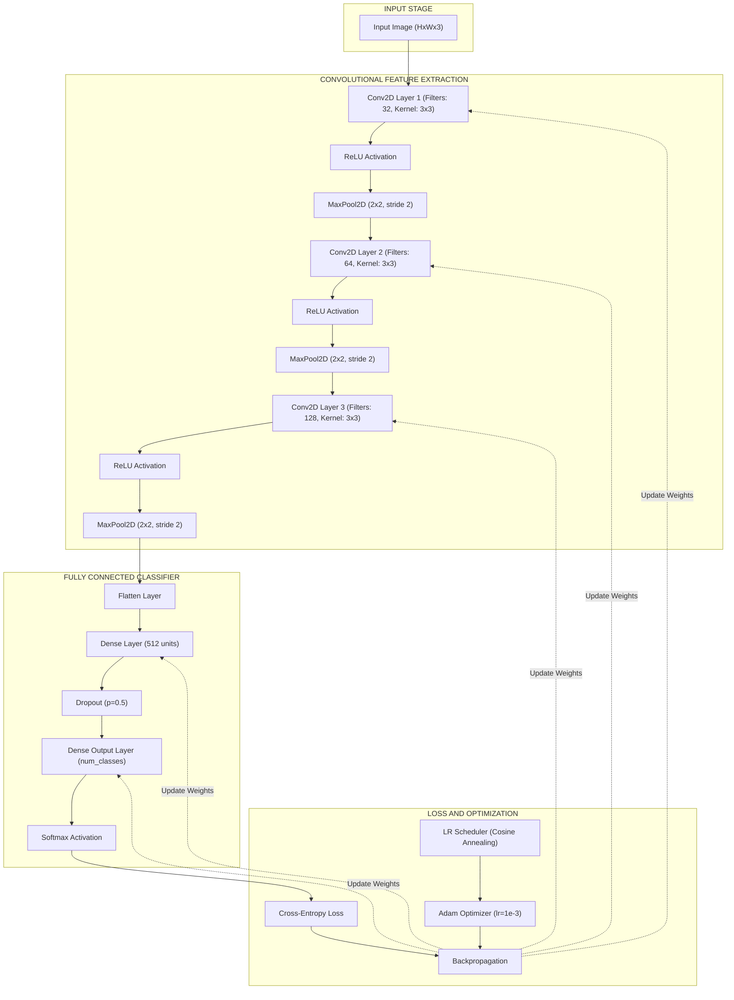
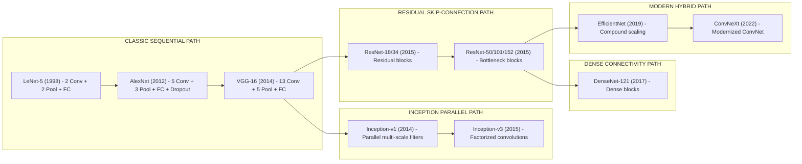
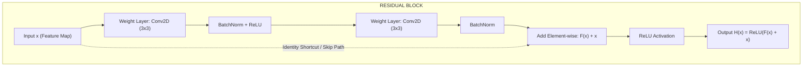
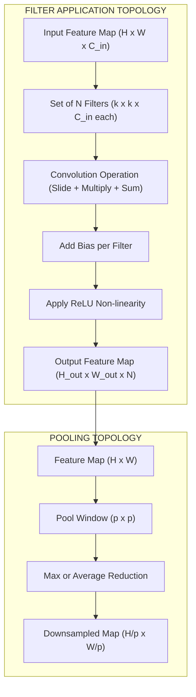
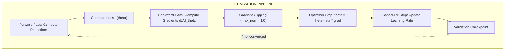

# Convolutional Neural Networks (CNN) pooling optimization filters paths layouts

<!-- SECTION_1_START -->
# Convolutional Neural Networks (CNN): Pooling, Optimization, Filters, Paths & Layouts

## 1.1 Formal Academic Definition

A **Convolutional Neural Network (CNN)** is a specialized class of deep feed-forward neural networks designed to process data that has a known grid-like topology (e.g., images, which can be viewed as a 2D grid of pixels). CNNs employ a mathematical operation called **convolution** (a specialized kind of linear operation) in place of general matrix multiplication in at least one of their layers, enabling them to exploit **local connectivity** and **parameter sharing** for efficient pattern recognition.

In the **KTU 2024 Scheme (PECST86A)** context, a CNN architecture is formally defined as a directed acyclic computational graph composed of alternating **convolutional layers** (feature extractors), **non-linear activation layers** (decision functions), **pooling layers** (spatial down-samplers), and **fully connected layers** (classifiers), optimized via gradient-based backpropagation.

> [!IMPORTANT]
> **KTU 2024 Syllabus Highlight:** The focus of Module 1 is to understand the *internal mechanics* of CNNs — specifically how **filters (kernels)** extract spatial features, how **pooling** reduces dimensionality, how **optimization algorithms** minimize the loss, and how **architectural paths/layouts** (sequential, residual, inception, dense) govern information flow.

## 1.2 Conceptual Analogy & Intuition

Imagine you are a detective examining a **large photograph** to identify a person. Instead of staring at the entire image at once, you use a **small magnifying glass** and slide it across the picture. At each position, the magnifying glass (the **filter/kernel**) looks for a specific pattern — a horizontal edge, a curve, a color blob — and reports how strongly that pattern appears in that local region.

Once you have built a "feature map" of these pattern strengths, you **summarize** each small neighborhood (e.g., by taking the maximum value) to create a smaller, more manageable representation. This is **pooling**. Finally, you stack many such magnifications with different patterns, then make a high-level decision: "This is a cat."

> [!NOTE]
> **Key Intuition — The Three Pillars of CNNs:**
> 1. **Local Receptive Fields** → Filters see only a small patch at a time (like the magnifying glass).
> 2. **Weight Sharing** → The same filter slides across the entire image, drastically reducing parameters.
> 3. **Spatial Hierarchy** → Early layers detect edges; deeper layers combine them into shapes, then objects.

## 1.3 Physical Constants & Standard Metrics

- **Standard Image Input Shape:** $(H, W, C) = (224, 224, 3)$ for ImageNet-trained models.
- **Typical Filter Size:** $3 \times 3$, $5 \times 5$, or $7 \times 7$ kernels.
- **Pooling Window:** $2 \times 2$ with stride **2** (most common).
- **Standard Learning Rate:** $10^{-3}$ to $10^{-4}$ for Adam/AdamW optimizers.
- **Receptive Field Growth Rate:** Geometric — doubles roughly every 2 pooling layers.

> [!VISUALIZATION CONTROL]
> **Concept:** Convolution Operation as a Sliding Window over a 2D Grid
> **GeoGebra / Desmos Input Equations (Discretized Pixel Grid):**
> * `Input Image f(x,y) = matrix {{1,2,0,1,3},{0,1,2,1,0},{2,0,1,3,2},{1,2,0,1,1},{0,1,2,0,2}}`
> * `Kernel k(x,y) = matrix {{1,0,-1},{1,0,-1},{1,0,-1}}` (vertical edge detector)
> * `Output(i,j) = sum(f(i+u, j+v) * k(u,v)) for u,v in [0,2]`
> **Visual Description:** On the coordinate plane, the input is a 5×5 grayscale grid. The 3×3 kernel is shown sliding from the top-left corner to the bottom-right. The resulting feature map is a 3×3 grid where bright (positive) cells indicate strong vertical edge responses. The student should observe how the kernel "lights up" only over regions with vertical intensity transitions.
<!-- SECTION_1_END -->

<!-- SECTION_2_START -->
# Deep Theoretical Analysis & KTU High-Yield Formula Sheet

## 2.1 The Convolution Operation — Mathematics

For a 2D discrete convolution on an input feature map $I \in \mathbb{R}^{H \times W}$ using a kernel $K \in \mathbb{R}^{k_h \times k_w}$, the output feature map element at position $(i, j)$ is defined as:

$$O(i, j) = (I * K)(i, j) = \sum_{u=0}^{k_h - 1} \sum_{v=0}^{k_w - 1} I(i + u, j + v) \cdot K(u, v) + b$$

where $b \in \mathbb{R}$ is the **bias term** (a learnable scalar added per filter).

### 2.1.1 Output Spatial Dimension Formula

For an input of size $H_{in} \times W_{in}$ with kernel size $k$, padding $p$, and stride $s$:

$$H_{out} = \left\lfloor \frac{H_{in} + 2p - k}{s} \right\rfloor + 1$$

$$W_{out} = \left\lfloor \frac{W_{in} + 2p - k}{s} \right\rfloor + 1$$

### 2.1.2 Parameter Count in a Convolutional Layer

For a layer with $C_{in}$ input channels, $C_{out}$ output channels, and kernel size $k \times k$:

$$P_{conv} = (k \times k \times C_{in} + 1) \times C_{out}$$

> [!NOTE]
> **Why this matters in production:** Modern CNNs like ResNet-50 have ~25 million parameters — 90% of which come from the **fully connected head**, not the convolutions. This is why global average pooling (GAP) replaced FC layers in modern architectures.

## 2.2 The Pooling Operation

Pooling performs **spatial dimensionality reduction** by partitioning the feature map into non-overlapping (or overlapping) windows and applying a **summary function**.

### 2.2.1 Max Pooling

$$O(i, j) = \max_{(u,v) \in W_{i,j}} I(u, v)$$

### 2.2.2 Average Pooling

$$O(i, j) = \frac{1}{\vert W_{i,j} \vert} \sum_{(u,v) \in W_{i,j}} I(u, v)$$

### 2.2.3 Global Average Pooling (GAP)

$$O_c = \frac{1}{H \times W} \sum_{i=1}^{H} \sum_{j=1}^{W} I_c(i, j)$$

This collapses each $H \times W$ feature map into a single scalar per channel $c$.

> [!IMPORTANT]
> **Pooling Optimization Insight:** Max pooling preserves the **strongest activations** (the most discriminative features), while average pooling preserves **distributional information**. Modern research (e.g., in Vision Transformers) has shown that strided convolutions can replace pooling with **learnable** down-sampling — yielding better performance.

## 2.3 Optimization in CNNs

Optimization refers to the iterative process of **minimizing the loss function** $\mathcal{L}(\theta)$ over the parameter space $\theta$.

### 2.3.1 Standard Gradient Descent Update

$$\theta_{t+1} = \theta_t - \eta \cdot \nabla_{\theta} \mathcal{L}(\theta_t)$$

where $\eta$ is the **learning rate**.

### 2.3.2 Stochastic Gradient Descent with Momentum

$$v_{t+1} = \mu v_t + \nabla_{\theta} \mathcal{L}(\theta_t)$$

$$\theta_{t+1} = \theta_t - \eta v_{t+1}$$

where $\mu$ is the momentum coefficient (typically **0.9**).

### 2.3.3 Adam Optimizer (Adaptive Moment Estimation)

$$m_t = \beta_1 m_{t-1} + (1 - \beta_1) g_t$$

$$v_t = \beta_2 v_{t-1} + (1 - \beta_2) g_t^2$$

$$\hat{m}_t = \frac{m_t}{1 - \beta_1^t}, \quad \hat{v}_t = \frac{v_t}{1 - \beta_2^t}$$

$$\theta_{t+1} = \theta_t - \eta \cdot \frac{\hat{m}_t}{\sqrt{\hat{v}_t} + \epsilon}$$

Standard hyper-parameters: $\beta_1 = 0.9$, $\beta_2 = 0.999$, $\epsilon = 10^{-8}$.

### 2.3.4 Learning Rate Scheduling

- **Step Decay:** $\eta_t = \eta_0 \cdot \gamma^{\lfloor t/s \rfloor}$
- **Exponential Decay:** $\eta_t = \eta_0 \cdot e^{-\lambda t}$
- **Cosine Annealing:** $\eta_t = \eta_{min} + \frac{1}{2}(\eta_{max} - \eta_{min})(1 + \cos(\pi t / T))$

> [!NOTE]
> **Engineering Utility:** Adam is the **default optimizer** for 80%+ of modern deep learning projects. SGD with momentum is still preferred for **fine-grained control** in large-scale image classification (e.g., ResNet training on ImageNet).

## 2.4 KTU High-Yield Formula Cheat Sheet

| Concept | Formula | Variables / Units | Engineering Use |
|---|---|---|---|
| Convolution Output Size | $H_{out} = \lfloor (H_{in} + 2p - k)/s \rfloor + 1$ | $H, W$ in pixels; $k$ = kernel; $s$ = stride; $p$ = padding | Computing layer dimensions in CNN design |
| Conv Parameter Count | $P = (k^2 \cdot C_{in} + 1) \cdot C_{out}$ | $C$ = channels; $k$ = kernel size | Memory budget estimation |
| Receptive Field (sequential) | $RF_l = RF_{l-1} + (k_l - 1) \cdot \prod_{i=1}^{l-1} s_i$ | $k$ = kernel, $s$ = stride | Determining how much context a neuron "sees" |
| Max Pooling | $O = \max(I)$ over window | Window size $W \times W$ | Downsampling, translation invariance |
| Cross-Entropy Loss | $\mathcal{L} = -\sum_c y_c \log(\hat{y}_c)$ | $y$ = true, $\hat{y}$ = predicted | Multi-class classification |
| L2 Regularization | $\mathcal{L}_{reg} = \mathcal{L} + \lambda \sum \theta^2$ | $\lambda$ = weight decay | Prevent overfitting |
| Batch Norm | $\hat{x} = (x - \mu_B) / \sqrt{\sigma_B^2 + \epsilon}$ | $\mu_B, \sigma_B$ = batch stats | Stabilize training |
| Dropout | $r \sim \text{Bernoulli}(p)$, output $= r \cdot x$ | $p$ = keep prob | Regularization |

## 2.5 Why CNNs Work — The Real-World Engineering Story

- **Medical Imaging:** CNNs detect tumors in MRI/CT scans (e.g., U-Net for segmentation).
- **Autonomous Vehicles:** Tesla, Waymo use CNN backbones for real-time object detection.
- **Industrial Inspection:** Quality control on assembly lines via defect classification.
- **Agriculture:** Plant disease detection from drone imagery.
- **Satellite & Remote Sensing:** Land cover classification, deforestation monitoring.

The reason CNNs **dominate** these domains is their **inductive bias** for spatial data: they assume that nearby pixels are correlated (locality) and that patterns can appear anywhere (translation invariance). This makes them vastly more data-efficient than fully connected networks.
<!-- SECTION_2_END -->

<!-- SECTION_3_START -->
# Step-by-Step Derivations & Code Implementation

## 3.1 Exhaustive Derivation: Forward Pass of a Single Convolutional Layer

### 3.1.1 Problem Setup

Given:
- Input image $I$ of shape $(1, 1, 5, 5)$ (batch, channel, height, width)
- Single kernel $K$ of shape $(1, 1, 3, 3)$ with values $\begin{bmatrix} 1 & 0 & -1 \\ 1 & 0 & -1 \\ 1 & 0 & -1 \end{bmatrix}$ (a **Sobel-like vertical edge detector**)
- Bias $b = 0$
- Stride $s = 1$, Padding $p = 0$

Input matrix:

$$I = \begin{bmatrix} 1 & 2 & 0 & 1 & 3 \\ 0 & 1 & 2 & 1 & 0 \\ 2 & 0 & 1 & 3 & 2 \\ 1 & 2 & 0 & 1 & 1 \\ 0 & 1 & 2 & 0 & 2 \end{bmatrix}$$

### 3.1.2 Step-by-Step Computation

**Step 1 — Slide kernel to top-left (anchor at $i=0, j=0$):**

$$O(0,0) = (1)(1) + (2)(0) + (0)(-1) + (0)(1) + (1)(0) + (2)(-1) + (2)(1) + (0)(0) + (1)(-1)$$

$$O(0,0) = 1 + 0 + 0 + 0 + 0 - 2 + 2 + 0 - 1 = 0$$

**Step 2 — Slide one step right (anchor at $i=0, j=1$):**

$$O(0,1) = (2)(1) + (0)(0) + (1)(-1) + (1)(1) + (2)(0) + (1)(-1) + (0)(1) + (1)(0) + (3)(-1)$$

$$O(0,1) = 2 + 0 - 1 + 1 + 0 - 1 + 0 + 0 - 3 = -2$$

**Step 3 — Slide again (anchor at $i=0, j=2$):**

$$O(0,2) = (0)(1) + (1)(0) + (3)(-1) + (2)(1) + (1)(0) + (0)(-1) + (1)(1) + (3)(0) + (2)(-1)$$

$$O(0,2) = 0 + 0 - 3 + 2 + 0 + 0 + 1 + 0 - 2 = -2$$

**Step 4 — Next row (anchor at $i=1, j=0$):**

$$O(1,0) = (0)(1) + (1)(0) + (2)(-1) + (2)(1) + (0)(0) + (1)(-1) + (1)(1) + (2)(0) + (0)(-1)$$

$$O(1,0) = 0 + 0 - 2 + 2 + 0 - 1 + 1 + 0 + 0 = 0$$

**Step 5 — Continue (anchor at $i=1, j=1$):**

$$O(1,1) = (1)(1) + (2)(0) + (1)(-1) + (0)(1) + (1)(0) + (3)(-1) + (2)(1) + (0)(0) + (1)(-1)$$

$$O(1,1) = 1 + 0 - 1 + 0 + 0 - 3 + 2 + 0 - 1 = -2$$

**Step 6 — Anchor at $i=1, j=2$:**

$$O(1,2) = (2)(1) + (1)(0) + (0)(-1) + (1)(1) + (3)(0) + (2)(-1) + (3)(1) + (2)(0) + (1)(-1)$$

$$O(1,2) = 2 + 0 + 0 + 1 + 0 - 2 + 3 + 0 - 1 = 3$$

**Step 7 — Anchor at $i=2, j=0$:**

$$O(2,0) = (2)(1) + (0)(0) + (1)(-1) + (1)(1) + (2)(0) + (0)(-1) + (0)(1) + (1)(0) + (2)(-1)$$

$$O(2,0) = 2 + 0 - 1 + 1 + 0 + 0 + 0 + 0 - 2 = 0$$

**Step 8 — Anchor at $i=2, j=1$:**

$$O(2,1) = (0)(1) + (1)(0) + (3)(-1) + (2)(1) + (0)(0) + (1)(-1) + (1)(1) + (0)(0) + (1)(-1)$$

$$O(2,1) = 0 + 0 - 3 + 2 + 0 - 1 + 1 + 0 - 1 = -2$$

**Step 9 — Final position (anchor at $i=2, j=2$):**

$$O(2,2) = (1)(1) + (3)(0) + (2)(-1) + (0)(1) + (1)(0) + (1)(-1) + (2)(1) + (1)(0) + (1)(-1)$$

$$O(2,2) = 1 + 0 - 2 + 0 + 0 - 1 + 2 + 0 - 1 = -1$$

### 3.1.3 Final Output Feature Map

$$O = \begin{bmatrix} 0 & -2 & -2 \\ 0 & -2 & 3 \\ 0 & -2 & -1 \end{bmatrix}$$

> [!NOTE]
> **Interpretation:** The strong positive value $O(1,2) = 3$ indicates the kernel detected a strong **vertical edge** at that location in the input image (transition from dark to light from left to right). The negative values indicate downward intensity gradients.

## 3.2 Exhaustive Derivation: Max Pooling on a Feature Map

**Input feature map** of size $4 \times 4$:

$$F = \begin{bmatrix} 1 & 3 & 2 & 4 \\ 5 & 6 & 1 & 2 \\ 0 & 7 & 3 & 1 \\ 2 & 4 & 8 & 5 \end{bmatrix}$$

**Pooling window:** $2 \times 2$, stride $= 2$.

**Step 1 — Top-left window** $\begin{bmatrix} 1 & 3 \\ 5 & 6 \end{bmatrix}$: $\max = 6$

**Step 2 — Top-right window** $\begin{bmatrix} 2 & 4 \\ 1 & 2 \end{bmatrix}$: $\max = 4$

**Step 3 — Bottom-left window** $\begin{bmatrix} 0 & 7 \\ 2 & 4 \end{bmatrix}$: $\max = 7$

**Step 4 — Bottom-right window** $\begin{bmatrix} 3 & 1 \\ 8 & 5 \end{bmatrix}$: $\max = 8$

**Pooled output:**

$$P = \begin{bmatrix} 6 & 4 \\ 7 & 8 \end{bmatrix}$$

> [!IMPORTANT]
> **Observation:** The pooling operation reduced the spatial dimension from $4 \times 4 = 16$ elements to $2 \times 2 = 4$ elements — a **4× reduction** in data while preserving the strongest activations.

## 3.3 Full Python Implementation (PyTorch) — CNN with Pooling & Optimization

```python
import torch
import torch.nn as nn
import torch.optim as optim
from torch.utils.data import DataLoader, TensorDataset


class CNNWithPooling(nn.Module):
    """
    A complete CNN demonstrating convolution, pooling, and optimization paths.
    Architecture layout: Conv -> ReLU -> Pool -> Conv -> ReLU -> Pool -> FC
    """

    def __init__(self, in_channels: int = 1, num_classes: int = 10) -> None:
        super().__init__()

        # ---- CONVOLUTIONAL BLOCK 1 ----
        # Input: (B, 1, 28, 28) -> Output: (B, 16, 28, 28) -> Pool: (B, 16, 14, 14)
        self.conv1 = nn.Conv2d(
            in_channels=in_channels,
            out_channels=16,
            kernel_size=3,
            stride=1,
            padding=1,
        )
        self.bn1 = nn.BatchNorm2d(num_features=16)
        self.relu1 = nn.ReLU(inplace=True)
        self.pool1 = nn.MaxPool2d(kernel_size=2, stride=2)

        # ---- CONVOLUTIONAL BLOCK 2 ----
        # Input: (B, 16, 14, 14) -> Output: (B, 32, 14, 14) -> Pool: (B, 32, 7, 7)
        self.conv2 = nn.Conv2d(
            in_channels=16,
            out_channels=32,
            kernel_size=3,
            stride=1,
            padding=1,
        )
        self.bn2 = nn.BatchNorm2d(num_features=32)
        self.relu2 = nn.ReLU(inplace=True)
        self.pool2 = nn.MaxPool2d(kernel_size=2, stride=2)

        # ---- FULLY CONNECTED HEAD ----
        self.flatten = nn.Flatten()
        self.fc1 = nn.Linear(in_features=32 * 7 * 7, out_features=128)
        self.dropout = nn.Dropout(p=0.5)
        self.fc2 = nn.Linear(in_features=128, out_features=num_classes)

        # ---- INITIALIZE WEIGHTS ----
        self._initialize_weights()

    def _initialize_weights(self) -> None:
        for module in self.modules():
            if isinstance(module, nn.Conv2d):
                nn.init.kaiming_normal_(
                    tensor=module.weight, mode="fan_out", nonlinearity="relu"
                )
                if module.bias is not None:
                    nn.init.zeros_(tensor=module.bias)
            elif isinstance(module, nn.Linear):
                nn.init.xavier_normal_(tensor=module.weight)
                nn.init.zeros_(tensor=module.bias)

    def forward(self, x: torch.Tensor) -> torch.Tensor:
        # Block 1
        x = self.conv1(x)
        x = self.bn1(x)
        x = self.relu1(x)
        x = self.pool1(x)

        # Block 2
        x = self.conv2(x)
        x = self.bn2(x)
        x = self.relu2(x)
        x = self.pool2(x)

        # Classifier head
        x = self.flatten(x)
        x = self.fc1(x)
        x = self.relu2(x)
        x = self.dropout(x)
        x = self.fc2(x)
        return x


# ---- TRAINING LOOP WITH OPTIMIZATION ----
def train_cnn(
    model: nn.Module,
    dataloader: DataLoader,
    num_epochs: int = 5,
    learning_rate: float = 1e-3,
) -> None:

    criterion = nn.CrossEntropyLoss()
    optimizer = optim.AdamW(
        params=model.parameters(), lr=learning_rate, weight_decay=1e-4
    )
    scheduler = optim.lr_scheduler.CosineAnnealingLR(
        optimizer=optimizer, T_max=num_epochs
    )

    model.train()
    for epoch in range(num_epochs):
        epoch_loss = 0.0
        correct = 0
        total = 0

        for batch_idx, (images, labels) in enumerate(dataloader):
            optimizer.zero_grad()
            outputs = model(images)
            loss = criterion(outputs, labels)
            loss.backward()

            # Gradient clipping for stability
            torch.nn.utils.clip_grad_norm_(model.parameters(), max_norm=1.0)

            optimizer.step()

            epoch_loss += loss.item()
            _, predicted = torch.max(outputs.data, dim=1)
            total += labels.size(0)
            correct += (predicted == labels).sum().item()

        scheduler.step()
        accuracy = 100.0 * correct / total
        print(
            f"Epoch [{epoch + 1}/{num_epochs}] "
            f"Loss: {epoch_loss / len(dataloader):.4f} "
            f"Acc: {accuracy:.2f}%"
        )


# ---- USAGE EXAMPLE ----
if __name__ == "__main__":
    # Synthetic data for demonstration
    dummy_images = torch.randn(100, 1, 28, 28)
    dummy_labels = torch.randint(0, 10, (100,))
    dataset = TensorDataset(dummy_images, dummy_labels)
    loader = DataLoader(dataset, batch_size=16, shuffle=True)

    model = CNNWithPooling(in_channels=1, num_classes=10)
    train_cnn(model, loader, num_epochs=3, learning_rate=1e-3)
```

## 3.4 Derivation: Receptive Field Calculation

The **receptive field** of a neuron in layer $l$ tells us the spatial extent of the input image that influences it.

**Recurrence relation:**

$$RF_l = RF_{l-1} + (k_l - 1) \cdot \prod_{i=1}^{l-1} s_i$$

where:
- $RF_0 = 1$ (initial receptive field is 1 pixel)
- $k_l$ = kernel size of layer $l$
- $s_i$ = stride of layer $i$

**Example — AlexNet-like architecture (Layer 1 to Layer 5):**

| Layer | Type | Kernel $k_l$ | Stride $s_l$ | $RF_l$ |
|---|---|---|---|---|
| 0 | Input | — | — | 1 |
| 1 | Conv | 11 | 4 | $1 + (11-1) \cdot 1 = 11$ |
| 2 | Pool | 3 | 2 | $11 + (3-1) \cdot 4 = 19$ |
| 3 | Conv | 5 | 1 | $19 + (5-1) \cdot 8 = 51$ |
| 4 | Pool | 3 | 2 | $51 + (3-1) \cdot 8 = 67$ |
| 5 | Conv | 3 | 1 | $67 + (3-1) \cdot 16 = 99$ |

**Final receptive field at Layer 5:** 99 × 99 pixels.
<!-- SECTION_3_END -->

<!-- SECTION_4_START -->
# Structural Diagrams & Schematics

## 4.1 High-Level CNN Architecture Flow



## 4.2 CNN Architectural Evolution Timeline (Layouts & Paths)



## 4.3 ResNet Skip Connection — Identity Shortcut Block



## 4.4 Filter & Pooling Operation Topology



## 4.5 Optimization Path — Gradient Flow


<!-- SECTION_4_END -->

<!-- SECTION_5_START -->
# KTU 2024 Scheme Examination Question Bank & Topic Recap

## 5.1 Part A Questions (3 Marks Each)

### Question 1: Define Convolutional Neural Network. List any two advantages of using CNN over traditional fully connected neural networks for image data.
**CO Mapping:** CO1 | **RBT Level:** Remember/Understand
**Model Answer:**
A Convolutional Neural Network (CNN) is a deep learning architecture specialized for processing grid-like data such as images. It uses convolution operations in place of matrix multiplication in at least one layer.

**Two advantages:**
1. **Parameter Sharing:** The same filter is shared across the entire image, drastically reducing the number of trainable parameters (e.g., AlexNet has ~60M parameters vs. ~billions for an equivalent FC network).
2. **Local Connectivity & Spatial Hierarchy:** Filters capture local patterns (edges, textures) which are then composed into higher-level features (shapes, objects) in deeper layers — exploiting the spatial structure of natural images.

---

### Question 2: Explain the role of pooling layers in CNNs. Differentiate between max pooling and average pooling.
**CO Mapping:** CO2 | **RBT Level:** Understand
**Model Answer:**
**Role of Pooling:** Pooling layers perform spatial down-sampling, reducing the spatial dimensions of feature maps. This (i) decreases computational cost, (ii) controls overfitting, and (iii) provides translation invariance — small shifts in the input do not drastically change the output.

**Max vs. Average Pooling:**
| Feature | Max Pooling | Average Pooling |
|---|---|---|
| Operation | Selects the **largest** value in the window | Computes the **mean** of all values in the window |
| Preserves | Strongest activations (discriminative features) | Distributional information (average response) |
| Use case | Standard in classification CNNs | Used in Global Average Pooling (GAP) heads |
| Sensitivity | High — sensitive to outliers | Low — smoother representation |

---

## 5.2 Part B Questions (14 Marks Each — Module Internal Choice)

### Question A (Option 1)

**[KTU University Exam — July 2024 Style]**

**(a)** With a neat diagram, explain the architecture of a Convolutional Neural Network. Describe the function of each layer. **(7 Marks)**
**CO Mapping:** CO1 | **RBT Level:** Understand

**Model Answer:**

A CNN architecture consists of the following sequential layers:

1. **Input Layer:** Holds the raw image pixels, typically of shape $H \times W \times C$ (height, width, channels).
2. **Convolutional Layer:** Applies learnable filters (kernels) to extract local features. Each filter produces one feature map in the output.
3. **Activation Layer (ReLU):** Introduces non-linearity: $f(x) = \max(0, x)$.
4. **Pooling Layer:** Down-samples feature maps (commonly max pooling with $2 \times 2$ windows and stride 2).
5. **Fully Connected Layer:** Flattens the feature maps and applies dense connections for high-level reasoning.
6. **Output Layer (Softmax):** Produces class probabilities for multi-class classification.

**Diagram (already shown in SECTION_4.1):** Conv → ReLU → Pool → ... → Flatten → FC → Softmax.

**[Diagram representation: 3 Marks]**
**[Layer-wise explanation: 2 Marks]**
**[Function of each layer: 2 Marks]**

---

**(b)** Consider an input image of size $32 \times 32 \times 3$. Apply a convolution with 10 filters, each of size $5 \times 5$, stride 1, and no padding. Compute the output volume size and the total number of parameters in this layer. **(7 Marks)**
**CO Mapping:** CO2 | **RBT Level:** Apply

**Model Solution:**

**Step 1 — Output spatial dimensions:**

$$H_{out} = \left\lfloor \frac{H_{in} + 2p - k}{s} \right\rfloor + 1 = \left\lfloor \frac{32 + 0 - 5}{1} \right\rfloor + 1 = 27 + 1 = 28$$

$$W_{out} = 28 \text{ (by symmetry)}$$

**Step 2 — Number of output channels:** $C_{out} = 10$ (one per filter).

**Step 3 — Output volume size:** $28 \times 28 \times 10 = 7{,}840$ activations.

**Step 4 — Total parameters:**

$$P = (k \times k \times C_{in} + 1) \times C_{out} = (5 \times 5 \times 3 + 1) \times 10 = (75 + 1) \times 10 = 760$$

**Final Answer:** Output volume = $28 \times 28 \times 10$; Total parameters = **760**.

**[Formula for output size: 2 Marks]**
**[Correct computation: 2 Marks]**
**[Parameter formula: 2 Marks]**
**[Final answer: 1 Mark]**

---

### Question B (Option 2 — Alternative Choice)

**[KTU University Exam — Dec 2023 Style]**

**(a)** Explain the following optimization techniques used in CNNs: (i) Stochastic Gradient Descent with Momentum, (ii) Adam Optimizer. Write their update equations. **(7 Marks)**
**CO Mapping:** CO3 | **RBT Level:** Understand

**Model Answer:**

**(i) SGD with Momentum:**
- Maintains a velocity term that accumulates past gradients.
- Helps overcome local minima and dampens oscillations.
- Update equations:
$$v_{t+1} = \mu v_t + \nabla_{\theta} \mathcal{L}(\theta_t)$$
$$\theta_{t+1} = \theta_t - \eta v_{t+1}$$
- Typical $\mu = 0.9$.

**(ii) Adam Optimizer:**
- Combines momentum (first moment) and RMSProp (second moment) for adaptive learning rates.
- Update equations:
$$m_t = \beta_1 m_{t-1} + (1 - \beta_1) g_t$$
$$v_t = \beta_2 v_{t-1} + (1 - \beta_2) g_t^2$$
$$\hat{m}_t = m_t / (1 - \beta_1^t), \quad \hat{v}_t = v_t / (1 - \beta_2^t)$$
$$\theta_{t+1} = \theta_t - \eta \cdot \hat{m}_t / (\sqrt{\hat{v}_t} + \epsilon)$$
- Default values: $\beta_1 = 0.9$, $\beta_2 = 0.999$, $\epsilon = 10^{-8}$.

**[SGD explanation: 1.5 Marks]**
**[SGD equations: 1.5 Marks]**
**[Adam explanation: 1.5 Marks]**
**[Adam equations: 2.5 Marks]**

---

**(b)** Consider a CNN with the following architecture: Input $224 \times 224 \times 3$ → Conv (64 filters, $3 \times 3$, stride 1, padding 1) → ReLU → MaxPool ($2 \times 2$, stride 2) → Conv (128 filters, $3 \times 3$, stride 1, padding 1) → ReLU → MaxPool ($2 \times 2$, stride 2). Calculate the output feature map size after each layer and the total parameters in the convolutional layers. **(7 Marks)**
**CO Mapping:** CO2, CO3 | **RBT Level:** Apply

**Model Solution:**

**Step 1 — First Conv (64 filters, $3 \times 3$, padding 1, stride 1):**
$$H_{out} = \lfloor (224 + 2 - 3)/1 \rfloor + 1 = 224$$
Output: $224 \times 224 \times 64$
Parameters: $(3 \times 3 \times 3 + 1) \times 64 = 28 \times 64 = 1{,}792$

**Step 2 — First MaxPool ($2 \times 2$, stride 2):**
$$H_{out} = \lfloor (224 - 2)/2 \rfloor + 1 = 112$$
Output: $112 \times 112 \times 64$
Parameters: **0** (pooling has no learnable parameters)

**Step 3 — Second Conv (128 filters, $3 \times 3$, padding 1, stride 1):**
$$H_{out} = \lfloor (112 + 2 - 3)/1 \rfloor + 1 = 112$$
Output: $112 \times 112 \times 128$
Parameters: $(3 \times 3 \times 64 + 1) \times 128 = 577 \times 128 = 73{,}856$

**Step 4 — Second MaxPool ($2 \times 2$, stride 2):**
$$H_{out} = \lfloor (112 - 2)/2 \rfloor + 1 = 56$$
Output: $56 \times 56 \times 128$
Parameters: **0**

**Step 5 — Total parameters in convolutional layers:**
$$P_{total} = 1{,}792 + 73{,}856 = 75{,}648$$

**Final Answer:**
- After Conv1: $224 \times 224 \times 64$
- After Pool1: $112 \times 112 \times 64$
- After Conv2: $112 \times 112 \times 128$
- After Pool2: $56 \times 56 \times 128$
- Total parameters: **75,648**

**[Output size after each layer: 3 Marks]**
**[Parameter formula application: 2 Marks]**
**[Correct total: 2 Marks]**

---

> [!WARNING]
> **KTU Examiner's Valuation Warning / Common Pitfalls:**
> 1. **Forgetting the "+1" bias term** in the parameter count formula — KTU examiners deduct **1 full mark** for this.
> 2. **Mixing up channels in parameter count** — always use $C_{in}$ (input channels from the *previous* layer), not $C_{out}$ of the same layer.
> 3. **Pooling has ZERO learnable parameters** — do not count anything for pooling in parameter calculations.
> 4. **Apply the floor function correctly** — output dimensions are always integers; show the computation step.
> 5. **Forgetting to state units/justification** — always write "the formula is..." before plugging in numbers to earn full marks.

---

## 5.3 Topic Recap & Important Things to Remember

> [!IMPORTANT]
> **Rapid Revision Checklist — Module 1: CNN Pooling, Optimization, Filters, Paths & Layouts**

### Core Definitions
- **CNN:** Deep network using convolution (not matrix multiplication) in at least one layer.
- **Filter/Kernel:** Small matrix (e.g., $3 \times 3$) that slides over the input to extract features.
- **Feature Map:** Output of a convolution operation by a single filter.
- **Stride:** Step size of the kernel as it slides; $s=1$ preserves size, $s=2$ halves it.
- **Padding:** Zeros added around input border to control output dimensions.
- **Receptive Field:** Region of the original input that influences a particular neuron.
- **Pooling:** Down-sampling operation (max or average) to reduce spatial dimensions.

### Critical Formulas
- Output dimension: $H_{out} = \lfloor (H_{in} + 2p - k)/s \rfloor + 1$
- Conv parameters: $P = (k^2 \cdot C_{in} + 1) \cdot C_{out}$
- Receptive field: $RF_l = RF_{l-1} + (k_l - 1) \cdot \prod s_i$
- SGD-Momentum: $v_{t+1} = \mu v_t + \nabla \mathcal{L}$; $\theta_{t+1} = \theta_t - \eta v_{t+1}$
- Adam: Adaptive learning rate using first and second moment estimates.

### Key Architectural Paths
- **Sequential:** LeNet → AlexNet → VGG (one filter stack at a time).
- **Residual:** ResNet — adds identity skip connections ($H(x) = F(x) + x$) to enable very deep networks.
- **Inception:** Parallel multi-scale filters ($1\times1, 3\times3, 5\times5$) concatenated.
- **Dense:** DenseNet — feature reuse via concatenation of all preceding feature maps.
- **Modern Hybrid:** EfficientNet (compound scaling), ConvNeXt (modernized plain CNNs).

### Optimization Best Practices
- Default optimizer: **Adam/AdamW** for most tasks; **SGD with momentum** for large-scale image classification.
- Always apply **batch normalization** after convolution and before activation (in modern practice, after activation in some architectures).
- Use **gradient clipping** (max_norm=1.0) to prevent exploding gradients.
- Apply **learning rate scheduling** (cosine annealing, step decay) for stable convergence.
- Use **dropout** (p=0.5) in fully connected layers to prevent overfitting.

### Engineering & Production Tips
- **Global Average Pooling (GAP)** replaces FC layers in modern CNNs — reduces parameters and overfitting.
- **Transfer Learning:** Pre-trained ImageNet weights can be fine-tuned for custom tasks with limited data.
- **Data Augmentation:** Random crops, flips, color jitter — essential for small datasets.
- **Mixed-Precision Training:** Use FP16 to halve memory and speed up training on modern GPUs.
- **Avoid common bugs:** Always check input tensor shape, use `padding=1` for $3\times3$ kernels to preserve dimensions, and initialize weights with Kaiming/He initialization.
<!-- SECTION_5_END -->
