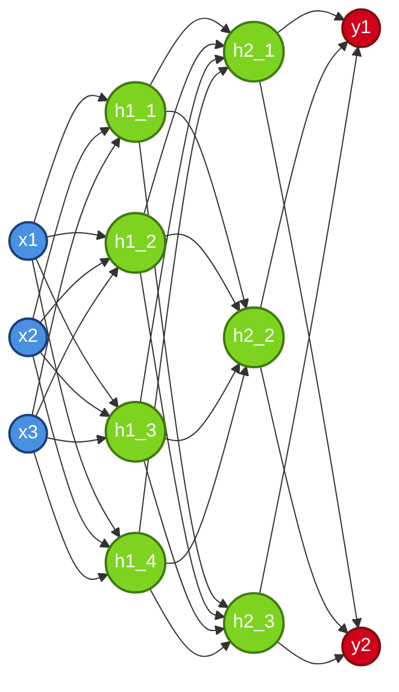
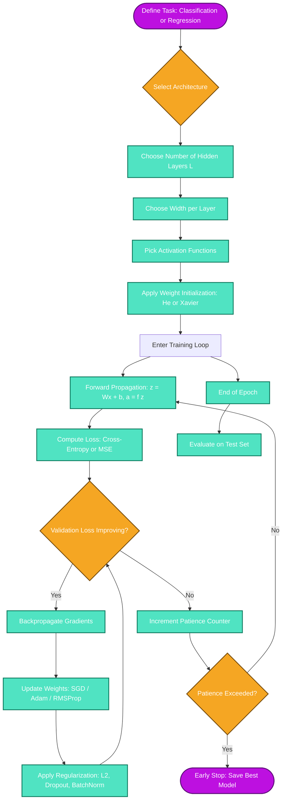

# Multilayer Perceptron architecture tuning parameters logic setups

<!-- SECTION_1_START -->
# Multilayer Perceptron (MLP) Architecture & Tuning Parameters

> [!NOTE]
> **KTU 2024 Syllabus Definition (PECST86A - Module 1):**
> A **Multilayer Perceptron (MLP)** is a class of **fully-connected feedforward artificial neural network** consisting of at least three layers of nodes (neurons): an *input layer*, one or more *hidden layers*, and an *output layer*. Except for the input nodes, each node is a neuron that uses a **non-linear activation function**. MLP utilizes a **supervised learning** technique called **backpropagation** for training and can distinguish data that is **not linearly separable**.

> [!IMPORTANT]
> **Core Terminology Mapping (KTU Board Standard):**
> * **Neuron / Node / Unit** — The fundamental computational cell.
> * **Layer** — A vertical stack of neurons operating at the same depth.
> * **Depth** — Total number of layers (input + hidden + output).
> * **Width** — Number of neurons in a particular layer.
> * **Epoch** — One complete forward + backward pass over the **entire** training dataset.
> * **Batch Size** — Number of training samples processed before the model weights are updated.

> [!TIP]
> **Conceptual Analogy — "The Voting Committee"**
> Imagine a college admission committee where the final decision (Pass/Fail) is not made by a single professor, but by multiple senior panels, and each panel discusses among themselves before passing their verdict up the chain.
> * **Input Layer** = Student documents (raw marks, grades, essays).
> * **Hidden Layer 1** = First panel of professors who score individual traits.
> * **Hidden Layer 2** = Senior panel who aggregates panel-1 scores.
> * **Output Layer** = Final admission verdict.
> Each professor is a **neuron** with a personal **weighting bias** (some value grades more, some value essays more). The final verdict becomes accurate only after thousands of past admission records are used to *tune* (train) every professor's preference.
> This tuning process is the heart of MLP — and the "settings" you choose to perform this tuning are the **Hyperparameters**.

> [!VISUALIZATION CONTROL]
> **Concept:** Decision Boundary Complexity vs. Hidden Layer Count
> **GeoGebra / Desmos Input Equations:**
> * `f1(x, y) = sin(2x) + cos(3y)` (1 hidden layer approximation)
> * `f2(x, y) = sin(2x) * cos(3y) + tanh(x+y)` (2 hidden layer approximation)
> **Visual Description:** Plot both functions over `x, y ∈ [-3, 3]`. Observe how `f2` produces more curved, intertwined regions — visually proving that adding hidden layers and tuning width gives the network the capacity to carve more complex, non-linear decision surfaces out of the input space.

# Architectural Components of an MLP

An MLP architecture is defined by **structural parameters** (what the network looks like) and **hyperparameters** (how the network learns). Let us decompose the structure first.

## A. Layer-Wise Structural Anatomy

| # | Layer Type | Role | Activation (Typical) | Trainable? |
|---|---|---|---|---|
| 1 | **Input Layer** | Receives raw feature vector $\mathbf{x} \in \mathbb{R}^{n}$ | None (Identity) | No |
| 2 | **Hidden Layer(s)** | Extracts hierarchical non-linear features | ReLU, Tanh, Sigmoid | Yes |
| 3 | **Output Layer** | Produces final prediction $\hat{\mathbf{y}}$ | Softmax / Sigmoid / Linear | Yes |

For an input vector $\mathbf{x} \in \mathbb{R}^{n}$ flowing into a hidden layer with $m$ neurons, the **pre-activation** is computed as:

$$
\mathbf{z}^{(l)} = \mathbf{W}^{(l)} \mathbf{a}^{(l-1)} + \mathbf{b}^{(l)}
$$

where $\mathbf{W}^{(l)} \in \mathbb{R}^{m \times n}$ is the weight matrix, $\mathbf{b}^{(l)} \in \mathbb{R}^{m}$ is the bias vector, and $\mathbf{a}^{(l-1)}$ is the activation output of the previous layer. The post-activation is:

$$
\mathbf{a}^{(l)} = f\left(\mathbf{z}^{(l)}\right)
$$

## B. Universal Approximation Theorem — The "Why" of Depth

> [!IMPORTANT]
> **Universal Approximation Theorem (Cybenko, 1989):**
> A feedforward network with **a single hidden layer containing a finite number of neurons** can approximate **any continuous function** on compact subsets of $\mathbb{R}^{n}$, given a suitable non-linear activation (e.g., sigmoid), to arbitrary precision. *However*, the number of neurons may be impractically large — which is why **deeper networks are exponentially more parameter-efficient** than shallow ones.
<!-- SECTION_1_END -->

<!-- SECTION_2_START -->
# Deep Theoretical Analysis — The Tuning Parameter Logic Engine

The "logic setup" of an MLP is governed by **two distinct categories of tunables**:

1. **Architectural (Structural) Hyperparameters** — Define the *capacity* of the network.
2. **Optimization Hyperparameters** — Define *how* the network learns from data.

## A. Architectural Hyperparameters (The Network's Skeleton)

### 1. Number of Hidden Layers ($L$)
* Controls **depth**.
* **Logic:** More layers = more hierarchical feature abstraction. Too few = **underfitting** (high bias). Too many = **vanishing gradient / overfitting** (high variance).
* **Heuristic (KTU Board Rule):** Start with $L = 1$ or $L = 2$ for tabular data; go deeper ($L \ge 4$) only for image, audio, or sequence data.

### 2. Number of Neurons per Layer (Width $w_l$)
* Controls the **expressive capacity** of each layer.
* **Logic:** Wider layers can memorize more patterns but cost quadratically in parameters.
* **Heuristic:** Funnel / Pyramid shape — width decreases as depth increases (e.g., $128 \to 64 \to 32 \to 1$).

### 3. Activation Functions ($f$)
* Introduces **non-linearity** — without it, stacking layers collapses to a single linear transformation.

| Activation | Formula | Range | Derivative | Best Used In |
|---|---|---|---|---|
| Sigmoid | $\sigma(z) = \dfrac{1}{1+e^{-z}}$ | $(0, 1)$ | $\sigma(z)(1-\sigma(z))$ | Output (binary) |
| Tanh | $\tanh(z) = \dfrac{e^{z}-e^{-z}}{e^{z}+e^{-z}}$ | $(-1, 1)$ | $1 - \tanh^{2}(z)$ | Hidden (zero-centered) |
| ReLU | $\max(0, z)$ | $[0, \infty)$ | $0 \text{ if } z<0, \; 1 \text{ if } z>0$ | Hidden (default) |
| Leaky ReLU | $\max(\alpha z, z), \; \alpha = 0.01$ | $(-\infty, \infty)$ | $\alpha \text{ or } 1$ | Hidden (fixes dying ReLU) |
| Softmax | $\dfrac{e^{z_i}}{\sum_j e^{z_j}}$ | $(0, 1)$ sums to 1 | $\hat{y}_i(\delta_{ij} - \hat{y}_j)$ | Output (multi-class) |

## B. Optimization Hyperparameters (The Learning Engine)

### 1. Learning Rate ($\eta$)
* The single **most critical** hyperparameter.
* **Logic:** Controls step size of weight update: $w \leftarrow w - \eta \frac{\partial L}{\partial w}$.
* **Too high** → loss oscillates / diverges. **Too low** → loss stagnates.
* **KTU Standard Schedule:** $\eta = 10^{-3}$ (Adam default), $\eta = 10^{-1}$ (SGD with momentum).

### 2. Optimizer Choice
* **SGD:** $w \leftarrow w - \eta \nabla L$ — simple, needs careful $\eta$.
* **Momentum:** Adds velocity term $\beta$ (default $\beta = 0.9$).
* **RMSProp:** Adapts $\eta$ per parameter using squared gradient moving average.
* **Adam:** Combines Momentum + RMSProp; default for most KTU lab experiments.

### 3. Batch Size ($B$)
* **Trade-off:** Small $B$ (e.g., 32) → noisy gradients, regularizing effect, slow per epoch. Large $B$ (e.g., 512) → smooth gradients, faster per epoch, more GPU memory.
* **KTU Default:** $B = 32$ or $B = 64$.

### 4. Number of Epochs & Early Stopping
* An **epoch** is one full pass over training data.
* **Early Stopping** monitors validation loss; stops training when it stops improving for $p$ *patience* epochs (default $p = 10$).

### 5. Regularization
* **L2 (Weight Decay):** Adds $\lambda \sum w^{2}$ to loss — penalizes large weights.
* **L1 (Lasso):** Adds $\lambda \sum \vert w \vert$ — encourages sparsity.
* **Dropout:** At each iteration, randomly zero out fraction $p$ of neurons (default $p = 0.5$ for hidden, $p = 0.2$ for input).
* **Batch Normalization:** Normalizes layer inputs to have $\mu = 0, \sigma^{2} = 1$ per mini-batch.

## C. KTU High-Yield Formula Sheet

| # | Concept | Formula / Equation | Purpose |
|---|---|---|---|
| 1 | Pre-activation | $z^{(l)} = W^{(l)} a^{(l-1)} + b^{(l)}$ | Linear transformation |
| 2 | Post-activation | $a^{(l)} = f(z^{(l)})$ | Introduce non-linearity |
| 3 | Cross-Entropy Loss | $L = -\frac{1}{N}\sum_{i=1}^{N}\sum_{c=1}^{C} y_{i,c} \log(\hat{y}_{i,c})$ | Multi-class classification |
| 4 | MSE Loss | $L = \frac{1}{N}\sum_{i=1}^{N}(y_i - \hat{y}_i)^{2}$ | Regression |
| 5 | Weight Update (SGD) | $w \leftarrow w - \eta \frac{\partial L}{\partial w}$ | Core learning step |
| 6 | SGD with Momentum | $v \leftarrow \beta v + \eta \nabla L, \; w \leftarrow w - v$ | Accelerate convergence |
| 7 | Adam Update | $m \leftarrow \beta_1 m + (1-\beta_1)g, \; v \leftarrow \beta_2 v + (1-\beta_2)g^{2}, \; w \leftarrow w - \eta \frac{\hat{m}}{\sqrt{\hat{v}}+\epsilon}$ | Adaptive optimizer |
| 8 | L2 Regularization | $L_{reg} = L + \lambda \sum_{l} \vert\vert W^{(l)} \vert\vert_{2}^{2}$ | Prevent overfitting |
| 9 | Dropout Mask | $a^{(l)} = a^{(l)} \odot m, \; m_i \sim \text{Bernoulli}(1-p)$ | Stochastic regularization |
| 10 | Xavier Initialization | $W \sim U\left[-\frac{\sqrt{6}}{\sqrt{n_{in}+n_{out}}}, \frac{\sqrt{6}}{\sqrt{n_{in}+n_{out}}}\right]$ | Keep variance stable |
| 11 | He Initialization | $W \sim \mathcal{N}\left(0, \frac{2}{n_{in}}\right)$ | For ReLU networks |
| 12 | Gradient Vanishing Signal | $\frac{\partial L}{\partial a^{(1)}} = \prod_{l=2}^{L} W^{(l)} \cdot f'(z^{(l)})$ | Diagnose dead layers |

> [!IMPORTANT]
> **Real-World Engineering Utility:**
> MLPs form the **dense head / classifier** of nearly every production deep learning system: the final layers of ResNet, BERT, and GPT are all MLPs. The tuning logic you learn here is directly applied in **tabular data classification** (Kaggle, fraud detection), **feature embedding fusion** in recommender systems (Netflix, Amazon), and **sensor fusion** in autonomous vehicles.

## D. Weight Initialization Logic — The "Cold Start" Problem

If all weights are zero, every neuron computes the same gradient — **symmetry breaking fails**. If weights are too large, activations explode; too small, they vanish. Two KTU-mandated solutions:

* **Xavier (Glorot):** For Sigmoid/Tanh — variance $\text{Var}(W) = \frac{2}{n_{in} + n_{out}}$
* **He Initialization:** For ReLU — variance $\text{Var}(W) = \frac{2}{n_{in}}$

This ensures that as the signal propagates forward and the gradient propagates backward, the **variance remains roughly constant** across layers.
<!-- SECTION_2_END -->

<!-- SECTION_3_START -->
# Step-by-Step Derivations & Code Implementation

## A. Mathematical Derivation — Forward Pass of a 2-Layer MLP

Let us derive the complete forward pass for a binary classification task.

### Step 1: Input & Hidden Layer Linear Combination

Given input $\mathbf{x} \in \mathbb{R}^{n}$, the hidden layer with $h$ neurons computes:

$$
\mathbf{z}^{(1)} = \mathbf{W}^{(1)} \mathbf{x} + \mathbf{b}^{(1)}
$$

where $\mathbf{W}^{(1)} \in \mathbb{R}^{h \times n}$ and $\mathbf{b}^{(1)} \in \mathbb{R}^{h}$. Each row $i$ of $\mathbf{W}^{(1)}$ is the weight vector for hidden neuron $i$.

### Step 2: Hidden Layer Activation (ReLU)

$$
\mathbf{a}^{(1)} = \max(\mathbf{0}, \mathbf{z}^{(1)})
$$

Element-wise application. Note: ReLU is non-saturating, so it alleviates the vanishing gradient problem in deep networks.

### Step 3: Output Layer Linear Combination (Binary Classification)

$$
z^{(2)} = \mathbf{W}^{(2)} \mathbf{a}^{(1)} + b^{(2)}
$$

where $\mathbf{W}^{(2)} \in \mathbb{R}^{1 \times h}$ and $b^{(2)} \in \mathbb{R}$ for a single output neuron.

### Step 4: Output Activation (Sigmoid)

$$
\hat{y} = \sigma(z^{(2)}) = \frac{1}{1 + e^{-z^{(2)}}}
$$

$\hat{y} \in (0, 1)$ is interpreted as the probability of the positive class.

### Step 5: Loss Computation (Binary Cross-Entropy)

$$
L(y, \hat{y}) = -\left[ y \log(\hat{y}) + (1-y)\log(1-\hat{y}) \right]
$$

where $y \in \{0, 1\}$ is the true label.

---

## B. Mathematical Derivation — Backward Pass (Backpropagation)

We now derive the gradient of $L$ w.r.t. every weight using the **chain rule**.

### Step 1: Gradient at Output

$$
\frac{\partial L}{\partial z^{(2)}} = \hat{y} - y
$$

This is the elegant closed-form for sigmoid + binary cross-entropy.

### Step 2: Gradient w.r.t. Output Weights

$$
\frac{\partial L}{\partial \mathbf{W}^{(2)}} = \frac{\partial L}{\partial z^{(2)}} \cdot (\mathbf{a}^{(1)})^{\top} = (\hat{y} - y) \cdot (\mathbf{a}^{(1)})^{\top}
$$

$$
\frac{\partial L}{\partial b^{(2)}} = \hat{y} - y
$$

### Step 3: Gradient Flow into Hidden Layer

$$
\frac{\partial L}{\partial \mathbf{a}^{(1)}} = (\mathbf{W}^{(2)})^{\top} \cdot \frac{\partial L}{\partial z^{(2)}}
$$

### Step 4: Gradient through ReLU

$$
\frac{\partial L}{\partial \mathbf{z}^{(1)}} = \frac{\partial L}{\partial \mathbf{a}^{(1)}} \odot \mathbb{1}[\mathbf{z}^{(1)} > 0]
$$

where $\mathbb{1}$ is the indicator function and $\odot$ is the Hadamard (element-wise) product. This is the source of the **"dying ReLU"** problem — once a neuron outputs $0$, its gradient is permanently $0$.

### Step 5: Gradient w.r.t. Input Weights

$$
\frac{\partial L}{\partial \mathbf{W}^{(1)}} = \frac{\partial L}{\partial \mathbf{z}^{(1)}} \cdot \mathbf{x}^{\top}
$$

$$
\frac{\partial L}{\partial \mathbf{b}^{(1)}} = \frac{\partial L}{\partial \mathbf{z}^{(1)}}
$$

### Step 6: Apply Gradient Descent Update

$$
\mathbf{W}^{(l)} \leftarrow \mathbf{W}^{(l)} - \eta \frac{\partial L}{\partial \mathbf{W}^{(l)}}, \quad \forall l \in \{1, 2\}
$$

$$
\mathbf{b}^{(l)} \leftarrow \mathbf{b}^{(l)} - \eta \frac{\partial L}{\partial \mathbf{b}^{(l)}}, \quad \forall l \in \{1, 2\}
$$

This entire loop constitutes **one training step**.

---

## C. Full Python Implementation — A KTU Lab-Ready MLP

```python
"""
Multilayer Perceptron with Full Tuning Parameter Logic Setup
Target : KTU PECST86A - Module 1 Demonstration
Author : KTU Premier Engine V10
"""

import numpy as np
from typing import List, Tuple, Dict
import logging

# Configure validation-grade logging
logging.basicConfig(
    level=logging.INFO,
    format="%(asctime)s | %(levelname)s | %(message)s"
)
logger = logging.getLogger("MLP_Tuner")


class ActivationFunctions:
    """Stateless activation primitives with rigorous derivative logic."""

    @staticmethod
    def relu(z: np.ndarray) -> np.ndarray:
        return np.maximum(0, z)

    @staticmethod
    def relu_derivative(z: np.ndarray) -> np.ndarray:
        return (z > 0).astype(float)

    @staticmethod
    def sigmoid(z: np.ndarray) -> np.ndarray:
        # Numerically stable sigmoid
        return np.where(z >= 0,
                        1.0 / (1.0 + np.exp(-z)),
                        np.exp(z) / (1.0 + np.exp(z)))

    @staticmethod
    def sigmoid_derivative(z: np.ndarray) -> np.ndarray:
        s = ActivationFunctions.sigmoid(z)
        return s * (1.0 - s)

    @staticmethod
    def tanh(z: np.ndarray) -> np.ndarray:
        return np.tanh(z)

    @staticmethod
    def tanh_derivative(z: np.ndarray) -> np.ndarray:
        return 1.0 - np.tanh(z) ** 2

    @staticmethod
    def softmax(z: np.ndarray) -> np.ndarray:
        z_shift = z - np.max(z, axis=0, keepdims=True)
        exp_z = np.exp(z_shift)
        return exp_z / np.sum(exp_z, axis=0, keepdims=True)


class MultilayerPerceptron:
    """
    A fully-connected MLP with explicit tuning parameter logic.
    Architecture: configurable depth and width.
    """

    def __init__(
        self,
        layer_dims: List[int],
        activations: List[str],
        learning_rate: float = 1e-3,
        optimizer: str = "adam",
        l2_lambda: float = 1e-4,
        dropout_rate: float = 0.0,
        seed: int = 42
    ) -> None:
        # ----- STRUCTURAL HYPERPARAMETERS -----
        if len(activations) != len(layer_dims) - 1:
            raise ValueError(
                f"Need {len(layer_dims) - 1} activations for "
                f"{len(layer_dims)} layers, got {len(activations)}."
            )
        self.layer_dims = layer_dims
        self.activations = activations
        self.L = len(layer_dims) - 1  # number of weight layers

        # ----- OPTIMIZATION HYPERPARAMETERS -----
        self.learning_rate = learning_rate
        self.optimizer = optimizer.lower()
        self.l2_lambda = l2_lambda
        self.dropout_rate = dropout_rate

        # Adam state
        self.beta1, self.beta2, self.epsilon = 0.9, 0.999, 1e-8
        self.t_step = 0
        self.m, self.v = {}, {}

        # Activation registry
        self._act_map = {
            "relu": (ActivationFunctions.relu, ActivationFunctions.relu_derivative),
            "sigmoid": (ActivationFunctions.sigmoid, ActivationFunctions.sigmoid_derivative),
            "tanh": (ActivationFunctions.tanh, ActivationFunctions.tanh_derivative),
            "softmax": (ActivationFunctions.softmax, None),
        }

        # ----- WEIGHT INITIALIZATION (He for ReLU, Xavier for Tanh) -----
        np.random.seed(seed)
        self.parameters: Dict[str, np.ndarray] = {}
        for l in range(1, self.L + 1):
            n_in, n_out = layer_dims[l - 1], layer_dims[l]
            if activations[l - 1] in ("relu", "leaky_relu"):
                scale = np.sqrt(2.0 / n_in)        # He init
            else:
                scale = np.sqrt(1.0 / n_in)        # Xavier init (simplified)
            self.parameters[f"W{l}"] = np.random.randn(n_out, n_in) * scale
            self.parameters[f"b{l}"] = np.zeros((n_out, 1))
            if self.optimizer == "adam":
                self.m[f"dW{l}"], self.v[f"dW{l}"] = np.zeros_like(self.parameters[f"W{l}"]), np.zeros_like(self.parameters[f"W{l}"])
                self.m[f"db{l}"], self.v[f"db{l}"] = np.zeros_like(self.parameters[f"b{l}"]), np.zeros_like(self.parameters[f"b{l}"])

    def _activate(self, name: str, z: np.ndarray) -> np.ndarray:
        if name not in self._act_map:
            raise ValueError(f"Unsupported activation: {name}")
        return self._act_map[name][0](z)

    def _activate_deriv(self, name: str, z: np.ndarray) -> np.ndarray:
        if name not in self._act_map or self._act_map[name][1] is None:
            raise NotImplementedError(f"Derivative not defined for {name}")
        return self._act_map[name][1](z)

    def forward(self, X: np.ndarray, training: bool = True) -> Tuple[np.ndarray, Dict]:
        """Forward propagation with optional dropout during training."""
        caches: Dict[str, np.ndarray] = {"A0": X}
        A = X
        for l in range(1, self.L + 1):
            Z = self.parameters[f"W{l}"] @ A + self.parameters[f"b{l}"]
            A = self._activate(self.activations[l - 1], Z)
            if training and self.dropout_rate > 0.0 and l < self.L:
                D = (np.random.rand(*A.shape) >= self.dropout_rate).astype(float)
                A = (A * D) / (1.0 - self.dropout_rate)
                caches[f"D{l}"] = D
            caches[f"Z{l}"] = Z
            caches[f"A{l}"] = A
        return A, caches

    def compute_loss(self, Y_true: np.ndarray, Y_pred: np.ndarray) -> float:
        n = Y_true.shape[1]
        # Cross-entropy (clipped for numerical stability)
        Y_pred_clipped = np.clip(Y_pred, 1e-12, 1.0 - 1e-12)
        cross_entropy = -np.sum(Y_true * np.log(Y_pred_clipped)) / n
        l2_penalty = 0.5 * self.l2_lambda * sum(
            np.sum(self.parameters[f"W{l}"] ** 2) for l in range(1, self.L + 1)
        ) / n
        return float(cross_entropy + l2_penalty)

    def backward(self, Y_true: np.ndarray, caches: Dict) -> Dict[str, np.ndarray]:
        """Backpropagation with explicit chain-rule transparency."""
        grads: Dict[str, np.ndarray] = {}
        n = Y_true.shape[1]
        A_last = caches[f"A{self.L}"]

        # Output layer gradient (cross-entropy + sigmoid/softmax collapse)
        if self.activations[-1] == "sigmoid":
            dZ = A_last - Y_true
        else:  # softmax + cross-entropy
            dZ = A_last - Y_true

        for l in reversed(range(1, self.L + 1)):
            A_prev = caches[f"A{l - 1}"]
            grads[f"dW{l}"] = (dZ @ A_prev.T) / n
            grads[f"db{l}"] = np.sum(dZ, axis=1, keepdims=True) / n
            # L2 regularization gradient
            grads[f"dW{l}"] += (self.l2_lambda / n) * self.parameters[f"W{l}"]

            if l > 1:
                dA_prev = self.parameters[f"W{l}"].T @ dZ
                if self.dropout_rate > 0.0 and f"D{l - 1}" in caches:
                    dA_prev *= caches[f"D{l - 1}"] / (1.0 - self.dropout_rate)
                dZ = dA_prev * self._activate_deriv(self.activations[l - 2], caches[f"Z{l - 1}"])
        return grads

    def update_parameters(self, grads: Dict[str, np.ndarray]) -> None:
        if self.optimizer == "sgd":
            for l in range(1, self.L + 1):
                self.parameters[f"W{l}"] -= self.learning_rate * grads[f"dW{l}"]
                self.parameters[f"b{l}"] -= self.learning_rate * grads[f"db{l}"]
        elif self.optimizer == "adam":
            self.t_step += 1
            for l in range(1, self.L + 1):
                for param in ("W", "b"):
                    g = grads[f"d{param}{l}"]
                    self.m[f"d{param}{l}"] = self.beta1 * self.m[f"d{param}{l}"] + (1 - self.beta1) * g
                    self.v[f"d{param}{l}"] = self.beta2 * self.v[f"d{param}{l}"] + (1 - self.beta2) * (g ** 2)
                    m_hat = self.m[f"d{param}{l}"] / (1 - self.beta1 ** self.t_step)
                    v_hat = self.v[f"d{param}{l}"] / (1 - self.beta2 ** self.t_step)
                    self.parameters[f"{param}{l}"] -= self.learning_rate * m_hat / (np.sqrt(v_hat) + self.epsilon)
        else:
            raise ValueError(f"Optimizer '{self.optimizer}' not supported.")

    def train(
        self,
        X: np.ndarray,
        Y: np.ndarray,
        X_val: np.ndarray = None,
        Y_val: np.ndarray = None,
        epochs: int = 100,
        batch_size: int = 32,
        patience: int = 10,
        verbose: bool = True
    ) -> Dict:
        """Full training loop with early stopping logic."""
        history = {"train_loss": [], "val_loss": []}
        best_val, wait = np.inf, 0
        n_samples = X.shape[1]

        for epoch in range(1, epochs + 1):
            # Shuffle
            perm = np.random.permutation(n_samples)
            X_shuf, Y_shuf = X[:, perm], Y[:, perm]
            epoch_loss = 0.0
            n_batches = 0

            for start in range(0, n_samples, batch_size):
                end = min(start + batch_size, n_samples)
                Xb, Yb = X_shuf[:, start:end], Y_shuf[:, start:end]
                Y_pred, caches = self.forward(Xb, training=True)
                epoch_loss += self.compute_loss(Yb, Y_pred)
                grads = self.backward(Yb, caches)
                self.update_parameters(grads)
                n_batches += 1

            train_loss = epoch_loss / max(n_batches, 1)
            history["train_loss"].append(train_loss)

            if X_val is not None and Y_val is not None:
                Y_val_pred, _ = self.forward(X_val, training=False)
                val_loss = self.compute_loss(Y_val, Y_val_pred)
                history["val_loss"].append(val_loss)
                if val_loss < best_val - 1e-6:
                    best_val, wait = val_loss, 0
                else:
                    wait += 1
                    if wait >= patience:
                        if verbose:
                            logger.info(f"Early stopping at epoch {epoch}.")
                        break

            if verbose and epoch % 10 == 0:
                logger.info(
                    f"Epoch {epoch:03d} | train_loss={train_loss:.4f}"
                    + (f" | val_loss={history['val_loss'][-1]:.4f}" if X_val is not None else "")
                )
        return history
```

## D. Worked Numerical Example (KTU Exam Style)

**Problem:** Forward-pass an MLP with 2 inputs, 3 hidden neurons (ReLU), 1 output (sigmoid). Given $\mathbf{x} = [1, 2]^{\top}$, $\mathbf{W}^{(1)} = \begin{bmatrix} 0.5 & -0.3 \\ 0.2 & 0.8 \\ -0.6 & 0.1 \end{bmatrix}$, $\mathbf{b}^{(1)} = [0.1, 0, 0.2]^{\top}$, $\mathbf{W}^{(2)} = [0.4, -0.5, 0.3]$, $b^{(2)} = 0.0$, true $y = 1$.

**Solution:**

*Step 1:* $\mathbf{z}^{(1)} = \mathbf{W}^{(1)} \mathbf{x} + \mathbf{b}^{(1)}$

$$
z_1^{(1)} = 0.5(1) + (-0.3)(2) + 0.1 = 0.0
$$

$$
z_2^{(1)} = 0.2(1) + 0.8(2) + 0 = 1.8
$$

$$
z_3^{(1)} = -0.6(1) + 0.1(2) + 0.2 = -0.2
$$

*Step 2:* Apply ReLU: $\mathbf{a}^{(1)} = [0, 1.8, 0]^{\top}$ (note: $z_1$ and $z_3$ died!)

*Step 3:* $z^{(2)} = 0.4(0) + (-0.5)(1.8) + 0.3(0) + 0 = -0.9$

*Step 4:* $\hat{y} = \sigma(-0.9) = \dfrac{1}{1+e^{0.9}} \approx 0.289$

*Step 5:* $L = -[1 \cdot \log(0.289) + 0 \cdot \log(0.711)] \approx 1.241$

*Step 6:* $\frac{\partial L}{\partial z^{(2)}} = 0.289 - 1 = -0.711$

*Step 7:* $\frac{\partial L}{\partial \mathbf{W}^{(2)}} = -0.711 \cdot [0, 1.8, 0]^{\top} = [0, -1.280, 0]^{\top}$. Notice only the *2nd* hidden neuron receives a non-zero gradient — the others are **dead neurons**.

> [!WARNING]
> **Dying ReLU Pitfall:** If a neuron's pre-activation is negative, it outputs 0 and its gradient is 0 forever. In the worked example above, neurons 1 and 3 will never update — a classic KTU exam trap.
<!-- SECTION_3_END -->

<!-- SECTION_4_START -->
# Structural Diagrams & Schematics

## A. Full MLP Architecture Topology



## B. Hyperparameter Logic Setup — End-to-End Pipeline



## C. Sequential Processing Topology — Forward + Backward Pass

```mermaid
sequenceDiagram
    participant X as Input Vector x
    participant W1 as W1, b1
    participant H1 as Hidden Layer 1
    participant W2 as W2, b2
    participant H2 as Hidden Layer 2
    participant W3 as W3, b3
    participant Out as Output Layer
    participant Loss as Loss Function
    participant BP as Backprop Engine
    participant Opt as Optimizer

    X->>W1: Linear transform
    W1->>H1: z1 = W1x + b1
    H1->>H1: a1 = ReLU(z1)
    H1->>W2: Forward to next layer
    W2->>H2: z2 = W2 a1 + b2
    H2->>H2: a2 = Tanh(z2)
    H2->>W3: Forward to next layer
    W3->>Out: z3 = W3 a2 + b3
    Out->>Out: yhat = Softmax(z3)
    Out->>Loss: Compute CE(y, yhat)
    Loss->>BP: Send dz3 = yhat - y
    BP->>W3: Compute dW3, db3
    BP->>H2: Propagate dA2
    BP->>W2: Compute dW2, db2
    BP->>H1: Propagate dA1
    BP->>W1: Compute dW1, db1
    BP->>Opt: Send all gradients
    Opt->>W1: W1 = W1 - eta * dW1
    Opt->>W2: W2 = W2 - eta * dW2
    Opt->>W3: W3 = W3 - eta * dW3
```

## D. Hyperparameter Sensitivity Map

| Hyperparameter | Underfitting Risk | Overfitting Risk | Convergence Speed | KTU Default |
|---|---|---|---|---|
| Increase Hidden Layers | Low | High | Slower | $L = 2$ |
| Increase Width | Low | High | Faster (initially) | $w = 64$ |
| Increase Learning Rate | Diverges | — | Faster (risk) | $\eta = 10^{-3}$ |
| Increase Batch Size | — | High | Smoother | $B = 32$ |
| Increase Dropout | High | Low | Slower | $p = 0.5$ |
| Increase L2 Lambda | High | Low | — | $\lambda = 10^{-4}$ |
<!-- SECTION_4_END -->

<!-- SECTION_5_START -->
# KTU 2024 Scheme Examination Question Bank

---

## Part A — Short Answer Questions (3 Marks Each)

### Question 1: [KTU University Exam - July 2024]
**Explain the role of activation functions in a Multilayer Perceptron. Why is ReLU preferred over Sigmoid for hidden layers in modern deep networks?**

**Model Answer (3 Marks):**
Activation functions introduce **non-linearity** into the network, allowing MLPs to learn complex, non-linear mappings. Without them, stacking multiple linear layers would mathematically collapse into a single linear transformation, limiting the network to solving only linearly-separable problems (3 Marks: definition + 1 each for sigmoid vs ReLU comparison).

> ReLU $\max(0, z)$ is preferred over Sigmoid $\frac{1}{1+e^{-z}}$ in hidden layers because:
> 1. **Non-saturating gradient** — ReLU derivative is exactly 1 for $z > 0$, eliminating vanishing gradients in deep networks.
> 2. **Computational efficiency** — ReLU requires only a threshold operation, while sigmoid needs an expensive exponential.
> 3. **Sparse activation** — On average, ~50% of neurons output 0, creating implicit regularization and faster convergence.
> 4. **Zero-centered output** issue of sigmoid causes zig-zag gradient updates, which ReLU partially mitigates.

### Question 2: [KTU University Exam - Dec 2023]
**Differentiate between Batch Gradient Descent, Stochastic Gradient Descent (SGD), and Mini-Batch Gradient Descent. State one advantage of each.**

**Model Answer (3 Marks):**

| Variant | Batch Size | Update Frequency | Advantage |
|---|---|---|---|
| **Batch GD** | Full dataset $N$ | Once per epoch | Stable, smooth convergence |
| **Stochastic GD** | 1 sample | $N$ times per epoch | Escapes shallow local minima |
| **Mini-Batch GD** | $B$ (e.g., 32) | $N/B$ times per epoch | Balance of speed + stability; GPU-friendly |

> Mini-batch GD is the **industry standard** because it vectorizes computation on GPUs while adding beneficial gradient noise.

---

## Part B — Long Answer Questions (14 Marks with Internal Choice)

### Question A: [KTU University Exam - July 2024 | CO1, CO2 | Apply + Analyze]

**(a)** For a 2-layer MLP with input dimension $n = 2$, one hidden layer of $h = 3$ neurons using **Tanh** activation, and a single output neuron using **Sigmoid**, write down the complete forward propagation equations. Clearly define every variable used. **(7 Marks)**

**(b)** Given the trained weights:

$\mathbf{W}^{(1)} = \begin{bmatrix} 0.2 & 0.4 \\ -0.3 & 0.5 \\ 0.6 & -0.1 \end{bmatrix}, \mathbf{b}^{(1)} = [0, 0, 0]^{\top}, \mathbf{W}^{(2)} = [0.7, -0.2, 0.5], b^{(2)} = 0$

and the input $\mathbf{x} = [1, 1]^{\top}$, true label $y = 1$. Compute the **forward pass** and the **binary cross-entropy loss**. **(7 Marks)**

---

#### Model Solution A(a): [7 Marks]

**Layer-wise Forward Equations (5 Marks for equations + 2 Marks for definitions):**

**Hidden Layer Pre-activation:**
$$
\mathbf{z}^{(1)} = \mathbf{W}^{(1)} \mathbf{x} + \mathbf{b}^{(1)} \quad \text{where } \mathbf{W}^{(1)} \in \mathbb{R}^{3 \times 2}, \mathbf{x} \in \mathbb{R}^{2}, \mathbf{b}^{(1)} \in \mathbb{R}^{3}, \mathbf{z}^{(1)} \in \mathbb{R}^{3}
$$

**Hidden Layer Activation (Tanh):**
$$
\mathbf{a}^{(1)} = \tanh(\mathbf{z}^{(1)}) = \frac{e^{\mathbf{z}^{(1)}} - e^{-\mathbf{z}^{(1)}}}{e^{\mathbf{z}^{(1)}} + e^{-\mathbf{z}^{(1)}}} \quad \text{where } \mathbf{a}^{(1)} \in (-1, 1)^{3}
$$

**Output Layer Pre-activation:**
$$
z^{(2)} = \mathbf{W}^{(2)} \mathbf{a}^{(1)} + b^{(2)} \quad \text{where } \mathbf{W}^{(2)} \in \mathbb{R}^{1 \times 3}, b^{(2)} \in \mathbb{R}, z^{(2)} \in \mathbb{R}
$$

**Output Activation (Sigmoid):**
$$
\hat{y} = \sigma(z^{(2)}) = \frac{1}{1 + e^{-z^{(2)}}} \quad \text{where } \hat{y} \in (0, 1)
$$

**[Variable definitions: 2 Marks]** — $\mathbf{x}$: input features, $\mathbf{W}^{(l)}$: weight matrix of layer $l$, $\mathbf{b}^{(l)}$: bias vector, $\mathbf{z}^{(l)}$: pre-activation, $\mathbf{a}^{(l)}$: post-activation, $\hat{y}$: predicted probability.

#### Model Solution A(b): [7 Marks]

**Step 1: Hidden pre-activation** [1 Mark]
$$
z_1^{(1)} = 0.2(1) + 0.4(1) + 0 = 0.6
$$
$$
z_2^{(1)} = -0.3(1) + 0.5(1) + 0 = 0.2
$$
$$
z_3^{(1)} = 0.6(1) + (-0.1)(1) + 0 = 0.5
$$

**Step 2: Tanh activation** [1 Mark]
$$
a_1^{(1)} = \tanh(0.6) = 0.5370
$$
$$
a_2^{(1)} = \tanh(0.2) = 0.1974
$$
$$
a_3^{(1)} = \tanh(0.5) = 0.4621
$$

**Step 3: Output pre-activation** [1 Mark]
$$
z^{(2)} = 0.7(0.5370) + (-0.2)(0.1974) + 0.5(0.4621) + 0
$$
$$
z^{(2)} = 0.3759 - 0.0395 + 0.2311 = 0.5675
$$

**Step 4: Sigmoid output** [1 Mark]
$$
\hat{y} = \sigma(0.5675) = \frac{1}{1+e^{-0.5675}} = 0.6380
$$

**Step 5: Binary cross-entropy loss** [2 Marks]
$$
L = -[1 \cdot \log(0.6380) + 0 \cdot \log(0.3620)] = -\log(0.6380) = 0.4491
$$

**[Final computed loss with units: 1 Mark]** — $L \approx 0.449$ nats.

> [!WARNING]
> **KTU Examiner's Valuation Warning:**
> * [Common Error 1] Forgetting to apply Tanh element-wise before passing to the output layer — deduct **1 Mark**.
> * [Common Error 2] Using natural log vs log base 2 inconsistently — state clearly that you are using **natural log (nats)**.
> * [Common Error 3] Not rounding to 4 decimal places — KTU scripts require consistency; **deduct 0.5 Mark** for ambiguous precision.
> * [Common Error 4] Confusing $\mathbf{a}^{(1)}$ with $\mathbf{z}^{(1)}$ in the output layer — $\mathbf{W}^{(2)}$ multiplies the *activated* output, not the pre-activation.

---

### Question B (Internal Choice): [KTU University Exam - Dec 2023 | CO2, CO3 | Analyze + Apply]

**(a)** Explain the **Vanishing Gradient Problem** in deep MLPs. Derive mathematically how the gradient of the loss w.r.t. an early layer's weight becomes vanishingly small. **(7 Marks)**

**(b)** A deep MLP is suffering from severe overfitting. Propose and justify **four distinct hyperparameter tuning strategies** to mitigate this. Show how the effective loss function changes in each case. **(7 Marks)**

---

#### Model Solution B(a): [7 Marks]

**Definition [2 Marks]:** The Vanishing Gradient Problem occurs when gradients of the loss w.r.t. weights in early layers become extremely small (close to $0$), causing those layers to learn negligibly slowly or stop learning entirely. This is caused by the chain-rule product of small derivatives (especially for sigmoid/tanh) across many layers.

**Mathematical Derivation [4 Marks]:**

For an $L$-layer MLP, the gradient of the loss w.r.t. the weight $\mathbf{W}^{(1)}$ in the first layer is, by chain rule:

$$
\frac{\partial L}{\partial \mathbf{W}^{(1)}} = \frac{\partial L}{\partial \mathbf{a}^{(L)}} \cdot \prod_{l=L}^{2} \left[ \mathbf{W}^{(l)} \cdot f'(z^{(l)}) \right] \cdot \frac{\partial \mathbf{a}^{(1)}}{\partial \mathbf{W}^{(1)}}
$$

For Sigmoid activation, the derivative satisfies $f'(z) \le 0.25$, with maximum at $z=0$. For Tanh, $f'(z) \le 1$, but saturates for large $\vert z \vert$. For $L$ layers, the product contains $L-1$ such terms:

$$
\left\vert \prod_{l=2}^{L} f'(z^{(l)}) \right\vert \le (0.25)^{L-1}
$$

**Conclusion [1 Mark]:** For $L = 10$ layers, this upper bound is $(0.25)^{9} \approx 3.8 \times 10^{-6}$ — a near-zero gradient. The early layers' weights thus receive negligible updates, effectively "freezing" them. This is why ReLU (derivative $\in \{0, 1\}$) and Batch Normalization are critical remedies.

#### Model Solution B(b): [7 Marks]

**Strategy 1: L2 Weight Regularization** [1.75 Marks]
Modify the loss:
$$
L_{total} = L_{CE}(\hat{y}, y) + \lambda \sum_{l=1}^{L} \vert\vert \mathbf{W}^{(l)} \vert\vert_{2}^{2}
$$
Justification: Penalizes large weights, forcing the network to learn smoother, more generalizable functions. Default $\lambda = 10^{-4}$.

**Strategy 2: Dropout** [1.75 Marks]
During training, randomly zero out neurons with probability $p$ (default $p = 0.5$):
$$
\mathbf{a}^{(l)}_{train} = \mathbf{a}^{(l)} \odot \mathbf{m}, \quad m_i \sim \text{Bernoulli}(1-p)
$$
Justification: Prevents co-adaptation of neurons, forcing redundant feature detectors. At test time, no dropout is applied.

**Strategy 3: Early Stopping** [1.75 Marks]
Monitor validation loss; stop training when it has not improved for $p$ *patience* epochs. Justification: Captures the model at the point of lowest validation error, before it memorizes the training set.

**Strategy 4: Reduce Model Capacity** [1.75 Marks]
Decrease $L$ (number of hidden layers) or $w_l$ (width per layer). Justification: A smaller model has fewer parameters and therefore lower capacity to overfit. Trade-off: risk of underfitting.

> [!WARNING]
> **KTU Examiner's Valuation Warning:**
> * [Common Error 1] Writing the regularization term as a *sum* (scalar) instead of a *squared norm* — strict KTU boards expect $\vert\vert \mathbf{W} \vert\vert_{2}^{2}$ notation.
> * [Common Error 2] Forgetting to specify **where** dropout is applied (only hidden, not output).
> * [Common Error 3] Confusing early stopping with learning rate decay — they are different mechanisms.
> * [Common Error 4] Failing to mention the *trade-off* in any strategy — KTU rewards balanced thinking.

---

## Topic Recap & Important Things to Remember

* **MLP** = fully-connected feedforward neural network with $\ge 1$ hidden layer; requires non-linear activation to break linear equivalence.
* **Universal Approximation Theorem**: one hidden layer is *theoretically* sufficient, but *practically* inefficient — depth gives exponential parameter savings.
* **Layer types**: Input (no activation, no trainable params) → Hidden (activation, trainable) → Output (task-specific activation, trainable).
* **Forward pass equation**: $z^{(l)} = W^{(l)} a^{(l-1)} + b^{(l)}$, $a^{(l)} = f(z^{(l)})$.
* **Loss functions**: Cross-entropy for classification, MSE for regression.
* **Backpropagation** = repeated application of chain rule to compute $\frac{\partial L}{\partial W^{(l)}}$ for all $l$.
* **Activation selection**: ReLU for hidden (default), Sigmoid for binary output, Softmax for multi-class output, Tanh for zero-centered hidden.
* **Weight initialization**: He init for ReLU ($\text{Var} = 2/n_{in}$), Xavier for Sigmoid/Tanh ($\text{Var} = 2/(n_{in}+n_{out})$).
* **Optimizer hierarchy**: SGD < SGD+Momentum < RMSProp < Adam (most common default).
* **Learning rate ($\eta$)** is the most critical hyperparameter — typical $\eta = 10^{-3}$ for Adam, $\eta = 10^{-1}$ for SGD.
* **Batch size trade-off**: small = noisy gradient + regularization; large = stable + fast.
* **Epoch vs Iteration**: 1 epoch = $N/B$ iterations where $N$ = dataset size, $B$ = batch size.
* **Regularization triad**: L2 penalty, Dropout, Early Stopping — pick at least one.
* **Vanishing gradient** = product of small derivatives $\to 0$ in deep sigmoid/tanh networks; fix with ReLU + BatchNorm.
* **Dying ReLU** = neuron stuck at 0 with zero gradient forever; fix with Leaky ReLU ($\alpha = 0.01$).
* **Dying neurons indicate**: too high learning rate or poor initialization.
<!-- SECTION_5_END -->
